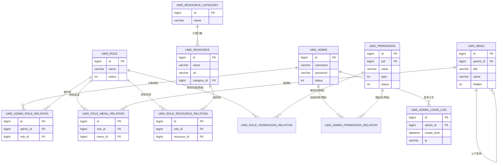
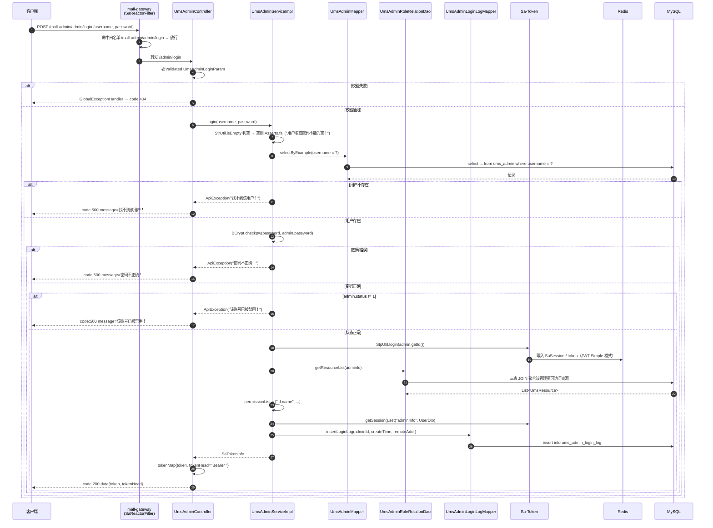
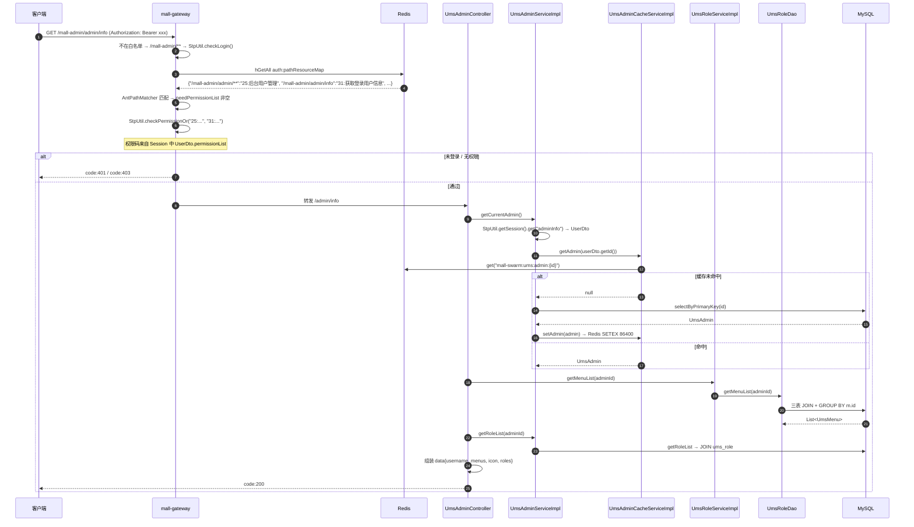
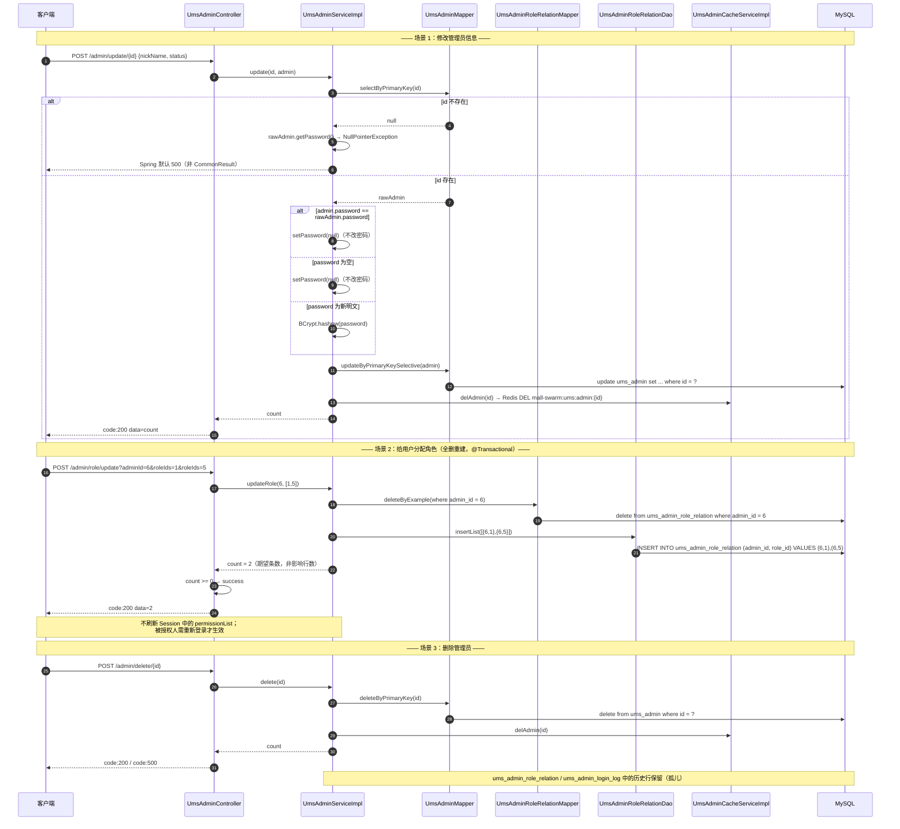
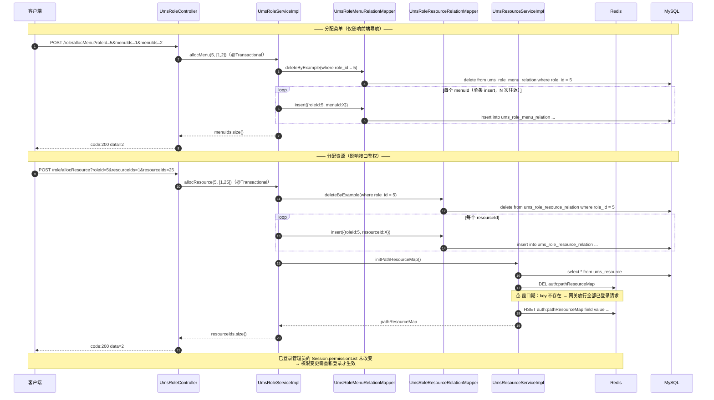
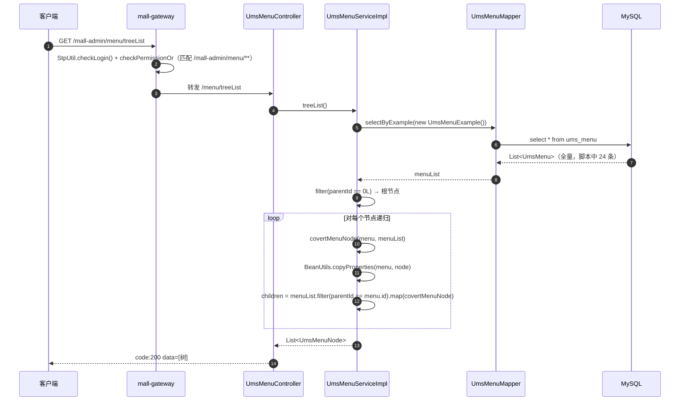
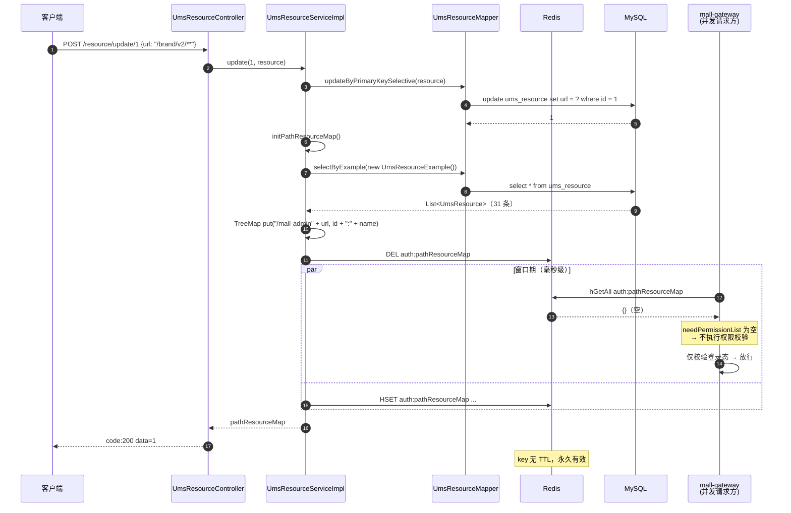
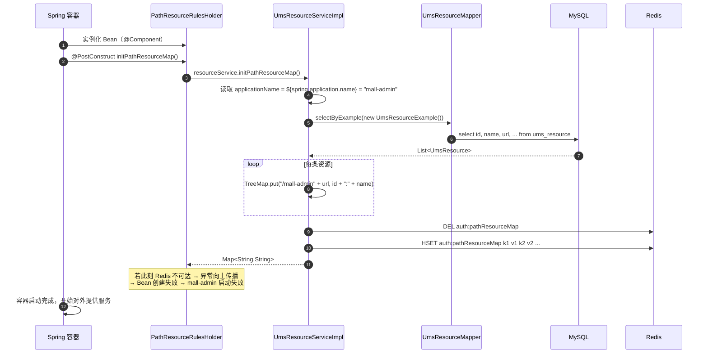
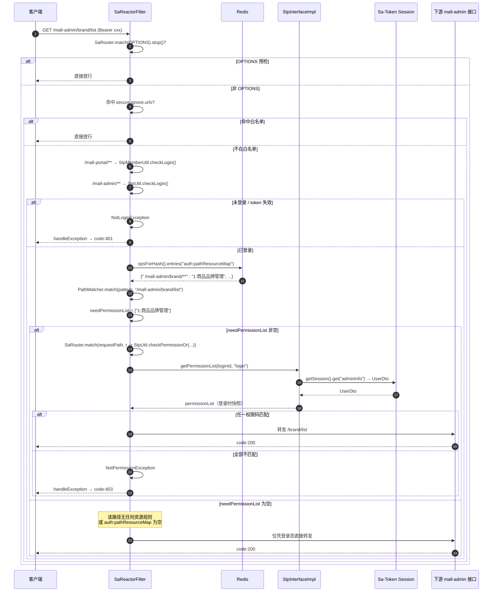

# 详细设计 · 会员与权限（后台）

| 项目 | 内容 |
| --- | --- |
| 文档编号 | DD-UMS-RBAC-001 |
| 所属业务域 | 用户与权限域（`ums`） |
| 涉及服务 | `mall-admin`（:8080）、`mall-gateway`（:8201）、`mall-common`（公共库）、`mall-mbg`（数据层生成） |
| 涉及数据表 | `ums_admin`、`ums_role`、`ums_menu`、`ums_resource`、`ums_resource_category`、`ums_permission`、`ums_admin_role_relation`、`ums_role_menu_relation`、`ums_role_resource_relation`、`ums_role_permission_relation`、`ums_admin_permission_relation`、`ums_admin_login_log`、`ums_member_level`（共 13 张） |
| 接口数量 | 41 个（全部属于 `mall-admin`） |
| 网关前缀 | `/mall-admin/**`（`StripPrefix=1` 后转发为 `/admin/**`、`/role/**`、`/menu/**`、`/resource/**`、`/resourceCategory/**`、`/memberLevel/**`） |
| 关键 Redis Key | `auth:pathResourceMap`（hash，常量 `AuthConstant.PATH_RESOURCE_MAP`）、`mall-swarm:ums:admin:{adminId}` |
| 文档状态 | 待评审 |

---

## 一、概述

### 1.1 范围

本文档描述「后台 RBAC 权限体系 + 会员等级」这一业务能力的详细设计，覆盖：

- **数据库设计**：13 张 `ums_*` 表的真实 DDL、字段说明、状态字典、RBAC 关系模型、索引与约束现状、设计问题与建议
- **接口设计**：41 个 REST 接口的请求参数、响应结构与数据模型
- **包设计**：`mall-admin` / `mall-gateway` / `mall-common` / `mall-mbg` 四模块的包结构与类职责
- **运行流程**：管理员登录签发令牌、管理员与角色维护、菜单树递归、**「后台维护资源 → Redis 缓存 → 网关鉴权」全链路**的时序与分支
- **日志设计**：日志框架、`WebLogAspect` 切面、本模块埋点、**登录/改密密码明文入日志的安全问题**
- **测试用例设计**：功能、边界、异常三类用例

不在本文档范围内：前台会员（`ums_member`）的注册、登录、积分与成长值（见《详细设计-会员中心-前台》）；`mall-auth` 服务的认证流程（见《详细设计-认证与远程调用》）。

### 1.2 术语

| 术语 | 含义 |
| --- | --- |
| RBAC | 基于角色的访问控制。本项目的链路是「管理员 → 角色 → 菜单 / 资源 / 权限」 |
| 管理员（Admin） | 后台用户，表 `ums_admin`，登录体系使用 Sa-Token 默认 login type（`StpUtil`） |
| 角色（Role） | 权限集合的载体，表 `ums_role` |
| 菜单（Menu） | 前端路由/导航节点，表 `ums_menu`，通过 `parent_id` 自关联构成无限级树 |
| 资源（Resource） | **接口级鉴权的最小单位**，表 `ums_resource`，其 `url` 是 Ant 风格路径模式（如 `/brand/**`） |
| 权限（Permission） | 表 `ums_permission`，区分目录 / 菜单 / 按钮三级。**当前后台无任何接口与业务代码读写该表及其关系表**，属预留模型 |
| 资源分类（ResourceCategory） | 资源的分组，表 `ums_resource_category` |
| 路径→资源权限映射 | `mall-admin` 启动及资源变更时，把 `"/" + spring.application.name + ums_resource.url` 作为 hash field、`"{resourceId}:{resourceName}"` 作为 hash value 写入 Redis hash `auth:pathResourceMap`；网关据此做接口级鉴权 |
| 权限码（permission code） | 形如 `"25:后台用户管理"` 的字符串，由资源 `id` 与 `name` 拼接，**不是** `ums_permission.value`（`pms:brand:read` 之类，已不再参与鉴权） |
| 会员等级（MemberLevel） | 表 `ums_member_level`，前台会员的等级与特权配置；本模块只提供只读查询接口 |
| 加减权限 | 需求 FR-UMS-10 要求在角色权限之外对单个管理员加减权限（`ums_admin_permission_relation.type`）。**当前未实现**，详见 2.7 ⑥ |

### 1.3 接口清单总览

| # | 方法 | 路径（服务内） | 网关路径 | 说明 | 控制器 |
| --- | --- | --- | --- | --- | --- |
| 1 | POST | `/admin/register` | `/mall-admin/admin/register` | 用户注册 | `UmsAdminController` |
| 2 | POST | `/admin/login` | `/mall-admin/admin/login` | 登录以后返回 token | `UmsAdminController` |
| 3 | GET | `/admin/info` | `/mall-admin/admin/info` | 获取当前登录用户信息 | `UmsAdminController` |
| 4 | POST | `/admin/logout` | `/mall-admin/admin/logout` | 登出功能 | `UmsAdminController` |
| 5 | GET | `/admin/list` | `/mall-admin/admin/list` | 根据用户名或姓名分页获取用户列表 | `UmsAdminController` |
| 6 | GET | `/admin/{id}` | `/mall-admin/admin/{id}` | 获取指定用户信息 | `UmsAdminController` |
| 7 | POST | `/admin/update/{id}` | `/mall-admin/admin/update/{id}` | 修改指定用户信息 | `UmsAdminController` |
| 8 | POST | `/admin/updatePassword` | `/mall-admin/admin/updatePassword` | 修改指定用户密码 | `UmsAdminController` |
| 9 | POST | `/admin/delete/{id}` | `/mall-admin/admin/delete/{id}` | 删除指定用户信息 | `UmsAdminController` |
| 10 | POST | `/admin/updateStatus/{id}` | `/mall-admin/admin/updateStatus/{id}` | 修改帐号状态 | `UmsAdminController` |
| 11 | POST | `/admin/role/update` | `/mall-admin/admin/role/update` | 给用户分配角色 | `UmsAdminController` |
| 12 | GET | `/admin/role/{adminId}` | `/mall-admin/admin/role/{adminId}` | 获取指定用户的角色 | `UmsAdminController` |
| 13 | POST | `/role/create` | `/mall-admin/role/create` | 添加角色 | `UmsRoleController` |
| 14 | POST | `/role/update/{id}` | `/mall-admin/role/update/{id}` | 修改角色 | `UmsRoleController` |
| 15 | POST | `/role/delete` | `/mall-admin/role/delete` | 批量删除角色 | `UmsRoleController` |
| 16 | GET | `/role/listAll` | `/mall-admin/role/listAll` | 获取所有角色 | `UmsRoleController` |
| 17 | GET | `/role/list` | `/mall-admin/role/list` | 根据角色名称分页获取角色列表 | `UmsRoleController` |
| 18 | POST | `/role/updateStatus/{id}` | `/mall-admin/role/updateStatus/{id}` | 修改角色状态 | `UmsRoleController` |
| 19 | GET | `/role/listMenu/{roleId}` | `/mall-admin/role/listMenu/{roleId}` | 获取角色相关菜单 | `UmsRoleController` |
| 20 | GET | `/role/listResource/{roleId}` | `/mall-admin/role/listResource/{roleId}` | 获取角色相关资源 | `UmsRoleController` |
| 21 | POST | `/role/allocMenu` | `/mall-admin/role/allocMenu` | 给角色分配菜单 | `UmsRoleController` |
| 22 | POST | `/role/allocResource` | `/mall-admin/role/allocResource` | 给角色分配资源 | `UmsRoleController` |
| 23 | POST | `/menu/create` | `/mall-admin/menu/create` | 添加后台菜单 | `UmsMenuController` |
| 24 | POST | `/menu/update/{id}` | `/mall-admin/menu/update/{id}` | 修改后台菜单 | `UmsMenuController` |
| 25 | GET | `/menu/{id}` | `/mall-admin/menu/{id}` | 根据 ID 获取菜单详情 | `UmsMenuController` |
| 26 | POST | `/menu/delete/{id}` | `/mall-admin/menu/delete/{id}` | 根据 ID 删除后台菜单 | `UmsMenuController` |
| 27 | GET | `/menu/list/{parentId}` | `/mall-admin/menu/list/{parentId}` | 分页查询后台菜单 | `UmsMenuController` |
| 28 | GET | `/menu/treeList` | `/mall-admin/menu/treeList` | 树形结构返回所有菜单列表 | `UmsMenuController` |
| 29 | POST | `/menu/updateHidden/{id}` | `/mall-admin/menu/updateHidden/{id}` | 修改菜单显示状态 | `UmsMenuController` |
| 30 | POST | `/resource/create` | `/mall-admin/resource/create` | 添加后台资源 | `UmsResourceController` |
| 31 | POST | `/resource/update/{id}` | `/mall-admin/resource/update/{id}` | 修改后台资源 | `UmsResourceController` |
| 32 | GET | `/resource/{id}` | `/mall-admin/resource/{id}` | 根据 ID 获取资源详情 | `UmsResourceController` |
| 33 | POST | `/resource/delete/{id}` | `/mall-admin/resource/delete/{id}` | 根据 ID 删除后台资源 | `UmsResourceController` |
| 34 | GET | `/resource/list` | `/mall-admin/resource/list` | 分页模糊查询后台资源 | `UmsResourceController` |
| 35 | GET | `/resource/listAll` | `/mall-admin/resource/listAll` | 查询所有后台资源 | `UmsResourceController` |
| 36 | GET | `/resource/initPathResourceMap` | `/mall-admin/resource/initPathResourceMap` | 初始化路径和资源的关联数据 | `UmsResourceController` |
| 37 | GET | `/resourceCategory/listAll` | `/mall-admin/resourceCategory/listAll` | 查询所有后台资源分类 | `UmsResourceCategoryController` |
| 38 | POST | `/resourceCategory/create` | `/mall-admin/resourceCategory/create` | 添加后台资源分类 | `UmsResourceCategoryController` |
| 39 | POST | `/resourceCategory/update/{id}` | `/mall-admin/resourceCategory/update/{id}` | 修改后台资源分类 | `UmsResourceCategoryController` |
| 40 | POST | `/resourceCategory/delete/{id}` | `/mall-admin/resourceCategory/delete/{id}` | 根据 ID 删除后台资源分类 | `UmsResourceCategoryController` |
| 41 | GET | `/memberLevel/list` | `/mall-admin/memberLevel/list` | 查询所有会员等级 | `UmsMemberLevelController` |

> **归属说明**：41 个端点全部由 `mall-admin` 提供。41 个路径在 `docs/openapi.yaml` 中**全部存在**（`/admin/*` 12 个、`/role/*` 10 个、`/menu/*` 7 个、`/resource/*` 7 个、`/resourceCategory/*` 4 个、`/memberLevel/*` 1 个），与代码一一对应，无遗漏、无多余。
>
> **鉴权**：网关白名单仅放行 `/mall-admin/admin/login`、`/mall-admin/admin/register`、`/mall-admin/minio/upload`（`mall-gateway/src/main/resources/application.yml` 的 `secure.ignore.urls`）。因此接口 1、2 **允许匿名访问**，其余 39 个端点都必须「已登录 + 持有该路径所需资源权限码」。

### 1.4 「后台维护资源 → Redis 缓存 → 网关鉴权」链路总览

这是本模块最核心的跨服务机制，后续第 2、5、6 章多处引用，先给出全貌：

```
┌─────────────────────────── mall-admin (:8080) ───────────────────────────┐
│  ums_resource (MySQL)                                                    │
│    url = '/brand/**'  name = '商品品牌管理'  id = 1                       │
│            │                                                             │
│            │ UmsResourceServiceImpl.initPathResourceMap()                │
│            │   key   = "/" + spring.application.name + url               │
│            │   value = id + ":" + name                                   │
│            ▼                                                             │
│  Redis hash  auth:pathResourceMap                                        │
│    "  /mall-admin/brand/**"  ->  "1:商品品牌管理"                         │
│    "  /mall-admin/admin/**"  ->  "25:后台用户管理"                        │
│    "  /mall-admin/admin/info"->  "31:获取登录用户信息"                     │
│                                                                          │
│  触发时机：PathResourceRulesHolder.@PostConstruct（启动时）                │
│           UmsResourceServiceImpl.create/update/delete（资源变更）          │
│           UmsRoleServiceImpl.delete / allocResource（角色授权变更）        │
└──────────────────────────────────────────────────────────────────────────┘
                                    │
                                    ▼
┌─────────────────────────── mall-gateway (:8201) ─────────────────────────┐
│  SaTokenConfig.getSaReactorFilter().setAuth(...)                         │
│   1. OPTIONS 预检 → 放行                                                  │
│   2. 命中 secure.ignore.urls → 放行                                        │
│   3. /mall-portal/** → StpMemberUtil.checkLogin()                        │
│   4. /mall-admin/**  → StpUtil.checkLogin()                              │
│   5. redisTemplate.opsForHash().entries("auth:pathResourceMap")           │
│      用 AntPathMatcher 逐条匹配 requestPath，收集 needPermissionList       │
│      needPermissionList 非空 → StpUtil.checkPermissionOr(...)             │
│                                        │                                 │
│              权限码来源：StpInterfaceImpl.getPermissionList()              │
│                → Sa-Token Session 中的 UserDto.permissionList             │
│                → 登录时由 UmsAdminServiceImpl.login() 写入                │
└──────────────────────────────────────────────────────────────────────────┘
```

> **要点**：`/mall-admin/admin/info` 同时命中 `auth:pathResourceMap` 中的 `/mall-admin/admin/**`（资源 25）与 `/mall-admin/admin/info`（资源 31），`needPermissionList` 会包含两个权限码，而网关用的是 `checkPermissionOr`（**满足任意一个即通过**）。

---

## 二、数据库设计

### 2.1 表清单

| 表名 | 类型 | 说明 | 本模块操作 |
| --- | --- | --- | --- |
| `ums_admin` | 主表 | 后台用户表（管理员） | 增、删、改、查、状态变更 |
| `ums_admin_login_log` | 日志表 | 后台用户登录日志表 | 登录时**写入**（仅 `admin_id` / `create_time` / `ip`） |
| `ums_role` | 主表 | 后台用户角色表 | 增、删、改、查 |
| `ums_menu` | 主表 | 后台菜单表（`parent_id` 自关联） | 增、删、改、查、树形查询 |
| `ums_resource` | 主表 | 后台资源表（**网关鉴权依据**） | 增、删、改、查；每次写操作后刷新 Redis |
| `ums_resource_category` | 主表 | 资源分类表 | 增、删、改、查 |
| `ums_permission` | 预留主表 | 后台用户权限表（目录/菜单/按钮） | **无任何接口读写**，仅 MBG 生成 Mapper/Model |
| `ums_admin_role_relation` | 关系表 | 后台用户和角色关系表 | 分配角色时**全删重建** |
| `ums_role_menu_relation` | 关系表 | 后台角色菜单关系表 | 角色分配菜单时**全删重建** |
| `ums_role_resource_relation` | 关系表 | 后台角色资源关系表 | 角色分配资源时**全删重建** |
| `ums_role_permission_relation` | 预留关系表 | 后台用户角色和权限关系表 | **无任何接口读写** |
| `ums_admin_permission_relation` | 预留关系表 | 用户与权限关系表（角色外的加减权限） | **无任何接口读写**，表内 0 行 |
| `ums_member_level` | 主表 | 会员等级表 | 只读（按 `default_status` 过滤） |

> **注意**：`ums_member`、`ums_member_login_log`、`ums_integration_change_history` 等其它 `ums_*` 表属前台会员域，不在本文档范围。

### 2.2 建表语句（现状）

以下 DDL 原文照抄自 `document/sql/mall.sql`。

```sql
DROP TABLE IF EXISTS `ums_admin`;
CREATE TABLE `ums_admin`  (
  `id` bigint(20) NOT NULL AUTO_INCREMENT,
  `username` varchar(64) CHARACTER SET utf8 COLLATE utf8_general_ci NULL DEFAULT NULL,
  `password` varchar(64) CHARACTER SET utf8 COLLATE utf8_general_ci NULL DEFAULT NULL,
  `icon` varchar(500) CHARACTER SET utf8 COLLATE utf8_general_ci NULL DEFAULT NULL COMMENT '头像',
  `email` varchar(100) CHARACTER SET utf8 COLLATE utf8_general_ci NULL DEFAULT NULL COMMENT '邮箱',
  `nick_name` varchar(200) CHARACTER SET utf8 COLLATE utf8_general_ci NULL DEFAULT NULL COMMENT '昵称',
  `note` varchar(500) CHARACTER SET utf8 COLLATE utf8_general_ci NULL DEFAULT NULL COMMENT '备注信息',
  `create_time` datetime NULL DEFAULT NULL COMMENT '创建时间',
  `login_time` datetime NULL DEFAULT NULL COMMENT '最后登录时间',
  `status` int(1) NULL DEFAULT 1 COMMENT '帐号启用状态：0->禁用；1->启用',
  PRIMARY KEY (`id`) USING BTREE
) ENGINE = InnoDB AUTO_INCREMENT = 11 CHARACTER SET = utf8 COLLATE = utf8_general_ci COMMENT = '后台用户表' ROW_FORMAT = DYNAMIC;
```

```sql
DROP TABLE IF EXISTS `ums_admin_login_log`;
CREATE TABLE `ums_admin_login_log`  (
  `id` bigint(20) NOT NULL AUTO_INCREMENT,
  `admin_id` bigint(20) NULL DEFAULT NULL,
  `create_time` datetime NULL DEFAULT NULL,
  `ip` varchar(64) CHARACTER SET utf8 COLLATE utf8_general_ci NULL DEFAULT NULL,
  `address` varchar(100) CHARACTER SET utf8 COLLATE utf8_general_ci NULL DEFAULT NULL,
  `user_agent` varchar(100) CHARACTER SET utf8 COLLATE utf8_general_ci NULL DEFAULT NULL COMMENT '浏览器登录类型',
  PRIMARY KEY (`id`) USING BTREE
) ENGINE = InnoDB AUTO_INCREMENT = 413 CHARACTER SET = utf8 COLLATE = utf8_general_ci COMMENT = '后台用户登录日志表' ROW_FORMAT = DYNAMIC;
```

```sql
DROP TABLE IF EXISTS `ums_admin_permission_relation`;
CREATE TABLE `ums_admin_permission_relation`  (
  `id` bigint(20) NOT NULL AUTO_INCREMENT,
  `admin_id` bigint(20) NULL DEFAULT NULL,
  `permission_id` bigint(20) NULL DEFAULT NULL,
  `type` int(1) NULL DEFAULT NULL,
  PRIMARY KEY (`id`) USING BTREE
) ENGINE = InnoDB AUTO_INCREMENT = 1 CHARACTER SET = utf8 COLLATE = utf8_general_ci COMMENT = '后台用户和权限关系表(除角色中定义的权限以外的加减权限)' ROW_FORMAT = DYNAMIC;
```

```sql
DROP TABLE IF EXISTS `ums_admin_role_relation`;
CREATE TABLE `ums_admin_role_relation`  (
  `id` bigint(20) NOT NULL AUTO_INCREMENT,
  `admin_id` bigint(20) NULL DEFAULT NULL,
  `role_id` bigint(20) NULL DEFAULT NULL,
  PRIMARY KEY (`id`) USING BTREE
) ENGINE = InnoDB AUTO_INCREMENT = 32 CHARACTER SET = utf8 COLLATE = utf8_general_ci COMMENT = '后台用户和角色关系表' ROW_FORMAT = DYNAMIC;
```

```sql
DROP TABLE IF EXISTS `ums_member_level`;
CREATE TABLE `ums_member_level`  (
  `id` bigint(20) NOT NULL AUTO_INCREMENT,
  `name` varchar(100) CHARACTER SET utf8 COLLATE utf8_general_ci NULL DEFAULT NULL,
  `growth_point` int(11) NULL DEFAULT NULL,
  `default_status` int(1) NULL DEFAULT NULL COMMENT '是否为默认等级：0->不是；1->是',
  `free_freight_point` decimal(10, 2) NULL DEFAULT NULL COMMENT '免运费标准',
  `comment_growth_point` int(11) NULL DEFAULT NULL COMMENT '每次评价获取的成长值',
  `priviledge_free_freight` int(1) NULL DEFAULT NULL COMMENT '是否有免邮特权',
  `priviledge_sign_in` int(1) NULL DEFAULT NULL COMMENT '是否有签到特权',
  `priviledge_comment` int(1) NULL DEFAULT NULL COMMENT '是否有评论获奖励特权',
  `priviledge_promotion` int(1) NULL DEFAULT NULL COMMENT '是否有专享活动特权',
  `priviledge_member_price` int(1) NULL DEFAULT NULL COMMENT '是否有会员价格特权',
  `priviledge_birthday` int(1) NULL DEFAULT NULL COMMENT '是否有生日特权',
  `note` varchar(200) CHARACTER SET utf8 COLLATE utf8_general_ci NULL DEFAULT NULL,
  PRIMARY KEY (`id`) USING BTREE
) ENGINE = InnoDB AUTO_INCREMENT = 5 CHARACTER SET = utf8 COLLATE = utf8_general_ci COMMENT = '会员等级表' ROW_FORMAT = DYNAMIC;
```

```sql
DROP TABLE IF EXISTS `ums_menu`;
CREATE TABLE `ums_menu`  (
  `id` bigint(20) NOT NULL AUTO_INCREMENT,
  `parent_id` bigint(20) NULL DEFAULT NULL COMMENT '父级ID',
  `create_time` datetime NULL DEFAULT NULL COMMENT '创建时间',
  `title` varchar(100) CHARACTER SET utf8 COLLATE utf8_general_ci NULL DEFAULT NULL COMMENT '菜单名称',
  `level` int(4) NULL DEFAULT NULL COMMENT '菜单级数',
  `sort` int(4) NULL DEFAULT NULL COMMENT '菜单排序',
  `name` varchar(100) CHARACTER SET utf8 COLLATE utf8_general_ci NULL DEFAULT NULL COMMENT '前端名称',
  `icon` varchar(200) CHARACTER SET utf8 COLLATE utf8_general_ci NULL DEFAULT NULL COMMENT '前端图标',
  `hidden` int(1) NULL DEFAULT NULL COMMENT '前端隐藏',
  PRIMARY KEY (`id`) USING BTREE
) ENGINE = InnoDB AUTO_INCREMENT = 26 CHARACTER SET = utf8 COLLATE = utf8_general_ci COMMENT = '后台菜单表' ROW_FORMAT = DYNAMIC;
```

```sql
DROP TABLE IF EXISTS `ums_permission`;
CREATE TABLE `ums_permission`  (
  `id` bigint(20) NOT NULL AUTO_INCREMENT,
  `pid` bigint(20) NULL DEFAULT NULL COMMENT '父级权限id',
  `name` varchar(100) CHARACTER SET utf8 COLLATE utf8_general_ci NULL DEFAULT NULL COMMENT '名称',
  `value` varchar(200) CHARACTER SET utf8 COLLATE utf8_general_ci NULL DEFAULT NULL COMMENT '权限值',
  `icon` varchar(500) CHARACTER SET utf8 COLLATE utf8_general_ci NULL DEFAULT NULL COMMENT '图标',
  `type` int(1) NULL DEFAULT NULL COMMENT '权限类型：0->目录；1->菜单；2->按钮（接口绑定权限）',
  `uri` varchar(200) CHARACTER SET utf8 COLLATE utf8_general_ci NULL DEFAULT NULL COMMENT '前端资源路径',
  `status` int(1) NULL DEFAULT NULL COMMENT '启用状态；0->禁用；1->启用',
  `create_time` datetime NULL DEFAULT NULL COMMENT '创建时间',
  `sort` int(11) NULL DEFAULT NULL COMMENT '排序',
  PRIMARY KEY (`id`) USING BTREE
) ENGINE = InnoDB AUTO_INCREMENT = 19 CHARACTER SET = utf8 COLLATE = utf8_general_ci COMMENT = '后台用户权限表' ROW_FORMAT = DYNAMIC;
```

```sql
DROP TABLE IF EXISTS `ums_resource`;
CREATE TABLE `ums_resource`  (
  `id` bigint(20) NOT NULL AUTO_INCREMENT,
  `create_time` datetime NULL DEFAULT NULL COMMENT '创建时间',
  `name` varchar(200) CHARACTER SET utf8 COLLATE utf8_general_ci NULL DEFAULT NULL COMMENT '资源名称',
  `url` varchar(200) CHARACTER SET utf8 COLLATE utf8_general_ci NULL DEFAULT NULL COMMENT '资源URL',
  `description` varchar(500) CHARACTER SET utf8 COLLATE utf8_general_ci NULL DEFAULT NULL COMMENT '描述',
  `category_id` bigint(20) NULL DEFAULT NULL COMMENT '资源分类ID',
  PRIMARY KEY (`id`) USING BTREE
) ENGINE = InnoDB AUTO_INCREMENT = 33 CHARACTER SET = utf8 COLLATE = utf8_general_ci COMMENT = '后台资源表' ROW_FORMAT = DYNAMIC;
```

```sql
DROP TABLE IF EXISTS `ums_resource_category`;
CREATE TABLE `ums_resource_category`  (
  `id` bigint(20) NOT NULL AUTO_INCREMENT,
  `create_time` datetime NULL DEFAULT NULL COMMENT '创建时间',
  `name` varchar(200) CHARACTER SET utf8 COLLATE utf8_general_ci NULL DEFAULT NULL COMMENT '分类名称',
  `sort` int(4) NULL DEFAULT NULL COMMENT '排序',
  PRIMARY KEY (`id`) USING BTREE
) ENGINE = InnoDB AUTO_INCREMENT = 8 CHARACTER SET = utf8 COLLATE = utf8_general_ci COMMENT = '资源分类表' ROW_FORMAT = DYNAMIC;
```

```sql
DROP TABLE IF EXISTS `ums_role`;
CREATE TABLE `ums_role`  (
  `id` bigint(20) NOT NULL AUTO_INCREMENT,
  `name` varchar(100) CHARACTER SET utf8 COLLATE utf8_general_ci NULL DEFAULT NULL COMMENT '名称',
  `description` varchar(500) CHARACTER SET utf8 COLLATE utf8_general_ci NULL DEFAULT NULL COMMENT '描述',
  `admin_count` int(11) NULL DEFAULT NULL COMMENT '后台用户数量',
  `create_time` datetime NULL DEFAULT NULL COMMENT '创建时间',
  `status` int(1) NULL DEFAULT 1 COMMENT '启用状态：0->禁用；1->启用',
  `sort` int(11) NULL DEFAULT 0,
  PRIMARY KEY (`id`) USING BTREE
) ENGINE = InnoDB AUTO_INCREMENT = 6 CHARACTER SET = utf8 COLLATE = utf8_general_ci COMMENT = '后台用户角色表' ROW_FORMAT = DYNAMIC;
```

```sql
DROP TABLE IF EXISTS `ums_role_menu_relation`;
CREATE TABLE `ums_role_menu_relation`  (
  `id` bigint(20) NOT NULL AUTO_INCREMENT,
  `role_id` bigint(20) NULL DEFAULT NULL COMMENT '角色ID',
  `menu_id` bigint(20) NULL DEFAULT NULL COMMENT '菜单ID',
  PRIMARY KEY (`id`) USING BTREE
) ENGINE = InnoDB AUTO_INCREMENT = 127 CHARACTER SET = utf8 COLLATE = utf8_general_ci COMMENT = '后台角色菜单关系表' ROW_FORMAT = DYNAMIC;
```

```sql
DROP TABLE IF EXISTS `ums_role_permission_relation`;
CREATE TABLE `ums_role_permission_relation`  (
  `id` bigint(20) NOT NULL AUTO_INCREMENT,
  `role_id` bigint(20) NULL DEFAULT NULL,
  `permission_id` bigint(20) NULL DEFAULT NULL,
  PRIMARY KEY (`id`) USING BTREE
) ENGINE = InnoDB AUTO_INCREMENT = 18 CHARACTER SET = utf8 COLLATE = utf8_general_ci COMMENT = '后台用户角色和权限关系表' ROW_FORMAT = DYNAMIC;
```

```sql
DROP TABLE IF EXISTS `ums_role_resource_relation`;
CREATE TABLE `ums_role_resource_relation`  (
  `id` bigint(20) NOT NULL AUTO_INCREMENT,
  `role_id` bigint(20) NULL DEFAULT NULL COMMENT '角色ID',
  `resource_id` bigint(20) NULL DEFAULT NULL COMMENT '资源ID',
  PRIMARY KEY (`id`) USING BTREE
) ENGINE = InnoDB AUTO_INCREMENT = 249 CHARACTER SET = utf8 COLLATE = utf8_general_ci COMMENT = '后台角色资源关系表' ROW_FORMAT = DYNAMIC;
```

### 2.3 字段说明

#### 2.3.1 `ums_admin` 后台用户表

| 字段 | 类型 | 允许空 | 默认值 | 中文名 | 说明 |
| --- | --- | --- | --- | --- | --- |
| `id` | bigint(20) | 否 | AUTO_INCREMENT | 主键 | 管理员唯一标识 |
| `username` | varchar(64) | 是 | NULL | 用户名 | 登录账号。**无唯一索引**，唯一性由 `UmsAdminServiceImpl.register()` 先查后插保证（非原子） |
| `password` | varchar(64) | 是 | NULL | 密码 | BCrypt 哈希（`cn.hutool.crypto.digest.BCrypt.hashpw`），长度 60 字符。**无 `@JsonIgnore`**，会被接口响应与访问日志带出，见 2.7 ⑦ |
| `icon` | varchar(500) | 是 | NULL | 头像 | 图片 URL |
| `email` | varchar(100) | 是 | NULL | 邮箱 | 注册时 `@Email` 校验（允许为空） |
| `nick_name` | varchar(200) | 是 | NULL | 昵称 | 列表关键字模糊匹配字段之一 |
| `note` | varchar(500) | 是 | NULL | 备注信息 | — |
| `create_time` | datetime | 是 | NULL | 创建时间 | 注册/新增时由应用层 `new Date()` 写入 |
| `login_time` | datetime | 是 | NULL | 最后登录时间 | **恒为 NULL**：`UmsAdminServiceImpl` 中 `updateLoginTimeByUsername` 方法存在但调用处被注释（`// updateLoginTimeByUsername(username);`），见 2.7 ⑧ |
| `status` | int(1) | 是 | 1 | 帐号启用状态 | 0 禁用 / 1 启用 |

#### 2.3.2 `ums_admin_login_log` 后台用户登录日志表

| 字段 | 类型 | 允许空 | 默认值 | 中文名 | 说明 |
| --- | --- | --- | --- | --- | --- |
| `id` | bigint(20) | 否 | AUTO_INCREMENT | 主键 | — |
| `admin_id` | bigint(20) | 是 | NULL | 管理员 ID | `insertLoginLog` 写入 |
| `create_time` | datetime | 是 | NULL | 创建时间 | `insertLoginLog` 写入 |
| `ip` | varchar(64) | 是 | NULL | 登录 IP | 取自 `request.getRemoteAddr()`；经网关转发后为网关地址而非真实客户端 IP |
| `address` | varchar(100) | 是 | NULL | 登录地址 | **从不写入**，恒为 NULL |
| `user_agent` | varchar(100) | 是 | NULL | 浏览器登录类型 | **从不写入**，恒为 NULL |

#### 2.3.3 `ums_role` 后台用户角色表

| 字段 | 类型 | 允许空 | 默认值 | 中文名 | 说明 |
| --- | --- | --- | --- | --- | --- |
| `id` | bigint(20) | 否 | AUTO_INCREMENT | 主键 | 角色唯一标识 |
| `name` | varchar(100) | 是 | NULL | 名称 | 角色名。`/admin/info` 返回的 `roles` 数组即该字段值 |
| `description` | varchar(500) | 是 | NULL | 描述 | — |
| `admin_count` | int(11) | 是 | NULL | 后台用户数量 | 创建时被强制置 0，**此后无任何代码维护**，恒为 0 |
| `create_time` | datetime | 是 | NULL | 创建时间 | 创建时 `new Date()` |
| `status` | int(1) | 是 | 1 | 启用状态 | 0 禁用 / 1 启用。**鉴权链路不读取该字段**，禁用角色不影响令牌权限 |
| `sort` | int(11) | 是 | 0 | 排序 | 创建时被强制置 0；列表查询**未使用**该字段排序 |

#### 2.3.4 `ums_menu` 后台菜单表

| 字段 | 类型 | 允许空 | 默认值 | 中文名 | 说明 |
| --- | --- | --- | --- | --- | --- |
| `id` | bigint(20) | 否 | AUTO_INCREMENT | 主键 | 菜单唯一标识 |
| `parent_id` | bigint(20) | 是 | NULL | 父级 ID | 自关联字段。`0` 表示一级菜单（`treeList` 以 `parentId == 0L` 为根） |
| `create_time` | datetime | 是 | NULL | 创建时间 | 创建时 `new Date()` |
| `title` | varchar(100) | 是 | NULL | 菜单名称 | 界面显示名，如「商品列表」 |
| `level` | int(4) | 是 | NULL | 菜单级数 | 由 `UmsMenuServiceImpl.updateLevel()` 按父菜单计算；父菜单 level 变更时**子菜单不级联更新** |
| `sort` | int(4) | 是 | NULL | 菜单排序 | `list(parentId)` 查询使用 `order by sort desc` |
| `name` | varchar(100) | 是 | NULL | 前端名称 | 前端路由 name，如 `product` |
| `icon` | varchar(200) | 是 | NULL | 前端图标 | — |
| `hidden` | int(1) | 是 | NULL | 前端隐藏 | 见 2.4 |

#### 2.3.5 `ums_resource` 后台资源表（**网关鉴权依据**）

| 字段 | 类型 | 允许空 | 默认值 | 中文名 | 说明 |
| --- | --- | --- | --- | --- | --- |
| `id` | bigint(20) | 否 | AUTO_INCREMENT | 主键 | 资源唯一标识，构成权限码前缀 |
| `create_time` | datetime | 是 | NULL | 创建时间 | `UmsResourceServiceImpl.create()` 中 `new Date()` |
| `name` | varchar(200) | 是 | NULL | 资源名称 | 构成权限码后缀，如 `商品品牌管理` |
| `url` | varchar(200) | 是 | NULL | 资源 URL | **Ant 风格路径模式**，相对服务内路径，必须以 `/` 开头（如 `/brand/**`）。与 `spring.application.name` 拼接后成为 Redis hash field |
| `description` | varchar(500) | 是 | NULL | 描述 | 脚本中资源 31/32 写有「用户登录必配」「用户登出必配」 |
| `category_id` | bigint(20) | 是 | NULL | 资源分类 ID | 逻辑外键 → `ums_resource_category.id`，**无索引、无外键约束** |

#### 2.3.6 `ums_resource_category` 资源分类表

| 字段 | 类型 | 允许空 | 默认值 | 中文名 | 说明 |
| --- | --- | --- | --- | --- | --- |
| `id` | bigint(20) | 否 | AUTO_INCREMENT | 主键 | — |
| `create_time` | datetime | 是 | NULL | 创建时间 | 创建时 `new Date()` |
| `name` | varchar(200) | 是 | NULL | 分类名称 | 脚本内置「商品模块/订单模块/营销模块/权限模块/内容模块/其他模块」 |
| `sort` | int(4) | 是 | NULL | 排序 | `listAll()` 使用 `order by sort desc` |

#### 2.3.7 `ums_permission` 后台用户权限表（**预留，无接口**）

| 字段 | 类型 | 允许空 | 默认值 | 中文名 | 说明 |
| --- | --- | --- | --- | --- | --- |
| `id` | bigint(20) | 否 | AUTO_INCREMENT | 主键 | — |
| `pid` | bigint(20) | 是 | NULL | 父级权限 id | 自关联，`0` 为顶级 |
| `name` | varchar(100) | 是 | NULL | 名称 | 如「商品列表」 |
| `value` | varchar(200) | 是 | NULL | 权限值 | 如 `pms:product:read`。**当前鉴权链路不使用该字段** |
| `icon` | varchar(500) | 是 | NULL | 图标 | 脚本中全部为 NULL |
| `type` | int(1) | 是 | NULL | 权限类型 | 0 目录 / 1 菜单 / 2 按钮（接口绑定权限） |
| `uri` | varchar(200) | 是 | NULL | 前端资源路径 | 如 `/pms/product/index` |
| `status` | int(1) | 是 | NULL | 启用状态 | 0 禁用 / 1 启用 |
| `create_time` | datetime | 是 | NULL | 创建时间 | — |
| `sort` | int(11) | 是 | NULL | 排序 | — |

#### 2.3.8 关系表字段说明

| 表 | 字段 | 类型 | 允许空 | 默认值 | 中文名 | 说明 |
| --- | --- | --- | --- | --- | --- | --- |
| `ums_admin_role_relation` | `id` | bigint(20) | 否 | AUTO_INCREMENT | 主键 | — |
| `ums_admin_role_relation` | `admin_id` | bigint(20) | 是 | NULL | 管理员 ID | → `ums_admin.id`，无索引 |
| `ums_admin_role_relation` | `role_id` | bigint(20) | 是 | NULL | 角色 ID | → `ums_role.id`，无索引 |
| `ums_role_menu_relation` | `id` | bigint(20) | 否 | AUTO_INCREMENT | 主键 | — |
| `ums_role_menu_relation` | `role_id` | bigint(20) | 是 | NULL | 角色 ID | → `ums_role.id`，无索引 |
| `ums_role_menu_relation` | `menu_id` | bigint(20) | 是 | NULL | 菜单 ID | → `ums_menu.id`，无索引 |
| `ums_role_resource_relation` | `id` | bigint(20) | 否 | AUTO_INCREMENT | 主键 | — |
| `ums_role_resource_relation` | `role_id` | bigint(20) | 是 | NULL | 角色 ID | → `ums_role.id`，无索引 |
| `ums_role_resource_relation` | `resource_id` | bigint(20) | 是 | NULL | 资源 ID | → `ums_resource.id`，无索引 |
| `ums_role_permission_relation` | `id` | bigint(20) | 否 | AUTO_INCREMENT | 主键 | — |
| `ums_role_permission_relation` | `role_id` | bigint(20) | 是 | NULL | 角色 ID | → `ums_role.id`，**无列注释** |
| `ums_role_permission_relation` | `permission_id` | bigint(20) | 是 | NULL | 权限 ID | → `ums_permission.id`，**无列注释** |
| `ums_admin_permission_relation` | `id` | bigint(20) | 否 | AUTO_INCREMENT | 主键 | — |
| `ums_admin_permission_relation` | `admin_id` | bigint(20) | 是 | NULL | 管理员 ID | → `ums_admin.id`，**无列注释** |
| `ums_admin_permission_relation` | `permission_id` | bigint(20) | 是 | NULL | 权限 ID | → `ums_permission.id`，**无列注释** |
| `ums_admin_permission_relation` | `type` | int(1) | 是 | NULL | 加/减权限类型 | **`mall.sql` 中无列注释**，见 2.4 说明 |

#### 2.3.9 `ums_member_level` 会员等级表

| 字段 | 类型 | 允许空 | 默认值 | 中文名 | 说明 |
| --- | --- | --- | --- | --- | --- |
| `id` | bigint(20) | 否 | AUTO_INCREMENT | 主键 | 等级唯一标识 |
| `name` | varchar(100) | 是 | NULL | 等级名称 | 脚本内置「黄金会员/白金会员/钻石会员/普通会员」 |
| `growth_point` | int(11) | 是 | NULL | 所需成长值 | 达到该成长值即升级 |
| `default_status` | int(1) | 是 | NULL | 是否为默认等级 | 0 不是 / 1 是。**唯一的查询过滤条件**（`/memberLevel/list?defaultStatus=`） |
| `free_freight_point` | decimal(10,2) | 是 | NULL | 免运费标准 | 订单金额达到该值免邮 |
| `comment_growth_point` | int(11) | 是 | NULL | 每次评价获取的成长值 | — |
| `priviledge_free_freight` | int(1) | 是 | NULL | 是否有免邮特权 | 0/1 |
| `priviledge_sign_in` | int(1) | 是 | NULL | 是否有签到特权 | 0/1 |
| `priviledge_comment` | int(1) | 是 | NULL | 是否有评论获奖励特权 | 0/1 |
| `priviledge_promotion` | int(1) | 是 | NULL | 是否有专享活动特权 | 0/1 |
| `priviledge_member_price` | int(1) | 是 | NULL | 是否有会员价格特权 | 0/1 |
| `priviledge_birthday` | int(1) | 是 | NULL | 是否有生日特权 | 0/1 |
| `note` | varchar(200) | 是 | NULL | 备注 | 脚本中全部为 NULL |

> **数量核对**：`ums_member_level` 中的特权字段共 **6 项**（`priviledge_free_freight`、`priviledge_sign_in`、`priviledge_comment`、`priviledge_promotion`、`priviledge_member_price`、`priviledge_birthday`）。`free_freight_point`（免运费标准）与 `comment_growth_point`（评价成长值）是数值阈值，**不属于布尔特权字段**。
>
> **注意**：`priviledge` 是源码中的拼写（正确拼写应为 `privilege`），字段名、Java 属性名（`priviledgeFreeFreight` 等）与接口 JSON 字段名均沿用小写 `priviledge`，**不可擅自更正**，否则会破坏前后端与数据库契约。

### 2.4 状态字典

| 字段 | 值 | 含义 | 来源 |
| --- | --- | --- | --- |
| `ums_admin.status` | 0 | 禁用 | `mall.sql` 列注释 |
| `ums_admin.status` | 1 | 启用 | `mall.sql` 列注释（默认值 1） |
| `ums_role.status` | 0 | 禁用 | `mall.sql` 列注释 |
| `ums_role.status` | 1 | 启用 | `mall.sql` 列注释（默认值 1） |
| `ums_permission.type` | 0 | 目录 | `mall.sql` 列注释 |
| `ums_permission.type` | 1 | 菜单 | `mall.sql` 列注释 |
| `ums_permission.type` | 2 | 按钮（接口绑定权限） | `mall.sql` 列注释 |
| `ums_permission.status` | 0 | 禁用 | `mall.sql` 列注释 |
| `ums_permission.status` | 1 | 启用 | `mall.sql` 列注释 |
| `ums_member_level.default_status` | 0 | 不是默认等级 | `mall.sql` 列注释 |
| `ums_member_level.default_status` | 1 | 是默认等级 | `mall.sql` 列注释 |
| `ums_menu.hidden` | 0 | 前端显示 | 列注释仅写「前端隐藏」未给字典；由脚本数据（全部菜单 `hidden = 0`）并结合 `UmsMenuController` 与前端菜单展示语义推断 |
| `ums_menu.hidden` | 1 | 前端隐藏 | 同上（`updateHidden` 写入该字段） |
| `ums_member_level.priviledge_*` | 0 | 无此特权 | 列注释仅写「是否有 XX 特权」未给字典；由脚本数据行推断 |
| `ums_member_level.priviledge_*` | 1 | 有此特权 | 同上 |

**关于 `ums_admin_permission_relation.type`（无列注释）**：

- `mall.sql` 中该列**没有 `COMMENT`**，仅有表注释「后台用户和权限关系表(除角色中定义的权限以外的加减权限)」。
- 检索全部 Java 源码：`UmsAdminPermissionRelation`、`UmsAdminPermissionRelationExample`、`UmsAdminPermissionRelationMapper` 仅存在于 `mall-mbg`（MBG 自动生成），**`mall-admin` 中无任何类引用**；`grep UmsAdminPermissionRelation` 在 `mall-admin` 与 `mall-portal` 下零命中。
- 因此该字段的取值含义**无法从代码中得到实证**。按表注释语义与同类实现惯例，可谨慎表述为：`1` 表示「加权限（额外授予）」、`-1`（或 `0`）表示「减权限（显式回收）」，但**这是推测，不是现状**。建议以需求方确认为准（见 8.2 待确认事项 1）。
- 该表脚本中 `AUTO_INCREMENT = 1` 且无数据行，即**从未使用过**。

### 2.5 RBAC 关系模型



**鉴权实际使用的分支（实线部分）**：

```
ums_admin ──► ums_admin_role_relation ──► ums_role
                                            │
                    ┌───────────────────────┴───────────────────────┐
                    ▼                                               ▼
        ums_role_menu_relation                          ums_role_resource_relation
                    │                                               │
                    ▼                                               ▼
                ums_menu                                       ums_resource
        （仅决定前端导航可见性）                       （决定接口级权限码 / Redis 映射）
```

**未被使用的分支（虚线部分）**：

- `ums_role_permission_relation` + `ums_permission`：用于「角色 → 权限」，**无接口**。
- `ums_admin_permission_relation` + `ums_permission`：用于「管理员个人加减权限」，**无接口**。

> **关键结论**：需求 FR-UMS-09 描述的完整 RBAC（管理员 → 角色 → 菜单 / 资源 / 权限）在实现中**只落地了「菜单」和「资源」两条**。`ums_permission` 相关的两条链路（FR-UMS-10 的加减权限、FR-UMS-11 的目录/菜单/按钮三级权限）在数据模型中存在、在 SQL 脚本中有初始数据，但**后台没有任何接口或业务代码可维护它们**。当前接口级鉴权完全依赖 `ums_resource`。

### 2.6 索引与约束现状

| 项目 | 现状 | 影响 |
| --- | --- | --- |
| 主键 | 13 张表均为 `PRIMARY KEY (id) USING BTREE` | 正常 |
| 唯一索引 | **13 张表全部没有**（含 `ums_admin.username`、`ums_role.name`、`ums_resource.url`） | 可建同名管理员、同名角色、重复资源 URL；并发注册可产生重名账号 |
| 普通索引 | **13 张表全部没有** | 所有关系表按外键列的查询/删除都是全表扫描 |
| 外键约束 | **全部没有** | 可删除仍被引用的主数据，产生孤儿关系行 |
| 非空约束 | **仅 `id`** | 其余字段均可为 NULL，业务约束全靠应用层 |
| 逻辑删除 | **无此字段** | 所有删除均为物理删除，不可恢复 |
| 字符集/排序规则 | 全部 `utf8 / utf8_general_ci` | 与全库一致 |
| 事务 | `@EnableTransactionManagement` 已开启（`mall-admin/config/MyBatisConfig.java`） | 但大部分多表写操作**未标注 `@Transactional`**，见 2.7 ③ |

**关系表缺少的索引（按实际查询模式）**：

| 表 | 高频 WHERE 列 | 现有索引 | 建议索引 |
| --- | --- | --- | --- |
| `ums_admin_role_relation` | `admin_id`、`role_id` | 无 | `idx_admin_id (admin_id)`、`idx_role_id (role_id)`，并建议 `UNIQUE (admin_id, role_id)` |
| `ums_role_menu_relation` | `role_id` | 无 | `idx_role_id (role_id)`，并建议 `UNIQUE (role_id, menu_id)` |
| `ums_role_resource_relation` | `role_id`、`resource_id` | 无 | `idx_role_id (role_id)`、`idx_resource_id (resource_id)`，并建议 `UNIQUE (role_id, resource_id)` |
| `ums_admin_login_log` | `admin_id` | 无 | `idx_admin_id (admin_id)` |
| `ums_resource` | `category_id`、`url` | 无 | `idx_category_id (category_id)`、`idx_url (url)` |
| `ums_menu` | `parent_id` | 无 | `idx_parent_id (parent_id)` |
| `ums_admin` | `username` | 无 | `UNIQUE (username)` |

> **`ums_admin_login_log` 的现状数据量**：脚本 `AUTO_INCREMENT = 413`，即已有约 412 条登录日志，且该表**没有清理策略**（代码中只插入不删除）。

### 2.7 设计问题与建议

| # | 问题 | 影响 | 建议 |
| --- | --- | --- | --- |
| ① | **权限映射缓存重建非原子、无失效保护**：`UmsResourceServiceImpl.initPathResourceMap()` 先 `redisService.del(AuthConstant.PATH_RESOURCE_MAP)` 再 `hSetAll(...)`，两步之间 Redis 中该 key 为空 | 窗口期内网关 `needPermissionList` 为空 → **任意已登录管理员可访问全部后台接口**（fail-open）。且该 key 无 TTL，若 `mall-admin` 长期不启动，Redis 中的陈旧规则持续生效 | 用「临时 key + `RENAME`」原子替换；或改为写入版本化 key 由网关切换；网关侧对「key 不存在」应有告警与拒绝策略 |
| ② | **已登录管理员的权限是登录时快照**：`UmsAdminServiceImpl.login()` 把 `resourceList` 转成 `permissionList` 存入 Sa-Token Session（`UserDto`），网关 `StpInterfaceImpl` 读的是这个快照 | 角色授权变更（`/role/allocResource`）后，**已登录用户仍按旧权限鉴权**；回收权限不生效，属安全缺陷。`initPathResourceMap()` 并不会触碰 `UserDto` | 鉴权时改为实时查询（网关直读 Redis 中按 adminId 聚合的权限集合），或在 `allocResource`/`allocMenu` 后主动清理受影响管理员的 Session |
| ③ | **多表写入缺事务**：`UmsAdminServiceImpl.updateRole()` 定义为 `@Transactional`（接口上有注解），但 `UmsRoleServiceImpl.delete()`、`UmsResourceCategoryServiceImpl.delete()` 等未标注；`allocMenu`/`allocResource` 在接口上有 `@Transactional` 但内部循环单条 `insert` | 全删后批量插入中途失败 → 关系表被清空但新关系未写入，管理员/角色瞬时失去全部权限 | 统一为关系维护类方法补 `@Transactional(rollbackFor = Exception.class)`；批量插入改用 `UmsAdminRoleRelationDao.insertList` 同款 `foreach` 批量 SQL |
| ④ | **删除不校验引用，也不清理关系**：删除角色不删 `ums_admin_role_relation`/`ums_role_menu_relation`/`ums_role_resource_relation`；删除资源不删 `ums_role_resource_relation`；删除菜单不删 `ums_role_menu_relation` 也不校验是否有子菜单；删除资源分类不校验是否被 `ums_resource.category_id` 引用；删除管理员不删其角色关系与登录日志 | 孤儿关系行残留：被删角色的 `role_id` 仍挂在管理员身上，`/admin/role/{adminId}` 的 `LEFT JOIN` 返回 null 行；资源删除后 `ums_role_resource_relation` 残留脏数据 | 删除前校验引用（或改为逻辑删除）；至少在同一事务内级联清理关系表 |
| ⑤ | **权限映射与角色授权无失效联动**：`UmsRoleServiceImpl.allocResource()` 会调用 `initPathResourceMap()` 刷新 Redis，但该方法的产物（`ums_resource` 全量映射）**与角色无关**，并未变化；真正需要失效的是 ② | 一次无意义的「删 key + 全量重写」带来 ① 的窗口风险，却解决不了实际的一致性问题 | 把刷新范围收敛为「仅在 `ums_resource` 变更时刷新」；角色变更走 ② 的会话失效路径 |
| ⑥ | **需求 FR-UMS-10「加减权限」未实现**：`ums_admin_permission_relation` 与 `ums_permission` 无任何接口 | 需求与实现缺口；`type` 字段语义无据可依 | 补 `/permission/*` 与 `/admin/permission/*` 接口；或明确宣布该能力废弃并从需求与脚本中移除 |
| ⑦ | **管理员密码哈希随响应体返回**：`UmsAdmin.password` 无 `@JsonIgnore`/`@JsonProperty(access = WRITE_ONLY)`，`GET /admin/{id}`、`GET /admin/list`、`POST /admin/register` 的 `data` 中都会带出 BCrypt 哈希 | 密码哈希泄露给任何持 `/admin/**` 权限者；且被 `WebLogAspect` 写入日志（见 6.5 ②） | 给 `password` 加 `@JsonIgnore`（或改用仅写入的 DTO 出参 `UmsAdminResult`） |
| ⑧ | **`ums_admin.login_time` 恒为 NULL** | 「最后登录时间」无法展示；安全审计缺少依据 | 恢复 `updateLoginTimeByUsername(username)` 调用，或改由 `ums_admin_login_log` 聚合 |
| ⑨ | **`ums_role.admin_count` / `UmsRoleServiceImpl.create()` 强制 `setSort(0)`** | 用户数量字段无维护代码，恒为 0；新建角色的排序被强制归零，前端无法按 `sort` 排序 | 用 `count(*)` 聚合或触发器维护 `admin_count`；`create` 不应覆盖入参 `sort` |
| ⑩ | **`updatePassword` 按 `username` 定位账号，未校验调用者身份** | 只校验旧密码，未校验「当前登录人 == 目标账号」，任何持 `/admin/**` 权限的管理员都可以尝试修改他人密码（需知道旧密码） | 明确区分「改自己密码」与「管理员重置他人密码」两个接口，后者需更高权限并记录审计日志 |
| ⑪ | **注册查重非原子**：`register()` 先 `select` 再 `insert`，`username` 无唯一索引 | 并发注册可产生同名管理员，登录时 `getAdminByUsername` 取 `adminList.get(0)`，身份歧义 | 加 `UNIQUE KEY uk_username (username)` 并捕获 `DuplicateKeyException` |
| ⑫ | **`UmsAdminServiceImpl.update()` 未判空 `rawAdmin`**：`rawAdmin.getPassword()` 直接解引用 | 对不存在的 `id` 调用 `POST /admin/update/{id}` 会抛 `NullPointerException` → Spring 默认 500 响应（**非 `CommonResult` 结构**） | 先判空返回明确错误码 |
| ⑬ | **状态类 `@RequestParam` 无取值校验**：`/admin/updateStatus/{id}` 的 `status`、`/role/updateStatus/{id}` 的 `status`、`/menu/updateHidden/{id}` 的 `hidden` 均无范围校验 | 可写入 2、-1、99 等非法状态，破坏状态机 | 增加 `@FlagValidator` 或 Service 层枚举校验 |
| ⑭ | **密码策略缺失**：`UmsAdminParam.password`、`UpdateAdminPasswordParam.newPassword` 仅有 `@NotEmpty` | 可设置 1 位密码；BCrypt 迭代成本未显式配置 | 增加长度/复杂度校验 |
| ⑮ | **角色 `status` 不参与鉴权**：禁用角色后，其成员仍持有该角色授予的资源权限 | 无法通过「禁用角色」快速收权 | 在资源聚合 SQL 中加入 `r.status = 1` 条件 |
| ⑯ | **登录 IP 记录为网关地址**：`insertLoginLog` 取 `request.getRemoteAddr()`，经网关转发后是网关 IP | `ums_admin_login_log.ip` 无法溯源真实客户端 | 透传 `X-Forwarded-For` 并取首个非可信地址 |
| ⑰ | **无「资源 URL 重复」防护**：`pathResourceMap` 用 `TreeMap`，相同 `url` 后写覆盖先写 | 两个资源配置同一 URL 时，前者权限码在 Redis 中丢失，只有后者的权限码可用 | 加 `UNIQUE KEY uk_url (url)`；或在构建映射时改为 `Map<String, List<String>>` 支持一对多 |
| ⑱ | **`initPathResourceMap()` 在 `@PostConstruct` 中调用**：`PathResourceRulesHolder.initPathResourceMap()` 于 Bean 初始化期执行,若 Redis 不可用将抛异常 | Redis 故障导致 `mall-admin` **启动失败**（而非降级） | 改为 `ApplicationRunner` + 异常捕获与重试，允许启动后用 `/resource/initPathResourceMap` 手工补建 |

---

## 三、接口设计

### 3.1 通用约定

**统一响应结构**（`com.macro.mall.common.api.CommonResult`）：

```json
{
  "code": 200,
  "message": "操作成功",
  "data": {}
}
```

| 字段 | 类型 | 说明 |
| --- | --- | --- |
| code | integer(int64) | 业务码 |
| message | string | 提示信息 |
| data | 泛型 | 业务数据 |

**业务码定义**（`com.macro.mall.common.api.ResultCode`）：

| code | 常量 | 含义 |
| --- | --- | --- |
| 200 | `SUCCESS` | 操作成功 |
| 401 | `UNAUTHORIZED` | 暂未登录或 token 已经过期 |
| 403 | `FORBIDDEN` | 没有相关权限 |
| 404 | `VALIDATE_FAILED` | 参数检验失败 |
| 500 | `FAILED` | 操作失败 |

> **注意**：业务码定义在 **HTTP 响应体内部**，HTTP 状态码通常仍为 200。`VALIDATE_FAILED` 使用 404 表示参数校验失败，与 HTTP 语义不一致，前端需按 `code` 而非 HTTP 状态码判断。

**统一分页结构**（`com.macro.mall.common.api.CommonPage`）：

| 名称 | 类型 | 说明 |
| --- | --- | --- |
| pageNum | integer | 当前页码 |
| pageSize | integer | 每页条数 |
| totalPage | integer | 总页数 |
| total | integer(int64) | 总记录数 |
| list | array | 数据列表 |

由 `PageHelper.startPage(pageNum, pageSize)` + `CommonPage.restPage(List)` 生成，分页元数据取自 `PageHelper` 的 `ThreadLocal`。

**网关前缀与鉴权**：

| 项 | 内容 |
| --- | --- |
| 网关 | `mall-gateway`（:8201），路由 `Path=/mall-admin/**` + `StripPrefix=1` |
| 请求头 | `Authorization: Bearer <token>`（Sa-Token `token-name: Authorization`、`token-prefix: Bearer`） |
| 白名单 | 仅 `/mall-admin/admin/login`、`/mall-admin/admin/register`、`/mall-admin/minio/upload` 允许匿名 |
| 登录校验 | `StpUtil.checkLogin()`（login type = `login`，与前台会员的 `memberLogin` 隔离） |
| 权限校验 | 从 Redis hash `auth:pathResourceMap` 取全部「路径模式 → 权限码」，用 `AntPathMatcher` 匹配当前请求路径，命中则 `StpUtil.checkPermissionOr(...)`（**任意一个命中即可**） |
| 权限码格式 | `"{resourceId}:{resourceName}"`，如 `"25:后台用户管理"`；来源为 Sa-Token Session 中 `UserDto.permissionList`（登录时快照） |

**本文档的接口描述约定**：每个接口以 `<a id="opIdXxx"></a>` 锚点开头（命名规则 `opId` + 控制器简名 + Java 方法名，如 `opIdAdminLogin`），后接 `## 方法 中文标题`、路径、说明、请求参数表（如有 Body 则附请求示例）、返回示例 JSON、返回结果表、返回数据结构表。

---

### 3.2 后台用户管理接口（`UmsAdminController`，12 个）

<a id="opIdAdminRegister"></a>

## POST 用户注册

POST /admin/register

创建后台管理员账号。**网关照白名单，允许匿名访问。**

**业务规则**（`UmsAdminServiceImpl.register`）：

1. `UmsAdminParam` 经 `@Validated` 校验（`username`、`password` 必填且非空串，`email` 需符合邮箱格式）；
2. 按 `username` 精确查重，**存在同名则返回 `null`** → 接口返回 `code: 500 操作失败`；
3. `status` 强制置 `1`（启用），`create_time` 置当前时间；
4. 密码经 `BCrypt.hashpw(password)` 加密后入库（**未指定盐与 cost，使用 Hutool 默认**）；
5. **不写入 `login_time`**，不分配任何角色。

> Body 请求参数

```json
{
  "username": "testAdmin",
  "password": "123456",
  "icon": "https://macro-oss.oss-cn-shenzhen.aliyuncs.com/mall/icon/github_icon_01.png",
  "email": "testAdmin@qq.com",
  "nickName": "测试管理员",
  "note": "仅用于测试"
}
```

### 请求参数

| 名称 | 位置 | 类型 | 必选 | 说明 |
| --- | --- | --- | --- | --- |
| body | body | [UmsAdminParam](#schemaumsadminparam) | 是 | 注册参数 |

### 返回结果

| 状态码 | 状态码含义 | 说明 | 数据模型 |
| --- | --- | --- | --- |
| 200 | [OK](https://tools.ietf.org/html/rfc7231#section-6.3.1) | 操作成功 | [CommonResultUmsAdmin](#schemacommonresultumsadmin) |

### 返回数据结构

状态码 **200**

| 名称 | 类型 | 必选 | 约束 | 中文名 | 说明 |
| --- | --- | --- | --- | --- | --- |
| code | integer(int64) | true | none | 业务码 | 200 成功；500 用户名已存在 |
| message | string | true | none | 提示信息 | none |
| data | [UmsAdmin](#schemaumsadmin) | false | none | 管理员 | **包含 BCrypt 密码哈希**（见 2.7 ⑦） |

---

<a id="opIdAdminLogin"></a>

## POST 登录以后返回 token

POST /admin/login

管理员登录并签发 Sa-Token JWT 令牌。**网关照白名单，允许匿名访问。**

**业务规则**（`UmsAdminServiceImpl.login`）：

1. `username`/`password` 任一为空 → `Asserts.fail("用户名或密码不能为空！")` → `code: 500`；
2. 按 `username` 查询，不存在 → `Asserts.fail("找不到该用户！")` → `code: 500`；
3. `BCrypt.checkpw` 失败 → `Asserts.fail("密码不正确！")` → `code: 500`；
4. `status != 1` → `Asserts.fail("该账号已被禁用！")` → `code: 500`；
5. `StpUtil.login(admin.getId())` 签发令牌（`StpLogicJwtForSimple`，见 `SaTokenConfigure`）；
6. 组装 `UserDto`：`id`、`username`、`clientId = AuthConstant.ADMIN_CLIENT_ID`（`"admin-app"`）、`permissionList`（由 `UmsAdminRoleRelationDao.getResourceList` 聚合，格式 `"{id}:{name}"`），存入 Sa-Token Session 的 `AuthConstant.STP_ADMIN_INFO`（`"adminInfo"`）键；
7. 写 `ums_admin_login_log`（操作者信息：`adminId`、`create_time`、`ip`）；
8. 返回 `tokenMap`，其中 `tokenHead` 为 `sa-token.token-prefix` + **一个空格**。

> **注意**：登录成功**不更新** `ums_admin.login_time`。

> Body 请求参数

```json
{
  "username": "admin",
  "password": "123456"
}
```

### 请求参数

| 名称 | 位置 | 类型 | 必选 | 说明 |
| --- | --- | --- | --- | --- |
| body | body | [UmsAdminLoginParam](#schemaumsadminloginparam) | 是 | 登录参数 |

### 返回结果

| 状态码 | 状态码含义 | 说明 | 数据模型 |
| --- | --- | --- | --- |
| 200 | [OK](https://tools.ietf.org/html/rfc7231#section-6.3.1) | 操作成功 | Inline |

### 返回数据结构

状态码 **200**

| 名称 | 类型 | 必选 | 约束 | 中文名 | 说明 |
| --- | --- | --- | --- | --- | --- |
| code | integer(int64) | true | none | 业务码 | 200 成功；404 用户名或密码错误（`CommonResult.validateFailed`）；500 账号禁用等 |
| message | string | true | none | 提示信息 | 失败时为「用户名或密码错误」「该账号已被禁用！」等 |
| data | object | false | none | 令牌信息 | 失败时为 null |
| » token | string | false | none | 令牌 | Sa-Token tokenValue（`token-style: uuid`） |
| » tokenHead | string | false | none | 令牌前缀 | 值为 `"Bearer "`（**含尾随空格**，来自 `tokenHead + " "`） |

> 返回示例

> 200 Response

```json
{
  "code": 200,
  "message": "操作成功",
  "data": {
    "token": "0e6b8c9c-6c2c-4e3a-9a1b-2f0f0a1b2c3d",
    "tokenHead": "Bearer "
  }
}
```

---

<a id="opIdAdminInfo"></a>

## GET 获取当前登录用户信息

GET /admin/info

返回当前登录管理员的用户名、头像、角色名列表与菜单列表。**需登录 + 权限**（`ums_resource` 中资源 31 `/admin/info`「获取登录用户信息」的 `description` 标注为「用户登录必配」）。

**实现要点**：

- 通过 `StpUtil.getSession().get(AuthConstant.STP_ADMIN_INFO)` 取当前登录人 `UserDto`，再经 `UmsAdminCacheService.getAdmin`（Redis key `mall-swarm:ums:admin:{id}`，TTL 86400 秒）取 `UmsAdmin`，缓存未命中则回查数据库并回填；
- `menus` 来自 `UmsRoleDao.getMenuList(adminId)` —— **扁平列表，不是树**（与 `/menu/treeList` 不同）；
- `roles` 为 `UmsRole.name` 集合，**仅在 `roleList` 非空时才放入 `data`**，为空时响应中不存在 `roles` 键；
- **不返回** `id`。

### 请求参数

无

> 返回示例

> 200 Response

```json
{
  "code": 200,
  "message": "操作成功",
  "data": {
    "username": "admin",
    "menus": [
      {
        "id": 1,
        "parentId": 0,
        "createTime": "2020-02-02 14:50:36",
        "title": "商品",
        "level": 0,
        "sort": 0,
        "name": "pms",
        "icon": "product",
        "hidden": 0
      }
    ],
    "icon": "https://macro-oss.oss-cn-shenzhen.aliyuncs.com/mall/icon/github_icon_01.png",
    "roles": [
      "超级管理员"
    ]
  }
}
```

### 返回结果

| 状态码 | 状态码含义 | 说明 | 数据模型 |
| --- | --- | --- | --- |
| 200 | [OK](https://tools.ietf.org/html/rfc7231#section-6.3.1) | 操作成功 | Inline |

### 返回数据结构

状态码 **200**

| 名称 | 类型 | 必选 | 约束 | 中文名 | 说明 |
| --- | --- | --- | --- | --- | --- |
| code | integer(int64) | true | none | 业务码 | none |
| message | string | true | none | 提示信息 | none |
| data | object | false | none | 用户信息 | 无固定模型，为 `HashMap` |
| » username | string | false | none | 用户名 | none |
| » menus | [[UmsMenu](#schemaumsmenu)] | false | none | 菜单列表 | **扁平结构**，按角色关联去重后的全部菜单 |
| » icon | string | false | none | 头像 | 可能为 null |
| » roles | [string] | false | none | 角色名列表 | 角色为空时该键**不存在** |

---

<a id="opIdAdminLogout"></a>

## POST 登出功能

POST /admin/logout

注销当前登录管理员。**需登录 + 权限**（`ums_resource` 资源 32 `/admin/logout`，`description` 标注「用户登出必配」）。

**实现**（`UmsAdminServiceImpl.logout`）：先从 Session 取 `UserDto`，调用 `adminCacheService.delAdmin(userDto.getId())` 清理 Redis 中的管理员缓存，再 `StpUtil.logout()`。若 Session 中无 `adminInfo`（异常场景）会抛 `NullPointerException`。

### 请求参数

无

### 返回结果

| 状态码 | 状态码含义 | 说明 | 数据模型 |
| --- | --- | --- | --- |
| 200 | [OK](https://tools.ietf.org/html/rfc7231#section-6.3.1) | 操作成功 | Inline |

### 返回数据结构

状态码 **200**

| 名称 | 类型 | 必选 | 约束 | 中文名 | 说明 |
| --- | --- | --- | --- | --- | --- |
| code | integer(int64) | true | none | 业务码 | 恒为 200 |
| message | string | true | none | 提示信息 | `操作成功` |
| data | object | false | none | 数据 | **恒为 null**（`CommonResult.success(null)`） |

---

<a id="opIdAdminList"></a>

## GET 根据用户名或姓名分页获取用户列表

GET /admin/list

按 `username` 或 `nick_name` 模糊匹配分页查询管理员。

**实现**（`UmsAdminServiceImpl.list`）：`PageHelper.startPage(pageNum, pageSize)` 后构造 `UmsAdminExample`，条件为 `username like '%keyword%'` **OR** `nick_name like '%keyword%'`（通过 `example.or(...)`），**无排序子句**。

### 请求参数

| 名称 | 位置 | 类型 | 必选 | 说明 |
| --- | --- | --- | --- | --- |
| keyword | query | string | 否 | 用户名或昵称关键字，模糊匹配；为空则查询全部 |
| pageSize | query | integer | 否 | 每页条数，默认 5 |
| pageNum | query | integer | 否 | 页码，默认 1 |

> 返回示例

> 200 Response

```json
{
  "code": 200,
  "message": "操作成功",
  "data": {
    "pageNum": 1,
    "pageSize": 5,
    "totalPage": 2,
    "total": 8,
    "list": [
      {
        "id": 3,
        "username": "admin",
        "password": "$2a$10$.E1FokumK5GIXWgKlg.Hc.i/0/2.qdAwYFL1zc5QHdyzpXOr38RZO",
        "icon": "https://macro-oss.oss-cn-shenzhen.aliyuncs.com/mall/icon/github_icon_01.png",
        "email": "admin@163.com",
        "nickName": "系统管理员",
        "note": "系统管理员",
        "createTime": "2018-10-08 13:32:47",
        "loginTime": "2019-04-20 12:45:16",
        "status": 1
      }
    ]
  }
}
```

### 返回结果

| 状态码 | 状态码含义 | 说明 | 数据模型 |
| --- | --- | --- | --- |
| 200 | [OK](https://tools.ietf.org/html/rfc7231#section-6.3.1) | 操作成功 | Inline |

### 返回数据结构

状态码 **200**

| 名称 | 类型 | 必选 | 约束 | 中文名 | 说明 |
| --- | --- | --- | --- | --- | --- |
| code | integer(int64) | true | none | 业务码 | none |
| message | string | true | none | 提示信息 | none |
| data | [CommonPage](#schemacommonpage) | false | none | 分页数据 | none |
| » pageNum | integer | false | none | 当前页码 | none |
| » pageSize | integer | false | none | 每页条数 | none |
| » totalPage | integer | false | none | 总页数 | none |
| » total | integer(int64) | false | none | 总记录数 | none |
| » list | [[UmsAdmin](#schemaumsadmin)] | false | none | 管理员列表 | **元素含 `password` 哈希** |

> **文档与实现不一致**：`docs/openapi.yaml` 将 `pageSize`/`pageNum` 标为 `required: true`，代码中二者均有 `defaultValue`（5 / 1），**实际可不传**。以代码为准。

---

<a id="opIdAdminGetItem"></a>

## GET 获取指定用户信息

GET /admin/{id}

### 请求参数

| 名称 | 位置 | 类型 | 必选 | 说明 |
| --- | --- | --- | --- | --- |
| id | path | integer(int64) | 是 | 管理员编号 |

> 返回示例

> 200 Response

```json
{
  "code": 200,
  "message": "操作成功",
  "data": {
    "id": 3,
    "username": "admin",
    "password": "$2a$10$.E1FokumK5GIXWgKlg.Hc.i/0/2.qdAwYFL1zc5QHdyzpXOr38RZO",
    "icon": "https://macro-oss.oss-cn-shenzhen.aliyuncs.com/mall/icon/github_icon_01.png",
    "email": "admin@163.com",
    "nickName": "系统管理员",
    "note": "系统管理员",
    "createTime": "2018-10-08 13:32:47",
    "loginTime": "2019-04-20 12:45:16",
    "status": 1
  }
}
```

### 返回结果

| 状态码 | 状态码含义 | 说明 | 数据模型 |
| --- | --- | --- | --- |
| 200 | [OK](https://tools.ietf.org/html/rfc7231#section-6.3.1) | 操作成功 | [CommonResultUmsAdmin](#schemacommonresultumsadmin) |

### 返回数据结构

状态码 **200**

| 名称 | 类型 | 必选 | 约束 | 中文名 | 说明 |
| --- | --- | --- | --- | --- | --- |
| code | integer(int64) | true | none | 业务码 | none |
| message | string | true | none | 提示信息 | none |
| data | [UmsAdmin](#schemaumsadmin) | false | none | 管理员 | 不存在该 id 时 `data` 为 null，`code` 仍为 200 |

> **设计备注**：管理员不存在时返回 `code: 200` + `data: null`，而非错误码，前端需自行判空。同时 `password` 字段会随响应返回（见 2.7 ⑦）。

---

<a id="opIdAdminUpdate"></a>

## POST 修改指定用户信息

POST /admin/update/{id}

**密码处理逻辑**（`UmsAdminServiceImpl.update`）：

```java
admin.setId(id);
UmsAdmin rawAdmin = adminMapper.selectByPrimaryKey(id);
if (rawAdmin.getPassword().equals(admin.getPassword())) {
    // 与原加密密码相同的不需要修改
    admin.setPassword(null);
} else {
    if (StrUtil.isEmpty(admin.getPassword())) {
        admin.setPassword(null);      // 不传密码 → 不改密码
    } else {
        admin.setPassword(BCrypt.hashpw(admin.getPassword()));  // 传明文 → 加密后更新
    }
}
int count = adminMapper.updateByPrimaryKeySelective(admin);
adminCacheService.delAdmin(id);       // 清理 Redis 中的管理员缓存
return count;
```

> Body 请求参数（**不传 `password` 表示不修改密码**）

```json
{
  "username": "admin",
  "icon": "https://macro-oss.oss-cn-shenzhen.aliyuncs.com/mall/icon/github_icon_01.png",
  "email": "admin@163.com",
  "nickName": "系统管理员",
  "note": "修改后的备注",
  "status": 1
}
```

### 请求参数

| 名称 | 位置 | 类型 | 必选 | 说明 |
| --- | --- | --- | --- | --- |
| id | path | integer(int64) | 是 | 管理员编号 |
| body | body | [UmsAdmin](#schemaumsadmin) | 是 | 待更新字段（**HTTP 方法为 POST，但语义是局部更新**） |

### 返回结果

| 状态码 | 状态码含义 | 说明 | 数据模型 |
| --- | --- | --- | --- |
| 200 | [OK](https://tools.ietf.org/html/rfc7231#section-6.3.1) | 操作成功 | Inline |

### 返回数据结构

状态码 **200**

| 名称 | 类型 | 必选 | 约束 | 中文名 | 说明 |
| --- | --- | --- | --- | --- | --- |
| code | integer(int64) | true | none | 业务码 | 200 成功（影响行数 > 0）；500 失败 |
| message | string | true | none | 提示信息 | none |
| data | integer(int32) | false | none | 影响行数 | 成功时为 1；若字段值未变化 MySQL 可能返回 0 → `code: 500` |

> **设计备注**：`rawAdmin` 未判空。对不存在的 `id` 调用会抛 `NullPointerException`，返回 Spring 默认错误结构而非 `CommonResult`（见 2.7 ⑫）。

---

<a id="opIdAdminUpdatePassword"></a>

## POST 修改指定用户密码

POST /admin/updatePassword

**按 `username` 定位账号**，校验旧密码后写入新密码。控制器**未使用 `@Validated`**，`UpdateAdminPasswordParam` 上的 `@NotEmpty` 不会触发，必填校验改由 Service 返回负数状态码表达。

**状态码约定**（`UmsAdminServiceImpl.updatePassword`）：

| 返回值 | 含义 | 控制器响应 |
| --- | --- | --- |
| `1` | 修改成功 | `code: 200`，`data: 1` |
| `-1` | `username`/`oldPassword`/`newPassword` 任一为空 | `code: 500`，`message: 提交参数不合法` |
| `-2` | 找不到该用户 | `code: 500`，`message: 找不到该用户` |
| `-3` | 旧密码错误 | `code: 500`，`message: 旧密码错误` |

成功后调用 `adminMapper.updateByPrimaryKey(umsAdmin)`（**全字段更新**，非 selective）并 `adminCacheService.delAdmin(...)`。

> Body 请求参数

```json
{
  "username": "admin",
  "oldPassword": "123456",
  "newPassword": "12345678"
}
```

### 请求参数

| 名称 | 位置 | 类型 | 必选 | 说明 |
| --- | --- | --- | --- | --- |
| body | body | [UpdateAdminPasswordParam](#schemaupdateadminpasswordparam) | 是 | 改密参数 |

### 返回结果

| 状态码 | 状态码含义 | 说明 | 数据模型 |
| --- | --- | --- | --- |
| 200 | [OK](https://tools.ietf.org/html/rfc7231#section-6.3.1) | 操作成功 | Inline |

### 返回数据结构

状态码 **200**

| 名称 | 类型 | 必选 | 约束 | 中文名 | 说明 |
| --- | --- | --- | --- | --- | --- |
| code | integer(int64) | true | none | 业务码 | 200 成功；500 业务失败 |
| message | string | true | none | 提示信息 | 见上表 |
| data | integer(int32) | false | none | 状态 | 成功时为 1 |

> **文档与实现不一致**：`docs/openapi.yaml` 声明 `required: [newPassword, oldPassword, username]`，但控制器无 `@Validated`，缺失字段时返回 `code: 500` + 「提交参数不合法」而**不是** `code: 404`。以代码为准。

> **设计备注**：未校验「当前登录人 == 目标账号」（见 2.7 ⑩）。且 `UpdateAdminPasswordParam` 含 `newPassword` 明文，会被 `WebLogAspect` 完整记录（见 6.5 ②）。

---

<a id="opIdAdminDelete"></a>

## POST 删除指定用户信息

POST /admin/delete/{id}

**物理删除** `ums_admin` 记录，并调用 `adminCacheService.delAdmin(id)` 清理缓存。

**不清理**：`ums_admin_role_relation`（该管理员的角色关系成为孤儿）、`ums_admin_login_log`（历史登录日志保留）。也不阻止删除最后一个超级管理员或删除自己。

### 请求参数

| 名称 | 位置 | 类型 | 必选 | 说明 |
| --- | --- | --- | --- | --- |
| id | path | integer(int64) | 是 | 管理员编号 |

### 返回结果

| 状态码 | 状态码含义 | 说明 | 数据模型 |
| --- | --- | --- | --- |
| 200 | [OK](https://tools.ietf.org/html/rfc7231#section-6.3.1) | 操作成功 | Inline |

### 返回数据结构

状态码 **200**

| 名称 | 类型 | 必选 | 约束 | 中文名 | 说明 |
| --- | --- | --- | --- | --- | --- |
| code | integer(int64) | true | none | 业务码 | 200 成功；500 失败（记录不存在） |
| message | string | true | none | 提示信息 | none |
| data | integer(int32) | false | none | 删除行数 | none |

---

<a id="opIdAdminUpdateStatus"></a>

## POST 修改帐号状态

POST /admin/updateStatus/{id}

复用 `UmsAdminServiceImpl.update(id, admin)`：构造仅含 `id` 与 `status` 的 `UmsAdmin`，经 `updateByPrimaryKeySelective` 只更新 `status` 列。

**注意**：由于复用 `update()`，该接口同样会执行密码比对分支（`admin.getPassword()` 为 null，走 else 分支后置 null），不影响结果，但会多一次 `selectByPrimaryKey`。

### 请求参数

| 名称 | 位置 | 类型 | 必选 | 说明 |
| --- | --- | --- | --- | --- |
| id | path | integer(int64) | 是 | 管理员编号 |
| status | query | integer | 是 | 帐号状态：0 禁用；1 启用。**无取值校验** |

### 返回结果

| 状态码 | 状态码含义 | 说明 | 数据模型 |
| --- | --- | --- | --- |
| 200 | [OK](https://tools.ietf.org/html/rfc7231#section-6.3.1) | 操作成功 | Inline |

### 返回数据结构

状态码 **200**

| 名称 | 类型 | 必选 | 约束 | 中文名 | 说明 |
| --- | --- | --- | --- | --- | --- |
| code | integer(int64) | true | none | 业务码 | 200 成功；500 失败 |
| message | string | true | none | 提示信息 | none |
| data | integer(int32) | false | none | 更新行数 | none |

> **设计备注**：`status` 未做取值校验，传入 2 或 -1 也会成功写库（见 2.7 ⑬）。另外，禁用账号**不会使已签发的令牌失效** —— Sa-Token Session 仍然有效，网关只校验登录态与资源权限码。

---

<a id="opIdAdminUpdateRole"></a>

## POST 给用户分配角色

POST /admin/role/update

**全删重建** `ums_admin_role_relation`：

```java
// UmsAdminServiceImpl.updateRole（接口上标注 @Transactional）
int count = roleIds == null ? 0 : roleIds.size();
// 1. 删除该管理员的全部角色关系
adminRoleRelationMapper.deleteByExample(example);  // where admin_id = ?
// 2. 批量插入新关系
if (!CollectionUtils.isEmpty(roleIds)) {
    adminRoleRelationDao.insertList(list);          // foreach 批量 INSERT
}
return count;   // 返回的是「期望写入条数」，不是「实际影响行数」
```

**重要副作用**：角色变更**不会**刷新已登录管理员的 `UserDto.permissionList`（登录时快照），也**不会**重建 Redis 的 `auth:pathResourceMap`（该映射只依赖 `ums_resource`）。因此变更后需被授权人**重新登录**才生效。

### 请求参数

| 名称 | 位置 | 类型 | 必选 | 说明 |
| --- | --- | --- | --- | --- |
| adminId | query | integer(int64) | 是 | 管理员编号 |
| roleIds | query | array[integer] | 是 | 角色编号列表，重复参数传递（如 `roleIds=1&roleIds=5`）。传空即清空该管理员的全部角色 |

### 返回结果

| 状态码 | 状态码含义 | 说明 | 数据模型 |
| --- | --- | --- | --- |
| 200 | [OK](https://tools.ietf.org/html/rfc7231#section-6.3.1) | 操作成功 | Inline |

### 返回数据结构

状态码 **200**

| 名称 | 类型 | 必选 | 约束 | 中文名 | 说明 |
| --- | --- | --- | --- | --- | --- |
| code | integer(int64) | true | none | 业务码 | **恒为 200**（判断条件为 `count >= 0`） |
| message | string | true | none | 提示信息 | `操作成功` |
| data | integer(int32) | false | none | 角色数量 | `roleIds.size()`，**非实际插入行数** |

> **设计备注**：`if (count >= 0)` 使该接口**永远不会返回失败**。即使所有 `roleIds` 都是不存在的角色 ID，`insertList` 仍会写入关系行（无外键约束），返回 200。

---

<a id="opIdAdminGetRoleList"></a>

## GET 获取指定用户的角色

GET /admin/role/{adminId}

SQL（`UmsAdminRoleRelationDao.xml` 的 `getRoleList`）：

```sql
select r.*
from ums_admin_role_relation ar left join ums_role r on ar.role_id = r.id
where ar.admin_id = #{adminId}
```

### 请求参数

| 名称 | 位置 | 类型 | 必选 | 说明 |
| --- | --- | --- | --- | --- |
| adminId | path | integer(int64) | 是 | 管理员编号 |

> 返回示例

> 200 Response

```json
{
  "code": 200,
  "message": "操作成功",
  "data": [
    {
      "id": 5,
      "name": "超级管理员",
      "description": "拥有所有查看和操作功能",
      "adminCount": 0,
      "createTime": "2020-02-02 15:11:05",
      "status": 1,
      "sort": 0
    }
  ]
}
```

### 返回结果

| 状态码 | 状态码含义 | 说明 | 数据模型 |
| --- | --- | --- | --- |
| 200 | [OK](https://tools.ietf.org/html/rfc7231#section-6.3.1) | 操作成功 | [CommonResultRoleList](#schemacommonresultrolelist) |

### 返回数据结构

状态码 **200**

| 名称 | 类型 | 必选 | 约束 | 中文名 | 说明 |
| --- | --- | --- | --- | --- | --- |
| code | integer(int64) | true | none | 业务码 | none |
| message | string | true | none | 提示信息 | none |
| data | [[UmsRole](#schemaumsrole)] | false | none | 角色列表 | 无角色时为空数组 |

> **设计备注**：因 `LEFT JOIN` 且无过滤，若角色的 `role_id` 已失效（角色被删但关系行残留），`data` 中会出现 `{"id":null,"name":null,...}` 的空对象。

---

### 3.3 角色管理接口（`UmsRoleController`，10 个）

<a id="opIdRoleCreate"></a>

## POST 添加角色

POST /role/create

`UmsRoleServiceImpl.create`：`createTime` 置当前时间，**`adminCount` 强制置 0，`sort` 强制置 0**（覆盖入参）。

> Body 请求参数

```json
{
  "name": "内容管理员",
  "description": "只能查看及操作内容",
  "status": 1
}
```

### 请求参数

| 名称 | 位置 | 类型 | 必选 | 说明 |
| --- | --- | --- | --- | --- |
| body | body | [UmsRole](#schemaumsrole) | 是 | 角色参数（`id`、`createTime`、`adminCount`、`sort` 会被服务端覆盖） |

### 返回结果

| 状态码 | 状态码含义 | 说明 | 数据模型 |
| --- | --- | --- | --- |
| 200 | [OK](https://tools.ietf.org/html/rfc7231#section-6.3.1) | 操作成功 | Inline |

### 返回数据结构

状态码 **200**

| 名称 | 类型 | 必选 | 约束 | 中文名 | 说明 |
| --- | --- | --- | --- | --- | --- |
| code | integer(int64) | true | none | 业务码 | 200 成功；500 失败 |
| message | string | true | none | 提示信息 | none |
| data | integer(int32) | false | none | 影响行数 | 成功时为 1 |

---

<a id="opIdRoleUpdate"></a>

## POST 修改角色

POST /role/update/{id}

`updateByPrimaryKeySelective`，仅更新非 null 字段。**不影响** `ums_role_menu_relation` / `ums_role_resource_relation`。

> Body 请求参数

```json
{
  "name": "内容管理员-改",
  "description": "修改后的描述",
  "status": 1,
  "sort": 10
}
```

### 请求参数

| 名称 | 位置 | 类型 | 必选 | 说明 |
| --- | --- | --- | --- | --- |
| id | path | integer(int64) | 是 | 角色编号 |
| body | body | [UmsRole](#schemaumsrole) | 是 | 角色参数 |

### 返回结果

| 状态码 | 状态码含义 | 说明 | 数据模型 |
| --- | --- | --- | --- |
| 200 | [OK](https://tools.ietf.org/html/rfc7231#section-6.3.1) | 操作成功 | Inline |

### 返回数据结构

状态码 **200**

| 名称 | 类型 | 必选 | 约束 | 中文名 | 说明 |
| --- | --- | --- | --- | --- | --- |
| code | integer(int64) | true | none | 业务码 | 200 成功；500 失败 |
| message | string | true | none | 提示信息 | none |
| data | integer(int32) | false | none | 影响行数 | none |

> **设计备注**：`status` 与 `sort` 可通过本接口修改；但**禁用角色不会影响鉴权**（`status` 不参与资源聚合 SQL）。

---

<a id="opIdRoleDelete"></a>

## POST 批量删除角色

POST /role/delete

```java
// UmsRoleServiceImpl.delete
UmsRoleExample example = new UmsRoleExample();
example.createCriteria().andIdIn(ids);
int count = roleMapper.deleteByExample(example);   // delete from ums_role where id in (...)
resourceService.initPathResourceMap();             // 无意义地重建 Redis 映射（见 2.7 ⑤）
return count;
```

**不清理**：`ums_admin_role_relation`、`ums_role_menu_relation`、`ums_role_resource_relation` 中引用被删角色的行。

### 请求参数

| 名称 | 位置 | 类型 | 必选 | 说明 |
| --- | --- | --- | --- | --- |
| ids | query | array[integer] | 是 | 角色编号列表，重复参数传递 |

### 返回结果

| 状态码 | 状态码含义 | 说明 | 数据模型 |
| --- | --- | --- | --- |
| 200 | [OK](https://tools.ietf.org/html/rfc7231#section-6.3.1) | 操作成功 | Inline |

### 返回数据结构

状态码 **200**

| 名称 | 类型 | 必选 | 约束 | 中文名 | 说明 |
| --- | --- | --- | --- | --- | --- |
| code | integer(int64) | true | none | 业务码 | 200 成功；500 失败 |
| message | string | true | none | 提示信息 | none |
| data | integer(int32) | false | none | 删除行数 | none |

---

<a id="opIdRoleListAll"></a>

## GET 获取所有角色

GET /role/listAll

`roleMapper.selectByExample(new UmsRoleExample())`，**无排序**、无分页。

### 请求参数

无

> 返回示例

> 200 Response

```json
{
  "code": 200,
  "message": "操作成功",
  "data": [
    {
      "id": 1,
      "name": "商品管理员",
      "description": "只能查看及操作商品",
      "adminCount": 0,
      "createTime": "2020-02-03 16:50:37",
      "status": 1,
      "sort": 0
    }
  ]
}
```

### 返回结果

| 状态码 | 状态码含义 | 说明 | 数据模型 |
| --- | --- | --- | --- |
| 200 | [OK](https://tools.ietf.org/html/rfc7231#section-6.3.1) | 操作成功 | [CommonResultRoleList](#schemacommonresultrolelist) |

### 返回数据结构

状态码 **200**

| 名称 | 类型 | 必选 | 约束 | 中文名 | 说明 |
| --- | --- | --- | --- | --- | --- |
| code | integer(int64) | true | none | 业务码 | none |
| message | string | true | none | 提示信息 | none |
| data | [[UmsRole](#schemaumsrole)] | false | none | 角色列表 | 仅脚本内置的 3 个角色（1 商品管理员 / 2 订单管理员 / 5 超级管理员） |

---

<a id="opIdRoleList"></a>

## GET 根据角色名称分页获取角色列表

GET /role/list

`PageHelper.startPage(pageNum, pageSize)` + `name like '%keyword%'`，**无排序子句**。

### 请求参数

| 名称 | 位置 | 类型 | 必选 | 说明 |
| --- | --- | --- | --- | --- |
| keyword | query | string | 否 | 角色名称关键字，模糊匹配 |
| pageSize | query | integer | 否 | 每页条数，默认 5 |
| pageNum | query | integer | 否 | 页码，默认 1 |

### 返回结果

| 状态码 | 状态码含义 | 说明 | 数据模型 |
| --- | --- | --- | --- |
| 200 | [OK](https://tools.ietf.org/html/rfc7231#section-6.3.1) | 操作成功 | Inline |

### 返回数据结构

状态码 **200**

| 名称 | 类型 | 必选 | 约束 | 中文名 | 说明 |
| --- | --- | --- | --- | --- | --- |
| code | integer(int64) | true | none | 业务码 | none |
| message | string | true | none | 提示信息 | none |
| data | [CommonPage](#schemacommonpage) | false | none | 分页数据 | list 元素为 [UmsRole](#schemaumsrole) |

> **文档与实现不一致**：`docs/openapi.yaml` 将 `pageSize`/`pageNum` 标为必填，代码有默认值（5 / 1）。以代码为准。

---

<a id="opIdRoleUpdateStatus"></a>

## POST 修改角色状态

POST /role/updateStatus/{id}

复用 `UmsRoleServiceImpl.update(id, role)`，仅设置 `status`。

### 请求参数

| 名称 | 位置 | 类型 | 必选 | 说明 |
| --- | --- | --- | --- | --- |
| id | path | integer(int64) | 是 | 角色编号 |
| status | query | integer | 是 | 启用状态：0 禁用；1 启用。**无取值校验** |

### 返回结果

| 状态码 | 状态码含义 | 说明 | 数据模型 |
| --- | --- | --- | --- |
| 200 | [OK](https://tools.ietf.org/html/rfc7231#section-6.3.1) | 操作成功 | Inline |

### 返回数据结构

状态码 **200**

| 名称 | 类型 | 必选 | 约束 | 中文名 | 说明 |
| --- | --- | --- | --- | --- | --- |
| code | integer(int64) | true | none | 业务码 | 200 成功；500 失败 |
| message | string | true | none | 提示信息 | none |
| data | integer(int32) | false | none | 更新行数 | none |

---

<a id="opIdRoleListMenu"></a>

## GET 获取角色相关菜单

GET /role/listMenu/{roleId}

SQL（`UmsRoleDao.xml` 的 `getMenuListByRoleId`）：

```sql
SELECT
    m.id id,
    m.parent_id parentId,
    m.create_time createTime,
    m.title title,
    m.level level,
    m.sort sort,
    m.name name,
    m.icon icon,
    m.hidden hidden
FROM
     ums_role_menu_relation rmr
        LEFT JOIN ums_menu m ON rmr.menu_id = m.id
WHERE
    rmr.role_id = #{roleId}
  AND m.id IS NOT NULL
GROUP BY
    m.id
```

> 注意列**别名**（`m.id id`、`m.parent_id parentId` 等）：`resultType` 直接映射 `UmsMenu`，驼峰属性名依赖这些别名，去掉别名会导致 `parentId`/`createTime` 等字段取不到值。

**返回扁平列表**（用于角色授权页面回显已勾选菜单），不是树。

### 请求参数

| 名称 | 位置 | 类型 | 必选 | 说明 |
| --- | --- | --- | --- | --- |
| roleId | path | integer(int64) | 是 | 角色编号 |

### 返回结果

| 状态码 | 状态码含义 | 说明 | 数据模型 |
| --- | --- | --- | --- |
| 200 | [OK](https://tools.ietf.org/html/rfc7231#section-6.3.1) | 操作成功 | [CommonResultMenuList](#schemacommonresultmenulist) |

### 返回数据结构

状态码 **200**

| 名称 | 类型 | 必选 | 约束 | 中文名 | 说明 |
| --- | --- | --- | --- | --- | --- |
| code | integer(int64) | true | none | 业务码 | none |
| message | string | true | none | 提示信息 | none |
| data | [[UmsMenu](#schemaumsmenu)] | false | none | 菜单列表 | 扁平结构 |

> **SQL 说明**：`GROUP BY m.id` 的同时 `SELECT` 了同表 8 个非聚合列。由于 `m.id` 是 `ums_menu` 的主键，MySQL 5.7.5+ 的函数依赖检测（functional dependency detection）**允许**在 `ONLY_FULL_GROUP_BY` 开启时这样写，因此该 SQL 可正常运行（前提是 MySQL ≥ 5.7.5；MySQL 5.7.4 及更早版本会报 `ONLY_FULL_GROUP_BY` 错误）。语义上等价于 `SELECT DISTINCT m.*`。
>
> **同类写法**：`UmsRoleDao.xml` 中 `getMenuListByRoleId`、`getResourceListByRoleId` 以及 `UmsAdminRoleRelationDao.xml` 中 `getResourceList` 均采用「按主键 GROUP BY」去重，是否去重依赖于主键函数依赖而非显式 `DISTINCT` —— 可读性较差，且要求 MySQL 版本 ≥ 5.7.5。
>
> **对比**：`getRoleList` **没有** `GROUP BY`，若 `ums_admin_role_relation` 中存在重复 `(admin_id, role_id)` 行，`/admin/role/{adminId}` 会返回重复角色（见 2.6 的关系表唯一约束建议）。

---

<a id="opIdRoleListResource"></a>

## GET 获取角色相关资源

GET /role/listResource/{roleId}

SQL（`UmsRoleDao.xml` 的 `getResourceListByRoleId`）：同上结构，换成 `ums_role_resource_relation` + `ums_resource`。用于角色授权页面回显已勾选资源。

### 请求参数

| 名称 | 位置 | 类型 | 必选 | 说明 |
| --- | --- | --- | --- | --- |
| roleId | path | integer(int64) | 是 | 角色编号 |

### 返回结果

| 状态码 | 状态码含义 | 说明 | 数据模型 |
| --- | --- | --- | --- |
| 200 | [OK](https://tools.ietf.org/html/rfc7231#section-6.3.1) | 操作成功 | [CommonResultResourceList](#schemacommonresultresourcelist) |

### 返回数据结构

状态码 **200**

| 名称 | 类型 | 必选 | 约束 | 中文名 | 说明 |
| --- | --- | --- | --- | --- | --- |
| code | integer(int64) | true | none | 业务码 | none |
| message | string | true | none | 提示信息 | none |
| data | [[UmsResource](#schemaumsresource)] | false | none | 资源列表 | 扁平结构 |

---

<a id="opIdRoleAllocMenu"></a>

## POST 给角色分配菜单

POST /role/allocMenu

**全删重建** `ums_role_menu_relation`：先 `deleteByExample(where role_id = ?)`，再对 `menuIds` **循环单条 `insert`**（N 次数据库往返），最后返回 `menuIds.size()`。接口上有 `@Transactional`。

**只影响前端导航可见性，不影响接口鉴权**（接口鉴权依赖 `ums_role_resource_relation`）。

### 请求参数

| 名称 | 位置 | 类型 | 必选 | 说明 |
| --- | --- | --- | --- | --- |
| roleId | query | integer(int64) | 是 | 角色编号 |
| menuIds | query | array[integer] | 是 | 菜单编号列表，重复参数传递。传空即清空该角色的全部菜单 |

### 返回结果

| 状态码 | 状态码含义 | 说明 | 数据模型 |
| --- | --- | --- | --- |
| 200 | [OK](https://tools.ietf.org/html/rfc7231#section-6.3.1) | 操作成功 | Inline |

### 返回数据结构

状态码 **200**

| 名称 | 类型 | 必选 | 约束 | 中文名 | 说明 |
| --- | --- | --- | --- | --- | --- |
| code | integer(int64) | true | none | 业务码 | **恒为 200**（控制器直接 `success(count)`，不判断） |
| message | string | true | none | 提示信息 | `操作成功` |
| data | integer(int32) | false | none | 菜单数量 | `menuIds.size()` |

---

<a id="opIdRoleAllocResource"></a>

## POST 给角色分配资源

POST /role/allocResource

**全删重建** `ums_role_resource_relation`，与 `allocMenu` 同构，并在最后调用 `resourceService.initPathResourceMap()` 重建 Redis 路径映射（该操作对角色变更无实际意义，见 2.7 ⑤）。

**权限生效时机**：变更后，**已登录**的该角色成员仍使用登录时的 `UserDto.permissionList` 快照；**重新登录**后新权限才生效（见 2.7 ②）。

### 请求参数

| 名称 | 位置 | 类型 | 必选 | 说明 |
| --- | --- | --- | --- | --- |
| roleId | query | integer(int64) | 是 | 角色编号 |
| resourceIds | query | array[integer] | 是 | 资源编号列表，重复参数传递。传空即清空该角色的全部资源 |

### 返回结果

| 状态码 | 状态码含义 | 说明 | 数据模型 |
| --- | --- | --- | --- |
| 200 | [OK](https://tools.ietf.org/html/rfc7231#section-6.3.1) | 操作成功 | Inline |

### 返回数据结构

状态码 **200**

| 名称 | 类型 | 必选 | 约束 | 中文名 | 说明 |
| --- | --- | --- | --- | --- | --- |
| code | integer(int64) | true | none | 业务码 | **恒为 200** |
| message | string | true | none | 提示信息 | `操作成功` |
| data | integer(int32) | false | none | 资源数量 | `resourceIds.size()` |

---

### 3.4 菜单管理接口（`UmsMenuController`，7 个）

<a id="opIdMenuCreate"></a>

## POST 添加后台菜单

POST /menu/create

`UmsMenuServiceImpl.create`：`createTime` 置当前时间，随后由 `updateLevel(umsMenu)` 计算 `level`：

```java
if (umsMenu.getParentId() == 0) {
    umsMenu.setLevel(0);                       // 一级菜单
} else {
    UmsMenu parentMenu = menuMapper.selectByPrimaryKey(umsMenu.getParentId());
    if (parentMenu != null) {
        umsMenu.setLevel(parentMenu.getLevel() + 1);
    } else {
        umsMenu.setLevel(0);                   // 父菜单不存在 → 兜底为 0
    }
}
```

> Body 请求参数

```json
{
  "parentId": 21,
  "title": "会员等级",
  "sort": 0,
  "name": "memberLevel",
  "icon": "ums-member-level",
  "hidden": 0
}
```

### 请求参数

| 名称 | 位置 | 类型 | 必选 | 说明 |
| --- | --- | --- | --- | --- |
| body | body | [UmsMenu](#schemaumsmenu) | 是 | 菜单参数（`level` 由服务端计算，传入无效） |

### 返回结果

| 状态码 | 状态码含义 | 说明 | 数据模型 |
| --- | --- | --- | --- |
| 200 | [OK](https://tools.ietf.org/html/rfc7231#section-6.3.1) | 操作成功 | Inline |

### 返回数据结构

状态码 **200**

| 名称 | 类型 | 必选 | 约束 | 中文名 | 说明 |
| --- | --- | --- | --- | --- | --- |
| code | integer(int64) | true | none | 业务码 | 200 成功；500 失败 |
| message | string | true | none | 提示信息 | none |
| data | integer(int32) | false | none | 影响行数 | 成功时为 1 |

> **设计备注**：`parentId == 0` 使用了 `Long` 与 `int` 的自动拆箱比较（`umsMenu.getParentId() == 0`）。若 `parentId` 为 **null**，此处会抛 `NullPointerException` → Spring 默认 500 响应（非 `CommonResult`）。必填约束仅存在于前端。

---

<a id="opIdMenuUpdate"></a>

## POST 修改后台菜单

POST /menu/update/{id}

重新计算 `level` 后 `updateByPrimaryKeySelective`。

**缺陷**：修改父菜单的 `level`（例如把一棵子树挂到更深的层级）时，**子菜单的 `level` 不会级联更新**，导致 `ums_menu.level` 与实际树深度不一致（见 2.7 ⑭ 同类问题）。

### 请求参数

| 名称 | 位置 | 类型 | 必选 | 说明 |
| --- | --- | --- | --- | --- |
| id | path | integer(int64) | 是 | 菜单编号 |
| body | body | [UmsMenu](#schemaumsmenu) | 是 | 菜单参数 |

### 返回结果

| 状态码 | 状态码含义 | 说明 | 数据模型 |
| --- | --- | --- | --- |
| 200 | [OK](https://tools.ietf.org/html/rfc7231#section-6.3.1) | 操作成功 | Inline |

### 返回数据结构

状态码 **200**

| 名称 | 类型 | 必选 | 约束 | 中文名 | 说明 |
| --- | --- | --- | --- | --- | --- |
| code | integer(int64) | true | none | 业务码 | 200 成功；500 失败 |
| message | string | true | none | 提示信息 | none |
| data | integer(int32) | false | none | 影响行数 | none |

---

<a id="opIdMenuGetItem"></a>

## GET 根据 ID 获取菜单详情

GET /menu/{id}

### 请求参数

| 名称 | 位置 | 类型 | 必选 | 说明 |
| --- | --- | --- | --- | --- |
| id | path | integer(int64) | 是 | 菜单编号 |

### 返回结果

| 状态码 | 状态码含义 | 说明 | 数据模型 |
| --- | --- | --- | --- |
| 200 | [OK](https://tools.ietf.org/html/rfc7231#section-6.3.1) | 操作成功 | [CommonResultUmsMenu](#schemacommonresultumsmenu) |

### 返回数据结构

状态码 **200**

| 名称 | 类型 | 必选 | 约束 | 中文名 | 说明 |
| --- | --- | --- | --- | --- | --- |
| code | integer(int64) | true | none | 业务码 | none |
| message | string | true | none | 提示信息 | none |
| data | [UmsMenu](#schemaumsmenu) | false | none | 菜单 | 不存在时 `data` 为 null，`code` 仍为 200 |

---

<a id="opIdMenuDelete"></a>

## POST 根据 ID 删除后台菜单

POST /menu/delete/{id}

`menuMapper.deleteByPrimaryKey(id)`，**物理删除**。

**不校验子菜单**：删除父菜单后，其子菜单的 `parent_id` 变成悬空值，`treeList()` 以 `parentId == 0L` 为根，这些子菜单将**不再出现在任何树中**（成为不可见的孤儿子树）。

**不清理** `ums_role_menu_relation` 中引用该菜单的行。

### 请求参数

| 名称 | 位置 | 类型 | 必选 | 说明 |
| --- | --- | --- | --- | --- |
| id | path | integer(int64) | 是 | 菜单编号 |

### 返回结果

| 状态码 | 状态码含义 | 说明 | 数据模型 |
| --- | --- | --- | --- |
| 200 | [OK](https://tools.ietf.org/html/rfc7231#section-6.3.1) | 操作成功 | Inline |

### 返回数据结构

状态码 **200**

| 名称 | 类型 | 必选 | 约束 | 中文名 | 说明 |
| --- | --- | --- | --- | --- | --- |
| code | integer(int64) | true | none | 业务码 | 200 成功；500 失败 |
| message | string | true | none | 提示信息 | none |
| data | integer(int32) | false | none | 删除行数 | none |

---

<a id="opIdMenuList"></a>

## GET 分页查询后台菜单

GET /menu/list/{parentId}

`PageHelper.startPage(pageNum, pageSize)`，条件 `parent_id = #{parentId}`，`order by sort desc`。

### 请求参数

| 名称 | 位置 | 类型 | 必选 | 说明 |
| --- | --- | --- | --- | --- |
| parentId | path | integer(int64) | 是 | 父级菜单编号，`0` 表示一级菜单 |
| pageSize | query | integer | 否 | 每页条数，默认 5 |
| pageNum | query | integer | 否 | 页码，默认 1 |

### 返回结果

| 状态码 | 状态码含义 | 说明 | 数据模型 |
| --- | --- | --- | --- |
| 200 | [OK](https://tools.ietf.org/html/rfc7231#section-6.3.1) | 操作成功 | Inline |

### 返回数据结构

状态码 **200**

| 名称 | 类型 | 必选 | 约束 | 中文名 | 说明 |
| --- | --- | --- | --- | --- | --- |
| code | integer(int64) | true | none | 业务码 | none |
| message | string | true | none | 提示信息 | none |
| data | [CommonPage](#schemacommonpage) | false | none | 分页数据 | list 元素为 [UmsMenu](#schemaumsmenu) |

> **文档与实现不一致**：`docs/openapi.yaml` 将 `pageSize`/`pageNum` 标为必填，代码有默认值（5 / 1）。以代码为准。

---

<a id="opIdMenuTreeList"></a>

## GET 树形结构返回所有菜单列表

GET /menu/treeList

`UmsMenuServiceImpl.treeList()`：一次性取出全部菜单，按 `parentId == 0L` 过滤出根节点，再递归拼装 `children`：

```java
List<UmsMenu> menuList = menuMapper.selectByExample(new UmsMenuExample());
List<UmsMenuNode> result = menuList.stream()
        .filter(menu -> menu.getParentId().equals(0L))
        .map(menu -> covertMenuNode(menu, menuList)).collect(Collectors.toList());

private UmsMenuNode covertMenuNode(UmsMenu menu, List<UmsMenu> menuList) {
    UmsMenuNode node = new UmsMenuNode();
    BeanUtils.copyProperties(menu, node);
    List<UmsMenuNode> children = menuList.stream()
            .filter(subMenu -> subMenu.getParentId().equals(menu.getId()))
            .map(subMenu -> covertMenuNode(subMenu, menuList)).collect(Collectors.toList());
    node.setChildren(children);
    return node;
}
```

### 请求参数

无

> 返回示例

> 200 Response

```json
{
  "code": 200,
  "message": "操作成功",
  "data": [
    {
      "id": 21,
      "parentId": 0,
      "createTime": "2020-02-07 16:29:13",
      "title": "权限",
      "level": 0,
      "sort": 0,
      "name": "ums",
      "icon": "ums",
      "hidden": 0,
      "children": [
        {
          "id": 22,
          "parentId": 21,
          "createTime": "2020-02-07 16:29:51",
          "title": "用户列表",
          "level": 1,
          "sort": 0,
          "name": "admin",
          "icon": "ums-admin",
          "hidden": 0,
          "children": []
        }
      ]
    }
  ]
}
```

### 返回结果

| 状态码 | 状态码含义 | 说明 | 数据模型 |
| --- | --- | --- | --- |
| 200 | [OK](https://tools.ietf.org/html/rfc7231#section-6.3.1) | 操作成功 | [CommonResultMenuNodeList](#schemacommonresultmenunodellist) |

### 返回数据结构

状态码 **200**

| 名称 | 类型 | 必选 | 约束 | 中文名 | 说明 |
| --- | --- | --- | --- | --- | --- |
| code | integer(int64) | true | none | 业务码 | none |
| message | string | true | none | 提示信息 | none |
| data | [[UmsMenuNode](#schemaumsmenunode)] | false | none | 菜单树 | 递归结构，层级不限 |
| » id | integer(int64) | false | none | 菜单编号 | 继承自 `UmsMenu` |
| » parentId | integer(int64) | false | none | 父级 ID | none |
| » title | string | false | none | 菜单名称 | none |
| » level | integer | false | none | 菜单级数 | none |
| » sort | integer | false | none | 菜单排序 | none |
| » name | string | false | none | 前端名称 | none |
| » icon | string | false | none | 前端图标 | none |
| » hidden | integer | false | none | 前端隐藏 | 0 显示 / 1 隐藏 |
| » children | [[UmsMenuNode](#schemaumsmenunode)] | false | none | 子级菜单 | 叶子节点为空数组 |

**风险**：`covertMenuNode` 是**无环检测**的递归。若数据中出现 `parent_id` 环（如 A 的父是 B、B 的父是 A）或菜单以自身为父，将触发**无限递归 → `StackOverflowError`**。数据库无任何约束阻止这种情况。

> **文档与实现不一致**：`docs/openapi.yaml` 中 `children` 只声明了两层（`items.children.items`），代码为**不限层级**的递归。以代码为准。

---

<a id="opIdMenuUpdateHidden"></a>

## POST 修改菜单显示状态

POST /menu/updateHidden/{id}

构造仅含 `id` 与 `hidden` 的 `UmsMenu`，`updateByPrimaryKeySelective`。

### 请求参数

| 名称 | 位置 | 类型 | 必选 | 说明 |
| --- | --- | --- | --- | --- |
| id | path | integer(int64) | 是 | 菜单编号 |
| hidden | query | integer | 是 | 前端隐藏：0 显示；1 隐藏。**无取值校验** |

### 返回结果

| 状态码 | 状态码含义 | 说明 | 数据模型 |
| --- | --- | --- | --- |
| 200 | [OK](https://tools.ietf.org/html/rfc7231#section-6.3.1) | 操作成功 | Inline |

### 返回数据结构

状态码 **200**

| 名称 | 类型 | 必选 | 约束 | 中文名 | 说明 |
| --- | --- | --- | --- | --- | --- |
| code | integer(int64) | true | none | 业务码 | 200 成功；500 失败 |
| message | string | true | none | 提示信息 | none |
| data | integer(int32) | false | none | 更新行数 | none |

---

### 3.5 资源管理接口（`UmsResourceController`，7 个）

> **本组接口是「路径 → 资源权限」映射的维护入口。** 三个写接口（`create` / `update` / `delete`）执行成功后都会调用 `UmsResourceServiceImpl.initPathResourceMap()` 重建 Redis hash `auth:pathResourceMap`。

<a id="opIdResourceCreate"></a>

## POST 添加后台资源

POST /resource/create

`createTime` 置当前时间 → `resourceMapper.insert(umsResource)` → **`initPathResourceMap()` 重建 Redis 映射**。

> Body 请求参数

```json
{
  "name": "首页轮播广告管理",
  "url": "/home/advertise/**",
  "description": "营销模块首页轮播",
  "categoryId": 3
}
```

### 请求参数

| 名称 | 位置 | 类型 | 必选 | 说明 |
| --- | --- | --- | --- | --- |
| body | body | [UmsResource](#schemaumsresource) | 是 | 资源参数（`id` 忽略，`createTime` 由服务端覆盖） |

### 返回结果

| 状态码 | 状态码含义 | 说明 | 数据模型 |
| --- | --- | --- | --- |
| 200 | [OK](https://tools.ietf.org/html/rfc7231#section-6.3.1) | 操作成功 | Inline |

### 返回数据结构

状态码 **200**

| 名称 | 类型 | 必选 | 约束 | 中文名 | 说明 |
| --- | --- | --- | --- | --- | --- |
| code | integer(int64) | true | none | 业务码 | 200 成功；500 失败 |
| message | string | true | none | 提示信息 | none |
| data | integer(int32) | false | none | 影响行数 | 成功时为 1 |

> **设计备注**：`url` 未做格式校验（无 `@NotEmpty`、无「必须以 `/` 开头」约束）。若传入 `"home/advertise/**"`，Redis hash field 会变成 `/mall-adminhome/advertise/**`，**永远不会被网关匹配到**，导致该资源形同虚设。

---

<a id="opIdResourceUpdate"></a>

## POST 修改后台资源

POST /resource/update/{id}

`updateByPrimaryKeySelective` → **`initPathResourceMap()`**。修改 `url` 会同时改变 Redis 中的匹配规则（旧 key 因全量重建而消失）。

### 请求参数

| 名称 | 位置 | 类型 | 必选 | 说明 |
| --- | --- | --- | --- | --- |
| id | path | integer(int64) | 是 | 资源编号 |
| body | body | [UmsResource](#schemaumsresource) | 是 | 资源参数 |

### 返回结果

| 状态码 | 状态码含义 | 说明 | 数据模型 |
| --- | --- | --- | --- |
| 200 | [OK](https://tools.ietf.org/html/rfc7231#section-6.3.1) | 操作成功 | Inline |

### 返回数据结构

状态码 **200**

| 名称 | 类型 | 必选 | 约束 | 中文名 | 说明 |
| --- | --- | --- | --- | --- | --- |
| code | integer(int64) | true | none | 业务码 | 200 成功；500 失败 |
| message | string | true | none | 提示信息 | none |
| data | integer(int32) | false | none | 影响行数 | none |

> **注意**：修改资源的 `name` 也会改变权限码（`"{id}:{name}"`）。由于已登录管理员的 `permissionList` 是登录时快照，改名后**所有已登录用户立即失去该资源的访问权**，直到重新登录。

---

<a id="opIdResourceGetItem"></a>

## GET 根据 ID 获取资源详情

GET /resource/{id}

### 请求参数

| 名称 | 位置 | 类型 | 必选 | 说明 |
| --- | --- | --- | --- | --- |
| id | path | integer(int64) | 是 | 资源编号 |

### 返回结果

| 状态码 | 状态码含义 | 说明 | 数据模型 |
| --- | --- | --- | --- |
| 200 | [OK](https://tools.ietf.org/html/rfc7231#section-6.3.1) | 操作成功 | [CommonResultUmsResource](#schemacommonresultumsresource) |

### 返回数据结构

状态码 **200**

| 名称 | 类型 | 必选 | 约束 | 中文名 | 说明 |
| --- | --- | --- | --- | --- | --- |
| code | integer(int64) | true | none | 业务码 | none |
| message | string | true | none | 提示信息 | none |
| data | [UmsResource](#schemaumsresource) | false | none | 资源 | 不存在时 `data` 为 null，`code` 仍为 200 |

---

<a id="opIdResourceDelete"></a>

## POST 根据 ID 删除后台资源

POST /resource/delete/{id}

`resourceMapper.deleteByPrimaryKey(id)` → **`initPathResourceMap()`**。

**不清理** `ums_role_resource_relation` 中引用该资源的行。

**副作用**：该资源的路径规则从 `auth:pathResourceMap` 中消失 → 对应接口**退回「仅校验登录态」**，即**任何已登录管理员都能访问**。这是一处**隐蔽的权限放大风险**，删除资源前应确认是否真的希望该接口对所有登录用户开放。

### 请求参数

| 名称 | 位置 | 类型 | 必选 | 说明 |
| --- | --- | --- | --- | --- |
| id | path | integer(int64) | 是 | 资源编号 |

### 返回结果

| 状态码 | 状态码含义 | 说明 | 数据模型 |
| --- | --- | --- | --- |
| 200 | [OK](https://tools.ietf.org/html/rfc7231#section-6.3.1) | 操作成功 | Inline |

### 返回数据结构

状态码 **200**

| 名称 | 类型 | 必选 | 约束 | 中文名 | 说明 |
| --- | --- | --- | --- | --- | --- |
| code | integer(int64) | true | none | 业务码 | 200 成功；500 失败 |
| message | string | true | none | 提示信息 | none |
| data | integer(int32) | false | none | 删除行数 | none |

---

<a id="opIdResourceList"></a>

## GET 分页模糊查询后台资源

GET /resource/list

`PageHelper.startPage(pageNum, pageSize)`，条件按需拼接：`category_id = ?`、`name like '%?%'`、`url like '%?%'`，**无排序子句**。

### 请求参数

| 名称 | 位置 | 类型 | 必选 | 说明 |
| --- | --- | --- | --- | --- |
| categoryId | query | integer(int64) | 否 | 资源分类编号，精确匹配 |
| nameKeyword | query | string | 否 | 资源名称关键字，模糊匹配 |
| urlKeyword | query | string | 否 | 资源 URL 关键字，模糊匹配 |
| pageSize | query | integer | 否 | 每页条数，默认 5 |
| pageNum | query | integer | 否 | 页码，默认 1 |

### 返回结果

| 状态码 | 状态码含义 | 说明 | 数据模型 |
| --- | --- | --- | --- |
| 200 | [OK](https://tools.ietf.org/html/rfc7231#section-6.3.1) | 操作成功 | Inline |

### 返回数据结构

状态码 **200**

| 名称 | 类型 | 必选 | 约束 | 中文名 | 说明 |
| --- | --- | --- | --- | --- | --- |
| code | integer(int64) | true | none | 业务码 | none |
| message | string | true | none | 提示信息 | none |
| data | [CommonPage](#schemacommonpage) | false | none | 分页数据 | list 元素为 [UmsResource](#schemaumsresource) |

> **文档与实现不一致**：`docs/openapi.yaml` 将 `pageSize`/`pageNum` 标为必填，代码有默认值（5 / 1）。以代码为准。

---

<a id="opIdResourceListAll"></a>

## GET 查询所有后台资源

GET /resource/listAll

`resourceMapper.selectByExample(new UmsResourceExample())`，**无分页、无排序**。用于角色授权页面的资源勾选列表。

### 请求参数

无

> 返回示例

> 200 Response

```json
{
  "code": 200,
  "message": "操作成功",
  "data": [
    {
      "id": 25,
      "createTime": "2020-02-07 16:47:34",
      "name": "后台用户管理",
      "url": "/admin/**",
      "description": "",
      "categoryId": 4
    }
  ]
}
```

### 返回结果

| 状态码 | 状态码含义 | 说明 | 数据模型 |
| --- | --- | --- | --- |
| 200 | [OK](https://tools.ietf.org/html/rfc7231#section-6.3.1) | 操作成功 | [CommonResultResourceList](#schemacommonresultresourcelist) |

### 返回数据结构

状态码 **200**

| 名称 | 类型 | 必选 | 约束 | 中文名 | 说明 |
| --- | --- | --- | --- | --- | --- |
| code | integer(int64) | true | none | 业务码 | none |
| message | string | true | none | 提示信息 | none |
| data | [[UmsResource](#schemaumsresource)] | false | none | 资源列表 | 脚本内置 31 条资源（id 1–6、8–32，**id 7 缺号**） |

---

<a id="opIdResourceInitPathResourceMap"></a>

## GET 初始化路径和资源的关联数据

GET /resource/initPathResourceMap

**手动触发** Redis 路径权限映射重建。核心实现（`UmsResourceServiceImpl.initPathResourceMap`）：

```java
Map<String,String> pathResourceMap = new TreeMap<>();
List<UmsResource> resourceList = resourceMapper.selectByExample(new UmsResourceExample());
for (UmsResource resource : resourceList) {
    pathResourceMap.put("/" + applicationName + resource.getUrl(),
                        resource.getId() + ":" + resource.getName());
}
redisService.del(AuthConstant.PATH_RESOURCE_MAP);              // 先删
redisService.hSetAll(AuthConstant.PATH_RESOURCE_MAP, pathResourceMap);  // 再全量写
return pathResourceMap;
```

其中 `applicationName` 注入自 `@Value("${spring.application.name}")`，值为 `mall-admin`；`AuthConstant.PATH_RESOURCE_MAP = "auth:pathResourceMap"`。

**Redis 结构**（hash，**无 TTL**）：

| field（路径模式） | value（权限码） |
| --- | --- |
| `/mall-admin/brand/**` | `1:商品品牌管理` |
| `/mall-admin/admin/**` | `25:后台用户管理` |
| `/mall-admin/admin/info` | `31:获取登录用户信息` |
| `/mall-admin/admin/logout` | `32:用户登出` |
| `/mall-admin/memberLevel/**` | `30:会员等级管理` |

> **注意**：实际 value 为资源 32 的 `name` 字段值，脚本中为 `用户登出`（表内无「用户登出」以外的文案）；`description` 为「用户登出必配」，二者不同，勿混淆。

### 请求参数

无

### 返回结果

| 状态码 | 状态码含义 | 说明 | 数据模型 |
| --- | --- | --- | --- |
| 200 | [OK](https://tools.ietf.org/html/rfc7231#section-6.3.1) | 操作成功 | Inline |

### 返回数据结构

状态码 **200**

| 名称 | 类型 | 必选 | 约束 | 中文名 | 说明 |
| --- | --- | --- | --- | --- | --- |
| code | integer(int64) | true | none | 业务码 | 恒为 200 |
| message | string | true | none | 提示信息 | `操作成功` |
| data | object | false | none | 路径→权限码映射 | **实际为 `Map<String,String>`**（键为路径模式，值为 `id:name`），随资源数量增长 |

> 返回示例

> 200 Response

```json
{
  "code": 200,
  "message": "操作成功",
  "data": {
    "/mall-admin/admin/**": "25:后台用户管理",
    "/mall-admin/admin/info": "31:获取登录用户信息",
    "/mall-admin/admin/logout": "32:用户登出",
    "/mall-admin/brand/**": "1:商品品牌管理",
    "/mall-admin/memberLevel/**": "30:会员等级管理",
    "/mall-admin/menu/**": "27:后台菜单管理",
    "/mall-admin/resource/**": "29:后台资源管理",
    "/mall-admin/resourceCategory/**": "28:后台资源分类管理",
    "/mall-admin/role/**": "26:后台用户角色管理"
  }
}
```

> **文档与实现不一致**：`docs/openapi.yaml` 将返回 `data` 声明为 `object` 且仅有一个 `key` 属性（类型 string），**完全不符合实际**。以代码为准（`Map<String,String>`，键为完整路径模式，值为 `"{resourceId}:{resourceName}"`）。

> **安全风险**：该接口用 **GET** 暴露且会全量重写鉴权规则，属于「管理动作走 GET」的设计缺陷（可被爬虫、预取、图片标签等意外触发）。建议改为 `POST` 并限制为超级管理员专属资源。同时 `del` + `hSetAll` 非原子（见 2.7 ①）。

---

### 3.6 资源分类接口（`UmsResourceCategoryController`，4 个）

<a id="opIdResourceCategoryListAll"></a>

## GET 查询所有后台资源分类

GET /resourceCategory/listAll

`resourceCategoryMapper.selectByExample(example)`，`example.setOrderByClause("sort desc")`。

### 请求参数

无

> 返回示例

> 200 Response

```json
{
  "code": 200,
  "message": "操作成功",
  "data": [
    {
      "id": 4,
      "createTime": "2020-02-05 10:23:04",
      "name": "权限模块",
      "sort": 0
    }
  ]
}
```

### 返回结果

| 状态码 | 状态码含义 | 说明 | 数据模型 |
| --- | --- | --- | --- |
| 200 | [OK](https://tools.ietf.org/html/rfc7231#section-6.3.1) | 操作成功 | [CommonResultResourceCategoryList](#schemacommonresultresourcecategorylist) |

### 返回数据结构

状态码 **200**

| 名称 | 类型 | 必选 | 约束 | 中文名 | 说明 |
| --- | --- | --- | --- | --- | --- |
| code | integer(int64) | true | none | 业务码 | none |
| message | string | true | none | 提示信息 | none |
| data | [[UmsResourceCategory](#schemaumsresourcecategory)] | false | none | 资源分类列表 | 脚本内置 6 条（id 1–5、7；**id 6 缺号**） |

---

<a id="opIdResourceCategoryCreate"></a>

## POST 添加后台资源分类

POST /resourceCategory/create

`createTime` 置当前时间后 `insert`。

> Body 请求参数

```json
{
  "name": "数据模块",
  "sort": 0
}
```

### 请求参数

| 名称 | 位置 | 类型 | 必选 | 说明 |
| --- | --- | --- | --- | --- |
| body | body | [UmsResourceCategory](#schemaumsresourcecategory) | 是 | 分类参数 |

### 返回结果

| 状态码 | 状态码含义 | 说明 | 数据模型 |
| --- | --- | --- | --- |
| 200 | [OK](https://tools.ietf.org/html/rfc7231#section-6.3.1) | 操作成功 | Inline |

### 返回数据结构

状态码 **200**

| 名称 | 类型 | 必选 | 约束 | 中文名 | 说明 |
| --- | --- | --- | --- | --- | --- |
| code | integer(int64) | true | none | 业务码 | 200 成功；500 失败 |
| message | string | true | none | 提示信息 | none |
| data | integer(int32) | false | none | 影响行数 | 成功时为 1 |

---

<a id="opIdResourceCategoryUpdate"></a>

## POST 修改后台资源分类

POST /resourceCategory/update/{id}

`updateByPrimaryKeySelective`。**不触发** Redis 映射重建（分类只是分组，不参与鉴权）。

### 请求参数

| 名称 | 位置 | 类型 | 必选 | 说明 |
| --- | --- | --- | --- | --- |
| id | path | integer(int64) | 是 | 分类编号 |
| body | body | [UmsResourceCategory](#schemaumsresourcecategory) | 是 | 分类参数 |

### 返回结果

| 状态码 | 状态码含义 | 说明 | 数据模型 |
| --- | --- | --- | --- |
| 200 | [OK](https://tools.ietf.org/html/rfc7231#section-6.3.1) | 操作成功 | Inline |

### 返回数据结构

状态码 **200**

| 名称 | 类型 | 必选 | 约束 | 中文名 | 说明 |
| --- | --- | --- | --- | --- | --- |
| code | integer(int64) | true | none | 业务码 | 200 成功；500 失败 |
| message | string | true | none | 提示信息 | none |
| data | integer(int32) | false | none | 影响行数 | none |

---

<a id="opIdResourceCategoryDelete"></a>

## POST 根据 ID 删除后台资源分类

POST /resourceCategory/delete/{id}

`resourceCategoryMapper.deleteByPrimaryKey(id)`。

**不校验引用**：删除后 `ums_resource.category_id` 指向不存在的分类，资源列表中该资源的分组名缺失（`/resource/list?categoryId=` 也再查不到它们）。

### 请求参数

| 名称 | 位置 | 类型 | 必选 | 说明 |
| --- | --- | --- | --- | --- |
| id | path | integer(int64) | 是 | 分类编号 |

### 返回结果

| 状态码 | 状态码含义 | 说明 | 数据模型 |
| --- | --- | --- | --- |
| 200 | [OK](https://tools.ietf.org/html/rfc7231#section-6.3.1) | 操作成功 | Inline |

### 返回数据结构

状态码 **200**

| 名称 | 类型 | 必选 | 约束 | 中文名 | 说明 |
| --- | --- | --- | --- | --- | --- |
| code | integer(int64) | true | none | 业务码 | 200 成功；500 失败 |
| message | string | true | none | 提示信息 | none |
| data | integer(int32) | false | none | 删除行数 | none |

> **文档与实现不一致**：`docs/openapi.yaml` 中该接口的 `summary` 误写为「根据ID删除后台资源」（与 `/resource/delete/{id}` 相同），实际为删除**资源分类**。以代码 `@Operation(summary = "根据ID删除后台资源")` 为准 —— **代码里的 summary 也写错了**，前端展示文案应改为「根据ID删除后台资源分类」。

---

### 3.7 会员等级接口（`UmsMemberLevelController`，1 个）

<a id="opIdMemberLevelList"></a>

## GET 查询所有会员等级

GET /memberLevel/list

`UmsMemberLevelServiceImpl.list(defaultStatus)`：`example.createCriteria().andDefaultStatusEqualTo(defaultStatus)`，**无分页、无排序**。

> **注意**：`defaultStatus` 是**必填** `@RequestParam`（无默认值）。不传会抛 `MissingServletRequestParameterException` → Spring 默认错误结构（**非 `CommonResult`**）。

### 请求参数

| 名称 | 位置 | 类型 | 必选 | 说明 |
| --- | --- | --- | --- | --- |
| defaultStatus | query | integer | 是 | 是否为默认等级：0 不是；1 是。前端一般传 0 获取全部非默认等级 |

### 返回结果

| 状态码 | 状态码含义 | 说明 | 数据模型 |
| --- | --- | --- | --- |
| 200 | [OK](https://tools.ietf.org/html/rfc7231#section-6.3.1) | 操作成功 | [CommonResultMemberLevelList](#schemacommonresultmemberlevellist) |

### 返回数据结构

状态码 **200**

| 名称 | 类型 | 必选 | 约束 | 中文名 | 说明 |
| --- | --- | --- | --- | --- | --- |
| code | integer(int64) | true | none | 业务码 | none |
| message | string | true | none | 提示信息 | none |
| data | [[UmsMemberLevel](#schemaumsmemberlevel)] | false | none | 会员等级列表 | 无匹配时为空数组 |

> 返回示例

> 200 Response

```json
{
  "code": 200,
  "message": "操作成功",
  "data": [
    {
      "id": 1,
      "name": "黄金会员",
      "growthPoint": 1000,
      "defaultStatus": 0,
      "freeFreightPoint": 199.00,
      "commentGrowthPoint": 5,
      "priviledgeFreeFreight": 1,
      "priviledgeSignIn": 1,
      "priviledgeComment": 1,
      "priviledgePromotion": 1,
      "priviledgeMemberPrice": 1,
      "priviledgeBirthday": 1,
      "note": null
    }
  ]
}
```

---

### 3.8 数据模型

<h2 id="tocS_UmsAdmin">UmsAdmin</h2>

<a id="schemaumsadmin"></a>

```json
{
  "id": 0,
  "username": "string",
  "password": "string",
  "icon": "string",
  "email": "string",
  "nickName": "string",
  "note": "string",
  "createTime": "string",
  "loginTime": "string",
  "status": 0
}
```

后台管理员（`com.macro.mall.model.UmsAdmin`，MBG 生成）。

### 属性

| 名称 | 类型 | 必选 | 约束 | 中文名 | 说明 |
| --- | --- | --- | --- | --- | --- |
| id | integer(int64) | false | none | 管理员编号 | 主键 |
| username | string | false | maxLength 64 | 用户名 | 无唯一索引 |
| password | string | false | maxLength 64 | 密码 | BCrypt 哈希。**未加 `@JsonIgnore`，会出现在响应与日志中** |
| icon | string | false | maxLength 500 | 头像 | none |
| email | string | false | maxLength 100 | 邮箱 | none |
| nickName | string | false | maxLength 200 | 昵称 | 对应列 `nick_name` |
| note | string | false | maxLength 500 | 备注信息 | none |
| createTime | string | false | none | 创建时间 | 对应列 `create_time` |
| loginTime | string | false | none | 最后登录时间 | **恒为 null**（见 2.7 ⑧） |
| status | integer(int32) | false | none | 帐号启用状态 | 0 禁用 / 1 启用 |

#### 枚举值

| 属性 | 值 |
| --- | --- |
| status | 0 |
| status | 1 |

---

<h2 id="tocS_UmsAdminParam">UmsAdminParam</h2>

<a id="schemaumsadminparam"></a>

```json
{
  "username": "string",
  "password": "string",
  "icon": "string",
  "email": "string",
  "nickName": "string",
  "note": "string"
}
```

管理员注册请求参数（`com.macro.mall.dto.UmsAdminParam`）。

### 属性

| 名称 | 类型 | 必选 | 约束 | 中文名 | 说明 |
| --- | --- | --- | --- | --- | --- |
| username | string | true | `@NotEmpty` | 用户名 | 不可为空 |
| password | string | true | `@NotEmpty` | 密码 | 不可为空，**无长度/复杂度校验** |
| icon | string | false | none | 用户头像 | none |
| email | string | false | `@Email` | 邮箱 | 需符合邮箱格式（允许为空） |
| nickName | string | false | none | 用户昵称 | none |
| note | string | false | none | 备注 | none |

---

<h2 id="tocS_UmsAdminLoginParam">UmsAdminLoginParam</h2>

<a id="schemaumsadminloginparam"></a>

```json
{
  "username": "string",
  "password": "string"
}
```

管理员登录请求参数（`com.macro.mall.dto.UmsAdminLoginParam`）。

### 属性

| 名称 | 类型 | 必选 | 约束 | 中文名 | 说明 |
| --- | --- | --- | --- | --- | --- |
| username | string | true | `@NotEmpty` | 用户名 | 不可为空 |
| password | string | true | `@NotEmpty` | 密码 | **明文传输，且被 `WebLogAspect` 完整记入日志**（见 6.4/6.5） |

---

<h2 id="tocS_UpdateAdminPasswordParam">UpdateAdminPasswordParam</h2>

<a id="schemaupdateadminpasswordparam"></a>

```json
{
  "username": "string",
  "oldPassword": "string",
  "newPassword": "string"
}
```

修改密码请求参数（`com.macro.mall.dto.UpdateAdminPasswordParam`）。**字段上有 `@NotEmpty` 但控制器未加 `@Validated`，注解不生效**。

### 属性

| 名称 | 类型 | 必选 | 约束 | 中文名 | 说明 |
| --- | --- | --- | --- | --- | --- |
| username | string | true | `@NotEmpty`（**未触发**） | 用户名 | 由 Service 判空，为空返回 -1 |
| oldPassword | string | true | `@NotEmpty`（**未触发**） | 旧密码 | 明文，入日志 |
| newPassword | string | true | `@NotEmpty`（**未触发**） | 新密码 | 明文，入日志 |

---

<h2 id="tocS_UmsRole">UmsRole</h2>

<a id="schemaumsrole"></a>

```json
{
  "id": 0,
  "name": "string",
  "description": "string",
  "adminCount": 0,
  "createTime": "string",
  "status": 0,
  "sort": 0
}
```

后台角色（`com.macro.mall.model.UmsRole`）。

### 属性

| 名称 | 类型 | 必选 | 约束 | 中文名 | 说明 |
| --- | --- | --- | --- | --- | --- |
| id | integer(int64) | false | none | 角色编号 | none |
| name | string | false | maxLength 100 | 名称 | 无唯一索引 |
| description | string | false | maxLength 500 | 描述 | none |
| adminCount | integer(int32) | false | none | 后台用户数量 | 创建时置 0，**无维护代码** |
| createTime | string | false | none | 创建时间 | none |
| status | integer(int32) | false | none | 启用状态 | 0 禁用 / 1 启用，**不参与鉴权** |
| sort | integer(int32) | false | none | 排序 | 创建时被强制置 0；列表查询未使用 |

#### 枚举值

| 属性 | 值 |
| --- | --- |
| status | 0 |
| status | 1 |

---

<h2 id="tocS_UmsMenu">UmsMenu</h2>

<a id="schemaumsmenu"></a>

```json
{
  "id": 0,
  "parentId": 0,
  "createTime": "string",
  "title": "string",
  "level": 0,
  "sort": 0,
  "name": "string",
  "icon": "string",
  "hidden": 0
}
```

后台菜单（`com.macro.mall.model.UmsMenu`）。

### 属性

| 名称 | 类型 | 必选 | 约束 | 中文名 | 说明 |
| --- | --- | --- | --- | --- | --- |
| id | integer(int64) | false | none | 菜单编号 | none |
| parentId | integer(int64) | false | none | 父级 ID | `0` 为一级菜单；自关联 |
| createTime | string | false | none | 创建时间 | none |
| title | string | false | maxLength 100 | 菜单名称 | none |
| level | integer(int32) | false | none | 菜单级数 | 服务端计算，父子不级联 |
| sort | integer(int32) | false | none | 菜单排序 | `list` 查询用 `sort desc` |
| name | string | false | maxLength 100 | 前端名称 | none |
| icon | string | false | maxLength 200 | 前端图标 | none |
| hidden | integer(int32) | false | none | 前端隐藏 | 0 显示 / 1 隐藏 |

#### 枚举值

| 属性 | 值 |
| --- | --- |
| hidden | 0 |
| hidden | 1 |

---

<h2 id="tocS_UmsMenuNode">UmsMenuNode</h2>

<a id="schemaumsmenunode"></a>

```json
{
  "id": 0,
  "parentId": 0,
  "createTime": "string",
  "title": "string",
  "level": 0,
  "sort": 0,
  "name": "string",
  "icon": "string",
  "hidden": 0,
  "children": []
}
```

后台菜单节点封装（`com.macro.mall.dto.UmsMenuNode`，`extends UmsMenu`）。

### 属性

| 名称 | 类型 | 必选 | 约束 | 中文名 | 说明 |
| --- | --- | --- | --- | --- | --- |
| （继承 `UmsMenu` 全部字段） | — | false | none | — | 见 [UmsMenu](#schemaumsmenu) |
| children | [[UmsMenuNode](#schemaumsmenunode)] | false | none | 子级菜单 | 递归嵌套，叶子节点为空数组 |

---

<h2 id="tocS_UmsResource">UmsResource</h2>

<a id="schemaumsresource"></a>

```json
{
  "id": 0,
  "createTime": "string",
  "name": "string",
  "url": "string",
  "description": "string",
  "categoryId": 0
}
```

后台资源（`com.macro.mall.model.UmsResource`）—— **网关接口级鉴权的依据**。

### 属性

| 名称 | 类型 | 必选 | 约束 | 中文名 | 说明 |
| --- | --- | --- | --- | --- | --- |
| id | integer(int64) | false | none | 资源编号 | 构成权限码前缀 |
| createTime | string | false | none | 创建时间 | none |
| name | string | false | maxLength 200 | 资源名称 | 构成权限码后缀；**变更会导致已登录用户权限失效** |
| url | string | false | maxLength 200 | 资源 URL | Ant 风格路径模式，必须以 `/` 开头 |
| description | string | false | maxLength 500 | 描述 | 不参与鉴权 |
| categoryId | integer(int64) | false | none | 资源分类 ID | 逻辑外键，无索引 |

---

<h2 id="tocS_UmsResourceCategory">UmsResourceCategory</h2>

<a id="schemaumsresourcecategory"></a>

```json
{
  "id": 0,
  "createTime": "string",
  "name": "string",
  "sort": 0
}
```

资源分类（`com.macro.mall.model.UmsResourceCategory`）。

### 属性

| 名称 | 类型 | 必选 | 约束 | 中文名 | 说明 |
| --- | --- | --- | --- | --- | --- |
| id | integer(int64) | false | none | 分类编号 | none |
| createTime | string | false | none | 创建时间 | none |
| name | string | false | maxLength 200 | 分类名称 | 无唯一索引 |
| sort | integer(int32) | false | none | 排序 | `listAll` 用 `sort desc` |

---

<h2 id="tocS_UmsMemberLevel">UmsMemberLevel</h2>

<a id="schemaumsmemberlevel"></a>

```json
{
  "id": 0,
  "name": "string",
  "growthPoint": 0,
  "defaultStatus": 0,
  "freeFreightPoint": 0,
  "commentGrowthPoint": 0,
  "priviledgeFreeFreight": 0,
  "priviledgeSignIn": 0,
  "priviledgeComment": 0,
  "priviledgePromotion": 0,
  "priviledgeMemberPrice": 0,
  "priviledgeBirthday": 0,
  "note": "string"
}
```

会员等级（`com.macro.mall.model.UmsMemberLevel`）。

### 属性

| 名称 | 类型 | 必选 | 约束 | 中文名 | 说明 |
| --- | --- | --- | --- | --- | --- |
| id | integer(int64) | false | none | 等级编号 | none |
| name | string | false | maxLength 100 | 等级名称 | none |
| growthPoint | integer(int32) | false | none | 所需成长值 | none |
| defaultStatus | integer(int32) | false | none | 是否为默认等级 | 0 不是 / 1 是；**唯一过滤条件** |
| freeFreightPoint | number | false | none | 免运费标准 | `decimal(10,2)` |
| commentGrowthPoint | integer(int32) | false | none | 每次评价获取的成长值 | none |
| priviledgeFreeFreight | integer(int32) | false | none | 是否有免邮特权 | 0/1 |
| priviledgeSignIn | integer(int32) | false | none | 是否有签到特权 | 0/1 |
| priviledgeComment | integer(int32) | false | none | 是否有评论获奖励特权 | 0/1 |
| priviledgePromotion | integer(int32) | false | none | 是否有专享活动特权 | 0/1 |
| priviledgeMemberPrice | integer(int32) | false | none | 是否有会员价格特权 | 0/1 |
| priviledgeBirthday | integer(int32) | false | none | 是否有生日特权 | 0/1 |
| note | string | false | maxLength 200 | 备注 | none |

#### 枚举值

| 属性 | 值 |
| --- | --- |
| defaultStatus | 0 |
| defaultStatus | 1 |
| priviledgeFreeFreight | 0 |
| priviledgeFreeFreight | 1 |
| priviledgeSignIn | 0 |
| priviledgeSignIn | 1 |
| priviledgeComment | 0 |
| priviledgeComment | 1 |
| priviledgePromotion | 0 |
| priviledgePromotion | 1 |
| priviledgeMemberPrice | 0 |
| priviledgeMemberPrice | 1 |
| priviledgeBirthday | 0 |
| priviledgeBirthday | 1 |

> **拼写提示**：JSON 字段名沿用源码的 `priviledge`（正确拼写 `privilege`），**不可更改**，否则破坏契约。

---

<h2 id="tocS_UmsAdminLoginLog">UmsAdminLoginLog</h2>

<a id="schemaumsadminloginlog"></a>

```json
{
  "id": 0,
  "adminId": 0,
  "createTime": "string",
  "ip": "string",
  "address": "string",
  "userAgent": "string"
}
```

后台用户登录日志（`com.macro.mall.model.UmsAdminLoginLog`）。**无接口返回该模型**，仅由登录流程写入，此处列出以便理解表结构。

### 属性

| 名称 | 类型 | 必选 | 约束 | 中文名 | 说明 |
| --- | --- | --- | --- | --- | --- |
| id | integer(int64) | false | none | 主键 | none |
| adminId | integer(int64) | false | none | 管理员 ID | 写入 |
| createTime | string | false | none | 创建时间 | 写入 |
| ip | string | false | none | 登录 IP | 写入（经网关后为网关地址） |
| address | string | false | none | 登录地址 | **从不写入** |
| userAgent | string | false | none | 浏览器登录类型 | **从不写入** |

---

<h2 id="tocS_UmsPermission">UmsPermission（预留，无接口）</h2>

<a id="schemaumspermission"></a>

```json
{
  "id": 0,
  "pid": 0,
  "name": "string",
  "value": "string",
  "icon": "string",
  "type": 0,
  "uri": "string",
  "status": 0,
  "createTime": "string",
  "sort": 0
}
```

后台用户权限（`com.macro.mall.model.UmsPermission`）。**无任何接口读写**，仅 MBG 生成。

### 属性

| 名称 | 类型 | 必选 | 约束 | 中文名 | 说明 |
| --- | --- | --- | --- | --- | --- |
| id | integer(int64) | false | none | 权限编号 | none |
| pid | integer(int64) | false | none | 父级权限 id | 0 为顶级 |
| name | string | false | maxLength 100 | 名称 | none |
| value | string | false | maxLength 200 | 权限值 | 如 `pms:brand:read`，**不参与鉴权** |
| icon | string | false | maxLength 500 | 图标 | 脚本中全为 NULL |
| type | integer(int32) | false | none | 权限类型 | 0 目录 / 1 菜单 / 2 按钮（接口绑定权限） |
| uri | string | false | maxLength 200 | 前端资源路径 | none |
| status | integer(int32) | false | none | 启用状态 | 0 禁用 / 1 启用 |
| createTime | string | false | none | 创建时间 | none |
| sort | integer(int32) | false | none | 排序 | none |

#### 枚举值

| 属性 | 值 |
| --- | --- |
| type | 0 |
| type | 1 |
| type | 2 |
| status | 0 |
| status | 1 |

---

<h2 id="tocS_关系模型">关系模型（`UmsAdminRoleRelation` / `UmsRoleMenuRelation` / `UmsRoleResourceRelation`）</h2>

<a id="schemarelation"></a>

```json
{
  "id": 0,
  "adminId": 0,
  "roleId": 0
}
```

三个关系表结构同构（`id` + 两个外键列），**均无独立接口返回**，由「分配角色 / 分配菜单 / 分配资源」接口整体重写。

### 属性

| 模型 | 属性 | 类型 | 说明 |
| --- | --- | --- | --- |
| `UmsAdminRoleRelation` | id / adminId / roleId | integer(int64) | 管理员 ↔ 角色 |
| `UmsRoleMenuRelation` | id / roleId / menuId | integer(int64) | 角色 ↔ 菜单 |
| `UmsRoleResourceRelation` | id / roleId / resourceId | integer(int64) | 角色 ↔ 资源 |
| `UmsRolePermissionRelation` | id / roleId / permissionId | integer(int64) | 角色 ↔ 权限（**预留**） |
| `UmsAdminPermissionRelation` | id / adminId / permissionId / type | integer(int64) / integer(int32) | 管理员加减权限（**预留**，`type` 语义无据，见 2.4） |

---

<h2 id="tocS_CommonPage">CommonPage</h2>

<a id="schemacommonpage"></a>

```json
{
  "pageNum": 1,
  "pageSize": 5,
  "totalPage": 2,
  "total": 8,
  "list": []
}
```

统一分页封装（`com.macro.mall.common.api.CommonPage`）。

### 属性

| 名称 | 类型 | 必选 | 约束 | 中文名 | 说明 |
| --- | --- | --- | --- | --- | --- |
| pageNum | integer(int32) | false | none | 当前页码 | none |
| pageSize | integer(int32) | false | none | 每页条数 | none |
| totalPage | integer(int32) | false | none | 总页数 | none |
| total | integer(int64) | false | none | 总记录数 | none |
| list | [array] | false | none | 数据列表 | 元素类型由调用方泛型决定 |

---

<h2 id="tocS_CommonResult变体">CommonResult 泛型变体</h2>

<a id="schemacommonresultumsadmin"></a>

| 锚点 | 数据模型 | `data` 类型 |
| --- | --- | --- |
| `#schemacommonresultumsadmin` | CommonResultUmsAdmin | [UmsAdmin](#schemaumsadmin) |
| `#schemacommonresultumsmenu` | CommonResultUmsMenu | [UmsMenu](#schemaumsmenu) |
| `#schemacommonresultumsresource` | CommonResultUmsResource | [UmsResource](#schemaumsresource) |
| `#schemacommonresultrolelist` | CommonResultRoleList | [[UmsRole](#schemaumsrole)] |
| `#schemacommonresultmenulist` | CommonResultMenuList | [[UmsMenu](#schemaumsmenu)] |
| `#schemacommonresultmenunodellist` | CommonResultMenuNodeList | [[UmsMenuNode](#schemaumsmenunode)] |
| `#schemacommonresultresourcelist` | CommonResultResourceList | [[UmsResource](#schemaumsresource)] |
| `#schemacommonresultresourcecategorylist` | CommonResultResourceCategoryList | [[UmsResourceCategory](#schemaumsresourcecategory)] |
| `#schemacommonresultmemberlevellist` | CommonResultMemberLevelList | [[UmsMemberLevel](#schemaumsmemberlevel)] |

统一结构：`code`(integer(int64), 必选) + `message`(string, 必选) + `data`(见上表, 可选)。

---

### 3.9 接口文档与实现不一致清单

| # | 接口 | 问题 | 以谁为准 | 建议 |
| --- | --- | --- | --- | --- |
| ① | `GET /admin/list`、`GET /role/list`、`GET /menu/list/{parentId}`、`GET /resource/list` | openapi 将 `pageSize`/`pageNum` 标为 `required: true`；代码为 `@RequestParam(defaultValue = "5"/"1")`，**可不传** | **代码** | 修正 openapi 的 `required` 为 `false` |
| ② | `GET /resource/initPathResourceMap` | openapi 声明 `data` 为 `object{key: string}`；实际返回 `Map<String,String>`（路径模式 → `id:name`） | **代码** | 重写该响应 schema 为 `additionalProperties: string` |
| ③ | `POST /admin/updatePassword` | openapi 声明三字段 `required`；代码控制器**未加 `@Validated`**，注解不生效，缺失时返回 `code: 500「提交参数不合法」`而非 `code: 404` | **代码** | 补 `@Validated` 并修正文档的行为描述 |
| ④ | `GET /menu/treeList` | openapi 的 `children` 只声明两层嵌套；实际为不限层级递归 | **代码** | 文档改为自引用 schema `$ref` |
| ⑤ | `POST /resourceCategory/delete/{id}` | openapi `summary` 与代码 `@Operation(summary)` 均为「根据ID删除后台资源」，与 `/resource/delete/{id}` 重名；实际删除的是**资源分类** | **代码为准，但代码文案有误** | 代码与文档统一改为「根据ID删除后台资源分类」 |
| ⑥ | `POST /admin/logout` | openapi 声明 `data` 为 `string`；代码返回 `CommonResult.success(null)`，`data` 恒为 null | **代码** | 文档改为 `data: object, nullable` |
| ⑦ | `POST /admin/updatePassword` | openapi 声明 `data` 为 `string`；代码返回 `int`（成功为 1） | **代码** | 文档改为 `integer` |
| ⑧ | `GET /admin/info` | openapi 未说明 `roles` 键在角色为空时**不存在**；也未说明 `menus` 为扁平列表 | **代码** | 补充说明 |
| ⑨ | 全部 41 个接口 | openapi 未声明 401/403/404/500 响应，也未声明 `Authorization` 头要求（该 openapi 无 `tags`/`servers`/`security`） | **代码** | 补充通用错误响应与安全方案定义 |
| ⑩ | 全部 41 个接口 | openapi 中 `UmsAdmin` 模型声明包含 `password` —— 与实现一致，**但不应如此** | 一致（待整改） | 见 2.7 ⑦，整改后需同步修改文档 |
| ⑪ | `GET /memberLevel/list` | openapi/代码均要求 `defaultStatus` 必填且无默认值；缺少时抛 `MissingServletRequestParameterException`，返回**非 `CommonResult`** 结构 | 一致（缺陷） | 增加默认值或统一异常兜底 |
| ⑫ | `POST /role/delete`、`POST /role/allocMenu`、`POST /role/allocResource`、`POST /admin/role/update` | openapi 将数组参数标为 `in: query, required: true`；代码为 `@RequestParam List<Long>`，缺少时同样抛 `MissingServletRequestParameterException` | 一致 | 保留 query 传参风格，但需统一错误响应 |
| ⑬ | `GET /admin/{id}` 与 `GET /menu/{id}`、`GET /resource/{id}` | openapi 未说明「记录不存在时返回 `code: 200` + `data: null`」 | **代码** | 补充说明，或改为 404 语义错误码 |

---

## 四、包设计

### 4.1 模块依赖关系

```
mall-rbac 相关能力分布在 4 个 Maven 模块：

mall-admin ──┬──► mall-common   （CommonResult / CommonPage / ResultCode / WebLogAspect /
             │                   GlobalExceptionHandler / Asserts / RedisService / AuthConstant）
             └──► mall-mbg      （UmsAdmin / UmsRole / UmsMenu / UmsResource / UmsResourceCategory /
                                 UmsMemberLevel / UmsPermission / 各 Example / 各 Mapper）

mall-gateway ─┬──► mall-common  （AuthConstant / CommonResult / UserDto / BaseRedisConfig）
              └──►（不依赖 mall-mbg，通过 Sa-Token Session 与 Redis 间接消费权限数据）
```

| 模块 | 角色 | 本模块职责 |
| --- | --- | --- |
| `mall-admin` | 后台服务 | 41 个端点：管理员/角色/菜单/资源/资源分类/会员等级的 CRUD；登录签发令牌；**构建并写入 Redis 路径权限映射** |
| `mall-gateway` | 网关 | 登录态校验 + 从 Redis 读取路径权限映射做**接口级鉴权**（`SaTokenConfig`）；提供权限码数据源（`StpInterfaceImpl`） |
| `mall-common` | 公共层 | 统一响应、分页、异常、日志切面、`AuthConstant` 常量、`RedisService`、`BaseRedisConfig`、`UserDto` |
| `mall-mbg` | 数据层（MBG 生成） | 13 张 `ums_*` 表的 Model / Example / Mapper |

> **注意**：`mall-admin` 有独立的 **`dao` 层**（`com.macro.mall.dao` + `resources/dao/*.xml`），本模块涉及 2 个自定义 Dao：`UmsAdminRoleRelationDao`、`UmsRoleDao`。其余操作由 MBG 生成的 `mapper` 完成。`MyBatisConfig` 同时扫描两个包：`@MapperScan({"com.macro.mall.mapper","com.macro.mall.dao"})`。

### 4.2 包结构

```text
mall-admin/src/main/java/com/macro/mall/
├── MallAdminApplication.java                    启动类（@EnableFeignClients / @EnableDiscoveryClient）
├── component/
│   └── PathResourceRulesHolder.java             启动钩子：@PostConstruct 调用 initPathResourceMap() 写 Redis
├── config/
│   ├── MyBatisConfig.java                       @MapperScan(mapper + dao) / @EnableTransactionManagement
│   ├── RedisConfig.java                         extends BaseRedisConfig（RedisTemplate / RedisService / CacheManager）
│   ├── SaTokenConfigure.java                    注册 StpLogicJwtForSimple（JWT Simple 模式）
│   └── SpringDocConfig.java                     OpenAPI 文档 + Authorization bearer 安全方案
├── controller/
│   ├── UmsAdminController.java                  后台用户管理（12 个端点，/admin）
│   ├── UmsRoleController.java                   角色管理（10 个端点，/role）
│   ├── UmsMenuController.java                   菜单管理（7 个端点，/menu）
│   ├── UmsResourceController.java               资源管理（7 个端点，/resource）
│   ├── UmsResourceCategoryController.java       资源分类管理（4 个端点，/resourceCategory）
│   └── UmsMemberLevelController.java            会员等级管理（1 个端点，/memberLevel）
├── dao/
│   ├── UmsAdminRoleRelationDao.java             insertList（批量）/ getRoleList / getResourceList / getAdminIdList
│   └── UmsRoleDao.java                          getMenuList / getMenuListByRoleId / getResourceListByRoleId
├── dto/
│   ├── UmsAdminParam.java                       注册参数（@NotEmpty / @Email）
│   ├── UmsAdminLoginParam.java                  登录参数（@NotEmpty）
│   ├── UpdateAdminPasswordParam.java            改密参数（@NotEmpty，控制器未 @Validated）
│   └── UmsMenuNode.java                         extends UmsMenu + children（树节点）
└── service/
    ├── UmsAdminService.java                     管理员服务接口（updateRole 标注 @Transactional）
    ├── UmsAdminCacheService.java                管理员缓存接口
    ├── UmsRoleService.java                      角色服务接口（allocMenu/allocResource 标注 @Transactional）
    ├── UmsMenuService.java                      菜单服务接口
    ├── UmsResourceService.java                  资源服务接口（含 initPathResourceMap）
    ├── UmsResourceCategoryService.java          资源分类服务接口
    ├── UmsMemberLevelService.java               会员等级服务接口
    └── impl/
        ├── UmsAdminServiceImpl.java             登录 / 注册 / CRUD / 角色分配 / 改密 / 登出
        ├── UmsAdminCacheServiceImpl.java        Redis key: {redis.database}:{redis.key.admin}:{id}
        ├── UmsRoleServiceImpl.java              create 覆盖 adminCount+sort；alloc* 全删重建
        ├── UmsMenuServiceImpl.java              updateLevel 层级计算 + treeList 递归
        ├── UmsResourceServiceImpl.java          CRUD 后 initPathResourceMap()
        ├── UmsResourceCategoryServiceImpl.java  listAll 按 sort desc
        └── UmsMemberLevelServiceImpl.java       按 defaultStatus 过滤

mall-admin/src/main/resources/
├── application.yml                             端口 8080 / Redis / sa-token / logstash.enableInnerLog=true
├── application-dev.yml                         Nacos: mall-admin-dev.yaml（refreshEnabled=true）
├── application-prod.yml                        Nacos: mall-admin-prod.yaml
└── dao/
    ├── UmsAdminRoleRelationDao.xml             insertList / getRoleList / getResourceList / getAdminIdList SQL
    └── UmsRoleDao.xml                          getMenuList / getMenuListByRoleId / getResourceListByRoleId SQL

mall-gateway/src/main/java/com/macro/mall/
├── config/
│   ├── SaTokenConfig.java                      SaReactorFilter：白名单 + 登录校验 + 权限映射校验 + 异常 JSON
│   ├── IgnoreUrlsConfig.java                   @ConfigurationProperties("secure.ignore") → List<String> urls
│   └── RedisConfig.java                        extends BaseRedisConfig
└── component/
    └── StpInterfaceImpl.java                   StpInterface 实现：getPermissionList 读 UserDto.permissionList

mall-common/src/main/java/com/macro/mall/common/
├── api/          CommonResult / CommonPage / ResultCode / IErrorCode
├── constant/     AuthConstant（PATH_RESOURCE_MAP = "auth:pathResourceMap"、STP_ADMIN_INFO、ADMIN_CLIENT_ID）
├── dto/          UserDto（id / username / clientId / permissionList）
├── exception/    ApiException / Asserts / GlobalExceptionHandler
├── log/          WebLogAspect（访问日志切面）
├── domain/       WebLog
├── config/       BaseRedisConfig
└── service/      RedisService / impl.RedisServiceImpl

mall-mbg/src/main/java/com/macro/mall/
├── mapper/       Ums*Mapper（MBG 生成，含未被使用的 UmsPermissionMapper / UmsAdminPermissionRelationMapper /
│                 UmsRolePermissionRelationMapper）
└── model/        Ums* + Ums*Example
```

### 4.3 类职责

| 类 | 层 | 职责 | 依赖 |
| --- | --- | --- | --- |
| `UmsAdminController` | 接入层 | 12 个端点；参数接收、`@Validated` 触发注册/登录校验、`CommonResult` 包装、按影响行数决定成败 | `UmsAdminService`、`UmsRoleService` |
| `UmsRoleController` | 接入层 | 10 个端点；`allocMenu`/`allocResource` 直接返回 `success` 不判成败 | `UmsRoleService` |
| `UmsMenuController` | 接入层 | 7 个端点 | `UmsMenuService` |
| `UmsResourceController` | 接入层 | 7 个端点，含手动触发 Redis 映射重建 | `UmsResourceService` |
| `UmsResourceCategoryController` | 接入层 | 4 个端点 | `UmsResourceCategoryService` |
| `UmsMemberLevelController` | 接入层 | 1 个端点 | `UmsMemberLevelService` |
| `UmsAdminService` / `UmsAdminServiceImpl` | 业务层 | 登录（BCrypt 校验 + `StpUtil.login` + 组装 `UserDto` 存 Session + 写登录日志）、注册（查重 + BCrypt 加密）、分页查询、更新（密码分支处理）、删除、分配角色（全删重建 + 批量插入）、改密、当前登录人（带缓存）、登出 | `UmsAdminMapper`、`UmsAdminRoleRelationMapper`、`UmsAdminRoleRelationDao`、`UmsAdminLoginLogMapper`、`UmsAdminCacheService` |
| `UmsAdminCacheService` / `UmsAdminCacheServiceImpl` | 业务层（缓存） | Redis key `{redis.database}:{redis.key.admin}:{adminId}`（= `mall-swarm:ums:admin:{id}`），TTL `redis.expire.common` = 86400 秒 | `RedisService` |
| `UmsRoleService` / `UmsRoleServiceImpl` | 业务层 | 角色 CRUD、角色菜单/资源查询（委托 Dao）、`allocMenu` / `allocResource` 全删重建 + 重建 Redis 映射 | `UmsRoleMapper`、`UmsRoleMenuRelationMapper`、`UmsRoleResourceRelationMapper`、`UmsRoleDao`、`UmsResourceService` |
| `UmsMenuService` / `UmsMenuServiceImpl` | 业务层 | 菜单 CRUD、`updateLevel` 层级计算、`list(parentId)` 分页、`treeList` 递归拼装、`updateHidden` | `UmsMenuMapper` |
| `UmsResourceService` / `UmsResourceServiceImpl` | 业务层 | 资源 CRUD（每次写操作后 `initPathResourceMap()`）、分页/全量查询、**构建 Redis 路径权限映射** | `UmsResourceMapper`、`RedisService` |
| `UmsResourceCategoryService` / `UmsResourceCategoryServiceImpl` | 业务层 | 分类 CRUD，`listAll` 按 `sort desc` | `UmsResourceCategoryMapper` |
| `UmsMemberLevelService` / `UmsMemberLevelServiceImpl` | 业务层 | 按 `default_status` 精确查询 | `UmsMemberLevelMapper` |
| `PathResourceRulesHolder` | 组件 | `@PostConstruct` 启动时调用 `initPathResourceMap()` | `UmsResourceService` |
| `UmsAdminRoleRelationDao` + `.xml` | 数据层 | `insertList`（foreach 批量 INSERT 角色关系）、`getRoleList`（JOIN 角色）、`getResourceList`（三表 JOIN + GROUP BY 取用户可访问资源，**登录时权限来源**）、`getAdminIdList` | MySQL |
| `UmsRoleDao` + `.xml` | 数据层 | `getMenuList`（按 adminId 取菜单，**`/admin/info` 权限菜单来源**）、`getMenuListByRoleId`、`getResourceListByRoleId` | MySQL |
| `SaTokenConfig`（网关） | 接入层 | 白名单、`StpUtil.checkLogin()`、读取 `auth:pathResourceMap` + `AntPathMatcher` 匹配 → `checkPermissionOr`、异常统一转 `CommonResult` JSON | `RedisTemplate`、`IgnoreUrlsConfig` |
| `StpInterfaceImpl`（网关） | 组件 | `getPermissionList` 从 Sa-Token Session 的 `AuthConstant.STP_ADMIN_INFO` 取 `UserDto.permissionList` | Sa-Token  Session |
| `UmsAdminLoginParam` 等 DTO | 传输对象 | 承载请求参数与校验注解 | — |
| `UmsMenuNode` | 传输对象 | `extends UmsMenu` + `children`，用于树形响应 | `UmsMenu` |
| `WebLogAspect` | 切面 | 记录 uri/method/parameter/result/spendTime/description 并输出 Logstash Marker | Logback |
| `GlobalExceptionHandler` | 异常 | 处理 `ApiException` / `MethodArgumentNotValidException` / `BindException` | `CommonResult` |

### 4.4 分层调用规则

```text
Controller  ──► Service（接口）──► ServiceImpl ──► Mapper（MBG）/ Dao（自定义 XML）──► MySQL
     │                                    │
     │                                    └──► RedisService ──► Redis（auth:pathResourceMap / ums:admin:{id}）
     └── 只做参数校验与结果包装

网关 SaTokenConfig ──► Redis（读 auth:pathResourceMap）
                   └─► Sa-Token Session（经 StpInterfaceImpl 读 UserDto.permissionList）
```

约定：

1. Controller **不直接注入 Mapper/Dao**，必须经 Service。
2. 跨模块共享实体一律来自 `mall-mbg`；后台独有的请求 DTO 放在 `mall-admin/dto`。
3. 统一响应只使用 `CommonResult` / `CommonPage`，不自定义返回结构。
4. 多表写入需由 Service 层声明事务。现状：`UmsAdminService.updateRole`、`UmsRoleService.allocMenu`、`UmsRoleService.allocResource` 在**接口方法**上标注了 `@Transactional`（Spring 会生效），但 `UmsRoleServiceImpl.delete`、`UmsResourceServiceImpl.delete`、`UmsMenuServiceImpl.delete`、`UmsAdminServiceImpl.delete` 等**未标注**（见 2.7 ③④）。
5. **权限数据只有一个写入方**：`UmsResourceServiceImpl.initPathResourceMap()`。任何新增的修改 `ums_resource` 的路径都必须调用它，否则 Redis 映射陈旧。
6. 网关**不直接查库**，只读 Redis 与 Sa-Token Session；因此 `mall-admin` 与 Redis 的可用性直接决定鉴权结果的正确性。

---

## 五、运行流程

### 5.1 管理员登录并签发令牌



**要点**：

1. **白名单放行**：`/mall-admin/admin/login` 在 `secure.ignore.urls` 中，网关**不做任何登录与权限校验**。
2. **权限快照**：`permissionList` 在**登录时**一次性计算并写入 Sa-Token Session。此后网关 `StpInterfaceImpl.getPermissionList()` 读的就是这份快照，**角色/资源变更不会刷新它**。
3. **失败一律 code 500**：`Asserts.fail(...)` 抛 `ApiException`（未携带 `IErrorCode`），`GlobalExceptionHandler` 走 `CommonResult.failed(e.getMessage())` → `code: 500`。只有 `SaTokenInfo == null` 时才返回 `code: 404`，而该分支在实际代码中**不可达**。
4. **登录日志**：只写 `admin_id` / `create_time` / `ip`；`ip` 取 `request.getRemoteAddr()`，经网关后为网关地址。
5. **不更新 `login_time`**：相关调用被注释。
6. **密码明文入日志**：本次请求的请求体（含 `password`）会被 `WebLogAspect` 完整记录，见 6.4。

**分支说明**：

| 分支 | 触发条件 | 结果 |
| --- | --- | --- |
| 参数为空 | `username` 或 `password` 为空白 | `code: 404`（`@NotEmpty` 由 `@Validated` 触发）或 `code: 500`（Service 判空） |
| 用户不存在 / 密码错误 / 账号禁用 | 对应校验不过 | 均为 `code: 500`，`message` 区分 |
| 并发登录 | `sa-token.is-concurrent: true`、`is-share: false` | 同一账号可持多个不同 token，不会互踢 |
| token 有效期 | `sa-token.timeout: 604800`（`mall-admin`）/ `2592000`（`mall-gateway`） | 两端配置不一致，实际以签发端为准 |

### 5.2 获取当前登录用户信息



**要点**：

- `/admin/info` 与 `/admin/logout` 在 `ums_resource` 中被显式登记（资源 31、32，`description` 标注「用户登录必配」「用户登出必配」），脚本中**仅分配给角色 1（商品管理员）与角色 2（订单管理员）**；角色 5（超级管理员）通过资源 25 `/admin/**` 覆盖这两个路径。若用户所属角色既没有资源 25、也没有资源 31，**前端登录后会立即拿不到用户信息与菜单**。
- `menus` 为**扁平列表**（由 `getMenuList` 去重返回），与 `/menu/treeList` 的树形结构不同；前端需自行按 `parentId` 组树。
- `roles` 仅在角色列表非空时写入 `data`。
- 管理员信息缓存 key = `{redis.database}:{redis.key.admin}:{adminId}` = `mall-swarm:ums:admin:{adminId}`，TTL 86400 秒。

**分支说明**：

| 分支 | 条件 | 结果 |
| --- | --- | --- |
| 未携带 token | 请求头无 `Authorization` | 网关 `code: 401` |
| token 过期 | 超过 `sa-token.timeout` | 网关 `code: 401` |
| 无匹配资源权限 | `checkPermissionOr` 全部不匹配 | 网关 `code: 403` |
| Session 无 `adminInfo` | 会话被清理或跨服务直接调用 | `UmsAdminServiceImpl.getCurrentAdmin` 抛 `NullPointerException` → Spring 默认 500（非 `CommonResult`） |
| 缓存中管理员已被删除 | 缓存未失效 | 仍返回旧数据，直到 TTL 到期或调用 `delAdmin` |

### 5.3 管理员增删改与角色分配



**要点**：

- 修改管理员时，**密码三态语义**：与库中哈希相同 → 不改；为空/null → 不改；其它 → 视为新明文并 BCrypt 加密。因此接口无法把密码改成「与当前哈希字面相同」的明文，也不会误清空密码。
- `updateByPrimaryKeySelective` 只更新非 null 字段；`UmsAdmin` 未传的字段保持原值。
- 角色分配是**全量覆盖**语义，不是增量追加。
- 删除管理员**不清理**角色关系与登录日志。

**分支说明**：

| 分支 | 条件 | 结果 |
| --- | --- | --- |
| `id` 不存在（update） | `selectByPrimaryKey` 返回 null | `NullPointerException` → Spring 默认 500 |
| `roleIds` 为空 | 不传 `roleIds` | Spring 抛 `MissingServletRequestParameterException`（`@RequestParam("roleIds")` 必填）→ 非 `CommonResult` |
| `roleIds` 含不存在的角色 | 无外键约束 | 关系行照常写入，接口返回 200 |
| `count >= 0` | 恒成立 | `updateRole` 永远返回 200 |

### 5.4 角色授权（菜单 / 资源）



**要点**：

- `allocMenu` / `allocResource` 都是**全量覆盖**：先按 `roleId` 删除旧关系，再逐条插入新关系。传入空数组即清空该角色全部授权。
- 逐条 `insert` 而非批量：N 个授权项产生 N 次数据库往返，角色授权项多时性能较差（对比 `UmsAdminRoleRelationDao.insertList` 的 `foreach` 批量写法）。
- **`allocMenu` 不影响鉴权**：菜单只决定前端导航可见性；`/admin/info` 返回的 `menus` 也仅用于前端渲染。
- **`allocResource` 是权限变更入口**：但刷新的是 Redis 中「路径 → 资源」映射（与角色无关，内容不变），真正需要刷新的「用户 → 权限码」快照在 Session 里，未被触及。

**分支说明**：

| 分支 | 条件 | 结果 |
| --- | --- | --- |
| `menuIds` / `resourceIds` 缺失 | 必填 `@RequestParam` | `MissingServletRequestParameterException` → 非 `CommonResult` |
| 中途插入失败 | 循环内某条 insert 异常 | `@Transactional` 回滚 → 旧关系恢复，接口 500（依赖接口注解生效） |
| 传入不存在的 id | 无外键约束 | 关系行写入成功，成为孤儿数据 |
| 并发两次授权 | 无锁 | 后提交者覆盖前者（delete + insert 非原子隔离） |

### 5.5 菜单树查询（递归拼装）



**要点**：

- **一次性全量加载 + 内存递归**，属于经典的「N+1 次查询」的替代方案：只发 1 条 SQL，但在内存中做 O(n²) 过滤（每个节点都完整遍历一次 `menuList`）。
- 递归**无环检测、无深度上限**。若 `parent_id` 形成环或自引用，将抛 `StackOverflowError`。
- 与 `GET /admin/info` 的 `menus` 字段不同：这里是**树形**，那里是**扁平**。

**分支说明**：

| 分支 | 条件 | 结果 |
| --- | --- | --- |
| `ums_menu` 为空表 | 无记录 | `data: []` |
| 存在父节点被删的孤立菜单 | `parent_id` 指向不存在的 id | 该子树不出现在结果中（静默丢失） |
| `parent_id` 为 null | 数据异常 | `menu.getParentId().equals(0L)` 抛 `NullPointerException` |
| `parent_id` 成环 | 数据异常 | `StackOverflowError` |

### 5.6 资源变更后刷新 Redis 权限映射



**要点**：

- 触发 `initPathResourceMap()` 的四个入口：`PathResourceRulesHolder.@PostConstruct`（启动）、`UmsResourceServiceImpl.create/update/delete`、`UmsRoleServiceImpl.delete`、`UmsRoleServiceImpl.allocResource`。
- 其中 `UmsRoleServiceImpl.delete` 与 `allocResource` 触发的是**无意义重建**（该映射只依赖 `ums_resource`），却引入了窗口风险。
- `DEL` + `HSET`（大批量）**非原子**：中间存在 key 缺失的窗口，网关会因 `needPermissionList` 为空而**放行全部已登录请求**（fail-open）。
- `redisService.hSetAll(key, map)` 重载不带 TTL，因此 `auth:pathResourceMap` **永不过期**。
- **旧规则立即失效**：由于是全量重建，改 URL 后旧路径规则从 Redis 中消失，旧路径**退回「仅校验登录态」**（不是拒绝访问）。

**分支说明**：

| 分支 | 条件 | 结果 |
| --- | --- | --- |
| Redis 不可用 | 连接失败 | `initPathResourceMap()` 抛异常 → 写接口整体失败（`create/update/delete` 无事务，DB 已提交但 Redis 未更新，产生不一致） |
| 启动时 Redis 不可用 | `@PostConstruct` 阶段 | `mall-admin` **启动失败**（见 2.7 ⑱） |
| 两个资源配同一 `url` | `TreeMap` 覆盖 | 只有一个权限码进入 Redis，另一个资源的授权失效 |
| `url` 不以 `/` 开头 | 拼接后为 `/mall-adminxxx` | 该资源永远不会被网关匹配到 |

### 5.7 启动时初始化路径权限映射



**要点**：

- 该步骤是**鉴权链路的前置条件**：`mall-admin` 启动完成后，Redis 中必须存在 `auth:pathResourceMap`，否则网关对所有后台接口都只校验登录态。
- 由于在 `@PostConstruct` 中同步执行，Redis 故障会导致服务**启动失败**而非降级运行 —— 从「一致性优先」角度看是安全的（宁可起不来，也不要在无映射状态下对外服务），但可用性上不可接受。
- 也可通过 `GET /resource/initPathResourceMap` 手工补建。

### 5.8 网关消费权限映射做接口级鉴权



**要点**：

1. **鉴权顺序**：预检 → 白名单 → 登录态 → 权限码。白名单在登录态校验**之前**。
2. **一对多匹配**：网关遍历**全部** hash entry，把所有匹配当前路径的模式收集进 `needPermissionList`，再 `checkPermissionOr` —— 语义是「匹配到的任一资源的权限即可」。
3. **fail-open 风险**：`needPermissionList` 为空时**不做任何权限校验**。触发条件有二：① 该路径没有对应资源（例如新增了接口但未在 `ums_resource` 中登记）；② `auth:pathResourceMap` 为空（`mall-admin` 未启动、映射被 `DEL` 后的窗口期、Redis 被清空）。
4. **权限码来源是 Session 快照**：`StpInterfaceImpl` 不查数据库、不查 Redis，只读 `StpUtil.getSession().get(AuthConstant.STP_ADMIN_INFO)`。
5. **前台请求不受影响**：`needPermissionList` 中的模式全部以 `/mall-admin` 开头，`/mall-portal/**` 请求不会命中，因此不会对会员执行 `StpUtil.checkPermissionOr`（否则会因 login type 不同抛 `NotLoginException`）。
6. **异常统一为 JSON**：`setError(this::handleException)` 把 `NotLoginException` → `code:401`、`NotPermissionException` → `code:403`、其它 → `code:500`，并设置 `Content-Type: application/json; charset=utf-8` 与 `Access-Control-Allow-Origin: *`。

**分支说明**：

| 分支 | 条件 | 结果 |
| --- | --- | --- |
| 白名单路径 | `secure.ignore.urls` 命中 | 完全跳过登录与权限校验 |
| 未登录 | 无 token / token 过期 | `code: 401` |
| 已登录但无匹配资源权限 | `checkPermissionOr` 失败 | `code: 403` |
| 路径无资源规则 | `needPermissionList` 为空 | **放行**（仅要求登录） |
| `auth:pathResourceMap` 为空 | `mall-admin` 未启动 / 正在重建 | **对全部后台接口放行** |
| 资源名称被修改 | 权限码 `id:name` 变化 | 已登录用户的旧权限码失效 → `code: 403`，直到重新登录 |
| 同一路径命中多个资源 | 如 `/admin/info` 命中 `/admin/**` 与 `/admin/info` | 满足任意一个即通过 |

### 5.9 异常流程

| 异常场景 | 触发点 | 处理者 | 返回 |
| --- | --- | --- | --- |
| 未登录访问后台接口 | 网关 `SaReactorFilter` | `SaTokenConfig.handleException` | `code: 401`，HTTP 200 |
| 已登录但无该路径权限 | 网关 `checkPermissionOr` | `SaTokenConfig.handleException` | `code: 403` |
| 登录用户名/密码错误 | `UmsAdminServiceImpl.login` | `Asserts.fail` → `GlobalExceptionHandler(ApiException)` | `code: 500`，`message` 为具体原因 |
| 登录参数为空（`@NotEmpty`） | `@Validated @RequestBody` | `GlobalExceptionHandler(MethodArgumentNotValidException)` | `code: 404`，`message` = 字段名 + 默认信息 |
| 改密参数为空 | `updatePassword` 未加 `@Validated` | Service 返回 `-1` | `code: 500`，`message: 提交参数不合法` |
| `defaultStatus` 缺失 | `@RequestParam("defaultStatus")` 必填 | **无处理器** | Spring 默认错误 JSON，**非 `CommonResult`** |
| `ids` / `menuIds` / `resourceIds` / `roleIds` 缺失 | 必填 `@RequestParam List` | **无处理器** | Spring 默认错误 JSON，**非 `CommonResult`** |
| 更新不存在的管理员 | `UmsAdminServiceImpl.update` | **无处理器** | `NullPointerException` → Spring 默认 500 |
| 新建菜单未传 `parentId` | `UmsMenuServiceImpl.updateLevel` 拆箱 | **无处理器** | `NullPointerException` → Spring 默认 500 |
| 菜单 `parent_id` 成环 | `covertMenuNode` 递归 | **无处理器** | `StackOverflowError` |
| 登出时会话无 `adminInfo` | `UmsAdminServiceImpl.logout` | **无处理器** | `NullPointerException` → Spring 默认 500 |
| 删除/更新影响行数为 0 | Controller 判断 count | Controller | `code: 500 操作失败` |
| 查询不存在的记录 | `getItem` | 无 | `code: 200` + `data: null` |
| `initPathResourceMap` 时 Redis 异常 | `RedisService` | **无处理器** | Spring 默认 500；且写接口的 DB 变更已提交（无事务） |
| 数据库异常 | Mapper | **无处理器** | Spring 默认 500，堆栈泄露到响应 |

> **设计缺口**：`GlobalExceptionHandler` 只处理 `ApiException`、`MethodArgumentNotValidException`、`BindException` 三类，**未兜底 `Exception`**。建议增加 `@ExceptionHandler(Exception.class)` 统一返回 `CommonResult` 并隐藏堆栈。

---

## 六、日志设计

### 6.1 日志框架与配置

| 项 | 内容 |
| --- | --- |
| 门面 | SLF4J |
| 实现 | Logback |
| 配置文件 | `mall-common/src/main/resources/logback-spring.xml`（各服务通过依赖继承） |
| 应用名变量 | `spring.application.name`（默认 `springBoot`；`mall-admin` 为 `mall-admin`） |
| 日志路径 | `${LOG_FILE:-${LOG_PATH:-${LOG_TEMP:-${java.io.tmpdir:-/tmp}}}/logs}` |
| 条件化配置 | `<condition class="ch.qos.logback.core.boolex.PropertyEqualityCondition">` + `<if>`，依赖 `janino` |
| 状态监听 | `<statusListener class="ch.qos.logback.core.status.NopStatusListener" />`，屏蔽 Logback 内部错误 |
| 框架日志级别 | `org.slf4j` / `springfox` / `io.swagger` / `org.springframework` / `org.hibernate.validator` / `com.alibaba.nacos.client.naming` 均为 `INFO` |

**本模块业务日志**：`UmsAdminServiceImpl` 中声明了 `private static final Logger LOGGER = LoggerFactory.getLogger(UmsAdminServiceImpl.class);`，但**全类中没有任何 `LOGGER.xxx(...)` 调用**。其余 `UmsRoleServiceImpl` / `UmsMenuServiceImpl` / `UmsResourceServiceImpl` 等**完全没有声明 Logger**。即：本模块**没有任何手写业务日志**，全部依赖 `WebLogAspect`。

### 6.2 访问日志切面

`com.macro.mall.common.log.WebLogAspect` 是**本模块日志的唯一采集点**。

**切点定义**：

```java
@Pointcut("execution(public * com.macro.mall.controller.*.*(..))" +
          "||execution(public * com.macro.mall.*.controller.*.*(..))")
```

覆盖范围：

| 包 | 覆盖 | 本模块涉及的控制器 |
| --- | --- | --- |
| `com.macro.mall.controller.*` | ✅ | `UmsAdminController`、`UmsRoleController`、`UmsMenuController`、`UmsResourceController`、`UmsResourceCategoryController`、`UmsMemberLevelController`（全部 41 个端点） |
| `com.macro.mall.portal.controller.*` | ✅ | `mall-portal` |
| `com.macro.mall.search.controller.*` | ✅ | `mall-search` |
| `com.macro.mall.demo.controller.*` | ✅ | `mall-demo` |
| `com.macro.mall.auth.controller.*` | ✅ | `mall-auth` |

> `mall-gateway` 的 `SaTokenConfig` **不在切点范围内**（包为 `com.macro.mall.config`，且是 WebFlux 过滤器而非 Controller），因此网关侧的 401/403 拒绝**不会产生访问日志**。

**记录字段**（`com.macro.mall.common.domain.WebLog`）：

| 字段 | 来源 | 说明 |
| --- | --- | --- |
| `description` | 方法上的 `@Operation(summary)` | 如「登录以后返回token」「给角色分配资源」 |
| `uri` | `request.getRequestURI()` | 如 `/admin/login`（网关 StripPrefix 后的路径） |
| `url` | `request.getRequestURL()` | 完整 URL |
| `basePath` | 从 URL 剥离 path | 服务基础地址 |
| `method` | `request.getMethod()` | GET / POST |
| `parameter` | `getParameter()` 反射提取 | **仅取 `@RequestBody` 与 `@RequestParam` 标注的参数** |
| `result` | 方法返回值 | **完整响应体** |
| `spendTime` | 前后时间差 | 毫秒 |
| `startTime` | `System.currentTimeMillis()` | 时间戳 |
| `ip` | `request.getRemoteUser()` | **取值错误**：返回认证用户名而非客户端 IP |

**输出方式**：同时以 JSON 字符串与结构化 Marker 输出：

```java
LOGGER.info(Markers.appendEntries(logMap), JSONUtil.parse(webLog).toString());
```

其中 `logMap` 仅含 `url`、`method`、`parameter`、`spendTime`、`description` 五个键，供 Logstash 做字段提取。

### 6.3 日志分类与输出目的地

`ENABLE_LOG_STASH=true`（即配置项 `logstash.enableInnerLog=true`）时，启用 4 个 Logstash TCP Appender：

| Appender | 目的地 | 采集内容 | 绑定 Logger |
| --- | --- | --- | --- |
| `LOG_STASH_DEBUG` | `${logstash.host}:4560` | DEBUG 及以上 | `root` |
| `LOG_STASH_ERROR` | `${logstash.host}:4561` | 仅 ERROR | `root` |
| `LOG_STASH_BUSINESS` | `${logstash.host}:4562` | 业务日志 | `com.macro.mall` |
| `LOG_STASH_RECORD` | `${logstash.host}:4563` | 接口访问记录 | `com.macro.mall.common.log.WebLogAspect` |

Logstash JSON 结构（前三个 appender 一致；`LOG_STASH_RECORD` 少 `pid`/`thread`/`stack_trace`）：

```json
{
  "project": "mall-swarm",
  "level": "INFO",
  "service": "mall-admin",
  "pid": "12345",
  "thread": "http-nio-8080-exec-1",
  "class": "com.macro.mall.common.log.WebLogAspect",
  "message": "{...}",
  "stack_trace": "..."
}
```

`ENABLE_LOG_STASH=false` 时，仅输出到：

| Appender | 目的地 | 内容 |
| --- | --- | --- |
| `CONSOLE` | 标准输出 | 全部（root level = DEBUG） |
| `FILE_DEBUG` | `${LOG_FILE_PATH}/debug/${APP_NAME}-%d{yyyy-MM-dd}-%i.log` | DEBUG 及以上 |
| `FILE_ERROR` | `${LOG_FILE_PATH}/error/${APP_NAME}-%d{yyyy-MM-dd}-%i.log` | 仅 ERROR |

滚动策略：单文件 `maxFileSize` 默认 10MB；保留 `maxHistory` 默认 30 天。

> **配置冲突（现状）**：`mall-admin/src/main/resources/application.yml` 设 `logstash.enableInnerLog: true`，而 Nacos 配置 `config/admin/mall-admin-dev.yaml` 设 `logstash.enableInnerLog: false`。由于 `application-dev.yml` 通过 `spring.config.import: nacos:mall-admin-dev.yaml?refreshEnabled=true` 引入，**Nacos 配置优先级高于本地 `application.yml`**，因此 **dev 环境 Logstash 实际不生效**，访问日志只落 `CONSOLE` 与文件。

### 6.4 本模块日志埋点

**现状**：本模块无手写业务日志，41 个端点全部由 `WebLogAspect` 记录。以三个高风险接口为例：

**（1）`POST /admin/login` —— 密码明文入日志**

| 字段 | 示例值 |
| --- | --- |
| description | 登录以后返回token |
| method | POST |
| uri | `/admin/login` |
| parameter | `UmsAdminLoginParam(username=admin, password=123456)` |
| spendTime | 52（ms） |
| result | `CommonResult{code=200, message=操作成功, data={token=0e6b..., tokenHead=Bearer }}` |

**核实结论**：`WebLogAspect.getParameter(Method method, Object[] args)` 的逻辑是「遍历方法形参，凡带 `@RequestBody` 注解的参数**整个对象**加入 `argList`」：

```java
RequestBody requestBody = parameters[i].getAnnotation(RequestBody.class);
if (requestBody != null) {
    argList.add(args[i]);       // 整个 DTO 对象，不做字段级脱敏
}
```

而 `UmsAdminLoginParam` 的字段为：

```java
public class UmsAdminLoginParam {
    @NotEmpty @Schema(title = "用户名", required = true)
    private String username;
    @NotEmpty @Schema(title = "密码", required = true)
    private String password;      // ← 明文
}
```

`UmsAdminLoginParam` 由 Lombok `@Data` 生成 `toString()`，因此日志中的 `parameter` 为 `UmsAdminLoginParam(username=admin, password=123456)`，**密码完全明文**。并且 `WebLog.setResult(result)` 记录完整响应体，虽然登录响应只有 token（不含密码），但 **token 本身被完整记录**，等同于凭据泄露。

**（2）`POST /admin/updatePassword` —— 新旧密码明文入日志**

`UpdateAdminPasswordParam` 含 `oldPassword` 与 `newPassword` 两个明文字段，控制器方法签名为 `@RequestBody UpdateAdminPasswordParam updatePasswordParam`（带 `@RequestBody`），因此 **`parameter` 字段会同时记录旧密码与新密码明文**。`result` 记录 `CommonResult{code=200, message=操作成功, data=1}`。

**（3）`POST /admin/register` —— 注册密码明文入日志**

`UmsAdminParam` 含 `password` 明文，且 **`result` 会返回完整 `UmsAdmin` 对象（含 BCrypt 哈希）**：

| 字段 | 示例值 |
| --- | --- |
| parameter | `UmsAdminParam(username=testAdmin, password=123456, icon=..., email=..., nickName=..., note=...)` |
| result | `CommonResult{code=200, message=操作成功, data=UmsAdmin(id=11, username=testAdmin, password=$2a$10$..., ...)}` |

**（4）`POST /admin/update/{id}` —— 若传入新密码同样明文入日志**

只要请求体带 `password`，该明文即被记录；同时 `result` 不含密码（只返回行数）。

**埋点建议**（当前缺失，建议补充）：

| 场景 | 级别 | 建议内容 |
| --- | --- | --- |
| 登录成功 | INFO | `管理员登录成功 adminId={} username={} ip={}`（**禁止记录密码**） |
| 登录失败 | WARN | `管理员登录失败 username={} 原因={}`（用于暴力破解检测，**禁止记录密码**） |
| 分配角色 | INFO | `管理员角色变更 adminId={} 旧角色={} 新角色={}`（用于越权审计） |
| 角色授权资源 | INFO | `角色资源变更 roleId={} 资源数={}` |
| 资源新增/修改/删除 | INFO | `资源变更 id={} url={} 影响路径规则={}` |
| 路径权限映射重建 | INFO | `auth:pathResourceMap 重建完成 规则数={} 耗时={}ms` |
| 映射重建窗口出现 | WARN | `auth:pathResourceMap 已被删除，即将写入 {n} 条规则`（可配合网关侧告警） |
| 映射重建失败 | ERROR | `auth:pathResourceMap 重建失败 error={}` |
| 删除管理员/角色/资源/菜单 | WARN | `删除 {type} id={} name={}（未清理关联关系）` |
| 更新影响行数为 0 | WARN | `管理员操作未命中记录 id={}`（含 `id` 不存在导致的空指针场景） |

> 建议为写操作补充业务日志，原因是 `WebLogAspect` 记录的是**结果**，无法体现「分配角色期望 2 条、实际插入几条」「映射重建了几条规则」这类中间过程。

### 6.5 日志设计问题

| # | 问题 | 影响 | 建议 |
| --- | --- | --- | --- |
| ① | `webLog.setIp(request.getRemoteUser())` | `getRemoteUser()` 返回的是**认证用户名**而非客户端 IP，未认证时为 null。日志中 `ip` 字段无意义，无法做登录地溯源 | 改为 `request.getRemoteAddr()`，并结合 `X-Forwarded-For`（经网关转发）取首个非可信地址 |
| ② | **登录 / 注册 / 改密接口的密码明文落入日志**：`getParameter` 对 `@RequestBody` 参数**整对象**序列化，不做字段级脱敏；`UmsAdminLoginParam.password`、`UmsAdminParam.password`、`UpdateAdminPasswordParam.oldPassword/newPassword` 全部为明文字段 | **严重安全问题**：密码明文写入 `logs/debug/*.log` 与控制台，若开启 Logstash 还会经 TCP 发往 4563 进入 Elasticsearch。DevOps、日志平台运维、任何能读到日志文件的人都可直接获取管理员密码 | ① `WebLog` 增加脱敏：对字段名匹配 `password`/`oldPassword`/`newPassword`/`pwd` 的值替换为 `******`；② 登录/注册/改密接口**跳过 `parameter` 记录**；③ `WebLog.setResult` 对 `/admin/register` 等返回敏感对象的接口做裁剪；④ 已落盘的存量日志需评估清理 |
| ③ | 切面 `result` 记录完整响应体 | `GET /admin/list`、`/resource/listAll`、`/role/listAll`、`/admin/info` 会打出完整 JSON（管理员列表还含 BCrypt 哈希），磁盘与 Logstash 压力大 | 对列表类接口只记录条数（`data.list.size()`），不记录内容 |
| ④ | **登录响应的 token 被完整记录** | `result` 中的 `tokenMap.token` 是可直接使用的凭据，日志泄露 = 会话劫持 | 对 `token`/`tokenHead` 字段脱敏；或登录接口不记录 `result` |
| ⑤ | 无请求链路追踪 ID | 网关拒绝（401/403）与下游 `mall-admin` 日志无法关联；也无法把「一次 `allocResource`」与随后的「网关放行异常」串起来 | 网关生成 TraceId 写入 MDC 并透传（`X-Trace-Id`），Logback pattern 与 Logstash 输出该字段 |
| ⑥ | 网关侧拒绝请求**没有访问日志** | `SaTokenConfig` 不在 `WebLogAspect` 切点内，且 WebFlux 过滤器不经 Controller。401/403 无记录 → **权限拒绝无审计** | 在 `handleException` 中补 WARN 级日志（记录 requestPath、loginId、needPermissionList） |
| ⑦ | `application.yml` 与 Nacos 配置冲突 | `mall-admin/application.yml` 设 `enableInnerLog: true`，Nacos `config/admin/mall-admin-dev.yaml` 设 `false`。Nacos 优先级更高，**dev 环境 Logstash 实际不生效**（从安全角度是好事，掩盖了问题 ②） | 统一配置来源，避免同名 key 分处两地 |
| ⑧ | `NopStatusListener` 屏蔽了 Logback 内部错误 | 配置错误（如 Logstash 不可达、janino 缺失）不会告警 | 生产环境改用默认 status listener 或单独保留告警通道 |
| ⑨ | 无权限变更审计日志 | 谁能改角色、谁被授了什么权限，事后无任何记录（`WebLogAspect` 只记 `parameter`，不记「变更前后差异」） | `allocMenu`/`allocResource`/`updateRole` 落 INFO 级审计日志 |
| ⑩ | 删除操作无审计日志 | 管理员/角色/菜单/资源被物理删除后无痕迹 | 删除操作至少落 WARN 级业务日志 |
| ⑪ | 登录失败无日志 | 暴力破解无法检测（`Asserts.fail` 抛异常后由 `GlobalExceptionHandler` 返回，**不记录日志**） | 登录失败落 WARN 并计数，配合阈值告警/锁定 |

---

## 七、测试用例设计

### 7.1 测试策略

| 层次 | 范围 | 工具 | 目标 |
| --- | --- | --- | --- |
| 单元测试 | `UmsAdminServiceImpl`、`UmsMenuServiceImpl`、`UmsResourceServiceImpl`、`UmsRoleServiceImpl` | JUnit 5 + Mockito | 密码三态分支、`updateLevel` 计算、`covertMenuNode` 递归、`initPathResourceMap` 键值构造、全删重建顺序 |
| 控制器测试 | 6 个 Controller | MockMvc | 参数校验、影响行数分支、响应结构、`@RequestParam` 必填行为 |
| 集成测试 | Service + Mapper/Dao + MySQL | `@SpringBootTest` | SQL 正确性（含 3 个多表 JOIN 去重查询）、事务回滚、主键函数依赖去重在不同 MySQL 版本下的行为 |
| 缓存/网关测试 | Redis 映射 + 网关鉴权 | Testcontainers(Redis) + WebTestClient / Postman | `auth:pathResourceMap` 内容、`AntPathMatcher` 一对多匹配、fail-open 场景 |
| 接口测试 | 经网关的完整链路 | Postman / RestAssured | 登录签发、401/403、越权访问、权限变更生效时机 |

**测试数据基线**：

| 表 | 基线 |
| --- | --- |
| `ums_admin` | `AUTO_INCREMENT = 11`，共 8 条（id 1、3、4、6、7、8、9、10；**id 2、5 缺号**）。登录账号如 `admin`（id=3），密码为脚本中预置的 BCrypt 哈希，**明文需向项目维护方确认** |
| `ums_role` | `AUTO_INCREMENT = 6`，共 3 条（1 商品管理员、2 订单管理员、5 超级管理员） |
| `ums_menu` | `AUTO_INCREMENT = 26`，共 24 条（id 15 缺号），两级结构（`parent_id` = 0 或 1/7/12/21） |
| `ums_resource` | `AUTO_INCREMENT = 33`，共 31 条（id 7 缺号） |
| `ums_resource_category` | `AUTO_INCREMENT = 8`，共 6 条（id 6 缺号） |
| `ums_permission` | `AUTO_INCREMENT = 19`，共 18 条；`ums_role_permission_relation` 17 条；`ums_admin_permission_relation` **0 条** |
| `ums_admin_role_relation` | 6 条（admin 3→role 5、6→1、7→2、1→5、4→5、8→1） |
| `ums_role_menu_relation` | role 5 有 24 条、role 1 有 6 条、role 2 有 5 条 |
| `ums_role_resource_relation` | role 5 有 29 条、role 1 有 10 条、role 2 有 7 条 |
| `ums_member_level` | `AUTO_INCREMENT = 5`，共 4 条；仅「普通会员」`default_status = 1` |

### 7.2 功能用例

| 编号 | 用例名称 | 前置条件 | 步骤 | 预期结果 | 优先级 |
| --- | --- | --- | --- | --- | --- |
| UMS-001 | 管理员登录成功 | 存在 `admin` 且密码正确、`status=1` | `POST /mall-admin/admin/login` 传正确凭据 | `code=200`，`data.token` 非空，`data.tokenHead = "Bearer "` | 高 |
| UMS-002 | 登录写入登录日志 | 同上 | 登录成功后查 `ums_admin_login_log` | 新增 1 行，`admin_id` 正确、`ip` 非空 | 高 |
| UMS-003 | 获取当前登录用户信息 | 已登录 | `GET /mall-admin/admin/info` | `code=200`，`data.username` 正确，`data.menus` 为该管理员角色关联的菜单（**扁平**），`data.roles` 为角色名数组 | 高 |
| UMS-004 | 登出功能 | 已登录 | `POST /mall-admin/admin/logout` 后用同一 token 再访问 | 登出 `code=200`；再次访问返回 `code=401` | 高 |
| UMS-005 | 用户注册成功 | 用户名不存在 | `POST /mall-admin/admin/register` | `code=200`；`ums_admin` 新增行，`password` 为 BCrypt 哈希、`status=1`、`create_time` 非空 | 高 |
| UMS-006 | 注册后可直接登录 | 完成 UMS-005 | 用新账号登录 | `code=200`，签发 token | 高 |
| UMS-007 | 分页获取用户列表 | 库中 ≥6 条管理员 | `GET /mall-admin/admin/list` | `code=200`，`data.pageSize=5`，`list` 长度 ≤5 | 高 |
| UMS-008 | 用户列表关键字匹配昵称 | 存在 `nick_name` 含「管理员」的账号 | `GET /mall-admin/admin/list?keyword=管理员` | 返回结果 `nickName` 或 `username` 包含该关键字 | 中 |
| UMS-009 | 获取指定用户信息 | 存在 `id=3` | `GET /mall-admin/admin/3` | `code=200`，`data.id=3` | 高 |
| UMS-010 | 修改用户信息（不改密码） | 存在 `id=8` | `POST /mall-admin/admin/update/8`，`password` 不传，改 `nickName` | `code=200`；`nick_name` 已更新，**`password` 哈希不变** | **高** |
| UMS-011 | 修改用户信息时传新密码 | 存在 `id=8` | `POST /mall-admin/admin/update/8`，传 `password="newPwd123"` | `password` 变为新的 BCrypt 哈希；**用新密码可登录、旧密码不可登录** | **高** |
| UMS-012 | 修改用户信息时传与原哈希相同的值 | 已知库中哈希 | 传 `password` = 库中原哈希 | 不触发重新加密（哈希保持不变） | 中 |
| UMS-013 | 修改密码成功 | 已知 `admin` 的旧密码 | `POST /mall-admin/admin/updatePassword` | `code=200`，`data=1`；新密码可登录 | 高 |
| UMS-014 | 修改密码后缓存失效 | 先访问 `/admin/info` 使缓存写入 | 改密后查 Redis `mall-swarm:ums:admin:{id}` | key 已被删除 | 中 |
| UMS-015 | 删除用户 | 存在 `id=9` | `POST /mall-admin/admin/delete/9` | `code=200`，`ums_admin` 中该行被物理删除 | 高 |
| UMS-016 | 修改帐号状态 | 存在 `id=8`，`status=1` | `POST /mall-admin/admin/updateStatus/8?status=0` | `code=200`，`status=0`；该账号登录返回「该账号已被禁用！」 | 高 |
| UMS-017 | 给用户分配角色 | 存在 `adminId=8`、角色 1 和 5 | `POST /mall-admin/admin/role/update?adminId=8&roleIds=1&roleIds=5` | `code=200`，`data=2`；`ums_admin_role_relation` 中该 admin 恰好 2 行 | 高 |
| UMS-018 | 重新分配角色为全量覆盖 | 承接 UMS-017 | `POST .../role/update?adminId=8&roleIds=5` | 该 admin 只剩 1 行角色关系 | 高 |
| UMS-019 | 获取指定用户角色 | 存在 `adminId=3` | `GET /mall-admin/admin/role/3` | `code=200`，`data` 含 `id=5 超级管理员` | 高 |
| UMS-020 | 添加角色 | — | `POST /mall-admin/role/create` 传 `name/description/status` | `code=200`；新增行 `admin_count=0`、**`sort=0`（即使入参传了非 0）** | 高 |
| UMS-021 | 修改角色 | 存在 `id=2` | `POST /mall-admin/role/update/2` 改 `name` | `code=200`；`name` 已更新，角色-资源关系不变 | 高 |
| UMS-022 | 批量删除角色 | 存在 `id=3,4`（脚本中 role 3/4 无记录，用新建角色） | `POST /mall-admin/role/delete?ids=3` | `code=200`，`data=1`；**`ums_role_menu_relation` / `ums_role_resource_relation` 中 role_id=3 的行仍存在（孤儿）** | **高** |
| UMS-023 | 获取所有角色 | — | `GET /mall-admin/role/listAll` | `code=200`，`data` 长度等于 `ums_role` 行数 | 中 |
| UMS-024 | 分页获取角色列表 | 库中 ≥2 条角色 | `GET /mall-admin/role/list?pageSize=1&pageNum=1` | `code=200`，`data.list` 长度=1 | 中 |
| UMS-025 | 修改角色状态 | 存在 `id=1` | `POST /mall-admin/role/updateStatus/1?status=0` | `code=200`，`status=0` | 中 |
| UMS-026 | 获取角色相关菜单 | role 5 有 24 条菜单 | `GET /mall-admin/role/listMenu/5` | `code=200`，`data` 长度=24 | 高 |
| UMS-027 | 获取角色相关资源 | role 5 有 29 条资源 | `GET /mall-admin/role/listResource/5` | `code=200`，`data` 长度=29 | 高 |
| UMS-028 | 给角色分配菜单 | 存在 roleId=5 | `POST /mall-admin/role/allocMenu?roleId=5&menuIds=1&menuIds=2` | `code=200`，`data=2`；`ums_role_menu_relation` 中 role 5 恰好 2 行 | 高 |
| UMS-029 | 给角色分配资源 | 存在 roleId=5 | `POST /mall-admin/role/allocResource?roleId=5&resourceIds=1&resourceIds=25` | `code=200`，`data=2`；关系表 2 行 | 高 |
| UMS-030 | **分配资源后刷新 Redis 映射** | 承接 UMS-029 | 查 Redis `HGETALL auth:pathResourceMap` | hash 中存在 `/mall-admin/brand/**` → `1:商品品牌管理` | **高** |
| UMS-031 | 添加菜单（一级） | — | `POST /mall-admin/menu/create` 传 `parentId=0` | `code=200`；新增行 `level=0` | 高 |
| UMS-032 | 添加菜单（二级） | 存在父菜单 `id=21`（`level=0`） | `POST /mall-admin/menu/create` 传 `parentId=21` | 新增行 `level=1` | 高 |
| UMS-033 | 修改菜单重新计算层级 | 存在 `id=22`（`level=1`） | `POST /mall-admin/menu/update/22` 改 `parentId=0` | 该行 `level=0` | 中 |
| UMS-034 | 获取菜单详情 | 存在 `id=1` | `GET /mall-admin/menu/1` | `code=200`，`data.title="商品"` | 中 |
| UMS-035 | 删除菜单 | 存在叶子菜单 `id=25` | `POST /mall-admin/menu/delete/25` | `code=200`，记录被物理删除 | 高 |
| UMS-036 | 分页查询后台菜单 | `parentId=0` 下有 4 条 | `GET /mall-admin/menu/list/0` | `code=200`，`data.list` 按 `sort desc` 排列 | 中 |
| UMS-037 | **树形结构返回所有菜单** | 库中存在两级菜单 | `GET /mall-admin/menu/treeList` | `code=200`；根节点数 = `parent_id=0` 的行数；每个子节点的 `parentId` = 其父 `id`；叶子节点 `children=[]` | **高** |
| UMS-038 | 修改菜单显示状态 | 存在 `id=1` | `POST /mall-admin/menu/updateHidden/1?hidden=1` | `code=200`，`hidden=1` | 中 |
| UMS-039 | 添加资源 | — | `POST /mall-admin/resource/create` 传 `name/url/categoryId` | `code=200`；新增行 `create_time` 非空 | 高 |
| UMS-040 | **添加资源后 Redis 映射新增对应条目** | 承接 UMS-039 | `HGET auth:pathResourceMap "/mall-admin/{url}"` | 返回 `"{新id}:{name}"` | **高** |
| UMS-041 | 修改资源 URL 后映射同步 | 存在 `id=30`（`/memberLevel/**`） | `POST /mall-admin/resource/update/30` 改 `url="/memberLevel/v2/**"` | Redis 中旧 field 消失、新 field 出现 | **高** |
| UMS-042 | 删除资源后映射条目消失 | 承接 UMS-039 | `POST /mall-admin/resource/delete/{新id}` | Redis 中该 field 已不存在 | **高** |
| UMS-043 | 获取资源详情 | 存在 `id=1` | `GET /mall-admin/resource/1` | `code=200`，`data.url="/brand/**"` | 中 |
| UMS-044 | 分页模糊查询资源 | 存在 `category_id=4` 的资源 | `GET /mall-admin/resource/list?categoryId=4` | `code=200`，结果全部 `categoryId=4` | 中 |
| UMS-045 | 资源 URL 关键字过滤 | 存在 `/brand/**` | `GET /mall-admin/resource/list?urlKeyword=brand` | 结果均含 `brand` | 中 |
| UMS-046 | 查询所有资源 | — | `GET /mall-admin/resource/listAll` | `code=200`，`data` 长度 = `ums_resource` 行数 | 高 |
| UMS-047 | **手动初始化路径权限映射** | `mall-admin` 已启动 | `GET /mall-admin/resource/initPathResourceMap` | `code=200`；`data` 键数 = `ums_resource` 行数；值与 Redis 中 hash 一致 | **高** |
| UMS-048 | 查询所有资源分类 | — | `GET /mall-admin/resourceCategory/listAll` | `code=200`，按 `sort desc` 排列 | 中 |
| UMS-049 | 添加资源分类 | — | `POST /mall-admin/resourceCategory/create` | `code=200`；新增行 `create_time` 非空 | 中 |
| UMS-050 | 修改资源分类 | 存在 `id=7` | `POST /mall-admin/resourceCategory/update/7` 改 `name` | `code=200`；`name` 已更新 | 中 |
| UMS-051 | 删除资源分类 | 存在未被引用的分类 | `POST /mall-admin/resourceCategory/delete/{id}` | `code=200`；记录被删除 | 中 |
| UMS-052 | 查询默认会员等级 | — | `GET /mall-admin/memberLevel/list?defaultStatus=1` | `code=200`，`data` 恰好 1 条（普通会员） | 高 |
| UMS-053 | 查询非默认会员等级 | — | `GET /mall-admin/memberLevel/list?defaultStatus=0` | `code=200`，`data` 为 3 条（黄金/白金/钻石） | 高 |
| UMS-054 | 登录后网关放行有权路径 | role 5 拥有资源 1 | 用超级管理员 token 请求 `/mall-admin/brand/list` | `code=200` | 高 |
| UMS-055 | 越权访问被拒绝 | 用仅拥有商品资源的 token 请求 `/mall-admin/admin/list` | `GET /mall-admin/admin/list` | `code=403` | **高** |
| UMS-056 | **角色授权后权限需重新登录才生效** | 已完成 UMS-029 且未重新登录 | 用旧 token 请求新授权路径 | **返回 `code=403`（快照未更新）**；重新登录后返回 200 | **高** |

### 7.3 边界用例

| 编号 | 用例名称 | 输入 | 预期结果 | 优先级 |
| --- | --- | --- | --- | --- |
| UMS-B01 | 分页页码为 0 | `pageNum=0` | 不报错，返回第 1 页或空列表（需明确约定） | 中 |
| UMS-B02 | 分页页大小超上限 | `pageSize=10000` | 不返回全表（应有限流或明确允许） | 中 |
| UMS-B03 | 关键字为空串 | `keyword=` | 等价于不传，返回全部 | 中 |
| UMS-B04 | 关键字含 SQL 特殊字符 | `keyword=%' or '1'='1` | 作为普通字符串模糊匹配，**不发生注入**（MBG `Like` 使用预编译参数） | **高** |
| UMS-B05 | 用户名达最大长度 | `username` 64 字符 | 成功 | 中 |
| UMS-B06 | 用户名超长 | `username` 65 字符 | 数据库截断或报错（需明确约定） | 中 |
| UMS-B07 | 菜单 `title` 超长 | `title` 101 字符 | 数据库截断或报错 | 低 |
| UMS-B08 | 资源 `url` 超长 | `url` 201 字符 | 数据库截断或报错 | 低 |
| UMS-B09 | 资源 `url` 不以 `/` 开头 | `url="home/advertise/**"` | 当前**写入成功**，Redis field 变为 `/mall-adminhome/advertise/**`，**该资源永久无法匹配** | **高** |
| UMS-B10 | 两个资源配同一 `url` | 资源 A、B 的 `url` 均为 `/demo/**` | Redis 中只有 B 的权限码（`TreeMap` 覆盖），A 的授权失效 | **高** |
| UMS-B11 | 资源 `url` 恰为 `/admin/info` | 资源 31 的现有配置 | Redis 中 `/mall-admin/admin/info` 与 `/mall-admin/admin/**` 同时命中 → `checkPermissionOr` 任一满足即通过 | **高** |
| UMS-B12 | 角色授权传入空数组 | `allocResource?roleId=5` （无 `resourceIds`） | 当前抛 `MissingServletRequestParameterException`，返回非 `CommonResult` | 中 |
| UMS-B13 | 角色授权含不存在的资源 id | `resourceIds=99999` | 关系行写入成功（无外键约束），接口返回 200 | 中 |
| UMS-B14 | 给不存在的角色授权 | `roleId=99999` + `resourceIds=1` | 关系行写入成功（孤儿数据） | 中 |
| UMS-B15 | 批量删除空 id 列表 | `ids=`（空） | 当前返回失败或异常，需明确约定 | 中 |
| UMS-B16 | 删除不存在的 id | `POST /admin/delete/999999` | `code=500 操作失败` | 中 |
| UMS-B17 | 菜单 `parentId` 指向不存在的菜单 | `parentId=99999` | 新增行 `level=0`（兜底），但为孤立节点，**不出现在 `treeList` 中** | 中 |
| UMS-B18 | 菜单树深度 | 构造 3 层以上菜单 | `treeList` 正确递归返回全部层级 | 中 |
| UMS-B19 | 菜单 `parent_id` 形成环 | 手工造 A.parent=B、B.parent=A | `treeList` **不返回该环**（因为两者 `parentId` 均非 0，不作为根）；若造自引用并满足根条件则 `StackOverflowError` | **高** |
| UMS-B20 | 会员等级 `defaultStatus` 传极大值 | `defaultStatus=99999` | `code=200`，`data=[]`（无匹配） | 低 |
| UMS-B21 | 资源数量增长后映射规模 | `ums_resource` 达 1000 条 | `initPathResourceMap` 的 `HSET` 单次写入 1000 个 field；网关每次请求遍历 1000 条做 `AntPathMatcher` 匹配（**O(n) 每请求**） | **高** |
| UMS-B22 | 管理员列表命中多个角色 | 管理员同时有 role 1 和 5 | `getResourceList` 的 `GROUP BY ur.id` 去重，权限码不重复 | 中 |

### 7.4 异常与校验用例

| 编号 | 用例名称 | 输入 | 预期结果 | 优先级 |
| --- | --- | --- | --- | --- |
| UMS-E01 | 登录用户名为空 | `{"username":"","password":"123456"}` | `code=404`，`message` 含 `username` | 高 |
| UMS-E02 | 登录密码为空 | `{"username":"admin","password":""}` | `code=404`，`message` 含 `password` | 高 |
| UMS-E03 | 用户名不存在 | `{"username":"nobody","password":"x"}` | `code=500`，`message="找不到该用户！"` | 高 |
| UMS-E04 | 密码错误 | 正确用户名 + 错误密码 | `code=500`，`message="密码不正确！"` | 高 |
| UMS-E05 | 账号被禁用 | `status=0` 的账号登录 | `code=500`，`message="该账号已被禁用！"` | 高 |
| UMS-E06 | 注册用户名已存在 | `username="admin"` | `code=500 操作失败`（`register` 返回 null） | 高 |
| UMS-E07 | 注册邮箱格式非法 | `email="not-an-email"` | `code=404`，`message` 含 `email` | 中 |
| UMS-E08 | 注册密码为 1 位 | `password="1"` | **当前成功**（无长度校验），确认是否为缺陷 | **高** |
| UMS-E09 | 并发注册同名用户 | 两个请求同时注册同一 `username` | **当前可能都成功**（无唯一索引，先查后插非原子） | **高** |
| UMS-E10 | 改密参数缺失 | `{"username":"admin"}` | `code=500`，`message="提交参数不合法"`（**不是 404**） | 高 |
| UMS-E11 | 改密旧密码错误 | `oldPassword` 错误 | `code=500`，`message="旧密码错误"` | 高 |
| UMS-E12 | 改密目标用户不存在 | `username="nobody"` 且有旧密码 | `code=500`，`message="找不到该用户"` | 中 |
| UMS-E13 | 更新不存在的管理员 | `POST /admin/update/999999` | **当前抛 `NullPointerException`**，返回 Spring 默认错误结构（非 `CommonResult`） | **高** |
| UMS-E14 | 管理员状态非法值 | `updateStatus/8?status=99` | **当前会写库成功**（无校验），确认是否为缺陷 | **高** |
| UMS-E15 | 角色状态非法值 | `role/updateStatus/1?status=99` | **当前会写库成功** | 高 |
| UMS-E16 | 菜单 hidden 非法值 | `menu/updateHidden/1?hidden=99` | **当前会写库成功** | 中 |
| UMS-E17 | 缺少 `defaultStatus` | `GET /memberLevel/list` | Spring 默认错误结构，**非 `CommonResult`** | 中 |
| UMS-E18 | 缺少 `ids` | `POST /role/delete` | Spring 默认错误结构，**非 `CommonResult`** | 中 |
| UMS-E19 | 缺少 `roleIds` | `POST /admin/role/update?adminId=8` | Spring 默认错误结构，**非 `CommonResult`** | 中 |
| UMS-E20 | 创建菜单缺少 `parentId` | `POST /menu/create` 不传 `parentId` | **`NullPointerException`** → Spring 默认 500 | **高** |
| UMS-E21 | 未携带 Token 访问后台接口 | 无 `Authorization` 头 | `code=401` | 高 |
| UMS-E22 | 携带无权限的 Token | 权限码不含目标路径所需资源 | `code=403` | 高 |
| UMS-E23 | 携带过期 Token | 超过 `sa-token.timeout` | `code=401` | 高 |
| UMS-E24 | **`auth:pathResourceMap` 为空时越权** | 手工 `DEL auth:pathResourceMap` 后用**任意**已登录 token 请求 `/mall-admin/admin/list` | **当前返回 200（鉴权失效）**，确认是否为缺陷 | **高** |
| UMS-E25 | **映射重建窗口期越权** | 并发执行 `initPathResourceMap` 与请求 | 窗口期内的请求可能**绕过权限校验** | **高** |
| UMS-E26 | **删除资源导致权限放大** | 删除资源 25（`/admin/**`）后用无权限 token 请求 `/mall-admin/admin/list` | **当前返回 200**（路径无资源规则 → 仅校验登录态） | **高** |
| UMS-E27 | **删除角色不清理关系** | 删除 role 1 后查 `ums_admin_role_relation` / `ums_role_resource_relation` | **残留 role_id=1 的行**（孤儿数据） | **高** |
| UMS-E28 | **删除资源不清理关系** | 删除资源 1 后查 `ums_role_resource_relation` | 残留 `resource_id=1` 的行 | **高** |
| UMS-E29 | 删除有子菜单的父菜单 | 删除 `id=21`（下有 22–25） | 子菜单 `parent_id=21` 成为悬空值，`treeList` 中不再出现（**静默丢失**） | **高** |
| UMS-E30 | 删除被引用的资源分类 | 删除 `id=4`（下辖资源 25–29、31、32） | 删除成功，资源的 `category_id=4` 成为孤儿 | 高 |
| UMS-E31 | **密码明文入日志** | 任意登录请求 | 该请求的 `WebLog.parameter` 含 `password=123456` 明文 | **高** |
| UMS-E32 | **改密接口新密码入日志** | `POST /admin/updatePassword` | 日志中同时出现 `oldPassword` 与 `newPassword` 明文 | **高** |
| UMS-E33 | **管理员密码哈希随响应返回** | `GET /admin/3` | 响应 `data.password` 为 BCrypt 哈希 | **高** |
| UMS-E34 | **管理员密码哈希随日志返回** | `POST /admin/register` | `WebLog.result` 含完整 `UmsAdmin`（含 `password`） | **高** |
| UMS-E35 | 登录 token 入日志 | `POST /admin/login` | `WebLog.result` 含可用 token | **高** |
| UMS-E36 | 删除自己 / 最后一个超管 | 用 admin 的 token 调 `POST /admin/delete/3` | **当前删除成功**，系统失去唯一超级管理员（无保护） | **高** |
| UMS-E37 | 禁用角色后鉴权 | 将 role 1 置 `status=0`，其成员重新登录 | **仍有权限**（`status` 不参与资源聚合） | **高** |
| UMS-E38 | Redis 不可用时启动 | 停掉 Redis 后启动 `mall-admin` | **启动失败**（`@PostConstruct` 抛异常） | **高** |
| UMS-E39 | Redis 不可用时改资源 | 停掉 Redis 后 `POST /resource/update/1` | DB 已更新但 Redis 未更新（无事务）→ 不一致 | **高** |
| UMS-E40 | 查询不存在的记录 | `GET /admin/999999`、`GET /menu/999999`、`GET /resource/999999` | `code=200` + `data=null` | 中 |
| UMS-E41 | **角色关系重复行导致角色重复返回** | `roleIds=1&roleIds=1` 分配给同一管理员（关系表无唯一约束） | `/admin/role/{adminId}` 的 `getRoleList` **无去重**，返回两条相同角色 | **高** |
| UMS-E43 | MySQL 版本低于 5.7.5 时的聚合查询 | MySQL 5.7.4 及更早 + `ONLY_FULL_GROUP_BY` | `getMenuList` / `getResourceListByRoleId` / `getResourceList` 报 `ONLY_FULL_GROUP_BY` 错误（主键函数依赖检测不可用） | 中 |
| UMS-E42 | 越权修改他人密码 | 用 A 的 token 调 `updatePassword` 改 B 的密码（知道 B 的旧密码） | **当前成功**，无「当前登录人 == 目标账号」校验 | **高** |

### 7.5 现有测试现状

| 项 | 现状 |
| --- | --- |
| 权限/会员等级模块单元测试 | **无** |
| 权限/会员等级模块接口测试 | **无** |
| 权限/会员等级模块集成测试 | **无** |
| 网关鉴权测试 | **无**（`MallGatewayApplicationTests` 仅验证 Spring 上下文加载） |
| 测试类总数 | **7 个**：`MallDemoApplicationTests`、`MallGatewayApplicationTests`、`MallMonitorApplicationTests`、`MallPortalApplicationTests`、`MallSearchApplicationTests`、`PmsDaoTests`、`PortalProductDaoTests` |
| `*ApplicationTests` 数量 | **5 个**（`mall-demo` / `mall-gateway` / `mall-monitor` / `mall-portal` / `mall-search`）。**`mall-admin` 与 `mall-auth` 均不存在 `*ApplicationTests`** |
| 测试目录约定 | **不一致**：`mall-admin/src/test/com/macro/mall/PmsDaoTests.java` 缺少 `java` 中间目录，不符合 Maven 标准布局，**该测试不会被 `mvn test` 执行** |
| 父 POM 配置 | `pom.xml` 中 `<skipTests>true</skipTests>`，默认跳过测试 |

> **与《00-详细设计总览》§4.5 的一致性**：总览已按仓库实际修正为「7 个测试类 = 5 个 `*ApplicationTests` + 2 个 DAO 测试」。经核对，`mall-admin` 与 `mall-auth` 下均无 `*ApplicationTests`，`*ApplicationTests` 实际为 **5 个**，两处现已一致。

> **建议**：
>
> ① 修正 `mall-admin` 测试目录为 `src/test/java/com/macro/mall/`；
> ② 移除 `<skipTests>true</skipTests>` 默认值，改由 CI 显式控制；
> ③ 按 7.2–7.4 用例补齐本模块测试。其中**第一批必须覆盖**的用例是：
>
> | 优先级 | 用例 | 对应用户故事 |
> | --- | --- | --- |
> | P0 | UMS-E24、UMS-E25 | `auth:pathResourceMap` 为空/重建窗口期的 **fail-open 越权** |
> | P0 | UMS-E26 | 删除资源导致的**权限放大** |
> | P0 | UMS-E31、UMS-E32 | **密码明文入日志** |
> | P0 | UMS-056 | 角色授权后**权限不生效**（Session 快照） |
> | P0 | UMS-E36 | 删除最后一个超级管理员 |
> | P0 | UMS-E13、UMS-E20 | `NullPointerException` 导致的响应结构不统一 |
> | P0 | UMS-E09 | 并发注册同名用户 |
> | P1 | UMS-037、UMS-B19 | 菜单树递归与环 |
> | P1 | UMS-E41 | 关系表无唯一约束导致的重复授权行 |
> | P1 | UMS-E43 | 主键函数依赖去重的 MySQL 版本下限 |

---

## 八、附录

### 8.1 涉及源码文件

| 文件 | 说明 |
| --- | --- |
| `mall-admin/src/main/java/com/macro/mall/controller/UmsAdminController.java` | 后台用户管理接口（12 个端点） |
| `mall-admin/src/main/java/com/macro/mall/controller/UmsRoleController.java` | 角色管理接口（10 个端点） |
| `mall-admin/src/main/java/com/macro/mall/controller/UmsMenuController.java` | 菜单管理接口（7 个端点） |
| `mall-admin/src/main/java/com/macro/mall/controller/UmsResourceController.java` | 资源管理接口（7 个端点） |
| `mall-admin/src/main/java/com/macro/mall/controller/UmsResourceCategoryController.java` | 资源分类接口（4 个端点） |
| `mall-admin/src/main/java/com/macro/mall/controller/UmsMemberLevelController.java` | 会员等级接口（1 个端点） |
| `mall-admin/src/main/java/com/macro/mall/service/UmsAdminService.java` | 管理员服务接口 |
| `mall-admin/src/main/java/com/macro/mall/service/UmsAdminCacheService.java` | 管理员缓存接口 |
| `mall-admin/src/main/java/com/macro/mall/service/UmsRoleService.java` | 角色服务接口（`alloc*` 标注 `@Transactional`） |
| `mall-admin/src/main/java/com/macro/mall/service/UmsMenuService.java` | 菜单服务接口 |
| `mall-admin/src/main/java/com/macro/mall/service/UmsResourceService.java` | 资源服务接口（含 `initPathResourceMap`） |
| `mall-admin/src/main/java/com/macro/mall/service/UmsResourceCategoryService.java` | 资源分类服务接口 |
| `mall-admin/src/main/java/com/macro/mall/service/UmsMemberLevelService.java` | 会员等级服务接口 |
| `mall-admin/src/main/java/com/macro/mall/service/impl/UmsAdminServiceImpl.java` | 登录签发令牌、权限快照组装、密码三态、角色分配 |
| `mall-admin/src/main/java/com/macro/mall/service/impl/UmsAdminCacheServiceImpl.java` | 管理员缓存（`mall-swarm:ums:admin:{id}`） |
| `mall-admin/src/main/java/com/macro/mall/service/impl/UmsRoleServiceImpl.java` | 角色 CRUD + 菜单/资源全删重建 |
| `mall-admin/src/main/java/com/macro/mall/service/impl/UmsMenuServiceImpl.java` | 层级计算 + 菜单树递归 |
| `mall-admin/src/main/java/com/macro/mall/service/impl/UmsResourceServiceImpl.java` | **路径→资源权限映射写入 Redis** |
| `mall-admin/src/main/java/com/macro/mall/service/impl/UmsResourceCategoryServiceImpl.java` | 资源分类服务实现 |
| `mall-admin/src/main/java/com/macro/mall/service/impl/UmsMemberLevelServiceImpl.java` | 会员等级服务实现 |
| `mall-admin/src/main/java/com/macro/mall/component/PathResourceRulesHolder.java` | 启动时触发映射初始化（`@PostConstruct`） |
| `mall-admin/src/main/java/com/macro/mall/config/MyBatisConfig.java` | `@MapperScan({"com.macro.mall.mapper","com.macro.mall.dao"})` |
| `mall-admin/src/main/java/com/macro/mall/config/RedisConfig.java` | 继承 `BaseRedisConfig` |
| `mall-admin/src/main/java/com/macro/mall/config/SaTokenConfigure.java` | `StpLogicJwtForSimple` |
| `mall-admin/src/main/java/com/macro/mall/dao/UmsAdminRoleRelationDao.java` | 自定义 Dao：批量插入角色关系、聚合用户资源 |
| `mall-admin/src/main/java/com/macro/mall/dao/UmsRoleDao.java` | 自定义 Dao：按 adminId/roleId 取菜单与资源 |
| `mall-admin/src/main/resources/dao/UmsAdminRoleRelationDao.xml` | `insertList` / `getRoleList` / `getResourceList` / `getAdminIdList` SQL |
| `mall-admin/src/main/resources/dao/UmsRoleDao.xml` | `getMenuList` / `getMenuListByRoleId` / `getResourceListByRoleId` SQL |
| `mall-admin/src/main/java/com/macro/mall/dto/UmsAdminParam.java` | 注册参数 |
| `mall-admin/src/main/java/com/macro/mall/dto/UmsAdminLoginParam.java` | 登录参数（**含明文 password 字段**） |
| `mall-admin/src/main/java/com/macro/mall/dto/UpdateAdminPasswordParam.java` | 改密参数（**含明文新旧密码字段**） |
| `mall-admin/src/main/java/com/macro/mall/dto/UmsMenuNode.java` | 菜单树节点 |
| `mall-admin/src/main/resources/application.yml` | 8080 端口 / Redis / sa-token / `logstash.enableInnerLog: true` |
| `mall-admin/src/main/resources/application-dev.yml` | Nacos 配置导入 |
| `mall-gateway/src/main/java/com/macro/mall/config/SaTokenConfig.java` | **网关鉴权核心**：白名单 + 登录校验 + Redis 映射校验 |
| `mall-gateway/src/main/java/com/macro/mall/config/IgnoreUrlsConfig.java` | 白名单配置绑定 |
| `mall-gateway/src/main/java/com/macro/mall/component/StpInterfaceImpl.java` | 权限码数据源（读 `UserDto.permissionList`） |
| `mall-gateway/src/main/resources/application.yml` | 路由 / `secure.ignore.urls` 白名单 |
| `mall-common/src/main/java/com/macro/mall/common/api/CommonResult.java` | 统一响应 |
| `mall-common/src/main/java/com/macro/mall/common/api/CommonPage.java` | 统一分页 |
| `mall-common/src/main/java/com/macro/mall/common/api/ResultCode.java` | 业务码 |
| `mall-common/src/main/java/com/macro/mall/common/constant/AuthConstant.java` | `PATH_RESOURCE_MAP = "auth:pathResourceMap"` 等常量 |
| `mall-common/src/main/java/com/macro/mall/common/dto/UserDto.java` | 会话中的用户信息（含 `permissionList`） |
| `mall-common/src/main/java/com/macro/mall/common/exception/GlobalExceptionHandler.java` | 全局异常处理（仅 3 类） |
| `mall-common/src/main/java/com/macro/mall/common/exception/Asserts.java` | 断言抛 `ApiException` |
| `mall-common/src/main/java/com/macro/mall/common/log/WebLogAspect.java` | 访问日志切面（**密码明文入日志的根因**） |
| `mall-common/src/main/java/com/macro/mall/common/domain/WebLog.java` | 访问日志模型 |
| `mall-common/src/main/java/com/macro/mall/common/config/BaseRedisConfig.java` | RedisTemplate / RedisService / CacheManager |
| `mall-common/src/main/java/com/macro/mall/common/service/RedisService.java` | Redis 操作接口（含 `hSetAll`） |
| `mall-common/src/main/resources/logback-spring.xml` | 日志配置（4 个 Logstash appender） |
| `mall-mbg/src/main/java/com/macro/mall/model/Ums*.java` | 13 张表对应的 Model 与 Example |
| `mall-mbg/src/main/java/com/macro/mall/mapper/Ums*Mapper.java` | MBG 生成的 Mapper |
| `document/sql/mall.sql` | 13 张表的 DDL 与初始数据 |
| `config/admin/mall-admin-dev.yaml` | Nacos 配置（`logstash.enableInnerLog: false`） |
| `docs/openapi.yaml` | 41 个端点的接口契约导出 |

### 8.2 待确认事项

| # | 事项 | 需确认方 |
| --- | --- | --- |
| 1 | `ums_admin_permission_relation.type` 的取值含义（`mall.sql` 无列注释，代码零引用）。需求 FR-UMS-10 的「加减权限」是否仍要做？（2.4、2.7 ⑥） | 产品 / 架构 |
| 2 | `ums_permission`、`ums_role_permission_relation`、`ums_admin_permission_relation` 三张表是否废弃？若废弃，应从需求与脚本中移除（2.5） | 产品 / 架构 |
| 3 | 「权限变更后已登录用户权限不刷新」是缺陷还是设计取舍？是否接受「重新登录生效」？（2.7 ②、UMS-056） | 架构 / 产品 |
| 4 | `auth:pathResourceMap` 为空时网关**放行**（fail-open）是否符合预期？是否应改为 fail-close（无映射即拒绝）？（2.7 ①、5.8、UMS-E24） | 架构 / 安全 |
| 5 | 删除资源后对应接口「退回仅校验登录态」是否符合预期？（3.5、UMS-E26） | 产品 / 安全 |
| 6 | 密码明文入日志的整改方案（切面脱敏 / 接口级跳过 / 双管齐下）；存量日志是否需要清理？（6.5 ②、UMS-E31/E32） | 安全 / 运维 |
| 7 | `UmsAdmin.password` 是否应立即加 `@JsonIgnore`？会影响哪些前端页面？（2.7 ⑦、UMS-E33） | 前端 / 后端 |
| 8 | 删除角色/资源/菜单/分类时，是否需要级联清理关系表，还是改为逻辑删除？（2.7 ④、UMS-E27/E28/E29/E30） | 产品 / 架构 |
| 9 | 是否需要「禁止删除最后一个超级管理员 / 禁止删除自己」的保护？（UMS-E36） | 产品 |
| 10 | 角色 `status` 是否应参与鉴权（禁用角色立即收权）？（2.7 ⑮、UMS-E37） | 产品 |
| 11 | 关系表是否补索引与唯一约束（`UNIQUE(admin_id,role_id)` 等）？（2.6） | 架构 / DBA |
| 12 | `ums_role.admin_count` 与 `ums_admin.login_time` 是否废弃或补齐维护？（2.7 ⑧⑨） | 产品 |
| 13 | `getMenuList` / `getResourceList` 的 `GROUP BY` 写法是否改为 `DISTINCT`（避免依赖放宽的 `sql_mode`）？（3.3、UMS-E41） | 开发 |
| 14 | `GET /resource/initPathResourceMap` 是否改为 `POST` 并收窄为超级管理员专属资源？（3.5） | 架构 / 前端 |
| 15 | `sa-token.timeout` 在 `mall-admin`（604800）与 `mall-gateway`（2592000）取值不一致，以谁为准？（5.1） | 架构 |
| 16 | ~~《00-详细设计总览》§4.5 的测试类统计不一致~~ **已解决**：总览 §4.5 已修正为「7 个测试类 = 5 个 `*ApplicationTests` + 2 个 DAO 测试」，与仓库实际一致 | — |

---

> **文档说明**：本文档为「详细设计」系列文档之一，体例镜像经评审的《详细设计-品牌管理.md》。
> 所有结论均来自仓库中的实际代码（`mall-admin` / `mall-gateway` / `mall-common` / `mall-mbg`）、SQL 脚本（`document/sql/mall.sql`）与配置（`application.yml` / `logback-spring.xml` / Nacos 配置）核对结果。
> 已明确区分「现状」与「建议」；`docs/openapi.yaml` 与代码冲突处已在 3.9 节逐条列出并标注以谁为准（默认**以代码为准**）。
> 代码变更后请同步更新本文档第三章（接口）、第二章（DDL 与问题清单）与 8.1 节（文件清单）。
