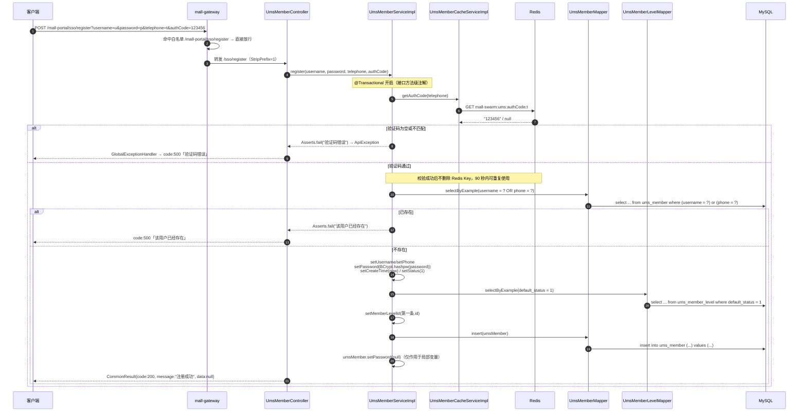
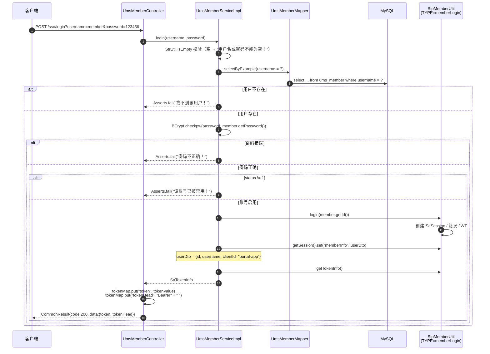
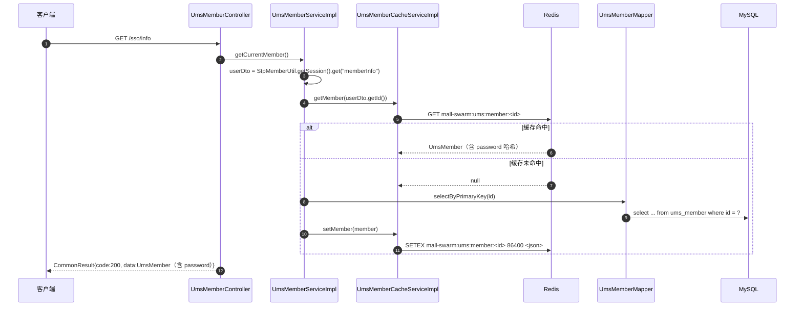
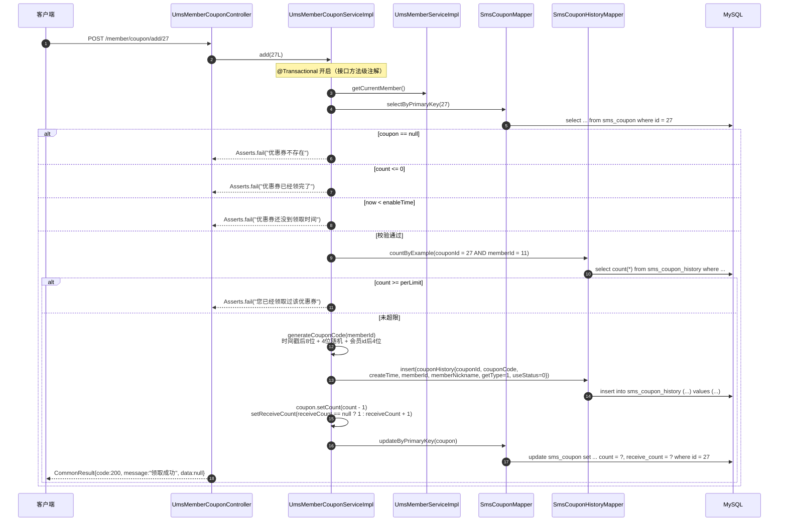
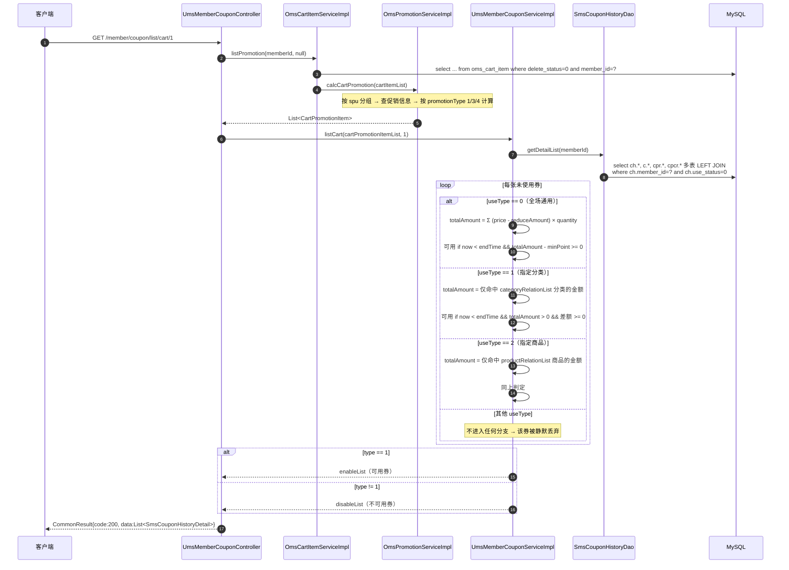
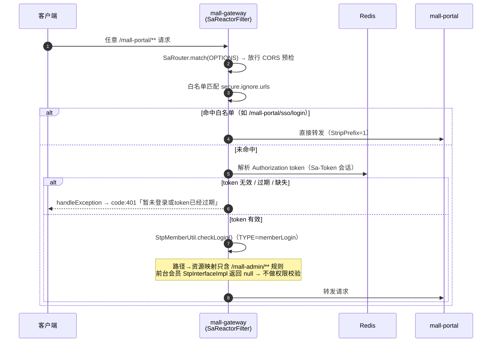
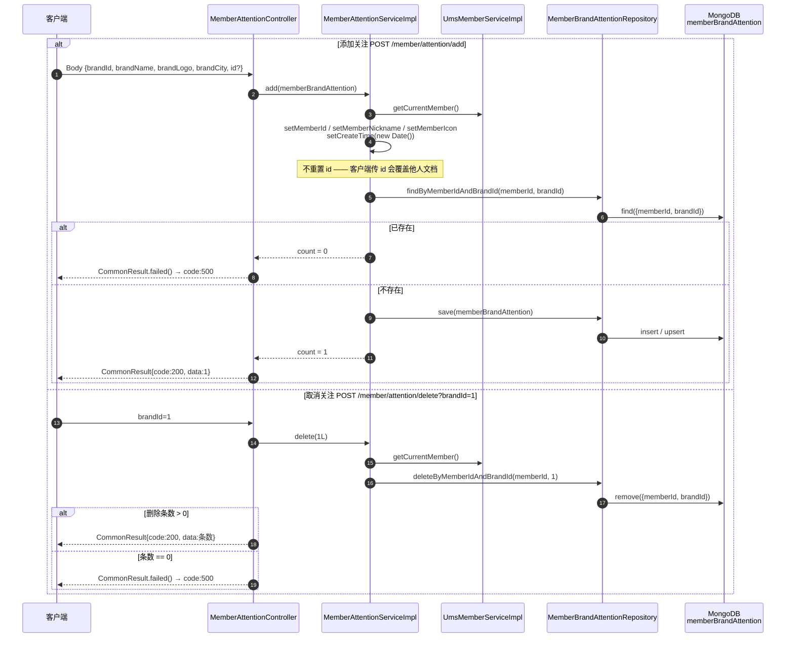
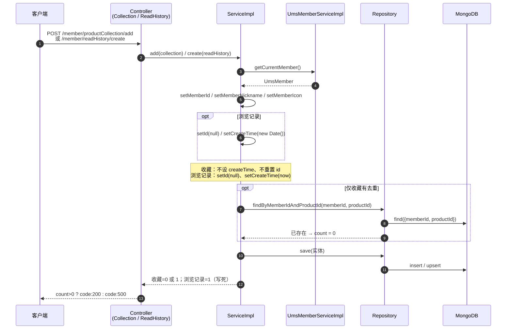
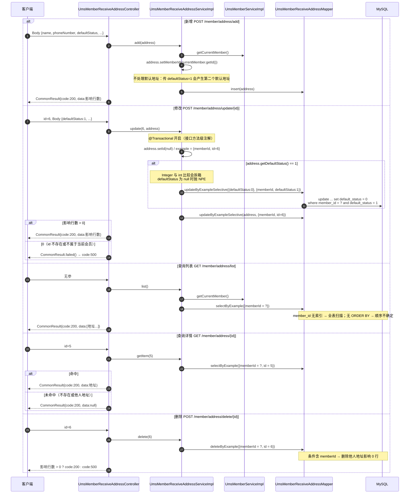
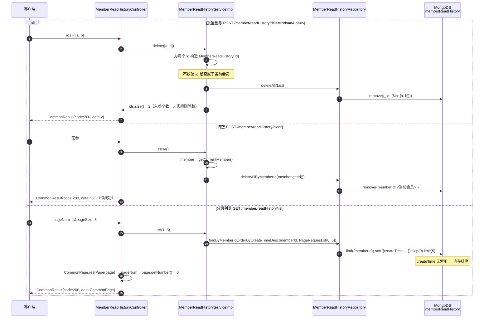

# 详细设计 · 会员中心（前台）

| 项目 | 内容 |
| --- | --- |
| 文档编号 | DD-UMS-MEMBER-PORTAL-001 |
| 所属业务域 | 用户域（`ums`）+ 营销域（`sms`，优惠券部分） |
| 涉及服务 | `mall-portal`（:8085），经 `mall-gateway`（:8201）暴露 |
| 涉及 MySQL 表 | `ums_member`（主表）、`ums_member_level`、`ums_member_receive_address`、`sms_coupon`、`sms_coupon_history`、`ums_member_login_log`、`ums_member_member_tag_relation`、`ums_member_product_category_relation`、`ums_member_statistics_info`、`ums_integration_change_history`、`ums_growth_change_history` |
| 涉及 MongoDB 集合 | `memberBrandAttention`、`memberProductCollection`、`memberReadHistory` |
| 涉及 Redis Key | `mall-swarm:ums:authCode:<telephone>`、`mall-swarm:ums:member:<memberId>` |
| 接口数量 | 30 个（6 个控制器） |
| 网关前缀 | `/mall-portal/sso/**`、`/mall-portal/member/**` |
| 文档状态 | 待评审 |

---

## 一、概述

### 1.1 范围

本文档描述「前台会员中心」这一业务能力的详细设计，覆盖：

- **数据库设计**：`ums_member` 等 11 张 MySQL 表的结构、字典、约束现状，以及 3 个 MongoDB 集合的文档结构、索引现状，并说明 **MongoDB 与 MySQL 的职责划分**（本模块与其它业务模块最显著的结构差异）
- **接口设计**：30 个 REST 接口的请求参数、响应结构与数据模型
- **包设计**：`mall-portal` 内 `controller` / `service` / `dao` / `repository` / `domain` / `util` 的包结构与类职责，以及 **Mapper 与 Repository 两条数据访问路径**的区分
- **运行流程**：注册（含验证码）、登录并签发 token、获取个人信息、领取优惠券、查询可用优惠券、品牌关注/取消关注、商品收藏、记录浏览历史、收货地址增删改查（含默认地址切换）的调用链路与时序
- **日志设计**：Logback 配置、`WebLogAspect` 切点覆盖与记录字段、本模块埋点建议与现有日志设计问题
- **测试用例设计**：功能、边界、异常与校验三类用例

不在本文档范围内：后台会员管理（`mall-admin` 的 `UmsMemberController`）、会员下单结算与支付、商品评价、`mall-auth` 认证中心的后台管理员体系。

### 1.2 术语

| 术语 | 含义 |
| --- | --- |
| 前台会员（Member） | `ums_member` 表的记录，消费者账号，与后台管理员 `ums_admin` 是**两套完全独立的账号体系** |
| 会员等级（MemberLevel） | `ums_member_level`，可配置成长值门槛与 7 项特权；`default_status=1` 的等级为注册默认等级 |
| 积分（integration） | `ums_member.integration`，可用于订单抵扣，变动留流水 `ums_integration_change_history` |
| 成长值（growth） | `ums_member.growth`，用于会员等级晋升，变动留流水 `ums_growth_change_history` |
| 图形验证码（authCode） | 本模块实际实现为 **6 位纯数字字符串验证码**，存于 Redis，用于注册与改密；**项目未绘制图形，也未接入短信通道**（见 2.4、2.5④） |
| 品牌关注 | 会员对 `pms_brand` 的收藏行为，存 MongoDB 集合 `memberBrandAttention` |
| 商品收藏 | 会员对 `pms_product` 的收藏行为，存 MongoDB 集合 `memberProductCollection` |
| 浏览记录 | 会员浏览商品的流水，存 MongoDB 集合 `memberReadHistory` |
| 前台登录态 | Sa-Token 多账号体系中的 `memberLogin` 类型（`StpMemberUtil.TYPE`），与后台 `login` 类型隔离 |
| 水平越权 | 攻击者通过篡改请求中的资源 ID，访问**同一角色下其他用户**的数据（如他人收货地址） |

### 1.3 接口清单总览

| # | 方法 | 路径（服务内） | 网关路径 | 说明 | 控制器 | 鉴权 |
| --- | --- | --- | --- | --- | --- | --- |
| 1 | POST | `/sso/register` | `/mall-portal/sso/register` | 会员注册 | `UmsMemberController` | **白名单·匿名** |
| 2 | POST | `/sso/login` | `/mall-portal/sso/login` | 会员登录 | `UmsMemberController` | **白名单·匿名** |
| 3 | GET | `/sso/info` | `/mall-portal/sso/info` | 获取会员信息 | `UmsMemberController` | 需会员登录 |
| 4 | POST | `/sso/logout` | `/mall-portal/sso/logout` | 登出功能 | `UmsMemberController` | 需会员登录 |
| 5 | GET | `/sso/getAuthCode` | `/mall-portal/sso/getAuthCode` | 获取验证码 | `UmsMemberController` | **白名单·匿名** |
| 6 | POST | `/sso/updatePassword` | `/mall-portal/sso/updatePassword` | 修改密码 | `UmsMemberController` | 需会员登录 |
| 7 | POST | `/member/attention/add` | `/mall-portal/member/attention/add` | 添加品牌关注 | `MemberAttentionController` | 需会员登录 |
| 8 | POST | `/member/attention/delete` | `/mall-portal/member/attention/delete` | 取消关注 | `MemberAttentionController` | 需会员登录 |
| 9 | GET | `/member/attention/list` | `/mall-portal/member/attention/list` | 显示关注列表 | `MemberAttentionController` | 需会员登录 |
| 10 | GET | `/member/attention/detail` | `/mall-portal/member/attention/detail` | 显示关注品牌详情 | `MemberAttentionController` | 需会员登录 |
| 11 | POST | `/member/attention/clear` | `/mall-portal/member/attention/clear` | 清空关注列表 | `MemberAttentionController` | 需会员登录 |
| 12 | POST | `/member/productCollection/add` | `/mall-portal/member/productCollection/add` | 添加商品收藏 | `MemberProductCollectionController` | 需会员登录 |
| 13 | POST | `/member/productCollection/delete` | `/mall-portal/member/productCollection/delete` | 删除收藏商品 | `MemberProductCollectionController` | 需会员登录 |
| 14 | GET | `/member/productCollection/list` | `/mall-portal/member/productCollection/list` | 显示收藏列表 | `MemberProductCollectionController` | 需会员登录 |
| 15 | GET | `/member/productCollection/detail` | `/mall-portal/member/productCollection/detail` | 显示收藏商品详情 | `MemberProductCollectionController` | 需会员登录 |
| 16 | POST | `/member/productCollection/clear` | `/mall-portal/member/productCollection/clear` | 清空收藏列表 | `MemberProductCollectionController` | 需会员登录 |
| 17 | POST | `/member/coupon/add/{couponId}` | `/mall-portal/member/coupon/add/{couponId}` | 领取指定优惠券 | `UmsMemberCouponController` | 需会员登录 |
| 18 | GET | `/member/coupon/listHistory` | `/mall-portal/member/coupon/listHistory` | 获取会员优惠券历史列表 | `UmsMemberCouponController` | 需会员登录 |
| 19 | GET | `/member/coupon/list` | `/mall-portal/member/coupon/list` | 获取会员优惠券列表 | `UmsMemberCouponController` | 需会员登录 |
| 20 | GET | `/member/coupon/list/cart/{type}` | `/mall-portal/member/coupon/list/cart/{type}` | 获取登录会员购物车的相关优惠券 | `UmsMemberCouponController` | 需会员登录 |
| 21 | GET | `/member/coupon/listByProduct/{productId}` | `/mall-portal/member/coupon/listByProduct/{productId}` | 获取当前商品相关优惠券 | `UmsMemberCouponController` | 需会员登录 |
| 22 | POST | `/member/address/add` | `/mall-portal/member/address/add` | 添加收货地址 | `UmsMemberReceiveAddressController` | 需会员登录 |
| 23 | POST | `/member/address/delete/{id}` | `/mall-portal/member/address/delete/{id}` | 删除收货地址 | `UmsMemberReceiveAddressController` | 需会员登录 |
| 24 | POST | `/member/address/update/{id}` | `/mall-portal/member/address/update/{id}` | 修改收货地址 | `UmsMemberReceiveAddressController` | 需会员登录 |
| 25 | GET | `/member/address/list` | `/mall-portal/member/address/list` | 显示所有收货地址 | `UmsMemberReceiveAddressController` | 需会员登录 |
| 26 | GET | `/member/address/{id}` | `/mall-portal/member/address/{id}` | 获取收货地址详情 | `UmsMemberReceiveAddressController` | 需会员登录 |
| 27 | POST | `/member/readHistory/create` | `/mall-portal/member/readHistory/create` | 创建浏览记录 | `MemberReadHistoryController` | 需会员登录 |
| 28 | POST | `/member/readHistory/delete` | `/mall-portal/member/readHistory/delete` | 删除浏览记录 | `MemberReadHistoryController` | 需会员登录 |
| 29 | POST | `/member/readHistory/clear` | `/mall-portal/member/readHistory/clear` | 清空浏览记录 | `MemberReadHistoryController` | 需会员登录 |
| 30 | GET | `/member/readHistory/list` | `/mall-portal/member/readHistory/list` | 分页获取用户浏览记录 | `MemberReadHistoryController` | 需会员登录 |

> **鉴权说明（现状，以 `mall-gateway/src/main/resources/application.yml` 为准）**：白名单 `secure.ignore.urls` 中与本模块相关的条目为：
>
> ```yaml
> - "/mall-portal/sso/login"
> - "/mall-portal/sso/register"
> - "/mall-portal/sso/getAuthCode"
> - "/mall-portal/home/**"
> - "/mall-portal/product/**"
> - "/mall-portal/brand/**"
> - "/mall-portal/alipay/**"
> ```
>
> 即 **`/sso` 前缀只有 `login` / `register` / `getAuthCode` 三个是匿名白名单，`/sso/info`、`/sso/logout`、`/sso/updatePassword` 并不在白名单内**（详见 3.5 不一致清单 ⑥）。其余 `/mall-portal/**` 由 `SaTokenConfig.getSaReactorFilter()` 中的 `SaRouter.match("/mall-portal/**", r -> StpMemberUtil.checkLogin())` 强制校验会员登录态。
>
> **注意**：成员方法内部**没有** `StpMemberUtil.checkLogin()` 调用（全模块仅 `StpMemberUtil.java` 自身定义该方法），登录态校验完全由网关完成。若绕过网关直连 `mall-portal:8085`，则所有 `/member/**` 接口都将匿名可访问，且 `getCurrentMember()` 会抛 `NullPointerException`（见 2.6 ⑦）。

---

## 二、数据库设计

本模块的持久化分两套存储：

- **MySQL**：会员主数据、等级、收货地址、优惠券与领取历史、积分/成长值流水、行为汇总统计 —— 需要事务、关联查询、聚合统计的数据。
- **MongoDB**：品牌关注、商品收藏、浏览记录 —— 高频写入、按会员维度读取、**无跨表关联、无事务诉求**的行为流水数据。

### 2.1 MySQL 表清单

| 表名 | 类型 | 说明 | 本模块操作 |
| --- | --- | --- | --- |
| `ums_member` | 主表 | 会员表 | 增（注册）、查（登录/个人信息）、改（改密、积分） |
| `ums_member_level` | 关联表 | 会员等级表 | 注册时**读**默认等级（`default_status=1`） |
| `ums_member_receive_address` | 主表 | 会员收货地址表 | 增、删、改、查 |
| `sms_coupon` | 关联表 | 优惠券表 | 领券时**读 + 写**（`count` 减 1、`receive_count` 加 1） |
| `sms_coupon_history` | 主表 | 优惠券使用、领取历史表 | 增（领券）、查（券列表/券历史）、改（下单时由订单模块置 `use_status`） |
| `sms_coupon_product_relation` | 关联表 | 优惠券和产品的关系表 | 商品券查询**读** |
| `sms_coupon_product_category_relation` | 关联表 | 优惠券和产品分类关系表 | 分类券查询**读** |
| `ums_member_login_log` | 流水表 | 会员登录记录 | **代码中无任何读写**（见 2.6 ⑤） |
| `ums_member_member_tag_relation` | 关联表 | 用户和标签关系表 | **代码中无任何读写** |
| `ums_member_product_category_relation` | 关联表 | 会员与产品分类关系表（用户喜欢的分类） | **代码中无任何读写** |
| `ums_member_statistics_info` | 统计表 | 会员统计信息 | **代码中无任何读写** |
| `ums_integration_change_history` | 流水表 | 积分变化历史记录表 | **代码中无写入**（`updateIntegration` 只改主表） |
| `ums_growth_change_history` | 流水表 | 成长值变化历史记录表 | **代码中无任何读写** |

> **重要现状**：`ums_member_statistics_info`（关注数/收藏数）、`ums_member_login_log`（登录日志）、两个 change_history 流水表虽在需求中被明确要求（`FR-UMS-03`、`FR-UMS-07`），但**本模块代码完全未接入**。会员的关注数、收藏数、浏览数只能通过 MongoDB `count` 实时统计，没有汇总缓存。

### 2.2 MySQL 建表语句（现状）

以下 DDL 均从 `document/sql/mall.sql` **原文照抄**。

```sql
DROP TABLE IF EXISTS `ums_member`;
CREATE TABLE `ums_member`  (
  `id` bigint(20) NOT NULL AUTO_INCREMENT,
  `member_level_id` bigint(20) NULL DEFAULT NULL,
  `username` varchar(64) CHARACTER SET utf8 COLLATE utf8_general_ci NULL DEFAULT NULL COMMENT '用户名',
  `password` varchar(64) CHARACTER SET utf8 COLLATE utf8_general_ci NULL DEFAULT NULL COMMENT '密码',
  `nickname` varchar(64) CHARACTER SET utf8 COLLATE utf8_general_ci NULL DEFAULT NULL COMMENT '昵称',
  `phone` varchar(64) CHARACTER SET utf8 COLLATE utf8_general_ci NULL DEFAULT NULL COMMENT '手机号码',
  `status` int(1) NULL DEFAULT NULL COMMENT '帐号启用状态:0->禁用；1->启用',
  `create_time` datetime NULL DEFAULT NULL COMMENT '注册时间',
  `icon` varchar(500) CHARACTER SET utf8 COLLATE utf8_general_ci NULL DEFAULT NULL COMMENT '头像',
  `gender` int(1) NULL DEFAULT NULL COMMENT '性别：0->未知；1->男；2->女',
  `birthday` date NULL DEFAULT NULL COMMENT '生日',
  `city` varchar(64) CHARACTER SET utf8 COLLATE utf8_general_ci NULL DEFAULT NULL COMMENT '所做城市',
  `job` varchar(100) CHARACTER SET utf8 COLLATE utf8_general_ci NULL DEFAULT NULL COMMENT '职业',
  `personalized_signature` varchar(200) CHARACTER SET utf8 COLLATE utf8_general_ci NULL DEFAULT NULL COMMENT '个性签名',
  `source_type` int(1) NULL DEFAULT NULL COMMENT '用户来源',
  `integration` int(11) NULL DEFAULT NULL COMMENT '积分',
  `growth` int(11) NULL DEFAULT NULL COMMENT '成长值',
  `luckey_count` int(11) NULL DEFAULT NULL COMMENT '剩余抽奖次数',
  `history_integration` int(11) NULL DEFAULT NULL COMMENT '历史积分数量',
  PRIMARY KEY (`id`) USING BTREE,
  UNIQUE INDEX `idx_username`(`username`) USING BTREE,
  UNIQUE INDEX `idx_phone`(`phone`) USING BTREE
) ENGINE = InnoDB AUTO_INCREMENT = 12 CHARACTER SET = utf8 COLLATE = utf8_general_ci COMMENT = '会员表' ROW_FORMAT = DYNAMIC;
```

```sql
DROP TABLE IF EXISTS `ums_member_level`;
CREATE TABLE `ums_member_level`  (
  `id` bigint(20) NOT NULL AUTO_INCREMENT,
  `name` varchar(100) CHARACTER SET utf8 COLLATE utf8_general_ci NULL DEFAULT NULL,
  `growth_point` int(11) NULL DEFAULT NULL,
  `default_status` int(1) NULL DEFAULT NULL COMMENT '是否为默认等级：0->不是；1->是',
  `free_freight_point` decimal(10, 2) NULL DEFAULT NULL COMMENT '免运费标准',
  `comment_growth_point` int(11) NULL DEFAULT NULL COMMENT '每次评价获取的成长值',
  `priviledge_free_freight` int(1) NULL DEFAULT NULL COMMENT '是否有免邮特权',
  `priviledge_sign_in` int(1) NULL DEFAULT NULL COMMENT '是否有签到特权',
  `priviledge_comment` int(1) NULL DEFAULT NULL COMMENT '是否有评论获奖励特权',
  `priviledge_promotion` int(1) NULL DEFAULT NULL COMMENT '是否有专享活动特权',
  `priviledge_member_price` int(1) NULL DEFAULT NULL COMMENT '是否有会员价格特权',
  `priviledge_birthday` int(1) NULL DEFAULT NULL COMMENT '是否有生日特权',
  `note` varchar(200) CHARACTER SET utf8 COLLATE utf8_general_ci NULL DEFAULT NULL,
  PRIMARY KEY (`id`) USING BTREE
) ENGINE = InnoDB AUTO_INCREMENT = 5 CHARACTER SET = utf8 COLLATE = utf8_general_ci COMMENT = '会员等级表' ROW_FORMAT = DYNAMIC;
```

```sql
DROP TABLE IF EXISTS `ums_member_receive_address`;
CREATE TABLE `ums_member_receive_address`  (
  `id` bigint(20) NOT NULL AUTO_INCREMENT,
  `member_id` bigint(20) NULL DEFAULT NULL,
  `name` varchar(100) CHARACTER SET utf8 COLLATE utf8_general_ci NULL DEFAULT NULL COMMENT '收货人名称',
  `phone_number` varchar(64) CHARACTER SET utf8 COLLATE utf8_general_ci NULL DEFAULT NULL,
  `default_status` int(1) NULL DEFAULT NULL COMMENT '是否为默认',
  `post_code` varchar(100) CHARACTER SET utf8 COLLATE utf8_general_ci NULL DEFAULT NULL COMMENT '邮政编码',
  `province` varchar(100) CHARACTER SET utf8 COLLATE utf8_general_ci NULL DEFAULT NULL COMMENT '省份/直辖市',
  `city` varchar(100) CHARACTER SET utf8 COLLATE utf8_general_ci NULL DEFAULT NULL COMMENT '城市',
  `region` varchar(100) CHARACTER SET utf8 COLLATE utf8_general_ci NULL DEFAULT NULL COMMENT '区',
  `detail_address` varchar(128) CHARACTER SET utf8 COLLATE utf8_general_ci NULL DEFAULT NULL COMMENT '详细地址(街道)',
  PRIMARY KEY (`id`) USING BTREE
) ENGINE = InnoDB AUTO_INCREMENT = 7 CHARACTER SET = utf8 COLLATE = utf8_general_ci COMMENT = '会员收货地址表' ROW_FORMAT = DYNAMIC;
```

```sql
DROP TABLE IF EXISTS `sms_coupon`;
CREATE TABLE `sms_coupon`  (
  `id` bigint(20) NOT NULL AUTO_INCREMENT,
  `type` int(1) NULL DEFAULT NULL COMMENT '优惠券类型；0->全场赠券；1->会员赠券；2->购物赠券；3->注册赠券',
  `name` varchar(100) CHARACTER SET utf8 COLLATE utf8_general_ci NULL DEFAULT NULL,
  `platform` int(1) NULL DEFAULT NULL COMMENT '使用平台：0->全部；1->移动；2->PC',
  `count` int(11) NULL DEFAULT NULL COMMENT '数量',
  `amount` decimal(10, 2) NULL DEFAULT NULL COMMENT '金额',
  `per_limit` int(11) NULL DEFAULT NULL COMMENT '每人限领张数',
  `min_point` decimal(10, 2) NULL DEFAULT NULL COMMENT '使用门槛；0表示无门槛',
  `start_time` datetime NULL DEFAULT NULL,
  `end_time` datetime NULL DEFAULT NULL,
  `use_type` int(1) NULL DEFAULT NULL COMMENT '使用类型：0->全场通用；1->指定分类；2->指定商品',
  `note` varchar(200) CHARACTER SET utf8 COLLATE utf8_general_ci NULL DEFAULT NULL COMMENT '备注',
  `publish_count` int(11) NULL DEFAULT NULL COMMENT '发行数量',
  `use_count` int(11) NULL DEFAULT NULL COMMENT '已使用数量',
  `receive_count` int(11) NULL DEFAULT NULL COMMENT '领取数量',
  `enable_time` datetime NULL DEFAULT NULL COMMENT '可以领取的日期',
  `code` varchar(64) CHARACTER SET utf8 COLLATE utf8_general_ci NULL DEFAULT NULL COMMENT '优惠码',
  `member_level` int(1) NULL DEFAULT NULL COMMENT '可领取的会员类型：0->无限时',
  PRIMARY KEY (`id`) USING BTREE
) ENGINE = InnoDB AUTO_INCREMENT = 32 CHARACTER SET = utf8 COLLATE = utf8_general_ci COMMENT = '优惠券表' ROW_FORMAT = DYNAMIC;
```

```sql
DROP TABLE IF EXISTS `sms_coupon_history`;
CREATE TABLE `sms_coupon_history`  (
  `id` bigint(20) NOT NULL AUTO_INCREMENT,
  `coupon_id` bigint(20) NULL DEFAULT NULL,
  `member_id` bigint(20) NULL DEFAULT NULL,
  `coupon_code` varchar(64) CHARACTER SET utf8 COLLATE utf8_general_ci NULL DEFAULT NULL,
  `member_nickname` varchar(64) CHARACTER SET utf8 COLLATE utf8_general_ci NULL DEFAULT NULL COMMENT '领取人昵称',
  `get_type` int(1) NULL DEFAULT NULL COMMENT '获取类型：0->后台赠送；1->主动获取',
  `create_time` datetime NULL DEFAULT NULL,
  `use_status` int(1) NULL DEFAULT NULL COMMENT '使用状态：0->未使用；1->已使用；2->已过期',
  `use_time` datetime NULL DEFAULT NULL COMMENT '使用时间',
  `order_id` bigint(20) NULL DEFAULT NULL COMMENT '订单编号',
  `order_sn` varchar(100) CHARACTER SET utf8 COLLATE utf8_general_ci NULL DEFAULT NULL COMMENT '订单号码',
  PRIMARY KEY (`id`) USING BTREE,
  INDEX `idx_member_id`(`member_id`) USING BTREE,
  INDEX `idx_coupon_id`(`coupon_id`) USING BTREE
) ENGINE = InnoDB AUTO_INCREMENT = 53 CHARACTER SET = utf8 COLLATE = utf8_general_ci COMMENT = '优惠券使用、领取历史表' ROW_FORMAT = DYNAMIC;
```

```sql
DROP TABLE IF EXISTS `ums_member_login_log`;
CREATE TABLE `ums_member_login_log`  (
  `id` bigint(20) NOT NULL AUTO_INCREMENT,
  `member_id` bigint(20) NULL DEFAULT NULL,
  `create_time` datetime NULL DEFAULT NULL,
  `ip` varchar(64) CHARACTER SET utf8 COLLATE utf8_general_ci NULL DEFAULT NULL,
  `city` varchar(64) CHARACTER SET utf8 COLLATE utf8_general_ci NULL DEFAULT NULL,
  `login_type` int(1) NULL DEFAULT NULL COMMENT '登录类型：0->PC；1->android;2->ios;3->小程序',
  `province` varchar(64) CHARACTER SET utf8 COLLATE utf8_general_ci NULL DEFAULT NULL,
  PRIMARY KEY (`id`) USING BTREE
) ENGINE = InnoDB AUTO_INCREMENT = 1 CHARACTER SET = utf8 COLLATE = utf8_general_ci COMMENT = '会员登录记录' ROW_FORMAT = DYNAMIC;
```

```sql
DROP TABLE IF EXISTS `ums_member_member_tag_relation`;
CREATE TABLE `ums_member_member_tag_relation`  (
  `id` bigint(20) NOT NULL AUTO_INCREMENT,
  `member_id` bigint(20) NULL DEFAULT NULL,
  `tag_id` bigint(20) NULL DEFAULT NULL,
  PRIMARY KEY (`id`) USING BTREE
) ENGINE = InnoDB AUTO_INCREMENT = 1 CHARACTER SET = utf8 COLLATE = utf8_general_ci COMMENT = '用户和标签关系表' ROW_FORMAT = DYNAMIC;
```

```sql
DROP TABLE IF EXISTS `ums_member_product_category_relation`;
CREATE TABLE `ums_member_product_category_relation`  (
  `id` bigint(20) NOT NULL AUTO_INCREMENT,
  `member_id` bigint(20) NULL DEFAULT NULL,
  `product_category_id` bigint(20) NULL DEFAULT NULL,
  PRIMARY KEY (`id`) USING BTREE
) ENGINE = InnoDB AUTO_INCREMENT = 1 CHARACTER SET = utf8 COLLATE = utf8_general_ci COMMENT = '会员与产品分类关系表（用户喜欢的分类）' ROW_FORMAT = DYNAMIC;
```

```sql
DROP TABLE IF EXISTS `ums_member_statistics_info`;
CREATE TABLE `ums_member_statistics_info`  (
  `id` bigint(20) NOT NULL AUTO_INCREMENT,
  `member_id` bigint(20) NULL DEFAULT NULL,
  `consume_amount` decimal(10, 2) NULL DEFAULT NULL COMMENT '累计消费金额',
  `order_count` int(11) NULL DEFAULT NULL COMMENT '订单数量',
  `coupon_count` int(11) NULL DEFAULT NULL COMMENT '优惠券数量',
  `comment_count` int(11) NULL DEFAULT NULL COMMENT '评价数',
  `return_order_count` int(11) NULL DEFAULT NULL COMMENT '退货数量',
  `login_count` int(11) NULL DEFAULT NULL COMMENT '登录次数',
  `attend_count` int(11) NULL DEFAULT NULL COMMENT '关注数量',
  `fans_count` int(11) NULL DEFAULT NULL COMMENT '粉丝数量',
  `collect_product_count` int(11) NULL DEFAULT NULL,
  `collect_subject_count` int(11) NULL DEFAULT NULL,
  `collect_topic_count` int(11) NULL DEFAULT NULL,
  `collect_comment_count` int(11) NULL DEFAULT NULL,
  `invite_friend_count` int(11) NULL DEFAULT NULL,
  `recent_order_time` datetime NULL DEFAULT NULL COMMENT '最后一次下订单时间',
  PRIMARY KEY (`id`) USING BTREE
) ENGINE = InnoDB AUTO_INCREMENT = 1 CHARACTER SET = utf8 COLLATE = utf8_general_ci COMMENT = '会员统计信息' ROW_FORMAT = DYNAMIC;
```

```sql
DROP TABLE IF EXISTS `ums_integration_change_history`;
CREATE TABLE `ums_integration_change_history`  (
  `id` bigint(20) NOT NULL AUTO_INCREMENT,
  `member_id` bigint(20) NULL DEFAULT NULL,
  `create_time` datetime NULL DEFAULT NULL,
  `change_type` int(1) NULL DEFAULT NULL COMMENT '改变类型：0->增加；1->减少',
  `change_count` int(11) NULL DEFAULT NULL COMMENT '积分改变数量',
  `operate_man` varchar(100) CHARACTER SET utf8 COLLATE utf8_general_ci NULL DEFAULT NULL COMMENT '操作人员',
  `operate_note` varchar(200) CHARACTER SET utf8 COLLATE utf8_general_ci NULL DEFAULT NULL COMMENT '操作备注',
  `source_type` int(1) NULL DEFAULT NULL COMMENT '积分来源：0->购物；1->管理员修改',
  PRIMARY KEY (`id`) USING BTREE
) ENGINE = InnoDB AUTO_INCREMENT = 1 CHARACTER SET = utf8 COLLATE = utf8_general_ci COMMENT = '积分变化历史记录表' ROW_FORMAT = DYNAMIC;
```

```sql
DROP TABLE IF EXISTS `ums_growth_change_history`;
CREATE TABLE `ums_growth_change_history`  (
  `id` bigint(20) NOT NULL AUTO_INCREMENT,
  `member_id` bigint(20) NULL DEFAULT NULL,
  `create_time` datetime NULL DEFAULT NULL,
  `change_type` int(1) NULL DEFAULT NULL COMMENT '改变类型：0->增加；1->减少',
  `change_count` int(11) NULL DEFAULT NULL COMMENT '积分改变数量',
  `operate_man` varchar(100) CHARACTER SET utf8 COLLATE utf8_general_ci NULL DEFAULT NULL COMMENT '操作人员',
  `operate_note` varchar(200) CHARACTER SET utf8 COLLATE utf8_general_ci NULL DEFAULT NULL COMMENT '操作备注',
  `source_type` int(1) NULL DEFAULT NULL COMMENT '积分来源：0->购物；1->管理员修改',
  PRIMARY KEY (`id`) USING BTREE
) ENGINE = InnoDB AUTO_INCREMENT = 2 CHARACTER SET = utf8 COLLATE = utf8_general_ci COMMENT = '成长值变化历史记录表' ROW_FORMAT = DYNAMIC;
```

**关联表补充 DDL**（优惠券适用范围，本模块只读）：

```sql
DROP TABLE IF EXISTS `sms_coupon_product_relation`;
CREATE TABLE `sms_coupon_product_relation`  (
  `id` bigint(20) NOT NULL AUTO_INCREMENT,
  `coupon_id` bigint(20) NULL DEFAULT NULL,
  `product_id` bigint(20) NULL DEFAULT NULL,
  `product_name` varchar(500) CHARACTER SET utf8 COLLATE utf8_general_ci NULL DEFAULT NULL COMMENT '商品名称',
  `product_sn` varchar(200) CHARACTER SET utf8 COLLATE utf8_general_ci NULL DEFAULT NULL COMMENT '商品编码',
  PRIMARY KEY (`id`) USING BTREE
) ENGINE = InnoDB AUTO_INCREMENT = 23 CHARACTER SET = utf8 COLLATE = utf8_general_ci COMMENT = '优惠券和产品的关系表' ROW_FORMAT = DYNAMIC;

DROP TABLE IF EXISTS `sms_coupon_product_category_relation`;
CREATE TABLE `sms_coupon_product_category_relation`  (
  `id` bigint(20) NOT NULL AUTO_INCREMENT,
  `coupon_id` bigint(20) NULL DEFAULT NULL,
  `product_category_id` bigint(20) NULL DEFAULT NULL,
  `product_category_name` varchar(200) CHARACTER SET utf8 COLLATE utf8_general_ci NULL DEFAULT NULL COMMENT '产品分类名称',
  `parent_category_name` varchar(200) CHARACTER SET utf8 COLLATE utf8_general_ci NULL DEFAULT NULL COMMENT '父分类名称',
  PRIMARY KEY (`id`) USING BTREE
) ENGINE = InnoDB AUTO_INCREMENT = 12 CHARACTER SET = utf8 COLLATE = utf8_general_ci COMMENT = '优惠券和产品分类关系表' ROW_FORMAT = DYNAMIC;
```

### 2.3 MySQL 字段说明

#### 2.3.1 `ums_member`（会员表）

| 字段 | 类型 | 允许空 | 默认值 | 中文名 | 说明 |
| --- | --- | --- | --- | --- | --- |
| `id` | bigint(20) | 否 | AUTO_INCREMENT | 主键 | 会员唯一标识，参与 Sa-Token `loginId` |
| `member_level_id` | bigint(20) | 是 | NULL | 会员等级编号 | 逻辑外键 → `ums_member_level.id`；注册时取 `default_status=1` 的等级 |
| `username` | varchar(64) | 是 | NULL | 用户名 | **唯一索引**；登录凭据 |
| `password` | varchar(64) | 是 | NULL | 密码 | 存 **BCrypt 哈希**（`BCrypt.hashpw`），长度 60；DDL 未注释 |
| `nickname` | varchar(64) | 是 | NULL | 昵称 | 注册时**未赋值**，故新注册会员昵称为 NULL |
| `phone` | varchar(64) | 是 | NULL | 手机号码 | **唯一索引**；注册时同时作为登录名查重条件 |
| `status` | int(1) | 是 | NULL | 帐号启用状态 | 0 禁用 / 1 启用；注册写死为 1；登录校验 `!= 1` 则拒绝 |
| `create_time` | datetime | 是 | NULL | 注册时间 | `new Date()` 写入 |
| `icon` | varchar(500) | 是 | NULL | 头像 | 注册时**未赋值** |
| `gender` | int(1) | 是 | NULL | 性别 | 0 未知 / 1 男 / 2 女 |
| `birthday` | date | 是 | NULL | 生日 | — |
| `city` | varchar(64) | 是 | NULL | 所做城市 | 列注释原文为「所做城市」（疑为「所在城市」笔误），此处照抄 |
| `job` | varchar(100) | 是 | NULL | 职业 | — |
| `personalized_signature` | varchar(200) | 是 | NULL | 个性签名 | — |
| `source_type` | int(1) | 是 | NULL | 用户来源 | **无列注释**，取值含义未定义 |
| `integration` | int(11) | 是 | NULL | 积分 | 由订单模块通过 `updateIntegration(id, integration)` **绝对值覆盖**写入，非增量 |
| `growth` | int(11) | 是 | NULL | 成长值 | 本模块无写入代码 |
| `luckey_count` | int(11) | 是 | NULL | 剩余抽奖次数 | 无维护代码 |
| `history_integration` | int(11) | 是 | NULL | 历史积分数量 | 无维护代码 |

#### 2.3.2 `ums_member_level`（会员等级表）

| 字段 | 类型 | 允许空 | 默认值 | 中文名 | 说明 |
| --- | --- | --- | --- | --- | --- |
| `id` | bigint(20) | 否 | AUTO_INCREMENT | 主键 | 等级编号 |
| `name` | varchar(100) | 是 | NULL | 等级名称 | 种子数据：黄金会员/白金会员/钻石会员/普通会员 |
| `growth_point` | int(11) | 是 | NULL | 成长值门槛 | 种子数据 1000/5000/15000/1 |
| `default_status` | int(1) | 是 | NULL | 是否为默认等级 | 0 不是 / 1 是；**注册时按此字段取等级** |
| `free_freight_point` | decimal(10,2) | 是 | NULL | 免运费标准 | — |
| `comment_growth_point` | int(11) | 是 | NULL | 每次评价获取的成长值 | — |
| `priviledge_free_freight` | int(1) | 是 | NULL | 是否有免邮特权 | 列名拼写为 `priviledge`（原文照抄） |
| `priviledge_sign_in` | int(1) | 是 | NULL | 是否有签到特权 | — |
| `priviledge_comment` | int(1) | 是 | NULL | 是否有评论获奖励特权 | — |
| `priviledge_promotion` | int(1) | 是 | NULL | 是否有专享活动特权 | — |
| `priviledge_member_price` | int(1) | 是 | NULL | 是否有会员价格特权 | — |
| `priviledge_birthday` | int(1) | 是 | NULL | 是否有生日特权 | — |
| `note` | varchar(200) | 是 | NULL | 备注 | — |

> **注意**：接口 `/sso/info` 只返回 `ums_member` 单表字段，`memberLevelId` 是**裸 ID**，接口**不返回等级名称与特权明细**。前端如需展示「黄金会员」需另行查询等级表（本模块无该接口）。

#### 2.3.3 `ums_member_receive_address`（会员收货地址表）

| 字段 | 类型 | 允许空 | 默认值 | 中文名 | 说明 |
| --- | --- | --- | --- | --- | --- |
| `id` | bigint(20) | 否 | AUTO_INCREMENT | 主键 | 地址编号 |
| `member_id` | bigint(20) | 是 | NULL | 会员编号 | **无索引**（见 2.6 ①）；由服务端从登录态注入，**不接受客户端传入** |
| `name` | varchar(100) | 是 | NULL | 收货人名称 | — |
| `phone_number` | varchar(64) | 是 | NULL | 收货人电话 | 无列注释 |
| `default_status` | int(1) | 是 | NULL | 是否为默认 | 无列注释；业务取值为 0/1，`update` 中按 `==1` 判断 |
| `post_code` | varchar(100) | 是 | NULL | 邮政编码 | — |
| `province` | varchar(100) | 是 | NULL | 省份/直辖市 | — |
| `city` | varchar(100) | 是 | NULL | 城市 | — |
| `region` | varchar(100) | 是 | NULL | 区 | — |
| `detail_address` | varchar(128) | 是 | NULL | 详细地址(街道) | — |

#### 2.3.4 `sms_coupon`（优惠券表）

| 字段 | 类型 | 允许空 | 默认值 | 中文名 | 说明 |
| --- | --- | --- | --- | --- | --- |
| `id` | bigint(20) | 否 | AUTO_INCREMENT | 主键 | 优惠券编号 |
| `type` | int(1) | 是 | NULL | 优惠券类型 | 0 全场赠券 / 1 会员赠券 / 2 购物赠券 / 3 注册赠券 |
| `name` | varchar(100) | 是 | NULL | 优惠券名称 | — |
| `platform` | int(1) | 是 | NULL | 使用平台 | 0 全部 / 1 移动 / 2 PC |
| `count` | int(11) | 是 | NULL | 剩余数量 | **领券时减 1**；`getCount()<=0` 时拒绝领取 |
| `amount` | decimal(10,2) | 是 | NULL | 金额 | 优惠面额 |
| `per_limit` | int(11) | 是 | NULL | 每人限领张数 | 领券时与已领数量比较 |
| `min_point` | decimal(10,2) | 是 | NULL | 使用门槛 | 0 表示无门槛 |
| `start_time` | datetime | 是 | NULL | 生效时间 | 券可用性判断使用 |
| `end_time` | datetime | 是 | NULL | 失效时间 | 券可用性判断使用 |
| `use_type` | int(1) | 是 | NULL | 使用类型 | 0 全场通用 / 1 指定分类 / 2 指定商品 |
| `note` | varchar(200) | 是 | NULL | 备注 | — |
| `publish_count` | int(11) | 是 | NULL | 发行数量 | — |
| `use_count` | int(11) | 是 | NULL | 已使用数量 | 本模块**不维护**，由订单模块写入 |
| `receive_count` | int(11) | 是 | NULL | 领取数量 | **领券时加 1**（首领取 1，否则 +1） |
| `enable_time` | datetime | 是 | NULL | 可以领取的日期 | 领券时校验 `now.before(enableTime)` 则拒绝 |
| `code` | varchar(64) | 是 | NULL | 优惠码 | 本模块未使用（券码落在 `sms_coupon_history.coupon_code`） |
| `member_level` | int(1) | 是 | NULL | 可领取的会员类型 | 0 无限时；**领券时未做等级校验**（见 2.6 ③） |

#### 2.3.5 `sms_coupon_history`（优惠券使用、领取历史表）

| 字段 | 类型 | 允许空 | 默认值 | 中文名 | 说明 |
| --- | --- | --- | --- | --- | --- |
| `id` | bigint(20) | 否 | AUTO_INCREMENT | 主键 | 记录编号 |
| `coupon_id` | bigint(20) | 是 | NULL | 优惠券编号 | 有索引 `idx_coupon_id` |
| `member_id` | bigint(20) | 是 | NULL | 会员编号 | 有索引 `idx_member_id` |
| `coupon_code` | varchar(64) | 是 | NULL | 优惠码 | 由 `generateCouponCode()` 生成：**时间戳后 8 位 + 4 位随机数 + 会员 id 后 4 位** |
| `member_nickname` | varchar(64) | 是 | NULL | 领取人昵称 | 取自当前会员 `nickname`（**新注册会员为 NULL**） |
| `get_type` | int(1) | 是 | NULL | 获取类型 | 0 后台赠送 / 1 主动获取；前台领券写死 **1** |
| `create_time` | datetime | 是 | NULL | 领取时间 | — |
| `use_status` | int(1) | 是 | NULL | 使用状态 | 0 未使用 / 1 已使用 / 2 已过期；前台领券写死 **0** |
| `use_time` | datetime | 是 | NULL | 使用时间 | 本模块不写 |
| `order_id` | bigint(20) | 是 | NULL | 订单编号 | 本模块不写 |
| `order_sn` | varchar(100) | 是 | NULL | 订单号码 | 本模块不写 |

#### 2.3.6 其余表字段说明（本模块只读或未使用）

| 表 | 字段 | 类型 | 中文名 | 说明 |
| --- | --- | --- | --- | --- |
| `sms_coupon_product_relation` | `coupon_id` | bigint(20) | 优惠券编号 | `use_type=2`（指定商品）时用于反查券 |
| `sms_coupon_product_relation` | `product_id` | bigint(20) | 商品编号 | `listByProduct` 按此列过滤 |
| `sms_coupon_product_relation` | `product_name` / `product_sn` | varchar | 商品名称/编码 | 冗余快照，本模块不使用 |
| `sms_coupon_product_category_relation` | `coupon_id` | bigint(20) | 优惠券编号 | `use_type=1`（指定分类）时用于反查券 |
| `sms_coupon_product_category_relation` | `product_category_id` | bigint(20) | 产品分类编号 | 结合 `pms_product.product_category_id` 匹配 |
| `ums_member_login_log` | `member_id` / `create_time` / `ip` / `city` / `login_type` / `province` | bigint/datetime/varchar/int | 会员登录记录 | **本模块代码无读写** |
| `ums_member_member_tag_relation` | `member_id` / `tag_id` | bigint(20) | 会员-标签关系 | **本模块代码无读写** |
| `ums_member_product_category_relation` | `member_id` / `product_category_id` | bigint(20) | 会员偏好分类 | **本模块代码无读写** |
| `ums_member_statistics_info` | `consume_amount` … `recent_order_time` | decimal/int/datetime | 会员统计信息 | **本模块代码无读写**；15 个统计列全部无维护 |
| `ums_integration_change_history` | `member_id` / `create_time` / `change_type` / `change_count` / `operate_man` / `operate_note` / `source_type` | — | 积分变化历史 | **本模块无写入**（`updateIntegration` 只改主表） |
| `ums_growth_change_history` | 同上 | — | 成长值变化历史 | **本模块无读写** |

### 2.4 MySQL 状态字典

以下取值均取自 `document/sql/mall.sql` 的**列注释原文**。

| 字段 | 值 | 含义 | 来源 |
| --- | --- | --- | --- |
| `ums_member.status` | 0 | 禁用 | `ums_member.status` 列注释 |
| `ums_member.status` | 1 | 启用 | `ums_member.status` 列注释；注册写死 1 |
| `ums_member.gender` | 0 | 未知 | `ums_member.gender` 列注释 |
| `ums_member.gender` | 1 | 男 | `ums_member.gender` 列注释 |
| `ums_member.gender` | 2 | 女 | `ums_member.gender` 列注释 |
| `ums_member.source_type` | — | 用户来源 | **列注释缺失，取值未定义** |
| `ums_member_level.default_status` | 0 | 不是默认等级 | `ums_member_level.default_status` 列注释 |
| `ums_member_level.default_status` | 1 | 是默认等级 | 同上；注册时按此值取等级 |
| `ums_member_login_log.login_type` | 0 | PC | `ums_member_login_log.login_type` 列注释 |
| `ums_member_login_log.login_type` | 1 | android | 同上 |
| `ums_member_login_log.login_type` | 2 | ios | 同上 |
| `ums_member_login_log.login_type` | 3 | 小程序 | 同上 |
| `sms_coupon.type` | 0 | 全场赠券 | `sms_coupon.type` 列注释 |
| `sms_coupon.type` | 1 | 会员赠券 | 同上 |
| `sms_coupon.type` | 2 | 购物赠券 | 同上 |
| `sms_coupon.type` | 3 | 注册赠券 | 同上 |
| `sms_coupon.platform` | 0 | 全部 | `sms_coupon.platform` 列注释 |
| `sms_coupon.platform` | 1 | 移动 | 同上 |
| `sms_coupon.platform` | 2 | PC | 同上 |
| `sms_coupon.use_type` | 0 | 全场通用 | `sms_coupon.use_type` 列注释 |
| `sms_coupon.use_type` | 1 | 指定分类 | 同上 |
| `sms_coupon.use_type` | 2 | 指定商品 | 同上 |
| `sms_coupon.member_level` | 0 | 无限时 | `sms_coupon.member_level` 列注释 |
| `sms_coupon_history.get_type` | 0 | 后台赠送 | `sms_coupon_history.get_type` 列注释 |
| `sms_coupon_history.get_type` | 1 | 主动获取 | 同上；前台领券写死 1 |
| `sms_coupon_history.use_status` | 0 | 未使用 | `sms_coupon_history.use_status` 列注释；前台领券写死 0 |
| `sms_coupon_history.use_status` | 1 | 已使用 | 同上 |
| `sms_coupon_history.use_status` | 2 | 已过期 | 同上 |
| `ums_integration_change_history.change_type` | 0 | 增加 | `change_type` 列注释 |
| `ums_integration_change_history.change_type` | 1 | 减少 | 同上 |
| `ums_integration_change_history.source_type` | 0 | 购物 | `source_type` 列注释 |
| `ums_integration_change_history.source_type` | 1 | 管理员修改 | 同上 |
| `ums_growth_change_history.change_type` | 0 | 增加 | 列注释原文为「改变类型：0->增加；1->减少」；注意 `change_count` 列注释写作「积分改变数量」（照抄） |
| `ums_growth_change_history.change_type` | 1 | 减少 | 同上 |
| `ums_growth_change_history.source_type` | 0 | 购物 | 同上 |
| `ums_growth_change_history.source_type` | 1 | 管理员修改 | 同上 |

> **`ums_member_receive_address.default_status` 与 `ums_member_product_category_relation` 等表在 `mall.sql` 中无列注释**，其取值含义由代码推断：`default_status` 业务取值为 0/1（`UmsMemberReceiveAddressServiceImpl.update()` 中按 `address.getDefaultStatus()==1` 判定）。

### 2.5 MongoDB 集合设计

#### 2.5.1 为什么关注 / 收藏 / 浏览记录存 MongoDB

| 维度 | MySQL 路线（其它业务模块的做法） | MongoDB 路线（本模块实际做法） |
| --- | --- | --- |
| 数据形态 | 强关系、需要 join 与事务 | 单会员维度的扁平行，**无 join** |
| 写入频率 | 中低频 | **高频**（每次浏览商品即写一条浏览记录） |
| 表结构变更 | 需 DDL 变更 | 无 schema，天然容纳前端传入的商品快照字段 |
| 数据量 | 可控 | 随会员数 × 浏览次数线性膨胀，独立库可单独扩容/清理 |
| 一致性诉求 | 需事务 | 最终一致即可，丢失一条浏览记录不影响交易 |

**职责划分结论**：

- **MySQL 负责「谁是谁、有多少钱、有哪些券、地址是什么」** —— 会员身份、等级、积分、成长值、收货地址、优惠券及领取历史，全部需要唯一约束、事务和多表关联。
- **MongoDB 负责「谁看过/收藏/关注了什么」** —— 三个行为集合只按 `memberId` 归属，展示的商品/品牌字段是**写入时的快照**（`productName`、`productPic`、`productPrice`、`brandName`、`brandLogo` 等），商品改名或调价后历史记录**不会同步更新**（见 2.7 ⑥）。
- **两者不共享事务**：领券（MySQL 双写）与关注（MongoDB 单写）不会出现在同一个业务流程里，因此当前不存在跨库事务需求。

#### 2.5.2 MongoDB 连接配置（现状）

`mall-portal/src/main/resources/application.yml`：

```yaml
spring:
  data:
    mongodb:
      host: localhost
      port: 27017
      database: mall-port
```

> `config/portal/mall-portal-dev.yaml`（Nacos 配置）中为同样三行。**未配置** `auto-index-creation`（见 2.6 ④）。

#### 2.5.3 集合 `memberBrandAttention`（品牌关注）

来源类：`mall-portal/src/main/java/com/macro/mall/portal/domain/MemberBrandAttention.java`，标注 `@Document`（**未指定 `collection` 属性**，集合名由 Spring Data 默认策略取类名首字母小写，即 `memberBrandAttention`）。

| 字段 | Java 类型 | MongoDB 类型 | 索引 | 说明 |
| --- | --- | --- | --- | --- |
| `id` | `String` | ObjectId（字符串形式） | `_id` 主键（MongoDB 自动） | `@Id`；`add()` 时**不置 null**，客户端传入的 id 会被沿用，存在覆盖风险（见 2.6 ⑥） |
| `memberId` | `Long` | NumberLong | `@Indexed` → 单字段索引 | 由服务端从登录态覆盖写入 |
| `memberNickname` | `String` | String | 无 | 取自 `ums_member.nickname`，**新注册会员为 null** |
| `memberIcon` | `String` | String | 无 | 取自 `ums_member.icon`，新注册会员为 null |
| `brandId` | `Long` | NumberLong | `@Indexed` → 单字段索引 | 客户端传入 |
| `brandName` | `String` | String | 无 | 客户端传入的品牌名快照 |
| `brandLogo` | `String` | String | 无 | 客户端传入 |
| `brandCity` | `String` | String | 无 | 客户端传入 |
| `createTime` | `java.util.Date` | ISODate | 无 | 服务端 `new Date()` 覆盖写入 |

**索引现状**：仅 `_id`、`memberId`、`brandId` 三个单字段索引；**没有 `{memberId: 1, brandId: 1}` 复合唯一索引**。

**实际查询模式**（`MemberBrandAttentionRepository`）：

| 方法 | 生成查询 | 索引可用性 |
| --- | --- | --- |
| `findByMemberIdAndBrandId(Long, Long)` | `{memberId, brandId}` | 可命中任一单字段索引，但需回表过滤 |
| `deleteByMemberIdAndBrandId(Long, Long)` | `{memberId, brandId}` | 同上 |
| `findByMemberId(Long, Pageable)` | `{memberId}` + 分页 | 命中 `memberId` 索引 |
| `deleteAllByMemberId(Long)` | `{memberId}` | 命中 `memberId` 索引 |

#### 2.5.4 集合 `memberProductCollection`（商品收藏）

来源类：`MemberProductCollection.java`。**该类未标注 `@Document`**，但因其被 `MongoRepository<MemberProductCollection,String>` 使用，Spring Data MongoDB 仍按「简单类名首字母小写」规则映射到集合 `memberProductCollection`。

| 字段 | Java 类型 | MongoDB 类型 | 索引 | 说明 |
| --- | --- | --- | --- | --- |
| `id` | `String` | ObjectId | `_id` 主键（自动） | `@Id`；`add()` 时**不置 null** |
| `memberId` | `Long` | NumberLong | `@Indexed` | 服务端覆盖写入 |
| `memberNickname` | `String` | String | 无 | 来源同 2.5.3 |
| `memberIcon` | `String` | String | 无 | 来源同 2.5.3 |
| `productId` | `Long` | NumberLong | `@Indexed` | 客户端传入 |
| `productName` | `String` | String | 无 | 商品名快照 |
| `productPic` | `String` | String | 无 | 商品主图快照 |
| `productSubTitle` | `String` | String | 无 | 卖点快照 |
| `productPrice` | `String` | String | 无 | 价格快照（**注意是 String 而非 BigDecimal**） |
| `createTime` | `java.util.Date` | ISODate | 无 | **`add()` 未写入**，故该字段恒为 null（见 2.6 ⑧） |

**索引现状**：`_id`、`memberId`、`productId` 三个单字段索引；无复合唯一索引。

**实际查询模式**（`MemberProductCollectionRepository`）：`findByMemberIdAndProductId`、`deleteByMemberIdAndProductId`、`findByMemberId(Pageable)`、`deleteAllByMemberId`。

#### 2.5.5 集合 `memberReadHistory`（浏览记录）

来源类：`MemberReadHistory.java`，标注 `@Document`（未指定集合名）→ 集合 `memberReadHistory`。

| 字段 | Java 类型 | MongoDB 类型 | 索引 | 说明 |
| --- | --- | --- | --- | --- |
| `id` | `String` | ObjectId | `_id` 主键（自动） | `@Id`；`create()` 中显式 `setId(null)`，由 MongoDB 生成（**三个集合中唯一这样做的一处**） |
| `memberId` | `Long` | NumberLong | `@Indexed` | 服务端覆盖写入 |
| `memberNickname` | `String` | String | 无 | 来源同 2.5.3 |
| `memberIcon` | `String` | String | 无 | 来源同 2.5.3 |
| `productId` | `Long` | NumberLong | `@Indexed` | 客户端传入 |
| `productName` | `String` | String | 无 | 快照 |
| `productPic` | `String` | String | 无 | 快照 |
| `productSubTitle` | `String` | String | 无 | 快照 |
| `productPrice` | `String` | String | 无 | 快照 |
| `createTime` | `java.util.Date` | ISODate | 无 | 服务端 `new Date()` 覆盖写入 |

**索引现状**：`_id`、`memberId`、`productId` 三个单字段索引；无复合索引。

**实际查询模式**（`MemberReadHistoryRepository`）：

| 方法 | 生成查询 | 索引可用性 |
| --- | --- | --- |
| `findByMemberIdOrderByCreateTimeDesc(Long, Pageable)` | `{memberId}` + 按 `createTime` 降序 + 分页 | 命中 `memberId` 索引，**排序需内存排序**（`createTime` 无索引） |
| `deleteAllByMemberId(Long)` | `{memberId}` | 命中 `memberId` 索引 |
| （继承）`deleteAll(Iterable)` | `{_id: {$in: [...]}}` | 命中 `_id` 索引 |

> **注意**：删除浏览记录使用 `deleteAll(List<MemberReadHistory>)`，Spring Data MongoDB 会按 `_id` 批量删除，**不校验这些 id 是否属于当前会员**（见 2.6 ②）。

#### 2.5.6 MongoDB 与 MySQL 的职责划分（总表）

| 数据 | 存储 | 归属键 | 是否需要事务 | 历史快照 | 清理策略 |
| --- | --- | --- | --- | --- | --- |
| 会员账号/密码/等级/积分/成长值 | MySQL `ums_member` | `id` | 是（注册含查重+插入） | 否 | 不清理 |
| 会员等级与特权 | MySQL `ums_member_level` | `id` | 否 | 否 | 不清理 |
| 收货地址 | MySQL `ums_member_receive_address` | `member_id` | 是（默认地址切换需两步） | 否 | 不清理 |
| 优惠券定义 | MySQL `sms_coupon` | `id` | 是（领券需扣库存+写历史） | 否 | 不清理 |
| 优惠券领取/使用历史 | MySQL `sms_coupon_history` | `member_id` | 是（与上一条同事务） | 否 | 不清理 |
| 积分流水 | MySQL `ums_integration_change_history` | `member_id` | 是（**当前未接入**） | 否 | 不清理 |
| 成长值流水 | MySQL `ums_growth_change_history` | `member_id` | 是（**当前未接入**） | 否 | 不清理 |
| 品牌关注 | MongoDB `memberBrandAttention` | `memberId` | 否 | 是（品牌名/logo/城市） | 会员主动清空 |
| 商品收藏 | MongoDB `memberProductCollection` | `memberId` | 否 | 是（商品名/图/卖点/价格） | 会员主动清空 |
| 浏览记录 | MongoDB `memberReadHistory` | `memberId` | 否 | 是（商品名/图/卖点/价格） | 会员主动删除/清空，**无自动过期策略** |
| Redis 验证码 | Redis `mall-swarm:ums:authCode:<telephone>` | 手机号 | 否 | 否 | TTL 90 秒 |
| Redis 会员缓存 | Redis `mall-swarm:ums:member:<memberId>` | 会员 id | 否 | 否 | TTL 86400 秒 |

### 2.6 索引与约束现状

| 项目 | 现状 | 影响 |
| --- | --- | --- |
| `ums_member` 主键 | `PRIMARY KEY (id)` USING BTREE | 正常 |
| `ums_member` 唯一索引 | `idx_username`、`idx_phone` 均 UNIQUE | 正常；注册查重有 DB 层兜底 |
| `ums_member` 逻辑删除 | **无此字段** | 会员不可软删除 |
| `ums_member_receive_address` 索引 | **仅主键** | `where member_id=? and id=?` 走全表扫描；`list()` 也全表扫描 |
| `ums_member_receive_address` 默认地址唯一性 | **无任何约束** | 依赖应用层「先清零再置 1」，并发下可产生**多个默认地址**（2.7 ②） |
| `sms_coupon_history` 索引 | `idx_member_id`、`idx_coupon_id` | 正常 |
| `sms_coupon_history` 唯一约束 | **无**（成员+券无唯一键） | 并发领券可突破 `per_limit`（2.7 ③） |
| `sms_coupon` 并发扣减 | 无乐观锁/版本号 | `count` 可被扣成负数（2.7 ③） |
| 其余 9 张表外键约束 | **全部无** | 可产生孤儿 `member_id`、`coupon_id` |
| 其余 9 张表 `member_id` 索引 | `ums_member_login_log` / `ums_member_member_tag_relation` / `ums_member_product_category_relation` / `ums_member_statistics_info` / `ums_integration_change_history` / `ums_growth_change_history` **均无** | 一旦按会员查询即为全表扫描（当前无代码读取，风险潜伏） |
| MongoDB 索引 | 每个集合仅 `_id` + `memberId` + `brandId`/`productId` 单字段索引 | **无复合唯一索引**，去重靠应用层先查后写（2.7 ①） |
| MongoDB `auto-index-creation` | **未配置** | Spring Data MongoDB 3.x 起该选项默认关闭，`@Indexed` 注解**不会自动建索引**，需人工建索引（2.7 ⑦） |

### 2.7 设计问题与建议

| # | 问题 | 影响 | 建议 |
| --- | --- | --- | --- |
| ① | MongoDB 三个集合**无 `{memberId, brandId}` / `{memberId, productId}` 复合唯一索引**，去重完全依赖 `findByMemberIdAndXxxId` 先查后写 | 并发（用户连点两次「关注」）时两个请求可能同时查不到记录，双双 `save()`，产生重复关注/收藏；列表出现重复项，删除只能删掉一条 | 新增复合唯一索引 `db.memberBrandAttention.createIndex({memberId:1, brandId:1}, {unique:true})`（收藏/浏览记录同理；浏览记录如需允许重复则改用复合普通索引 + 去重时间窗） |
| ② | 收货地址切换默认地址**无事务兜底、无 DB 唯一约束**：`update()` 先 `update ... set default_status=0 where member_id=? and default_status=1`，再 `update ... set default_status=1 where id=?` | 两次更新间若失败，会员将**没有任何默认地址**；并发两次请求可产生**两个默认地址**。方法上有 `@Transactional`（接口声明），可缓解部分失败，但无法阻止并发双默认 | ① 加 `idx_member_id(member_id)`；② 用「唯一部分索引」或 `UNIQUE(member_id, default_status)` 变通（默认址存 1、其它存 NULL）；③ 或用 Redis 分布式锁按 `memberId` 串行化 |
| ③ | 领取优惠券：`countByExample` 判重 → `insert` 历史 → `update` 券余量，三步**无锁**；`sms_coupon_history` 无 `(member_id, coupon_id)` 唯一索引 | 并发领券可突破 `per_limit` 与 `count` 库存，`count` 甚至被扣成负数；`receive_count` 失真 | ① 历史表加唯一索引 `uk_member_coupon(member_id, coupon_id, ?)`（需与 `per_limit>1` 场景兼容，可改为「计数字段 + 唯一索引」组合或分布式锁）；② 扣减改条件更新 `update sms_coupon set count=count-1 where id=? and count>0` 并校验影响行数；③ `add()` 已声明 `@Transactional`，确保三步同事务（现状是接口方法级注解，代理生效） |
| ④ | 验证码 Redis Key 为 `mall-swarm:ums:authCode:<telephone>`，**TTL 90 秒、无尝试次数限制、使用后不删除**；且 `/sso/getAuthCode` 是**匿名接口并把验证码明文返回给调用方** | ① 任意人可对任意手机号无限次调用 `getAuthCode`；② 6 位纯数字仅 100 万组合，90 秒内可暴力枚举；③ 同一验证码在有效期内可重复用于注册与改密；④ 验证码直接回显使「验证手机号归属」的设计目标完全失效 | ① `getAuthCode` 返回的 `data` 置空（真实场景走短信）；② 按手机号/IP 限流（如 1 分钟 1 次、1 天 10 次）；③ 校验次数上限（如 5 次后作废）；④ **校验成功后立即 `del` 该 Key**；⑤ 验证码改 6 位以上混合字符 |
| ⑤ | `ums_member_login_log` 无写入代码 | 需求 `FR-UMS-07` 要求的登录次数、最近登录 IP/City 无法统计；异常登录无法审计 | 在 `login()` 成功后异步写入 `ums_member_login_log`（`member_id`、`create_time`、`ip`、`login_type`），并补 `idx_member_id` |
| ⑥ | 关注/收藏 `add()` **不重置客户端传入的 `id`**（仅浏览记录 `create()` 做了 `setId(null)`） | 客户端传 `"id":"<他人记录ObjectId>"` 时，`save()` 会按该 `_id` **覆盖他人文档**（MongoDB upsert 语义），形成跨会员数据篡改（水平越权写入） | 三个集合统一在 `add()`/`create()` 中 `setId(null)`；并同时校验 `memberId` 由服务端强制覆盖（当前已覆盖） |
| ⑦ | MongoDB `@Indexed` 注解存在但**未开启 `spring.data.mongodb.auto-index-creation`** | 全新部署的环境**实际没有这两个单字段索引**，`findByMemberId` 全集合扫描；会员量与行为数据增长后查询劣化 | 显式配置 `auto-index-creation: true`（或有变更风险时改为运维脚本建索引并纳入发布流程） |
| ⑧ | 商品收藏 `MemberProductCollection.createTime` **在 `add()` 中未赋值** | 收藏列表无时间、无法按时间排序/展示「收藏于」；`createTime` 恒为 null | 在 `MemberCollectionServiceImpl.add()` 中 `setCreateTime(new Date())`；同时考虑给 `{memberId, createTime}` 建复合索引以支持排序分页 |
| ⑨ | 关注/收藏列表分页**无排序**：`findByMemberId(memberId, pageable)` 未指定 `Sort` | MongoDB 不保证无排序查询的稳定顺序，翻页时同一文档可能重复出现或漏出；`CommonPage.restPage(Page)` 的 `pageNum` 取 `Page.getNumber()`（**0 基**），与 `PageHelper` 分支的 1 基语义不一致 | ① `PageRequest.of(pageNum-1, pageSize, Sort.by(Sort.Direction.DESC, "createTime"))`；② 统一 `CommonPage` 的页码语义，或在 `restPage(Page)` 中做 `+1` 补偿 |
| ⑩ | 商品/品牌快照字段冗余在 MongoDB 文档中且**永不刷新** | 商品改名、调价、下架后，收藏与浏览记录仍展示旧名称与旧价格，可能误导用户下单 | 明确「快照」语义并在前端明示；或改为只存 `productId`，展示时批量回查 MySQL（牺牲一次 join 换取一致性） |
| ⑪ | `/sso/info` 与 `/member/attention/*`、`/member/*` 的响应体**直接返回 `UmsMember` 全字段** | 响应中包含 `password`（BCrypt 哈希）与 `phone`、`birthday` 等个人信息，存在越权读取与撞库风险 | 新增 `UmsMemberInfoDto`（剔除 `password`），手机号做脱敏；`UmsMemberServiceImpl.register()` 尾部已有 `umsMember.setPassword(null)` 的良好先例，但那是**局部变量**，对已入库对象无影响 |
| ⑫ | 会员信息缓存 `mall-swarm:ums:member:<memberId>` 缓存的是 `UmsMember` 全对象（含 `password`） | Redis 一旦泄露（未设密码、`database: 0` 与 Sa-Token 共用）即等价于拿到全部密码哈希 | 缓存前 `setPassword(null)`，或改用 DTO 缓存；Redis 设置 `requirepass` 并做网络隔离 |
| ⑬ | 15 张相关表中 11 张的 `member_id` **无索引**，`ums_member_statistics_info` / 两个 `change_history` 表无任何维护代码 | 需求 `FR-UMS-03`（资产变更留流水，`NFR-REL-03`）未落地；积分/成长值变更无审计轨迹 | 在 `updateIntegration()` 中同步写 `ums_integration_change_history`（`change_type`、`change_count`、`source_type`、`operate_man`）；给所有 `member_id` 列补索引 |
| ⑭ | `updateIntegration(Long id, Integer integration)` 采用**绝对值覆盖**而非增量 | 并发下单/退款时丢失更新（后写者覆盖先写者）；也与「流水」模型（记录 change_count）语义冲突 | 改为增量更新（`integration = integration + ?`）并落流水；或引入版本号做乐观锁 |
| ⑮ | `UmsMemberController` 类级路径为 `/sso`，但同文件包含「修改密码」这一**已登录后**才应可用的接口 | `/sso` 前缀在网关白名单中出现了 3 条精确匹配，运维/开发极易误加 `/mall-portal/sso/**` 通配，从而把改密接口暴露为匿名（改密仅凭手机号+验证码，而验证码可匿名获取，等于任人可改他人密码） | 白名单**保持精确路径**，禁止改为 `/mall-portal/sso/**`；并考虑把 `updatePassword` 挪到 `/member/password` 下 |
| ⑯ | `password` 字段 DDL 长度为 `varchar(64)`，BCrypt 哈希为 60 字符 | 若未来更换为更长哈希算法（Argon2 常见 ~95 字符）会**静默截断**为 64 字符，导致所有用户无法登录 | 扩容为 `varchar(100)` 或更大；当前 BCrypt 60 字符在 64 内，暂无故障 |

---

## 三、接口设计

### 3.1 通用约定

**统一响应结构**（`com.macro.mall.common.api.CommonResult`）：

```json
{
  "code": 200,
  "message": "操作成功",
  "data": {}
}
```

**业务码定义**（`ResultCode`）：

| code | 常量 | 含义 |
| --- | --- | --- |
| 200 | `SUCCESS` | 操作成功 |
| 401 | `UNAUTHORIZED` | 暂未登录或 token 已经过期 |
| 403 | `FORBIDDEN` | 没有相关权限 |
| 404 | `VALIDATE_FAILED` | 参数检验失败 |
| 500 | `FAILED` | 操作失败 |

> **注意**：业务码定义在 **HTTP 响应体内部**，HTTP 状态码通常仍为 200。`VALIDATE_FAILED` 使用 404 表示参数校验失败，与 HTTP 语义不一致，前端需按 `code` 而非 HTTP 状态码判断。
>
> 本模块的 **401 由网关返回**（`SaTokenConfig.handleException()` 中 `NotLoginException → CommonResult.unauthorized(null)`），magic 消息为「暂未登录或token已经过期」。**403 在本模块实际不会被触发**：`StpInterfaceImpl.getPermissionList()` 对前台会员类型返回 `null`，且网关的路径→资源映射只匹配 `/mall-admin/**` 规则，因此会员访问 `/mall-portal/**` 只校验登录态、不校验权限码。

**统一分页结构**（`CommonPage`）：

| 名称 | 类型 | 说明 |
| --- | --- | --- |
| pageNum | integer | 当前页码 |
| pageSize | integer | 每页条数 |
| totalPage | integer | 总页数 |
| total | integer(int64) | 总记录数 |
| list | array | 数据列表 |

> **两套构造路径**（本模块两者都用到）：
> - `CommonPage.restPage(Page<T>)` —— Spring Data 分支，本模块的关注/收藏/浏览记录列表使用。其 `pageNum` 取 `Page.getNumber()`，即 **0 基**（第 1 页返回 `pageNum=0`）。
> - `CommonPage.restPage(List<T>)` —— PageHelper 分支，本模块**不使用**（本模块无 PageHelper 查询）。
>
> 这是 3.5 不一致清单 ⑦ 的来源，前端如按 1 基解析需注意。

**JSON 序列化约定**（`mall-portal/src/main/java/com/macro/mall/portal/config/JacksonConfig.java`）：

```java
objectMapper.setSerializationInclusion(JsonInclude.Include.NON_NULL);
```

即**值为 null 的字段不会出现在响应 JSON 中**（不是输出 `null`）。本文档所有返回示例均遵循该规则——例如未赋值的 `nickname`、`icon`、`gender`、`birthday` 等字段直接不出现；`data` 为 null 时也**整个 `data` 键消失**。

> **注意**：`JacksonConfig` 是 `@Primary` 且 `@ConditionalOnMissingBean(ObjectMapper.class)` 的 Bean，只覆盖了 `ObjectMapper`，**未配置** `spring.jackson.date-format`（各 `application*.yml` 与 Nacos 配置中均无该键）。因此 `Date` 类型字段按 Jackson 默认策略序列化为 **ISO-8601 字符串**（如 `"2025-01-01T10:00:00.000+00:00"`），本文档示例中的 `"2025-01-01 10:00:00"` 仅作可读性示意，**实际格式以运行时为准**。

**鉴权**：请求头 `Authorization: Bearer <token>`。Sa-Token 配置（`mall-portal/src/main/resources/application.yml`）：

| 配置项 | 值 | 说明 |
| --- | --- | --- |
| `sa-token.token-name` | `Authorization` | token 名称 |
| `sa-token.token-prefix` | `Bearer` | token 前缀；接口返回的 `tokenHead` 为 `Bearer `（**代码中拼接了一个空格**：`tokenHead+" "`） |
| `sa-token.timeout` | `604800` | token 有效期 7 天 |
| `sa-token.active-timeout` | `-1` | 不因闲置而失效 |
| `sa-token.is-concurrent` | `true` | 允许同一账号并发登录 |
| `sa-token.is-share` | `false` | 多次登录不共用 token |
| `sa-token.token-style` | `uuid` | token 风格 |
| `sa-token.jwt-secret-key` | `sa-secret-key123` | **JWT 秘钥硬编码在配置文件**（`StpMemberUtil` 使用 `StpLogicJwtForSimple`），生产环境需外置 |

**登录态工具**：`com.macro.mall.portal.util.StpMemberUtil`

| 项 | 值 |
| --- | --- |
| `TYPE` | `"memberLogin"` |
| `stpLogic` | `new StpLogicJwtForSimple(TYPE)` |
| Session Key | `AuthConstant.STP_MEMBER_INFO` = `"memberInfo"`，值为 `com.macro.mall.common.dto.UserDto` |

`UserDto` 中 `id` = `ums_member.id`，`username` = `ums_member.username`，`clientId` = `AuthConstant.PORTAL_CLIENT_ID`（`"portal-app"`）。

**Redis Key 约定**（`mall-portal/src/main/resources/application.yml`）：

| 配置项 | 值 | 组装后的实际 Key |
| --- | --- | --- |
| `redis.database` | `mall-swarm` | — |
| `redis.key.authCode` | `ums:authCode` | `mall-swarm:ums:authCode:<telephone>`（TTL `redis.expire.authCode` = **90 秒**） |
| `redis.key.member` | `ums:member` | `mall-swarm:ums:member:<memberId>`（TTL `redis.expire.common` = **86400 秒**） |

---

### 3.2 会员账号接口（`UmsMemberController`，类级路径 `/sso`）

<a id="opIdregister"></a>

## POST 会员注册

POST /sso/register

会员注册。**当前实现为「手机号验证码校验 + 用户名/手机号查重 + BCrypt 加密入库 + 绑定默认会员等级」四步**。

**关键点**：

- 四参数全部通过 `@RequestParam`（**query 参数**）传递，不是 JSON Body。
- `authCode` 与 `telephone` 必须匹配 Redis 中 `mall-swarm:ums:authCode:<telephone>` 的值，且**校验通过后不删除该 Key**（90 秒内可重复使用同一验证码）。
- 密码入库前经 `BCrypt.hashpw(password)` 加密（Hutool `cn.hutool.crypto.digest.BCrypt`），**无盐值参数，由 BCrypt 内部生成随机盐**。
- `nickname`、`icon`、`gender`、`birthday` 等字段**均未赋值**，新注册会员这些列为 NULL，因而后续关注/收藏记录的 `memberNickname`、`memberIcon` 也是 null。
- `status` 写死为 **1（启用）**。
- 默认等级取 `ums_member_level` 中 `default_status = 1` 的第一条（种子数据为 id=4「普通会员」）；若查询为空则 `member_level_id` 保持 NULL。

### 请求参数

| 名称 | 位置 | 类型 | 必选 | 说明 |
| --- | --- | --- | --- | --- |
| username | query | string | 是 | 用户名，`@RequestParam String`，无格式校验 |
| password | query | string | 是 | 密码明文，无长度/复杂度校验 |
| telephone | query | string | 是 | 手机号，无格式校验；作为验证码 Redis Key 的一部分 |
| authCode | query | string | 是 | 验证码，6 位数字字符串 |

> 返回示例

> 200 Response

```json
{
  "code": 200,
  "message": "注册成功",
  "data": null
}
```

### 返回结果

| 状态码 | 状态码含义 | 说明 | 数据模型 |
| --- | --- | --- | --- |
| 200 | [OK](https://tools.ietf.org/html/rfc7231#section-6.3.1) | 注册成功 | Inline |

### 返回数据结构

状态码 **200**

| 名称 | 类型 | 必选 | 约束 | 中文名 | 说明 |
| --- | --- | --- | --- | --- | --- |
| code | integer(int64) | true | none | 业务码 | 200 成功；500 失败 |
| message | string | true | none | 提示信息 | 成功时为「注册成功」 |
| data | string | false | none | 数据 | **恒为 null** |

> **错误返回**（`Asserts.fail(message)` → `ApiException` → `GlobalExceptionHandler`）：

| 场景 | code | message |
| --- | --- | --- |
| 验证码为空或不匹配 | 500 | `验证码错误` |
| 用户名或手机号已存在 | 500 | `该用户已经存在` |
| 缺少任一 query 参数 | 非 `CommonResult` | Spring `MissingServletRequestParameterException` → 默认错误 JSON |

> **安全备注（重要）**：本接口的安全强度**不高于 `getAuthCode`**，因为验证码可匿名获取且直接在响应体回显。等价于「任意人可注册任意手机号的账号」。详见 6.5 与 2.7 ④。

---

<a id="opIdlogin"></a>

## POST 会员登录

POST /sso/login

会员登录。校验用户名密码与账号状态，成功后经 Sa-Token 签发 JWT token。

**关键点**：

- 用户名与密码均通过 `@RequestParam`（**query 参数**）传递 → **密码出现在 URL 与访问日志中**（`WebLogAspect.getParameter()` 会记录所有 `@RequestParam` 值，见 6.2、6.5①）。
- 登录校验顺序：空值校验 → 按 `username` 查会员 → BCrypt 校验密码 → 校验 `status == 1`。
- 成功后 `StpMemberUtil.login(member.getId())`，并把 `UserDto` 写入 Account-Session 的 `memberInfo`。
- 返回的 `tokenHead` 为 `tokenHead + " "`，配置值为 `Bearer`，故实际为 `"Bearer "`（含尾部空格）。
- **不写 `ums_member_login_log`**，也不更新任何登录统计。

### 请求参数

| 名称 | 位置 | 类型 | 必选 | 说明 |
| --- | --- | --- | --- | --- |
| username | query | string | 是 | 用户名 |
| password | query | string | 是 | 密码明文 |

> 返回示例

> 200 Response

```json
{
  "code": 200,
  "message": "操作成功",
  "data": {
    "token": "9a1b2c3d-4e5f-6789-abcd-ef0123456789",
    "tokenHead": "Bearer "
  }
}
```

### 返回结果

| 状态码 | 状态码含义 | 说明 | 数据模型 |
| --- | --- | --- | --- |
| 200 | [OK](https://tools.ietf.org/html/rfc7231#section-6.3.1) | 操作成功 | Inline |

### 返回数据结构

状态码 **200**

| 名称 | 类型 | 必选 | 约束 | 中文名 | 说明 |
| --- | --- | --- | --- | --- | --- |
| code | integer(int64) | true | none | 业务码 | 200 成功；404 用户名或密码错误 |
| message | string | true | none | 提示信息 | none |
| data | object | false | none | token 信息 | none |
| » token | string | false | none | token 值 | Sa-Token `SaTokenInfo.getTokenValue()` |
| » tokenHead | string | false | none | token 前缀 | 固定 `"Bearer "`（含尾部空格） |

> **错误返回**：

| 场景 | code | message | 处理位置 |
| --- | --- | --- | --- |
| 用户名或密码为空 | 500 | `用户名或密码不能为空！` | `Asserts.fail` |
| 用户名不存在 | 500 | `找不到该用户！` | `Asserts.fail` |
| 密码错误 | 500 | `密码不正确！` | `Asserts.fail` |
| 账号被禁用（`status != 1`） | 500 | `该账号已被禁用！` | `Asserts.fail` |
| `saTokenInfo == null` | 404 | `用户名或密码错误` | Controller 分支（**实际不可达**：失败路径均抛异常） |

> **设计备注**：Controller 中的 `if (saTokenInfo == null) return CommonResult.validateFailed("用户名或密码错误")` 是**死代码**——`UmsMemberServiceImpl.login()` 的所有失败分支都调用 `Asserts.fail(...)` 抛 `ApiException`，正常返回时 `StpMemberUtil.getTokenInfo()` 必非 null。真正的登录失败码是 **500**，而接口文档与前端可能按 404 处理。详见 3.5 不一致清单 ②。

---

<a id="opIdinfo"></a>

## GET 获取会员信息

GET /sso/info

获取当前登录会员的完整信息（**含 `password` 字段**，见 2.7 ⑪）。

**关键点**：

- 会员 id 取自 Sa-Token Session 中的 `UserDto`，**不接受任何入参**，故不存在水平越权问题。
- 先查 Redis 缓存 `mall-swarm:ums:member:<memberId>`，未命中则查 `ums_member` 并回写缓存（TTL 86400 秒）。
- 缓存中的对象包含 `password`（BCrypt 哈希）。
- 若缓存未命中且数据库中该会员已被删除，`memberMapper.selectByPrimaryKey` 返回 null，会执行 `memberCacheService.setMember(null)` → **NPE**（详见 5.11 异常流程）。

### 请求参数

无

> 返回示例

> 200 Response

```json
{
  "code": 200,
  "message": "操作成功",
  "data": {
    "id": 11,
    "memberLevelId": 4,
    "username": "member",
    "password": "$2a$10$Q08uzqvtPj61NnpYQZsVvOnyilJ3AU4VdngAcJFGvPhEeqhhC.hhS",
    "nickname": "member",
    "phone": "18961511111",
    "status": 1,
    "createTime": "2023-05-11 15:22:38",
    "icon": "https://macro-oss.oss-cn-shenzhen.aliyuncs.com/mall/icon/github_icon_02.png",
    "gender": 1,
    "birthday": "2009-06-01",
    "city": "上海",
    "job": "学生",
    "personalizedSignature": "member",
    "integration": 5000,
    "growth": 1000
  }
}
```

### 返回结果

| 状态码 | 状态码含义 | 说明 | 数据模型 |
| --- | --- | --- | --- |
| 200 | [OK](https://tools.ietf.org/html/rfc7231#section-6.3.1) | 操作成功 | [CommonResultUmsMember](#schemacommonresultumsmember) |

### 返回数据结构

状态码 **200**

| 名称 | 类型 | 必选 | 约束 | 中文名 | 说明 |
| --- | --- | --- | --- | --- | --- |
| code | integer(int64) | true | none | 业务码 | none |
| message | string | true | none | 提示信息 | none |
| data | [UmsMember](#schemaumsmember) | false | none | 会员信息 | **包含 password 字段**，建议前端忽略 |

---

<a id="opIdlogout"></a>

## POST 登出功能

POST /sso/logout

退出登录。**先清 Redis 会员缓存，再调用 Sa-Token 登出**。

### 请求参数

无

> 返回示例

> 200 Response

```json
{
  "code": 200,
  "message": "操作成功",
  "data": null
}
```

### 返回结果

| 状态码 | 状态码含义 | 说明 | 数据模型 |
| --- | --- | --- | --- |
| 200 | [OK](https://tools.ietf.org/html/rfc7231#section-6.3.1) | 操作成功 | Inline |

### 返回数据结构

状态码 **200**

| 名称 | 类型 | 必选 | 约束 | 中文名 | 说明 |
| --- | --- | --- | --- | --- | --- |
| code | integer(int64) | true | none | 业务码 | 恒为 200 |
| message | string | true | none | 提示信息 | none |
| data | string | false | none | 数据 | 恒为 null |

> **设计备注**：登出**不做登录失败/成功记录**，也不需要 token 参数（Sa-Token 从请求头解析）。注意 `/sso/logout` **不在网关白名单内**，未登录调用会被网关以 `code: 401` 拦截。

---

<a id="opIdgetAuthCode"></a>

## GET 获取验证码

GET /sso/getAuthCode

生成 6 位数字验证码并写入 Redis，**同时把验证码明文返回给调用方**。

**关键点**：

- 验证码由 `new Random()` 生成 6 次 `nextInt(10)` 拼接，**使用 `java.util.Random` 而非 `SecureRandom`**（可预测）。
- 写入 Redis Key `mall-swarm:ums:authCode:<telephone>`，TTL 90 秒，**覆盖旧值**（同一手机号再次请求即刷新）。
- **未接入任何短信通道**，验证码只在 HTTP 响应里出现。
- **无频率限制**：可无限次调用。

### 请求参数

| 名称 | 位置 | 类型 | 必选 | 说明 |
| --- | --- | --- | --- | --- |
| telephone | query | string | 是 | 手机号，作为 Redis Key 后缀 |

> 返回示例

> 200 Response

```json
{
  "code": 200,
  "message": "获取验证码成功",
  "data": "596615"
}
```

### 返回结果

| 状态码 | 状态码含义 | 说明 | 数据模型 |
| --- | --- | --- | --- |
| 200 | [OK](https://tools.ietf.org/html/rfc7231#section-6.3.1) | 操作成功 | Inline |

### 返回数据结构

状态码 **200**

| 名称 | 类型 | 必选 | 约束 | 中文名 | 说明 |
| --- | --- | --- | --- | --- | --- |
| code | integer(int64) | true | none | 业务码 | 恒为 200 |
| message | string | true | none | 提示信息 | 固定「获取验证码成功」 |
| data | string | false | none | 验证码 | 6 位数字字符串；**生产环境应置空** |

> **设计备注（安全）**：这是本模块最严重的设计缺陷之一。验证码明文回显使「手机号归属验证」完全失效，配合无频率限制与无尝试次数限制，构成了对注册与改密接口的完整绕过路径。**建议**：`data` 置空并接入短信网关 + 限流 + 校验成功后删除 Key。详见 2.7 ④、6.5。

---

<a id="opIdupdatePassword"></a>

## POST 修改密码

POST /sso/updatePassword

凭「手机号 + 验证码」重置密码。

**关键点**：

- **不需要登录态**（前提是调用方能访问该路径）；身份凭据仅为手机号与验证码。
- 校验顺序：按 `telephone` 查会员（不存在 → `该账号不存在`）→ 校验验证码（不匹配 → `验证码错误`）→ BCrypt 加密新密码 → `updateByPrimaryKeySelective`。
- 成功后调用 `memberCacheService.delMember(umsMember.getId())` 清除会员缓存。
- **不校验手机号是否属于当前登录会员**——若网关白名单被误改为 `/mall-portal/sso/**`，任意人可改任意会员密码。

### 请求参数

| 名称 | 位置 | 类型 | 必选 | 说明 |
| --- | --- | --- | --- | --- |
| telephone | query | string | 是 | 手机号 |
| password | query | string | 是 | 新密码明文 |
| authCode | query | string | 是 | 验证码 |

> 返回示例

> 200 Response

```json
{
  "code": 200,
  "message": "密码修改成功",
  "data": null
}
```

### 返回结果

| 状态码 | 状态码含义 | 说明 | 数据模型 |
| --- | --- | --- | --- |
| 200 | [OK](https://tools.ietf.org/html/rfc7231#section-6.3.1) | 操作成功 | Inline |

### 返回数据结构

状态码 **200**

| 名称 | 类型 | 必选 | 约束 | 中文名 | 说明 |
| --- | --- | --- | --- | --- | --- |
| code | integer(int64) | true | none | 业务码 | 200 成功；500 失败 |
| message | string | true | none | 提示信息 | 成功时为「密码修改成功」 |
| data | string | false | none | 数据 | 恒为 null |

> **错误返回**：`该账号不存在`（code 500）、`验证码错误`（code 500）。
>
> **设计备注**：接口放在 `/sso` 前缀下是**路径归属不当**——它不是「单点登录」类操作，而是「会员自助改密」。当前靠网关白名单的精确匹配（未含 `updatePassword`）保护，属于**隐式安全**，极易被后续维护破坏。详见 2.7 ⑮。

---

### 3.3 品牌关注接口（`MemberAttentionController`，类级路径 `/member/attention`）

<a id="opIdaddAttention"></a>

## POST 添加品牌关注

POST /member/attention/add

添加品牌关注，数据写入 MongoDB 集合 `memberBrandAttention`。

**关键点**：

- 请求体为 `MemberBrandAttention` 对象；服务端**强制覆盖** `memberId`、`memberNickname`、`memberIcon`、`createTime` 四个字段，客户端传入无效。
- **不覆盖 `id`**：客户端传入的 `id` 会被保留，`save()` 将按该 `_id` 覆盖已存在文档（见 2.6 ⑥）。
- 去重逻辑：`findByMemberIdAndBrandId` 查到已有记录则返回 `count=0`（→ 接口返回 `code: 500`），否则 `save()` 并返回 `count=1`。
- **未校验 `brandId` 是否真实存在**：可关注不存在的品牌号。

> Body 请求参数

```json
{
  "brandId": 1,
  "brandName": "华为",
  "brandLogo": "http://macro-oss.oss-cn-shenzhen.aliyuncs.com/mall/images/20180607/timg.jpg",
  "brandCity": "深圳"
}
```

### 请求参数

| 名称 | 位置 | 类型 | 必选 | 说明 |
| --- | --- | --- | --- | --- |
| body | body | [MemberBrandAttention](#schemamemberbrandattention) | 是 | 关注信息；`memberId`/`memberNickname`/`memberIcon`/`createTime` 由服务端覆盖 |

> 返回示例

> 200 Response

```json
{
  "code": 200,
  "message": "操作成功",
  "data": 1
}
```

### 返回结果

| 状态码 | 状态码含义 | 说明 | 数据模型 |
| --- | --- | --- | --- |
| 200 | [OK](https://tools.ietf.org/html/rfc7231#section-6.3.1) | 操作成功 | Inline |

### 返回数据结构

状态码 **200**

| 名称 | 类型 | 必选 | 约束 | 中文名 | 说明 |
| --- | --- | --- | --- | --- | --- |
| code | integer(int64) | true | none | 业务码 | 200 新增成功；**500 表示已关注过** |
| message | string | true | none | 提示信息 | none |
| data | integer(int32) | false | none | 影响计数 | 新增为 1；重复关注为 null（`failed()` 不带 data） |

> **设计备注**：用 `code: 500 操作失败` 表达「已关注，属幂等成功」，语义不当。建议改为 `code: 200` 直接返回已有记录，或返回专门的业务码。同理适用于收藏与浏览记录接口。

---

<a id="opIddeleteAttention"></a>

## POST 取消关注

POST /member/attention/delete

取消关注，按 `{memberId, brandId}` 删除 MongoDB 文档。

> **入参位置异常**：`brandId` 是**裸参数**（方法签名为 `delete(Long brandId)`，无 `@RequestParam` 注解）。Spring MVC 会将简单类型参数视作 query 参数绑定，因此实际从 **query** 或表单读取，但 `WebLogAspect.getParameter()` **不会**记录它（切面只识别 `@RequestBody` 与 `@RequestParam` 注解），因此**取消关注操作在访问日志中没有参数记录**。

### 请求参数

| 名称 | 位置 | 类型 | 必选 | 说明 |
| --- | --- | --- | --- | --- |
| brandId | query | integer(int64) | 否 | 品牌编号；**未标 `@RequestParam`**，不传时 `brandId=null` |

> 返回示例

> 200 Response

```json
{
  "code": 200,
  "message": "操作成功",
  "data": 1
}
```

### 返回结果

| 状态码 | 状态码含义 | 说明 | 数据模型 |
| --- | --- | --- | --- |
| 200 | [OK](https://tools.ietf.org/html/rfc7231#section-6.3.1) | 操作成功 | Inline |

### 返回数据结构

状态码 **200**

| 名称 | 类型 | 必选 | 约束 | 中文名 | 说明 |
| --- | --- | --- | --- | --- | --- |
| code | integer(int64) | true | none | 业务码 | 200 删除成功；500 无匹配记录 |
| message | string | true | none | 提示信息 | none |
| data | integer(int32) | false | none | 删除条数 | `MemberBrandAttentionRepository.deleteByMemberIdAndBrandId` 返回值 |

> **设计备注**：当 `brandId` 为 null 时，Spring Data MongoDB 派生查询 `deleteByMemberIdAndBrandId(memberId, null)` 生成 `{memberId: x, brandId: null}`，**不匹配任何正常文档**，返回 0。行为安全但语义含糊；建议给 `brandId` 加 `@RequestParam(required = true)`。

---

<a id="opIdlistAttention"></a>

## GET 显示关注列表

GET /member/attention/list

分页获取当前会员的品牌关注列表。

**关键点**：

- 分页由 `PageRequest.of(pageNum-1, pageSize)` 构造，**对 null 安全**（入参为 `Integer`，但有两个 `defaultValue`，实际不为 null）。
- `PageRequest.of` 要求 `pageNum >= 1` 且 `pageSize >= 1`，否则抛 `IllegalArgumentException`（见 5.11 异常流程）。
- **无排序**，返回顺序由 MongoDB 决定，翻页可能不稳定（见 2.7 ⑨）。
- `CommonPage.restPage(Page)` 的 `pageNum` 取 `Page.getNumber()`，**第 1 页返回 `pageNum = 0`**。

### 请求参数

| 名称 | 位置 | 类型 | 必选 | 说明 |
| --- | --- | --- | --- | --- |
| pageNum | query | integer | 否 | 页码，默认 1；**必须 ≥ 1** |
| pageSize | query | integer | 否 | 每页条数，默认 5 |

> 返回示例

> 200 Response

```json
{
  "code": 200,
  "message": "操作成功",
  "data": {
    "pageNum": 0,
    "pageSize": 5,
    "totalPage": 1,
    "total": 2,
    "list": [
      {
        "id": "66f1a2b3c4d5e6f708192a3b",
        "memberId": 11,
        "memberNickname": "member",
        "memberIcon": "https://macro-oss.oss-cn-shenzhen.aliyuncs.com/mall/icon/github_icon_02.png",
        "brandId": 1,
        "brandName": "华为",
        "brandLogo": "http://macro-oss.oss-cn-shenzhen.aliyuncs.com/mall/images/20180607/timg.jpg",
        "brandCity": "深圳",
        "createTime": "2025-01-01 10:00:00"
      }
    ]
  }
}
```

### 返回结果

| 状态码 | 状态码含义 | 说明 | 数据模型 |
| --- | --- | --- | --- |
| 200 | [OK](https://tools.ietf.org/html/rfc7231#section-6.3.1) | 操作成功 | Inline |

### 返回数据结构

状态码 **200**

| 名称 | 类型 | 必选 | 约束 | 中文名 | 说明 |
| --- | --- | --- | --- | --- | --- |
| code | integer(int64) | true | none | 业务码 | none |
| message | string | true | none | 提示信息 | none |
| data | [CommonPage](#schemacommonpage) | false | none | 分页数据 | list 元素为 [MemberBrandAttention](#schemamemberbrandattention) |
| » pageNum | integer | false | none | 当前页码 | **0 基**（第 1 页为 0） |
| » pageSize | integer | false | none | 每页条数 | none |
| » totalPage | integer | false | none | 总页数 | none |
| » total | integer(int64) | false | none | 总记录数 | none |
| » list | [[MemberBrandAttention](#schemamemberbrandattention)] | false | none | 关注列表 | **无排序** |

---

<a id="opIddetailAttention"></a>

## GET 显示关注品牌详情

GET /member/attention/detail

查询当前会员对指定品牌的关注记录。

**说明**：名为「详情」，实际是「关注记录是否存在」的查询；查不到时返回 `code: 200` + `data: null`（不报错）。返回内容为关注记录的**快照字段**，**不是** `pms_brand` 的品牌详情（品牌详情请看 `/mall-portal/brand/detail/{brandId}`）。

### 请求参数

| 名称 | 位置 | 类型 | 必选 | 说明 |
| --- | --- | --- | --- | --- |
| brandId | query | integer(int64) | 是 | 品牌编号 |

> 返回示例

> 200 Response

```json
{
  "code": 200,
  "message": "操作成功",
  "data": {
    "id": "66f1a2b3c4d5e6f708192a3b",
    "memberId": 11,
    "memberNickname": "member",
    "memberIcon": "https://macro-oss.oss-cn-shenzhen.aliyuncs.com/mall/icon/github_icon_02.png",
    "brandId": 1,
    "brandName": "华为",
    "brandLogo": "http://macro-oss.oss-cn-shenzhen.aliyuncs.com/mall/images/20180607/timg.jpg",
    "brandCity": "深圳",
    "createTime": "2025-01-01 10:00:00"
  }
}
```

### 返回结果

| 状态码 | 状态码含义 | 说明 | 数据模型 |
| --- | --- | --- | --- |
| 200 | [OK](https://tools.ietf.org/html/rfc7231#section-6.3.1) | 操作成功 | [CommonResultMemberBrandAttention](#schemacommonresultmemberbrandattention) |

### 返回数据结构

状态码 **200**

| 名称 | 类型 | 必选 | 约束 | 中文名 | 说明 |
| --- | --- | --- | --- | --- | --- |
| code | integer(int64) | true | none | 业务码 | none |
| message | string | true | none | 提示信息 | none |
| data | [MemberBrandAttention](#schemamemberbrandattention) | false | none | 关注记录 | 未关注时 `data` 为 null、`code` 仍为 200 |

---

<a id="opIdclearAttention"></a>

## POST 清空关注列表

POST /member/attention/clear

删除当前会员的全部品牌关注记录。

> **返回语义问题**：Controller **不检查** `deleteAllByMemberId` 的结果（该方法声明为 `void`），**无论是否删除了记录都返回 `code: 200`**。与 `clear` 系列的收藏、浏览记录行为一致。

### 请求参数

无

> 返回示例

> 200 Response

```json
{
  "code": 200,
  "message": "操作成功",
  "data": null
}
```

### 返回结果

| 状态码 | 状态码含义 | 说明 | 数据模型 |
| --- | --- | --- | --- |
| 200 | [OK](https://tools.ietf.org/html/rfc7231#section-6.3.1) | 操作成功 | Inline |

### 返回数据结构

状态码 **200**

| 名称 | 类型 | 必选 | 约束 | 中文名 | 说明 |
| --- | --- | --- | --- | --- | --- |
| code | integer(int64) | true | none | 业务码 | 恒为 200 |
| message | string | true | none | 提示信息 | none |
| data | string | false | none | 数据 | 恒为 null |

---

### 3.4 商品收藏、会员优惠券、收货地址、浏览记录接口

<a id="opIdaddCollection"></a>

## POST 添加商品收藏

POST /member/productCollection/add

添加商品收藏，写入 MongoDB 集合 `memberProductCollection`。

**关键点**：

- 服务端覆盖 `memberId`、`memberNickname`、`memberIcon`；**`createTime` 未赋值**（见 2.6 ⑧）；**`id` 未置 null**（见 2.6 ⑥）。
- 去重：`findByMemberIdAndProductId` 命中则返回 0 → 接口 `code: 500`。

> Body 请求参数

```json
{
  "productId": 29,
  "productName": "Apple iPhone 8 Plus 64GB 红色特别版",
  "productPic": "http://macro-oss.oss-cn-shenzhen.aliyuncs.com/mall/images/20180615/xiaomi.jpg",
  "productSubTitle": "新品发售",
  "productPrice": "5499"
}
```

### 请求参数

| 名称 | 位置 | 类型 | 必选 | 说明 |
| --- | --- | --- | --- | --- |
| body | body | [MemberProductCollection](#schemamemberproductcollection) | 是 | 收藏信息；`memberId`/`memberNickname`/`memberIcon` 由服务端覆盖 |

> 返回示例

> 200 Response

```json
{
  "code": 200,
  "message": "操作成功",
  "data": 1
}
```

### 返回结果

| 状态码 | 状态码含义 | 说明 | 数据模型 |
| --- | --- | --- | --- |
| 200 | [OK](https://tools.ietf.org/html/rfc7231#section-6.3.1) | 操作成功 | Inline |

### 返回数据结构

状态码 **200**

| 名称 | 类型 | 必选 | 约束 | 中文名 | 说明 |
| --- | --- | --- | --- | --- | --- |
| code | integer(int64) | true | none | 业务码 | 200 新增成功；500 表示已收藏 |
| message | string | true | none | 提示信息 | none |
| data | integer(int32) | false | none | 影响计数 | 新增为 1 |

---

<a id="opIddeleteCollection"></a>

## POST 删除收藏商品

POST /member/productCollection/delete

按 `{memberId, productId}` 删除收藏记录。

### 请求参数

| 名称 | 位置 | 类型 | 必选 | 说明 |
| --- | --- | --- | --- | --- |
| productId | query | integer(int64) | 否 | 商品编号；**未标 `@RequestParam`**（裸参数） |

> 返回示例

> 200 Response

```json
{
  "code": 200,
  "message": "操作成功",
  "data": 1
}
```

### 返回结果

| 状态码 | 状态码含义 | 说明 | 数据模型 |
| --- | --- | --- | --- |
| 200 | [OK](https://tools.ietf.org/html/rfc7231#section-6.3.1) | 操作成功 | Inline |

### 返回数据结构

状态码 **200**

| 名称 | 类型 | 必选 | 约束 | 中文名 | 说明 |
| --- | --- | --- | --- | --- | --- |
| code | integer(int64) | true | none | 业务码 | 200 删除成功；500 无匹配记录 |
| message | string | true | none | 提示信息 | none |
| data | integer(int32) | false | none | 删除条数 | none |

---

<a id="opIdlistCollection"></a>

## GET 显示收藏列表

GET /member/productCollection/list

分页获取当前会员的收藏列表。参数与语义同 `/member/attention/list`（`pageNum` 0 基、无排序）。

### 请求参数

| 名称 | 位置 | 类型 | 必选 | 说明 |
| --- | --- | --- | --- | --- |
| pageNum | query | integer | 否 | 页码，默认 1；**必须 ≥ 1** |
| pageSize | query | integer | 否 | 每页条数，默认 5 |

> 返回示例

> 200 Response

```json
{
  "code": 200,
  "message": "操作成功",
  "data": {
    "pageNum": 0,
    "pageSize": 5,
    "totalPage": 1,
    "total": 1,
    "list": [
      {
        "id": "66f1a2b3c4d5e6f708192a3c",
        "memberId": 11,
        "memberNickname": "member",
        "memberIcon": "https://macro-oss.oss-cn-shenzhen.aliyuncs.com/mall/icon/github_icon_02.png",
        "productId": 29,
        "productName": "Apple iPhone 8 Plus 64GB 红色特别版",
        "productPic": "http://macro-oss.oss-cn-shenzhen.aliyuncs.com/mall/images/20180615/xiaomi.jpg",
        "productSubTitle": "新品发售",
        "productPrice": "5499"
      }
    ]
  }
}
```

### 返回结果

| 状态码 | 状态码含义 | 说明 | 数据模型 |
| --- | --- | --- | --- |
| 200 | [OK](https://tools.ietf.org/html/rfc7231#section-6.3.1) | 操作成功 | Inline |

### 返回数据结构

状态码 **200**

| 名称 | 类型 | 必选 | 约束 | 中文名 | 说明 |
| --- | --- | --- | --- | --- | --- |
| code | integer(int64) | true | none | 业务码 | none |
| message | string | true | none | 提示信息 | none |
| data | [CommonPage](#schemacommonpage) | false | none | 分页数据 | list 元素为 [MemberProductCollection](#schemamemberproductcollection) |
| » pageNum | integer | false | none | 当前页码 | **0 基** |
| » list 元素 | [MemberProductCollection](#schemamemberproductcollection) | false | none | 收藏项 | **`createTime` 不出现于响应中**（值为 null 且被 `NON_NULL` 过滤，见 2.6 ⑧） |

---

<a id="opIddetailCollection"></a>

## GET 显示收藏商品详情

GET /member/productCollection/detail

查询当前会员对指定商品的收藏记录，未收藏时 `data` 为 null。

### 请求参数

| 名称 | 位置 | 类型 | 必选 | 说明 |
| --- | --- | --- | --- | --- |
| productId | query | integer(int64) | 是 | 商品编号 |

### 返回结果

| 状态码 | 状态码含义 | 说明 | 数据模型 |
| --- | --- | --- | --- |
| 200 | [OK](https://tools.ietf.org/html/rfc7231#section-6.3.1) | 操作成功 | [CommonResultMemberProductCollection](#schemacommonresultmemberproductcollection) |

### 返回数据结构

状态码 **200**

| 名称 | 类型 | 必选 | 约束 | 中文名 | 说明 |
| --- | --- | --- | --- | --- | --- |
| code | integer(int64) | true | none | 业务码 | none |
| message | string | true | none | 提示信息 | none |
| data | [MemberProductCollection](#schemamemberproductcollection) | false | none | 收藏记录 | 未收藏时为 null |

---

<a id="opIdclearCollection"></a>

## POST 清空收藏列表

POST /member/productCollection/clear

删除当前会员的全部收藏记录，恒返回 `code: 200`。

### 请求参数

无

### 返回结果

| 状态码 | 状态码含义 | 说明 | 数据模型 |
| --- | --- | --- | --- |
| 200 | [OK](https://tools.ietf.org/html/rfc7231#section-6.3.1) | 操作成功 | Inline |

### 返回数据结构

状态码 **200**

| 名称 | 类型 | 必选 | 约束 | 中文名 | 说明 |
| --- | --- | --- | --- | --- | --- |
| code | integer(int64) | true | none | 业务码 | 恒为 200 |
| message | string | true | none | 提示信息 | none |
| data | string | false | none | 数据 | 恒为 null |

---

<a id="opIdaddCoupon"></a>

## POST 领取指定优惠券

POST /member/coupon/add/{couponId}

当前会员领取指定优惠券。**本模块唯一的 MySQL 双写业务**：写 `sms_coupon_history` + 改 `sms_coupon`。

**校验链路**（`UmsMemberCouponServiceImpl.add()`）：

| 顺序 | 校验 | 失败提示 |
| --- | --- | --- |
| 1 | 当前会员存在（`getCurrentMember()`） | — （NPE 风险，见 5.11） |
| 2 | 优惠券存在（`couponMapper.selectByPrimaryKey(couponId)`） | `优惠券不存在` |
| 3 | 剩余数量 > 0（`coupon.getCount() <= 0`） | `优惠券已经领完了` |
| 4 | 已到可领取时间（`now.before(coupon.getEnableTime())`） | `优惠券还没到领取时间` |
| 5 | 领取数未超限（`countByExample(...) >= coupon.getPerLimit()`） | `您已经领取过该优惠券` |
| 6 | **未校验**：`start_time`/`end_time` 有效期、`member_level` 会员等级匹配、`platform` 使用平台 | — |

**写入内容**：

- `sms_coupon_history`：`couponId`、`couponCode`（16 位，生成规则见下）、`createTime=now`、`memberId`、`memberNickname`（**新注册会员为 null**）、`getType=1`（主动获取）、`useStatus=0`（未使用）。
- `sms_coupon`：`count = count - 1`，`receiveCount = receiveCount == null ? 1 : receiveCount + 1`。

**优惠码生成规则**（`generateCouponCode`，注释原文「16位优惠码生成：时间戳后8位+4位随机数+用户id后4位」）：

```text
[时间戳后8位][4位随机数][会员id后4位]
   8 位        4 位        4 位      = 16 位
```

会员 id 不足 4 位时左补 0（`String.format("%04d", memberId)`）。

> **并发缺陷**：第 5 步的 `countByExample` 与第 3 步的 `count` 读取都**不加锁**，写库用 `updateByPrimaryKey`（全字段覆盖）。并发下可突破 `per_limit`、把 `count` 扣成负数。`add()` 在 `UmsMemberCouponService` **接口方法上**标注了 `@Transactional`，可保证三步原子性，但**不解决竞态**。详见 2.7 ③。

### 请求参数

| 名称 | 位置 | 类型 | 必选 | 说明 |
| --- | --- | --- | --- | --- |
| couponId | path | integer(int64) | 是 | 优惠券编号 |

> 返回示例

> 200 Response

```json
{
  "code": 200,
  "message": "领取成功",
  "data": null
}
```

### 返回结果

| 状态码 | 状态码含义 | 说明 | 数据模型 |
| --- | --- | --- | --- |
| 200 | [OK](https://tools.ietf.org/html/rfc7231#section-6.3.1) | 操作成功 | Inline |

### 返回数据结构

状态码 **200**

| 名称 | 类型 | 必选 | 约束 | 中文名 | 说明 |
| --- | --- | --- | --- | --- | --- |
| code | integer(int64) | true | none | 业务码 | 200 成功；500 校验失败 |
| message | string | true | none | 提示信息 | 成功时为「领取成功」 |
| data | string | false | none | 数据 | 恒为 null |

---

<a id="opIdlistHistory"></a>

## GET 获取会员优惠券历史列表

GET /member/coupon/listHistory

查询当前会员在 `sms_coupon_history` 中的领取/使用记录，返回**历史流水**（不是券定义）。

**关键点**：

- 按 `memberId` 过滤；`useStatus` 非空时追加 `andUseStatusEqualTo(useStatus)`。
- **不排序**、**不分页**，全量返回该会员所有历史。
- `useStatus` 取值由 DDL 注释定义为 0/1/2，但**代码不做取值校验**，传 9 会返回空列表。

### 请求参数

| 名称 | 位置 | 类型 | 必选 | 说明 |
| --- | --- | --- | --- | --- |
| useStatus | query | integer | 否 | 优惠券筛选类型：0 未使用；1 已使用；2 已过期。不传则返回全部 |

> 返回示例

> 200 Response

```json
{
  "code": 200,
  "message": "操作成功",
  "data": [
    {
      "id": 52,
      "couponId": 27,
      "memberId": 11,
      "couponCode": "9075818288630011",
      "memberNickname": "member",
      "getType": 1,
      "createTime": "2023-05-11 15:39:18",
      "useStatus": 0
    }
  ]
}
```

### 返回结果

| 状态码 | 状态码含义 | 说明 | 数据模型 |
| --- | --- | --- | --- |
| 200 | [OK](https://tools.ietf.org/html/rfc7231#section-6.3.1) | 操作成功 | Inline |

### 返回数据结构

状态码 **200**

| 名称 | 类型 | 必选 | 约束 | 中文名 | 说明 |
| --- | --- | --- | --- | --- | --- |
| code | integer(int64) | true | none | 业务码 | none |
| message | string | true | none | 提示信息 | none |
| data | [[SmsCouponHistory](#schemasmscouponhistory)] | false | none | 券历史列表 | **无分页** |

#### 枚举值

| 属性 | 值 |
| --- | --- |
| useStatus | 0 |
| useStatus | 1 |
| useStatus | 2 |

---

<a id="opIdlistCoupon"></a>

## GET 获取会员优惠券列表

GET /member/coupon/list

查询当前会员持有的**优惠券定义**列表（join `sms_coupon_history` + `sms_coupon`）。

**数据来源**：`SmsCouponHistoryDao.getCouponList(memberId, useStatus)`（`mall-portal/src/main/resources/dao/SmsCouponHistoryDao.xml`）：

```sql
SELECT
  c.*
FROM
    sms_coupon_history ch
        LEFT JOIN sms_coupon c ON ch.coupon_id = c.id
WHERE ch.member_id = #{memberId}
<if test="useStatus!=null and useStatus!=2">
    AND ch.use_status = #{useStatus}
    AND NOW() > c.start_time
    AND c.end_time > NOW()
</if>
<if test="useStatus!=null and useStatus==2">
    AND NOW() > c.end_time
</if>
```

**含义**：

- 传 `useStatus=0`（未使用）或 `1`（已使用）时，**额外要求券在有效期内**（`NOW()` 落在 `start_time` 与 `end_time` 之间）。
- 传 `useStatus=2`（已过期）时，只按 `NOW() > c.end_time` 过滤，**忽略 `ch.use_status`**。
- **不传** `useStatus` 时，两个 `<if>` 都不生效，返回该会员所有历史关联的券（**含已过期、含重复**：同一券领了 2 次会出现 2 条）。
- 每条记录返回的是 `SmsCoupon` 定义（`sms_coupon` 全字段），**不含领取时间与 `use_status`**；如需领取时间请用 `listHistory`。

### 请求参数

| 名称 | 位置 | 类型 | 必选 | 说明 |
| --- | --- | --- | --- | --- |
| useStatus | query | integer | 否 | 0 未使用；1 已使用；2 已过期。不传返回全部 |

> 返回示例

> 200 Response

```json
{
  "code": 200,
  "message": "操作成功",
  "data": [
    {
      "id": 27,
      "type": 0,
      "name": "全品类通用券",
      "platform": 0,
      "count": 94,
      "amount": 10.00,
      "perLimit": 10,
      "minPoint": 100.00,
      "startTime": "2022-11-08 00:00:00",
      "endTime": "2023-11-30 00:00:00",
      "useType": 0,
      "publishCount": 100,
      "useCount": 0,
      "receiveCount": 6,
      "enableTime": "2022-11-08 00:00:00"
    }
  ]
}
```

### 返回结果

| 状态码 | 状态码含义 | 说明 | 数据模型 |
| --- | --- | --- | --- |
| 200 | [OK](https://tools.ietf.org/html/rfc7231#section-6.3.1) | 操作成功 | Inline |

### 返回数据结构

状态码 **200**

| 名称 | 类型 | 必选 | 约束 | 中文名 | 说明 |
| --- | --- | --- | --- | --- | --- |
| code | integer(int64) | true | none | 业务码 | none |
| message | string | true | none | 提示信息 | none |
| data | [[SmsCoupon](#schemasmscoupon)] | false | none | 券列表 | **无分页**、**无排序**、**可能重复** |

#### 枚举值

| 属性 | 值 |
| --- | --- |
| useType | 0 |
| useType | 1 |
| useType | 2 |

---

<a id="opIdlistCartCoupon"></a>

## GET 获取登录会员购物车的相关优惠券

GET /member/coupon/list/cart/{type}

计算当前会员购物车中**可用/不可用**的优惠券。这是本模块逻辑最复杂的接口。

**调用链**：

1. `OmsCartItemService.listPromotion(memberId, null)` —— 取购物车全部商品并调用 `OmsPromotionService.calcCartPromotion()` 计算每件商品的促销后价格（`price` 原价、`reduceAmount` 优惠额）；
2. `UmsMemberCouponService.listCart(cartPromotionItemList, type)`：
   - `SmsCouponHistoryDao.getDetailList(memberId)` 取当前会员**所有 `use_status=0` 的券历史**并 join 券定义、关联商品、关联分类（XML 见下）；
   - 逐券按 `use_type` 判定可用性；
   - `type == 1` 返回 `enableList`，否则返回 `disableList`。

**券可用性判定规则**（`UmsMemberCouponServiceImpl.listCart()`）：

| `use_type` | 含义 | 计算方式 | 可用条件 |
| --- | --- | --- | --- |
| 0 | 全场通用 | `calcTotalAmount(cartItemList)`：Σ `(price - reduceAmount) × quantity` | `now.before(endTime)` 且 `totalAmount - minPoint >= 0` |
| 1 | 指定分类 | `calcTotalAmountByproductCategoryId(cartItemList, productCategoryIds)`：只累加分类命中的商品 | `now.before(endTime)` 且 `totalAmount > 0` 且 `totalAmount - minPoint >= 0` |
| 2 | 指定商品 | `calcTotalAmountByProductId(cartItemList, productIds)`：只累加商品命中的商品 | 同上 |
| 其他 | 未定义 | — | **不进入任何分支**，该券在返回结果中**既不出现于可用也不出现于不可用列表**（静默丢弃） |

`getDetailList` 的 SQL：

```sql
SELECT
    ch.*,
    c.id c_id, c.name c_name, c.amount c_amount, c.min_point c_min_point,
    c.platform c_platform, c.start_time c_start_time, c.end_time c_end_time,
    c.note c_note, c.use_type c_use_type, c.type c_type,
    cpr.id cpr_id, cpr.product_id cpr_product_id,
    cpcr.id cpcr_id, cpcr.product_category_id cpcr_product_category_id
FROM
    sms_coupon_history ch
    LEFT JOIN sms_coupon c ON ch.coupon_id = c.id
    LEFT JOIN sms_coupon_product_relation cpr ON cpr.coupon_id = c.id
    LEFT JOIN sms_coupon_product_category_relation cpcr ON cpcr.coupon_id = c.id
WHERE ch.member_id = #{memberId}
AND ch.use_status = 0
```

> **注意**：`ch.*` 未包含 `c.use_type` 与 `c.min_point` 的别名之外的列（如 `c.count`、`c.per_limit`），因此返回的 `SmsCouponHistoryDetail.coupon` 中 `count`、`perLimit`、`publishCount`、`useCount`、`receiveCount`、`enableTime`、`code`、`memberLevel` 均为 **null**。

### 请求参数

| 名称 | 位置 | 类型 | 必选 | 说明 |
| --- | --- | --- | --- | --- |
| type | path | integer | 是 | 使用可用：0 不可用；1 可用。**传其他值等价于 0**（返回不可用列表） |

> 返回示例

> 200 Response

```json
{
  "code": 200,
  "message": "操作成功",
  "data": [
    {
      "id": 52,
      "couponId": 27,
      "memberId": 11,
      "couponCode": "9075818288630011",
      "memberNickname": "member",
      "getType": 1,
      "createTime": "2023-05-11 15:39:18",
      "useStatus": 0,
      "coupon": {
        "id": 27,
        "type": 0,
        "name": "全品类通用券",
        "platform": 0,
        "amount": 10.00,
        "minPoint": 100.00,
        "startTime": "2022-11-08 00:00:00",
        "endTime": "2023-11-30 00:00:00",
        "useType": 0
      },
      "productRelationList": [],
      "categoryRelationList": []
    }
  ]
}
```

> `coupon` 中**只有 SQL 显式查出的列会出现**：`count`、`perLimit`、`publishCount`、`useCount`、`receiveCount`、`enableTime`、`code`、`memberLevel` 因值为 null 被 `NON_NULL` 过滤而不出现（见上文 SQL 说明）。

### 返回结果

| 状态码 | 状态码含义 | 说明 | 数据模型 |
| --- | --- | --- | --- |
| 200 | [OK](https://tools.ietf.org/html/rfc7231#section-6.3.1) | 操作成功 | Inline |

### 返回数据结构

状态码 **200**

| 名称 | 类型 | 必选 | 约束 | 中文名 | 说明 |
| --- | --- | --- | --- | --- | --- |
| code | integer(int64) | true | none | 业务码 | none |
| message | string | true | none | 提示信息 | none |
| data | [[SmsCouponHistoryDetail](#schemasmscouponhistorydetail)] | false | none | 券明细列表 | 含券定义与适用范围关联 |

#### 枚举值

| 属性 | 值 |
| --- | --- |
| type（路径参数） | 0 |
| type（路径参数） | 1 |

> **设计备注**：`type` 取值只区分「等于 1」与「不等于 1」，传 5 也会返回不可用列表，语义不严谨。另 `calcCartPromotion` 对空购物车返回空列表，此时全场券 `totalAmount=0`，`totalAmount - minPoint >= 0` 仅在 `minPoint <= 0` 时成立。

---

<a id="opIdlistByProduct"></a>

## GET 获取当前商品相关优惠券

GET /member/coupon/listByProduct/{productId}

查询指定商品可用的优惠券（**不依赖当前会员已领券**，是「这个商品有哪些券可领」的查询）。

**实现逻辑**（`UmsMemberCouponServiceImpl.listByProduct()`）：

1. 从 `sms_coupon_product_relation` 按 `product_id = productId` 查所有 `coupon_id`；
2. `productMapper.selectByPrimaryKey(productId)` 取商品的 `product_category_id`，再从 `sms_coupon_product_category_relation` 按该分类查所有 `coupon_id`；
3. 两批 id 合并为 `allCouponIds`；**为空则直接返回空列表**；
4. 查券：

```java
couponExample.createCriteria().andEndTimeGreaterThan(new Date())
        .andStartTimeLessThan(new Date())
        .andUseTypeEqualTo(0);
couponExample.or(couponExample.createCriteria()
        .andEndTimeGreaterThan(new Date())
        .andStartTimeLessThan(new Date())
        .andUseTypeNotEqualTo(0)
        .andIdIn(allCouponIds));
```

即 **`(有效期内 且 useType=0)` OR `(有效期内 且 useType!=0 且 id in allCouponIds)`**。

### 请求参数

| 名称 | 位置 | 类型 | 必选 | 说明 |
| --- | --- | --- | --- | --- |
| productId | path | integer(int64) | 是 | 商品编号 |

### 返回结果

| 状态码 | 状态码含义 | 说明 | 数据模型 |
| --- | --- | --- | --- |
| 200 | [OK](https://tools.ietf.org/html/rfc7231#section-6.3.1) | 操作成功 | Inline |

### 返回数据结构

状态码 **200**

| 名称 | 类型 | 必选 | 约束 | 中文名 | 说明 |
| --- | --- | --- | --- | --- | --- |
| code | integer(int64) | true | none | 业务码 | none |
| message | string | true | none | 提示信息 | none |
| data | [[SmsCoupon](#schemasmscoupon)] | false | none | 券列表 | 无分页、无排序 |

> **设计缺陷**：当 `productId` 不存在时，`product` 为 null，第 2 步 `product.getProductCategoryId()` 抛 **NPE**，接口返回 Spring 默认 500 错误页（**非 `CommonResult` 结构**）。详见 5.11 异常流程。

---

<a id="opIdaddAddress"></a>

## POST 添加收货地址

POST /member/address/add

为当前登录会员添加收货地址。

**关键点**：

- `memberId` **由服务端从登录态强制覆盖**（`address.setMemberId(currentMember.getId())`），客户端传入无效 → **不存在写入越权**。
- **不校验**：收货人姓名非空、手机号格式、地址完整性、字段长度。
- **不处理默认地址**：若传入 `defaultStatus=1`，**不会**把原有默认地址清零，会直接产生**两个默认地址**（与 `update` 的行为不一致，见 5.9 分支说明）。

> Body 请求参数

```json
{
  "name": "小李",
  "phoneNumber": "18961511111",
  "defaultStatus": 1,
  "postCode": "518000",
  "province": "广东省",
  "city": "深圳市",
  "region": "福田区",
  "detailAddress": "东晓街道"
}
```

### 请求参数

| 名称 | 位置 | 类型 | 必选 | 说明 |
| --- | --- | --- | --- | --- |
| body | body | [UmsMemberReceiveAddress](#schemaumsmemberreceiveaddress) | 是 | 地址信息；`memberId` 由服务端覆盖，`id` 不应传 |

> 返回示例

> 200 Response

```json
{
  "code": 200,
  "message": "操作成功",
  "data": 1
}
```

### 返回结果

| 状态码 | 状态码含义 | 说明 | 数据模型 |
| --- | --- | --- | --- |
| 200 | [OK](https://tools.ietf.org/html/rfc7231#section-6.3.1) | 操作成功 | Inline |

### 返回数据结构

状态码 **200**

| 名称 | 类型 | 必选 | 约束 | 中文名 | 说明 |
| --- | --- | --- | --- | --- | --- |
| code | integer(int64) | true | none | 业务码 | 200 成功；500 失败 |
| message | string | true | none | 提示信息 | none |
| data | integer(int32) | false | none | 影响行数 | `addressMapper.insert(address)` 返回值 |

---

<a id="opIddeleteAddress"></a>

## POST 删除收货地址

POST /member/address/delete/{id}

删除当前会员的指定收货地址。

**关键点（防越权）**：删除条件为 `andMemberIdEqualTo(currentMember.getId()).andIdEqualTo(id)`，即 **同时按会员与地址约束**。传入他人地址 id 时影响行数为 0，接口返回 `code: 500`，**不会误删他人数据**——这是本模块**少数做了水平越权防护**的接口。

> **副作用**：删除默认地址后，**不会**自动把其他地址升为默认，会员可能没有默认地址（下单时需前端兜底）。

### 请求参数

| 名称 | 位置 | 类型 | 必选 | 说明 |
| --- | --- | --- | --- | --- |
| id | path | integer(int64) | 是 | 地址编号 |

### 返回结果

| 状态码 | 状态码含义 | 说明 | 数据模型 |
| --- | --- | --- | --- |
| 200 | [OK](https://tools.ietf.org/html/rfc7231#section-6.3.1) | 操作成功 | Inline |

### 返回数据结构

状态码 **200**

| 名称 | 类型 | 必选 | 约束 | 中文名 | 说明 |
| --- | --- | --- | --- | --- | --- |
| code | integer(int64) | true | none | 业务码 | 200 成功；500 无匹配（含越权传入他人 id） |
| message | string | true | none | 提示信息 | none |
| data | integer(int32) | false | none | 删除行数 | none |

---

<a id="opIdupdateAddress"></a>

## POST 修改收货地址

POST /member/address/update/{id}

修改当前会员的指定收货地址。**包含默认地址切换逻辑**。

**实现步骤**（`UmsMemberReceiveAddressServiceImpl.update()`，接口方法标注 `@Transactional`）：

1. `address.setId(null)` —— **强制忽略请求体中的 id**，防止通过 body 篡改主键（对比：关注/收藏的 MongoDB 写入未做此防护，见 2.7 ⑥）；
2. 按 `{memberId: 当前会员, id: 路径 id}` 构造 `UmsMemberReceiveAddressExample` 作为更新条件；
3. **if `address.getDefaultStatus() == 1`**：
   - 构造 `record{defaultStatus: 0}`；
   - 以 `{memberId: 当前会员, defaultStatus: 1}` 为条件 `updateByExampleSelective`，把原默认地址清零；
4. `addressMapper.updateByExampleSelective(address, example)` 更新目标地址。

> **注意 `==` 比较**：`address.getDefaultStatus()==1` 中 `getDefaultStatus()` 返回 `Integer`，与字面量 `1`（`int`）比较会**自动拆箱**。若请求体未传 `defaultStatus`（为 null），此处抛 **`NullPointerException`**（见 5.11 异常流程）。这是本模块最容易触发的线上异常。
>
> **注意非原子性**：`updateByExampleSelective` 只更新非 null 字段，因此未传的字段保持原值（部分更新语义）；但第 3 步与第 4 步之间若第 4 步失败（例如 `id` 不属于当前会员），`@Transactional` 会回滚，**不会**出现「清空了默认地址但目标地址未更新」的中间态。若移除事务注解则会。
>
> **未覆盖场景**：把默认地址的 `defaultStatus` 由 1 改为 0 时，不会把其他地址升为默认；把非默认地址改为默认时，逻辑正确。

> Body 请求参数

```json
{
  "name": "小李",
  "phoneNumber": "18961511111",
  "defaultStatus": 1,
  "postCode": "518000",
  "province": "广东省",
  "city": "深圳市",
  "region": "福田区",
  "detailAddress": "清水河街道"
}
```

### 请求参数

| 名称 | 位置 | 类型 | 必选 | 说明 |
| --- | --- | --- | --- | --- |
| id | path | integer(int64) | 是 | 地址编号 |
| body | body | [UmsMemberReceiveAddress](#schemaumsmemberreceiveaddress) | 是 | 地址信息；`id` 与 `memberId` 均被服务端忽略 |

### 返回结果

| 状态码 | 状态码含义 | 说明 | 数据模型 |
| --- | --- | --- | --- |
| 200 | [OK](https://tools.ietf.org/html/rfc7231#section-6.3.1) | 操作成功 | Inline |

### 返回数据结构

状态码 **200**

| 名称 | 类型 | 必选 | 约束 | 中文名 | 说明 |
| --- | --- | --- | --- | --- | --- |
| code | integer(int64) | true | none | 业务码 | 200 成功；500 无匹配（含越权）或 `defaultStatus` 为 null |
| message | string | true | none | 提示信息 | `defaultStatus` 为 null 时无 `CommonResult`，为 Spring 默认 500 |
| data | integer(int32) | false | none | 更新行数 | none |

---

<a id="opIdlistAddress"></a>

## GET 显示所有收货地址

GET /member/address/list

返回当前会员的全部收货地址，**按 `memberId` 过滤**（无水平越权）。

> **注意**：`selectByExample` **未指定排序**，返回顺序不确定；默认地址不排首位。前端通常需要自行按 `defaultStatus` 排序。`member_id` 列无索引，该查询为全表扫描（见 2.6）。

### 请求参数

无

> 返回示例

> 200 Response

```json
{
  "code": 200,
  "message": "操作成功",
  "data": [
    {
      "id": 5,
      "memberId": 11,
      "name": "小李",
      "phoneNumber": "18961511111",
      "defaultStatus": 1,
      "postCode": "518000",
      "province": "广东省",
      "city": "深圳市",
      "region": "福田区",
      "detailAddress": "东晓街道"
    }
  ]
}
```

### 返回结果

| 状态码 | 状态码含义 | 说明 | 数据模型 |
| --- | --- | --- | --- |
| 200 | [OK](https://tools.ietf.org/html/rfc7231#section-6.3.1) | 操作成功 | Inline |

### 返回数据结构

状态码 **200**

| 名称 | 类型 | 必选 | 约束 | 中文名 | 说明 |
| --- | --- | --- | --- | --- | --- |
| code | integer(int64) | true | none | 业务码 | none |
| message | string | true | none | 提示信息 | none |
| data | [[UmsMemberReceiveAddress](#schemaumsmemberreceiveaddress)] | false | none | 地址列表 | **无分页、无排序** |

---

<a id="opIdgetAddress"></a>

## GET 获取收货地址详情

GET /member/address/{id}

获取当前会员的指定收货地址。**查询条件包含 `memberId`**，故传入他人地址 id 时返回 `data: null`（**不越权**）。

### 请求参数

| 名称 | 位置 | 类型 | 必选 | 说明 |
| --- | --- | --- | --- | --- |
| id | path | integer(int64) | 是 | 地址编号 |

### 返回结果

| 状态码 | 状态码含义 | 说明 | 数据模型 |
| --- | --- | --- | --- |
| 200 | [OK](https://tools.ietf.org/html/rfc7231#section-6.3.1) | 操作成功 | [CommonResultUmsMemberReceiveAddress](#schemacommonresultumsmemberreceiveaddress) |

### 返回数据结构

状态码 **200**

| 名称 | 类型 | 必选 | 约束 | 中文名 | 说明 |
| --- | --- | --- | --- | --- | --- |
| code | integer(int64) | true | none | 业务码 | 恒为 200 |
| message | string | true | none | 提示信息 | none |
| data | [UmsMemberReceiveAddress](#schemaumsmemberreceiveaddress) | false | none | 地址 | 不存在或不属于当前会员时为 null |

---

<a id="opIdcreateReadHistory"></a>

## POST 创建浏览记录

POST /member/readHistory/create

记录当前会员的商品浏览行为，写入 MongoDB 集合 `memberReadHistory`。

**关键点**：

- 服务端覆盖 `memberId`、`memberNickname`、`memberIcon`、`createTime`，并**显式 `setId(null)`**（三个行为集合中唯一做到这点的一处）。
- **不做去重**：同一商品重复浏览即插入多条记录（与关注/收藏不同）。这是刻意的「流水」语义，但会导致列表出现连续重复商品。
- `save()` 后 Controller 返回 `count=1`，**不检查实际写入结果**。

> Body 请求参数

```json
{
  "productId": 29,
  "productName": "Apple iPhone 8 Plus 64GB 红色特别版 移动联通电信4G手机",
  "productPic": "http://macro-oss.oss-cn-shenzhen.aliyuncs.com/mall/images/20180615/xiaomi.jpg",
  "productSubTitle": "红色特别版",
  "productPrice": "5499"
}
```

### 请求参数

| 名称 | 位置 | 类型 | 必选 | 说明 |
| --- | --- | --- | --- | --- |
| body | body | [MemberReadHistory](#schemamemberreadhistory) | 是 | 浏览记录；`id`/`memberId`/`memberNickname`/`memberIcon`/`createTime` 由服务端覆盖 |

### 返回结果

| 状态码 | 状态码含义 | 说明 | 数据模型 |
| --- | --- | --- | --- |
| 200 | [OK](https://tools.ietf.org/html/rfc7231#section-6.3.1) | 操作成功 | Inline |

### 返回数据结构

状态码 **200**

| 名称 | 类型 | 必选 | 约束 | 中文名 | 说明 |
| --- | --- | --- | --- | --- | --- |
| code | integer(int64) | true | none | 业务码 | 恒为 200（除非 MongoDB 异常） |
| message | string | true | none | 提示信息 | none |
| data | integer(int32) | false | none | 影响计数 | **恒为 1**（服务端写死） |

---

<a id="opIddeleteReadHistory"></a>

## POST 删除浏览记录

POST /member/readHistory/delete

批量删除浏览记录。

> **水平越权缺陷（重要）**：`MemberReadHistoryServiceImpl.delete(List<String> ids)` 只是把每个 id 装进 `MemberReadHistory` 对象后调用 `memberReadHistoryRepository.deleteAll(deleteList)`。Spring Data MongoDB 的 `deleteAll(Iterable)` 按 **`_id` 批量删除，完全不校验 `memberId`**。因此**攻击者传入他人的记录 id 即可删除他人浏览记录**。同时返回值 `ids.size()` 是**入参个数而非实际删除数**，即使 id 不存在也返回该数量，接口返回 `code: 200`。详见 2.6、7.4。

### 请求参数

| 名称 | 位置 | 类型 | 必选 | 说明 |
| --- | --- | --- | --- | --- |
| ids | query | array[string] | 是 | 浏览记录 id 列表（MongoDB 文档 `_id`），重复参数传递 |

### 返回结果

| 状态码 | 状态码含义 | 说明 | 数据模型 |
| --- | --- | --- | --- |
| 200 | [OK](https://tools.ietf.org/html/rfc7231#section-6.3.1) | 操作成功 | Inline |

### 返回数据结构

状态码 **200**

| 名称 | 类型 | 必选 | 约束 | 中文名 | 说明 |
| --- | --- | --- | --- | --- | --- |
| code | integer(int64) | true | none | 业务码 | 200（`count>0`）；500（`ids` 为空时 `count=0`） |
| message | string | true | none | 提示信息 | none |
| data | integer(int32) | false | none | 影响计数 | **等于入参 `ids` 的个数**，非实际删除数 |

---

<a id="opIdclearReadHistory"></a>

## POST 清空浏览记录

POST /member/readHistory/clear

清空当前会员的全部浏览记录（按 `memberId` 删除，**无越权风险**），恒返回 `code: 200`。

### 请求参数

无

### 返回结果

| 状态码 | 状态码含义 | 说明 | 数据模型 |
| --- | --- | --- | --- |
| 200 | [OK](https://tools.ietf.org/html/rfc7231#section-6.3.1) | 操作成功 | Inline |

### 返回数据结构

状态码 **200**

| 名称 | 类型 | 必选 | 约束 | 中文名 | 说明 |
| --- | --- | --- | --- | --- | --- |
| code | integer(int64) | true | none | 业务码 | 恒为 200 |
| message | string | true | none | 提示信息 | none |
| data | string | false | none | 数据 | 恒为 null |

---

<a id="opIdlistReadHistory"></a>

## GET 分页获取用户浏览记录

GET /member/readHistory/list

分页获取当前会员的浏览记录，**按 `createTime` 降序**（本模块唯一带排序的列表接口）。

### 请求参数

| 名称 | 位置 | 类型 | 必选 | 说明 |
| --- | --- | --- | --- | --- |
| pageNum | query | integer | 否 | 页码，默认 1；**必须 ≥ 1** |
| pageSize | query | integer | 否 | 每页条数，默认 5 |

> 返回示例

> 200 Response

```json
{
  "code": 200,
  "message": "操作成功",
  "data": {
    "pageNum": 0,
    "pageSize": 5,
    "totalPage": 3,
    "total": 12,
    "list": [
      {
        "id": "66f1a2b3c4d5e6f708192a3d",
        "memberId": 11,
        "memberNickname": "member",
        "memberIcon": "https://macro-oss.oss-cn-shenzhen.aliyuncs.com/mall/icon/github_icon_02.png",
        "productId": 29,
        "productName": "Apple iPhone 8 Plus 64GB 红色特别版 移动联通电信4G手机",
        "productPic": "http://macro-oss.oss-cn-shenzhen.aliyuncs.com/mall/images/20180615/xiaomi.jpg",
        "productSubTitle": "红色特别版",
        "productPrice": "5499",
        "createTime": "2025-01-01 10:00:00"
      }
    ]
  }
}
```

### 返回结果

| 状态码 | 状态码含义 | 说明 | 数据模型 |
| --- | --- | --- | --- |
| 200 | [OK](https://tools.ietf.org/html/rfc7231#section-6.3.1) | 操作成功 | Inline |

### 返回数据结构

状态码 **200**

| 名称 | 类型 | 必选 | 约束 | 中文名 | 说明 |
| --- | --- | --- | --- | --- | --- |
| code | integer(int64) | true | none | 业务码 | none |
| message | string | true | none | 提示信息 | none |
| data | [CommonPage](#schemacommonpage) | false | none | 分页数据 | list 元素为 [MemberReadHistory](#schemamemberreadhistory) |
| » pageNum | integer | false | none | 当前页码 | **0 基** |
| » list | [[MemberReadHistory](#schemamemberreadhistory)] | false | none | 浏览记录列表 | 按 `createTime` 降序 |

---

### 3.5 数据模型

<h2 id="tocS_UmsMember">UmsMember</h2>

<a id="schemaumsmember"></a>

```json
{
  "id": 0,
  "memberLevelId": 0,
  "username": "string",
  "password": "string",
  "nickname": "string",
  "phone": "string",
  "status": 0,
  "createTime": "string",
  "icon": "string",
  "gender": 0,
  "birthday": "string",
  "city": "string",
  "job": "string",
  "personalizedSignature": "string",
  "sourceType": 0,
  "integration": 0,
  "growth": 0,
  "luckeyCount": 0,
  "historyIntegration": 0
}
```

会员信息（`com.macro.mall.model.UmsMember`，MBG 生成）。

### 属性

| 名称 | 类型 | 必选 | 约束 | 中文名 | 说明 |
| --- | --- | --- | --- | --- | --- |
| id | integer(int64) | false | none | 会员编号 | 主键 |
| memberLevelId | integer(int64) | false | none | 会员等级编号 | 逻辑外键 → `ums_member_level.id` |
| username | string | false | maxLength 64 | 用户名 | 唯一 |
| password | string | false | maxLength 64 | 密码 | **BCrypt 哈希，不应返回给前端**（2.7 ⑪） |
| nickname | string | false | maxLength 64 | 昵称 | 注册时未赋值 |
| phone | string | false | maxLength 64 | 手机号码 | 唯一；建议脱敏 |
| status | integer(int32) | false | none | 帐号启用状态 | 0 禁用 / 1 启用 |
| createTime | string(date-time) | false | none | 注册时间 | none |
| icon | string | false | maxLength 500 | 头像 | 注册时未赋值 |
| gender | integer(int32) | false | none | 性别 | 0 未知 / 1 男 / 2 女 |
| birthday | string(date) | false | none | 生日 | none |
| city | string | false | maxLength 64 | 所做城市 | none |
| job | string | false | maxLength 100 | 职业 | none |
| personalizedSignature | string | false | maxLength 200 | 个性签名 | none |
| sourceType | integer(int32) | false | none | 用户来源 | **取值未定义** |
| integration | integer(int32) | false | none | 积分 | 绝对值语义 |
| growth | integer(int32) | false | none | 成长值 | 无写入代码 |
| luckeyCount | integer(int32) | false | none | 剩余抽奖次数 | 无维护代码 |
| historyIntegration | integer(int32) | false | none | 历史积分数量 | 无维护代码 |

#### 枚举值

| 属性 | 值 |
| --- | --- |
| status | 0 |
| status | 1 |
| gender | 0 |
| gender | 1 |
| gender | 2 |

---

<h2 id="tocS_MemberBrandAttention">MemberBrandAttention</h2>

<a id="schemamemberbrandattention"></a>

```json
{
  "id": "string",
  "memberId": 0,
  "memberNickname": "string",
  "memberIcon": "string",
  "brandId": 0,
  "brandName": "string",
  "brandLogo": "string",
  "brandCity": "string",
  "createTime": "string"
}
```

会员关注的品牌（`com.macro.mall.portal.domain.MemberBrandAttention`，映射 MongoDB 集合 `memberBrandAttention`）。

### 属性

| 名称 | 类型 | 必选 | 约束 | 中文名 | 说明 |
| --- | --- | --- | --- | --- | --- |
| id | string | false | none | 文档主键 | MongoDB `_id`；服务端**不重置**客户端传值（2.6 ⑥） |
| memberId | integer(int64) | false | `@Indexed` | 会员编号 | 服务端覆盖 |
| memberNickname | string | false | none | 会员昵称 | 服务端覆盖，取值可能为 null |
| memberIcon | string | false | none | 会员头像 | 服务端覆盖，取值可能为 null |
| brandId | integer(int64) | false | `@Indexed` | 品牌编号 | 客户端传入，未校验存在性 |
| brandName | string | false | none | 品牌名称 | 写入时快照，不随品牌更新 |
| brandLogo | string | false | none | 品牌 LOGO | 快照 |
| brandCity | string | false | none | 品牌城市 | 快照 |
| createTime | string(date-time) | false | none | 关注时间 | 服务端 `new Date()` |

---

<h2 id="tocS_MemberProductCollection">MemberProductCollection</h2>

<a id="schemamemberproductcollection"></a>

```json
{
  "id": "string",
  "memberId": 0,
  "memberNickname": "string",
  "memberIcon": "string",
  "productId": 0,
  "productName": "string",
  "productPic": "string",
  "productSubTitle": "string",
  "productPrice": "string",
  "createTime": "string"
}
```

用户收藏的商品（`com.macro.mall.portal.domain.MemberProductCollection`）。**该类未标注 `@Document`**，集合名由 Spring Data 默认策略推导为 `memberProductCollection`。

### 属性

| 名称 | 类型 | 必选 | 约束 | 中文名 | 说明 |
| --- | --- | --- | --- | --- | --- |
| id | string | false | none | 文档主键 | 服务端**不重置**客户端传值 |
| memberId | integer(int64) | false | `@Indexed` | 会员编号 | 服务端覆盖 |
| memberNickname | string | false | none | 会员昵称 | 服务端覆盖 |
| memberIcon | string | false | none | 会员头像 | 服务端覆盖 |
| productId | integer(int64) | false | `@Indexed` | 商品编号 | 客户端传入 |
| productName | string | false | none | 商品名称 | 快照 |
| productPic | string | false | none | 商品主图 | 快照 |
| productSubTitle | string | false | none | 商品卖点 | 快照 |
| productPrice | string | false | none | 商品价格 | **字符串**快照，与 `PmsProduct.price` 的数值类型不一致 |
| createTime | string(date-time) | false | none | 收藏时间 | **服务端未赋值，恒为 null**（2.6 ⑧） |

---

<h2 id="tocS_MemberReadHistory">MemberReadHistory</h2>

<a id="schemamemberreadhistory"></a>

```json
{
  "id": "string",
  "memberId": 0,
  "memberNickname": "string",
  "memberIcon": "string",
  "productId": 0,
  "productName": "string",
  "productPic": "string",
  "productSubTitle": "string",
  "productPrice": "string",
  "createTime": "string"
}
```

用户商品浏览历史记录（`com.macro.mall.portal.domain.MemberReadHistory`，映射集合 `memberReadHistory`）。

### 属性

| 名称 | 类型 | 必选 | 约束 | 中文名 | 说明 |
| --- | --- | --- | --- | --- | --- |
| id | string | false | none | 文档主键 | 服务端显式 `setId(null)`，由 MongoDB 生成 |
| memberId | integer(int64) | false | `@Indexed` | 会员编号 | 服务端覆盖 |
| memberNickname | string | false | none | 会员昵称 | 服务端覆盖 |
| memberIcon | string | false | none | 会员头像 | 服务端覆盖 |
| productId | integer(int64) | false | `@Indexed` | 商品编号 | 客户端传入 |
| productName | string | false | none | 商品名称 | 快照 |
| productPic | string | false | none | 商品主图 | 快照 |
| productSubTitle | string | false | none | 商品卖点 | 快照 |
| productPrice | string | false | none | 商品价格 | 字符串快照 |
| createTime | string(date-time) | false | none | 浏览时间 | 服务端 `new Date()`；列表按此降序 |

---

<h2 id="tocS_SmsCoupon">SmsCoupon</h2>

<a id="schemasmscoupon"></a>

```json
{
  "id": 0,
  "type": 0,
  "name": "string",
  "platform": 0,
  "count": 0,
  "amount": 0,
  "perLimit": 0,
  "minPoint": 0,
  "startTime": "string",
  "endTime": "string",
  "useType": 0,
  "note": "string",
  "publishCount": 0,
  "useCount": 0,
  "receiveCount": 0,
  "enableTime": "string",
  "code": "string",
  "memberLevel": 0
}
```

优惠券（`com.macro.mall.model.SmsCoupon`）。

### 属性

| 名称 | 类型 | 必选 | 约束 | 中文名 | 说明 |
| --- | --- | --- | --- | --- | --- |
| id | integer(int64) | false | none | 优惠券编号 | none |
| type | integer(int32) | false | none | 优惠券类型 | 0 全场赠券 / 1 会员赠券 / 2 购物赠券 / 3 注册赠券 |
| name | string | false | maxLength 100 | 名称 | none |
| platform | integer(int32) | false | none | 使用平台 | 0 全部 / 1 移动 / 2 PC |
| count | integer(int32) | false | none | 剩余数量 | 领券时递减 |
| amount | number | false | none | 金额 | decimal(10,2) |
| perLimit | integer(int32) | false | none | 每人限领张数 | none |
| minPoint | number | false | none | 使用门槛 | 0 表示无门槛 |
| startTime | string(date-time) | false | none | 生效时间 | none |
| endTime | string(date-time) | false | none | 失效时间 | none |
| useType | integer(int32) | false | none | 使用类型 | 0 全场通用 / 1 指定分类 / 2 指定商品 |
| note | string | false | maxLength 200 | 备注 | none |
| publishCount | integer(int32) | false | none | 发行数量 | none |
| useCount | integer(int32) | false | none | 已使用数量 | 本模块不维护 |
| receiveCount | integer(int32) | false | none | 领取数量 | 领券时递增 |
| enableTime | string(date-time) | false | none | 可以领取的日期 | 领券时校验 |
| code | string | false | maxLength 64 | 优惠码 | 本模块未使用 |
| memberLevel | integer(int32) | false | none | 可领取的会员类型 | 0 无限时；**本模块未校验** |

#### 枚举值

| 属性 | 值 |
| --- | --- |
| type | 0 |
| type | 1 |
| type | 2 |
| type | 3 |
| platform | 0 |
| platform | 1 |
| platform | 2 |
| useType | 0 |
| useType | 1 |
| useType | 2 |

---

<h2 id="tocS_SmsCouponHistory">SmsCouponHistory</h2>

<a id="schemasmscouponhistory"></a>

```json
{
  "id": 0,
  "couponId": 0,
  "memberId": 0,
  "couponCode": "string",
  "memberNickname": "string",
  "getType": 0,
  "createTime": "string",
  "useStatus": 0,
  "useTime": "string",
  "orderId": 0,
  "orderSn": "string"
}
```

优惠券使用、领取历史（`com.macro.mall.model.SmsCouponHistory`）。

### 属性

| 名称 | 类型 | 必选 | 约束 | 中文名 | 说明 |
| --- | --- | --- | --- | --- | --- |
| id | integer(int64) | false | none | 主键 | none |
| couponId | integer(int64) | false | none | 优惠券编号 | none |
| memberId | integer(int64) | false | none | 会员编号 | 有索引 |
| couponCode | string | false | maxLength 64 | 优惠码 | 16 位（8 位时间戳 + 4 位随机 + 4 位会员 id 后缀） |
| memberNickname | string | false | maxLength 64 | 领取人昵称 | 新注册会员为 null |
| getType | integer(int32) | false | none | 获取类型 | 0 后台赠送 / 1 主动获取 |
| createTime | string(date-time) | false | none | 领取时间 | none |
| useStatus | integer(int32) | false | none | 使用状态 | 0 未使用 / 1 已使用 / 2 已过期 |
| useTime | string(date-time) | false | none | 使用时间 | none |
| orderId | integer(int64) | false | none | 订单编号 | none |
| orderSn | string | false | maxLength 100 | 订单号码 | none |

#### 枚举值

| 属性 | 值 |
| --- | --- |
| getType | 0 |
| getType | 1 |
| useStatus | 0 |
| useStatus | 1 |
| useStatus | 2 |

---

<h2 id="tocS_SmsCouponHistoryDetail">SmsCouponHistoryDetail</h2>

<a id="schemasmscouponhistorydetail"></a>

```json
{
  "id": 0,
  "couponId": 0,
  "memberId": 0,
  "couponCode": "string",
  "memberNickname": "string",
  "getType": 0,
  "createTime": "string",
  "useStatus": 0,
  "useTime": "string",
  "orderId": 0,
  "orderSn": "string",
  "coupon": {},
  "productRelationList": [],
  "categoryRelationList": []
}
```

优惠券领取历史详情封装（`com.macro.mall.portal.domain.SmsCouponHistoryDetail`，**继承 `SmsCouponHistory`**，故父类 11 个字段一并返回）。

### 属性

| 名称 | 类型 | 必选 | 约束 | 中文名 | 说明 |
| --- | --- | --- | --- | --- | --- |
| （继承字段） | — | false | none | 券历史字段 | 见 [SmsCouponHistory](#schemasmscouponhistory) |
| coupon | [SmsCoupon](#schemasmscoupon) | false | none | 关联优惠券 | **部分字段为 null**：`count`、`perLimit`、`publishCount`、`useCount`、`receiveCount`、`enableTime`、`code`、`memberLevel` 未在 SQL 中查出 |
| productRelationList | [[SmsCouponProductRelation](#schemasmscouponproductrelation)] | false | none | 关联商品 | `use_type=2` 时用于计算可用性 |
| categoryRelationList | [[SmsCouponProductCategoryRelation](#schemasmscouponproductcategoryrelation)] | false | none | 关联分类 | `use_type=1` 时用于计算可用性 |

---

<h2 id="tocS_UmsMemberReceiveAddress">UmsMemberReceiveAddress</h2>

<a id="schemaumsmemberreceiveaddress"></a>

```json
{
  "id": 0,
  "memberId": 0,
  "name": "string",
  "phoneNumber": "string",
  "defaultStatus": 0,
  "postCode": "string",
  "province": "string",
  "city": "string",
  "region": "string",
  "detailAddress": "string"
}
```

会员收货地址（`com.macro.mall.model.UmsMemberReceiveAddress`）。

### 属性

| 名称 | 类型 | 必选 | 约束 | 中文名 | 说明 |
| --- | --- | --- | --- | --- | --- |
| id | integer(int64) | false | none | 地址编号 | 主键 |
| memberId | integer(int64) | false | none | 会员编号 | 服务端覆盖；**无索引** |
| name | string | false | maxLength 100 | 收货人名称 | 无校验 |
| phoneNumber | string | false | maxLength 64 | 收货人电话 | 无校验 |
| defaultStatus | integer(int32) | false | none | 是否为默认 | 0/1；`update` 中按 `==1` 判定，**为 null 会 NPE** |
| postCode | string | false | maxLength 100 | 邮政编码 | none |
| province | string | false | maxLength 100 | 省份/直辖市 | none |
| city | string | false | maxLength 100 | 城市 | none |
| region | string | false | maxLength 100 | 区 | none |
| detailAddress | string | false | maxLength 128 | 详细地址(街道) | none |

#### 枚举值

| 属性 | 值 |
| --- | --- |
| defaultStatus | 0 |
| defaultStatus | 1 |

---

<h2 id="tocS_SmsCouponProductRelation">SmsCouponProductRelation</h2>

<a id="schemasmscouponproductrelation"></a>

```json
{
  "id": 0,
  "couponId": 0,
  "productId": 0,
  "productName": "string",
  "productSn": "string"
}
```

优惠券和产品的关系（`com.macro.mall.model.SmsCouponProductRelation`）。

### 属性

| 名称 | 类型 | 必选 | 约束 | 中文名 | 说明 |
| --- | --- | --- | --- | --- | --- |
| id | integer(int64) | false | none | 主键 | none |
| couponId | integer(int64) | false | none | 优惠券编号 | none |
| productId | integer(int64) | false | none | 商品编号 | none |
| productName | string | false | maxLength 500 | 商品名称 | 冗余快照 |
| productSn | string | false | maxLength 200 | 商品编码 | 冗余快照 |

---

<h2 id="tocS_SmsCouponProductCategoryRelation">SmsCouponProductCategoryRelation</h2>

<a id="schemasmscouponproductcategoryrelation"></a>

```json
{
  "id": 0,
  "couponId": 0,
  "productCategoryId": 0,
  "productCategoryName": "string",
  "parentCategoryName": "string"
}
```

优惠券和产品分类关系（`com.macro.mall.model.SmsCouponProductCategoryRelation`）。

### 属性

| 名称 | 类型 | 必选 | 约束 | 中文名 | 说明 |
| --- | --- | --- | --- | --- | --- |
| id | integer(int64) | false | none | 主键 | none |
| couponId | integer(int64) | false | none | 优惠券编号 | none |
| productCategoryId | integer(int64) | false | none | 产品分类编号 | none |
| productCategoryName | string | false | maxLength 200 | 产品分类名称 | 冗余快照 |
| parentCategoryName | string | false | maxLength 200 | 父分类名称 | 冗余快照 |

---

<h2 id="tocS_CommonPage">CommonPage</h2>

<a id="schemacommonpage"></a>

```json
{
  "pageNum": 0,
  "pageSize": 5,
  "totalPage": 0,
  "total": 0,
  "list": []
}
```

统一分页封装（`com.macro.mall.common.api.CommonPage`）。

### 属性

| 名称 | 类型 | 必选 | 约束 | 中文名 | 说明 |
| --- | --- | --- | --- | --- | --- |
| pageNum | integer(int32) | false | none | 当前页码 | **本模块为 0 基**（`Page.getNumber()`） |
| pageSize | integer(int32) | false | none | 每页条数 | none |
| totalPage | integer(int32) | false | none | 总页数 | none |
| total | integer(int64) | false | none | 总记录数 | none |
| list | [array] | false | none | 数据列表 | 元素类型由调用方泛型决定 |

---

<h2 id="tocS_CommonResultUmsMember">CommonResultUmsMember</h2>

<a id="schemacommonresultumsmember"></a>

```json
{
  "code": 200,
  "message": "操作成功",
  "data": {}
}
```

通用响应包装，`data` 为单个会员对象。

### 属性

| 名称 | 类型 | 必选 | 约束 | 中文名 | 说明 |
| --- | --- | --- | --- | --- | --- |
| code | integer(int64) | true | none | 业务码 | none |
| message | string | true | none | 提示信息 | none |
| data | [UmsMember](#schemaumsmember) | false | none | 会员信息 | 含 password |

---

<h2 id="tocS_CommonResultMemberBrandAttention">CommonResultMemberBrandAttention</h2>

<a id="schemacommonresultmemberbrandattention"></a>

```json
{
  "code": 200,
  "message": "操作成功",
  "data": {}
}
```

通用响应包装，`data` 为单条品牌关注记录。

### 属性

| 名称 | 类型 | 必选 | 约束 | 中文名 | 说明 |
| --- | --- | --- | --- | --- | --- |
| code | integer(int64) | true | none | 业务码 | none |
| message | string | true | none | 提示信息 | none |
| data | [MemberBrandAttention](#schemamemberbrandattention) | false | none | 关注记录 | 未关注时为 null |

---

<h2 id="tocS_CommonResultMemberProductCollection">CommonResultMemberProductCollection</h2>

<a id="schemacommonresultmemberproductcollection"></a>

```json
{
  "code": 200,
  "message": "操作成功",
  "data": {}
}
```

通用响应包装，`data` 为单条商品收藏记录。

### 属性

| 名称 | 类型 | 必选 | 约束 | 中文名 | 说明 |
| --- | --- | --- | --- | --- | --- |
| code | integer(int64) | true | none | 业务码 | none |
| message | string | true | none | 提示信息 | none |
| data | [MemberProductCollection](#schemamemberproductcollection) | false | none | 收藏记录 | 未收藏时为 null |

---

<h2 id="tocS_CommonResultUmsMemberReceiveAddress">CommonResultUmsMemberReceiveAddress</h2>

<a id="schemacommonresultumsmemberreceiveaddress"></a>

```json
{
  "code": 200,
  "message": "操作成功",
  "data": {}
}
```

通用响应包装，`data` 为单条收货地址。

### 属性

| 名称 | 类型 | 必选 | 约束 | 中文名 | 说明 |
| --- | --- | --- | --- | --- | --- |
| code | integer(int64) | true | none | 业务码 | none |
| message | string | true | none | 提示信息 | none |
| data | [UmsMemberReceiveAddress](#schemaumsmemberreceiveaddress) | false | none | 收货地址 | 不存在或不属于当前会员时为 null |

---

### 3.6 接口文档与实现不一致清单

以下逐条对比 `docs/openapi.yaml`（第 2208–2489 行 `/sso/*`、第 4772–5511 行 `/member/attention|coupon/*`、第 6324–7090 行 `/member/readHistory|productCollection|address/*`）与 `mall-portal` 实际代码。

| # | 接口 | 问题 | 以谁为准 | 建议 |
| --- | --- | --- | --- | --- |
| ① | 全部 `@RequestParam` 接口（`/sso/*`、`/member/readHistory/delete`） | openapi 将 `username`/`password`/`telephone`/`authCode`/`ids` 声明为 `in: query`，与代码一致；但 **`required` 语义不等价**：openapi 标 `required: true` 时缺参返回的是 Spring 默认错误 JSON，**不是 `CommonResult`**（见 5.11） | **代码** | 补充 `MissingServletRequestParameterException` 的统一处理 |
| ② | `POST /sso/login` | openapi 未定义业务错误码；代码中「用户名或密码错误」在 Controller 里写作 `validateFailed`（**404**），而实际所有失败路径抛 `ApiException` → **500** | **代码** | 明确登录失败的 `code`（建议统一 500 并补充 message 枚举）；删除死代码分支 |
| ③ | `POST /sso/register` | openapi 的 `data` 声明为 `string`；代码为 `CommonResult.success(null, "注册成功")`，`data` 实际为 **null**；且 openapi 未体现 `message="注册成功"` | **代码** | 修正 openapi 的 data 类型与示例 |
| ④ | `GET /member/attention/delete`、`/member/productCollection/delete` | openapi 将 `brandId`/`productId` 标为 `required: false`；代码为**裸参数无注解**，行为上可选，与 openapi 一致，但 `WebLogAspect` 不会记录该参数 | **代码** | 补 `@RequestParam(required = true)`，使语义与日志一致 |
| ⑤ | `GET /member/coupon/list/cart/{type}` | openapi 只声明 `type` 为 integer、无枚举；代码 `@Parameter` 声明 `allowableValues = {"0","1"}` 但**实际不校验**，传其他值等价于 0 | **代码** | 在 Service 层校验 `type ∈ {0,1}`，非法值返回 `code: 404` |
| ⑥ | `/sso/info`、`/sso/logout`、`/sso/updatePassword` | **任务描述与常见理解认为 `/mall-portal/sso/**` 整体在白名单内；实际 `mall-gateway/application.yml` 只有 `login`/`register`/`getAuthCode` 三条精确条目**，这三个接口需登录态 | **网关配置（代码）** | 文档明确写出白名单精确条目；**禁止**改成 `/mall-portal/sso/**`（会把改密接口暴露为匿名，见 2.7 ⑮） |
| ⑦ | 三个分页列表（`attention/list`、`productCollection/list`、`readHistory/list`） | openapi 声明 `pageNum` 默认 `1`；代码 `PageRequest.of(pageNum-1, pageSize)` 后，`CommonPage.restPage(Page)` 用 `Page.getNumber()` 回填，**响应中的 `pageNum` 为 0** | **代码** | 前端按 0 基解析，或修正 `CommonPage.restPage(Page)` 做 `+1` 补偿 |
| ⑧ | `POST /member/coupon/add/{couponId}` | openapi 的 `data` 声明为 `string`；代码为 `CommonResult.success(null,"领取成功")`，`data` 为 **null** | **代码** | 修正 openapi 示例 |
| ⑨ | 全部接口 | openapi **未声明 401 响应**，但除 3 个白名单接口外均可能由网关返回 `code: 401` | **代码** | 补充通用错误响应定义 |
| ⑩ | `GET /member/attention/detail`、`/member/productCollection/detail` | openapi 的 `data` 定义与 domain 类一致；但**未说明「未关注/未收藏时返回 `code:200` + `data:null`」** | **代码** | 在描述中补充「查不到不报错」的约定 |
| ⑪ | `POST /member/attention/add`、`/member/productCollection/add`、`/member/readHistory/create` | openapi 的请求体包含 `memberId`、`memberNickname`、`memberIcon`、`createTime`（甚至 `id`）等**服务端会覆盖或忽略的字段** | **代码** | 从 openapi 请求体中移除服务端管控字段，避免误导调用方 |

---

## 四、包设计

### 4.1 模块依赖关系

```text
mall-gateway (:8201)
    │  路由 Path=/mall-portal/** → lb://mall-portal，StripPrefix=1
    │  鉴权 StpMemberUtil.checkLogin()（mall-gateway 内同名工具类，TYPE 同为 memberLogin）
    ▼
mall-portal (:8085)
    ├──► mall-common   （CommonResult / CommonPage / ResultCode / ApiException /
    │                   GlobalExceptionHandler / WebLogAspect / RedisService / AuthConstant / UserDto）
    └──► mall-mbg      （UmsMember / UmsMemberExample / UmsMemberMapper /
                        UmsMemberLevelMapper / UmsMemberReceiveAddressMapper /
                        SmsCouponMapper / SmsCouponHistoryMapper /
                        SmsCouponProductRelationMapper / SmsCouponProductCategoryRelationMapper /
                        PmsProductMapper）
外部依赖：
    MySQL    :3306/mall        会员与优惠券主数据
    MongoDB  :27017/mall-port  品牌关注 / 商品收藏 / 浏览记录
    Redis    :6379             验证码 + 会员缓存 + Sa-Token 会话
```

| 模块 | 角色 | 会员中心相关职责 |
| --- | --- | --- |
| `mall-portal` | 前台服务 | 会员注册/登录/登出/改密、个人信息、关注、收藏、浏览记录、收货地址、优惠券 |
| `mall-gateway` | 网关 | 路由转发、前台会员登录态校验、白名单放行、返回 401 |
| `mall-mbg` | 数据层（MBG 生成） | `UmsMember`、`UmsMemberExample`、`UmsMemberMapper` 等实体与 Mapper |
| `mall-common` | 公共层 | 统一响应与分页、业务码、异常处理、日志切面、Redis 封装、`AuthConstant`/`UserDto` |

> **注意**：本模块的数据访问有**两条完全独立的路径**：
>
> 1. **MyBatis 路线**（`Mapper`）：`ums_*`、`sms_*` 等 MySQL 表，由 `MyBatisConfig` 的 `@MapperScan({"com.macro.mall.mapper","com.macro.mall.portal.dao"})` 注册 Mapper 接口；
> 2. **Spring Data MongoDB 路线**（`Repository`）：`memberBrandAttention` / `memberProductCollection` / `memberReadHistory` 三个集合，由 `spring-boot-starter-data-mongodb` 自动装配 `MongoRepository` 代理。
>
> 两者**互不感知**：MongoDB 集合没有对应的 Mapper，MySQL 表没有对应的 Repository。

### 4.2 包结构

```text
mall-portal/src/main/
├── java/com/macro/mall/portal/
│   ├── MallPortalApplication.java                      启动类
│   ├── controller/
│   │   ├── UmsMemberController.java                    会员登录注册（6 个端点，类级路径 /sso）
│   │   ├── MemberAttentionController.java              品牌关注（5 个端点，/member/attention）
│   │   ├── MemberProductCollectionController.java      商品收藏（5 个端点，/member/productCollection）
│   │   ├── UmsMemberCouponController.java              会员优惠券（5 个端点，/member/coupon）
│   │   ├── UmsMemberReceiveAddressController.java      收货地址（5 个端点，/member/address）
│   │   ├── MemberReadHistoryController.java            浏览记录（4 个端点，/member/readHistory）
│   │   ├── （OmsCartItemController 等其余 7 个控制器，不属本文档范围）
│   ├── service/
│   │   ├── UmsMemberService.java                       会员业务接口（含 @Transactional register/updatePassword）
│   │   ├── UmsMemberCacheService.java                  会员缓存与验证码接口
│   │   ├── MemberAttentionService.java                 品牌关注业务接口
│   │   ├── MemberCollectionService.java                商品收藏业务接口
│   │   ├── MemberReadHistoryService.java               浏览记录业务接口
│   │   ├── UmsMemberCouponService.java                 优惠券业务接口（@Transactional add）
│   │   ├── UmsMemberReceiveAddressService.java          收货地址业务接口（@Transactional update）
│   │   ├── OmsCartItemService.java                     购物车（listPromotion 被优惠券接口复用）
│   │   ├── OmsPromotionService.java                    促销计算（calcCartPromotion 被 listPromotion 复用）
│   │   └── impl/
│   │       ├── UmsMemberServiceImpl.java               注册/登录/改密/个人信息/积分
│   │       ├── UmsMemberCacheServiceImpl.java          验证码与会员缓存读写（Redis）
│   │       ├── MemberAttentionServiceImpl.java         品牌关注实现（MongoDB）
│   │       ├── MemberCollectionServiceImpl.java        商品收藏实现（MongoDB）
│   │       ├── MemberReadHistoryServiceImpl.java       浏览记录实现（MongoDB）
│   │       ├── UmsMemberCouponServiceImpl.java         优惠券实现（MySQL 双写 + 可用性计算）
│   │       ├── UmsMemberReceiveAddressServiceImpl.java 收货地址实现（含默认地址切换）
│   │       ├── OmsCartItemServiceImpl.java             购物车实现
│   │       └── OmsPromotionServiceImpl.java            促销计算实现
│   ├── domain/
│   │   ├── MemberBrandAttention.java                   MongoDB 文档：品牌关注（@Document）
│   │   ├── MemberProductCollection.java                MongoDB 文档：商品收藏（无 @Document）
│   │   ├── MemberReadHistory.java                      MongoDB 文档：浏览记录（@Document）
│   │   ├── SmsCouponHistoryDetail.java                 券历史详情（继承 SmsCouponHistory）
│   │   ├── CartPromotionItem.java                      购物车促销项（继承 OmsCartItem）
│   │   └── （HomeContentResult、ConfirmOrderResult 等其余 15 个领域对象）
│   ├── repository/
│   │   ├── MemberBrandAttentionRepository.java         品牌关注 Repository
│   │   ├── MemberProductCollectionRepository.java      商品收藏 Repository
│   │   └── MemberReadHistoryRepository.java            浏览记录 Repository
│   ├── dao/
│   │   ├── SmsCouponHistoryDao.java                    券历史自定义查询接口
│   │   └── （HomeDao、PortalOrderDao、PortalOrderItemDao、PortalProductDao）
│   ├── util/
│   │   ├── StpMemberUtil.java                          前台会员 Sa-Token 工具（TYPE=memberLogin）
│   │   └── DateUtil.java                               日期/时间部分提取工具
│   └── config/
│       ├── MyBatisConfig.java                          @MapperScan + @EnableTransactionManagement
│       ├── RedisConfig.java                            继承 BaseRedisConfig
│       └── （RabbitMq/Jackson/Alipay/SpringTask/SpringDoc 配置）
└── resources/
    ├── application.yml                                端口 8085、MySQL/MongoDB/Redis/RabbitMQ、redis.key、sa-token
    ├── application-dev.yml                            Nacos 注册与配置导入（mall-portal-dev.yaml）
    ├── application-prod.yml                           生产 profile
    └── dao/
        ├── SmsCouponHistoryDao.xml                    getDetailList / getCouponList SQL
        ├── HomeDao.xml
        ├── PortalOrderDao.xml
        ├── PortalOrderItemDao.xml
        └── PortalProductDao.xml
```

### 4.3 类职责

| 类 | 层 | 职责 | 依赖 |
| --- | --- | --- | --- |
| `UmsMemberController` | 接入层 | 6 个账号相关端点；从 `@Value("${sa-token.token-prefix}")` 取 `tokenHead` 拼装返回；登录失败分支（死代码） | `UmsMemberService` |
| `MemberAttentionController` | 接入层 | 5 个品牌关注端点；按 `count>0` 决定 success/failed | `MemberAttentionService` |
| `MemberProductCollectionController` | 接入层 | 5 个商品收藏端点 | `MemberCollectionService` |
| `UmsMemberCouponController` | 接入层 | 5 个优惠券端点；`listCart` 需先取购物车促销列表 | `UmsMemberCouponService`、`OmsCartItemService`、`UmsMemberService` |
| `UmsMemberReceiveAddressController` | 接入层 | 5 个地址端点 | `UmsMemberReceiveAddressService` |
| `MemberReadHistoryController` | 接入层 | 4 个浏览记录端点 | `MemberReadHistoryService` |
| `UmsMemberService` / `UmsMemberServiceImpl` | 业务层 | 注册（验证码校验+查重+BCrypt+默认等级）、登录（BCrypt 校验+Sa-Token 签发+Session 写入）、登出（清缓存+logout）、改密、`getCurrentMember`（缓存优先）、`updateIntegration`、`generateAuthCode`、`verifyAuthCode`（私有） | `UmsMemberMapper`、`UmsMemberLevelMapper`、`UmsMemberCacheService`、`StpMemberUtil` |
| `UmsMemberCacheService` / `UmsMemberCacheServiceImpl` | 缓存层 | Key 组装 `mall-swarm:ums:authCode:<tel>` 与 `mall-swarm:ums:member:<id>`；读写 `RedisService`；`setAuthCode`/`getAuthCode` 带 `@CacheException` | `RedisService` |
| `MemberAttentionService` / `MemberAttentionServiceImpl` | 业务层 | 关注去重（`findByMemberIdAndBrandId`）、删除、分页、详情、清空；**覆盖客户端传入的会员字段** | `MemberBrandAttentionRepository`、`UmsMemberService` |
| `MemberCollectionService` / `MemberCollectionServiceImpl` | 业务层 | 收藏去重、删除、分页、详情、清空；**未设置 `createTime`** | `MemberProductCollectionRepository`、`UmsMemberService` |
| `MemberReadHistoryService` / `MemberReadHistoryServiceImpl` | 业务层 | 创建浏览记录（`setId(null)`）、按 id 批量删除（**不校验归属**）、按 `createTime` 降序分页、清空 | `MemberReadHistoryRepository`、`UmsMemberService` |
| `UmsMemberCouponService` / `UmsMemberCouponServiceImpl` | 业务层 | 领券校验与双写（`sms_coupon_history` + `sms_coupon`）、券历史查询、券列表（自定义 SQL）、购物车券可用性计算（`calcTotalAmount*` 三方法）、商品相关券查询 | `SmsCouponMapper`、`SmsCouponHistoryMapper`、`SmsCouponHistoryDao`、`SmsCouponProductRelationMapper`、`SmsCouponProductCategoryRelationMapper`、`PmsProductMapper`、`UmsMemberService` |
| `UmsMemberReceiveAddressService` / `UmsMemberReceiveAddressServiceImpl` | 业务层 | 地址增删改查；**`update` 含默认地址清零逻辑且标注 `@Transactional`**；所有查询条件都带 `memberId` | `UmsMemberReceiveAddressMapper`、`UmsMemberService` |
| `SmsCouponHistoryDao` | 数据层 | 自定义 SQL：`getDetailList(memberId)`、`getCouponList(memberId, useStatus)` | `SmsCouponHistoryDao.xml` |
| `MemberBrandAttentionRepository` | 数据层 | 派生的 MongoDB 查询：`findByMemberIdAndBrandId`、`deleteByMemberIdAndBrandId`、`findByMemberId(Pageable)`、`deleteAllByMemberId` | Spring Data MongoDB |
| `MemberProductCollectionRepository` | 数据层 | 同上（键为 `productId`） | Spring Data MongoDB |
| `MemberReadHistoryRepository` | 数据层 | `findByMemberIdOrderByCreateTimeDesc`、`deleteAllByMemberId` + 继承 `deleteAll(Iterable)` | Spring Data MongoDB |
| `MemberBrandAttention` / `MemberProductCollection` / `MemberReadHistory` | 领域对象 | MongoDB 文档模型；`@Id` 主键 + `@Indexed` 于 `memberId` 与业务键 | Spring Data 注解 |
| `SmsCouponHistoryDetail` | 领域对象 | `SmsCouponHistory` 子类，挂载 `coupon` / `productRelationList` / `categoryRelationList` | — |
| `StpMemberUtil` | 工具 | 前台会员登录态：`TYPE="memberLogin"`、`stpLogic = new StpLogicJwtForSimple(TYPE)`；提供 login/logout/getSession/getTokenInfo/checkLogin 等 | Sa-Token |
| `DateUtil` | 工具 | `getDate(Date)` 取日期部分、`getTime(Date)` 取时间部分（**会员中心链路未直接调用**） | — |
| `MyBatisConfig` | 配置 | `@MapperScan` 扫描 `com.macro.mall.mapper` 与 `com.macro.mall.portal.dao`；`@EnableTransactionManagement` | — |

### 4.4 分层调用规则

```text
Controller ──► Service（接口）──┬──► ServiceImpl ──► Mapper（MyBatis）──► MySQL
     │                          │                └─► DAO（自定义 XML）──► MySQL
     │                          └──► ServiceImpl ──► Repository（Spring Data）──► MongoDB
     │                                                   │
     └── 只做参数接收与结果包装                            └── 也用于 Redis 缓存（UmsMemberCacheService）
```

约定：

1. Controller **不直接注入 Mapper 或 Repository**，必须经 Service（本模块无例外）。
2. 会员身份**一律通过 `memberService.getCurrentMember()` 从登录态取得**，服务的公开方法签名**不接受 `memberId` 入参**；需要按会员过滤的查询在 Service 内部拼条件（这是本模块防水平越权的主要机制，但 4 条路径存在漏洞，见 2.7 与 7.4）。
3. 跨模块共享实体（`UmsMember`、`SmsCoupon`、`UmsMemberReceiveAddress`）一律来自 `mall-mbg`；只有 MongoDB 文档与聚合 DTO 定义在 `mall-portal/domain`。
4. 统一响应只使用 `CommonResult` / `CommonPage`，不自定义返回结构。
5. **多表写入必须标注事务**：本模块 `UmsMemberService.register/updatePassword`、`UmsMemberCouponService.add`、`UmsMemberReceiveAddressService.update` 均在**接口方法**上声明 `@Transactional`（`MyBatisConfig` 已 `@EnableTransactionManagement`）。MongoDB 侧**无事务**（单文档操作本身原子，无需事务）。
6. **两条数据访问路径不得混用同一业务语义**：会员身份在 MySQL，会员行为在 MongoDB；不要在 Service 中把 MongoDB 的 `memberId` 与 MySQL 的外键约束混为一谈（MongoDB 无外键）。

---
## 五、运行流程

本模块共 30 个端点，可归为 8 类流程。所有 `/member/**` 与 `/sso/info|logout|updatePassword` 请求在进入 Controller 前都先经过网关鉴权（见 5.6），以下时序图统一省略该前置步骤。

### 5.1 会员注册（含验证码校验）



**要点**：

- 四个参数全是 **query 参数**，因此注册密码同样进入访问日志（6.2）。
- 验证码校验**只比较字符串**，不做错误次数计数，也不在成功后失效。
- 查重用 `example.or(...)`：`(username = ?) OR (phone = ?)`，任一项命中即拒绝，故「换用户名用同一手机号」也会被拦截。
- `BCrypt.hashpw(password)` 为 Hutool 单参重载，盐由 BCrypt 内部随机生成，同一密码两次加密结果不同。
- `memberMapper.insert(umsMember)` 是**全字段插入**（非 `insertSelective`），未赋值的 `nickname`/`icon`/`gender` 等以 null 写入。
- 事务覆盖「查重 + 查等级 + 插会员」，但**唯一索引才是并发重复注册的最终兜底**。

**分支说明**：

| 分支 | 条件 | 结果 |
| --- | --- | --- |
| 验证码为空 | `authCode` 为空串或 null | `verifyAuthCode` 直接返回 false → `验证码错误` |
| 验证码不匹配 / 已过期 | 与 Redis 值不等或 Key 已过期 | `验证码错误` |
| Redis 不可用 | `getAuthCode` 抛异常 | `@CacheException` 注解处理，行为取决于其实现 |
| 用户已存在 | 用户名或手机号命中 | `该用户已经存在` |
| 无默认等级 | `ums_member_level` 中无 `default_status=1` | `memberLevelId` 为 NULL，注册仍成功 |
| 并发重复注册 | 两请求同时通过查重 | 第二个 `insert` 抛 `DuplicateKeyException` → Spring 默认 500 |
| 缺少 query 参数 | 任一参数缺失 | `MissingServletRequestParameterException` → **非 `CommonResult`** |

### 5.2 会员登录并签发 token



**要点**：

- 登录态存于 Sa-Token 的 Account-Session（Key = `memberInfo`，值 = `UserDto`），后续 `getCurrentMember()` 依赖它取会员 id。
- 使用 `StpLogicJwtForSimple`，token 为 JWT 风格（`sa-token.jwt-secret-key: sa-secret-key123`）；`token-style: uuid` 决定 token 值风格。
- `tokenHead` 拼接了**额外空格**：配置为 `Bearer`、返回为 `"Bearer "`，客户端应写成 `Authorization: Bearer <token>`。
- **不写 `ums_member_login_log`**、不更新 `ums_member_statistics_info.login_count`。
- 用户名不存在与密码错误的提示**可区分**，存在**用户名枚举**风险。
- Controller 中 `if (saTokenInfo == null) return CommonResult.validateFailed(...)` 是**死代码**——所有失败路径均抛 `ApiException`，真正的失败码是 **500** 而非 404（见 3.6②）。

**分支说明**：

| 分支 | 条件 | 结果 |
| --- | --- | --- |
| `is-concurrent: true` | 同一账号重复登录 | 允许多 token 并存，各自独立 |
| `is-share: false` | 同一账号重复登录 | 每次生成新 token，不复用 |
| `timeout: 604800` / `active-timeout: -1` | — | token 7 天有效，不因闲置失效 |
| 密码字段为 NULL | 历史脏数据 | `BCrypt.checkpw(pwd, null)` 抛 `IllegalArgumentException` → Spring 默认 500 |

### 5.3 获取个人信息（缓存优先）



**要点**：

- 会员 id **只来自 Session**，不接受入参 → 无水平越权。
- 缓存 TTL 86400 秒；`updatePassword`、`updateIntegration`、`logout` 均主动 `delMember` 使缓存失效。
- 缓存中**包含 `password` 哈希**且直接返回前端（见 2.7 ⑪⑫；JSON 示例已按 3.1 约定剔除该字段）。
- **NPE 分支**：Redis 未命中且 `selectByPrimaryKey` 返回 null（会员已删但 token 仍有效）时，`setMember(null)` 内 `member.getId()` 抛 NPE → Spring 默认 500。

**分支说明**：

| 分支 | 条件 | 结果 |
| --- | --- | --- |
| `memberInfo` 缺失 | 网关校验通过但 Session 被清 | `userDto` 为 null → NPE → 500 |
| 缓存命中 | 24 小时内未失效 | 不查库，直接返回 |
| 缓存未命中且会员存在 | — | 查库并回写缓存 |
| 缓存未命中且会员已删除 | — | **NPE** → Spring 默认 500 |

### 5.4 领取优惠券（MySQL 双写）



**要点**：

- **无锁竞态**：`countByExample` 校验与 `count - 1` 写回不在同一原子操作内，并发请求可同时读到 `count=1` 并各自写入 → ① 突破 `per_limit`；② `count` 变负。
- `updateByPrimaryKey`（非 Selective）是**全字段覆盖**，传入完整 `SmsCoupon` 故不会清空其他列；但并发下**后写者覆盖先写者的 `count`**（丢失更新）。
- **未校验项**：`start_time`/`end_time` 有效期、`member_level` 等级匹配、`platform` 终端匹配。
- 错误文案不精确：`per_limit=1` 已领 1 张与 `per_limit=5` 已领 5 张提示同一句。

**分支说明**：

| 分支 | 条件 | 结果 |
| --- | --- | --- |
| 券不存在 | `selectByPrimaryKey` 返回 null | `优惠券不存在` |
| 库存耗尽 | `count <= 0` | `优惠券已经领完了` |
| 未到领取时间 | `now.before(enableTime)` | `优惠券还没到领取时间` |
| 超过限领 | `count >= perLimit` | `您已经领取过该优惠券` |
| 并发领券 | 两请求同时通过校验 | 可能双写、负库存 |
| `member_nickname` 为 null | 会员无昵称（新注册） | 写入 NULL，前端展示为空 |

### 5.5 查询购物车可用优惠券



**要点**：

- `type` 只区分「等于 1」与「不等于 1」；传 0、2、5 均返回不可用列表。
- `getDetailList` 的 SQL 只查出 `SmsCoupon` 的部分列，返回的 `coupon` 中 `count`、`perLimit`、`publishCount`、`useCount`、`receiveCount`、`enableTime`、`code`、`memberLevel` 为 null（被 `NON_NULL` 过滤，见 3.1）。
- **金额判定缺陷**：用 `BigDecimal.subtract(...).intValue() >= 0`，**先向零截断再比较**。`totalAmount=99.9`、`minPoint=100` 时 `(-0.1).intValue() == 0` → **错误地判定为可用**。
- 券可用性**不扣减、不锁定**，仅用于展示；真正的锁定发生在下单流程（不在本文档范围）。

**分支说明**：

| 分支 | 条件 | 结果 |
| --- | --- | --- |
| 购物车为空 | `listPromotion` 返回空列表 | 全场券 `totalAmount=0`，仅 `minPoint<=0` 的券可用 |
| 券已过期 | `now >= endTime` | 进入 `disableList` |
| 未达门槛 | `totalAmount - minPoint < 0` | 进入 `disableList` |
| `useType` 非法 | 非 0/1/2 | **两张列表都不含该券** |
| `type` 非法 | 非 0/1 | 返回不可用列表 |

### 5.6 网关鉴权（所有接口的公共前置）



**要点**：

- 本模块**没有任何接口会返回 403**：`StpInterfaceImpl.getPermissionList()` 对非 `login` 类型返回 null，且 `PATH_RESOURCE_MAP` 中无 `/mall-portal/**` 规则。
- 网关用 `SaReactorFilter`（响应式），`mall-portal` 用 `sa-token-spring-boot3-starter` 的 `StpMemberUtil`（阻塞式），二者靠同一 Redis 中的 Sa-Token 会话共享登录态。
- **直连 `mall-portal:8085` 可绕过全部校验**（见 1.3 注意事项）。

### 5.7 品牌关注 / 取消关注



**要点**：

- 服务端覆盖 `memberId`/`memberNickname`/`memberIcon`/`createTime`，**但不覆盖 `id`** —— 这是**水平越权写入**入口（2.7 ⑥）。
- 去重是「先查后写」**非原子**，并发连点两次可产生重复关注（2.7 ①）。
- **不校验 `brandId` 是否存在于 `pms_brand`**，可关注任意不存在的品牌号。

**分支说明**：

| 分支 | 条件 | 结果 |
| --- | --- | --- |
| 已关注 | `findByMemberIdAndBrandId` 命中 | `code:500 操作失败`（语义实为幂等成功） |
| 未关注 | 返回 null | `save()` 并返回 `data:1` |
| 客户端传 `id` | 请求体含 `id` | 按该 `_id` 覆盖，可能篡改他人文档 |
| `brandId` 为 null | 请求体不含 `brandId` | 插入一条 `brandId` 为 null 的脏数据 |
| 取消关注无匹配 | 未关注该品牌 | `code:500` |
| `brandId` 未传（裸参数） | — | `brandId=null`，删除 0 条 → `code:500` |

### 5.8 商品收藏与浏览记录

两个流程结构同构，均为「取当前会员 → 覆盖会员快照字段 → 写 MongoDB」，差异如下表；**均无事务**（单文档操作原子）。



**要点与差异**：

| 对比项 | `MemberProductCollection`（收藏） | `MemberReadHistory`（浏览记录） |
| --- | --- | --- |
| 去重 | **有**（`findByMemberIdAndProductId`） | **无**（同商品重复浏览插多条） |
| `id` 处理 | **不重置** → 客户端可传 id 覆盖他人文档 | `setId(null)` → 由 MongoDB 生成 |
| `createTime` | **未赋值，恒为 null**（2.6 ⑧） | `new Date()` 写入，是列表排序依据 |
| 列表排序 | **无排序** → 翻页可能重复/漏出（2.7 ⑨） | `findByMemberIdOrderByCreateTimeDesc`，**但 `createTime` 无索引 → 内存排序** |
| 重复写入的返回 | 已收藏时 `code:500` | 无去重，恒 `code:200` |
| 返回值真实性 | `count` 反映去重结果 | **`count=1` 写死**，不反映 MongoDB 实际结果 |

### 5.9 收货地址增删改查（含默认地址切换）



**要点**：

- **水平越权防护到位**：`delete`/`update`/`getItem`/`list` 的查询条件**全部包含 `memberId`**，是本模块安全性最好的一组接口。
- **`add` 与 `update` 对默认地址处理不一致**：`update` 会清零原默认地址，`add` **不会** → 「新增时勾选默认」必然产生两个默认地址。
- **`update` 的 NPE 陷阱**：`address.getDefaultStatus()==1` 中 `Integer` 拆箱，请求体不含 `defaultStatus` 时抛 NPE。
- **默认地址唯一性无 DB 约束**，仅靠应用层「先清零后置 1」；`@Transactional` 保证两步原子，但不保证并发互斥。
- **删除默认地址后不自动补选**，会员可能无默认地址。

**分支说明**：

| 分支 | 条件 | 结果 |
| --- | --- | --- |
| 新增时 `defaultStatus=1` | 已有默认地址 | **出现两个默认地址**（`add` 未清零） |
| 修改时 `defaultStatus=1` | 已有默认地址 | 原默认地址被清零，仅一条默认 |
| 修改时未传 `defaultStatus` | `getDefaultStatus()` 为 null | **NPE** → Spring 默认 500 |
| 修改 `defaultStatus=0`（取消默认） | 该地址原为默认 | 清零后**无任何默认地址** |
| 越权修改他人地址 | `id` 属于他人 | 目标更新影响 0 行 → `code:500`；**清零步骤按 `memberId` 过滤，不影响他人默认地址** |
| 越权删除 / 查询他人地址 | `id` 属于他人 | 删除 → `code:500`；查询 → `data:null` |
| 并发设默认 | 两请求同时置 1 | 可能两个默认地址 |

### 5.10 浏览记录删除 / 清空（含水平越权路径）



**要点（安全）**：

- `delete(List<String> ids)` 是**最明确的水平越权漏洞**：`deleteAll(Iterable)` 仅按 `_id` 删除，**任意登录会员可删除他人浏览记录**。
- 返回值 `ids.size()` 是**入参个数**，即使 id 全部不存在也返回 `code:200`，既掩盖越权痕迹，也给不出「删了几条」。
- 建议改为 `deleteByMemberIdAndIdIn(memberId, ids)`（派生查询）或用 `{_id, memberId}` 复合条件删除，并把**实际删除条数**作为 `data`。

**分支说明**：

| 分支 | 条件 | 结果 |
| --- | --- | --- |
| `ids` 为空数组 | `ids.size() = 0` | `count=0` → `code:500` |
| `ids` 含他人记录 id | — | **删除成功，越权** |
| `ids` 含不存在 id | — | 返回 `data=ids.size()`，掩盖真实删除数 |
| `list` 无记录 | — | `total=0`、`list=[]`、`code=200` |
| `pageNum=0` | `PageRequest.of(-1, size)` | `IllegalArgumentException` → Spring 默认 500 |

### 5.11 异常流程

| 异常场景 | 触发点 | 处理者 | 返回 |
| --- | --- | --- | --- |
| 未登录访问 `/member/**` 或 `/sso/info` 等 | 网关 `SaReactorFilter` | `SaTokenConfig.handleException` | `CommonResult{code:401}`，HTTP 200 |
| 会员访问任何本模块接口 | — | — | **不存在 403**：前台会员不参与权限码校验 |
| 验证码错误/为空 | `UmsMemberServiceImpl.register/updatePassword` | `Asserts.fail` → `GlobalExceptionHandler(ApiException)` | `code:500`「验证码错误」 |
| 用户名或手机号已存在 | `register` 查重 | 同上 | `code:500`「该用户已经存在」 |
| 用户名不存在 / 密码错误 / 账号禁用 | `login` | 同上 | `code:500`，message 分别见 5.2 |
| 优惠券不存在 / 领完 / 未到时间 / 超限 | `UmsMemberCouponServiceImpl.add` | 同上 | `code:500`，message 见 5.4 |
| 缺少必填 query 参数 | Spring 参数绑定 | **无处理器** | Spring 默认错误 JSON（HTTP 400），**非 `CommonResult`** |
| `pageNum=0` 或负数 / `pageSize<=0` | `PageRequest.of(pageNum-1, pageSize)` | **无处理器** | `IllegalArgumentException` → Spring 默认 500 |
| 改地址未传 `defaultStatus` | `address.getDefaultStatus()==1` 拆箱 | **无处理器** | `NullPointerException` → Spring 默认 500 |
| 查商品券时 `productId` 不存在 | `listByProduct` 中 `product.getProductCategoryId()` | **无处理器** | `NullPointerException` → Spring 默认 500 |
| `/sso/info` 时会员已被删除 | `getCurrentMember` → `setMember(null)` | **无处理器** | `NullPointerException` → Spring 默认 500 |
| 并发重复注册 | `insert` 命中 `idx_username`/`idx_phone` | **无处理器** | `DuplicateKeyException` → Spring 默认 500 |
| MongoDB 不可用 | `save` / `find` / `deleteAll` | **无处理器** | Spring 默认 500，堆栈泄露 |
| 数据库异常（连接中断） | MyBatis Mapper | **无处理器** | Spring 默认 500，堆栈泄露 |
| 直连 `mall-portal:8085` 绕过网关 | 无网关校验 | Service 层 `getCurrentMember()` | `userDto` 为 null → NPE → Spring 默认 500 |
| 业务异常（`ApiException`） | Service | `GlobalExceptionHandler` | `code:500` + message（不回滚已完成的非事务写入） |

> **设计缺口**：`GlobalExceptionHandler` 只处理 `ApiException`、`MethodArgumentNotValidException`、`BindException` 三类，**未兜底 `Exception`**。本模块的异常几乎全部来自「裸参数」「拆箱 NPE」「分页参数越界」「缺参」，都**不会**被转换为 `CommonResult`，前端拿到的是 Spring 默认错误结构，与 3.1 的统一约定矛盾。建议增加 `@ExceptionHandler(Exception.class)` 统一返回 `CommonResult` 并隐藏堆栈。

---

## 六、日志设计

### 6.1 日志框架与配置

| 项 | 内容 |
| --- | --- |
| 门面 | SLF4J |
| 实现 | Logback |
| 配置文件 | `mall-common/src/main/resources/logback-spring.xml`（`mall-portal` 通过依赖 `mall-common` 继承） |
| 应用名变量 | `spring.application.name` = `mall-portal`（`<springProperty name="APP_NAME">`，默认值 `springBoot`） |
| 日志路径 | `${LOG_FILE:-${LOG_PATH:-${LOG_TEMP:-${java.io.tmpdir:-/tmp}}}/logs}` |
| 条件化配置 | `<if>` + `PropertyEqualityCondition`，依赖 `janino`（已在 `mall-common/pom.xml` 引入） |
| 内部状态监听 | `<statusListener class="ch.qos.logback.core.status.NopStatusListener" />`（**屏蔽 Logback 内部错误**） |
| 框架日志压制 | `org.slf4j` / `springfox` / `io.swagger` / `org.springframework` / `org.hibernate.validator` / `com.alibaba.nacos.client.naming` 均设为 `INFO` |

**`mall-portal` 侧的日志级别配置**（Nacos `config/portal/mall-portal-dev.yaml`）：

```yaml
logging:
  level:
    root: info
    com.macro.mall: debug
logstash:
  host: localhost
  enableInnerLog: false
```

> **配置冲突**：`logback-spring.xml` 中 `<root level="DEBUG">` 无条件生效，而 Nacos 的 `logging.level.root: info` 由 Spring Boot 覆盖；两者都作用于 root，实际以 Spring Boot 的 `logging.level.*` 为准（Boot 3 会在 Logback 初始化后应用 `logging.level`）。**结果：`mall-portal` 的 root 级别为 `INFO`，`com.macro.mall` 为 `DEBUG`**，与 XML 中写的 `DEBUG/DEBUG` 不一致。

### 6.2 访问日志切面

`com.macro.mall.common.log.WebLogAspect` 是**本模块全部 30 个接口的唯一日志采集点**，`mall-portal` 与本模块相关的类**均未手写业务日志**（`UmsMemberServiceImpl` 虽定义了 `LOGGER`，但**全文未使用**）。

**切点定义**：

```java
@Pointcut("execution(public * com.macro.mall.controller.*.*(..))" +
          "||execution(public * com.macro.mall.*.controller.*.*(..))")
```

覆盖范围（本模块全部命中第二条）：

| 包 | 覆盖 | 说明 |
| --- | --- | --- |
| `com.macro.mall.portal.controller.*` | ✅ | 本模块 6 个控制器全部覆盖 |
| `com.macro.mall.controller.*` | ✅ | `mall-admin` |
| `com.macro.mall.search.controller.*` | ✅ | `mall-search` |
| `com.macro.mall.demo.controller.*` | ✅ | `mall-demo` |
| `com.macro.mall.auth.controller.*` | ✅ | `mall-auth` |

**记录字段**（`com.macro.mall.common.domain.WebLog`）：

| 字段 | 来源 | 本模块示例 |
| --- | --- | --- |
| `description` | 方法上的 `@Operation(summary)` | 「会员登录」「领取指定优惠券」「分页获取用户浏览记录」 |
| `uri` | `request.getRequestURI()` | `/sso/login`、`/member/coupon/add/27` |
| `url` | `request.getRequestURL()` | `http://localhost:8085/sso/login` |
| `basePath` | 从 URL 剥离 path | `http://localhost:8085` |
| `method` | `request.getMethod()` | GET / POST |
| `parameter` | `getParameter(method, args)` 反射提取 | **见下方专项说明** |
| `result` | 方法返回值 | **完整响应体**（含 `UmsMember` 全字段、`password`） |
| `spendTime` | 前后时间差 | 毫秒 |
| `startTime` | `System.currentTimeMillis()` | 时间戳 |
| `ip` | `request.getRemoteUser()` | **恒为 null**（见 6.5②） |

**`getParameter()` 的取值规则（源码确认，124 行中的 95–123 行）**：

```java
private Object getParameter(Method method, Object[] args) {
    List<Object> argList = new ArrayList<>();
    Parameter[] parameters = method.getParameters();
    for (int i = 0; i < parameters.length; i++) {
        //将RequestBody注解修饰的参数作为请求参数
        RequestBody requestBody = parameters[i].getAnnotation(RequestBody.class);
        if (requestBody != null) {
            argList.add(args[i]);
        }
        //将RequestParam注解修饰的参数作为请求参数
        RequestParam requestParam = parameters[i].getAnnotation(RequestParam.class);
        if (requestParam != null) {
            Map<String, Object> map = new HashMap<>();
            String key = parameters[i].getName();
            if (!StringUtils.isEmpty(requestParam.value())) {
                key = requestParam.value();
            }
            map.put(key, args[i]);
            argList.add(map);
        }
    }
    ...
}
```

> **确认结论（回答「`getParameter` 会记录 `@RequestBody` 参数吗」）**：**会**。该方法对标注 `@RequestBody` 的参数**直接把整个对象**加入 `argList`，对标注 `@RequestParam` 的参数把「参数名 → 值」的 Map 加入 `argList`。因此：
> - `@RequestBody` 的 `MemberBrandAttention` / `MemberProductCollection` / `MemberReadHistory` / `UmsMemberReceiveAddress` **整体被序列化进日志**（含商品名、收货人姓名、电话、详细地址等个人信息）；
> - `@RequestParam` 的 `username`、**`password`**、`telephone`、**`authCode`** **逐字段被记录**；
> - **裸参数（无注解）不会被记录**：`MemberAttentionController.delete(Long brandId)`、`MemberProductCollectionController.delete(Long productId)`、`MemberReadHistoryController.delete(List<String> ids)` 的 `ids`（有 `@RequestParam("ids")`，会记录）、`UmsMemberCouponController` 的 `@PathVariable`（**不记录**）。

**本模块的高危日志（源码级确认）**：以「会员登录」为例，一次调用产生一条日志，`parameter` 字段内容为：

```json
[{"username":"member"},{"password":"123456"}]
```

`mall-portal` 会把它以 **INFO** 级别写入 Consoel、`FILE_DEBUG`，并在开启 Logstash 时通过 Marker 输出到 `LOG_STASH_RECORD`（:4563）。**注册、改密、登录三个接口的明文密码全部落盘**。

**输出方式**：

```java
LOGGER.info(Markers.appendEntries(logMap), JSONUtil.parse(webLog).toString());
```

其中 `logMap` 仅含 `url`、`method`、`parameter`、`spendTime`、`description` 五个键，供 Logstash 做字段提取；完整 `WebLog`（含 `result`）以 JSON 字符串写入 `message`。

**本模块日志样例**：

| 接口 | description | uri | parameter（现状） |
| --- | --- | --- | --- |
| 会员登录 | 会员登录 | `/sso/login` | `[{"username":"member"},{"password":"123456"}]` ⚠ |
| 会员注册 | 会员注册 | `/sso/register` | `[{"username":"u"},{"password":"p"},{"telephone":"t"},{"authCode":"123456"}]` ⚠ |
| 修改密码 | 修改密码 | `/sso/updatePassword` | `[{"telephone":"t"},{"password":"newpwd"},{"authCode":"123456"}]` ⚠ |
| 获取会员信息 | 获取会员信息 | `/sso/info` | `null`（无 @RequestBody/@RequestParam），但 `result` 含 password |
| 添加品牌关注 | 添加品牌关注 | `/member/attention/add` | `{"brandId":1,"brandName":"华为",...}` |
| 领取优惠券 | 领取指定优惠券 | `/member/coupon/add/27` | `null`（`@PathVariable` 不记录） |
| 添加收货地址 | 添加收货地址 | `/member/address/add` | `{"name":"小李","phoneNumber":"18961511111","detailAddress":"东晓街道",...}` ⚠ 个人信息 |
| 删除浏览记录 | 删除浏览记录 | `/member/readHistory/delete` | `[{"ids":["a","b"]}]` |

### 6.3 日志分类与输出目的地

`ENABLE_LOG_STASH=true`（即 `logstash.enableInnerLog=true`）时，启用 4 个 Logstash TCP Appender：

| Appender | 目的地 | 采集内容 | 绑定 Logger |
| --- | --- | --- | --- |
| `LOG_STASH_DEBUG` | `${LOG_STASH_HOST}:4560` | DEBUG 及以上 | `root` |
| `LOG_STASH_ERROR` | `${LOG_STASH_HOST}:4561` | 仅 ERROR | `root` |
| `LOG_STASH_BUSINESS` | `${LOG_STASH_HOST}:4562` | 业务日志 | `com.macro.mall` |
| `LOG_STASH_RECORD` | `${LOG_STASH_HOST}:4563` | 接口访问记录 | `com.macro.mall.common.log.WebLogAspect` |

Logstash JSON 结构（统一）：

```json
{
  "project": "mall-swarm",
  "level": "INFO",
  "service": "mall-portal",
  "pid": "12345",
  "thread": "http-nio-8085-exec-1",
  "class": "com.macro.mall.common.log.WebLogAspect",
  "message": "{\"basePath\":\"http://localhost:8085\",\"ip\":null,\"method\":\"POST\",\"parameter\":[{\"username\":\"member\"},{\"password\":\"123456\"}],\"result\":{\"code\":200,\"message\":\"操作成功\",\"data\":{\"token\":\"...\",\"tokenHead\":\"Bearer \"}},\"spendTime\":37,\"startTime\":1735689600000,\"uri\":\"/sso/login\",\"url\":\"http://localhost:8085/sso/login\",\"description\":\"会员登录\"}",
  "stack_trace": ""
}
```

> `LOG_STASH_RECORD` 的 pattern **不含** `pid`、`thread`、`stack_trace` 三个键（只输出 `project`/`level`/`service`/`class`/`message`），与其余三个 appender 不同。

`ENABLE_LOG_STASH=false` 时（**`mall-portal` 默认状态**，见 Nacos `mall-portal-dev.yaml`），仅输出到：

| Appender | 目的地 | 内容 |
| --- | --- | --- |
| `CONSOLE` | 标准输出 | root 级别（`INFO`，受 Nacos `logging.level.root` 控制） |
| `FILE_DEBUG` | `${LOG_FILE_PATH}/debug/mall-portal-%d{yyyy-MM-dd}-%i.log` | DEBUG 及以上 |
| `FILE_ERROR` | `${LOG_FILE_PATH}/error/mall-portal-%d{yyyy-MM-dd}-%i.log` | 仅 ERROR |

滚动策略：单文件 `maxFileSize` 默认 10MB；保留 `maxHistory` 默认 30 天。

> **注意**：`mall-portal/src/main/resources/application.yml` 中**没有** `logstash.*` 配置项，`logback-spring.xml` 的 `defaultValue="false"` 生效；Nacos 的 `mall-portal-dev.yaml` 也显式配了 `enableInnerLog: false`。因此**开发环境下 Logstash 完全不生效**，验证码、密码、响应体全部只落在本地 `debug` 日志文件。

### 6.4 本模块日志埋点

本模块**没有手写业务日志**（`UmsMemberServiceImpl` 的 `LOGGER` 定义后未使用），全部依赖 `WebLogAspect`。

**埋点建议（当前缺失）**：

| 场景 | 级别 | 建议内容 |
| --- | --- | --- |
| 注册成功 | INFO | `会员注册成功 memberId={} username={} phone={}`（**phone 脱敏**） |
| 注册失败（验证码/查重） | WARN | `会员注册失败 telephone={} 原因={}`（**不要打印 authCode**） |
| 登录成功 | INFO | `会员登录成功 memberId={} username={} ip={} loginType={}` 并写入 `ums_member_login_log` |
| 登录失败 | WARN | `会员登录失败 username={} 原因={}`（**不要打印 password**），配合失败次数限流 |
| 登出 | INFO | `会员登出 memberId={}` |
| 改密成功 | INFO | `会员改密成功 memberId={}`（**不要打印旧/新密码**） |
| 验证码生成 | INFO | `验证码已生成 telephone={}`（**绝不打印验证码本身**） |
| 验证码校验失败 | WARN | `验证码校验失败 telephone={}`，超过阈值告警（防爆破） |
| 领取优惠券成功 | INFO | `领券成功 memberId={} couponId={} couponCode={} 剩余库存={}` |
| 领券并发冲突 | WARN | `领券并发冲突 couponId={} 影响行数=0` |
| 默认地址切换 | INFO | `默认地址变更 memberId={} from={} to={}` |
| 水平越权尝试 | **WARN** | `检测到他域资源访问 memberId={} targetId={}`（`delete/update/getItem` 影响 0 行时），需在代码中补日志 |
| 清空类操作 | INFO | `清空关注/收藏/浏览记录 memberId={} 条数={}`（当前 `clear` 系列无任何返回信息） |

> **建议优先补充的原因**：`WebLogAspect` 记录的是**结果**，且 `getParameter` 会把敏感字段一并落盘。真正的业务审计信息（是谁、对哪个资源、做了什么、影响几行）必须由 Service 层显式埋点，同时**在切面中脱敏**。

### 6.5 日志设计问题

| # | 问题 | 影响 | 建议 |
| --- | --- | --- | --- |
| ① | **`WebLogAspect.getParameter()` 会记录 `@RequestBody` 与 `@RequestParam` 参数，导致 `/sso/login`、`/sso/register`、`/sso/updatePassword` 的明文 `password` 直接写入日志**（源码已确认，见 6.2） | 日志文件/ELK 中出现明文密码；运维、开发、日志采集链路任一环节泄露即可撞库。**违反 `NFR-SEC` 基本要求** | ① 在 `WebLogAspect` 中增加敏感字段黑名单（`password`、`authCode`、`phone`、`phoneNumber`、`token`），命中即替换为 `******`；② 或改为白名单序列化；③ 已有历史日志需评估清理 |
| ② | `webLog.setIp(request.getRemoteUser())` | `getRemoteUser()` 返回的是**认证用户名**而非客户端 IP，本模块匿名接口（注册/登录/验证码）恒为 null，会员接口也拿不到 IP | 改为 `request.getRemoteAddr()`，并结合 `X-Forwarded-For`（经网关转发后必须取该头） |
| ③ | 切面 `result` 记录**完整响应体** | `/sso/info` 的响应含 `password` 哈希 + 手机号 + 生日；关注/收藏/浏览列表全量返回时打出大 JSON | ① 对 `/sso/info` 响应体脱敏；② 列表类接口只记录 `total` 与条数 |
| ④ | 无请求链路追踪 ID | 网关日志与 `mall-portal` 日志无法关联；跨服务排查（网关 401 vs 服务内 500）困难 | 引入 TraceId（网关生成写入 MDC 并透传请求头，各服务读取后写入 MDC 与 Logstash 字段） |
| ⑤ | `NopStatusListener` 屏蔽 Logback 内部错误 | 配置错误（如 Logstash 不可达、pattern 写错）不会告警 | 生产环境改用默认 status listener，或单独保留告警通道 |
| ⑥ | 无登录/改密审计日志，`ums_member_login_log` 无写入代码 | 账号被盗、暴力破解、改密无痕迹，无法做安全事件回溯（与 `NFR-SEC`、`FR-UMS-07` 冲突） | 在 `login`/`register`/`updatePassword` 中补业务日志并落 `ums_member_login_log` |
| ⑦ | `mall-portal` 未配置 `logstash.*`，Nacos 也显式 `enableInnerLog: false` | 本模块日志**全部只落本地文件**，无集中采集；容器化部署下日志随 Pod 销毁 | 生产 profile 显式开启并配置 Logstash 地址；确认 `LOGGING` 采集链路端到端可用 |
| ⑧ | `logging.level` 在 XML 与 Nacos 中**双处配置且不一致**（XML `root=DEBUG`，Nacos `root=info`） | 实际生效级别取决于覆盖顺序，易误判；DEBUG 级别若真开启会把 MyBatis/Spring 全量 SQL 打出 | 统一以 Nacos 为准，从 `logback-spring.xml` 移除 root level 硬编码 |
| ⑨ | SQL 与 MongoDB 语句日志无脱敏 | `UmsMemberServiceImpl.login` 的 `select ... where username = ?` 参数可能被 MyBatis DEBUG 日志打出；`setAuthCode` 的验证码值可能出现在 Redis 相关日志 | 生产环境将 Mapper 包级别调为 INFO；验证码只记录「已生成」不记录值 |
| ⑩ | `clear` 系列接口返回 `code:200` 但无任何条数信息，日志也无记录 | 「会员说清空了但还有数据」类问题无法排查 | `clear` 改为返回删除条数，并落 INFO 业务日志 |

---

## 七、测试用例设计

### 7.1 测试策略

| 层次 | 范围 | 工具 | 目标 |
| --- | --- | --- | --- |
| 单元测试 | `UmsMemberServiceImpl`、`UmsMemberCouponServiceImpl`、`UmsMemberReceiveAddressServiceImpl`、`MemberAttentionServiceImpl`、`MemberCollectionServiceImpl`、`MemberReadHistoryServiceImpl` | JUnit 5 + Mockito | 验证码校验分支、BCrypt 加解密、券可用性金额计算、默认地址切换、MongoDB 去重逻辑 |
| 控制器测试 | 6 个 Controller | MockMvc | 参数绑定（`@RequestParam`/裸参数/`@PathVariable`）、响应结构与 `code` 取值、`count` 分支 |
| 集成测试 | Service + Mapper + Repository + MySQL + MongoDB + Redis | `@SpringBootTest` + Testcontainers（建议） | 注册事务、领券双写、`@Transactional` 回滚、MongoDB 查询正确性 |
| 接口测试 | 经网关的完整链路 | Postman / RestAssured | 鉴权白名单、401 行为、跨服务登录态 |
| 安全测试 | 越权、爆破、日志泄露 | 手工 + 脚本 | 水平越权（地址/浏览记录）、验证码爆破、明文密码日志 |

**测试数据基线**：

- `ums_member` 的 `AUTO_INCREMENT = 12`，脚本内置 9 条会员数据（id 1、3–11），**userName `test` / 密码需以 BCrypt 反推，脚本中所有历史记录的密码哈希相同**：`$2a$10$NZ5o7r2E.ayT2ZoxgjlI.eJ6OEYqjH7INR/F.mXDbjZJi9HF0YCVG`（id 1、3–9 共用），id 10、11 各有独立哈希。
- `ums_member_level` 内置 4 条，`default_status=1` 的是 **id=4「普通会员」**。
- `ums_member_receive_address` 的 `AUTO_INCREMENT = 7`，内置 5 条：会员 1 有 3 条（其中 id=4 为默认），会员 11 有 2 条（**id=5 为默认，id=6 的 `default_status` 为 NULL** — 这是验证「`update` 未传 `defaultStatus` 会 NPE」的天然数据集）。
- `sms_coupon` 内置 5 条（id 27–31），`use_type` 覆盖 0/1/2。
- `sms_coupon_history` 的 `AUTO_INCREMENT = 53`，内置 16 条，会员 1 与会员 11 均有数据（可用于交叉越权测试）。
- **MongoDB 无种子数据脚本**，需测试时自建。

### 7.2 功能用例

| 编号 | 用例名称 | 前置条件 | 步骤 | 预期结果 | 优先级 |
| --- | --- | --- | --- | --- | --- |
| UM-001 | 获取验证码 | Redis 可用 | `GET /sso/getAuthCode?telephone=13800000000` | `code=200`，`data` 为 6 位数字；Redis 存在 `mall-swarm:ums:authCode:13800000000` 且 TTL ≤ 90 | 高 |
| UM-002 | 验证码有效期 | 已获取验证码 | 等待 91 秒后注册 | `code=500`「验证码错误」（Key 已过期） | 高 |
| UM-003 | 正常注册 | 已获取并知晓验证码 | `POST /sso/register` 传 4 参数 | `code=200`，`message="注册成功"`；`ums_member` 新增记录，`password` 以 `$2a$` 开头、长度为 60，`status=1`，`create_time` 非空 | **高** |
| UM-004 | 注册绑定默认等级 | `ums_member_level` 中 id=4 为默认 | 注册新会员 | 新记录 `member_level_id = 4` | 高 |
| UM-005 | 密码 BCrypt 加密 | — | 用同一密码注册两个会员 | 两条 `password` 哈希**不相同**（随机盐），且均可用 `BCrypt.checkpw` 通过 | **高** |
| UM-006 | 登录成功 | 存在会员 `member`/已知密码 | `POST /sso/login` | `code=200`，`data.token` 非空，`data.tokenHead="Bearer "` | **高** |
| UM-007 | token 可用 | 已登录 | 携带 `Authorization: Bearer <token>` 请求 `GET /sso/info` | `code=200`，`data.id` 等于登录会员 id | 高 |
| UM-008 | 获取个人信息（缓存命中） | 已请求过一次 `/sso/info` | 再次请求 | `code=200`；日志/SQL 中**无第二次** `select ... from ums_member` | 中 |
| UM-009 | 登出清除缓存 | 已登录且已缓存会员信息 | `POST /sso/logout` | `code=200`；Redis `mall-swarm:ums:member:<id>` 被删除 | 高 |
| UM-010 | 登出后 token 失效 | 已登出 | 用旧 token 请求 `/sso/info` | `code=401` | 高 |
| UM-011 | 修改密码成功 | 已获取验证码，存在该手机号会员 | `POST /sso/updatePassword` | `code=200`，`message="密码修改成功"`；新密码可登录、旧密码不可登录 | 高 |
| UM-012 | 改密后缓存失效 | 已缓存会员信息 | 改密后请求 `/sso/info` | 返回的 `password` 为新哈希（缓存已失效并从库重读） | 中 |
| UM-013 | 添加品牌关注 | 已登录 | `POST /member/attention/add` Body 传 `brandId=1` | `code=200`，`data=1`；MongoDB `memberBrandAttention` 新增文档，`memberId` 为当前会员、`createTime` 非空 | 高 |
| UM-014 | 关注字段服务端覆盖 | 已登录 | Body 传 `memberId=999`、`memberNickname="hacker"` | 库中 `memberId` 仍为**当前会员**、`memberNickname` 取自 `ums_member` | **高** |
| UM-015 | 重复关注 | 已关注品牌 1 | 再次 `POST /member/attention/add` | `code=500`；集合中**仍只有 1 条** | **高** |
| UM-016 | 关注列表分页 | 已关注 7 个品牌 | `GET /member/attention/list?pageNum=1&pageSize=5` | `code=200`，`data.list` 长度 5，`data.total=7` | 高 |
| UM-017 | 关注详情 | 已关注品牌 1 | `GET /member/attention/detail?brandId=1` | `code=200`，`data.brandId=1` | 高 |
| UM-018 | 取消关注 | 已关注品牌 1 | `POST /member/attention/delete?brandId=1` | `code=200`，`data=1`；集合中文档被删除 | 高 |
| UM-019 | 清空关注 | 已关注多个品牌 | `POST /member/attention/clear` | `code=200`；已登录会员的关注文档全部删除，**他人文档不受影响** | **高** |
| UM-020 | 添加商品收藏 | 已登录 | `POST /member/productCollection/add` | `code=200`，`data=1`；集合 `memberProductCollection` 新增文档 | 高 |
| UM-021 | 重复收藏 | 已收藏商品 29 | 再次添加 | `code=500`；集合中仍只有 1 条 | 高 |
| UM-022 | 收藏列表 | 已收藏 3 个商品 | `GET /member/productCollection/list` | `code=200`，`data.total=3`；**`createTime` 为 null（现状）** | 中 |
| UM-023 | 删除收藏 | 已收藏商品 29 | `POST /member/productCollection/delete?productId=29` | `code=200`，`data=1` | 高 |
| UM-024 | 清空收藏 | 已收藏多个 | `POST /member/productCollection/clear` | `code=200`；当前会员收藏清空 | 高 |
| UM-025 | 创建浏览记录 | 已登录 | `POST /member/readHistory/create` | `code=200`，`data=1`；集合新增文档且 `createTime` 非空、`_id` 由 MongoDB 生成 | 高 |
| UM-026 | 浏览记录不去重 | 已浏览商品 29 | 再次创建同一商品记录 | `code=200`；集合中**有 2 条**同商品记录 | 中 |
| UM-027 | 浏览记录分页排序 | 有 12 条记录，`createTime` 递增 | `GET /member/readHistory/list?pageNum=1&pageSize=5` | `code=200`，`data.total=12`；`list` 按 `createTime` **降序** | 高 |
| UM-028 | 删除浏览记录 | 有 2 条记录 | `POST /member/readHistory/delete?ids=a&ids=b` | `code=200`；两条被删除 | 高 |
| UM-029 | 清空浏览记录 | 有多条记录 | `POST /member/readHistory/clear` | `code=200`；当前会员记录清空 | 高 |
| UM-030 | 领取优惠券成功 | 券 27 有余量、`enable_time` 已过、未领过 | `POST /member/coupon/add/27` | `code=200`，`message="领取成功"`；`sms_coupon_history` 新增记录（`get_type=1`、`use_status=0`、`coupon_code` 长度 16）；`sms_coupon.count` **减 1**、`receive_count` **加 1** | **高** |
| UM-031 | 领券超限 | 券 29 的 `per_limit=1` 且已领 1 张 | 再次领取 | `code=500`「您已经领取过该优惠券」；`count` 不变 | **高** |
| UM-032 | 领券库存为 0 | 券的 `count=0` | 领取 | `code=500`「优惠券已经领完了」 | 高 |
| UM-033 | 未到领取时间 | 券的 `enable_time` 在未来 | 领取 | `code=500`「优惠券还没到领取时间」 | 高 |
| UM-034 | 券历史列表 | 会员已领 3 张、其中 1 张已用 | `GET /member/coupon/listHistory` | `code=200`，`data` 长度 3，无分页信息 | 高 |
| UM-035 | 券历史按状态过滤 | 同上 | `GET /member/coupon/listHistory?useStatus=0` | 只返回 `use_status=0` 的记录 | 高 |
| UM-036 | 券列表（未使用） | 会员持有有效期内未使用券 | `GET /member/coupon/list?useStatus=0` | `code=200`，返回 `SmsCoupon` 定义且均在有效期内 | 高 |
| UM-037 | 购物车可用券（全场券） | 购物车总额 ≥ 门槛，持有 `use_type=0` 的券 | `GET /member/coupon/list/cart/1` | 该券出现在可用列表 | **高** |
| UM-038 | 购物车不可用券 | 购物车总额 < 门槛 | `GET /member/coupon/list/cart/0` | 该券出现在不可用列表 | 高 |
| UM-039 | 指定分类券判定 | 持有 `use_type=1` 券，购物车含该分类商品且非该分类商品 | `GET /member/coupon/list/cart/1` | 只按**命中分类**的金额计算是否达门槛 | 高 |
| UM-040 | 指定商品券判定 | 持有 `use_type=2` 券 | 同上 | 只按**命中商品**的金额计算 | 高 |
| UM-041 | 商品相关券 | 商品 37 关联券 29、分类 19 关联券 28 | `GET /member/coupon/listByProduct/37` | 返回含券 29 与 28，且均满足 `start<now<end`；同时也包含所有 `use_type=0` 的有效券 | 高 |
| UM-042 | 添加收货地址 | 已登录 | `POST /member/address/add` | `code=200`；`member_id` 为当前会员（Body 传的 `memberId` 被忽略） | 高 |
| UM-043 | 地址列表 | 会员 11 有 2 条地址 | `GET /member/address/list` | `code=200`，`data` 长度 2，**不含会员 1 的地址** | **高** |
| UM-044 | 地址详情 | 存在 id=5 且属于会员 11 | `GET /member/address/5` | `code=200`，`data.id=5` | 高 |
| UM-045 | 修改地址为默认 | 会员 11 默认地址 id=5，改 id=6 为默认 | `POST /member/address/update/6` Body `defaultStatus=1` | `code=200`；id=5 的 `default_status=0`、id=6 的为 1，**只有一条默认** | **高** |
| UM-046 | 删除地址 | 存在 id=6 | `POST /member/address/delete/6` | `code=200`，记录被删除 | 高 |
| UM-047 | `@Transactional` 回滚验证 | 会员 11 无 id=999 | `POST /member/address/update/999` Body `defaultStatus=1` | `code=500`（影响 0 行）；且**原有的默认地址（id=5）未被清零**（事务回滚） | **高** |
| UM-048 | 网关白名单验证 | — | 不带 token 调 `/sso/login`、`/sso/register`、`/sso/getAuthCode` | 均正常返回，**不返回 401** | 高 |
| UM-049 | 网关白名单外验证 | — | 不带 token 调 `/sso/info`、`/sso/logout`、`/sso/updatePassword`、任一 `/member/**` | 均返回 `code=401` | **高** |
| UM-050 | 会员不能访问后台接口 | 前台会员 token | 携带 token 调 `/mall-admin/brand/list` | `code=401`（`StpUtil.checkLogin()` 使用 `login` 类型，与 `memberLogin` 隔离） | **高** |

### 7.3 边界用例

| 编号 | 用例名称 | 输入 | 预期结果 | 优先级 |
| --- | --- | --- | --- | --- |
| UM-B01 | 分页页码为 0 | `pageNum=0` | 现状：`PageRequest.of(-1, 5)` 抛 `IllegalArgumentException` → Spring 默认 500。**需明确约定**（建议返回 `code=404`） | 高 |
| UM-B02 | 分页页码为负 | `pageNum=-1` | 同上 | 中 |
| UM-B03 | 分页页大小为 0 | `pageSize=0` | 同上（`PageRequest.of` 要求 `pageSize >= 1`） | 中 |
| UM-B04 | 分页页大小极大 | `pageSize=100000` | 现状：不设上限，MongoDB 一次拉取大量文档（内存/网络压力）。建议加上限 | 中 |
| UM-B05 | 用户名达最大长度 | `username` 为 64 字符 | 注册成功（`varchar(64)` 上限） | 中 |
| UM-B06 | 用户名超长 | `username` 为 65 字符 | 确认是被数据库拒绝（`DataTruncation`）还是静默截断；需明确返回可读错误 | 中 |
| UM-B07 | 密码含特殊字符与中文 | `password="p@ss 中文#!"` | BCrypt 正常处理，可正常登录 | 中 |
| UM-B08 | 手机号非 11 位 | `telephone="123"` | 注册成功（**无格式校验**）；确认是否为缺陷 | 中 |
| UM-B09 | 验证码为 6 个 0 | `authCode="000000"` | 与 Redis 值比较；若恰好匹配则通过（**无格式校验**） | 中 |
| UM-B10 | 关注列表超出实际页数 | `pageNum=100` | `code=200`，`list=[]`，`total` 仍为真实总数 | 中 |
| UM-B11 | 浏览记录 `ids` 为空数组 | `ids=` | `count=0` → `code=500` | 中 |
| UM-B12 | 地址字段全部为空 | `POST /member/address/add` Body `{}` | `code=200`，插入一条**全字段为 NULL** 的地址（仅 `member_id` 有值）；确认是否为缺陷 | 高 |
| UM-B13 | 地址字段超长 | `name` 101 字符 / `detailAddress` 129 字符 | 数据库报错或截断，需明确约定 | 低 |
| UM-B14 | 领券 `perLimit` 为 null | `sms_coupon.per_limit` 为 NULL | `count >= null` 拆箱 → **NPE** → Spring 默认 500 | 高 |
| UM-B15 | 领券 `count` 为 null | `sms_coupon.count` 为 NULL | `coupon.getCount() <= 0` 拆箱 → **NPE** | 中 |
| UM-B16 | 券门槛为 0（无门槛） | `minPoint=0`，空购物车 | `useType=0` 时 `totalAmount - minPoint >= 0` 成立 → 券可用 | 中 |
| UM-B17 | 金额比较精度边界 | `totalAmount=99.9`，`minPoint=100` | `-0.1.intValue() == 0` → **错误判定为可用**（`intValue()` 向零截断）。应确认是否为缺陷 | **高** |
| UM-B18 | 领券恰好达到 `perLimit` | 已领 4 张、`perLimit=5` | 第 5 张可领；第 6 张返回「您已经领取过该优惠券」 | 中 |
| UM-B19 | 同一验证码重复使用 | 用同一 `authCode` 连续注册两个账号 | 现状：**两次都可能成功**（Key 未删除）→ 确认是否为缺陷 | **高** |
| UM-B20 | 同一手机号重复取验证码 | 连续两次 `getAuthCode` | Redis 值被**覆盖**为最新验证码，旧值失效 | 中 |

### 7.4 异常与校验用例

| 编号 | 用例名称 | 输入 | 预期结果 | 优先级 |
| --- | --- | --- | --- | --- |
| UM-E01 | 用户名重复注册 | 已存在 `member`，用同名 + 新手机号注册（验证码正确） | `code=500`「该用户已经存在」 | **高** |
| UM-E02 | 手机号重复注册 | 已存在手机号，用新用户名 + 同手机号注册 | `code=500`「该用户已经存在」；`ums_member` 无新增 | **高** |
| UM-E03 | 验证码错误 | `authCode="000000"`（Redis 中为别的值） | `code=500`「验证码错误」 | **高** |
| UM-E04 | 验证码为空 | `authCode=""` | `code=500`「验证码错误」（`verifyAuthCode` 对空串直接 false） | 高 |
| UM-E05 | 验证码已过期 | 等待 91 秒后注册 | `code=500`「验证码错误」 | 高 |
| UM-E06 | 注册缺少参数 | 不传 `authCode` | **非 `CommonResult`**（Spring 默认 400 错误结构）→ 确认是否需统一 | 中 |
| UM-E07 | 登录密码错误 | `password` 错误 | `code=500`「密码不正确！」 | 高 |
| UM-E08 | 登录用户不存在 | 不存在的 `username` | `code=500`「找不到该用户！」—— **与密码错误提示可区分，存在用户名枚举风险** | **高** |
| UM-E09 | 登录账号被禁用 | 会员 `status=0` | `code=500`「该账号已被禁用！」 | **高** |
| UM-E10 | 登录参数为空 | `username=""` | `code=500`「用户名或密码不能为空！」 | 中 |
| UM-E11 | 改密手机号不存在 | `telephone` 不存在 | `code=500`「该账号不存在」 | 高 |
| UM-E12 | 未携带 token 访问 `/member/**` | 无 `Authorization` | `code=401`「暂未登录或token已经过期」 | 高 |
| UM-E13 | token 格式错误 | `Authorization: xxx` | `code=401` | 中 |
| UM-E14 | **水平越权：查询他人收货地址** | 会员 11 的 token 请求 `GET /member/address/4`（属于会员 1） | `code=200` + `data=null`（**已防护**） | **高** |
| UM-E15 | **水平越权：修改他人收货地址** | 会员 11 的 token 请求 `POST /member/address/update/4` | `code=500`；会员 1 的地址**未被修改**（**已防护**） | **高** |
| UM-E16 | **水平越权：删除他人收货地址** | 会员 11 的 token 请求 `POST /member/address/delete/4` | `code=500`；会员 1 的地址**未被删除**（**已防护**） | **高** |
| UM-E17 | **水平越权：删除他人浏览记录** | 会员 11 的 token 请求 `POST /member/readHistory/delete?ids=<会员1的文档_id>` | **现状：删除成功**，会员 1 的记录丢失，且返回 `code=200` → **确认为高危缺陷** | **高** |
| UM-E18 | **越权写入：覆盖他人关注文档** | `POST /member/attention/add` Body 传他人记录的 `id` | **现状：按该 `_id` 覆盖**他人关注文档的 `memberId` → **确认为高危缺陷** | **高** |
| UM-E19 | 取消关注未关注的品牌 | `POST /member/attention/delete?brandId=99999` | `code=500` | 中 |
| UM-E20 | 取消关注不传参数 | `POST /member/attention/delete` | `brandId=null`，删除 0 条 → `code=500` | 中 |
| UM-E21 | 关注不存在的品牌 | Body `brandId=999999` | **现状：`code=200` 写入成功**（未校验品牌存在性）→ 确认是否为缺陷 | 中 |
| UM-E22 | 重复收藏 | 已收藏商品再次添加 | `code=500` | 高 |
| UM-E23 | 收藏不传 `productId` | Body `{}` | 现状：插入 `productId` 为 null 的脏数据 → 确认是否为缺陷 | 中 |
| UM-E24 | 地址默认状态为 null | `POST /member/address/update/6` Body 不含 `defaultStatus` | **`NullPointerException`** → Spring 默认 500（**非 `CommonResult`**）→ **确认为高危缺陷** | **高** |
| UM-E25 | 新增地址传默认状态 | `POST /member/address/add` Body `defaultStatus=1`（已有默认地址） | 现状：**产生两个默认地址** → 确认是否为缺陷 | **高** |
| UM-E26 | 删除默认地址后无默认 | 删除唯一的默认地址 | 现状：会员**没有默认地址**，且无自动补选 | 中 |
| UM-E27 | 修改地址时 `id` 不存在 | `POST /member/address/update/99999` Body `defaultStatus=1` | `code=500`，且**原默认地址未被清零**（事务回滚，**已验证防护**） | **高** |
| UM-E28 | 领券时券不存在 | `POST /member/coupon/add/99999` | `code=500`「优惠券不存在」 | 高 |
| UM-E29 | `listByProduct` 商品不存在 | `GET /member/coupon/listByProduct/999999` | **`NullPointerException`**（`product.getProductCategoryId()`）→ Spring 默认 500 → **确认为缺陷** | **高** |
| UM-E30 | `listHistory` 非法 `useStatus` | `useStatus=9` | `code=200` + 空列表（无校验） | 中 |
| UM-E31 | `list/cart` 非法 `type` | `type=9` | `code=200` + 不可用券列表（无校验） | 中 |
| UM-E32 | **验证码爆破** | 固定 `telephone`，脚本以 1000 次/秒枚举 6 位验证码调用 `/sso/updatePassword` | 现状：**无任何限流与锁定**，90 秒内可枚举百万量级请求 → **确认为高危缺陷** | **高** |
| UM-E33 | **验证码明文回显** | `GET /sso/getAuthCode` | 响应体直接返回验证码 → **确认为高危缺陷** | **高** |
| UM-E34 | **日志泄露密码** | 调用 `/sso/login` 后检查 `debug/mall-portal-*.log` | 日志中出现**明文密码**与完整响应体 → **确认为高危缺陷** | **高** |
| UM-E35 | 响应体泄露密码哈希 | 调用 `GET /sso/info` | 响应 `data.password` 为 BCrypt 哈希明文返回 → **确认为高危缺陷** | **高** |
| UM-E36 | 绕过网关直连服务 | 直接请求 `http://localhost:8085/member/address/list`（不带 token） | 现状：**`NullPointerException`** → Spring 默认 500（未做兜底鉴权）→ 确认是否需服务内补 `checkLogin()` | **高** |
| UM-E37 | MySQL 不可用 | 停止 MySQL 后调用 `/sso/login` | Spring 默认 500，堆栈泄露到响应 → 确认是否需统一处理 | 中 |
| UM-E38 | MongoDB 不可用 | 停止 MongoDB 后调用 `/member/attention/list` | Spring 默认 500 | 中 |
| UM-E39 | Redis 不可用 | 停止 Redis 后调用 `/sso/getAuthCode` | 取决于 `@CacheException` 注解实现；需确认是否降级为「返回失败」而非 500 | 中 |
| UM-E40 | 会员已删除但 token 有效 | 删除 `ums_member` 记录后用旧 token 请求 `/sso/info` | **`NullPointerException`**（`setMember(null)`）→ Spring 默认 500 → **确认为缺陷** | 中 |
| UM-E41 | 并发领券 | 用并发脚本对同一会员与同一 `per_limit=1` 的券同时发起 10 次领取 | 现状：**可能突破限领、`count` 变负** → **确认为高危缺陷** | **高** |
| UM-E42 | 并发重复关注 | 并发 10 次 `add` 同一 `brandId` | 现状：**可能插入多条重复文档** → **确认为高危缺陷** | **高** |
| UM-E43 | MongoDB 无索引验证 | 新建空库后启动服务，检查集合索引 | 现状：**仅有 `_id` 索引**（`auto-index-creation` 未开启）→ 确认实际索引情况 | **高** |

### 7.5 现有测试现状

| 项 | 现状 |
| --- | --- |
| 会员中心单元测试 | **无** |
| 会员中心接口测试 | **无** |
| 会员中心安全测试 | **无** |
| 全项目测试类 | 共 **7 个**：**5 个** `*ApplicationTests`（`MallDemoApplicationTests`、`MallGatewayApplicationTests`、`MallMonitorApplicationTests`、`MallPortalApplicationTests`、`MallSearchApplicationTests`）+ 2 个 DAO 测试（`PmsDaoTests`、`PortalProductDaoTests`）。`mall-admin` **没有** `ApplicationTests`，仓库中**不存在** `MallAdminApplicationTests` |
| `mall-portal` 测试 | 仅 `src/test/java/com/macro/mall/portal/MallPortalApplicationTests.java` 与 `PortalProductDaoTests.java`，**与会员中心无关** |
| 测试目录约定 | **不一致**：`mall-admin/src/test/com/macro/mall/PmsDaoTests.java` 缺少 `java` 中间目录，不符合 Maven 标准布局，**该测试不会被 `mvn test` 执行**；其余 6 个测试类位于正确的 `src/test/java/**` 下 |
| 父 POM 配置 | `<skipTests>true</skipTests>`（`pom.xml` 第 34 行），默认跳过测试 |
| MongoDB 测试支持 | 无 embedded-mongodb / Testcontainers 依赖，行为层代码**完全未被测试覆盖** |

> **建议**：
> 1. 修正 `mall-admin` 测试目录为 `src/test/java/...`；
> 2. 移除父 POM 的 `skipTests` 默认值，改由 CI 显式控制；
> 3. 引入 Testcontainers（MySQL + MongoDB + Redis）支撑集成测试，否则本模块的 MongoDB 路径无法自动化验证；
> 4. 按 7.2–7.4 补齐用例，**优先覆盖 7.4 中的高危项**：UM-E17（删除他人浏览记录）、UM-E18（覆盖他人关注文档）、UM-E24（地址 NPE）、UM-E32（验证码爆破）、UM-E34（日志泄露密码）、UM-E35（响应体泄露密码哈希）、UM-E41（并发领券）、UM-E42（并发重复关注）、UM-E43（MongoDB 无索引）。

---

## 八、附录

### 8.1 涉及源码文件

| 文件 | 说明 |
| --- | --- |
| `mall-portal/src/main/java/com/macro/mall/portal/controller/UmsMemberController.java` | 会员登录注册（6 端点） |
| `mall-portal/src/main/java/com/macro/mall/portal/controller/MemberAttentionController.java` | 品牌关注（5 端点） |
| `mall-portal/src/main/java/com/macro/mall/portal/controller/MemberProductCollectionController.java` | 商品收藏（5 端点） |
| `mall-portal/src/main/java/com/macro/mall/portal/controller/UmsMemberCouponController.java` | 会员优惠券（5 端点） |
| `mall-portal/src/main/java/com/macro/mall/portal/controller/UmsMemberReceiveAddressController.java` | 收货地址（5 端点） |
| `mall-portal/src/main/java/com/macro/mall/portal/controller/MemberReadHistoryController.java` | 浏览记录（4 端点） |
| `mall-portal/src/main/java/com/macro/mall/portal/service/UmsMemberService.java` | 会员业务接口（含 `@Transactional`） |
| `mall-portal/src/main/java/com/macro/mall/portal/service/UmsMemberCacheService.java` | 会员缓存与验证码接口 |
| `mall-portal/src/main/java/com/macro/mall/portal/service/MemberAttentionService.java` | 品牌关注接口 |
| `mall-portal/src/main/java/com/macro/mall/portal/service/MemberCollectionService.java` | 商品收藏接口 |
| `mall-portal/src/main/java/com/macro/mall/portal/service/MemberReadHistoryService.java` | 浏览记录接口 |
| `mall-portal/src/main/java/com/macro/mall/portal/service/UmsMemberCouponService.java` | 优惠券接口（含 `@Transactional`） |
| `mall-portal/src/main/java/com/macro/mall/portal/service/UmsMemberReceiveAddressService.java` | 收货地址接口（含 `@Transactional`） |
| `mall-portal/src/main/java/com/macro/mall/portal/service/impl/UmsMemberServiceImpl.java` | 注册/登录/改密/个人信息/积分实现 |
| `mall-portal/src/main/java/com/macro/mall/portal/service/impl/UmsMemberCacheServiceImpl.java` | 验证码与会员缓存实现 |
| `mall-portal/src/main/java/com/macro/mall/portal/service/impl/MemberAttentionServiceImpl.java` | 品牌关注实现 |
| `mall-portal/src/main/java/com/macro/mall/portal/service/impl/MemberCollectionServiceImpl.java` | 商品收藏实现 |
| `mall-portal/src/main/java/com/macro/mall/portal/service/impl/MemberReadHistoryServiceImpl.java` | 浏览记录实现 |
| `mall-portal/src/main/java/com/macro/mall/portal/service/impl/UmsMemberCouponServiceImpl.java` | 优惠券实现（券可用性计算） |
| `mall-portal/src/main/java/com/macro/mall/portal/service/impl/UmsMemberReceiveAddressServiceImpl.java` | 收货地址实现 |
| `mall-portal/src/main/java/com/macro/mall/portal/dao/SmsCouponHistoryDao.java` | 券历史自定义查询接口 |
| `mall-portal/src/main/resources/dao/SmsCouponHistoryDao.xml` | `getDetailList` / `getCouponList` SQL |
| `mall-portal/src/main/java/com/macro/mall/portal/repository/MemberBrandAttentionRepository.java` | 品牌关注 Repository |
| `mall-portal/src/main/java/com/macro/mall/portal/repository/MemberProductCollectionRepository.java` | 商品收藏 Repository |
| `mall-portal/src/main/java/com/macro/mall/portal/repository/MemberReadHistoryRepository.java` | 浏览记录 Repository |
| `mall-portal/src/main/java/com/macro/mall/portal/domain/MemberBrandAttention.java` | MongoDB 文档：品牌关注 |
| `mall-portal/src/main/java/com/macro/mall/portal/domain/MemberProductCollection.java` | MongoDB 文档：商品收藏 |
| `mall-portal/src/main/java/com/macro/mall/portal/domain/MemberReadHistory.java` | MongoDB 文档：浏览记录 |
| `mall-portal/src/main/java/com/macro/mall/portal/domain/SmsCouponHistoryDetail.java` | 券历史详情 |
| `mall-portal/src/main/java/com/macro/mall/portal/util/StpMemberUtil.java` | 前台会员 Sa-Token 工具（`TYPE=memberLogin`） |
| `mall-portal/src/main/java/com/macro/mall/portal/util/DateUtil.java` | 日期工具 |
| `mall-portal/src/main/java/com/macro/mall/portal/config/MyBatisConfig.java` | `@MapperScan` + `@EnableTransactionManagement` |
| `mall-portal/src/main/resources/application.yml` | 端口、MySQL/MongoDB/Redis、`redis.key`、`sa-token` |
| `mall-portal/src/main/resources/application-dev.yml` | Nacos 注册与配置导入 |
| `config/portal/mall-portal-dev.yaml` | Nacos 配置（含 `logstash.enableInnerLog: false`） |
| `mall-gateway/src/main/resources/application.yml` | 路由与白名单 `secure.ignore.urls` |
| `mall-gateway/src/main/java/com/macro/mall/config/SaTokenConfig.java` | 网关鉴权过滤器 |
| `mall-gateway/src/main/java/com/macro/mall/config/IgnoreUrlsConfig.java` | 白名单配置类 |
| `mall-gateway/src/main/java/com/macro/mall/component/StpInterfaceImpl.java` | 权限码扩展（前台会员返回 null） |
| `mall-mbg/src/main/java/com/macro/mall/model/UmsMember.java` | 会员实体 |
| `mall-mbg/src/main/java/com/macro/mall/model/UmsMemberLevel.java` | 会员等级实体 |
| `mall-mbg/src/main/java/com/macro/mall/model/UmsMemberReceiveAddress.java` | 收货地址实体 |
| `mall-mbg/src/main/java/com/macro/mall/model/SmsCoupon.java` | 优惠券实体 |
| `mall-mbg/src/main/java/com/macro/mall/model/SmsCouponHistory.java` | 券历史实体 |
| `mall-common/src/main/java/com/macro/mall/common/api/CommonResult.java` | 统一响应 |
| `mall-common/src/main/java/com/macro/mall/common/api/CommonPage.java` | 统一分页（两个 `restPage` 重载） |
| `mall-common/src/main/java/com/macro/mall/common/api/ResultCode.java` | 业务码 |
| `mall-common/src/main/java/com/macro/mall/common/constant/AuthConstant.java` | `STP_MEMBER_INFO`、`PORTAL_CLIENT_ID` 等常量 |
| `mall-common/src/main/java/com/macro/mall/common/exception/GlobalExceptionHandler.java` | 全局异常处理（未兜底 `Exception`） |
| `mall-common/src/main/java/com/macro/mall/common/exception/Asserts.java` | 断言工具 |
| `mall-common/src/main/java/com/macro/mall/common/log/WebLogAspect.java` | 访问日志切面（`getParameter` 记录敏感参数） |
| `mall-common/src/main/java/com/macro/mall/common/service/RedisService.java` | Redis 操作接口 |
| `mall-common/src/main/java/com/macro/mall/common/config/BaseRedisConfig.java` | RedisTemplate 与 JSON 序列化配置 |
| `mall-common/src/main/resources/logback-spring.xml` | 日志配置（4 个 Logstash Appender + CONSOLE/FILE） |
| `document/sql/mall.sql` | 全部 MySQL 表 DDL 与种子数据 |

### 8.2 待确认事项

| # | 事项 | 需确认方 |
| --- | --- | --- |
| 1 | 验证码是否接入短信通道并停止明文回显（2.7 ④、3.2、UM-E33） | 产品 / 架构 |
| 2 | 验证码是否需限流、错误次数上限、一次性失效（UM-B19、UM-E32） | 架构 / 安全 |
| 3 | `/sso/updatePassword` 是否迁移到 `/member/**` 下（2.7 ⑮） | 架构 |
| 4 | 登录/注册/改密的密码明文是否从日志中剔除（6.5 ①、UM-E34） | 架构 / 安全 |
| 5 | `/sso/info` 与列表接口是否剔除 `password`、手机号脱敏（2.7 ⑪、UM-E35） | 产品 / 安全 |
| 6 | MongoDB 是否补 `{memberId, brandId}` / `{memberId, productId}` 唯一索引（2.7 ①、UM-E42） | 架构 |
| 7 | 是否开启 `spring.data.mongodb.auto-index-creation`（2.7 ⑦、UM-E43） | 运维 / 架构 |
| 8 | 领券是否改为条件更新 + 唯一索引（2.7 ③、UM-E41） | 架构 |
| 9 | 浏览记录删除是否改为按 `{_id, memberId}` 过滤（2.6、UM-E17） | 架构 / 安全 |
| 10 | 关注/收藏 `add` 是否统一 `setId(null)`（2.7 ⑥、UM-E18） | 开发 |
| 11 | 新增地址时是否也处理默认地址唯一性（UM-E25） | 产品 / 开发 |
| 12 | `update` 中 `defaultStatus` 为 null 是否应走「不修改」而非 NPE（2.7、UM-E24） | 开发 |
| 13 | 商品收藏 `createTime` 是否补齐、列表是否加排序（2.6 ⑧、2.7 ⑨） | 产品 / 开发 |
| 14 | `CommonPage` 的 `pageNum` 是否统一为 1 基（3.1、3.6⑦） | 前端 / 后端 |
| 15 | 积分变更是否改为增量并写入 `ums_integration_change_history`（2.7 ⑬⑭） | 架构 |
| 16 | `ums_member_statistics_info`、`ums_member_login_log` 是否补齐写入逻辑（2.7 ⑤⑬） | 产品 / 开发 |
| 17 | 是否在 `mall-portal` 内补 `StpMemberUtil.checkLogin()` 作为网关兜底（UM-E36） | 架构 |
| 18 | `GlobalExceptionHandler` 是否补 `@ExceptionHandler(Exception.class)`（5.11） | 架构 |
| 19 | `sa-token.jwt-secret-key` 是否外置到环境变量/配置中心（3.1） | 运维 / 安全 |
| 20 | 商品/品牌快照字段是否改为实时回查（2.7 ⑩） | 产品 |

---

> **文档说明**：本文档为「详细设计」系列文档之一，体例参照已通过评审的 `docs/详细设计/详细设计-品牌管理.md`。
> 所有 DDL、字段注释、类名、方法名、Redis Key、集合名、配置项均取自仓库实际代码与配置，未做推测。
> 涉及安全与一致性的问题已在 2.7、6.5、7.4 集中列出，标注「现状」与「建议」的区分。
