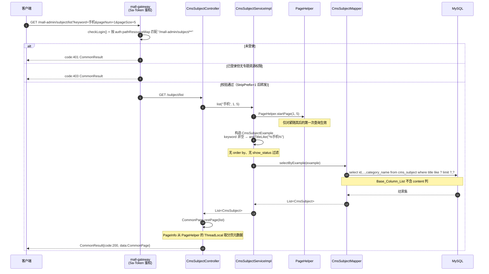
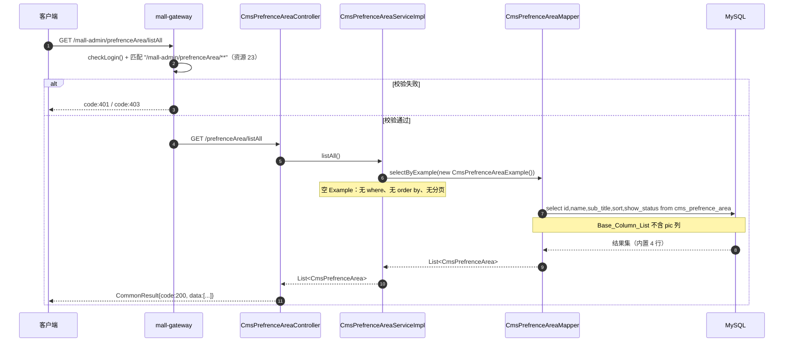
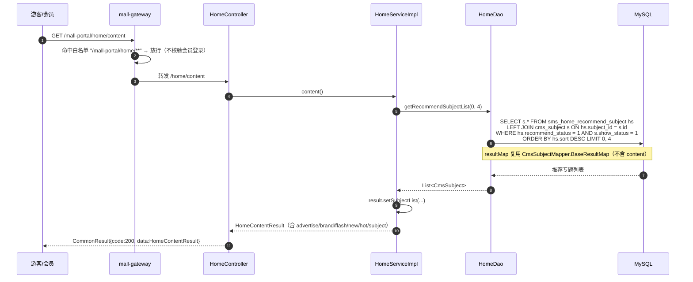
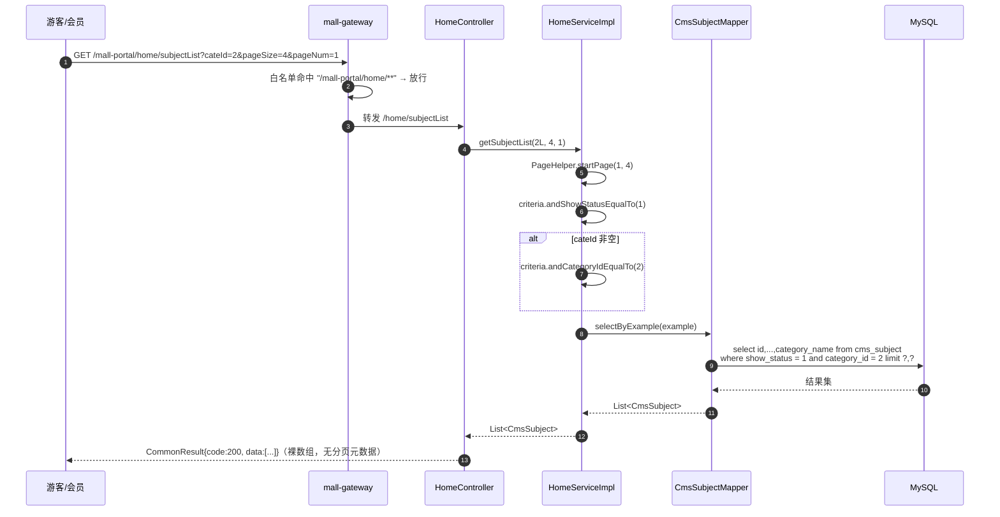
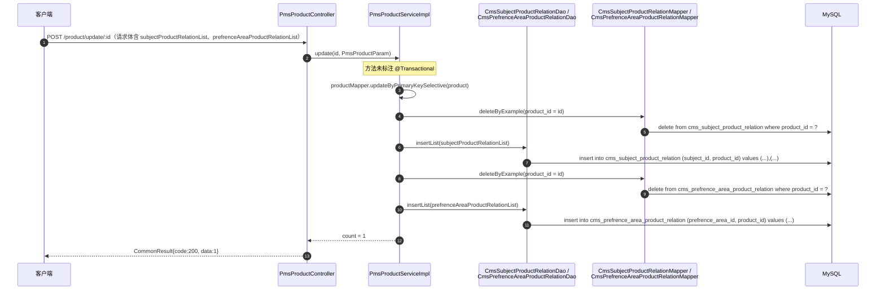

# 详细设计 · 内容管理

| 项目 | 内容 |
| --- | --- |
| 文档编号 | DD-CMS-001 |
| 所属业务域 | 内容域（`cms`） |
| 涉及服务 | `mall-admin`（:8080，接口侧）、`mall-portal`（:8085，仅消费 `cms_subject`） |
| 涉及数据表 | `cms_subject`、`cms_subject_category`、`cms_subject_comment`、`cms_subject_product_relation`、`cms_topic`、`cms_topic_category`、`cms_topic_comment`、`cms_help`、`cms_help_category`、`cms_prefrence_area`、`cms_prefrence_area_product_relation`、`cms_member_report`（共 12 张） |
| 接口数量 | **3 个**（`CmsSubjectController` 2 + `CmsPrefrenceAreaController` 1，全部为后台查询接口） |
| 网关前缀 | `/mall-admin/subject/**`、`/mall-admin/prefrenceArea/**` |
| 控制器 | `CmsSubjectController`(2)、`CmsPrefrenceAreaController`(1) |
| 文档状态 | 待评审 |

---

## 一、概述

### 1.1 范围

本文档描述 mall-swarm **内容域（`cms`）** 的详细设计。内容域共 12 张物理表，但**当前只有 2 张表具备对外查询接口**，因此本文档的篇幅重心是**表结构梳理**与**未实现能力的清单化说明**，而非接口描述。

覆盖内容：

- **数据库设计**：12 张 `cms_*` 表的真实 DDL、逐表字段说明、状态字典、关联与冗余、索引与约束现状、设计问题与建议
- **接口设计**：3 个 REST 接口的请求参数、响应结构与数据模型；**未实现能力清单**；接口文档与实现不一致清单
- **包设计**：跨 `mall-admin` / `mall-portal` / `mall-mbg` / `mall-common` 的包结构与类职责
- **运行流程**：专题分页查询、优选专区列表查询、前台推荐专题展示链路、商品保存时对内容域关系表的间接写入
- **日志设计**：日志框架、访问日志切点、本模块埋点建议与现存问题
- **测试用例设计**：功能、边界、异常三类用例，并补充表结构层面的约束用例

不在本文档范围内：

- `sms_home_recommend_subject`（首页推荐专题）的 CRUD 设计，见 [`详细设计-营销-首页运营位.md`](./详细设计-营销-首页运营位.md)。
- 商品主数据与商品保存流程的设计，见商品管理详细设计；本文档只描述其对 `cms_subject_product_relation` / `cms_prefrence_area_product_relation` 的写入。
- 前台首页页面的渲染与前端路由。

### 1.2 术语

| 术语 | 含义 |
| --- | --- |
| 专题（Subject） | 运营侧的内容聚合页（如「polo衬衫的也时尚」），归属专题分类，可关联多个商品 |
| 优选专区（Prefrence Area） | 「优选主题」运营位，可关联多个商品。表名与类名均按原项目拼写 `Prefrence`（少一个 `e`），非笔误 |
| 话题（Topic） | 社区话题，具备起止时间、参与人数、关注人数、奖品与参与方式 |
| 帮助（Help） | 帮助中心文档，按帮助分类组织 |
| 会员举报（Member Report） | 对商品评价 / 话题内容 / 用户评论的举报记录，含举报状态与处理结果 |
| 关系表 | `cms_subject_product_relation`、`cms_prefrence_area_product_relation`，均为「主表 ↔ `pms_product`」的多对多中间表 |
| 内容域接口 | 特指 URL 前缀为 `/subject/**`、`/prefrenceArea/**` 的后台接口，共 3 个 |

### 1.3 接口清单总览

| # | 方法 | 路径（服务内） | 网关路径 | 说明 | 控制器 |
| --- | --- | --- | --- | --- | --- |
| 1 | GET | `/subject/listAll` | `/mall-admin/subject/listAll` | 获取全部商品专题 | `CmsSubjectController` |
| 2 | GET | `/subject/list` | `/mall-admin/subject/list` | 根据专题名称分页获取专题 | `CmsSubjectController` |
| 3 | GET | `/prefrenceArea/listAll` | `/mall-admin/prefrenceArea/listAll` | 获取所有商品优选 | `CmsPrefrenceAreaController` |

> **鉴权**：三个网关路径均**不在白名单**（`mall-gateway/src/main/resources/application.yml` 的 `secure.ignore.urls` 仅放行 `/mall-admin/admin/login`、`/mall-admin/admin/register`、`/mall-admin/minio/upload`），因此：
>
> 1. 先由 `StpUtil.checkLogin()` 校验管理员登录态，未登录返回 `code: 401`；
> 2. 再由网关按 Redis hash `auth:pathResourceMap` 匹配权限，路径 `/mall-admin/subject/**` 对应资源「24:商品专题管理」、`/mall-admin/prefrenceArea/**` 对应资源「23: 商品优选管理」（权限码格式见 3.1），无权限返回 `code: 403`。
>
> 资源数据取自 `document/sql/mall.sql` 的 `ums_resource` 表（id=24、id=23）。注意 id=23 的资源名称为 `' 商品优选管理'`，**首字符为空格**（`mall.sql` 原文如此），权限码字符串亦含该空格。

### 1.4 现状速览：表多接口少（本文档最重要的结论）

| 统计项 | 数量 | 说明 |
| --- | --- | --- |
| 内容域物理表 | **12** | 见 2.1 |
| 内容域 `mall-mbg` 生成物 | 12 个 `Cms*` model + 12 个 `Cms*Mapper` + 12 个 `Cms*Example` | 由 MyBatis Generator 按全表生成，与是否被使用无关 |
| 内容域对外接口 | **3**（涉及 2 张表） | 全部是「列表查询」，无新增、无更新、无删除、无详情 |
| `mall-admin` 内容域控制器 | 2 | `CmsSubjectController`、`CmsPrefrenceAreaController` |
| 具备业务调用的表 | **4** | `cms_subject`、`cms_prefrence_area`（直接读）；`cms_subject_product_relation`、`cms_prefrence_area_product_relation`（被商品接口间接读写） |
| 除 MBG 生成代码外**无任何后端代码调用**的表 | **8** | `cms_subject_category`、`cms_subject_comment`、`cms_topic`、`cms_topic_category`、`cms_topic_comment`、`cms_help`、`cms_help_category`、`cms_member_report` |
| 无**专属** REST 接口的表 | **10** | 上述 8 张 + 2 张关系表（关系表只能随商品接口间接写入） |

**口径说明**（避免歧义）：若按「是否存在 URL 前缀属于 `/subject`、`/prefrenceArea` 的专属接口」统计，12 张表中有 **10 张**无专属接口；若按「是否存在任何后端业务代码调用（含随其它模块间接读写）」统计，仍有 **8 张**完全没有任何后端能力。

**「表多接口少」现象的候选解释**（均为**待确认事项**，本文档不作结论，统一登记在 8.2）：

| 候选解释 | 支持证据 | 反对/存疑证据 |
| --- | --- | --- |
| ① 功能规划过但从未实现（最常见） | `document/mind/cms.emmx`（内容域功能脑图）明确规划了「专题管理 / 优选主题 / 话题管理 / 帮助管理 / 举报管理」五块，含列表、发布、分类、批量操作等节点；`docs/需求分析.md` 的 `FR-CMS-01`~`FR-CMS-06` 也逐条描述了对应用例 | 需求分析是逆向整理的现状文档，不能证明「曾计划实现」 |
| ② 由前端直连其它服务或直连数据库 | 仓库内不存在对应控制器与 Service，但 12 张表与全部 Mapper 均已生成，具备「前端另接一套后端」的可能 | 仓库内无任何网关路由或 Feign 客户端指向其它内容服务；`mall-gateway` 路由表只有 5 个服务 |
| ③ 历史遗留 / 从原 `mall` 单体项目裁剪 | 原 `mall` 项目与 `mall-swarm` 共享同一套 `mall.sql` 与 MBG 配置；数据表注释存在明显复制粘贴痕迹（见 2.7 ⑦） | 无法从本仓库证明裁剪行为 |
| ④ 需求已废弃 | `cms_help`、`cms_topic*`、`cms_subject_comment`、`cms_member_report` 内置数据均为 **0 行**（见 2.1 数据基线） | 无废弃说明文档、无 `ums_resource` 记录被删除的痕迹（这类资源记录从未存在） |
| ⑤ 前台不需要、后台也就不做 | 前台 `mall-portal` 仅消费 `cms_subject`（`HomeController` / `HomeServiceImpl`），不消费 topic / help / report | 需求分析 `FR-CMS-02`~`FR-CMS-06` 均描述了前台可见能力 |

> **本文档的处理原则**：不为这 10 张表虚构任何接口。接口设计章节（3.5）只列「应有而缺失的能力」与「缺失的判定依据」，具体实现方案需在 8.2 的待确认事项闭环后再补充。

---

## 二、数据库设计

### 2.1 表清单与「是否有后端接口」对照

| 表名 | 域内类型 | 表注释 | 专属接口 | 业务代码调用位置（实测） |
| --- | --- | --- | --- | --- |
| `cms_subject` | 主表 | 专题表 | ✅ 2 个 | 读：`CmsSubjectServiceImpl.listAll/list`、`HomeServiceImpl.getSubjectList`、`HomeDao.getRecommendSubjectList`（`HomeDao.xml`） |
| `cms_prefrence_area` | 主表 | 优选专区 | ✅ 1 个 | 读：`CmsPrefrenceAreaServiceImpl.listAll` |
| `cms_subject_product_relation` | 关系表 | 专题商品关系表 | ❌ | 写：`PmsProductServiceImpl.create/update` → `CmsSubjectProductRelationDao.insertList`；读：`PmsProductDao.getUpdateInfo` 的嵌套 select |
| `cms_prefrence_area_product_relation` | 关系表 | 优选专区和产品关系表 | ❌ | 写：`PmsProductServiceImpl.create/update` → `CmsPrefrenceAreaProductRelationDao.insertList`；读：`PmsProductDao.getUpdateInfo` 的嵌套 select |
| `cms_subject_category` | 主表 | 专题分类表 | ❌ | **无**（仅 `CmsSubjectCategoryMapper` 生成代码） |
| `cms_subject_comment` | 主表 | 专题评论表 | ❌ | **无** |
| `cms_topic` | 主表 | 话题表 | ❌ | **无** |
| `cms_topic_category` | 主表 | 话题分类表 | ❌ | **无** |
| `cms_topic_comment` | 主表 | 专题评论表（**注释疑似复制错误**） | ❌ | **无** |
| `cms_help` | 主表 | 帮助表 | ❌ | **无** |
| `cms_help_category` | 主表 | 帮助分类表 | ❌ | **无** |
| `cms_member_report` | 主表 | 用户举报表 | ❌ | **无**；且 `CmsMemberReportMapper` **没有** `selectByPrimaryKey` / `updateByPrimaryKeySelective` / `deleteByPrimaryKey`（表无主键，MBG 无法生成） |

> 「专属接口」列中，`cms_prefrence_area_product_relation` 与 `cms_subject_product_relation` 均为 ❌：二者只能通过 `/product/create`、`/product/update/{id}` 间接写入，不能独立维护。

**内置数据基线**（取自 `document/sql/mall.sql` 的 `INSERT` 语句，共 5 张表有数据）：

| 表名 | 内置行数 | 备注 |
| --- | --- | --- |
| `cms_subject` | 6 | `AUTO_INCREMENT = 7`；`category_name` 仅两种值：服装专题 / 手机专题 |
| `cms_subject_category` | 2 | `AUTO_INCREMENT = 3`；`show_status`、`sort`、`subject_count` 全为 NULL |
| `cms_subject_product_relation` | 13 | `AUTO_INCREMENT = 71`（id 跳号，说明历史上发生过删除） |
| `cms_prefrence_area` | 4 | `AUTO_INCREMENT = 5`；仅 id=1 的 `show_status=1`，`sort` 全为 NULL，`pic` 全为 NULL |
| `cms_prefrence_area_product_relation` | 8 | `AUTO_INCREMENT = 25`（id 跳号） |
| 其余 7 张表 | **0** | `cms_subject_comment`、`cms_topic`、`cms_topic_category`、`cms_topic_comment`、`cms_help`、`cms_help_category`、`cms_member_report` |

### 2.2 建表语句（现状）

以下 12 段 DDL 原样摘自 `document/sql/mall.sql`（第 20–278 行），未做删改（仅保留 `DROP TABLE` + `CREATE TABLE`，省略 `INSERT` 数据行）。

```sql
DROP TABLE IF EXISTS `cms_help`;
CREATE TABLE `cms_help`  (
  `id` bigint(20) NOT NULL AUTO_INCREMENT,
  `category_id` bigint(20) NULL DEFAULT NULL,
  `icon` varchar(500) CHARACTER SET utf8 COLLATE utf8_general_ci NULL DEFAULT NULL,
  `title` varchar(100) CHARACTER SET utf8 COLLATE utf8_general_ci NULL DEFAULT NULL,
  `show_status` int(1) NULL DEFAULT NULL,
  `create_time` datetime NULL DEFAULT NULL,
  `read_count` int(1) NULL DEFAULT NULL,
  `content` text CHARACTER SET utf8 COLLATE utf8_general_ci NULL,
  PRIMARY KEY (`id`) USING BTREE
) ENGINE = InnoDB AUTO_INCREMENT = 1 CHARACTER SET = utf8 COLLATE = utf8_general_ci COMMENT = '帮助表' ROW_FORMAT = DYNAMIC;

DROP TABLE IF EXISTS `cms_help_category`;
CREATE TABLE `cms_help_category`  (
  `id` bigint(20) NOT NULL AUTO_INCREMENT,
  `name` varchar(100) CHARACTER SET utf8 COLLATE utf8_general_ci NULL DEFAULT NULL,
  `icon` varchar(500) CHARACTER SET utf8 COLLATE utf8_general_ci NULL DEFAULT NULL COMMENT '分类图标',
  `help_count` int(11) NULL DEFAULT NULL COMMENT '专题数量',
  `show_status` int(2) NULL DEFAULT NULL,
  `sort` int(11) NULL DEFAULT NULL,
  PRIMARY KEY (`id`) USING BTREE
) ENGINE = InnoDB AUTO_INCREMENT = 1 CHARACTER SET = utf8 COLLATE = utf8_general_ci COMMENT = '帮助分类表' ROW_FORMAT = DYNAMIC;

DROP TABLE IF EXISTS `cms_member_report`;
CREATE TABLE `cms_member_report`  (
  `id` bigint(20) NULL DEFAULT NULL,
  `report_type` int(1) NULL DEFAULT NULL COMMENT '举报类型：0->商品评价；1->话题内容；2->用户评论',
  `report_member_name` varchar(100) CHARACTER SET utf8 COLLATE utf8_general_ci NULL DEFAULT NULL COMMENT '举报人',
  `create_time` datetime NULL DEFAULT NULL,
  `report_object` varchar(100) CHARACTER SET utf8 COLLATE utf8_general_ci NULL DEFAULT NULL,
  `report_status` int(1) NULL DEFAULT NULL COMMENT '举报状态：0->未处理；1->已处理',
  `handle_status` int(1) NULL DEFAULT NULL COMMENT '处理结果：0->无效；1->有效；2->恶意',
  `note` varchar(200) CHARACTER SET utf8 COLLATE utf8_general_ci NULL DEFAULT NULL
) ENGINE = InnoDB CHARACTER SET = utf8 COLLATE = utf8_general_ci COMMENT = '用户举报表' ROW_FORMAT = DYNAMIC;

DROP TABLE IF EXISTS `cms_prefrence_area`;
CREATE TABLE `cms_prefrence_area`  (
  `id` bigint(20) NOT NULL AUTO_INCREMENT,
  `name` varchar(255) CHARACTER SET utf8 COLLATE utf8_general_ci NULL DEFAULT NULL,
  `sub_title` varchar(255) CHARACTER SET utf8 COLLATE utf8_general_ci NULL DEFAULT NULL,
  `pic` varbinary(500) NULL DEFAULT NULL COMMENT '展示图片',
  `sort` int(11) NULL DEFAULT NULL,
  `show_status` int(1) NULL DEFAULT NULL,
  PRIMARY KEY (`id`) USING BTREE
) ENGINE = InnoDB AUTO_INCREMENT = 5 CHARACTER SET = utf8 COLLATE = utf8_general_ci COMMENT = '优选专区' ROW_FORMAT = DYNAMIC;

DROP TABLE IF EXISTS `cms_prefrence_area_product_relation`;
CREATE TABLE `cms_prefrence_area_product_relation`  (
  `id` bigint(20) NOT NULL AUTO_INCREMENT,
  `prefrence_area_id` bigint(20) NULL DEFAULT NULL,
  `product_id` bigint(20) NULL DEFAULT NULL,
  PRIMARY KEY (`id`) USING BTREE
) ENGINE = InnoDB AUTO_INCREMENT = 25 CHARACTER SET = utf8 COLLATE = utf8_general_ci COMMENT = '优选专区和产品关系表' ROW_FORMAT = DYNAMIC;

DROP TABLE IF EXISTS `cms_subject`;
CREATE TABLE `cms_subject`  (
  `id` bigint(20) NOT NULL AUTO_INCREMENT,
  `category_id` bigint(20) NULL DEFAULT NULL,
  `title` varchar(100) CHARACTER SET utf8 COLLATE utf8_general_ci NULL DEFAULT NULL,
  `pic` varchar(500) CHARACTER SET utf8 COLLATE utf8_general_ci NULL DEFAULT NULL COMMENT '专题主图',
  `product_count` int(11) NULL DEFAULT NULL COMMENT '关联产品数量',
  `recommend_status` int(1) NULL DEFAULT NULL,
  `create_time` datetime NULL DEFAULT NULL,
  `collect_count` int(11) NULL DEFAULT NULL,
  `read_count` int(11) NULL DEFAULT NULL,
  `comment_count` int(11) NULL DEFAULT NULL,
  `album_pics` varchar(1000) CHARACTER SET utf8 COLLATE utf8_general_ci NULL DEFAULT NULL COMMENT '画册图片用逗号分割',
  `description` varchar(1000) CHARACTER SET utf8 COLLATE utf8_general_ci NULL DEFAULT NULL,
  `show_status` int(1) NULL DEFAULT NULL COMMENT '显示状态：0->不显示；1->显示',
  `content` text CHARACTER SET utf8 COLLATE utf8_general_ci NULL,
  `forward_count` int(11) NULL DEFAULT NULL COMMENT '转发数',
  `category_name` varchar(200) CHARACTER SET utf8 COLLATE utf8_general_ci NULL DEFAULT NULL COMMENT '专题分类名称',
  PRIMARY KEY (`id`) USING BTREE
) ENGINE = InnoDB AUTO_INCREMENT = 7 CHARACTER SET = utf8 COLLATE = utf8_general_ci COMMENT = '专题表' ROW_FORMAT = DYNAMIC;

DROP TABLE IF EXISTS `cms_subject_category`;
CREATE TABLE `cms_subject_category`  (
  `id` bigint(20) NOT NULL AUTO_INCREMENT,
  `name` varchar(100) CHARACTER SET utf8 COLLATE utf8_general_ci NULL DEFAULT NULL,
  `icon` varchar(500) CHARACTER SET utf8 COLLATE utf8_general_ci NULL DEFAULT NULL COMMENT '分类图标',
  `subject_count` int(11) NULL DEFAULT NULL COMMENT '专题数量',
  `show_status` int(2) NULL DEFAULT NULL,
  `sort` int(11) NULL DEFAULT NULL,
  PRIMARY KEY (`id`) USING BTREE
) ENGINE = InnoDB AUTO_INCREMENT = 3 CHARACTER SET = utf8 COLLATE = utf8_general_ci COMMENT = '专题分类表' ROW_FORMAT = DYNAMIC;

DROP TABLE IF EXISTS `cms_subject_comment`;
CREATE TABLE `cms_subject_comment`  (
  `id` bigint(20) NOT NULL AUTO_INCREMENT,
  `subject_id` bigint(20) NULL DEFAULT NULL,
  `member_nick_name` varchar(255) CHARACTER SET utf8 COLLATE utf8_general_ci NULL DEFAULT NULL,
  `member_icon` varchar(255) CHARACTER SET utf8 COLLATE utf8_general_ci NULL DEFAULT NULL,
  `content` varchar(1000) CHARACTER SET utf8 COLLATE utf8_general_ci NULL DEFAULT NULL,
  `create_time` datetime NULL DEFAULT NULL,
  `show_status` int(1) NULL DEFAULT NULL,
  PRIMARY KEY (`id`) USING BTREE
) ENGINE = InnoDB AUTO_INCREMENT = 1 CHARACTER SET = utf8 COLLATE = utf8_general_ci COMMENT = '专题评论表' ROW_FORMAT = DYNAMIC;

DROP TABLE IF EXISTS `cms_subject_product_relation`;
CREATE TABLE `cms_subject_product_relation`  (
  `id` bigint(20) NOT NULL AUTO_INCREMENT,
  `subject_id` bigint(20) NULL DEFAULT NULL,
  `product_id` bigint(20) NULL DEFAULT NULL,
  PRIMARY KEY (`id`) USING BTREE
) ENGINE = InnoDB AUTO_INCREMENT = 71 CHARACTER SET = utf8 COLLATE = utf8_general_ci COMMENT = '专题商品关系表' ROW_FORMAT = DYNAMIC;

DROP TABLE IF EXISTS `cms_topic`;
CREATE TABLE `cms_topic`  (
  `id` bigint(20) NOT NULL AUTO_INCREMENT,
  `category_id` bigint(20) NULL DEFAULT NULL,
  `name` varchar(255) CHARACTER SET utf8 COLLATE utf8_general_ci NULL DEFAULT NULL,
  `create_time` datetime NULL DEFAULT NULL,
  `start_time` datetime NULL DEFAULT NULL,
  `end_time` datetime NULL DEFAULT NULL,
  `attend_count` int(11) NULL DEFAULT NULL COMMENT '参与人数',
  `attention_count` int(11) NULL DEFAULT NULL COMMENT '关注人数',
  `read_count` int(11) NULL DEFAULT NULL,
  `award_name` varchar(100) CHARACTER SET utf8 COLLATE utf8_general_ci NULL DEFAULT NULL COMMENT '奖品名称',
  `attend_type` varchar(100) CHARACTER SET utf8 COLLATE utf8_general_ci NULL DEFAULT NULL COMMENT '参与方式',
  `content` text CHARACTER SET utf8 COLLATE utf8_general_ci NULL COMMENT '话题内容',
  PRIMARY KEY (`id`) USING BTREE
) ENGINE = InnoDB AUTO_INCREMENT = 1 CHARACTER SET = utf8 COLLATE = utf8_general_ci COMMENT = '话题表' ROW_FORMAT = DYNAMIC;

DROP TABLE IF EXISTS `cms_topic_category`;
CREATE TABLE `cms_topic_category`  (
  `id` bigint(20) NOT NULL AUTO_INCREMENT,
  `name` varchar(100) CHARACTER SET utf8 COLLATE utf8_general_ci NULL DEFAULT NULL,
  `icon` varchar(500) CHARACTER SET utf8 COLLATE utf8_general_ci NULL DEFAULT NULL COMMENT '分类图标',
  `subject_count` int(11) NULL DEFAULT NULL COMMENT '专题数量',
  `show_status` int(2) NULL DEFAULT NULL,
  `sort` int(11) NULL DEFAULT NULL,
  PRIMARY KEY (`id`) USING BTREE
) ENGINE = InnoDB AUTO_INCREMENT = 1 CHARACTER SET = utf8 COLLATE = utf8_general_ci COMMENT = '话题分类表' ROW_FORMAT = DYNAMIC;

DROP TABLE IF EXISTS `cms_topic_comment`;
CREATE TABLE `cms_topic_comment`  (
  `id` bigint(20) NOT NULL AUTO_INCREMENT,
  `member_nick_name` varchar(255) CHARACTER SET utf8 COLLATE utf8_general_ci NULL DEFAULT NULL,
  `topic_id` bigint(20) NULL DEFAULT NULL,
  `member_icon` varchar(255) CHARACTER SET utf8 COLLATE utf8_general_ci NULL DEFAULT NULL,
  `content` varchar(1000) CHARACTER SET utf8 COLLATE utf8_general_ci NULL DEFAULT NULL,
  `create_time` datetime NULL DEFAULT NULL,
  `show_status` int(1) NULL DEFAULT NULL,
  PRIMARY KEY (`id`) USING BTREE
) ENGINE = InnoDB AUTO_INCREMENT = 1 CHARACTER SET = utf8 COLLATE = utf8_general_ci COMMENT = '专题评论表' ROW_FORMAT = DYNAMIC;
```

### 2.3 字段说明

> **填写约定**：「中文名」仅取自 `mall.sql` 的列 `COMMENT`；列无 `COMMENT` 时一律标注 **无注释**，不臆造中文名。「说明」列的**推断**内容均显式标注「（推断）」。

#### 2.3.1 `cms_subject`（专题表，16 列）

| 字段 | 类型 | 允许空 | 默认值 | 中文名 | 说明 |
| --- | --- | --- | --- | --- | --- |
| `id` | bigint(20) | 否 | AUTO_INCREMENT | 无注释 | 主键（推断） |
| `category_id` | bigint(20) | 是 | NULL | 无注释 | 逻辑外键 → `cms_subject_category.id`（推断） |
| `title` | varchar(100) | 是 | NULL | 无注释 | 专题标题；`/subject/list` 的 `keyword` 模糊匹配此列（推断） |
| `pic` | varchar(500) | 是 | NULL | 专题主图 | 图片 URL；内置数据全为 NULL |
| `product_count` | int(11) | 是 | NULL | 关联产品数量 | 统计冗余，无维护代码，内置数据全为 NULL |
| `recommend_status` | int(1) | 是 | NULL | 无注释 | 是否推荐（推断）；与 `sms_home_recommend_subject.recommend_status` 语义重叠 |
| `create_time` | datetime | 是 | NULL | 无注释 | 创建时间（推断） |
| `collect_count` | int(11) | 是 | NULL | 无注释 | 收藏数（推断），无维护代码 |
| `read_count` | int(11) | 是 | NULL | 无注释 | 阅读数（推断），无维护代码 |
| `comment_count` | int(11) | 是 | NULL | 无注释 | 评论数（推断），无维护代码 |
| `album_pics` | varchar(1000) | 是 | NULL | 画册图片用逗号分割 | 多图以英文逗号分隔 |
| `description` | varchar(1000) | 是 | NULL | 无注释 | 专题描述（推断） |
| `show_status` | int(1) | 是 | NULL | 显示状态：0->不显示；1->显示 | 见 2.4 |
| `content` | text | 是 | NULL | 无注释 | 专题正文（推断）；`selectByExample` **不查询**此列，接口恒返回 null |
| `forward_count` | int(11) | 是 | NULL | 转发数 | 无维护代码 |
| `category_name` | varchar(200) | 是 | NULL | 专题分类名称 | **冗余**字段，无同步代码（见 2.5） |

#### 2.3.2 `cms_prefrence_area`（优选专区，6 列）

| 字段 | 类型 | 允许空 | 默认值 | 中文名 | 说明 |
| --- | --- | --- | --- | --- | --- |
| `id` | bigint(20) | 否 | AUTO_INCREMENT | 无注释 | 主键（推断） |
| `name` | varchar(255) | 是 | NULL | 无注释 | 专区名称（推断） |
| `sub_title` | varchar(255) | 是 | NULL | 无注释 | 副标题（推断） |
| `pic` | varbinary(500) | 是 | NULL | 展示图片 | **二进制列**，非 URL；`selectByExample` 不查询此列，接口恒返回 null |
| `sort` | int(11) | 是 | NULL | 无注释 | 排序（推断）；无任何查询使用它，内置数据全为 NULL |
| `show_status` | int(1) | 是 | NULL | 无注释 | 显示状态（推断），见 2.4 |

#### 2.3.3 `cms_prefrence_area_product_relation`（优选专区和产品关系表，3 列）

| 字段 | 类型 | 允许空 | 默认值 | 中文名 | 说明 |
| --- | --- | --- | --- | --- | --- |
| `id` | bigint(20) | 否 | AUTO_INCREMENT | 无注释 | 代理主键（推断） |
| `prefrence_area_id` | bigint(20) | 是 | NULL | 无注释 | 逻辑外键 → `cms_prefrence_area.id`（推断） |
| `product_id` | bigint(20) | 是 | NULL | 无注释 | 逻辑外键 → `pms_product.id`（推断）；无索引 |

#### 2.3.4 `cms_subject_product_relation`（专题商品关系表，3 列）

| 字段 | 类型 | 允许空 | 默认值 | 中文名 | 说明 |
| --- | --- | --- | --- | --- | --- |
| `id` | bigint(20) | 否 | AUTO_INCREMENT | 无注释 | 代理主键（推断） |
| `subject_id` | bigint(20) | 是 | NULL | 无注释 | 逻辑外键 → `cms_subject.id`（推断） |
| `product_id` | bigint(20) | 是 | NULL | 无注释 | 逻辑外键 → `pms_product.id`（推断）；无索引 |

#### 2.3.5 `cms_subject_category`（专题分类表，6 列）

| 字段 | 类型 | 允许空 | 默认值 | 中文名 | 说明 |
| --- | --- | --- | --- | --- | --- |
| `id` | bigint(20) | 否 | AUTO_INCREMENT | 无注释 | 主键（推断） |
| `name` | varchar(100) | 是 | NULL | 无注释 | 分类名称（推断），如「服装专题」 |
| `icon` | varchar(500) | 是 | NULL | 分类图标 | 图标 URL（推断） |
| `subject_count` | int(11) | 是 | NULL | 专题数量 | 统计冗余，无维护代码 |
| `show_status` | int(2) | 是 | NULL | 无注释 | 显示状态（推断）；注意类型为 `int(2)`，与其它表 `int(1)` 不一致 |
| `sort` | int(11) | 是 | NULL | 无注释 | 排序（推断） |

#### 2.3.6 `cms_subject_comment`（专题评论表，7 列）

| 字段 | 类型 | 允许空 | 默认值 | 中文名 | 说明 |
| --- | --- | --- | --- | --- | --- |
| `id` | bigint(20) | 否 | AUTO_INCREMENT | 无注释 | 主键（推断） |
| `subject_id` | bigint(20) | 是 | NULL | 无注释 | 逻辑外键 → `cms_subject.id`（推断） |
| `member_nick_name` | varchar(255) | 是 | NULL | 无注释 | 评论会员昵称快照（推断） |
| `member_icon` | varchar(255) | 是 | NULL | 无注释 | 评论会员头像快照（推断） |
| `content` | varchar(1000) | 是 | NULL | 无注释 | 评论内容（推断） |
| `create_time` | datetime | 是 | NULL | 无注释 | 评论时间（推断） |
| `show_status` | int(1) | 是 | NULL | 无注释 | 是否显示（推断），内容审核位 |

#### 2.3.7 `cms_topic`（话题表，12 列）

| 字段 | 类型 | 允许空 | 默认值 | 中文名 | 说明 |
| --- | --- | --- | --- | --- | --- |
| `id` | bigint(20) | 否 | AUTO_INCREMENT | 无注释 | 主键（推断） |
| `category_id` | bigint(20) | 是 | NULL | 无注释 | 逻辑外键 → `cms_topic_category.id`（推断） |
| `name` | varchar(255) | 是 | NULL | 无注释 | 话题名称（推断） |
| `create_time` | datetime | 是 | NULL | 无注释 | 创建时间（推断） |
| `start_time` | datetime | 是 | NULL | 无注释 | 开始时间（推断） |
| `end_time` | datetime | 是 | NULL | 无注释 | 结束时间（推断） |
| `attend_count` | int(11) | 是 | NULL | 参与人数 | 统计冗余 |
| `attention_count` | int(11) | 是 | NULL | 关注人数 | 统计冗余 |
| `read_count` | int(11) | 是 | NULL | 无注释 | 阅读数（推断） |
| `award_name` | varchar(100) | 是 | NULL | 奖品名称 | — |
| `attend_type` | varchar(100) | 是 | NULL | 参与方式 | 文本描述，非字典值 |
| `content` | text | 是 | NULL | 话题内容 | — |

#### 2.3.8 `cms_topic_category`（话题分类表，6 列）

| 字段 | 类型 | 允许空 | 默认值 | 中文名 | 说明 |
| --- | --- | --- | --- | --- | --- |
| `id` | bigint(20) | 否 | AUTO_INCREMENT | 无注释 | 主键（推断） |
| `name` | varchar(100) | 是 | NULL | 无注释 | 分类名称（推断） |
| `icon` | varchar(500) | 是 | NULL | 分类图标 | 图标 URL |
| `subject_count` | int(11) | 是 | NULL | 专题数量 | **注释疑似复制错误**：本表为话题分类，应为「话题数量」 |
| `show_status` | int(2) | 是 | NULL | 无注释 | 显示状态（推断）；类型 `int(2)` |
| `sort` | int(11) | 是 | NULL | 无注释 | 排序（推断） |

#### 2.3.9 `cms_topic_comment`（话题评论表，7 列）

| 字段 | 类型 | 允许空 | 默认值 | 中文名 | 说明 |
| --- | --- | --- | --- | --- | --- |
| `id` | bigint(20) | 否 | AUTO_INCREMENT | 无注释 | 主键（推断） |
| `member_nick_name` | varchar(255) | 是 | NULL | 无注释 | 评论会员昵称快照（推断） |
| `topic_id` | bigint(20) | 是 | NULL | 无注释 | 逻辑外键 → `cms_topic.id`（推断）。注意列在表中的物理位置在 `member_nick_name` 之后 |
| `member_icon` | varchar(255) | 是 | NULL | 无注释 | 评论会员头像快照（推断） |
| `content` | varchar(1000) | 是 | NULL | 无注释 | 评论内容（推断） |
| `create_time` | datetime | 是 | NULL | 无注释 | 评论时间（推断） |
| `show_status` | int(1) | 是 | NULL | 无注释 | 是否显示（推断） |

#### 2.3.10 `cms_help`（帮助表，8 列）

| 字段 | 类型 | 允许空 | 默认值 | 中文名 | 说明 |
| --- | --- | --- | --- | --- | --- |
| `id` | bigint(20) | 否 | AUTO_INCREMENT | 无注释 | 主键（推断） |
| `category_id` | bigint(20) | 是 | NULL | 无注释 | 逻辑外键 → `cms_help_category.id`（推断） |
| `icon` | varchar(500) | 是 | NULL | 无注释 | 图标 URL（推断） |
| `title` | varchar(100) | 是 | NULL | 无注释 | 帮助标题（推断） |
| `show_status` | int(1) | 是 | NULL | 无注释 | 是否显示（推断） |
| `create_time` | datetime | 是 | NULL | 无注释 | 创建时间（推断） |
| `read_count` | int(1) | 是 | NULL | 无注释 | 阅读数（推断）。**类型 `int(1)` 与语义不符**，应为 `int(11)` |
| `content` | text | 是 | NULL | 无注释 | 帮助正文（推断） |

#### 2.3.11 `cms_help_category`（帮助分类表，6 列）

| 字段 | 类型 | 允许空 | 默认值 | 中文名 | 说明 |
| --- | --- | --- | --- | --- | --- |
| `id` | bigint(20) | 否 | AUTO_INCREMENT | 无注释 | 主键（推断） |
| `name` | varchar(100) | 是 | NULL | 无注释 | 分类名称（推断） |
| `icon` | varchar(500) | 是 | NULL | 分类图标 | 图标 URL |
| `help_count` | int(11) | 是 | NULL | 专题数量 | **注释疑似复制错误**：应为「帮助数量」 |
| `show_status` | int(2) | 是 | NULL | 无注释 | 显示状态（推断）；类型 `int(2)` |
| `sort` | int(11) | 是 | NULL | 无注释 | 排序（推断） |

#### 2.3.12 `cms_member_report`（用户举报表，8 列）

| 字段 | 类型 | 允许空 | 默认值 | 中文名 | 说明 |
| --- | --- | --- | --- | --- | --- |
| `id` | bigint(20) | **是** | NULL | 无注释 | **既非主键、也无自增、也无索引**（内容域中唯一无主键的表） |
| `report_type` | int(1) | 是 | NULL | 举报类型：0->商品评价；1->话题内容；2->用户评论 | 见 2.4 |
| `report_member_name` | varchar(100) | 是 | NULL | 举报人 | 名称快照，无 `member_id` 列 |
| `create_time` | datetime | 是 | NULL | 无注释 | 举报时间（推断） |
| `report_object` | varchar(100) | 是 | NULL | 无注释 | 被举报对象标识（推断）；弱类型字符串，配合 `report_type` 表达多态 |
| `report_status` | int(1) | 是 | NULL | 举报状态：0->未处理；1->已处理 | 见 2.4 |
| `handle_status` | int(1) | 是 | NULL | 处理结果：0->无效；1->有效；2->恶意 | 见 2.4 |
| `note` | varchar(200) | 是 | NULL | 无注释 | 处理备注（推断） |

### 2.4 状态字典

| 表 | 字段 | 值 | 含义 | 来源 |
| --- | --- | --- | --- | --- |
| `cms_subject` | `show_status` | 0 | 不显示 | `mall.sql` 列注释 |
| `cms_subject` | `show_status` | 1 | 显示 | `mall.sql` 列注释 |
| `cms_subject` | `recommend_status` | 0 / 1 | 不推荐 / 推荐 | **无列注释**；由同名字段 `sms_home_recommend_subject.recommend_status`（0/1）语义推断，需确认 |
| `cms_prefrence_area` | `show_status` | 0 / 1 | 不显示 / 显示 | **无列注释**；由 `cms_subject.show_status` 同名语义推断（内置数据 id=1 为 1，其余为 NULL，与「上架一条」相符） |
| `cms_subject_category` | `show_status` | 0 / 1 | 不显示 / 显示 | **无列注释**，推断同上 |
| `cms_topic_category` | `show_status` | 0 / 1 | 不显示 / 显示 | **无列注释**，推断同上 |
| `cms_help_category` | `show_status` | 0 / 1 | 不显示 / 显示 | **无列注释**，推断同上 |
| `cms_help` | `show_status` | 0 / 1 | 不显示 / 显示 | **无列注释**，推断同上 |
| `cms_subject_comment` | `show_status` | 0 / 1 | 不显示 / 显示（审核位） | **无列注释**，推断同上 |
| `cms_topic_comment` | `show_status` | 0 / 1 | 不显示 / 显示（审核位） | **无列注释**，推断同上 |
| `cms_member_report` | `report_type` | 0 | 商品评价 | `mall.sql` 列注释 |
| `cms_member_report` | `report_type` | 1 | 话题内容 | `mall.sql` 列注释 |
| `cms_member_report` | `report_type` | 2 | 用户评论 | `mall.sql` 列注释 |
| `cms_member_report` | `report_status` | 0 | 未处理 | `mall.sql` 列注释 |
| `cms_member_report` | `report_status` | 1 | 已处理 | `mall.sql` 列注释 |
| `cms_member_report` | `handle_status` | 0 | 无效 | `mall.sql` 列注释 |
| `cms_member_report` | `handle_status` | 1 | 有效 | `mall.sql` 列注释 |
| `cms_member_report` | `handle_status` | 2 | 恶意 | `mall.sql` 列注释 |

> 12 张表共出现 9 个 `show_status` 列，**全部没有列注释**，仅 `cms_subject.show_status` 有注释。所有状态列均为可空 `int`、无 `CHECK` 约束、无默认值，取值合法性完全依赖应用层——而本模块**没有任何写入接口**，因此当前不存在应用层校验点。

### 2.5 关联与冗余设计

**逻辑外键关系**（DDL 中**无任何 FOREIGN KEY**，以下均为按 `*_id` 列名与业务语义推导）：

```text
cms_subject.category_id ──────────► cms_subject_category.id        （分类归属）
cms_topic.category_id ────────────► cms_topic_category.id          （分类归属）
cms_help.category_id ─────────────► cms_help_category.id           （分类归属）

cms_subject_product_relation.subject_id ──► cms_subject.id         （多对多，写入方：商品保存）
cms_subject_product_relation.product_id ──► pms_product.id
cms_prefrence_area_product_relation.prefrence_area_id ──► cms_prefrence_area.id
cms_prefrence_area_product_relation.product_id ─────────► pms_product.id

cms_subject_comment.subject_id ───► cms_subject.id                 （一对多）
cms_topic_comment.topic_id ───────► cms_topic.id                   （一对多）

sms_home_recommend_subject.subject_id ──► cms_subject.id           （跨域：营销域 → 内容域）
cms_member_report.report_object ──► 无物理引用（多态弱类型：商品评价/话题内容/用户评论）
```

**冗余字段清单**：

| 冗余列 | 被冗余的源 | 是否同步 | 现状 |
| --- | --- | --- | --- |
| `cms_subject.category_name` | `cms_subject_category.name` | **无同步代码** | 内置 6 条数据的 `category_name` 与 `category_id` 对应关系正确，但本模块无写接口，改名后必然不一致 |
| `sms_home_recommend_subject.subject_name` | `cms_subject.title` | **无同步代码**（营销域文档已记录） | 跨域冗余，前台首页推荐位可能显示旧标题 |
| `cms_subject.product_count` | `cms_subject_product_relation` 行数 | **无维护代码** | 恒为 NULL |
| `cms_subject.collect_count` / `read_count` / `comment_count` / `forward_count` | 无对应明细表 | **无维护代码** | 恒为 NULL |
| `cms_subject_category.subject_count` / `cms_topic_category.subject_count` / `cms_help_category.help_count` | 各自主表的行数 | **无维护代码** | 恒为 NULL |
| `cms_topic.attend_count` / `attention_count` / `read_count` | 无对应明细表 | **无维护代码** | 恒为 NULL |
| `cms_subject_comment.member_nick_name` / `member_icon` | `ums_member` | 无写入代码 | 快照字段，无数据 |
| `cms_topic_comment.member_nick_name` / `member_icon` | `ums_member` | 无写入代码 | 快照字段，无数据 |
| `cms_member_report.report_member_name` | `ums_member` | 无写入代码 | 快照字段，无数据，且**没有 `member_id` 列**，举报人无法关联回会员 |

> **评价**：`docs/需求分析.md` 已说明「`cms_subject` 等表冗余名称/图片类字段是刻意的业务需求（免去列表 join），不是设计缺陷」。本文档认同该判断，但指出**实现层面缺失同步与统计代码**——冗余字段当前全部为 NULL 或不一致状态，这属于「实现缺口」而非「建模错误」。

### 2.6 索引与约束现状

| 项目 | 现状 | 影响 |
| --- | --- | --- |
| 主键 | 11 张表为 `PRIMARY KEY (id) USING BTREE`；**`cms_member_report` 无主键** | 举报表无法按行定位，MBG 无法生成 `selectByPrimaryKey` / `updateByPrimaryKeySelective` / `deleteByPrimaryKey` |
| 唯一索引 | **12 张表全部没有** | `cms_subject_product_relation` 可插入重复 `(subject_id, product_id)`；`cms_subject_category.name` 可重名 |
| 普通索引 | **12 张表全部没有** | 见下表「无索引的查询列」 |
| 外键约束 | **12 张表全部没有** | 关系表可指向不存在的专题/商品；专题删除后关系表残留孤儿行 |
| 非空约束 | 除主键外，**所有列均可为 NULL** | 业务必填项（如 `cms_subject.title`）无数据库层保障 |
| 默认值 | 除 `AUTO_INCREMENT` 外**无任何 DEFAULT**（均显式 `DEFAULT NULL`） | 状态列无默认值，需应用层赋值 |
| 字符集 | 表级 `utf8` / `utf8_general_ci`（MySQL 5.7 导出） | 与脚本第 17 行的 `SET NAMES utf8mb4` 不一致，无法存储 4 字节字符（如 emoji）；内容类字段（评论、话题正文）风险最高 |
| 逻辑删除 | **12 张表均无** | 删除即物理删除，内容不可恢复 |
| 审计字段 | 仅部分表有 `create_time`，**无 `modify_time`、无操作人字段** | 内容变更无痕迹（当前无写接口，风险留给未来） |

**无索引但被查询使用的列**：

| 表 | 列 | 使用位置 | 扫描代价 |
| --- | --- | --- | --- |
| `cms_subject` | `title` | `CmsSubjectServiceImpl.list` 的 `andTitleLike("%kw%")` | `LIKE '%kw%'` 前置通配，**即使建索引也无法命中**，必然全表扫描 |
| `cms_subject` | 无排序列 | `listAll` / `list` 均未设置 `orderByClause` | 结果顺序依赖存储引擎默认顺序，不稳定 |
| `cms_subject_product_relation` | `product_id` | `PmsProductDao.xml` → `selectSubjectProductRelationByProductId`（`where product_id=?`） | 商品编辑页每次打开都全表扫描 |
| `cms_prefrence_area_product_relation` | `product_id` | `PmsProductDao.xml` → `selectPrefrenceAreaProductRelationByProductId` | 同上 |
| `cms_subject_product_relation` | `subject_id` | 无查询使用（无接口读取某专题下的商品） | 未来实现「专题关联商品」功能时同样会全表扫描 |
| `cms_subject` | `category_id` | 前台 `/home/subjectList` 的 `andCategoryIdEqualTo(cateId)` | 前台按分类取专题会全表扫描（跨模块但同表） |

### 2.7 设计问题与建议

| # | 问题 | 影响 | 建议 |
| --- | --- | --- | --- |
| ① | 内容域 12 张表仅 2 张有接口，`FR-CMS-02`~`FR-CMS-06`（专题评论、话题、帮助、举报）**全部无后端实现** | 需求分析描述的能力不可用；`document/mind/cms.emmx` 规划的「话题管理」「帮助管理」「举报管理」界面无后端支撑 | 先闭环 8.2 待确认事项，明确这些能力是「补齐」还是「从需求中移除」；补齐时按本文档 2.x / 3.5 的清单逐项实现 |
| ② | `cms_member_report` **无主键、无自增、无索引** | 举报记录无法唯一定位，无法单条更新/删除；MBG 只能生成 `insert` / `selectByExample` / `updateByExample*`，举报「处理」功能在数据层即不可实现 | 增加 `id bigint NOT NULL AUTO_INCREMENT PRIMARY KEY`；补 `report_type` + `create_time` 组合索引 |
| ③ | 关系表 `product_id` 无索引 | 商品编辑页的两次嵌套 select 全表扫描；数据量增长后商品保存/编辑变慢 | 为 `cms_subject_product_relation(product_id)`、`cms_prefrence_area_product_relation(product_id)` 增加索引；如改为双向查询，再补 `subject_id` / `prefrence_area_id` 索引 |
| ④ | 关系表无唯一约束 | 同一「专题-商品」可重复插入；`PmsProductServiceImpl.update` 采用「先 delete by product_id 再 insert」策略，重复数据不会即时暴露但会污染统计 | 增加唯一索引 `uk_subject_product(subject_id, product_id)`、`uk_area_product(prefrence_area_id, product_id)` |
| ⑤ | `cms_subject.content`（text）、`cms_prefrence_area.pic`（varbinary）不被 `selectByExample` 返回 | 两个列表接口声明返回这两个字段（openapi 亦声明），运行时恒为 `null`；前端拿不到正文与图片 | 若列表确实不需要正文，应修正文档；若需要，改用 `selectByExampleWithBLOBs`（注意会显著放大响应与日志体积） |
| ⑥ | `cms_prefrence_area.pic` 用 `varbinary(500)` 存图片 | 二进制图片存入业务列，无法走 CDN/OSS；`byte[]` 序列化为 JSON 会变成整数数组（openapi 已如实导出为 `array[integer]`） | 改为 `varchar(500)` 存图片 URL，与 `cms_subject.pic` 保持一致；历史数据需迁移 |
| ⑦ | 冗余字段与统计字段全部无维护代码 | `category_name`、`product_count`、各类 `*_count` 恒为 NULL 或过期值 | 明确「保留但由应用维护」或「废弃删列」；若保留，在写接口实现时同步更新 |
| ⑧ | 列注释大面积缺失与复制错误 | 12 张表中 9 个 `show_status` 无注释；`cms_topic_comment` 表注释误写为「专题评论表」；`cms_topic_category.subject_count`、`cms_help_category.help_count` 注释误写为「专题数量」；`cms_help.read_count` 类型为 `int(1)` | 补齐列注释；修正 3 处错误注释；`read_count` 改为 `int(11)` |
| ⑨ | `cms_member_report.report_object` 为弱类型 `varchar(100)` 多态标识 | 举报对象无法建立引用完整性；`report_type` 与 `report_object` 的取值约定无任何代码或文档约束 | 明确 `report_object` 的编码规则（如「评价ID」「话题ID」）并写入注释；考虑拆分为 `object_type + object_id` |
| ⑩ | 无外键、无逻辑删除、无审计字段 | 删除专题/分类后关系表与评论成为孤儿；内容变更无痕迹 | 至少在应用层做引用校验；为内容主表增加 `modify_time` / 操作人（若补写接口） |
| ⑪ | `PmsProductServiceImpl.create/update` 跨域写入两张 `cms_*` 关系表但**未加 `@Transactional`** | 商品保存中途失败会残留或丢失专题/优选关系（关系表已 delete 但 insert 失败） | 为 `create` / `update` 增加 `@Transactional(rollbackFor = Exception.class)` |
| ⑫ | `ums_resource` id=23 的资源名称为 `' 商品优选管理'`（首字符为空格） | 权限码字符串 `"23: 商品优选管理"` 含前导空格，靠手工输入匹配必然出错；`StpUtil.checkPermissionOr` 按字符串精确匹配，授权配置极易写错 | 修正资源名称，去掉前导空格 |

> 说明：① 为「能力缺失」，②~④、⑫ 为数据库/配置层缺陷，⑤~⑦ 为文档与实现/建模不一致，⑧ 为可维护性问题，⑨~⑪ 为完整性风险。全部建议均为**建议**，现状已在 2.1~2.6 如实记录。

---

## 三、接口设计

### 3.1 通用约定

**统一响应结构**（`com.macro.mall.common.api.CommonResult`）：

```json
{
  "code": 200,
  "message": "操作成功",
  "data": {}
}
```

**业务码定义**（`com.macro.mall.common.api.ResultCode`）：

| code | 常量 | 含义 |
| --- | --- | --- |
| 200 | `SUCCESS` | 操作成功 |
| 401 | `UNAUTHORIZED` | 暂未登录或 token 已经过期 |
| 403 | `FORBIDDEN` | 没有相关权限 |
| 404 | `VALIDATE_FAILED` | 参数检验失败 |
| 500 | `FAILED` | 操作失败 |

> 业务码位于 **HTTP 响应体内部**，HTTP 状态码通常仍为 200；`VALIDATE_FAILED` 取 404 与 HTTP 语义不一致，前端须按 `code` 判断。

**统一分页结构**（`com.macro.mall.common.api.CommonPage`）：

| 名称 | 类型 | 说明 |
| --- | --- | --- |
| pageNum | integer | 当前页码 |
| pageSize | integer | 每页条数 |
| totalPage | integer | 总页数 |
| total | integer(int64) | 总记录数 |
| list | array | 数据列表 |

**鉴权与权限码**：

| 项 | 内容 |
| --- | --- |
| 请求头 | `Authorization: Bearer <token>`（网关 `sa-token.token-name=Authorization`、`token-prefix=Bearer`） |
| 登录态 | 网关 `SaRouter.match("/mall-admin/**", r -> StpUtil.checkLogin())` |
| 权限映射来源 | Redis hash `auth:pathResourceMap`（常量 `AuthConstant.PATH_RESOURCE_MAP`），由 `UmsResourceServiceImpl.initPathResourceMap()` 以 `"/" + spring.application.name + resource.url` 为 key、`"id:name"` 为 value 写入 |
| `/subject/**` 权限码 | `24:商品专题管理` |
| `/prefrenceArea/**` 权限码 | `23: 商品优选管理`（**含前导空格**，见 2.7 ⑫） |
| 校验方式 | 网关 `StpUtil.checkPermissionOr(...)`，路径上只需命中任一资源 |

**分页实现**：`CmsSubjectServiceImpl.list` 使用 `PageHelper.startPage(pageNum, pageSize)`，Controller 再用 `CommonPage.restPage(list)` 取分页元数据（元数据来自 PageHelper 的 `ThreadLocal`）。

> **本模块 3 个接口均为只读查询**：无请求体、无参数校验注解、无事务、无写库操作，因此不存在「影响行数决定成功/失败」的分支。

### 3.2 后台接口（mall-admin）

<a id="opIdlistAllSubject"></a>

## GET 获取全部商品专题

GET /subject/listAll

获取全部专题，**不进行分页、无过滤条件、无排序**。对应 `CmsSubjectController.listAll()` → `CmsSubjectServiceImpl.listAll()` → `CmsSubjectMapper.selectByExample(new CmsSubjectExample())`。

**行为特征（现状）**：

1. `CmsSubjectExample` 为空对象（无 where、无 order by），故返回表内**全部**记录，**包含 `show_status = 0`（不显示）的专题**；
2. 未调用 `PageHelper`，结果集大小等于表内行数，无上限保护；
3. 走 `selectByExample`（`BaseResultMap`），**`content` 列不在查询列表内，响应中 `content` 恒为 `null`**。

### 请求参数

无

> 返回示例

> 200 Response

```json
{
  "code": 200,
  "message": "操作成功",
  "data": [
    {
      "id": 1,
      "categoryId": 1,
      "title": "polo衬衫的也时尚",
      "pic": null,
      "productCount": null,
      "recommendStatus": null,
      "createTime": "2018-11-11 13:26:55",
      "collectCount": null,
      "readCount": null,
      "commentCount": null,
      "albumPics": null,
      "description": null,
      "showStatus": null,
      "forwardCount": null,
      "categoryName": "服装专题",
      "content": null
    },
    {
      "id": 2,
      "categoryId": 2,
      "title": "大牌手机低价秒",
      "pic": null,
      "productCount": null,
      "recommendStatus": null,
      "createTime": "2018-11-12 13:27:00",
      "collectCount": null,
      "readCount": null,
      "commentCount": null,
      "albumPics": null,
      "description": null,
      "showStatus": null,
      "forwardCount": null,
      "categoryName": "手机专题",
      "content": null
    }
  ]
}
```

> 示例数据取自 `document/sql/mall.sql` 的 `cms_subject` 内置数据（共 6 行，此处节选 2 行）；除 `id`、`category_id`、`title`、`create_time`、`category_name` 外，其余列在脚本中均为 NULL。

### 返回结果

| 状态码 | 状态码含义 | 说明 | 数据模型 |
| --- | --- | --- | --- |
| 200 | [OK](https://tools.ietf.org/html/rfc7231#section-6.3.1) | 操作成功 | [CommonResultCmsSubjectList](#schemacommonresultcmssubjectlist) |

### 返回数据结构

状态码 **200**

| 名称 | 类型 | 必选 | 约束 | 中文名 | 说明 |
| --- | --- | --- | --- | --- | --- |
| code | integer(int64) | true | none | 业务码 | 200 表示成功 |
| message | string | true | none | 提示信息 | none |
| data | [[CmsSubject](#schemacmssubject)] | false | none | 专题列表 | **不含分页信息**，仅返回数组；`content` 恒为 null |

> **设计备注**：接口名为 `listAll` 却无任何过滤条件，业务上「获取全部专题」的用途是后台下拉选择（如配置首页推荐专题），但返回 `show_status=0` 的专题会影响选择列表；建议增加 `show_status` 可选参数，并补充 `order by sort/ create_time` 之类的稳定排序（当前表内**没有排序列**，见 2.7 ⑨ 相关说明）。

---

<a id="opIdgetSubjectList"></a>

## GET 根据专题名称分页获取专题

GET /subject/list

按专题标题 `keyword` 模糊分页查询。对应 `CmsSubjectController.getList()` → `CmsSubjectServiceImpl.list(keyword, pageNum, pageSize)`。

**查询条件拼装（源码实测）**：

```java
PageHelper.startPage(pageNum, pageSize);
CmsSubjectExample example = new CmsSubjectExample();
CmsSubjectExample.Criteria criteria = example.createCriteria();
if (!StringUtils.isEmpty(keyword)) {
    criteria.andTitleLike("%" + keyword + "%");
}
return subjectMapper.selectByExample(example);
```

**行为特征（现状）**：

1. 关键字为空（`null` 或 `""`）时等价于查询全部；
2. `keyword` 只匹配 `title` 列（**不匹配 `description`、`content`、`category_name`**）；
3. **没有 `show_status` 过滤**，不显示状态的专题也会返回；
4. **没有 `order by`**，分页结果顺序不稳定（同一条记录可能在不同页重复出现）；
5. 走 `selectByExample`，`content` 恒为 `null`；
6. `LIKE` 的 `%`、`_` **未转义**：关键字里含 `%` 会被当作通配符（例：`keyword=%` 等价于查全部）。

### 请求参数

| 名称 | 位置 | 类型 | 必选 | 说明 |
| --- | --- | --- | --- | --- |
| keyword | query | string | 否 | 专题标题关键字，`LIKE '%keyword%'` 模糊匹配 `cms_subject.title` |
| pageNum | query | integer | 否 | 页码，默认 `1` |
| pageSize | query | integer | 否 | 每页条数，默认 `5` |

> 返回示例

> 200 Response

```json
{
  "code": 200,
  "message": "操作成功",
  "data": {
    "pageNum": 1,
    "pageSize": 5,
    "totalPage": 2,
    "total": 6,
    "list": [
      {
        "id": 1,
        "categoryId": 1,
        "title": "polo衬衫的也时尚",
        "pic": null,
        "productCount": null,
        "recommendStatus": null,
        "createTime": "2018-11-11 13:26:55",
        "collectCount": null,
        "readCount": null,
        "commentCount": null,
        "albumPics": null,
        "description": null,
        "showStatus": null,
        "forwardCount": null,
        "categoryName": "服装专题",
        "content": null
      }
    ]
  }
}
```

### 返回结果

| 状态码 | 状态码含义 | 说明 | 数据模型 |
| --- | --- | --- | --- |
| 200 | [OK](https://tools.ietf.org/html/rfc7231#section-6.3.1) | 操作成功 | Inline |

### 返回数据结构

状态码 **200**

| 名称 | 类型 | 必选 | 约束 | 中文名 | 说明 |
| --- | --- | --- | --- | --- | --- |
| code | integer(int64) | true | none | 业务码 | none |
| message | string | true | none | 提示信息 | none |
| data | [CommonPage](#schemacommonpage) | false | none | 分页数据 | none |
| » pageNum | integer | false | none | 当前页码 | none |
| » pageSize | integer | false | none | 每页条数 | none |
| » totalPage | integer | false | none | 总页数 | none |
| » total | integer(int64) | false | none | 总记录数 | none |
| » list | [[CmsSubject](#schemacmssubject)] | false | none | 专题列表 | 元素 `content` 恒为 null |

> **文档与实现不一致**：`docs/openapi.yaml` 中该接口将 `pageNum`、`pageSize` 标记为 `required: true`，而代码为 `@RequestParam(required = false)` + `defaultValue`。以代码为准，详见 3.6 ①。

---

<a id="opIdlistAllPrefrenceArea"></a>

## GET 获取所有商品优选

GET /prefrenceArea/listAll

获取全部优选专区，**不进行分页、无过滤条件、无排序**。对应 `CmsPrefrenceAreaController.listAll()` → `CmsPrefrenceAreaServiceImpl.listAll()` → `CmsPrefrenceAreaMapper.selectByExample(new CmsPrefrenceAreaExample())`。

**行为特征（现状）**：

1. 返回表内全部记录，**包含 `show_status` 为 0 或 NULL 的记录**（内置数据 4 条中仅 id=1 的 `show_status=1`）；
2. `sort` 列**未被任何查询使用**，返回顺序不按 `sort` 排列；
3. 走 `selectByExample`（`BaseResultMap`），**`pic` 列不在查询列表内，响应中 `pic` 恒为 `null`**。

### 请求参数

无

> 返回示例

> 200 Response

```json
{
  "code": 200,
  "message": "操作成功",
  "data": [
    {
      "id": 1,
      "name": "让音质更出众",
      "subTitle": "音质不打折 完美现场感",
      "sort": null,
      "showStatus": 1,
      "pic": null
    },
    {
      "id": 2,
      "name": "让音质更出众22",
      "subTitle": "让音质更出众22",
      "sort": null,
      "showStatus": null,
      "pic": null
    }
  ]
}
```

> 示例数据取自 `document/sql/mall.sql` 的 `cms_prefrence_area` 内置数据（共 4 行：id=1/2/3/4，此处节选 2 行）；`pic`、`sort` 在脚本中全部为 NULL。

### 返回结果

| 状态码 | 状态码含义 | 说明 | 数据模型 |
| --- | --- | --- | --- |
| 200 | [OK](https://tools.ietf.org/html/rfc7231#section-6.3.1) | 操作成功 | [CommonResultCmsPrefrenceAreaList](#schemacommonresultcmsprefrencearealist) |

### 返回数据结构

状态码 **200**

| 名称 | 类型 | 必选 | 约束 | 中文名 | 说明 |
| --- | --- | --- | --- | --- | --- |
| code | integer(int64) | true | none | 业务码 | 200 表示成功 |
| message | string | true | none | 提示信息 | none |
| data | [[CmsPrefrenceArea](#schemacmsprefrencearea)] | false | none | 优选专区列表 | **不含分页信息**；`pic` 恒为 null |

> **设计备注**：与商品的关系（`cms_prefrence_area_product_relation`）不在本接口返回，接口只给专区本身；**「专区下有哪些商品」没有任何查询接口**（见 3.5）。

### 3.3 前台关联接口（mall-portal，仅引用，不计入本模块）

内容域的 `cms_subject` 在前台由 `mall-portal` 的 `HomeController` 消费，共 2 处：

| # | 方法 | 路径（服务内） | 网关路径 | 说明 | 数据来源 |
| --- | --- | --- | --- | --- | --- |
| 1 | GET | `/home/content` | `/mall-portal/home/content` | 首页聚合内容，其中 `subjectList` 为推荐专题 | `HomeDao.getRecommendSubjectList(0, 4)`，join `sms_home_recommend_subject` |
| 2 | GET | `/home/subjectList` | `/mall-portal/home/subjectList` | 按分类分页获取专题 | `HomeServiceImpl.getSubjectList` → `CmsSubjectMapper.selectByExample`（`show_status = 1`） |

> 两个接口均属 `mall-portal`，接口级细节见首页聚合详细设计；本文档只用于说明内容域的**下游消费链路**（5.3、5.4）。
>
> **与后台的差异（同一张表、两套语义）**：前台 `/home/subjectList` **强制 `show_status = 1`** 且支持 `cateId` 分类过滤、无 `order by`、未使用 `PageHelper` 分页元数据（直接返回裸数组）；后台 `/subject/list` **不过滤 `show_status`**、不按分类过滤。两者行为不一致，属刻意（前台只看已发布内容）还是缺口，列入 8.2 待确认。

### 3.4 数据模型

<h2 id="tocS_CmsSubject">CmsSubject</h2>

<a id="schemacmssubject"></a>

```json
{
  "id": 0,
  "categoryId": 0,
  "title": "string",
  "pic": "string",
  "productCount": 0,
  "recommendStatus": 0,
  "createTime": "string",
  "collectCount": 0,
  "readCount": 0,
  "commentCount": 0,
  "albumPics": "string",
  "description": "string",
  "showStatus": 0,
  "forwardCount": 0,
  "categoryName": "string",
  "content": "string"
}
```

专题信息（`com.macro.mall.model.CmsSubject`，MBG 生成，对应 `cms_subject` 表）。

### 属性

| 名称 | 类型 | 必选 | 约束 | 中文名 | 说明 |
| --- | --- | --- | --- | --- | --- |
| id | integer(int64) | false | none | 无注释 | 专题编号（主键） |
| categoryId | integer(int64) | false | none | 无注释 | 专题分类编号，逻辑外键 |
| title | string | false | maxLength 100 | 无注释 | 专题标题，`/subject/list` 的关键字匹配列 |
| pic | string | false | maxLength 500 | 专题主图 | 内置数据全为 NULL |
| productCount | integer(int32) | false | none | 关联产品数量 | 无维护代码 |
| recommendStatus | integer(int32) | false | none | 无注释 | 是否推荐，取值含义无列注释 |
| createTime | string(date-time) | false | none | 无注释 | 创建时间 |
| collectCount | integer(int32) | false | none | 无注释 | 收藏数，无维护代码 |
| readCount | integer(int32) | false | none | 无注释 | 阅读数，无维护代码 |
| commentCount | integer(int32) | false | none | 无注释 | 评论数，无维护代码 |
| albumPics | string | false | maxLength 1000 | 画册图片用逗号分割 | 多图逗号分隔 |
| description | string | false | maxLength 1000 | 无注释 | 专题描述 |
| showStatus | integer(int32) | false | none | 显示状态：0->不显示；1->显示 | 接口未按此列过滤 |
| forwardCount | integer(int32) | false | none | 转发数 | 无维护代码 |
| categoryName | string | false | maxLength 200 | 专题分类名称 | 冗余字段，无同步代码 |
| content | string | false | none | 无注释 | 正文（text）；**本模块接口恒返回 null** |

#### 枚举值

| 属性 | 值 |
| --- | --- |
| showStatus | 0 |
| showStatus | 1 |
| recommendStatus | 0 |
| recommendStatus | 1 |

> `showStatus` 的 0/1 取自 `mall.sql` 列注释；`recommendStatus` 的 0/1 为**推断值**（列无注释），需确认。

---

<h2 id="tocS_CmsPrefrenceArea">CmsPrefrenceArea</h2>

<a id="schemacmsprefrencearea"></a>

```json
{
  "id": 0,
  "name": "string",
  "subTitle": "string",
  "sort": 0,
  "showStatus": 0,
  "pic": "string"
}
```

优选专区信息（`com.macro.mall.model.CmsPrefrenceArea`，对应 `cms_prefrence_area` 表）。

### 属性

| 名称 | 类型 | 必选 | 约束 | 中文名 | 说明 |
| --- | --- | --- | --- | --- | --- |
| id | integer(int64) | false | none | 无注释 | 专区编号（主键） |
| name | string | false | maxLength 255 | 无注释 | 专区名称 |
| subTitle | string | false | maxLength 255 | 无注释 | 副标题 |
| sort | integer(int32) | false | none | 无注释 | 排序；**无任何查询使用**，内置数据全为 NULL |
| showStatus | integer(int32) | false | none | 无注释 | 是否显示（推断） |
| pic | string(byte) | false | maxLength 500 | 展示图片 | Java 类型为 `byte[]`，DB 类型 `varbinary(500)`；**本模块接口恒返回 null** |

#### 枚举值

| 属性 | 值 |
| --- | --- |
| showStatus | 0 |
| showStatus | 1 |

> **类型说明**：`CmsPrefrenceArea.pic` 在 Java 中是 `byte[]`，`docs/openapi.yaml` 因此把 `pic` 导出为 `array[integer]`（byte 数组的数字形式）。本模块接口因不走 BLOB 查询而恒为 null；若未来改为返回该列，JSON 结构将是整数数组而非图片地址——这进一步支持 2.7 ⑥ 的整改建议（改用 `varchar` 存 URL）。

---

<h2 id="tocS_CmsSubjectProductRelation">CmsSubjectProductRelation</h2>

<a id="schemacmssubjectproductrelation"></a>

```json
{
  "id": 0,
  "subjectId": 0,
  "productId": 0
}
```

专题-商品关系（`com.macro.mall.model.CmsSubjectProductRelation`）。**没有独立接口**，作为 `PmsProductParam` / `PmsProductResult` 的字段随商品接口读写。

### 属性

| 名称 | 类型 | 必选 | 约束 | 中文名 | 说明 |
| --- | --- | --- | --- | --- | --- |
| id | integer(int64) | false | none | 无注释 | 关系编号（主键） |
| subjectId | integer(int64) | false | none | 无注释 | 专题编号 |
| productId | integer(int64) | false | none | 无注释 | 商品编号 |

---

<h2 id="tocS_CmsPrefrenceAreaProductRelation">CmsPrefrenceAreaProductRelation</h2>

<a id="schemacmsprefrenceareaproductrelation"></a>

```json
{
  "id": 0,
  "prefrenceAreaId": 0,
  "productId": 0
}
```

优选专区-商品关系（`com.macro.mall.model.CmsPrefrenceAreaProductRelation`）。**没有独立接口**，随商品接口读写。

### 属性

| 名称 | 类型 | 必选 | 约束 | 中文名 | 说明 |
| --- | --- | --- | --- | --- | --- |
| id | integer(int64) | false | none | 无注释 | 关系编号（主键） |
| prefrenceAreaId | integer(int64) | false | none | 无注释 | 优选专区编号 |
| productId | integer(int64) | false | none | 无注释 | 商品编号 |

---

<h2 id="tocS_CommonPage">CommonPage</h2>

<a id="schemacommonpage"></a>

```json
{
  "pageNum": 1,
  "pageSize": 5,
  "totalPage": 2,
  "total": 6,
  "list": []
}
```

统一分页封装（`com.macro.mall.common.api.CommonPage`）。

### 属性

| 名称 | 类型 | 必选 | 约束 | 中文名 | 说明 |
| --- | --- | --- | --- | --- | --- |
| pageNum | integer(int32) | false | none | 当前页码 | 来自 `PageInfo` |
| pageSize | integer(int32) | false | none | 每页条数 | 来自 `PageInfo` |
| totalPage | integer(int32) | false | none | 总页数 | 来自 `PageInfo.getPages()` |
| total | integer(int64) | false | none | 总记录数 | 来自 `PageInfo.getTotal()` |
| list | [array] | false | none | 数据列表 | 元素类型由调用方泛型决定，本模块为 `CmsSubject` |

---

<h2 id="tocS_CommonResultCmsSubjectList">CommonResultCmsSubjectList</h2>

<a id="schemacommonresultcmssubjectlist"></a>

```json
{
  "code": 200,
  "message": "操作成功",
  "data": []
}
```

通用响应包装，`data` 为专题数组。

### 属性

| 名称 | 类型 | 必选 | 约束 | 中文名 | 说明 |
| --- | --- | --- | --- | --- | --- |
| code | integer(int64) | true | none | 业务码 | none |
| message | string | true | none | 提示信息 | none |
| data | [[CmsSubject](#schemacmssubject)] | false | none | 专题列表 | 无分页信息 |

---

<h2 id="tocS_CommonResultCmsPrefrenceAreaList">CommonResultCmsPrefrenceAreaList</h2>

<a id="schemacommonresultcmsprefrencearealist"></a>

```json
{
  "code": 200,
  "message": "操作成功",
  "data": []
}
```

通用响应包装，`data` 为优选专区数组。

### 属性

| 名称 | 类型 | 必选 | 约束 | 中文名 | 说明 |
| --- | --- | --- | --- | --- | --- |
| code | integer(int64) | true | none | 业务码 | none |
| message | string | true | none | 提示信息 | none |
| data | [[CmsPrefrenceArea](#schemacmsprefrencearea)] | false | none | 优选专区列表 | 无分页信息 |

---

### 3.5 未实现能力清单

> 本节**不设计接口**，只列「按需求与数据模型本应存在、而实际缺失」的能力，以及缺失的判定依据。判定依据均为可复核的仓库事实（无 Controller / 无 Service / 无 Dao / 无 `ums_resource` 记录）。

**判定依据汇总**（实测）：

| 判定项 | 结论 |
| --- | --- |
| `mall-admin/src/main/java/com/macro/mall/controller/` 下的控制器 | 共 31 个，其中内容域仅 `CmsSubjectController`、`CmsPrefrenceAreaController` |
| `mall-admin` 的 `service` / `service/impl` 中内容域类 | 仅 `CmsSubjectService(Impl)`、`CmsPrefrenceAreaService(Impl)` |
| `mall-admin` 的 `dao` 中内容域 Dao | 仅 `CmsSubjectProductRelationDao`、`CmsPrefrenceAreaProductRelationDao`（各只有 `insertList`） |
| `ums_resource` 中内容域资源记录 | 仅 id=23 `/prefrenceArea/**`、id=24 `/subject/**`；**不存在** `/topic/**`、`/help/**`、`/subjectCategory/**`、`/subjectComment/**`、`/memberReport/**` 等 |
| `docs/openapi.yaml` 中内容域路径 | 仅 `/subject/listAll`、`/subject/list`、`/prefrenceArea/listAll`（另 `/home/subjectList` 属 `mall-portal`） |
| 12 张表的 MBG 生成物 | 全部存在（`Cms*` model / `Cms*Mapper` / `Cms*Mapper.xml`），但**生成物存在 ≠ 能力已实现** |

**未实现能力清单**：

| # | 表 | 应有能力（依据） | 现状 | 缺失的代码单元 |
| --- | --- | --- | --- | --- |
| 1 | `cms_subject_category` | 专题分类的增删改查、显示状态与排序（`FR-CMS-01`；脑图「专题管理 → 分类管理」节点） | **未实现** | 无 `CmsSubjectCategoryController` / `Service` / `Dao` |
| 2 | `cms_subject_comment` | 专题评论的查询、显示/隐藏（审核）（`FR-CMS-02`） | **未实现** | 无对应 Controller / Service / Dao |
| 3 | `cms_subject_product_relation` | 专题关联商品列表查询与独立维护（脑图「专题管理 → 关联商品」节点） | **部分间接**：仅能随 `/product/create`、`/product/update/{id}` 整体覆盖式写入；**无查询接口** | 无 `Controller`；`CmsSubjectProductRelationDao` 仅有 `insertList` |
| 4 | `cms_prefrence_area_product_relation` | 优选专区关联商品列表查询与独立维护 | **部分间接**：同上；**无查询接口** | 无 `Controller`；`CmsPrefrenceAreaProductRelationDao` 仅有 `insertList` |
| 5 | `cms_topic` | 话题列表、发布、热门/隐藏（`FR-CMS-03`；脑图「话题管理」节点） | **未实现** | 无 `CmsTopicController` / `Service` / `Dao` |
| 6 | `cms_topic_category` | 话题分类的增删改查（脑图「话题管理 → 分类」节点） | **未实现** | 无对应 Controller / Service / Dao |
| 7 | `cms_topic_comment` | 话题评论的查询与审核（`FR-CMS-03` 衍生） | **未实现** | 无对应 Controller / Service / Dao |
| 8 | `cms_help` | 帮助列表、发布帮助、查看数（`FR-CMS-04`；脑图「帮助管理」节点） | **未实现** | 无 `CmsHelpController` / `Service` / `Dao` |
| 9 | `cms_help_category` | 帮助分类的增删改查（脑图「帮助管理 → 分类」节点） | **未实现** | 无对应 Controller / Service / Dao |
| 10 | `cms_member_report` | 举报列表、处理举报（`FR-CMS-06`；脑图「举报管理」节点） | **未实现**；且数据层因无主键而**不可实现单条处理** | 无 `CmsMemberReportController` / `Service` / `Dao`；`CmsMemberReportMapper` 无主键方法 |

> **规划证据（非实现证据）**：`document/mind/cms.emmx`（内容域功能脑图，Edraw 格式）中列出了「内容」根节点下的五个子模块——专题管理（专题列表、发布专题、分类管理，含「按标题、分类查询」「批量操作：推荐、显示」）、举报管理（编号、举报类型、举报人、举报时间、举报对象、举报状态、处理结果；操作：处理举报、删除、查看）、优选主题（编号、名称、副标题、相关单品、是否显示、排序、发布时间、查看数量）、话题管理（话题列表、分类、热门、隐藏）、帮助管理（帮助列表、发布帮助、分类），节点字段与本项目的 12 张表列名高度对应。
>
> **该脑图只证明「曾有这样的功能规划」，不能证明「曾实现过后被删除」**。因此本文档仅把它登记为待确认事项（8.2 第 1 项）的证据材料，不作结论。

**若决定补齐能力，最小实现清单（建议，非设计）**：

| 优先级 | 能力 | 说明 |
| --- | --- | --- |
| P0 | 专题分类 CRUD + 显示状态 | 专题列表已存在，但没有分类维护入口，`cms_subject.category_name` 无法同步 |
| P0 | 专题关联商品查询 + 维护 | 现有商品接口只能整体覆盖，运营无法反查「某专题下有哪些商品」 |
| P1 | 帮助 / 帮助分类 | 表结构最完整、无外键依赖，实现成本最低 |
| P1 | 话题 / 话题分类 / 话题评论 | 依赖评论与会员体系，需先定义审核流 |
| P2 | 会员举报 | **必须先修 `cms_member_report` 主键**（2.7 ②）再实现处理流 |

### 3.6 接口文档与实现不一致清单

| # | 接口 / 模型 | openapi 声明 | 实现现状 | 以谁为准 | 建议 |
| --- | --- | --- | --- | --- | --- |
| ① | `GET /subject/list` | `pageNum`、`pageSize` 为 `required: true`（`docs/openapi.yaml` 第 10807–10822 行） | 代码为 `@RequestParam(required = false, defaultValue = "1"/"5")` | **代码** | 修正 openapi 的 `required`，并补齐 `default` 语义说明 |
| ② | `GET /subject/listAll`、`/subject/list` 的 `CmsSubject.content` | 响应 schema 含 `content`（openapi 第 10791–10793 行、第 19273 行） | `selectByExample` 的 `Base_Column_List` 不含 `content`，运行时恒为 `null` | **代码 / 运行时** | 二选一：从响应模型移除 `content`，或改用 `selectByExampleWithBLOBs`（并评估响应与日志体积） |
| ③ | `GET /prefrenceArea/listAll` 的 `CmsPrefrenceArea.pic` | 响应 schema 含 `pic`，类型 `array[integer]`（openapi 第 13649–13654 行） | 该列是 `varbinary(500)`，且 `selectByExample` 不查询它，运行时恒为 `null` | **数据库 / 业务** | 改为 `varchar(500)` 存 URL，同时修正 openapi 类型为 `string` |
| ④ | 3 个接口 | 未声明 401 / 403 响应 | 网关对 3 条路径均执行 `checkLogin` + `checkPermissionOr`，无 token / 无权限时返回 `code: 401` / `code: 403` | **代码 / 网关配置** | 补充通用错误响应定义 |
| ⑤ | 接口归属 | openapi 同时导出 `/subject/list`（mall-admin）与 `/home/subjectList`（mall-portal），两者都返回 `CmsSubject` 列表 | 两者的过滤条件不同：后台不过滤 `show_status`，前台强制 `show_status = 1` | **各自的代码** | 文档中显式标注归属与行为差异，避免联调时混用 |
| ⑥ | 接口元信息 | `tags` 缺失、`description` 多为空字符串、`info.title` 为 `API Documentation` | 代码中 `@Tag`/`@Operation` 描述完整（如 `@Tag(name = "CmsSubjectController", description = "商品专题管理")`） | **代码** | 重新导出 openapi 或补 `tags` 与 `description` |
| ⑦ | 分页字段 | `CommonPage.total` 声明为 `integer(int64)` | 代码为 `Long total`、`Integer pageNum/pageSize/totalPage` | **代码** | 与代码保持一致（openapi 此处实际正确，仅提示核对） |

---

## 四、包设计

### 4.1 模块依赖关系

```text
内容域能力分散在 3 个 Maven 模块：

mall-admin ──┐
             ├──► mall-common   （CommonResult / CommonPage / ResultCode / WebLogAspect / GlobalExceptionHandler）
mall-portal ─┘
             └──► mall-mbg      （12 个 Cms* model / Cms*Example / Cms*Mapper）
                                        ▲
                                        └── 12 张表的生成物齐备，但只有 4 张被业务代码使用
```

| 模块 | 角色 | 内容域职责 |
| --- | --- | --- |
| `mall-admin` | 后台服务 | 专题查询（2）、优选专区查询（1）；商品保存时写入 2 张关系表 |
| `mall-portal` | 前台服务 | 消费 `cms_subject`：首页推荐专题（`HomeDao`）、按分类分页（`HomeServiceImpl`） |
| `mall-mbg` | 数据层（生成） | 12 个 `Cms*` model、12 个 `Cms*Mapper`、12 个 `Cms*Mapper.xml` |
| `mall-common` | 公共层 | 统一响应、分页、异常处理、日志切面 |

> **注意**：内容域**没有独立的 `dao` 层 XML 用于专题/专区查询**——`mall-admin/src/main/resources/dao/` 下 22 个 XML 中，内容域只有 `CmsSubjectProductRelationDao.xml`、`CmsPrefrenceAreaProductRelationDao.xml`，且各自只有一条 `insertList`。专题与优选专区的查询完全由 MBG 生成的 `CmsSubjectMapper` / `CmsPrefrenceAreaMapper`（单表 + Example）完成。

### 4.2 包结构

```text
mall-admin/src/main/java/com/macro/mall/
├── controller/
│   ├── CmsSubjectController.java                    专题后台接口（2 个端点）
│   └── CmsPrefrenceAreaController.java              优选专区后台接口（1 个端点）
├── service/
│   ├── CmsSubjectService.java                       专题服务接口（listAll / list）
│   ├── CmsPrefrenceAreaService.java                 优选专区服务接口（listAll）
│   └── impl/
│       ├── CmsSubjectServiceImpl.java               专题查询实现（PageHelper + Example）
│       └── CmsPrefrenceAreaServiceImpl.java         优选专区查询实现（Example）
├── dao/
│   ├── CmsSubjectProductRelationDao.java            自定义关系写入（insertList）
│   └── CmsPrefrenceAreaProductRelationDao.java       自定义关系写入（insertList）
└── MallAdminApplication.java                        启动类

mall-admin/src/main/resources/dao/
├── CmsSubjectProductRelationDao.xml                 insert into cms_subject_product_relation 批量插入
└── CmsPrefrenceAreaProductRelationDao.xml           insert into cms_prefrence_area_product_relation 批量插入

mall-admin/src/main/java/com/macro/mall/service/impl/
└── PmsProductServiceImpl.java                       商品保存时调用上述两个 Dao（间接写入内容域关系表）

mall-portal/src/main/java/com/macro/mall/portal/
├── controller/
│   └── HomeController.java                          /home/content、/home/subjectList
├── dao/
│   └── HomeDao.java                                 getRecommendSubjectList(offset, limit)
└── service/impl/
    └── HomeServiceImpl.java                         getSubjectList(cateId, pageSize, pageNum)

mall-portal/src/main/resources/dao/
└── HomeDao.xml                                      getRecommendSubjectList SQL（join sms_home_recommend_subject）

mall-mbg/src/main/java/com/macro/mall/
├── mapper/
│   ├── CmsSubjectMapper.java                        专题单表操作（含 WithBLOBs 变体）
│   ├── CmsPrefrenceAreaMapper.java                  优选专区单表操作（含 WithBLOBs 变体）
│   ├── CmsSubjectProductRelationMapper.java          关系表操作
│   ├── CmsPrefrenceAreaProductRelationMapper.java    关系表操作
│   ├── CmsSubjectCategoryMapper.java                仅生成，无调用
│   ├── CmsSubjectCommentMapper.java                 仅生成，无调用
│   ├── CmsTopicMapper.java                          仅生成，无调用
│   ├── CmsTopicCategoryMapper.java                  仅生成，无调用
│   ├── CmsTopicCommentMapper.java                   仅生成，无调用
│   ├── CmsHelpMapper.java                           仅生成，无调用
│   ├── CmsHelpCategoryMapper.java                   仅生成，无调用
│   └── CmsMemberReportMapper.java                   仅生成，无调用（且无主键方法）
└── model/
    ├── CmsSubject.java / CmsPrefrenceArea.java
    ├── CmsSubjectProductRelation.java / CmsPrefrenceAreaProductRelation.java
    └── 其余 8 个 Cms* model + 12 个 Cms*Example
```

### 4.3 类职责

| 类 | 层 | 职责 | 依赖 |
| --- | --- | --- | --- |
| `CmsSubjectController` | 接入层 | 接收 `keyword`/`pageNum`/`pageSize`，调用 Service，把结果包成 `CommonResult`（分页接口再经 `CommonPage.restPage`） | `CmsSubjectService` |
| `CmsPrefrenceAreaController` | 接入层 | 无参查询全部优选专区并包装响应 | `CmsPrefrenceAreaService` |
| `CmsSubjectService` | 业务层接口 | 定义 2 个专题查询方法 | — |
| `CmsSubjectServiceImpl` | 业务层 | `listAll()`：空 Example 全量查询；`list()`：`PageHelper.startPage` + `andTitleLike("%kw%")` | `CmsSubjectMapper` |
| `CmsPrefrenceAreaService` | 业务层接口 | 定义 1 个优选专区查询方法 | — |
| `CmsPrefrenceAreaServiceImpl` | 业务层 | 空 Example 全量查询 | `CmsPrefrenceAreaMapper` |
| `CmsSubjectProductRelationDao` | 数据层 | 批量插入专题-商品关系（`insertList`） | `CmsSubjectProductRelationDao.xml` |
| `CmsPrefrenceAreaProductRelationDao` | 数据层 | 批量插入优选专区-商品关系（`insertList`） | `CmsPrefrenceAreaProductRelationDao.xml` |
| `PmsProductServiceImpl` | 业务层（商品域） | 商品新增/更新时 delete-then-insert 两张内容域关系表 | 两个关系 Dao + 两个关系 Mapper |
| `PmsProductDao` | 数据层（商品域） | `getUpdateInfo` 通过嵌套 select 读取商品已有的专题/优选关系 | `PmsProductDao.xml` |
| `HomeDao` / `HomeDao.xml` | 数据层（前台） | `getRecommendSubjectList(offset, limit)`：join `sms_home_recommend_subject` + `cms_subject` | `CmsSubjectMapper.BaseResultMap` |
| `HomeServiceImpl` | 业务层（前台） | `content()` 取推荐专题 4 条；`getSubjectList()` 按 `show_status=1` + 可选 `cateId` 分页 | `HomeDao`、`CmsSubjectMapper` |
| `CmsSubjectMapper` / `CmsPrefrenceAreaMapper` | 数据层 | MBG 生成：`selectByExample`（不含 BLOB 列）、`selectByExampleWithBLOBs`、`selectByPrimaryKey`、`countByExample` 等 | 对应 `Example` |
| `CmsMemberReportMapper` | 数据层 | MBG 生成：**只有** `countByExample`、`deleteByExample`、`insert`、`insertSelective`、`selectByExample`、`updateByExampleSelective`、`updateByExample`（无主键方法） | `CmsMemberReportExample` |

### 4.4 分层调用规则

```text
Controller ──► Service（接口）──► ServiceImpl ──► Mapper（MBG）/ Dao（自定义 XML）──► MySQL
     │                                  │
     └── 只做参数接收与结果包装            └── 承载查询条件拼装与分页
```

约定与现状核对：

1. Controller **不直接注入 Mapper**——本模块 2 个 Controller 均只依赖 Service，符合约定。
2. 跨模块共享实体一律来自 `mall-mbg`（`CmsSubject`、`CmsPrefrenceArea` 等），服务内不重复定义。
3. 统一响应只使用 `CommonResult` / `CommonPage`，本模块符合。
4. **多表写入需由 Service 层声明事务**——本模块自身无写操作；但 `PmsProductServiceImpl.create/update` 跨域写入两张 `cms_*` 关系表时**未声明事务**（见 2.7 ⑪），违反该规则。
5. 本模块**不存在 DTO 层**：3 个接口均无请求体，直接使用 MBG 实体作为返回模型，因此也没有 `dto`/`validator` 相关类（对比品牌模块的 `PmsBrandParam` + `FlagValidator`）。

---

## 五、运行流程

### 5.1 专题分页查询（`GET /subject/list`）



**要点**：

- `PageHelper.startPage()` 必须紧邻查询方法调用，中间不能插入其它查询，否则分页会作用到错误的 SQL 上。
- `CommonPage.restPage(List)` 依赖 `PageHelper` 写入 `ThreadLocal` 的 `Page` 对象，因此传入的必须是 `selectByExample` 直接返回的 list（不能二次加工成新 list）。
- SQL 由 MBG 的 `Base_Column_List` 决定，**不含 `content`**，故响应中该字段恒为 null。

**分支说明**：

| 分支 | 条件 | 结果 |
| --- | --- | --- |
| 关键字为空 | `keyword` 为 `null` 或 `""`（`StringUtils.isEmpty` 判空） | 不加 `title like` 条件，等价于查询全部 |
| 关键字为纯空格 | `keyword = "   "` | `StringUtils.isEmpty` 返回 false，拼出 `like '%   %'`，通常匹配 0 条 |
| 关键字含通配符 | `keyword = "%"` | `like '%%%'`，等价于查询全部（**通配符未转义**） |
| 无匹配数据 | `keyword` 无命中 | `list` 为空数组，`total = 0`、`totalPage = 0`，`code` 仍为 200 |
| 分页越界 | `pageNum` 超出总页数 | `list` 为空数组，`pageNum` 回显请求值，`code` 仍为 200 |

### 5.2 优选专区列表查询（`GET /prefrenceArea/listAll`）



**要点**：

- 与 5.1 不同，本接口**不经过 PageHelper**，`data` 是裸数组而非 `CommonPage`。
- `/subject/listAll`（获取全部商品专题）与该流程**结构完全一致**，仅把参与者`CmsPrefrenceArea*` 换成 `CmsSubject*`、SQL 换成 `select ... from cms_subject`，本图不再重复绘制。
- `sort` 列在 SQL 中虽被查出，但**未参与排序**，返回值中 `sort` 全为 NULL（内置数据），前端若按 `sort` 排序只能得到空序。

**分支说明**：

| 分支 | 条件 | 结果 |
| --- | --- | --- |
| 表内无数据 | 清空 `cms_prefrence_area` | `data` 为空数组，`code` 为 200（无「数据不存在」语义） |
| `show_status` 为 NULL 或 0 | 内置数据 id=2/3/4 | **照样返回**，接口不做显示状态过滤 |

### 5.3 前台推荐专题展示链路（`/mall-portal/home/content`）



**要点**：

- 推荐专题的**数据源是营销域的 `sms_home_recommend_subject`**，`cms_subject` 只是被 join 取值；排序依据是**推荐位的 `sort`**（`hs.sort`），不是 `cms_subject` 的任何列。
- 过滤条件为「推荐位已启用（`recommend_status = 1`）」**且**「专题处于显示状态（`s.show_status = 1`）」——即 `cms_subject.show_status` 在前台是**硬过滤**，与后台 `/subject/list` 不过滤形成明显差异。
- `offset = 0, limit = 4` 为**硬编码**，接口无分页参数，无法调整推荐条数。
- `limit` 使用 `LIMIT #{offset}, #{limit}`，`offset` 由调用方传入（`content()` 传 0），符合 2.6 关于无索引的说明：此查询按 `hs.recommend_status` + `hs.sort` 过滤排序，`sms_home_recommend_subject` 同样只有主键索引。

### 5.4 前台按分类分页查询专题（`/mall-portal/home/subjectList`）



**要点**：

- 前台这里**强制 `show_status = 1`**，是「后台配置 → 前台展示」语义的正确实现。
- 虽然调用了 `PageHelper.startPage`，但 Controller 返回的是 `CommonResult<List<CmsSubject>>`（`HomeController.getSubjectList`），**分页元数据被丢弃**，前端拿不到 `total`/`totalPage`——与 `/subject/list` 返回 `CommonPage` 不一致。
- `cateId` 过滤走 `cms_subject.category_id`，该列**无索引**（2.6），分类下专题多时会全表扫描。

### 5.5 商品保存时对内容域关系表的间接写入



**要点与风险**：

- 内容域的两张关系表**只能被「整体覆盖」**：先按 `product_id` 删除旧关系，再批量插入新关系。不存在「只加一个专题」的接口。
- 关系行的 `productId` 由 `PmsProductServiceImpl.relateAndInsertList` 通过**反射**调用 `setProductId(...)` 强制覆盖（同时把 `id` 置 null），因此请求体中的 `productId` 会被忽略。
- `insertList` 的 XML 使用 `<foreach>` 展开，`dataList` 为空时直接 return（`relateAndInsertList` 内 `CollectionUtils.isEmpty` 判断），**空列表不会执行 INSERT**——即「清空关系」只能靠前面的 delete 生效。
- **无事务**：delete 成功而 insert 失败（或商品更新后续步骤异常）会导致关系数据丢失。这是内容域数据被跨域写入的真实风险，见 2.7 ⑪。
- 该链路读取侧在 `PmsProductDao.getUpdateInfo`（嵌套 select `selectSubjectProductRelationByProductId` / `selectPrefrenceAreaProductRelationByProductId`，均按 `product_id` 过滤且无索引）。

### 5.6 异常流程

| 异常场景 | 触发点 | 处理者 | 返回 |
| --- | --- | --- | --- |
| 未登录访问 3 个接口 | 网关 `SaReactorFilter` → `StpUtil.checkLogin()` | 网关 `SaTokenConfig.handleException` | `code: 401`，HTTP 200 |
| 已登录但无「24:商品专题管理」/「23: 商品优选管理」权限 | 网关 `StpUtil.checkPermissionOr` | 同上 | `code: 403`，HTTP 200 |
| `pageNum` / `pageSize` 传非数字（如 `pageNum=abc`） | Spring 参数类型转换 | **无处理器** | Spring 默认错误 JSON（`{timestamp,status,error,path}`），**非 `CommonResult`** |
| `pageNum` / `pageSize` 为 0 或负数 | `PageHelper.startPage` | PageHelper 内部处理 | 行为未定义（可能忽略分页返回全量或返回空列表），需实测确认 |
| 数据库不可用 / SQL 异常 | Mapper | **无处理器**（`GlobalExceptionHandler` 只处理 `ApiException`/`MethodArgumentNotValidException`/`BindException`） | Spring 默认 500，堆栈可能泄露到响应 |
| 专题表数据量过大导致 `listAll` 全量返回 | Service | 无 | 内存与响应体膨胀；`WebLogAspect` 会把整个响应体写入日志（见 6.5 ②） |
| 不经网关直连 `mall-admin:8080` | 直连 `/subject/list` 等 | **无鉴权**（控制器上没有 `@SaCheckLogin` / `@SaCheckPermission`，鉴权只在网关层） | 直接返回数据，**可绕过登录与权限校验** |

> **设计缺口**：`GlobalExceptionHandler` 未兜底 `Exception`，参数类型转换异常与数据库异常都会脱离 `CommonResult` 结构，前端统一处理会失效（与系列共性缺口一致）。
>
> **安全提示**：鉴权完全依赖网关，`mall-admin` 的 8080 端口一旦对外可达即可匿名读取全部专题/优选数据（本模块接口为只读，影响有限，但同样适用于品牌、商品等写接口）。建议限制服务端口的内网可达性或补充服务内鉴权。

---

## 六、日志设计

### 6.1 日志框架与配置

| 项 | 内容 |
| --- | --- |
| 门面 / 实现 | SLF4J + Logback |
| 配置文件 | `mall-common/src/main/resources/logback-spring.xml`（各服务经依赖继承） |
| 应用名变量 | `spring.application.name`（本模块所属服务为 `mall-admin`，默认值 `springBoot`） |
| 日志路径 | `${LOG_FILE:-${LOG_PATH:-${LOG_TEMP:-${java.io.tmpdir:-/tmp}}}/logs}` |
| 条件化配置 | `<if>` + `PropertyEqualityCondition`，判断 `ENABLE_LOG_STASH`（源 `logstash.enableInnerLog`），依赖 `janino` |
| 框架日志级别 | `org.slf4j` / `springfox` / `io.swagger` / `org.springframework` / `org.hibernate.validator` / `com.alibaba.nacos.client.naming` 固定为 INFO |

### 6.2 访问日志切面

`com.macro.mall.common.log.WebLogAspect` 是**内容域接口日志的唯一采集点**（本模块没有任何手写日志）。

**切点定义**：

```java
@Pointcut("execution(public * com.macro.mall.controller.*.*(..))" +
          "||execution(public * com.macro.mall.*.controller.*.*(..))")
```

| 包 | 覆盖 | 说明 |
| --- | --- | --- |
| `com.macro.mall.controller.*` | ✅ | `mall-admin`，**包含 `CmsSubjectController`、`CmsPrefrenceAreaController`** |
| `com.macro.mall.portal.controller.*` | ✅ | `mall-portal`，包含 `HomeController` |
| `com.macro.mall.search.controller.*` | ✅ | `mall-search` |
| `com.macro.mall.demo.controller.*` | ✅ | `mall-demo` |
| `com.macro.mall.auth.controller.*` | ✅ | `mall-auth` |

**记录字段**（`WebLog` 对象）：

| 字段 | 来源 | 本模块取值说明 |
| --- | --- | --- |
| `description` | 方法上的 `@Operation(summary)` | 「获取全部商品专题」「根据专题名称分页获取专题」「获取所有商品优选」 |
| `uri` | `request.getRequestURI()` | `/subject/listAll`、`/subject/list`、`/prefrenceArea/listAll` |
| `url` | `request.getRequestURL()` | 完整 URL |
| `basePath` | 从 URL 剥离 path | 服务基础地址 |
| `method` | `request.getMethod()` | 恒为 `GET` |
| `parameter` | 反射按注解提取，**仅取 `@RequestBody` 与 `@RequestParam`** | `listAll` 无参数 → `null`；`list` → `[{"keyword":"手机"},{"pageNum":1},{"pageSize":5}]`（每个 `@RequestParam` 一个单键 map） |
| `result` | 方法返回值 | 完整 `CommonResult`，**含全部专题/专区数据** |
| `spendTime` | 前后时间差 | 毫秒 |
| `startTime` | `System.currentTimeMillis()` | 时间戳 |

**输出方式**：

```java
LOGGER.info(Markers.appendEntries(logMap), JSONUtil.parse(webLog).toString());
```

`logMap` 仅含 `url`、`method`、`parameter`、`spendTime`、`description` 五个键（供 Logstash 字段提取），完整对象则整体序列化进 `message`。

### 6.3 日志分类与输出目的地

`logstash.enableInnerLog=true` 时启用 4 个 Logstash TCP Appender：

| Appender | 目的地 | 采集内容 | 绑定 Logger |
| --- | --- | --- | --- |
| `LOG_STASH_DEBUG` | `${logstash.host}:4560` | DEBUG 及以上 | `root` |
| `LOG_STASH_ERROR` | `${logstash.host}:4561` | 仅 ERROR | `root` |
| `LOG_STASH_BUSINESS` | `${logstash.host}:4562` | 业务日志 | `com.macro.mall` |
| `LOG_STASH_RECORD` | `${logstash.host}:4563` | 接口访问记录 | `com.macro.mall.common.log.WebLogAspect` |

Logstash JSON 结构（统一）：

```json
{
  "project": "mall-swarm",
  "level": "INFO",
  "service": "mall-admin",
  "pid": "12345",
  "thread": "http-nio-8080-exec-1",
  "class": "com.macro.mall.common.log.WebLogAspect",
  "message": "{...}",
  "stack_trace": "..."
}
```

`enableInnerLog=false` 时，仅输出到：

| Appender | 目的地 | 内容 |
| --- | --- | --- |
| `CONSOLE` | 标准输出 | 全部（root level = DEBUG） |
| `FILE_DEBUG` | `${LOG_FILE_PATH}/debug/${APP_NAME}-%d{yyyy-MM-dd}-%i.log` | DEBUG 及以上 |
| `FILE_ERROR` | `${LOG_FILE_PATH}/error/${APP_NAME}-%d{yyyy-MM-dd}-%i.log` | 仅 ERROR |

滚动策略：单文件 `maxFileSize` 默认 10MB；保留 `maxHistory` 默认 30 天。

> **本模块需特别注意**：`WebLogAspect` 绑定在 `LOG_STASH_RECORD`（4563），而 `mall-admin` 的实际开关取决于配置来源（见 6.5 ④）。

### 6.4 本模块日志埋点

内容域**没有一行业务日志**（`CmsSubjectServiceImpl`、`CmsPrefrenceAreaServiceImpl` 均未注入 Logger），一次查询只产生一条 `WebLogAspect` 记录。以「按关键字分页查询专题」为例：

| 字段 | 示例值 |
| --- | --- |
| description | 根据专题名称分页获取专题 |
| method | GET |
| uri | `/subject/list` |
| parameter | `[{"keyword":"手机"},{"pageNum":1},{"pageSize":5}]` |
| spendTime | 12（ms） |
| result | `CommonResult{code=200, message=操作成功, data=CommonPage{pageNum=1, pageSize=5, totalPage=2, total=6, list=[...]}}` |

**埋点建议**（当前全部缺失，建议补充）：

| 场景 | 级别 | 建议内容 |
| --- | --- | --- |
| `listAll` 全量返回 | WARN | `专题全量查询返回 {} 条，未使用分页`（数据量增长后可预警） |
| 分页查询命中 0 条 | INFO | `专题查询未命中 keyword={} pageNum={}`（排查运营关键字） |
| 关键字含通配符 | WARN | `专题关键字包含 LIKE 通配符 keyword={}`（对应 5.1 分支说明） |
| 权限/登录失败 | WARN | 建议在网关侧记录 `path + loginId`（当前网关无该日志） |
| 未来补写接口时 | INFO/WARN | 内容主表的新增/更新/删除必须补审计日志（本域当前无任何内容变更痕迹） |

> 建议的理由：`WebLogAspect` 记录的是**结果快照**，无法体现「为什么返回 0 条」「是否走了全量查询」这类过程信息；内容域数据量大后，排查成本会显著上升。

### 6.5 日志设计问题

| # | 问题 | 影响 | 建议 |
| --- | --- | --- | --- |
| ① | `webLog.setIp(request.getRemoteUser())` | `getRemoteUser()` 返回**认证用户名**而非客户端 IP，未认证时为 null；内容域接口经网关转发后该字段无意义 | 改为 `request.getRemoteAddr()` 并结合 `X-Forwarded-For` |
| ② | `result` 记录**完整响应体** | `/subject/listAll`、`/prefrenceArea/listAll` 若数据量大，会把整个列表 JSON 打进日志（`content` 因不查询而恰好未被放大，属巧合） | 列表类接口只记录条数或截断；或将 `result` 改为摘要 |
| ③ | 无请求链路追踪 ID | 网关日志与 `mall-admin` 日志无法关联，`/home/subjectList`（portal）与 `/subject/list`（admin）对比排查困难 | 引入 TraceId（网关生成 MDC，逐级透传），MDC 写入 Logstash 字段 |
| ④ | `application.yml` 与 Nacos 配置冲突 | `mall-admin/src/main/resources/application.yml` 设 `logstash.enableInnerLog: true`，Nacos 配置 `config/admin/mall-admin-dev.yaml` 设 `false`。Nacos 优先级更高，**dev 环境 4560–4563 四个 appender 实际不生效**，接口访问记录只落本地文件 | 统一配置来源；建议以 Nacos 为唯一入口并在仓库中删除重复 key |
| ⑤ | `NopStatusListener` 屏蔽 Logback 内部错误 | Logstash 不可达、配置语法错误等不会告警，日志静默丢失 | 生产环境使用默认 status listener，或单独保留告警通道 |
| ⑥ | `parameter` 可能为空（`listAll` 无参数） | 无法从日志区分「无参调用」与「参数提取失败」 | 无参接口显式记录 `parameter=none` |
| ⑦ | 内容域无业务日志与审计 | 本域数据由商品接口跨域写入关系表，关系变更只体现在 `/product/update` 的日志里，无法从内容域侧追溯 | 写接口落地时补审计日志；关系表变更建议记录 `productId + 关系条数` |

---

## 七、测试用例设计

### 7.1 测试策略

| 层次 | 范围 | 工具 | 目标 |
| --- | --- | --- | --- |
| 单元测试 | `CmsSubjectServiceImpl`、`CmsPrefrenceAreaServiceImpl` | JUnit 5 + Mockito | 关键字拼装（含空串/空白/通配符）、空 Example 构造、分页参数透传 |
| 控制器测试 | `CmsSubjectController`、`CmsPrefrenceAreaController` | MockMvc | 响应结构、默认参数、`CommonPage` 元数据、异常响应结构 |
| 集成测试 | Service + Mapper + MySQL | `@SpringBootTest` | SQL 正确性（尤其是 `content`/`pic` 不被查询）、分页计数、`LIKE` 转义行为 |
| 接口测试 | 经网关的完整链路 | Postman / RestAssured | 401/403、权限码匹配、白名单不覆盖后台路径 |
| 数据层契约测试 | 12 张表结构 | SQL 脚本 / 集成测试 | 表存在性、主键、索引、注释、字符集（覆盖「表结构层面约束」） |

**测试数据基线**：以 `document/sql/mall.sql` 为准——`cms_subject` 6 行、`cms_subject_category` 2 行、`cms_subject_product_relation` 13 行、`cms_prefrence_area` 4 行、`cms_prefrence_area_product_relation` 8 行，其余 7 张表 0 行。

### 7.2 功能用例

| 编号 | 用例名称 | 前置条件 | 步骤 | 预期结果 | 优先级 |
| --- | --- | --- | --- | --- | --- |
| CMS-001 | 获取全部专题 | 库中 6 条专题 | `GET /subject/listAll`（带有效 Token + 权限） | `code=200`，`data` 为数组，长度 = 6 | 高 |
| CMS-002 | 全部专题含未显示记录 | 存在 `show_status=0` 的专题 | `GET /subject/listAll` | 该记录**也出现在结果中**（无 `show_status` 过滤） | 高 |
| CMS-003 | 全部专题 `content` 恒为 null | `cms_subject.content` 有值 | `GET /subject/listAll` | 每条记录 `content` 均为 `null`（`selectByExample` 不查询该列） | **高** |
| CMS-004 | 分页默认参数 | 库中 ≥6 条专题 | `GET /subject/list`（不传分页参数） | `data.pageNum=1`、`data.pageSize=5`、`data.list` 长度 ≤5 | 高 |
| CMS-005 | 分页指定参数 | 同上 | `GET /subject/list?pageNum=2&pageSize=5` | `pageNum=2`、`list` 长度 = 1（6 条数据）、`total=6`、`totalPage=2` | 高 |
| CMS-006 | 关键字精确匹配 | 存在「大牌手机低价秒」 | `GET /subject/list?keyword=大牌手机低价秒` | 仅返回该 1 条 | 高 |
| CMS-007 | 关键字模糊匹配 | 存在 2 条含「手机」的专题（id=2、3） | `GET /subject/list?keyword=手机` | 返回 `title` 含「手机」的记录，`total=2` | 高 |
| CMS-008 | 关键字只匹配 title | 某专题 `description` 含「手机」但 `title` 不含 | `GET /subject/list?keyword=手机` | 该记录**不返回**（只匹配 `title`） | 中 |
| CMS-009 | 分页元数据正确 | 6 条专题，`pageSize=4` | `GET /subject/list?pageSize=4` | `totalPage=2`、`total=6`、`list` 长度 4 | 中 |
| CMS-010 | 优选专区列表 | 库中 4 条专区 | `GET /prefrenceArea/listAll` | `code=200`，`data` 长度 = 4 | 高 |
| CMS-011 | 优选专区不过滤显示状态 | id=2/3/4 的 `show_status` 为 NULL | `GET /prefrenceArea/listAll` | 4 条全部返回 | 高 |
| CMS-012 | 优选专区 `pic`、`sort` 恒为 null | 任意数据 | `GET /prefrenceArea/listAll` | 每条记录 `pic=null`、`sort=null` | 中 |
| CMS-013 | 携带合法权限码访问 | 登录用户角色含资源 24、23 | 分别访问 3 个接口 | 均 `code=200` | 高 |
| CMS-014 | 前台推荐专题链路 | `sms_home_recommend_subject` 有 `recommend_status=1` 且对应专题 `show_status=1` | `GET /mall-portal/home/content` | `data.subjectList` 长度 ≤4，且每项 `showStatus=1` | 高 |
| CMS-015 | 前台按分类取专题 | `cateId=2` 有 3 条 `show_status=1` 专题 | `GET /mall-portal/home/subjectList?cateId=2&pageSize=4&pageNum=1` | 返回记录 `categoryId` 均为 2 且 `showStatus=1` | 高 |
| CMS-016 | 商品保存覆盖写入专题关系 | 商品 id=7 原关联专题 1 | `POST /product/update/7`，`subjectProductRelationList=[{subjectId:2}]` | `cms_subject_product_relation` 中 `product_id=7` 仅剩 `subject_id=2` 一行 | **高** |
| CMS-017 | 商品保存覆盖写入优选关系 | 同上，`prefrenceAreaProductRelationList=[{prefrenceAreaId:1}]` | `POST /product/update/7` | `cms_prefrence_area_product_relation` 中 `product_id=7` 仅剩 `prefrence_area_id=1` | 高 |
| CMS-018 | 商品编辑回显专题关系 | 商品 id=7 已关联专题 | `GET /product/updateInfo/7` | 返回体 `subjectProductRelationList` 与库中一致 | 高 |

### 7.3 边界用例

| 编号 | 用例名称 | 输入 | 预期结果 | 优先级 |
| --- | --- | --- | --- | --- |
| CMS-B01 | `pageNum=0` | `GET /subject/list?pageNum=0` | 需明确约定：PageHelper 对 0 的处理（返回第 1 页或全量）——当前未定义 | 中 |
| CMS-B02 | `pageNum` 为负数 | `pageNum=-1` | 不报 500；需明确约定 | 中 |
| CMS-B03 | `pageSize=0` | `GET /subject/list?pageSize=0` | 需明确约定（当前可能退化为不分页，返回全量） | 中 |
| CMS-B04 | `pageSize` 超上限 | `pageSize=100000` | 不应导致 OOM；需有限流或明确允许（当前无上限保护） | 中 |
| CMS-B05 | 关键字为空串 | `keyword=` | 等价于不传，返回全部（`StringUtils.isEmpty("") == true`） | 高 |
| CMS-B06 | 关键字为纯空格 | `keyword=%20%20%20` | 拼出 `like '%   %'`，通常返回 0 条（**不会 trim**） | 中 |
| CMS-B07 | 关键字含 `%` | `keyword=%` | **等价于查询全部**（通配符未转义）；确认是否为缺陷 | **高** |
| CMS-B08 | 关键字含 `_` | `keyword=_` | 单字符通配，匹配任意 1 字符标题；确认是否为缺陷 | 中 |
| CMS-B09 | 关键字含 SQL 特殊字符 | `keyword=' or '1'='1` | 作为普通字符串参数（`#{}` 预编译），**不发生 SQL 注入** | **高** |
| CMS-B10 | 关键字超长 | `keyword` 为 200 字符 | 不报错；`varchar(100)` 的 `title` 无法全部匹配，返回 0 条 | 低 |
| CMS-B11 | 查询无数据 | 清空 `cms_subject` 后 `GET /subject/list` | `data.list=[]`、`total=0`、`totalPage=0`、`code=200` | 高 |
| CMS-B12 | 分页越界 | `pageNum=99` | `list=[]`、`code=200`，不报错 | 中 |
| CMS-B13 | `title` 为 NULL 的记录参与模糊查询 | 插入 `title=NULL` 的记录 | `like` 条件对 NULL 不成立，不返回；无关键字时会返回 | 中 |
| CMS-B14 | 前台 `cateId` 不存在 | `cateId=99999` | `data=[]`，`code=200` | 中 |
| CMS-B15 | 同一 `pageSize` 连续翻页结果稳定 | `pageSize=2` 取第 1、2 页 | **当前无 `order by`，可能出现重复/遗漏记录**；确认是否为缺陷 | **高** |

### 7.4 异常用例

| 编号 | 用例名称 | 输入 / 前置 | 预期结果 | 优先级 |
| --- | --- | --- | --- | --- |
| CMS-E01 | 未携带 Token | 无 `Authorization` 头访问 `/subject/listAll` | `code=401`（HTTP 200），message「暂未登录或token已经过期」 | 高 |
| CMS-E02 | 携带无权限 Token | 角色未分配资源 24 | `code=403`，message「没有相关权限」 | 高 |
| CMS-E03 | 权限码字符串含前导空格导致鉴权失败 | 角色被分配名称被手动去掉空格的资源 23 | 访问 `/prefrenceArea/listAll` 返回 403（字符串精确匹配失败） | 中 |
| CMS-E04 | `pageNum` 非数字 | `pageNum=abc` | 返回 Spring 默认错误 JSON，**非 `CommonResult`**（`GlobalExceptionHandler` 未兜底） | 中 |
| CMS-E05 | 数据库不可用 | 停止 MySQL 后访问接口 | 返回 Spring 默认 500，**非 `CommonResult`**，可能带堆栈 | 中 |
| CMS-E06 | 直连服务端口绕过网关 | 直接 `GET http://host:8080/subject/listAll`（无 Token） | **返回数据**（控制器层无鉴权注解）——确认为缺陷 | **高** |
| CMS-E07 | 网关未匹配到权限规则 | Redis `auth:pathResourceMap` 未初始化 | `needPermissionList` 为空 → 只校验登录态，**不校验权限**（越权风险） | **高** |
| CMS-E08 | 分页参数为字符串数组 | `pageNum=1&pageNum=2` | 取第一个值或报错，行为需确认 | 低 |
| CMS-E09 | 商品保存关系写入失败 | 令 `cms_subject_product_relation` 不可写（如超长/约束冲突） | 商品更新接口整体失败但已 delete 旧关系（**无事务，预期数据丢失**） | **高** |

### 7.5 表结构与约束用例（本模块特有）

> 本模块 3 个接口均为只读，且 8 张表无任何业务代码，因此**表结构本身即为被测对象**。以下用例用于确认 2.1~2.6 记录的现状，并作为整改的前置校验。

| 编号 | 用例名称 | 校验方式 | 预期结果（现状） | 优先级 |
| --- | --- | --- | --- | --- |
| CMS-D01 | 12 张 `cms_*` 表全部存在 | `SHOW TABLES LIKE 'cms_%'` | 恰好 12 张 | 高 |
| CMS-D02 | 表注释正确 | `information_schema.TABLES.TABLE_COMMENT` | 11 张正确；`cms_topic_comment` 为「专题评论表」（**错误**） | 中 |
| CMS-D03 | `cms_member_report` 无主键 | `SHOW KEYS FROM cms_member_report WHERE Key_name='PRIMARY'` | 空结果（**缺陷**） | **高** |
| CMS-D04 | 其余 11 张表主键为 `id` | `information_schema.STATISTICS` | 均为 `PRIMARY KEY (id)` | 高 |
| CMS-D05 | 12 张表无二级索引 | `SHOW INDEX` 中 `Key_name != 'PRIMARY'` | 无记录（**缺陷**） | 高 |
| CMS-D06 | 12 张表无外键 | `information_schema.KEY_COLUMN_USAGE` 中 `REFERENCED_TABLE_NAME` 非空 | 无记录 | 中 |
| CMS-D07 | 关系表可插入重复对 | 手工插入两条相同的 `(subject_id, product_id)` | 均成功（无唯一约束，**缺陷**） | 中 |
| CMS-D08 | `cms_prefrence_area.pic` 为二进制列 | `information_schema.COLUMNS.DATA_TYPE` | `varbinary`（**与业务语义不符**） | 中 |
| CMS-D09 | 列注释缺失统计 | 统计 `COLUMN_COMMENT = ''` 的列 | 12 张表大部分列无注释；9 个 `show_status` 全部无注释 | 中 |
| CMS-D10 | 字符集为 `utf8` 而非 `utf8mb4` | `information_schema.TABLES.TABLE_COLLATION` | 均为 `utf8_general_ci`（无法存储 emoji） | 中 |
| CMS-D11 | `AUTO_INCREMENT` 基线 | `information_schema.TABLES.AUTO_INCREMENT` | `cms_subject=7`、`cms_subject_category=3`、`cms_subject_product_relation=71`、`cms_prefrence_area=5`、`cms_prefrence_area_product_relation=25`、其余为 1 | 低 |
| CMS-D12 | 内置数据行数 | `COUNT(*)` | 6 / 2 / 13 / 4 / 8 / 0…（见 2.1） | 中 |
| CMS-D13 | 统计与冗余列取值为 NULL | `SELECT COUNT(*) FROM cms_subject WHERE product_count IS NULL` 等 | `cms_subject` 内置 6 行中 `pic`、`product_count`、`recommend_status`、`collect_count`、`read_count`、`comment_count`、`album_pics`、`description`、`show_status`、`content`、`forward_count` 全为 NULL；仅 `category_name` 有值 | 中 |
| CMS-D14 | `cms_help.read_count` 类型异常 | `information_schema.COLUMNS` | `int(1)`（应为 `int(11)`） | 低 |
| CMS-D15 | `cms_subject.category_name` 与分类表一致 | `cms_subject.category_id` join `cms_subject_category.id` 比对 `name` | 内置数据一致（说明曾同步过，但无同步代码） | 中 |

### 7.6 现有测试现状

| 项 | 现状 |
| --- | --- |
| 内容域单元 / 接口测试 | **完全没有**（仓库中不存在任何测试 `Cms*` 的测试类） |
| 全项目测试类总数 | **7 个文件**：`MallDemoApplicationTests`、`MallGatewayApplicationTests`、`MallMonitorApplicationTests`、`MallPortalApplicationTests`、`MallSearchApplicationTests`、`PmsDaoTests`、`PortalProductDaoTests` |
| 与系列文档的一致性 | `详细设计-品牌管理.md` 7.5 与 `00-详细设计总览.md` 4.5 **已按仓库实际修正**为「7 个测试类 = 5 个 `*ApplicationTests` + 2 个 DAO 测试」，与本表一致。早前版本的「6 个 `*ApplicationTests`（含 `MallAdminApplicationTests`）」记载已作废——仓库中**不存在该文件**（`mall-admin` 下只有 `PmsDaoTests`） |
| `mall-admin` 测试目录布局 | **错误**：`mall-admin/src/test/com/macro/mall/PmsDaoTests.java` 缺少 `java` 层级，不符合 Maven 标准布局，**不会被 `mvn test` 执行** |
| 父 POM 配置 | `pom.xml` 第 34 行 `<skipTests>true</skipTests>`，默认跳过全部测试 |
| 测试依赖 | `spring-boot-starter-test` 声明在父 POM 的 `<dependencies>`（test scope），子模块无需单独引入 |
| 与内容域相关的既有测试覆盖 | `PmsDaoTests.testGetProductUpdateInfo()` 调用 `productDao.getUpdateInfo(7L)`，**间接覆盖**了 `selectSubjectProductRelationByProductId` 与 `selectPrefrenceAreaProductRelationByProductId` 两条嵌套 SQL，但仅打印 JSON、**无断言**，且因目录布局问题不会被执行 |

> **建议**：① 修正 `mall-admin` 测试目录为 `src/test/java/...`；② 移除父 POM 的 `skipTests` 默认值，改由 CI 显式控制；③ 优先补 CMS-003（`content` 恒为 null）、CMS-B07（通配符未转义）、CMS-B15（分页不稳定）、CMS-E06/E07（鉴权绕过）与 CMS-D03/D05（表结构缺陷）——这些用例直接对应本文档识别出的设计问题，可作为整改验收依据。

---

## 八、附录

### 8.1 涉及源码文件

| 文件 | 说明 |
| --- | --- |
| `mall-admin/src/main/java/com/macro/mall/controller/CmsSubjectController.java` | 专题后台接口（2 个端点） |
| `mall-admin/src/main/java/com/macro/mall/controller/CmsPrefrenceAreaController.java` | 优选专区后台接口（1 个端点） |
| `mall-admin/src/main/java/com/macro/mall/service/CmsSubjectService.java` | 专题服务接口 |
| `mall-admin/src/main/java/com/macro/mall/service/CmsPrefrenceAreaService.java` | 优选专区服务接口 |
| `mall-admin/src/main/java/com/macro/mall/service/impl/CmsSubjectServiceImpl.java` | 专题查询实现（PageHelper + Example） |
| `mall-admin/src/main/java/com/macro/mall/service/impl/CmsPrefrenceAreaServiceImpl.java` | 优选专区查询实现 |
| `mall-admin/src/main/java/com/macro/mall/dao/CmsSubjectProductRelationDao.java` | 专题-商品关系写入 Dao |
| `mall-admin/src/main/java/com/macro/mall/dao/CmsPrefrenceAreaProductRelationDao.java` | 优选专区-商品关系写入 Dao |
| `mall-admin/src/main/resources/dao/CmsSubjectProductRelationDao.xml` | 关系表批量插入 SQL |
| `mall-admin/src/main/resources/dao/CmsPrefrenceAreaProductRelationDao.xml` | 关系表批量插入 SQL |
| `mall-admin/src/main/java/com/macro/mall/service/impl/PmsProductServiceImpl.java` | 商品保存时跨域写入上述两张关系表（第 89–92、149–158 行） |
| `mall-admin/src/main/java/com/macro/mall/dto/PmsProductParam.java` | 承载 `subjectProductRelationList`、`prefrenceAreaProductRelationList` |
| `mall-admin/src/main/java/com/macro/mall/dto/PmsProductResult.java` | 商品编辑回显模型（含两个关系列表） |
| `mall-admin/src/main/resources/dao/PmsProductDao.xml` | 关系表嵌套查询 SQL（`where product_id=?`） |
| `mall-portal/src/main/java/com/macro/mall/portal/controller/HomeController.java` | 前台 `/home/content`、`/home/subjectList` |
| `mall-portal/src/main/java/com/macro/mall/portal/service/impl/HomeServiceImpl.java` | 推荐专题与按分类分页查询 |
| `mall-portal/src/main/java/com/macro/mall/portal/dao/HomeDao.java` | `getRecommendSubjectList` 接口 |
| `mall-portal/src/main/resources/dao/HomeDao.xml` | `getRecommendSubjectList` SQL（join `sms_home_recommend_subject`） |
| `mall-mbg/src/main/java/com/macro/mall/model/CmsSubject.java` | 专题实体 |
| `mall-mbg/src/main/java/com/macro/mall/model/CmsPrefrenceArea.java` | 优选专区实体（`pic` 为 `byte[]`） |
| `mall-mbg/src/main/java/com/macro/mall/model/CmsMemberReport.java` | 举报实体 |
| `mall-mbg/src/main/resources/com/macro/mall/mapper/CmsSubjectMapper.xml` | 专题 SQL 映射（`Base_Column_List` 不含 `content`） |
| `mall-mbg/src/main/resources/com/macro/mall/mapper/CmsPrefrenceAreaMapper.xml` | 优选专区 SQL 映射（`Base_Column_List` 不含 `pic`） |
| `mall-mbg/src/main/java/com/macro/mall/mapper/CmsMemberReportMapper.java` | 举报 Mapper（无主键方法） |
| `mall-common/src/main/java/com/macro/mall/common/api/CommonResult.java` | 统一响应 |
| `mall-common/src/main/java/com/macro/mall/common/api/CommonPage.java` | 统一分页 |
| `mall-common/src/main/java/com/macro/mall/common/api/ResultCode.java` | 业务码 |
| `mall-common/src/main/java/com/macro/mall/common/exception/GlobalExceptionHandler.java` | 全局异常处理 |
| `mall-common/src/main/java/com/macro/mall/common/log/WebLogAspect.java` | 访问日志切面 |
| `mall-common/src/main/resources/logback-spring.xml` | 日志配置 |
| `mall-gateway/src/main/java/com/macro/mall/config/SaTokenConfig.java` | 网关鉴权与权限校验 |
| `mall-gateway/src/main/java/com/macro/mall/component/StpInterfaceImpl.java` | 权限码来源（`UserDto.getPermissionList()`） |
| `mall-admin/src/main/java/com/macro/mall/service/impl/UmsResourceServiceImpl.java` | `initPathResourceMap()` 构建路径-权限映射 |
| `mall-gateway/src/main/resources/application.yml` | 路由与白名单 |
| `mall-admin/src/main/resources/application.yml` / `config/admin/mall-admin-dev.yaml` | 端口、日志开关（`enableInnerLog` 冲突） |
| `document/sql/mall.sql` | 12 张 `cms_*` 表 DDL、内置数据、`ums_resource` 权限记录 |
| `document/mind/cms.emmx` | 内容域功能脑图（规划证据，非实现证据） |
| `docs/openapi.yaml` | 接口契约（`/subject/listAll`、`/subject/list`、`/prefrenceArea/listAll`） |
| `docs/需求分析.md` | `FR-CMS-01`~`FR-CMS-06` 需求条目 |

### 8.2 待确认事项

| # | 事项 | 需确认方 |
| --- | --- | --- |
| 1 | 内容域 12 张表中 8 张（`cms_subject_category`、`cms_subject_comment`、`cms_topic`、`cms_topic_category`、`cms_topic_comment`、`cms_help`、`cms_help_category`、`cms_member_report`）完全无后端实现，另 2 张关系表无独立接口。是「补齐」还是「从需求中移除」？（依据：`docs/需求分析.md` `FR-CMS-02`~`FR-CMS-04`、`FR-CMS-06`；`document/mind/cms.emmx` 的功能规划；`ums_resource` 中从未存在对应资源记录）**本文档不作结论** | 产品 / 架构 |
| 2 | `cms_member_report` 是否需要补主键与自增（否则举报处理功能无法实现） | 架构 / DBA |
| 3 | `cms_prefrence_area.pic` 是否应改为 `varchar` 存图片 URL（现为 `varbinary(500)`） | 产品 / 架构 |
| 4 | 本模块 3 个接口是否需要返回 `content` / `pic`（当前恒为 null，openapi 却已声明） | 前端 / 后端 |
| 5 | 后台 `/subject/list` 是否应过滤 `show_status`、是否应按分类过滤（前台 `/home/subjectList` 过滤了 `show_status = 1` 且支持 `cateId`） | 产品 |
| 6 | `cms_subject` 的 `recommend_status` 与 `sms_home_recommend_subject.recommend_status` 以哪个为准（两处都可表达「推荐」） | 产品 / 后端 |
| 7 | 专题列表是否需要稳定排序（当前无 `order by`，分页可能重复/遗漏） | 后端 |
| 8 | `LIKE` 通配符（`%`、`_`）是否需要转义（当前关键字 `%` 等价于查询全部） | 产品 / 后端 |
| 9 | 冗余字段 `category_name` 与各类统计 `*_count` 是保留维护还是废弃删列 | 产品 / 架构 |
| 10 | 是否限制 `mall-admin` 8080 端口仅内网可达（当前直连可绕过网关鉴权） | 运维 / 架构 |
| 11 | `ums_resource` id=23 资源名称的前导空格是否修正（影响权限码字符串匹配） | DBA / 后端 |
| 12 | `cms_topic_comment` 表注释、`cms_topic_category.subject_count` 与 `cms_help_category.help_count` 列注释的错误是否修正 | DBA |
| 13 | ~~系列文档测试类清单不一致~~ **已解决**：`00-详细设计总览.md` 4.5 与 `详细设计-品牌管理.md` 7.5 均已修正为「5 个 `*ApplicationTests` + 2 个 DAO 测试」，并注明不存在 `MallAdminApplicationTests` | — |

---

> **文档说明**：本文档为「详细设计」系列中接口最少的一篇（3 个端点），篇幅重心放在 12 张表的完整梳理与未实现能力的清单化说明上，未通过灌水扩写。
> 所有「现状」结论均来自实际读取的代码、SQL 脚本与配置；「建议」与「待确认事项」已分别标注。
> 代码与 `docs/openapi.yaml` 冲突时以代码为准，冲突点已集中列于 3.6。
