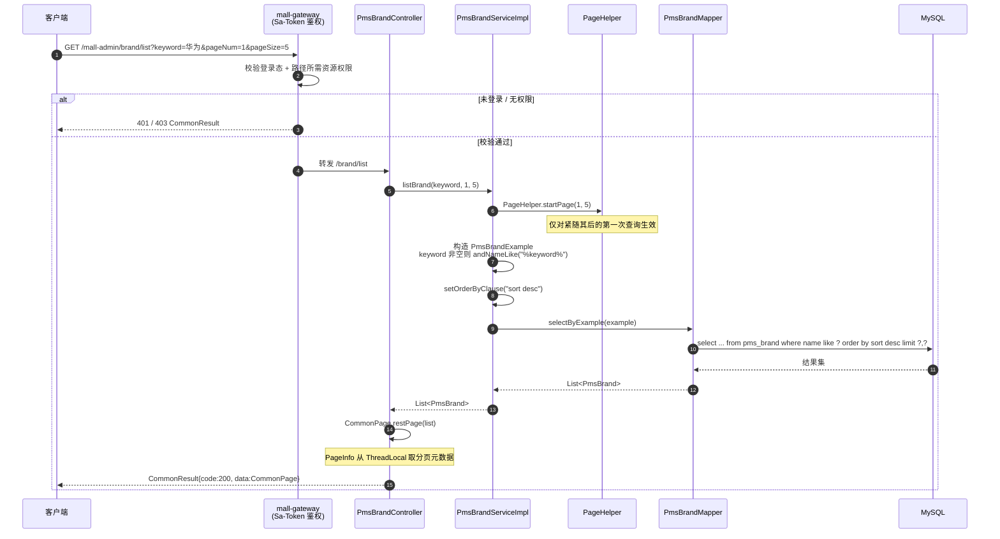
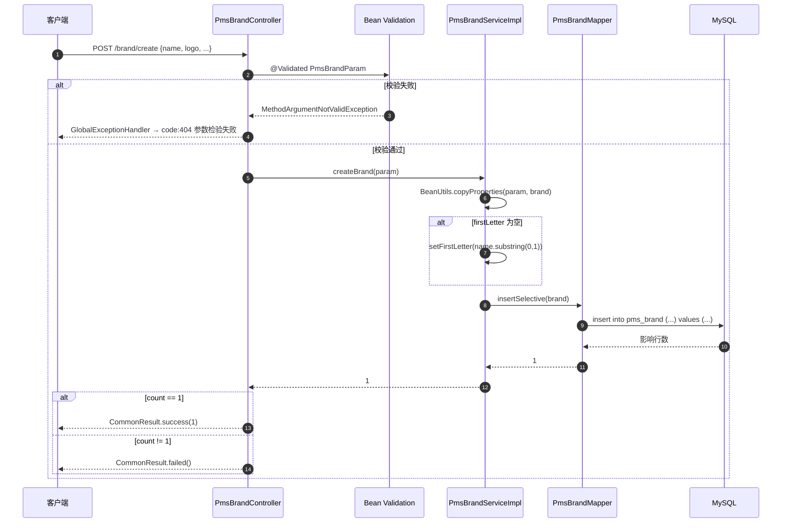
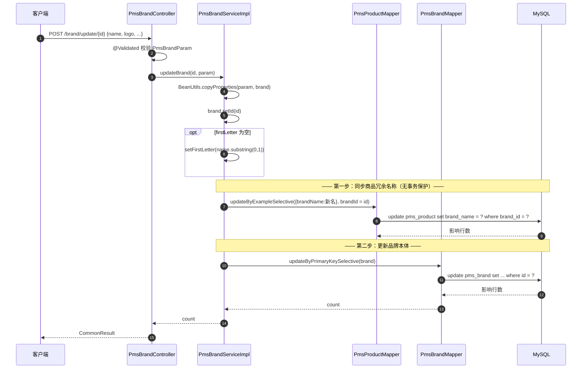
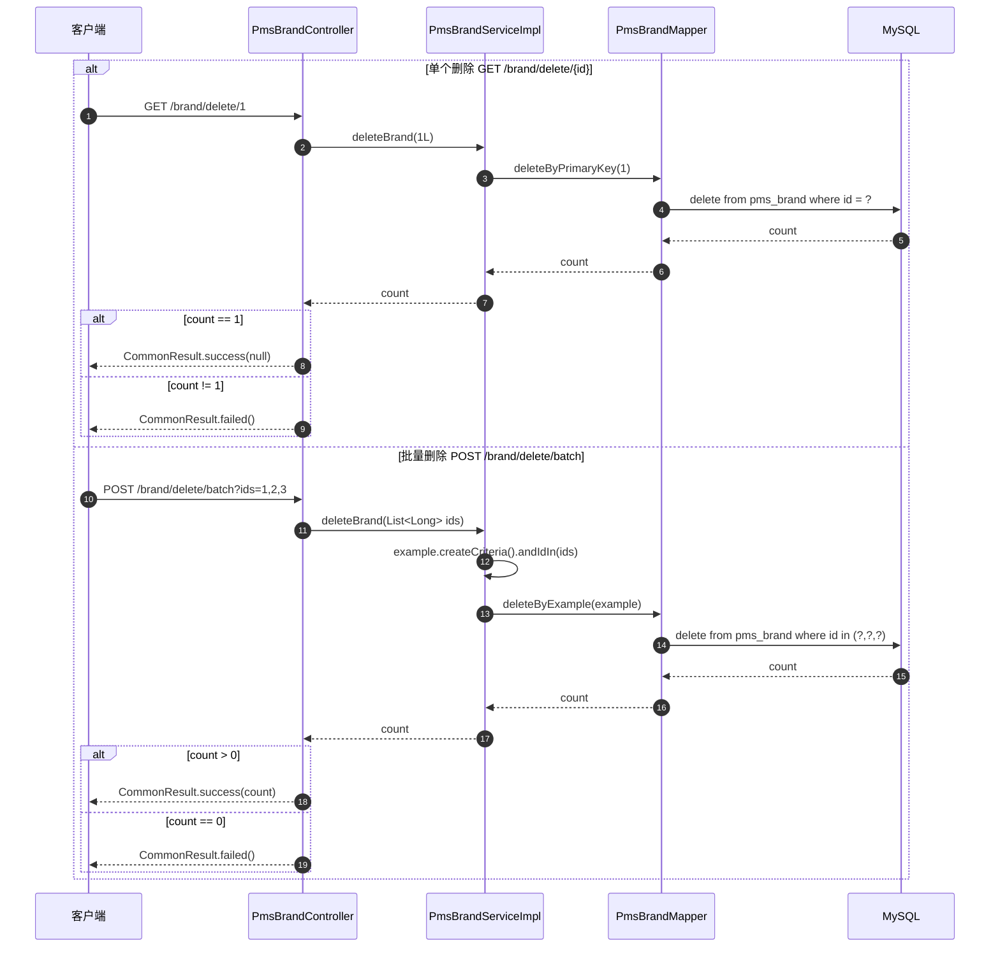
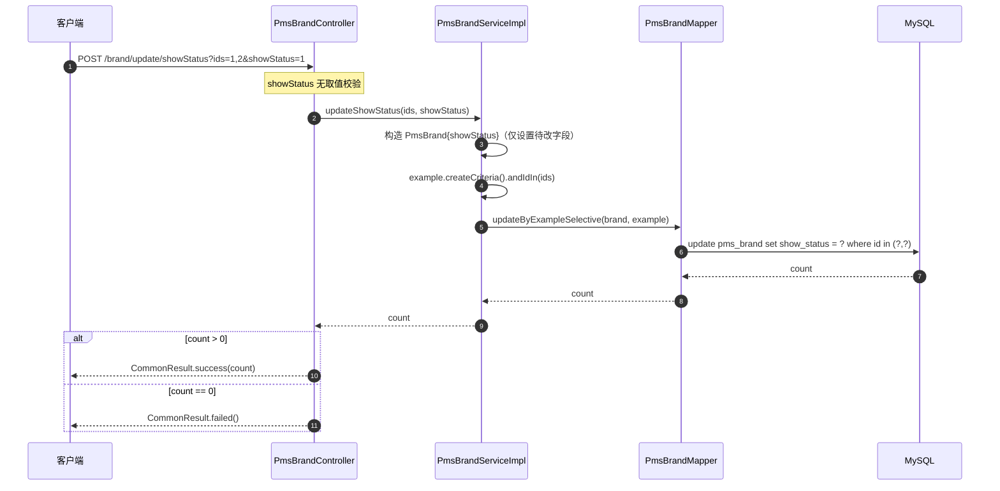
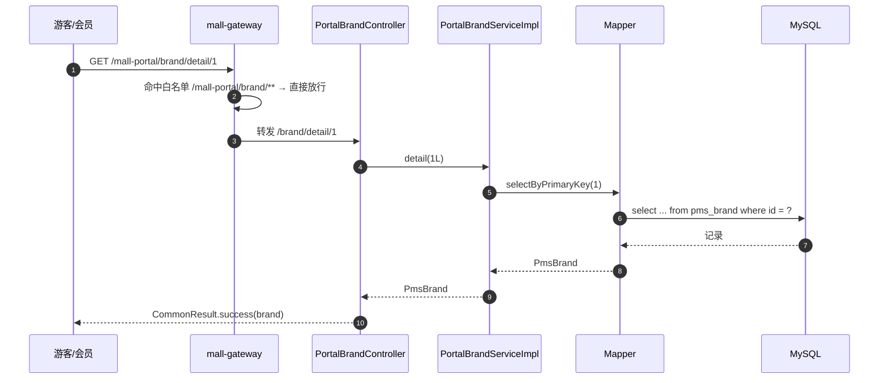

# 详细设计 · 商品品牌管理

| 项目 | 内容 |
| --- | --- |
| 文档编号 | DD-PMS-BRAND-001 |
| 所属业务域 | 商品域（`pms`） |
| 涉及服务 | `mall-admin`（:8080）、`mall-portal`（:8085） |
| 涉及数据表 | `pms_brand`（主表）、`pms_product`（关联冗余写入） |
| 接口数量 | 12 个（后台 9 + 前台 3） |
| 网关前缀 | `/mall-admin/brand/**`、`/mall-portal/brand/**` |
| 文档状态 | 样例（待评审） |

---

## 一、概述

### 1.1 范围

本文档描述「商品品牌」这一业务能力的详细设计，覆盖：

- **数据库设计**：`pms_brand` 表结构、字典、约束现状与改进建议
- **接口设计**：12 个 REST 接口的请求参数、响应结构与数据模型
- **包设计**：跨 `mall-admin` / `mall-portal` / `mall-mbg` / `mall-common` 的包结构与类职责
- **运行流程**：查询、新增、更新、删除、批量状态变更的调用链路与时序
- **日志设计**：日志框架、访问日志切面、本模块埋点与输出目的地
- **测试用例设计**：功能、边界、异常三类用例

不在本文档范围内：商品主数据本身的设计（见商品管理详细设计）、品牌与前端页面的交互细节。

### 1.2 术语

| 术语 | 含义 |
| --- | --- |
| 品牌（Brand） | 商品的品牌归属，如「华为」「小米」 |
| 首字母（firstLetter） | 品牌名称首字，用于前端按字母索引品牌 |
| 厂家制造商（factoryStatus） | 品牌是否为品牌制造商，前台可据此筛选 |
| 显示状态（showStatus） | 品牌是否在前台展示 |
| 推荐品牌 | 首页运营位展示的品牌。数据取自 `sms_home_brand`（推荐位配置表），join `pms_brand` 得到品牌详情，**不是**直接查 `pms_brand` |

### 1.3 接口清单总览

| # | 方法 | 路径（服务内） | 网关路径 | 说明 | 归属 |
| --- | --- | --- | --- | --- | --- |
| 1 | GET | `/brand/listAll` | `/mall-admin/brand/listAll` | 获取全部品牌列表 | 后台 |
| 2 | POST | `/brand/create` | `/mall-admin/brand/create` | 添加品牌 | 后台 |
| 3 | POST | `/brand/update/{id}` | `/mall-admin/brand/update/{id}` | 更新品牌 | 后台 |
| 4 | GET | `/brand/delete/{id}` | `/mall-admin/brand/delete/{id}` | 删除品牌 | 后台 |
| 5 | GET | `/brand/list` | `/mall-admin/brand/list` | 分页获取品牌列表（支持关键字） | 后台 |
| 6 | GET | `/brand/{id}` | `/mall-admin/brand/{id}` | 根据编号查询品牌信息 | 后台 |
| 7 | POST | `/brand/delete/batch` | `/mall-admin/brand/delete/batch` | 批量删除品牌 | 后台 |
| 8 | POST | `/brand/update/showStatus` | `/mall-admin/brand/update/showStatus` | 批量更新显示状态 | 后台 |
| 9 | POST | `/brand/update/factoryStatus` | `/mall-admin/brand/update/factoryStatus` | 批量更新厂家制造商状态 | 后台 |
| 10 | GET | `/brand/recommendList` | `/mall-portal/brand/recommendList` | 分页获取推荐品牌 | 前台 |
| 11 | GET | `/brand/detail/{brandId}` | `/mall-portal/brand/detail/{brandId}` | 获取品牌详情 | 前台 |
| 12 | GET | `/brand/productList` | `/mall-portal/brand/productList` | 分页获取品牌相关商品 | 前台 |

> **归属说明**：接口 1–9 由 `mall-admin` 的 `PmsBrandController` 提供，接口 10–12 由 `mall-portal` 的 `PortalBrandController` 提供。两者的类级路径都是 `/brand`，靠网关路径前缀区分。
>
> **鉴权**：网关白名单包含 `/mall-portal/brand/**`，故接口 10–12 **允许匿名访问**；`/mall-admin/**` 需登录并校验权限码。

---

## 二、数据库设计

### 2.1 表清单

| 表名 | 类型 | 说明 | 本模块操作 |
| --- | --- | --- | --- |
| `pms_brand` | 主表 | 品牌表 | 增、删、改、查 |
| `pms_product` | 关联表 | 商品信息 | 更新品牌时同步 `brand_name` 冗余字段（写） |
| `sms_home_brand` | 关联表 | 首页推荐品牌 | 推荐品牌接口**读**（join 品牌），本模块不写 |

### 2.2 建表语句（现状）

```sql
DROP TABLE IF EXISTS `pms_brand`;
CREATE TABLE `pms_brand`  (
  `id` bigint(20) NOT NULL AUTO_INCREMENT,
  `name` varchar(64) CHARACTER SET utf8 COLLATE utf8_general_ci NULL DEFAULT NULL,
  `first_letter` varchar(8) CHARACTER SET utf8 COLLATE utf8_general_ci NULL DEFAULT NULL COMMENT '首字母',
  `sort` int(11) NULL DEFAULT NULL,
  `factory_status` int(1) NULL DEFAULT NULL COMMENT '是否为品牌制造商：0->不是；1->是',
  `show_status` int(1) NULL DEFAULT NULL,
  `product_count` int(11) NULL DEFAULT NULL COMMENT '产品数量',
  `product_comment_count` int(11) NULL DEFAULT NULL COMMENT '产品评论数量',
  `logo` varchar(255) CHARACTER SET utf8 COLLATE utf8_general_ci NULL DEFAULT NULL COMMENT '品牌logo',
  `big_pic` varchar(255) CHARACTER SET utf8 COLLATE utf8_general_ci NULL DEFAULT NULL COMMENT '专区大图',
  `brand_story` text CHARACTER SET utf8 COLLATE utf8_general_ci NULL COMMENT '品牌故事',
  PRIMARY KEY (`id`) USING BTREE
) ENGINE = InnoDB AUTO_INCREMENT = 60 CHARACTER SET = utf8 COLLATE = utf8_general_ci COMMENT = '品牌表' ROW_FORMAT = DYNAMIC;
```

### 2.3 字段说明

| 字段 | 类型 | 允许空 | 默认值 | 中文名 | 说明 |
| --- | --- | --- | --- | --- | --- |
| `id` | bigint(20) | 否 | AUTO_INCREMENT | 主键 | 品牌唯一标识 |
| `name` | varchar(64) | 是 | NULL | 品牌名称 | 业务上必填，由应用层校验 |
| `first_letter` | varchar(8) | 是 | NULL | 首字母 | 为空时由应用层取 `name` 首字自动填充 |
| `sort` | int(11) | 是 | NULL | 排序 | 值越小越靠前（列表按 `sort desc` 排序） |
| `factory_status` | int(1) | 是 | NULL | 是否厂家制造商 | 0 不是 / 1 是 |
| `show_status` | int(1) | 是 | NULL | 显示状态 | 0 不显示 / 1 显示 |
| `product_count` | int(11) | 是 | NULL | 产品数量 | 冗余统计值，当前无代码维护 |
| `product_comment_count` | int(11) | 是 | NULL | 产品评论数量 | 冗余统计值，当前无代码维护 |
| `logo` | varchar(255) | 是 | NULL | 品牌 LOGO | 业务上必填，由应用层校验 |
| `big_pic` | varchar(255) | 是 | NULL | 专区大图 | 品牌专区头图 |
| `brand_story` | text | 是 | NULL | 品牌故事 | 长文本 |

### 2.4 状态字典

| 字段 | 值 | 含义 | 来源 |
| --- | --- | --- | --- |
| `factory_status` | 0 | 不是品牌制造商 | `mall.sql` 列注释 |
| `factory_status` | 1 | 是品牌制造商 | `mall.sql` 列注释 |
| `show_status` | 0 | 不显示 | 由 `FlagValidator` 约束推断 |
| `show_status` | 1 | 显示 | 由 `FlagValidator` 约束推断 |

> `show_status` 在 `mall.sql` 中**没有列注释**，其取值含义依据 `PmsBrandParam` 上的 `@FlagValidator(value = {"0","1"})` 与商品模块同名字段语义推断。

### 2.5 关联与冗余设计

```
pms_product.brand_id ──────► pms_brand.id        （逻辑外键，无 DDL 约束）
pms_product.brand_name ────► pms_brand.name      （冗余快照，更新品牌时同步）
sms_home_brand.brand_id ───► pms_brand.id        （逻辑外键）
sms_home_brand.brand_name ─► pms_brand.name      （冗余快照，不随品牌更新同步）
```

**关键设计点：`pms_product.brand_name` 是刻意的冗余。**

- 商品列表/详情查询需要展示品牌名称，若每次 join `pms_brand` 会带来额外开销，故在商品表冗余一份。
- 代价是一致性维护：`PmsBrandServiceImpl.updateBrand()` 在更新品牌后，会以 `brand_id` 为条件批量更新所有关联商品的 `brand_name`：

```java
// PmsBrandServiceImpl.updateBrand 片段
PmsProduct product = new PmsProduct();
product.setBrandName(pmsBrand.getName());
PmsProductExample example = new PmsProductExample();
example.createCriteria().andBrandIdEqualTo(id);
productMapper.updateByExampleSelective(product, example);
return brandMapper.updateByPrimaryKeySelective(pmsBrand);
```

**注意**：这段同步逻辑与品牌更新**不在同一个事务中**（`updateBrand` 方法未标注 `@Transactional`）。若品牌更新失败，商品的 `brand_name` 已被改动，会产生不一致。详见 2.7 建议 ②。

**不一致点**：`sms_home_brand.brand_name` 也是冗余，但更新品牌时**不会**同步，推荐品牌位会显示旧名称。

### 2.6 索引与约束现状

| 项目 | 现状 | 影响 |
| --- | --- | --- |
| 主键 | `PRIMARY KEY (id)` USING BTREE | 正常 |
| 唯一索引 | **无** | `name` 可重复，可创建同名品牌 |
| 普通索引 | **无** | `pms_product` 按 `brand_id` 更新时全表扫描 |
| 外键约束 | **无** | 可删除仍有商品引用的品牌，产生孤儿数据 |
| 非空约束 | **仅 `id`** | 其余字段均可为 NULL，业务约束全靠应用层 |
| 逻辑删除 | **无此字段** | 删除为物理删除，不可恢复 |

### 2.7 设计问题与建议

| # | 问题 | 影响 | 建议 |
| --- | --- | --- | --- |
| ① | `pms_product.brand_id` 无索引 | 更新品牌时 `update pms_product where brand_id=?` 走全表扫描，商品量大时锁表 | 增加 `idx_brand_id (brand_id)` |
| ② | 品牌更新与商品冗余同步无事务 | 部分失败导致 `brand_name` 与 `pms_brand.name` 不一致 | 为 `updateBrand` 增加 `@Transactional`；或改为异步最终一致 |
| ③ | 删除品牌不校验引用 | 删除后 `pms_product.brand_id` 成为孤儿，商品详情品牌信息缺失 | 删除前校验引用数，或改为逻辑删除 |
| ④ | `name` 无唯一约束 | 可建同名品牌，前台品牌列表出现重复 | 增加唯一索引或应用层查重 |
| ⑤ | `product_count` / `product_comment_count` 无维护代码 | 字段恒为 NULL，若前端展示会显示空 | 明确废弃或补齐统计逻辑 |
| ⑥ | `sms_home_brand.brand_name` 不同步 | 首页推荐品牌显示旧名称 | 更新品牌时一并同步，或改为 join 查询 |
| ⑦ | 批量状态更新接口的 `showStatus` / `factoryStatus` 无取值校验 | `@FlagValidator` 仅作用于 DTO 字段，`@RequestParam` 参数不受约束，传入 `99`、`-1` 会成功写库，破坏状态字典一致性 | 在 Service 层校验取值，或将参数改为 DTO 承载 |
| ⑧ | 缺少 query 参数时的错误响应结构不统一 | `GlobalExceptionHandler` 未兜底 `Exception`，`MissingServletRequestParameterException` 与数据库异常会返回 Spring 默认错误 JSON，而非 `CommonResult`，前端统一处理失效 | 增加 `@ExceptionHandler(Exception.class)` 兜底并统一返回结构 |

---

## 三、接口设计

### 3.1 通用约定

**统一响应结构**（`com.macro.mall.common.api.CommonResult`）：

```json
{
  "code": 200,
  "message": "操作成功",
  "data": {}
}
```

**业务码定义**（`ResultCode`）：

| code | 常量 | 含义 |
| --- | --- | --- |
| 200 | `SUCCESS` | 操作成功 |
| 401 | `UNAUTHORIZED` | 暂未登录或 token 已经过期 |
| 403 | `FORBIDDEN` | 没有相关权限 |
| 404 | `VALIDATE_FAILED` | 参数检验失败 |
| 500 | `FAILED` | 操作失败 |

> **注意**：业务码定义在 **HTTP 响应体内部**，HTTP 状态码通常仍为 200。`VALIDATE_FAILED` 使用 404 表示参数校验失败，与 HTTP 语义不一致，前端需按 `code` 而非 HTTP 状态码判断。

**统一分页结构**（`CommonPage`）：

| 名称 | 类型 | 说明 |
| --- | --- | --- |
| pageNum | integer | 当前页码 |
| pageSize | integer | 每页条数 |
| totalPage | integer | 总页数 |
| total | integer(int64) | 总记录数 |
| list | array | 数据列表 |

**鉴权**：请求头 `Authorization: Bearer <token>`。后台接口由网关按「路径 → 资源权限」映射校验；前台品牌接口在白名单中，允许匿名。

---

### 3.2 后台接口（mall-admin）

<a id="opIdgetBrandListAll"></a>

## GET 获取全部品牌列表

GET /brand/listAll

获取所有品牌，不进行分页。后台下拉选择与前台字母索引使用。

### 请求参数

无

> 返回示例

> 200 Response

```json
{
  "code": 200,
  "message": "操作成功",
  "data": [
    {
      "id": 1,
      "name": "华为",
      "firstLetter": "H",
      "sort": 100,
      "factoryStatus": 1,
      "showStatus": 1,
      "productCount": 0,
      "productCommentCount": 0,
      "logo": "http://macro-oss.oss-cn-shenzhen.aliyuncs.com/mall/images/20180607/timg.jpg",
      "bigPic": "",
      "brandStory": "华为技术有限公司成立于1987年，总部位于中国广东省深圳市。"
    }
  ]
}
```

### 返回结果

| 状态码 | 状态码含义 | 说明 | 数据模型 |
| --- | --- | --- | --- |
| 200 | [OK](https://tools.ietf.org/html/rfc7231#section-6.3.1) | 操作成功 | [CommonResultBrandList](#schemacommonresultbrandlist) |

### 返回数据结构

状态码 **200**

| 名称 | 类型 | 必选 | 约束 | 中文名 | 说明 |
| --- | --- | --- | --- | --- | --- |
| code | integer(int64) | true | none | 业务码 | 200 表示成功 |
| message | string | true | none | 提示信息 | none |
| data | [[PmsBrand](#schemapmsbrand)] | false | none | 品牌列表 | 无分页信息 |

---

<a id="opIdcreateBrand"></a>

## POST 添加品牌

POST /brand/create

创建新品牌。首字母为空时自动取品牌名称首字。

> Body 请求参数

```json
{
  "name": "测试品牌",
  "firstLetter": "C",
  "sort": 0,
  "factoryStatus": 0,
  "showStatus": 1,
  "logo": "http://macro-oss.oss-cn-shenzhen.aliyuncs.com/mall/images/20180607/timg.jpg",
  "bigPic": "",
  "brandStory": "品牌故事"
}
```

### 请求参数

| 名称 | 位置 | 类型 | 必选 | 说明 |
| --- | --- | --- | --- | --- |
| body | body | [PmsBrandParam](#schemapmsbrandparam) | 是 | 品牌参数 |

### 返回结果

| 状态码 | 状态码含义 | 说明 | 数据模型 |
| --- | --- | --- | --- |
| 200 | [OK](https://tools.ietf.org/html/rfc7231#section-6.3.1) | 操作成功 | Inline |

### 返回数据结构

状态码 **200**

| 名称 | 类型 | 必选 | 约束 | 中文名 | 说明 |
| --- | --- | --- | --- | --- | --- |
| code | integer(int64) | true | none | 业务码 | 200 成功；500 失败 |
| message | string | true | none | 提示信息 | none |
| data | integer(int32) | false | none | 影响行数 | 成功时为 1 |

---

<a id="opIdupdateBrand"></a>

## POST 更新品牌

POST /brand/update/{id}

更新指定品牌。**同时会将新名称同步到该品牌下所有商品的 `brand_name` 冗余字段。**

> Body 请求参数

```json
{
  "name": "测试品牌-改",
  "firstLetter": "C",
  "sort": 10,
  "factoryStatus": 1,
  "showStatus": 1,
  "logo": "http://macro-oss.oss-cn-shenzhen.aliyuncs.com/mall/images/20180607/timg.jpg",
  "bigPic": "",
  "brandStory": "更新后的品牌故事"
}
```

### 请求参数

| 名称 | 位置 | 类型 | 必选 | 说明 |
| --- | --- | --- | --- | --- |
| id | path | integer(int64) | 是 | 品牌编号 |
| body | body | [PmsBrandParam](#schemapmsbrandparam) | 是 | 品牌参数 |

### 返回结果

| 状态码 | 状态码含义 | 说明 | 数据模型 |
| --- | --- | --- | --- |
| 200 | [OK](https://tools.ietf.org/html/rfc7231#section-6.3.1) | 操作成功 | Inline |

### 返回数据结构

状态码 **200**

| 名称 | 类型 | 必选 | 约束 | 中文名 | 说明 |
| --- | --- | --- | --- | --- | --- |
| code | integer(int64) | true | none | 业务码 | 200 成功；500 失败 |
| message | string | true | none | 提示信息 | none |
| data | integer(int32) | false | none | 影响行数 | 成功时为 1 |

---

<a id="opIddeleteBrand"></a>

## GET 删除品牌

GET /brand/delete/{id}

根据编号删除品牌（物理删除）。

### 请求参数

| 名称 | 位置 | 类型 | 必选 | 说明 |
| --- | --- | --- | --- | --- |
| id | path | integer(int64) | 是 | 品牌编号 |

### 返回结果

| 状态码 | 状态码含义 | 说明 | 数据模型 |
| --- | --- | --- | --- |
| 200 | [OK](https://tools.ietf.org/html/rfc7231#section-6.3.1) | 操作成功 | Inline |

### 返回数据结构

状态码 **200**

| 名称 | 类型 | 必选 | 约束 | 中文名 | 说明 |
| --- | --- | --- | --- | --- | --- |
| code | integer(int64) | true | none | 业务码 | 200 成功；500 失败 |
| message | string | true | none | 提示信息 | none |
| data | string | false | none | 数据 | 恒为 null |

> **设计备注**：删除为状态变更操作，却使用 GET 方法，违反 HTTP 幂等语义（可被浏览器预取、爬虫触发）。建议改为 `DELETE /brand/{id}`。当前实现下，接口权限由网关按路径校验，风险可控。

---

<a id="opIdgetBrandList"></a>

## GET 分页获取品牌列表

GET /brand/list

根据品牌名称关键字分页查询品牌，结果按 `sort desc` 排序。

### 请求参数

| 名称 | 位置 | 类型 | 必选 | 说明 |
| --- | --- | --- | --- | --- |
| keyword | query | string | 否 | 品牌名称关键字，模糊匹配 |
| pageNum | query | integer | 否 | 页码，默认 1 |
| pageSize | query | integer | 否 | 每页条数，默认 5 |

> 返回示例

> 200 Response

```json
{
  "code": 200,
  "message": "操作成功",
  "data": {
    "pageNum": 1,
    "pageSize": 5,
    "totalPage": 12,
    "total": 59,
    "list": [
      {
        "id": 1,
        "name": "华为",
        "firstLetter": "H",
        "sort": 100,
        "factoryStatus": 1,
        "showStatus": 1,
        "productCount": 0,
        "productCommentCount": 0,
        "logo": "http://macro-oss.oss-cn-shenzhen.aliyuncs.com/mall/images/20180607/timg.jpg",
        "bigPic": "",
        "brandStory": "华为技术有限公司成立于1987年。"
      }
    ]
  }
}
```

### 返回结果

| 状态码 | 状态码含义 | 说明 | 数据模型 |
| --- | --- | --- | --- |
| 200 | [OK](https://tools.ietf.org/html/rfc7231#section-6.3.1) | 操作成功 | Inline |

### 返回数据结构

状态码 **200**

| 名称 | 类型 | 必选 | 约束 | 中文名 | 说明 |
| --- | --- | --- | --- | --- | --- |
| code | integer(int64) | true | none | 业务码 | none |
| message | string | true | none | 提示信息 | none |
| data | [CommonPage](#schemacommonpage) | false | none | 分页数据 | none |
| » pageNum | integer | false | none | 当前页码 | none |
| » pageSize | integer | false | none | 每页条数 | none |
| » totalPage | integer | false | none | 总页数 | none |
| » total | integer(int64) | false | none | 总记录数 | none |
| » list | [[PmsBrand](#schemapmsbrand)] | false | none | 品牌列表 | none |

> **注意（跨服务路径遮蔽）**：`docs/openapi.yaml` 中 `/brand/list` 的 `pageSize` 默认为 **3**，与本控制器不符（`PmsBrandController.getList()` 为 **5**）。
> 原因不是文档写错，而是 `mall-demo` 的 `DemoController` 暴露了**完全同名**的路径 `/brand/list`（其默认值为 3）。聚合导出时 OpenAPI 以路径为唯一键，该路径只保留了一份定义，且保留的是 **mall-demo** 的版本。**本控制器的实际行为以 5 为准**，详见 3.5。

---

<a id="opIdgetBrand"></a>

## GET 根据编号查询品牌信息

GET /brand/{id}

### 请求参数

| 名称 | 位置 | 类型 | 必选 | 说明 |
| --- | --- | --- | --- | --- |
| id | path | integer(int64) | 是 | 品牌编号 |

> 返回示例

> 200 Response

```json
{
  "code": 200,
  "message": "操作成功",
  "data": {
    "id": 1,
    "name": "华为",
    "firstLetter": "H",
    "sort": 100,
    "factoryStatus": 1,
    "showStatus": 1,
    "productCount": 0,
    "productCommentCount": 0,
    "logo": "http://macro-oss.oss-cn-shenzhen.aliyuncs.com/mall/images/20180607/timg.jpg",
    "bigPic": "",
    "brandStory": "华为技术有限公司成立于1987年。"
  }
}
```

### 返回结果

| 状态码 | 状态码含义 | 说明 | 数据模型 |
| --- | --- | --- | --- |
| 200 | [OK](https://tools.ietf.org/html/rfc7231#section-6.3.1) | 操作成功 | [CommonResultPmsBrand](#schemacommonresultpmsbrand) |

### 返回数据结构

状态码 **200**

| 名称 | 类型 | 必选 | 约束 | 中文名 | 说明 |
| --- | --- | --- | --- | --- | --- |
| code | integer(int64) | true | none | 业务码 | none |
| message | string | true | none | 提示信息 | none |
| data | [PmsBrand](#schemapmsbrand) | false | none | 品牌 | 不存在该 id 时 data 为 null，code 仍为 200 |

> **设计备注**：品牌不存在时返回 `code: 200` + `data: null`，而非错误码，前端需自行判空。详见 5.7。

---

<a id="opIddeleteBrandBatch"></a>

## POST 批量删除品牌

POST /brand/delete/batch

### 请求参数

| 名称 | 位置 | 类型 | 必选 | 说明 |
| --- | --- | --- | --- | --- |
| ids | query | array[integer] | 是 | 品牌编号列表，重复参数传递 |

### 返回结果

| 状态码 | 状态码含义 | 说明 | 数据模型 |
| --- | --- | --- | --- |
| 200 | [OK](https://tools.ietf.org/html/rfc7231#section-6.3.1) | 操作成功 | Inline |

### 返回数据结构

状态码 **200**

| 名称 | 类型 | 必选 | 约束 | 中文名 | 说明 |
| --- | --- | --- | --- | --- | --- |
| code | integer(int64) | true | none | 业务码 | 200 成功；500 失败 |
| message | string | true | none | 提示信息 | none |
| data | integer(int32) | false | none | 删除行数 | 影响行数 > 0 时为 200 |

---

<a id="opIdupdateShowStatus"></a>

## POST 批量更新显示状态

POST /brand/update/showStatus

### 请求参数

| 名称 | 位置 | 类型 | 必选 | 说明 |
| --- | --- | --- | --- | --- |
| ids | query | array[integer] | 是 | 品牌编号列表 |
| showStatus | query | integer | 是 | 显示状态：0 不显示；1 显示 |

### 返回结果

| 状态码 | 状态码含义 | 说明 | 数据模型 |
| --- | --- | --- | --- |
| 200 | [OK](https://tools.ietf.org/html/rfc7231#section-6.3.1) | 操作成功 | Inline |

### 返回数据结构

状态码 **200**

| 名称 | 类型 | 必选 | 约束 | 中文名 | 说明 |
| --- | --- | --- | --- | --- | --- |
| code | integer(int64) | true | none | 业务码 | 200 成功；500 失败 |
| message | string | true | none | 提示信息 | none |
| data | integer(int32) | false | none | 更新行数 | none |

> **设计备注**：`showStatus` 参数**未做取值校验**（`@RequestParam` 无 `@FlagValidator`，该注解仅作用于 DTO 字段），传入 2 或 -1 也会成功写库。建议在 Service 层增加枚举校验。

---

<a id="opIdupdateFactoryStatus"></a>

## POST 批量更新厂家制造商状态

POST /brand/update/factoryStatus

### 请求参数

| 名称 | 位置 | 类型 | 必选 | 说明 |
| --- | --- | --- | --- | --- |
| ids | query | array[integer] | 是 | 品牌编号列表 |
| factoryStatus | query | integer | 是 | 厂家制造商状态：0 不是；1 是 |

### 返回结果

| 状态码 | 状态码含义 | 说明 | 数据模型 |
| --- | --- | --- | --- |
| 200 | [OK](https://tools.ietf.org/html/rfc7231#section-6.3.1) | 操作成功 | Inline |

### 返回数据结构

状态码 **200**

| 名称 | 类型 | 必选 | 约束 | 中文名 | 说明 |
| --- | --- | --- | --- | --- | --- |
| code | integer(int64) | true | none | 业务码 | 200 成功；500 失败 |
| message | string | true | none | 提示信息 | none |
| data | integer(int32) | false | none | 更新行数 | none |

> **设计备注**：同 `update/showStatus`，`factoryStatus` 无取值校验。

---

### 3.3 前台接口（mall-portal）

<a id="opIdrecommendList"></a>

## GET 分页获取推荐品牌

GET /brand/recommendList

首页推荐品牌位使用。**允许匿名访问。**

**数据来源**：不走 `pms_brand` 单表查询，而是查首页运营位表 `sms_home_brand`，join `pms_brand` 取品牌详情（`HomeDao.getRecommendBrandList`）：

```sql
SELECT b.*
FROM sms_home_brand hb
LEFT JOIN pms_brand b ON hb.brand_id = b.id
WHERE hb.recommend_status = 1
  AND b.show_status = 1
ORDER BY hb.sort DESC
LIMIT #{offset}, #{limit}
```

**含义**：只有「已在首页推荐位配置（`recommend_status=1`）」且「品牌处于显示状态（`show_status=1`）」的品牌才会返回；排序依据是**运营位的 `sort`**，不是 `pms_brand.sort`。

### 请求参数

| 名称 | 位置 | 类型 | 必选 | 说明 |
| --- | --- | --- | --- | --- |
| pageSize | query | integer | 否 | 每页条数，默认 6 |
| pageNum | query | integer | 否 | 页码，默认 1 |

> 返回示例

> 200 Response

```json
{
  "code": 200,
  "message": "操作成功",
  "data": [
    {
      "id": 1,
      "name": "华为",
      "firstLetter": "H",
      "sort": 100,
      "factoryStatus": 1,
      "showStatus": 1,
      "productCount": 0,
      "productCommentCount": 0,
      "logo": "http://macro-oss.oss-cn-shenzhen.aliyuncs.com/mall/images/20180607/timg.jpg",
      "bigPic": ""
    }
  ]
}
```

> **注意（`mall-portal` 的 null 字段不序列化）**：`mall-portal` 的 `config/JacksonConfig.java` 把 `@Primary` 的 `ObjectMapper` 设为 `JsonInclude.Include.NON_NULL`，即**值为 null 的字段整体不出现在响应中**（不是输出 `null`）。
> 因此本接口中 `brandStory` 为空时，响应里**没有 `brandStory` 这个键**。同理，当 `data` 为 null（如查不到记录）时，响应体中**不会出现 `data` 键**，只有 `code` 与 `message`。
> `mall-admin` / `mall-search` / `mall-demo` / `mall-auth` **未配置**该行为，null 字段会以 `null` 输出。详见《00-详细设计总览》3.8。

### 返回结果

| 状态码 | 状态码含义 | 说明 | 数据模型 |
| --- | --- | --- | --- |
| 200 | [OK](https://tools.ietf.org/html/rfc7231#section-6.3.1) | 操作成功 | [CommonResultBrandList](#schemacommonresultbrandlist) |

### 返回数据结构

状态码 **200**

| 名称 | 类型 | 必选 | 约束 | 中文名 | 说明 |
| --- | --- | --- | --- | --- | --- |
| code | integer(int64) | true | none | 业务码 | none |
| message | string | true | none | 提示信息 | none |
| data | [[PmsBrand](#schemapmsbrand)] | false | none | 品牌列表 | **不含分页信息**，仅返回数组 |

> **设计备注**：接口名为 `recommendList` 且入参含分页，但返回的是**裸数组**（`List<PmsBrand>`），丢失了 total 等分页元数据。实现上也没有使用 `PageHelper`，而是手工计算 `offset = (pageNum - 1) * pageSize` 后拼进 `LIMIT`。同类接口 `productList` 则返回 `CommonPage`。建议统一为 `CommonPage`。

---

<a id="opIdbrandDetail"></a>

## GET 获取品牌详情

GET /brand/detail/{brandId}

### 请求参数

| 名称 | 位置 | 类型 | 必选 | 说明 |
| --- | --- | --- | --- | --- |
| brandId | path | integer(int64) | 是 | 品牌编号 |

### 返回结果

| 状态码 | 状态码含义 | 说明 | 数据模型 |
| --- | --- | --- | --- |
| 200 | [OK](https://tools.ietf.org/html/rfc7231#section-6.3.1) | 操作成功 | [CommonResultPmsBrand](#schemacommonresultpmsbrand) |

### 返回数据结构

状态码 **200**

| 名称 | 类型 | 必选 | 约束 | 中文名 | 说明 |
| --- | --- | --- | --- | --- | --- |
| code | integer(int64) | true | none | 业务码 | none |
| message | string | true | none | 提示信息 | none |
| data | [PmsBrand](#schemapmsbrand) | false | none | 品牌 | none |

---

<a id="opIdbrandProductList"></a>

## GET 分页获取品牌相关商品

GET /brand/productList

**筛选条件**：仅返回**未删除**（`delete_status = 0`）且 `brand_id` 匹配的商品，使用 `PageHelper` 分页。

### 请求参数

| 名称 | 位置 | 类型 | 必选 | 说明 |
| --- | --- | --- | --- | --- |
| brandId | query | integer(int64) | 是 | 品牌编号 |
| pageNum | query | integer | 否 | 页码，默认 1 |
| pageSize | query | integer | 否 | 每页条数，默认 6 |

### 返回结果

| 状态码 | 状态码含义 | 说明 | 数据模型 |
| --- | --- | --- | --- |
| 200 | [OK](https://tools.ietf.org/html/rfc7231#section-6.3.1) | 操作成功 | Inline |

### 返回数据结构

状态码 **200**

| 名称 | 类型 | 必选 | 约束 | 中文名 | 说明 |
| --- | --- | --- | --- | --- | --- |
| code | integer(int64) | true | none | 业务码 | none |
| message | string | true | none | 提示信息 | none |
| data | [CommonPage](#schemacommonpage) | false | none | 分页数据 | list 元素为 [PmsProduct](#schemapmsproduct) |

---

### 3.4 数据模型

<h2 id="tocS_PmsBrand">PmsBrand</h2>

<a id="schemapmsbrand"></a>

```json
{
  "id": 0,
  "name": "string",
  "firstLetter": "string",
  "sort": 0,
  "factoryStatus": 0,
  "showStatus": 0,
  "productCount": 0,
  "productCommentCount": 0,
  "logo": "string",
  "bigPic": "string",
  "brandStory": "string"
}
```

商品品牌信息。

### 属性

| 名称 | 类型 | 必选 | 约束 | 中文名 | 说明 |
| --- | --- | --- | --- | --- | --- |
| id | integer(int64) | false | none | 品牌编号 | 主键 |
| name | string | false | maxLength 64 | 品牌名称 | none |
| firstLetter | string | false | maxLength 8 | 首字母 | none |
| sort | integer(int32) | false | none | 排序 | 列表按此字段倒序 |
| factoryStatus | integer(int32) | false | none | 是否厂家制造商 | none |
| showStatus | integer(int32) | false | none | 显示状态 | none |
| productCount | integer(int32) | false | none | 产品数量 | 当前无维护 |
| productCommentCount | integer(int32) | false | none | 产品评论数量 | 当前无维护 |
| logo | string | false | maxLength 255 | 品牌 LOGO | none |
| bigPic | string | false | maxLength 255 | 专区大图 | none |
| brandStory | string | false | none | 品牌故事 | text 类型 |

#### 枚举值

| 属性 | 值 |
| --- | --- |
| factoryStatus | 0 |
| factoryStatus | 1 |
| showStatus | 0 |
| showStatus | 1 |

---

<h2 id="tocS_PmsBrandParam">PmsBrandParam</h2>

<a id="schemapmsbrandparam"></a>

```json
{
  "name": "string",
  "firstLetter": "string",
  "sort": 0,
  "factoryStatus": 0,
  "showStatus": 0,
  "logo": "string",
  "bigPic": "string",
  "brandStory": "string"
}
```

品牌创建/更新的请求参数（`com.macro.mall.dto.PmsBrandParam`）。

### 属性

| 名称 | 类型 | 必选 | 约束 | 中文名 | 说明 |
| --- | --- | --- | --- | --- | --- |
| name | string | true | `@NotEmpty` | 品牌名称 | 不可为空 |
| firstLetter | string | false | none | 首字母 | 为空时后端取 name 首字 |
| sort | integer(int32) | false | `@Min(0)` | 排序字段 | 不能为负数 |
| factoryStatus | integer(int32) | false | `@FlagValidator{0,1}` | 是否为厂家制造商 | 只能是 0 或 1 |
| showStatus | integer(int32) | false | `@FlagValidator{0,1}` | 是否进行显示 | 只能是 0 或 1 |
| logo | string | true | `@NotEmpty` | 品牌 LOGO | 不可为空 |
| bigPic | string | false | none | 品牌大图 | none |
| brandStory | string | false | none | 品牌故事 | none |

> **注意（跨服务路径遮蔽）**：`docs/openapi.yaml` 为该接口声明 `required: ["firstLetter", "name"]`，与本 DTO 不符。
> 该声明实际来自 `mall-demo` 的 `PmsBrandDto`（其 `name`、`firstLetter` 均为 `@NotNull`，且 `logo` **无**校验），因同名路径遮蔽覆盖了本接口的定义。
> `mall-admin` 的 `PmsBrandParam` 真正必填的是 **`name`** 与 **`logo`**，`firstLetter` 可为空（后端会自动补全）。详见 3.5。

---

<h2 id="tocS_CommonResultPmsBrand">CommonResultPmsBrand</h2>

<a id="schemacommonresultpmsbrand"></a>

```json
{
  "code": 200,
  "message": "操作成功",
  "data": {}
}
```

通用响应包装，`data` 为单个品牌对象。

### 属性

| 名称 | 类型 | 必选 | 约束 | 中文名 | 说明 |
| --- | --- | --- | --- | --- | --- |
| code | integer(int64) | true | none | 业务码 | none |
| message | string | true | none | 提示信息 | none |
| data | [PmsBrand](#schemapmsbrand) | false | none | 品牌 | none |

---

<h2 id="tocS_CommonResultBrandList">CommonResultBrandList</h2>

<a id="schemacommonresultbrandlist"></a>

```json
{
  "code": 200,
  "message": "操作成功",
  "data": []
}
```

通用响应包装，`data` 为品牌数组。

### 属性

| 名称 | 类型 | 必选 | 约束 | 中文名 | 说明 |
| --- | --- | --- | --- | --- | --- |
| code | integer(int64) | true | none | 业务码 | none |
| message | string | true | none | 提示信息 | none |
| data | [[PmsBrand](#schemapmsbrand)] | false | none | 品牌列表 | none |

---

<h2 id="tocS_CommonPage">CommonPage</h2>

<a id="schemacommonpage"></a>

```json
{
  "pageNum": 1,
  "pageSize": 5,
  "totalPage": 12,
  "total": 59,
  "list": []
}
```

统一分页封装（`com.macro.mall.common.api.CommonPage`）。

### 属性

| 名称 | 类型 | 必选 | 约束 | 中文名 | 说明 |
| --- | --- | --- | --- | --- | --- |
| pageNum | integer(int32) | false | none | 当前页码 | none |
| pageSize | integer(int32) | false | none | 每页条数 | none |
| totalPage | integer(int32) | false | none | 总页数 | none |
| total | integer(int64) | false | none | 总记录数 | none |
| list | [array] | false | none | 数据列表 | 元素类型由调用方泛型决定 |

---

<h2 id="tocS_PmsProduct">PmsProduct（品牌相关商品，节选）</h2>

<a id="schemapmsproduct"></a>

```json
{
  "id": 0,
  "brandId": 0,
  "brandName": "string",
  "productCategoryId": 0,
  "name": "string",
  "pic": "string",
  "price": 0,
  "stock": 0,
  "publishStatus": 0
}
```

品牌下商品列表返回的商品信息（完整定义见商品管理详细设计）。

### 属性

| 名称 | 类型 | 必选 | 约束 | 中文名 | 说明 |
| --- | --- | --- | --- | --- | --- |
| id | integer(int64) | false | none | 商品编号 | none |
| brandId | integer(int64) | false | none | 品牌编号 | none |
| brandName | string | false | none | 品牌名称 | 冗余字段，更新品牌时同步 |
| productCategoryId | integer(int64) | false | none | 商品分类编号 | none |
| name | string | false | none | 商品名称 | none |
| pic | string | false | none | 商品主图 | none |
| price | number | false | none | 价格 | none |
| stock | integer(int32) | false | none | 库存 | none |
| publishStatus | integer(int32) | false | none | 上架状态 | 0 下架 / 1 上架 |

---

### 3.5 接口文档核对说明

#### 3.5.1 重要发现：跨服务同名路径导致 openapi 定义被遮蔽

`docs/openapi.yaml` 是**所有服务的接口聚合导出**，路径中**不含服务前缀**。而 `mall-demo` 的 `DemoController`（端口 8082，网关前缀 `/mall-demo/`）暴露了与 `mall-admin` 的 `PmsBrandController` **完全相同的 6 个路径**：

| 路径 | 方法 | mall-admin（本文档范围） | mall-demo（不在本文档范围） |
| --- | --- | --- | --- |
| `/brand/listAll` | GET | `PmsBrandController.getList()` | `DemoController.getBrandList()` |
| `/brand/create` | POST | `PmsBrandController.create()` | `DemoController.createBrand()` |
| `/brand/update/{id}` | POST | `PmsBrandController.update()` | `DemoController.updateBrand()` |
| `/brand/delete/{id}` | GET | `PmsBrandController.delete()` | `DemoController.deleteBrand()` |
| `/brand/list` | GET | `PmsBrandController.getList()` | `DemoController.listBrand()` |
| `/brand/{id}` | GET | `PmsBrandController.getItem()` | `DemoController.brand()` |

由于 OpenAPI 以 **path 为唯一键**，聚合导出时这 6 个路径**只能保留一份定义**。经比对可确认：**保留下来的是 `mall-demo` 的版本**，判据如下：

| 判据 | `mall-admin` 的定义 | `mall-demo` 的定义 | openapi 实际值 | 结论 |
| --- | --- | --- | --- | --- |
| `/brand/list` 的 `@Operation` summary | 「根据品牌名称分页获取品牌列表」 | 「分页获取品牌列表」 | 「分页获取品牌列表」 | 取自 mall-demo |
| `/brand/list` 的 `pageSize` 默认值 | 5 | 3 | 3 | 取自 mall-demo |
| `/brand/create` 请求体的 `required` | `name` + `logo`（`PmsBrandParam`） | `name` + `firstLetter`（`PmsBrandDto`） | `[firstLetter, name]` | 取自 mall-demo |
| `/brand/list` 是否含 `keyword` 参数 | 有 | 无 | 无 | 取自 mall-demo |

**因此**：`docs/openapi.yaml` 中这 6 个路径的定义**不代表 `mall-admin` 的行为**，而是 `mall-demo` 的示例接口。

**运行期是否有冲突？没有。** 两个服务是独立进程（8080 / 8082），经网关后路径分别为 `/mall-admin/brand/**` 与 `/mall-demo/brand/**`，互不干扰。问题**仅存在于文档聚合层面**。

**整改建议**（择一）：

1. 导出时按服务分别导出，或在路径前加服务前缀（网关 `StripPrefix=1` 已剥离前缀，可在导出工具侧配置不剥离）；
2. 为 `mall-demo` 的示例接口改用独立路径前缀（如 `/demo/brand/**`），避免与真实业务接口重名——这也是更推荐的做法，因为 `mall-demo` 本质是示例模块，不应占用与生产接口相同的路径。

> 受影响的路径共 **7 个**，除上述 6 个外还有 `/order/list`（`mall-admin` 的 `OmsOrderController` 与 `mall-portal` 的 `OmsPortalOrderController` 同名，openapi 保留的是含 `receiverKeyword` 参数的 **mall-admin** 版本）。

#### 3.5.2 本文档范围内的核对结论

| # | 接口 | 核对结论 | 处置 |
| --- | --- | --- | --- |
| ① | `GET /brand/list` | openapi 的 `pageSize` 默认 3 取自 mall-demo；本文档控制器实际为 **5** | 文档已按代码（5）描述；无需改代码 |
| ② | `POST /brand/create`、`POST /brand/update/{id}` | openapi 的 `required: [firstLetter, name]` 取自 mall-demo 的 `PmsBrandDto`；本文档控制器实际要求 `name` + `logo` | 文档已按代码描述 |
| ③ | `POST /brand/delete/batch`、`update/showStatus`、`update/factoryStatus` | openapi 将 `ids`/`showStatus`/`factoryStatus` 标为 `in: query` 且 `required: true`，与代码 `@RequestParam`（默认 `required = true`）**一致**，无误 | 无需修正 |
| ④ | 上述 3 个接口的参数**取值** | `showStatus` / `factoryStatus` 未做枚举校验，传入 `99`、`-1` 也会成功写库 | **代码缺陷**，见 2.7 与本表下方说明 |
| ⑤ | 上述 3 个接口缺参时的响应 | 缺少 `ids` 时 Spring 抛 `MissingServletRequestParameterException`，而 `GlobalExceptionHandler` 未兜底 `Exception`，返回的是 Spring 默认错误结构而非 `CommonResult` | **代码缺陷**，建议增加异常兜底 |
| ⑥ | 全部接口 | openapi 未声明 401 / 403 响应，但白名单外的接口均可能返回 | 文档缺口，建议在导出工具中补充通用错误响应定义 |

---

## 四、包设计

### 4.1 模块依赖关系

```
mall-brand 相关能力分散在 4 个 Maven 模块：

mall-admin ──┐
             ├──► mall-common   （CommonResult / CommonPage / WebLogAspect / GlobalExceptionHandler）
mall-portal ─┘
             └──► mall-mbg      （PmsBrand / PmsBrandExample / PmsBrandMapper / PmsProductMapper）
```

| 模块 | 角色 | 品牌相关职责 |
| --- | --- | --- |
| `mall-admin` | 后台服务 | 品牌 CRUD、批量状态变更 |
| `mall-portal` | 前台服务 | 推荐品牌、品牌详情、品牌商品列表 |
| `mall-mbg` | 数据层（生成） | `PmsBrand`、`PmsBrandExample`、`PmsBrandMapper`、`PmsProductMapper` |
| `mall-common` | 公共层 | 统一响应、分页、异常处理、日志切面 |

> **注意**：品牌**没有独立的 `dao` 层**。`mall-admin/src/main/resources/dao/` 下 22 个 XML 中不含品牌，品牌查询全部由 MBG 生成的 `PmsBrandMapper`（单表 + Example 条件）完成。

### 4.2 包结构

```
mall-admin/src/main/java/com/macro/mall/
├── controller/
│   └── PmsBrandController.java              品牌后台接口（9 个端点）
├── dto/
│   └── PmsBrandParam.java                   品牌请求参数 + 校验注解
├── service/
│   ├── PmsBrandService.java                 品牌服务接口
│   └── impl/
│       └── PmsBrandServiceImpl.java         品牌服务实现（含商品冗余同步）
├── validator/
│   ├── FlagValidator.java                   状态标记校验注解
│   └── FlagValidatorClass.java              状态标记校验器
└── MallAdminApplication.java                启动类

mall-portal/src/main/java/com/macro/mall/portal/
├── controller/
│   └── PortalBrandController.java           品牌前台接口（3 个端点）
├── dao/
│   └── HomeDao.java                         推荐品牌查询接口（自定义 SQL）
├── service/
│   ├── PortalBrandService.java              前台品牌服务接口
│   └── impl/
│       └── PortalBrandServiceImpl.java      前台品牌服务实现
└── MallPortalApplication.java               启动类

mall-portal/src/main/resources/dao/
└── HomeDao.xml                              getRecommendBrandList SQL（join sms_home_brand）

mall-mbg/src/main/java/com/macro/mall/
├── mapper/
│   ├── PmsBrandMapper.java                  MBG 生成，品牌单表操作
│   └── PmsProductMapper.java                MBG 生成，商品冗余名称同步 / 品牌商品查询
└── model/
    ├── PmsBrand.java                        品牌实体
    └── PmsBrandExample.java                 品牌条件构造器
```

### 4.3 类职责

| 类 | 层 | 职责 | 依赖 |
| --- | --- | --- | --- |
| `PmsBrandController` | 接入层 | 参数接收、`@Validated` 触发校验、结果包装为 `CommonResult`、根据影响行数决定成功/失败 | `PmsBrandService` |
| `PortalBrandController` | 接入层 | 前台品牌三接口 | `PortalBrandService` |
| `PmsBrandService` | 业务层接口 | 定义 9 个品牌业务方法 | — |
| `PmsBrandServiceImpl` | 业务层 | 首字母补全、分页查询、**商品冗余名称同步** | `PmsBrandMapper`、`PmsProductMapper` |
| `PortalBrandServiceImpl` | 业务层 | 推荐品牌（手算 offset 查 `HomeDao`）、品牌详情（`selectByPrimaryKey`）、品牌商品分页（`PageHelper` + `delete_status=0`） | `HomeDao`、`PmsBrandMapper`、`PmsProductMapper` |
| `HomeDao` | 数据层 | 自定义 SQL：`getRecommendBrandList(offset, limit)`，join `sms_home_brand` + `pms_brand` | `HomeDao.xml` |
| `PmsBrandParam` | 传输对象 | 承载请求参数与校验规则（`@NotEmpty`、`@Min`、`@FlagValidator`） | `FlagValidator` |
| `FlagValidator` / `FlagValidatorClass` | 校验 | 校验整型字段取值是否在给定白名单内；**值为 null 时放行** | — |
| `PmsBrandMapper` | 数据层 | MBG 生成：`selectByExample`、`insertSelective`、`updateByPrimaryKeySelective`、`deleteByPrimaryKey`、`deleteByExample`、`updateByExampleSelective` | `PmsBrandExample` |
| `PmsProductMapper` | 数据层 | 更新指定 `brand_id` 的商品的 `brand_name`；品牌商品列表查询 | `PmsProductExample` |

### 4.4 分层调用规则

```
Controller  ──► Service（接口）──► ServiceImpl ──► Mapper（MBG）/ Dao（自定义 XML）──► MySQL
     │                                    │
     └── 只做参数校验与结果包装              └── 承载业务规则与事务
```

约定：

1. Controller **不直接注入 Mapper**，必须经 Service。
2. 跨模块共享实体一律来自 `mall-mbg`，不在服务内重复定义（`PmsBrandParam` 是后台独有的请求 DTO，故放在 `mall-admin/dto`）。
3. 统一响应只使用 `CommonResult` / `CommonPage`，不自定义返回结构。
4. 多表写入需由 Service 层声明事务（当前品牌更新**缺失**，见 2.7 ②）。

---

## 五、运行流程

### 5.1 分页查询品牌（含关键字）



**要点**：

- `PageHelper.startPage()` 必须在查询方法**紧邻之前**调用，中间不能穿插其他查询。
- `CommonPage.restPage(List)` 依赖 `PageHelper` 写入 `ThreadLocal` 的 `Page` 对象，因此传入的必须是 `selectByExample` 直接返回的 list（不能是二次加工的新 list）。

### 5.2 新增品牌



**分支说明**：

- `insertSelective` 只插入非 null 字段，未传的字段使用数据库默认值（NULL）。
- 首字母补全使用 `name.substring(0,1)`：若 `name` 为空字符串会抛 `StringIndexOutOfBoundsException`，但 `@NotEmpty` 已拦截空串，故实际不会触发。

### 5.3 更新品牌（含商品冗余同步）—— 本模块最复杂流程



**关键风险**：两步写库**未包裹事务**。若第一步成功、第二步失败（如数据库连接中断、`id` 不存在导致更新 0 行），则：

- 商品的 `brand_name` 已被改为新名称；
- `pms_brand.name` 仍是旧名称；
- 产生数据不一致，且接口返回 `failed`，调用方以为整体失败。

**返回语义问题**：当 `id` 不存在时，第一步 `update pms_product` 影响 0 行、第二步 `update pms_brand` 也影响 0 行，`count = 0`，接口返回 `code: 500 操作失败`。无法区分「品牌不存在」与「数据库错误」。

### 5.4 删除品牌



**要点**：删除是**物理删除**，不校验是否有商品引用该品牌，删除后 `pms_product.brand_id` 成为孤儿值。

### 5.5 批量状态更新



**要点**：`updateByExampleSelective` 只更新非 null 字段，因此构造的 `PmsBrand` 只设置 `showStatus`，避免误清空其他列。

### 5.6 前台品牌查询



**要点**：

- 前台品牌接口在网关白名单内，**不校验登录态**，游客可直接访问。
- 三个接口的数据来源不同：

| 接口 | 数据来源 | 分页方式 |
| --- | --- | --- |
| `/brand/recommendList` | `HomeDao.getRecommendBrandList`（join `sms_home_brand` + `pms_brand`） | 手工 `offset + LIMIT`，无分页元数据 |
| `/brand/detail/{brandId}` | `PmsBrandMapper.selectByPrimaryKey` | — |
| `/brand/productList` | `PmsProductMapper.selectByExample`（`delete_status=0` + `brand_id`） | `PageHelper.startPage` |

### 5.7 异常流程

| 异常场景 | 触发点 | 处理者 | 返回 |
| --- | --- | --- | --- |
| 未登录访问后台接口 | 网关 `SaReactorFilter` | 网关 | `code: 401`，HTTP 200 |
| 已登录但无该路径权限 | 网关权限映射校验 | 网关 | `code: 403` |
| 请求体校验失败（`name` 为空等） | `@Validated` | `GlobalExceptionHandler` | `code: 404`，message 为「字段名+默认信息」 |
| 缺少必填 query 参数（如 `ids`） | Spring 参数绑定 | **无处理器** | Spring 默认错误 JSON，**非 `CommonResult` 结构** |
| 品牌不存在（`getBrand`） | Service | 无 | `code: 200` + `data: null` |
| 品牌不存在（`updateBrand`/`deleteBrand`） | 影响行数 = 0 | Controller 判断 | `code: 500 操作失败` |
| `name` 为空白字符串 | `createBrand` 首字母补全 | **无处理器** | `StringIndexOutOfBoundsException` → Spring 默认 500 |
| 数据库异常 | Mapper | **无处理器** | Spring 默认 500，堆栈泄露到响应 |

> **设计缺口**：`GlobalExceptionHandler` 只处理 `ApiException`、`MethodArgumentNotValidException`、`BindException` 三类，**未兜底 `Exception`**。建议增加 `@ExceptionHandler(Exception.class)` 统一返回 `CommonResult` 并隐藏堆栈。

---

## 六、日志设计

### 6.1 日志框架与配置

| 项 | 内容 |
| --- | --- |
| 门面 | SLF4J |
| 实现 | Logback |
| 配置文件 | `mall-common/src/main/resources/logback-spring.xml`（各服务通过依赖继承） |
| 应用名变量 | `spring.application.name`（默认 `springBoot`） |
| 日志路径 | `${LOG_FILE:-${LOG_PATH:-${LOG_TEMP:-${java.io.tmpdir:-/tmp}}}/logs}` |
| 条件化配置 | 使用 `<if>` + `PropertyEqualityCondition`，依赖 `janino`（已在 `mall-common/pom.xml` 引入） |

### 6.2 访问日志切面

`com.macro.mall.common.log.WebLogAspect` 是**品牌接口日志的唯一采集点**。

**切点定义**：

```java
@Pointcut("execution(public * com.macro.mall.controller.*.*(..))" +
          "||execution(public * com.macro.mall.*.controller.*.*(..))")
```

覆盖范围：

| 包 | 覆盖 | 说明 |
| --- | --- | --- |
| `com.macro.mall.controller.*` | ✅ | `mall-admin`（如 `PmsBrandController`） |
| `com.macro.mall.portal.controller.*` | ✅ | `mall-portal`（如 `PortalBrandController`） |
| `com.macro.mall.search.controller.*` | ✅ | `mall-search` |
| `com.macro.mall.demo.controller.*` | ✅ | `mall-demo` |
| `com.macro.mall.auth.controller.*` | ✅ | `mall-auth` |

**记录字段**（`WebLog` 对象）：

| 字段 | 来源 | 说明 |
| --- | --- | --- |
| `description` | 方法上的 `@Operation(summary)` | 如「分页获取品牌列表」 |
| `uri` | `request.getRequestURI()` | 如 `/brand/list` |
| `url` | `request.getRequestURL()` | 完整 URL |
| `basePath` | 从 URL 剥离 path | 服务基础地址 |
| `method` | `request.getMethod()` | GET / POST |
| `parameter` | `getParameter()` 反射提取 | 仅取 `@RequestBody` 与 `@RequestParam` 标注的参数 |
| `result` | 方法返回值 | **完整响应体** |
| `spendTime` | 前后时间差 | 毫秒 |
| `startTime` | `System.currentTimeMillis()` | 时间戳 |

**输出方式**：同时以 JSON 字符串与结构化 Marker 输出：

```java
LOGGER.info(Markers.appendEntries(logMap), JSONUtil.parse(webLog).toString());
```

其中 `logMap` 仅含 `url`、`method`、`parameter`、`spendTime`、`description` 五个键，供 Logstash 做字段提取。

### 6.3 日志分类与输出目的地

`ENABLE_LOG_STASH=true`（即 `logstash.enableInnerLog=true`）时，启用 4 个 Logstash TCP Appender：

| Appender | 目的地 | 采集内容 | 绑定 Logger |
| --- | --- | --- | --- |
| `LOG_STASH_DEBUG` | `${host}:4560` | DEBUG 及以上 | `root` |
| `LOG_STASH_ERROR` | `${host}:4561` | 仅 ERROR | `root` |
| `LOG_STASH_BUSINESS` | `${host}:4562` | 业务日志 | `com.macro.mall` |
| `LOG_STASH_RECORD` | `${host}:4563` | 接口访问记录 | `com.macro.mall.common.log.WebLogAspect` |

Logstash JSON 结构（统一）：

```json
{
  "project": "mall-swarm",
  "level": "INFO",
  "service": "mall-admin",
  "pid": "12345",
  "thread": "http-nio-8080-exec-1",
  "class": "com.macro.mall.common.log.WebLogAspect",
  "message": "{...}",
  "stack_trace": "..."
}
```

`ENABLE_LOG_STASH=false` 时，仅输出到：

| Appender | 目的地 | 内容 |
| --- | --- | --- |
| `CONSOLE` | 标准输出 | 全部（root level = DEBUG） |
| `FILE_DEBUG` | `${LOG_FILE_PATH}/debug/${APP_NAME}-%d{yyyy-MM-dd}-%i.log` | DEBUG 及以上 |
| `FILE_ERROR` | `${LOG_FILE_PATH}/error/${APP_NAME}-%d{yyyy-MM-dd}-%i.log` | 仅 ERROR |

滚动策略：单文件 `maxFileSize` 默认 10MB；保留 `maxHistory` 默认 30 天。

### 6.4 本模块日志埋点

品牌模块**没有手写业务日志**，全部依赖 `WebLogAspect` 自动记录。以「更新品牌」为例，一次调用产生一条记录：

| 字段 | 示例值 |
| --- | --- |
| description | 更新品牌 |
| method | POST |
| uri | `/brand/update/1` |
| parameter | `[{"id":1},{"name":"测试品牌-改","logo":"http://...","showStatus":1}]` |
| spendTime | 37（ms） |
| result | `CommonResult{code=200, message=操作成功, data=1}` |

**埋点建议**（当前缺失，建议补充）：

| 场景 | 级别 | 建议内容 |
| --- | --- | --- |
| 品牌创建成功 | INFO | `品牌创建成功 id={} name={}` |
| 品牌更新触发的商品冗余同步 | INFO | `同步商品品牌名称 brandId={} 影响行数={}` |
| 品牌删除 | WARN | `品牌删除 id={} name={}（未校验商品引用）` |
| 删除/更新影响行数为 0 | WARN | `品牌操作未命中记录 id={}` |
| 商品冗余同步失败 | ERROR | `商品品牌名称同步失败 brandId={}`（配合事务回滚） |

> 建议为品牌写操作补充 `@Operation` 之外的业务日志，原因是 `WebLogAspect` 记录的是**结果**，无法体现「商品冗余同步影响了几行」这类中间过程，排查不一致问题时缺少依据。

### 6.5 日志设计问题

| # | 问题 | 影响 | 建议 |
| --- | --- | --- | --- |
| ① | `webLog.setIp(request.getRemoteUser())` | `getRemoteUser()` 返回的是**认证用户名**而非客户端 IP，且品牌接口匿名访问时恒为 null。日志中 `ip` 字段无意义 | 改为 `request.getRemoteAddr()`，并结合 `X-Forwarded-For`（经网关转发） |
| ② | 切面 `result` 记录完整响应体 | 品牌列表全量返回时会打出大 JSON，磁盘与 Logstash 压力大 | 对列表类接口截断或仅记录条数 |
| ③ | 无请求链路追踪 ID | 网关转发后，无法把网关日志与 `mall-admin` 日志关联 | 引入 TraceId（网关生成 MDC，逐级透传） |
| ④ | `application.yml` 与 Nacos 配置冲突 | `mall-admin/application.yml` 设 `enableInnerLog: true`，Nacos `mall-admin-dev.yaml` 设 `false`。Nacos 优先级更高，**dev 环境 Logstash 实际不生效** | 统一配置来源，避免同名 key 分处两地 |
| ⑤ | `NopStatusListener` 屏蔽了 Logback 内部错误 | 配置错误（如 Logstash 不可达）不会告警 | 生产环境改用默认 status listener 或单独保留告警通道 |
| ⑥ | 删除操作无审计日志 | 品牌被物理删除后无痕迹 | 删除操作至少落 WARN 级业务日志 |

---

## 七、测试用例设计

### 7.1 测试策略

| 层次 | 范围 | 工具 | 目标 |
| --- | --- | --- | --- |
| 单元测试 | `PmsBrandServiceImpl` | JUnit 5 + Mockito | 首字母补全、关键字拼装、空列表处理 |
| 控制器测试 | `PmsBrandController` | MockMvc | 参数校验、影响行数分支、响应结构 |
| 集成测试 | Service + Mapper + MySQL | `@SpringBootTest` | SQL 正确性、事务一致性 |
| 接口测试 | 经网关的完整链路 | Postman / RestAssured | 鉴权、白名单、跨服务 |

**测试数据基线**：`pms_brand` 的 `AUTO_INCREMENT = 60`，即脚本内置约 59 条品牌数据。

### 7.2 功能用例

| 编号 | 用例名称 | 前置条件 | 步骤 | 预期结果 | 优先级 |
| --- | --- | --- | --- | --- | --- |
| BR-001 | 获取全部品牌列表 | 库中有品牌数据 | `GET /brand/listAll` | `code=200`，`data` 为数组且长度等于表内记录数 | 高 |
| BR-002 | 分页获取品牌列表（默认参数） | 库中有 ≥6 条品牌 | `GET /brand/list` | `code=200`，`data.pageSize=5`，`list` 长度 ≤5 | 高 |
| BR-003 | 分页获取品牌列表（指定分页） | 同上 | `GET /brand/list?pageNum=2&pageSize=3` | `pageNum=2`、`pageSize=3`、`list` 长度 ≤3 | 高 |
| BR-004 | 关键字精确匹配 | 存在「华为」 | `GET /brand/list?keyword=华为` | 返回结果全部包含「华为」 | 高 |
| BR-005 | 关键字模糊匹配 | 存在「华为」「华硕」 | `GET /brand/list?keyword=华` | 同时返回「华为」与「华硕」 | 高 |
| BR-006 | 排序规则验证 | 库中有不同 `sort` 值 | `GET /brand/list` | 结果按 `sort` **倒序**排列 | 中 |
| BR-007 | 根据编号查询品牌 | 存在 `id=1` | `GET /brand/1` | `code=200`，`data.id=1` | 高 |
| BR-008 | 添加品牌（完整参数） | — | `POST /brand/create` 传全部字段 | `code=200`，`data=1`；库中新增记录且字段一致 | 高 |
| BR-009 | 添加品牌（首字母自动补全） | — | `POST /brand/create`，`firstLetter` 不传，`name="小米"` | 新增记录的 `first_letter` = `"小"` | 高 |
| BR-010 | 添加品牌（选填字段留空） | — | 仅传 `name`、`logo` | 成功；`big_pic`、`brand_story` 等为 NULL | 中 |
| BR-011 | 更新品牌基本信息 | 存在 `id=1` | `POST /brand/update/1` 改 `name` | `code=200`；`pms_brand.name` 已更新 | 高 |
| BR-012 | 更新品牌同步商品冗余名称 | 存在品牌 1 且有 3 个商品 `brand_id=1` | `POST /brand/update/1` 改名 | `pms_product` 中该 3 条记录 `brand_name` 同步为新名称 | **高** |
| BR-013 | 删除品牌（单个） | 存在 `id=59` | `GET /brand/delete/59` | `code=200`；记录被物理删除 | 高 |
| BR-014 | 批量删除品牌 | 存在 `id=58,57` | `POST /brand/delete/batch?ids=58&ids=57` | `code=200`，`data=2`；两条均被删除 | 高 |
| BR-015 | 批量更新显示状态 | 存在 `id=1,2` | `POST /brand/update/showStatus?ids=1&ids=2&showStatus=0` | `code=200`；两记录 `show_status=0`，**其他字段不变** | 高 |
| BR-016 | 批量更新厂家制造商状态 | 存在 `id=1` | `POST /brand/update/factoryStatus?ids=1&factoryStatus=1` | `code=200`；`factory_status=1`，其他字段不变 | 高 |
| BR-017 | 前台推荐品牌 | — | `GET /mall-portal/brand/recommendList?pageNum=1&pageSize=6` | `code=200`，`data` 为数组且长度 ≤6 | 高 |
| BR-018 | 前台品牌详情 | 存在 `id=1` | `GET /mall-portal/brand/detail/1` | `code=200`，`data.id=1` | 高 |
| BR-019 | 前台品牌商品列表 | 品牌 1 下有商品 | `GET /mall-portal/brand/productList?brandId=1` | `code=200`，`data.list` 元素 `brandId` 均为 1 | 高 |
| BR-020 | 前台接口匿名可访问 | 不携带 Token | 直接请求 3 个前台品牌接口 | 均返回 `code=200`，**不返回 401** | **高** |

### 7.3 边界用例

| 编号 | 用例名称 | 输入 | 预期结果 | 优先级 |
| --- | --- | --- | --- | --- |
| BR-B01 | 分页页码为 0 | `pageNum=0` | 不报错，返回第 1 页或空列表（需明确约定） | 中 |
| BR-B02 | 分页页大小超上限 | `pageSize=10000` | 不返回全表（应有限流或明确允许） | 中 |
| BR-B03 | 关键字为空串 | `keyword=` | 等价于不传关键字，返回全部 | 中 |
| BR-B04 | 关键字含 SQL 特殊字符 | `keyword=%' or '1'='1` | 作为普通字符串模糊匹配，**不发生注入** | **高** |
| BR-B05 | 关键字前后空格 | `keyword=  华为  ` | 按实际字符串匹配（当前不会 trim，需确认是否符合预期） | 低 |
| BR-B06 | 品牌名称达最大长度 | `name` 为 64 字符 | 成功 | 中 |
| BR-B07 | 品牌名称超长 | `name` 为 65 字符 | 数据库截断或报错（需明确约定） | 中 |
| BR-B08 | 首字母超长 | `firstLetter` 为 9 字符 | 同上 | 低 |
| BR-B09 | 品牌故事为超长文本 | `brandStory` 数万字符 | `text` 类型（最大 65535 字节）内成功，超出报错 | 低 |
| BR-B10 | 批量删除空列表 | `ids=`（空） | 当前会返回失败或异常，需明确约定 | 中 |
| BR-B11 | 批量操作含不存在的 id | `ids=1,999999` | 只影响存在的记录，`data` 为实际影响行数 | 中 |
| BR-B12 | 更新时 `sort` 为 0 | `sort=0` | 成功（`@Min(0)` 允许 0） | 中 |

### 7.4 异常与校验用例

| 编号 | 用例名称 | 输入 | 预期结果 | 优先级 |
| --- | --- | --- | --- | --- |
| BR-E01 | 名称为 null | `{"name":null,"logo":"x"}` | `code=404`，`message` 含 `name` | 高 |
| BR-E02 | 名称为空串 | `{"name":"","logo":"x"}` | `code=404` | 高 |
| BR-E03 | LOGO 为空 | `{"name":"x","logo":null}` | `code=404`，`message` 含 `logo` | **高** |
| BR-E04 | 排序为负数 | `{"name":"x","logo":"y","sort":-1}` | `code=404`，`message` 含 `sort` | 高 |
| BR-E05 | 厂家状态非法值 | `factoryStatus=2` | `code=404`，`message="厂家状态不正确"` | 高 |
| BR-E06 | 显示状态非法值 | `showStatus=5` | `code=404`，`message="显示状态不正确"` | 高 |
| BR-E07 | 状态字段为 null | 不传 `factoryStatus`/`showStatus` | **校验通过**（`FlagValidator` 对 null 放行），入库为 NULL | 中 |
| BR-E08 | 查询不存在的品牌 | `GET /brand/999999` | `code=200`，`data=null` | **高** |
| BR-E09 | 更新不存在的品牌 | `POST /brand/update/999999` | `code=500 操作失败` | 高 |
| BR-E10 | 删除不存在的品牌 | `GET /brand/delete/999999` | `code=500 操作失败` | 高 |
| BR-E11 | 缺少必填 query 参数 | 批量删除不传 `ids` | 需明确：当前返回 Spring 默认错误结构，**非 `CommonResult`** | 中 |
| BR-E12 | 批量状态更新传非法状态 | `showStatus=99` | **当前会写库成功**（无校验），确认是否为缺陷 | **高** |
| BR-E13 | 未携带 Token 访问后台接口 | 无 `Authorization` 头 | `code=401` | 高 |
| BR-E14 | 携带无权限的 Token | 权限码不含品牌资源 | `code=403` | 高 |
| BR-E15 | 删除被商品引用的品牌 | 品牌 1 下有商品，删除之 | 当前**删除成功**，商品 `brand_id=1` 成为孤儿（确认是否为缺陷） | **高** |
| BR-E16 | 更新时模拟商品同步失败 | 更新过程中使第二步失败 | 验证是否出现 `brand_name` 已改而 `pms_brand.name` 未改（**当前无事务，预期不一致**） | **高** |
| BR-E17 | 创建超长名称 | `name` 超 64 字符 | 确认是否被数据库拒绝并返回可读错误 | 低 |

### 7.5 现有测试现状

| 项 | 现状 |
| --- | --- |
| 品牌模块单元测试 | **无** |
| 品牌模块接口测试 | **无** |
| 全项目测试覆盖 | 仅 **7 个**测试类：5 个 `*ApplicationTests`（`MallDemoApplicationTests`、`MallGatewayApplicationTests`、`MallMonitorApplicationTests`、`MallPortalApplicationTests`、`MallSearchApplicationTests`）+ 2 个 DAO 测试（`PmsDaoTests`、`PortalProductDaoTests`）。`mall-admin` **没有** `*ApplicationTests` |
| 测试目录约定 | **不一致**：`mall-admin/src/test/com/macro/mall/PmsDaoTests.java` 缺少 `java` 中间目录，不符合 Maven 标准布局，**该测试不会被 `mvn test` 执行** |
| 父 POM 配置 | `<skipTests>true</skipTests>`，默认跳过测试 |

> **建议**：① 修正 `mall-admin` 测试目录为 `src/test/java/...`；② 移除 `skipTests` 默认值，改由 CI 显式控制；③ 按 7.2–7.4 用例补齐品牌模块测试，其中 BR-012、BR-E15、BR-E16 三项直接对应第二节识别出的数据一致性风险，应优先覆盖。

---

## 八、附录

### 8.1 涉及源码文件

| 文件 | 说明 |
| --- | --- |
| `mall-admin/src/main/java/com/macro/mall/controller/PmsBrandController.java` | 后台品牌接口 |
| `mall-admin/src/main/java/com/macro/mall/service/PmsBrandService.java` | 品牌服务接口 |
| `mall-admin/src/main/java/com/macro/mall/service/impl/PmsBrandServiceImpl.java` | 品牌服务实现 |
| `mall-admin/src/main/java/com/macro/mall/dto/PmsBrandParam.java` | 请求参数与校验 |
| `mall-admin/src/main/java/com/macro/mall/validator/FlagValidator.java` | 状态校验注解 |
| `mall-admin/src/main/java/com/macro/mall/validator/FlagValidatorClass.java` | 状态校验器 |
| `mall-portal/src/main/java/com/macro/mall/portal/controller/PortalBrandController.java` | 前台品牌接口 |
| `mall-portal/src/main/java/com/macro/mall/portal/service/impl/PortalBrandServiceImpl.java` | 前台品牌服务实现 |
| `mall-mbg/src/main/java/com/macro/mall/model/PmsBrand.java` | 品牌实体 |
| `mall-mbg/src/main/resources/com/macro/mall/mapper/PmsBrandMapper.xml` | 品牌 SQL 映射 |
| `mall-common/src/main/java/com/macro/mall/common/api/CommonResult.java` | 统一响应 |
| `mall-common/src/main/java/com/macro/mall/common/api/CommonPage.java` | 统一分页 |
| `mall-common/src/main/java/com/macro/mall/common/api/ResultCode.java` | 业务码 |
| `mall-common/src/main/java/com/macro/mall/common/exception/GlobalExceptionHandler.java` | 全局异常处理 |
| `mall-common/src/main/java/com/macro/mall/common/log/WebLogAspect.java` | 访问日志切面 |
| `mall-common/src/main/resources/logback-spring.xml` | 日志配置 |

### 8.2 待确认事项

| # | 事项 | 需确认方 |
| --- | --- | --- |
| 1 | 品牌更新是否应加事务（2.7 ②、5.3） | 架构 / 开发 |
| 2 | 删除品牌是否需要校验商品引用（2.7 ③、BR-E15） | 产品 / 架构 |
| 3 | `showStatus` 越界值是否应拒绝（BR-E12） | 产品 |
| 4 | `product_count`、`product_comment_count` 是否废弃（2.7 ⑤） | 产品 |
| 5 | 推荐品牌接口是否改为返回 `CommonPage`（3.3） | 前端 / 后端 |
| 6 | 品牌名称是否需唯一（2.7 ④） | 产品 |

---

> **文档说明**：本文档为「详细设计」系列文档的**样例**，用于确认编写体例（章节结构、粒度、图表风格、接口描述格式）。
> 经确认后，将按同样的体例继续编写其余模块的详细设计。
