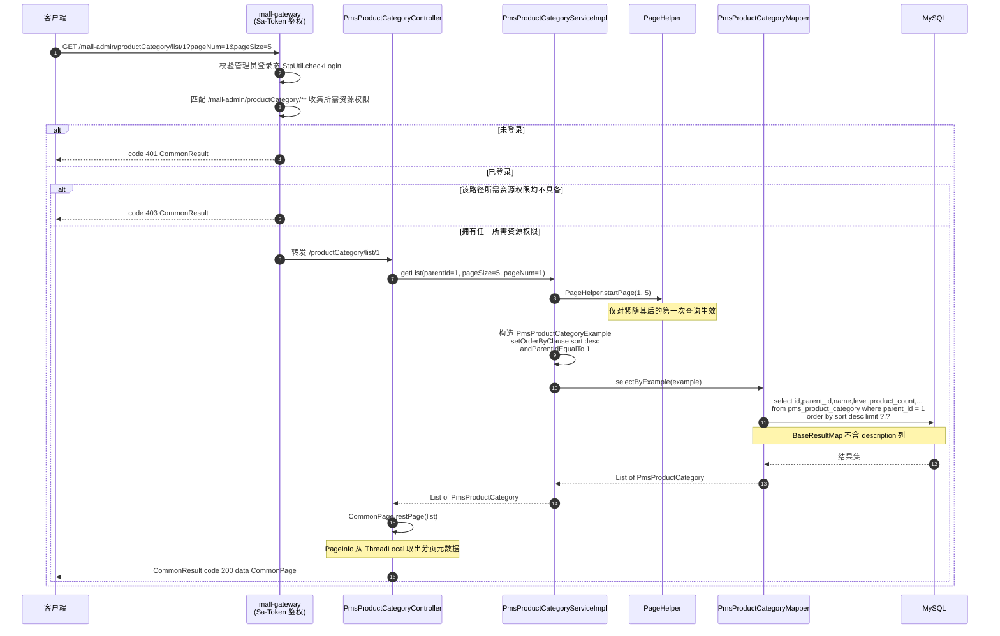
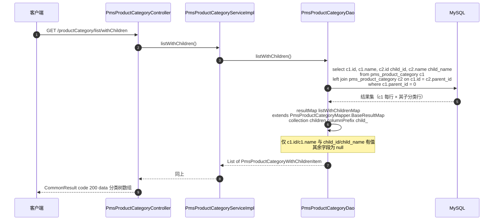
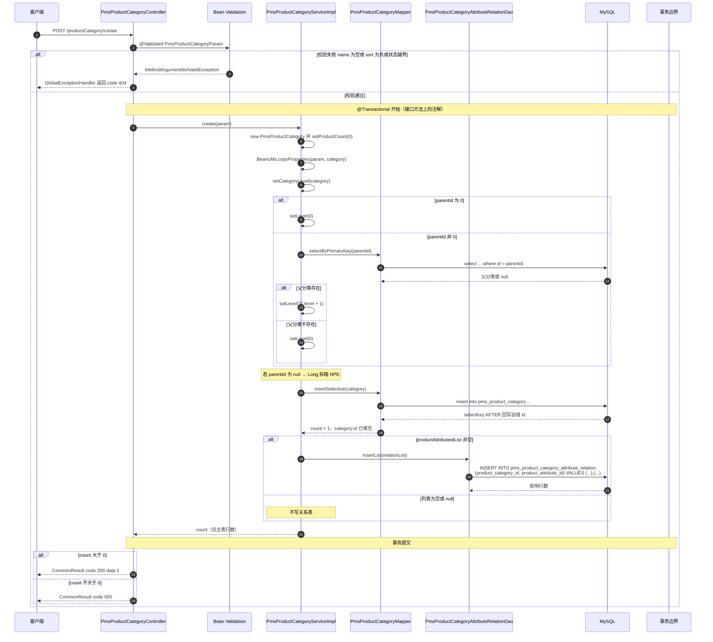
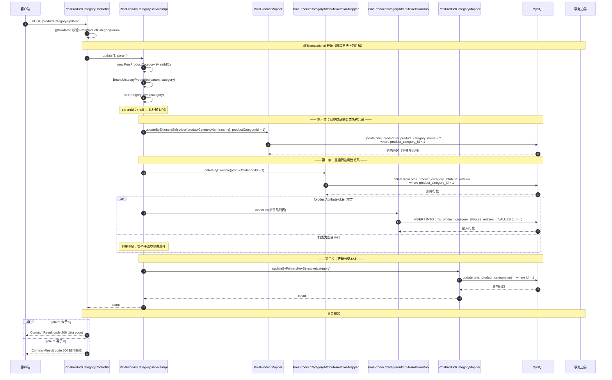
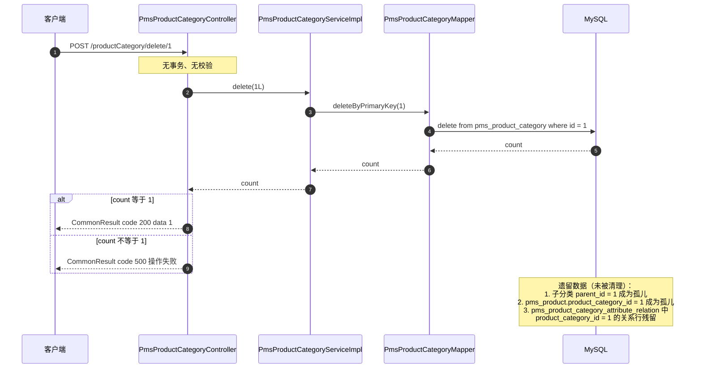
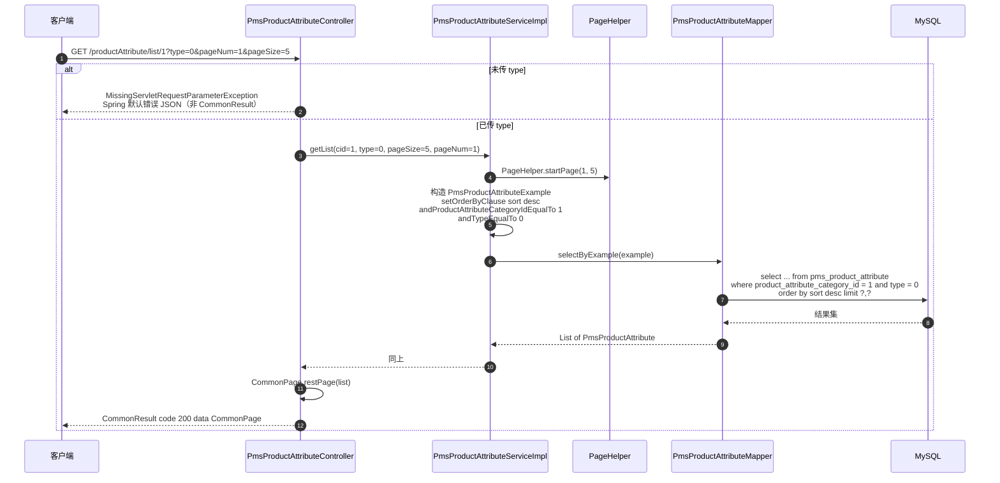
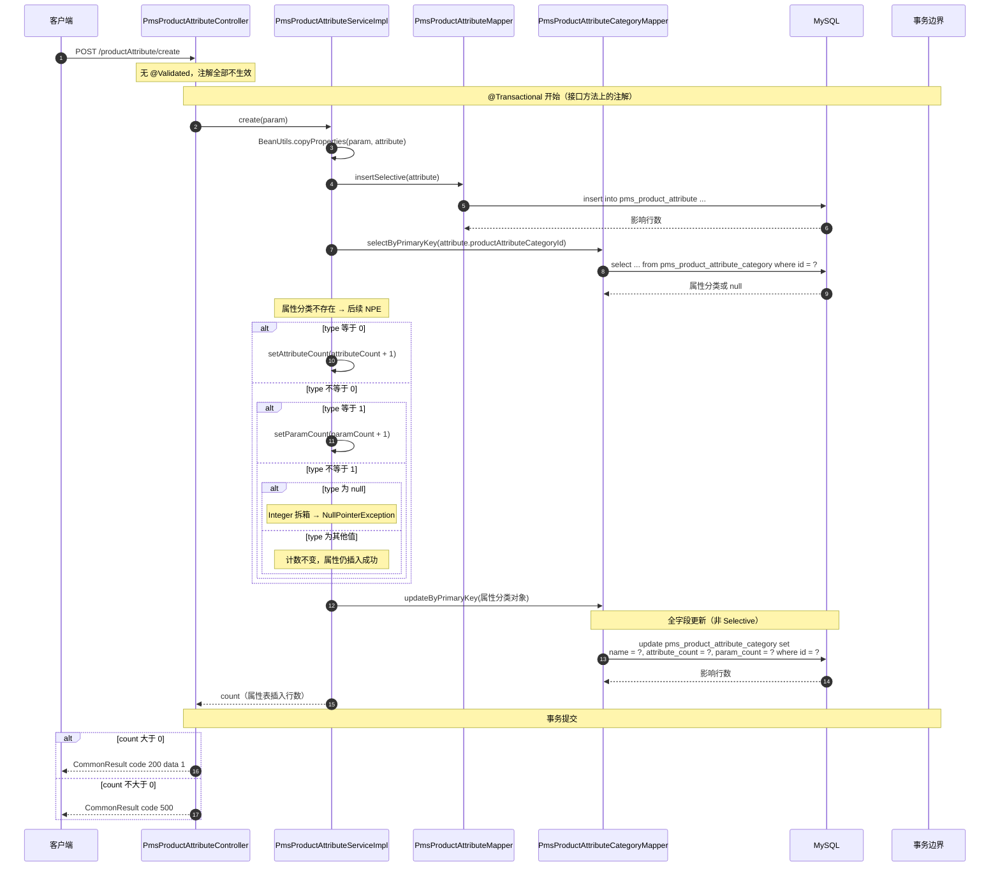
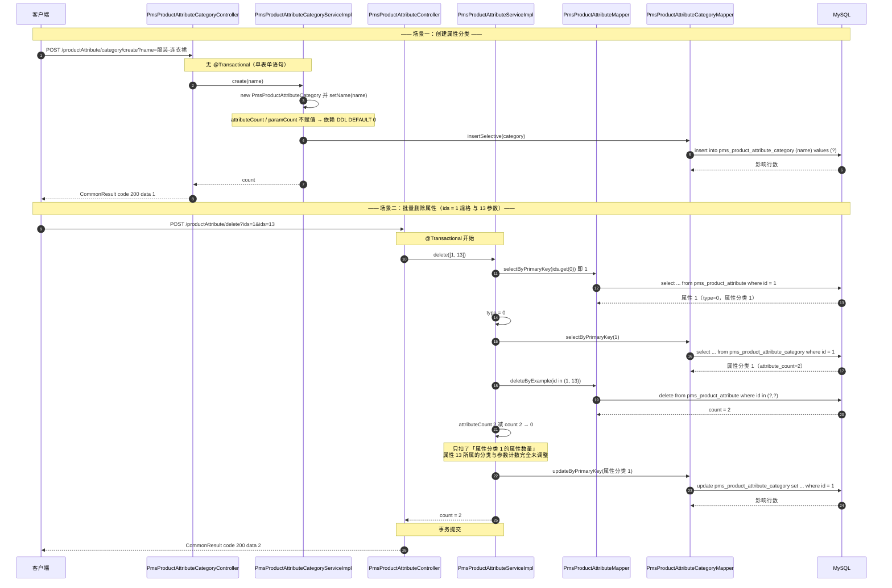
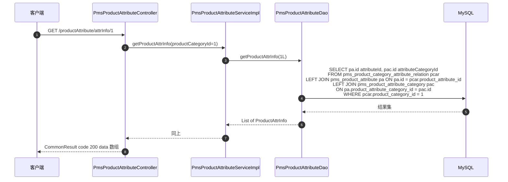

# 详细设计 · 商品分类与属性管理

| 项目 | 内容 |
| --- | --- |
| 文档编号 | DD-PMS-CATEGORY-ATTR-001 |
| 所属业务域 | 商品域（`pms`） |
| 涉及服务 | `mall-admin`（:8080） |
| 涉及数据表 | `pms_product_category`（主表）、`pms_product_attribute`（主表）、`pms_product_attribute_category`（主表）、`pms_product_category_attribute_relation`（关系表） |
| 接口数量 | 20 个（商品分类 8 + 商品属性 6 + 商品属性分类 6） |
| 网关前缀 | `/mall-admin/productCategory/**`、`/mall-admin/productAttribute/**`、`/mall-admin/productAttribute/category/**` |
| 关联写入 | `pms_product.product_category_name`（更新分类时冗余同步） |
| 文档状态 | 待评审 |

---

## 一、概述

### 1.1 范围

本文档描述「商品分类与属性」这一业务能力的详细设计，覆盖：

- **数据库设计**：4 张表的结构、字典、自关联与多对多关系、索引约束现状与改进建议
- **接口设计**：20 个 REST 接口的请求参数、响应结构与数据模型
- **包设计**：`mall-admin` / `mall-mbg` / `mall-common` 三个模块中的包结构与类职责
- **运行流程**：分类树查询、分类增删改（含筛选属性关系重建）、属性按类型筛选、属性创建与计数维护的调用链路与时序
- **日志设计**：日志框架、访问日志切面、本模块埋点与输出目的地
- **测试用例设计**：功能、边界、异常三类用例

不在本文档范围内：商品主数据本身的设计（见商品管理详细设计）、SKU 与销售属性（`pms_sku_stock`）、商品属性值（`pms_product_attribute_value`）的写入流程、前台分类页与筛选栏的交互细节。

### 1.2 术语

| 术语 | 含义 |
| --- | --- |
| 商品分类（Category） | 商品的类目归属，表 `pms_product_category`，通过 `parent_id` 自关联形成**两级**树 |
| 一级分类 | `parent_id = 0` 的分类，`level = 0`，前台导航栏与分类树的一级节点 |
| 二级分类 | `parent_id` 指向一级分类，`level = 1`，商品实际挂载的层级 |
| 商品属性（Attribute） | 表 `pms_product_attribute`，按 `type` 分为**规格（type=0）**与**参数（type=1）**两类 |
| 规格（type=0） | 参与 SKU 组合的销售属性，如「颜色」「尺寸」，前台筛选栏可展示 |
| 参数（type=1） | 商品的静态描述信息，如「上市年份」「CPU型号」，不参与 SKU 组合 |
| 属性分类（AttributeCategory） | 表 `pms_product_attribute_category`，属性的分组，充当**属性模板**；商品通过 `pms_product.product_attribute_category_id` 选用某套模板 |
| 筛选属性 | 通过 `pms_product_category_attribute_relation` 绑定到分类上的属性，用于前台筛选栏。表注释明确**只支持一级分类** |
| 属性数量 / 参数数量 | `pms_product_attribute_category.attribute_count` / `param_count`，冗余计数，由应用层在属性增删时维护 |

> **三个概念的边界**（容易混淆，务必区分）：
>
> | 概念 | 表 | 层级关系 |
> | --- | --- | --- |
> | 商品分类 | `pms_product_category` | 分类树：一级 → 二级 |
> | 属性分类（模板） | `pms_product_attribute_category` | 与商品分类**无外键关系**，是独立的模板分组 |
> | 商品属性 | `pms_product_attribute` | `product_attribute_category_id` 指向属性分类 |
>
> 商品同时持有 `product_category_id`（归属哪个分类）与 `product_attribute_category_id`（用哪套属性模板），两者互不约束。

### 1.3 接口清单总览

| # | 方法 | 路径（服务内） | 网关路径 | 说明 | 控制器 |
| --- | --- | --- | --- | --- | --- |
| 1 | POST | `/productCategory/create` | `/mall-admin/productCategory/create` | 添加产品分类 | `PmsProductCategoryController` |
| 2 | POST | `/productCategory/update/{id}` | `/mall-admin/productCategory/update/{id}` | 修改商品分类 | `PmsProductCategoryController` |
| 3 | GET | `/productCategory/list/{parentId}` | `/mall-admin/productCategory/list/{parentId}` | 分页查询商品分类 | `PmsProductCategoryController` |
| 4 | GET | `/productCategory/{id}` | `/mall-admin/productCategory/{id}` | 根据 id 获取商品分类 | `PmsProductCategoryController` |
| 5 | POST | `/productCategory/delete/{id}` | `/mall-admin/productCategory/delete/{id}` | 删除商品分类 | `PmsProductCategoryController` |
| 6 | POST | `/productCategory/update/navStatus` | `/mall-admin/productCategory/update/navStatus` | 修改导航栏显示状态 | `PmsProductCategoryController` |
| 7 | POST | `/productCategory/update/showStatus` | `/mall-admin/productCategory/update/showStatus` | 修改显示状态 | `PmsProductCategoryController` |
| 8 | GET | `/productCategory/list/withChildren` | `/mall-admin/productCategory/list/withChildren` | 查询所有一级分类及子分类 | `PmsProductCategoryController` |
| 9 | GET | `/productAttribute/list/{cid}` | `/mall-admin/productAttribute/list/{cid}` | 根据分类查询属性列表或参数列表 | `PmsProductAttributeController` |
| 10 | POST | `/productAttribute/create` | `/mall-admin/productAttribute/create` | 添加商品属性信息 | `PmsProductAttributeController` |
| 11 | POST | `/productAttribute/update/{id}` | `/mall-admin/productAttribute/update/{id}` | 修改商品属性信息 | `PmsProductAttributeController` |
| 12 | GET | `/productAttribute/{id}` | `/mall-admin/productAttribute/{id}` | 查询单个商品属性 | `PmsProductAttributeController` |
| 13 | POST | `/productAttribute/delete` | `/mall-admin/productAttribute/delete` | 批量删除商品属性 | `PmsProductAttributeController` |
| 14 | GET | `/productAttribute/attrInfo/{productCategoryId}` | `/mall-admin/productAttribute/attrInfo/{productCategoryId}` | 根据商品分类的 id 获取商品属性及属性分类 | `PmsProductAttributeController` |
| 15 | POST | `/productAttribute/category/create` | `/mall-admin/productAttribute/category/create` | 添加商品属性分类 | `PmsProductAttributeCategoryController` |
| 16 | POST | `/productAttribute/category/update/{id}` | `/mall-admin/productAttribute/category/update/{id}` | 修改商品属性分类 | `PmsProductAttributeCategoryController` |
| 17 | GET | `/productAttribute/category/delete/{id}` | `/mall-admin/productAttribute/category/delete/{id}` | 删除单个商品属性分类 | `PmsProductAttributeCategoryController` |
| 18 | GET | `/productAttribute/category/{id}` | `/mall-admin/productAttribute/category/{id}` | 获取单个商品属性分类信息 | `PmsProductAttributeCategoryController` |
| 19 | GET | `/productAttribute/category/list` | `/mall-admin/productAttribute/category/list` | 分页获取所有商品属性分类 | `PmsProductAttributeCategoryController` |
| 20 | GET | `/productAttribute/category/list/withAttr` | `/mall-admin/productAttribute/category/list/withAttr` | 获取所有商品属性分类及其下属性 | `PmsProductAttributeCategoryController` |

> **归属说明**：20 个端点全部由 `mall-admin` 提供，分别位于 `PmsProductCategoryController`（类级路径 `/productCategory`）、`PmsProductAttributeController`（类级路径 `/productAttribute`）、`PmsProductAttributeCategoryController`（类级路径 `/productAttribute/category`）。
>
> **路由优先级**：`/productAttribute/category/**` 与 `/productAttribute/**` 在 Spring MVC 中不冲突——Spring 按「字面量优先于占位符」匹配，`/productAttribute/category/list` 会命中 `PmsProductAttributeCategoryController.getList`，而不会命中 `PmsProductAttributeController.getItem`（其模式为 `/productAttribute/{id}`）。但网关鉴权侧**不做优先级区分**（见 3.1）。
>
> **鉴权**：网关白名单（`secure.ignore.urls`）中 `mall-admin` 仅放行 `/mall-admin/admin/login`、`/mall-admin/admin/register`、`/mall-admin/minio/upload` 三条。因此本文 20 个端点**全部要求后台管理员登录 + 资源权限**，无匿名接口。

### 1.4 与本次范围相关的既有文档结论

| 来源 | 结论 | 本文档的处理 |
| --- | --- | --- |
| `docs/需求分析.md` FR-PMS-01 | 商品支持多级分类（`parent_id` 自关联，`level` 区分 1/2 级），分类可控制是否显示在导航栏 | 已在 2.4 / 5.2 落实，并指出实现只支持两级 |
| `docs/需求分析.md` FR-PMS-04 | 商品属性分为规格与参数两类（`type`），支持手工录入或列表选取、单选/多选、是否作为筛选条件与检索类型 | 已在 2.4 / 3.2 落实 |
| `docs/需求分析.md` 表关系图 | `PmsProductCategoryAttributeRelation` 连接分类与属性 | 已在 2.5 落实，并补充「只支持一级分类」约束的现状核查 |
| `docs/module-overview.md` | `mall-admin` 有 22 个自定义 DAO，`dto/` 29 个传输对象 | 本文涉及其中 4 个 DAO 与 5 个 DTO |

---

## 二、数据库设计

### 2.1 表清单

| 表名 | 类型 | 说明 | 本模块操作 |
| --- | --- | --- | --- |
| `pms_product_category` | 主表 | 产品分类（自关联多级） | 增、删、改、查 |
| `pms_product_attribute` | 主表 | 商品属性参数表（规格 / 参数） | 增、删、改、查 |
| `pms_product_attribute_category` | 主表 | 产品属性分类表（属性模板） | 增、删、改、查（含计数读写） |
| `pms_product_category_attribute_relation` | 关系表 | 产品的分类和属性的关系表，用于设置分类筛选条件（只支持一级分类） | 增、删、查（无单体修改） |
| `pms_product` | 关联表 | 商品信息 | 更新分类时同步 `product_category_name` 冗余字段（写） |

### 2.2 建表语句（现状）

以下 DDL 原文照抄自 `document/sql/mall.sql`。

**`pms_product_category`（mall.sql:1427–1442）**

```sql
DROP TABLE IF EXISTS `pms_product_category`;
CREATE TABLE `pms_product_category`  (
  `id` bigint(20) NOT NULL AUTO_INCREMENT,
  `parent_id` bigint(20) NULL DEFAULT NULL COMMENT '上机分类的编号：0表示一级分类',
  `name` varchar(64) CHARACTER SET utf8 COLLATE utf8_general_ci NULL DEFAULT NULL,
  `level` int(1) NULL DEFAULT NULL COMMENT '分类级别：0->1级；1->2级',
  `product_count` int(11) NULL DEFAULT NULL,
  `product_unit` varchar(64) CHARACTER SET utf8 COLLATE utf8_general_ci NULL DEFAULT NULL,
  `nav_status` int(1) NULL DEFAULT NULL COMMENT '是否显示在导航栏：0->不显示；1->显示',
  `show_status` int(1) NULL DEFAULT NULL COMMENT '显示状态：0->不显示；1->显示',
  `sort` int(11) NULL DEFAULT NULL,
  `icon` varchar(255) CHARACTER SET utf8 COLLATE utf8_general_ci NULL DEFAULT NULL COMMENT '图标',
  `keywords` varchar(255) CHARACTER SET utf8 COLLATE utf8_general_ci NULL DEFAULT NULL,
  `description` text CHARACTER SET utf8 COLLATE utf8_general_ci NULL COMMENT '描述',
  PRIMARY KEY (`id`) USING BTREE
) ENGINE = InnoDB AUTO_INCREMENT = 56 CHARACTER SET = utf8 COLLATE = utf8_general_ci COMMENT = '产品分类' ROW_FORMAT = DYNAMIC;
```

**`pms_product_attribute`（mall.sql:1176–1191）**

```sql
DROP TABLE IF EXISTS `pms_product_attribute`;
CREATE TABLE `pms_product_attribute`  (
  `id` bigint(20) NOT NULL AUTO_INCREMENT,
  `product_attribute_category_id` bigint(20) NULL DEFAULT NULL,
  `name` varchar(64) CHARACTER SET utf8 COLLATE utf8_general_ci NULL DEFAULT NULL,
  `select_type` int(1) NULL DEFAULT NULL COMMENT '属性选择类型：0->唯一；1->单选；2->多选',
  `input_type` int(1) NULL DEFAULT NULL COMMENT '属性录入方式：0->手工录入；1->从列表中选取',
  `input_list` varchar(255) CHARACTER SET utf8 COLLATE utf8_general_ci NULL DEFAULT NULL COMMENT '可选值列表，以逗号隔开',
  `sort` int(11) NULL DEFAULT NULL COMMENT '排序字段：最高的可以单独上传图片',
  `filter_type` int(1) NULL DEFAULT NULL COMMENT '分类筛选样式：1->普通；1->颜色',
  `search_type` int(1) NULL DEFAULT NULL COMMENT '检索类型；0->不需要进行检索；1->关键字检索；2->范围检索',
  `related_status` int(1) NULL DEFAULT NULL COMMENT '相同属性产品是否关联；0->不关联；1->关联',
  `hand_add_status` int(1) NULL DEFAULT NULL COMMENT '是否支持手动新增；0->不支持；1->支持',
  `type` int(1) NULL DEFAULT NULL COMMENT '属性的类型；0->规格；1->参数',
  PRIMARY KEY (`id`) USING BTREE
) ENGINE = InnoDB AUTO_INCREMENT = 74 CHARACTER SET = utf8 COLLATE = utf8_general_ci COMMENT = '商品属性参数表' ROW_FORMAT = DYNAMIC;
```

**`pms_product_attribute_category`（mall.sql:1253–1260）**

```sql
DROP TABLE IF EXISTS `pms_product_attribute_category`;
CREATE TABLE `pms_product_attribute_category`  (
  `id` bigint(20) NOT NULL AUTO_INCREMENT,
  `name` varchar(64) CHARACTER SET utf8 COLLATE utf8_general_ci NULL DEFAULT NULL,
  `attribute_count` int(11) NULL DEFAULT 0 COMMENT '属性数量',
  `param_count` int(11) NULL DEFAULT 0 COMMENT '参数数量',
  PRIMARY KEY (`id`) USING BTREE
) ENGINE = InnoDB AUTO_INCREMENT = 16 CHARACTER SET = utf8 COLLATE = utf8_general_ci COMMENT = '产品属性分类表' ROW_FORMAT = DYNAMIC;
```

**`pms_product_category_attribute_relation`（mall.sql:1491–1497）**

```sql
DROP TABLE IF EXISTS `pms_product_category_attribute_relation`;
CREATE TABLE `pms_product_category_attribute_relation`  (
  `id` bigint(20) NOT NULL AUTO_INCREMENT,
  `product_category_id` bigint(20) NULL DEFAULT NULL,
  `product_attribute_id` bigint(20) NULL DEFAULT NULL,
  PRIMARY KEY (`id`) USING BTREE
) ENGINE = InnoDB AUTO_INCREMENT = 11 CHARACTER SET = utf8 COLLATE = utf8_general_ci COMMENT = '产品的分类和属性的关系表，用于设置分类筛选条件（只支持一级分类）' ROW_FORMAT = DYNAMIC;
```

### 2.3 字段说明

**`pms_product_category`**

| 字段 | 类型 | 允许空 | 默认值 | 中文名 | 说明 |
| --- | --- | --- | --- | --- | --- |
| `id` | bigint(20) | 否 | AUTO_INCREMENT | 主键 | 分类唯一标识 |
| `parent_id` | bigint(20) | 是 | NULL | 上级分类编号 | 0 表示一级分类；自关联 `pms_product_category.id`。列注释原文为「上机分类的编号」，应为「上级」笔误 |
| `name` | varchar(64) | 是 | NULL | 分类名称 | 业务上必填，由 `PmsProductCategoryParam.@NotEmpty` 校验 |
| `level` | int(1) | 是 | NULL | 分类级别 | 0→1 级；1→2 级。由 `setCategoryLevel()` 按父分类 `level + 1` 推导 |
| `product_count` | int(11) | 是 | NULL | 产品数量 | 冗余统计值，**当前无任何代码维护**；种子数据固定为 100 / 1 / 0 |
| `product_unit` | varchar(64) | 是 | NULL | 分类单位 | 如「件」 |
| `nav_status` | int(1) | 是 | NULL | 是否显示在导航栏 | 0 不显示 / 1 显示 |
| `show_status` | int(1) | 是 | NULL | 显示状态 | 0 不显示 / 1 显示 |
| `sort` | int(11) | 是 | NULL | 排序 | 列表按 `sort desc` 排序，值越大越靠前 |
| `icon` | varchar(255) | 是 | NULL | 图标 | 分类图标 URL |
| `keywords` | varchar(255) | 是 | NULL | 关键字 | 无列注释 |
| `description` | text | 是 | NULL | 描述 | 长文本；**MBG 将其归入 BLOB 列**，`selectByExample` 不返回（见 2.6） |

**`pms_product_attribute`**

| 字段 | 类型 | 允许空 | 默认值 | 中文名 | 说明 |
| --- | --- | --- | --- | --- | --- |
| `id` | bigint(20) | 否 | AUTO_INCREMENT | 主键 | 属性唯一标识 |
| `product_attribute_category_id` | bigint(20) | 是 | NULL | 属性分类编号 | 逻辑外键 → `pms_product_attribute_category.id`；列上**无索引、无外键约束** |
| `name` | varchar(64) | 是 | NULL | 属性名称 | 业务上必填，但接口未启用校验（见 3.3） |
| `select_type` | int(1) | 是 | NULL | 属性选择类型 | 0 唯一 / 1 单选 / 2 多选 |
| `input_type` | int(1) | 是 | NULL | 属性录入方式 | 0 手工录入 / 1 从列表中选取 |
| `input_list` | varchar(255) | 是 | NULL | 可选值列表 | 以**英文逗号**隔开，如 `M,X,XL,2XL` |
| `sort` | int(11) | 是 | NULL | 排序 | 列注释为「排序字段：最高的可以单独上传图片」 |
| `filter_type` | int(1) | 是 | NULL | 分类筛选样式 | 0 普通 / 1 颜色。**DDL 列注释有笔误**（写作「1->普通；1->颜色」） |
| `search_type` | int(1) | 是 | NULL | 检索类型 | 0 不需要检索 / 1 关键字检索 / 2 范围检索 |
| `related_status` | int(1) | 是 | NULL | 相同属性产品是否关联 | 0 不关联 / 1 关联 |
| `hand_add_status` | int(1) | 是 | NULL | 是否支持手动新增 | 0 不支持 / 1 支持 |
| `type` | int(1) | 是 | NULL | 属性的类型 | 0 规格 / 1 参数。**本模块所有分支逻辑的判定依据** |

**`pms_product_attribute_category`**

| 字段 | 类型 | 允许空 | 默认值 | 中文名 | 说明 |
| --- | --- | --- | --- | --- | --- |
| `id` | bigint(20) | 否 | AUTO_INCREMENT | 主键 | 属性分类唯一标识 |
| `name` | varchar(64) | 是 | NULL | 名称 | 属性模板名，如「服装-T恤」；接口定义为必填 query 参数 |
| `attribute_count` | int(11) | 是 | 0 | 属性数量 | 即 `type=0` 规格的数量，冗余计数 |
| `param_count` | int(11) | 是 | 0 | 参数数量 | 即 `type=1` 参数的数量，冗余计数 |

**`pms_product_category_attribute_relation`**

| 字段 | 类型 | 允许空 | 默认值 | 中文名 | 说明 |
| --- | --- | --- | --- | --- | --- |
| `id` | bigint(20) | 否 | AUTO_INCREMENT | 主键 | 关系唯一标识，业务上不使用 |
| `product_category_id` | bigint(20) | 是 | NULL | 商品分类编号 | 逻辑外键 → `pms_product_category.id`，按表注释**应仅指向一级分类** |
| `product_attribute_id` | bigint(20) | 是 | NULL | 商品属性编号 | 逻辑外键 → `pms_product_attribute.id` |

> 关系表**没有业务唯一约束**：同一个 `(product_category_id, product_attribute_id)` 组合可重复插入。当前唯一的去重保障来自 `PmsProductCategoryServiceImpl.update()`「先按分类全删、再整体重插」的写法，`insertList` 本身不做去重（见 5.4）。

### 2.4 状态字典

| 表 | 字段 | 值 | 含义 | 来源 |
| --- | --- | --- | --- | --- |
| `pms_product_category` | `parent_id` | 0 | 一级分类 | `mall.sql` 列注释 |
| `pms_product_category` | `level` | 0 | 1 级分类 | `mall.sql` 列注释 |
| `pms_product_category` | `level` | 1 | 2 级分类 | `mall.sql` 列注释 |
| `pms_product_category` | `nav_status` | 0 | 不在导航栏显示 | `mall.sql` 列注释 |
| `pms_product_category` | `nav_status` | 1 | 在导航栏显示 | `mall.sql` 列注释 |
| `pms_product_category` | `show_status` | 0 | 不显示 | `mall.sql` 列注释 |
| `pms_product_category` | `show_status` | 1 | 显示 | `mall.sql` 列注释 |
| `pms_product_attribute` | `type` | 0 | 规格 | `mall.sql` 列注释 |
| `pms_product_attribute` | `type` | 1 | 参数 | `mall.sql` 列注释 |
| `pms_product_attribute` | `select_type` | 0 | 唯一 | `mall.sql` 列注释 |
| `pms_product_attribute` | `select_type` | 1 | 单选 | `mall.sql` 列注释 |
| `pms_product_attribute` | `select_type` | 2 | 多选 | `mall.sql` 列注释 |
| `pms_product_attribute` | `input_type` | 0 | 手工录入 | `mall.sql` 列注释 |
| `pms_product_attribute` | `input_type` | 1 | 从列表中选取 | `mall.sql` 列注释 |
| `pms_product_attribute` | `filter_type` | 0 | 普通筛选样式 | `PmsProductAttributeParam.@Schema` + `docs/openapi.yaml` 未记录；DDL 注释笔误为「1->普通」，**以代码/DTO 为准** |
| `pms_product_attribute` | `filter_type` | 1 | 颜色筛选样式 | 同上 |
| `pms_product_attribute` | `search_type` | 0 | 不需要进行检索 | `mall.sql` 列注释 |
| `pms_product_attribute` | `search_type` | 1 | 关键字检索 | `mall.sql` 列注释 |
| `pms_product_attribute` | `search_type` | 2 | 范围检索 | `mall.sql` 列注释 |
| `pms_product_attribute` | `related_status` | 0 | 相同属性产品不关联 | `mall.sql` 列注释 |
| `pms_product_attribute` | `related_status` | 1 | 相同属性产品关联 | `mall.sql` 列注释 |
| `pms_product_attribute` | `hand_add_status` | 0 | 不支持手动新增 | `mall.sql` 列注释 |
| `pms_product_attribute` | `hand_add_status` | 1 | 支持手动新增 | `mall.sql` 列注释 |

**取值白名单的代码来源**（`PmsProductAttributeParam` 的 `@FlagValidator`）：

| 字段 | `@FlagValidator` 允许值 | 说明 |
| --- | --- | --- |
| `selectType` | `{"0","1","2"}` | 与列注释一致 |
| `inputType` | `{"0","1"}` | 一致 |
| `filterType` | `{"0","1"}` | 一致 |
| `searchType` | `{"0","1","2"}` | 一致 |
| `relatedStatus` | `{"0","1"}` | 一致 |
| `handAddStatus` | `{"0","1"}` | 一致 |
| `type` | `{"0","1"}` | 一致 |

> **注意**：上表 7 个 `@FlagValidator` 在当前代码中**全部不生效**——`PmsProductAttributeController` 的 `create`/`update` 方法签名为 `@RequestBody PmsProductAttributeParam`，**缺少 `@Validated`**，Spring 不会触发 Bean Validation。详见 3.3 与 5.7。

### 2.5 关联设计

**自关联（分类树）**

```
pms_product_category.parent_id ──────► pms_product_category.id
        （逻辑外键，无 DDL 约束；0 表示根节点）
```

- `level` 是 `parent_id` 的**派生冗余**：`parent_id = 0` → `level = 0`；否则 `level = 父分类.level + 1`。
- 派生逻辑集中在 `PmsProductCategoryServiceImpl.setCategoryLevel()`，只在 `create()` 与 `update()` 中调用，**不会级联更新子分类的 `level`**。

**多对多（分类 ↔ 筛选属性）**

```
pms_product_category.id ◄──── pms_product_category_attribute_relation.product_category_id
pms_product_attribute.id ◄──── pms_product_category_attribute_relation.product_attribute_id
        （两侧均为逻辑外键，无 DDL 约束）
```

- 该关系由 `PmsProductCategoryParam.productAttributeIdList` 一次性提交，语义为**整体覆盖**（先删后插），不存在单条增删接口。
- 表注释明确「**只支持一级分类**」，即 `product_category_id` 应为 `parent_id = 0` 的分类。**当前代码没有任何一层校验这一约束**（`create()` 与 `update()` 都不检查 `productCategoryParam.getParentId()` 是否为 0），二级分类同样可以绑定筛选属性。

**属性分类 → 属性（一对多）**

```
pms_product_attribute_category.id ◄──── pms_product_attribute.product_attribute_category_id
        （逻辑外键，无 DDL 约束；删除属性分类不会清理其下属性）
```

**商品 → 分类 / 属性分类（引用）**

```
pms_product.product_category_id .........► pms_product_category.id   （逻辑外键，无约束）
pms_product.product_attribute_category_id ► pms_product_attribute_category.id （逻辑外键，无约束）
pms_product.product_category_name .......► pms_product_category.name （冗余快照）
```

**关键设计点：`pms_product.product_category_name` 是刻意的冗余。**

商品列表需要展示分类名称，避免每次 join `pms_product_category`，故在商品表冗余一份。`PmsProductCategoryServiceImpl.update()` 在更新分类后，同步刷新该分类下所有商品的冗余名称：

```java
// PmsProductCategoryServiceImpl.update 片段
PmsProduct product = new PmsProduct();
product.setProductCategoryName(productCategory.getName());
PmsProductExample example = new PmsProductExample();
example.createCriteria().andProductCategoryIdEqualTo(id);
productMapper.updateByExampleSelective(product, example);
```

**与品牌模块的差异**：该方法是**有事务的**——`PmsProductCategoryService.update()` 在接口上标注了 `@Transactional`，Spring 的事务属性解析会向上查找接口方法注解，因此冗余同步与分类更新在同一事务内（品牌模块的 `updateBrand` 则没有事务）。但事务内还包含「删除筛选属性关系 + 重新插入」，若分类更新失败会整体回滚（见 5.4）。

> **副作用提示**：`product.setProductCategoryName(productCategory.getName())` 直接取请求参数中的 `name`。`PmsProductCategoryParam.name` 有 `@NotEmpty`，正常路径不会为 null；但 `update()` 中的 `@Validated` 若被绕过（例如内部 Feign 调用），`updateByExampleSelective` 会把所有关联商品的 `product_category_name` **置为 NULL**。

### 2.6 索引与约束现状

| 项目 | `pms_product_category` | `pms_product_attribute` | `pms_product_attribute_category` | `pms_product_category_attribute_relation` |
| --- | --- | --- | --- | --- |
| 主键 | `PRIMARY KEY (id)` USING BTREE | 同左 | 同左 | 同左 |
| 唯一索引 | **无** | **无** | **无** | **无** |
| 普通索引 | **无**（含 `parent_id`） | **无**（含 `product_attribute_category_id`） | **无** | **无**（含两个外键列） |
| 外键约束 | **无** | **无** | **无** | **无** |
| 非空约束 | 仅 `id` | 仅 `id` | 仅 `id` | 仅 `id` |
| 默认值 | 无 | 无 | `attribute_count=0`、`param_count=0` | 无 |
| 逻辑删除 | **无此字段** | **无此字段** | **无此字段** | **无此字段** |

**关联表索引缺失的连锁影响**：

| 表 | 缺索引的列 | 受影响的 SQL |
| --- | --- | --- |
| `pms_product_category` | `parent_id` | `GET /productCategory/list/{parentId}` 的 `where parent_id = ?`；分类树 SQL 的 `c1.parent_id = 0` 与 `on c1.id = c2.parent_id` |
| `pms_product_attribute` | `product_attribute_category_id` | `GET /productAttribute/list/{cid}` 的 `and product_attribute_category_id = ? and type = ?`；`getListWithAttr` 的 LEFT JOIN |
| `pms_product_category_attribute_relation` | `product_category_id` | `update()` 的 `delete from ... where product_category_id = ?`；`attrInfo` 的 `where pcar.product_category_id = ?` |
| `pms_product` | `product_category_id` | `update()` 的 `update pms_product set product_category_name = ? where product_category_id = ?`（`pms_product` 表同样只有主键索引） |

> 四张表数据量在演示库中都很小（40 / 53 / 12 / 5 行），当前不会暴露性能问题；但 `pms_product` 的按分类批量更新会随商品量增长退化为全表扫描。

**MBG 映射带来的字段可见性差异**（影响接口字段完整性）：

| MBG 方法 | 使用的 resultMap | 是否包含 `description` |
| --- | --- | --- |
| `PmsProductCategoryMapper.selectByPrimaryKey` | `ResultMapWithBLOBs` | **是** |
| `PmsProductCategoryMapper.selectByExample` | `BaseResultMap` | **否** |
| `PmsProductCategoryMapper.insertSelective` | — | 写入（非 null 时） |

因此：

- `GET /productCategory/{id}`（`getItem` → `selectByPrimaryKey`）**能返回 `description`**；
- `GET /productCategory/list/{parentId}`（`getList` → `selectByExample`）**不返回 `description`**，该字段恒为 `null`；
- `GET /productCategory/list/withChildren` 的 resultMap 继承 `BaseResultMap`，`description` 同样缺失。

这是**同一个实体在不同接口上字段可见性不一致**，前端若依赖列表返回 `description` 会拿到 `null`。

### 2.7 设计问题与建议

| # | 问题 | 影响 | 建议 |
| --- | --- | --- | --- |
| ① | `pms_product_category` 删除不校验子分类 | 删除一级分类后，其下二级分类的 `parent_id` 成为**孤儿值**，分类树查询（限定 `c1.parent_id = 0`）与列表查询都查不到，数据静默丢失 | 删除前校验 `select count(*) from pms_product_category where parent_id = ?`，或级联删除 / 逻辑删除 |
| ② | `pms_product_category` 删除不校验商品引用 | `pms_product.product_category_id` 成为孤儿，商品详情分类信息缺失；`pms_product.product_category_name` 仍保留旧名称 | 删除前校验 `pms_product` 引用数；或改为逻辑删除 |
| ③ | 删除分类不清理 `pms_product_category_attribute_relation` | 关系表残留指向已删分类的行，`attrInfo` 接口按已删分类 id 查询仍会返回数据 | `delete()` 在同一事务内先删关系再删分类 |
| ④ | `pms_product_category.parent_id` 无索引 | 分页查子分类与分类树 SQL 均走全表扫描 | 增加 `idx_parent_id (parent_id)` |
| ⑤ | `setCategoryLevel()` 对 `parentId` 为 null 会 NPE | `parentId` 未传时 `productCategory.getParentId() == 0` 触发 `Long` 拆箱，抛 `NullPointerException`，返回非 `CommonResult` 的 500 | 改为 `Long.valueOf(0).equals(productCategory.getParentId())`，并在 DTO 上加 `@NotNull`（或默认 0） |
| ⑥ | 更新分类不级联更新子分类 `level` | 把二级分类改挂到另一个一级分类下、或把分类改为一级分类时，子分类 `level` 与 `parent_id` 不再自洽 | `update()` 中递归重算子分类 `level`；或去除 `level` 冗余改为查询时推导 |
| ⑦ | 更新分类不校验 `parent_id` 合法性 | 可将分类的 `parent_id` 设为自身或其子孙，形成**自环 / 环**，分类树查询出现重复或死循环隐患 | 增加「`parentId != id`」与「`parentId` 不属于自身子孙」校验 |
| ⑧ | 筛选属性关系不校验「只支持一级分类」 | 与表注释矛盾，二级分类也能绑定筛选属性，前台筛选栏可能取不到对应值 | 在 `create()`/`update()` 中校验 `parentId == 0`，或放宽表注释并同步前台逻辑 |
| ⑨ | `pms_product_category_attribute_relation` 无唯一约束 | 同一分类重复绑定同一属性会产生重复筛选条件 | 增加唯一索引 `uk_category_attribute (product_category_id, product_attribute_id)` |
| ⑩ | `pms_product_attribute.product_attribute_category_id` 无索引 | 属性列表按属性分类分页查询走全表扫描 | 增加 `idx_attribute_category_id (product_attribute_category_id)` |
| ⑪ | `pms_product_attribute_attribute_category` 删除不清理属性与关系 | 属性分类删除后：① 其下 `pms_product_attribute` 的 `product_attribute_category_id` 变孤儿；② 已绑定为筛选属性的关系行变孤儿；③ `attrInfo` 的 LEFT JOIN 会返回 `attributeCategoryId = null` 的脏行 | `delete()` 加事务，级联处理属性与关系；或禁止删除仍有属性的属性分类 |
| ⑫ | 删除属性不清理关系表与属性值表 | `pms_product_category_attribute_relation` 与 `pms_product_attribute_value` 残留孤儿行；筛选接口返回 `attributeId` 指向不存在的属性 | 删除属性时同事务清理关系表，并评估是否清理属性值或改为逻辑删除 |
| ⑬ | 属性分类的 `attribute_count` / `param_count` 用「读-改-写」维护 | `create()` / `delete()` 先 `selectByPrimaryKey` 再 `updateByPrimaryKey` 整行覆盖，并发下**丢失更新**，计数漂移；且 `updateByPrimaryKey` 是全字段更新 | 改为 `update pms_product_attribute_category set param_count = param_count + 1 where id = ?` 的原子累加，或改为查询时 `count(*)` 实时统计 |
| ⑭ | 属性更新不调整计数 | 把一条规格改为参数（`type` 由 0 改 1）后，`attribute_count` 与 `param_count` 双双错误 | `update()` 中比较新旧 `type`，同步搬移计数 |
| ⑮ | 批量删除属性只按 `ids.get(0)` 取 `type` 与属性分类 | 一次批量删除若混合了规格与参数、或混合了不同属性分类，计数只按第一条调整，其余记录的计数永久漂移 | `delete()` 先按 `ids` 分组统计（属性分类 + type），再逐组扣减 |
| ⑯ | `pms_product_category.product_count` 无维护代码 | 字段恒为种子值（100 / 1 / 0），若前端展示会误导 | 明确废弃，或在商品上下架/改分类时维护 |
| ⑰ | 分类列表不返回 `description` | 同一实体在不同接口字段可见性不一致（详见 2.6） | `getList` 改用 `selectByExampleWithBLOBs`，或在 resultMap 中补 `description` |
| ⑱ | 四张表均无逻辑删除 | 误删不可恢复；分类删除会破坏商品归属 | 对 `pms_product_category`、`pms_product_attribute_category` 引入 `deleted` 标记 |
| ⑲ | 分类名称无唯一约束 | 同一父分类下可建同名分类，运营易混淆 | 增加唯一索引 `uk_parent_name (parent_id, name)` 或应用层查重 |
| ⑳ | 初始化数据存在悬挂引用 | 见 2.8，影响演示与测试基线 | 修正 `mall.sql` 初始化数据 |

### 2.8 初始化数据现状（据 `document/sql/mall.sql` 核对）

| 表 | 数据量 / AUTO_INCREMENT | 核对结论 |
| --- | --- | --- |
| `pms_product_category` | 40 行，`AUTO_INCREMENT = 56` | 实际 id 为 1–5、7–11、13、14、19、29–55；**缺 6、12、15–18、20–28**。其中 id=13、14 的 `parent_id = 12`，但**不存在 id=12 的记录** → 悬挂父引用 |
| `pms_product_attribute` | 53 行，`AUTO_INCREMENT = 74` | id 13–21 共 **9 行的 `product_attribute_category_id = 0`**，而 `pms_product_attribute_category` 最小 id 为 1 → 9 条悬挂属性分类引用 |
| `pms_product_attribute_category` | 12 行，`AUTO_INCREMENT = 16` | id 为 1–6、10–15；含一条名为「测试分类」的 id=10。`attribute_count` / `param_count` 与 `pms_product_attribute` 实际分组**逐条核对一致**（例：id=1 下 `type=0` 有 2 条 → `attribute_count=2`；`type=1` 有 5 条 → `param_count=5`） |
| `pms_product_category_attribute_relation` | 5 行，`AUTO_INCREMENT = 11`（最大 id=10） | `product_category_id` 取值 24、26、28、25，**这 4 个分类 id 在 `pms_product_category` 中均不存在** → 5 行全部为孤儿关系。且 `product_attribute_id` 仅取 24、25，二者 `type` 均为 **1（参数）**，而该表语义是绑定**规格**作为筛选属性 |
| `pms_product.product_category_id` | 38 行 | 取值 7、8、19、29、35、39、53、54、55，均为已存在的二级分类 → 商品**只挂在二级分类**上，与「筛选属性只支持一级分类」形成互补，说明前台筛选应由一级分类配置 |

> **结论**：当前初始化数据中 `pms_product_category_attribute_relation` 表**没有任何一条有效关系**。`GET /productAttribute/attrInfo/{productCategoryId}` 对真实的分类 id 调用会返回空数组；而按 24 / 25 / 26 / 28 调用则会返回悬挂数据。建议先修正初始化数据，再让前台筛选功能联调。

---

## 三、接口设计

### 3.1 通用约定

**统一响应结构**（`com.macro.mall.common.api.CommonResult`）：

```json
{
  "code": 200,
  "message": "操作成功",
  "data": {}
}
```

**业务码定义**（`ResultCode`）：

| code | 常量 | 含义 |
| --- | --- | --- |
| 200 | `SUCCESS` | 操作成功 |
| 401 | `UNAUTHORIZED` | 暂未登录或 token 已经过期 |
| 403 | `FORBIDDEN` | 没有相关权限 |
| 404 | `VALIDATE_FAILED` | 参数检验失败 |
| 500 | `FAILED` | 操作失败 |

> **注意**：业务码定义在 **HTTP 响应体内部**，HTTP 状态码通常仍为 200。`VALIDATE_FAILED` 使用 404 表示参数校验失败，与 HTTP 语义不一致，前端需按 `code` 而非 HTTP 状态码判断。

**统一分页结构**（`CommonPage`）：

| 名称 | 类型 | 说明 |
| --- | --- | --- |
| pageNum | integer | 当前页码 |
| pageSize | integer | 每页条数 |
| totalPage | integer | 总页数 |
| total | integer(int64) | 总记录数 |
| list | array | 数据列表 |

**网关前缀与路由**（`mall-gateway/src/main/resources/application.yml`）：

```yaml
- id: mall-admin
  uri: lb://mall-admin
  predicates:
    - Path=/mall-admin/**
  filters:
    - StripPrefix=1
```

网关剥离 `/mall-admin` 前缀后转发到服务内部路径，因此文档中的「服务内路径」与「网关路径」相差一个 `/mall-admin` 前缀。

**鉴权**：请求头 `Authorization: Bearer <token>`（`sa-token.token-prefix: Bearer`，`token-name: Authorization`）。

- **登录态**：`SaRouter.match("/mall-admin/**", r -> StpUtil.checkLogin())`，未登录返回 `code: 401`。
- **资源权限**：网关从 Redis Hash `auth:pathResourceMap` 读取「路径模式 → 资源标识」，用 `AntPathMatcher` 遍历**所有**匹配当前请求路径的模式，把命中的资源全部收集进 `needPermissionList`，再执行 `StpUtil.checkPermissionOr(...)`（**满足任意一个即可**）。
- 资源标识的格式为 `资源id:资源名称`（`UmsAdminServiceImpl` 第 110 行 `item.getId() + ":" + item.getName()`）。

本模块涉及的后台资源（`mall.sql` 中 `ums_resource` 种子数据）：

| 资源 id | 资源名称 | 资源 URL | 资源分类 |
| --- | --- | --- | --- |
| 2 | 商品属性分类管理 | `/productAttribute/category/**` | 1（商品模块） |
| 3 | 商品属性管理 | `/productAttribute/**` | 1（商品模块） |
| 4 | 商品分类管理 | `/productCategory/**` | 1（商品模块） |

`/mall-admin` + 资源 URL 组成 Redis 中的匹配模式：

```
/mall-admin/productAttribute/category/**  →  "2:商品属性分类管理"
/mall-admin/productAttribute/**           →  "3:商品属性管理"
/mall-admin/productCategory/**            →  "4:商品分类管理"
```

> **权限重叠问题（现状，重要）**：请求 `/mall-admin/productAttribute/category/create` 时，上表前两个模式**同时命中**，`needPermissionList = ["2:商品属性分类管理", "3:商品属性管理"]`，而鉴权用的是 `checkPermissionOr`。结果是：**只被授予「商品属性管理」的用户也能操作「商品属性分类」的全部接口**，资源划分失去了隔离意义。建议改为「最长匹配优先」——只取匹配度最高的一个模式，或把两个资源 URL 改为互不包含的前缀。

**参数校验**：`GlobalExceptionHandler` 只处理 `ApiException`、`MethodArgumentNotValidException`、`BindException` 三类。`@RequestParam` 缺失、路径变量类型转换失败、NPE 等**均无兜底**，会返回 Spring 默认错误 JSON（非 `CommonResult` 结构）。

**Mermaid 说明**：本文档中的 `<a id="opIdxxx"></a>` 锚点为手工命名，`docs/openapi.yaml` 未定义 `operationId`。

---

### 3.2 商品分类接口（`PmsProductCategoryController`，8 个端点）

<a id="opIdcategoryCreate"></a>

## POST 添加产品分类

POST /productCategory/create

创建商品分类，`level` 由父分类推导；可同时绑定分类的筛选属性。

> Body 请求参数

```json
{
  "parentId": 0,
  "name": "图书",
  "productUnit": "本",
  "navStatus": 1,
  "showStatus": 1,
  "sort": 5,
  "icon": "http://macro-oss.oss-cn-shenzhen.aliyuncs.com/mall/images/20190519/book.jpg",
  "keywords": "图书",
  "description": "图书分类",
  "productAttributeIdList": [24, 25]
}
```

### 请求参数

| 名称 | 位置 | 类型 | 必选 | 说明 |
| --- | --- | --- | --- | --- |
| body | body | [PmsProductCategoryParam](#schemapmsproductcategoryparam) | 是 | 商品分类参数 |

### 返回结果

| 状态码 | 状态码含义 | 说明 | 数据模型 |
| --- | --- | --- | --- |
| 200 | [OK](https://tools.ietf.org/html/rfc7231#section-6.3.1) | 操作成功 | Inline |

### 返回数据结构

状态码 **200**

| 名称 | 类型 | 必选 | 约束 | 中文名 | 说明 |
| --- | --- | --- | --- | --- | --- |
| code | integer(int64) | true | none | 业务码 | 200 表示成功 |
| message | string | true | none | 提示信息 | none |
| data | integer(int32) | false | none | 影响行数 | 成功时为 1（**只统计主表插入**，关系表行数不计入） |

> **设计备注**：`productAttributeIdList` 非空才会写入 `pms_product_category_attribute_relation`；为空数组或不传则只建分类，不产生任何筛选属性关系。

---

<a id="opIdcategoryUpdate"></a>

## POST 修改商品分类

POST /productCategory/update/{id}

更新指定商品分类。**同时会：① 同步该分类下所有商品的 `product_category_name`；② 整体重建该分类的筛选属性关系。**

> Body 请求参数

```json
{
  "parentId": 0,
  "name": "图书-改",
  "productUnit": "册",
  "navStatus": 1,
  "showStatus": 0,
  "sort": 9,
  "icon": "http://macro-oss.oss-cn-shenzhen.aliyuncs.com/mall/images/20190519/book.jpg",
  "keywords": "图书,书籍",
  "description": "更新后的描述",
  "productAttributeIdList": [24]
}
```

### 请求参数

| 名称 | 位置 | 类型 | 必选 | 说明 |
| --- | --- | --- | --- | --- |
| id | path | integer(int64) | 是 | 商品分类编号 |
| body | body | [PmsProductCategoryParam](#schemapmsproductcategoryparam) | 是 | 商品分类参数 |

### 返回结果

| 状态码 | 状态码含义 | 说明 | 数据模型 |
| --- | --- | --- | --- |
| 200 | [OK](https://tools.ietf.org/html/rfc7231#section-6.3.1) | 操作成功 | Inline |

### 返回数据结构

状态码 **200**

| 名称 | 类型 | 必选 | 约束 | 中文名 | 说明 |
| --- | --- | --- | --- | --- | --- |
| code | integer(int64) | true | none | 业务码 | 200 成功；500 失败 |
| message | string | true | none | 提示信息 | none |
| data | integer(int32) | false | none | 影响行数 | 取自主表 `updateByPrimaryKeySelective`；字段值与库中完全一致时为 **0** |

> **设计备注 ①（筛选属性整体覆盖）**：`productAttributeIdList` 为 **null 或空数组**时，代码走 `else` 分支**同样执行删除**，等价于「清空该分类的全部筛选属性」。因此前端「不改筛选属性」与「清空筛选属性」无法区分，必须每次都把完整列表回传。
>
> **设计备注 ②（假失败）**：接口以 `count > 0` 判定成功。MySQL 在 UPDATE 前后字段值完全相同时返回受影响行数 0，此时接口返回 `code: 500 操作失败`，但数据其实是对的。前端可能弹出误导性错误。
>
> **设计备注 ③（NPE）**：请求体不传 `parentId`（`null`）时，`setCategoryLevel()` 中的 `productCategory.getParentId() == 0` 会触发 `Long` 拆箱 NPE，接口返回 Spring 默认 500 而非 `CommonResult`。

---

<a id="opIdcategoryList"></a>

## GET 分页查询商品分类

GET /productCategory/list/{parentId}

查询指定父分类下的直接子分类，按 `sort desc` 排序，使用 `PageHelper` 分页。

### 请求参数

| 名称 | 位置 | 类型 | 必选 | 说明 |
| --- | --- | --- | --- | --- |
| parentId | path | integer(int64) | 是 | 父分类编号；传 0 查询所有一级分类 |
| pageSize | query | integer | 否 | 每页条数，默认 5 |
| pageNum | query | integer | 否 | 页码，默认 1 |

> 返回示例

> 200 Response

```json
{
  "code": 200,
  "message": "操作成功",
  "data": {
    "pageNum": 1,
    "pageSize": 5,
    "totalPage": 2,
    "total": 6,
    "list": [
      {
        "id": 52,
        "parentId": 0,
        "name": "电脑办公",
        "level": 0,
        "productCount": 0,
        "productUnit": "件",
        "navStatus": 1,
        "showStatus": 1,
        "sort": 1,
        "icon": "",
        "keywords": "电脑办公",
        "description": null
      },
      {
        "id": 5,
        "parentId": 0,
        "name": "汽车用品",
        "level": 0,
        "productCount": 100,
        "productUnit": "件",
        "navStatus": 1,
        "showStatus": 1,
        "sort": 1,
        "icon": null,
        "keywords": "汽车用品",
        "description": null
      }
    ]
  }
}
```

### 返回结果

| 状态码 | 状态码含义 | 说明 | 数据模型 |
| --- | --- | --- | --- |
| 200 | [OK](https://tools.ietf.org/html/rfc7231#section-6.3.1) | 操作成功 | Inline |

### 返回数据结构

状态码 **200**

| 名称 | 类型 | 必选 | 约束 | 中文名 | 说明 |
| --- | --- | --- | --- | --- | --- |
| code | integer(int64) | true | none | 业务码 | none |
| message | string | true | none | 提示信息 | none |
| data | [CommonPage](#schemacommonpage) | false | none | 分页数据 | none |
| » pageNum | integer | false | none | 当前页码 | none |
| » pageSize | integer | false | none | 每页条数 | none |
| » totalPage | integer | false | none | 总页数 | none |
| » total | integer(int64) | false | none | 总记录数 | none |
| » list | [[PmsProductCategory](#schemapmsproductcategory)] | false | none | 分类列表 | `description` **恒为 null**（走 `selectByExample`，见 2.6） |

> **排序说明**：`example.setOrderByClause("sort desc")` 是字符串直接拼进 SQL（`order by ${orderByClause}`），此处为固定常量，不存在注入风险。
>
> **无关键字查询**：本接口只能按 `parentId` 过滤，后台分类列表页的关键字搜索没有对应后端能力。

---

<a id="opIdcategoryGetItem"></a>

## GET 根据 id 获取商品分类

GET /productCategory/{id}

### 请求参数

| 名称 | 位置 | 类型 | 必选 | 说明 |
| --- | --- | --- | --- | --- |
| id | path | integer(int64) | 是 | 商品分类编号 |

> 返回示例

> 200 Response

```json
{
  "code": 200,
  "message": "操作成功",
  "data": {
    "id": 1,
    "parentId": 0,
    "name": "服装",
    "level": 0,
    "productCount": 100,
    "productUnit": "件",
    "navStatus": 1,
    "showStatus": 1,
    "sort": 1,
    "icon": null,
    "keywords": "服装",
    "description": "服装分类"
  }
}
```

### 返回结果

| 状态码 | 状态码含义 | 说明 | 数据模型 |
| --- | --- | --- | --- |
| 200 | [OK](https://tools.ietf.org/html/rfc7231#section-6.3.1) | 操作成功 | [CommonResultPmsProductCategory](#schemacommonresultpmsproductcategory) |

### 返回数据结构

状态码 **200**

| 名称 | 类型 | 必选 | 约束 | 中文名 | 说明 |
| --- | --- | --- | --- | --- | --- |
| code | integer(int64) | true | none | 业务码 | none |
| message | string | true | none | 提示信息 | none |
| data | [PmsProductCategory](#schemapmsproductcategory) | false | none | 商品分类 | 不存在该 id 时 `data` 为 null，`code` 仍为 200 |

> **设计备注**：本接口是**唯一能返回 `description`** 的分类接口（`selectByPrimaryKey` 使用 `ResultMapWithBLOBs`）。分类不存在时不返回错误码，前端需自行判空。

---

<a id="opIdcategoryDelete"></a>

## POST 删除商品分类

POST /productCategory/delete/{id}

根据编号删除商品分类（物理删除）。

### 请求参数

| 名称 | 位置 | 类型 | 必选 | 说明 |
| --- | --- | --- | --- | --- |
| id | path | integer(int64) | 是 | 商品分类编号 |

### 返回结果

| 状态码 | 状态码含义 | 说明 | 数据模型 |
| --- | --- | --- | --- |
| 200 | [OK](https://tools.ietf.org/html/rfc7231#section-6.3.1) | 操作成功 | Inline |

### 返回数据结构

状态码 **200**

| 名称 | 类型 | 必选 | 约束 | 中文名 | 说明 |
| --- | --- | --- | --- | --- | --- |
| code | integer(int64) | true | none | 业务码 | 200 成功；500 失败 |
| message | string | true | none | 提示信息 | none |
| data | integer(int32) | false | none | 删除行数 | 成功时为 1 |

> **设计备注（本模块最高风险接口）**：`delete()` 只执行 `productCategoryMapper.deleteByPrimaryKey(id)`，**未做任何校验、未开事务、未清理关联**：
>
> | 缺失的校验 / 清理 | 后果 |
> | --- | --- |
> | 子分类存在性校验 | 二级分类 `parent_id` 变孤儿，分类树与列表均查不到 |
> | `pms_product` 引用校验 | 商品 `product_category_id` 变孤儿 |
> | `pms_product_category_attribute_relation` 清理 | 残留指向已删分类的筛选属性关系 |
> | `@Transactional` | 未来若补上多步清理，缺少事务会半途失败留脏数据 |
>
> 建议改为：`@Transactional` + 先校验子分类与商品引用 + 再删关系 + 最后删分类；或引入逻辑删除。

---

<a id="opIdcategoryUpdateNavStatus"></a>

## POST 修改导航栏显示状态

POST /productCategory/update/navStatus

批量更新分类的导航栏显示状态。

### 请求参数

| 名称 | 位置 | 类型 | 必选 | 说明 |
| --- | --- | --- | --- | --- |
| ids | query | array[integer] | 是 | 分类编号列表，重复参数传递 |
| navStatus | query | integer | 是 | 导航栏显示状态：0 不显示；1 显示 |

### 返回结果

| 状态码 | 状态码含义 | 说明 | 数据模型 |
| --- | --- | --- | --- |
| 200 | [OK](https://tools.ietf.org/html/rfc7231#section-6.3.1) | 操作成功 | Inline |

### 返回数据结构

状态码 **200**

| 名称 | 类型 | 必选 | 约束 | 中文名 | 说明 |
| --- | --- | --- | --- | --- | --- |
| code | integer(int64) | true | none | 业务码 | 200 成功；500 失败 |
| message | string | true | none | 提示信息 | none |
| data | integer(int32) | false | none | 更新行数 | 全部字段值未变化时为 0，接口返回失败 |

> **设计备注**：`navStatus` 是 `@RequestParam`，**没有取值校验**（`@FlagValidator` 只作用于 DTO 字段，且 `@Target` 虽含 `PARAMETER`，但 Controller 方法未加 `@Validated` 也不会触发方法级校验）。传入 2 或 -1 会成功写库。建议在 Service 层增加枚举校验。

---

<a id="opIdcategoryUpdateShowStatus"></a>

## POST 修改显示状态

POST /productCategory/update/showStatus

批量更新分类的显示状态。

### 请求参数

| 名称 | 位置 | 类型 | 必选 | 说明 |
| --- | --- | --- | --- | --- |
| ids | query | array[integer] | 是 | 分类编号列表 |
| showStatus | query | integer | 是 | 显示状态：0 不显示；1 显示 |

### 返回结果

| 状态码 | 状态码含义 | 说明 | 数据模型 |
| --- | --- | --- | --- |
| 200 | [OK](https://tools.ietf.org/html/rfc7231#section-6.3.1) | 操作成功 | Inline |

### 返回数据结构

状态码 **200**

| 名称 | 类型 | 必选 | 约束 | 中文名 | 说明 |
| --- | --- | --- | --- | --- | --- |
| code | integer(int64) | true | none | 业务码 | 200 成功；500 失败 |
| message | string | true | none | 提示信息 | none |
| data | integer(int32) | false | none | 更新行数 | none |

> **设计备注**：同 `update/navStatus`，`showStatus` 无取值校验。另外本接口只影响分类自身，**不会级联修改子分类的 `show_status`**——父分类隐藏而子分类仍显示时，前台分类树可能出现「父节点不显示但子节点被单独访问」的孤儿展示。

---

<a id="opIdcategoryListWithChildren"></a>

## GET 查询所有一级分类及子分类

GET /productCategory/list/withChildren

一次性返回所有一级分类及其直接子分类，供后台分类选择器与前台导航使用。

### 请求参数

无

> 返回示例

> 200 Response

```json
{
  "code": 200,
  "message": "操作成功",
  "data": [
    {
      "id": 1,
      "name": "服装",
      "children": [
        { "id": 7, "name": "外套" },
        { "id": 8, "name": "T恤" },
        { "id": 9, "name": "休闲裤" }
      ]
    },
    {
      "id": 2,
      "name": "手机数码",
      "children": [
        { "id": 19, "name": "手机通讯" },
        { "id": 30, "name": "手机配件" }
      ]
    }
  ]
}
```

### 返回结果

| 状态码 | 状态码含义 | 说明 | 数据模型 |
| --- | --- | --- | --- |
| 200 | [OK](https://tools.ietf.org/html/rfc7231#section-6.3.1) | 操作成功 | [CommonResultCategoryWithChildren](#schemacommonresultcategorywithchildren) |

### 返回数据结构

状态码 **200**

| 名称 | 类型 | 必选 | 约束 | 中文名 | 说明 |
| --- | --- | --- | --- | --- | --- |
| code | integer(int64) | true | none | 业务码 | none |
| message | string | true | none | 提示信息 | none |
| data | [[PmsProductCategoryWithChildrenItem](#schemapmsproductcategorywithchildrenitem)] | false | none | 分类树 | 仅两级 |
| » id | integer(int64) | false | none | 一级分类编号 | 由 `c1.id` 映射 |
| » name | string | false | none | 一级分类名称 | 由 `c1.name` 映射 |
| » parentId | integer(int64) | false | none | 上级分类编号 | **恒为 null**（SQL 未 select 该列） |
| » level | integer | false | none | 分类级别 | **恒为 null** |
| » navStatus | integer | false | none | 导航栏状态 | **恒为 null** |
| » showStatus | integer | false | none | 显示状态 | **恒为 null** |
| » sort | integer | false | none | 排序 | **恒为 null** |
| » productCount | integer | false | none | 产品数量 | **恒为 null** |
| » productUnit | string | false | none | 分类单位 | **恒为 null** |
| » icon | string | false | none | 图标 | **恒为 null** |
| » keywords | string | false | none | 关键字 | **恒为 null** |
| » description | string | false | none | 描述 | **恒为 null** |
| » children | [[PmsProductCategory](#schemapmsproductcategory)] | false | none | 子级分类 | 仅 `id`、`name` 有值，其余字段全为 null |

> **设计备注（字段严重缺失）**：`PmsProductCategoryDao.xml` 的 SQL 只 select 了 4 列——
>
> ```sql
> select
>     c1.id,
>     c1.name,
>     c2.id   child_id,
>     c2.name child_name
> from pms_product_category c1 left join pms_product_category c2 on c1.id = c2.parent_id
> where c1.parent_id = 0
> ```
>
> resultMap 继承 `PmsProductCategoryMapper.BaseResultMap`（含 11 个字段），但未取到的列一律为 null。**后果**：
>
> 1. 一级分类的 `nav_status` / `show_status` / `sort` / `icon` **全部丢失**——后台若用本接口渲染导航需要状态与图标的场景会失效。前台不走本接口：`HomeServiceImpl.getProductCateList(parentId)` 用 `PmsProductCategoryMapper.selectByExample`（条件 `show_status=1` + `parent_id`，`sort desc` 排序），`PmsPortalProductServiceImpl.categoryTreeList()` 则全表查出后在 Java 中过滤 `parentId.equals(0L)` 并递归拼树，二者都不受影响。
> 2. 排序**完全不受控**：SQL 没有 `order by`，`sort` 字段又是 null，返回顺序由 MySQL 决定，与「值越大越靠前」的列表约定不一致。
> 3. 子分类只有 id 与 name，`level`、`show_status` 等均缺失。
> 4. **只支持两级**：SQL 是固定的自连接（c1 ↔ c2），第三级及以后永远不会出现。`setCategoryLevel()` 却允许 `level` 增长到 2 以上，二者不自洽。
> 5. 未过滤 `show_status` / `nav_status`，停用的分类也会返回，需调用方自行过滤。
>
> 建议改为按需 select 全字段 + `order by c1.sort desc, c2.sort desc`，并在 Service 层补「校验分类层级不超过 2」的约束。

---

### 3.3 商品属性接口（`PmsProductAttributeController`，6 个端点）

<a id="opIdattributeList"></a>

## GET 根据分类查询属性列表或参数列表

GET /productAttribute/list/{cid}

按属性分类 + 属性类型分页查询属性，按 `sort desc` 排序。

> **参数语义对照（易错点）**：本接口的 `cid` 参数实际指向的是 **`pms_product_attribute_category.id`（属性分类 / 属性模板）**，不是商品分类。代码为 `example.createCriteria().andProductAttributeCategoryIdEqualTo(cid)`。接口文档与代码注释均正确，但 **`PmsProductAttributeService.getList` 的 javadoc 写成了「@param type 0->属性；2->参数」，与实现的 `type==1 为参数` 不一致**，以代码为准。

### 请求参数

| 名称 | 位置 | 类型 | 必选 | 说明 |
| --- | --- | --- | --- | --- |
| cid | path | integer(int64) | 是 | 属性分类编号（`product_attribute_category_id`） |
| type | query | integer | 是 | 0 表示属性（规格），1 表示参数；**无默认值，必传** |
| pageSize | query | integer | 否 | 每页条数，默认 5 |
| pageNum | query | integer | 否 | 页码，默认 1 |

#### 枚举值

| 属性 | 值 |
| --- | --- |
| type | 0 |
| type | 1 |

> 返回示例

> 200 Response

```json
{
  "code": 200,
  "message": "操作成功",
  "data": {
    "pageNum": 1,
    "pageSize": 5,
    "totalPage": 1,
    "total": 2,
    "list": [
      {
        "id": 7,
        "productAttributeCategoryId": 1,
        "name": "颜色",
        "selectType": 2,
        "inputType": 1,
        "inputList": "黑色,红色,白色,粉色",
        "sort": 100,
        "filterType": 0,
        "searchType": 0,
        "relatedStatus": 0,
        "handAddStatus": 1,
        "type": 0
      },
      {
        "id": 1,
        "productAttributeCategoryId": 1,
        "name": "尺寸",
        "selectType": 2,
        "inputType": 1,
        "inputList": "M,X,XL,2XL,3XL,4XL",
        "sort": 0,
        "filterType": 0,
        "searchType": 0,
        "relatedStatus": 0,
        "handAddStatus": 0,
        "type": 0
      }
    ]
  }
}
```

### 返回结果

| 状态码 | 状态码含义 | 说明 | 数据模型 |
| --- | --- | --- | --- |
| 200 | [OK](https://tools.ietf.org/html/rfc7231#section-6.3.1) | 操作成功 | Inline |

### 返回数据结构

状态码 **200**

| 名称 | 类型 | 必选 | 约束 | 中文名 | 说明 |
| --- | --- | --- | --- | --- | --- |
| code | integer(int64) | true | none | 业务码 | none |
| message | string | true | none | 提示信息 | none |
| data | [CommonPage](#schemacommonpage) | false | none | 分页数据 | `list` 元素为 [PmsProductAttribute](#schemapmsproductattribute) |

> **设计备注**：`type` 无默认值，缺失时 Spring 抛 `MissingServletRequestParameterException`，返回**非 `CommonResult`** 结构；`type` 传 2 或 null 之外的值时查询条件不匹配任何行，返回空分页（不报错）。

---

<a id="opIdattributeCreate"></a>

## POST 添加商品属性信息

POST /productAttribute/create

创建规格或参数，并**联动维护所属属性分类的 `attribute_count` / `param_count`**。

> Body 请求参数

```json
{
  "productAttributeCategoryId": 1,
  "name": "材质",
  "selectType": 2,
  "inputType": 1,
  "inputList": "棉,涤纶,羊毛",
  "sort": 0,
  "filterType": 0,
  "searchType": 0,
  "relatedStatus": 0,
  "handAddStatus": 1,
  "type": 0
}
```

### 请求参数

| 名称 | 位置 | 类型 | 必选 | 说明 |
| --- | --- | --- | --- | --- |
| body | body | [PmsProductAttributeParam](#schemapmsproductattributeparam) | 是 | 商品属性参数 |

### 返回结果

| 状态码 | 状态码含义 | 说明 | 数据模型 |
| --- | --- | --- | --- |
| 200 | [OK](https://tools.ietf.org/html/rfc7231#section-6.3.1) | 操作成功 | Inline |

### 返回数据结构

状态码 **200**

| 名称 | 类型 | 必选 | 约束 | 中文名 | 说明 |
| --- | --- | --- | --- | --- | --- |
| code | integer(int64) | true | none | 业务码 | 200 成功；500 失败 |
| message | string | true | none | 提示信息 | none |
| data | integer(int32) | false | none | 影响行数 | 成功时为 1 |

> **设计备注 ①（校验完全失效，本模块重要缺陷）**：方法签名为 `create(@RequestBody PmsProductAttributeParam productAttributeParam)`，**没有 `@Validated`**。因此 `PmsProductAttributeParam` 上的 7 个 `@FlagValidator` 与 2 个 `@NotEmpty` **全部不生效**，任何字段都可以缺省或传非法值并成功入库。
>
> **设计备注 ②（NPE）**：`type` 不传时，Service 中 `pmsProductAttribute.getType() == 0` 触发 `Integer` 拆箱 NPE。
>
> **设计备注 ③（NPE）**：`productAttributeCategoryId` 指向不存在的属性分类时，`selectByPrimaryKey` 返回 null，随后 `pmsProductAttributeCategory.setAttributeCount(...)` 或 `updateByPrimaryKey(null)` 抛 NPE。
>
> **设计备注 ④（`@NotEmpty` 用错类型）**：`productAttributeCategoryId` 是 `Long`，`@NotEmpty` 只支持 `CharSequence`/`Collection`/`Map`/数组。即使将来补上 `@Validated`，也会抛 `UnexpectedTypeException: No validator could be found for constraint 'jakarta.validation.constraints.NotEmpty' validating type 'java.lang.Long'`。应改为 `@NotNull`。

---

<a id="opIdattributeUpdate"></a>

## POST 修改商品属性信息

POST /productAttribute/update/{id}

### 请求参数

| 名称 | 位置 | 类型 | 必选 | 说明 |
| --- | --- | --- | --- | --- |
| id | path | integer(int64) | 是 | 属性编号 |
| body | body | [PmsProductAttributeParam](#schemapmsproductattributeparam) | 是 | 商品属性参数 |

> Body 请求参数

```json
{
  "productAttributeCategoryId": 1,
  "name": "材质-改",
  "selectType": 1,
  "inputType": 1,
  "inputList": "棉,涤纶",
  "sort": 10,
  "filterType": 1,
  "searchType": 1,
  "relatedStatus": 1,
  "handAddStatus": 1,
  "type": 0
}
```

### 返回结果

| 状态码 | 状态码含义 | 说明 | 数据模型 |
| --- | --- | --- | --- |
| 200 | [OK](https://tools.ietf.org/html/rfc7231#section-6.3.1) | 操作成功 | Inline |

### 返回数据结构

状态码 **200**

| 名称 | 类型 | 必选 | 约束 | 中文名 | 说明 |
| --- | --- | --- | --- | --- | --- |
| code | integer(int64) | true | none | 业务码 | 200 成功；500 失败 |
| message | string | true | none | 提示信息 | none |
| data | integer(int32) | false | none | 影响行数 | 字段值未变化时为 0，接口返回失败 |

> **设计备注 ①**：`updateByPrimaryKeySelective` 只更新非 null 字段，未传的字段保持原值（不会误清空）。
>
> **设计备注 ②（计数漂移）**：本方法**不调整** `attribute_count` / `param_count`。若把一条规格（`type=0`）改成参数（`type=1`），两个计数都不会变，属性分类的统计永久偏移。同时**也不校验属性分类变更**：把属性从分类 A 改挂到分类 B 后，A 与 B 的计数都不更新。
>
> **设计备注 ③**：同样缺少 `@Validated`，校验注解不生效。

---

<a id="opIdattributeGetItem"></a>

## GET 查询单个商品属性

GET /productAttribute/{id}

### 请求参数

| 名称 | 位置 | 类型 | 必选 | 说明 |
| --- | --- | --- | --- | --- |
| id | path | integer(int64) | 是 | 属性编号 |

> 返回示例

> 200 Response

```json
{
  "code": 200,
  "message": "操作成功",
  "data": {
    "id": 7,
    "productAttributeCategoryId": 1,
    "name": "颜色",
    "selectType": 2,
    "inputType": 1,
    "inputList": "黑色,红色,白色,粉色",
    "sort": 100,
    "filterType": 0,
    "searchType": 0,
    "relatedStatus": 0,
    "handAddStatus": 1,
    "type": 0
  }
}
```

### 返回结果

| 状态码 | 状态码含义 | 说明 | 数据模型 |
| --- | --- | --- | --- |
| 200 | [OK](https://tools.ietf.org/html/rfc7231#section-6.3.1) | 操作成功 | [CommonResultPmsProductAttribute](#schemacommonresultpmsproductattribute) |

### 返回数据结构

状态码 **200**

| 名称 | 类型 | 必选 | 约束 | 中文名 | 说明 |
| --- | --- | --- | --- | --- | --- |
| code | integer(int64) | true | none | 业务码 | none |
| message | string | true | none | 提示信息 | none |
| data | [PmsProductAttribute](#schemapmsproductattribute) | false | none | 商品属性 | 属性不存在时 `data` 为 null，`code` 仍为 200 |

---

<a id="opIdattributeDelete"></a>

## POST 批量删除商品属性

POST /productAttribute/delete

批量删除属性，并按**第一条记录**的 `type` 与属性分类调整计数。

### 请求参数

| 名称 | 位置 | 类型 | 必选 | 说明 |
| --- | --- | --- | --- | --- |
| ids | query | array[integer] | 是 | 属性编号列表，重复参数传递，如 `ids=1&ids=7` |

### 返回结果

| 状态码 | 状态码含义 | 说明 | 数据模型 |
| --- | --- | --- | --- |
| 200 | [OK](https://tools.ietf.org/html/rfc7231#section-6.3.1) | 操作成功 | Inline |

### 返回数据结构

状态码 **200**

| 名称 | 类型 | 必选 | 约束 | 中文名 | 说明 |
| --- | --- | --- | --- | --- | --- |
| code | integer(int64) | true | none | 业务码 | 200 成功；500 失败 |
| message | string | true | none | 提示信息 | none |
| data | integer(int32) | false | none | 删除行数 | 成功时等于 `ids` 中真实存在的条数 |

> **设计备注 ①（计数错乱，本接口核心缺陷）**：Service 实现是
>
> ```java
> PmsProductAttribute pmsProductAttribute = productAttributeMapper.selectByPrimaryKey(ids.get(0));
> Integer type = pmsProductAttribute.getType();
> PmsProductAttributeCategory pmsProductAttributeCategory =
>         productAttributeCategoryMapper.selectByPrimaryKey(pmsProductAttribute.getProductAttributeCategoryId());
> ...
> int count = productAttributeMapper.deleteByExample(example);   // 按全部 ids 删除
> if (type == 0) { /* 只扣第一条所属属性分类的 attribute_count */ }
> else if (type == 1) { /* 只扣第一条所属属性分类的 param_count */ }
> ```
>
> 只要 `ids` 中混合了「规格 + 参数」或「不同属性分类」，计数就只按第一条调整，其余记录的计数**永久漂移**。正确做法是先按 `(属性分类, type)` 分组统计，再逐组扣减。
>
> **设计备注 ②**：`ids.get(0)` 在 `ids` 为空列表时抛 `IndexOutOfBoundsException`；正常路径下 `@RequestParam("ids")` 缺失会先由 Spring 抛 `MissingServletRequestParameterException`。
>
> **设计备注 ③（无关联清理）**：删除属性**不会清理** `pms_product_category_attribute_relation` 中引用该属性的行，也不会清理 `pms_product_attribute_value`。前者会让 `attrInfo` 返回 `attributeCategoryId = null` 的脏数据（LEFT JOIN 结果为 null）。
>
> **设计备注 ④**：计数扣减有下限保护（不足时置 0），不会出现负数。

---

<a id="opIdattributeGetAttrInfo"></a>

## GET 根据商品分类的 id 获取商品属性及属性分类

GET /productAttribute/attrInfo/{productCategoryId}

返回指定商品分类已绑定的筛选属性列表，元素只含 `attributeId` 与 `attributeCategoryId`。该接口是**前台/后台商品编辑页加载筛选属性配置的入口**。

### 请求参数

| 名称 | 位置 | 类型 | 必选 | 说明 |
| --- | --- | --- | --- | --- |
| productCategoryId | path | integer(int64) | 是 | 商品分类编号（按表注释应为**一级分类**） |

> 返回示例

> 200 Response

```json
{
  "code": 200,
  "message": "操作成功",
  "data": [
    { "attributeId": 24, "attributeCategoryId": 1 },
    { "attributeId": 25, "attributeCategoryId": 1 }
  ]
}
```

### 返回结果

| 状态码 | 状态码含义 | 说明 | 数据模型 |
| --- | --- | --- | --- |
| 200 | [OK](https://tools.ietf.org/html/rfc7231#section-6.3.1) | 操作成功 | [CommonResultProductAttrInfoList](#schemacommonresultproductattrinfolist) |

### 返回数据结构

状态码 **200**

| 名称 | 类型 | 必选 | 约束 | 中文名 | 说明 |
| --- | --- | --- | --- | --- | --- |
| code | integer(int64) | true | none | 业务码 | none |
| message | string | true | none | 提示信息 | none |
| data | [[ProductAttrInfo](#schemaproductattrinfo)] | false | none | 属性信息列表 | 无分页信息 |
| » attributeId | integer(int64) | false | none | 商品属性 ID | 由 `pa.id` 映射 |
| » attributeCategoryId | integer(int64) | false | none | 商品属性分类 ID | 由 `pac.id` 映射 |

**底层 SQL**（`PmsProductAttributeDao.xml`）：

```sql
SELECT
    pa.id  attributeId,
    pac.id attributeCategoryId
FROM
    pms_product_category_attribute_relation pcar
    LEFT JOIN pms_product_attribute pa ON pa.id = pcar.product_attribute_id
    LEFT JOIN pms_product_attribute_category pac ON pa.product_attribute_category_id = pac.id
WHERE
    pcar.product_category_id = #{id}
```

> **设计备注 ①（LEFT JOIN + 已删属性）**：使用 LEFT JOIN 而非 INNER JOIN，属性被删除后关系行仍在，接口会返回 `{"attributeId": null, "attributeCategoryId": null}` 的脏元素。当前种子数据中 `product_category_id` 全部指向不存在的分类，因此**对真实分类调用本接口返回空数组**（见 2.8）。
>
> **设计备注 ②（不分类型）**：SQL 未过滤 `pa.type`，规格与参数都会被返回。若前台筛选栏只应展示规格，需调用方再按 `type` 过滤——但本接口的 DTO `ProductAttrInfo` **不含 `type` 字段**，调用方无法区分，必须再逐条调 `/productAttribute/{id}` 或 `/productAttribute/list/{cid}` 查询。建议在 `ProductAttrInfo` 上补充 `type`、`name`、`inputList`、`filterType` 等前台筛选必需字段以消除 N+1 调用。
>
> **设计备注 ③（无排序）**：SQL 无 `order by`，同分类下属性顺序不稳定，前台筛选栏顺序会抖动。建议按 `pa.sort desc, pcar.id` 排序。

---

### 3.4 商品属性分类接口（`PmsProductAttributeCategoryController`，6 个端点）

<a id="opIdattributeCategoryCreate"></a>

## POST 添加商品属性分类

POST /productAttribute/category/create

创建属性分类（属性模板）。`attribute_count` / `param_count` 依赖数据库默认值 0，不由应用层赋值。

### 请求参数

| 名称 | 位置 | 类型 | 必选 | 说明 |
| --- | --- | --- | --- | --- |
| name | query | string | 是 | 属性分类名称 |

> **请求示例**

```
POST /productAttribute/category/create?name=服装-连衣裙
```

### 返回结果

| 状态码 | 状态码含义 | 说明 | 数据模型 |
| --- | --- | --- | --- |
| 200 | [OK](https://tools.ietf.org/html/rfc7231#section-6.3.1) | 操作成功 | Inline |

### 返回数据结构

状态码 **200**

| 名称 | 类型 | 必选 | 约束 | 中文名 | 说明 |
| --- | --- | --- | --- | --- | --- |
| code | integer(int64) | true | none | 业务码 | 200 成功；500 失败 |
| message | string | true | none | 提示信息 | none |
| data | integer(int32) | false | none | 影响行数 | 成功时为 1 |

> **设计备注 ①（无事务、无初始化）**：与品牌/商品模块的惯例不同，`PmsProductAttributeCategoryService` 接口上**没有任何 `@Transactional`**。本方法只写一张表，单条语句本身具备原子性，因此当前无实际风险；但接口注释所称的「初始化属性/参数计数」实际由 DDL 的 `DEFAULT 0` 完成，代码里**没有显式的初始化逻辑**，一旦数据库默认值被改动就会写入 NULL。
>
> **设计备注 ②（名称无校验）**：`name` 无长度/非空校验（`@RequestParam` 缺省时由 Spring 抛异常），可创建重名属性分类。

---

<a id="opIdattributeCategoryUpdate"></a>

## POST 修改商品属性分类

POST /productAttribute/category/update/{id}

### 请求参数

| 名称 | 位置 | 类型 | 必选 | 说明 |
| --- | --- | --- | --- | --- |
| id | path | integer(int64) | 是 | 属性分类编号 |
| name | query | string | 是 | 属性分类名称 |

### 返回结果

| 状态码 | 状态码含义 | 说明 | 数据模型 |
| --- | --- | --- | --- |
| 200 | [OK](https://tools.ietf.org/html/rfc7231#section-6.3.1) | 操作成功 | Inline |

### 返回数据结构

状态码 **200**

| 名称 | 类型 | 必选 | 约束 | 中文名 | 说明 |
| --- | --- | --- | --- | --- | --- |
| code | integer(int64) | true | none | 业务码 | 200 成功；500 失败 |
| message | string | true | none | 提示信息 | none |
| data | integer(int32) | false | none | 影响行数 | 名称未变化时为 0，接口返回失败 |

> **设计备注**：使用 `updateByPrimaryKeySelective`，只更新 `name`，`attribute_count` / `param_count` 不受影响（正确）。

---

<a id="opIdattributeCategoryDelete"></a>

## GET 删除单个商品属性分类

GET /productAttribute/category/delete/{id}

### 请求参数

| 名称 | 位置 | 类型 | 必选 | 说明 |
| --- | --- | --- | --- | --- |
| id | path | integer(int64) | 是 | 属性分类编号 |

### 返回结果

| 状态码 | 状态码含义 | 说明 | 数据模型 |
| --- | --- | --- | --- |
| 200 | [OK](https://tools.ietf.org/html/rfc7231#section-6.3.1) | 操作成功 | Inline |

### 返回数据结构

状态码 **200**

| 名称 | 类型 | 必选 | 约束 | 中文名 | 说明 |
| --- | --- | --- | --- | --- | --- |
| code | integer(int64) | true | none | 业务码 | 200 成功；500 失败 |
| message | string | true | none | 提示信息 | none |
| data | integer(int32) | false | none | 删除行数 | 成功时为 1 |

> **设计备注 ①（HTTP 方法不一致）**：本模块三个删除接口的方法各不相同——`/productCategory/delete/{id}` 用 **POST**、`/productAttribute/delete` 用 **POST**、`/productAttribute/category/delete/{id}` 用 **GET**。删除是状态变更操作，用 GET 违反 HTTP 幂等语义（可被浏览器预取、爬虫触发）。建议统一为 `DELETE /productAttribute/category/{id}`。
>
> **设计备注 ②（无级联、无校验）**：`delete(id)` 只执行 `deleteByPrimaryKey(id)`，**不检查是否仍有属性、也不检查是否被商品（`pms_product.product_attribute_category_id`）或筛选关系引用**。删除后：① 该分类下的属性全部成为悬挂数据（种子数据里已有 9 条 `product_attribute_category_id = 0` 的先例）；② 引用这些属性的筛选关系行变成脏数据；③ 已选用该模板的商品 `product_attribute_category_id` 变孤儿。
>
> **设计备注 ③（无事务）**：`PmsProductAttributeCategoryService.delete` 无 `@Transactional`。当前单条删除无风险，但补级联清理时必须加事务。

---

<a id="opIdattributeCategoryGetItem"></a>

## GET 获取单个商品属性分类信息

GET /productAttribute/category/{id}

### 请求参数

| 名称 | 位置 | 类型 | 必选 | 说明 |
| --- | --- | --- | --- | --- |
| id | path | integer(int64) | 是 | 属性分类编号 |

> 返回示例

> 200 Response

```json
{
  "code": 200,
  "message": "操作成功",
  "data": {
    "id": 1,
    "name": "服装-T恤",
    "attributeCount": 2,
    "paramCount": 5
  }
}
```

### 返回结果

| 状态码 | 状态码含义 | 说明 | 数据模型 |
| --- | --- | --- | --- |
| 200 | [OK](https://tools.ietf.org/html/rfc7231#section-6.3.1) | 操作成功 | [CommonResultPmsProductAttributeCategory](#schemacommonresultpmsproductattributecategory) |

### 返回数据结构

状态码 **200**

| 名称 | 类型 | 必选 | 约束 | 中文名 | 说明 |
| --- | --- | --- | --- | --- | --- |
| code | integer(int64) | true | none | 业务码 | none |
| message | string | true | none | 提示信息 | none |
| data | [PmsProductAttributeCategory](#schemapmsproductattributecategory) | false | none | 属性分类 | 不存在该 id 时 `data` 为 null，`code` 仍为 200 |

---

<a id="opIdattributeCategoryList"></a>

## GET 分页获取所有商品属性分类

GET /productAttribute/category/list

### 请求参数

| 名称 | 位置 | 类型 | 必选 | 说明 |
| --- | --- | --- | --- | --- |
| pageSize | query | integer | 否 | 每页条数，默认 5 |
| pageNum | query | integer | 否 | 页码，默认 1 |

> 返回示例

> 200 Response

```json
{
  "code": 200,
  "message": "操作成功",
  "data": {
    "pageNum": 1,
    "pageSize": 5,
    "totalPage": 3,
    "total": 12,
    "list": [
      { "id": 1, "name": "服装-T恤", "attributeCount": 2, "paramCount": 5 },
      { "id": 2, "name": "服装-裤装", "attributeCount": 2, "paramCount": 4 },
      { "id": 3, "name": "手机数码-手机通讯", "attributeCount": 2, "paramCount": 4 },
      { "id": 4, "name": "配件", "attributeCount": 0, "paramCount": 0 },
      { "id": 5, "name": "居家", "attributeCount": 0, "paramCount": 0 }
    ]
  }
}
```

### 返回结果

| 状态码 | 状态码含义 | 说明 | 数据模型 |
| --- | --- | --- | --- |
| 200 | [OK](https://tools.ietf.org/html/rfc7231#section-6.3.1) | 操作成功 | Inline |

### 返回数据结构

状态码 **200**

| 名称 | 类型 | 必选 | 约束 | 中文名 | 说明 |
| --- | --- | --- | --- | --- | --- |
| code | integer(int64) | true | none | 业务码 | none |
| message | string | true | none | 提示信息 | none |
| data | [CommonPage](#schemacommonpage) | false | none | 分页数据 | `list` 元素为 [PmsProductAttributeCategory](#schemapmsproductattributecategory) |

> **设计备注（无排序）**：`getList` 使用 `new PmsProductAttributeCategoryExample()`，**未设置 `orderByClause`**，`PageHelper` 也只加 `limit`。分页结果顺序由 InnoDB 决定，翻页时可能出现**同一条记录在多页重复出现或漏出**（无稳定排序的分页通病）。建议按 `id asc` 或 `name` 明确排序。

---

<a id="opIdattributeCategoryListWithAttr"></a>

## GET 获取所有商品属性分类及其下属性

GET /productAttribute/category/list/withAttr

一次性返回全部属性分类及其下的属性列表，用于属性管理页的左侧树。

### 请求参数

无

> 返回示例

> 200 Response

```json
{
  "code": 200,
  "message": "操作成功",
  "data": [
    {
      "id": 1,
      "name": "服装-T恤",
      "attributeCount": 2,
      "paramCount": 5,
      "productAttributeList": [
        {
          "id": 24,
          "productAttributeCategoryId": null,
          "name": "商品编号",
          "selectType": null,
          "inputType": null,
          "inputList": null,
          "sort": null,
          "filterType": null,
          "searchType": null,
          "relatedStatus": null,
          "handAddStatus": null,
          "type": null
        }
      ]
    }
  ]
}
```

### 返回结果

| 状态码 | 状态码含义 | 说明 | 数据模型 |
| --- | --- | --- | --- |
| 200 | [OK](https://tools.ietf.org/html/rfc7231#section-6.3.1) | 操作成功 | [CommonResultAttrCategoryItemList](#schemacommonresultattrcategoryitemlist) |

### 返回数据结构

状态码 **200**

| 名称 | 类型 | 必选 | 约束 | 中文名 | 说明 |
| --- | --- | --- | --- | --- | --- |
| code | integer(int64) | true | none | 业务码 | none |
| message | string | true | none | 提示信息 | none |
| data | [[PmsProductAttributeCategoryItem](#schemapmsproductattributecategoryitem)] | false | none | 属性分类列表 | 无分页信息 |
| » id | integer(int64) | false | none | 属性分类编号 | 由 `pac.id` 映射 |
| » name | string | false | none | 属性分类名称 | 由 `pac.name` 映射 |
| » attributeCount | integer | false | none | 属性数量 | 由 `BaseResultMap` 映射，但 SQL **未 select 该列** → **恒为 null** |
| » paramCount | integer | false | none | 参数数量 | 同上，**恒为 null** |
| » productAttributeList | [[PmsProductAttribute](#schemapmsproductattribute)] | false | none | 属性列表 | **仅 `id`、`name` 有值**，其余字段全为 null |

**底层 SQL**（`PmsProductAttributeCategoryDao.xml`）：

```sql
SELECT
    pac.id,
    pac.name,
    pa.id attr_id,
    pa.name attr_name
FROM
    pms_product_attribute_category pac
    LEFT JOIN pms_product_attribute pa ON pac.id = pa.product_attribute_category_id
AND pa.type=1;
```

> **设计备注 ①（名实不符，本接口核心问题）**：方法名 `getListWithAttr`、DTO 字段名 `productAttributeList`、接口标题「获取所有商品属性分类及其下属性」，但 SQL 的 `AND pa.type = 1` **只取参数**，规格（`type=0`）完全不返回。同时响应里又带着 `attributeCount`（规格数）与 `paramCount`（参数数）两个字段——语义上「属性数量」与「属性列表」对不上。**这是中英文命名与业务语义的双重歧义，容易误导前端**，建议：① SQL 去掉 `type` 过滤（返回全部属性）；② 或在 DTO 中拆成 `specList` / `paramList` 两个列表。
>
> **设计备注 ②（LEFT JOIN 的 `AND` 位置）**：`AND pa.type=1` 位于 `ON` 子句而非 `WHERE`，因此没有参数的属性分类仍会出现在结果中（`productAttributeList` 为空数组）。这一行为是**正确的**（若写成 `WHERE pa.type=1` 会丢掉无参数分类），但与「恒为 null 的 attributeCount」叠加后，前端无法判断某分类究竟是「没有参数」还是「数据缺失」。
>
> **设计备注 ③（字段缺失）**：SQL 只 select `pa.id`、`pa.name`，`PmsProductAttributeMapper.BaseResultMap` 的其余 10 个字段全为 null。属性管理页若要展示「选择类型 / 录入方式 / 检索类型」等列，必须再调 `/productAttribute/list/{cid}` 补数据，形成 N+1 请求。
>
> **设计备注 ④（无排序、无分页）**：SQL 无 `order by`，属性顺序不稳定；返回全量数据，属性分类与属性数量增长后响应体会持续变大。

---

### 3.5 数据模型

<h2 id="tocS_PmsProductCategory">PmsProductCategory</h2>

<a id="schemapmsproductcategory"></a>

```json
{
  "id": 0,
  "parentId": 0,
  "name": "string",
  "level": 0,
  "productCount": 0,
  "productUnit": "string",
  "navStatus": 0,
  "showStatus": 0,
  "sort": 0,
  "icon": "string",
  "keywords": "string",
  "description": "string"
}
```

商品分类实体（`com.macro.mall.model.PmsProductCategory`，MBG 生成）。

### 属性

| 名称 | 类型 | 必选 | 约束 | 中文名 | 说明 |
| --- | --- | --- | --- | --- | --- |
| id | integer(int64) | false | none | 分类编号 | 主键 |
| parentId | integer(int64) | false | none | 上级分类编号 | 0 表示一级分类；列注释笔误为「上机分类」 |
| name | string | false | maxLength 64 | 分类名称 | 列表接口按 `sort desc` 排序 |
| level | integer(int32) | false | none | 分类级别 | 0→1 级；1→2 级 |
| productCount | integer(int32) | false | none | 产品数量 | **当前无维护代码** |
| productUnit | string | false | maxLength 64 | 分类单位 | none |
| navStatus | integer(int32) | false | none | 是否显示在导航栏 | none |
| showStatus | integer(int32) | false | none | 显示状态 | none |
| sort | integer(int32) | false | none | 排序 | 值越大越靠前 |
| icon | string | false | maxLength 255 | 图标 | none |
| keywords | string | false | maxLength 255 | 关键字 | none |
| description | string | false | none | 描述 | text 类型；**仅 `GET /productCategory/{id}` 会返回** |

#### 枚举值

| 属性 | 值 |
| --- | --- |
| parentId | 0 |
| level | 0 |
| level | 1 |
| navStatus | 0 |
| navStatus | 1 |
| showStatus | 0 |
| showStatus | 1 |

---

<h2 id="tocS_PmsProductCategoryParam">PmsProductCategoryParam</h2>

<a id="schemapmsproductcategoryparam"></a>

```json
{
  "parentId": 0,
  "name": "string",
  "productUnit": "string",
  "navStatus": 0,
  "showStatus": 0,
  "sort": 0,
  "icon": "string",
  "keywords": "string",
  "description": "string",
  "productAttributeIdList": [0]
}
```

商品分类创建/更新的请求参数（`com.macro.mall.dto.PmsProductCategoryParam`）。

### 属性

| 名称 | 类型 | 必选 | 约束 | 中文名 | 说明 |
| --- | --- | --- | --- | --- | --- |
| parentId | integer(int64) | false | none | 父分类的编号 | **无 `@NotNull`**，为 null 时 Service 抛 NPE；`0` 表示一级分类 |
| name | string | true | `@NotEmpty` | 商品分类名称 | 不可为空 |
| productUnit | string | false | none | 分类单位 | none |
| navStatus | integer(int32) | false | `@FlagValidator{0,1}` | 是否在导航栏显示 | 只能是 0 或 1；null 放行 |
| showStatus | integer(int32) | false | `@FlagValidator{0,1}` | 是否进行显示 | 只能是 0 或 1；null 放行 |
| sort | integer(int32) | false | `@Min(0)` | 排序 | 不能为负数 |
| icon | string | false | none | 图标 | none |
| keywords | string | false | none | 关键字 | none |
| description | string | false | none | 描述 | none |
| productAttributeIdList | [integer(int64)] | false | none | 产品相关筛选属性集合 | 语义为**整体覆盖**；null 或空数组等价于清空 |

> **校验生效性**：`PmsProductCategoryController.create` / `update` 的参数均带 `@Validated`，上表 `@NotEmpty`、`@FlagValidator`、`@Min` **均实际生效**，失败时由 `GlobalExceptionHandler` 返回 `code: 404`。

---

<h2 id="tocS_PmsProductCategoryWithChildrenItem">PmsProductCategoryWithChildrenItem</h2>

<a id="schemapmsproductcategorywithchildrenitem"></a>

```json
{
  "id": 0,
  "parentId": 0,
  "name": "string",
  "level": 0,
  "productCount": 0,
  "productUnit": "string",
  "navStatus": 0,
  "showStatus": 0,
  "sort": 0,
  "icon": "string",
  "keywords": "string",
  "description": "string",
  "children": []
}
```

带子分类的分类项（`com.macro.mall.dto.PmsProductCategoryWithChildrenItem`，继承 `PmsProductCategory`）。

### 属性

| 名称 | 类型 | 必选 | 约束 | 中文名 | 说明 |
| --- | --- | --- | --- | --- | --- |
| children | [[PmsProductCategory](#schemapmsproductcategory)] | false | none | 子级分类 | 集合映射 `columnPrefix="child_"`，实际只映射 `child_id` 与 `child_name` |

> 其余属性继承自 [PmsProductCategory](#schemapmsproductcategory)。在 `GET /productCategory/list/withChildren` 中，除 `id`、`name`、`children` 外的字段**全为 null**（见 3.2 该接口的设计备注）。

---

<h2 id="tocS_PmsProductAttribute">PmsProductAttribute</h2>

<a id="schemapmsproductattribute"></a>

```json
{
  "id": 0,
  "productAttributeCategoryId": 0,
  "name": "string",
  "selectType": 0,
  "inputType": 0,
  "inputList": "string",
  "sort": 0,
  "filterType": 0,
  "searchType": 0,
  "relatedStatus": 0,
  "handAddStatus": 0,
  "type": 0
}
```

商品属性/参数实体（`com.macro.mall.model.PmsProductAttribute`，MBG 生成）。

### 属性

| 名称 | 类型 | 必选 | 约束 | 中文名 | 说明 |
| --- | --- | --- | --- | --- | --- |
| id | integer(int64) | false | none | 属性编号 | 主键 |
| productAttributeCategoryId | integer(int64) | false | none | 属性分类编号 | 逻辑外键，无约束 |
| name | string | false | maxLength 64 | 属性名称 | none |
| selectType | integer(int32) | false | none | 属性选择类型 | none |
| inputType | integer(int32) | false | none | 属性录入方式 | none |
| inputList | string | false | maxLength 255 | 可选值列表 | 英文逗号分隔 |
| sort | integer(int32) | false | none | 排序字段 | 列注释：最高的可以单独上传图片 |
| filterType | integer(int32) | false | none | 分类筛选样式 | none |
| searchType | integer(int32) | false | none | 检索类型 | none |
| relatedStatus | integer(int32) | false | none | 相同属性产品是否关联 | none |
| handAddStatus | integer(int32) | false | none | 是否支持手动新增 | none |
| type | integer(int32) | false | none | 属性的类型 | 0 规格 / 1 参数 |

#### 枚举值

| 属性 | 值 |
| --- | --- |
| selectType | 0 |
| selectType | 1 |
| selectType | 2 |
| inputType | 0 |
| inputType | 1 |
| filterType | 0 |
| filterType | 1 |
| searchType | 0 |
| searchType | 1 |
| searchType | 2 |
| relatedStatus | 0 |
| relatedStatus | 1 |
| handAddStatus | 0 |
| handAddStatus | 1 |
| type | 0 |
| type | 1 |

---

<h2 id="tocS_PmsProductAttributeParam">PmsProductAttributeParam</h2>

<a id="schemapmsproductattributeparam"></a>

```json
{
  "productAttributeCategoryId": 0,
  "name": "string",
  "selectType": 0,
  "inputType": 0,
  "inputList": "string",
  "sort": 0,
  "filterType": 0,
  "searchType": 0,
  "relatedStatus": 0,
  "handAddStatus": 0,
  "type": 0
}
```

商品属性创建/更新的请求参数（`com.macro.mall.dto.PmsProductAttributeParam`）。

### 属性

| 名称 | 类型 | 必选 | 约束 | 中文名 | 说明 |
| --- | --- | --- | --- | --- | --- |
| productAttributeCategoryId | integer(int64) | 否（**应为是**） | `@NotEmpty`（**对 Long 非法**） | 属性分类 ID | 注解写错类型，且接口未加 `@Validated`，实际无校验 |
| name | string | 否（**应为是**） | `@NotEmpty` | 属性名称 | 同样因缺 `@Validated` 不生效 |
| selectType | integer(int32) | false | `@FlagValidator{0,1,2}`（不生效） | 属性选择类型 | 0 唯一 / 1 单选 / 2 多选 |
| inputType | integer(int32) | false | `@FlagValidator{0,1}`（不生效） | 属性录入方式 | 0 手工录入 / 1 从列表中选取 |
| inputList | string | false | none | 可选值列表 | 以逗号隔开 |
| sort | integer(int32) | false | none | 排序 | **无 `@Min(0)`**，可为负 |
| filterType | integer(int32) | false | `@FlagValidator{0,1}`（不生效） | 分类筛选样式 | 0 普通 / 1 颜色 |
| searchType | integer(int32) | false | `@FlagValidator{0,1,2}`（不生效） | 检索类型 | 0 不需要 / 1 关键字 / 2 范围 |
| relatedStatus | integer(int32) | false | `@FlagValidator{0,1}`（不生效） | 相同属性产品是否关联 | 0 不关联 / 1 关联 |
| handAddStatus | integer(int32) | false | `@FlagValidator{0,1}`（不生效） | 是否支持手动新增 | 0 不支持 / 1 支持 |
| type | integer(int32) | 否（**应为是**） | `@FlagValidator{0,1}`（不生效） | 属性的类型 | 0 规格 / 1 参数；为 null 时 Service 抛 NPE |

#### 枚举值

| 属性 | 值 |
| --- | --- |
| selectType | 0 |
| selectType | 1 |
| selectType | 2 |
| inputType | 0 |
| inputType | 1 |
| filterType | 0 |
| filterType | 1 |
| searchType | 0 |
| searchType | 1 |
| searchType | 2 |
| relatedStatus | 0 |
| relatedStatus | 1 |
| handAddStatus | 0 |
| handAddStatus | 1 |
| type | 0 |
| type | 1 |

---

## PmsProductAttributeCategory

<a id="schemapmsproductattributecategory"></a>

```json
{
  "id": 0,
  "name": "string",
  "attributeCount": 0,
  "paramCount": 0
}
```

商品属性分类（属性模板）实体（`com.macro.mall.model.PmsProductAttributeCategory`，MBG 生成）。

### 属性

| 名称 | 类型 | 必选 | 约束 | 中文名 | 说明 |
| --- | --- | --- | --- | --- | --- |
| id | integer(int64) | false | none | 属性分类编号 | 主键 |
| name | string | false | maxLength 64 | 名称 | none |
| attributeCount | integer(int32) | false | none | 属性数量 | 即 `type=0` 规格的数量，冗余计数 |
| paramCount | integer(int32) | false | none | 参数数量 | 即 `type=1` 参数的数量，冗余计数 |

---

<h2 id="tocS_PmsProductAttributeCategoryItem">PmsProductAttributeCategoryItem</h2>

<a id="schemapmsproductattributecategoryitem"></a>

```json
{
  "id": 0,
  "name": "string",
  "attributeCount": 0,
  "paramCount": 0,
  "productAttributeList": []
}
```

包含属性列表的属性分类（`com.macro.mall.dto.PmsProductAttributeCategoryItem`，继承 `PmsProductAttributeCategory`）。

### 属性

| 名称 | 类型 | 必选 | 约束 | 中文名 | 说明 |
| --- | --- | --- | --- | --- | --- |
| productAttributeList | [[PmsProductAttribute](#schemapmsproductattribute)] | false | none | 商品属性列表 | 集合映射 `columnPrefix="attr_"`；SQL 仅取 `type=1` 且只 select 了 `id`、`name` |

---

<h2 id="tocS_ProductAttrInfo">ProductAttrInfo</h2>

<a id="schemaproductattrinfo"></a>

```json
{
  "attributeId": 0,
  "attributeCategoryId": 0
}
```

商品分类对应属性信息（`com.macro.mall.dto.ProductAttrInfo`）。

### 属性

| 名称 | 类型 | 必选 | 约束 | 中文名 | 说明 |
| --- | --- | --- | --- | --- | --- |
| attributeId | integer(int64) | false | none | 商品属性 ID | 属性被删除后为 null |
| attributeCategoryId | integer(int64) | false | none | 商品属性分类 ID | 属性分类被删除后为 null |

> **字段过少**：前台筛选栏需要属性的 `name`、`inputList`、`filterType`、`type` 才能渲染，本 DTO 只有两个 id，调用方必须再发起一次查询。

---

<h2 id="tocS_CommonPage">CommonPage</h2>

<a id="schemacommonpage"></a>

```json
{
  "pageNum": 1,
  "pageSize": 5,
  "totalPage": 3,
  "total": 12,
  "list": []
}
```

统一分页封装（`com.macro.mall.common.api.CommonPage`）。

### 属性

| 名称 | 类型 | 必选 | 约束 | 中文名 | 说明 |
| --- | --- | --- | --- | --- | --- |
| pageNum | integer(int32) | false | none | 当前页码 | none |
| pageSize | integer(int32) | false | none | 每页条数 | none |
| totalPage | integer(int32) | false | none | 总页数 | none |
| total | integer(int64) | false | none | 总记录数 | none |
| list | [array] | false | none | 数据列表 | 元素类型由调用方泛型决定 |

---

<h2 id="tocS_CommonResultPmsProductCategory">CommonResultPmsProductCategory</h2>

<a id="schemacommonresultpmsproductcategory"></a>

```json
{
  "code": 200,
  "message": "操作成功",
  "data": {}
}
```

通用响应包装，`data` 为单个商品分类。

### 属性

| 名称 | 类型 | 必选 | 约束 | 中文名 | 说明 |
| --- | --- | --- | --- | --- | --- |
| code | integer(int64) | true | none | 业务码 | none |
| message | string | true | none | 提示信息 | none |
| data | [PmsProductCategory](#schemapmsproductcategory) | false | none | 商品分类 | none |

---

<h2 id="tocS_CommonResultCategoryWithChildren">CommonResultCategoryWithChildren</h2>

<a id="schemacommonresultcategorywithchildren"></a>

```json
{
  "code": 200,
  "message": "操作成功",
  "data": []
}
```

通用响应包装，`data` 为两级分类树数组。

### 属性

| 名称 | 类型 | 必选 | 约束 | 中文名 | 说明 |
| --- | --- | --- | --- | --- | --- |
| code | integer(int64) | true | none | 业务码 | none |
| message | string | true | none | 提示信息 | none |
| data | [[PmsProductCategoryWithChildrenItem](#schemapmsproductcategorywithchildrenitem)] | false | none | 分类树 | 无分页信息 |

---

<h2 id="tocS_CommonResultPmsProductAttribute">CommonResultPmsProductAttribute</h2>

<a id="schemacommonresultpmsproductattribute"></a>

```json
{
  "code": 200,
  "message": "操作成功",
  "data": {}
}
```

通用响应包装，`data` 为单个商品属性。

### 属性

| 名称 | 类型 | 必选 | 约束 | 中文名 | 说明 |
| --- | --- | --- | --- | --- | --- |
| code | integer(int64) | true | none | 业务码 | none |
| message | string | true | none | 提示信息 | none |
| data | [PmsProductAttribute](#schemapmsproductattribute) | false | none | 商品属性 | none |

---

<h2 id="tocS_CommonResultProductAttrInfoList">CommonResultProductAttrInfoList</h2>

<a id="schemacommonresultproductattrinfolist"></a>

```json
{
  "code": 200,
  "message": "操作成功",
  "data": []
}
```

通用响应包装，`data` 为筛选属性信息数组。

### 属性

| 名称 | 类型 | 必选 | 约束 | 中文名 | 说明 |
| --- | --- | --- | --- | --- | --- |
| code | integer(int64) | true | none | 业务码 | none |
| message | string | true | none | 提示信息 | none |
| data | [[ProductAttrInfo](#schemaproductattrinfo)] | false | none | 属性信息列表 | 无分页信息 |

---

<h2 id="tocS_CommonResultPmsProductAttributeCategory">CommonResultPmsProductAttributeCategory</h2>

<a id="schemacommonresultpmsproductattributecategory"></a>

```json
{
  "code": 200,
  "message": "操作成功",
  "data": {}
}
```

通用响应包装，`data` 为单个属性分类。

### 属性

| 名称 | 类型 | 必选 | 约束 | 中文名 | 说明 |
| --- | --- | --- | --- | --- | --- |
| code | integer(int64) | true | none | 业务码 | none |
| message | string | true | none | 提示信息 | none |
| data | [PmsProductAttributeCategory](#schemapmsproductattributecategory) | false | none | 属性分类 | none |

---

<h2 id="tocS_CommonResultAttrCategoryItemList">CommonResultAttrCategoryItemList</h2>

<a id="schemacommonresultattrcategoryitemlist"></a>

```json
{
  "code": 200,
  "message": "操作成功",
  "data": []
}
```

通用响应包装，`data` 为带属性列表的属性分类数组。

### 属性

| 名称 | 类型 | 必选 | 约束 | 中文名 | 说明 |
| --- | --- | --- | --- | --- | --- |
| code | integer(int64) | true | none | 业务码 | none |
| message | string | true | none | 提示信息 | none |
| data | [[PmsProductAttributeCategoryItem](#schemapmsproductattributecategoryitem)] | false | none | 属性分类列表 | 无分页信息 |

---

### 3.6 接口文档与实现不一致清单

> 对比对象：`docs/openapi.yaml`（第 14783–15228、15822–16218、17513–17810 行）与 `mall-admin` 实际代码。

| # | 接口 | 问题 | 以谁为准 | 建议 |
| --- | --- | --- | --- | --- |
| ① | `POST /productCategory/create`、`/productCategory/update/{id}` | openapi 的 requestBody 被展开成匿名 `object`，`required: ["name"]`，且**丢失了 `@FlagValidator` 与 `@Min` 的约束信息**（仅保留 `sort.minimum: 0`） | **代码** | 让 SpringDoc 引用 `PmsProductCategoryParam` 组件而非内联展开；修正 openapi 生成配置 |
| ② | `GET /productCategory/list/{parentId}`、`/productAttribute/list/{cid}`、`/productAttribute/category/list` | openapi 将带 `defaultValue` 的 `pageSize` / `pageNum` 标为 `required: true, nullable: false` | **代码** | 改为 `required: false` |
| ③ | `GET /productAttribute/list/{cid}` | openapi 的 `type` 标为 `required: true`，与代码一致；但 **`PmsProductAttributeService.getList` 的 javadoc 写作 `@param type 0->属性；2->参数`**，与实现（`type==1` 为参数）矛盾 | **代码实现** | 修正 javadoc，并把注释挪到 Controller（`@Parameter` 已正确写为「0表示属性，1表示参数」） |
| ④ | `POST /productAttribute/create`、`/productAttribute/update/{id}` | openapi 声明 `required: ["name","productAttributeCategoryId"]`；实际代码方法**没有 `@Validated`**，所有校验注解均不生效，任何字段都可缺省 | **代码** | 二选一：补 `@Validated` 并修正 `@NotEmpty`→`@NotNull`，或从 openapi 移除 required 声明 |
| ⑤ | `PmsProductAttributeParam.productAttributeCategoryId` | 声明 `@NotEmpty` 但类型是 `Long`，是**非法约束**；一旦启用校验会抛 `UnexpectedTypeException` | **代码事实（约束无效）** | 改为 `@NotNull` |
| ⑥ | 全部 20 个接口 | openapi 未声明 401 / 403 响应，但网关对本模块全部路径均要求登录 + 资源权限 | **代码/网关配置** | 补充通用 401 / 403 响应定义 |
| ⑦ | `GET /productCategory/list/withChildren` | openapi 的元素 `description` 为 `"Created by macro on 2018/5/25."`——**类 javadoc 泄漏进接口文档**；且未说明子分类字段缺失、无排序 | **代码** | 为 DTO 补 `@Schema`，替换类注释泄漏 |
| ⑧ | `GET /productAttribute/attrInfo/{productCategoryId}` | openapi 的元素 `description` 为 `"商品分类对应属性信息\nCreated by macro on 2018/5/23."`，同样是 javadoc 泄漏 | **代码** | 同上 |
| ⑨ | `POST /productAttribute/category/create`、`/update/{id}` | openapi 将 `name` 标为 `in: query, required: true`，与代码一致；但**未说明缺失时返回非 `CommonResult` 结构** | **代码** | 补充 `GlobalExceptionHandler` 对 `MissingServletRequestParameterException` 的处理后，再在文档中声明统一错误结构 |
| ⑩ | 属性相关全部接口 | openapi 未记录 `type` / `selectType` / `inputType` / `filterType` / `searchType` / `relatedStatus` / `handAddStatus` 的枚举取值 | **代码 + mall.sql 列注释** | 在 openapi 的 schema 上补 `enum` |
| ⑪ | 全部「修改」类接口 | openapi 的响应 `data` 只声明为 `integer`，未说明「字段值未变化时返回 0 → 接口报 `code: 500`」这一行为 | **代码** | 在文档中显式说明，或改为「记录存在即成功」的判定 |
| ⑫ | `GET /productAttribute/category/list/withAttr` | openapi 声明了 `attributeCount` / `paramCount` 字段，但底层 SQL **未 select 这两列，返回值恒为 null** | **代码（SQL）** | 修正 SQL（补 `pac.attribute_count, pac.param_count`）后再保留文档字段 |

---

## 四、包设计

### 4.1 模块依赖关系

```
mall-category-attr 相关能力集中在 1 个业务模块中：

mall-admin ──┬──► mall-common   （CommonResult / CommonPage / ResultCode / WebLogAspect / GlobalExceptionHandler）
             └──► mall-mbg      （PmsProductCategory / PmsProductAttribute / PmsProductAttributeCategory
                                 PmsProductCategoryAttributeRelation 及对应 Example / Mapper）
```

| 模块 | 角色 | 本模块相关职责 |
| --- | --- | --- |
| `mall-admin` | 后台服务 | 20 个端点的接入、分类树/属性/属性分类的业务逻辑与计数维护 |
| `mall-mbg` | 数据层（MBG 生成） | 4 张表的实体、Example、Mapper 与 XML；提供 `selectByExample` / `insertSelective` / `updateByExampleSelective` / `deleteByExample` 等基础方法 |
| `mall-common` | 公共层 | 统一响应、分页、业务码、异常处理、日志切面 |
| `mall-portal` | 前台服务（**只读引用**） | `HomeServiceImpl.getProductCateList` 用 `PmsProductCategoryMapper.selectByExample` 查询前台分类导航（`show_status=1` + `parent_id`，`sort desc`）；`PmsPortalProductServiceImpl.categoryTreeList` 全表查询后在 Java 内拼分类树，`detail` 用 `PmsProductAttributeMapper` 按 `product_attribute_category_id` 查商品详情属性列表 |
| `mall-search` | 搜索服务（间接引用） | 自有 `dao/EsProductDao.xml` 以 `from pms_product p left join pms_product_attribute_value pav on p.id = pav.product_id left join pms_product_attribute pa on pav.product_attribute_id = pa.id` 读取属性与属性值以构建 ES 索引——**只读 `pms_product_attribute`**，不使用本文另外 3 张表，也不使用 `mall-mbg` 的 Mapper |

> **注意**：本模块**部分**数据访问走了自定义 DAO（`mall-admin/dao/` + `mall-admin/resources/dao/*.xml`），共 4 个：
>
> | 自定义 DAO | 对应 XML | 用途 |
> | --- | --- | --- |
> | `PmsProductCategoryDao` | `PmsProductCategoryDao.xml` | 分类树两级自连接查询 |
> | `PmsProductAttributeDao` | `PmsProductAttributeDao.xml` | 按分类查筛选属性信息 |
> | `PmsProductAttributeCategoryDao` | `PmsProductAttributeCategoryDao.xml` | 属性分类及其下参数 |
> | `PmsProductCategoryAttributeRelationDao` | `PmsProductCategoryAttributeRelationDao.xml` | 筛选属性关系的批量插入 |
>
> 其余单表操作由 MBG 生成的 Mapper 完成。**没有**任何 Service 直接注入 `SqlSession` 或手写 `@Select`。

### 4.2 包结构

```text
mall-admin/src/main/java/com/macro/mall/
├── controller/
│   ├── PmsProductCategoryController.java            商品分类后台接口（8 个端点）
│   ├── PmsProductAttributeController.java           商品属性后台接口（6 个端点）
│   └── PmsProductAttributeCategoryController.java   商品属性分类后台接口（6 个端点）
├── dao/
│   ├── PmsProductCategoryDao.java                   分类树查询接口（listWithChildren）
│   ├── PmsProductAttributeDao.java                  筛选属性查询接口（getProductAttrInfo）
│   ├── PmsProductAttributeCategoryDao.java          属性分类+属性查询接口（getListWithAttr）
│   └── PmsProductCategoryAttributeRelationDao.java  关系批量插入接口（insertList）
├── dto/
│   ├── PmsProductCategoryParam.java                 分类请求参数 + 校验注解
│   ├── PmsProductCategoryWithChildrenItem.java      分类 + children（继承 PmsProductCategory）
│   ├── PmsProductAttributeParam.java                属性请求参数 + 校验注解（当前未生效）
│   ├── PmsProductAttributeCategoryItem.java         属性分类 + productAttributeList
│   └── ProductAttrInfo.java                         筛选属性 id 对（attributeId / attributeCategoryId）
├── service/
│   ├── PmsProductCategoryService.java               分类服务接口（create/update 带 @Transactional）
│   ├── PmsProductAttributeService.java              属性服务接口（create/delete 带 @Transactional）
│   ├── PmsProductAttributeCategoryService.java      属性分类服务接口（无事务注解）
│   └── impl/
│       ├── PmsProductCategoryServiceImpl.java       分类服务实现（层级推导、关系重建、商品冗余同步）
│       ├── PmsProductAttributeServiceImpl.java      属性服务实现（计数增减）
│       └── PmsProductAttributeCategoryServiceImpl.java  属性分类服务实现
├── validator/
│   ├── FlagValidator.java                           整数白名单校验注解（FIELD / PARAMETER）
│   └── FlagValidatorClass.java                      校验器实现（值为 null 时放行）
├── component/
│   └── PathResourceRulesHolder.java                 启动时把「路径→资源权限」写入 Redis（@PostConstruct）
└── MallAdminApplication.java                        启动类

mall-admin/src/main/resources/
├── dao/
│   ├── PmsProductCategoryDao.xml                    分类树 SQL（两级自连接，仅 4 列）
│   ├── PmsProductAttributeDao.xml                   筛选属性 SQL（三表 LEFT JOIN）
│   ├── PmsProductAttributeCategoryDao.xml           属性分类+参数 SQL（LEFT JOIN + type=1）
│   └── PmsProductCategoryAttributeRelationDao.xml   关系批量 INSERT（多值 VALUES）
├── application.yml                                  端口 8080、MyBatis mapper-locations、logstash 开关
├── application-dev.yml                              开发环境配置
└── application-prod.yml                             生产环境配置

mall-mbg/src/main/java/com/macro/mall/
├── mapper/
│   ├── PmsProductCategoryMapper.java
│   ├── PmsProductAttributeMapper.java
│   ├── PmsProductAttributeCategoryMapper.java
│   └── PmsProductCategoryAttributeRelationMapper.java
└── model/
    ├── PmsProductCategory.java / PmsProductCategoryExample.java
    ├── PmsProductAttribute.java / PmsProductAttributeExample.java
    ├── PmsProductAttributeCategory.java / PmsProductAttributeCategoryExample.java
    └── PmsProductCategoryAttributeRelation.java / PmsProductCategoryAttributeRelationExample.java

mall-mbg/src/main/resources/com/macro/mall/mapper/
├── PmsProductCategoryMapper.xml                     含 BaseResultMap / ResultMapWithBLOBs
├── PmsProductAttributeMapper.xml                    含 BaseResultMap
├── PmsProductAttributeCategoryMapper.xml            含 BaseResultMap
└── PmsProductCategoryAttributeRelationMapper.xml    含 BaseResultMap

mall-common/src/main/java/com/macro/mall/common/
├── api/
│   ├── CommonResult.java                            统一响应封装
│   ├── CommonPage.java                              统一分页封装（依赖 PageHelper 的 PageInfo）
│   ├── IErrorCode.java                              错误码接口
│   └── ResultCode.java                              业务码枚举
├── exception/
│   ├── ApiException.java                            业务异常
│   ├── Asserts.java                                 断言工具
│   └── GlobalExceptionHandler.java                  全局异常处理（仅 3 类异常）
├── domain/WebLog.java                               访问日志实体
└── log/WebLogAspect.java                            访问日志切面（@Order(1)）
```

**MyBatis 映射加载**（`mall-admin/src/main/resources/application.yml`）：

```yaml
mybatis:
  mapper-locations:
    - classpath:dao/*.xml
    - classpath*:com/**/mapper/*.xml
```

即「自定义 DAO 的 XML 在 `resources/dao/` 下，MBG 生成的 XML 从 `mall-mbg` jar 的 `com/macro/mall/mapper/` 下加载」，两套 XML 用同一个 `namespace` 约定绑定接口。

### 4.3 类职责

| 类 | 层 | 职责 | 依赖 |
| --- | --- | --- | --- |
| `PmsProductCategoryController` | 接入层 | 8 个分类端点；`create`/`update` 用 `@Validated` 触发校验；按影响行数决定成功/失败；分页结果用 `CommonPage.restPage` 包装 | `PmsProductCategoryService` |
| `PmsProductAttributeController` | 接入层 | 6 个属性端点；**未使用 `@Validated`**（校验注解失效）；`getList` 的 `type` 为必传 | `PmsProductAttributeService` |
| `PmsProductAttributeCategoryController` | 接入层 | 6 个属性分类端点；`name` 以 query 参数传入（非请求体） | `PmsProductAttributeCategoryService` |
| `PmsProductCategoryService` | 业务层接口 | 定义 8 个分类方法；**在 `create`/`update` 上声明 `@Transactional`**（接口级注解，Spring 事务属性解析会向上查找接口方法，实际生效） | — |
| `PmsProductCategoryServiceImpl` | 业务层 | 层级推导（`setCategoryLevel`）、筛选属性关系「先删后插」、商品 `product_category_name` 冗余同步、PageHelper 分页 + `sort desc` 排序 | `PmsProductCategoryMapper`、`PmsProductMapper`、`PmsProductCategoryAttributeRelationMapper`、`PmsProductCategoryAttributeRelationDao`、`PmsProductCategoryDao` |
| `PmsProductAttributeService` | 业务层接口 | 定义 6 个属性方法；`create`/`delete` 带 `@Transactional`；**javadoc 的 type 说明有误** | — |
| `PmsProductAttributeServiceImpl` | 业务层 | 按 `cid + type` 分页查询；创建后递增属性分类计数；批量删除后按**首条**类型递减计数 | `PmsProductAttributeMapper`、`PmsProductAttributeCategoryMapper`、`PmsProductAttributeDao` |
| `PmsProductAttributeCategoryService` | 业务层接口 | 定义 6 个属性分类方法；**无任何事务注解** | — |
| `PmsProductAttributeCategoryServiceImpl` | 业务层 | 属性分类 CRUD、无排序分页（`new PmsProductAttributeCategoryExample()`）、带属性列表查询 | `PmsProductAttributeCategoryMapper`、`PmsProductAttributeCategoryDao` |
| `PmsProductCategoryDao` | 数据层 | 自定义 SQL：`listWithChildren()` 返回两级分类树 | `PmsProductCategoryDao.xml` |
| `PmsProductAttributeDao` | 数据层 | 自定义 SQL：`getProductAttrInfo(productCategoryId)` 三表 LEFT JOIN | `PmsProductAttributeDao.xml` |
| `PmsProductAttributeCategoryDao` | 数据层 | 自定义 SQL：`getListWithAttr()` 返回属性分类 + `type=1` 属性 | `PmsProductAttributeCategoryDao.xml` |
| `PmsProductCategoryAttributeRelationDao` | 数据层 | 自定义 SQL：`insertList(list)` 一条多值 INSERT 批量写入关系 | `PmsProductCategoryAttributeRelationDao.xml` |
| `PmsProductCategoryParam` | 传输对象 | 分类请求参数；`name` `@NotEmpty`、`sort` `@Min(0)`、`navStatus`/`showStatus` `@FlagValidator` | `FlagValidator` |
| `PmsProductAttributeParam` | 传输对象 | 属性请求参数；携带 9 个校验注解但**当前不生效**（缺 `@Validated`，且 `@NotEmpty` 误用于 `Long`） | `FlagValidator` |
| `PmsProductCategoryWithChildrenItem` | 传输对象 | 继承 `PmsProductCategory`，追加 `children` | — |
| `PmsProductAttributeCategoryItem` | 传输对象 | 继承 `PmsProductAttributeCategory`，追加 `productAttributeList` | — |
| `ProductAttrInfo` | 传输对象 | 仅含 `attributeId`、`attributeCategoryId` | — |
| `FlagValidator` / `FlagValidatorClass` | 校验 | 校验 `Integer` 取值是否在给定字符串白名单内；**值为 null 时返回 true（放行）** | — |
| `PmsProductCategoryMapper` | 数据层 | MBG 生成：`selectByPrimaryKey`（含 description）、`selectByExample`（**不含** description）、`insertSelective`（`<selectKey order="AFTER">` 回写主键）、`updateByPrimaryKeySelective`、`updateByExampleSelective`、`deleteByPrimaryKey` | `PmsProductCategoryExample` |
| `PmsProductAttributeMapper` | 数据层 | MBG 生成：`selectByExample`、`insertSelective`、`updateByPrimaryKeySelective`、`deleteByExample`、`selectByPrimaryKey` | `PmsProductAttributeExample` |
| `PmsProductAttributeCategoryMapper` | 数据层 | MBG 生成：`selectByExample`、`selectByPrimaryKey`、`insertSelective`、`updateByPrimaryKeySelective`、`updateByPrimaryKey`、`deleteByPrimaryKey` | `PmsProductAttributeCategoryExample` |
| `PmsProductCategoryAttributeRelationMapper` | 数据层 | MBG 生成：`deleteByExample`（按分类清空关系）等 | `PmsProductCategoryAttributeRelationExample` |
| `PathResourceRulesHolder` | 组件 | `@PostConstruct` 时调用 `UmsResourceService.initPathResourceMap()`，把 `/mall-admin` + 资源 URL → `资源id:资源名` 写入 Redis Hash `auth:pathResourceMap` | `UmsResourceService` |
| `WebLogAspect` | 公共切面 | 环绕通知记录所有 `com.macro.mall.controller.*` 与 `com.macro.mall.*.controller.*` 的方法调用 | `WebLog` |
| `CommonResult` / `CommonPage` | 公共 | 统一响应/分页结构 | `ResultCode`、`PageInfo` |
| `GlobalExceptionHandler` | 公共 | 处理 `ApiException`、`MethodArgumentNotValidException`、`BindException` | `CommonResult` |

### 4.4 分层调用规则

```
Controller  ──► Service（接口）──► ServiceImpl ──► Mapper（MBG）/ Dao（自定义 XML）──► MySQL
     │                                    │
     └── 只做参数校验与结果包装              └── 承载业务规则与事务
```

约定与现状核对：

| # | 约定 | 本模块现状 |
| --- | --- | --- |
| 1 | Controller **不直接注入 Mapper**，必须经 Service | ✅ 三个 Controller 均只注入 Service |
| 2 | 跨模块共享实体一律来自 `mall-mbg`，请求 DTO 放 `mall-admin/dto` | ✅ `PmsProductCategory` 等来自 `mall-mbg`，5 个 Param/Item DTO 在 `mall-admin/dto` |
| 3 | 统一响应只使用 `CommonResult` / `CommonPage` | ⚠️ 正常路径满足；但缺参、NPE、类型转换失败等异常路径**不满足**（见 5.10） |
| 4 | 多表写入需由 Service 层声明事务 | ⚠️ **部分满足**：分类 `create`/`update`、属性 `create`/`delete` 有事务；分类 `delete`、属性分类 `create`/`update`/`delete` **无事务** |
| 5 | 自定义 SQL 放 `mall-admin/dao` + `resources/dao/*.xml` | ✅ 4 个 DAO 均遵守 |
| 6 | 校验注解只写在 DTO 上，Controller 加 `@Validated` 触发 | ⚠️ `PmsProductAttributeController` **漏加 `@Validated`**，属性 DTO 的注解全部失效 |
| 7 | `@RequestParam` 的状态类参数需在 Service 做枚举校验 | ❌ `navStatus` / `showStatus` 未做任何校验 |

---

## 五、运行流程

### 5.1 分页查询分类



**要点**：

- `PageHelper.startPage()` 必须紧邻查询方法调用，中间不能穿插其他查询，否则分页参数会被错误的语句消费。
- `CommonPage.restPage(List)` 依赖 `PageHelper` 写入 `ThreadLocal` 的 `Page` 对象，因此传入的必须是 `selectByExample` **直接返回**的 list（不能是二次加工的新 list）。
- `description` 不会出现在结果中（`selectByExample` 用 `BaseResultMap`），前端拿到的是 `null`。

**分支说明**：

| 分支 | 条件 | 结果 |
| --- | --- | --- |
| `parentId` 指向不存在的分类 | 无条件 | 返回空 `list`，`total = 0`，`code: 200` |
| `pageNum` 超出总页数 | 无条件 | `list` 为空数组，`total` 仍为真实总数 |
| `pageNum` / `pageSize` 为负数或 0 | 无校验 | 由 `PageHelper` 处理，行为未定义，需按 7.3 边界用例确认 |

### 5.2 查询分类树



**要点**：

- SQL 是**固定两级的自连接**，不存在递归；因此没有「递归查询性能」问题，但也**无法支持三级以上分类**。
- MyBatis 的 `<collection>` 会自动把同一 `c1.id` 的多行折叠成一个对象、把 `child_*` 列折叠成 `children` 列表，无需应用层拼装。
- 由于未 select `nav_status` / `show_status` / `sort` / `icon`，**返回结果无法按状态过滤也无法排序**（详见 3.2 该接口设计备注）。

**分支说明**：

| 分支 | 条件 | 结果 |
| --- | --- | --- |
| 一级分类下没有子分类 | LEFT JOIN 未命中 | 该元素 `children = []` |
| 存在 `parent_id` 为 null 的分类 | `where c1.parent_id = 0` 不匹配 | 该分类**完全不会出现**在结果中（种子数据中有 9 条属性引用 id=0 的属性分类，对应分类表无 id=0 记录，属同类问题） |
| 某分类的 `parent_id` 指向已删除的父分类 | 例：种子数据 id=13/14 的 `parent_id=12` 而 12 不存在 | 该分类既不是一级分类（`parent_id != 0`），其父分类也不存在 → **永久游离**，任何分类接口都查不到 |
| 数据中存在三级分类 | SQL 只自连接一次 | 三级分类以小分类的「子分类」身份出现时不会被返回；实际会被当作二级分类处理 |

### 5.3 新增分类（含筛选属性关系写入）



**要点**：

- `insertSelective` 使用 `<selectKey keyProperty="id" order="AFTER">` 取回自增主键，因此 `productCategory.getId()` 在插入后即可用于关系表写入——这是 `create()` 能正确写关系的前提。
- 关系写入走自定义 DAO 的**一条多值 INSERT**，不是循环单条插入，性能良好。
- 接口返回的 `data` 是**主表**影响行数（恒为 1），不体现关系表实际写入了几行。

**分支说明**：

| 分支 | 条件 | 结果 |
| --- | --- | --- |
| `parentId` 传 0 | 一级分类 | `level = 0` |
| `parentId` 传不存在的 id | 父分类查不到 | **容错**：`level = 0`（当作一级分类处理），但 `parent_id` 仍写入该不存在的值 → 产生悬挂父引用 |
| `parentId` 不传（null） | `@NotNull` 缺失 | **NPE**，事务回滚，返回 Spring 默认 500 |
| `productAttributeIdList` 含重复 id | 无唯一约束 | 关系表插入重复行 |
| `productAttributeIdList` 含不存在的属性 id | 无外键 | 关系表写入悬挂引用（种子数据里已有此类脏数据） |
| 关系插入失败 | 例如字段超长 | 整体事务回滚，分类也不会创建（因 `@Transactional` 生效） |

### 5.4 更新分类（含关系重建与商品冗余同步）—— 本模块最复杂流程



**要点**：

- **三步在同一事务内**：`PmsProductCategoryService.update` 在接口方法上标注 `@Transactional`，Spring 的事务属性解析会沿「具体方法 → 声明类 → 接口方法」向上查找，接口级注解**实际生效**。因此任一步失败会整体回滚，不会出现品牌模块那种「商品名改了、主表没改」的不一致。
- **关系表语义是「整体覆盖」**：`if/else` 两个分支都执行删除，只有非空时才重新插入。这意味着：

  | 请求中的 `productAttributeIdList` | 实际效果 |
  | --- | --- |
  | `[24, 25]` | 删除旧关系，写入 24、25 |
  | `[]`（空数组） | 删除全部关系，不写入 |
  | 不传（null） | 删除全部关系，不写入 |
  | `null` vs `[]` | **无法区分**，前端必须每次回传完整列表 |

- 代码中的 `if(!CollectionUtils.isEmpty(...)) { 删除; 插入; } else { 删除; }` 两个分支都含删除语句，属**重复代码**，可简化为「先无条件删除，再按需插入」。

**分支说明**：

| 分支 | 条件 | 结果 |
| --- | --- | --- |
| `id` 不存在 | `updateByPrimaryKeySelective` 影响 0 行 | 前两步已执行（`pms_product` 影响 0 行、关系表可能删了旧数据），事务提交后 `count = 0` → 返回 **`code: 500 操作失败`**，无法区分「分类不存在」与「数据库错误」 |
| 字段值与原值完全相同 | MySQL 返回 0 行 | 同样返回 `code: 500`（**假失败**） |
| 分类下没有商品 | `pms_product` 更新 0 行 | 正常，不影响返回 |
| `productAttributeIdList` 传了非法属性 id | 无外键约束 | 成功写入悬挂关系 |
| `parentId` 改为自身 | 无环校验 | 形成自环，分类树查询结果异常 |
| `parentId` 改为自己的子分类 | 无环校验 | 形成两级环 |
| 子分类的 `level` | 不级联 | 子分类 `level` 保持旧值，与新的 `parent_id` 不自洽 |

### 5.5 删除分类（子分类与商品引用均未校验）



**要点**：

- 删除是**物理删除**，且 `PmsProductCategoryService.delete` **没有 `@Transactional`**。当前只删一张表，单语句本身原子；但一旦按 2.7 ① ② ③ 补上「校验子分类 + 校验商品引用 + 删关系」，**必须同时加事务**，否则会出现「关系已删、分类未删」或反之的中间态。
- 接口用 `count > 0` 判定成功，删除不存在的分类返回 `code: 500`，与「分类不存在」语义无法区分。

**分支说明**：

| 分支 | 条件 | 现状后果 | 建议 |
| --- | --- | --- | --- |
| 有子分类 | 不校验 | 子分类 `parent_id` 成孤儿，`parent_id != 0` 且父分类不存在 → 分类树与列表都查不到，**数据静默丢失** | 删除前校验 `count(parent_id = id)`，或级联删除 |
| 有商品引用 | 不校验 | 商品 `product_category_id` 成孤儿；`product_category_name` 冗余字段仍显示旧名称（不会有提示） | 删除前校验 `pms_product` 引用数，或改用逻辑删除 |
| 有筛选属性关系 | 不清理 | 关系行残留；`attrInfo` 按已删分类 id 查询仍能返回数据 | 同事务先删关系 |
| 被用作属性筛选依据 | 不校验 | 前台筛选栏读取已删分类的筛选属性，行为取决于前台实现 | 一并评估前台 `HomeServiceImpl` / `PmsPortalProductServiceImpl` 的容错 |
| 重复删除 | 第二次 `count = 0` | 返回 `code: 500`，前端提示「操作失败」 | 改为「记录不存在即视为成功」的幂等语义 |

### 5.6 属性列表按类型筛选



**要点**：

- `cid` 指向**属性分类**（`product_attribute_category_id`），不是商品分类，容易与 `/productAttribute/attrInfo/{productCategoryId}` 的参数混淆——后者才是商品分类 id。
- `type` 是 `@RequestParam("type")` 且**无 `defaultValue`**，因此必传。
- `type` 传 0 得到规格，传 1 得到参数；传其他值只是查不到数据，不会报错。

**分支说明**：

| 分支 | 条件 | 结果 |
| --- | --- | --- |
| `type = 0` | 规格 | 返回该属性分类下的规格列表 |
| `type = 1` | 参数 | 返回该属性分类下的参数列表 |
| `type = 2` 或其他值 | 无校验 | 返回空分页，`total = 0`，`code: 200` |
| `cid` 指向不存在的属性分类 | 无校验 | 返回空分页 |
| `cid` 指向种子数据中不存在的 0 | 例：`/productAttribute/list/0?type=1` | **能返回数据**（种子数据中有 9 条 `product_attribute_category_id = 0` 的属性），但这些属性能通过外键查询到不存在的属性分类，属脏数据 |

### 5.7 新增属性（含属性分类计数维护）



**要点**：

- **本接口是本模块校验缺口最大的地方**：`@RequestBody PmsProductAttributeParam` 前**没有 `@Validated`**，因此 `@NotEmpty`、`@FlagValidator` 全部不执行。任何字段（含 `name`、`type`、`productAttributeCategoryId`）都可以缺省或传非法值。
- **计数维护是「读-改-写」**：先 `selectByPrimaryKey` 读出当前对象，在内存中 `+1`，再 `updateByPrimaryKey`（全字段更新）写回。并发下两个请求可能读到同一个旧值，各自 `+1` 后写回同一结果，造成**丢失更新**。
- 计数更新用 `updateByPrimaryKey` 而非 `updateByPrimaryKeySelective`：由于对象是从库里读出来的完整行，本次不会误清空字段，但语义上更脆弱（一旦后续改为「用请求参数构造对象再更新」就会把 `name` 覆盖为 null）。
- 计数分支**不覆盖 `type` 的其他取值**：`type = 5` 时属性插入成功但计数不增加，`attribute_count + param_count` 与真实属性数不再相等。

**分支说明**：

| 分支 | 条件 | 结果 |
| --- | --- | --- |
| `type = 0` | 规格 | `attribute_count + 1` |
| `type = 1` | 参数 | `param_count + 1` |
| `type` 为 null | 未传 | **NPE**，事务回滚，返回 Spring 默认 500 |
| `type` 为 2 或其他值 | 无校验 | 属性插入成功，两个计数都不变 |
| `productAttributeCategoryId` 不存在 | 无外键 | `selectByPrimaryKey` 返回 null → **NPE**，事务回滚，属性也不会插入 |
| `productAttributeCategoryId` 不传 | 无校验 | 属性插入时该列为 null；若 `type = 0` 则 `selectByPrimaryKey(null)` 返回 null → **NPE** |
| `name` 不传 | `@NotEmpty` 不生效 | 成功插入 `name = null` 的属性 |
| `inputType = 1` 但 `inputList` 为空 | 无跨字段校验 | 成功插入，前端渲染下拉框时无可选值 |
| 属性分类的 `attribute_count` 为 NULL | 老数据 | `getAttributeCount() + 1` **NPE**（当前 DDL 有 `DEFAULT 0`，新建分类不会出现） |

### 5.8 属性分类创建与批量删除属性的计数变化



**要点**：

- **场景一**：属性分类的 `attribute_count` / `param_count` **没有显式初始化代码**，完全依赖 DDL 的 `NULL DEFAULT 0`。方法上也没有 `@Transactional`——单条 INSERT 无需事务，但这也意味着后续若要「创建属性分类时预置默认属性」，必须补事务。
- **场景二（核心缺陷）**：`delete(List<Long> ids)` 的计数调整只依据 `ids.get(0)`：

  | `ids` 内容 | `ids.get(0)` | 实际扣减 | 正确应扣减 |
  | --- | --- | --- | --- |
  | `[1, 7]`（同分类同为规格） | 1，type=0，分类 1 | 分类 1 的 `attribute_count` −2 | 一致 ✅ |
  | `[1, 13]`（同分类一规格一参数） | 1，type=0，分类 1 | 分类 1 的 `attribute_count` −2 | 分类 1 的 `attribute_count` −1、`param_count` −1 ❌ |
  | `[1, 49]`（跨属性分类） | 1，type=0，分类 1 | 分类 1 的 `attribute_count` −2 | 分类 1 −1、分类 11 −1 ❌ |
  | `[13, 1]`（顺序颠倒） | 13，type=1，分类 0 | 分类 0 的 `param_count` −2（分类 0 不存在，`updateByPrimaryKey` 影响 0 行） | ❌ |

- 扣减有下限保护（`if (计数 >= count) 减 else 置 0`），不会出现负数，但会用「置 0」掩盖漂移。

**分支说明**：

| 分支 | 条件 | 结果 |
| --- | --- | --- |
| `ids` 为空列表 | `@RequestParam` 提供了空值 | **`ids.get(0)` 抛 `IndexOutOfBoundsException`**，返回 Spring 默认 500 |
| `ids` 缺省 | 未传参数 | `MissingServletRequestParameterException`，返回非 `CommonResult` 结构 |
| `ids` 含不存在的 id | 无校验 | 只删除真实存在的行，`count` 小于 `ids.size()`；但计数仍按 `count` 扣减，与「按 id 是否真实存在」的分布无关 → 漂移 |
| `ids.get(0)` 指向的属性已被删除 | 无校验 | `selectByPrimaryKey` 返回 null → `pmsProductAttribute.getType()` **NPE** |
| 计数不足以扣减 | — | 置 0（静默掩盖漂移） |

### 5.9 查询分类的筛选属性（attrInfo）



**要点**：

- 三张表全部使用 **LEFT JOIN**，只要关系表有行就必然返回对应数量的元素，即使属性或属性分类已被删除（此时两个 id 均为 null）。
- SQL 未过滤 `pa.type`，也未排序，返回中规格与参数混杂、顺序不稳定。
- `ProductAttrInfo` 只含两个 id，调用方要渲染前台筛选栏必须再查属性详情（见 3.3 该接口设计备注②）。

**分支说明**：

| 分支 | 条件 | 结果 |
| --- | --- | --- |
| 关系表无该分类的记录 | 种子数据的真实分类全部如此 | 返回空数组，`code: 200` |
| 属性已被删除、关系未清理 | 无级联删除 | 返回 `{"attributeId": null, "attributeCategoryId": null}` |
| 属性分类已被删除 | 无级联删除 | 返回 `{"attributeId": 有效id, "attributeCategoryId": null}` |
| 关系行指向不存在的分类 | 种子数据中 24/25/26/28 全部如此 | 只要请求这 4 个 id，仍能查出（属悬挂数据） |
| 关系行指向的参数（`type=1`） | 种子数据中 24/25 均为参数 | **正常返回**，接口不区分规格与参数，前台需自行过滤但拿不到 `type` |

### 5.10 异常流程

| 异常场景 | 触发点 | 处理者 | 返回 |
| --- | --- | --- | --- |
| 未登录访问本模块接口 | 网关 `SaReactorFilter` → `StpUtil.checkLogin()` | 网关 | `code: 401`，HTTP 200 |
| 已登录但无该资源权限 | 网关路径→资源权限映射校验 | 网关 | `code: 403` |
| 请求体校验失败（分类 `name` 为空、`sort` 为负、状态越界） | `@Validated` + `PmsProductCategoryParam` | `GlobalExceptionHandler` | `code: 404`，message 为「字段名+默认信息」，如 `name不能为空` |
| 属性请求体校验 | **不会发生**（无 `@Validated`） | — | 校验被绕过，直接入库 |
| 缺少必填 query 参数（`ids`、`type`、`name`） | Spring 参数绑定 | **无处理器** | Spring 默认错误 JSON，**非 `CommonResult` 结构** |
| 路径变量类型转换失败（如 `id=abc`） | Spring 参数绑定 | **无处理器** | Spring 默认 400 错误 JSON |
| `parentId` 为 null（分类 create/update） | `setCategoryLevel()` 的 `Long` 拆箱 | **无处理器** | `NullPointerException` → Spring 默认 500，堆栈可能泄露 |
| `type` 为 null（属性 create） | `pmsProductAttribute.getType() == 0` 拆箱 | **无处理器** | `NullPointerException` → Spring 默认 500 |
| `productAttributeCategoryId` 不存在（属性 create） | `selectByPrimaryKey` 返回 null 后调用其方法 | **无处理器** | `NullPointerException` → Spring 默认 500 |
| `ids` 为空列表（属性 delete） | `ids.get(0)` | **无处理器** | `IndexOutOfBoundsException` → Spring 默认 500 |
| 分类不存在（`getItem` / 属性分类 `getItem` / 属性 `getItem`） | Service | 无 | `code: 200` + `data: null` |
| 分类/属性/属性分类不存在（update、delete） | 影响行数 = 0 | Controller 判断 | `code: 500 操作失败` |
| 修改时字段值未变化 | MySQL 返回 0 行 | Controller 判断 | `code: 500 操作失败`（**假失败**） |
| 属性 create 的 `@NotEmpty` 误用于 `Long` | 若将来补上 `@Validated` | 无 | `UnexpectedTypeException: No validator could be found for constraint 'jakarta.validation.constraints.NotEmpty' validating type 'java.lang.Long'` |
| 数据库异常（连接中断、字段超长） | Mapper | **无处理器** | Spring 默认 500，堆栈泄露到响应 |

> **设计缺口**：`GlobalExceptionHandler` 只处理 `ApiException`、`MethodArgumentNotValidException`、`BindException` 三类，**未兜底 `Exception`**。本模块相比品牌模块更容易触发未兜底异常——`@RequestParam` 必填参数更多（`type`、`ids`、`name`），且存在 3 处已确认的 NPE 路径与 1 处越界路径。建议：
>
> 1. 增加 `@ExceptionHandler(Exception.class)` 统一返回 `CommonResult` 并隐藏堆栈；
> 2. 增加对 `MissingServletRequestParameterException`、`MethodArgumentTypeMismatchException` 的处理，返回 `code: 404 参数检验失败`；
> 3. 为 `PmsProductAttributeParam` 补 `@Validated` 并把 `@NotEmpty` 改为 `@NotNull`。

---

## 六、日志设计

### 6.1 日志框架与配置

| 项 | 内容 |
| --- | --- |
| 门面 | SLF4J |
| 实现 | Logback |
| 配置文件 | `mall-common/src/main/resources/logback-spring.xml`（各服务通过 Maven 依赖继承，`mall-admin` 无自己的 logback 配置） |
| 应用名变量 | `spring.application.name`（`mall-admin` → `mall-admin`，默认值 `springBoot`） |
| 日志路径 | `${LOG_FILE:-${LOG_PATH:-${LOG_TEMP:-${java.io.tmpdir:-/tmp}}}/logs}` |
| 条件化配置 | `<condition class="ch.qos.logback.core.boolex.PropertyEqualityCondition">` + `<if>`，依赖 `janino`（已在 `mall-common/pom.xml` 引入） |
| Logstash 开关 | `logstash.enableInnerLog`（`application.yml` 默认 `false`） |
| Logstash 主机 | `logstash.host`（`application.yml` 默认 `localhost`） |
| 屏蔽内部状态 | `<statusListener class="ch.qos.logback.core.status.NopStatusListener" />` |

`mall-admin` 的日志级别（本地 `application.yml` 未设置，Nacos `config/admin/mall-admin-dev.yaml` 设置）：

```yaml
logging:
  level:
    root: info
    com.macro.mall: debug
```

### 6.2 访问日志切面

`com.macro.mall.common.log.WebLogAspect` 是**本模块全部 20 个接口日志的唯一采集点**（本模块没有任何手写业务日志）。

**切点定义**：

```java
@Pointcut("execution(public * com.macro.mall.controller.*.*(..))||execution(public * com.macro.mall.*.controller.*.*(..))")
```

覆盖情况：

| 包 | 覆盖 | 本模块相关类 |
| --- | --- | --- |
| `com.macro.mall.controller.*` | ✅ | `PmsProductCategoryController`、`PmsProductAttributeController`、`PmsProductAttributeCategoryController`（`mall-admin` 全部 31 个控制器） |
| `com.macro.mall.portal.controller.*` | ✅ | `mall-portal` |
| `com.macro.mall.search.controller.*` | ✅ | `mall-search` |
| `com.macro.mall.demo.controller.*` | ✅ | `mall-demo` |
| `com.macro.mall.auth.controller.*` | ✅ | `mall-auth` |

**记录字段**（`WebLog` 对象）：

| 字段 | 来源 | 本模块取值说明 |
| --- | --- | --- |
| `description` | 方法上的 `@Operation(summary)` | 如「添加产品分类」「根据分类查询属性列表或参数列表」。三个控制器**每个方法都有 `@Operation`**，`description` 不会为空 |
| `uri` | `request.getRequestURI()` | 如 `/productCategory/list/1`（**含路径变量**） |
| `url` | `request.getRequestURL()` | 完整 URL |
| `basePath` | 从 URL 剥离 path | 服务基础地址 |
| `method` | `request.getMethod()` | GET / POST |
| `parameter` | 反射提取 `@RequestBody` 与 `@RequestParam` 参数 | ⚠️ **不提取 `@PathVariable`**，详见 6.5 ① |
| `result` | 方法返回值 | 完整响应体（本模块 5 个分页接口 + 3 个列表接口会打出整个列表 JSON） |
| `spendTime` | 前后时间差 | 毫秒 |
| `startTime` | `System.currentTimeMillis()` | 时间戳 |
| `ip` | `request.getRemoteUser()` | **恒为 null**（详见 6.5 ②） |
| `username` | **切面未赋值** | 恒为 null |

**输出方式**：同时以 JSON 字符串与结构化 Marker 输出：

```java
LOGGER.info(Markers.appendEntries(logMap), JSONUtil.parse(webLog).toString());
```

其中 `logMap` 仅含 `url`、`method`、`parameter`、`spendTime`、`description` 五个键，供 Logstash 做字段提取。

**本模块的 `parameter` 实际取值示例**：

| 接口 | `parameter` 记录内容 | 缺失内容 |
| --- | --- | --- |
| `POST /productCategory/create` | `{parentId, name, ..., productAttributeIdList}` 整个 DTO | — |
| `POST /productCategory/update/{id}` | 仅 DTO（`id` 在 `@PathVariable` 上，**不记录**） | `id` |
| `GET /productCategory/list/{parentId}` | `[{"pageSize":5},{"pageNum":1}]`（两个 `@RequestParam` 组成数组） | **`parentId`** |
| `GET /productCategory/{id}` | `null`（无 `@RequestBody`、无 `@RequestParam`） | **`id`** |
| `POST /productCategory/update/navStatus` | `[{"ids":[1,2]},{"navStatus":1}]` | — |
| `GET /productAttribute/list/{cid}` | `[{"type":0},{"pageSize":5},{"pageNum":1}]` | **`cid`** |
| `POST /productAttribute/delete` | `{"ids":[1,13]}` | — |
| `POST /productAttribute/category/create` | `{"name":"服装-连衣裙"}` | — |
| `GET /productAttribute/category/delete/{id}` | `null` | **`id`** |

> **后果**：本模块**有 11 个端点的关键业务标识（分类 id / 属性 id / 属性分类 id / cid）不在日志里**。排查「谁删了分类 5」这类问题时，日志只能定位到「有人调了 `/productCategory/delete/xxx`」，无法得知具体是哪个 id。

### 6.3 日志分类与输出目的地

`logstash.enableInnerLog = true`（`ENABLE_LOG_STASH`）时，启用 4 个 Logstash TCP Appender：

| Appender | 目的地 | 采集内容 | 绑定 Logger |
| --- | --- | --- | --- |
| `LOG_STASH_DEBUG` | `${logstash.host}:4560` | DEBUG 及以上 | `root` |
| `LOG_STASH_ERROR` | `${logstash.host}:4561` | 仅 ERROR | `root` |
| `LOG_STASH_BUSINESS` | `${logstash.host}:4562` | 业务日志（`com.macro.mall`，DEBUG 级） | `com.macro.mall` |
| `LOG_STASH_RECORD` | `${logstash.host}:4563` | 接口访问记录（DEBUG 级） | `com.macro.mall.common.log.WebLogAspect` |

Logstash JSON 结构（`LOG_STASH_DEBUG` / `LOG_STASH_ERROR` / `LOG_STASH_BUSINESS` 三个 appender 相同）：

```json
{
  "project": "mall-swarm",
  "level": "INFO",
  "service": "mall-admin",
  "pid": "12345",
  "thread": "http-nio-8080-exec-1",
  "class": "com.macro.mall.common.log.WebLogAspect",
  "message": "{...}",
  "stack_trace": "..."
}
```

`LOG_STASH_RECORD`（4563）的结构**少两个字段**，只含 `project`、`level`、`service`、`class`、`message`：

```json
{
  "project": "mall-swarm",
  "level": "INFO",
  "service": "mall-admin",
  "class": "com.macro.mall.common.log.WebLogAspect",
  "message": "{...}"
}
```

`logstash.enableInnerLog = false` 时，`<if>` 分支不生效，只输出到：

| Appender | 目的地 | 内容 |
| --- | --- | --- |
| `CONSOLE` | 标准输出 | 全部（`root level = DEBUG`） |
| `FILE_DEBUG` | `${LOG_FILE_PATH}/debug/${APP_NAME}-%d{yyyy-MM-dd}-%i.log` | DEBUG 及以上 |
| `FILE_ERROR` | `${LOG_FILE_PATH}/error/${APP_NAME}-%d{yyyy-MM-dd}-%i.log` | 仅 ERROR |

滚动策略：单文件 `maxFileSize` 默认 `10MB`（`LOG_FILE_MAX_SIZE`）；保留 `maxHistory` 默认 30 天（`LOG_FILE_MAX_HISTORY`）。

### 6.4 本模块日志埋点

本模块**没有手写业务日志**，全部依赖 `WebLogAspect` 自动记录。以「修改商品分类」为例，一次调用产生一条记录：

| 字段 | 示例值 |
| --- | --- |
| description | 修改商品分类 |
| method | POST |
| uri | `/productCategory/update/1` |
| parameter | `{"parentId":0,"name":"图书-改","productAttributeIdList":[24]}`（**不含 id=1**） |
| spendTime | 52（ms） |
| result | `CommonResult{code=200, message=操作成功, data=1}` |

以「批量删除商品属性」为例：

| 字段 | 示例值 |
| --- | --- |
| description | 批量删除商品属性 |
| method | POST |
| uri | `/productAttribute/delete` |
| parameter | `{"ids":[1,13]}` |
| spendTime | 18（ms） |
| result | `CommonResult{code=200, message=操作成功, data=2}` |

**埋点建议**（当前缺失，建议补充）：

| 场景 | 级别 | 建议内容 |
| --- | --- | --- |
| 分类创建成功 | INFO | `商品分类创建 id={} name={} parentId={} level={}` |
| 分类更新触发的商品冗余同步 | INFO | `同步商品分类名称 categoryId={} 影响行数={}` |
| 筛选属性关系重建 | INFO | `重建筛选属性关系 categoryId={} 删除={} 条，新增={} 条` |
| 分类删除 | **WARN** | `商品分类删除 id={}（未校验子分类与商品引用）` |
| 属性创建后的计数变化 | INFO | `属性分类计数变更 categoryId={} type={} attributeCount={} paramCount={}` |
| 属性批量删除的计数调整 | **WARN** | `属性删除计数调整 ids={} 依据首条 id={} type={} 调整后 attributeCount={} paramCount={}`——用于暴露 5.8 的计数漂移 |
| 删除/更新影响行数为 0 | WARN | `分类/属性操作未命中记录 id={}`（区分「不存在」与「值未变化」） |
| 参数校验被绕过（属性接口） | **WARN** | 在 `PmsProductAttributeController.create/update` 中校验关键字段并记录 `属性参数缺失字段={}`，弥补 `@Validated` 缺失 |

> **建议理由**：`WebLogAspect` 记录的是**请求与结果**，无法体现「关系表删了几条、插了几条」「计数被调整成多少」这类中间状态。本模块的核心风险集中在中间状态（计数漂移、关系残留、冗余同步），因此比品牌模块更需要业务日志。

### 6.5 日志设计问题

| # | 问题 | 影响 | 建议 |
| --- | --- | --- | --- |
| ① | `getParameter()` **只提取 `@RequestBody` 与 `@RequestParam`，不提取 `@PathVariable`** | 本模块 **11 个端点**（`/productCategory/{id}`、`/productCategory/list/{parentId}`、`/productCategory/update/{id}`、`/productCategory/delete/{id}`、`/productAttribute/list/{cid}`、`/productAttribute/{id}`、`/productAttribute/update/{id}`、`/productAttribute/attrInfo/{productCategoryId}`、`/productAttribute/category/{id}`、`/productAttribute/category/update/{id}`、`/productAttribute/category/delete/{id}`）的日志 `parameter` 为空或缺失关键 id，**无法审计具体操作对象** | 在 `getParameter()` 中增加 `PathVariable` 分支；或对 `uri` 做路径变量补记 |
| ② | `webLog.setIp(request.getRemoteUser())` | `getRemoteUser()` 返回的是**认证用户名**而非客户端 IP，本模块接口经网关转发且 Sa-Token 不写入 servlet 的 remote user，该字段恒为 null | 改为 `request.getRemoteAddr()`，并结合 `X-Forwarded-For`（经网关转发后 `getRemoteAddr()` 是网关地址） |
| ③ | `WebLog.username` 字段**从未赋值**（`WebLog` 类里有该字段，切面中无 `setUsername`） | 无法从日志中回答「是谁删了这个分类」——本模块删除接口无审计日志，问题被放大 | 从 Sa-Token 的 `StpUtil.getLoginId()` 或 `AuthConstant.STP_ADMIN_INFO` 中取当前管理员并写入 |
| ④ | 切面 `result` 记录完整响应体 | `/productAttribute/category/list/withAttr`（全量返回属性分类+参数）、`/productCategory/list/withChildren`（全量分类树）会打出大 JSON，磁盘与 Logstash 压力大 | 对列表类接口截断或仅记录条数 |
| ⑤ | 无请求链路追踪 ID | 网关转发后，无法把网关日志与 `mall-admin` 日志关联 | 引入 TraceId（网关生成 MDC，逐级透传） |
| ⑥ | `application.yml` 与 Nacos 配置冲突 | `mall-admin/application.yml` 设 `logstash.enableInnerLog: true`，Nacos `config/admin/mall-admin-dev.yaml` 设 `false`。Nacos 优先级更高，**dev 环境 Logstash 实际不生效**（4560–4563 四个 appender 全部关闭） | 统一配置来源，避免同名 key 分处两地 |
| ⑦ | `NopStatusListener` 屏蔽了 Logback 内部错误 | 配置错误（如 Logstash 不可达）不会告警 | 生产环境改用默认 status listener 或单独保留告警通道 |
| ⑧ | 删除接口无审计日志 | 分类/属性/属性分类被物理删除后无痕迹，且本模块删除本身就缺少校验（见 2.7 ① ② ③） | 删除操作至少落 WARN 级业务日志，并记录操作人 |
| ⑨ | `getParameter()` 对**多个 `@RequestParam` 返回数组**、对单个返回对象 | `parameter` 的 JSON 结构在不同接口间不一致（有时是对象、有时是数组），Logstash 侧难以用统一字段提取 | 统一为 `Map<String,Object>` 或固定包裹为对象 |

---

## 七、测试用例设计

### 7.1 测试策略

| 层次 | 范围 | 工具 | 目标 |
| --- | --- | --- | --- |
| 单元测试 | `PmsProductCategoryServiceImpl`、`PmsProductAttributeServiceImpl`、`PmsProductAttributeCategoryServiceImpl` | JUnit 5 + Mockito | 层级推导、关系「先删后插」、计数增减、`ids.get(0)` 分支 |
| 控制器测试 | 三个 Controller | MockMvc | 参数校验是否触发、影响行数为 0 的分支、响应结构 |
| 集成测试 | Service + Mapper/Dao + MySQL | `@SpringBootTest` | SQL 正确性（4 个自定义 DAO 的字段完整性）、事务回滚 |
| 接口测试 | 经网关的完整链路 | Postman / RestAssured | 鉴权、权限重叠（3.1）、跨服务 |

**测试数据基线**（据 `document/sql/mall.sql`）：

| 表 | 数据量 | `AUTO_INCREMENT` | 可直接使用的 id |
| --- | --- | --- | --- |
| `pms_product_category` | 40 | 56 | 1–5、7–11、13、14、19、29–55（**不要使用 24/25/26/28，它们在关系表中但不存在**） |
| `pms_product_attribute` | 53 | 74 | 1、7（属性分类 1 的规格）；13–21（属性分类 **0**，脏数据）；24、25（属性分类 1 的参数）；35、40（属性分类 2 的规格） |
| `pms_product_attribute_category` | 12 | 16 | 1–6、10–15（其中 1–3、11–15 有属性） |
| `pms_product_category_attribute_relation` | 5 | 11 | **全部为脏数据**（分类 24/25/26/28 不存在），建议先清理 |

### 7.2 功能用例

**商品分类（`PmsProductCategoryController`）**

| 编号 | 用例名称 | 前置条件 | 步骤 | 预期结果 | 优先级 |
| --- | --- | --- | --- | --- | --- |
| PC-001 | 分页查询一级分类 | 存在 `parent_id = 0` 的分类 | `GET /productCategory/list/0?pageNum=1&pageSize=5` | `code=200`，`list` 的 `parentId` 均为 0，长度 ≤5 | 高 |
| PC-002 | 分页查询二级分类 | 分类 1 下有子分类 | `GET /productCategory/list/1` | `list` 的 `parentId` 均为 1 | 高 |
| PC-003 | 默认分页参数 | — | `GET /productCategory/list/0`（不传分页参数） | `pageNum=1`、`pageSize=5` | 中 |
| PC-004 | 排序规则验证 | 同一父分类下有不同 `sort` | `GET /productCategory/list/0` | 按 `sort` **倒序**排列 | 中 |
| PC-005 | 根据 id 查询分类 | 存在 `id=1` | `GET /productCategory/1` | `code=200`，`data.id=1`，**`data.description` 有值** | 高 |
| PC-006 | 列表不返回 description | 存在 `id=1` | `GET /productCategory/list/0` | `list` 中元素 `description` **为 null**（验证 2.6 的字段可见性差异） | **高** |
| PC-007 | 添加一级分类（完整参数） | — | `POST /productCategory/create`，`parentId=0`，含全部字段与 `productAttributeIdList=[1]` | `code=200`，`data=1`；新记录 `level=0`、`product_count=0`；关系表新增 1 行 | 高 |
| PC-008 | 添加二级分类 | 存在 `id=1` | `POST /productCategory/create`，`parentId=1` | 新记录 `level=1` | 高 |
| PC-009 | 添加分类不绑定筛选属性 | — | `POST /productCategory/create`，不传 `productAttributeIdList` | `code=200`；关系表无新增 | 中 |
| PC-010 | 添加分类绑定多个筛选属性 | — | `productAttributeIdList=[1,7,24]` | 关系表新增 3 行 | 高 |
| PC-011 | 更新分类基本信息 | 存在 `id=1` | `POST /productCategory/update/1` 改 `name` | `code=200`；`pms_product_category.name` 已更新 | 高 |
| PC-012 | 更新分类同步商品分类名 | 分类 7 下有商品（种子数据中 `product_category_id = 7` 的商品为 id 1–14、18、22、24） | `POST /productCategory/update/7` 改 `name="外套-改"` | `pms_product` 中 `product_category_id=7` 的所有记录 `product_category_name` 同步为「外套-改」 | **高** |
| PC-013 | 更新分类重建筛选属性关系 | 分类 1 已有关系 `[24]` | `POST /productCategory/update/1`，`productAttributeIdList=[1,7]` | 关系表该分类下**只剩** [1,7] | **高** |
| PC-014 | 更新分类清空筛选属性（传空数组） | 分类 1 已有关系 | `POST /productCategory/update/1`，`productAttributeIdList=[]` | 关系表该分类下**清空** | **高** |
| PC-015 | 更新分类清空筛选属性（不传字段） | 分类 1 已有关系 | `POST /productCategory/update/1`，请求体不含 `productAttributeIdList` | 与 PC-014 结果**相同**（验证 null 与 [] 不可区分） | **高** |
| PC-016 | 查询分类树 | 存在多级分类 | `GET /productCategory/list/withChildren` | `code=200`，`data` 仅含 `parent_id=0` 的分类，各自带 `children` | 高 |
| PC-017 | 分类树子字段完整性 | — | 同上 | 一级分类的 `navStatus`/`showStatus`/`sort`/`icon` **均为 null**（记录现状缺陷） | **高** |
| PC-018 | 删除分类 | 存在 `id=55`（无子分类、无商品） | `POST /productCategory/delete/55` | `code=200`，`data=1`；记录被物理删除 | 高 |
| PC-019 | 批量修改导航栏状态 | 存在 `id=1,2` | `POST /productCategory/update/navStatus?ids=1&ids=2&navStatus=0` | `code=200`；两记录 `nav_status=0`，**其他字段不变** | 高 |
| PC-020 | 批量修改显示状态 | 存在 `id=1,2` | `POST /productCategory/update/showStatus?ids=1&ids=2&showStatus=0` | `code=200`；两记录 `show_status=0`，其他字段不变 | 高 |

**商品属性（`PmsProductAttributeController`）**

| 编号 | 用例名称 | 前置条件 | 步骤 | 预期结果 | 优先级 |
| --- | --- | --- | --- | --- | --- |
| PA-001 | 查询属性列表（规格） | 属性分类 1 下有 2 条规格 | `GET /productAttribute/list/1?type=0` | `code=200`，`total=2`，全部 `type=0` | 高 |
| PA-002 | 查询参数列表（参数） | 属性分类 1 下有 5 条参数 | `GET /productAttribute/list/1?type=1` | `code=200`，`total=5`，全部 `type=1` | 高 |
| PA-003 | 属性列表排序 | 属性分类 1 下规格 `sort` 分别为 0、100 | `GET /productAttribute/list/1?type=0` | 先返回 `sort=100` 的「颜色」 | 中 |
| PA-004 | 查询单个属性 | 存在 `id=7` | `GET /productAttribute/7` | `code=200`，`data.name="颜色"`，`data.type=0` | 高 |
| PA-005 | 创建规格并递增属性数量 | 属性分类 1 当前 `attribute_count=2` | `POST /productAttribute/create`，`type=0`，`productAttributeCategoryId=1` | `code=200`；新属性入库；`attribute_count` 变为 **3**，`param_count` 不变 | **高** |
| PA-006 | 创建参数并递增参数数量 | 属性分类 1 当前 `param_count=5` | `POST /productAttribute/create`，`type=1` | `code=200`；`param_count` 变为 **6**，`attribute_count` 不变 | **高** |
| PA-007 | 更新属性 | 存在 `id=7` | `POST /productAttribute/update/7` 改 `name`、`inputList` | `code=200`；字段已更新 | 高 |
| PA-008 | 更新属性保留未传字段 | 存在 `id=7` | 请求体只传 `name` | `code=200`；`input_list`、`sort`、`type` 等**保持原值** | 高 |
| PA-009 | 批量删除同分类同类型属性 | 属性分类 1 有规格 1、7，`attribute_count=2` | `POST /productAttribute/delete?ids=1&ids=7` | `code=200`，`data=2`；`attribute_count` 变为 **0** | 高 |
| PA-010 | 查询分类的筛选属性 | 先为分类 1 绑定关系 `[1,7]` | `GET /productAttribute/attrInfo/1` | `code=200`，`data` 长度 2，`attributeId` 为 1、7 | 高 |
| PA-011 | attrInfo 返回值不含类型 | 同上 | 观察响应字段 | 元素**只有** `attributeId`、`attributeCategoryId`（记录现状局限） | 中 |
| PA-012 | 属性不存在时的查询 | — | `GET /productAttribute/999999` | `code=200`，`data=null` | 中 |
| PA-013 | 删除属性不清理关系 | 关系表已有 `(分类1, 属性1)` | `POST /productAttribute/delete?ids=1` | 属性被删，**关系行仍存在**（记录现状缺陷） | **高** |
| PA-014 | 删除属性不清理属性分类计数之外的数据 | 存在属性值引用 | 删除一个被 `pms_product_attribute_value` 引用的属性 | 属性值行残留（记录现状） | 中 |

**商品属性分类（`PmsProductAttributeCategoryController`）**

| 编号 | 用例名称 | 前置条件 | 步骤 | 预期结果 | 优先级 |
| --- | --- | --- | --- | --- | --- |
| PAC-001 | 分页获取属性分类 | 库中有 12 条 | `GET /productAttribute/category/list?pageNum=1&pageSize=5` | `code=200`，`total=12`，`list` 长度 5 | 高 |
| PAC-002 | 默认分页参数 | — | 不传分页参数 | `pageNum=1`、`pageSize=5` | 中 |
| PAC-003 | 获取单个属性分类 | 存在 `id=1` | `GET /productAttribute/category/1` | `code=200`，`attributeCount=2`、`paramCount=5` | 高 |
| PAC-004 | 添加属性分类 | — | `POST /productAttribute/category/create?name=服装-连衣裙` | `code=200`，`data=1`；新记录 `attribute_count=0`、`param_count=0` | 高 |
| PAC-005 | 修改属性分类名称 | 存在 `id=10`（「测试分类」） | `POST /productAttribute/category/update/10?name=测试分类-改` | `code=200`；`name` 已更新，**两个计数不变** | 高 |
| PAC-006 | 删除属性分类 | 存在空分类 `id=6` | `GET /productAttribute/category/delete/6` | `code=200`，`data=1`；记录被删除 | 高 |
| PAC-007 | 获取属性分类及其下属性 | 属性分类 1 下有 5 条参数 | `GET /productAttribute/category/list/withAttr` | `code=200`；分类 1 的 `productAttributeList` 长度 **5**（只含 `type=1`） | 高 |
| PAC-008 | withAttr 只返回参数不返回规格 | 属性分类 1 下有 2 规格 + 5 参数 | 同上 | `productAttributeList` **不含规格**（记录现状：名实不符） | **高** |
| PAC-009 | withAttr 的计数字段 | — | 同上 | `attributeCount`、`paramCount` **均为 null**（SQL 未 select，记录现状缺陷） | **高** |
| PAC-010 | withAttr 的属性字段完整性 | — | 同上 | 属性元素**只有 `id`、`name` 有值**，其余字段为 null | 中 |
| PAC-011 | 删除属性分类不清理属性 | 属性分类 1 下有 7 条属性 | `GET /productAttribute/category/delete/1` | 分类被删，**其下属性仍存在且 `product_attribute_category_id` 指向已删分类**（记录现状缺陷） | **高** |
| PAC-012 | 属性分类不存在时的查询 | — | `GET /productAttribute/category/999999` | `code=200`，`data=null` | 中 |

### 7.3 边界用例

| 编号 | 用例名称 | 输入 | 预期结果 | 优先级 |
| --- | --- | --- | --- | --- |
| PC-B01 | 分页页码为 0 | `GET /productCategory/list/0?pageNum=0` | 不报错，返回第 1 页或空列表（需明确约定） | 中 |
| PC-B02 | 分页页大小超上限 | `pageSize=10000` | 返回全表（当前**无限流**，需明确是否允许） | 中 |
| PC-B03 | 分类名称为最大长度 | `name` 为 64 字符 | 成功 | 中 |
| PC-B04 | 分类名称超长 | `name` 为 65 字符 | 数据库截断或报错（需明确约定） | 中 |
| PC-B05 | `sort` 为 0 | `sort=0` | 成功（`@Min(0)` 允许 0） | 中 |
| PC-B06 | `description` 为超长文本 | 数万字符 | `text` 类型（最大 65535 字节）内成功，超出报错 | 低 |
| PC-B07 | 批量状态更新含不存在的 id | `ids=1,999999` | 只影响存在的记录，`data` 为实际影响行数 | 中 |
| PC-B08 | 更新时字段值完全未变 | 与原值相同的 body | 当前返回 `code=500`（**假失败**，记录现状） | **高** |
| PC-B09 | `parentId` 指向不存在的分类 | `parentId=999999` | `level=0`，但 `parent_id=999999`（形成悬挂引用，记录现状） | 中 |
| PC-B10 | 分类树在三级数据下的行为 | 手工插入三级分类 | 三级分类不会被 `list/withChildren` 返回（记录限制） | 中 |
| PC-B11 | 关系表重复绑定同一属性 | `productAttributeIdList=[1,1]` | 关系表插入 2 行重复数据（无唯一约束，记录现状） | 中 |
| PA-B01 | `type` 传 2 | `GET /productAttribute/list/1?type=2` | `code=200`，空分页（不报错，记录现状） | 中 |
| PA-B02 | `type` 传负数 | `type=-1` | 同上，空分页 | 低 |
| PA-B03 | `cid` 指向不存在的属性分类 | `GET /productAttribute/list/999999?type=0` | `code=200`，空分页 | 中 |
| PA-B04 | `cid` 传 0 | `GET /productAttribute/list/0?type=1` | **返回 9 条脏数据**（种子数据中 `product_attribute_category_id=0`） | **高** |
| PA-B05 | `inputList` 为超长字符串 | 超过 255 字符 | 数据库截断或报错（需明确约定） | 中 |
| PA-B06 | `inputList` 含中文逗号 | `M，X，XL` | 原样存储，前端按英文逗号切分会失效（需明确约定） | 中 |
| PA-B07 | `sort` 为负数 | `sort=-1` | **成功**（`PmsProductAttributeParam.sort` 无 `@Min`，记录现状） | **高** |
| PA-B08 | 批量删除含不存在的 id | `ids=1&ids=999999` | `data=1`；但计数仍按 `count=1` 扣减，可能过度扣减 | 中 |
| PAC-B01 | 属性分类名称达最大长度 | `name` 为 64 字符 | 成功 | 中 |
| PAC-B02 | 属性分类名称为空串 | `name=` | 当前会成功创建 `name=""` 的分类（记录现状） | 中 |
| PAC-B03 | 属性分类分页稳定性 | 连续请求 `pageNum=1`、`pageNum=2` | 因无 `order by`，可能出现记录重复或漏出（记录现状） | **高** |
| PAC-B04 | 属性分类数量超出单页 | `pageSize=100` | 返回全部 12 条 | 低 |

### 7.4 异常与校验用例

| 编号 | 用例名称 | 输入 | 预期结果 | 优先级 |
| --- | --- | --- | --- | --- |
| PC-E01 | 分类名称为 null | `{"parentId":0,"name":null}` | `code=404`，`message` 含 `name` | 高 |
| PC-E02 | 分类名称为空串 | `{"name":""}` | `code=404` | 高 |
| PC-E03 | `sort` 为负数 | `{"name":"x","sort":-1}` | `code=404`，`message` 含 `sort` | 高 |
| PC-E04 | `navStatus` 非法值 | `navStatus=2` | `code=404`，`message="状态只能为0或1"` | 高 |
| PC-E05 | `showStatus` 非法值 | `showStatus=5` | `code=404`，`message="状态只能为0或1"` | 高 |
| PC-E06 | 状态字段为 null | 不传 `navStatus`/`showStatus` | **校验通过**（`FlagValidator` 对 null 放行），入库为 NULL | 中 |
| PC-E07 | **`parentId` 不传（null）** | `{"name":"x"}` | **NPE → Spring 默认 500，非 `CommonResult`**（记录现状缺陷） | **高** |
| PC-E08 | 查询不存在的分类 | `GET /productCategory/999999` | `code=200`，`data=null` | 高 |
| PC-E09 | 更新不存在的分类 | `POST /productCategory/update/999999` | `code=500 操作失败`；商品冗余同步与关系删除**已执行**（需验证事务是否整体回滚） | **高** |
| PC-E10 | 删除不存在的分类 | `POST /productCategory/delete/999999` | `code=500 操作失败` | 高 |
| PC-E11 | 缺少必填 query 参数 | `POST /productCategory/update/navStatus` 不传 `ids` | Spring 默认错误结构，**非 `CommonResult`** | 中 |
| PC-E12 | 批量状态更新传非法状态 | `navStatus=99` | **当前会写库成功**（无校验），确认是否为缺陷 | **高** |
| PC-E13 | 删除有子分类的分类 | 分类 1 下有 7、8、9 | 当前**删除成功**，子分类成孤儿（记录现状缺陷） | **高** |
| PC-E14 | 删除有商品引用的分类 | 分类 7 下有商品 | 当前**删除成功**，商品 `product_category_id` 成孤儿（记录现状缺陷） | **高** |
| PC-E15 | 删除有筛选属性的分类 | 分类 1 已绑关系 | 分类被删，关系行残留（记录现状缺陷） | 高 |
| PC-E16 | 把分类的父级设为自身 | `POST /productCategory/update/1`，`parentId=1` | 当前**成功**，形成自环（记录现状缺陷） | **高** |
| PC-E17 | 把父级设为自己的子分类 | 分类 1 的子分类是 7，`update/1` 传 `parentId=7` | 当前**成功**，形成环（记录现状缺陷） | **高** |
| PC-E18 | 更新分类后子分类 level 未变 | 分类 13（`level=1`，父 12 不存在）改为 `parentId=1` | 分类 13 的 `level` 仍为 **1**（若父为一级则应为 1，符合；改为一级分类时 `level` 应为 0 但不变） | 中 |
| PC-E19 | 未携带 Token 访问 | 无 `Authorization` 头 | `code=401` | 高 |
| PC-E20 | 携带无权限的 Token | 权限不含 `4:商品分类管理` | `code=403` | 高 |
| PA-E01 | **属性创建不传 `name`** | `{"productAttributeCategoryId":1,"type":0}` | 当前**成功入库 `name=null`**（`@Validated` 缺失，记录现状缺陷） | **高** |
| PA-E02 | **属性创建不传 `type`** | `{"productAttributeCategoryId":1,"name":"x"}` | **NPE → Spring 默认 500**（记录现状缺陷） | **高** |
| PA-E03 | **属性创建传不存在的属性分类** | `productAttributeCategoryId=999999` | **NPE → Spring 默认 500**，事务回滚（记录现状缺陷） | **高** |
| PA-E04 | **`selectType` 越界** | `selectType=9` | 当前**成功入库**（`@FlagValidator` 未生效，记录现状缺陷） | **高** |
| PA-E05 | **`type` 越界** | `type=9` | 当前**成功入库且计数不增**，导致 `attribute_count+param_count` 与真实属性数不等 | **高** |
| PA-E06 | 属性列表缺失 `type` | `GET /productAttribute/list/1` | `MissingServletRequestParameterException`，**非 `CommonResult`** | 中 |
| PA-E07 | 属性不存在时的更新 | `POST /productAttribute/update/999999` | `code=500 操作失败` | 高 |
| PA-E08 | 属性不存在时删除 | `POST /productAttribute/delete?ids=999999` | `selectByPrimaryKey(999999)` 返回 null → **NPE**（记录现状缺陷） | **高** |
| PA-E09 | `ids` 为空列表 | `POST /productAttribute/delete?ids=` | `ids.get(0)` → **`IndexOutOfBoundsException`**（记录现状缺陷，需确认 Spring 是否先拦截） | **高** |
| PA-E10 | **批量删除混合类型导致计数漂移** | 属性分类 1 有规格 1、参数 13；`ids=1&ids=13` | 删除 2 条，但只扣 `attribute_count` 2 → `param_count` 未减（记录现状缺陷，对应用例 5.8） | **高** |
| PA-E11 | **批量删除跨属性分类导致计数漂移** | `ids=1&ids=49`（分属属性分类 1、11） | 只扣属性分类 1 的计数（记录现状缺陷） | **高** |
| PA-E12 | 属性更新改变 `type` 后计数未变 | 把 `id=1`（规格）改为 `type=1` | `attribute_count`、`param_count` **都不变**（记录现状缺陷） | **高** |
| PA-E13 | 属性更新改挂属性分类后计数未变 | 把 `id=1` 的 `productAttributeCategoryId` 改为 2 | 分类 1、2 的计数都不变（记录现状缺陷） | 高 |
| PA-E14 | attrInfo 查询已删属性的关系 | 手工删除属性但保留关系行 | 返回 `{"attributeId":null,"attributeCategoryId":null}`（记录现状） | 中 |
| PAC-E01 | 创建属性分类不传 `name` | `POST /productAttribute/category/create` | `MissingServletRequestParameterException`，**非 `CommonResult`** | 中 |
| PAC-E02 | 更新不存在的属性分类 | `POST /productAttribute/category/update/999999?name=x` | `code=500 操作失败` | 高 |
| PAC-E03 | 删除不存在的属性分类 | `GET /productAttribute/category/delete/999999` | `code=500 操作失败` | 高 |
| PAC-E04 | 删除仍有属性的属性分类 | 属性分类 1 下有 7 条属性 | 当前**删除成功**，属性成孤儿（记录现状缺陷） | **高** |
| PAC-E05 | 删除被商品使用的属性分类 | 商品 7 的 `product_attribute_category_id=1` | 当前**删除成功**，商品的模板引用成孤儿 | **高** |
| PAC-E06 | 删除有筛选关系的属性分类 | 关系表引用了分类 1 下的属性 | 关系行残留，`attrInfo` 返回 `attributeCategoryId=null` | 高 |
| PAC-E07 | 创建重名属性分类 | 两次 `name=服装-T恤` | 当前**都成功**（无唯一约束，记录现状） | 中 |
| PAC-E08 | 权限重叠验证 | 只授予「商品属性管理」（资源 3），不授予「商品属性分类管理」（资源 2） | 请求 `/productAttribute/category/create` **返回 200**（因 `checkPermissionOr` + 模式重叠，见 3.1），确认是否为缺陷 | **高** |
| PAC-E09 | 未携带 Token 访问 | 无 `Authorization` 头 | `code=401` | 高 |

### 7.5 现有测试现状

| 项 | 现状 |
| --- | --- |
| 分类模块单元测试 | **无** |
| 属性模块单元测试 | **无** |
| 属性分类模块单元测试 | **无** |
| 本模块接口测试 | **无** |
| 全项目测试文件 | 共 **7 个**：5 个 `*ApplicationTests`（`MallDemoApplicationTests`、`MallGatewayApplicationTests`、`MallMonitorApplicationTests`、`MallPortalApplicationTests`、`MallSearchApplicationTests`）+ 2 个 Dao 测试（`mall-admin/src/test/com/macro/mall/PmsDaoTests.java`、`mall-portal/src/test/java/com/macro/mall/portal/PortalProductDaoTests.java`） |
| `mall-admin` 是否有 `MallAdminApplicationTests` | **没有**。`mall-admin/src/test/` 下只有 `PmsDaoTests.java` |
| `PmsDaoTests` 覆盖内容 | `testInsertBatch`（`PmsMemberPriceDao.insertList` 批量插入，`@Transactional` + `@Rollback`）与 `testGetProductUpdateInfo`（`PmsProductDao.getUpdateInfo(7L)` 打印 JSON，**无断言**）——**均与本模块的 4 张表无关** |
| 测试目录约定 | **不一致**：`mall-admin/src/test/com/macro/mall/PmsDaoTests.java` 缺少 `java` 中间目录，不符合 Maven 标准布局（`src/test/java/...`），**该测试不会被 `mvn test` 执行** |
| 父 POM 配置 | `pom.xml` 第 34 行 `<skipTests>true</skipTests>`，默认跳过测试 |

> **与既有文档的一致性**：`docs/详细设计/详细设计-品牌管理.md` 的 7.5 节**已按仓库实际修正**为「7 个测试类 = 5 个 `*ApplicationTests` + 2 个 DAO 测试」。经核对，`MallAdminApplicationTests` **在仓库中不存在**（`mall-admin` 下只有 `PmsDaoTests`），两处现已一致。
>
> **建议**：
>
> 1. 修正 `mall-admin` 测试目录为 `src/test/java/com/macro/mall/`；
> 2. 移除父 POM 的 `skipTests` 默认值，改由 CI 显式控制；
> 3. 为 `mall-admin` 补 `MallAdminApplicationTests`，使模块具备可运行的测试骨架；
> 4. 按 7.2–7.4 用例补齐本模块测试，其中以下用例**直接对应第二节识别出的数据一致性风险**，应优先覆盖：
>
> | 优先用例 | 对应风险 |
> | --- | --- |
> | PC-012、PC-E09 | 更新分类的商品冗余同步与事务边界（2.5） |
> | PC-013、PC-014、PC-015 | 筛选属性「整体覆盖」语义不可区分（5.4） |
> | PC-E07 | `parentId` 为 null 导致 NPE（2.7 ⑤） |
> | PC-E13、PC-E14、PC-E15 | 删除分类不校验子分类/商品/关系（2.7 ① ② ③） |
> | PA-E10、PA-E11、PA-E12 | 属性计数漂移（2.7 ⑬ ⑭ ⑮） |
> | PA-E01、PA-E02、PA-E03、PA-E04、PA-E05 | 属性接口校验完全失效（3.3） |
> | PAC-E04、PAC-E08 | 属性分类删除无级联（2.7 ⑪）与网关权限重叠（3.1） |
> | PAC-008、PAC-009 | `getListWithAttr` 名实不符与字段缺失（3.4） |

---

## 八、附录

### 8.1 涉及源码文件

| 文件 | 说明 |
| --- | --- |
| `mall-admin/src/main/java/com/macro/mall/controller/PmsProductCategoryController.java` | 商品分类接口（8 个端点） |
| `mall-admin/src/main/java/com/macro/mall/controller/PmsProductAttributeController.java` | 商品属性接口（6 个端点） |
| `mall-admin/src/main/java/com/macro/mall/controller/PmsProductAttributeCategoryController.java` | 商品属性分类接口（6 个端点） |
| `mall-admin/src/main/java/com/macro/mall/service/PmsProductCategoryService.java` | 分类服务接口（`create`/`update` 带 `@Transactional`） |
| `mall-admin/src/main/java/com/macro/mall/service/PmsProductAttributeService.java` | 属性服务接口（`create`/`delete` 带 `@Transactional`） |
| `mall-admin/src/main/java/com/macro/mall/service/PmsProductAttributeCategoryService.java` | 属性分类服务接口（无事务注解） |
| `mall-admin/src/main/java/com/macro/mall/service/impl/PmsProductCategoryServiceImpl.java` | 分类服务实现（层级推导、关系重建、商品冗余同步） |
| `mall-admin/src/main/java/com/macro/mall/service/impl/PmsProductAttributeServiceImpl.java` | 属性服务实现（计数增减） |
| `mall-admin/src/main/java/com/macro/mall/service/impl/PmsProductAttributeCategoryServiceImpl.java` | 属性分类服务实现 |
| `mall-admin/src/main/java/com/macro/mall/dto/PmsProductCategoryParam.java` | 分类请求参数与校验 |
| `mall-admin/src/main/java/com/macro/mall/dto/PmsProductCategoryWithChildrenItem.java` | 分类 + children |
| `mall-admin/src/main/java/com/macro/mall/dto/PmsProductAttributeParam.java` | 属性请求参数与校验（当前未生效） |
| `mall-admin/src/main/java/com/macro/mall/dto/PmsProductAttributeCategoryItem.java` | 属性分类 + 属性列表 |
| `mall-admin/src/main/java/com/macro/mall/dto/ProductAttrInfo.java` | 筛选属性 id 对 |
| `mall-admin/src/main/java/com/macro/mall/dao/PmsProductCategoryDao.java` | 分类树 DAO |
| `mall-admin/src/main/java/com/macro/mall/dao/PmsProductAttributeDao.java` | 筛选属性 DAO |
| `mall-admin/src/main/java/com/macro/mall/dao/PmsProductAttributeCategoryDao.java` | 属性分类+属性 DAO |
| `mall-admin/src/main/java/com/macro/mall/dao/PmsProductCategoryAttributeRelationDao.java` | 关系批量插入 DAO |
| `mall-admin/src/main/resources/dao/PmsProductCategoryDao.xml` | 分类树 SQL |
| `mall-admin/src/main/resources/dao/PmsProductAttributeDao.xml` | 筛选属性 SQL |
| `mall-admin/src/main/resources/dao/PmsProductAttributeCategoryDao.xml` | 属性分类+参数 SQL |
| `mall-admin/src/main/resources/dao/PmsProductCategoryAttributeRelationDao.xml` | 关系批量 INSERT |
| `mall-admin/src/main/java/com/macro/mall/validator/FlagValidator.java` | 整数白名单校验注解 |
| `mall-admin/src/main/java/com/macro/mall/validator/FlagValidatorClass.java` | 校验器实现（null 放行） |
| `mall-admin/src/main/java/com/macro/mall/component/PathResourceRulesHolder.java` | 路径→资源权限规则初始化 |
| `mall-admin/src/main/resources/application.yml` | 端口、MyBatis、Sa-Token、Logstash 配置 |
| `mall-mbg/src/main/java/com/macro/mall/model/PmsProductCategory.java` | 分类实体 |
| `mall-mbg/src/main/java/com/macro/mall/model/PmsProductAttribute.java` | 属性实体 |
| `mall-mbg/src/main/java/com/macro/mall/model/PmsProductAttributeCategory.java` | 属性分类实体 |
| `mall-mbg/src/main/java/com/macro/mall/model/PmsProductCategoryAttributeRelation.java` | 关系实体 |
| `mall-mbg/src/main/resources/com/macro/mall/mapper/PmsProductCategoryMapper.xml` | 分类 SQL 映射（含 `BaseResultMap` / `ResultMapWithBLOBs`） |
| `mall-mbg/src/main/resources/com/macro/mall/mapper/PmsProductAttributeMapper.xml` | 属性 SQL 映射 |
| `mall-mbg/src/main/resources/com/macro/mall/mapper/PmsProductAttributeCategoryMapper.xml` | 属性分类 SQL 映射 |
| `mall-mbg/src/main/resources/com/macro/mall/mapper/PmsProductCategoryAttributeRelationMapper.xml` | 关系 SQL 映射 |
| `mall-common/src/main/java/com/macro/mall/common/api/CommonResult.java` | 统一响应 |
| `mall-common/src/main/java/com/macro/mall/common/api/CommonPage.java` | 统一分页 |
| `mall-common/src/main/java/com/macro/mall/common/api/ResultCode.java` | 业务码 |
| `mall-common/src/main/java/com/macro/mall/common/domain/WebLog.java` | 访问日志实体 |
| `mall-common/src/main/java/com/macro/mall/common/exception/GlobalExceptionHandler.java` | 全局异常处理 |
| `mall-common/src/main/java/com/macro/mall/common/log/WebLogAspect.java` | 访问日志切面 |
| `mall-common/src/main/resources/logback-spring.xml` | 日志配置 |
| `mall-gateway/src/main/java/com/macro/mall/config/SaTokenConfig.java` | 网关登录与资源权限校验（`checkPermissionOr`） |
| `mall-gateway/src/main/resources/application.yml` | 路由与白名单 |
| `config/admin/mall-admin-dev.yaml` | Nacos 侧 `mall-admin` 配置（覆盖 logstash 开关） |
| `document/sql/mall.sql` | 建表与初始化数据 |
| `docs/openapi.yaml` | 接口文档来源（第 14783–15228、15822–16218、17513–17810 行） |

### 8.2 待确认事项

| # | 事项 | 需确认方 |
| --- | --- | --- |
| 1 | 商品分类是**只支持两级**（当前实现）还是应支持多级（`parent_id` 自关联 + `level` 可扩展）？（2.6、5.2、PC-B10） | 产品 / 架构 |
| 2 | 删除分类是否应校验子分类与商品引用，是否改为逻辑删除？（2.7 ① ②、PC-E13、PC-E14） | 产品 / 架构 |
| 3 | 筛选属性关系「只支持一级分类」是硬约束还是历史遗留？是否需要在 Service 层强制校验？（2.5、2.7 ⑧） | 产品 |
| 4 | 属性分类的 `attribute_count` / `param_count` 是否保留？若保留，改为原子累加还是实时 `count(*)`？（2.7 ⑬、PA-E10） | 架构 / 开发 |
| 5 | `PmsProductAttributeController` 是否补 `@Validated`？补上后 `@NotEmpty` 误用于 `Long` 的问题必须同时修掉。（3.3、PA-E01） | 开发 |
| 6 | `getListWithAttr` 应只返回参数还是返回全部属性？DTO 是否拆成 `specList` / `paramList`？（3.4、PAC-008） | 产品 / 前端 |
| 7 | `ProductAttrInfo` 是否需要补充 `type` / `name` / `inputList` / `filterType` 以消除前台 N+1 调用？（3.3） | 前端 / 后端 |
| 8 | 网关鉴权的「模式重叠 → `checkPermissionOr` 放行」是否为预期？（3.1、PAC-E08） | 架构 / 安全 |
| 9 | 修改接口「值未变化返回 `code: 500`」是否应改为成功？（3.2、PC-B08） | 前端 / 后端 |
| 10 | `pms_product_category.product_count` 是否废弃？（2.7 ⑯） | 产品 |
| 11 | `mall.sql` 中 `pms_product_category_attribute_relation` 的 5 行脏数据与 `pms_product_attribute` 的 9 行 `product_attribute_category_id=0` 是否修正？（2.8） | 开发 |
| 12 | 三个删除接口的 HTTP 方法是否统一为 `DELETE`？（3.4） | 架构 / 前端 |
| 13 | ~~`详细设计-品牌管理.md` 7.5 节的测试类清单需更正~~ **已解决**：该文档已修正为「7 个测试类 = 5 个 `*ApplicationTests` + 2 个 DAO 测试」，并注明不存在 `MallAdminApplicationTests` | — |

---

> **文档说明**：本文档为「详细设计」系列文档之一，体例参照已评审的 `docs/详细设计/详细设计-品牌管理.md`。
> 所有结论均来自对 `document/sql/mall.sql`、`docs/openapi.yaml`、`mall-admin` / `mall-mbg` / `mall-common` / `mall-gateway` 源码与配置的实际阅读；凡涉及推断之处均已标注来源，凡属改进建议之处均与「现状」分列。
