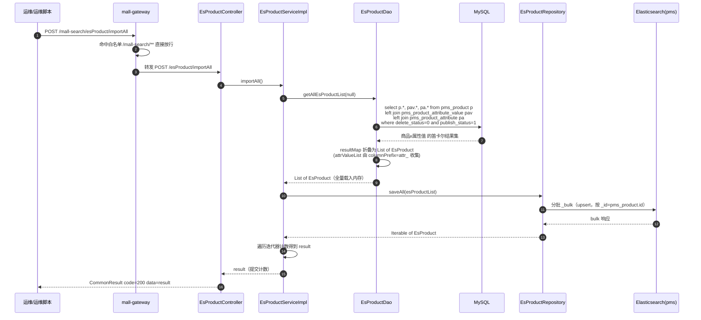
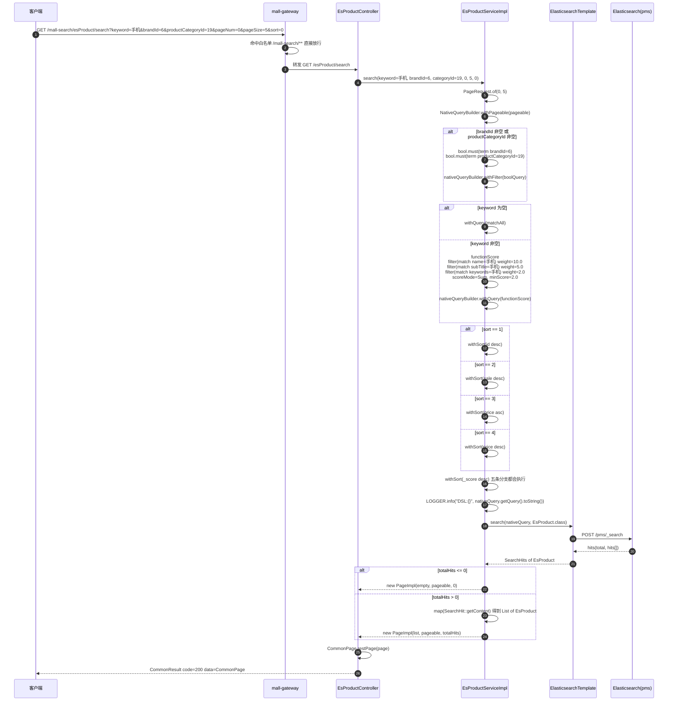
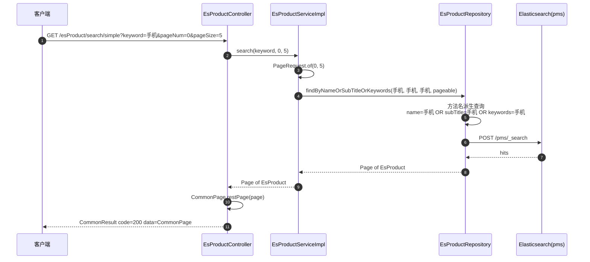
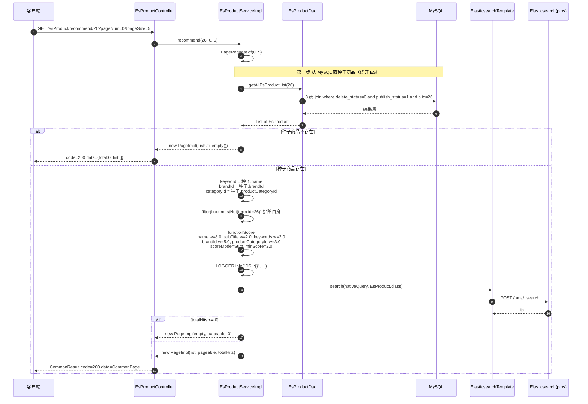
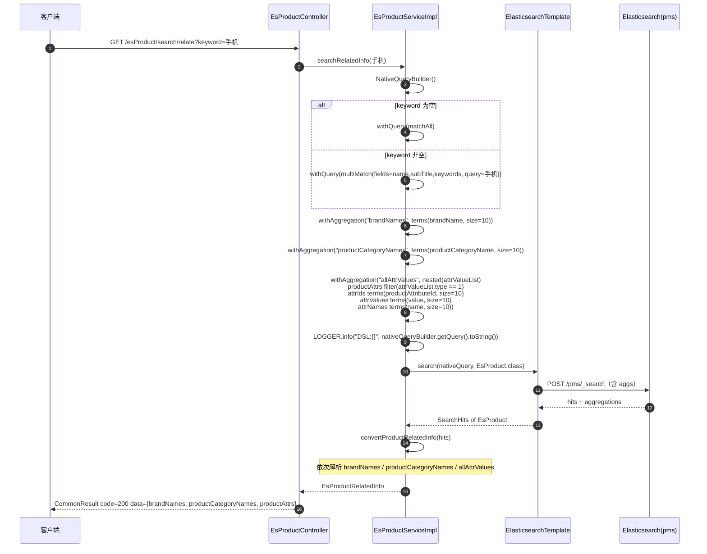
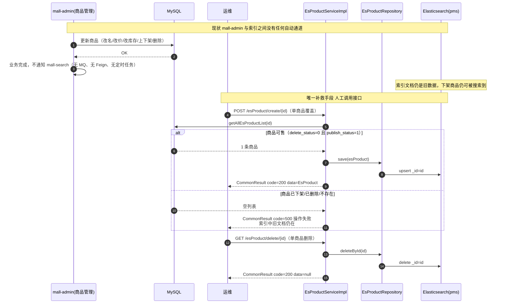

# 详细设计 · 商品搜索（Elasticsearch）

| 项目 | 内容 |
| --- | --- |
| 文档编号 | DD-SEARCH-ES-001 |
| 所属业务域 | 商品域（`pms`）——检索子域 |
| 涉及服务 | `mall-search`（:8081） |
| 涉及数据表 | `pms_product`（主源表）、`pms_product_attribute`、`pms_product_attribute_value`（关联读） |
| 涉及索引 | `pms`（ES 索引，`@Document(indexName = "pms")`） |
| 接口数量 | 8 个（`EsProductController`） |
| 网关前缀 | `/mall-search/**` |
| 文档状态 | 待评审 |

---

## 一、概述

### 1.1 范围

本文档描述「商品搜索」业务能力的详细设计，覆盖：**数据库设计**（分 MySQL 源表与 Elasticsearch 索引两小节）、**接口设计**（8 个 REST 接口）、**包设计**（含 Mapper 与 Repository 两条数据访问路径的职责边界）、**运行流程**、**日志设计**、**测试用例设计**。

不在本文档范围内：商品主数据的管理（见商品管理详细设计）、ES 集群自身的运维与容量规划、Logstash/Kibana 配置。

### 1.2 术语

| 术语 | 含义 |
| --- | --- |
| 索引（index） | ES 中一组同类文档的集合。本模块索引名为 `pms` |
| 文档（document） | ES 中的一条 JSON 记录，对应一个商品，由 `EsProduct` 承载 |
| mapping | ES 的字段类型与分词定义，等价于"表结构" |
| 分词器（analyzer） | 把文本切成词的组件。本模块字段级使用 `ik_max_word` |
| 嵌套对象（nested） | 保留数组元素内部字段关联关系的 ES 类型，`attrValueList` 使用它避免"跨元素误匹配" |
| 聚合（aggregation） | ES 的分组统计能力，用于产出筛选面板的品牌/分类/属性 |
| 函数打分（function_score） | 按字段命中给不同权重的打分方式，本模块用它实现"标题 > 副标题 > 关键字"的相关度 |
| 全量导入 | `POST /esProduct/importAll`，把 MySQL 中**上架且未删除**的商品写入索引 |
| 增量同步 | 单商品维度把 MySQL 变更推送到 ES（`POST /esProduct/create/{id}`、`GET /esProduct/delete/{id}`） |

### 1.3 接口清单总览

| # | 方法 | 路径（服务内） | 网关路径 | 说明 | 类型 |
| --- | --- | --- | --- | --- | --- |
| 1 | POST | `/esProduct/importAll` | `/mall-search/esProduct/importAll` | 导入所有数据库中商品到 ES | 运维/写 |
| 2 | GET | `/esProduct/delete/{id}` | `/mall-search/esProduct/delete/{id}` | 根据 id 删除商品 | 运维/写 |
| 3 | POST | `/esProduct/delete/batch` | `/mall-search/esProduct/delete/batch` | 根据 id 批量删除商品 | 运维/写 |
| 4 | POST | `/esProduct/create/{id}` | `/mall-search/esProduct/create/{id}` | 根据 id 创建（写入/覆盖）商品 | 运维/写 |
| 5 | GET | `/esProduct/search/simple` | `/mall-search/esProduct/search/simple` | 简单搜索 | 检索/读 |
| 6 | GET | `/esProduct/search` | `/mall-search/esProduct/search` | 综合搜索、筛选、排序 | 检索/读 |
| 7 | GET | `/esProduct/recommend/{id}` | `/mall-search/esProduct/recommend/{id}` | 根据商品 id 推荐商品 | 检索/读 |
| 8 | GET | `/esProduct/search/relate` | `/mall-search/esProduct/search/relate` | 获取搜索的相关品牌、分类及筛选属性 | 检索/读 |

> **归属说明**：8 个接口全部由 `mall-search` 的 `EsProductController` 提供，类级路径 `/esProduct`。
>
> **鉴权**：`mall-gateway/src/main/resources/application.yml` 的 `secure.ignore.urls` 白名单包含 `/mall-search/**`，因此 **8 个接口全部允许匿名访问**。这意味着接口 1–4（导入、删除、写入索引）与检索接口访问级别相同，**任何人都可以清空或篡改搜索索引**（见 2.9 ⑤）。

---

## 二、数据库设计

本模块是全项目唯一**同时连接两类存储**的服务：MySQL 仅用于读取源数据（导入/同步索引），全部检索流量走 Elasticsearch。本节分 MySQL 侧（2.1–2.5）与 Elasticsearch 侧（2.6–2.7），最后给出关系分析（2.8）与设计问题（2.9）。

### 2.1 MySQL 侧 · 表清单

| 表名 | 类型 | 说明 | 本模块操作 |
| --- | --- | --- | --- |
| `pms_product` | 主源表 | 商品信息 | **只读**（导入索引的数据来源） |
| `pms_product_attribute_value` | 关联表 | 商品属性值 | **只读**（拼装 `attrValueList`） |
| `pms_product_attribute` | 关联表 | 商品属性参数表（提供 `type`、`name`） | **只读** |
| `pms_product_category` | 关联表 | 产品分类 | **不直接读**（分类名取自 `pms_product.product_category_name` 冗余字段） |
| `pms_brand` | 关联表 | 品牌表 | **不直接读**（品牌名取自 `pms_product.brand_name` 冗余字段） |
| `pms_sku_stock` | 关联表 | sku 的库存 | **不读**（`EsProduct` 的 `stock`/`sale` 取自 `pms_product`，非 SKU 汇总） |

> **重要**：`mall-search` 对 MySQL **没有任何写操作**。`EsProductDao.xml` 中只有一条 `<select>`，不存在 `insert`/`update`/`delete`。

### 2.2 MySQL 侧 · 建表语句（现状，原文照抄）

`pms_product`（`document/sql/mall.sql` 第 1085–1129 行）：

```sql
DROP TABLE IF EXISTS `pms_product`;
CREATE TABLE `pms_product`  (
  `id` bigint(20) NOT NULL AUTO_INCREMENT,
  `brand_id` bigint(20) NULL DEFAULT NULL,
  `product_category_id` bigint(20) NULL DEFAULT NULL,
  `feight_template_id` bigint(20) NULL DEFAULT NULL,
  `product_attribute_category_id` bigint(20) NULL DEFAULT NULL,
  `name` varchar(200) CHARACTER SET utf8 COLLATE utf8_general_ci NOT NULL,
  `pic` varchar(255) CHARACTER SET utf8 COLLATE utf8_general_ci NULL DEFAULT NULL,
  `product_sn` varchar(64) CHARACTER SET utf8 COLLATE utf8_general_ci NOT NULL COMMENT '货号',
  `delete_status` int(1) NULL DEFAULT NULL COMMENT '删除状态：0->未删除；1->已删除',
  `publish_status` int(1) NULL DEFAULT NULL COMMENT '上架状态：0->下架；1->上架',
  `new_status` int(1) NULL DEFAULT NULL COMMENT '新品状态:0->不是新品；1->新品',
  `recommand_status` int(1) NULL DEFAULT NULL COMMENT '推荐状态；0->不推荐；1->推荐',
  `verify_status` int(1) NULL DEFAULT NULL COMMENT '审核状态：0->未审核；1->审核通过',
  `sort` int(11) NULL DEFAULT NULL COMMENT '排序',
  `sale` int(11) NULL DEFAULT NULL COMMENT '销量',
  `price` decimal(10, 2) NULL DEFAULT NULL,
  `promotion_price` decimal(10, 2) NULL DEFAULT NULL COMMENT '促销价格',
  `gift_growth` int(11) NULL DEFAULT 0 COMMENT '赠送的成长值',
  `gift_point` int(11) NULL DEFAULT 0 COMMENT '赠送的积分',
  `use_point_limit` int(11) NULL DEFAULT NULL COMMENT '限制使用的积分数',
  `sub_title` varchar(255) CHARACTER SET utf8 COLLATE utf8_general_ci NULL DEFAULT NULL COMMENT '副标题',
  `description` text CHARACTER SET utf8 COLLATE utf8_general_ci NULL COMMENT '商品描述',
  `original_price` decimal(10, 2) NULL DEFAULT NULL COMMENT '市场价',
  `stock` int(11) NULL DEFAULT NULL COMMENT '库存',
  `low_stock` int(11) NULL DEFAULT NULL COMMENT '库存预警值',
  `unit` varchar(16) CHARACTER SET utf8 COLLATE utf8_general_ci NULL DEFAULT NULL COMMENT '单位',
  `weight` decimal(10, 2) NULL DEFAULT NULL COMMENT '商品重量，默认为克',
  `preview_status` int(1) NULL DEFAULT NULL COMMENT '是否为预告商品：0->不是；1->是',
  `service_ids` varchar(64) CHARACTER SET utf8 COLLATE utf8_general_ci NULL DEFAULT NULL COMMENT '以逗号分割的产品服务：1->无忧退货；2->快速退款；3->免费包邮',
  `keywords` varchar(255) CHARACTER SET utf8 COLLATE utf8_general_ci NULL DEFAULT NULL,
  `note` varchar(255) CHARACTER SET utf8 COLLATE utf8_general_ci NULL DEFAULT NULL,
  `album_pics` varchar(255) CHARACTER SET utf8 COLLATE utf8_general_ci NULL DEFAULT NULL COMMENT '画册图片，连产品图片限制为5张，以逗号分割',
  `detail_title` varchar(255) CHARACTER SET utf8 COLLATE utf8_general_ci NULL DEFAULT NULL,
  `detail_desc` text CHARACTER SET utf8 COLLATE utf8_general_ci NULL,
  `detail_html` text CHARACTER SET utf8 COLLATE utf8_general_ci NULL COMMENT '产品详情网页内容',
  `detail_mobile_html` text CHARACTER SET utf8 COLLATE utf8_general_ci NULL COMMENT '移动端网页详情',
  `promotion_start_time` datetime NULL DEFAULT NULL COMMENT '促销开始时间',
  `promotion_end_time` datetime NULL DEFAULT NULL COMMENT '促销结束时间',
  `promotion_per_limit` int(11) NULL DEFAULT NULL COMMENT '活动限购数量',
  `promotion_type` int(1) NULL DEFAULT NULL COMMENT '促销类型：0->没有促销使用原价;1->使用促销价；2->使用会员价；3->使用阶梯价格；4->使用满减价格；5->限时购',
  `brand_name` varchar(255) CHARACTER SET utf8 COLLATE utf8_general_ci NULL DEFAULT NULL COMMENT '品牌名称',
  `product_category_name` varchar(255) CHARACTER SET utf8 COLLATE utf8_general_ci NULL DEFAULT NULL COMMENT '商品分类名称',
  PRIMARY KEY (`id`) USING BTREE
) ENGINE = InnoDB AUTO_INCREMENT = 46 CHARACTER SET = utf8 COLLATE = utf8_general_ci COMMENT = '商品信息' ROW_FORMAT = DYNAMIC;
```

`pms_product_attribute_value`（第 1282–1288 行）：

```sql
DROP TABLE IF EXISTS `pms_product_attribute_value`;
CREATE TABLE `pms_product_attribute_value`  (
  `id` bigint(20) NOT NULL AUTO_INCREMENT,
  `product_id` bigint(20) NULL DEFAULT NULL,
  `product_attribute_id` bigint(20) NULL DEFAULT NULL,
  `value` varchar(64) CHARACTER SET utf8 COLLATE utf8_general_ci NULL DEFAULT NULL COMMENT '手动添加规格或参数的值，参数单值，规格有多个时以逗号隔开',
  PRIMARY KEY (`id`) USING BTREE
) ENGINE = InnoDB AUTO_INCREMENT = 517 CHARACTER SET = utf8 COLLATE = utf8_general_ci COMMENT = '存储产品参数信息的表' ROW_FORMAT = DYNAMIC;
```

`pms_product_attribute`（第 1177–1191 行）：

```sql
DROP TABLE IF EXISTS `pms_product_attribute`;
CREATE TABLE `pms_product_attribute`  (
  `id` bigint(20) NOT NULL AUTO_INCREMENT,
  `product_attribute_category_id` bigint(20) NULL DEFAULT NULL,
  `name` varchar(64) CHARACTER SET utf8 COLLATE utf8_general_ci NULL DEFAULT NULL,
  `select_type` int(1) NULL DEFAULT NULL COMMENT '属性选择类型：0->唯一；1->单选；2->多选',
  `input_type` int(1) NULL DEFAULT NULL COMMENT '属性录入方式：0->手工录入；1->从列表中选取',
  `input_list` varchar(255) CHARACTER SET utf8 COLLATE utf8_general_ci NULL DEFAULT NULL COMMENT '可选值列表，以逗号隔开',
  `sort` int(11) NULL DEFAULT NULL COMMENT '排序字段：最高的可以单独上传图片',
  `filter_type` int(1) NULL DEFAULT NULL COMMENT '分类筛选样式：1->普通；1->颜色',
  `search_type` int(1) NULL DEFAULT NULL COMMENT '检索类型；0->不需要进行检索；1->关键字检索；2->范围检索',
  `related_status` int(1) NULL DEFAULT NULL COMMENT '相同属性产品是否关联；0->不关联；1->关联',
  `hand_add_status` int(1) NULL DEFAULT NULL COMMENT '是否支持手动新增；0->不支持；1->支持',
  `type` int(1) NULL DEFAULT NULL COMMENT '属性的类型；0->规格；1->参数',
  PRIMARY KEY (`id`) USING BTREE
) ENGINE = InnoDB AUTO_INCREMENT = 74 CHARACTER SET = utf8 COLLATE = utf8_general_ci COMMENT = '商品属性参数表' ROW_FORMAT = DYNAMIC;
```

### 2.3 MySQL 侧 · 检索相关字段说明

「映射到 ES」列指该源字段最终写入 `EsProduct` 的哪个属性（依据 `EsProductDao.xml` 的 select 别名与 `resultMap` 的 `autoMapping="true"`）。

| 字段 | 类型 | 允许空 | 中文名 | 检索用途 | 映射到 ES |
| --- | --- | --- | --- | --- | --- |
| `id` | bigint(20) | 否 | 主键 | 文档 `_id`；`must_not` 排除自身（推荐） | `EsProduct.id` |
| `product_sn` | varchar(64) | 否 | 货号 | 展示 | `EsProduct.productSn` |
| `brand_id` | bigint(20) | 是 | 品牌编号 | **筛选（term）** | `EsProduct.brandId` |
| `brand_name` | varchar(255) | 是 | 品牌名称 | **聚合（terms）** 产出品牌筛选项 | `EsProduct.brandName` |
| `product_category_id` | bigint(20) | 是 | 分类编号 | **筛选（term）** | `EsProduct.productCategoryId` |
| `product_category_name` | varchar(255) | 是 | 分类名称 | **聚合（terms）** 产出分类筛选项 | `EsProduct.productCategoryName` |
| `pic` | varchar(255) | 是 | 商品主图 | 展示 | `EsProduct.pic` |
| `name` | varchar(200) | 否 | 商品名称 | **全文检索（权重 10）** | `EsProduct.name` |
| `sub_title` | varchar(255) | 是 | 副标题 | **全文检索（权重 5）** | `EsProduct.subTitle` |
| `keywords` | varchar(255) | 是 | 关键字 | **全文检索（权重 2）** | `EsProduct.keywords` |
| `price` | decimal(10,2) | 是 | 价格 | **排序（3 升 / 4 降）** | `EsProduct.price` |
| `sale` | int(11) | 是 | 销量 | **排序（2 降）** | `EsProduct.sale` |
| `new_status` | int(1) | 是 | 新品状态 | 展示 | `EsProduct.newStatus` |
| `recommand_status` | int(1) | 是 | 推荐状态 | 展示 | `EsProduct.recommandStatus` |
| `stock` | int(11) | 是 | 库存 | 展示 | `EsProduct.stock` |
| `promotion_type` | int(1) | 是 | 促销类型 | 展示 | `EsProduct.promotionType` |
| `sort` | int(11) | 是 | 排序 | 展示（**ES 排序中未使用**） | `EsProduct.sort` |
| `delete_status` | int(1) | 是 | 删除状态 | **导入过滤条件**（`= 0`） | 不写入 |
| `publish_status` | int(1) | 是 | 上架状态 | **导入过滤条件**（`= 1`） | 不写入 |
| `pms_product_attribute_value.value` | varchar(64) | 是 | 属性值 | **聚合（terms）**，产出属性可选项 | `EsProductAttributeValue.value` |
| `pms_product_attribute_value.product_attribute_id` | bigint(20) | 是 | 属性编号 | **聚合（terms）** 分组键 | `EsProductAttributeValue.productAttributeId` |
| `pms_product_attribute.name` | varchar(64) | 是 | 属性名称 | **聚合（terms）** 产出筛选属性名 | `EsProductAttributeValue.name` |
| `pms_product_attribute.type` | int(1) | 是 | 属性类型 | **聚合过滤条件**（只取 `type = 1` 的"参数"） | `EsProductAttributeValue.type` |

### 2.4 MySQL 侧 · 源数据（导入）SQL

`mall-search/src/main/resources/dao/EsProductDao.xml` 是**本模块唯一的 SQL**：

```sql
select
    p.id id,
    p.product_sn productSn,
    p.brand_id brandId,
    p.brand_name brandName,
    p.product_category_id productCategoryId,
    p.product_category_name productCategoryName,
    p.pic pic,
    p.name name,
    p.sub_title subTitle,
    p.price price,
    p.sale sale,
    p.new_status newStatus,
    p.recommand_status recommandStatus,
    p.stock stock,
    p.promotion_type promotionType,
    p.keywords keywords,
    p.sort sort,
    pav.id attr_id,
    pav.value attr_value,
    pav.product_attribute_id attr_product_attribute_id,
    pa.type attr_type,
    pa.name attr_name
from pms_product p
left join pms_product_attribute_value pav on p.id = pav.product_id
left join pms_product_attribute pa on pav.product_attribute_id= pa.id
where delete_status = 0 and publish_status = 1
<if test="id!=null">
    and p.id=#{id}
</if>
```

**SQL 要点（现状）**：

1. 过滤条件固定为 `delete_status = 0 and publish_status = 1`：**只有「未删除 + 已上架」的商品才会进入 ES**。
2. 通过 `left join pms_product_attribute_value` 展开为"商品 × 属性值"的**笛卡尔结果集**，再由 MyBatis 的 `<collection columnPrefix="attr_">` 折叠为 `attrValueList`。
3. `<if test="id!=null">` 使同一条 SQL 同时承担"全量"（`importAll`）与"单条"（`create`/`recommend`）两种用途。
4. `where` 中的 `delete_status` / `publish_status` **未加表别名**。当前只有 `pms_product` 有这两列故可正常执行，但这是隐式依赖，新增同名列 join 会触发 `Column 'delete_status' in where clause is ambiguous`。

### 2.5 MySQL 侧 · 索引与约束现状

| 项目 | 现状 | 对本模块的影响 |
| --- | --- | --- |
| `pms_product` 主键 | `PRIMARY KEY (id)` USING BTREE | `where p.id=?` 走主键，单条同步快 |
| `pms_product` 二级索引 | **无** | `importAll` 的 `where delete_status=0 and publish_status=1` 为**全表扫描** |
| `pms_product_attribute_value.product_id` 索引 | **无** | join 时对属性值表全表扫描，商品量与属性值量放大后导入耗时线性恶化 |
| `pms_product_attribute_value` 唯一约束 | **无** | 同一商品同一属性可重复插值，在 `attrValueList` 中产生重复项，聚合出现重复桶 |
| 外键约束 | **无** | `product_attribute_id` 可能是孤儿值，join 后 `attr_type`/`attr_name` 为 NULL |

### 2.6 Elasticsearch 侧 · 索引与文档结构

#### 2.6.1 索引基本信息

| 项 | 值 | 来源 |
| --- | --- | --- |
| 索引名 | `pms` | `EsProduct` 上的 `@Document(indexName = "pms")` |
| 分片数 | `1` | `@Setting(shards = 1, replicas = 0)` |
| 副本数 | `0` | 同上 |
| 别名 / ILM / 自定义 analysis | **均无** | `@Setting` 只声明 shards/replicas；仓库中无别名、无 ILM、无 `analysis` 段 |
| 索引创建者 | `MallSearchApplicationTests.testEsProductMapping()` 手工调用 `indexOperations.putMapping(indexOperations.createMapping(EsProduct.class))` | 见 2.7.3 |
| 主键 | 文档 `_id` = `pms_product.id`（`@Id private Long id`） | `EsProduct.id` |

> `@Document` **未声明** `createIndex` 属性（使用默认 `true`），但 Spring Data Elasticsearch 只在 Repository 启动时的索引检查路径上自动建索引。仓库中**没有可回归的建索引脚本**（无 `index.json`、无 `curl` 脚本、无 Flyway/Liquibase），实际索引由手工/测试脚本建立（详见 2.7.3）。

#### 2.6.2 文档结构（逐字段）

数据来源：`mall-search/src/main/java/com/macro/mall/search/domain/EsProduct.java`。

| # | 字段 | Java 类型 | `@Field` 声明 | ES 类型 | 分词/索引行为 |
| --- | --- | --- | --- | --- | --- |
| 1 | `id` | `Long` | `@Id` | `long`（`_id`） | 文档主键，`term` 精确匹配 |
| 2 | `productSn` | `String` | `@Field(type = FieldType.Keyword)` | `keyword` | **不分词** |
| 3 | `brandId` | `Long` | 无注解 | `long`（按 Java 类型推导） | `term` 筛选与 `match` 打分均可用 |
| 4 | `brandName` | `String` | `@Field(type = FieldType.Keyword)` | `keyword` | **不分词**，聚合桶 key 即原始品牌名 |
| 5 | `productCategoryId` | `Long` | 无注解 | `long` | 同 `brandId` |
| 6 | `productCategoryName` | `String` | `@Field(type = FieldType.Keyword)` | `keyword` | **不分词**，聚合桶 key |
| 7 | `pic` | `String` | 无注解 | Spring Data ES 对 String 的默认映射 | 未被检索使用 |
| 8 | `name` | `String` | `@Field(analyzer = "ik_max_word", type = FieldType.Text)` | `text` | **`ik_max_word` 细粒度中文分词**，检索主字段 |
| 9 | `subTitle` | `String` | `@Field(analyzer = "ik_max_word", type = FieldType.Text)` | `text` | 同上 |
| 10 | `keywords` | `String` | `@Field(analyzer = "ik_max_word", type = FieldType.Text)` | `text` | 同上 |
| 11 | `price` | `BigDecimal` | 无注解 | 数值（按映射推导） | 排序字段（`sort=3/4`） |
| 12 | `sale` | `Integer` | 无注解 | `integer` | 排序字段（`sort=2`） |
| 13 | `newStatus` | `Integer` | 无注解 | `integer` | 未被检索使用 |
| 14 | `recommandStatus` | `Integer` | 无注解 | `integer` | 未被检索使用 |
| 15 | `stock` | `Integer` | 无注解 | `integer` | 未被检索使用 |
| 16 | `promotionType` | `Integer` | 无注解 | `integer` | 未被检索使用 |
| 17 | `sort` | `Integer` | 无注解 | `integer` | **未被检索使用**（ES 侧排序不含它） |
| 18 | `attrValueList` | `List<EsProductAttributeValue>` | `@Field(type = FieldType.Nested)` | `nested` | **嵌套文档**，供属性筛选面板聚合 |

**字段级设计说明**：

- **只有 3 个字段（`name` / `subTitle` / `keywords`）参与全文检索**，其余字段要么是筛选/聚合用的 `keyword`，要么是排序/展示用的数值。
- `@Field(analyzer = "ik_max_word")` 只指定了**写入分词器**，未指定 `searchAnalyzer`；未显式指定时检索分析器回落到同一 `analyzer`。`ik_max_word` 是细粒度切分（"小米手机" → 小米/手机/小/米/手/机…），**召回率高但精确度较低**，索引体积更大；常见做法是写入 `ik_max_word`、检索 `ik_smart`。
- **`ik_max_word` 不是 ES 内置分词器**，需集群安装 `analysis-ik` 插件。仓库通过 `document/docker/docker-compose-env.yml` 的 `/mydata/elasticsearch/plugins:/usr/share/elasticsearch/plugins` 挂载提供，**插件本身不在仓库内**。
- **无同义词（synonym）配置**：`@Setting` 中无 `analysis` 段，全仓库也搜不到 synonym 相关配置。"手机"/"移动电话"类同义词检索**当前不支持**。
- **无 `normalizer` 配置**：`keyword` 字段区分大小写，聚合时 `"NIKE"` 与 `"nike"` 会成为两个桶。

#### 2.6.3 嵌套对象 `EsProductAttributeValue`

数据来源：`mall-search/src/main/java/com/macro/mall/search/domain/EsProductAttributeValue.java`。

| 字段 | Java 类型 | `@Field` 声明 | ES 类型 | 说明 |
| --- | --- | --- | --- | --- |
| `id` | `Long` | 无 | `long` | 属性值记录主键（`pms_product_attribute_value.id`） |
| `productAttributeId` | `Long` | 无 | `long` | 属性编号，聚合分组键 |
| `value` | `String` | `@Field(type = FieldType.Keyword)` | `keyword` | 属性值，聚合桶 key |
| `type` | `Integer` | 无 | `integer` | 属性类型：`0`->规格；`1`->参数 |
| `name` | `String` | `@Field(type = FieldType.Keyword)` | `keyword` | 属性名称，聚合桶 key |

**为什么必须是 `nested`**：一个商品的 `attrValueList` 是数组，例如 `[{name:"颜色", value:"黑色"}, {name:"尺寸", value:"38"}]`。若按普通 `object` 存储，ES 会把字段摊平为 `attrValueList.name = ["颜色","尺寸"]`、`attrValueList.value = ["黑色","38"]`，此时查询 `name=颜色 AND value=38` 会**跨元素误配**。`nested` 把每个数组元素作为独立隐藏文档，保证"属性名-属性值"的对应关系，聚合才能得到正确的"颜色→黑色/红色"结构。

> `EsProductAttributeValue.serialVersionUID = 1L`，而 `EsProduct` 上是 `-1L`，两者不一致（无功能影响，仅为一致性瑕疵）。

#### 2.6.4 聚合结果结构 `EsProductRelatedInfo`

`EsProductRelatedInfo` **不是 ES 文档**，而是把 ES 聚合响应转换后的**服务端返回对象**（`searchRelatedInfo` 的返回值），无任何 `@Field`/`@Document` 注解。

| 字段 | 类型 | 来源（ES 聚合） | 说明 |
| --- | --- | --- | --- |
| `brandNames` | `List<String>` | `terms` on `brandName`，`size(10)` | 命中商品的品牌名，最多 10 个 |
| `productCategoryNames` | `List<String>` | `terms` on `productCategoryName`，`size(10)` | 命中商品的分类名，最多 10 个 |
| `productAttrs` | `List<ProductAttr>` | `nested(attrValueList)` → `filter(attrValueList.type == "1")` → `terms(attrValueList.productAttributeId, size 10)` 带子聚合 | 属性筛选面板 |
| `productAttrs[].attrId` | `Long` | `attrIds` 桶的 `key` | 属性编号 |
| `productAttrs[].attrName` | `String` | `attrNames` 子聚合的**第一个桶** key | **只取 `buckets.get(0)`**，同一 `attrId` 对应多个 `name` 时静默丢失 |
| `productAttrs[].attrValues` | `List<String>` | `attrValues` 子聚合（`terms` on `attrValueList.value`，`size 10`） | 该属性下的可选值，最多 10 个 |

对应的聚合 DSL（聚合名分别为 `brandNames`、`productCategoryNames`、`allAttrValues`、`productAttrs`）：

```json
{
  "aggs": {
    "brandNames": { "terms": { "field": "brandName", "size": 10 } },
    "productCategoryNames": { "terms": { "field": "productCategoryName", "size": 10 } },
    "allAttrValues": {
      "nested": { "path": "attrValueList" },
      "aggs": {
        "productAttrs": {
          "filter": { "term": { "attrValueList.type": "1" } },
          "aggs": {
            "attrIds": {
              "terms": { "field": "attrValueList.productAttributeId", "size": 10 },
              "aggs": {
                "attrValues": { "terms": { "field": "attrValueList.value", "size": 10 } },
                "attrNames":  { "terms": { "field": "attrValueList.name",  "size": 10 } }
              }
            }
          }
        }
      }
    }
  }
}
```

> `filter` 中的 `"value": "1"` 是**字符串字面量**，而 `attrValueList.type` 在 mapping 中是 `integer`。ES 的 term 查询对数值字段可接受字符串形式（做强制转换），当前可正常工作，但属隐式类型转换，建议改为数值 `1`。

#### 2.6.5 分词器与 mapping 设计小结

| 设计点 | 现状 | 评价 |
| --- | --- | --- |
| 中文分词 | `ik_max_word`（写入与检索同一分词器） | 可召回，但精确度与索引成本不优 |
| 精确匹配/聚合字段 | 全部显式 `FieldType.Keyword` | 合理，避免聚合被分词打散 |
| 属性关联 | `nested` | 正确，避免跨元素误配 |
| 同义词 / 拼音 | **均无** | 缺失 |
| 字段权重 | 靠 `function_score` 的 `weight`（10/5/2）实现 | 可行，但**不能用 `minScore` 做相关度阈值**（见 3.2 备注） |
| 副本数 | `0` | 单点故障，索引不可用即搜索不可用 |
| 分片数 | `1` | 单机可接受；数据量增长后需重建索引调整 |

### 2.7 索引的建立与同步策略

#### 2.7.1 数据流向

```text
                  ┌──────────────────────────────────────────────┐
                  │            MySQL（唯一事实来源）               │
                  │ pms_product / pms_product_attribute(_value)   │
                  └────────────────────┬─────────────────────────┘
                                       │ EsProductDao.xml
                                       │ select ... where delete_status=0 and publish_status=1
                                       ▼
                  ┌──────────────────────────────────────────────┐
                  │   EsProductServiceImpl（组装 EsProduct）      │
                  └────────────────────┬─────────────────────────┘
                                       │ EsProductRepository.saveAll / save / deleteAll
                                       ▼
                  ┌──────────────────────────────────────────────┐
                  │           Elasticsearch 索引 pms              │
                  │  （全部检索流量只读此索引；仅 recommend 回查 MySQL）│
                  └──────────────────────────────────────────────┘
```

**检索路径基本不回查 MySQL**：`search`、`searchRelatedInfo` 全部走 ES；`recommend` 会先调 `EsProductDao.getAllEsProductList(id)` 拿"当前商品"的标题/品牌/分类。这与需求 NFR-PERF-01「商品搜索走 Elasticsearch，不直接查 MySQL」**存在偏差**，见 2.9 ⑦。

#### 2.7.2 同步触发方式（现状：全部手动）

| 触发方式 | 接口/机制 | 现状 |
| --- | --- | --- |
| 全量导入 | `POST /esProduct/importAll` | **手工 HTTP 调用** |
| 单商品写入 | `POST /esProduct/create/{id}` | **手工 HTTP 调用** |
| 单商品删除 | `GET /esProduct/delete/{id}` | **手工 HTTP 调用** |
| 批量删除 | `POST /esProduct/delete/batch` | **手工 HTTP 调用** |
| 商品新增/上架/更新/下架时自动同步 | 无 | **不存在**。`mall-admin` 全模块检索不到任何 `EsProduct`/搜索相关调用 |
| 定时全量重建 | 无 | **不存在**（`mall-search` 无 `@Scheduled`） |
| 消息驱动同步 | 无 | **不存在**（`mall-search/pom.xml` 未引入 RabbitMQ / Spring Cloud Stream） |
| 定时增量（binlog/CDC） | 无 | **不存在**（未引入 Canal/Debezium） |

> **结论**：索引与 MySQL 的一致性**完全依赖人工在正确时机手动调用接口**。商品在 `mall-admin` 改价、改库存、改名、上下架后，搜索页展示的是**旧数据**，且没有任何补偿机制。这是本模块最严重的设计缺陷（见 2.9 ①）。

#### 2.7.3 索引建立与全量导入的执行细节（现状）

1. **索引建立**：仓库中**没有**自动建索引的配置。唯一的建 mapping 代码在测试类 `MallSearchApplicationTests.testEsProductMapping()`：

```java
IndexOperations indexOperations = elasticsearchTemplate.indexOps(EsProduct.class);
indexOperations.putMapping(indexOperations.createMapping(EsProduct.class));
Map mapping = indexOperations.getMapping();
System.out.println(mapping);
```

   该测试只 `putMapping`，**不判断索引是否存在、不做幂等保护**，且被父 POM 的 `<skipTests>true</skipTests>` 默认跳过。

2. **全量导入**：`EsProductServiceImpl.importAll()`

```java
List<EsProduct> esProductList = productDao.getAllEsProductList(null);
Iterable<EsProduct> esProductIterable = productRepository.saveAll(esProductList);
Iterator<EsProduct> iterator = esProductIterable.iterator();
int result = 0;
while (iterator.hasNext()) { result++; iterator.next(); }
return result;
```

   - **一次性把全部商品读入 JVM 内存**（`List<EsProduct>`），无分页、无流式、无批量大小控制；
   - `saveAll` 由框架内部按 bulk 提交，分片/副本为 0，大量写入时刷新压力集中在单分片；
   - 返回值 `result` 是**遍历 `saveAll` 返回迭代器**得到的计数，等于"提交给 ES 的文档数"，**不等于 ES 实际成功写入数**（bulk 局部失败不会抛错也不计入差异）；
   - **没有删除动作**：`saveAll` 只做 upsert。MySQL 中已下架（`publish_status=0`）或已删除（`delete_status=1`）的商品，其索引文档**仍保留在 ES 中**，搜索仍能命中——**与 2.7.1 的过滤条件直接冲突**（见 2.9 ②）。

3. **单商品写入**：`create(id)` 先查 MySQL，`esProductList.size() > 0` 才 `save`，否则返回 `null`；控制器据此返回 `CommonResult.failed()`。

4. **单商品删除**：`delete(Long id)` 直接 `productRepository.deleteById(id)`，**不校验 MySQL，也不校验 ES 中是否存在**。

5. **批量删除**：`delete(List<Long> ids)` 构造一批只有 `id` 的"空壳" `EsProduct`，再 `productRepository.deleteAll(esProductList)`。因为 `EsProduct` 只有 `id` 带 `@Id`，Spring Data ES 按 `_id` 删除。**传入不存在的 id 不会报错**。

#### 2.7.4 与商品上下架/删除的同步缺口

`EsProductDao.xml` 的过滤条件说明设计意图是"**索引里只保留可售商品**"。但实现上：

| MySQL 变更 | 是否触发同步 | 索引最终状态 | 是否符合设计意图 |
| --- | --- | --- | --- |
| 新增商品并上架 | 否 | 无该文档（直到手工 `create` 或 `importAll`） | ✗ 漏（少卖） |
| 商品改名/改价/改库存 | 否 | 旧值 | ✗ 脏读 |
| 商品下架（`publish_status=0`） | 否 | **文档仍在**，仍可被搜到 | ✗ **严重** |
| 商品逻辑删除（`delete_status=1`） | 否 | **文档仍在** | ✗ 同上 |
| 手工调用 `importAll` | 是 | **被下架/删除的文档不会被清除**（无 delete 阶段） | ✗ 无法自愈 |
| 手工调用 `delete/{id}` | 是 | 文档被删除 | ✓ |

> 即使运维每天手工全量跑一次 `importAll`，**下架商品依旧无法从索引中清除**。要真正修复，必须采用"写入新索引 + 别名切换"或"导入后按 MySQL 现存 id 差集删除"的策略（见 2.9 ②⑧）。

### 2.8 关系与冗余分析

```
MySQL（事实来源，写）                         Elasticsearch（读优化，只读）
─────────────────────────                     ─────────────────────────────
pms_product.id ────────────────────────────►  pms._id / EsProduct.id
pms_product.name / sub_title / keywords ───►  EsProduct.name / subTitle / keywords  （全文检索副本）
pms_product.brand_id ──────────────────────►  EsProduct.brandId        （筛选维度）
pms_product.brand_name ────────────────────►  EsProduct.brandName      （聚合维度，冗余快照）
pms_product.product_category_id ───────────►  EsProduct.productCategoryId（筛选维度）
pms_product.product_category_name ─────────►  EsProduct.productCategoryName（聚合维度，冗余快照）
pms_product.price / sale ──────────────────►  EsProduct.price / sale   （排序维度）
pms_product_attribute_value ───┐
pms_product_attribute ─────────┴──────────►  EsProduct.attrValueList[]（nested，聚合维度）
```

**关键设计点：ES 文档 `pms` 是 MySQL 多表数据的宽表冗余，属于刻意的读优化。**

- **动机**：搜索页需在同一请求内完成"关键字打分 + 品牌筛选 + 分类筛选 + 属性聚合"并展示商品图/标题/副标题/价格/销量/品牌名/分类名。若走 MySQL，需要 3 表 join + `like '%kw%'`（**无法命中索引**）+ 分组统计，且品牌/分类名还要 join `pms_brand`/`pms_product_category`。把这些字段冗余进 ES 文档后，检索与聚合变成单索引操作。
- **冗余来源**：`brandName` 与 `productCategoryName` 的冗余**不在本模块**，而在上游——`pms_product.brand_name` / `pms_product.product_category_name` 由商品模块写入（品牌改名时 `PmsBrandServiceImpl.updateBrand` 会同步 `pms_product.brand_name`，详见《详细设计-品牌管理》2.5）。本模块只是把上游的冗余字段**再复制一份到 ES**。
- **代价（三级冗余的一致性链条）**：

```
pms_brand.name
   │ ① 品牌改名（mall-admin，可能存在事务缺口）
   ▼
pms_product.brand_name          ← 第 1 级冗余（MySQL 内）
   │ ② 手工调用 /esProduct/create/{id} 或 /importAll
   ▼
EsProduct.brandName             ← 第 2 级冗余（MySQL → ES）
   │ ③ 聚合 terms on brandName
   ▼
搜索页品牌筛选面板
```

  ① 已有事务缺口（见品牌管理详细设计），② 完全没有自动化，③ 依赖 ② 的结果。因此"改一次品牌名 → 搜索页品牌筛选项仍显示旧名"是**几乎必然发生**的，而非偶发。
- **不做冗余的字段**：`pms_sku_stock` 的 SKU 级价格/库存未进入 ES，`EsProduct.price`/`stock` 是 `pms_product` 的主价格与总库存——即**搜索页展示的是 SPU 维度价格，不保证等于最低 SKU 价**。

### 2.9 设计问题与建议

| # | 问题 | 影响 | 建议 |
| --- | --- | --- | --- |
| ① | **索引同步无任何自动化机制**：`mall-admin` 的商品增删改上下架均不通知 `mall-search`，只能人工调接口 | 搜索页数据长期陈旧；改价/改库存/改名/下架全部不生效；漏卖与错卖 | 引入消息驱动同步（商品写操作后发 MQ 事件，`mall-search` 消费并调 `create`/`delete`）；或由 `mall-admin` 经 OpenFeign 直调（`mall-demo` 已有 `FeignSearchService` 先例）；保留 `importAll` 作为兜底 |
| ② | **`importAll` 只 upsert 不 delete**，下架/删除的商品文档永久残留 | 下架商品仍可被搜索、被加购下单；索引永久漂移，**手工全量导入也无法自愈** | `importAll` 增加清理阶段：导入后按"MySQL 现存可售 id 集合"与"ES 全部 id 集合"求差集并批量删除；更优做法是写入新索引后原子切换别名 |
| ③ | **无全量重建的幂等与原子性保障**：直接往线上索引 `saveAll`，中途失败会留下半新半旧的索引 | 全量导入失败后索引不可信，且无法判断哪些未写入（返回值只是提交计数） | 使用"索引别名 + 重建"：`pms` 作为读写别名，全量写入 `pms_<date>`，完成后原子切换；失败则回滚别名 |
| ④ | **`management.health.elasticsearch.enabled: false`**（`application.yml` 第 39–41 行）显式关闭 ES 健康检查 | Spring Boot Admin / `/actuator/health` **不暴露 ES 状态**，ES 挂掉时服务仍显示 `UP`，故障发现依赖用户报障 | 移除该开关；若担心超时误报，按 `config/search/mall-search-prod.yaml` 已有的 `management.health.elasticsearch.response-timeout: 1000ms` 调超时而非关闭 |
| ⑤ | **索引写入接口与检索接口同为匿名白名单**：`/mall-search/**` 在网关白名单内 | 任何人可调 `POST /esProduct/importAll`（打爆 ES）、`POST /esProduct/delete/batch`（清空索引）、`POST /esProduct/create/{id}` | 把 `/esProduct/importAll`、`/esProduct/delete/**`、`/esProduct/create/**` 移出白名单，改为需登录 + 权限码，或仅允许内网/服务间调用 |
| ⑥ | **ES 客户端日志未做级别控制**：`logback-spring.xml` 只压制了 `org.springframework`、`springfox`、`io.swagger` 等，**没有针对 `co.elastic.clients`、`org.elasticsearch`、`tracer` 的 logger**，root 为 `DEBUG` | 每次 ES 调用都输出传输层/请求层 DEBUG 日志，高频搜索下磁盘与 Logstash 压力显著 | 在 `logback-spring.xml` 增加 `<logger name="co.elastic.clients" level="INFO"/>`、`<logger name="org.elasticsearch" level="WARN"/>`、`<logger name="tracer" level="INFO"/>`，并同步到 Nacos 配置 |
| ⑦ | **检索路径仍依赖 MySQL**：`recommend` 每次先查 `pms_product`（3 表 join）再查 ES | 与 NFR-PERF-01「不直接查 MySQL」冲突；MySQL 抖动会导致推荐位整体不可用；一次请求两次数据源往返 | 推荐所需的种子商品信息改为从 ES 自取（`findById`） |
| ⑧ | **无降级与熔断**：ES 不可用时 8 个接口全部直接抛异常 | 搜索/推荐/筛选面板全部 500，前台搜索页白屏 | 引入 Resilience4j/Sentinel 熔断，降级为 MySQL 按分类/品牌分页兜底，或返回空结果 + 前端友好提示 |
| ⑨ | **`attrValueList.type` 过滤用字符串 `"1"`**，与 mapping 的 `integer` 不匹配 | 依赖 ES 隐式类型转换；ES 大版本升级或严格类型校验下会失效 | 改为数值 `1`；或把 `type` 显式声明为 `FieldType.Integer` |
| ⑩ | **`productAttrs[].attrName` 只取第一个桶**（`attrNames.get(0).key()`） | 同一 `attrId` 关联多个 `name`（脏数据）时静默丢失属性名 | 校验"一 attributeId 一 name"的数据约束；或在聚合层用 `top_hits` 取代表值 |
| ⑪ | **`pms_product_attribute_value.product_id` 无索引、无唯一约束** | 导入 SQL 的 join 全表扫描；重复属性值导致聚合出现重复桶 | 增加 `idx_product_id (product_id)`；对 `(product_id, product_attribute_id)` 视业务决定是否唯一 |
| ⑫ | **`pms` 索引副本数为 0** | 承载单节点；节点故障索引不可用，也无副本可提升 | 生产建议 `replicas >= 1`（需集群多节点） |
| ⑬ | **`ik_max_word` 写读同一分词器；无同义词/拼音/停用词配置** | 召回率高但精确度低；"手机"搜不到"移动电话" | 写入 `ik_max_word` + 检索 `ik_smart`；按需增加 `synonym`/`pinyin` filter 与停用词表 |
| ⑭ | **`importAll` 全量载入内存 + 无分批** | 商品量到十万级时 OOM 风险；导入期间索引性能下降 | 改为按 id 游标分页读取（`WHERE id > ? ORDER BY id LIMIT ?`）+ 固定大小批量 bulk |
| ⑮ | **索引 mapping 无版本化脚本**：建索引逻辑只存在于一个被 `skipTests=true` 跳过的测试方法中 | 新环境无法可靠重建索引；mapping 变更无审计 | 把建索引逻辑抽为 `ApplicationRunner` 启动检查，或将 `pms-index.json` 纳入版本控制并提供幂等初始化脚本 |
| ⑯ | **`EsProduct.sort` 被同步但检索完全不用**；`pms_product.sort` 的运营排序语义丢失 | 商品模块的运营排序在搜索页不生效，两处排序口径不一致 | 明确搜索页排序口径；如需运营排序，追加 `sort desc` 作为相关度之后的次级排序 |
| ⑰ | **综合搜索排序把 `_score desc` 追加在所有排序之后** | `sort=1` 时排序表达式为 `id desc, _score desc`；因 `id` 唯一，`_score` 永不参与，等价纯 `id desc`。同时显式 `_score` 排序会带来额外打分开销 | 仅当 `sort==0` 时才添加 `_score` 排序 |

---

## 三、接口设计

### 3.1 通用约定

**统一响应结构**（`com.macro.mall.common.api.CommonResult`）：

```json
{
  "code": 200,
  "message": "操作成功",
  "data": {}
}
```

**业务码定义**（`ResultCode`）：

| code | 常量 | 含义 |
| --- | --- | --- |
| 200 | `SUCCESS` | 操作成功 |
| 401 | `UNAUTHORIZED` | 暂未登录或 token 已经过期 |
| 403 | `FORBIDDEN` | 没有相关权限 |
| 404 | `VALIDATE_FAILED` | 参数检验失败 |
| 500 | `FAILED` | 操作失败 |

> **注意**：业务码定义在 **HTTP 响应体内部**，HTTP 状态码通常仍为 200。`VALIDATE_FAILED` 使用 404 表示参数校验失败，与 HTTP 语义不一致，前端需按 `code` 而非 HTTP 状态码判断。

**统一分页结构**（`CommonPage`，由 `CommonPage.restPage(Page<T>)` 从 Spring Data 的 `Page` 转换）：

| 名称 | 类型 | 取值来源 | 说明 |
| --- | --- | --- | --- |
| pageNum | integer | `Page.getNumber()` | 当前页码，**从 0 开始计数** |
| pageSize | integer | `Page.getSize()` | 每页条数 |
| totalPage | integer | `Page.getTotalPages()` | 总页数 |
| total | integer(int64) | `Page.getTotalElements()` | 总记录数 |
| list | array | `Page.getContent()` | 数据列表 |

> **分页口径提醒**：本模块 `pageNum` 传入 `PageRequest.of(pageNum, pageSize)`，是 **0 基**；而 `mall-admin`/`mall-portal` 走 PageHelper，是 **1 基**。前端不得复用同一分页组件参数。`pageNum=0` 即第一页。

**鉴权**：请求头 `Authorization: Bearer <token>`（`sa-token.token-name = Authorization`、`token-prefix = Bearer`）。但 `/mall-search/**` 命中网关白名单 `secure.ignore.urls`，**8 个接口均允许匿名访问**，携带 Token 也不会被解析。

**网关路由**：`- id: mall-search, uri: lb://mall-search, predicates: Path=/mall-search/**, filters: StripPrefix=1`。即 `/mall-search/esProduct/search` → 服务内 `/esProduct/search`。

### 3.2 接口详细设计

<a id="opIdimportAllList"></a>

## POST 导入所有数据库中商品到ES

POST /esProduct/importAll

把 MySQL 中所有「未删除 + 已上架」的商品全量写入 ES 索引 `pms`。**同步阻塞执行**，商品量大时响应耗时会很长。

**数据来源**：`EsProductDao.getAllEsProductList(null)`（见 2.4）。
**写入方式**：`EsProductRepository.saveAll(EsProduct)`，**只做 upsert，不做删除**（见 2.9 ②）。

### 请求参数

无

> 返回示例

> 200 Response

```json
{
  "code": 200,
  "message": "操作成功",
  "data": 45
}
```

### 返回结果

| 状态码 | 状态码含义 | 说明 | 数据模型 |
| --- | --- | --- | --- |
| 200 | [OK](https://tools.ietf.org/html/rfc7231#section-6.3.1) | 操作成功 | Inline |

### 返回数据结构

状态码 **200**

| 名称 | 类型 | 必选 | 约束 | 中文名 | 说明 |
| --- | --- | --- | --- | --- | --- |
| code | integer(int64) | true | none | 业务码 | 200 表示成功 |
| message | string | true | none | 提示信息 | none |
| data | integer(int32) | false | none | 导入条数 | 遍历 `saveAll` 返回迭代器得到的**提交计数**，非 ES 实际成功写入数 |

> **设计备注**：接口无参数、无分页、无幂等键，且在匿名白名单内。重复调用会反复全量 upsert，对 ES 造成无谓写压力。建议：① 移出白名单；② 增加增量参数或改为异步任务 + 任务 id 查询进度。

---

<a id="opIddeleteEsProduct"></a>

## GET 根据id删除商品

GET /esProduct/delete/{id}

从 ES 索引中删除指定商品文档。**不校验 MySQL 中该商品是否存在。**

### 请求参数

| 名称 | 位置 | 类型 | 必选 | 说明 |
| --- | --- | --- | --- | --- |
| id | path | integer(int64) | 是 | 商品编号（对应 ES 文档 `_id`） |

> 返回示例

> 200 Response

```json
{
  "code": 200,
  "message": "操作成功",
  "data": null
}
```

### 返回结果

| 状态码 | 状态码含义 | 说明 | 数据模型 |
| --- | --- | --- | --- |
| 200 | [OK](https://tools.ietf.org/html/rfc7231#section-6.3.1) | 操作成功 | Inline |

### 返回数据结构

状态码 **200**

| 名称 | 类型 | 必选 | 约束 | 中文名 | 说明 |
| --- | --- | --- | --- | --- | --- |
| code | integer(int64) | true | none | 业务码 | 恒为 200，即使文档不存在 |
| message | string | true | none | 提示信息 | none |
| data | string | false | none | 数据 | **恒为 null**（`CommonResult.success(null)`） |

> **设计备注**：删除为状态变更操作却使用 GET 方法，违反 HTTP 幂等语义（可被浏览器预取、爬虫触发）。且在匿名白名单内，外部可直接删除索引文档。建议改为 `DELETE /esProduct/{id}` 并移出白名单。

---

<a id="opIddeleteBatchEsProduct"></a>

## POST 根据id批量删除商品

POST /esProduct/delete/batch

批量从 ES 索引中删除文档。实现为构造一批仅含 `id` 的 `EsProduct` 后 `deleteAll`，因此**传入不存在的 id 不会报错**。

### 请求参数

| 名称 | 位置 | 类型 | 必选 | 说明 |
| --- | --- | --- | --- | --- |
| ids | query | array[integer] | 是 | 商品编号列表，重复参数传递（`?ids=1&ids=2`） |

> 返回示例

> 200 Response

```json
{
  "code": 200,
  "message": "操作成功",
  "data": null
}
```

### 返回结果

| 状态码 | 状态码含义 | 说明 | 数据模型 |
| --- | --- | --- | --- |
| 200 | [OK](https://tools.ietf.org/html/rfc7231#section-6.3.1) | 操作成功 | Inline |

### 返回数据结构

状态码 **200**

| 名称 | 类型 | 必选 | 约束 | 中文名 | 说明 |
| --- | --- | --- | --- | --- | --- |
| code | integer(int64) | true | none | 业务码 | 恒为 200 |
| message | string | true | none | 提示信息 | none |
| data | string | false | none | 数据 | **恒为 null** |

> **设计备注**：`ids` 为 `@RequestParam("ids") List<Long>` 且无 `required=false`，缺参时 Spring 抛 `MissingServletRequestParameterException`，**返回 Spring 默认错误 JSON 而非 `CommonResult` 结构**。`ids` 为空列表时 `CollectionUtils.isEmpty` 命中，接口仍返回 200 + `data: null`。

---

<a id="opIdcreateEsProduct"></a>

## POST 根据id创建商品

POST /esProduct/create/{id}

按 id 从 MySQL 读取单个商品并写入（覆盖）ES 索引。

**特殊行为**：若 MySQL 中不存在该商品，或该商品**未上架/已删除**（被 `EsProductDao.xml` 的过滤条件筛掉），接口返回 `code: 500 操作失败`。

### 请求参数

| 名称 | 位置 | 类型 | 必选 | 说明 |
| --- | --- | --- | --- | --- |
| id | path | integer(int64) | 是 | 商品编号 |

> 返回示例

> 200 Response

```json
{
  "code": 200,
  "message": "操作成功",
  "data": {
    "id": 26,
    "productSn": "6946605",
    "brandId": 3,
    "brandName": "华为",
    "productCategoryId": 19,
    "productCategoryName": "手机通讯",
    "pic": "http://macro-oss.oss-cn-shenzhen.aliyuncs.com/mall/images/20180607/5ac1bf58Ndefaac16.jpg",
    "name": "华为 HUAWEI P20 ",
    "subTitle": "AI智慧全面屏 6GB +64GB 亮黑色 全网通版 移动联通电信4G手机 双卡双待手机 双卡双待",
    "keywords": "",
    "price": 3788.00,
    "sale": 100,
    "newStatus": 1,
    "recommandStatus": 1,
    "stock": 1000,
    "promotionType": 1,
    "sort": 100,
    "attrValueList": [
      {
        "id": 200,
        "productAttributeId": 46,
        "value": "4G",
        "type": 1,
        "name": "网络"
      }
    ]
  }
}
```

### 返回结果

| 状态码 | 状态码含义 | 说明 | 数据模型 |
| --- | --- | --- | --- |
| 200 | [OK](https://tools.ietf.org/html/rfc7231#section-6.3.1) | 操作成功 | [CommonResultEsProduct](#schemacommonresultesproduct) |

### 返回数据结构

状态码 **200**

| 名称 | 类型 | 必选 | 约束 | 中文名 | 说明 |
| --- | --- | --- | --- | --- | --- |
| code | integer(int64) | true | none | 业务码 | 200 成功；500 失败 |
| message | string | true | none | 提示信息 | none |
| data | [EsProduct](#schemaesproduct) | false | none | 商品文档 | 失败时为 null |
| » id | integer(int64) | false | none | 商品编号 | 文档 `_id` |
| » productSn | string | false | none | 货号 | none |
| » brandId | integer(int64) | false | none | 品牌编号 | none |
| » brandName | string | false | none | 品牌名称 | keyword，聚合维度 |
| » productCategoryId | integer(int64) | false | none | 商品分类编号 | none |
| » productCategoryName | string | false | none | 商品分类名称 | keyword，聚合维度 |
| » pic | string | false | none | 商品主图 | none |
| » name | string | false | none | 商品名称 | `ik_max_word` 全文检索 |
| » subTitle | string | false | none | 副标题 | `ik_max_word` 全文检索 |
| » keywords | string | false | none | 关键字 | `ik_max_word` 全文检索 |
| » price | number | false | none | 价格 | 排序字段 |
| » sale | integer(int32) | false | none | 销量 | 排序字段 |
| » newStatus | integer(int32) | false | none | 新品状态 | none |
| » recommandStatus | integer(int32) | false | none | 推荐状态 | 注意拼写为 `recommand`（与数据库列名一致） |
| » stock | integer(int32) | false | none | 库存 | none |
| » promotionType | integer(int32) | false | none | 促销类型 | none |
| » sort | integer(int32) | false | none | 排序 | 已同步但检索未使用 |
| » attrValueList | [[EsProductAttributeValue](#schemaesproductattributevalue)] | false | none | 属性值列表 | nested 类型 |

> **语义问题**：`code: 500` 同时代表"商品不存在"、"商品未上架"和"ES 写入失败"三种完全不同的情况，调用方无法区分。建议区分返回码（如商品不存在返回 `data: null` + 200，或引入专门的业务码）。

---

<a id="opIdsearchSimple"></a>

## GET 简单搜索

GET /esProduct/search/simple

按关键字在**商品名称 / 副标题 / 关键字**三个字段上做全文检索（三字段**等权**，无函数打分），结果按 ES 默认相关度 `_score` 降序。

**实现路径**：`EsProductRepository.findByNameOrSubTitleOrKeywords(keyword, keyword, keyword, pageable)`——Spring Data ES 方法名派生查询，未指定排序，使用默认 `_score`。

### 请求参数

| 名称 | 位置 | 类型 | 必选 | 说明 |
| --- | --- | --- | --- | --- |
| keyword | query | string | 否 | 关键字。**为空或 null 时该条件被忽略，等价于匹配全部** |
| pageNum | query | integer | 否 | 页码，默认 `0`（**0 基**，0 为第一页） |
| pageSize | query | integer | 否 | 每页条数，默认 `5` |

> 返回示例

> 200 Response

```json
{
  "code": 200,
  "message": "操作成功",
  "data": {
    "pageNum": 0,
    "pageSize": 5,
    "totalPage": 4,
    "total": 17,
    "list": [
      {
        "id": 27,
        "productSn": "7437788",
        "brandId": 6,
        "brandName": "小米",
        "productCategoryId": 19,
        "productCategoryName": "手机通讯",
        "pic": "http://macro-oss.oss-cn-shenzhen.aliyuncs.com/mall/images/20180615/xiaomi.jpg",
        "name": "小米8 全面屏游戏智能手机 6GB+64GB 黑色 全网通4G 双卡双待",
        "subTitle": "骁龙845处理器，红外人脸解锁，AI变焦双摄，AI语音助手小米6X低至1299，点击抢购",
        "keywords": "",
        "price": 2699.00,
        "sale": 99,
        "newStatus": 1,
        "recommandStatus": 1,
        "stock": 100,
        "promotionType": 0,
        "sort": 0,
        "attrValueList": []
      }
    ]
  }
}
```

### 返回结果

| 状态码 | 状态码含义 | 说明 | 数据模型 |
| --- | --- | --- | --- |
| 200 | [OK](https://tools.ietf.org/html/rfc7231#section-6.3.1) | 操作成功 | Inline |

### 返回数据结构

状态码 **200**

| 名称 | 类型 | 必选 | 约束 | 中文名 | 说明 |
| --- | --- | --- | --- | --- | --- |
| code | integer(int64) | true | none | 业务码 | none |
| message | string | true | none | 提示信息 | none |
| data | [CommonPage](#schemacommonpage) | false | none | 分页数据 | list 元素为 [EsProduct](#schemaesproduct) |
| » pageNum | integer | false | none | 当前页码 | **0 基** |
| » pageSize | integer | false | none | 每页条数 | none |
| » totalPage | integer | false | none | 总页数 | none |
| » total | integer(int64) | false | none | 总记录数 | none |
| » list | [[EsProduct](#schemaesproduct)] | false | none | 商品列表 | none |

---

<a id="opIdsearch"></a>

## GET 综合搜索、筛选、排序

GET /esProduct/search

关键字 + 品牌 + 分类的组合检索，支持 5 种排序。是本模块**最核心的接口**。

**查询构造（`EsProductServiceImpl.search`）**：

1. **分页**：`PageRequest.of(pageNum, pageSize)`；
2. **过滤**（`filter`，不参与打分）：`brandId`、`productCategoryId` 分别以 `term` 加入 `bool.must`；
3. **检索**：`keyword` 为空 → `match_all`；非空 → `function_score`，三个 `filter + weight`：`name` **10.0**、`subTitle` **5.0**、`keywords` **2.0**，`score_mode = Sum`，`minScore = 2.0`；
4. **排序**：`sort=1` → `id desc`；`sort=2` → `sale desc`；`sort=3` → `price asc`；`sort=4` → `price desc`；**以上四种之后都会再追加 `_score desc`**；`sort=0` 只有 `_score desc`。

### 请求参数

| 名称 | 位置 | 类型 | 必选 | 说明 |
| --- | --- | --- | --- | --- |
| keyword | query | string | 否 | 关键字。为空时退化为 `match_all`（仅受筛选条件约束） |
| brandId | query | integer(int64) | 否 | 品牌编号，`term` 精确筛选 |
| productCategoryId | query | integer(int64) | 否 | 商品分类编号，`term` 精确筛选 |
| pageNum | query | integer | 否 | 页码，默认 `0`（**0 基**） |
| pageSize | query | integer | 否 | 每页条数，默认 `5` |
| sort | query | integer | 否 | 排序字段，默认 `0`。见下方枚举值 |

#### 枚举值

| 属性 | 值 |
| --- | --- |
| sort | 0 |
| sort | 1 |
| sort | 2 |
| sort | 3 |
| sort | 4 |

| sort 值 | 含义 | 实际排序表达式 |
| --- | --- | --- |
| 0 | 按相关度 | `_score desc` |
| 1 | 按新品 | `id desc, _score desc`（`id` 唯一，`_score` 不参与） |
| 2 | 按销量 | `sale desc, _score desc` |
| 3 | 价格从低到高 | `price asc, _score desc` |
| 4 | 价格从高到低 | `price desc, _score desc` |

> **越界行为**：`sort` 传入 5、-1、null 等值时四个 `if` 分支均不命中，**只有 `_score desc` 生效**（等价相关度排序），不报错。`sort` 参数**无取值校验**。

> 返回示例

> 200 Response

```json
{
  "code": 200,
  "message": "操作成功",
  "data": {
    "pageNum": 0,
    "pageSize": 5,
    "totalPage": 1,
    "total": 2,
    "list": [
      {
        "id": 26,
        "productSn": "6946605",
        "brandId": 3,
        "brandName": "华为",
        "productCategoryId": 19,
        "productCategoryName": "手机通讯",
        "pic": "http://macro-oss.oss-cn-shenzhen.aliyuncs.com/mall/images/20180607/5ac1bf58Ndefaac16.jpg",
        "name": "华为 HUAWEI P20 ",
        "subTitle": "AI智慧全面屏 6GB +64GB 亮黑色 全网通版 移动联通电信4G手机 双卡双待手机 双卡双待",
        "keywords": "",
        "price": 3788.00,
        "sale": 100,
        "newStatus": 1,
        "recommandStatus": 1,
        "stock": 1000,
        "promotionType": 1,
        "sort": 100,
        "attrValueList": []
      },
      {
        "id": 42,
        "productSn": "100035295081",
        "brandId": 3,
        "brandName": "华为",
        "productCategoryId": 19,
        "productCategoryName": "手机通讯",
        "pic": "http://macro-oss.oss-cn-shenzhen.aliyuncs.com/mall/images/20221104/huawei_mate50_01.jpg",
        "name": "HUAWEI Mate 50 直屏旗舰 超光变XMAGE影像 北斗卫星消息",
        "subTitle": "【华为Mate50新品上市】内置66W华为充电套装，超光变XMAGE影像,北斗卫星消息，鸿蒙操作系统3.0！立即抢购！",
        "keywords": "",
        "price": 4999.00,
        "sale": 0,
        "newStatus": 0,
        "recommandStatus": 0,
        "stock": 1000,
        "promotionType": 1,
        "sort": 0,
        "attrValueList": []
      }
    ]
  }
}
```

### 返回结果

| 状态码 | 状态码含义 | 说明 | 数据模型 |
| --- | --- | --- | --- |
| 200 | [OK](https://tools.ietf.org/html/rfc7231#section-6.3.1) | 操作成功 | Inline |

### 返回数据结构

状态码 **200**

| 名称 | 类型 | 必选 | 约束 | 中文名 | 说明 |
| --- | --- | --- | --- | --- | --- |
| code | integer(int64) | true | none | 业务码 | none |
| message | string | true | none | 提示信息 | none |
| data | [CommonPage](#schemacommonpage) | false | none | 分页数据 | list 元素为 [EsProduct](#schemaesproduct) |
| » pageNum | integer | false | none | 当前页码 | **0 基** |
| » pageSize | integer | false | none | 每页条数 | none |
| » totalPage | integer | false | none | 总页数 | none |
| » total | integer(int64) | false | none | 总记录数 | ES `totalHits`（默认上限 10000） |
| » list | [[EsProduct](#schemaesproduct)] | false | none | 商品列表 | none |

> **设计备注 ①**：`minScore = 2.0` 与 `score_mode = Sum` 组合的实际效果是"总分门槛"——总分完全由权重累加决定，**容易与"相关度"直觉混淆**，参数微调即会静默改变召回集合。建议移除 `minScore`，改用 `multi_match` 的字段权重（`name^10`、`subTitle^5`、`keywords^2`）。
>
> **设计备注 ②**：`sort=1..4` 四种模式下仍追加 `_score desc`，见 2.9 ⑰。

---

<a id="opIdrecommend"></a>

## GET 根据商品id推荐商品

GET /esProduct/recommend/{id}

以商品 id 为种子做"相似商品"推荐。

**实现路径（`EsProductServiceImpl.recommend`）**：

1. **先查 MySQL**：`productDao.getAllEsProductList(id)` 取种子商品，拿到 `name`、`brandId`、`productCategoryId`；
2. 若 MySQL 中查不到（商品不存在/未上架/已删除）→ **直接返回空分页**（`new PageImpl<>(ListUtil.empty())`，`total = 0`）；
3. 构造 `function_score`：`name` 权重 **8.0**、`subTitle` **2.0**、`keywords` **2.0**、`brandId` **5.0**、`productCategoryId` **3.0**（后两者用 `match` 查询），`score_mode = Sum`，`minScore = 2.0`；
4. `filter` 中 `must_not term(id = 入参 id)` **排除种子商品自身**；
5. 按 `_score` 降序返回。

### 请求参数

| 名称 | 位置 | 类型 | 必选 | 说明 |
| --- | --- | --- | --- | --- |
| id | path | integer(int64) | 是 | 种子商品编号 |
| pageNum | query | integer | 否 | 页码，默认 `0`（**0 基**） |
| pageSize | query | integer | 否 | 每页条数，默认 `5` |

> 返回示例

> 200 Response

```json
{
  "code": 200,
  "message": "操作成功",
  "data": {
    "pageNum": 0,
    "pageSize": 5,
    "totalPage": 3,
    "total": 12,
    "list": [
      {
        "id": 42,
        "productSn": "100035295081",
        "brandId": 3,
        "brandName": "华为",
        "productCategoryId": 19,
        "productCategoryName": "手机通讯",
        "pic": "http://macro-oss.oss-cn-shenzhen.aliyuncs.com/mall/images/20221104/huawei_mate50_01.jpg",
        "name": "HUAWEI Mate 50 直屏旗舰 超光变XMAGE影像 北斗卫星消息",
        "subTitle": "【华为Mate50新品上市】内置66W华为充电套装，超光变XMAGE影像,北斗卫星消息，鸿蒙操作系统3.0！立即抢购！",
        "keywords": "",
        "price": 4999.00,
        "sale": 0,
        "newStatus": 0,
        "recommandStatus": 0,
        "stock": 1000,
        "promotionType": 1,
        "sort": 0,
        "attrValueList": []
      }
    ]
  }
}
```

### 返回结果

| 状态码 | 状态码含义 | 说明 | 数据模型 |
| --- | --- | --- | --- |
| 200 | [OK](https://tools.ietf.org/html/rfc7231#section-6.3.1) | 操作成功 | Inline |

### 返回数据结构

状态码 **200**

| 名称 | 类型 | 必选 | 约束 | 中文名 | 说明 |
| --- | --- | --- | --- | --- | --- |
| code | integer(int64) | true | none | 业务码 | 种子商品不存在时**仍为 200** |
| message | string | true | none | 提示信息 | none |
| data | [CommonPage](#schemacommonpage) | false | none | 分页数据 | list 元素为 [EsProduct](#schemaesproduct) |
| » pageNum | integer | false | none | 当前页码 | 种子不存在时该字段为 **null**（`new PageImpl<>(List)` 的 `getNumber()`/`getSize()` 取自空列表） |
| » pageSize | integer | false | none | 每页条数 | none |
| » totalPage | integer | false | none | 总页数 | none |
| » total | integer(int64) | false | none | 总记录数 | 种子不存在时为 0 |
| » list | [[EsProduct](#schemaesproduct)] | false | none | 商品列表 | none |

> **设计备注**：本接口**依赖 MySQL**（见 2.9 ⑦）。种子商品的读取是一次 3 表 join，若 MySQL 不可用则推荐位整体不可用（返回空列表），而 ES 侧本可以自给自足（`findById` 从索引取种子）。

---

<a id="opIdsearchRelatedInfo"></a>

## GET 获取搜索的相关品牌、分类及筛选属性

GET /esProduct/search/relate

返回当前关键字命中的商品集合上的**聚合结果**，用于渲染搜索页的筛选面板。**返回裸对象，不分页。**

**查询构造**：`keyword` 为空 → `match_all`；非空 → `multiMatch`，字段 `name, subTitle, keywords`（**不带权重**，与 `/esProduct/search` 的 `function_score` 口径不同）。四个聚合见 2.6.4。

### 请求参数

| 名称 | 位置 | 类型 | 必选 | 说明 |
| --- | --- | --- | --- | --- |
| keyword | query | string | 否 | 关键字。为空时对全量索引做聚合 |

> 返回示例

> 200 Response

```json
{
  "code": 200,
  "message": "操作成功",
  "data": {
    "brandNames": [
      "小米",
      "华为",
      "苹果"
    ],
    "productCategoryNames": [
      "手机通讯",
      "平板电脑",
      "电视"
    ],
    "productAttrs": [
      {
        "attrId": 46,
        "attrName": "网络",
        "attrValues": [
          "4G",
          "3G",
          "WLAN"
        ]
      },
      {
        "attrId": 45,
        "attrName": "屏幕尺寸",
        "attrValues": [
          "6.1",
          "6.5"
        ]
      }
    ]
  }
}
```

### 返回结果

| 状态码 | 状态码含义 | 说明 | 数据模型 |
| --- | --- | --- | --- |
| 200 | [OK](https://tools.ietf.org/html/rfc7231#section-6.3.1) | 操作成功 | [CommonResultEsProductRelatedInfo](#schemacommonresultesproductrelatedinfo) |

### 返回数据结构

状态码 **200**

| 名称 | 类型 | 必选 | 约束 | 中文名 | 说明 |
| --- | --- | --- | --- | --- | --- |
| code | integer(int64) | true | none | 业务码 | none |
| message | string | true | none | 提示信息 | none |
| data | [EsProductRelatedInfo](#schemaesproductrelatedinfo) | false | none | 聚合结果 | none |
| » brandNames | [string] | false | none | 品牌名称列表 | `terms` 聚合，最多 10 个 |
| » productCategoryNames | [string] | false | none | 分类名称列表 | `terms` 聚合，最多 10 个 |
| » productAttrs | [[ProductAttr](#schemaproductattr)] | false | none | 筛选属性列表 | 仅含 `type=1`（参数）的属性 |
| »» attrId | integer(int64) | false | none | 属性编号 | none |
| »» attrName | string | false | none | 属性名称 | 取该属性第一个 `name` 桶 |
| »» attrValues | [string] | false | none | 属性可选值 | 最多 10 个 |

> **设计备注 ①**：三个 `terms` 聚合的 `size` 固定为 `10`，**无 `shard_size`、无 `missing`、无分页**。命中商品的品牌/分类/属性值超过 10 个时筛选面板会**静默截断**。建议改为 `size` 可配置或使用 `composite` 聚合分页。
>
> **设计备注 ②（口径不一致）**：本接口用 `multiMatch`（等权），而 `/esProduct/search` 用 `function_score`（10/5/2）。**同一关键字在"结果列表"与"筛选项面板"上命中的商品集合可能不同**，会出现"面板里有某品牌，但点进去列表为空"的现象。

### 3.3 数据模型

<h2 id="tocS_EsProduct">EsProduct</h2>

<a id="schemaesproduct"></a>

```json
{
  "id": 0,
  "productSn": "string",
  "brandId": 0,
  "brandName": "string",
  "productCategoryId": 0,
  "productCategoryName": "string",
  "pic": "string",
  "name": "string",
  "subTitle": "string",
  "keywords": "string",
  "price": 0,
  "sale": 0,
  "newStatus": 0,
  "recommandStatus": 0,
  "stock": 0,
  "promotionType": 0,
  "sort": 0,
  "attrValueList": [
    {
      "id": 0,
      "productAttributeId": 0,
      "value": "string",
      "type": 0,
      "name": "string"
    }
  ]
}
```

搜索商品文档（`com.macro.mall.search.domain.EsProduct`），同时是 ES 索引 `pms` 的映射对象。

### 属性

| 名称 | 类型 | 必选 | 约束 | 中文名 | 说明 |
| --- | --- | --- | --- | --- | --- |
| id | integer(int64) | false | `@Id` | 商品编号 | ES 文档 `_id` |
| productSn | string | false | `@Field(Keyword)` | 货号 | 不分词 |
| brandId | integer(int64) | false | none | 品牌编号 | 无 `@Field`，类型按 Java 推导 |
| brandName | string | false | `@Field(Keyword)` | 品牌名称 | 聚合维度 |
| productCategoryId | integer(int64) | false | none | 商品分类编号 | none |
| productCategoryName | string | false | `@Field(Keyword)` | 商品分类名称 | 聚合维度 |
| pic | string | false | none | 商品主图 | 未参与检索 |
| name | string | false | `@Field(analyzer=ik_max_word, Text)` | 商品名称 | 检索权重 10 |
| subTitle | string | false | `@Field(analyzer=ik_max_word, Text)` | 副标题 | 检索权重 5（search）/ 2（recommend） |
| keywords | string | false | `@Field(analyzer=ik_max_word, Text)` | 关键字 | 检索权重 2 |
| price | number | false | none | 价格 | 排序 |
| sale | integer(int32) | false | none | 销量 | 排序 |
| newStatus | integer(int32) | false | none | 新品状态 | 未参与检索 |
| recommandStatus | integer(int32) | false | none | 推荐状态 | 未参与检索 |
| stock | integer(int32) | false | none | 库存 | 未参与检索 |
| promotionType | integer(int32) | false | none | 促销类型 | 未参与检索 |
| sort | integer(int32) | false | none | 排序 | 已同步但**ES 排序未使用** |
| attrValueList | [[EsProductAttributeValue](#schemaesproductattributevalue)] | false | `@Field(Nested)` | 属性值列表 | nested 类型 |

#### 枚举值

| 属性 | 值 |
| --- | --- |
| newStatus | 0 |
| newStatus | 1 |
| recommandStatus | 0 |
| recommandStatus | 1 |
| promotionType | 0 |
| promotionType | 1 |
| promotionType | 2 |
| promotionType | 3 |
| promotionType | 4 |
| promotionType | 5 |

> `newStatus` / `recommandStatus` 取值依据 `mall.sql` 列注释；`promotionType` 依据 `pms_product.promotion_type` 列注释「0->没有促销使用原价;1->使用促销价；2->使用会员价；3->使用阶梯价格；4->使用满减价格；5->限时购」。

---

<h2 id="tocS_EsProductAttributeValue">EsProductAttributeValue</h2>

<a id="schemaesproductattributevalue"></a>

```json
{
  "id": 0,
  "productAttributeId": 0,
  "value": "string",
  "type": 0,
  "name": "string"
}
```

搜索商品的属性信息（`com.macro.mall.search.domain.EsProductAttributeValue`），作为 `EsProduct.attrValueList` 的元素以 `nested` 类型存储。

### 属性

| 名称 | 类型 | 必选 | 约束 | 中文名 | 说明 |
| --- | --- | --- | --- | --- | --- |
| id | integer(int64) | false | none | 属性值编号 | `pms_product_attribute_value.id` |
| productAttributeId | integer(int64) | false | none | 属性编号 | 聚合分组键 |
| value | string | false | `@Field(Keyword)` | 属性值 | 聚合桶 key |
| type | integer(int32) | false | none | 属性参数 | 0->规格；1->参数 |
| name | string | false | `@Field(Keyword)` | 属性名称 | 聚合桶 key |

#### 枚举值

| 属性 | 值 |
| --- | --- |
| type | 0 |
| type | 1 |

---

<h2 id="tocS_EsProductRelatedInfo">EsProductRelatedInfo</h2>

<a id="schemaesproductrelatedinfo"></a>

```json
{
  "brandNames": [
    "string"
  ],
  "productCategoryNames": [
    "string"
  ],
  "productAttrs": [
    {
      "attrId": 0,
      "attrName": "string",
      "attrValues": [
        "string"
      ]
    }
  ]
}
```

搜索商品的品牌名称、分类名称及属性聚合结果（`com.macro.mall.search.domain.EsProductRelatedInfo`）。**非 ES 文档**，由 `convertProductRelatedInfo` 转换产出。

### 属性

| 名称 | 类型 | 必选 | 约束 | 中文名 | 说明 |
| --- | --- | --- | --- | --- | --- |
| brandNames | [string] | false | none | 品牌名称列表 | 最多 10 个 |
| productCategoryNames | [string] | false | none | 分类名称列表 | 最多 10 个 |
| productAttrs | [[ProductAttr](#schemaproductattr)] | false | none | 筛选属性列表 | 仅 `type=1` |

---

<h2 id="tocS_ProductAttr">ProductAttr</h2>

<a id="schemaproductattr"></a>

```json
{
  "attrId": 0,
  "attrName": "string",
  "attrValues": [
    "string"
  ]
}
```

聚合出的单个筛选属性，内部类 `com.macro.mall.search.domain.EsProductRelatedInfo.ProductAttr`。

### 属性

| 名称 | 类型 | 必选 | 约束 | 中文名 | 说明 |
| --- | --- | --- | --- | --- | --- |
| attrId | integer(int64) | false | none | 属性编号 | `attrIds` 桶 key |
| attrName | string | false | none | 属性名称 | 取 `attrNames` 第一个桶 |
| attrValues | [string] | false | none | 属性可选值 | 最多 10 个 |

---

<h2 id="tocS_CommonResultEsProduct">CommonResultEsProduct</h2>

<a id="schemacommonresultesproduct"></a>

```json
{
  "code": 200,
  "message": "操作成功",
  "data": {}
}
```

通用响应包装，`data` 为单个商品文档。用于 `POST /esProduct/create/{id}`。

### 属性

| 名称 | 类型 | 必选 | 约束 | 中文名 | 说明 |
| --- | --- | --- | --- | --- | --- |
| code | integer(int64) | true | none | 业务码 | 200 成功；500 失败 |
| message | string | true | none | 提示信息 | none |
| data | [EsProduct](#schemaesproduct) | false | none | 商品文档 | 失败时为 null |

---

<h2 id="tocS_CommonResultEsProductRelatedInfo">CommonResultEsProductRelatedInfo</h2>

<a id="schemacommonresultesproductrelatedinfo"></a>

```json
{
  "code": 200,
  "message": "操作成功",
  "data": {}
}
```

通用响应包装，`data` 为聚合结果对象。用于 `GET /esProduct/search/relate`。

### 属性

| 名称 | 类型 | 必选 | 约束 | 中文名 | 说明 |
| --- | --- | --- | --- | --- | --- |
| code | integer(int64) | true | none | 业务码 | none |
| message | string | true | none | 提示信息 | none |
| data | [EsProductRelatedInfo](#schemaesproductrelatedinfo) | false | none | 聚合结果 | none |

---

<h2 id="tocS_CommonPage">CommonPage</h2>

<a id="schemacommonpage"></a>

```json
{
  "pageNum": 0,
  "pageSize": 5,
  "totalPage": 4,
  "total": 17,
  "list": []
}
```

统一分页封装（`com.macro.mall.common.api.CommonPage`）。本模块通过 `CommonPage.restPage(Page<T>)` 由 Spring Data `Page` 转换而来。

### 属性

| 名称 | 类型 | 必选 | 约束 | 中文名 | 说明 |
| --- | --- | --- | --- | --- | --- |
| pageNum | integer(int32) | false | none | 当前页码 | **0 基** |
| pageSize | integer(int32) | false | none | 每页条数 | none |
| totalPage | integer(int32) | false | none | 总页数 | none |
| total | integer(int64) | false | none | 总记录数 | none |
| list | [array] | false | none | 数据列表 | 元素类型由调用方泛型决定 |

### 3.4 接口与实现对照（关键分支）

| 接口 | 分支条件 | 实现行为 |
| --- | --- | --- |
| `POST /esProduct/create/{id}` | MySQL 查不到该商品（不存在 / `delete_status=1` / `publish_status=0`） | `create` 返回 `null` → 控制器返回 `CommonResult.failed()`（code 500） |
| `POST /esProduct/delete/batch` | `ids` 为空集合 | `CollectionUtils.isEmpty` 命中，**不做任何操作**，返回 200 + `data: null` |
| `POST /esProduct/delete/batch` | `ids` 缺失 | Spring 抛 `MissingServletRequestParameterException`，返回**非 `CommonResult`** 结构 |
| `GET /esProduct/delete/{id}` | 文档不存在 | ES 删除不报错，返回 200 + `data: null` |
| `GET /esProduct/search/simple` | `keyword` 为 null/空 | 派生查询忽略该条件，等价匹配全部 |
| `GET /esProduct/search` | `keyword` 为空 | `match_all`（仅受 `brandId`/`productCategoryId` 约束） |
| `GET /esProduct/search` | `sort` 越界（如 5） | 四个分支均不命中，退化为 `_score desc` |
| `GET /esProduct/search` | 命中数为 0 | 返回空 `PageImpl`，`total=0`、`totalPage=0`、`list=[]`；**code 仍为 200** |
| `GET /esProduct/recommend/{id}` | MySQL 查不到种子商品 | 返回 `new PageImpl<>(ListUtil.empty())`，`pageNum` 为 null、`total` 为 0 |
| `GET /esProduct/search/relate` | 无命中 | 三个聚合均为空数组，`productAttrs=[]` |

### 3.5 接口文档与实现不一致清单

对比对象为 `docs/openapi.yaml`（第 6–711 行的 8 个 `/esProduct` 路径）与 `EsProductController` / `EsProductServiceImpl` 实现。

| # | 接口 | 问题 | 以谁为准 | 建议 |
| --- | --- | --- | --- | --- |
| ① | 全部 8 个接口 | `openapi.yaml` **未声明任何 401/403 响应**；实际因网关白名单 `/mall-search/**` 当前不会返回，但一旦移出白名单即会返回 | **代码 + 网关配置** | 补充通用错误响应定义；同时在文档中显式标注"当前匿名可访问" |
| ② | 全部 8 个接口 | `openapi.yaml` 中**没有 `operationId`**，无锚点可用；本文档锚点（如 `#opIdsearch`）为按代码方法名约定生成 | 约定 | 为每个 operation 补充 `operationId`，与代码方法名对齐 |
| ③ | `/search/simple`、`/search`、`/recommend/{id}` | `openapi.yaml` 将 `brandId`/`productCategoryId`/`id` 声明为 `integer`（**无 `format: int64`**），代码为 `Long` | **代码** | 补齐 `format: int64` |
| ④ | `GET /esProduct/search` | `openapi.yaml` 的 `sort` 参数**只有描述、没有默认值**（代码默认 `0`），也未声明枚举约束；控制器上的 `@Schema(allowableValues = {"0","1","2","3","4"})` 未落入该文件 | **代码** | 补 `default: "0"` 与 `enum: [0,1,2,3,4]` |
| ⑤ | `/search/simple`、`/search`、`/recommend/{id}` | `openapi.yaml` 将 `pageNum` 默认值写为 `"0"`，与代码 `defaultValue = "0"` 一致；但**未说明该值是 0 基**，易被前端当作 1 基使用 | **代码**（默认值）+ 本文档补充语义 | 在参数描述中显式写明「0 基，0 表示第一页」 |
| ⑥ | `POST /esProduct/delete/{id}`、`POST /esProduct/delete/batch` | `openapi.yaml` 声明 `data` 为 `type: "string"`；实现是 `CommonResult.success(null)`，**`data` 恒为 `null`** | **代码** | 改为可空类型，或补 `example: null` |
| ⑦ | `GET /esProduct/recommend/{id}` | `openapi.yaml` 未描述"种子商品不存在"分支（`data.pageNum` 为 null、`total` 为 0） | **代码** | 补充该分支说明；或统一改为构造带分页信息的空 `PageImpl` |
| ⑧ | `POST /esProduct/create/{id}` | `openapi.yaml` 的 `data` 内联对象**与 `EsProduct` 定义重复**（同一结构在 `/create/{id}` 内联、`/search*` 内联、`components.schemas` 两份带 `\n` 的 key 中重复出现） | **代码** | 抽取为 `$ref: '#/components/schemas/EsProduct'`，消除重复 |
| ⑨ | `GET /esProduct/search/relate` | `openapi.yaml` 未说明 `brandNames`/`productCategoryNames`/`productAttrs` 的 **10 条截断**行为 | **代码** | 补充 `size` 上限说明 |
| ⑩ | `POST /esProduct/importAll` | `openapi.yaml` 声明 `data: integer`（无 format）；代码为 `int`，一致；但**未说明该值是"提交计数"而非"成功写入数"** | **代码** | 补充语义说明 |

---

## 四、包设计

### 4.1 模块依赖关系

```
mall-search
   ├──► mall-mbg        （被 @MapperScan 扫描；本模块实际未注入任何 MBG Mapper）
   ├──► mall-common     （CommonResult / CommonPage / ResultCode / WebLogAspect / GlobalExceptionHandler）
   ├──► spring-boot-starter-data-elasticsearch  （Spring Data Elasticsearch + ES Java Client）
   ├──► spring-cloud-starter-alibaba-nacos-discovery / -config
   └──► spring-boot-admin-starter-client
```

| 模块 | 角色 | 本模块相关职责 |
| --- | --- | --- |
| `mall-search` | 搜索服务（:8081） | 索引模型、检索、聚合、索引写入 |
| `mall-common` | 公共层 | 统一响应、分页、异常处理、访问日志切面、Logback 配置 |
| `mall-mbg` | 数据层（MBG 生成） | 被 `MyBatisConfig` 的 `@MapperScan` 扫描；**本模块未直接使用任何 MBG 实体或 Mapper** |
| `mall-gateway` | 网关（:8201） | 路由 `Path=/mall-search/**` + `StripPrefix=1`；白名单 `/mall-search/**` |
| `mall-demo` | 示例服务（:8082） | `FeignSearchService` 演示经 OpenFeign 调用 `/esProduct/search/simple` |

> **注意**：`mall-search/pom.xml` 引入 `mall-mbg` 但**排除了 `spring-boot-starter-data-redis`**，说明本服务不使用 Redis。`EsProductDao` 是自定义 Dao（非 MBG 生成），由 `MyBatisConfig` 的 `@MapperScan({"com.macro.mall.mapper","com.macro.mall.search.dao"})` 一并注册。

### 4.2 包结构

```text
mall-search/
├── src/main/java/com/macro/mall/search/
│   ├── MallSearchApplication.java             启动类（@SpringBootApplication + @EnableDiscoveryClient）
│   ├── config/
│   │   ├── MyBatisConfig.java                 @MapperScan({"com.macro.mall.mapper","com.macro.mall.search.dao"})
│   │   └── SpringDocConfig.java               OpenAPI 元信息 + /swagger-ui/ 重定向
│   ├── controller/
│   │   └── EsProductController.java           搜索商品管理接口（8 个端点，类级路径 /esProduct）
│   ├── service/
│   │   ├── EsProductService.java              搜索商品管理 Service 接口（8 个方法）
│   │   └── impl/
│   │       └── EsProductServiceImpl.java      实现（导入/增删/两种搜索/推荐/聚合）
│   ├── repository/
│   │   └── EsProductRepository.java           Spring Data ES 仓库
│   ├── domain/
│   │   ├── EsProduct.java                     ES 文档（@Document(indexName="pms"), @Setting(shards=1,replicas=0)）
│   │   ├── EsProductAttributeValue.java       nested 嵌套对象
│   │   └── EsProductRelatedInfo.java          聚合结果（含内部类 ProductAttr）
│   └── dao/
│       └── EsProductDao.java                  自定义 MyBatis Dao（从 MySQL 读商品）
├── src/main/resources/
│   ├── application.yml                        server.port=8081、数据源、ES uris、mybatis、actuator、springdoc
│   ├── application-dev.yml                    Nacos 地址 + spring.config.import: nacos:mall-search-dev.yaml
│   ├── application-prod.yml                   Nacos 地址 + spring.config.import: nacos:mall-search-prod.yaml
│   └── dao/
│       └── EsProductDao.xml                   getAllEsProductList（3 表 join，含 <collection> 折叠）
└── src/test/java/com/macro/mall/search/
    └── MallSearchApplicationTests.java        contextLoads / testGetAllEsProductList / testEsProductMapping
```

外部配置（Nacos，见仓库 `config/search/`）：

```text
config/search/
├── mall-search-dev.yaml      数据源、elasticsearch.uris=localhost:9200、logging.level、logstash.enableInnerLog=false
└── mall-search-prod.yaml     数据源（db:3306、reader）、elasticsearch.uris=es:9200、
                              management.health.elasticsearch.response-timeout=1000ms、
                              logging.file.path=/var/logs、logstash.host=logstash
```

### 4.3 类职责

| 类 | 层 | 职责 | 依赖 |
| --- | --- | --- | --- |
| `EsProductController` | 接入层 | 接收 8 个端点的请求参数；调用 `EsProductService`；用 `CommonResult` 包装；`create` 分支判断 null → `failed()`；用 `CommonPage.restPage(Page)` 包装分页 | `EsProductService` |
| `EsProductService` | 业务层接口 | 定义 8 个方法：`importAll`、`delete(Long)`、`delete(List<Long>)`、`create(Long)`、`search(keyword,pageNum,pageSize)`、`search(keyword,brandId,productCategoryId,pageNum,pageSize,sort)`、`recommend`、`searchRelatedInfo` | — |
| `EsProductServiceImpl` | 业务层 | 组装 `EsProduct`、构建 `NativeQueryBuilder`（filter/function_score/sort/分页/聚合）、执行检索、把 ES 聚合响应转换为 `EsProductRelatedInfo`、打 DSL 日志 | `EsProductDao`、`EsProductRepository`、`ElasticsearchTemplate` |
| `EsProductDao` | 数据层（MySQL） | 声明 `getAllEsProductList(@Param("id") Long id)`，用于导入/单条同步/推荐取种子 | `EsProductDao.xml` |
| `EsProductDao.xml` | 数据层（MySQL） | `resultMap esProductListMap`（`autoMapping="true"` + `<collection property="attrValueList" columnPrefix="attr_">`）与 3 表 join 查询 | `pms_product`、`pms_product_attribute_value`、`pms_product_attribute` |
| `EsProductRepository` | 数据层（ES） | Spring Data ES 仓库：继承 `saveAll`/`save`/`deleteById`/`deleteAll`；派生查询 `findByNameOrSubTitleOrKeywords` | Spring Data Elasticsearch |
| `EsProduct` | 领域模型 | ES 索引 `pms` 的文档映射（`@Document` + `@Setting` + 18 个字段） | — |
| `EsProductAttributeValue` | 领域模型 | `attrValueList` 的 nested 元素 | — |
| `EsProductRelatedInfo` | 领域模型 | 聚合结果承载对象（非 ES 文档） | `ProductAttr` |
| `MyBatisConfig` | 配置 | 注册 `com.macro.mall.mapper` 与 `com.macro.mall.search.dao` 两个 Mapper 包 | — |
| `SpringDocConfig` | 配置 | 定义 OpenAPI 元信息（标题「mall搜索系统」）；把 `/swagger-ui/` 重定向到 `/swagger-ui/index.html` | — |
| `MallSearchApplication` | 启动类 | `@SpringBootApplication` + `@EnableDiscoveryClient`（注册到 Nacos） | — |

### 4.4 分层调用规则

```
Controller ──► Service（接口）──► ServiceImpl ──┬──► EsProductRepository ──► Elasticsearch（读 + 写索引）
                                               │
                                               └──► EsProductDao ──► EsProductDao.xml ──► MySQL（只读）
```

**两条数据访问路径的职责边界（本模块的核心设计约束）**：

| 维度 | `EsProductRepository` | `EsProductDao`（+ XML） |
| --- | --- | --- |
| 目标存储 | Elasticsearch 索引 `pms` | MySQL `pms_product` 等 3 张表 |
| 责任 | **索引的读写**：`saveAll`（全量/单条 upsert）、`deleteById`、`deleteAll`、`findByNameOrSubTitleOrKeywords` | **源数据的只读查询**：`getAllEsProductList(id)` |
| 调用者 | `importAll`、`create`、`delete(Long)`、`delete(List)`、`search(keyword,pageNum,pageSize)` | `importAll`、`create`、`recommend` |
| 是否写 MySQL | 否 | **否**（XML 中只有 `<select>`） |
| 是否写 ES | 是 | 否 |
| 事务 | 不参与 Spring 事务（ES 无事务语义） | 无 `@Transactional`（纯读） |

约定与现状偏差：

1. Controller **不直接注入** `EsProductRepository` / `EsProductDao`，必须经 Service。✓ 现状符合。
2. 业务规则（过滤条件、打分权重、排序、聚合结构）**集中在 `EsProductServiceImpl`**，Repository 只做数据存取。✓ 现状符合。
3. **复杂检索不应使用 Repository 派生查询**：`search(keyword,pageNum,pageSize)` 走 `findByNameOrSubTitleOrKeywords`（方法名即查询语义），而综合检索走 `ElasticsearchTemplate` + `NativeQueryBuilder`。**两条检索路径的查询语义无法统一**（前者等权、后者加权），这是"筛选项与结果口径不一致"问题的根因。建议统一收敛到 `NativeQueryBuilder`。
4. **应删除 MySQL 依赖的地方未删除**：`recommend` 本可只依赖 ES，却经 `EsProductDao` 回查 MySQL（见 2.9 ⑦）。
5. **索引写入未做任何校验**：`delete(List<Long>)` 直接构造空壳对象删除，**不经 `EsProductDao` 校验**，与 `create` 的"先查 MySQL 再写"策略不对称。

---

## 五、运行流程

### 5.1 导入商品到 ES 索引（全量）



**要点**：

- 整条链路**同步阻塞**：MySQL 全表扫描 + 笛卡尔结果集 + 全量 bulk 写入都在一次 HTTP 请求生命周期内完成。商品量大时容易触发网关/浏览器超时，但**服务端仍会继续执行**，调用方无法感知最终结果。
- `saveAll` 是 **upsert**（`_id` 存在则覆盖），因此对"已存在的商品"而言**重复调用是幂等的**。
- 但**幂等性只覆盖"存在"的商品**：MySQL 中已下架（`publish_status=0`）或逻辑删除（`delete_status=1`）的商品**不在结果集中**，其索引文档**不会被删除**，永远残留。
- 返回值 `result` 是遍历 `saveAll` 返回迭代器得到的**提交计数**，不等于 ES 实际成功写入数（bulk 局部失败不会反映到该计数）。

**分支说明**：

| 分支 | 触发条件 | 行为 |
| --- | --- | --- |
| MySQL 中无可售商品 | 过滤条件无结果 | `saveAll([])` 返回空迭代器，`result = 0`，`code: 200` + `data: 0`。**不会清空已有索引** |
| MySQL 不可用 | 连接失败 | 抛 `DataAccessException`，无处理器 → Spring 默认 500，堆栈泄露到响应 |
| ES 不可用 | `saveAll` 连接失败 | `DataAccessResourceFailureException`，无处理器 → Spring 默认 500 |
| 索引 `pms` 不存在 | 索引未创建 | 可能被 Spring Data ES 自动建索引掩盖，**但自动建出的 mapping 不保证含 ik 分词器**；或直接写入失败。仓库无可靠保障（见 2.7.3） |
| 导入过程中服务重启 | — | 索引处于"部分新 + 部分旧"状态，**无断点续传、无进度记录**，只能重跑全量 |

### 5.2 综合搜索（关键字 + 品牌/分类筛选 + 排序 + 分页）



**要点**：

- **筛选走 `filter` 上下文**：`brandId` / `productCategoryId` 用 `term` 放入 `bool.must`，再整体作为 `filter`。filter 不参与打分且可被 ES 缓存，是本接口性能的关键设计。
- **相关度靠 `function_score` 而非字段权重**：是三段 `filter + weight` 的加权和（10/5/2），`scoreMode = Sum`。这与 `/esProduct/search/relate` 的 `multiMatch`（等权）**口径不同**。
- **`minScore = 2.0` 是硬性召回门槛**：总分低于 2.0 的商品被丢弃。由于权重均为 ≥2.0，实际效果是"至少要命中 `name`/`subTitle`/`keywords` 之一"。
- **`_score desc` 被无条件追加**：`sort=1` 时排序表达式为 `id desc, _score desc`，因 `id` 唯一，`_score` 永不参与。
- **`pageNum` 是 0 基**：`pageNum=0` 返回第 1 页。

**分支说明**：

| 分支 | 触发条件 | 行为 |
| --- | --- | --- |
| 无关键字、无筛选 | 三参数均空 | `match_all` + `_score desc`（所有文档 score 相同），等价"任意顺序取 5 条"——**结果不稳定**（分片内顺序随段合并变化） |
| 无关键字、有筛选 | `keyword` 空 | `match_all` + `filter` term，按筛选返回 |
| 命中数为 0 | `totalHits <= 0` | 返回空 `PageImpl`，`total=0`、`totalPage=0`、`list=[]`，code 200 |
| `pageNum` 超出总页数 | 如 `total=3, pageNum=10` | ES 返回空 hits 但 `totalHits` 仍为 3，走 `PageImpl(list=[], pageable, 3)` 分支，返回 `total=3` 但 `list=[]` |
| 深分页 | `pageNum * pageSize > index.max_result_window`（默认 10000） | ES 抛 `illegal_argument_exception` / `search_phase_execution_exception`，无处理器 → Spring 默认 500 |
| `sort` 越界 | `sort=5` 或负数 | 只有 `_score desc` 生效，不报错 |
| ES 不可用 | 连接失败 | 异常穿透，Spring 默认 500，**无降级** |

> **注意**：`total` 来自 `searchHits.getTotalHits()`，受 ES `track_total_hits` 默认行为约束，默认在 10000 处截断（ES 7.x 起返回 `"relation": "gte"`）。**商品数超过 10000 时 `total` 不准确**，`totalPage` 随之失真。

### 5.3 简单搜索



**要点**：

- 这是本模块**唯一使用 Repository 派生查询**的检索接口，三字段**等权**，排序为 ES 默认 `_score desc`。
- `keyword` 为 null 或空串时，Spring Data ES 生成的条件被忽略 → 等价匹配全部。

**分支说明**：

| 分支 | 行为 |
| --- | --- |
| `keyword` 为空/null | 三字段条件全部失效，等价 `match_all`（无稳定排序） |
| `pageNum` 越界 | 返回空 `list`，`total` 为真实命中数 |
| 深分页 | 同 5.2，超 `max_result_window` 报错 |
| ES 不可用 | 异常穿透 → Spring 默认 500 |

### 5.4 搜索相关推荐（`/esProduct/recommend/{id}`）



**要点**：

- **一次请求跨两个数据源**：先 MySQL（种子）后 ES（相似），MySQL 抖动会直接使推荐位失效。这是与 NFR-PERF-01 的偏差点。
- **品牌/分类的打分用 `match` 而非 `term`**：`QueryBuilders.match(builder -> builder.field("brandId").query(brandId))`。`brandId` 的 mapping 是数值类型，`match` 能工作但语义上应用 `term`。
- **`minScore = 2.0` 的副作用**：仅命中品牌（5.0）或分类（3.0）的商品能保留，潜在问题是"完全不相关但恰好同分类"的商品也会被推荐（分类权重 3.0 > minScore 2.0），可能损害推荐质量。
- **种子商品从 MySQL 读取而非 ES**：种子商品若已在索引中，可直接 `findById`，省去一次 MySQL 查询。

**分支说明**：

| 分支 | 触发条件 | 行为 |
| --- | --- | --- |
| 种子商品不存在 | MySQL 中无此 id，或商品已下架/已删除 | 返回空 `PageImpl`，`pageNum` 为 null |
| 种子商品名为 null | `name` 为 NULL | `QueryBuilders.match(...).query(null)` 可能抛 `NullPointerException` 或生成无效 DSL，**无防护** |
| 排除自身后无相似商品 | `totalHits <= 0` | 返回空 `PageImpl(list=[], pageable, 0)` |
| MySQL 不可用 | — | 异常穿透 → 500，**推荐位整体不可用** |
| ES 不可用 | — | 异常穿透 → 500 |

### 5.5 搜索聚合筛选信息（`/esProduct/search/relate`）



**要点**：

- 聚合查询**未设置 `withPageable`**，使用默认分页；聚合结果本身不受分页影响，但**返回的 hits 被浪费**（只用到 aggregations）。
- 三层嵌套：`nested(attrValueList)` → `filter(type=="1")` → `terms(productAttributeId)` → 子聚合 `terms(value)` / `terms(name)`。`filter` 的作用是**排除"规格"类属性（`type=0`）**，只把"参数"类属性作为筛选条件暴露给前端。
- 所有 `terms` 的 `size` 固定为 `10`，超出即静默截断。
- 日志埋点用的是 `nativeQueryBuilder.getQuery()`（**先于 `build()` 调用**），与 `search`/`recommend` 的 `nativeQuery.getQuery()` 不一致，**属于依赖实现细节的写法**。

**分支说明**：

| 分支 | 触发条件 | 行为 |
| --- | --- | --- |
| `keyword` 为空 | — | `match_all` → 对**全量索引**聚合（面板为全站范围） |
| 无命中 | hits=0 | 三个聚合均为空 |
| 某属性只有 1 个值 | — | 该属性仍会返回（**未做"选项数=1 则隐藏"的过滤**） |
| `attrId` 对应多个 `name` | 脏数据 | `convertProductRelatedInfo` 只取 `attrNames.get(0)`，其余静默丢失 |
| 属性值超 10 个 | — | `attrValues` 只返回前 10（按 `doc_count` 降序） |
| ES 不可用 | — | 异常穿透 → 500，**筛选面板整体不可用** |

### 5.6 商品变更后的索引同步（现状：全手工）



**要点与分支说明**：

| MySQL 侧变更 | 自动化同步 | 手工补救 | 补救后是否正确 |
| --- | --- | --- | --- |
| 新增并上架商品 | ✗ | `create/{id}` 或 `importAll` | ✓ |
| 修改名称/副标题/关键字 | ✗ | `create/{id}` | ✓ |
| 修改价格/销量/库存 | ✗ | `create/{id}` | ✓ |
| **下架商品**（`publish_status=1→0`） | ✗ | `create/{id}` **无效**（MySQL 侧已被过滤，返回 500）；`delete/{id}` 可清 | 仅 `delete` 正确 |
| **逻辑删除商品**（`delete_status=1`） | ✗ | 同上 | 仅 `delete` 正确 |
| 物理删除商品 | ✗ | `delete/{id}` | ✓ |
| 品牌/分类改名（影响 `brandName`） | ✗ | `importAll`（**upsert 只能更新存量，无法清理下架项**） | 部分正确 |

> **核心缺口**：**"商品下架"这一最常见的运营动作，没有任何一条链路能让索引自动或手工地正确同步**——`create` 因 MySQL 过滤条件直接失败，`delete` 需人工逐条操作，`importAll` 不删只增。见 2.9 ②。

### 5.7 异常流程

| 异常场景 | 触发点 | 处理者 | 返回 |
| --- | --- | --- | --- |
| **Elasticsearch 不可用**（网络/进程/集群 red） | `ElasticsearchTemplate.search` / `Repository.saveAll` | **无处理器** | 连接类异常穿透 → Spring 默认 500，**非 `CommonResult` 结构**，堆栈泄露；**无降级、无熔断** |
| **索引 `pms` 不存在** | 任一 ES 操作 | **无处理器** | 检索类抛 `ElasticsearchException`（index_not_found）→ Spring 默认 500；写入类可能被自动建索引掩盖，**但自动建出的 mapping 不保证含 `ik_max_word`** |
| **`analysis-ik` 插件缺失** | 写入/检索 `name`/`subTitle`/`keywords` | ES 服务端 | 建索引或写入抛 `mapper_parsing_exception`（analyzer not found）→ Spring 默认 500。**服务启动阶段无任何校验**，故障延迟到首次检索才暴露 |
| **导入中断**（MySQL 连不上 / 服务重启 / 网络抖断） | `importAll` | **无处理器** | 索引处于部分更新的不确定状态；**无进度记录、无断点续传、无幂等重建保障**；重跑全量是唯一恢复手段，但**无法清理下架商品** |
| **bulk 局部失败** | `saveAll` 内部 | Spring Data ES | 可能静默丢弃失败项，**返回值仍统计为已提交**，调用方误以为全部成功 |
| **深分页超限** | `pageNum * pageSize > 10000` | ES | `illegal_argument_exception` → Spring 默认 500 |
| **`ids` 参数缺失** | `POST /esProduct/delete/batch` | Spring 参数绑定 | `MissingServletRequestParameterException` → **无处理器**，返回 Spring 默认错误 JSON，**非 `CommonResult`** |
| **`pageNum`/`pageSize` 非法（负数、字符串）** | 参数绑定 | Spring | `MethodArgumentTypeMismatchException` → 无处理器 → Spring 默认 400 |
| **`pageSize` 超大（如 100000）** | `PageRequest.of` | **无校验** | ES 收到超大 `size`，可能 OOM 或超时；**无限流** |
| **`sort` 越界** | `sort=5` / `-1` | 代码逻辑 | 不报错，退化为 `_score desc`（静默语义降级） |
| **种子商品不存在** | `recommend` | 代码逻辑 | `code: 200` + 空 `PageImpl`，`pageNum` 为 null |
| **`recommend` 中种子 `name` 为 NULL** | `QueryBuilders.match(...).query(null)` | **无防护** | 可能 NPE 或生成无效 DSL → 500 |
| **`create` 商品不可售** | `create` 返回 null | Controller | `code: 500 操作失败`（无法区分"不存在"与"已下架"） |
| **`convertProductRelatedInfo` 聚合结构变化** | Spring Data ES 版本升级 | **无防护** | 强制类型转换（`(StringTermsAggregate)` 等）抛 `ClassCastException` → 500 |
| **MySQL 不可用（`recommend`）** | `EsProductDao` | **无处理器** | 推荐位整体 500；**而 ES 侧本可自给自足** |

> **设计缺口**：`GlobalExceptionHandler` 只处理 `ApiException`、`MethodArgumentNotValidException`、`BindException` 三类，**未兜底 `Exception`**，也未针对 ES 异常做统一转换。建议：① 增加 `@ExceptionHandler(Exception.class)` 统一返回 `CommonResult` 并隐藏堆栈；② 为 ES 连接类异常单独降级；③ 为 `MethodArgumentTypeMismatchException` / `MissingServletRequestParameterException` 补充处理器。

---

## 六、日志设计

### 6.1 日志框架与配置

| 项 | 内容 |
| --- | --- |
| 门面 | SLF4J（`EsProductServiceImpl` 中 `LoggerFactory.getLogger(EsProductServiceImpl.class)`） |
| 实现 | Logback |
| 配置文件 | `mall-common/src/main/resources/logback-spring.xml`（`mall-search` 通过依赖 `mall-common` 继承） |
| 应用名变量 | `spring.application.name` = `mall-search`（`application.yml` 第 5 行） |
| 日志路径 | `LOG_FILE_PATH = ${LOG_FILE:-${LOG_PATH:-${LOG_TEMP:-${java.io.tmpdir:-/tmp}}}/logs}`；prod 由 `config/search/mall-search-prod.yaml` 指定 `logging.file.path: /var/logs`（K8s 挂载到宿主机 `/mydata/app/mall-search/logs`） |
| 条件化配置 | `<if>` + `PropertyEqualityCondition`，依赖 `janino` |
| 条件开关 | `logstash.enableInnerLog`：dev 配置文件为 **`false`**，prod 未声明（**回落到 logback 默认值 `false`**） |
| 级别来源 | `logback-spring.xml` 中 `root level="DEBUG"`；但被 Nacos 配置覆盖：dev `root: info` + `com.macro.mall: debug`；prod `root: info` + `com.macro.mall: info` |

> **配置优先级提醒**：`logback-spring.xml` 的 `<root level="DEBUG">` 会被 Spring Boot 的 `logging.level.root` 覆盖，而 `config/search/mall-search-dev.yaml` 与 `-prod.yaml` **都设置了 `logging.level`**。因此实际生效级别是 **root=INFO / com.macro.mall=DEBUG(dev) 或 INFO(prod)**，而非 XML 里写的 DEBUG。

### 6.2 访问日志切面（`WebLogAspect`）

`com.macro.mall.common.log.WebLogAspect` 是本模块全部 8 个接口的**唯一自动日志采集点**。

**切点定义**：

```java
@Pointcut("execution(public * com.macro.mall.controller.*.*(..))||execution(public * com.macro.mall.*.controller.*.*(..))")
```

| 包 | 覆盖 | 说明 |
| --- | --- | --- |
| `com.macro.mall.controller.*` | ✅ | `mall-admin` |
| `com.macro.mall.*.controller.*` | ✅ | `com.macro.mall.search.controller.EsProductController` **命中此条** |
| `com.macro.mall.portal.controller.*` | ✅ | `mall-portal` |
| `com.macro.mall.demo.controller.*` | ✅ | `mall-demo`（含 `FeignSearchController`） |
| `com.macro.mall.auth.controller.*` | ✅ | `mall-auth` |

**记录字段**（`WebLog` 对象）：

| 字段 | 来源 | 对 `EsProductController` 的实际取值 |
| --- | --- | --- |
| `description` | 方法上的 `@Operation(summary)` | 如「综合搜索、筛选、排序」 |
| `uri` | `request.getRequestURI()` | 如 `/esProduct/search` |
| `url` | `request.getRequestURL()` | 完整 URL |
| `basePath` | 从 URL 剥离 path | 服务基础地址 |
| `method` | `request.getMethod()` | GET / POST |
| `parameter` | `getParameter()` 反射提取 | 仅取 `@RequestBody` 与 `@RequestParam` 标注的参数。**本模块 8 个接口的 `@RequestParam` 参数被记录，`@PathVariable` 的 `id` 完全不被记录** |
| `result` | 方法返回值 | **完整响应体**，包括 `CommonPage.list` 中全部 `EsProduct` 的完整字段（含 `attrValueList`） |
| `spendTime` | 前后时间差 | 毫秒 |
| `startTime` | `System.currentTimeMillis()` | 时间戳 |

**输出方式**：

```java
LOGGER.info(Markers.appendEntries(logMap), JSONUtil.parse(webLog).toString());
```

`logMap` 仅含 `url`、`method`、`parameter`、`spendTime`、`description` 五个键，供 Logstash 做字段提取。

### 6.3 日志分类与输出目的地

`ENABLE_LOG_STASH=true`（即 `logstash.enableInnerLog=true`）时启用 4 个 Logstash TCP Appender：

| Appender | 目的地 | 采集内容 | 绑定 Logger |
| --- | --- | --- | --- |
| `LOG_STASH_DEBUG` | `${logstash.host}:4560` | DEBUG 及以上 | `root` |
| `LOG_STASH_ERROR` | `${logstash.host}:4561` | 仅 ERROR | `root` |
| `LOG_STASH_BUSINESS` | `${logstash.host}:4562` | 业务日志 | `com.macro.mall` |
| `LOG_STASH_RECORD` | `${logstash.host}:4563` | 接口访问记录 | `com.macro.mall.common.log.WebLogAspect` |

Logstash JSON 结构（统一）：

```json
{
  "project": "mall-swarm",
  "level": "INFO",
  "service": "mall-search",
  "pid": "12345",
  "thread": "http-nio-8081-exec-1",
  "class": "com.macro.mall.search.service.impl.EsProductServiceImpl",
  "message": "DSL:{...}",
  "stack_trace": "..."
}
```

`ENABLE_LOG_STASH=false` 时（**本模块 dev/prod 均为该状态**），仅输出到：

| Appender | 目的地 | 内容 |
| --- | --- | --- |
| `CONSOLE` | 标准输出 | root level 及以上 |
| `FILE_DEBUG` | `${LOG_FILE_PATH}/debug/mall-search-%d{yyyy-MM-dd}-%i.log` | DEBUG 及以上 |
| `FILE_ERROR` | `${LOG_FILE_PATH}/error/mall-search-%d{yyyy-MM-dd}-%i.log` | 仅 ERROR |

滚动策略：单文件 `maxFileSize` 默认 10MB；保留 `maxHistory` 默认 30 天。

> **本模块现状**：两个 Nacos 配置都设置了 `logstash.host`，但 **dev 显式 `enableInnerLog: false`，prod 未设置该键（默认 `false`）**。因此本模块**四个 Logstash Appender 都不生效**，与 NFR-OPS-03「日志统一输出至 Logstash」的目标不符，需与运维确认。

### 6.4 本模块日志埋点

`EsProductServiceImpl` 是本次唯一有**手写业务日志**的类，共 3 处，全部为 `LOGGER.info`：

| 位置 | 日志语句 | 级别 | 内容 |
| --- | --- | --- | --- |
| `search(keyword, brandId, productCategoryId, pageNum, pageSize, sort)` | `LOGGER.info("DSL:{}", nativeQuery.getQuery().toString())` | INFO | 函数打分查询 DSL |
| `recommend(id, pageNum, pageSize)` | `LOGGER.info("DSL:{}", nativeQuery.getQuery().toString())` | INFO | 推荐查询 DSL |
| `searchRelatedInfo(keyword)` | `LOGGER.info("DSL:{}", nativeQueryBuilder.getQuery().toString())` | INFO | 聚合查询 DSL（注意用的是 builder 而非 build 结果） |

`importAll`、`create`、`delete(Long)`、`delete(List<Long>)`、`search(keyword,pageNum,pageSize)` **没有任何业务日志**。

一次「综合搜索」调用产生的日志（`WebLogAspect` + 业务日志）：

| 来源 | 字段/内容 | 示例值 |
| --- | --- | --- |
| WebLogAspect | description | 综合搜索、筛选、排序 |
| WebLogAspect | method / uri | GET / `/esProduct/search` |
| WebLogAspect | parameter | `[{"keyword":"手机"},{"brandId":6},{"pageNum":0},{"pageSize":5},{"sort":0}]` |
| WebLogAspect | spendTime | 42（ms） |
| WebLogAspect | result | `{"code":200,"message":"操作成功","data":{"pageNum":0,...,"list":[{完整 EsProduct}...]}}` |
| EsProductServiceImpl | DSL | `functionScore(... name=手机 weight=10.0 ...)` |

**埋点建议**（当前缺失）：

| 场景 | 级别 | 建议内容 |
| --- | --- | --- |
| **全量导入开始** | INFO | `全量导入开始 待导入商品数={} 索引={}`（批次号） |
| **全量导入结束** | INFO | `全量导入结束 批次={} 提交={} 耗时={}ms 索引文档总数={}` |
| **全量导入失败** | ERROR | `全量导入失败 批次={} 已写入={} 失败原因={}` |
| **单商品索引写入** | INFO | `索引写入商品 id={} brandId={} categoryId={}` |
| **单商品索引删除** | INFO | `索引删除商品 id={}`（含"该商品是否仍在 MySQL 中"的信息，便于发现下架未清） |
| **索引操作未命中** | WARN | `索引操作未命中 id={}`（DELETE 不报错，需要主动发现） |
| **ES 检索耗时** | DEBUG | `检索完成 keyword={} 命中={} 耗时={}ms`（当前只有 DSL，没有耗时与命中数） |
| **ES 不可用降级触发** | WARN | `ES 不可用，检索降级 keyword={}`（降级落地后补充） |
| **导入后下架商品残留** | WARN | `索引中存在 MySQL 已下架商品 count={}`（导入后的差集检查） |

> **重点**：`importAll` 属于**批量作业**，是本模块唯一可能长时间运行的操作，**当前没有任何业务日志**——既没有批次号、没有进度、没有耗时、没有最终统计。建议按上表补齐"批次 + 耗时 + 提交数 + 失败数"四要素，并考虑引入独立 Logger（如 `com.macro.mall.search.index`）以便在 Logstash 中单独过滤与告警。

### 6.5 日志设计问题

| # | 问题 | 影响 | 建议 |
| --- | --- | --- | --- |
| ① | **ES 客户端日志未做级别控制**：`logback-spring.xml` 只压制了 `org.slf4j`、`springfox`、`io.swagger`、`org.springframework`、`org.hibernate.validator`、`com.alibaba.nacos.client.naming`，**没有针对 `co.elastic.clients`（ES Java Client）、`org.elasticsearch`（旧版 transport/rest client 与兼容层）、`tracer` 的 logger** | 每次 ES 调用都会输出传输层/请求层日志；`co.elastic.clients` 在 DEBUG 下会打印完整请求/响应体，高频搜索时日志量与磁盘/Logstash 压力显著 | 在 `logback-spring.xml` 增加 `<logger name="co.elastic.clients" level="INFO"/>`、`<logger name="org.elasticsearch" level="WARN"/>`、`<logger name="tracer" level="INFO"/>`，并同步进 Nacos 配置以便动态调整 |
| ② | **检索 DSL 用 `LOGGER.info` 全量打印** | DSL 中内嵌用户 `keyword`，日志量随搜索 QPS 线性增长；且用户输入未做脱敏/转义，存在日志注入风险 | 降为 DEBUG，或仅打印"命中的字段与权重"摘要，不打印原始 `keyword` |
| ③ | **`searchRelatedInfo` 打印的是 `builder.getQuery()`** | 与 `search`/`recommend` 的 `nativeQuery.getQuery()` 不一致，打印内容与最终执行的查询可能不等价 | 统一改为 `build()` 后打印，或抽取统一的 `logDsl(NativeQuery)` 方法 |
| ④ | **`importAll` 无任何日志**（无批次/无进度/无耗时/无统计） | 全量导入是最重、最易出错的批量作业，出问题无法定位"卡在哪一批/写了多少/哪些失败" | 按 6.4 埋点建议补齐批次、耗时、提交数、失败数 |
| ⑤ | **`webLog.setIp(request.getRemoteUser())`** | `getRemoteUser()` 返回的是**认证用户名**而非客户端 IP；本模块接口全部匿名访问，该字段**恒为 null** | 改为 `request.getRemoteAddr()`，并结合 `X-Forwarded-For`（经网关转发后取真实客户端 IP） |
| ⑥ | **切面 `result` 记录完整响应体** | `/search`、`/search/simple`、`/recommend/{id}` 返回 `CommonPage.list`（每项 18 个字段且含 `attrValueList`），单条日志可达数十 KB | 对分页类接口仅记录 `total` + `list.size()`，不记录列表内容 |
| ⑦ | **`importAll` 的返回计数与 ES 实际写入数不等价，日志未区分** | 运维据返回计数判断"导入成功 45 条"，但索引中可能少于 45 条（bulk 局部失败静默） | 日志中同时记录"提交数"与"ES 报告的失败项数" |
| ⑧ | **无请求链路追踪 ID** | 网关日志、`mall-search` 日志、ES 慢查询日志无法关联 | 引入 TraceId（网关生成并写入 MDC，经请求头逐级透传） |
| ⑨ | **Logstash Appender 在本模块实际未启用**（dev 显式 `false`，prod 未设置） | 与 NFR-OPS-03 不符；Kibana 中看不到 `mall-search` 日志 | 明确各环境的 `logstash.enableInnerLog` 取值并写入 Nacos 配置 |
| ⑩ | **`NopStatusListener` 屏蔽了 Logback 内部错误** | Logstash 不可达、配置错误等不会告警 | 生产环境改用默认 status listener 或单独保留告警通道 |
| ⑪ | **日志级别三处来源（XML / 本地 yml / Nacos yml）** | `logback-spring.xml` 写 `root level="DEBUG"`，Nacos 设 `root: info`——排障时容易看错"预期级别" | 统一以 Nacos 为唯一级别来源，XML 只保留 appender 与框架压制 |

---

## 七、测试用例设计

### 7.1 测试策略

| 层次 | 范围 | 工具 | 目标 |
| --- | --- | --- | --- |
| 单元测试 | `EsProductServiceImpl` 的查询构建与聚合转换 | JUnit 5 + Mockito（mock `EsProductRepository` / `ElasticsearchTemplate` / `EsProductDao`） | 验证 `keyword` 空/非空分支、`sort` 五个分支、`minScore` 与权重、`convertProductRelatedInfo` 的桶解析 |
| 仓储测试 | `EsProductRepository.findByNameOrSubTitleOrKeywords` | `@SpringBootTest` + Testcontainers ES | 验证派生查询生成的 DSL 与排序 |
| 集成测试 | Service + ES（真实索引） | `@SpringBootTest` + Testcontainers/本地 ES + ik 插件 | 中文分词行为、nested 聚合正确性、mapping 生效 |
| 数据层测试 | `EsProductDao.getAllEsProductList` | `@SpringBootTest` + MySQL | 过滤条件（`delete_status=0 and publish_status=1`）、`attrValueList` 折叠正确性 |
| 接口测试 | 经网关的完整链路 | Postman / RestAssured | 响应结构、分页语义（0 基）、白名单匿名可访问 |
| 索引运维测试 | `importAll` 的幂等与一致性 | 脚本 + ES `_count` / `_search` | 重复导入幂等、下架商品差集清理（验证缺陷） |

**测试数据基线**：

- `pms_product` 的 `AUTO_INCREMENT = 46`，即脚本内置 45 条商品，但**并非全部可售**：例如 `id=1` 为 `delete_status=1`（已删除），`id=5/7/8/...` 为 `publish_status=0`（已下架）。因此 `importAll` 的期望条数**不等于 45**，需按过滤条件实算。
- `pms_product_attribute_value` 的 `AUTO_INCREMENT = 517`；`pms_product_attribute` 的 `AUTO_INCREMENT = 74`。
- 商品 `id=26`（华为 P20）、`id=27`（小米8）、`id=42`（HUAWEI Mate 50）均为可售样本，适合作为检索用例输入。

> **前置条件**：ES 相关用例要求 ① ES 7.17.3 可用；② `analysis-ik` 插件已安装；③ 索引 `pms` 已按 `EsProduct` 建立 mapping；④ 已执行 `POST /esProduct/importAll`。

### 7.2 功能用例

| 编号 | 用例名称 | 前置条件 | 步骤 | 预期结果 | 优先级 |
| --- | --- | --- | --- | --- | --- |
| ES-001 | 全量导入商品到索引 | ES 可用、索引已建、MySQL 有可售商品 | `POST /esProduct/importAll` | `code=200`，`data` = 可售商品数；`GET pms/_count` 与之一致 | 高 |
| ES-002 | **重复全量导入幂等** | 已完成 ES-001 | 再次 `POST /esProduct/importAll` | `code=200`，`_count` **不变**（upsert 幂等） | **高** |
| ES-003 | 按 id 写入单个商品 | 存在可售商品 `id=26` | `POST /esProduct/create/26` | `code=200`，`data.id=26`，字段与 MySQL 一致（含 `brandName`/`productCategoryName`/`attrValueList`） | 高 |
| ES-004 | 按 id 写入已下架商品 | 存在下架商品（如 `id=7`） | `POST /esProduct/create/7` | **`code=500 操作失败`**，索引中该文档**未被删除**（若此前存在） | **高** |
| ES-005 | 按 id 删除商品 | 索引中存在 `id=26` | `GET /esProduct/delete/26` | `code=200`，`data=null`；`GET pms/_doc/26` 返回 not_found | 高 |
| ES-006 | 批量删除商品 | 索引中存在 `id=26,27` | `POST /esProduct/delete/batch?ids=26&ids=27` | `code=200`，两文档均被删除 | 高 |
| ES-007 | 批量删除含不存在 id | 索引中不存在 `id=999999` | `POST /esProduct/delete/batch?ids=999999` | `code=200`（**不报错**），无副作用 | 中 |
| ES-008 | 简单搜索命中商品名称 | 索引中存在"小米8 全面屏游戏智能手机" | `GET /esProduct/search/simple?keyword=手机` | `code=200`，`list` 含相关商品，`total>0` | 高 |
| ES-009 | 简单搜索命中副标题 | 存在副标题含关键字的商品 | `GET /esProduct/search/simple?keyword=骁龙845` | 返回 `id=27`（副标题含该词） | 高 |
| ES-010 | 简单搜索命中关键字字段 | 存在 `keywords` 非空的商品 | `GET /esProduct/search/simple?keyword=<该关键字>` | 命中 | 中 |
| ES-011 | 简单搜索默认分页 | `total>5` | `GET /esProduct/search/simple?keyword=手机` | `pageNum=0`、`pageSize=5`、`list` 长度 ≤5 | 高 |
| ES-012 | 综合搜索仅关键字 | 索引已导入 | `GET /esProduct/search?keyword=手机` | `code=200`，按 `_score` 降序，`total>0` | 高 |
| **ES-013** | **综合搜索带品牌筛选** | 索引中 `brandId=6`（小米）有商品 | `GET /esProduct/search?keyword=手机&brandId=6` | 所有 `list[].brandId == 6` | **高** |
| **ES-014** | **综合搜索带分类筛选** | 索引中 `productCategoryId=19` 有商品 | `GET /esProduct/search?keyword=手机&productCategoryId=19` | 所有 `list[].productCategoryId == 19` | **高** |
| **ES-015** | **品牌 + 分类组合筛选** | 同上 | `GET /esProduct/search?keyword=手机&brandId=6&productCategoryId=19` | 两条件同时满足（`bool.must` 交集） | **高** |
| ES-016 | 综合搜索排序 `sort=1`（新品） | `total>1` | `GET /esProduct/search?keyword=手机&sort=1` | `list[].id` **严格降序** | 高 |
| ES-017 | 综合搜索排序 `sort=2`（销量） | `total>1` | `GET /esProduct/search?keyword=手机&sort=2` | `list[].sale` 降序 | 高 |
| ES-018 | 综合搜索排序 `sort=3`（价格升序） | `total>1` | `GET /esProduct/search?keyword=手机&sort=3` | `list[].price` 升序 | 高 |
| ES-019 | 综合搜索排序 `sort=4`（价格降序） | `total>1` | `GET /esProduct/search?keyword=手机&sort=4` | `list[].price` 降序 | 高 |
| ES-020 | 综合搜索仅筛选、无关键字 | 索引已导入 | `GET /esProduct/search?brandId=6` | `code=200`，全部 `brandId=6`；**顺序不稳定**（`match_all` + 无有效排序） | 中 |
| ES-021 | 综合搜索分页参数 | `total>5` | `GET /esProduct/search?keyword=手机&pageNum=1&pageSize=5` | 返回**第 2 页**（0 基）；`list` 与 `pageNum=0` 结果不重叠 | **高** |
| ES-022 | 商品相关推荐 | 索引中含 `id=26` 且同类商品存在 | `GET /esProduct/recommend/26` | `code=200`，元素多为同品牌/同分类 | 高 |
| ES-023 | 推荐结果排除自身 | 同上 | 同上 | `list[].id` 中**无 26** | **高** |
| ES-024 | 聚合筛选信息（品牌/分类） | 索引已导入 | `GET /esProduct/search/relate?keyword=手机` | `data.brandNames`、`data.productCategoryNames` 非空且为 `keyword` 原值 | 高 |
| **ES-025** | **聚合筛选属性（仅 type=1）** | 索引中含 `attrValueList.type=1` 的数据 | `GET /esProduct/search/relate?keyword=手机` | `data.productAttrs` 非空；`attrName` 有值；`attrValues` 为该属性的值集合 | **高** |
| ES-026 | 聚合属性不含规格 | 索引中含 `type=0`（规格）属性 | 同上 | 结果中**不出现** `type=0` 的属性 | 高 |
| ES-027 | 无关键字时聚合全量 | 索引已导入 | `GET /esProduct/search/relate` | 返回全站品牌/分类聚合（`match_all`） | 中 |
| ES-028 | **中文分词检索（细粒度）** | ik 插件已装 | `GET /esProduct/search?keyword=智能手机` | 能命中含"智能"或"手机"的商品（`ik_max_word` 细切分召回） | **高** |
| ES-029 | 聚合结果与搜索结果口径一致 | 索引已导入 | 分别调 `/search/relate?keyword=X` 与 `/search?keyword=X` | **当前预期不一致**（`multiMatch` vs `functionScore`） | 中 |
| ES-030 | 网关匿名访问 | 不携带 Token | 直接请求 8 个接口 | 均返回 `code=200`，**不返回 401** | **高** |
| ES-031 | 经网关路由访问 | 网关与 Nacos 正常 | `GET /mall-search/esProduct/search/simple?keyword=手机` | `StripPrefix=1` 后正确转发，返回与直连一致 | 高 |
| ES-032 | `mall-demo` Feign 调用 | `mall-demo`、`mall-search` 均已注册 | 经 `FeignSearchController` 调用 | 正确返回 `mall-search` 的搜索结果 | 中 |

### 7.3 边界用例

| 编号 | 用例名称 | 输入 | 预期结果 | 优先级 |
| --- | --- | --- | --- | --- |
| ES-B01 | **中文分词的召回与精度** | `keyword=手机` | 命中"智能手机""手机通讯"等；**验证 `ik_max_word` 是否因过度切分引入不相关结果** | **高** |
| ES-B02 | **同义词检索** | `keyword=移动电话` | **当前预期 0 命中**（无 synonym 配置）——用于确认缺陷 | **高** |
| ES-B03 | 大小写与英文检索 | `keyword=Nike` / `nike` / `NIKE` | 检索字段为 `text`（`ik_max_word` 会把英文小写化），三者结果一致；但**聚合桶 `brandName` 是 `keyword`，`"NIKE"` 与 `"nike"` 会是两个桶** | 中 |
| ES-B04 | 关键字为空串 | `keyword=` | `StrUtil.isEmpty` 命中 → `match_all`（`/search`）或忽略条件（`/simple`），返回全部 | 高 |
| ES-B05 | 关键字为纯空格 | `keyword=%20%20` | 非空字符串，走全文检索；**当前无 trim**，需确认是否符合预期 | 中 |
| ES-B06 | 关键字含 ES 特殊字符 | `keyword=手机 AND (a:b)` | 作为 `match` 的 query 文本，**不应破坏 DSL**，返回结构化结果而非 500 | **高** |
| ES-B07 | 关键字超长 | 1000 字符 | 不报错（或返回 0 命中），需明确约定上限 | 低 |
| ES-B08 | `pageNum=0` | `pageNum=0` | 返回**第一页**（0 基），`CommonPage.pageNum=0` | **高** |
| ES-B09 | 分页页码越界 | `total=3`，`pageNum=10` | `total=3`、`totalPage=1`、`list=[]`（**不是 `total=0`**） | 中 |
| ES-B10 | **分页深度超 `max_result_window`** | `pageNum=2001&pageSize=10`（>10000） | ES 抛 `illegal_argument_exception`，**当前返回非 `CommonResult` 的 500** | **高** |
| ES-B11 | `pageSize` 超大 | `pageSize=100000` | 不返回全量；应有上限或明确允许（**当前无校验**） | 中 |
| ES-B12 | `pageNum` 为负数 | `pageNum=-1` | `PageRequest.of` 抛 `IllegalArgumentException` → 500，需明确约定 | 中 |
| ES-B13 | `pageNum` 为非数字 | `pageNum=abc` | `MethodArgumentTypeMismatchException` → Spring 默认 400，**非 `CommonResult`** | 中 |
| ES-B14 | 筛选条件传不存在的 id | `brandId=999999` | `code=200`、`total=0`、`list=[]` | 中 |
| ES-B15 | `brandId=0` | `brandId=0` | `brandId != null` 成立 → 施加 `term brandId=0`，返回 0 命中（注意 0 **不是**"不筛选"） | 中 |
| ES-B16 | `sort` 越界值 | `sort=5` / `sort=-1` | 不报错，退化为 `_score desc`（静默语义降级） | 中 |
| ES-B17 | `sort` 为空 | 不传 `sort` | 默认 `0` → `_score desc` | 高 |
| ES-B18 | 聚合结果超过 10 项 | 索引中有 >10 个品牌 | `brandNames` **只返回 10 项**（按 `doc_count` 降序截断） | **高** |
| ES-B19 | 某属性可选值超过 10 个 | 某 `attrId` 有 >10 个 `value` | `attrValues` 只返回前 10 项 | 中 |
| ES-B20 | 某属性只有一个可选值 | 某 `attrId` 只有 1 个 `value` | 该属性**仍会返回**（未过滤"无筛选价值"的项） | 低 |
| ES-B21 | **空索引** | 删除全部文档后 | `/search?keyword=x` → `total=0`、`list=[]`、`code=200`；`/search/relate` → 三聚合均为 `[]`；`/recommend/26` → `total=0` | **高** |
| ES-B22 | 索引不存在 | 删除索引 `pms` 后调用 | 检索抛 index_not_found → **500 非 `CommonResult`** | **高** |
| ES-B23 | 商品 `attrValueList` 为空 | 该商品无属性值记录 | ES 文档 `attrValueList=[]`；nested 聚合不贡献该商品 | 中 |
| ES-B24 | 商品 `name` 为 NULL | 构造 `name` 为 NULL 的文档 | `recommend` 中 `QueryBuilders.match(...).query(null)` **可能抛 NPE** | 中 |
| ES-B25 | **下架商品残留索引** | 导入后把某商品改为 `publish_status=0`，再跑 `importAll` | **该商品文档仍在索引中且可被搜到**（验证 2.9 ② 缺陷） | **高** |
| ES-B26 | 逻辑删除商品残留索引 | 同上，改为 `delete_status=1` | 同上，仍可被搜到 | **高** |
| ES-B27 | 品牌改名后索引未同步 | 在 `mall-admin` 改品牌名，不调用任何搜索接口 | 搜索页 `brandName` 与聚合面板均为**旧名**（验证 2.9 ① 缺陷） | **高** |
| ES-B28 | 价格排序遇 NULL 价格 | 索引中含 `price` 为 NULL 的商品 | ES 对缺失字段排序默认排在最后，需确认是否符合预期 | 中 |

### 7.4 异常与校验用例

| 编号 | 用例名称 | 输入/操作 | 预期结果 | 优先级 |
| --- | --- | --- | --- | --- |
| ES-E01 | **ES 不可用（停止 ES 容器）** | 停止 `elasticsearch` 容器后调用 8 个接口 | **当前**：全部抛连接异常 → Spring 默认 500，结构非 `CommonResult`；**期望**：熔断 + 降级（返回空列表或 MySQL 兜底），接口不 500 | **高** |
| ES-E02 | ES 端口不可达 | 9200 被防火墙拦截 | 同 ES-E01；同时确认 `management.health.elasticsearch.enabled=false` 下 `/actuator/health` **仍显示 UP**（验证 2.9 ④ 缺陷） | **高** |
| ES-E03 | **ik 插件缺失** | 移除 `ik` 插件重启 ES 后建索引/写入 | 建索引或写入抛 `mapper_parsing_exception`（analyzer not found）；**要求**：服务启动时能提前发现（启动自检） | **高** |
| ES-E04 | 索引不存在 | `DELETE /pms` 后调用检索接口 | 500 + index_not_found；**期望**：明确的业务错误码与提示 | 高 |
| ES-E05 | 索引 mapping 与 `EsProduct` 不匹配 | 手工把 `brandName` 改为 `text` 后聚合 | 聚合可能报 fielddata 相关错误；验证 mapping 漂移的检测能力 | 中 |
| ES-E06 | **导入中断** | `importAll` 执行中 kill 服务 | 索引部分更新；**要求**：日志能定位到批次中断点（当前无埋点），重跑全量可恢复存量（但不清下架项） | **高** |
| ES-E07 | 导入时 MySQL 中断 | `importAll` 执行中停 MySQL | `DataAccessException` → 500；索引可能未被写入任何文档（取决于中断时机） | 中 |
| ES-E08 | 导入时 ES 中断 | `saveAll` 中途停 ES | 异常 → 500；已写入部分保留，形成半新半旧索引 | **高** |
| ES-E09 | **导入过程中的并发检索** | 一边 `importAll` 一边高频搜索 | 搜索结果正常（ES 段合并），但可能出现"部分商品已更新、部分未更新"的**短暂不一致窗口** | 中 |
| ES-E10 | 批量删除缺 `ids` 参数 | `POST /esProduct/delete/batch` 不传 `ids` | Spring 抛 `MissingServletRequestParameterException` → **非 `CommonResult` 结构** | 中 |
| ES-E11 | 批量删除空 `ids` | `ids=`（空字符串） | 类型转换失败或空集合；空集合时 `CollectionUtils.isEmpty` 命中 → `code=200`、`data=null`，无副作用 | 中 |
| ES-E12 | 批量删除超大列表 | `ids` 含 10000 个 id | **当前无上限**，请求 URI 可能超长（414）；`deleteAll` 一次性构造大量对象 | **高** |
| ES-E13 | `create` 不存在的商品 | `POST /esProduct/create/999999` | `code=500 操作失败`；无法与"已下架"区分 | 高 |
| ES-E14 | `recommend` 不存在的种子商品 | `GET /esProduct/recommend/999999` | `code=200`，`data.total=0`，`data.list=[]`，`data.pageNum` 为 **null** | 中 |
| ES-E15 | `search/relate` 无命中关键字 | `keyword=zzzzzzzz` | `code=200`，三个聚合均为 `[]` | 中 |
| ES-E16 | **索引写入接口可被匿名调用** | 不携带 Token 调 `POST /esProduct/delete/batch?ids=<全部id>` | **当前会成功清空索引**（验证 2.9 ⑤ 风险） | **高** |
| ES-E17 | **`importAll` 可被匿名重放** | 不携带 Token 连续调 10 次 | 全部成功，ES 承受 10 次全量写（验证无幂等键/无频控） | **高** |
| ES-E18 | **`minScore` 导致召回缺失** | 构造仅 `keywords` 命中且总分恰为 2.0 的商品 | 边界值行为需确认（`minScore` 的 `>=`/`>` 语义需实测） | 中 |
| ES-E19 | `convertProductRelatedInfo` 类型强转失败 | 升级 Spring Data ES 后调用 `/search/relate` | `ClassCastException` → 500（`(StringTermsAggregate)` 等硬编码强转无防护） | 中 |
| ES-E20 | 深分页并发压测 | 多用户并发请求 `pageNum=2000` | ES 线程池排队/超时；**当前无保护** | 中 |

### 7.5 现有测试现状

| 项 | 现状 |
| --- | --- |
| `mall-search` 测试类 | **仅 1 个**：`mall-search/src/test/java/com/macro/mall/search/MallSearchApplicationTests.java`，含 3 个 `@Test` 方法 |
| `contextLoads()` | 空方法，只验证 Spring 上下文可启动（**依赖真实 MySQL + Nacos + ES 才能通过**） |
| `testGetAllEsProductList()` | 调用 `EsProductDao.getAllEsProductList(null)` 并 `System.out.print`，**无断言** |
| `testEsProductMapping()` | 调用 `indexOperations.putMapping(indexOperations.createMapping(EsProduct.class))` 并打印 mapping，**无断言**；这是仓库中**唯一**的建索引代码 |
| 搜索/聚合/推荐测试 | **无** |
| Controller 层测试 | **无**（无 MockMvc 测试） |
| ES 索引一致性的运维测试 | **无**（无 `_count` 比对脚本） |
| 中文分词测试 | **无** |
| 全项目测试覆盖 | 仅 5 个 `ApplicationTests` 类（`MallDemoApplicationTests`、`MallGatewayApplicationTests`、`MallMonitorApplicationTests`、`MallPortalApplicationTests`、`MallSearchApplicationTests`）+ 2 个 Dao 测试类（`PmsDaoTests`、`PortalProductDaoTests`），合计 7 个测试文件。**`mall-admin` 下只有 `PmsDaoTests`，不存在 `MallAdminApplicationTests`** |
| 测试目录约定 | **不一致**：`mall-admin/src/test/com/macro/mall/PmsDaoTests.java` 缺少 `java` 中间目录，不符合 Maven 标准布局，**该测试不会被 `mvn test` 执行** |
| 父 POM 配置 | `<skipTests>true</skipTests>`，**默认跳过所有测试**，包括 `testEsProductMapping` |

> **建议**：
> ① 修正 `mall-admin` 测试目录为 `src/test/java/...`；
> ② 移除 `skipTests` 默认值，改由 CI 显式控制；
> ③ **把建索引逻辑从测试类中移出**，改为 `ApplicationRunner` 启动自检或独立初始化脚本（投产前的阻塞项——当前新环境无法可靠重建索引）；
> ④ 引入 Testcontainers（`elasticsearch:7.17.3`）承载集成测试，避免依赖开发者本地 ES；
> ⑤ 按 7.2–7.4 补齐用例，其中 **ES-002（导入幂等）、ES-025/026（nested 聚合与 type 过滤）、ES-028（中文分词）、ES-B21/B22（空索引/索引不存在）、ES-B25/B26/B27（下架/删除/改名后索引漂移）、ES-E01/E02（ES 不可用与健康检查）、ES-E16/E17（匿名写索引）** 直接对应第二节识别出的设计缺陷，应优先覆盖。

---

## 八、附录

### 8.1 涉及源码文件

| 文件 | 说明 |
| --- | --- |
| `mall-search/src/main/java/com/macro/mall/search/MallSearchApplication.java` | 启动类 |
| `mall-search/src/main/java/com/macro/mall/search/controller/EsProductController.java` | 搜索商品管理接口（8 个端点） |
| `mall-search/src/main/java/com/macro/mall/search/service/EsProductService.java` | 搜索商品管理 Service 接口 |
| `mall-search/src/main/java/com/macro/mall/search/service/impl/EsProductServiceImpl.java` | 搜索业务实现（导入/增删/检索/推荐/聚合） |
| `mall-search/src/main/java/com/macro/mall/search/repository/EsProductRepository.java` | Spring Data ES 仓库 |
| `mall-search/src/main/java/com/macro/mall/search/domain/EsProduct.java` | ES 文档（`@Document(indexName="pms")`、`@Setting(shards=1,replicas=0)`） |
| `mall-search/src/main/java/com/macro/mall/search/domain/EsProductAttributeValue.java` | nested 属性值对象 |
| `mall-search/src/main/java/com/macro/mall/search/domain/EsProductRelatedInfo.java` | 聚合结果对象（含内部类 `ProductAttr`） |
| `mall-search/src/main/java/com/macro/mall/search/dao/EsProductDao.java` | 自定义 MyBatis Dao |
| `mall-search/src/main/java/com/macro/mall/search/config/MyBatisConfig.java` | `@MapperScan` 配置 |
| `mall-search/src/main/java/com/macro/mall/search/config/SpringDocConfig.java` | OpenAPI 与 Swagger UI 配置 |
| `mall-search/src/main/resources/dao/EsProductDao.xml` | `getAllEsProductList` 查询与 `resultMap` |
| `mall-search/src/main/resources/application.yml` | 端口 8081、数据源、ES uris、MyBatis、Actuator、SpringDoc |
| `mall-search/src/main/resources/application-dev.yml` | dev 环境 Nacos 配置导入 |
| `mall-search/src/main/resources/application-prod.yml` | prod 环境 Nacos 配置导入 |
| `mall-search/src/test/java/com/macro/mall/search/MallSearchApplicationTests.java` | 仅有的 3 个测试方法（含唯一的建索引代码） |
| `mall-search/pom.xml` | 依赖（含对 `mall-mbg` 的 `data-redis` 排除） |
| `config/search/mall-search-dev.yaml` | Nacos dev 配置 |
| `config/search/mall-search-prod.yaml` | Nacos prod 配置 |
| `mall-gateway/src/main/resources/application.yml` | 路由 `/mall-search/**` 与白名单 |
| `mall-demo/src/main/java/com/macro/mall/demo/service/FeignSearchService.java` | 演示 Feign 调用 |
| `mall-common/src/main/java/com/macro/mall/common/api/CommonResult.java` | 统一响应 |
| `mall-common/src/main/java/com/macro/mall/common/api/CommonPage.java` | 统一分页（含 `restPage(Page<T>)`） |
| `mall-common/src/main/java/com/macro/mall/common/api/ResultCode.java` | 业务码 |
| `mall-common/src/main/java/com/macro/mall/common/exception/GlobalExceptionHandler.java` | 全局异常处理（仅 3 类） |
| `mall-common/src/main/java/com/macro/mall/common/log/WebLogAspect.java` | 访问日志切面 |
| `mall-common/src/main/resources/logback-spring.xml` | 日志配置（**无 ES logger 压制**） |
| `document/sql/mall.sql` | `pms_product` / `pms_product_attribute` / `pms_product_attribute_value` DDL |
| `document/docker/docker-compose-env.yml` | ES 7.17.3 容器与插件挂载方式 |
| `document/k8s/mall-search-deployment.yaml` | K8s 部署（日志挂载 `/var/logs`） |
| `docs/openapi.yaml` | 接口文档来源（第 6–711 行为 `/esProduct` 路径） |

### 8.2 待确认事项

| # | 事项 | 需确认方 |
| --- | --- | --- |
| 1 | 索引同步是否引入 MQ 驱动，以及商品写操作的事件契约（2.9 ①） | 架构 |
| 2 | `importAll` 是否改为"新建索引 + 别名切换"，以及别名命名规范（2.9 ②③） | 架构 / 运维 |
| 3 | `management.health.elasticsearch.enabled: false` 是临时措施还是有意为之（2.9 ④） | 运维 |
| 4 | `/mall-search/**` 白名单是否需要收窄（导入/删除/写入接口是否对外暴露）（2.9 ⑤） | 安全 / 架构 |
| 5 | 是否需要"ES 不可用时的 MySQL 降级"以及降级范围（仅分类页 or 全站）（2.9 ⑧） | 产品 / 架构 |
| 6 | 三个 `terms` 聚合的 `size=10` 是否满足运营需求（3.2 设计备注 ①） | 产品 |
| 7 | `pageNum` 的 0 基语义是否统一到 1 基（与 `mall-admin`/`mall-portal` 对齐）（3.1） | 前端 / 后端 |
| 8 | 是否需要同义词、拼音检索（影响索引 mapping 与重建）（2.6.2） | 产品 |
| 9 | `pms` 索引副本数是否调整为 ≥1（取决于 ES 集群节点数）（2.9 ⑫） | 运维 |
| 10 | iK 分词器的安装与版本管理方式（是否纳入镜像/初始化脚本）（2.6.2） | 运维 |
| 11 | `searchRelatedInfo` 与 `search` 的命中口径是否统一（3.2 设计备注 ②） | 产品 / 前后端 |
| 12 | `recommend` 是否改为纯 ES 实现（去掉 MySQL 依赖）（2.9 ⑦） | 架构 |

---

> **文档说明**：本文档为「详细设计」系列文档之一，体例对齐已评审的《详细设计-品牌管理》。
> 文中所有结论均来自仓库实际代码、SQL、配置与 `docs/openapi.yaml`；「现状」与「建议」已在表格中明确区分。
