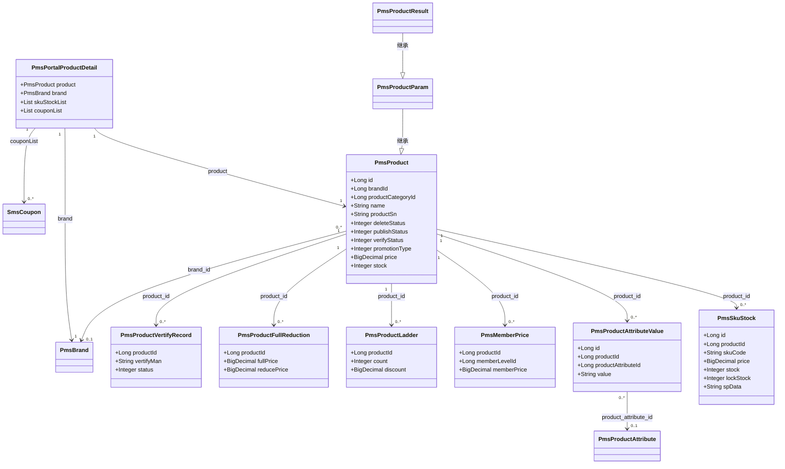
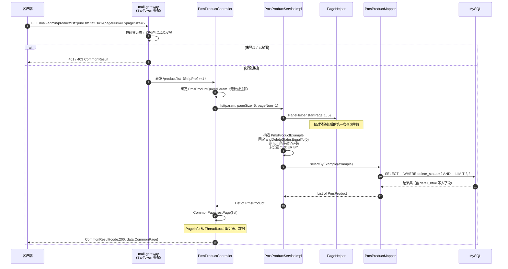
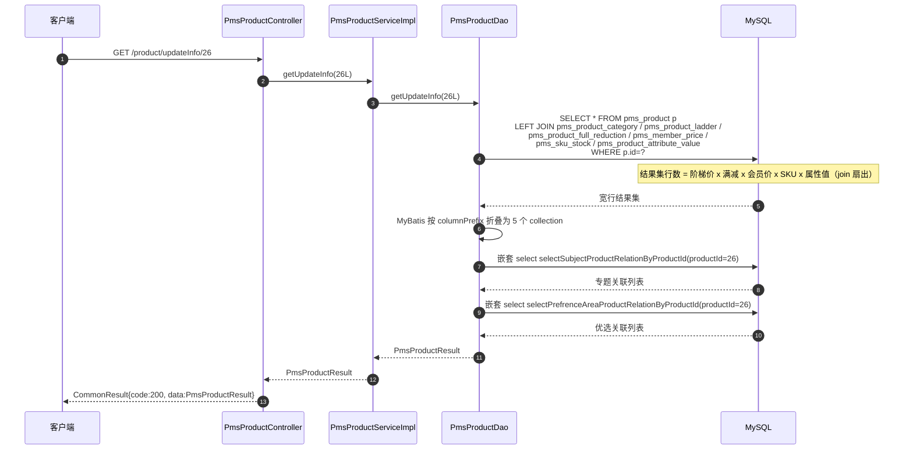
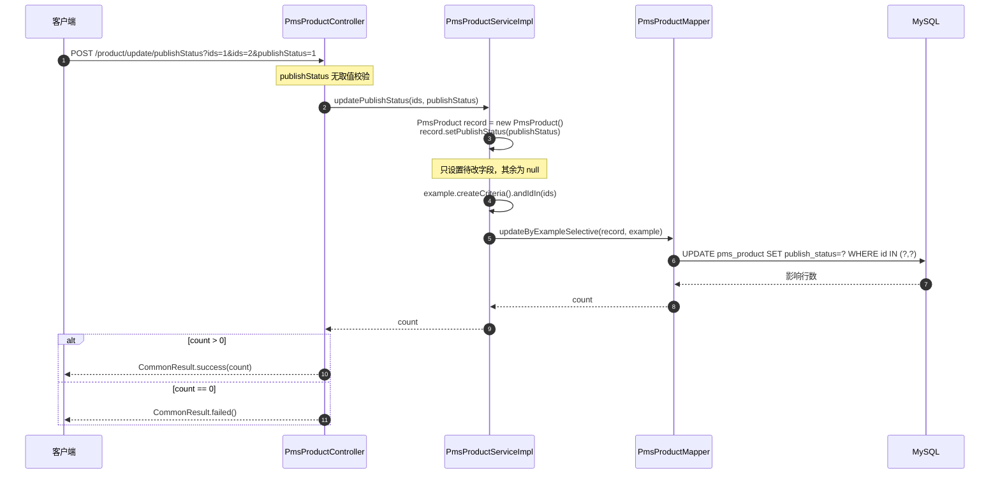
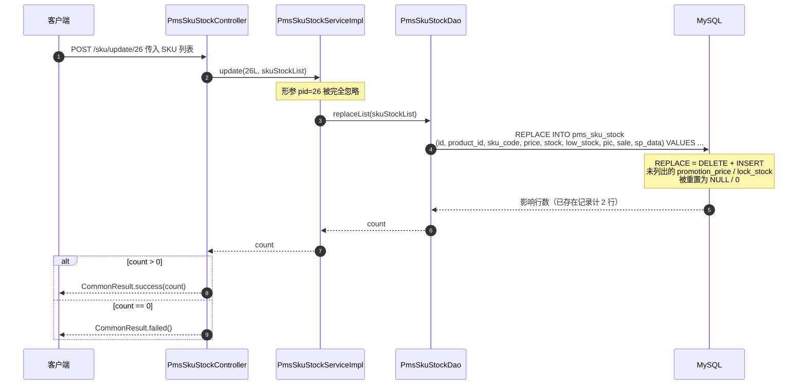
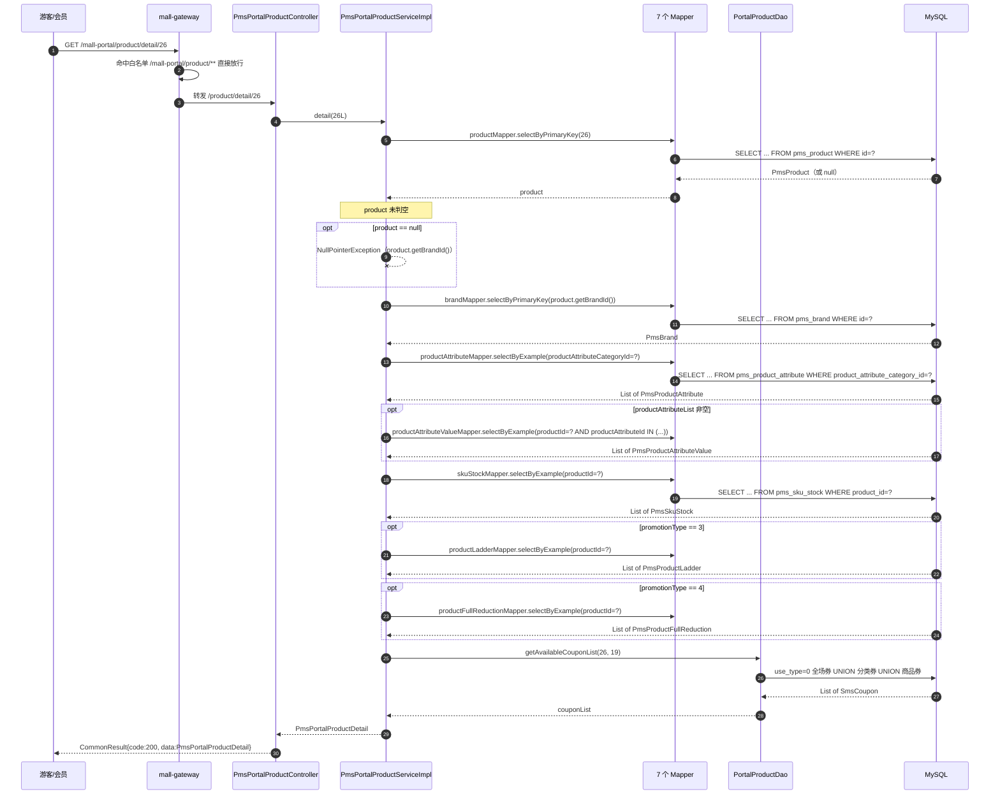
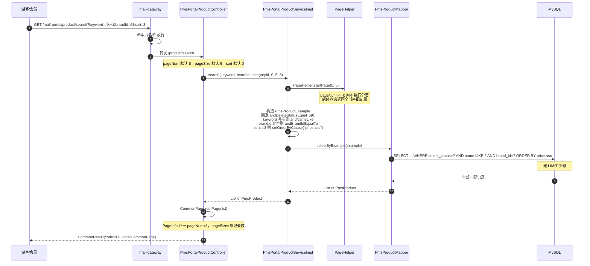
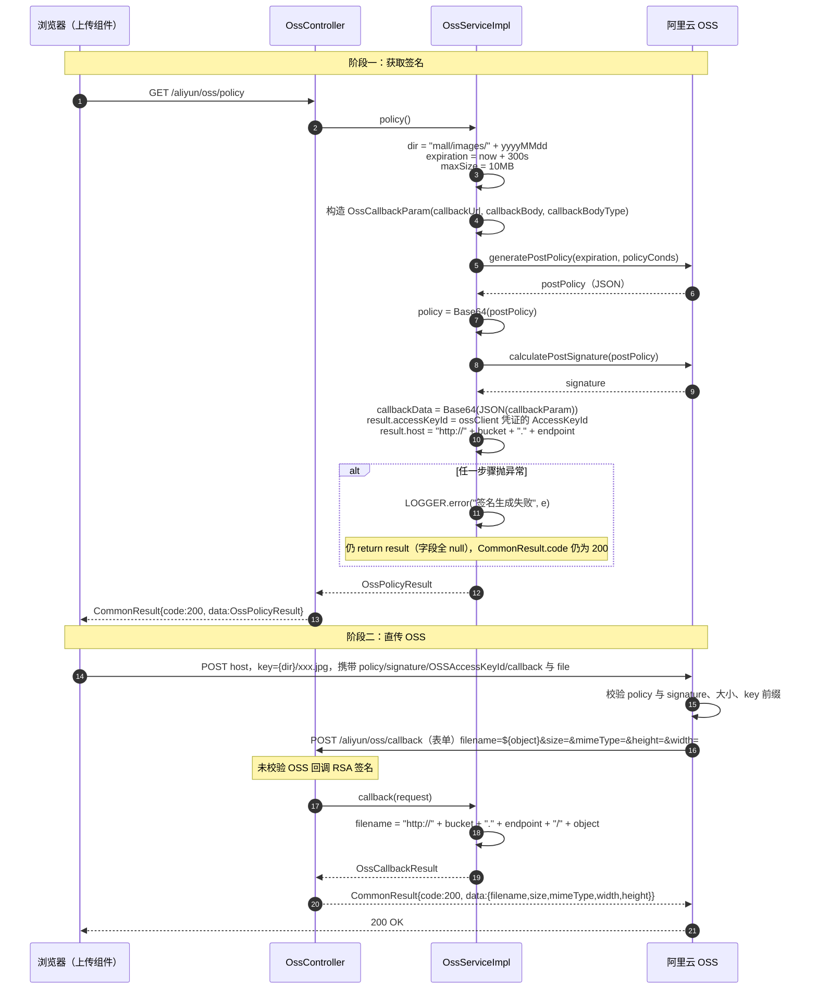
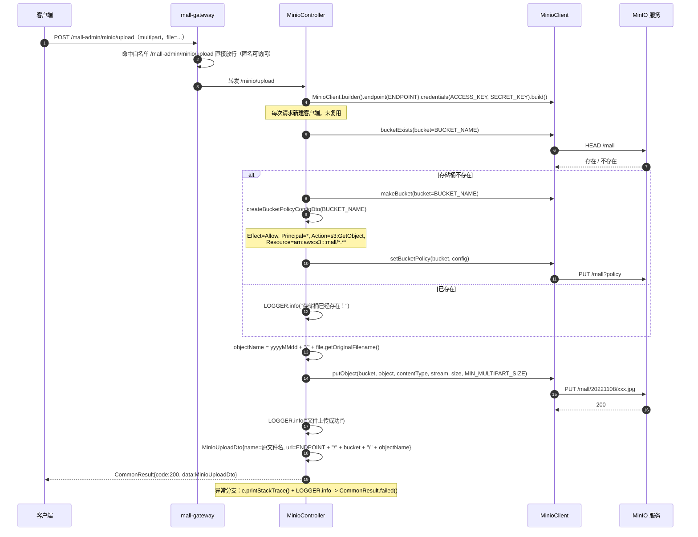

# 详细设计 · 商品管理

| 项目 | 内容 |
| --- | --- |
| 文档编号 | DD-PMS-PRODUCT-001 |
| 所属业务域 | 商品域（`pms`） |
| 涉及服务 | `mall-admin`（:8080）、`mall-portal`（:8085） |
| 涉及数据表 | `pms_product`（主）、`pms_sku_stock`、`pms_product_attribute_value`、`pms_member_price`、`pms_product_ladder`、`pms_product_full_reduction`、`pms_product_vertify_record`、`pms_product_operate_log`、`pms_album`、`pms_album_pic`、`pms_feight_template`，关联 `pms_brand`、`pms_product_category`、`pms_product_attribute` |
| 接口数量 | 19 个（`mall-admin` 16 + `mall-portal` 3） |
| 网关前缀 | `/mall-admin/product/**`、`/mall-admin/sku/**`、`/mall-admin/aliyun/**`、`/mall-admin/minio/**`、`/mall-portal/product/**` |
| 文档状态 | 待评审 |

---

## 一、概述

### 1.1 范围

本文档描述「商品管理」这一业务能力的详细设计，覆盖：

- **数据库设计**：`pms_product` 主表及 12 张从表的表结构、字典、约束现状与改进建议
- **接口设计**：19 个 REST 接口的请求参数、响应结构与数据模型
- **包设计**：跨 `mall-admin` / `mall-portal` / `mall-mbg` / `mall-common` 的包结构与类职责
- **运行流程**：列表查询、编辑信息聚合、商品创建、商品更新、状态流转、SKU 库存更新、前台详情聚合、前台搜索、OSS 直传、MinIO 上传的时序与异常
- **日志设计**：日志框架、访问日志切面、本模块埋点与输出目的地
- **测试用例设计**：功能、边界、异常三类用例

不在本文档范围内：品牌管理（见《详细设计 · 商品品牌管理》）、商品分类与属性管理、ES 商品索引（见 `mall-search` 相关文档）、购物车与订单侧的促销计价。

### 1.2 术语

| 术语 | 含义 |
| --- | --- |
| 商品（Product） | `pms_product` 记录，SPU 概念，一个商品可挂多个 SKU |
| SKU | 库存量单位，`pms_sku_stock` 记录，`sp_data` 以 JSON 描述销售属性组合（颜色/容量等） |
| 货号（productSn） | 商家自定义商品编号，`pms_product.product_sn`，DDL `NOT NULL` 但无唯一约束 |
| 上下架（publishStatus） | 商品是否在前台可售，0 下架 / 1 上架 |
| 审核（verifyStatus） | 平台对商品的合规审核，0 未审核 / 1 审核通过 |
| 逻辑删除（deleteStatus） | 0 未删除 / 1 已删除。商品**不物理删除**，从表数据全部保留 |
| 促销类型（promotionType） | 决定商品使用哪一种促销计价方式，取值 0–5 |
| 阶梯价 / 满减 / 会员价 | 三种促销价，分别落 `pms_product_ladder` / `pms_product_full_reduction` / `pms_member_price` |
| 属性值 | 商品级「参数值」或「自定义规格值」，落 `pms_product_attribute_value` |
| 商品编辑信息 | 后台编辑页所需「商品主体 + 7 个关联集合」的聚合结果（`PmsProductResult`） |
| 前台商品详情 | 前台详情页所需「商品 + 品牌 + 属性 + SKU + 促销 + 可用券」的聚合结果（`PmsPortalProductDetail`） |

### 1.3 接口清单总览

| # | 方法 | 路径（服务内） | 网关路径 | 说明 | 归属 |
| --- | --- | --- | --- | --- | --- |
| 1 | POST | `/product/create` | `/mall-admin/product/create` | 创建商品 | 后台 |
| 2 | GET | `/product/updateInfo/{id}` | `/mall-admin/product/updateInfo/{id}` | 根据商品 id 获取商品编辑信息 | 后台 |
| 3 | POST | `/product/update/{id}` | `/mall-admin/product/update/{id}` | 更新商品 | 后台 |
| 4 | GET | `/product/list` | `/mall-admin/product/list` | 分页查询商品 | 后台 |
| 5 | GET | `/product/simpleList` | `/mall-admin/product/simpleList` | 根据商品名称或货号模糊查询 | 后台 |
| 6 | POST | `/product/update/verifyStatus` | `/mall-admin/product/update/verifyStatus` | 批量修改审核状态 | 后台 |
| 7 | POST | `/product/update/publishStatus` | `/mall-admin/product/update/publishStatus` | 批量上下架 | 后台 |
| 8 | POST | `/product/update/recommendStatus` | `/mall-admin/product/update/recommendStatus` | 批量推荐商品 | 后台 |
| 9 | POST | `/product/update/newStatus` | `/mall-admin/product/update/newStatus` | 批量设为新品 | 后台 |
| 10 | POST | `/product/update/deleteStatus` | `/mall-admin/product/update/deleteStatus` | 批量修改删除状态（逻辑删除） | 后台 |
| 11 | GET | `/sku/{pid}` | `/mall-admin/sku/{pid}` | 根据商品编号及 sku 编码模糊搜索 SKU | 后台 |
| 12 | POST | `/sku/update/{pid}` | `/mall-admin/sku/update/{pid}` | 批量更新 SKU 库存信息 | 后台 |
| 13 | GET | `/aliyun/oss/policy` | `/mall-admin/aliyun/oss/policy` | OSS 上传签名生成 | 后台 |
| 14 | POST | `/aliyun/oss/callback` | `/mall-admin/aliyun/oss/callback` | OSS 上传成功回调 | 后台 |
| 15 | POST | `/minio/upload` | `/mall-admin/minio/upload` | MinIO 文件上传 | 后台 |
| 16 | POST | `/minio/delete` | `/mall-admin/minio/delete` | MinIO 文件删除 | 后台 |
| 17 | GET | `/product/search` | `/mall-portal/product/search` | 综合搜索、筛选、排序 | 前台 |
| 18 | GET | `/product/categoryTreeList` | `/mall-portal/product/categoryTreeList` | 以树形结构获取所有商品分类 | 前台 |
| 19 | GET | `/product/detail/{id}` | `/mall-portal/product/detail/{id}` | 获取前台商品详情 | 前台 |

> **归属**：1–10 由 `mall-admin` 的 `PmsProductController` 提供；11–12 由 `PmsSkuStockController`；13–14 由 `OssController`；15–16 由 `MinioController`（**直接在 Controller 内操作 MinIO，无 Service 层**）；17–19 由 `mall-portal` 的 `PmsPortalProductController`。后台与前台商品控制器的类级路径都是 `/product`，靠网关路径前缀区分。
>
> **鉴权**：网关白名单（`mall-gateway/src/main/resources/application.yml` 的 `secure.ignore.urls`）包含 `/mall-portal/product/**`（接口 17–19 允许匿名）与单独一条 `/mall-admin/minio/upload`（**接口 15 允许匿名**）。`/mall-admin/aliyun/oss/**`、`/mall-admin/minio/delete`、`/mall-admin/sku/**` 均**不在白名单**，需 `Authorization: Bearer <token>`。
>
> **网关注销前缀**：`/mall-admin/**` 与 `/mall-portal/**` 路由均配置 `StripPrefix=1`，下游收到的是去掉首段的路径（`/mall-admin/product/list` → `/product/list`）。

---

## 二、数据库设计

### 2.1 表清单

| 表名 | 类型 | 说明 | 本模块操作 |
| --- | --- | --- | --- |
| `pms_product` | 主表 | 商品信息 | 增、改、查；状态批量改（逻辑删除） |
| `pms_sku_stock` | 从表 | sku 的库存 | 增、删、改、查；`REPLACE INTO` 批量覆盖 |
| `pms_product_attribute_value` | 从表 | 存储产品参数信息的表 | 增（全量重建）、删、查 |
| `pms_member_price` | 从表 | 商品会员价格表 | 增（全量重建）、删、查 |
| `pms_product_ladder` | 从表 | 产品阶梯价格表（只针对同商品） | 增（全量重建）、删、查 |
| `pms_product_full_reduction` | 从表 | 产品满减表（只针对同商品） | 增（全量重建）、删、查 |
| `pms_product_vertify_record` | 从表 | 商品审核记录 | 增（审核时批量写入） |
| `pms_product_operate_log` | 从表 | 商品操作日志（**DDL 无表注释**） | **无任何代码读写**，仅建表 |
| `pms_album` / `pms_album_pic` | 独立表 | 相册表 / 画册图片表 | **不读写**（画册以逗号串存于 `pms_product.album_pics`） |
| `pms_feight_template` | 关联表 | 运费模版 | 仅被 `pms_product.feight_template_id` 引用，本模块不查询 |
| `pms_brand` | 关联表 | 品牌表 | 前台详情读；`brand_name` 冗余快照由品牌模块同步 |
| `pms_product_category` | 关联表 | 产品分类 | 后台编辑信息读 `parent_id`；前台读全部构建分类树 |
| `pms_product_attribute` | 关联表 | 商品属性参数表 | 前台详情按 `product_attribute_category_id` 读属性定义 |
| `cms_subject_product_relation` | 关联表 | 专题和商品关系 | 增（全量重建）、删、查 |
| `cms_prefrence_area_product_relation` | 关联表 | 优选专区和商品的关系 | 增（全量重建）、删、查 |
| `sms_coupon` + `sms_coupon_product_relation` + `sms_coupon_product_category_relation` | 关联表 | 优惠券及两种适用范围 | 前台详情**只读**（`PortalProductDao.getAvailableCouponList`） |

### 2.2 建表语句（现状）

主表 `pms_product`（原文照抄 `document/sql/mall.sql`）：

```sql
DROP TABLE IF EXISTS `pms_product`;
CREATE TABLE `pms_product`  (
  `id` bigint(20) NOT NULL AUTO_INCREMENT,
  `brand_id` bigint(20) NULL DEFAULT NULL,
  `product_category_id` bigint(20) NULL DEFAULT NULL,
  `feight_template_id` bigint(20) NULL DEFAULT NULL,
  `product_attribute_category_id` bigint(20) NULL DEFAULT NULL,
  `name` varchar(200) CHARACTER SET utf8 COLLATE utf8_general_ci NOT NULL,
  `pic` varchar(255) CHARACTER SET utf8 COLLATE utf8_general_ci NULL DEFAULT NULL,
  `product_sn` varchar(64) CHARACTER SET utf8 COLLATE utf8_general_ci NOT NULL COMMENT '货号',
  `delete_status` int(1) NULL DEFAULT NULL COMMENT '删除状态：0->未删除；1->已删除',
  `publish_status` int(1) NULL DEFAULT NULL COMMENT '上架状态：0->下架；1->上架',
  `new_status` int(1) NULL DEFAULT NULL COMMENT '新品状态:0->不是新品；1->新品',
  `recommand_status` int(1) NULL DEFAULT NULL COMMENT '推荐状态；0->不推荐；1->推荐',
  `verify_status` int(1) NULL DEFAULT NULL COMMENT '审核状态：0->未审核；1->审核通过',
  `sort` int(11) NULL DEFAULT NULL COMMENT '排序',
  `sale` int(11) NULL DEFAULT NULL COMMENT '销量',
  `price` decimal(10, 2) NULL DEFAULT NULL,
  `promotion_price` decimal(10, 2) NULL DEFAULT NULL COMMENT '促销价格',
  `gift_growth` int(11) NULL DEFAULT 0 COMMENT '赠送的成长值',
  `gift_point` int(11) NULL DEFAULT 0 COMMENT '赠送的积分',
  `use_point_limit` int(11) NULL DEFAULT NULL COMMENT '限制使用的积分数',
  `sub_title` varchar(255) CHARACTER SET utf8 COLLATE utf8_general_ci NULL DEFAULT NULL COMMENT '副标题',
  `description` text CHARACTER SET utf8 COLLATE utf8_general_ci NULL COMMENT '商品描述',
  `original_price` decimal(10, 2) NULL DEFAULT NULL COMMENT '市场价',
  `stock` int(11) NULL DEFAULT NULL COMMENT '库存',
  `low_stock` int(11) NULL DEFAULT NULL COMMENT '库存预警值',
  `unit` varchar(16) CHARACTER SET utf8 COLLATE utf8_general_ci NULL DEFAULT NULL COMMENT '单位',
  `weight` decimal(10, 2) NULL DEFAULT NULL COMMENT '商品重量，默认为克',
  `preview_status` int(1) NULL DEFAULT NULL COMMENT '是否为预告商品：0->不是；1->是',
  `service_ids` varchar(64) CHARACTER SET utf8 COLLATE utf8_general_ci NULL DEFAULT NULL COMMENT '以逗号分割的产品服务：1->无忧退货；2->快速退款；3->免费包邮',
  `keywords` varchar(255) CHARACTER SET utf8 COLLATE utf8_general_ci NULL DEFAULT NULL,
  `note` varchar(255) CHARACTER SET utf8 COLLATE utf8_general_ci NULL DEFAULT NULL,
  `album_pics` varchar(255) CHARACTER SET utf8 COLLATE utf8_general_ci NULL DEFAULT NULL COMMENT '画册图片，连产品图片限制为5张，以逗号分割',
  `detail_title` varchar(255) CHARACTER SET utf8 COLLATE utf8_general_ci NULL DEFAULT NULL,
  `detail_desc` text CHARACTER SET utf8 COLLATE utf8_general_ci NULL,
  `detail_html` text CHARACTER SET utf8 COLLATE utf8_general_ci NULL COMMENT '产品详情网页内容',
  `detail_mobile_html` text CHARACTER SET utf8 COLLATE utf8_general_ci NULL COMMENT '移动端网页详情',
  `promotion_start_time` datetime NULL DEFAULT NULL COMMENT '促销开始时间',
  `promotion_end_time` datetime NULL DEFAULT NULL COMMENT '促销结束时间',
  `promotion_per_limit` int(11) NULL DEFAULT NULL COMMENT '活动限购数量',
  `promotion_type` int(1) NULL DEFAULT NULL COMMENT '促销类型：0->没有促销使用原价;1->使用促销价；2->使用会员价；3->使用阶梯价格；4->使用满减价格；5->限时购',
  `brand_name` varchar(255) CHARACTER SET utf8 COLLATE utf8_general_ci NULL DEFAULT NULL COMMENT '品牌名称',
  `product_category_name` varchar(255) CHARACTER SET utf8 COLLATE utf8_general_ci NULL DEFAULT NULL COMMENT '商品分类名称',
  PRIMARY KEY (`id`) USING BTREE
) ENGINE = InnoDB AUTO_INCREMENT = 46 CHARACTER SET = utf8 COLLATE = utf8_general_ci COMMENT = '商品信息' ROW_FORMAT = DYNAMIC;
```

从表（原文照抄，仅列有效 DDL）：

```sql
DROP TABLE IF EXISTS `pms_sku_stock`;
CREATE TABLE `pms_sku_stock`  (
  `id` bigint(20) NOT NULL AUTO_INCREMENT,
  `product_id` bigint(20) NULL DEFAULT NULL,
  `sku_code` varchar(64) CHARACTER SET utf8 COLLATE utf8_general_ci NOT NULL COMMENT 'sku编码',
  `price` decimal(10, 2) NULL DEFAULT NULL,
  `stock` int(11) NULL DEFAULT 0 COMMENT '库存',
  `low_stock` int(11) NULL DEFAULT NULL COMMENT '预警库存',
  `pic` varchar(255) CHARACTER SET utf8 COLLATE utf8_general_ci NULL DEFAULT NULL COMMENT '展示图片',
  `sale` int(11) NULL DEFAULT NULL COMMENT '销量',
  `promotion_price` decimal(10, 2) NULL DEFAULT NULL COMMENT '单品促销价格',
  `lock_stock` int(11) NULL DEFAULT 0 COMMENT '锁定库存',
  `sp_data` varchar(500) CHARACTER SET utf8 COLLATE utf8_general_ci NULL DEFAULT NULL COMMENT '商品销售属性，json格式',
  PRIMARY KEY (`id`) USING BTREE
) ENGINE = InnoDB AUTO_INCREMENT = 243 CHARACTER SET = utf8 COLLATE = utf8_general_ci COMMENT = 'sku的库存' ROW_FORMAT = DYNAMIC;

DROP TABLE IF EXISTS `pms_product_attribute_value`;
CREATE TABLE `pms_product_attribute_value`  (
  `id` bigint(20) NOT NULL AUTO_INCREMENT,
  `product_id` bigint(20) NULL DEFAULT NULL,
  `product_attribute_id` bigint(20) NULL DEFAULT NULL,
  `value` varchar(64) CHARACTER SET utf8 COLLATE utf8_general_ci NULL DEFAULT NULL COMMENT '手动添加规格或参数的值，参数单值，规格有多个时以逗号隔开',
  PRIMARY KEY (`id`) USING BTREE
) ENGINE = InnoDB AUTO_INCREMENT = 517 CHARACTER SET = utf8 COLLATE = utf8_general_ci COMMENT = '存储产品参数信息的表' ROW_FORMAT = DYNAMIC;

DROP TABLE IF EXISTS `pms_member_price`;
CREATE TABLE `pms_member_price`  (
  `id` bigint(20) NOT NULL AUTO_INCREMENT,
  `product_id` bigint(20) NULL DEFAULT NULL,
  `member_level_id` bigint(20) NULL DEFAULT NULL,
  `member_price` decimal(10, 2) NULL DEFAULT NULL COMMENT '会员价格',
  `member_level_name` varchar(100) CHARACTER SET utf8 COLLATE utf8_general_ci NULL DEFAULT NULL,
  PRIMARY KEY (`id`) USING BTREE
) ENGINE = InnoDB AUTO_INCREMENT = 426 CHARACTER SET = utf8 COLLATE = utf8_general_ci COMMENT = '商品会员价格表' ROW_FORMAT = DYNAMIC;

DROP TABLE IF EXISTS `pms_product_ladder`;
CREATE TABLE `pms_product_ladder`  (
  `id` bigint(20) NOT NULL AUTO_INCREMENT,
  `product_id` bigint(20) NULL DEFAULT NULL,
  `count` int(11) NULL DEFAULT NULL COMMENT '满足的商品数量',
  `discount` decimal(10, 2) NULL DEFAULT NULL COMMENT '折扣',
  `price` decimal(10, 2) NULL DEFAULT NULL COMMENT '折后价格',
  PRIMARY KEY (`id`) USING BTREE
) ENGINE = InnoDB AUTO_INCREMENT = 148 CHARACTER SET = utf8 COLLATE = utf8_general_ci COMMENT = '产品阶梯价格表(只针对同商品)' ROW_FORMAT = DYNAMIC;

DROP TABLE IF EXISTS `pms_product_full_reduction`;
CREATE TABLE `pms_product_full_reduction`  (
  `id` bigint(11) NOT NULL AUTO_INCREMENT,
  `product_id` bigint(20) NULL DEFAULT NULL,
  `full_price` decimal(10, 2) NULL DEFAULT NULL,
  `reduce_price` decimal(10, 2) NULL DEFAULT NULL,
  PRIMARY KEY (`id`) USING BTREE
) ENGINE = InnoDB AUTO_INCREMENT = 148 CHARACTER SET = utf8 COLLATE = utf8_general_ci COMMENT = '产品满减表(只针对同商品)' ROW_FORMAT = DYNAMIC;

DROP TABLE IF EXISTS `pms_product_vertify_record`;
CREATE TABLE `pms_product_vertify_record`  (
  `id` bigint(20) NOT NULL AUTO_INCREMENT,
  `product_id` bigint(20) NULL DEFAULT NULL,
  `create_time` datetime NULL DEFAULT NULL,
  `vertify_man` varchar(64) CHARACTER SET utf8 COLLATE utf8_general_ci NULL DEFAULT NULL COMMENT '审核人',
  `status` int(1) NULL DEFAULT NULL,
  `detail` varchar(255) CHARACTER SET utf8 COLLATE utf8_general_ci NULL DEFAULT NULL COMMENT '反馈详情',
  PRIMARY KEY (`id`) USING BTREE
) ENGINE = InnoDB AUTO_INCREMENT = 3 CHARACTER SET = utf8 COLLATE = utf8_general_ci COMMENT = '商品审核记录' ROW_FORMAT = DYNAMIC;

DROP TABLE IF EXISTS `pms_product_operate_log`;
CREATE TABLE `pms_product_operate_log`  (
  `id` bigint(20) NOT NULL AUTO_INCREMENT,
  `product_id` bigint(20) NULL DEFAULT NULL,
  `price_old` decimal(10, 2) NULL DEFAULT NULL,
  `price_new` decimal(10, 2) NULL DEFAULT NULL,
  `sale_price_old` decimal(10, 2) NULL DEFAULT NULL,
  `sale_price_new` decimal(10, 2) NULL DEFAULT NULL,
  `gift_point_old` int(11) NULL DEFAULT NULL COMMENT '赠送的积分',
  `gift_point_new` int(11) NULL DEFAULT NULL,
  `use_point_limit_old` int(11) NULL DEFAULT NULL,
  `use_point_limit_new` int(11) NULL DEFAULT NULL,
  `operate_man` varchar(64) CHARACTER SET utf8 COLLATE utf8_general_ci NULL DEFAULT NULL COMMENT '操作人',
  `create_time` datetime NULL DEFAULT NULL,
  PRIMARY KEY (`id`) USING BTREE
) ENGINE = InnoDB AUTO_INCREMENT = 1 CHARACTER SET = utf8 COLLATE = utf8_general_ci ROW_FORMAT = DYNAMIC;

DROP TABLE IF EXISTS `pms_album`;
CREATE TABLE `pms_album`  (
  `id` bigint(20) NOT NULL AUTO_INCREMENT,
  `name` varchar(64) CHARACTER SET utf8 COLLATE utf8_general_ci NULL DEFAULT NULL,
  `cover_pic` varchar(1000) CHARACTER SET utf8 COLLATE utf8_general_ci NULL DEFAULT NULL,
  `pic_count` int(11) NULL DEFAULT NULL,
  `sort` int(11) NULL DEFAULT NULL,
  `description` varchar(1000) CHARACTER SET utf8 COLLATE utf8_general_ci NULL DEFAULT NULL,
  PRIMARY KEY (`id`) USING BTREE
) ENGINE = InnoDB AUTO_INCREMENT = 1 CHARACTER SET = utf8 COLLATE = utf8_general_ci COMMENT = '相册表' ROW_FORMAT = DYNAMIC;

DROP TABLE IF EXISTS `pms_album_pic`;
CREATE TABLE `pms_album_pic`  (
  `id` bigint(20) NOT NULL AUTO_INCREMENT,
  `album_id` bigint(20) NULL DEFAULT NULL,
  `pic` varchar(1000) CHARACTER SET utf8 COLLATE utf8_general_ci NULL DEFAULT NULL,
  PRIMARY KEY (`id`) USING BTREE
) ENGINE = InnoDB AUTO_INCREMENT = 1 CHARACTER SET = utf8 COLLATE = utf8_general_ci COMMENT = '画册图片表' ROW_FORMAT = DYNAMIC;

DROP TABLE IF EXISTS `pms_feight_template`;
CREATE TABLE `pms_feight_template`  (
  `id` bigint(20) NOT NULL AUTO_INCREMENT,
  `name` varchar(64) CHARACTER SET utf8 COLLATE utf8_general_ci NULL DEFAULT NULL,
  `charge_type` int(1) NULL DEFAULT NULL COMMENT '计费类型:0->按重量；1->按件数',
  `first_weight` decimal(10, 2) NULL DEFAULT NULL COMMENT '首重kg',
  `first_fee` decimal(10, 2) NULL DEFAULT NULL COMMENT '首费（元）',
  `continue_weight` decimal(10, 2) NULL DEFAULT NULL,
  `continme_fee` decimal(10, 2) NULL DEFAULT NULL,
  `dest` varchar(255) CHARACTER SET utf8 COLLATE utf8_general_ci NULL DEFAULT NULL COMMENT '目的地（省、市）',
  PRIMARY KEY (`id`) USING BTREE
) ENGINE = InnoDB AUTO_INCREMENT = 1 CHARACTER SET = utf8 COLLATE = utf8_general_ci COMMENT = '运费模版' ROW_FORMAT = DYNAMIC;
```

被本模块读写的三张关联表（`pms_brand` 完整 DDL 见《详细设计 · 商品品牌管理》）：

```sql
DROP TABLE IF EXISTS `pms_product_attribute`;
CREATE TABLE `pms_product_attribute`  (
  `id` bigint(20) NOT NULL AUTO_INCREMENT,
  `product_attribute_category_id` bigint(20) NULL DEFAULT NULL,
  `name` varchar(64) CHARACTER SET utf8 COLLATE utf8_general_ci NULL DEFAULT NULL,
  `select_type` int(1) NULL DEFAULT NULL COMMENT '属性选择类型：0->唯一；1->单选；2->多选',
  `input_type` int(1) NULL DEFAULT NULL COMMENT '属性录入方式：0->手工录入；1->从列表中选取',
  `input_list` varchar(255) CHARACTER SET utf8 COLLATE utf8_general_ci NULL DEFAULT NULL COMMENT '可选值列表，以逗号隔开',
  `sort` int(11) NULL DEFAULT NULL COMMENT '排序字段：最高的可以单独上传图片',
  `filter_type` int(1) NULL DEFAULT NULL COMMENT '分类筛选样式：1->普通；1->颜色',
  `search_type` int(1) NULL DEFAULT NULL COMMENT '检索类型；0->不需要进行检索；1->关键字检索；2->范围检索',
  `related_status` int(1) NULL DEFAULT NULL COMMENT '相同属性产品是否关联；0->不关联；1->关联',
  `hand_add_status` int(1) NULL DEFAULT NULL COMMENT '是否支持手动新增；0->不支持；1->支持',
  `type` int(1) NULL DEFAULT NULL COMMENT '属性的类型；0->规格；1->参数',
  PRIMARY KEY (`id`) USING BTREE
) ENGINE = InnoDB AUTO_INCREMENT = 74 CHARACTER SET = utf8 COLLATE = utf8_general_ci COMMENT = '商品属性参数表' ROW_FORMAT = DYNAMIC;

DROP TABLE IF EXISTS `pms_product_category`;
CREATE TABLE `pms_product_category`  (
  `id` bigint(20) NOT NULL AUTO_INCREMENT,
  `parent_id` bigint(20) NULL DEFAULT NULL COMMENT '上机分类的编号：0表示一级分类',
  `name` varchar(64) CHARACTER SET utf8 COLLATE utf8_general_ci NULL DEFAULT NULL,
  `level` int(1) NULL DEFAULT NULL COMMENT '分类级别：0->1级；1->2级',
  `product_count` int(11) NULL DEFAULT NULL,
  `product_unit` varchar(64) CHARACTER SET utf8 COLLATE utf8_general_ci NULL DEFAULT NULL,
  `nav_status` int(1) NULL DEFAULT NULL COMMENT '是否显示在导航栏：0->不显示；1->显示',
  `show_status` int(1) NULL DEFAULT NULL COMMENT '显示状态：0->不显示；1->显示',
  `sort` int(11) NULL DEFAULT NULL,
  `icon` varchar(255) CHARACTER SET utf8 COLLATE utf8_general_ci NULL DEFAULT NULL COMMENT '图标',
  `keywords` varchar(255) CHARACTER SET utf8 COLLATE utf8_general_ci NULL DEFAULT NULL,
  `description` text CHARACTER SET utf8 COLLATE utf8_general_ci NULL COMMENT '描述',
  PRIMARY KEY (`id`) USING BTREE
) ENGINE = InnoDB AUTO_INCREMENT = 56 CHARACTER SET = utf8 COLLATE = utf8_general_ci COMMENT = '产品分类' ROW_FORMAT = DYNAMIC;

DROP TABLE IF EXISTS `pms_brand`;
CREATE TABLE `pms_brand`  (
  `id` bigint(20) NOT NULL AUTO_INCREMENT,
  `name` varchar(64) CHARACTER SET utf8 COLLATE utf8_general_ci NULL DEFAULT NULL,
  `first_letter` varchar(8) CHARACTER SET utf8 COLLATE utf8_general_ci NULL DEFAULT NULL COMMENT '首字母',
  `sort` int(11) NULL DEFAULT NULL,
  `factory_status` int(1) NULL DEFAULT NULL COMMENT '是否为品牌制造商：0->不是；1->是',
  `show_status` int(1) NULL DEFAULT NULL,
  `product_count` int(11) NULL DEFAULT NULL COMMENT '产品数量',
  `product_comment_count` int(11) NULL DEFAULT NULL COMMENT '产品评论数量',
  `logo` varchar(255) CHARACTER SET utf8 COLLATE utf8_general_ci NULL DEFAULT NULL COMMENT '品牌logo',
  `big_pic` varchar(255) CHARACTER SET utf8 COLLATE utf8_general_ci NULL DEFAULT NULL COMMENT '专区大图',
  `brand_story` text CHARACTER SET utf8 COLLATE utf8_general_ci NULL COMMENT '品牌故事',
  PRIMARY KEY (`id`) USING BTREE
) ENGINE = InnoDB AUTO_INCREMENT = 60 CHARACTER SET = utf8 COLLATE = utf8_general_ci COMMENT = '品牌表' ROW_FORMAT = DYNAMIC;
```

### 2.3 字段说明（`pms_product`）

| 字段 | 类型 | 允许空 | 默认值 | 中文名 | 说明 |
| --- | --- | --- | --- | --- | --- |
| `id` | bigint(20) | 否 | AUTO_INCREMENT | 主键 | 商品唯一标识 |
| `brand_id` | bigint(20) | 是 | NULL | 品牌编号 | 逻辑外键 → `pms_brand.id` |
| `product_category_id` | bigint(20) | 是 | NULL | 商品分类编号 | 逻辑外键，业务上应为二级分类 |
| `feight_template_id` | bigint(20) | 是 | NULL | 运费模版编号 | 逻辑外键，不校验存在性 |
| `product_attribute_category_id` | bigint(20) | 是 | NULL | 属性分类编号 | 前台详情据此取属性定义 |
| `name` | varchar(200) | **否** | 无 | 商品名称 | DDL 强约束，**应用层无校验** |
| `pic` | varchar(255) | 是 | NULL | 商品主图 | URL |
| `product_sn` | varchar(64) | **否** | 无 | 货号 | DDL 强约束，**无唯一约束** |
| `delete_status` | int(1) | 是 | NULL | 删除状态 | 0 未删除 / 1 已删除。**列为可空**，历史 NULL 值不命中 `= 0` 过滤 |
| `publish_status` | int(1) | 是 | NULL | 上架状态 | 0 下架 / 1 上架 |
| `new_status` | int(1) | 是 | NULL | 新品状态 | 0 不是新品 / 1 新品 |
| `recommand_status` | int(1) | 是 | NULL | 推荐状态 | 0 不推荐 / 1 推荐（**列名与 Java 属性均漏 `d`**） |
| `verify_status` | int(1) | 是 | NULL | 审核状态 | 0 未审核 / 1 审核通过 |
| `sort` | int(11) | 是 | NULL | 排序 | 语义由前端约定 |
| `sale` | int(11) | 是 | NULL | 销量 | 前台 `sort=2` 按此倒序 |
| `price` | decimal(10,2) | 是 | NULL | 价格 | 前台 `sort=3/4` 按此升/降序 |
| `promotion_price` | decimal(10,2) | 是 | NULL | 促销价格 | `promotion_type=1` 时使用 |
| `gift_growth` | int(11) | 是 | **0** | 赠送的成长值 | 少见的带 DDL 默认值字段 |
| `gift_point` | int(11) | 是 | **0** | 赠送的积分 | 同上 |
| `use_point_limit` | int(11) | 是 | NULL | 限制使用的积分数 | — |
| `sub_title` | varchar(255) | 是 | NULL | 副标题 | — |
| `description` | text | 是 | NULL | 商品描述 | 最大 65535 字节 |
| `original_price` | decimal(10,2) | 是 | NULL | 市场价 | — |
| `stock` | int(11) | 是 | NULL | 库存 | **SPU 级汇总库存**，与 `pms_sku_stock.stock` 冗余，**无同步逻辑** |
| `low_stock` | int(11) | 是 | NULL | 库存预警值 | — |
| `unit` | varchar(16) | 是 | NULL | 单位 | 如「件」 |
| `weight` | decimal(10,2) | 是 | NULL | 商品重量 | 单位克 |
| `preview_status` | int(1) | 是 | NULL | 是否为预告商品 | 0 不是 / 1 是 |
| `service_ids` | varchar(64) | 是 | NULL | 产品服务 | 逗号分割：1 无忧退货 / 2 快速退款 / 3 免费包邮 |
| `keywords` / `note` | varchar(255) | 是 | NULL | 关键词 / 备注 | — |
| `album_pics` | varchar(255) | 是 | NULL | 画册图片 | 逗号分割「限制为 5 张」。**列宽 255 与 5 张 URL 的承诺不匹配**，见 2.7 ⑥ |
| `detail_title` | varchar(255) | 是 | NULL | 详情标题 | — |
| `detail_desc` | text | 是 | NULL | 详情描述 | — |
| `detail_html` | text | 是 | NULL | 产品详情网页内容 | PC 端富文本 |
| `detail_mobile_html` | text | 是 | NULL | 移动端网页详情 | H5 富文本 |
| `promotion_start_time` / `promotion_end_time` | datetime | 是 | NULL | 促销开始 / 结束时间 | — |
| `promotion_per_limit` | int(11) | 是 | NULL | 活动限购数量 | — |
| `promotion_type` | int(1) | 是 | NULL | 促销类型 | 见 2.4 字典 |
| `brand_name` | varchar(255) | 是 | NULL | 品牌名称 | 冗余快照，由品牌模块更新时同步 |
| `product_category_name` | varchar(255) | 是 | NULL | 商品分类名称 | 冗余快照，**无任何代码维护** |

### 2.4 字段说明（从表）

| 表 | 字段 | 类型 | 允许空 | 默认值 | 中文名 | 说明 |
| --- | --- | --- | --- | --- | --- | --- |
| `pms_sku_stock` | `id` / `product_id` | bigint(20) | 否 / 是 | AUTO_INCREMENT / NULL | 主键 / 商品编号 | 逻辑外键 → `pms_product.id` |
| `pms_sku_stock` | `sku_code` | varchar(64) | **否** | 无 | SKU 编码 | 创建时为空由后端生成，格式见 5.3 |
| `pms_sku_stock` | `price` | decimal(10,2) | 是 | NULL | 价格 | SKU 售价 |
| `pms_sku_stock` | `stock` | int(11) | 是 | **0** | 库存 | SKU 实际库存 |
| `pms_sku_stock` | `low_stock` | int(11) | 是 | NULL | 预警库存 | — |
| `pms_sku_stock` | `pic` | varchar(255) | 是 | NULL | 展示图片 | — |
| `pms_sku_stock` | `sale` | int(11) | 是 | NULL | 销量 | — |
| `pms_sku_stock` | `promotion_price` | decimal(10,2) | 是 | NULL | 单品促销价格 | **不在 `replaceList` 列清单内**，见 2.7 ③ |
| `pms_sku_stock` | `lock_stock` | int(11) | 是 | **0** | 锁定库存 | 下单占用。**同样不在 `replaceList` 列清单内** |
| `pms_sku_stock` | `sp_data` | varchar(500) | 是 | NULL | 商品销售属性 | JSON 数组，如 `[{"key":"颜色","value":"黑色"}]` |
| `pms_product_attribute_value` | `product_id` / `product_attribute_id` | bigint(20) | 是 | NULL | 商品编号 / 属性编号 | 逻辑外键 |
| `pms_product_attribute_value` | `value` | varchar(64) | 是 | NULL | 属性值 | 参数单值；规格多值以逗号隔开 |
| `pms_member_price` | `product_id` / `member_level_id` | bigint(20) | 是 | NULL | 商品编号 / 会员等级编号 | 逻辑外键（等级 → `ums_member_level.id`） |
| `pms_member_price` | `member_price` | decimal(10,2) | 是 | NULL | 会员价格 | — |
| `pms_member_price` | `member_level_name` | varchar(100) | 是 | NULL | 会员等级名称 | 冗余快照 |
| `pms_product_ladder` | `count` | int(11) | 是 | NULL | 满足的商品数量 | 数量阈值 |
| `pms_product_ladder` | `discount` / `price` | decimal(10,2) | 是 | NULL | 折扣 / 折后价格 | 0.70 表示 7 折；二者业务二选一，DDL 无约束 |
| `pms_product_full_reduction` | `id` | **bigint(11)** | 否 | AUTO_INCREMENT | 主键 | **类型与同族表 `bigint(20)` 不一致** |
| `pms_product_full_reduction` | `full_price` / `reduce_price` | decimal(10,2) | 是 | NULL | 满足金额 / 减免金额 | — |
| `pms_product_vertify_record` | `create_time` | datetime | 是 | NULL | 创建时间 | 由应用层 `new Date()` 写入 |
| `pms_product_vertify_record` | `vertify_man` | varchar(64) | 是 | NULL | 审核人 | **当前实现硬编码 `"test"`**，见 2.7 ⑦ |
| `pms_product_vertify_record` | `status` / `detail` | int(1) / varchar(255) | 是 | NULL | 审核状态 / 反馈详情 | 与 `verify_status` 同语义；超长会报错 |
| `pms_feight_template` | `charge_type` | int(1) | 是 | NULL | 计费类型 | 0 按重量 / 1 按件数 |
| `pms_feight_template` | `continue_weight` | decimal(10,2) | 是 | NULL | 续重 kg | **列名与注释均缺失中文说明** |
| `pms_feight_template` | `continme_fee` | decimal(10,2) | 是 | NULL | 续费（元） | **列名拼写错误**：应为 `continue_fee` |
| `pms_product_operate_log` | 共 12 列 | — | 是 | NULL | 价格/积分/操作人变更留痕 | 见 2.2 DDL；**全仓库无任何 Mapper/Dao 引用，`AUTO_INCREMENT = 1` 且无数据，属死表**，见 2.7 ⑧ |
| `pms_album` / `pms_album_pic` | 全部列 | — | 是 | NULL | 相册 / 画册图片 | 见 2.2 DDL；两表 `AUTO_INCREMENT = 1` 且无数据，**当前代码完全未使用** |

### 2.5 状态字典

取值全部来自 `document/sql/mall.sql` 的列注释或 `@Schema(title = ...)`。

| 字段 | 值 | 含义 |
| --- | --- | --- |
| `delete_status` / `publish_status` / `new_status` / `recommand_status` / `verify_status` / `preview_status` | 0 / 1 | 见 2.3 逐字段说明（均为二元状态） |
| `promotion_type` | 0 / 1 / 2 / 3 / 4 / 5 | 没有促销使用原价 / 使用促销价 / 使用会员价 / 使用阶梯价格 / 使用满减价格 / 限时购 |
| `service_ids` | 1 / 2 / 3 | 无忧退货 / 快速退款 / 免费包邮（逗号分割多值） |
| `pms_product_attribute.type` | 0 / 1 | 规格 / 参数 |
| `pms_product_attribute.select_type` | 0 / 1 / 2 | 唯一 / 单选 / 多选 |
| `pms_product_attribute.input_type` | 0 / 1 | 手工录入 / 从列表中选取 |
| `pms_product_attribute.search_type` | 0 / 1 / 2 | 不需要检索 / 关键字检索 / 范围检索 |
| `pms_product_attribute.related_status` / `hand_add_status` | 0 / 1 | 不关联 / 关联；不支持手动新增 / 支持 |
| `pms_product_category.level` | 0 / 1 | 1 级分类 / 2 级分类 |
| `pms_feight_template.charge_type` | 0 / 1 | 按重量 / 按件数 |
| `sms_coupon.use_type` | 0 / 1 / 2 | 全场通用 / 指定分类 / 指定商品（由 `getAvailableCouponList` SQL 推断） |

> **`pms_product_attribute.filter_type` 的列注释有误**：注释写「分类筛选样式：1->普通；1->颜色」，**两个取值都是 1**，无法据此判断语义，需 DBA 确认。

**前台排序字典**（来自 `PmsPortalProductController.search` 的 `@Parameter` 注解，**不在 DDL 中**）：

| `sort` | 含义 | 实际实现 |
| --- | --- | --- |
| 0 | 按相关度 | **不设置 `ORDER BY`**，等同数据库默认顺序 |
| 1 | 按新品 | `ORDER BY id desc` |
| 2 | 按销量 | `ORDER BY sale desc` |
| 3 | 价格从低到高 | `ORDER BY price asc` |
| 4 | 价格从高到低 | `ORDER BY price desc` |

> **观察**：`sort=1`「按新品」实际按主键倒序，不反映 `new_status`；`sort=0`「按相关度」在**数据库层没有任何排序实现**（相关度能力在 `mall-search` 的 ES 中）。见 2.7 ⑨。

### 2.6 关联与冗余设计

```text
pms_product.brand_id ────────────────► pms_brand.id            （逻辑外键，无 DDL 约束）
pms_product.brand_name ──────────────► pms_brand.name          （冗余快照，品牌模块更新时同步）
pms_product.product_category_id ─────► pms_product_category.id （逻辑外键）
pms_product.product_category_name ───► pms_product_category.name （冗余快照，无同步代码）
pms_product.feight_template_id ──────► pms_feight_template.id  （逻辑外键，不校验存在性）
pms_product.product_attribute_category_id ► pms_product_attribute_category.id （逻辑外键）
pms_sku_stock.product_id ────────────► pms_product.id          （1:N）
pms_product_attribute_value.product_id ► pms_product.id        （1:N）
pms_product_attribute_value.product_attribute_id ► pms_product_attribute.id
pms_member_price.product_id ─────────► pms_product.id          （1:N）
pms_member_price.member_level_id ────► ums_member_level.id     （逻辑外键）
pms_product_ladder.product_id ───────► pms_product.id          （1:N）
pms_product_full_reduction.product_id ► pms_product.id         （1:N）
pms_product_vertify_record.product_id ► pms_product.id         （1:N）
pms_product_operate_log.product_id ──► pms_product.id          （1:N，无读写代码）
pms_album_pic.album_id ──────────────► pms_album.id            （逻辑外键，未使用）
cms_subject_product_relation.product_id ► pms_product.id       （N:M）
cms_prefrence_area_product_relation.product_id ► pms_product.id （N:M）
```

**关键设计点 ①：从表是「整体替换」而非增量维护。**

`PmsProductServiceImpl.update()` 对除 SKU 外的所有从表一律「先按 `product_id` 全删、再全量插入」：

```java
// PmsProductServiceImpl.update 片段（会员价为例）
PmsMemberPriceExample pmsMemberPriceExample = new PmsMemberPriceExample();
pmsMemberPriceExample.createCriteria().andProductIdEqualTo(id);
memberPriceMapper.deleteByExample(pmsMemberPriceExample);
relateAndInsertList(memberPriceDao, productParam.getMemberPriceList(), id);
```

含义：**更新商品时若前端未回传某个集合，该集合的既有数据会被静默清空**。SKU 是唯一例外。

**关键设计点 ②：SKU 走差量合并。**

`handleUpdateSkuStockList(id, productParam)` 逻辑：① 入参 `skuStockList` 为空 → **直接删除该商品全部 SKU** 并返回；② 否则查库中原有 SKU（`oriStuList`），按入参 `id` 是否为 null 切成「新增集合」与「更新集合」；③ `removeSkuList = oriStuList - updateSkuIds`，即**入参未出现的库中 SKU 一律物理删除**；④ 新增走 `insertList`，删除走 `deleteByExample(andIdIn(...))`，更新逐个 `updateByPrimaryKeySelective`（N 次往返）。

**关键设计点 ③：库存字段双写冗余无同步。**

`pms_product.stock`（SPU 汇总）与 `pms_sku_stock.stock`（SKU 明细）同时存在，但创建/更新只写 `PmsProduct` 自身的 `stock`，`PmsSkuStockServiceImpl.update()` 只写 SKU 表，**没有任何代码把 SKU 库存汇总回写**。`/sku/update/{pid}` 改完库存后，后台商品列表展示的 `pms_product.stock` 仍是旧值。

### 2.7 索引与约束现状

| 项目 | 现状 | 影响 |
| --- | --- | --- |
| 主键 | 全部表均为 `PRIMARY KEY (id) USING BTREE` | 正常 |
| 唯一索引 | **全部表均无** | `product_sn`（货号）、`sku_code` 均可重复 |
| 普通索引 | **全部表均无** | `pms_product` 按 `brand_id`/`product_category_id`/`delete_status`/`publish_status`/`verify_status` 过滤均全表扫描；从表按 `product_id` 的删除/查询亦全表扫描 |
| 外键约束 | **无** | 可写入不存在的 `brand_id`/`category_id`，可删除被 SKU 引用的商品 |
| 非空约束 | `pms_product.name`、`pms_product.product_sn`、`pms_sku_stock.sku_code` | 其余全可空。**这三条是本模块唯一的服务端兜底校验** |
| CHECK 约束 | **无** | `publish_status`、`verify_status`、`promotion_type` 等可取任意整数 |
| 字符集 | 全部 `utf8` / `utf8_general_ci` | **非 `utf8mb4`**，Emoji 与部分生僻字无法存储 |
| 逻辑删除 | 仅 `pms_product.delete_status` | 从表无逻辑删除；商品逻辑删除后从表数据全部保留 |

### 2.8 设计问题与建议

| # | 问题 | 影响 | 建议 |
| --- | --- | --- | --- |
| ① | 从表普遍缺 `product_id` 索引 | 商品更新时 5 次 `delete ... where product_id=?`、1 次 `select ... where product_id=?` 全表扫描，更新接口随数据量线性变慢 | 为 `pms_sku_stock`、`pms_product_attribute_value`、`pms_member_price`、`pms_product_ladder`、`pms_product_full_reduction`、`pms_product_vertify_record` 增加 `idx_product_id (product_id)` |
| ② | `pms_product` 缺业务索引 | 后台列表（`delete_status` + `publish_status` + `verify_status` + 名称 like）与前台搜索（`delete_status` + `brand_id` + `product_category_id`）均全表扫描 | 增加 `idx_status (delete_status, publish_status, verify_status)`、`idx_brand (brand_id)`、`idx_category (product_category_id)`；`product_sn` 增加唯一索引 |
| ③ | `PmsSkuStockDao.replaceList` 用 `REPLACE INTO` 且只列 9 列 | `REPLACE` 语义为「删 + 插」，未列出的 `promotion_price`、`lock_stock` **被重置为 NULL/0**。批量改库存会静默清掉单品促销价与**锁定库存**，直接影响下单占用库存的准确性 | 改为 `INSERT ... ON DUPLICATE KEY UPDATE` 并显式列出待更新列；或改为逐条 `updateByPrimaryKeySelective` |
| ④ | 部分写操作无事务 | `PmsSkuStockServiceImpl.update`（`REPLACE INTO` 批量）与 4 个单条状态批量更新方法**均未声明 `@Transactional`**；`REPLACE INTO` 批量中途失败会留下部分更新的 SKU | 为写操作补齐 `@Transactional(rollbackFor = Exception.class)` |
| ⑤ | `pms_product.stock` 与 `pms_sku_stock.stock` 双写无同步 | 后台列表库存与实际 SKU 库存不一致 | 明确权威来源：废弃 `pms_product.stock`（改聚合查询），或 SKU 变更后汇总回写并加事务 |
| ⑥ | `album_pics` 长度与业务承诺不匹配 | 列宽 `varchar(255)`，注释却称「限制为 5 张」。5 个 OSS URL 极易超 255 字符，写入被截断或报错 | 扩为 `varchar(1000)`，或改用 `pms_album`/`pms_album_pic` 关联表（当前两表完全未使用） |
| ⑦ | `vertify_man` 硬编码 `"test"` | 审核记录无法追溯真实审核人，审计价值为零 | 从 Sa-Token 登录态读取当前 `UmsAdmin` 写入 |
| ⑧ | `pms_product_operate_log` 为死表 | 「价格/积分变更留痕」能力实际缺失 | 补齐 Mapper 并在价格类字段变更时落日志，或删除该表以免误导 |
| ⑨ | `sort=0` 无排序实现、`sort=1` 实为 `id desc` | 前台「综合排序」为数据库物理顺序，结果不稳定不可复现；「按新品」不反映 `new_status` | `sort=0` 显式改为稳定排序（如 `sort desc, id desc`）；`sort=1` 改为 `new_status desc, id desc` 或增加 `create_time` |
| ⑩ | `delete_status` 可空 | `andDeleteStatusEqualTo(0)` 不命中 `delete_status IS NULL` 的历史数据 | 改为 `NOT NULL DEFAULT 0` 并回填存量 NULL |
| ⑪ | 字符集为 `utf8` | 商品名称/详情中的 Emoji、4 字节字符写入失败 | 全库升级 `utf8mb4`（含连接串 `characterEncoding=utf8mb4`） |
| ⑫ | `pms_product_full_reduction.id` 为 `bigint(11)` | 与同族表 `bigint(20)` 不一致，跨表 join 时类型隐式转换 | 统一为 `bigint(20)` |
| ⑬ | `pms_feight_template.continme_fee` 拼写错误、`continue_weight` 无注释 | 语义不清，易被误改 | 重命名列（需同步 MBG 与代码）或至少补齐注释 |
| ⑭ | `product_category_name` 冗余无同步代码 | 分类改名后商品上仍显示旧分类名 | 与品牌一致：分类更新时同步，或改为 join 查询 |
| ⑮ | `pms_product_attribute.filter_type` 列注释写「1->普通；1->颜色」 | 两个取值相同，语义无法确定 | 修正列注释并确认取值定义 |

---

## 三、接口设计

### 3.1 通用约定

**统一响应结构**（`com.macro.mall.common.api.CommonResult`，详见 [CommonResult](#schemacommonresult)）：

```json
{
  "code": 200,
  "message": "操作成功",
  "data": {}
}
```

**业务码定义**（`ResultCode`）：

| code | 常量 | 含义 |
| --- | --- | --- |
| 200 | `SUCCESS` | 操作成功 |
| 401 | `UNAUTHORIZED` | 暂未登录或 token 已经过期 |
| 403 | `FORBIDDEN` | 没有相关权限 |
| 404 | `VALIDATE_FAILED` | 参数检验失败 |
| 500 | `FAILED` | 操作失败 |

> **注意**：业务码定义在 **HTTP 响应体内部**，HTTP 状态码通常仍为 200。`VALIDATE_FAILED` 用 404 表示参数校验失败，与 HTTP 语义不一致，前端需按 `code` 判断。
>
> **与品牌模块的关键区别**：商品模块的请求 DTO（`PmsProductParam`、`PmsProductQueryParam`）**完全没有 Jakarta Bean Validation 注解**，控制器方法上也**没有 `@Validated`**。因此**商品模块不会产生 `code: 404 参数检验失败`**，字段合法性完全依赖数据库的 3 条 `NOT NULL` 约束与业务巧合。详见 3.9 与 2.8。

**统一分页结构**（`CommonPage`，详见 [CommonPage](#schemacommonpage)）：`pageNum`（当前页码）、`pageSize`（每页条数）、`totalPage`（总页数）、`total`（总记录数，int64）、`list`（数据列表）。

`CommonPage.restPage(List)` 内部通过 `new PageInfo<>(list)` 从 `PageHelper` 写入 `ThreadLocal` 的 `Page` 取元数据，因此**必须传入 `PageHelper.startPage` 后第一次查询直接返回的 list**。

**统一异常处理**（`GlobalExceptionHandler`）：仅处理 `ApiException`、`MethodArgumentNotValidException`、`BindException` 三类。后两者在商品模块中**基本不会触发**（无校验注解与 `@Validated`），因此**商品模块几乎完全依赖 Spring 默认异常处理**（响应体不是 `CommonResult`）。

**鉴权**：请求头 `Authorization: Bearer <token>`（`sa-token.token-name: Authorization`、`token-prefix: Bearer`、`is-read-header: true`）。白名单放行 `/mall-portal/product/**` 与 `/mall-admin/minio/upload`，其余按「路径 → 资源权限」校验。

> **为控制篇幅，下文所有接口的「返回结果」均为 `200 [OK] 操作成功` 一行，且不再逐个重复 `code`/`message` 字段与 JSON 示例（除非响应结构与通用约定不同）。** 各接口 `data` 的实际类型见下表；「参数检验失败」响应在本模块中不会出现（原因见上）。

| 接口 | `data` 类型 | 备注 |
| --- | --- | --- |
| 1 创建商品、3 更新商品 | integer(int32) | 成功时**恒为 1**（`count` 硬编码） |
| 4 分页查询商品、17 前台搜索 | [CommonPage](#schemacommonpage)（list 元素为 [PmsProduct](#schemapmsproduct)） | — |
| 2 商品编辑信息 | [PmsProductResult](#schemapmsproductresult) | 不存在时为 null |
| 5 名称/货号模糊查询 | [[PmsProduct](#schemapmsproduct)] | 无分页信息 |
| 6 审核、7 上下架、8 推荐、9 新品、10 删除 | integer(int32) | `pms_product` 实际影响行数 |
| 11 SKU 查询 | [[PmsSkuStock](#schemapmsskustock)] | 无分页信息 |
| 12 SKU 批量更新 | integer(int32) | `REPLACE` 语义下被替换记录计 2 行 |
| 13 OSS 签名 | [OssPolicyResult](#schemaosspolicyresult) | 生成失败时字段全为 null 且 `code` 仍为 200 |
| 14 OSS 回调 | [OssCallbackResult](#schemaosscallbackresult) | — |
| 15 MinIO 上传 | [MinioUploadDto](#schemaminouploaddto) | 失败时为 null |
| 16 MinIO 删除 | string | 成功时 `CommonResult.success(null)`，**恒为 null** |
| 18 商品分类树 | [[PmsProductCategoryNode](#schemapmsproductcategorynode)] | 顶级节点数组 |
| 19 前台商品详情 | [PmsPortalProductDetail](#schemapmsportalproductdetail) | — |

---

### 3.2 后台接口（`mall-admin` · `PmsProductController`，10 个）

<a id="opIdcreateProduct"></a>

## POST 创建商品

POST /product/create

创建商品主体，同时写入 7 个关联集合。`PmsProductServiceImpl.create` 的写入顺序：`pms_product`（回写自增主键）→ `pms_member_price` → `pms_product_ladder` → `pms_product_full_reduction` → `pms_sku_stock`（先补 `skuCode`）→ `pms_product_attribute_value` → `cms_subject_product_relation` → `cms_prefrence_area_product_relation`。方法在 `PmsProductService` 接口上标注 `@Transactional(isolation = Isolation.DEFAULT, propagation = Propagation.REQUIRED)`，**8 步写库在同一事务内**。

> Body 请求参数

```json
{
  "brandId": 49, "productCategoryId": 7, "feightTemplateId": 0,
  "productAttributeCategoryId": 1, "name": "银色星芒刺绣网纱底裤",
  "pic": "http://.../web.png", "productSn": "No86577",
  "deleteStatus": 0, "publishStatus": 1, "newStatus": 1, "recommandStatus": 1,
  "verifyStatus": 1, "sort": 100, "sale": 0, "price": 100.00, "promotionPrice": 0.00,
  "giftGrowth": 0, "giftPoint": 100, "usePointLimit": 0, "subTitle": "副标题",
  "description": "商品描述", "originalPrice": 120.00, "stock": 100, "lowStock": 20,
  "unit": "件", "weight": 1000.00, "previewStatus": 0, "serviceIds": "1,2,3",
  "albumPics": "http://.../a.jpg,http://.../b.jpg", "detailTitle": "详情标题",
  "detailDesc": "详情描述", "detailHtml": "<p>产品详情</p>",
  "detailMobileHtml": "<p>移动端详情</p>", "promotionType": 0,
  "brandName": "七匹狼", "productCategoryName": "外套",
  "productLadderList": [{ "count": 3, "discount": 0.70, "price": 0.00 }],
  "productFullReductionList": [{ "fullPrice": 200.00, "reducePrice": 50.00 }],
  "memberPriceList": [{ "memberLevelId": 1, "memberPrice": 500.00, "memberLevelName": "黄金会员" }],
  "skuStockList": [
    { "skuCode": "", "price": 100.00, "stock": 100, "lowStock": 20, "sale": 0,
      "spData": "[{\"key\":\"颜色\",\"value\":\"黑色\"}]" }
  ],
  "productAttributeValueList": [{ "productAttributeId": 1, "value": "X" }],
  "subjectProductRelationList": [{ "subjectId": 1 }],
  "prefrenceAreaProductRelationList": [{ "prefrenceAreaId": 1 }]
}
```

### 请求参数

| 名称 | 位置 | 类型 | 必选 | 说明 |
| --- | --- | --- | --- | --- |
| body | body | [PmsProductParam](#schemapmsproductparam) | 是 | 商品参数，继承 `PmsProduct` + 7 个关联集合 |

### 返回结果

| 状态码 | 状态码含义 | 说明 | 数据模型 |
| --- | --- | --- | --- |
| 200 | [OK](https://tools.ietf.org/html/rfc7231#section-6.3.1) | 操作成功 | Inline |

### 返回数据结构

状态码 **200**

| 名称 | 类型 | 必选 | 约束 | 中文名 | 说明 |
| --- | --- | --- | --- | --- | --- |
| code | integer(int64) | true | none | 业务码 | 200 成功；500 失败 |
| message | string | true | none | 提示信息 | none |
| data | integer(int32) | false | none | 影响行数 | 成功时**恒为 1**（`create` 末尾硬编码 `count = 1`，非真实影响行数） |

> **设计备注**：`count` 为硬编码常量，因此只要 8 步不抛异常就恒返回 1，`CommonResult.failed()` 分支在本接口中**实际不可达**。见 3.9 ①。

---

<a id="opIdgetUpdateInfo"></a>

## GET 根据商品id获取商品编辑信息

GET /product/updateInfo/{id}

返回编辑页所需的聚合对象 `PmsProductResult`（`PmsProductDao.getUpdateInfo`）：

| 聚合内容 | 来源 | 取值方式 |
| --- | --- | --- |
| 商品主体 40 列 | `pms_product p` | `SELECT *`，`extends="…PmsProductMapper.ResultMapWithBLOBs"`（**含大字段**） |
| `cateParentId` | `pms_product_category pc` | `pc.parent_id cateParentId` |
| `productLadderList` / `productFullReductionList` / `memberPriceList` / `skuStockList` / `productAttributeValueList` | 5 张从表 | **同一 SQL 内 LEFT JOIN**，用 `columnPrefix`（`ladder_`/`full_`/`member_`/`sku_`/`attribute_`）折叠为 5 个 collection |
| `subjectProductRelationList` / `prefrenceAreaProductRelationList` | 2 张 N:M 关联表 | **嵌套 select**：`column="{productId=id}" select="selectXxxByProductId"` |

> **性能风险（join 扇出）**：前 5 个集合在同一 SQL 内 LEFT JOIN。当一个商品有 `l` 条阶梯价、`f` 条满减、`m` 条会员价、`s` 条 SKU、`a` 条属性值时，**结果集行数为 `l × f × m × s × a`**，MyBatis 再折叠。例如 30 SKU × 5 阶梯 × 4 满减 × 3 会员价 × 20 属性值 = **36000 行**。见 5.2。

### 请求参数

| 名称 | 位置 | 类型 | 必选 | 说明 |
| --- | --- | --- | --- | --- |
| id | path | integer(int64) | 是 | 商品编号 |

### 返回结果

| 状态码 | 状态码含义 | 说明 | 数据模型 |
| --- | --- | --- | --- |
| 200 | [OK](https://tools.ietf.org/html/rfc7231#section-6.3.1) | 操作成功 | [CommonResultPmsProductResult](#schemacommonresultpmsproductresult) |

### 返回数据结构

状态码 **200**

| 名称 | 类型 | 必选 | 约束 | 中文名 | 说明 |
| --- | --- | --- | --- | --- | --- |
| code | integer(int64) | true | none | 业务码 | none |
| message | string | true | none | 提示信息 | none |
| data | [PmsProductResult](#schemapmsproductresult) | false | none | 商品编辑信息 | **商品不存在时 `data` 为 null，`code` 仍为 200** |

---

<a id="opIdupdateProduct"></a>

## POST 更新商品

POST /product/update/{id}

更新商品主体与全部关联集合。方法在接口上标注 `@Transactional`，**全部写库在同一事务内**。

| 步骤 | 操作 | SQL 语义 |
| --- | --- | --- |
| 1 | `product.setId(id)` → `productMapper.updateByPrimaryKeySelective` | `UPDATE pms_product SET <非 null 字段> WHERE id = ?` |
| 2 | `memberPriceMapper.deleteByExample(productId=id)` → `memberPriceDao.insertList` | 会员价**全量重建** |
| 3 | `productLadderMapper.deleteByExample` → `productLadderDao.insertList` | 阶梯价**全量重建** |
| 4 | `productFullReductionMapper.deleteByExample` → `productFullReductionDao.insertList` | 满减**全量重建** |
| 5 | `handleUpdateSkuStockList(id, productParam)` | SKU **差量合并**（见 2.6 关键设计点 ②） |
| 6 | `productAttributeValueMapper.deleteByExample` → `productAttributeValueDao.insertList` | 属性值**全量重建** |
| 7 | `subjectProductRelationMapper.deleteByExample` → `subjectProductRelationDao.insertList` | 专题关联**全量重建** |
| 8 | `prefrenceAreaProductRelationMapper.deleteByExample` → `prefrenceAreaProductRelationDao.insertList` | 优选关联**全量重建** |

> Body 请求参数（结构同创建，仅示意关键字段）

```json
{
  "id": 26, "brandId": 3, "productCategoryId": 19, "productAttributeCategoryId": 3,
  "name": "华为 HUAWEI P20", "productSn": "6946605",
  "deleteStatus": 0, "publishStatus": 1, "verifyStatus": 0,
  "price": 3788.00, "stock": 1000, "unit": "件", "promotionType": 1,
  "brandName": "华为", "productCategoryName": "手机通讯",
  "skuStockList": [
    { "id": 110, "productId": 26, "skuCode": "201806070026001", "price": 3788.00, "stock": 487,
      "spData": "[{\"key\":\"颜色\",\"value\":\"金色\"}]" }
  ],
  "productAttributeValueList": [{ "productId": 26, "productAttributeId": 24, "value": "no110" }]
}
```

### 请求参数

| 名称 | 位置 | 类型 | 必选 | 说明 |
| --- | --- | --- | --- | --- |
| id | path | integer(int64) | 是 | 商品编号 |
| body | body | [PmsProductParam](#schemapmsproductparam) | 是 | 商品参数 |

### 返回结果

| 状态码 | 状态码含义 | 说明 | 数据模型 |
| --- | --- | --- | --- |
| 200 | [OK](https://tools.ietf.org/html/rfc7231#section-6.3.1) | 操作成功 | Inline |

### 返回数据结构

状态码 **200**

| 名称 | 类型 | 必选 | 约束 | 中文名 | 说明 |
| --- | --- | --- | --- | --- | --- |
| code | integer(int64) | true | none | 业务码 | 200 成功；500 失败 |
| message | string | true | none | 提示信息 | none |
| data | integer(int32) | false | none | 影响行数 | 成功时**恒为 1**（同 `create`） |

> **风险提示**：`removeSkuList` 判定为「库中存在但入参未出现」，**前端漏传已存在的 SKU 会被静默物理删除**；且 `id` 不存在时仍返回成功并写入孤儿从表数据。见 5.4 与 3.9 ②。

---

<a id="opIdgetProductList"></a>

## GET 查询商品

GET /product/list

后台商品列表。**固定过滤 `delete_status = 0`**，其余条件可选，使用 `PageHelper` 分页，**不设置 `ORDER BY`**。

### 请求参数

| 名称 | 位置 | 类型 | 必选 | 说明 |
| --- | --- | --- | --- | --- |
| publishStatus | query | integer | 否 | 上架状态。为 null 时不参与过滤 |
| verifyStatus | query | integer | 否 | 审核状态。为 null 时不参与过滤 |
| keyword | query | string | 否 | 商品名称模糊关键字（`%keyword%`） |
| productSn | query | string | 否 | 商品货号，**精确匹配**（`andProductSnEqualTo`） |
| productCategoryId | query | integer(int64) | 否 | 商品分类编号 |
| brandId | query | integer(int64) | 否 | 商品品牌编号 |
| pageSize | query | integer | 否 | 每页条数，默认 **5** |
| pageNum | query | integer | 否 | 页码，默认 **1** |

> 返回示例（列表元素仅示意关键字段，完整 40 字段见 [PmsProduct](#schemapmsproduct)）

> 200 Response

```json
{
  "code": 200,
  "message": "操作成功",
  "data": {
    "pageNum": 1, "pageSize": 5, "totalPage": 4, "total": 18,
    "list": [
      {
        "id": 26, "brandId": 3, "productCategoryId": 19, "name": "华为 HUAWEI P20",
        "pic": "http://.../5ac1bf58Ndefaac16.jpg", "productSn": "6946605",
        "deleteStatus": 0, "publishStatus": 1, "newStatus": 1,
        "recommandStatus": 1, "verifyStatus": 0, "sort": 100, "sale": 100,
        "price": 3788.00, "promotionPrice": 3659.00, "stock": 1000, "unit": "件",
        "promotionType": 1, "brandName": "华为", "productCategoryName": "手机通讯",
        "albumPics": "http://.../5ab46a3cN616bdc41.jpg,http://.../5ac1bf5fN2522b9dc.jpg",
        "detailHtml": "<p></p>", "detailMobileHtml": ""
      }
    ]
  }
}
```

### 返回结果

| 状态码 | 状态码含义 | 说明 | 数据模型 |
| --- | --- | --- | --- |
| 200 | [OK](https://tools.ietf.org/html/rfc7231#section-6.3.1) | 操作成功 | Inline |

### 返回数据结构

状态码 **200**

| 名称 | 类型 | 必选 | 约束 | 中文名 | 说明 |
| --- | --- | --- | --- | --- | --- |
| code | integer(int64) | true | none | 业务码 | none |
| message | string | true | none | 提示信息 | none |
| data | [CommonPage](#schemacommonpage) | false | none | 分页数据 | none |
| » pageNum | integer | false | none | 当前页码 | none |
| » pageSize | integer | false | none | 每页条数 | none |
| » totalPage | integer | false | none | 总页数 | none |
| » total | integer(int64) | false | none | 总记录数 | none |
| » list | [[PmsProduct](#schemapmsproduct)] | false | none | 商品列表 | **元素含 `detailHtml` 等 text 大字段** |

> **文档与实现不一致**：openapi 将 `publishStatus`/`verifyStatus`/`productCategoryId`/`brandId` 标注 `default: 0`；代码中这四个字段由 `PmsProductQueryParam` 绑定，**无默认值**，不传即 `null` 且不参与过滤。以代码为准，见 3.9 ②。
>
> **性能提示**：列表返回 `detailHtml`、`detailMobileHtml`、`detailDesc` 三个 text 字段，单条可达数百 KB。建议改为投影查询排除大字段。

---

<a id="opIdgetProductSimpleList"></a>

## GET 根据商品名称或货号模糊查询

GET /product/simpleList

不分页，按名称**或**货号模糊匹配，固定过滤 `delete_status = 0`。SQL 条件（`PmsProductServiceImpl.list(String)`）：

```java
criteria.andDeleteStatusEqualTo(0);
if (!StringUtils.isEmpty(keyword)) {
    criteria.andNameLike("%" + keyword + "%");
    productExample.or().andDeleteStatusEqualTo(0).andProductSnLike("%" + keyword + "%");
}
```

即 `WHERE (delete_status = 0 AND name LIKE ?) OR (delete_status = 0 AND product_sn LIKE ?)`。

### 请求参数

| 名称 | 位置 | 类型 | 必选 | 说明 |
| --- | --- | --- | --- | --- |
| keyword | query | string | 否 | 名称/货号关键字；不传时返回**全部未删除商品** |

### 返回结果

| 状态码 | 状态码含义 | 说明 | 数据模型 |
| --- | --- | --- | --- |
| 200 | [OK](https://tools.ietf.org/html/rfc7231#section-6.3.1) | 操作成功 | [CommonResultPmsProductList](#schemacommonresultpmsproductlist) |

### 返回数据结构

状态码 **200**

| 名称 | 类型 | 必选 | 约束 | 中文名 | 说明 |
| --- | --- | --- | --- | --- | --- |
| code | integer(int64) | true | none | 业务码 | none |
| message | string | true | none | 提示信息 | none |
| data | [[PmsProduct](#schemapmsproduct)] | false | none | 商品列表 | **不含分页信息**；**无条数上限，含大字段** |

> **设计备注**：`keyword` 为空时返回全表未删除商品（含大字段），无分页无上限。建议增加条数上限或改为分页。见 3.9 ③。

---

### 5 个批量状态接口的共性

接口 6–10 覆盖 5 个不同的状态列，但**实现模式完全一致**：构造只设置目标字段的 `PmsProduct` → `example.createCriteria().andIdIn(ids)` → `updateByExampleSelective` → 按影响行数返回。`updateByExampleSelective` 只更新非 null 字段，因此不会误清空其他列。

| # | 路径 | 参数 | 目标列 | 事务 | 附加行为 |
| --- | --- | --- | --- | --- | --- |
| 6 | `POST /product/update/verifyStatus` | `ids`、`verifyStatus`、`detail` | `verify_status` | **有**（`@Transactional`） | 为**每个 id** 追加一条 `pms_product_vertify_record` |
| 7 | `POST /product/update/publishStatus` | `ids`、`publishStatus` | `publish_status` | 无 | — |
| 8 | `POST /product/update/recommendStatus` | `ids`、`recommendStatus` | `recommand_status` | 无 | **参数名 `recommendStatus` 与列名 `recommand_status` 拼写不一致** |
| 9 | `POST /product/update/newStatus` | `ids`、`newStatus` | `new_status` | 无 | — |
| 10 | `POST /product/update/deleteStatus` | `ids`、`deleteStatus` | `delete_status` | 无 | **逻辑删除，不联动任何从表** |

共性约定（下文 5 节不再重复）：

- `ids` 为**重复参数**传递（`ids=1&ids=2`），Spring 绑定为 `List<Long>`，且**无取值校验**。
- 5 个接口的**状态值均无取值校验**，`verifyStatus=99`、`publishStatus=99` 等都会直接写库。
- `ids` 全不存在时 `count=0` → `code: 500 操作失败`，无法区分「商品不存在」与「数据库错误」。
- 缺少 `ids` 参数时 Spring 抛 `MissingServletRequestParameterException`，**无处理器** → 响应非 `CommonResult`。
- 5 节的「返回结果」均为 `200 [OK] 操作成功`，`data` 均为 `integer(int32)`（`pms_product` 实际影响行数，`code` 200 成功 / 500 失败），不再逐节重复。

---

<a id="opIdupdateVerifyStatus"></a>

## POST 批量修改审核状态

POST /product/update/verifyStatus

批量更新 `verify_status`，并为**每个 id** 追加一条 `pms_product_vertify_record` 审核记录。

**实现要点**：先 `updateByExampleSelective` 批量改状态（1 条 SQL），再循环构造 `PmsProductVertifyRecord`（`record.setVertifyMan("test")` **硬编码审核人**、`record.setCreateTime(new Date())`、`record.setDetail(detail)`、`record.setStatus(verifyStatus)`），最后 `productVertifyRecordDao.insertList(list)` 批量插入（1 条 SQL）。方法在接口上标注 `@Transactional`，**状态更新与审核记录在同一事务内**（本接口是 5 个中唯一有事务的）。

### 请求参数

| 名称 | 位置 | 类型 | 必选 | 说明 |
| --- | --- | --- | --- | --- |
| ids | query | array[integer] | 是 | 商品编号列表 |
| verifyStatus | query | integer | 是 | 审核状态：0 未审核；1 审核通过。**无取值校验** |
| detail | query | string | 是 | 审核反馈详情，写入 `varchar(255)` 的 `detail` 列 |

### 返回结果

| 状态码 | 状态码含义 | 说明 | 数据模型 |
| --- | --- | --- | --- |
| 200 | [OK](https://tools.ietf.org/html/rfc7231#section-6.3.1) | 操作成功 | Inline |

### 返回数据结构

状态码 **200**

| 名称 | 类型 | 必选 | 约束 | 中文名 | 说明 |
| --- | --- | --- | --- | --- | --- |
| code | integer(int64) | true | none | 业务码 | 200 成功；500 失败 |
| message | string | true | none | 提示信息 | none |
| data | integer(int32) | false | none | 更新行数 | `pms_product` 的实际影响行数 |

> **设计备注**：`detail` **无长度校验**，超 255 字符时严格模式下 MySQL 报错并回滚（事务保护生效）。`vertifyMan` 硬编码为 `"test"`，审核记录无法归属真实操作人（见 2.8 ⑦）。

---

<a id="opIdupdatePublishStatus"></a>

## POST 批量上下架

POST /product/update/publishStatus

批量更新 `publish_status`。单条 SQL，**方法未标注 `@Transactional`**。

### 请求参数

| 名称 | 位置 | 类型 | 必选 | 说明 |
| --- | --- | --- | --- | --- |
| ids | query | array[integer] | 是 | 商品编号列表 |
| publishStatus | query | integer | 是 | 上架状态：0 下架；1 上架。**无取值校验** |

### 返回结果

| 状态码 | 状态码含义 | 说明 | 数据模型 |
| --- | --- | --- | --- |
| 200 | [OK](https://tools.ietf.org/html/rfc7231#section-6.3.1) | 操作成功 | Inline |

### 返回数据结构

状态码 **200**

| 名称 | 类型 | 必选 | 约束 | 中文名 | 说明 |
| --- | --- | --- | --- | --- | --- |
| code | integer(int64) | true | none | 业务码 | 200 成功；500 失败 |
| message | string | true | none | 提示信息 | none |
| data | integer(int32) | false | none | 更新行数 | `pms_product` 的实际影响行数 |

> **设计备注**：**上下架不校验 `verify_status`**。`verifyStatus=0`（未审核）的商品也能被置为 `publishStatus=1`（上架）并在前台可售。若业务要求「先审核后上架」，这是实质缺陷（见 3.9 ④）。

---

<a id="opIdupdateRecommendStatus"></a>

## POST 批量推荐商品

POST /product/update/recommendStatus

批量更新 `recommand_status`。单条 SQL，**方法未标注 `@Transactional`**。

### 请求参数

| 名称 | 位置 | 类型 | 必选 | 说明 |
| --- | --- | --- | --- | --- |
| ids | query | array[integer] | 是 | 商品编号列表 |
| recommendStatus | query | integer | 是 | 推荐状态：0 不推荐；1 推荐。**无取值校验** |

> **参数名不对称**：接口参数名为 `recommendStatus`（正确拼写），而实体属性/数据库列为 `recommandStatus` / `recommand_status`（**漏了 `d`**）。`PmsProductServiceImpl.updateRecommendStatus` 内 `record.setRecommandStatus(recommendStatus)` 完成映射。

### 返回结果

| 状态码 | 状态码含义 | 说明 | 数据模型 |
| --- | --- | --- | --- |
| 200 | [OK](https://tools.ietf.org/html/rfc7231#section-6.3.1) | 操作成功 | Inline |

### 返回数据结构

状态码 **200**

| 名称 | 类型 | 必选 | 约束 | 中文名 | 说明 |
| --- | --- | --- | --- | --- | --- |
| code | integer(int64) | true | none | 业务码 | 200 成功；500 失败 |
| message | string | true | none | 提示信息 | none |
| data | integer(int32) | false | none | 更新行数 | `pms_product` 的实际影响行数 |

---

<a id="opIdupdateNewStatus"></a>

## POST 批量设为新品

POST /product/update/newStatus

批量更新 `new_status`。单条 SQL，**方法未标注 `@Transactional`**。

### 请求参数

| 名称 | 位置 | 类型 | 必选 | 说明 |
| --- | --- | --- | --- | --- |
| ids | query | array[integer] | 是 | 商品编号列表 |
| newStatus | query | integer | 是 | 新品状态：0 不是新品；1 新品。**无取值校验** |

### 返回结果

| 状态码 | 状态码含义 | 说明 | 数据模型 |
| --- | --- | --- | --- |
| 200 | [OK](https://tools.ietf.org/html/rfc7231#section-6.3.1) | 操作成功 | Inline |

### 返回数据结构

状态码 **200**

| 名称 | 类型 | 必选 | 约束 | 中文名 | 说明 |
| --- | --- | --- | --- | --- | --- |
| code | integer(int64) | true | none | 业务码 | 200 成功；500 失败 |
| message | string | true | none | 提示信息 | none |
| data | integer(int32) | false | none | 更新行数 | `pms_product` 的实际影响行数 |

---

<a id="opIdupdateDeleteStatus"></a>

## POST 批量修改删除状态

POST /product/update/deleteStatus

批量更新 `delete_status`，实现**逻辑删除**（1）与恢复（0）。单条 SQL，**方法未标注 `@Transactional`**。这是商品模块**唯一的删除入口，没有物理删除接口**。

### 请求参数

| 名称 | 位置 | 类型 | 必选 | 说明 |
| --- | --- | --- | --- | --- |
| ids | query | array[integer] | 是 | 商品编号列表 |
| deleteStatus | query | integer | 是 | 删除状态：0 未删除；1 已删除。**无取值校验** |

### 返回结果

| 状态码 | 状态码含义 | 说明 | 数据模型 |
| --- | --- | --- | --- |
| 200 | [OK](https://tools.ietf.org/html/rfc7231#section-6.3.1) | 操作成功 | Inline |

### 返回数据结构

状态码 **200**

| 名称 | 类型 | 必选 | 约束 | 中文名 | 说明 |
| --- | --- | --- | --- | --- | --- |
| code | integer(int64) | true | none | 业务码 | 200 成功；500 失败 |
| message | string | true | none | 提示信息 | none |
| data | integer(int32) | false | none | 更新行数 | `pms_product` 的实际影响行数 |

> **设计备注**：逻辑删除**不联动 SKU、属性值、会员价、阶梯价、满减**，从表数据全部保留。若商品被恢复，状态原样回来（通常符合预期），但若前端或搜索侧误用从表数据会造成脏读。

---

### 3.3 后台接口（`mall-admin` · `PmsSkuStockController`，2 个）

<a id="opIdgetSkuStockList"></a>

## GET 根据商品编号及编号模糊搜索sku库存

GET /sku/{pid}

按 `product_id` 查询 SKU 列表，`keyword` 非空时额外 `andSkuCodeLike("%keyword%")`。

### 请求参数

| 名称 | 位置 | 类型 | 必选 | 说明 |
| --- | --- | --- | --- | --- |
| pid | path | integer(int64) | 是 | 商品编号 |
| keyword | query | string | 否 | SKU 编码关键字（`%keyword%`） |

> 返回示例

> 200 Response

```json
{
  "code": 200,
  "message": "操作成功",
  "data": [
    {
      "id": 110, "productId": 26, "skuCode": "201806070026001",
      "price": 3788.00, "stock": 487, "lowStock": null, "pic": null,
      "sale": null, "promotionPrice": 3699.00, "lockStock": 0,
      "spData": "[{\"key\":\"颜色\",\"value\":\"金色\"},{\"key\":\"容量\",\"value\":\"16G\"}]"
    }
  ]
}
```

### 返回结果

| 状态码 | 状态码含义 | 说明 | 数据模型 |
| --- | --- | --- | --- |
| 200 | [OK](https://tools.ietf.org/html/rfc7231#section-6.3.1) | 操作成功 | [CommonResultPmsSkuStockList](#schemacommonresultpmsskustocklist) |

### 返回数据结构

状态码 **200**

| 名称 | 类型 | 必选 | 约束 | 中文名 | 说明 |
| --- | --- | --- | --- | --- | --- |
| code | integer(int64) | true | none | 业务码 | none |
| message | string | true | none | 提示信息 | none |
| data | [[PmsSkuStock](#schemapmsskustock)] | false | none | SKU 库存列表 | 不分页 |

---

<a id="opIdupdateSkuStock"></a>

## POST 批量更新库存信息

POST /sku/update/{pid}

批量覆盖 SKU 库存，底层为 `PmsSkuStockDao.replaceList` 的 **MySQL `REPLACE INTO`**：

```sql
REPLACE INTO pms_sku_stock (id,product_id, sku_code, price, stock, low_stock,pic, sale, sp_data) VALUES (?,...),(?,...)
```

> **`pid` 参数被忽略**：`PmsSkuStockServiceImpl.update(pid, skuStockList)` 的方法体是 `return skuStockDao.replaceList(skuStockList);`，**完全没有使用 `pid`**。归属完全取自每个 SKU 元素自身的 `productId`。若请求体元素的 `productId` 与路径 `pid` 不一致，会更新到别的商品上且无任何提示。见 3.9 ⑤。
>
> **`REPLACE INTO` 的隐式数据丢失**：列清单只有 9 列而表有 11 列，未列出的 `promotion_price`（单品促销价）与 `lock_stock`（锁定库存）在「先删后插」语义下被重置为 NULL / 0。见 2.8 ③。

> Body 请求参数

```json
[
  {
    "id": 110, "productId": 26, "skuCode": "201806070026001",
    "price": 3788.00, "stock": 500, "lowStock": 20, "pic": "", "sale": 0,
    "spData": "[{\"key\":\"颜色\",\"value\":\"金色\"}]"
  },
  {
    "productId": 26, "skuCode": "201806070026005", "price": 3999.00,
    "stock": 100, "lowStock": 20, "sale": 0,
    "spData": "[{\"key\":\"颜色\",\"value\":\"金色\"},{\"key\":\"容量\",\"value\":\"128G\"}]"
  }
]
```

### 请求参数

| 名称 | 位置 | 类型 | 必选 | 说明 |
| --- | --- | --- | --- | --- |
| pid | path | integer(int64) | 是 | 商品编号。**实现中未被使用** |
| body | body | [[PmsSkuStock](#schemapmsskustock)] | 是 | SKU 列表。`id` 为 null 时由数据库自增生成新记录 |

### 返回结果

| 状态码 | 状态码含义 | 说明 | 数据模型 |
| --- | --- | --- | --- |
| 200 | [OK](https://tools.ietf.org/html/rfc7231#section-6.3.1) | 操作成功 | Inline |

### 返回数据结构

状态码 **200**

| 名称 | 类型 | 必选 | 约束 | 中文名 | 说明 |
| --- | --- | --- | --- | --- | --- |
| code | integer(int64) | true | none | 业务码 | 200 成功；500 失败 |
| message | string | true | none | 提示信息 | none |
| data | integer(int32) | false | none | 影响行数 | `REPLACE` 语义下，**被替换的记录计为 2 行**（1 删 + 1 插） |

> **设计备注**：`data` 不等于「处理的 SKU 条数」，前端不应用它做条数校验。另外 `/sku/update` 路径**不会**自动补 `skuCode`（补码只在 `create`/`update` 中发生），传空会触发 `NOT NULL` 报错。

---

### 3.4 后台接口（`mall-admin` · `OssController` / `MinioController`，4 个）

<a id="opIdossPolicy"></a>

## GET oss上传签名生成

GET /aliyun/oss/policy

生成阿里云 OSS **表单直传（PostObject）** 所需的签名材料，前端拿到后直接 POST 到 OSS，文件字节不经过本服务。生成逻辑（`OssServiceImpl.policy`）：

| 项 | 取值 |
| --- | --- |
| 存储目录 `dir` | `aliyun.oss.dir.prefix` + `yyyyMMdd` → `mall/images/20221108` |
| 过期时间 | `now + aliyun.oss.policy.expire * 1000` ms，当前配置 **300 秒** |
| 大小上限 | `aliyun.oss.maxSize * 1024 * 1024`（`COND_CONTENT_LENGTH_RANGE` 0 ~ maxSize），当前 **10MB** |
| Key 前缀约束 | `MatchMode.StartWith` + `dir`，上传 key 必须以 `dir` 开头 |
| `host`（提交节点） | `"http://" + bucketName + "." + endpoint`，**协议硬编码为 `http`** |
| 回调地址 | `aliyun.oss.callback` = `http://39.98.190.128:8080/aliyun/oss/callback` |
| 回调体 | `filename=${object}&size=${size}&mimeType=${mimeType}&height=${imageInfo.height}&width=${imageInfo.width}` |
| 回调体类型 | `application/x-www-form-urlencoded` |

### 请求参数

无

> 返回示例

> 200 Response

```json
{
  "code": 200,
  "message": "操作成功",
  "data": {
    "accessKeyId": "test",
    "policy": "eyJleHBpcmF0aW9uIjoiMjAyMi0xMS0wOFQxMDozMDowMFoiLCJjb25kaXRpb25zIjpbXX0=",
    "signature": "dGhpcyBpcyBhIHNpZ25hdHVyZQ==",
    "dir": "mall/images/20221108",
    "host": "http://macro-oss.oss-cn-shenzhen.aliyuncs.com",
    "callback": "eyJjYWxsYmFja1VybCI6Imh0dHA6Ly8zOS45OC4xOTAuMTI4OjgwODAvYWxpeXVuL29zcy9jYWxsYmFjayIsImNhbGxiYWNrQm9keSI6ImZpbGVuYW1lPSR7b2JqZWN0fSZzaXplPSR7c2l6ZX0mbWltZVR5cGU9JHttaW1lVHlwZX0maGVpZ2h0PSR7aW1hZ2VJbmZvLmhlaWdodH0md2lkdGg9JHtpbWFnZUluZm8ud2lkdGh9IiwiY2FsbGJhY2tCb2R5VHlwZSI6ImFwcGxpY2F0aW9uL3gtd3d3LWZvcm0tdXJsZW5jb2RlZCJ9"
  }
}
```

### 返回结果

| 状态码 | 状态码含义 | 说明 | 数据模型 |
| --- | --- | --- | --- |
| 200 | [OK](https://tools.ietf.org/html/rfc7231#section-6.3.1) | 操作成功 | [CommonResultOssPolicyResult](#schemacommonresultosspolicyresult) |

### 返回数据结构

状态码 **200**

| 名称 | 类型 | 必选 | 约束 | 中文名 | 说明 |
| --- | --- | --- | --- | --- | --- |
| code | integer(int64) | true | none | 业务码 | none |
| message | string | true | none | 提示信息 | none |
| data | [OssPolicyResult](#schemaosspolicyresult) | false | none | 签名结果 | none |

> **设计备注**：`policy()` 内部 `catch (Exception e) { LOGGER.error("签名生成失败", e); }` 后**直接 `return result`**，失败时返回**全字段为 null 的 `OssPolicyResult`** 且 `code` 仍为 200，前端无法判断失败原因。见 3.9 ⑥。
>
> `accessKeyId` 被直接返回给前端（表单直传要求如此），生产环境应使用**仅具备指定 Bucket 写入权限的 RAM 子账号**，STS 临时凭证优于长期 AK。当前配置中 `accessKeyId`/`accessKeySecret` 均为占位值 `test`。

---

<a id="opIdossCallback"></a>

## POST oss上传成功回调

POST /aliyun/oss/callback

由**阿里云 OSS 服务端**回调（非浏览器）。实现把 OSS 回调参数拼装为可访问 URL 返回：

```java
String filename = request.getParameter("filename");
filename = "http://".concat(ALIYUN_OSS_BUCKET_NAME).concat(".").concat(ALIYUN_OSS_ENDPOINT).concat("/").concat(filename);
result.setFilename(filename);
result.setSize(request.getParameter("size"));
result.setMimeType(request.getParameter("mimeType"));
result.setWidth(request.getParameter("width"));
result.setHeight(request.getParameter("height"));
```

`filename` 参数实际是回调体中的 `${object}`（对象 key），返回时被拼成完整 URL。

### 请求参数

> 由 OSS 以 `application/x-www-form-urlencoded` POST，代码从 `HttpServletRequest.getParameter(...)` 读取，**无显式声明**。

| 名称 | 位置 | 类型 | 必选 | 说明 |
| --- | --- | --- | --- | --- |
| filename | form | string | 否 | 实际为 `${object}`，即对象 key |
| size | form | string | 否 | 文件大小（字节） |
| mimeType | form | string | 否 | 文件 MIME 类型 |
| width / height | form | string | 否 | 图片宽 / 高（非图片时为空串） |

### 返回结果

| 状态码 | 状态码含义 | 说明 | 数据模型 |
| --- | --- | --- | --- |
| 200 | [OK](https://tools.ietf.org/html/rfc7231#section-6.3.1) | 操作成功 | [CommonResultOssCallbackResult](#schemacommonresultosscallbackresult) |

### 返回数据结构

状态码 **200**

| 名称 | 类型 | 必选 | 约束 | 中文名 | 说明 |
| --- | --- | --- | --- | --- | --- |
| code | integer(int64) | true | none | 业务码 | none |
| message | string | true | none | 提示信息 | none |
| data | [OssCallbackResult](#schemaosscallbackresult) | false | none | 回调结果 | none |
| » filename | string | false | none | 文件访问 URL | 由 `http://{bucket}.{endpoint}/{object}` 拼成 |
| » size | string | false | none | 文件大小 | 字符串形式 |
| » mimeType | string | false | none | 文件 MIME 类型 | none |
| » width | string | false | none | 图片宽 | none |
| » height | string | false | none | 图片高 | none |

> **设计备注**：本接口**不校验 OSS 回调签名**（`Authorization` 头中的 RSA 签名），任何知道 URL 的人都可以伪造回调。当前实现无服务端副作用，危害有限；若未来在此处做「上传后自动建商品图」等操作，必须先补签名校验。另外 `@RequestMapping(value = "callback", ...)` **缺少前导斜杠**（同文件其他注解均为 `"/policy"` 风格），Spring 会规范化为 `/callback`，功能正常但与团队约定不一致。

---

<a id="opIdminioUpload"></a>

## POST 文件上传

POST /minio/upload

MinIO 对象存储文件上传。**该接口在网关白名单中，允许匿名访问。** 实现在 `MinioController` 内联完成（无 Service 层）：

1. 每次请求**新建** `MinioClient`；
2. `bucketExists` 判断存储桶；不存在则 `makeBucket` 并设置只读策略（`BucketPolicyConfigDto`：`Version=2012-10-17`、`Effect=Allow`、`Principal=*`、`Action=s3:GetObject`、`Resource=arn:aws:s3:::{bucket}/*.**`）；
3. 对象名 `objectName = yyyyMMdd + "/" + file.getOriginalFilename()`；
4. `putObject` 上传，`contentType` 取自 `file.getContentType()`；
5. 返回 `MinioUploadDto`：`name` = 原始文件名，`url` = `endpoint + "/" + bucketName + "/" + objectName`。

> Body 请求参数（`multipart/form-data`）：`file`（`string(binary)`，必选，`@RequestPart("file") MultipartFile`）

> 返回示例

> 200 Response

```json
{
  "code": 200,
  "message": "操作成功",
  "data": { "url": "http://localhost:9000/mall/20221108/goods.jpg", "name": "goods.jpg" }
}
```

### 请求参数

| 名称 | 位置 | 类型 | 必选 | 说明 |
| --- | --- | --- | --- | --- |
| file | body | string(binary) | 是 | 上传文件 |

### 返回结果

| 状态码 | 状态码含义 | 说明 | 数据模型 |
| --- | --- | --- | --- |
| 200 | [OK](https://tools.ietf.org/html/rfc7231#section-6.3.1) | 操作成功 | [CommonResultMinioUploadDto](#schemacommonresultminiouploaddto) |

### 返回数据结构

状态码 **200**

| 名称 | 类型 | 必选 | 约束 | 中文名 | 说明 |
| --- | --- | --- | --- | --- | --- |
| code | integer(int64) | true | none | 业务码 | 200 成功；**上传失败时为 500** |
| message | string | true | none | 提示信息 | none |
| data | [MinioUploadDto](#schemaminouploaddto) | false | none | 上传结果 | 失败时为 null |
| » url | string | false | none | 文件访问 URL | none |
| » name | string | false | none | 文件名称 | 原始文件名 |

> **设计备注**：① 上传异常分支只做 `e.printStackTrace()` + `LOGGER.info("上传发生错误: {}！", ...)`，**用 INFO 级记录错误**且堆栈不经日志系统；② **无文件类型白名单**，配合匿名访问可上传任意类型（含 `.html`、`.svg`），存在存储型 XSS 风险；③ **无大小校验**（仅受 `spring.servlet.multipart.max-file-size: 10MB` 限制）；④ 对象名直接用 `getOriginalFilename()`，**未做路径穿越与重名处理**，同名覆盖；⑤ 每次请求新建客户端，未复用连接池。见 3.9 ⑦。

---

<a id="opIdminioDelete"></a>

## POST 文件删除

POST /minio/delete

删除 MinIO 中的指定对象。**该接口不在网关白名单，需要登录鉴权。**

### 请求参数

| 名称 | 位置 | 类型 | 必选 | 说明 |
| --- | --- | --- | --- | --- |
| objectName | query | string | 是 | 对象名（形如 `20221108/goods.jpg`），非完整 URL |

### 返回结果

| 状态码 | 状态码含义 | 说明 | 数据模型 |
| --- | --- | --- | --- |
| 200 | [OK](https://tools.ietf.org/html/rfc7231#section-6.3.1) | 操作成功 | Inline |

### 返回数据结构

状态码 **200**

| 名称 | 类型 | 必选 | 约束 | 中文名 | 说明 |
| --- | --- | --- | --- | --- | --- |
| code | integer(int64) | true | none | 业务码 | 200 成功；500 失败 |
| message | string | true | none | 提示信息 | none |
| data | string | false | none | 数据 | 成功时 `CommonResult.success(null)`，**恒为 null** |

> **设计备注**：`removeObject` 对**不存在的对象不报错**（S3 幂等语义），删除一个从未存在的 `objectName` 也返回 `code: 200`，无法区分「删除成功」与「对象不存在」。

---

### 3.5 前台接口（`mall-portal` · `PmsPortalProductController`，3 个）

<a id="opIdsearchProduct"></a>

## GET 综合搜索、筛选、排序

GET /product/search

前台商品搜索。**允许匿名访问。** 固定过滤 `delete_status = 0`，支持名称、品牌、分类三个筛选维度与 5 种排序。排序实现：

```java
PageHelper.startPage(pageNum, pageSize);
criteria.andDeleteStatusEqualTo(0);
if (StrUtil.isNotEmpty(keyword))       { criteria.andNameLike("%" + keyword + "%"); }
if (brandId != null)                   { criteria.andBrandIdEqualTo(brandId); }
if (productCategoryId != null)         { criteria.andProductCategoryEqualTo(productCategoryId); }
if (sort == 1)      { example.setOrderByClause("id desc"); }
else if (sort == 2) { example.setOrderByClause("sale desc"); }
else if (sort == 3) { example.setOrderByClause("price asc"); }
else if (sort == 4) { example.setOrderByClause("price desc"); }
// sort == 0（默认）不设置 ORDER BY
```

> **参数默认值陷阱**：`@RequestParam(required = false, defaultValue = "0") Integer pageNum`，即 **`pageNum` 默认是 0 而不是 1**。`PageHelper.startPage(0, 5)` 在 `pageNum <= 0` 时**不执行分页**，会返回全部数据，而 `PageInfo` 的 `pageNum` 被归一为 1。这与「默认第一页」的直觉完全不同，`pageSize` 形同虚设。对比：后台 `/product/list` 的 `pageNum` 默认值是 `"1"`（正确）。见 5.8 与 3.9 ⑧。

### 请求参数

| 名称 | 位置 | 类型 | 必选 | 说明 |
| --- | --- | --- | --- | --- |
| keyword | query | string | 否 | 商品名称模糊关键字 |
| brandId | query | integer(int64) | 否 | 品牌编号 |
| productCategoryId | query | integer(int64) | 否 | 商品分类编号 |
| pageNum | query | integer | 否 | 页码，默认 **0**（⚠ 见上） |
| pageSize | query | integer | 否 | 每页条数，默认 5 |
| sort | query | integer | 否 | 排序字段，默认 0；取值 0–4 |

#### 枚举值

| 属性 | 值 |
| --- | --- |
| sort | 0（按相关度，**实现为空**） |
| sort | 1（按新品，实现为 `id desc`） |
| sort | 2（按销量，`sale desc`） |
| sort | 3（价格从低到高，`price asc`） |
| sort | 4（价格从高到低，`price desc`） |

### 返回结果

| 状态码 | 状态码含义 | 说明 | 数据模型 |
| --- | --- | --- | --- |
| 200 | [OK](https://tools.ietf.org/html/rfc7231#section-6.3.1) | 操作成功 | Inline |

### 返回数据结构

状态码 **200**

| 名称 | 类型 | 必选 | 约束 | 中文名 | 说明 |
| --- | --- | --- | --- | --- | --- |
| code | integer(int64) | true | none | 业务码 | none |
| message | string | true | none | 提示信息 | none |
| data | [CommonPage](#schemacommonpage) | false | none | 分页数据 | list 元素为 [PmsProduct](#schemapmsproduct) |
| » pageNum | integer | false | none | 当前页码 | `pageNum=0` 时被 `PageInfo` 归一为 1，与入参不一致 |
| » pageSize | integer | false | none | 每页条数 | 未分页时等于总记录数 |
| » totalPage | integer | false | none | 总页数 | none |
| » total | integer(int64) | false | none | 总记录数 | none |
| » list | [[PmsProduct](#schemapmsproduct)] | false | none | 商品列表 | 含 `detailHtml` 等大字段 |

> **设计备注**：本接口**未过滤 `publish_status` 与 `verify_status`**。下架商品与未审核商品同样会被搜出并返回给前台。若前台依赖「下架即不可见」，这是实质缺陷。见 3.9 ⑨。

---

<a id="opIdcategoryTreeList"></a>

## GET 以树形结构获取所有商品分类

GET /product/categoryTreeList

一次性查出全部 `pms_product_category`（**无任何查询条件**），在内存中递归组装为两级树。**允许匿名访问。**

```java
List<PmsProductCategory> allList = productCategoryMapper.selectByExample(new PmsProductCategoryExample());
List<PmsProductCategoryNode> result = allList.stream()
        .filter(item -> item.getParentId().equals(0L))   // 顶级：parent_id = 0
        .map(item -> covert(item, allList)).collect(Collectors.toList());
```

`covert` 为递归方法。筛选条件只有 `parent_id`，**不过滤 `show_status`**。

### 请求参数

无

> 返回示例

> 200 Response

```json
{
  "code": 200,
  "message": "操作成功",
  "data": [
    {
      "id": 1, "parentId": 0, "name": "服装", "level": 0, "productCount": 0,
      "productUnit": "件", "navStatus": 1, "showStatus": 1, "sort": 0,
      "icon": "", "keywords": "", "description": "",
      "children": [
        { "id": 7, "parentId": 1, "name": "外套", "level": 1, "productCount": 0,
          "productUnit": "件", "navStatus": 1, "showStatus": 1, "sort": 0,
          "icon": "", "keywords": "", "description": "", "children": [] }
      ]
    }
  ]
}
```

### 返回结果

| 状态码 | 状态码含义 | 说明 | 数据模型 |
| --- | --- | --- | --- |
| 200 | [OK](https://tools.ietf.org/html/rfc7231#section-6.3.1) | 操作成功 | [CommonResultPmsProductCategoryNodeList](#schemacommonresultpmsproductcategorynodelist) |

### 返回数据结构

状态码 **200**

| 名称 | 类型 | 必选 | 约束 | 中文名 | 说明 |
| --- | --- | --- | --- | --- | --- |
| code | integer(int64) | true | none | 业务码 | none |
| message | string | true | none | 提示信息 | none |
| data | [[PmsProductCategoryNode](#schemapmsproductcategorynode)] | false | none | 商品分类树 | 顶级节点数组 |

---

<a id="opIdportalProductDetail"></a>

## GET 获取前台商品详情

GET /product/detail/{id}

前台详情页主接口。**允许匿名访问。** 聚合 8 类数据，共 **1 次主查询 + 最多 7 次附加查询**：

| # | 数据 | 来源 | 条件 |
| --- | --- | --- | --- |
| 1 | `product` | `productMapper.selectByPrimaryKey(id)` | 主键。**不校验 `delete_status`** |
| 2 | `brand` | `brandMapper.selectByPrimaryKey(product.getBrandId())` | 商品上的 `brand_id` |
| 3 | `productAttributeList` | `productAttributeMapper.selectByExample` | `product_attribute_category_id = product.productAttributeCategoryId` |
| 4 | `productAttributeValueList` | `productAttributeValueMapper.selectByExample` | `product_id = id` **AND** `product_attribute_id IN (第 3 步的属性 id)`；第 3 步为空则**跳过（字段保持 null）** |
| 5 | `skuStockList` | `skuStockMapper.selectByExample` | `product_id = id` |
| 6 | `productLadderList` | `productLadderMapper.selectByExample` | **仅当 `promotionType == 3`** |
| 7 | `productFullReductionList` | `productFullReductionMapper.selectByExample` | **仅当 `promotionType == 4`** |
| 8 | `couponList` | `portalProductDao.getAvailableCouponList(productId, productCategoryId)` | 三类券 UNION，见下 |

`getAvailableCouponList` 用 `UNION` 合并：`use_type=0` 全场券 **∪** `use_type=1` 且 `product_category_id` 匹配的分类券 **∪** `use_type=2` 且 `product_id` 匹配的商品券，三者均要求 `start_time < NOW() < end_time`。

> **NPE 风险**：第 1 步返回值**未判空**，第 2 步直接使用 `product.getBrandId()`。当 `id` 不存在时**必然抛 `NullPointerException`**，由 Spring 默认错误处理返回 500，响应体不是 `CommonResult`。见 5.7 与 3.9 ⑩。

### 请求参数

| 名称 | 位置 | 类型 | 必选 | 说明 |
| --- | --- | --- | --- | --- |
| id | path | integer(int64) | 是 | 商品编号 |

### 返回结果

| 状态码 | 状态码含义 | 说明 | 数据模型 |
| --- | --- | --- | --- |
| 200 | [OK](https://tools.ietf.org/html/rfc7231#section-6.3.1) | 操作成功 | [CommonResultPmsPortalProductDetail](#schemacommonresultpmsportalproductdetail) |

### 返回数据结构

状态码 **200**

| 名称 | 类型 | 必选 | 约束 | 中文名 | 说明 |
| --- | --- | --- | --- | --- | --- |
| code | integer(int64) | true | none | 业务码 | none |
| message | string | true | none | 提示信息 | none |
| data | [PmsPortalProductDetail](#schemapmsportalproductdetail) | false | none | 商品详情 | none |

---

### 3.6 数据模型

<h2 id="tocS_PmsProduct">PmsProduct</h2>

<a id="schemapmsproduct"></a>

```json
{
  "id": 0, "brandId": 0, "productCategoryId": 0, "feightTemplateId": 0,
  "productAttributeCategoryId": 0, "name": "string", "pic": "string",
  "productSn": "string", "deleteStatus": 0, "publishStatus": 0, "newStatus": 0,
  "recommandStatus": 0, "verifyStatus": 0, "sort": 0, "sale": 0, "price": 0,
  "promotionPrice": 0, "giftGrowth": 0, "giftPoint": 0, "usePointLimit": 0,
  "subTitle": "string", "description": "string", "originalPrice": 0, "stock": 0,
  "lowStock": 0, "unit": "string", "weight": 0, "previewStatus": 0,
  "serviceIds": "string", "keywords": "string", "note": "string",
  "albumPics": "string", "detailTitle": "string", "detailDesc": "string",
  "detailHtml": "string", "detailMobileHtml": "string",
  "promotionStartTime": "string", "promotionEndTime": "string",
  "promotionPerLimit": 0, "promotionType": 0, "brandName": "string",
  "productCategoryName": "string"
}
```

商品信息实体（`com.macro.mall.model.PmsProduct`），与 `pms_product` 表一一对应。

### 属性

| 名称 | 类型 | 必选 | 约束 | 中文名 | 说明 |
| --- | --- | --- | --- | --- | --- |
| id | integer(int64) | false | none | 商品编号 | 主键 |
| brandId / productCategoryId / feightTemplateId / productAttributeCategoryId | integer(int64) | false | none | 品牌 / 分类 / 运费模版 / 属性分类编号 | 逻辑外键 |
| name | string | false | maxLength 200 | 商品名称 | DDL `NOT NULL` |
| pic | string | false | maxLength 255 | 商品主图 | none |
| productSn | string | false | maxLength 64 | 货号 | DDL `NOT NULL`，无唯一约束 |
| deleteStatus / publishStatus / newStatus / recommandStatus / verifyStatus / previewStatus | integer(int32) | false | none | 删除 / 上架 / 新品 / 推荐 / 审核 / 预告状态 | 取值见 2.5 |
| sort / sale / lowStock / promotionPerLimit | integer(int32) | false | none | 排序 / 销量 / 预警值 / 限购数量 | none |
| price / promotionPrice / originalPrice / weight | number | false | none | 价格 / 促销价 / 市场价 / 重量 | `decimal(10,2)` |
| giftGrowth / giftPoint / usePointLimit / stock | integer(int32) | false | none | 成长值 / 积分 / 积分限制 / 库存 | 前两者 DDL 默认 0；`stock` 与 SKU 库存冗余 |
| subTitle / keywords / note / detailTitle | string | false | maxLength 255 | 副标题 / 关键词 / 备注 / 详情标题 | none |
| description / detailDesc / detailHtml / detailMobileHtml | string | false | none | 商品描述 / 详情描述 / PC 详情 / 移动端详情 | `text`，可能非常大 |
| unit | string | false | maxLength 16 | 单位 | none |
| serviceIds | string | false | maxLength 64 | 产品服务 | 逗号分割：1/2/3 |
| albumPics | string | false | maxLength 255 | 画册图片 | 逗号分割，业务上最多 5 张 |
| promotionStartTime / promotionEndTime | string(date-time) | false | none | 促销开始 / 结束时间 | none |
| promotionType | integer(int32) | false | none | 促销类型 | 0–5 |
| brandName | string | false | maxLength 255 | 品牌名称 | 冗余快照 |
| productCategoryName | string | false | maxLength 255 | 商品分类名称 | 冗余快照，无同步代码 |

#### 枚举值

| 属性 | 值 |
| --- | --- |
| deleteStatus / publishStatus / newStatus / recommandStatus / verifyStatus / previewStatus | 0 / 1 |
| promotionType | 0 / 1 / 2 / 3 / 4 / 5 |

---

<h2 id="tocS_PmsProductParam">PmsProductParam</h2>

<a id="schemapmsproductparam"></a>

```json
{
  "id": 0, "brandId": 0, "productCategoryId": 0, "name": "string",
  "price": 0, "stock": 0,
  "productLadderList": [], "productFullReductionList": [], "memberPriceList": [],
  "skuStockList": [], "productAttributeValueList": [],
  "subjectProductRelationList": [], "prefrenceAreaProductRelationList": []
}
```

创建和修改商品时的请求参数（`com.macro.mall.dto.PmsProductParam`，`@Data` + `@EqualsAndHashCode(callSuper = false)`，**继承 `PmsProduct`**）。

### 属性

| 名称 | 类型 | 必选 | 约束 | 中文名 | 说明 |
| --- | --- | --- | --- | --- | --- |
| （继承 `PmsProduct` 全部 40 字段） | — | false | **无任何校验注解** | 商品字段 | 见 [PmsProduct](#schemapmsproduct) |
| productLadderList | [[PmsProductLadder](#schemapmsproductladder)] | false | none | 商品阶梯价格设置 | 全量重建 |
| productFullReductionList | [[PmsProductFullReduction](#schemapmsproductfullreduction)] | false | none | 商品满减价格设置 | 全量重建 |
| memberPriceList | [[PmsMemberPrice](#schemapmsmemberprice)] | false | none | 商品会员价格设置 | 全量重建 |
| skuStockList | [[PmsSkuStock](#schemapmsskustock)] | false | none | 商品的 sku 库存信息 | 差量合并；**为空时删除全部 SKU** |
| productAttributeValueList | [[PmsProductAttributeValue](#schemapmsproductattributevalue)] | false | none | 商品参数及自定义规格属性 | 全量重建 |
| subjectProductRelationList | [[CmsSubjectProductRelation](#schemacmssubjectproductrelation)] | false | none | 专题和商品关系 | 全量重建 |
| prefrenceAreaProductRelationList | [[CmsPrefrenceAreaProductRelation](#schemacmsprefrenceareaproductrelation)] | false | none | 优选专区和商品的关系 | 全量重建 |

> **文档与实现不一致**：openapi 中 `/product/create` 与 `/product/update/{id}` 的 requestBody 内联展开了全部字段但**未声明 `required`**；代码侧同样无校验。以代码为准，见 3.9 ①。
>
> **关键差异**：与品牌的 `PmsBrandParam` 不同，`PmsProductParam` **无任何 Bean Validation 注解**，控制器也**无 `@Validated`**，必填项校验完全缺失。

---

<h2 id="tocS_PmsProductResult">PmsProductResult</h2>

<a id="schemapmsproductresult"></a>

```json
{
  "cateParentId": 0,
  "productLadderList": [], "productFullReductionList": [], "memberPriceList": [],
  "skuStockList": [], "productAttributeValueList": [],
  "subjectProductRelationList": [], "prefrenceAreaProductRelationList": []
}
```

商品编辑信息返回结果（`com.macro.mall.dto.PmsProductResult`，**`extends PmsProductParam`**），仅多一个 `cateParentId`。

### 属性

| 名称 | 类型 | 必选 | 约束 | 中文名 | 说明 |
| --- | --- | --- | --- | --- | --- |
| （继承 `PmsProductParam` 全部字段） | — | false | none | 商品与关联集合 | 见 [PmsProductParam](#schemapmsproductparam) |
| cateParentId | integer(int64) | false | none | 商品所选分类的父 id | 来自 `pms_product_category.parent_id`，供前端二级联动回显 |

---

<h2 id="tocS_PmsSkuStock">PmsSkuStock</h2>

<a id="schemapmsskustock"></a>

```json
{
  "id": 0, "productId": 0, "skuCode": "string", "price": 0, "stock": 0,
  "lowStock": 0, "pic": "string", "sale": 0, "promotionPrice": 0,
  "lockStock": 0, "spData": "string"
}
```

SKU 库存实体（`com.macro.mall.model.PmsSkuStock`）。字段类型与 DDL 见 2.4。

### 属性

| 名称 | 类型 | 必选 | 约束 | 中文名 | 说明 |
| --- | --- | --- | --- | --- | --- |
| id / productId | integer(int64) | false | none | SKU 编号 / 商品编号 | 主键 / 逻辑外键 |
| skuCode | string | false | maxLength 64 | SKU 编码 | DDL `NOT NULL`；创建时为空由后端生成 |
| price | number | false | none | 价格 | none |
| stock / lowStock / sale / lockStock | integer(int32) | false | none | 库存 / 预警库存 / 销量 / 锁定库存 | `stock`、`lockStock` DDL 默认 0 |
| pic | string | false | maxLength 255 | 展示图片 | none |
| promotionPrice | number | false | none | 单品促销价格 | **`/sku/update/{pid}` 会将其重置为 NULL** |
| spData | string | false | maxLength 500 | 商品销售属性 | JSON 数组字符串 |

---

<h2 id="tocS_PmsPortalProductDetail">PmsPortalProductDetail</h2>

<a id="schemapmsportalproductdetail"></a>

```json
{
  "product": {}, "brand": {}, "productAttributeList": [],
  "productAttributeValueList": [], "skuStockList": [],
  "productLadderList": [], "productFullReductionList": [], "couponList": []
}
```

前台商品详情聚合对象（`com.macro.mall.portal.domain.PmsPortalProductDetail`，`@Getter`/`@Setter`）。**不包含会员价 `memberPriceList`。**

### 属性

| 名称 | 类型 | 必选 | 约束 | 中文名 | 说明 |
| --- | --- | --- | --- | --- | --- |
| product | [PmsProduct](#schemapmsproduct) | false | none | 商品信息 | none |
| brand | [PmsBrand](#schemapmsbrand) | false | none | 商品品牌 | 完整品牌对象 |
| productAttributeList | [[PmsProductAttribute](#schemapmsproductattribute)] | false | none | 商品属性与参数 | 按属性分类取全部属性定义（含规格与参数） |
| productAttributeValueList | [[PmsProductAttributeValue](#schemapmsproductattributevalue)] | false | none | 手动录入的属性与参数值 | 已被属性集合过滤 |
| skuStockList | [[PmsSkuStock](#schemapmsskustock)] | false | none | SKU 库存信息 | none |
| productLadderList | [[PmsProductLadder](#schemapmsproductladder)] | false | none | 商品阶梯价格设置 | 仅 `promotionType = 3` 时非空 |
| productFullReductionList | [[PmsProductFullReduction](#schemapmsproductfullreduction)] | false | none | 商品满减价格设置 | 仅 `promotionType = 4` 时非空 |
| couponList | [[SmsCoupon](#schemasmscoupon)] | false | none | 商品可用优惠券 | 全场券 + 分类券 + 商品券的并集 |

---

<h2 id="tocS_PmsProductCategoryNode">PmsProductCategoryNode</h2>

<a id="schemapmsproductcategorynode"></a>

```json
{
  "id": 0, "parentId": 0, "name": "string", "level": 0, "productCount": 0,
  "productUnit": "string", "navStatus": 0, "showStatus": 0, "sort": 0,
  "icon": "string", "keywords": "string", "description": "string", "children": []
}
```

商品分类树节点（`com.macro.mall.portal.domain.PmsProductCategoryNode`，**`extends PmsProductCategory`**）。

### 属性

| 名称 | 类型 | 必选 | 约束 | 中文名 | 说明 |
| --- | --- | --- | --- | --- | --- |
| id / parentId | integer(int64) | false | none | 分类编号 / 上级分类编号 | `parentId` 为 0 表示一级分类 |
| name | string | false | maxLength 64 | 分类名称 | none |
| level | integer(int32) | false | none | 分类级别 | 0 → 1 级；1 → 2 级 |
| productCount | integer(int32) | false | none | 产品数量 | 冗余统计，无维护代码 |
| productUnit | string | false | maxLength 64 | 产品单位 | none |
| navStatus / showStatus | integer(int32) | false | none | 导航栏显示 / 显示状态 | 0 不显示 / 1 显示。**分类树不过滤 `showStatus`** |
| sort | integer(int32) | false | none | 排序 | none |
| icon / keywords | string | false | maxLength 255 | 图标 / 关键词 | none |
| description | string | false | none | 描述 | `text` |
| children | [[PmsProductCategoryNode](#schemapmsproductcategorynode)] | false | none | 子分类 | 递归结构；本系统数据为两级，故第二级为空数组 |

---

<h2 id="tocS_OssPolicyResult">OssPolicyResult</h2>

<a id="schemaosspolicyresult"></a>

```json
{
  "accessKeyId": "string", "policy": "string", "signature": "string",
  "dir": "string", "host": "string", "callback": "string"
}
```

OSS 上传文件授权返回结果（`com.macro.mall.dto.OssPolicyResult`）。

### 属性

| 名称 | 类型 | 必选 | 约束 | 中文名 | 说明 |
| --- | --- | --- | --- | --- | --- |
| accessKeyId | string | false | none | 访问身份验证中用到用户标识 | 当前配置为占位值 `test` |
| policy | string | false | none | 用户表单上传的策略 | Base64 编码后的字符串 |
| signature | string | false | none | 对 policy 签名后的字符串 | none |
| dir | string | false | none | 上传文件夹路径前缀 | 前缀 + `yyyyMMdd` |
| host | string | false | none | oss 对外服务的访问域名 | 协议硬编码为 `http` |
| callback | string | false | none | 上传成功后的回调设置 | Base64 编码后的 JSON |

---

<h2 id="tocS_OssCallbackResult">OssCallbackResult</h2>

<a id="schemaosscallbackresult"></a>

```json
{ "filename": "string", "size": "string", "mimeType": "string", "width": "string", "height": "string" }
```

OSS 上传文件的回调结果（`com.macro.mall.dto.OssCallbackResult`）。**所有字段均为 `String`**（即使 `size`/`width`/`height` 语义上是数字）。

### 属性

| 名称 | 类型 | 必选 | 约束 | 中文名 | 说明 |
| --- | --- | --- | --- | --- | --- |
| filename | string | false | none | 文件名称 | 实际内容为完整访问 URL |
| size | string | false | none | 文件大小 | 字符串 |
| mimeType | string | false | none | 文件的 mimeType | none |
| width / height | string | false | none | 图片宽 / 高 | 非图片时为空串 |

> **附：`OssCallbackParam`**（`com.macro.mall.dto.OssCallbackParam`，`@Data`）**不直接出现在 HTTP 响应中**，而是被序列化 + Base64 后放入 `OssPolicyResult.callback`。字段：`callbackUrl`（请求的回调地址）、`callbackBody`（形如 `filename=${object}&size=${size}&...`）、`callbackBodyType`（`application/x-www-form-urlencoded`）。

---

<h2 id="tocS_MinioUploadDto">MinioUploadDto</h2>

<a id="schemaminouploaddto"></a>

```json
{ "url": "string", "name": "string" }
```

文件上传返回结果（`com.macro.mall.dto.MinioUploadDto`）。`url` = `endpoint + "/" + bucketName + "/" + objectName`；`name` = 原始文件名。

> **附：`BucketPolicyConfigDto`**（`com.macro.mall.dto.BucketPolicyConfigDto`，`@Data` + `@Builder`，内部静态类 `Statement` 同）**仅在首次创建存储桶时内部使用**，不出现在 HTTP 响应中。字段为 `Version`（固定 `2012-10-17`）与 `Statement`（`Effect=Allow`、`Principal=*`、`Action=s3:GetObject`、`Resource=arn:aws:s3:::{bucket}/*.**`）。**字段名首字母大写**，与 Java 驼峰约定不符，目的是直接序列化为 S3 策略 JSON（由 `cn.hutool.json.JSONUtil.toJsonStr` 保留字段名原样）。

---

<h2 id="tocS_PmsProductQueryParam">PmsProductQueryParam</h2>

<a id="schemapmsproductqueryparam"></a>

```json
{
  "publishStatus": 0, "verifyStatus": 0, "keyword": "string",
  "productSn": "string", "productCategoryId": 0, "brandId": 0
}
```

商品查询参数（`com.macro.mall.dto.PmsProductQueryParam`）。仅作为 `@ModelAttribute` 绑定到 `GET /product/list`，**不作为独立响应体出现**。全部字段均 `false`/`none`：`publishStatus`（上架状态，null 时不过滤）、`verifyStatus`（审核状态，null 时不过滤）、`keyword`（名称模糊）、`productSn`（货号，精确匹配）、`productCategoryId`、`brandId`。

---

### 3.7 引用模型与响应包装

以下模型在本文档响应结构中出现，完整定义位于其它详细设计，此处只列字段清单与关键语义。

| 模型 | 类 | 字段清单 | 关键语义 |
| --- | --- | --- | --- |
| <a id="schemapmsbrand"></a>PmsBrand | `com.macro.mall.model.PmsBrand` | `id`、`name`、`firstLetter`、`sort`、`factoryStatus`、`showStatus`、`productCount`、`productCommentCount`、`logo`、`bigPic`、`brandStory` | 见《详细设计 · 商品品牌管理》 |
| <a id="schemapmsproductattribute"></a>PmsProductAttribute | `com.macro.mall.model.PmsProductAttribute` | `id`、`productAttributeCategoryId`、`name`、`selectType`、`inputType`、`inputList`、`sort`、`filterType`、`searchType`、`relatedStatus`、`handAddStatus`、`type` | 取值语义见 2.5；注意 `filter_type` 列注释有误 |
| <a id="schemapmsproductattributevalue"></a>PmsProductAttributeValue | `com.macro.mall.model.PmsProductAttributeValue` | `id`、`productId`、`productAttributeId`、`value` | 见 2.4 |
| <a id="schemapmsproductladder"></a>PmsProductLadder | `com.macro.mall.model.PmsProductLadder` | `id`、`productId`、`count`、`discount`、`price` | 见 2.4 |
| <a id="schemapmsproductfullreduction"></a>PmsProductFullReduction | `com.macro.mall.model.PmsProductFullReduction` | `id`、`productId`、`fullPrice`、`reducePrice` | 见 2.4 |
| <a id="schemapmsmemberprice"></a>PmsMemberPrice | `com.macro.mall.model.PmsMemberPrice` | `id`、`productId`、`memberLevelId`、`memberPrice`、`memberLevelName` | 见 2.4 |
| <a id="schemacmssubjectproductrelation"></a>CmsSubjectProductRelation | `com.macro.mall.model.CmsSubjectProductRelation` | `id`、`subjectId`、`productId` | 专题与商品 N:M 关联 |
| <a id="schemacmsprefrenceareaproductrelation"></a>CmsPrefrenceAreaProductRelation | `com.macro.mall.model.CmsPrefrenceAreaProductRelation` | `id`、`prefrenceAreaId`、`productId` | 优选专区与商品 N:M 关联 |
| <a id="schemasmscoupon"></a>SmsCoupon | `com.macro.mall.model.SmsCoupon` | `id`、`type`、`name`、`platform`、`count`、`amount`、`perLimit`、`minPoint`、`startTime`、`endTime`、`useType`、`note`、`publishCount`、`useCount`、`receiveCount`、`enableTime`、`code`、`memberLevel` | 本模块关注 `useType`：0 全场通用 / 1 指定分类 / 2 指定商品 |

**响应包装**：`CommonResult<X>` 的所有变体结构完全一致（`code`/`message`/`data`），仅 `data` 类型不同；各接口的 `data` 类型见 3.1 末尾的对照表。

<a id="schemacommonresult"></a>
<a id="schemacommonresultpmsproductresult"></a>
<a id="schemacommonresultpmsproductlist"></a>
<a id="schemacommonresultpmsskustocklist"></a>
<a id="schemacommonresultpmsportalproductdetail"></a>
<a id="schemacommonresultpmsproductcategorynodelist"></a>
<a id="schemacommonresultosspolicyresult"></a>
<a id="schemacommonresultosscallbackresult"></a>
<a id="schemacommonresultminiouploaddto"></a>

```json
{ "code": 200, "message": "操作成功", "data": null }
```

### 属性

| 名称 | 类型 | 必选 | 约束 | 中文名 | 说明 |
| --- | --- | --- | --- | --- | --- |
| code | integer(int64) | true | none | 业务码 | 200 成功；401/403 网关鉴权失败；404 参数校验失败（**商品模块不产生**）；500 失败 |
| message | string | true | none | 提示信息 | none |
| data | any | false | none | 数据 | 具体类型见 3.1 末尾对照表 |

---

<h2 id="tocS_CommonPage">CommonPage</h2>

<a id="schemacommonpage"></a>

```json
{ "pageNum": 1, "pageSize": 5, "totalPage": 4, "total": 18, "list": [] }
```

统一分页封装（`com.macro.mall.common.api.CommonPage`）。

### 属性

| 名称 | 类型 | 必选 | 约束 | 中文名 | 说明 |
| --- | --- | --- | --- | --- | --- |
| pageNum / pageSize / totalPage | integer(int32) | false | none | 当前页码 / 每页条数 / 总页数 | none |
| total | integer(int64) | false | none | 总记录数 | none |
| list | [array] | false | none | 数据列表 | 元素类型由调用方泛型决定 |

---

### 3.8 数据模型关系



---

### 3.9 接口文档与实现不一致清单

对比对象：`docs/openapi.yaml`（第 5512–6350、7193–7357、10915–12750 行区段）与仓库代码。

| # | 接口 | 问题 | 以谁为准 | 建议 |
| --- | --- | --- | --- | --- |
| ① | `POST /product/create`、`/product/update/{id}` | openapi 内联展开 requestBody 且**未声明 `required`**；代码同样无校验。但 body 缺失时 Spring 抛 `HttpMessageNotReadableException`，返回非 `CommonResult` | **代码** | openapi 补 `required: true`；代码为 `PmsProductParam` 增加校验注解与 `@Validated` |
| ② | `GET /product/list` | openapi 将 `publishStatus`/`verifyStatus`/`productCategoryId`/`brandId` 标注 `default: 0`；代码无默认值，不传即 `null` 且不参与过滤 | **代码** | 移除误导性默认值或改为 `nullable: true` |
| ③ | `GET /product/list` | openapi 将 `pageSize`/`pageNum` 标为 `required: true`；代码二者均为 `@RequestParam(defaultValue=...)`，**不必填** | **代码** | 改为 `required: false` |
| ④ | `GET /product/search` | openapi `sort` 默认 `0` 与代码一致；但 **`pageNum` 默认 `"0"` 是代码缺陷**（`PageHelper` 视为不分页） | **代码语义，但代码本身有缺陷** | 代码改为 `defaultValue = "1"` 并同步文档 |
| ⑤ | `POST /sku/update/{pid}` | openapi 声明 `pid` 为必填 path 参数；代码中 **`pid` 被完全忽略**，归属由 body 内 `productId` 决定 | **代码** | 要么移除路径参数，要么用它覆盖/校验 body 的 `productId` |
| ⑥ | `GET /aliyun/oss/callback` | openapi 未声明请求参数；代码从 `request.getParameter(...)` 读 5 个表单字段 | **代码** | openapi 补 `application/x-www-form-urlencoded` 请求体定义 |
| ⑦ | `POST /product/update/verifyStatus` | openapi 声明 `detail` 为必填 `string`；代码必填但**无长度校验**，超 `varchar(255)` 时数据库报错 | **代码** | 补 `@Size(max = 255)` |
| ⑧ | `GET /product/updateInfo/{id}` | openapi 内联展开返回结构；与 `PmsProductResult` 字段集合一致但未体现继承层级 | **代码** | 用 `$ref` 引用统一 schema，避免内联漂移 |
| ⑨ | `GET /product/categoryTreeList` | openapi 将 `children` 声明为 `array` 且 `items.properties: {}`（空对象），**无法表达递归结构** | **代码** | 补递归 schema 或至少声明 `children` 元素字段 |
| ⑩ | 全部后台接口 | openapi **未定义参数校验错误响应**（404）；代码因缺少注解也**不会产生 404**。但缺必填 query 参数时返回 Spring 默认错误 JSON，**非 `CommonResult`** | **需双方修正** | 代码补 `@ExceptionHandler(Exception.class)` 兜底；openapi 补通用错误响应 |
| ⑪ | 全部接口 | openapi **未声明 401/403 响应**，但白名单外接口均可能返回 | **代码** | 补充通用错误响应定义 |
| ⑫ | `POST /minio/delete` | openapi 将 `objectName` 标为 `required: true`，与代码 `@RequestParam("objectName")`（默认必填）一致；但缺失时同样返回 Spring 默认错误结构 | **代码** | 补统一异常兜底 |
| ⑬ | `POST /aliyun/oss/callback` | openapi 声明 `data` 内 5 字段均为 `string`，与代码一致；但未说明 `filename` 实际是完整 URL | **代码** | 补充字段说明 |

---

## 四、包设计

### 4.1 模块依赖关系

```text
        ┌──────────────────────────────┐
        │          mall-mbg            │  实体 + MBG Mapper
        │  PmsProduct / PmsSkuStock /  │
        │  PmsProductAttributeValue /  │
        │  PmsMemberPrice / …          │
        └───────────┬──────────────────┘
                    │ 依赖
     ┌──────────────┴──────────────┐
     ▼                             ▼
┌──────────────┐           ┌──────────────────┐
│  mall-admin  │           │   mall-portal    │
│   :8080      │           │     :8085        │
│ 商品 CRUD     │           │ 商品搜索 / 详情    │
│ SKU / OSS     │           │ 分类树            │
│ MinIO         │           │                  │
└──────┬───────┘           └────────┬─────────┘
       └──────────────┬─────────────┘
                      ▼
              ┌──────────────────┐
              │   mall-common    │  CommonResult / CommonPage / ResultCode /
              │                  │  GlobalExceptionHandler / WebLogAspect
              └──────────────────┘
```

| 模块 | 角色 | 商品相关职责 |
| --- | --- | --- |
| `mall-admin` | 后台服务 | 商品 CRUD、状态批量流转、SKU 库存、属性值/会员价/阶梯价/满减维护、OSS 签名、MinIO 上传删除 |
| `mall-portal` | 前台服务 | 商品综合搜索、商品详情聚合、商品分类树 |
| `mall-mbg` | 数据层（生成） | 上述全部实体与 `*Example`、`*Mapper` |
| `mall-common` | 公共层 | 统一响应、分页封装、业务码、全局异常处理、访问日志切面、Logback 配置 |

> **注意**：商品模块**同时使用 MBG Mapper 与手写 Dao**。手写 XML 位于 `mall-admin/src/main/resources/dao/` 与 `mall-portal/src/main/resources/dao/`（由 `mybatis.mapper-locations: classpath:dao/*.xml` 加载）；MBG XML 位于 `mall-mbg/src/main/resources/com/macro/mall/mapper/`（由 `classpath*:com/**/mapper/*.xml` 加载）。

### 4.2 包结构

```text
mall-admin/src/main/java/com/macro/mall/
├── controller/
│   ├── PmsProductController.java            商品后台接口（10 个端点）
│   ├── PmsSkuStockController.java           SKU 库存接口（2 个端点）
│   ├── OssController.java                   阿里云 OSS 接口（2 个端点）
│   └── MinioController.java                 MinIO 接口（2 个端点，无 Service 层）
├── config/OssConfig.java                    注册 OSSClient Bean
├── dao/                                     PmsProductDao（getUpdateInfo）、
│                                            PmsSkuStockDao（insertList/replaceList）、
│                                            PmsMemberPriceDao、PmsProductLadderDao、
│                                            PmsProductFullReductionDao、
│                                            PmsProductAttributeValueDao、
│                                            PmsProductVertifyRecordDao、
│                                            CmsSubjectProductRelationDao、
│                                            CmsPrefrenceAreaProductRelationDao
├── dto/                                     PmsProductParam、PmsProductQueryParam、
│                                            PmsProductResult、OssPolicyResult、
│                                            OssCallbackParam、OssCallbackResult、
│                                            MinioUploadDto、BucketPolicyConfigDto
├── service/                                 PmsProductService（10 个方法，@Transactional 在此声明）、
│                                            PmsSkuStockService、OssService
├── service/impl/                            PmsProductServiceImpl（SKU 差量合并 / 反射批量插入）、
│                                            PmsSkuStockServiceImpl、OssServiceImpl
└── MallAdminApplication.java

mall-admin/src/main/resources/
├── application.yml                          OSS / MinIO / multipart / logstash 配置
└── dao/                                     上列 9 个 Dao 对应的 XML
    ├── PmsProductDao.xml                    getUpdateInfo 多表 join SQL
    ├── PmsSkuStockDao.xml                   insertList / replaceList（REPLACE INTO）
    └── …（其余 7 个 insertList）

mall-portal/src/main/java/com/macro/mall/portal/
├── controller/PmsPortalProductController.java   前台商品接口（3 个端点）
├── domain/  PmsPortalProductDetail（详情聚合对象）、
│            PmsProductCategoryNode（分类树节点，继承 PmsProductCategory）
├── dao/PortalProductDao.java                    getCartProduct / getPromotionProductList /
│                                                getAvailableCouponList
├── service/PmsPortalProductService.java
├── service/impl/PmsPortalProductServiceImpl.java 搜索 / 分类树 / 详情聚合
└── MallPortalApplication.java

mall-portal/src/main/resources/dao/PortalProductDao.xml

mall-mbg/src/main/java/com/macro/mall/
├── mapper/  PmsProductMapper、PmsSkuStockMapper、PmsProductAttributeValueMapper、
│            PmsProductAttributeMapper、PmsMemberPriceMapper、PmsProductLadderMapper、
│            PmsProductFullReductionMapper、PmsProductCategoryMapper、PmsBrandMapper、
│            CmsSubjectProductRelationMapper、CmsPrefrenceAreaProductRelationMapper、
│            SmsCouponMapper
└── model/   PmsProduct、PmsSkuStock、PmsProductAttributeValue、PmsMemberPrice、
             PmsProductLadder、PmsProductFullReduction、PmsProductVertifyRecord、
             CmsSubjectProductRelation、CmsPrefrenceAreaProductRelation 及各 *Example

mall-mbg/src/main/resources/com/macro/mall/mapper/
├── PmsProductMapper.xml                     含 BaseResultMap / ResultMapWithBLOBs / Base_Column_List
└── …（其余 MBG 生成 XML）

mall-common/src/main/java/com/macro/mall/common/
├── api/        CommonResult、CommonPage、ResultCode、IErrorCode
├── exception/  GlobalExceptionHandler、ApiException
├── log/        WebLogAspect
└── domain/     WebLog

mall-common/src/main/resources/logback-spring.xml
```

### 4.3 类职责

| 类 | 层 | 职责 | 依赖 |
| --- | --- | --- | --- |
| `PmsProductController` | 接入层 | 商品 10 端点；`@RequestBody` 接收 `PmsProductParam`、`@RequestParam` 接收批量参数；按影响行数包装 `CommonResult` | `PmsProductService` |
| `PmsSkuStockController` | 接入层 | SKU 2 端点；查询返回裸 `List`，更新接收 `List<PmsSkuStock>` | `PmsSkuStockService` |
| `OssController` | 接入层 | OSS 2 端点；**直接注入 `OssServiceImpl` 实现类而非接口** | `OssServiceImpl` |
| `MinioController` | 接入层 | MinIO 2 端点；**在本类内直接构建 `MinioClient` 并完成上传/删除/建桶/设策略**，无 Service 层 | `MinioClient`（每次新建） |
| `PmsProductService` | 业务层接口 | 定义 10 个业务方法；**`@Transactional` 声明在接口方法上** | — |
| `PmsProductServiceImpl` | 业务层 | 创建（8 步写库）、更新（主体 + 5 张从表全量重建 + SKU 差量合并）、列表查询、5 个状态批量变更、`handleSkuStockCode`、反射式 `relateAndInsertList` | 14 个 Mapper/Dao |
| `PmsSkuStockServiceImpl` | 业务层 | SKU 查询（`product_id` + 可选 `sku_code` 模糊）、批量覆盖（`replaceList`）。**`pid` 形参未使用** | `PmsSkuStockMapper`、`PmsSkuStockDao` |
| `OssServiceImpl` | 业务层 | `policy()` 生成 PostObject 签名与回调配置；`callback(request)` 拼装文件 URL | `OSSClient`（`OssConfig` 注册） |
| `PmsProductDao` | 数据层 | `getUpdateInfo(id)`：join 6 张表 + 2 次嵌套 select，返回 `PmsProductResult` | `PmsProductDao.xml` |
| 其余 8 个 Dao | 数据层 | 各自的批量 `insertList`；`PmsSkuStockDao` 另有 `replaceList` | `*.xml` |
| `PmsProductParam` / `PmsProductQueryParam` / `PmsProductResult` | 传输对象 | 请求/响应 DTO；**均无校验注解**；`PmsProductResult` 比 `PmsProductParam` 多 `cateParentId` | — |
| `PmsPortalProductController` | 接入层 | 前台 3 端点；`search` 上声明 `@Parameter` 描述 `sort` 取值 | `PmsPortalProductService` |
| `PmsPortalProductServiceImpl` | 业务层 | 搜索（`PageHelper` + 4 种排序）、分类树（内存递归）、详情聚合（1 主 + 最多 7 附加查询） | 9 个 Mapper + `PortalProductDao` |
| `PortalProductDao` | 数据层 | `getAvailableCouponList`（3 段 UNION）、`getCartProduct`、`getPromotionProductList`（后两者供购物车域，不在本模块 19 端点内） | `PortalProductDao.xml` |
| `PmsPortalProductDetail` / `PmsProductCategoryNode` | 领域对象 | 详情聚合对象（**不含会员价**）；分类树节点（`extends PmsProductCategory` + `children`） | `mall-mbg` 实体 |
| `CommonResult` / `CommonPage` / `ResultCode` | 公共层 | 统一响应、分页、业务码 | — |
| `GlobalExceptionHandler` | 公共层 | 处理 `ApiException` / `MethodArgumentNotValidException` / `BindException`；**无 `Exception` 兜底** | — |
| `WebLogAspect` | 公共层 | 切 `com.macro.mall.controller.*` 与 `com.macro.mall.*.controller.*`，记录 `@Operation` 摘要与请求/响应 | `WebLog` |

### 4.4 分层调用规则

```text
Controller  ──► Service（接口）──► ServiceImpl ──► Mapper（MBG）/ Dao（自定义 XML）──► MySQL
     │                                    │
     │                                    └── 承载业务规则与事务
     └── 只做参数接收与结果包装
```

约定与**实际偏差**：

1. **Controller 不直接访问数据库** —— 三个商品相关 Controller 均遵守。
   **偏差**：`MinioController` **完全没有 Service 层**，直接在 Controller 中构建 `MinioClient`、判断桶、建桶、设策略、上传、删除，并含私有方法 `createBucketPolicyConfigDto`。这是本模块唯一破坏分层的位置，建议下移到 `MinioService`。
2. **统一响应只使用 `CommonResult` / `CommonPage`** —— 遵守。
   **偏差**：`OssController` 注入 **`OssServiceImpl` 实现类**而非 `OssService` 接口（其余 Controller 均注入接口），不符合依赖倒置约定。
3. **跨模块共享实体一律来自 `mall-mbg`** —— 遵守。后台独有的请求 DTO 放 `mall-admin/dto`，前台独有的聚合对象放 `mall-portal/domain`。
4. **多表写入由 Service 层声明事务** —— `create`、`update`、`updateVerifyStatus` 已声明。
   **偏差**：`PmsSkuStockService.update`（`REPLACE INTO` 批量写）与 4 个单条状态批量更新方法**均未声明**。见 2.8 ④。
5. **Service 接口承载事务注解** —— 项目统一采用「注解写在接口方法上」的约定（`PmsProductService` 全部如此）。注意这与现代 Spring 推荐的「写在实现类上」相反，但本项目对接口方法同样生效，保持一致即可。

---

## 五、运行流程

### 5.1 分页查询商品（后台）



**要点**：`PageHelper.startPage()` 必须在查询方法**紧邻之前**调用，中间不能穿插其他查询；`CommonPage.restPage(List)` 依赖 `PageHelper` 写入 `ThreadLocal` 的 `Page`，因此传入的必须是 `selectByExample` 直接返回的 list。

**分支说明**：

| 分支 | 条件 | 结果 |
| --- | --- | --- |
| 无 `verifyStatus` | 参数为 null | `verify_status` 条件不拼入，返回全部审核状态 |
| `keyword` 为空白串 | `StringUtils.isEmpty` 为 true | 忽略该条件。注意 `StringUtils.isEmpty(" ")` 为 **false**，纯空格会参与 like |
| 全表无匹配 | — | `list` 为空数组，`total=0`，`code` 仍为 200 |
| `pageSize` 极大 | 如 100000 | 无上限，可能一次性拉取全表大字段 |
| `publishStatus=abc` | 类型转换失败 | `MethodArgumentTypeMismatchException`，**无处理器** → 响应非 `CommonResult` |

### 5.2 获取商品编辑信息（join 扇出聚合）



**要点**：`updateInfoMap` `extends="…PmsProductMapper.ResultMapWithBLOBs"`，因此包含 `detail_html`、`detail_mobile_html`、`detail_desc` 大字段，单次响应可达数百 KB；5 个 `columnPrefix` 依赖 SQL 中手工起的别名，任何拼写错误只会导致对应集合为 null 而不报错。完整 SQL 见 3.2 接口 2 的聚合说明表。

**分支说明**：

| 分支 | 条件 | 结果 |
| --- | --- | --- |
| 商品存在但无阶梯价 | LEFT JOIN 无匹配 | 对应集合为空 |
| 5 个 LEFT JOIN 均无匹配 | — | 主查询返回 1 行（各前缀列为 NULL），折叠出 5 个空集合 |
| 商品不存在 | `WHERE p.id=?` 无匹配 | 主查询 0 行 → 返回 **null** → 接口 `code:200` + `data:null` |
| 集合数据量大 | 30 SKU × 5 阶梯 × 4 满减 × 3 会员价 × 20 属性值 | **结果集 36000 行**，全部回传后再折叠。本模块最严重的性能风险 |

### 5.3 创建商品（8 步写库，单事务）

```mermaid
sequenceDiagram
    autonumber
    participant C as 客户端
    participant A as PmsProductController
    participant T as Transactional 代理
    participant S as PmsProductServiceImpl
    participant PM as PmsProductMapper
    participant DAOs as 7 个手写 Dao
    participant D as MySQL

    C->>A: POST /product/create
    A->>T: create(productParam)
    T->>T: 开启事务（REQUIRED）
    T->>S: 目标方法
    S->>S: product = productParam; product.setId(null)
    S->>PM: insertSelective(product)
    PM->>D: INSERT INTO pms_product (...) VALUES (...)
    D-->>PM: 回写自增主键 product.id
    Note over S: productId = product.getId()<br/>之后每步 relateAndInsertList(dao, list, productId)
    S->>DAOs: memberPriceDao.insertList
    DAOs->>D: INSERT INTO pms_member_price (...)
    S->>DAOs: productLadderDao.insertList
    DAOs->>D: INSERT INTO pms_product_ladder (...)
    S->>DAOs: productFullReductionDao.insertList
    DAOs->>D: INSERT INTO pms_product_full_reduction (...)
    S->>S: handleSkuStockCode(skuStockList, productId)
    Note over S: skuCode 为空时生成<br/>yyyyMMdd + %04d(productId) + %03d(索引+1)
    S->>DAOs: skuStockDao.insertList
    DAOs->>D: INSERT INTO pms_sku_stock (...)
    S->>DAOs: productAttributeValueDao.insertList
    DAOs->>D: INSERT INTO pms_product_attribute_value (...)
    S->>DAOs: subjectProductRelationDao.insertList
    DAOs->>D: INSERT INTO cms_subject_product_relation (...)
    S->>DAOs: prefrenceAreaProductRelationDao.insertList
    DAOs->>D: INSERT INTO cms_prefrence_area_product_relation (...)
    S->>S: count = 1（硬编码）
    S-->>T: 1
    T-->>A: 1
    A-->>C: CommonResult.success(1)
```

**要点**：

- `relateAndInsertList(Object dao, List dataList, Long productId)` 是**反射式**通用方法：对每个元素反射调用 `setId(null)` 与 `setProductId(productId)`，再反射调用 dao 的 `insertList(List)`。任何元素缺少 `setProductId(Long)` 都会抛 `NoSuchMethodException`，被捕获后包成 `RuntimeException(e.getMessage())`。
- 集合为空时 `relateAndInsertList` 直接 `return`，**不产生 SQL**。
- `handleSkuStockCode` 规则：`yyyyMMdd` + `String.format("%04d", productId)` + `String.format("%03d", i+1)`。示例：商品 26 第 1 个 SKU → `201806070026001`。**限制**：`productId > 9999` 或 SKU 数 > 999 时位数溢出，`varchar(64)` 不截断但破坏定长约定。
- `count` 硬编码，`CommonResult.failed()` 分支**不可达**。

**分支说明**：

| 分支 | 条件 | 结果 |
| --- | --- | --- |
| `skuStockList` 为空 | — | 不插入任何 SKU，商品无 SKU |
| `name` 或 `productSn` 缺失 | DDL `NOT NULL` | MySQL 抛错 → 事务回滚 → 无统一异常处理 → Spring 默认 500 错误结构 |
| 任一从表插入失败 | 如字段超长 | `RuntimeException` → 事务回滚，8 步全部撤销 |
| `productId > 9999` | 自增超 4 位 | SKU 编码位数溢出，不报错但编码不规则 |

### 5.4 更新商品（全量重建 + SKU 差量合并）

```mermaid
sequenceDiagram
    autonumber
    participant C as 客户端
    participant A as PmsProductController
    participant T as Transactional 代理
    participant S as PmsProductServiceImpl
    participant PM as PmsProductMapper
    participant MM as 5 个 XXXMapper
    participant DAOs as 7 个手写 Dao
    participant D as MySQL

    C->>A: POST /product/update/26
    A->>T: update(26L, productParam)
    T->>T: 开启事务
    T->>S: 目标方法
    S->>S: product = productParam; product.setId(26L)
    S->>PM: updateByPrimaryKeySelective(product)
    PM->>D: UPDATE pms_product SET 非null字段 WHERE id=26
    Note over S,D: 会员价 / 阶梯价 / 满减：全量重建（先 DELETE 再 INSERT）
    S->>MM: deleteByExample(productId=26)
    MM->>D: DELETE FROM pms_member_price WHERE product_id=26
    S->>DAOs: memberPriceDao.insertList(memberPriceList)
    DAOs->>D: INSERT INTO pms_member_price (...)
    S->>MM: 阶梯价、满减同模式
    Note over S,D: SKU：差量合并
    S->>S: handleUpdateSkuStockList(26, productParam)
    alt skuStockList 为空
        S->>MM: skuStockMapper.deleteByExample(productId=26)
        MM->>D: DELETE FROM pms_sku_stock WHERE product_id=26
    else 非空
        S->>MM: skuStockMapper.selectByExample(productId=26)
        MM->>D: SELECT * FROM pms_sku_stock WHERE product_id=26
        D-->>S: oriStuList
        S->>S: insertSkuList = 入参 id 为 null 的项<br/>updateSkuList = 入参 id 非 null 的项<br/>removeSkuList = oriStuList 中 id 不在 updateSkuIds 的项
        S->>S: handleSkuStockCode(insertSkuList, 26)<br/>handleSkuStockCode(updateSkuList, 26)
        opt insertSkuList 非空
            S->>DAOs: skuStockDao.insertList(insertSkuList)
            DAOs->>D: INSERT INTO pms_sku_stock (...)
        end
        opt removeSkuList 非空
            S->>MM: skuStockMapper.deleteByExample(andIdIn(removeSkuIds))
            MM->>D: DELETE FROM pms_sku_stock WHERE id IN (...)
        end
        opt updateSkuList 非空
            loop 每个 SKU
                S->>MM: skuStockMapper.updateByPrimaryKeySelective(sku)
                MM->>D: UPDATE pms_sku_stock SET ... WHERE id=?
            end
        end
    end
    Note over S,D: 属性值 / 专题 / 优选：全量重建
    S->>MM: deleteByExample + insertList
    S->>S: count = 1（硬编码）
    S-->>T: 1
    T-->>A: 1
    A-->>C: CommonResult.success(1)
```

**要点**：整个方法在同一事务内，任一从表写入失败整体回滚；除 SKU 外所有从表都是「先删后插」，**前端必须回传完整集合**；SKU 更新循环调用 `updateByPrimaryKeySelective`，SKU 数为 `n` 时产生 `n` 次数据库往返。

**分支说明**：

| 分支 | 条件 | 结果 |
| --- | --- | --- |
| `memberPriceList` 为 null | `CollectionUtils.isEmpty(null)` 为 true，跳过插入 | **第 1 步的 DELETE 已执行 → 会员价被清空** |
| `skuStockList` 为 null | 同上 | **该商品全部 SKU 被删除** |
| `id` 不存在 | `updateByPrimaryKeySelective` 影响 0 行 | 后续 DELETE 影响 0 行，但 `insertList` 仍会插入**孤儿从表数据**；最终返回 `code:200, data:1`。**静默的数据污染缺陷** |
| 入参 SKU 的 `id` 属于其它商品 | 如向 `/product/update/27` 传 `id=110`（属 26） | `updateByPrimaryKeySelective` 会把该 SKU 的 `product_id` 改为 27。**跨商品篡改风险** |

### 5.5 商品状态批量流转（上下架 / 推荐 / 新品 / 逻辑删除）



**要点**：`updateByExampleSelective` 只更新非 null 字段，因此构造的 `PmsProduct` 只设置目标字段，避免误清空其他列。该模式对 `publishStatus`、`recommendStatus`、`newStatus`、`deleteStatus` 四个接口完全一致。

**分支说明**：

| 分支 | 条件 | 结果 |
| --- | --- | --- |
| `ids` 含不存在的 id | — | 只影响存在的记录，`count` 为实际影响行数 |
| `ids` 全部不存在 | — | `count=0` → `code:500 操作失败`，无法与数据库错误区分 |
| 越界值 | `publishStatus=99` | **写库成功**（无校验），后续 `publish_status=1` 的过滤都查不到该商品 |
| 上架未审核商品 | `verifyStatus=0` 且置 `publishStatus=1` | **成功**。「先审核后上架」规则未被强制 |
| 缺少 `ids` 参数 | — | Spring 抛 `MissingServletRequestParameterException`，**无处理器** → 响应非 `CommonResult` |

### 5.6 SKU 库存更新（`REPLACE INTO` 批量覆盖）



**要点**：`pid` 路径参数**未被使用**，归属完全取决于 body 中每个元素的 `productId`；`REPLACE INTO` 会重置未列出的两列；整个批量操作**无事务**。

**分支说明**：

| 分支 | 条件 | 结果 |
| --- | --- | --- |
| 元素 `id` 为 null | — | MySQL 按 `AUTO_INCREMENT` 生成新 SKU |
| 元素 `productId` 与路径 `pid` 不一致 | — | **更新到 `productId` 指向的商品** |
| body 为空数组 | `foreach` 生成空 `VALUES` 子句 | SQL 语法错误 → Spring 默认 500 |
| `skuCode` 为空 | DDL `NOT NULL` | MySQL 报错（**该路径不自动补码**） |
| 影响行数为 2 的倍数 | — | 正常现象，`data` 不等于处理的 SKU 条数 |

### 5.7 商品详情聚合（前台，N 次查询 + NPE 风险）



**要点**：

- 前台商品接口在网关白名单内，**不校验登录态**，游客可直接访问。
- 一次详情最少 **5 次**查询（商品、品牌、属性、SKU、优惠券为固定），最多 **7 次**（`promotionType` 为 3 或 4 时各多一次，属性值按条件多一次）。这是**业务层 N+1 聚合**，而非单条聚合 SQL。
- **不校验 `delete_status`**：已逻辑删除的商品仍可通过本接口访问完整详情。**不校验 `publish_status`**：下架商品同样可见。

**分支说明**：

| 分支 | 条件 | 结果 |
| --- | --- | --- |
| `id` 不存在 | `selectByPrimaryKey` 返回 null | **`NullPointerException`** → Spring 默认 500（非 `CommonResult`）。本模块最直接的可用性缺陷 |
| `productAttributeCategoryId` 为 null | — | 属性列表为空 → 跳过属性值查询 |
| `productAttributeList` 为空 | — | `productAttributeValueList` 保持 **null（而非空 List）** |
| `promotionType` 为 0/1/2/5 | — | 不查对应促销表，字段为 null |
| **`promotion_type` 为 null** | `product.getPromotionType()==3` 拆箱 | **`NullPointerException`** |
| 商品无品牌 | `brand_id` 为 null | `selectByPrimaryKey(null)` 返回 null，`brand` 为 null |
| 无可用券 | — | `couponList` 为空 List |

### 5.8 前台商品搜索（`pageNum` 默认 0 的隐患）



**要点**：`pageNum` 的 `defaultValue = "0"` 与 `PageHelper` 的「`pageNum <= 0` 则不分页」语义叠加，导致**默认请求返回全部匹配商品**；明确传 `pageNum=1` 时才真正分页。排序只在 `sort` 为 1–4 时生效，`sort=0`（默认）**没有 `ORDER BY`**，MySQL 返回顺序受执行计划影响、不可复现。

**分支说明**：

| 分支 | 条件 | 结果 |
| --- | --- | --- |
| 不传 `pageNum` | 默认 0 | **不分页，返回全部**；`totalPage=1`、`pageSize=total` |
| 传 `pageNum=1` | — | 正常分页 |
| `sort` 传 5 或 -1 | 所有 `if` 均不命中 | 无 `ORDER BY`，等同 `sort=0` |
| `keyword` 为空串 | `StrUtil.isNotEmpty("")` 为 false | 忽略关键字条件 |
| `keyword` 为纯空格 | `StrUtil.isNotEmpty(" ")` 为 true | 参与 like，匹配名称含空格的商品 |
| 无匹配 | — | 空列表，`code` 200 |

### 5.9 OSS 直传签名与回调



**要点**：OSS **表单直传**，文件字节不经过本服务，服务只提供签名与回调接收；`PolicyConditions` 的两条约束是 `COND_CONTENT_LENGTH_RANGE`（0–10MB）与 `MatchMode.StartWith` on `COND_KEY`（key 必须以 `dir` 开头），**没有 MIME 类型白名单**；`callbackBody` 中 `filename` 键实际被赋予 `${object}`（OSS 对象 key），而非原始文件名。

**分支说明**：

| 分支 | 条件 | 结果 |
| --- | --- | --- |
| 签名生成失败 | OSSClient 配置错误 / 网络异常 | `LOGGER.error` 记录，返回**全 null 的 `OssPolicyResult`**，`code` 仍 200 |
| 上传文件超 10MB | 违反 `COND_CONTENT_LENGTH_RANGE` | OSS 直接拒绝，**不触发回调** |
| key 不以 `dir` 开头 | 违反 `MatchMode.StartWith` | OSS 拒绝 |
| `accessKeyId`/`accessKeySecret` 为 `test` | 当前 `application.yml` 占位值 | `generatePostPolicy` 阶段即抛异常，返回全 null 结果 |
| 上传非图片文件 | — | `imageInfo.height/width` 为空串 |
| 伪造回调 | 直接 POST `/aliyun/oss/callback` | **会成功**（无签名校验），但当前实现无服务端副作用 |

### 5.10 MinIO 文件上传



**要点**：接口在网关白名单内，匿名可访问；上传路径在 `MinioController` 内联实现，无 Service 层；首次上传会**自动建桶并设置匿名只读策略**（`Principal: "*"` + `Action: "s3:GetObject"`），之后任何人可通过对象 URL 直接读取；对象名 = 日期目录 + 原始文件名，**同名文件互相覆盖**且未做净化；`catch` 分支用 `e.printStackTrace()`（标准错误，Logstash 采集不到）与 `LOGGER.info`（错误用 INFO 级）。

**分支说明**：

| 分支 | 条件 | 结果 |
| --- | --- | --- |
| 存储桶已存在 | `bucketExists` 返回 true | 跳过建桶与策略设置，仅打一条 INFO 日志 |
| 文件名为空 | `getOriginalFilename()` 返回 null/空 | `objectName` 形如 `20221108/null` |
| 文件名含路径分隔符 | 如 `../../etc/x` | 按对象 key 处理，可能写入非预期目录 |
| MinIO 不可达 | 网络异常 | `printStackTrace` + `LOGGER.info` → `CommonResult.failed()`（`code:500`） |
| 文件超 10MB | Spring multipart 限制 | `MaxUploadSizeExceededException`，**无处理器** → 响应非 `CommonResult` |

### 5.11 异常流程

| 异常场景 | 触发点 | 处理者 | 返回 |
| --- | --- | --- | --- |
| 未登录访问后台商品接口 | 网关 `SaReactorFilter` | 网关 | `code: 401`，HTTP 200 |
| 已登录但无该路径权限 | 网关权限映射校验 | 网关 | `code: 403` |
| 缺少必填 query 参数（`ids`、`publishStatus`、`detail` 等） | Spring 参数绑定 | **无处理器** | Spring 默认 JSON，**非 `CommonResult`** |
| query 参数类型不匹配（`ids=abc`） | Spring 类型转换 | **无处理器** | Spring 默认 JSON |
| 请求体缺失或非合法 JSON | `@RequestBody` 反序列化 | **无处理器** | `HttpMessageNotReadableException` → 默认 500 |
| 上传文件超 multipart 限制 | Spring multipart 解析 | **无处理器** | `MaxUploadSizeExceededException` → 默认 500 |
| `name`/`product_sn`/`sku_code` 为 null | MySQL `NOT NULL` | **无处理器** | `DataIntegrityViolationException` → 默认 500，**堆栈泄露** |
| `detail` 超 255 字符 | MySQL `varchar(255)`（严格模式） | `@Transactional` 回滚 | Spring 默认 500 |
| 编辑信息 id 不存在 | `productDao.getUpdateInfo` 返回 null | 无 | `code: 200` + `data: null` |
| **更新 id 不存在** | `updateByPrimaryKeySelective` 影响 0 行 | **无任何校验** | `code: 200` + `data: 1`（**静默成功，从表变孤儿**） |
| 批量状态更新 id 全不存在 | 影响行数 0 | Controller 判断 | `code: 500 操作失败` |
| **前台详情 id 不存在** | `product.getBrandId()` 解引用 null | **无处理器** | **`NullPointerException`** → 默认 500 |
| **详情 `promotion_type` 为 null** | `product.getPromotionType()==3` 拆箱 | **无处理器** | **`NullPointerException`** |
| OSS 签名生成失败 | `OssServiceImpl.policy` catch | 内部捕获 | `code: 200` + `data` 全字段 null |
| OSS 回调被伪造 | 无签名校验 | 无 | 正常返回 200（当前无副作用） |
| MinIO 上传失败 | `MinioController.upload` catch | 内部捕获 | `code: 500` + `data: null` |
| MinIO 删除不存在的对象 | `removeObject` 幂等 | 无 | `code: 200`（无法区分是否存在） |
| 数据库连接/超时 | Mapper | **无处理器** | Spring 默认 500，堆栈泄露 |

> **设计缺口（本模块最突出的共性问题）**：`GlobalExceptionHandler` 只处理 `ApiException`、`MethodArgumentNotValidException`、`BindException`，而后两者在商品模块中**不会触发**（无校验注解与 `@Validated`），因此**商品模块几乎完全依赖 Spring 默认异常处理**。建议增加 `@ExceptionHandler(Exception.class)` 统一返回 `CommonResult` 并隐藏堆栈，同时配套处理 `MissingServletRequestParameterException`、`MethodArgumentTypeMismatchException`、`HttpMessageNotReadableException`、`MaxUploadSizeExceededException`。

---

## 六、日志设计

### 6.1 日志框架与配置

| 项 | 内容 |
| --- | --- |
| 门面 / 实现 | SLF4J / Logback |
| 配置文件 | `mall-common/src/main/resources/logback-spring.xml`（各服务通过依赖继承） |
| 应用名变量 | `spring.application.name`（默认 `springBoot`） |
| 日志路径 | `${LOG_FILE:-${LOG_PATH:-${LOG_TEMP:-${java.io.tmpdir:-/tmp}}}/logs}` |
| 条件化配置 | `<if>` + `ch.qos.logback.core.boolex.PropertyEqualityCondition`，依赖 `janino` |
| 内部状态输出 | `<statusListener class="ch.qos.logback.core.status.NopStatusListener" />` 屏蔽 Logback 内部错误 |
| 框架日志级别 | `org.slf4j`/`springfox`/`io.swagger`/`org.springframework`/`org.hibernate.validator`/`com.alibaba.nacos.client.naming` 均为 `INFO` |

**商品模块本身的日志语句（现状）**：

| 类 | 位置 | 级别 | 内容 |
| --- | --- | --- | --- |
| `PmsProductServiceImpl` | `relateAndInsertList` catch | **WARN** | `LOGGER.warn("创建产品出错:{}", e.getMessage())`（**丢失堆栈**） |
| `OssServiceImpl` | `policy` catch | **ERROR** | `LOGGER.error("签名生成失败", e)` |
| `MinioController` | 桶已存在 / 上传成功 | INFO | `"存储桶已经存在！"` / `"文件上传成功!"`（无文件名/大小） |
| `MinioController` | upload catch | **INFO** | `"上传发生错误: {}！"`（**错误却用 INFO 级**） |
| `MinioController` | upload/delete catch | — | `e.printStackTrace()`（**不经日志系统**） |

> `PmsProductServiceImpl` 是唯一声明了 `LOGGER` 的商品业务类，且仅用于上述一处。`PmsSkuStockServiceImpl`、`PmsPortalProductServiceImpl`、`PmsProductController`、`PmsSkuStockController`、`OssController`、`PmsPortalProductController` **均无任何日志语句**。

### 6.2 访问日志切面

`com.macro.mall.common.log.WebLogAspect` 是**商品接口日志的唯一自动采集点**。

**切点定义**：

```java
@Pointcut("execution(public * com.macro.mall.controller.*.*(..))||execution(public * com.macro.mall.*.controller.*.*(..))")
public void webLog() {
}
```

覆盖范围：`com.macro.mall.controller.*`（`PmsProductController`、`PmsSkuStockController`、`OssController`、`MinioController`，**16 个端点全部覆盖**）与 `com.macro.mall.portal.controller.*`（`PmsPortalProductController`，**3 个端点全部覆盖**）。

**记录字段**（`WebLog` 对象）：`description`（方法上的 `@Operation(summary)`）、`uri`、`url`、`basePath`、`method`、`parameter`、`result`（完整响应体）、`spendTime`、`startTime`。

**`getParameter` 的取值规则**（对商品模块影响很大）：

| 参数形式 | 是否被记录 | 商品模块实例 |
| --- | --- | --- |
| `@RequestBody` | ✅ 完整对象 | `PmsProductParam`（**含 `detailHtml` 富文本**） |
| `@RequestParam` | ✅ 以 `{参数名: 值}` 记录 | `ids`、`publishStatus`、`keyword`、`objectName` |
| `@PathVariable` | ❌ **不记录** | `/product/update/{id}`、`/product/detail/{id}`、`/sku/{pid}` 的 id |
| `PmsProductQueryParam`（`@ModelAttribute` 隐式绑定） | ❌ **不记录** | `/product/list` 的**全部查询条件** |
| `HttpServletRequest` | ❌ 不记录 | `OssController.callback(request)` |
| `MultipartFile`（`@RequestPart`） | ❌ **不记录** | `MinioController.upload(file)` |

> **重要后果**：
>
> - `/product/update/26` 的日志里**看不到商品 id**，只能从 `uri` 反推；
> - `/product/list` 的日志里**看不到任何查询条件**，`parameter` 为 `null`（`argList` 为空时返回 null），排查「为什么没查到数据」完全没有线索；
> - `MinioController.upload` 的日志里**看不到文件名与大小**；
> - `PmsProductParam` 的完整 JSON 会在每次创建/更新时进入日志与 Logstash，**包含 `detailHtml` 富文本**，单条可达数百 KB。

**输出方式**：同时以 JSON 字符串与结构化 Marker 输出：

```java
LOGGER.info(Markers.appendEntries(logMap), JSONUtil.parse(webLog).toString());
```

其中 `logMap` 仅含 `url`、`method`、`parameter`、`spendTime`、`description` 五个键，供 Logstash 做字段提取。

### 6.3 日志分类与输出目的地

`ENABLE_LOG_STASH=true`（即 `logstash.enableInnerLog=true`）时启用 4 个 Logstash TCP Appender：

| Appender | 目的地 | 采集内容 | 绑定 Logger |
| --- | --- | --- | --- |
| `LOG_STASH_DEBUG` | `${LOG_STASH_HOST}:4560` | DEBUG 及以上 | `root` |
| `LOG_STASH_ERROR` | `${LOG_STASH_HOST}:4561` | 仅 ERROR | `root` |
| `LOG_STASH_BUSINESS` | `${LOG_STASH_HOST}:4562` | 业务日志 | `com.macro.mall` |
| `LOG_STASH_RECORD` | `${LOG_STASH_HOST}:4563` | 接口访问记录 | `com.macro.mall.common.log.WebLogAspect` |

**商品模块日志的路由（关键）**：

| 日志来源 | 命中的 Logger | 输出到哪些 Appender |
| --- | --- | --- |
| `WebLogAspect`（19 个端点的访问记录） | `com.macro.mall.common.log.WebLogAspect` | `LOG_STASH_RECORD`(4563) + `LOG_STASH_DEBUG`(4560) + `LOG_STASH_BUSINESS`(4562)（子 logger 日志向上传播到父 logger 的 appender） |
| `PmsProductServiceImpl` WARN | `…service.impl.PmsProductServiceImpl` | `LOG_STASH_BUSINESS`(4562) + `LOG_STASH_DEBUG`(4560) |
| `OssServiceImpl` ERROR | `…service.impl.OssServiceImpl` | `LOG_STASH_BUSINESS`(4562) + `LOG_STASH_DEBUG`(4560) + **`LOG_STASH_ERROR`(4561)** |
| `MinioController` INFO | `…controller.MinioController` | `LOG_STASH_BUSINESS`(4562) + `LOG_STASH_DEBUG`(4560) |
| `e.printStackTrace()` | **不经日志系统** | **无**（仅标准错误） |

> **注意 `additivity`**：`logback-spring.xml` 中的 `<logger name="com.macro.mall.common.log.WebLogAspect">` 与 `<logger name="com.macro.mall">` **未设置 `additivity="false"`**，因此接口访问记录会被**同时投递到 4560、4562、4563 三个端口**，不是「专口专用」。见 6.5 ②。

Logstash JSON 结构（`LOG_STASH_DEBUG`/`ERROR`/`BUSINESS` 统一）：

```json
{
  "project": "mall-swarm",
  "level": "INFO",
  "service": "mall-admin",
  "pid": "12345",
  "thread": "http-nio-8080-exec-1",
  "class": "com.macro.mall.common.log.WebLogAspect",
  "message": "{...}",
  "stack_trace": "..."
}
```

`LOG_STASH_RECORD` 结构更精简（**无 `pid`、`thread`、`stack_trace`**）：`project`、`level`、`service`、`class`、`message`。

`ENABLE_LOG_STASH=false` 时仅输出到：

| Appender | 目的地 | 内容 |
| --- | --- | --- |
| `CONSOLE` | 标准输出 | 全部（`root` level = DEBUG） |
| `FILE_DEBUG` | `${LOG_FILE_PATH}/debug/${APP_NAME}-%d{yyyy-MM-dd}-%i.log` | DEBUG 及以上（`ThresholdFilter`） |
| `FILE_ERROR` | `${LOG_FILE_PATH}/error/${APP_NAME}-%d{yyyy-MM-dd}-%i.log` | 仅 ERROR（`LevelFilter`） |

滚动策略：`maxFileSize` 默认 10MB（`LOG_FILE_MAX_SIZE` 可覆盖）；`maxHistory` 默认 30 天（`LOG_FILE_MAX_HISTORY` 可覆盖）。

### 6.4 本模块日志埋点

商品模块**几乎没有手写业务日志**，全部依赖 `WebLogAspect`。以「创建商品」为例：

| 字段 | 示例值 |
| --- | --- |
| description | 创建商品 |
| method | POST |
| uri | `/product/create` |
| parameter | `{"brandId":49,"name":"银色星芒刺绣网纱底裤","productSn":"No86577","detailHtml":"超长富文本","skuStockList":[...]}` |
| spendTime | 126（ms） |
| result | `CommonResult{code=200, message=操作成功, data=1}` |

**埋点建议**（当前缺失，建议补充）：

| 场景 | 级别 | 建议内容 |
| --- | --- | --- |
| 商品创建成功 | INFO | `商品创建成功 id={} name={} skuCount={}` |
| SKU 编码自动生成 | DEBUG | `生成SKU编码 productId={} index={} skuCode={}` |
| SKU 差量合并结果 | INFO | `SKU合并 productId={} 新增={} 更新={} 删除={}` |
| **SKU 被删除** | **WARN** | `SKU被删除 productId={} skuIds={}（前端未回传，物理删除）` |
| **从表被全量清空** | **WARN** | `从表数据被清空 productId={} table={} 原因=入参集合为空` |
| **更新命中 0 行** | **WARN** | `商品更新未命中记录 id={}（后续从表写入将产生孤儿数据）` |
| 状态变更 | INFO | `商品状态变更 ids={} field={} oldValue={} newValue={}` |
| 越界状态值 | **WARN** | `商品状态值越界 field={} value={}（无枚举校验）` |
| 审核记录写入 | INFO | `商品审核 productIds={} verifyStatus={} detail={}` |
| **上下架未审核商品** | **WARN** | `未审核商品被上架 id={}` |
| 前台详情聚合耗时 | INFO | `商品详情聚合 id={} 查询次数={} 耗时={}ms` |
| 前台详情 id 不存在 | **WARN** | `商品详情查询失败 id={} 商品不存在` |
| 前台搜索未分页 | **WARN** | `搜索未分页（pageNum<=0）keyword={} 返回全量={}条` |
| OSS 签名生成失败 | ERROR | 现有 `"签名生成失败"` 已足够，但**需把失败返回给调用方**（当前仍 `code: 200`） |
| OSS 回调接收 | INFO | `OSS回调 object={} size={} mimeType={}` |
| MinIO 上传成功 / 失败 | INFO / **ERROR** | 成功补 `name={} size={} objectName={}`；失败**应改为 `LOGGER.error("文件上传失败 name={}", filename, e)`** 并移除 `printStackTrace()` |

> **推荐优先补齐的三条**（对应第二、五节识别出的最高风险）：① SKU 被删除的 WARN（否则 SKU 神秘消失无法追查）；② 更新命中 0 行的 WARN（当前静默成功并产生孤儿数据）；③ 从表被全量清空的 WARN（`relateAndInsertList` 因集合为空跳过插入时，配合前面的 DELETE 就是一次静默清空）。

### 6.5 日志设计问题

| # | 问题 | 影响 | 建议 |
| --- | --- | --- | --- |
| ① | `webLog.setIp(request.getRemoteUser())` | `getRemoteUser()` 返回**认证用户名**而非客户端 IP；前台商品接口匿名访问时恒为 null，`ip` 字段无意义 | 改为 `request.getRemoteAddr()`，并结合 `X-Forwarded-For`（经网关转发） |
| ② | `<logger>` 未设置 `additivity="false"` | 访问记录被同时投递到 **4560、4562、4563**，业务日志也被投到 4560，重复存储且「专口专用」设计失效 | 为两个 `<logger>` 添加 `additivity="false"`，或接受聚合语义并调整端口划分 |
| ③ | 切面记录完整 `result` / `parameter` | **商品列表/详情/编辑信息返回 `detailHtml` 等大字段**，创建/更新请求体同样含 `detailHtml`。单条日志可达数百 KB，磁盘与 Logstash 压力大，**富文本会进入 ES** | 对 `text` 类字段截断或字段白名单；列表类接口仅记录条数 |
| ④ | `@PathVariable` 与 `@ModelAttribute` 不被采集 | `/product/update/{id}`、`/product/detail/{id}`、`/sku/{pid}` 的**关键业务 ID 丢失**；`/product/list` 的**全部查询条件丢失** | 扩展 `getParameter` 支持 `@PathVariable` 与 POJO 参数 |
| ⑤ | `MultipartFile` 不被采集 | `MinioController.upload` 日志**无文件名、无大小**，无法排查上传问题 | 为 `@RequestPart` 单独提取 `getOriginalFilename()` 与 `getSize()` |
| ⑥ | 错误用 INFO 级 + `printStackTrace` | 上传失败时 `LOGGER.info` 且堆栈输出到标准错误，**Logstash 与 FILE_ERROR 都采集不到** | 改为 `LOGGER.error(..., e)`，删除 `printStackTrace()` |
| ⑦ | 无请求链路追踪 ID | 网关转发后无法关联网关与 `mall-admin`/`mall-portal` 日志；商品更新涉及 8 步写库，跨日志定位困难 | 引入 TraceId（网关生成 MDC，逐级透传） |
| ⑧ | `application.yml` 与 Nacos 配置冲突 | `mall-admin/application.yml` 设 `logstash.enableInnerLog: true`，若 Nacos `mall-admin-dev.yaml` 设 `false` 则后者优先，**dev 环境 Logstash 实际不生效** | 统一配置来源 |
| ⑨ | `NopStatusListener` 屏蔽 Logback 内部错误 | Logstash 不可达、`<if>` 写法错误等配置问题**不会告警** | 生产环境改用默认 status listener 或单独保留告警通道 |
| ⑩ | `PmsProductServiceImpl` 只记 `e.getMessage()` | `relateAndInsertList` 的 WARN 丢失堆栈，无法定位是哪一步或哪个字段失败 | 改为 `LOGGER.warn("创建产品从表数据失败", e)` |
| ⑪ | 商品模块无审计日志 | 价格、库存、促销方式的变更**无任何留痕**（`pms_product_operate_log` 表存在但无代码写入） | 价格/库存/状态类变更至少落 INFO 业务日志，或补齐该表写入 |
| ⑫ | 逻辑删除无日志 | 商品被「删除」后无痕迹，且不联动从表 | 逻辑删除操作落 WARN 级日志，含 `ids` 与操作人 |
| ⑬ | 切面在 `proceed()` 之后才写日志 | `joinPoint.proceed()` 抛异常时**不记录任何日志**（`LOGGER.info` 在其后） | 用 `try/finally` 包裹，异常时也记录 `uri`、`parameter`、耗时与异常信息 |

---

## 七、测试用例设计

### 7.1 测试策略

| 层次 | 范围 | 工具 | 目标 |
| --- | --- | --- | --- |
| 单元测试 | `PmsProductServiceImpl` | JUnit 5 + Mockito | `handleSkuStockCode` 编码规则、`handleUpdateSkuStockList` 差量集合划分、列表条件拼装 |
| 单元测试 | `PmsPortalProductServiceImpl` | JUnit 5 + Mockito | 排序分支映射、分类树递归组装、详情聚合的条件查询分支 |
| 控制器测试 | 三个商品 Controller | MockMvc | 影响行数分支、参数绑定、响应结构、`pageNum` 默认值行为 |
| 集成测试 | Service + Mapper/Dao + MySQL | `@SpringBootTest` | `getUpdateInfo` 的 join 折叠正确性、事务回滚完整性、`REPLACE INTO` 的列丢失行为 |
| 集成测试 | `OssServiceImpl` | `@SpringBootTest` + Mock `OSSClient` | 签名参数（过期时间、大小上限、key 前缀）与异常分支 |
| 接口测试 | 经网关的完整链路 | Postman / RestAssured | 鉴权、白名单、跨服务 |
| 存储测试 | MinIO | Testcontainers / 本地 MinIO | 建桶、策略设置、上传、删除幂等 |

**测试数据基线**（取自 `document/sql/mall.sql` 的 `AUTO_INCREMENT`）：

| 表 | 起始值 | 内置数据说明 |
| --- | --- | --- |
| `pms_product` | 46 | 1–45 共 40 条（id 15–17、19–21、25 缺失） |
| `pms_sku_stock` | 243 | 98–113（商品 26–29）、163–176（商品 35、36）等 |
| `pms_product_attribute_value` | 517 | 1–12 起 |
| `pms_member_price` | 426 | 26–33、37、44 等 |
| `pms_product_ladder` | 148 | 1、139、140、147 等 |
| `pms_product_full_reduction` | 148 | 1–11、14、16、34、78–93 等 |
| `pms_product_vertify_record` | 3 | 1、2（`product_id` 1/2，`vertify_man='test'`） |
| `pms_product_operate_log` / `pms_album` / `pms_album_pic` / `pms_feight_template` | 1 | **均无数据** |

### 7.2 功能用例

| 编号 | 用例名称 | 前置条件 | 步骤 | 预期结果 | 优先级 |
| --- | --- | --- | --- | --- | --- |
| PD-001 | 创建商品（含全部关联集合） | 品牌 49、分类 7、属性分类 1 存在 | `POST /product/create` 传 40 个商品字段 + 7 个集合 | `code=200`，`data=1`；`pms_product` 新增 1 条且自增 id 正确；7 张从表各新增对应条数 | 高 |
| PD-002 | 创建商品自动生成 SKU 编码 | 同上，`skuStockList[].skuCode` 均为空 | `POST /product/create` | 每个 SKU 的 `sku_code` = `yyyyMMdd` + `%04d(商品id)` + `%03d(序号)` | 高 |
| PD-003 | 创建商品保留已有 SKU 编码 | `skuStockList[0].skuCode = "ABC123"` | `POST /product/create` | 该 SKU 的 `sku_code` 仍为 `"ABC123"`，不被覆盖 | 中 |
| PD-004 | 创建商品（关联集合全空） | — | 只传商品主体 | `code=200`；`pms_product` 有记录；7 张从表均无对应数据 | 高 |
| PD-005 | 获取编辑信息（全集合非空） | 商品 26 有 SKU/属性值等 | `GET /product/updateInfo/26` | `code=200`；`data.id=26`；5 个同 SQL 集合与 2 个嵌套集合均正确返回对应条数 | **高** |
| PD-006 | 编辑信息返回 `cateParentId` | 商品 26 的 `product_category_id=19`，其 `parent_id=6` | `GET /product/updateInfo/26` | `data.cateParentId=6` | 高 |
| PD-007 | 编辑信息（无阶梯价/满减/会员价） | 商品 45 无相关从表数据 | `GET /product/updateInfo/45` | `code=200`；对应集合为空；商品主体字段完整 | 高 |
| PD-008 | 更新商品主体 | 商品 26 存在 | `POST /product/update/26` 改 `name`、`price` | `code=200`；对应字段已更新；**未传字段保持原值**（`updateByPrimaryKeySelective`） | 高 |
| PD-009 | 更新商品全量重建会员价 | 商品 26 原有 2 条会员价 | `POST /product/update/26` 传 3 条新会员价 | `pms_member_price` 中该商品恰好 3 条，且为新数据 | **高** |
| PD-010 | 更新商品全量重建属性值 | 商品 26 原有属性值 | 传 2 条新属性值 | `pms_product_attribute_value` 中该商品恰好 2 条 | 高 |
| PD-011 | 更新商品 SKU 新增 | 商品 26 原 4 个 SKU | 传 6 个（4 个带 id + 2 个不带 id） | 新增 2 个 SKU（新 id），原有 4 个被更新，**无删除** | **高** |
| PD-012 | 更新商品 SKU 删除 | 商品 26 原 4 个 SKU | 只传其中 2 个（带 id） | 另 2 个 SKU 被**物理删除**；该商品恰好 2 条 SKU | **高** |
| PD-013 | 更新商品 SKU 清空 | 商品 26 原 4 个 SKU | `skuStockList` 传空数组 | 该商品全部 SKU 被删除 | 高 |
| PD-014 | 后台列表默认分页 | 库中未删除商品 ≥6 条 | `GET /product/list` | `code=200`；`data.pageSize=5`；`list` 长度 ≤5 | 高 |
| PD-015 | 后台列表按上架状态过滤 | 存在 `publish_status=1` 与 `0` 的商品 | `GET /product/list?publishStatus=1` | 返回结果 `publishStatus` 均为 1 | 高 |
| PD-016 | 后台列表按名称关键字 | 存在「华为 HUAWEI P20」 | `GET /product/list?keyword=华为` | 返回结果 `name` 均含「华为」 | 高 |
| PD-017 | 后台列表按货号精确匹配 | 存在 `product_sn=6946605` | `GET /product/list?productSn=6946605` | 返回 1 条且 `productSn=6946605` | 高 |
| PD-018 | 后台列表按品牌+分类过滤 | 存在品牌 6、分类 19 的商品 | `GET /product/list?brandId=6&productCategoryId=19` | 结果 `brandId=6` 且 `productCategoryId=19` | 中 |
| PD-019 | 后台列表逻辑删除过滤 | 存在 `delete_status=1` 的商品 | `GET /product/list` | **不返回**该商品 | **高** |
| PD-020 | 简单列表按名称模糊 | 存在名称含「小米」的商品 | `GET /product/simpleList?keyword=小米` | 结果名称均含「小米」；**不分页** | 高 |
| PD-021 | 简单列表按货号模糊 | 存在 `product_sn` 含「8657」的商品 | `GET /product/simpleList?keyword=8657` | 结果 `productSn` 含「8657」 | 高 |
| PD-022 | 简单列表 OR 语义 | 商品 A 名称含关键字、商品 B 货号含关键字 | `GET /product/simpleList?keyword=X` | **同时返回 A 与 B**（验证 `or()` 生效） | **高** |
| PD-023 | 简单列表不过滤已删除 | 存在 `delete_status=1` 且名称匹配的商品 | `GET /product/simpleList?keyword=X` | **不返回**该商品 | 高 |
| PD-024 | 批量修改审核状态 | 商品 1、2 存在 | `POST /product/update/verifyStatus?ids=1&ids=2&verifyStatus=1&detail=通过` | `code=200`，`data=2`；两商品 `verify_status=1`；`pms_product_vertify_record` **新增 2 条** | **高** |
| PD-025 | 审核记录字段正确 | 同上 | 同上 | 新增记录 `create_time` 为当前时间、`status=1`、`detail='通过'`、`vertify_man='test'` | 中 |
| PD-026 | 批量上下架 | 商品 1、2 存在 | `POST /product/update/publishStatus?ids=1&ids=2&publishStatus=0` | `code=200`，`data=2`；两商品 `publish_status=0`，**其他字段不变** | **高** |
| PD-027 | 批量推荐 / 新品 | 商品 1 存在 | `POST /product/update/recommendStatus?ids=1&recommendStatus=1`；`newStatus` 同理 | `code=200`；对应列变更，其他字段不变 | 高 |
| PD-028 | 批量逻辑删除 | 商品 1 存在 | `POST /product/update/deleteStatus?ids=1&deleteStatus=1` | `code=200`；`delete_status=1`；**数据库记录仍存在（未物理删除）** | **高** |
| PD-029 | 逻辑删除后从表保留 | 商品 26 有 SKU，先逻辑删除 | 查 `pms_sku_stock` | SKU 记录**仍在**，库存未释放 | 中 |
| PD-030 | 查询商品 SKU 列表 | 商品 26 有 4 个 SKU | `GET /sku/26` | `code=200`；返回 4 条且 `productId` 均为 26 | 高 |
| PD-031 | SKU 列表按编码模糊 | 商品 26 的 SKU 编码含 `201806070026001` | `GET /sku/26?keyword=001` | 只返回编码含 `001` 的 SKU | 高 |
| PD-032 | 批量更新 SKU 库存 | SKU 110 存在 | `POST /sku/update/26` 传该 SKU（`stock:999`） | `code=200`；`pms_sku_stock.stock=999` | **高** |
| PD-033 | SKU 更新新增记录 | 传一个 `id` 为 null 的元素 | `POST /sku/update/26` | 数据库新增 1 条 SKU，`id` 为自增新值 | 高 |
| PD-034 | OSS 签名生成 | `aliyun.oss.*` 配置为有效值 | `GET /aliyun/oss/policy` | `code=200`；`policy`/`signature`/`dir`/`host`/`callback` 均非空；`dir` 以 `mall/images/` 开头且含当天日期 | **高** |
| PD-035 | OSS 签名有效期 | 同上 | 解码 `policy` 的 Base64 | `expiration` ≈ 当前时间 + 300 秒 | 中 |
| PD-036 | OSS 回调拼接 URL | — | `POST /aliyun/oss/callback` 表单传 `filename=mall/images/20221108/a.jpg&size=1024&mimeType=image/jpeg&width=100&height=200` | `code=200`；`data.filename=http://macro-oss.oss-cn-shenzhen.aliyuncs.com/mall/images/20221108/a.jpg` | 高 |
| PD-037 | MinIO 上传 | MinIO 服务可用 | `POST /minio/upload` 上传图片 | `code=200`；`data.url` 可访问；`data.name` 为原始文件名 | **高** |
| PD-038 | MinIO 自动建桶 | 删除 `mall` 桶后上传 | `POST /minio/upload` | 桶被创建且策略为匿名只读；上传成功 | 高 |
| PD-039 | MinIO 删除 | 已知 objectName | `POST /minio/delete?objectName=20221108/a.jpg` | `code=200`；对象不可访问 | 高 |
| PD-040 | 前台搜索（关键字+排序） | 存在名称含「小米」的商品 | `GET /product/search?keyword=小米&sort=3&pageNum=1&pageSize=5` | `code=200`；结果名称均含「小米」；按 `price` **升序** | **高** |
| PD-041 | 前台搜索按销量 / 价格降序 / 新品 | 商品销量与价格不同 | `sort=2` / `sort=4` / `sort=1`（均带 `pageNum=1`） | 分别按 `sale desc` / `price desc` / `id desc` | 高 |
| PD-042 | 前台搜索按品牌 / 分类过滤 | 存在品牌 6、分类 19 的商品 | `GET /product/search?brandId=6&pageNum=1`；`productCategoryId=19` 同理 | 结果对应字段均匹配 | 高 |
| PD-043 | 前台搜索过滤逻辑删除 | 存在 `delete_status=1` 的商品 | `GET /product/search?pageNum=1` | **不返回**已删除商品 | **高** |
| PD-044 | 分类树结构 | 库中分类 `parent_id=0` 与二级分类 | `GET /product/categoryTreeList` | `code=200`；顶级节点 `parentId=0`；每个顶级节点 `children` 为其二级分类 | **高** |
| PD-045 | 分类树不过滤显示状态 | 存在 `show_status=0` 的分类 | `GET /product/categoryTreeList` | 该分类**仍会返回**（当前实现，需确认是否符合预期） | 中 |
| PD-046 | 前台详情聚合 | 商品 26 有品牌、属性、SKU、阶梯价（`promotion_type=3`） | `GET /product/detail/26` | `code=200`；`data.product.id=26`；`brand` 非空；`skuStockList` 非空；`productLadderList` 非空；`productFullReductionList` 为 null | **高** |
| PD-047 | 详情仅按促销类型返回对应促销 | 商品 28（`promotion_type=4`） | `GET /product/detail/28` | `productFullReductionList` 非空；`productLadderList` 为 null | **高** |
| PD-048 | 详情返回可用优惠券 | 存在有效期内的全场券 | `GET /product/detail/26` | `couponList` 含该全场券 | 高 |
| PD-049 | 详情属性值按属性集合过滤 | 商品有属性值但属性定义不在该分类 | `GET /product/detail/X` | `productAttributeValueList` 不含被过滤的属性值 | 中 |
| PD-050 | 详情不含会员价 | 商品 26 有会员价 | `GET /product/detail/26` | 响应中**没有** `memberPriceList` 字段 | 中 |
| PD-051 | 前台接口匿名可访问 | 不携带 Token | 请求 3 个前台商品接口 | 均返回 `code=200`，**不返回 401** | **高** |
| PD-052 | MinIO 上传匿名可访问 / 删除需鉴权 | 不携带 Token | `POST /minio/upload`；`POST /minio/delete?objectName=x` | 前者 `code=200`（白名单）；后者 `code=401` | **高** |
| PD-053 | OSS 接口需要鉴权 | 不携带 Token | `GET /aliyun/oss/policy` | 返回 `code=401` | 高 |

### 7.3 边界用例

| 编号 | 用例名称 | 输入 | 预期结果 | 优先级 |
| --- | --- | --- | --- | --- |
| PD-B01 | 后台列表页码为 0 | `GET /product/list?pageNum=0` | **当前行为需确认**：`PageHelper` 视 `pageNum<=0` 为不分页，可能返回全表 | **高** |
| PD-B02 | 前台搜索不传页码 | `GET /product/search?keyword=X` | **当前返回全部匹配记录**（`pageNum` 默认 0），需确认是否可接受 | **高** |
| PD-B03 | 分页页大小超上限 | `GET /product/list?pageSize=100000` | 不报错但返回全表（含大字段），需明确是否应限流 | **高** |
| PD-B04 | 商品名称 / 货号达上限与超限 | `name` 200 / 201 字符；`productSn` 64 / 65 字符 | 上限成功；超限报错或截断，需明确约定 | 中 |
| PD-B05 | 货号重复 | 两次创建传相同 `productSn` | **当前均成功**（无唯一约束），需确认是否为缺陷 | **高** |
| PD-B06 | SKU 编码重复 | 两个 SKU 传相同 `skuCode` | **当前均成功**（无唯一约束） | 中 |
| PD-B07 | `albumPics` 接近列宽上限 | 逗号拼接 5 个长 URL（总长 > 255） | 报错或截断，验证 2.8 ⑥ 的结论 | **高** |
| PD-B08 | `detailHtml` 为超长富文本 | 数十万字符 | `text` 类型（最大 65535 字节）内成功，超出报错 | 中 |
| PD-B09 | `spData` 达/超列宽上限 | JSON 长度 500 / 501 字符 | 500 成功，501 报错或截断 | 中 |
| PD-B10 | 商品 id 超过 9999 / SKU 数超过 999 | `productId=12345` 第 1 个 SKU；第 1000 个 SKU | `%04d`/`%03d` 位数溢出，不报错但编码不规则 | 中 |
| PD-B11 | 批量操作含不存在的 id | `ids=1&ids=999999` | 只影响存在的记录，`data` 为实际影响行数 | 中 |
| PD-B12 | 批量操作 id 列表为空 | `ids=`（空串） | 需明确：当前可能返回失败或异常 | 中 |
| PD-B13 | 关键字为空串 / 纯空格 | `keyword=` / `keyword=   ` | 空串等价不传；纯空格 `StringUtils.isEmpty` 为 false，**会参与 like** | 中 |
| PD-B14 | 关键字含 SQL 特殊字符 | `keyword=%' or '1'='1` | 作为普通字符串模糊匹配，**不发生注入**（MyBatis 参数化） | **高** |
| PD-B15 | 前台 sort 越界 / 为负 | `sort=99` / `sort=-1` | 不报错，无 `ORDER BY`，等同 `sort=0` | 中 |
| PD-B16 | OSS / MinIO 上传文件恰好 10MB | 大小 = 10485760 字节 | 均成功（范围上界含） | 中 |
| PD-B17 | MinIO 上传同名文件两次 / objectName 含路径分隔符 | 相同文件名；`objectName=../../x.jpg` | 前者**覆盖**且 URL 相同；后者行为需确认（当前直接传给 MinIO） | 中 |
| PD-B18 | 编辑信息商品无任何从表数据 | 商品 45 | 主查询返回 1 行，各集合为空/仅部分前缀列有值 | 中 |
| PD-B19 | 详情商品 `promotion_type` 为 0 | 商品 1（`promotion_type=0`） | `productLadderList` 与 `productFullReductionList` **均为 null** | 中 |
| PD-B20 | 详情商品 `product_attribute_category_id` 为 0 | 商品 1（值为 0） | 属性列表为「属性分类 0」下的属性（可能为空） | 低 |
| PD-B21 | 分类树无非顶级分类 / `parent_id` 为 null | 删除全部 `parent_id=0` 的分类；造一条 `parent_id=null` | 前者返回空数组；后者 `covert` 中 `getParentId().equals(0L)` 可能 NPE，需确认 | 中 |

### 7.4 异常与校验用例

| 编号 | 用例名称 | 输入 | 预期结果 | 优先级 |
| --- | --- | --- | --- | --- |
| PD-E01 | 创建商品缺 `name` / `productSn` | body 不含对应字段 | **MySQL 报错**（`NOT NULL`）→ 事务回滚 → Spring 默认 500，响应**非 `CommonResult`** | **高** |
| PD-E02 | 创建商品 `name` 为空串 | `name=""` | 数据库接受（空串非 NULL），创建成功。确认是否应拒绝 | 高 |
| PD-E03 | 创建商品 `brandId` / `productCategoryId` 不存在 | `brandId=999999` / `productCategoryId=999999` | **创建成功**（无外键约束），产生孤儿引用 | **高** |
| PD-E04 | 创建商品 SKU `skuCode` 为空 | `skuStockList[0].skuCode = null` | **后端自动补码**，创建成功 | 中 |
| PD-E05 | 创建商品正文非合法 JSON / body 缺失 | `"not json"` / 无 body | `HttpMessageNotReadableException` → Spring 默认 400/500，**非 `CommonResult`** | 中 |
| PD-E06 | 查询不存在的编辑信息 | `GET /product/updateInfo/999999` | `code=200`，`data=null` | **高** |
| PD-E07 | 更新不存在的商品 | `POST /product/update/999999` | **`code=200`，`data=1`（静默成功）**；从表被写入孤儿数据。缺陷，需确认修复优先级 | **高** |
| PD-E08 | 更新商品导致孤儿从表 | 同上，body 含 `memberPriceList` | `pms_member_price` 出现 `product_id=999999` 的记录 | **高** |
| PD-E09 | 更新商品不传集合导致清空 | 商品 26 有会员价，`POST /product/update/26` 不传 `memberPriceList` | **该商品会员价被清空**（先删后插的副作用）。需确认是否为预期 | **高** |
| PD-E10 | 更新商品不传 SKU 导致清空 | 商品 26 有 4 个 SKU，不传 `skuStockList` | **4 个 SKU 全部被物理删除**。需确认是否为预期 | **高** |
| PD-E11 | 更新商品跨商品改 SKU | `POST /product/update/27` 传 `id=110`（属商品 26） | **SKU 110 的 `product_id` 被改为 27**。需确认是否应校验 | **高** |
| PD-E12 | 状态字段越界 | 5 个状态接口传 `99` | **均写库成功**（无校验）。确认是否为缺陷 | **高** |
| PD-E13 | 上架未审核商品 | 商品 `verify_status=0`，`publishStatus=1` | **成功上架**。若业务要求「先审核后上架」则为缺陷 | **高** |
| PD-E14 | 审核 `detail` 超长 | `detail` 为 256 字符 | MySQL 报错（严格模式）→ 事务回滚 → Spring 默认 500 | 中 |
| PD-E15 | 缺少必填 query 参数 | `POST /product/update/publishStatus?ids=1`（缺 `publishStatus`） | Spring 抛 `MissingServletRequestParameterException`，**无处理器** → 响应非 `CommonResult` | **高** |
| PD-E16 | query 参数类型错误 | `ids=abc&publishStatus=1` | `MethodArgumentTypeMismatchException`，**无处理器** → 响应非 `CommonResult` | 高 |
| PD-E17 | 批量操作传空 ids | `ids=`（空串） | `andIdIn([])` 生成 `IN ()` 或空条件，需确认；`count=0` → `code:500` | 中 |
| PD-E18 | SKU 更新 body 为空数组 | `POST /sku/update/26` body = `[]` | `REPLACE INTO ... VALUES` 缺少值 → SQL 语法错误 → Spring 默认 500 | 高 |
| PD-E19 | SKU 更新 `skuCode` 为空 | 元素的 `skuCode` 为 null | MySQL `NOT NULL` 报错（**该路径不自动补码**） | **高** |
| PD-E20 | SKU 更新导致促销价/锁定库存丢失 | SKU 110 原 `promotion_price=3699.00`、`lock_stock=5`，执行 `POST /sku/update/26` 传该 SKU（不含这两字段） | **`promotion_price` 变为 NULL、`lock_stock` 变为 0**。验证 2.8 ③ 的结论 | **高** |
| PD-E21 | SKU 更新的 `pid` 被忽略 | `POST /sku/update/999999` 传 `productId=26` 的 SKU | **实际更新到商品 26**，路径 `pid` 无任何约束作用 | **高** |
| PD-E22 | 前台详情 id 不存在 | `GET /product/detail/999999` | **`NullPointerException`** → Spring 默认 500，**响应非 `CommonResult`**。最严重的可用性缺陷 | **高** |
| PD-E23 | 前台详情 `promotion_type` 为 null | 造一条 `promotion_type=null` 的商品并请求其详情 | `product.getPromotionType()==3` 拆箱 → **`NullPointerException`** | **高** |
| PD-E24 | 前台详情已逻辑删除 / 下架商品 | 商品 `delete_status=1`；商品 `publish_status=0` | **均仍返回完整详情**（未校验这两个字段）。确认是否为缺陷 | **高** |
| PD-E25 | 前台搜索返回下架 / 未审核商品 | `publish_status=0` / `verify_status=0` 的商品 | **仍被搜出**（只过滤 `delete_status`） | **高** |
| PD-E26 | OSS 签名生成失败 | 将 `aliyun.oss.accessKeyId` 改为无效值 | 返回 **`code=200`** 且 `data` 各字段为 null（错误被吞）。确认是否符合预期 | **高** |
| PD-E27 | OSS 回调伪造请求 | 不带 OSS 签名头直接 `POST /aliyun/oss/callback` | **请求成功**（无签名校验） | 中 |
| PD-E28 | MinIO 上传非文件 / 超 10MB | 不传 `file` 部分；上传 11MB 文件 | 前者 `MissingServletRequestPartException`；后者 `MaxUploadSizeExceededException`；**均无处理器** → 响应非 `CommonResult` | 高 |
| PD-E29 | MinIO 服务不可达 | 停止 MinIO 后上传 | `code=500`，`data=null`；日志为 INFO 级 + `printStackTrace`（**Logstash 采集不到**） | 高 |
| PD-E30 | MinIO 删除不存在的对象 | `objectName=not-exist.jpg` | **`code=200`**（`removeObject` 幂等），无法区分是否真的存在 | 中 |
| PD-E31 | 未携带 Token / 无权限访问后台商品接口 | 无 `Authorization` 头；权限码不含商品资源 | `code=401` / `code=403` | 高 |
| PD-E32 | 请求体含超长 `name`（>200） | `name` 为 500 字符 | MySQL 报错（严格模式）→ 事务回滚 → Spring 默认 500 | 中 |
| PD-E33 | 创建商品时从表插入失败 | 使 `product_attribute_value.product_attribute_id` 无效 | 事务回滚，**8 步写库全部撤销**，`pms_product` 无残留 | **高** |
| PD-E34 | 更新商品时从表插入失败 | 同上场景 | 事务回滚，**主体与全部从表恢复原状** | **高** |
| PD-E35 | 数据库连接中断 | 关闭 MySQL | Spring 默认 500，**堆栈泄露到响应** | 中 |

### 7.5 现有测试现状

| 项 | 现状 |
| --- | --- |
| 商品模块单元测试 | **无**（`PmsProductServiceImpl`、`PmsPortalProductServiceImpl`、`PmsSkuStockServiceImpl`、`OssServiceImpl` 均无测试） |
| 商品模块控制器测试 | **无**（MockMvc 测试一个都没有） |
| 商品模块接口测试 | **无** |
| 与商品相关的现存测试 | 仅 2 个 Dao 测试：`mall-admin/src/test/com/macro/mall/PmsDaoTests.java` 与 `mall-portal/src/test/java/com/macro/mall/portal/PortalProductDaoTests.java` |
| `PmsDaoTests` 覆盖内容 | `PmsMemberPriceDao.insertList` 批量插入 5 条并断言返回 5（`@Transactional` + `@Rollback`）；`PmsProductDao.getUpdateInfo(7L)` **仅打印 JSON，无任何断言** |
| `PortalProductDaoTests` 覆盖内容 | `PortalProductDao.getPromotionProductList([26,27,28,29])` 断言返回 4 条。**注意该断言是错的**——该 SQL 是 3 表 LEFT JOIN，行数等于「SKU 数 × 阶梯价数 × 满减数」的笛卡尔积，恰好为 4 只是测试数据巧合 |
| 测试目录约定 | **不一致**：`mall-admin/src/test/com/macro/mall/PmsDaoTests.java` 缺少 `java` 中间目录，不符合 Maven 标准布局，**该测试不会被 `mvn test` 执行**。`mall-portal` 布局正确 |
| 测试类清单（全项目共 **7 个**） | **5 个 `*ApplicationTests`**：`MallDemoApplicationTests`、`MallGatewayApplicationTests`、`MallMonitorApplicationTests`、`MallPortalApplicationTests`、`MallSearchApplicationTests`；**2 个 DAO 测试**：`PmsDaoTests`（mall-admin）、`PortalProductDaoTests`（mall-portal）。**样例文档提到的 `MallAdminApplicationTests` 在仓库中不存在**（`mall-admin` 唯一测试目录下只有 `PmsDaoTests`） |
| 父 POM 配置 | `pom.xml` 第 34 行 `<skipTests>true</skipTests>`，默认跳过测试 |
| 测试框架 | JUnit 5（`org.junit.jupiter.api.Test`）。`PortalProductDaoTests` 中残留 `import org.springframework.test.context.junit4.SpringRunner;`（**未使用的 JUnit 4 导入**） |

> **建议**：
>
> 1. 修正 `mall-admin` 测试目录为 `src/test/java/com/macro/mall/`，使 `PmsDaoTests` 真正被执行；
> 2. 移除父 POM 的 `skipTests` 默认值，改由 CI 显式控制；
> 3. 为 `handleSkuStockCode` 与 `handleUpdateSkuStockList` 补单元测试（纯逻辑，Mockito 即可，成本低、价值高）；
> 4. 按 7.2–7.4 补齐用例。**优先级最高的覆盖项**（直接对应第二、五节识别出的风险）：PD-E21（跨商品篡改 SKU）、PD-E20（`REPLACE INTO` 丢失 `lock_stock`）、PD-E09/PD-E10（不传集合静默清空）、PD-E07/PD-E08（更新不存在商品产生孤儿数据）、PD-E22（前台详情 NPE）、PD-E26（OSS 签名失败仍返回 200）、PD-E24/PD-E25（前台未过滤 `publish_status`）、PD-B02（`pageNum` 默认 0 导致前台搜索不分页）。

---

## 八、附录

### 8.1 涉及源码文件

**mall-admin**

| 文件 | 说明 |
| --- | --- |
| `mall-admin/src/main/java/com/macro/mall/controller/PmsProductController.java` | 商品后台接口（10 个端点） |
| `mall-admin/src/main/java/com/macro/mall/controller/PmsSkuStockController.java` | SKU 库存接口（2 个端点） |
| `mall-admin/src/main/java/com/macro/mall/controller/OssController.java` | OSS 接口（2 个端点） |
| `mall-admin/src/main/java/com/macro/mall/controller/MinioController.java` | MinIO 接口（2 个端点，内含建桶与策略逻辑） |
| `mall-admin/src/main/java/com/macro/mall/service/PmsProductService.java` | 商品服务接口（`@Transactional` 声明处） |
| `mall-admin/src/main/java/com/macro/mall/service/PmsSkuStockService.java` | SKU 服务接口 |
| `mall-admin/src/main/java/com/macro/mall/service/OssService.java` | OSS 服务接口 |
| `mall-admin/src/main/java/com/macro/mall/service/impl/PmsProductServiceImpl.java` | 商品服务实现（SKU 编码/差量合并/反射批量插入） |
| `mall-admin/src/main/java/com/macro/mall/service/impl/PmsSkuStockServiceImpl.java` | SKU 服务实现 |
| `mall-admin/src/main/java/com/macro/mall/service/impl/OssServiceImpl.java` | OSS 服务实现 |
| `mall-admin/src/main/java/com/macro/mall/config/OssConfig.java` | `OSSClient` Bean 注册 |
| `mall-admin/src/main/java/com/macro/mall/dto/PmsProductParam.java` | 商品请求参数 |
| `mall-admin/src/main/java/com/macro/mall/dto/PmsProductQueryParam.java` | 商品列表查询参数 |
| `mall-admin/src/main/java/com/macro/mall/dto/PmsProductResult.java` | 商品编辑信息返回 |
| `mall-admin/src/main/java/com/macro/mall/dto/OssPolicyResult.java` | OSS 签名结果 |
| `mall-admin/src/main/java/com/macro/mall/dto/OssCallbackParam.java` | OSS 回调参数（内部） |
| `mall-admin/src/main/java/com/macro/mall/dto/OssCallbackResult.java` | OSS 回调结果 |
| `mall-admin/src/main/java/com/macro/mall/dto/MinioUploadDto.java` | MinIO 上传结果 |
| `mall-admin/src/main/java/com/macro/mall/dto/BucketPolicyConfigDto.java` | MinIO Bucket 策略 |
| `mall-admin/src/main/java/com/macro/mall/dao/PmsProductDao.java` | 编辑信息聚合 Dao |
| `mall-admin/src/main/java/com/macro/mall/dao/PmsSkuStockDao.java` | SKU 批量 Dao |
| `mall-admin/src/main/java/com/macro/mall/dao/PmsProductVertifyRecordDao.java` | 审核记录 Dao |
| `mall-admin/src/main/resources/dao/PmsProductDao.xml` | 编辑信息多表 join SQL |
| `mall-admin/src/main/resources/dao/PmsSkuStockDao.xml` | `insertList` / `replaceList` SQL |
| `mall-admin/src/main/resources/dao/PmsMemberPriceDao.xml` | 会员价批量插入 SQL |
| `mall-admin/src/main/resources/dao/PmsProductLadderDao.xml` | 阶梯价批量插入 SQL |
| `mall-admin/src/main/resources/dao/PmsProductFullReductionDao.xml` | 满减批量插入 SQL |
| `mall-admin/src/main/resources/dao/PmsProductAttributeValueDao.xml` | 属性值批量插入 SQL |
| `mall-admin/src/main/resources/dao/PmsProductVertifyRecordDao.xml` | 审核记录批量插入 SQL |
| `mall-admin/src/main/resources/dao/CmsSubjectProductRelationDao.xml` | 专题关联批量插入 SQL |
| `mall-admin/src/main/resources/dao/CmsPrefrenceAreaProductRelationDao.xml` | 优选关联批量插入 SQL |
| `mall-admin/src/main/resources/application.yml` | ALIYUN OSS / MinIO / multipart / logstash 配置 |
| `mall-admin/src/test/com/macro/mall/PmsDaoTests.java` | 现存 Dao 测试（**目录布局错误**） |

**mall-portal**

| 文件 | 说明 |
| --- | --- |
| `mall-portal/src/main/java/com/macro/mall/portal/controller/PmsPortalProductController.java` | 前台商品接口（3 个端点） |
| `mall-portal/src/main/java/com/macro/mall/portal/service/PmsPortalProductService.java` | 前台商品服务接口 |
| `mall-portal/src/main/java/com/macro/mall/portal/service/impl/PmsPortalProductServiceImpl.java` | 前台商品服务实现 |
| `mall-portal/src/main/java/com/macro/mall/portal/domain/PmsPortalProductDetail.java` | 前台商品详情聚合对象 |
| `mall-portal/src/main/java/com/macro/mall/portal/domain/PmsProductCategoryNode.java` | 商品分类树节点 |
| `mall-portal/src/main/java/com/macro/mall/portal/dao/PortalProductDao.java` | 前台自定义商品 Dao |
| `mall-portal/src/main/resources/dao/PortalProductDao.xml` | `getAvailableCouponList` 等 SQL |
| `mall-portal/src/test/java/com/macro/mall/portal/PortalProductDaoTests.java` | 现存前台 Dao 测试 |

**mall-mbg / mall-common / 配置**

| 文件 | 说明 |
| --- | --- |
| `mall-mbg/src/main/java/com/macro/mall/model/PmsProduct.java` | 商品实体（40 字段 + `toString`） |
| `mall-mbg/src/main/java/com/macro/mall/model/PmsSkuStock.java` | SKU 实体 |
| `mall-mbg/src/main/java/com/macro/mall/model/PmsProductAttributeValue.java` | 属性值实体 |
| `mall-mbg/src/main/java/com/macro/mall/model/PmsMemberPrice.java` | 会员价实体 |
| `mall-mbg/src/main/java/com/macro/mall/model/PmsProductLadder.java` | 阶梯价实体 |
| `mall-mbg/src/main/java/com/macro/mall/model/PmsProductFullReduction.java` | 满减实体 |
| `mall-mbg/src/main/java/com/macro/mall/model/PmsProductVertifyRecord.java` | 审核记录实体 |
| `mall-mbg/src/main/resources/com/macro/mall/mapper/PmsProductMapper.xml` | 商品单表 SQL 映射（含 `BaseResultMap` / `ResultMapWithBLOBs` / `Base_Column_List`） |
| `mall-mbg/src/main/resources/com/macro/mall/mapper/PmsSkuStockMapper.xml` | SKU 单表 SQL 映射 |
| `mall-common/src/main/java/com/macro/mall/common/api/CommonResult.java` | 统一响应 |
| `mall-common/src/main/java/com/macro/mall/common/api/CommonPage.java` | 统一分页 |
| `mall-common/src/main/java/com/macro/mall/common/api/ResultCode.java` | 业务码枚举 |
| `mall-common/src/main/java/com/macro/mall/common/api/IErrorCode.java` | 业务码接口 |
| `mall-common/src/main/java/com/macro/mall/common/exception/GlobalExceptionHandler.java` | 全局异常处理 |
| `mall-common/src/main/java/com/macro/mall/common/log/WebLogAspect.java` | 访问日志切面 |
| `mall-common/src/main/java/com/macro/mall/common/domain/WebLog.java` | 访问日志对象 |
| `mall-common/src/main/resources/logback-spring.xml` | Logback + Logstash 配置 |
| `mall-gateway/src/main/resources/application.yml` | 路由与白名单（含 `/mall-portal/product/**`、`/mall-admin/minio/upload`） |
| `pom.xml` | 父 POM（`<skipTests>true</skipTests>`） |
| `document/sql/mall.sql` | 建表语句与初始化数据 |
| `docs/openapi.yaml` | OpenAPI 接口定义（对比基准） |
| `docs/接口设计模板.md` | 接口描述体例来源 |

### 8.2 与其它详细设计的关系

| 关联文档 | 关联点 |
| --- | --- |
| 详细设计 · 商品品牌管理 | `pms_product.brand_id` / `brand_name` 由品牌模块更新时同步；前台详情返回 `PmsBrand` |
| 详细设计 · 商品分类管理 | `pms_product.product_category_id` / `product_category_name`；前台分类树 |
| 详细设计 · 商品属性管理 | `pms_product_attribute` 定义；详情属性列表 |
| 详细设计 · 首页与营销 | `cms_subject_product_relation`、`cms_prefrence_area_product_relation`、`sms_coupon` |
| 详细设计 · 购物车与订单 | `PortalProductDao.getCartProduct` / `getPromotionProductList`；`pms_sku_stock.lock_stock` 在下单时被占用 |
| 详细设计 · 商品搜索（`mall-search`） | `EsProductDao` 从 `pms_product` 读数据建 ES 索引；`sort=0`「按相关度」由 ES 实现，不在本模块 |

### 8.3 待确认事项

| # | 事项 | 需确认方 |
| --- | --- | --- |
| 1 | SKU 更新接口的 `pid` 参数应删除还是用于校验 `productId`（3.3、PD-E21） | 架构 / 开发 |
| 2 | `REPLACE INTO` 导致的 `promotion_price`/`lock_stock` 丢失是否已造成线上问题；修复选 `ON DUPLICATE KEY UPDATE` 还是逐条更新（2.8 ③、PD-E20） | 架构 / DBA |
| 3 | 更新商品时「不传集合即清空」是否为预期语义（2.6 ①、PD-E09/PD-E10） | 产品 / 前端 |
| 4 | 上下架是否必须校验 `verify_status`（3.2、PD-E13） | 产品 |
| 5 | 前台搜索是否需要过滤 `publish_status` 与 `verify_status`（3.5、PD-E25） | 产品 |
| 6 | 前台详情是否应校验 `delete_status`（PD-E24） | 产品 |
| 7 | 前台搜索 `pageNum` 默认值应为 1 还是保持 0（3.5、PD-B02） | 前端 / 后端 |
| 8 | `pms_product.stock` 与 `pms_sku_stock.stock` 的权威来源（2.6 ③、2.8 ⑤） | 架构 |
| 9 | `pms_product_operate_log` 是否废弃或补齐写入（2.8 ⑧） | 产品 / 架构 |
| 10 | 商品状态字段是否需枚举校验（3.2、PD-E12） | 产品 |
| 11 | OSS 签名失败是否应返回非 200（3.4、PD-E26） | 前后端 |
| 12 | OSS 回调是否需补签名校验（3.4、PD-E27） | 安全 |
| 13 | MinIO 上传是否需要类型白名单与鉴权（3.4、PD-052） | 安全 |
| 14 | `album_pics` 是否扩容或改用 `pms_album` 关联表（2.8 ⑥） | 架构 / 前端 |
| 15 | 是否引入 `create_time`/`update_time` 解决 `sort=1`「按新品」的排序语义（2.8 ⑨） | 架构 / DBA |
| 16 | `pms_product_attribute.filter_type` 的「1->普通；1->颜色」注释该如何修正（2.5） | DBA / 产品 |

### 8.4 本文档的数据来源

| 来源 | 用途 |
| --- | --- |
| `mall-admin/src/main/java/com/macro/mall/controller/*.java` | 接口路径、方法、参数、注解 |
| `mall-admin/src/main/java/com/macro/mall/service/**/*.java` | 业务逻辑、事务边界 |
| `mall-admin/src/main/java/com/macro/mall/dto/*.java` | 请求/响应字段与校验规则 |
| `mall-admin/src/main/resources/dao/*.xml` | 手写 SQL 语义 |
| `mall-portal/src/main/java/com/macro/mall/portal/**/*.java` | 前台接口与聚合逻辑 |
| `mall-portal/src/main/resources/dao/PortalProductDao.xml` | 前台 SQL |
| `mall-mbg/src/main/java/com/macro/mall/model/*.java` | 实体字段与 `@Schema` 描述 |
| `mall-mbg/src/main/resources/com/macro/mall/mapper/*.xml` | MBG 生成 SQL |
| `document/sql/mall.sql` | DDL 原文、列注释、`AUTO_INCREMENT`、初始化数据 |
| `docs/openapi.yaml` | 接口文档对比基准 |
| `mall-gateway/src/main/resources/application.yml` | 路由与白名单 |
| `mall-common/**` | 统一响应、异常处理、日志切面、Logback 配置 |
| `mall-admin/src/main/resources/application.yml` | OSS / MinIO / multipart 配置值 |
| `pom.xml`、`src/test/**` | 测试现状 |

---

> **文档说明**：本文档为「详细设计」系列中商品管理篇，体例对齐已通过评审的《详细设计 · 商品品牌管理》。
> 所有结论均来自实际读取的代码、SQL 与配置；「现状」与「建议」在文中已分别标注。
> 待 8.3 节事项确认后，需据结论更新第二、三、五、七章的相关条目。
