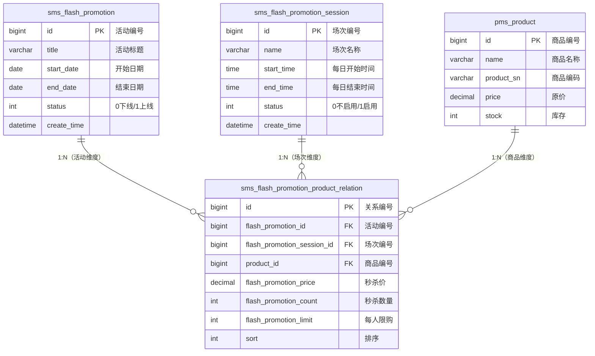
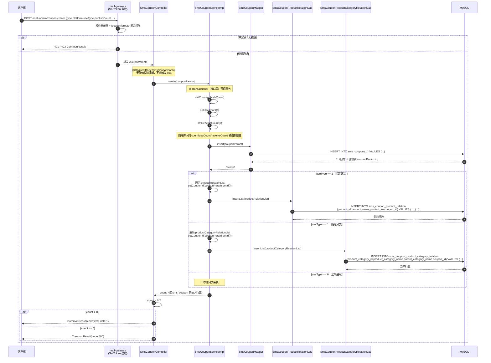
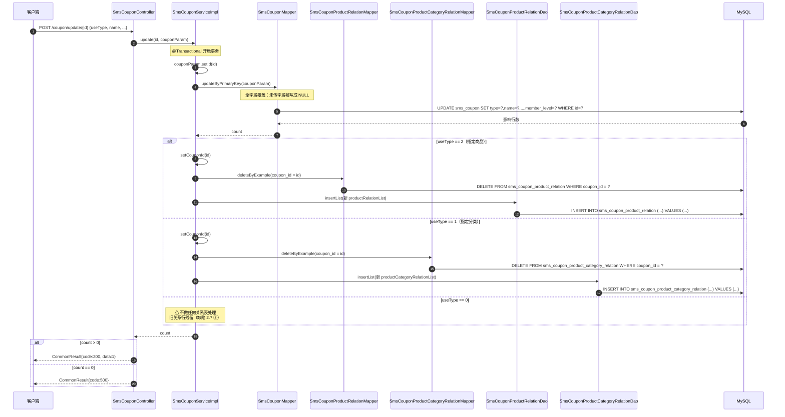
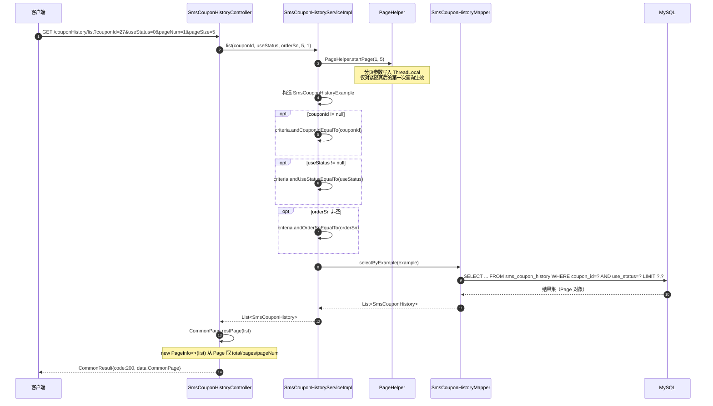
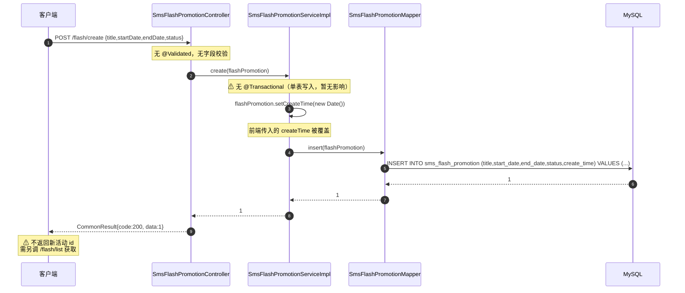
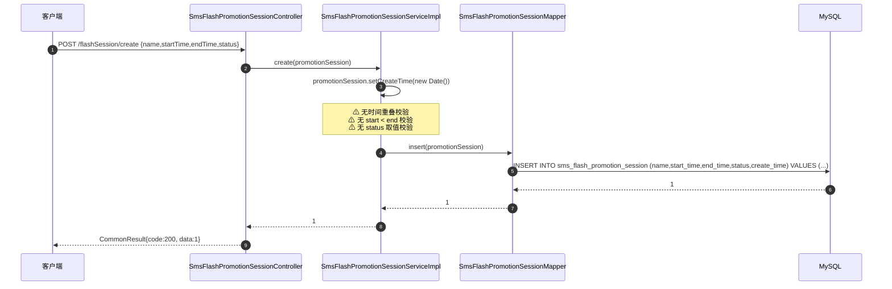
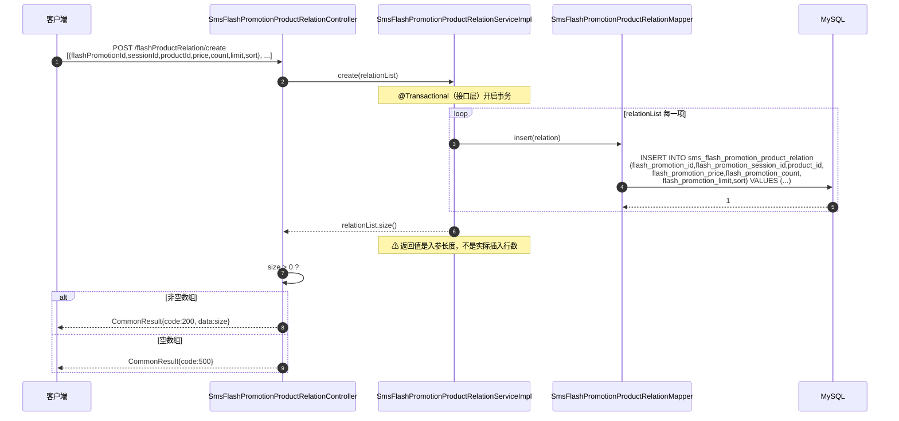
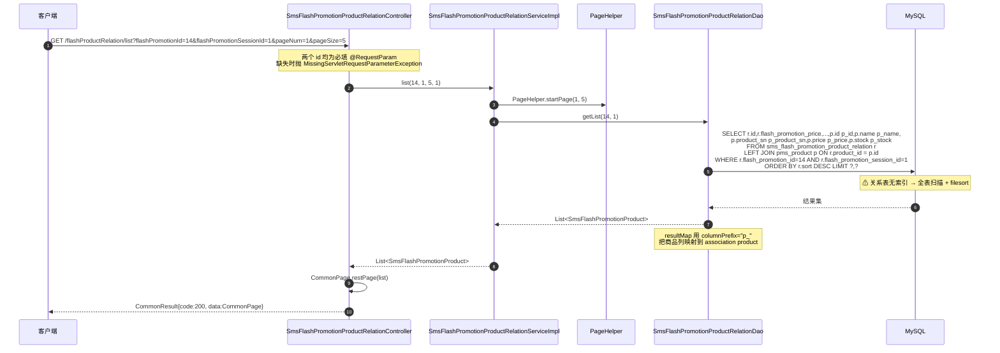
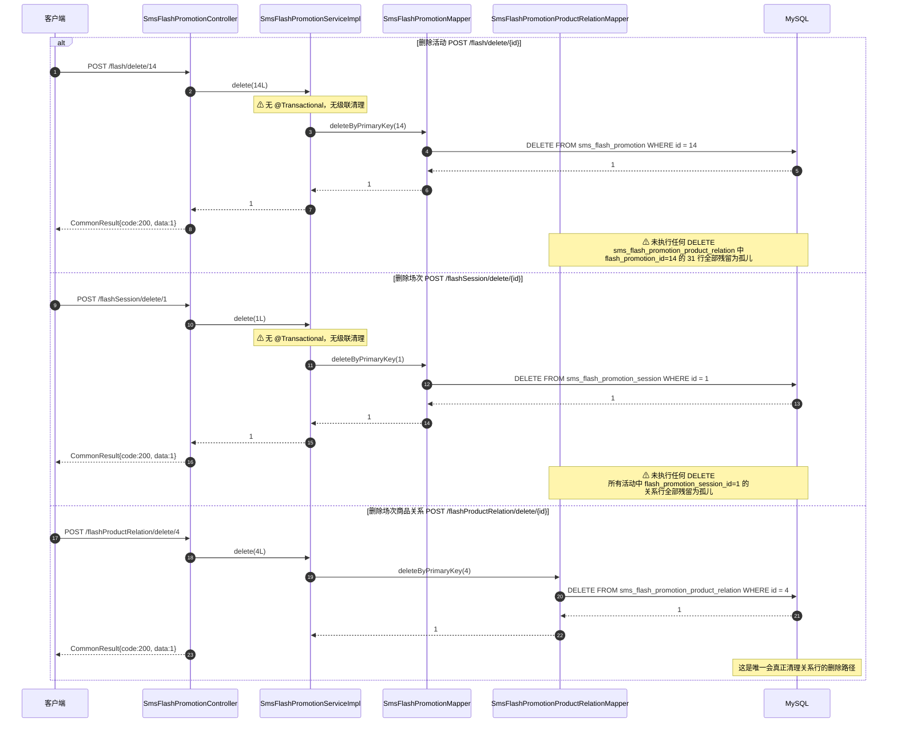

# 详细设计 · 营销 · 优惠券与限时购

| 项目 | 内容 |
| --- | --- |
| 文档编号 | DD-SMS-COUPON-FLASH-001 |
| 所属业务域 | 营销域（`sms`） |
| 涉及服务 | `mall-admin`（:8080）；关联参考 `mall-portal`（:8085） |
| 涉及数据表 | `sms_coupon`、`sms_coupon_history`、`sms_coupon_product_relation`、`sms_coupon_product_category_relation`、`sms_flash_promotion`、`sms_flash_promotion_session`、`sms_flash_promotion_product_relation`、`sms_flash_promotion_log` |
| 接口数量 | 24 个（`SmsCouponController` 5 + `SmsCouponHistoryController` 1 + `SmsFlashPromotionController` 6 + `SmsFlashPromotionSessionController` 7 + `SmsFlashPromotionProductRelationController` 5） |
| 网关前缀 | `/mall-admin/coupon/**`、`/mall-admin/couponHistory/**`、`/mall-admin/flash/**`、`/mall-admin/flashSession/**`、`/mall-admin/flashProductRelation/**` |
| 文档状态 | 待评审 |

---

## 一、概述

### 1.1 范围

本文档描述营销域中「优惠券」与「限时购（秒杀）」两条业务线的后台管理能力详细设计，覆盖：

- **数据库设计**：8 张 `sms_*` 表的结构、字典、约束现状、关联与冗余设计及改进建议
- **接口设计**：24 个 `mall-admin` REST 接口的请求参数、响应结构、数据模型与文档不一致清单
- **包设计**：`mall-admin` / `mall-mbg` / `mall-common` 的包结构与类职责
- **运行流程**：优惠券创建/修改/领取记录查询、限时购活动/场次/商品关系维护、删除时的关联数据处理
- **日志设计**：日志框架与配置、访问日志切面、本模块埋点建议与现有问题
- **测试用例设计**：功能、边界、异常三类用例

**不在本文档范围内**：

- `mall-portal` 前台优惠券领取与使用（`UmsMemberCouponController`）的接口设计 —— 仅作为「谁在写这些表」的关联参考，列于 2.5 与附录 8.1；
- 首页运营位（`sms_home_advertise` / `sms_home_brand` / `sms_home_new_product` / `sms_home_recommend_*`）的设计；
- 秒杀下单链路（`pms_sku_stock.lock_stock` 库存隔离、`oms_order.order_type = 1`）的详细设计。

### 1.2 术语

| 术语 | 含义 |
| --- | --- |
| 优惠券（Coupon） | 一张可被会员领取并在下单时抵扣金额的凭证，主体表 `sms_coupon` |
| 优惠券类型（type） | 券的发放语义：全场赠券 / 会员赠券 / 购物赠券 / 注册赠券 |
| 使用平台（platform） | 券可用的客户端：全部 / 移动 / PC |
| 使用范围（useType） | 券的可用商品范围：全场通用 / 指定分类 / 指定商品。**该字段决定写入哪张关系表** |
| 发行数量（publishCount） | 券计划发行的总张数。建券时被复制到 `count`（剩余可领数） |
| 每人限领（perLimit） | 单个会员最多可领取的张数 |
| 限时购/秒杀（FlashPromotion） | 在指定日期区间、指定每日时段内以秒杀价售卖指定商品的活动 |
| 活动（sms_flash_promotion） | 限时购第一层：定义**日期区间**（`start_date` ~ `end_date`）与上下线状态 |
| 场次（sms_flash_promotion_session） | 限时购第二层：定义**每日时段**（`start_time` ~ `end_time`，`TIME` 类型），全场次共享 |
| 场次商品关系（sms_flash_promotion_product_relation） | 限时购第三层：**活动 + 场次 + 商品**三元组，携带秒杀价、秒杀数量、每人限购、排序 |
| 冗余名称字段 | 关系表中冗余的商品/分类名称快照，用于省去 join |

### 1.3 接口清单总览

| # | 方法 | 路径（服务内） | 网关路径 | 说明 | 控制器 |
| --- | --- | --- | --- | --- | --- |
| 1 | POST | `/coupon/create` | `/mall-admin/coupon/create` | 添加优惠券 | `SmsCouponController` |
| 2 | POST | `/coupon/delete/{id}` | `/mall-admin/coupon/delete/{id}` | 删除优惠券 | `SmsCouponController` |
| 3 | POST | `/coupon/update/{id}` | `/mall-admin/coupon/update/{id}` | 修改优惠券 | `SmsCouponController` |
| 4 | GET | `/coupon/list` | `/mall-admin/coupon/list` | 根据优惠券名称和类型分页获取优惠券列表 | `SmsCouponController` |
| 5 | GET | `/coupon/{id}` | `/mall-admin/coupon/{id}` | 获取单个优惠券的详细信息 | `SmsCouponController` |
| 6 | GET | `/couponHistory/list` | `/mall-admin/couponHistory/list` | 根据优惠券 id、使用状态、订单编号分页获取领取记录 | `SmsCouponHistoryController` |
| 7 | POST | `/flash/create` | `/mall-admin/flash/create` | 添加活动 | `SmsFlashPromotionController` |
| 8 | POST | `/flash/update/{id}` | `/mall-admin/flash/update/{id}` | 编辑活动信息 | `SmsFlashPromotionController` |
| 9 | POST | `/flash/delete/{id}` | `/mall-admin/flash/delete/{id}` | 删除活动信息 | `SmsFlashPromotionController` |
| 10 | POST | `/flash/update/status/{id}` | `/mall-admin/flash/update/status/{id}` | 修改上下线状态 | `SmsFlashPromotionController` |
| 11 | GET | `/flash/{id}` | `/mall-admin/flash/{id}` | 获取活动详情 | `SmsFlashPromotionController` |
| 12 | GET | `/flash/list` | `/mall-admin/flash/list` | 根据活动名称分页查询 | `SmsFlashPromotionController` |
| 13 | POST | `/flashSession/create` | `/mall-admin/flashSession/create` | 添加场次 | `SmsFlashPromotionSessionController` |
| 14 | POST | `/flashSession/update/{id}` | `/mall-admin/flashSession/update/{id}` | 修改场次 | `SmsFlashPromotionSessionController` |
| 15 | POST | `/flashSession/update/status/{id}` | `/mall-admin/flashSession/update/status/{id}` | 修改启用状态 | `SmsFlashPromotionSessionController` |
| 16 | POST | `/flashSession/delete/{id}` | `/mall-admin/flashSession/delete/{id}` | 删除场次 | `SmsFlashPromotionSessionController` |
| 17 | GET | `/flashSession/{id}` | `/mall-admin/flashSession/{id}` | 获取场次详情 | `SmsFlashPromotionSessionController` |
| 18 | GET | `/flashSession/list` | `/mall-admin/flashSession/list` | 获取全部场次 | `SmsFlashPromotionSessionController` |
| 19 | GET | `/flashSession/selectList` | `/mall-admin/flashSession/selectList` | 获取全部可选场次及其数量 | `SmsFlashPromotionSessionController` |
| 20 | POST | `/flashProductRelation/create` | `/mall-admin/flashProductRelation/create` | 批量选择商品添加关联 | `SmsFlashPromotionProductRelationController` |
| 21 | POST | `/flashProductRelation/update/{id}` | `/mall-admin/flashProductRelation/update/{id}` | 修改关联相关信息 | `SmsFlashPromotionProductRelationController` |
| 22 | POST | `/flashProductRelation/delete/{id}` | `/mall-admin/flashProductRelation/delete/{id}` | 删除关联 | `SmsFlashPromotionProductRelationController` |
| 23 | GET | `/flashProductRelation/{id}` | `/mall-admin/flashProductRelation/{id}` | 获取管理商品促销信息 | `SmsFlashPromotionProductRelationController` |
| 24 | GET | `/flashProductRelation/list` | `/mall-admin/flashProductRelation/list` | 分页查询不同场次关联及商品信息 | `SmsFlashPromotionProductRelationController` |

> **鉴权说明**：全部 24 个端点均由 `mall-admin` 提供，网关 `secure.ignore.urls` 白名单（`mall-gateway/src/main/resources/application.yml`）**不含** `/mall-admin/coupon/**`、`/mall-admin/flash**`，因此这些接口**必须携带有效 Token 并通过权限码校验**，匿名访问返回 `code: 401`。

---

## 二、数据库设计

### 2.1 表清单

| 表名 | 类型 | 说明 | 本模块操作 |
| --- | --- | --- | --- |
| `sms_coupon` | 主表 | 优惠券表 | 增、删、改、查 |
| `sms_coupon_history` | 从表 | 优惠券使用、领取历史表 | **只读**（后台分页查询；写入方是 `mall-portal`） |
| `sms_coupon_product_relation` | 关系表 | 优惠券和产品的关系表（`use_type=2`） | 批量增、条件删、join 读 |
| `sms_coupon_product_category_relation` | 关系表 | 优惠券和产品分类关系表（`use_type=1`） | 批量增、条件删、join 读 |
| `sms_flash_promotion` | 主表 | 限时购表（活动层） | 增、删、改、查 |
| `sms_flash_promotion_session` | 主表 | 限时购场次表（场次层） | 增、删、改、查 |
| `sms_flash_promotion_product_relation` | 关系表 | 商品限时购与商品关系表（场次商品层） | 增、改、删、查 |
| `sms_flash_promotion_log` | 从表 | 限时购通知记录（秒杀订阅提醒） | **本模块无任何读写代码**（见 2.7 ⑮） |

### 2.2 建表语句（现状）

> 以下 DDL 与 `document/sql/mall.sql` 完全一致，原文照抄。

```sql
DROP TABLE IF EXISTS `sms_coupon`;
CREATE TABLE `sms_coupon`  (
  `id` bigint(20) NOT NULL AUTO_INCREMENT,
  `type` int(1) NULL DEFAULT NULL COMMENT '优惠券类型；0->全场赠券；1->会员赠券；2->购物赠券；3->注册赠券',
  `name` varchar(100) CHARACTER SET utf8 COLLATE utf8_general_ci NULL DEFAULT NULL,
  `platform` int(1) NULL DEFAULT NULL COMMENT '使用平台：0->全部；1->移动；2->PC',
  `count` int(11) NULL DEFAULT NULL COMMENT '数量',
  `amount` decimal(10, 2) NULL DEFAULT NULL COMMENT '金额',
  `per_limit` int(11) NULL DEFAULT NULL COMMENT '每人限领张数',
  `min_point` decimal(10, 2) NULL DEFAULT NULL COMMENT '使用门槛；0表示无门槛',
  `start_time` datetime NULL DEFAULT NULL,
  `end_time` datetime NULL DEFAULT NULL,
  `use_type` int(1) NULL DEFAULT NULL COMMENT '使用类型：0->全场通用；1->指定分类；2->指定商品',
  `note` varchar(200) CHARACTER SET utf8 COLLATE utf8_general_ci NULL DEFAULT NULL COMMENT '备注',
  `publish_count` int(11) NULL DEFAULT NULL COMMENT '发行数量',
  `use_count` int(11) NULL DEFAULT NULL COMMENT '已使用数量',
  `receive_count` int(11) NULL DEFAULT NULL COMMENT '领取数量',
  `enable_time` datetime NULL DEFAULT NULL COMMENT '可以领取的日期',
  `code` varchar(64) CHARACTER SET utf8 COLLATE utf8_general_ci NULL DEFAULT NULL COMMENT '优惠码',
  `member_level` int(1) NULL DEFAULT NULL COMMENT '可领取的会员类型：0->无限时',
  PRIMARY KEY (`id`) USING BTREE
) ENGINE = InnoDB AUTO_INCREMENT = 32 CHARACTER SET = utf8 COLLATE = utf8_general_ci COMMENT = '优惠券表' ROW_FORMAT = DYNAMIC;
```

```sql
DROP TABLE IF EXISTS `sms_coupon_history`;
CREATE TABLE `sms_coupon_history`  (
  `id` bigint(20) NOT NULL AUTO_INCREMENT,
  `coupon_id` bigint(20) NULL DEFAULT NULL,
  `member_id` bigint(20) NULL DEFAULT NULL,
  `coupon_code` varchar(64) CHARACTER SET utf8 COLLATE utf8_general_ci NULL DEFAULT NULL,
  `member_nickname` varchar(64) CHARACTER SET utf8 COLLATE utf8_general_ci NULL DEFAULT NULL COMMENT '领取人昵称',
  `get_type` int(1) NULL DEFAULT NULL COMMENT '获取类型：0->后台赠送；1->主动获取',
  `create_time` datetime NULL DEFAULT NULL,
  `use_status` int(1) NULL DEFAULT NULL COMMENT '使用状态：0->未使用；1->已使用；2->已过期',
  `use_time` datetime NULL DEFAULT NULL COMMENT '使用时间',
  `order_id` bigint(20) NULL DEFAULT NULL COMMENT '订单编号',
  `order_sn` varchar(100) CHARACTER SET utf8 COLLATE utf8_general_ci NULL DEFAULT NULL COMMENT '订单号码',
  PRIMARY KEY (`id`) USING BTREE,
  INDEX `idx_member_id`(`member_id`) USING BTREE,
  INDEX `idx_coupon_id`(`coupon_id`) USING BTREE
) ENGINE = InnoDB AUTO_INCREMENT = 53 CHARACTER SET = utf8 COLLATE = utf8_general_ci COMMENT = '优惠券使用、领取历史表' ROW_FORMAT = DYNAMIC;
```

```sql
DROP TABLE IF EXISTS `sms_coupon_product_category_relation`;
CREATE TABLE `sms_coupon_product_category_relation`  (
  `id` bigint(20) NOT NULL AUTO_INCREMENT,
  `coupon_id` bigint(20) NULL DEFAULT NULL,
  `product_category_id` bigint(20) NULL DEFAULT NULL,
  `product_category_name` varchar(200) CHARACTER SET utf8 COLLATE utf8_general_ci NULL DEFAULT NULL COMMENT '产品分类名称',
  `parent_category_name` varchar(200) CHARACTER SET utf8 COLLATE utf8_general_ci NULL DEFAULT NULL COMMENT '父分类名称',
  PRIMARY KEY (`id`) USING BTREE
) ENGINE = InnoDB AUTO_INCREMENT = 12 CHARACTER SET = utf8 COLLATE = utf8_general_ci COMMENT = '优惠券和产品分类关系表' ROW_FORMAT = DYNAMIC;
```

```sql
DROP TABLE IF EXISTS `sms_coupon_product_relation`;
CREATE TABLE `sms_coupon_product_relation`  (
  `id` bigint(20) NOT NULL AUTO_INCREMENT,
  `coupon_id` bigint(20) NULL DEFAULT NULL,
  `product_id` bigint(20) NULL DEFAULT NULL,
  `product_name` varchar(500) CHARACTER SET utf8 COLLATE utf8_general_ci NULL DEFAULT NULL COMMENT '商品名称',
  `product_sn` varchar(200) CHARACTER SET utf8 COLLATE utf8_general_ci NULL DEFAULT NULL COMMENT '商品编码',
  PRIMARY KEY (`id`) USING BTREE
) ENGINE = InnoDB AUTO_INCREMENT = 23 CHARACTER SET = utf8 COLLATE = utf8_general_ci COMMENT = '优惠券和产品的关系表' ROW_FORMAT = DYNAMIC;
```

```sql
DROP TABLE IF EXISTS `sms_flash_promotion`;
CREATE TABLE `sms_flash_promotion`  (
  `id` bigint(20) NOT NULL AUTO_INCREMENT,
  `title` varchar(200) CHARACTER SET utf8 COLLATE utf8_general_ci NULL DEFAULT NULL COMMENT '秒杀时间段名称',
  `start_date` date NULL DEFAULT NULL COMMENT '开始日期',
  `end_date` date NULL DEFAULT NULL COMMENT '结束日期',
  `status` int(1) NULL DEFAULT NULL COMMENT '上下线状态',
  `create_time` datetime NULL DEFAULT NULL COMMENT '创建时间',
  PRIMARY KEY (`id`) USING BTREE
) ENGINE = InnoDB AUTO_INCREMENT = 15 CHARACTER SET = utf8 COLLATE = utf8_general_ci COMMENT = '限时购表' ROW_FORMAT = DYNAMIC;
```

```sql
DROP TABLE IF EXISTS `sms_flash_promotion_log`;
CREATE TABLE `sms_flash_promotion_log`  (
  `id` int(11) NOT NULL AUTO_INCREMENT,
  `member_id` int(11) NULL DEFAULT NULL,
  `product_id` bigint(20) NULL DEFAULT NULL,
  `member_phone` varchar(64) CHARACTER SET utf8 COLLATE utf8_general_ci NULL DEFAULT NULL,
  `product_name` varchar(100) CHARACTER SET utf8 COLLATE utf8_general_ci NULL DEFAULT NULL,
  `subscribe_time` datetime NULL DEFAULT NULL COMMENT '会员订阅时间',
  `send_time` datetime NULL DEFAULT NULL,
  PRIMARY KEY (`id`) USING BTREE
) ENGINE = InnoDB AUTO_INCREMENT = 1 CHARACTER SET = utf8 COLLATE = utf8_general_ci COMMENT = '限时购通知记录' ROW_FORMAT = DYNAMIC;
```

```sql
DROP TABLE IF EXISTS `sms_flash_promotion_product_relation`;
CREATE TABLE `sms_flash_promotion_product_relation`  (
  `id` bigint(20) NOT NULL AUTO_INCREMENT COMMENT '编号',
  `flash_promotion_id` bigint(20) NULL DEFAULT NULL,
  `flash_promotion_session_id` bigint(20) NULL DEFAULT NULL COMMENT '编号',
  `product_id` bigint(20) NULL DEFAULT NULL,
  `flash_promotion_price` decimal(10, 2) NULL DEFAULT NULL COMMENT '限时购价格',
  `flash_promotion_count` int(11) NULL DEFAULT NULL COMMENT '限时购数量',
  `flash_promotion_limit` int(11) NULL DEFAULT NULL COMMENT '每人限购数量',
  `sort` int(11) NULL DEFAULT NULL COMMENT '排序',
  PRIMARY KEY (`id`) USING BTREE
) ENGINE = InnoDB AUTO_INCREMENT = 52 CHARACTER SET = utf8 COLLATE = utf8_general_ci COMMENT = '商品限时购与商品关系表' ROW_FORMAT = DYNAMIC;
```

```sql
DROP TABLE IF EXISTS `sms_flash_promotion_session`;
CREATE TABLE `sms_flash_promotion_session`  (
  `id` bigint(20) NOT NULL AUTO_INCREMENT COMMENT '编号',
  `name` varchar(200) CHARACTER SET utf8 COLLATE utf8_general_ci NULL DEFAULT NULL COMMENT '场次名称',
  `start_time` time NULL DEFAULT NULL COMMENT '每日开始时间',
  `end_time` time NULL DEFAULT NULL COMMENT '每日结束时间',
  `status` int(1) NULL DEFAULT NULL COMMENT '启用状态：0->不启用；1->启用',
  `create_time` datetime NULL DEFAULT NULL COMMENT '创建时间',
  PRIMARY KEY (`id`) USING BTREE
) ENGINE = InnoDB AUTO_INCREMENT = 8 CHARACTER SET = utf8 COLLATE = utf8_general_ci COMMENT = '限时购场次表' ROW_FORMAT = DYNAMIC;
```

### 2.3 字段说明

#### 2.3.1 `sms_coupon`（优惠券表）

| 字段 | 类型 | 允许空 | 默认值 | 中文名 | 说明 |
| --- | --- | --- | --- | --- | --- |
| `id` | bigint(20) | 否 | AUTO_INCREMENT | 主键 | 优惠券唯一标识 |
| `type` | int(1) | 是 | NULL | 优惠券类型 | 0 全场赠券 / 1 会员赠券 / 2 购物赠券 / 3 注册赠券 |
| `name` | varchar(100) | 是 | NULL | 优惠券名称 | **无列注释**；代码按 `name` 模糊查询 |
| `platform` | int(1) | 是 | NULL | 使用平台 | 0 全部 / 1 移动 / 2 PC |
| `count` | int(11) | 是 | NULL | 剩余数量 | **无列注释**；`create` 时被赋值为 `publish_count`，领取时递减 |
| `amount` | decimal(10,2) | 是 | NULL | 金额 | 券面抵扣金额 |
| `per_limit` | int(11) | 是 | NULL | 每人限领张数 | 后台建券时写入；领取时由 `mall-portal` 校验 |
| `min_point` | decimal(10,2) | 是 | NULL | 使用门槛 | 0 表示无门槛 |
| `start_time` | datetime | 是 | NULL | 有效期开始 | **无列注释** |
| `end_time` | datetime | 是 | NULL | 有效期结束 | **无列注释** |
| `use_type` | int(1) | 是 | NULL | 使用类型 | 0 全场通用 / 1 指定分类 / 2 指定商品 |
| `note` | varchar(200) | 是 | NULL | 备注 | — |
| `publish_count` | int(11) | 是 | NULL | 发行数量 | 建券时复制到 `count`，自身不再变更 |
| `use_count` | int(11) | 是 | NULL | 已使用数量 | 建券时置 0；**后台无维护代码**，由前台使用链路维护 |
| `receive_count` | int(11) | 是 | NULL | 领取数量 | 建券时置 0；领取时 +1 |
| `enable_time` | datetime | 是 | NULL | 可以领取的日期 | 领取起始时间，早于该时间不可领 |
| `code` | varchar(64) | 是 | NULL | 优惠码 | 后台录入的券码，与 `sms_coupon_history.coupon_code`（动态生成）不是同一概念 |
| `member_level` | int(1) | 是 | NULL | 可领取的会员类型 | 列注释仅给出 `0->无限时`，取值语义不完整（见 2.4 与 2.7 ④） |

#### 2.3.2 `sms_coupon_history`（优惠券领取/使用历史表）

| 字段 | 类型 | 允许空 | 默认值 | 中文名 | 说明 |
| --- | --- | --- | --- | --- | --- |
| `id` | bigint(20) | 否 | AUTO_INCREMENT | 主键 | 历史记录标识 |
| `coupon_id` | bigint(20) | 是 | NULL | 优惠券编号 | 逻辑外键 → `sms_coupon.id` |
| `member_id` | bigint(20) | 是 | NULL | 会员编号 | 逻辑外键 → `ums_member.id` |
| `coupon_code` | varchar(64) | 是 | NULL | 优惠券码 | 领取时由 `UmsMemberCouponServiceImpl.generateCouponCode()` 生成：时间戳后 8 位 + 4 位随机数 + 会员 id 后 4 位 |
| `member_nickname` | varchar(64) | 是 | NULL | 领取人昵称 | 领取时快照 |
| `get_type` | int(1) | 是 | NULL | 获取类型 | 0 后台赠送 / 1 主动获取 |
| `create_time` | datetime | 是 | NULL | 领取时间 | **无列注释** |
| `use_status` | int(1) | 是 | NULL | 使用状态 | 0 未使用 / 1 已使用 / 2 已过期 |
| `use_time` | datetime | 是 | NULL | 使用时间 | — |
| `order_id` | bigint(20) | 是 | NULL | 订单编号 | 使用时可关联 `oms_order.id` |
| `order_sn` | varchar(100) | 是 | NULL | 订单号码 | 使用时可关联 `oms_order.order_sn` |

#### 2.3.3 `sms_coupon_product_relation`（优惠券-商品关系表）

| 字段 | 类型 | 允许空 | 默认值 | 中文名 | 说明 |
| --- | --- | --- | --- | --- | --- |
| `id` | bigint(20) | 否 | AUTO_INCREMENT | 主键 | 关系标识 |
| `coupon_id` | bigint(20) | 是 | NULL | 优惠券编号 | 逻辑外键 → `sms_coupon.id` |
| `product_id` | bigint(20) | 是 | NULL | 商品编号 | 逻辑外键 → `pms_product.id` |
| `product_name` | varchar(500) | 是 | NULL | 商品名称 | **冗余快照**，省去 join `pms_product` |
| `product_sn` | varchar(200) | 是 | NULL | 商品编码 | **冗余快照**，省去 join `pms_product` |

#### 2.3.4 `sms_coupon_product_category_relation`（优惠券-商品分类关系表）

| 字段 | 类型 | 允许空 | 默认值 | 中文名 | 说明 |
| --- | --- | --- | --- | --- | --- |
| `id` | bigint(20) | 否 | AUTO_INCREMENT | 主键 | 关系标识 |
| `coupon_id` | bigint(20) | 是 | NULL | 优惠券编号 | 逻辑外键 → `sms_coupon.id` |
| `product_category_id` | bigint(20) | 是 | NULL | 商品分类编号 | 逻辑外键 → `pms_product_category.id` |
| `product_category_name` | varchar(200) | 是 | NULL | 产品分类名称 | **冗余快照** |
| `parent_category_name` | varchar(200) | 是 | NULL | 父分类名称 | **冗余快照**（冗余两级，用于列表展示「手机数码 / 手机通讯」） |

#### 2.3.5 `sms_flash_promotion`（限时购活动表）

| 字段 | 类型 | 允许空 | 默认值 | 中文名 | 说明 |
| --- | --- | --- | --- | --- | --- |
| `id` | bigint(20) | 否 | AUTO_INCREMENT | 主键 | 活动标识 |
| `title` | varchar(200) | 是 | NULL | 秒杀时间段名称 | 活动标题；列表按 `title` 模糊查询 |
| `start_date` | date | 是 | NULL | 开始日期 | **DATE 类型，不含时分秒** |
| `end_date` | date | 是 | NULL | 结束日期 | **DATE 类型**；前台按 `start_date <= 今天 <= end_date` 判定活动进行中 |
| `status` | int(1) | 是 | NULL | 上下线状态 | 列注释缺失；由前台 `andStatusEqualTo(1)` 推断：0 下线 / 1 上线（见 2.4） |
| `create_time` | datetime | 是 | NULL | 创建时间 | 由 `SmsFlashPromotionServiceImpl.create()` 写入 `new Date()` |

#### 2.3.6 `sms_flash_promotion_session`（限时购场次表）

| 字段 | 类型 | 允许空 | 默认值 | 中文名 | 说明 |
| --- | --- | --- | --- | --- | --- |
| `id` | bigint(20) | 否 | AUTO_INCREMENT | 编号 | 场次标识 |
| `name` | varchar(200) | 是 | NULL | 场次名称 | 如 `8:00`、`10:00` |
| `start_time` | time | 是 | NULL | 每日开始时间 | **TIME 类型**，每日循环；场次不与具体日期绑定 |
| `end_time` | time | 是 | NULL | 每日结束时间 | **TIME 类型** |
| `status` | int(1) | 是 | NULL | 启用状态 | 0 不启用 / 1 启用 |
| `create_time` | datetime | 是 | NULL | 创建时间 | 由 `SmsFlashPromotionSessionServiceImpl.create()` 写入 `new Date()` |

#### 2.3.7 `sms_flash_promotion_product_relation`（场次商品关系表）

| 字段 | 类型 | 允许空 | 默认值 | 中文名 | 说明 |
| --- | --- | --- | --- | --- | --- |
| `id` | bigint(20) | 否 | AUTO_INCREMENT | 编号 | 关系标识 |
| `flash_promotion_id` | bigint(20) | 是 | NULL | 活动编号 | 逻辑外键 → `sms_flash_promotion.id` |
| `flash_promotion_session_id` | bigint(20) | 是 | NULL | 场次编号 | 逻辑外键 → `sms_flash_promotion_session.id`（列注释误写为「编号」） |
| `product_id` | bigint(20) | 是 | NULL | 商品编号 | 逻辑外键 → `pms_product.id` |
| `flash_promotion_price` | decimal(10,2) | 是 | NULL | 限时购价格 | 秒杀价；**DDL 允许 NULL**，种子数据中存在大量 NULL 行 |
| `flash_promotion_count` | int(11) | 是 | NULL | 限时购数量 | 该场次该商品的秒杀投放量；**DDL 允许 NULL** |
| `flash_promotion_limit` | int(11) | 是 | NULL | 每人限购数量 | **DDL 允许 NULL** |
| `sort` | int(11) | 是 | NULL | 排序 | 列表按 `r.sort DESC` 排序 |

#### 2.3.8 `sms_flash_promotion_log`（限时购通知记录表）

| 字段 | 类型 | 允许空 | 默认值 | 中文名 | 说明 |
| --- | --- | --- | --- | --- | --- |
| `id` | int(11) | 否 | AUTO_INCREMENT | 主键 | 记录标识（**`int` 而非 `bigint`**，与其他表不一致） |
| `member_id` | int(11) | 是 | NULL | 会员编号 | **`int` 而非 `bigint`**，与 `ums_member.id`（bigint）类型不一致 |
| `product_id` | bigint(20) | 是 | NULL | 商品编号 | 逻辑外键 → `pms_product.id` |
| `member_phone` | varchar(64) | 是 | NULL | 会员手机号 | 短信提醒用 |
| `product_name` | varchar(100) | 是 | NULL | 商品名称 | **冗余快照** |
| `subscribe_time` | datetime | 是 | NULL | 会员订阅时间 | 订阅秒杀提醒的时刻 |
| `send_time` | datetime | 是 | NULL | 发送时间 | 提醒短信发送时刻 |

### 2.4 状态字典

| 字段 | 值 | 含义 | 来源 |
| --- | --- | --- | --- |
| `sms_coupon.type` | 0 | 全场赠券 | `mall.sql` 列注释 + `SmsCoupon.type` 的 `@Schema` |
| `sms_coupon.type` | 1 | 会员赠券 | 同上 |
| `sms_coupon.type` | 2 | 购物赠券 | 同上 |
| `sms_coupon.type` | 3 | 注册赠券 | 同上 |
| `sms_coupon.platform` | 0 | 全部 | `mall.sql` 列注释 |
| `sms_coupon.platform` | 1 | 移动 | 同上 |
| `sms_coupon.platform` | 2 | PC | 同上 |
| `sms_coupon.use_type` | 0 | 全场通用 | `mall.sql` 列注释 |
| `sms_coupon.use_type` | 1 | 指定分类 | 同上 |
| `sms_coupon.use_type` | 2 | 指定商品 | 同上 |
| `sms_coupon.member_level` | 0 | 无限时（可直接领取，不校验会员等级） | `mall.sql` 列注释（**注释不完整**，见 2.7 ④） |
| `sms_coupon_history.use_status` | 0 | 未使用 | `mall.sql` 列注释 |
| `sms_coupon_history.use_status` | 1 | 已使用 | 同上 |
| `sms_coupon_history.use_status` | 2 | 已过期 | 同上 |
| `sms_coupon_history.get_type` | 0 | 后台赠送 | `mall.sql` 列注释 |
| `sms_coupon_history.get_type` | 1 | 主动获取 | 同上 |
| `sms_flash_promotion.status` | 0 | 下线 | **`mall.sql` 无列注释**；由前台 `HomeServiceImpl.getFlashPromotion()` 的 `andStatusEqualTo(1)` 与同名 `flashSession.status` 语义推断 |
| `sms_flash_promotion.status` | 1 | 上线 | 同上 |
| `sms_flash_promotion_session.status` | 0 | 不启用 | `mall.sql` 列注释 |
| `sms_flash_promotion_session.status` | 1 | 启用 | 同上；`SmsFlashPromotionSessionServiceImpl.selectList()` 用 `andStatusEqualTo(1)` 过滤 |

> **说明**：`sms_coupon_history` 的 `use_status = 2`（已过期）**没有任何代码主动写入**。`SmsCouponHistoryMapper` 只有 CRUD，仓库内不存在把过期券标记为 2 的定时任务或 SQL；前台查询过期券是靠 `SmsCouponHistoryDao.xml` 的 `NOW() > c.end_time` 条件现算（见 2.5）。

### 2.5 关联与冗余设计

#### 2.5.1 优惠券：一主表 + 双关系表

```
                        ┌──────────────────────────────┐
                        │        sms_coupon            │
                        │  id / type / platform        │
                        │  use_type  ◄── 决定走哪张关系表 │
                        │  publish_count / count       │
                        │  per_limit / enable_time     │
                        └───────────┬──────────────────┘
                                    │
        use_type = 2                │                use_type = 1
   （指定商品）                      │          （指定分类）
                ┌───────────────────┴───────────────────┐
                ▼                                       ▼
 ┌───────────────────────────────┐   ┌──────────────────────────────────────┐
 │ sms_coupon_product_relation   │   │ sms_coupon_product_category_relation │
 │  coupon_id  ──► sms_coupon.id │   │  coupon_id        ──► sms_coupon.id  │
 │  product_id ──► pms_product.id│   │  product_category_id ──► pms_...id   │
 │  product_name  （冗余快照）    │   │  product_category_name（冗余快照）    │
 │  product_sn    （冗余快照）    │   │  parent_category_name （冗余快照）    │
 └───────────────────────────────┘   └──────────────────────────────────────┘
        use_type = 0 （全场通用）→ 两张关系表都不写入任何行

 sms_coupon_history.coupon_id ──► sms_coupon.id      （逻辑外键，写入方是 mall-portal）
 sms_coupon_history.member_id ──► ums_member.id      （逻辑外键）
```

**关键设计点：`

use_type` 是「路由字段」，而不是「过滤字段」。**

- `SmsCouponServiceImpl.create()` / `update()` 通过 `if (couponParam.getUseType().equals(2))` 与 `if (...equals(1))` 决定是否向对应关系表写入；`use_type = 0` 时两张关系表都不写。
- 因此 **`use_type` 与关系表的行必须保持同步**。而 `update()` 只在 `use_type` 为 1 或 2 时执行「先删后插」，**`use_type` 改为 0 时不会清理旧关系行**，形成脏数据（见 2.7 ③）。

**关键设计点：关系表冗余名称字段是刻意为之。**

- 券详情/券列表在后台需要直接展示商品名、商品编码、分类名、父分类名。若每次 join `pms_product` / `pms_product_category`，一券 N 商品会产生 N 次 join 放大。
- 代价是一致性：**商品改名、分类改名、商品编码变更后，关系表中的冗余快照不会同步**，后台券详情会显示旧名称。仓库内**不存在**任何同步这两张关系表冗余字段的代码（`PmsBrandServiceImpl.updateBrand()` 同步的是 `pms_product.brand_name`，与券关系表无关）。
- `SmsCouponDao.xml` 的 `getItem` 直接用这些冗余列做结果映射，**不 join 商品/分类表**，说明冗余就是为省 join 而设计的：

```sql
-- mall-admin/src/main/resources/dao/SmsCouponDao.xml  getItem
SELECT
    c.*,
    cpr.id                   cpr_id,
    cpr.product_id           cpr_product_id,
    cpr.product_name         cpr_product_name,
    cpr.product_sn           cpr_product_sn,
    cpcr.id                  cpcr_id,
    cpcr.product_category_id cpcr_product_category_id,
    cpcr.product_category_name cpcr_product_category_name,
    cpcr.parent_category_name cpcr_parent_category_name
FROM
    sms_coupon c
    LEFT JOIN sms_coupon_product_relation cpr ON c.id = cpr.coupon_id
    LEFT JOIN sms_coupon_product_category_relation cpcr ON c.id = cpcr.coupon_id
WHERE
    c.id = #{id}
```

> **注意**：`getItem` 使用 `c.*` + 两条 `LEFT JOIN` 的**笛卡尔积**返回结果集：若一券有 M 条商品关系、N 条分类关系，DB 会返回 M×N 行，由 MyBatis 的 `<collection>` 去重合并。当 `use_type` 与关系表不同步（③）时，会出现「全场通用券却带出旧商品关系」的现象。

#### 2.5.2 限时购：三层模型

**这是本模块最核心的模型。三层各司其职，缺一不可。**



**三层语义对照**：

| 层 | 表 | 定义什么 | 时间维度 | 数量级 |
| --- | --- | --- | --- | --- |
| 第一层 活动 | `sms_flash_promotion` | 「哪几天做秒杀」 | `start_date` ~ `end_date`（DATE，天粒度） | 少（种子数据 1 条有效活动） |
| 第二层 场次 | `sms_flash_promotion_session` | 「每天哪两个小时做秒杀」 | `start_time` ~ `end_time`（TIME，**与日期无关，全局共享**） | 少（种子数据 7 条：8:00 ~ 22:00 每两小时一场） |
| 第三层 场次商品 | `sms_flash_promotion_product_relation` | 「某活动的某场次卖哪些商品、什么价、卖多少、每人限购几件」 | 无独立时间字段，时间由「活动 × 场次」共同推导 | 多（种子数据 51 条） |

**由此推导出的关键结论（务必注意）**：

1. **场次是全局字典，不隶属于任何活动。** `sms_flash_promotion_session` 没有 `flash_promotion_id` 外键，7 个场次对所有活动生效。同一个场次（如 `10:00`）可以在活动 A 与活动 B 下各自挂一批商品，由关系表的 `flash_promotion_id` 区分。
2. **`flash_promotion_session_id` 单独使用无意义。** 任何按场次的查询都必须同时带 `flash_promotion_id`。`SmsFlashPromotionProductRelationDao.xml` 的 `getList` 正是双条件：

```sql
-- mall-admin/src/main/resources/dao/SmsFlashPromotionProductRelationDao.xml  getList
SELECT
    r.id,
    r.flash_promotion_price,
    r.flash_promotion_count,
    r.flash_promotion_limit,
    r.flash_promotion_id,
    r.flash_promotion_session_id,
    r.product_id,
    r.sort,
    p.id p_id,
    p.`name` p_name,
    p.product_sn p_product_sn,
    p.price p_price,
    p.stock p_stock
FROM
    sms_flash_promotion_product_relation r
    LEFT JOIN pms_product p ON r.product_id = p.id
WHERE
    r.flash_promotion_id = #{flashPromotionId}
    AND r.flash_promotion_session_id = #{flashPromotionSessionId}
ORDER BY r.sort DESC
```

3. **「当前正在进行的秒杀」由前台两步推导**（`mall-portal` 的 `HomeServiceImpl.getHomeFlashPromotion()`）：先按 `status=1 AND start_date <= 今天 AND end_date >= 今天` 取活动，再按 `start_time <= 当前时刻 <= end_time` 取场次，最后用「活动 id + 场次 id」查关系表。
4. **本模块没有「活动 ↔ 场次」的绑定关系。** 后台无法配置「活动 A 只启用 8:00 和 10:00 两场」；所有 `status=1` 的场次对所有上线活动都生效。`SmsFlashPromotionSessionServiceImpl.selectList(flashPromotionId)` 只是给每个启用场次补算「该活动下已挂多少商品」，**并不表示绑定**。

**冗余与关联**：

```
sms_flash_promotion_product_relation.flash_promotion_id
        ──► sms_flash_promotion.id            （逻辑外键，无 DDL 约束）
sms_flash_promotion_product_relation.flash_promotion_session_id
        ──► sms_flash_promotion_session.id    （逻辑外键，无 DDL 约束）
sms_flash_promotion_product_relation.product_id
        ──► pms_product.id                    （逻辑外键，无 DDL 约束）
sms_flash_promotion_log.product_id ──► pms_product.id   （秒杀订阅提醒，本模块无读写代码）
sms_flash_promotion_log.product_name ─► pms_product.name（冗余快照）
```

> **限时购关系表不冗余商品名称**：与优惠券关系表不同，`sms_flash_promotion_product_relation` **只有 `product_id`**，展示商品名必须 join `pms_product`（`SmsFlashPromotionProductRelationDao.xml` 与 `mall-portal/HomeDao.xml` 的 `getFlashProductList` 都做了 join）。

### 2.6 索引与约束现状

| 表 | 主键 | 唯一索引 | 普通索引 | 外键约束 | 非空约束 | 逻辑删除 |
| --- | --- | --- | --- | --- | --- | --- |
| `sms_coupon` | `id` | **无** | **无** | **无** | 仅 `id` | 无 |
| `sms_coupon_history` | `id` | **无** | `idx_member_id(member_id)`、`idx_coupon_id(coupon_id)` | **无** | 仅 `id` | 无 |
| `sms_coupon_product_relation` | `id` | **无** | **无** | **无** | 仅 `id` | 无 |
| `sms_coupon_product_category_relation` | `id` | **无** | **无** | **无** | 仅 `id` | 无 |
| `sms_flash_promotion` | `id` | **无** | **无** | **无** | 仅 `id` | 无 |
| `sms_flash_promotion_session` | `id` | **无** | **无** | **无** | 仅 `id` | 无 |
| `sms_flash_promotion_product_relation` | `id` | **无** | **无** | **无** | 仅 `id` | 无 |
| `sms_flash_promotion_log` | `id` | **无** | **无** | **无** | 仅 `id` | 无 |

**索引影响分析（结合真实查询）**：

| 查询来源 | SQL 条件 | 现有可用索引 | 影响 |
| --- | --- | --- | --- |
| `SmsCouponServiceImpl.list` | `name like '%?%'` / `type = ?` | 无 | 全表扫描；前缀通配 `%?%` 本身也无法走索引 |
| `SmsCouponDao.getItem` | `c.id = ?` + 两表 join `on coupon_id` | 主键（仅 `sms_coupon`） | 两张关系表的 join 均全表扫描 |
| `SmsCouponServiceImpl.deleteProductRelation` | `delete from sms_coupon_product_relation where coupon_id = ?` | **无** | 全表扫描 + 行锁范围大 |
| `SmsCouponServiceImpl.deleteProductCategoryRelation` | `delete from sms_coupon_product_category_relation where coupon_id = ?` | **无** | 同上 |
| `SmsCouponHistoryServiceImpl.list` | `coupon_id = ?` / `use_status = ?` / `order_sn = ?` | `idx_coupon_id` | `coupon_id` 可走索引；`use_status`、`order_sn` 无索引（`order_sn` 应可走唯一性检索，当前全表扫描） |
| `SmsFlashPromotionProductRelationDao.getList` | `flash_promotion_id = ? AND flash_promotion_session_id = ?` | **无** | 全表扫描，是前台首页每次刷新都会触发的热查询 |
| `SmsFlashPromotionProductRelationServiceImpl.getCount` | `count(*) where flash_promotion_id = ? and flash_promotion_session_id = ?` | **无** | 全表扫描；`/flashSession/selectList` 内部对**每个启用场次**调一次，N 场次 = N 次全表扫描 |
| `SmsFlashPromotionServiceImpl.list` | `title like '%?%'` | 无 | 全表扫描 |

### 2.7 设计问题与建议

| # | 问题 | 影响 | 建议 |
| --- | --- | --- | --- |
| ① | `sms_coupon.type` / `platform` / `use_type` / `member_level` **后台无任何取值校验** | `SmsCouponParam` 未加 `@FlagValidator`，传入 `type=99`、`use_type=7` 也会成功写库 | DTO 上补 `@FlagValidator(value = {"0","1","2","3"})` 等；Service 层再兜底校验 |
| ② | `create` 中 `count`、`useCount`、`receiveCount` 被强制覆盖，`publishCount` 为 NULL 时 `setCount(null)` | `count` 为 NULL 后前台领取判 `coupon.getCount()<=0` 会抛 `NullPointerException` | 在 Service 入口校验 `publishCount != null && > 0`；或给列设默认值 0 |
| ③ | `update` 的「先删后插」只在 `use_type` 为 1/2 时执行，**改为 0 时残留旧关系行** | 全场通用券仍带着旧商品/分类关系，`getItem` 会带出脏数据 | `update` 中无条件清理两张关系表，再按新 `use_type` 写入 |
| ④ | 两张优惠券关系表**无索引**，且 `delete ... where coupon_id = ?` 无索引可用 | 删券/改券时全表扫描并产生大范围行锁 | 增加 `idx_coupon_id(coupon_id)`；商品关系表可再加 `idx_product_id(product_id)`（前台 `listByProduct` 需要） |
| ⑤ | `sms_coupon_history` **无 `(coupon_id, member_id)` 复合索引**，而前台领取时按此组合计数 | `countByExample` 走单列索引后需回表过滤，高并发领券时性能与锁竞争突出 | 增加 `idx_coupon_member(coupon_id, member_id)` |
| ⑥ | 领取校验「`count <= 0` → `count-1`」**无乐观锁/原子更新** | 并发领取可能超发（`updateByPrimaryKey` 覆盖式写入） | 改为 `update sms_coupon set count = count - 1 where id = ? and count > 0`，用影响行数判断 |
| ⑦ | 两张优惠券关系表**无唯一约束** `(coupon_id, product_id)` / `(coupon_id, product_category_id)` | 重复提交 `create` 会插入重复关系行，`getItem` 结果集膨胀 | 增加唯一索引，或在 `insertList` 前按 `coupon_id` 清空 |
| ⑧ | `sms_coupon` 的 `name` **无唯一约束** | 可创建同名券，后台列表难以区分 | 增加唯一索引或应用层查重 |
| ⑨ | `sms_coupon.product_name` 等冗余快照**无同步机制** | 商品/分类改名后，券详情显示旧名称 | 明确接受快照语义并在 UI 标注，或改为 join 查询 |
| ⑩ | **限时购三层均无索引**，尤其关系表无 `(flash_promotion_id, flash_promotion_session_id)` 索引 | 前台首页热查询与后台 `selectList` 的 N 次 count 全部全表扫描 | 增加 `idx_promotion_session(flash_promotion_id, flash_promotion_session_id)` |
| ⑪ | **限时购活动/场次的创建与删除无任何事务**：`SmsFlashPromotionService` / `SmsFlashPromotionSessionService` 全部方法未标注 `@Transactional` | 删除活动只删主表，关系行成为孤儿（见 5.7） | 删除活动/场次时用事务级联清理关系表（或改为逻辑删除） |
| ⑫ | **场次时间区间无重叠检查** | 可创建 `09:00-11:00` 与 `10:00-12:00` 两个重叠场次，前台 `getFlashPromotionSession` 只取 `list.get(0)`，行为不确定 | 创建/修改场次时校验与既有启用场次不重叠 |
| ⑬ | **活动日期区间无 `start_date <= end_date` 校验** | 可创建 `start_date > end_date` 的活动，前台永远匹配不到 | Service 层加日期顺序校验 |
| ⑭ | **场次商品关系无唯一约束** `(flash_promotion_id, session_id, product_id)`，`create` 逐个 `insert` 且无去重 | 同场次重复选同一商品会产生多行，秒杀价不确定 | 增加唯一索引；Service 层批量前按三元组去重 |
| ⑮ | `sms_flash_promotion_log`（秒杀订阅提醒，`FR-SMS-06`）**全仓库无任何读写代码** | 需求声明的「秒杀订阅提醒」能力在当前实现中缺失 | 明确该能力是未实现还是已废弃；如保留需补订阅/发送链路 |
| ⑯ | `sms_flash_promotion_log.member_id` 为 `int(11)`，`ums_member.id` 为 `bigint(20)`；`id` 也为 `int` | 会员 id 超过 21 亿时溢出；类型不一致易引发映射问题 | 统一为 `bigint(20)` |
| ⑰ | `sms_flash_promotion_product_relation` 的秒杀价/数量/限购**允许 NULL**，种子数据中大量为 NULL | 若后台提交时漏填，前台会把 NULL 秒杀价渲染为「无秒杀」或异常 | 列加 `NOT NULL DEFAULT 0`，或应用层强制校验 |
| ⑱ | `sms_coupon_history.use_status = 2`（已过期）**无写入方** | 该状态恒不会出现在数据中，后台按「已过期」筛选恒为空 | 补定时任务；或明确由前台按 `end_time` 现算，后台筛选同步改为时间条件 |
| ⑲ | `SmsCouponService` 的 `@Transactional` 标注在**接口方法**上（`SmsCouponServiceImpl` 未标注） | 依赖 Spring 接口代理生效，可读性差；且 `SmsFlashPromotion*` 完全无事务，团队规范不统一 | 统一把 `@Transactional` 下沉到实现类，并为限时购补事务 |
| ⑳ | 删除类接口全部使用 **POST**（`/coupon/delete/{id}`、`/flash/delete/{id}` 等），且路径带动词 | 违反 REST 语义（非幂等动词化 URL） | 保持现状兼容前端，或迁移为 `DELETE /coupon/{id}` |

---

## 三、接口设计

### 3.1 通用约定

**统一响应结构**（`com.macro.mall.common.api.CommonResult`）：

```json
{
  "code": 200,
  "message": "操作成功",
  "data": {}
}
```

**业务码定义**（`com.macro.mall.common.api.ResultCode`）：

| code | 常量 | 含义 |
| --- | --- | --- |
| 200 | `SUCCESS` | 操作成功 |
| 401 | `UNAUTHORIZED` | 暂未登录或 token 已经过期 |
| 403 | `FORBIDDEN` | 没有相关权限 |
| 404 | `VALIDATE_FAILED` | 参数检验失败 |
| 500 | `FAILED` | 操作失败 |

> **注意**：业务码定义在 **HTTP 响应体内部**，HTTP 状态码通常仍为 200。`VALIDATE_FAILED` 使用 404 表示参数校验失败，与 HTTP 语义不一致，前端需按 `code` 而非 HTTP 状态码判断。

**统一分页结构**（`com.macro.mall.common.api.CommonPage`，由 `CommonPage.restPage(List)` 从 `PageHelper` 的 `ThreadLocal` 元数据构造）：

| 名称 | 类型 | 说明 |
| --- | --- | --- |
| pageNum | integer | 当前页码 |
| pageSize | integer | 每页条数 |
| totalPage | integer | 总页数 |
| total | integer(int64) | 总记录数 |
| list | array | 数据列表 |

**网关前缀与鉴权**：

| 项 | 说明 |
| --- | --- |
| 网关入口 | `mall-gateway`（:8201），路由 `Path=/mall-admin/**` + `StripPrefix=1`，转发到 `lb://mall-admin` |
| 服务内路径 | 控制器类级 `@RequestMapping` 为 `/coupon`、`/couponHistory`、`/flash`、`/flashSession`、`/flashProductRelation` |
| 鉴权 | Spring Cloud Gateway + Sa-Token；请求头 `Authorization: Bearer <token>`（`sa-token.token-name=Authorization`、`token-prefix=Bearer`、`is-read-header=true`） |
| 白名单 | `secure.ignore.urls` 中 **不含** 本文档任一前端路径，故 24 个端点全部要求登录 + 权限码 |
| 权限校验 | 由网关按「路径 → `ums_permission`（type=2 按钮级）资源」映射校验，无权限返回 `code: 403` |

---

### 3.2 优惠券接口（`SmsCouponController`，5 个端点）

<a id="opIdadd"></a>

## POST 添加优惠券

POST /coupon/create

添加优惠券。**同时按 `useType` 写入对应的关系表**：

- `useType = 0`（全场通用）：不写任何关系表；
- `useType = 1`（指定分类）：写入 `sms_coupon_product_category_relation`（取 `productCategoryRelationList`）；
- `useType = 2`（指定商品）：写入 `sms_coupon_product_relation`（取 `productRelationList`）。

**入参字段语义**：`count`（剩余数量）由服务端强制覆盖为 `publishCount`；`useCount` 与 `receiveCount` 由服务端强制置 0，**前端传入无效**。

> Body 请求参数

```json
{
  "type": 0,
  "name": "全品类通用券",
  "platform": 0,
  "amount": 10,
  "perLimit": 10,
  "minPoint": 100,
  "startTime": "2025-11-08 00:00:00",
  "endTime": "2026-11-30 00:00:00",
  "useType": 2,
  "note": "双11活动券",
  "publishCount": 100,
  "enableTime": "2025-11-08 00:00:00",
  "code": "CPN202511",
  "memberLevel": 0,
  "productRelationList": [
    {
      "productId": 29,
      "productName": "Apple iPhone 8 Plus 64GB 红色特别版",
      "productSn": "7437799"
    }
  ],
  "productCategoryRelationList": []
}
```

### 请求参数

| 名称 | 位置 | 类型 | 必选 | 说明 |
| --- | --- | --- | --- | --- |
| body | body | [SmsCouponParam](#schemasmscouponparam) | 是 | 优惠券参数，继承 `SmsCoupon` 全部字段并追加两个关系列表 |

### 返回结果

| 状态码 | 状态码含义 | 说明 | 数据模型 |
| --- | --- | --- | --- |
| 200 | [OK](https://tools.ietf.org/html/rfc7231#section-6.3.1) | 操作成功 | Inline |

### 返回数据结构

状态码 **200**

| 名称 | 类型 | 必选 | 约束 | 中文名 | 说明 |
| --- | --- | --- | --- | --- | --- |
| code | integer(int64) | true | none | 业务码 | 200 成功；500 失败 |
| message | string | true | none | 提示信息 | none |
| data | integer(int32) | false | none | 影响行数 | **仅为 `sms_coupon` 的插入行数**，不含关系表写入行数 |

> **设计备注**：① `insert`（非 `insertSelective`）会把未传字段显式写成 `NULL`，而非使用列默认值；② 当 `useType=1/2` 但对应关系列表为 `null` 或空时，`for` 循环会抛 `NullPointerException`（空列表则不写，但接口仍返回成功）；③ `publishCount` 为 `null` 时 `count` 被写成 `NULL`，前台领取会因 `coupon.getCount() <= 0` 拆箱抛 `NullPointerException`（详见 2.7 ②）。

---

<a id="opIddelete"></a>

## POST 删除优惠券

POST /coupon/delete/{id}

根据编号删除优惠券（物理删除），并**级联清理两张关系表**：先 `deleteByPrimaryKey(id)`，再按 `coupon_id` 删除 `sms_coupon_product_relation` 与 `sms_coupon_product_category_relation`。

> **注意**：`delete` **不校验** `sms_coupon_history` 中是否已有会员领取记录，已发放到会员卡包的券记录会保留但指向不存在的券。

### 请求参数

| 名称 | 位置 | 类型 | 必选 | 说明 |
| --- | --- | --- | --- | --- |
| id | path | integer(int64) | 是 | 优惠券编号 |

### 返回结果

| 状态码 | 状态码含义 | 说明 | 数据模型 |
| --- | --- | --- | --- |
| 200 | [OK](https://tools.ietf.org/html/rfc7231#section-6.3.1) | 操作成功 | Inline |

### 返回数据结构

状态码 **200**

| 名称 | 类型 | 必选 | 约束 | 中文名 | 说明 |
| --- | --- | --- | --- | --- | --- |
| code | integer(int64) | true | none | 业务码 | 200 成功；500 失败 |
| message | string | true | none | 提示信息 | none |
| data | integer(int32) | false | none | 删除行数 | `sms_coupon` 的删除行数 |

---

<a id="opIdupdate"></a>

## POST 修改优惠券

POST /coupon/update/{id}

修改指定优惠券。使用 `updateByPrimaryKey`（**全字段覆盖**），未传字段会被写成 `NULL`。

关系表处理规则（与 [添加优惠券](#opIdadd) 一致但不完全对称）：

| `useType` | 关系表处理 |
| --- | --- |
| 0（全场通用） | **不删除旧关系行**（缺陷，见 2.7 ③） |
| 1（指定分类） | 先 `deleteProductCategoryRelation(id)`，再按新列表 `insertList` |
| 2（指定商品） | 先 `deleteProductRelation(id)`，再按新列表 `insertList` |

> Body 请求参数

```json
{
  "type": 0,
  "name": "全品类通用券-改",
  "platform": 0,
  "count": 90,
  "amount": 20,
  "perLimit": 5,
  "minPoint": 200,
  "startTime": "2025-11-08 00:00:00",
  "endTime": "2026-12-31 00:00:00",
  "useType": 1,
  "note": "调整使用范围",
  "publishCount": 1000,
  "useCount": 0,
  "receiveCount": 6,
  "enableTime": "2025-11-08 00:00:00",
  "code": "CPN202511",
  "memberLevel": 0,
  "productRelationList": [],
  "productCategoryRelationList": [
    {
      "productCategoryId": 19,
      "productCategoryName": "手机通讯",
      "parentCategoryName": "手机数码"
    }
  ]
}
```

### 请求参数

| 名称 | 位置 | 类型 | 必选 | 说明 |
| --- | --- | --- | --- | --- |
| id | path | integer(int64) | 是 | 优惠券编号 |
| body | body | [SmsCouponParam](#schemasmscouponparam) | 是 | 优惠券参数 |

### 返回结果

| 状态码 | 状态码含义 | 说明 | 数据模型 |
| --- | --- | --- | --- |
| 200 | [OK](https://tools.ietf.org/html/rfc7231#section-6.3.1) | 操作成功 | Inline |

### 返回数据结构

状态码 **200**

| 名称 | 类型 | 必选 | 约束 | 中文名 | 说明 |
| --- | --- | --- | --- | --- | --- |
| code | integer(int64) | true | none | 业务码 | 200 成功；500 失败 |
| message | string | true | none | 提示信息 | none |
| data | integer(int32) | false | none | 更新行数 | 成功时为 1 |

> **设计备注**：`list` 接口返回的 `count` / `useCount` / `receiveCount` 是**运行时统计值**。前端若把 `list` 的返回值直接回填到 `update` 的 Body，会覆盖服务端维护的计数（`create` 阶段的强制覆盖在 `update` 中**不存在**）。

---

<a id="opIdlist"></a>

## GET 根据优惠券名称和类型分页获取优惠券列表

GET /coupon/list

按名称模糊匹配与类型精确匹配分页查询。**无排序子句**，结果顺序由数据库决定。

### 请求参数

| 名称 | 位置 | 类型 | 必选 | 说明 |
| --- | --- | --- | --- | --- |
| name | query | string | 否 | 优惠券名称，`like '%name%'` 模糊匹配 |
| type | query | integer | 否 | 优惠券类型：0 全场赠券；1 会员赠券；2 购物赠券；3 注册赠券 |
| pageSize | query | integer | 否 | 每页条数，默认 5 |
| pageNum | query | integer | 否 | 页码，默认 1 |

#### 枚举值

| 属性 | 值 |
| --- | --- |
| type | 0 |
| type | 1 |
| type | 2 |
| type | 3 |

> 返回示例

> 200 Response

```json
{
  "code": 200,
  "message": "操作成功",
  "data": {
    "pageNum": 1,
    "pageSize": 5,
    "totalPage": 1,
    "total": 5,
    "list": [
      {
        "id": 27,
        "type": 0,
        "name": "全品类通用券",
        "platform": 0,
        "count": 94,
        "amount": 10.00,
        "perLimit": 10,
        "minPoint": 100.00,
        "startTime": "2022-11-08 00:00:00",
        "endTime": "2023-11-30 00:00:00",
        "useType": 0,
        "note": null,
        "publishCount": 100,
        "useCount": 0,
        "receiveCount": 6,
        "enableTime": "2022-11-08 00:00:00",
        "code": null,
        "memberLevel": null
      }
    ]
  }
}
```

### 返回结果

| 状态码 | 状态码含义 | 说明 | 数据模型 |
| --- | --- | --- | --- |
| 200 | [OK](https://tools.ietf.org/html/rfc7231#section-6.3.1) | 操作成功 | Inline |

### 返回数据结构

状态码 **200**

| 名称 | 类型 | 必选 | 约束 | 中文名 | 说明 |
| --- | --- | --- | --- | --- | --- |
| code | integer(int64) | true | none | 业务码 | none |
| message | string | true | none | 提示信息 | none |
| data | [CommonPage](#schemacommonpage) | false | none | 分页数据 | none |
| » pageNum | integer | false | none | 当前页码 | none |
| » pageSize | integer | false | none | 每页条数 | none |
| » totalPage | integer | false | none | 总页数 | none |
| » total | integer(int64) | false | none | 总记录数 | none |
| » list | [[SmsCoupon](#schemasmscoupon)] | false | none | 优惠券列表 | 仅 `sms_coupon` 单表字段，**不含关系列表** |

---

<a id="opIdgetItem"></a>

## GET 获取单个优惠券的详细信息

GET /coupon/{id}

获取优惠券详情，**包含绑定的商品列表与分类列表**。走自定义 Dao `SmsCouponDao.getItem(id)`，以 `c.*` + 两次 `LEFT JOIN` 一次性取出（见 2.5.1 的 SQL）。

### 请求参数

| 名称 | 位置 | 类型 | 必选 | 说明 |
| --- | --- | --- | --- | --- |
| id | path | integer(int64) | 是 | 优惠券编号 |

> 返回示例

> 200 Response

```json
{
  "code": 200,
  "message": "操作成功",
  "data": {
    "id": 29,
    "type": 0,
    "name": "苹果手机专用券",
    "platform": 0,
    "count": 998,
    "amount": 600.00,
    "perLimit": 1,
    "minPoint": 4000.00,
    "startTime": "2022-11-08 00:00:00",
    "endTime": "2023-11-30 00:00:00",
    "useType": 2,
    "note": null,
    "publishCount": 1000,
    "useCount": 0,
    "receiveCount": 2,
    "enableTime": "2022-11-08 00:00:00",
    "code": null,
    "memberLevel": null,
    "productRelationList": [
      {
        "id": 18,
        "couponId": 29,
        "productId": 37,
        "productName": "Apple iPhone 14 (A2884) 128GB 支持移动联通电信5G 双卡双待手机",
        "productSn": "100038005189"
      }
    ],
    "productCategoryRelationList": []
  }
}
```

### 返回结果

| 状态码 | 状态码含义 | 说明 | 数据模型 |
| --- | --- | --- | --- |
| 200 | [OK](https://tools.ietf.org/html/rfc7231#section-6.3.1) | 操作成功 | Inline |

### 返回数据结构

状态码 **200**

| 名称 | 类型 | 必选 | 约束 | 中文名 | 说明 |
| --- | --- | --- | --- | --- | --- |
| code | integer(int64) | true | none | 业务码 | none |
| message | string | true | none | 提示信息 | none |
| data | [SmsCouponParam](#schemasmscouponparam) | false | none | 优惠券详情 | `id` 不存在时为 `null`，`code` 仍为 200 |

> **设计备注**：`useType = 0`（全场通用）时，若历史遗留了关系行（2.7 ③），`getItem` 仍会返回它们，前端需按 `useType` 决定是否展示。

---

### 3.3 优惠券领取记录接口（`SmsCouponHistoryController`，1 个端点）

<a id="opIdlist"></a>

## GET 根据优惠券 id，使用状态，订单编号分页获取领取记录

GET /couponHistory/list

分页查询优惠券领取与使用历史。**后台只读**，写入方为 `mall-portal` 的 `UmsMemberCouponServiceImpl.add()`。

> **实现细节**：`SmsCouponHistoryServiceImpl.list()` 中 `PageHelper.startPage(pageNum, pageSize)` 在 `Example` 构造**之前**调用，因中间无其他查询，分页仍作用于紧随其后的 `selectByExample`。

### 请求参数

| 名称 | 位置 | 类型 | 必选 | 说明 |
| --- | --- | --- | --- | --- |
| couponId | query | integer(int64) | 否 | 优惠券编号 |
| useStatus | query | integer | 否 | 使用状态：0 未使用；1 已使用；2 已过期 |
| orderSn | query | string | 否 | 订单号码，**精确匹配**（`andOrderSnEqualTo`），非模糊 |
| pageSize | query | integer | 否 | 每页条数，默认 5 |
| pageNum | query | integer | 否 | 页码，默认 1 |

#### 枚举值

| 属性 | 值 |
| --- | --- |
| useStatus | 0 |
| useStatus | 1 |
| useStatus | 2 |

> 返回示例

> 200 Response

```json
{
  "code": 200,
  "message": "操作成功",
  "data": {
    "pageNum": 1,
    "pageSize": 5,
    "totalPage": 4,
    "total": 16,
    "list": [
      {
        "id": 52,
        "couponId": 27,
        "memberId": 11,
        "couponCode": "9075818288630011",
        "memberNickname": "member",
        "getType": 1,
        "createTime": "2023-05-11 15:39:18",
        "useStatus": 0,
        "useTime": null,
        "orderId": null,
        "orderSn": null
      }
    ]
  }
}
```

### 返回结果

| 状态码 | 状态码含义 | 说明 | 数据模型 |
| --- | --- | --- | --- |
| 200 | [OK](https://tools.ietf.org/html/rfc7231#section-6.3.1) | 操作成功 | Inline |

### 返回数据结构

状态码 **200**

| 名称 | 类型 | 必选 | 约束 | 中文名 | 说明 |
| --- | --- | --- | --- | --- | --- |
| code | integer(int64) | true | none | 业务码 | none |
| message | string | true | none | 提示信息 | none |
| data | [CommonPage](#schemacommonpage) | false | none | 分页数据 | none |
| » pageNum | integer | false | none | 当前页码 | none |
| » pageSize | integer | false | none | 每页条数 | none |
| » totalPage | integer | false | none | 总页数 | none |
| » total | integer(int64) | false | none | 总记录数 | none |
| » list | [[SmsCouponHistory](#schemasmscouponhistory)] | false | none | 领取记录列表 | none |

---

### 3.4 限时购活动接口（`SmsFlashPromotionController`，6 个端点）

<a id="opIdcreate"></a>

## POST 添加活动

POST /flash/create

创建限时购活动（**第一层**）。`createTime` 由服务端写入 `new Date()`，前端传入无效。

> Body 请求参数

```json
{
  "title": "双11特卖活动",
  "startDate": "2025-11-09",
  "endDate": "2025-12-31",
  "status": 1
}
```

### 请求参数

| 名称 | 位置 | 类型 | 必选 | 说明 |
| --- | --- | --- | --- | --- |
| body | body | [SmsFlashPromotion](#schemasmsflashpromotion) | 是 | 活动信息 |

### 返回结果

| 状态码 | 状态码含义 | 说明 | 数据模型 |
| --- | --- | --- | --- |
| 200 | [OK](https://tools.ietf.org/html/rfc7231#section-6.3.1) | 操作成功 | Inline |

### 返回数据结构

状态码 **200**

| 名称 | 类型 | 必选 | 约束 | 中文名 | 说明 |
| --- | --- | --- | --- | --- | --- |
| code | integer(int64) | true | none | 业务码 | 200 成功；500 失败 |
| message | string | true | none | 提示信息 | none |
| data | integer(int32) | false | none | 影响行数 | 成功时为 1 |

> **设计备注**：**无任何校验**。`title` 可为空、`startDate > endDate` 也会成功、`status` 可传任意整数（见 2.7 ①⑬）。此外 `INSERT` 后返回的是影响行数，**不返回新活动 id**，前端需另调 `/flash/list` 才能拿到 id 去挂商品。

---

<a id="opIdupdate"></a>

## POST 编辑活动信息

POST /flash/update/{id}

编辑活动（**第一层**）。使用 `updateByPrimaryKey` 全字段覆盖，未传字段写 `NULL`。

> Body 请求参数

```json
{
  "title": "双11特卖活动-延长",
  "startDate": "2025-11-09",
  "endDate": "2026-01-15",
  "status": 1
}
```

### 请求参数

| 名称 | 位置 | 类型 | 必选 | 说明 |
| --- | --- | --- | --- | --- |
| id | path | integer(int64) | 是 | 活动编号 |
| body | body | [SmsFlashPromotion](#schemasmsflashpromotion) | 是 | 活动信息 |

### 返回结果

| 状态码 | 状态码含义 | 说明 | 数据模型 |
| --- | --- | --- | --- |
| 200 | [OK](https://tools.ietf.org/html/rfc7231#section-6.3.1) | 操作成功 | Inline |

### 返回数据结构

状态码 **200**

| 名称 | 类型 | 必选 | 约束 | 中文名 | 说明 |
| --- | --- | --- | --- | --- | --- |
| code | integer(int64) | true | none | 业务码 | 200 成功；500 失败 |
| message | string | true | none | 提示信息 | none |
| data | integer(int32) | false | none | 更新行数 | 成功时为 1 |

> **实现备注**：该方法的 Java 返回类型是 `Object`（而非 `CommonResult`），与其余端点不一致，但实际返回的仍是 `CommonResult` 实例。

---

<a id="opIddelete"></a>

## POST 删除活动信息

POST /flash/delete/{id}

删除活动（物理删除）。**只删主表，不清理 `sms_flash_promotion_product_relation` 中该活动下的关系行**（见 2.7 ⑪ 与 5.7）。

> **风险**：关系行残留。若日后新建活动复用了同一 `id`（`AUTO_INCREMENT` 只会递增，正常不会复用），残留行会被重新「激活」；即便不复用，这些行也会持续污染关系表，并且 `/flashSession/selectList` 的 `getCount` 统计仍会把它们算进来（若传入已删除活动的 id，则会返回该 id 的历史商品数）。

### 请求参数

| 名称 | 位置 | 类型 | 必选 | 说明 |
| --- | --- | --- | --- | --- |
| id | path | integer(int64) | 是 | 活动编号 |

### 返回结果

| 状态码 | 状态码含义 | 说明 | 数据模型 |
| --- | --- | --- | --- |
| 200 | [OK](https://tools.ietf.org/html/rfc7231#section-6.3.1) | 操作成功 | Inline |

### 返回数据结构

状态码 **200**

| 名称 | 类型 | 必选 | 约束 | 中文名 | 说明 |
| --- | --- | --- | --- | --- | --- |
| code | integer(int64) | true | none | 业务码 | 200 成功；500 失败 |
| message | string | true | none | 提示信息 | none |
| data | integer(int32) | false | none | 删除行数 | 成功时为 1 |

---

<a id="opIdupdateStatus"></a>

## POST 修改上下线状态

POST /flash/update/status/{id}

上下线活动（**第一层**）。使用 `updateByPrimaryKeySelective`，只更新 `status` 列。

### 请求参数

| 名称 | 位置 | 类型 | 必选 | 说明 |
| --- | --- | --- | --- | --- |
| id | path | integer(int64) | 是 | 活动编号 |
| status | query | integer | 否 | 上下线状态：0 下线；1 上线 |

#### 枚举值

| 属性 | 值 |
| --- | --- |
| status | 0 |
| status | 1 |

### 返回结果

| 状态码 | 状态码含义 | 说明 | 数据模型 |
| --- | --- | --- | --- |
| 200 | [OK](https://tools.ietf.org/html/rfc7231#section-6.3.1) | 操作成功 | Inline |

### 返回数据结构

状态码 **200**

| 名称 | 类型 | 必选 | 约束 | 中文名 | 说明 |
| --- | --- | --- | --- | --- | --- |
| code | integer(int64) | true | none | 业务码 | 200 成功；500 失败 |
| message | string | true | none | 提示信息 | none |
| data | integer(int32) | false | none | 更新行数 | 成功时为 1 |

> **设计备注**：`status` 参数为 `Integer`（`@PathVariable` 之外的普通参数，Spring 按 query 绑定），**无取值校验**，传 `9` 也会写库。另外该参数**未标注 `@RequestParam`**，故 `WebLogAspect` 的 `getParameter()` 不会采集它（见 6.2）。

---

<a id="opIdgetItem"></a>

## GET 获取活动详情

GET /flash/{id}

### 请求参数

| 名称 | 位置 | 类型 | 必选 | 说明 |
| --- | --- | --- | --- | --- |
| id | path | integer(int64) | 是 | 活动编号 |

> 返回示例

> 200 Response

```json
{
  "code": 200,
  "message": "操作成功",
  "data": {
    "id": 14,
    "title": "双11特卖活动",
    "startDate": "2022-11-09",
    "endDate": "2023-12-31",
    "status": 1,
    "createTime": "2022-11-09 14:56:48"
  }
}
```

### 返回结果

| 状态码 | 状态码含义 | 说明 | 数据模型 |
| --- | --- | --- | --- |
| 200 | [OK](https://tools.ietf.org/html/rfc7231#section-6.3.1) | 操作成功 | Inline |

### 返回数据结构

状态码 **200**

| 名称 | 类型 | 必选 | 约束 | 中文名 | 说明 |
| --- | --- | --- | --- | --- | --- |
| code | integer(int64) | true | none | 业务码 | none |
| message | string | true | none | 提示信息 | none |
| data | [SmsFlashPromotion](#schemasmsflashpromotion) | false | none | 活动详情 | `id` 不存在时为 `null`，`code` 仍为 200 |

---

<a id="opIdgetItem_1"></a>

## GET 根据活动名称分页查询

GET /flash/list

按活动标题模糊分页查询。

### 请求参数

| 名称 | 位置 | 类型 | 必选 | 说明 |
| --- | --- | --- | --- | --- |
| keyword | query | string | 否 | 活动标题关键字，`like '%keyword%'` |
| pageSize | query | integer | 否 | 每页条数，默认 5 |
| pageNum | query | integer | 否 | 页码，默认 1 |

> 返回示例

> 200 Response

```json
{
  "code": 200,
  "message": "操作成功",
  "data": {
    "pageNum": 1,
    "pageSize": 5,
    "totalPage": 1,
    "total": 1,
    "list": [
      {
        "id": 14,
        "title": "双11特卖活动",
        "startDate": "2022-11-09",
        "endDate": "2023-12-31",
        "status": 1,
        "createTime": "2022-11-09 14:56:48"
      }
    ]
  }
}
```

### 返回结果

| 状态码 | 状态码含义 | 说明 | 数据模型 |
| --- | --- | --- | --- |
| 200 | [OK](https://tools.ietf.org/html/rfc7231#section-6.3.1) | 操作成功 | Inline |

### 返回数据结构

状态码 **200**

| 名称 | 类型 | 必选 | 约束 | 中文名 | 说明 |
| --- | --- | --- | --- | --- | --- |
| code | integer(int64) | true | none | 业务码 | none |
| message | string | true | none | 提示信息 | none |
| data | [CommonPage](#schemacommonpage) | false | none | 分页数据 | none |
| » pageNum | integer | false | none | 当前页码 | none |
| » pageSize | integer | false | none | 每页条数 | none |
| » totalPage | integer | false | none | 总页数 | none |
| » total | integer(int64) | false | none | 总记录数 | none |
| » list | [[SmsFlashPromotion](#schemasmsflashpromotion)] | false | none | 活动列表 | none |

> **实现备注**：`keyword` 为空时 `SmsFlashPromotionExample` **不添加任何 criteria**，即无条件全表分页；这是正确行为，但需注意 `example.createCriteria()` 只在 `keyword` 非空时被调用。

---

### 3.5 限时购场次接口（`SmsFlashPromotionSessionController`，7 个端点）

<a id="opIdcreate"></a>

## POST 添加场次

POST /flashSession/create

创建限时购场次（**第二层**）。`createTime` 由服务端写入 `new Date()`。

> **重要**：场次是**全局字典**，不与活动绑定。`startTime` / `endTime` 为**每日循环时刻**（`TIME` 类型，序列化为 `HH:mm:ss`）。

> Body 请求参数

```json
{
  "name": "22:00",
  "startTime": "22:00:00",
  "endTime": "23:59:59",
  "status": 1
}
```

### 请求参数

| 名称 | 位置 | 类型 | 必选 | 说明 |
| --- | --- | --- | --- | --- |
| body | body | [SmsFlashPromotionSession](#schemasmsflashpromotionsession) | 是 | 场次信息 |

### 返回结果

| 状态码 | 状态码含义 | 说明 | 数据模型 |
| --- | --- | --- | --- |
| 200 | [OK](https://tools.ietf.org/html/rfc7231#section-6.3.1) | 操作成功 | Inline |

### 返回数据结构

状态码 **200**

| 名称 | 类型 | 必选 | 约束 | 中文名 | 说明 |
| --- | --- | --- | --- | --- | --- |
| code | integer(int64) | true | none | 业务码 | 200 成功；500 失败 |
| message | string | true | none | 提示信息 | none |
| data | integer(int32) | false | none | 影响行数 | 成功时为 1 |

> **设计备注**：**不校验与已有场次的时间重叠**（见 2.7 ⑫）。若创建 `09:00-11:00`，而 `10:00-12:00` 已存在，前台 `getFlashPromotionSession(now)` 会在 10:00-11:00 间取到 `list.get(0)`（顺序不定），秒杀内容随机。

---

<a id="opIdupdate"></a>

## POST 修改场次

POST /flashSession/update/{id}

修改场次（**第二层**）。`updateByPrimaryKey` 全字段覆盖。

> **注意**：修改场次时间会影响**所有引用该场次的活动**，因为它们共享场次记录。

> Body 请求参数

```json
{
  "name": "8:00",
  "startTime": "08:00:00",
  "endTime": "10:30:00",
  "status": 1
}
```

### 请求参数

| 名称 | 位置 | 类型 | 必选 | 说明 |
| --- | --- | --- | --- | --- |
| id | path | integer(int64) | 是 | 场次编号 |
| body | body | [SmsFlashPromotionSession](#schemasmsflashpromotionsession) | 是 | 场次信息 |

### 返回结果

| 状态码 | 状态码含义 | 说明 | 数据模型 |
| --- | --- | --- | --- |
| 200 | [OK](https://tools.ietf.org/html/rfc7231#section-6.3.1) | 操作成功 | Inline |

### 返回数据结构

状态码 **200**

| 名称 | 类型 | 必选 | 约束 | 中文名 | 说明 |
| --- | --- | --- | --- | --- | --- |
| code | integer(int64) | true | none | 业务码 | 200 成功；500 失败 |
| message | string | true | none | 提示信息 | none |
| data | integer(int32) | false | none | 更新行数 | 成功时为 1 |

---

<a id="opIdupdateStatus"></a>

## POST 修改启用状态

POST /flashSession/update/status/{id}

启用/停用场次（**第二层**）。使用 `updateByPrimaryKeySelective`，只更新 `status`。

> **影响面**：停用场次（`status = 0`）后，该场次在**所有活动**下同时失效；`selectList` 也会把它从「可选场次」中排除（`andStatusEqualTo(1)`）。

### 请求参数

| 名称 | 位置 | 类型 | 必选 | 说明 |
| --- | --- | --- | --- | --- |
| id | path | integer(int64) | 是 | 场次编号 |
| status | query | integer | 否 | 启用状态：0 不启用；1 启用 |

#### 枚举值

| 属性 | 值 |
| --- | --- |
| status | 0 |
| status | 1 |

### 返回结果

| 状态码 | 状态码含义 | 说明 | 数据模型 |
| --- | --- | --- | --- |
| 200 | [OK](https://tools.ietf.org/html/rfc7231#section-6.3.1) | 操作成功 | Inline |

### 返回数据结构

状态码 **200**

| 名称 | 类型 | 必选 | 约束 | 中文名 | 说明 |
| --- | --- | --- | --- | --- | --- |
| code | integer(int64) | true | none | 业务码 | 200 成功；500 失败 |
| message | string | true | none | 提示信息 | none |
| data | integer(int32) | false | none | 更新行数 | 成功时为 1 |

> **设计备注**：该端点与 `/flash/update/status/{id}` 具有**完全相同的映射路径后缀与相同的 `status` 参数签名**，仅类级路径不同（`/flashSession` vs `/flash`），阅读接口文档时极易混淆。`status` 同样无取值校验。

---

<a id="opIddelete"></a>

## POST 删除场次

POST /flashSession/delete/{id}

删除场次（物理删除）。**只删主表，不清理 `sms_flash_promotion_product_relation` 中引用该场次的关系行**（见 2.7 ⑪）。

> **风险**：关系行残留。这些行因 `flash_promotion_session_id` 指向已删除场次而永不会被前台查到（前台场次来源是 `sms_flash_promotion_session` 表），成为纯垃圾数据；同时 `selectList` 的统计也永远看不到它们。

### 请求参数

| 名称 | 位置 | 类型 | 必选 | 说明 |
| --- | --- | --- | --- | --- |
| id | path | integer(int64) | 是 | 场次编号 |

### 返回结果

| 状态码 | 状态码含义 | 说明 | 数据模型 |
| --- | --- | --- | --- |
| 200 | [OK](https://tools.ietf.org/html/rfc7231#section-6.3.1) | 操作成功 | Inline |

### 返回数据结构

状态码 **200**

| 名称 | 类型 | 必选 | 约束 | 中文名 | 说明 |
| --- | --- | --- | --- | --- | --- |
| code | integer(int64) | true | none | 业务码 | 200 成功；500 失败 |
| message | string | true | none | 提示信息 | none |
| data | integer(int32) | false | none | 删除行数 | 成功时为 1 |

---

<a id="opIdgetItem"></a>

## GET 获取场次详情

GET /flashSession/{id}

### 请求参数

| 名称 | 位置 | 类型 | 必选 | 说明 |
| --- | --- | --- | --- | --- |
| id | path | integer(int64) | 是 | 场次编号 |

> 返回示例

> 200 Response

```json
{
  "code": 200,
  "message": "操作成功",
  "data": {
    "id": 1,
    "name": "8:00",
    "startTime": "08:00:00",
    "endTime": "10:00:00",
    "status": 1,
    "createTime": "2018-11-16 13:22:17"
  }
}
```

### 返回结果

| 状态码 | 状态码含义 | 说明 | 数据模型 |
| --- | --- | --- | --- |
| 200 | [OK](https://tools.ietf.org/html/rfc7231#section-6.3.1) | 操作成功 | Inline |

### 返回数据结构

状态码 **200**

| 名称 | 类型 | 必选 | 约束 | 中文名 | 说明 |
| --- | --- | --- | --- | --- | --- |
| code | integer(int64) | true | none | 业务码 | none |
| message | string | true | none | 提示信息 | none |
| data | [SmsFlashPromotionSession](#schemasmsflashpromotionsession) | false | none | 场次详情 | `id` 不存在时为 `null`，`code` 仍为 200 |

---

<a id="opIdlist"></a>

## GET 获取全部场次

GET /flashSession/list

获取全部场次（**不分页、不分状态**）。用于后台场次管理和商品挂载时选择场次。

> **实现备注**：`SmsFlashPromotionSessionServiceImpl.list()` 构造的 `SmsFlashPromotionSessionExample` **未添加任何 criteria**，因此也会返回 `status = 0`（不启用）的场次。

### 请求参数

无

> 返回示例

> 200 Response

```json
{
  "code": 200,
  "message": "操作成功",
  "data": [
    {
      "id": 1,
      "name": "8:00",
      "startTime": "08:00:00",
      "endTime": "10:00:00",
      "status": 1,
      "createTime": "2018-11-16 13:22:17"
    },
    {
      "id": 2,
      "name": "10:00",
      "startTime": "10:00:00",
      "endTime": "12:00:00",
      "status": 1,
      "createTime": "2018-11-16 13:22:34"
    }
  ]
}
```

### 返回结果

| 状态码 | 状态码含义 | 说明 | 数据模型 |
| --- | --- | --- | --- |
| 200 | [OK](https://tools.ietf.org/html/rfc7231#section-6.3.1) | 操作成功 | Inline |

### 返回数据结构

状态码 **200**

| 名称 | 类型 | 必选 | 约束 | 中文名 | 说明 |
| --- | --- | --- | --- | --- | --- |
| code | integer(int64) | true | none | 业务码 | none |
| message | string | true | none | 提示信息 | none |
| data | [[SmsFlashPromotionSession](#schemasmsflashpromotionsession)] | false | none | 场次列表 | **裸数组，无分页元数据** |

---

<a id="opIdselectList"></a>

## GET 获取全部可选场次及其数量

GET /flashSession/selectList

获取**启用状态**（`status = 1`）的全部场次，并为每个场次补算「该活动下已挂载的商品数量」。用于后台「活动 → 场次 → 商品」配置界面。

**实现链路**：

1. 查 `sms_flash_promotion_session where status = 1`；
2. 对每个场次，调 `SmsFlashPromotionProductRelationServiceImpl.getCount(flashPromotionId, sessionId)`，即 `select count(*) from sms_flash_promotion_product_relation where flash_promotion_id = ? and flash_promotion_session_id = ?`；
3. `BeanUtils.copyProperties(session, detail)` 后 `detail.setProductCount(count)`。

> **注意**：`productCount` 是**该活动该场次下的商品关系行数**，不是商品库存数。`flashPromotionId` 传入 `null` 时，MyBatis 会生成 `flash_promotion_id = NULL`（恒不成立），所有场次的 `productCount` 均为 0。

### 请求参数

| 名称 | 位置 | 类型 | 必选 | 说明 |
| --- | --- | --- | --- | --- |
| flashPromotionId | query | integer(int64) | 否 | 活动编号。**未标注 `@RequestParam(required=true)`**，缺省为 null |

> 返回示例

> 200 Response

```json
{
  "code": 200,
  "message": "操作成功",
  "data": [
    {
      "id": 1,
      "name": "8:00",
      "startTime": "08:00:00",
      "endTime": "10:00:00",
      "status": 1,
      "createTime": "2018-11-16 13:22:17",
      "productCount": 4
    },
    {
      "id": 2,
      "name": "10:00",
      "startTime": "10:00:00",
      "endTime": "12:00:00",
      "status": 1,
      "createTime": "2018-11-16 13:22:34",
      "productCount": 6
    }
  ]
}
```

### 返回结果

| 状态码 | 状态码含义 | 说明 | 数据模型 |
| --- | --- | --- | --- |
| 200 | [OK](https://tools.ietf.org/html/rfc7231#section-6.3.1) | 操作成功 | Inline |

### 返回数据结构

状态码 **200**

| 名称 | 类型 | 必选 | 约束 | 中文名 | 说明 |
| --- | --- | --- | --- | --- | --- |
| code | integer(int64) | true | none | 业务码 | none |
| message | string | true | none | 提示信息 | none |
| data | [[SmsFlashPromotionSessionDetail](#schemasmsflashpromotionsessiondetail)] | false | none | 可选场次列表 | **裸数组**，元素为场次 + `productCount` |

> **性能备注**：一次调用产生 **1 + N** 条 SQL（N = 启用场次数）。种子数据 N = 7，即 8 条 SQL，且每条 `count(*)` 都因关系表无索引而全表扫描（见 2.7 ⑩）。

---

### 3.6 限时购场次商品关系接口（`SmsFlashPromotionProductRelationController`，5 个端点）

<a id="opIdcreate"></a>

## POST 批量选择商品添加关联

POST /flashProductRelation/create

批量添加「活动 + 场次 + 商品」三元组关系（**第三层**）。请求体是**数组**，每项必须自带 `flashPromotionId`、`flashPromotionSessionId`、`productId`。

**实现细节**：`SmsFlashPromotionProductRelationServiceImpl.create()` 逐个 `relationMapper.insert(relation)` 循环插入，**返回值是 `relationList.size()`**（入参长度），而非实际插入行数。

> Body 请求参数

```json
[
  {
    "flashPromotionId": 14,
    "flashPromotionSessionId": 1,
    "productId": 26,
    "flashPromotionPrice": 3000.00,
    "flashPromotionCount": 10,
    "flashPromotionLimit": 1,
    "sort": 0
  },
  {
    "flashPromotionId": 14,
    "flashPromotionSessionId": 1,
    "productId": 27,
    "flashPromotionPrice": 2000.00,
    "flashPromotionCount": 10,
    "flashPromotionLimit": 1,
    "sort": 20
  }
]
```

### 请求参数

| 名称 | 位置 | 类型 | 必选 | 说明 |
| --- | --- | --- | --- | --- |
| body | body | [[SmsFlashPromotionProductRelation](#schemasmsflashpromotionproductrelation)] | 是 | 关系列表 |

### 返回结果

| 状态码 | 状态码含义 | 说明 | 数据模型 |
| --- | --- | --- | --- |
| 200 | [OK](https://tools.ietf.org/html/rfc7231#section-6.3.1) | 操作成功 | Inline |

### 返回数据结构

状态码 **200**

| 名称 | 类型 | 必选 | 约束 | 中文名 | 说明 |
| --- | --- | --- | --- | --- | --- |
| code | integer(int64) | true | none | 业务码 | 200 成功；500 失败 |
| message | string | true | none | 提示信息 | none |
| data | integer(int32) | false | none | 关系条数 | **等于请求体数组长度**，恒大于 0 |

> **设计备注**：① 控制器用 `if (count > 0)` 判断成功，而 `count = relationList.size()`，因此**只要请求体是非空数组就一定返回 `code: 200`**，即使全部插入失败（异常会直接抛出）；② 请求体为 `[]` 空数组时，`size() = 0`，接口返回 `code: 500 操作失败`，但**没有插入任何数据**，提示含糊；③ 该 Service 方法标注了 `@Transactional`（接口层），是本模块唯一有事务的限时购写操作。

---

<a id="opIdupdate"></a>

## POST 修改关联相关信息

POST /flashProductRelation/update/{id}

修改关系行（**第三层**）。`updateByPrimaryKey` 全字段覆盖，用于调整秒杀价、数量、每人限购、排序。

> Body 请求参数

```json
{
  "flashPromotionId": 14,
  "flashPromotionSessionId": 1,
  "productId": 26,
  "flashPromotionPrice": 2799.00,
  "flashPromotionCount": 20,
  "flashPromotionLimit": 2,
  "sort": 10
}
```

### 请求参数

| 名称 | 位置 | 类型 | 必选 | 说明 |
| --- | --- | --- | --- | --- |
| id | path | integer(int64) | 是 | 关系编号 |
| body | body | [SmsFlashPromotionProductRelation](#schemasmsflashpromotionproductrelation) | 是 | 关系信息 |

### 返回结果

| 状态码 | 状态码含义 | 说明 | 数据模型 |
| --- | --- | --- | --- |
| 200 | [OK](https://tools.ietf.org/html/rfc7231#section-6.3.1) | 操作成功 | Inline |

### 返回数据结构

状态码 **200**

| 名称 | 类型 | 必选 | 约束 | 中文名 | 说明 |
| --- | --- | --- | --- | --- | --- |
| code | integer(int64) | true | none | 业务码 | 200 成功；500 失败 |
| message | string | true | none | 提示信息 | none |
| data | integer(int32) | false | none | 更新行数 | 成功时为 1 |

> **设计备注**：`updateByPrimaryKey` 允许把 `flashPromotionId` / `flashPromotionSessionId` / `productId` 一并改写，即**关系可以被"搬家"到别的活动/场次/商品**，但接口路径只带关系 id，前端看不出这个能力。同时秒杀价、数量、限购均可被写成 `NULL`（无校验）。

---

<a id="opIddelete"></a>

## POST 删除关联

POST /flashProductRelation/delete/{id}

按关系编号删除（物理删除）。

### 请求参数

| 名称 | 位置 | 类型 | 必选 | 说明 |
| --- | --- | --- | --- | --- |
| id | path | integer(int64) | 是 | 关系编号 |

### 返回结果

| 状态码 | 状态码含义 | 说明 | 数据模型 |
| --- | --- | --- | --- |
| 200 | [OK](https://tools.ietf.org/html/rfc7231#section-6.3.1) | 操作成功 | Inline |

### 返回数据结构

状态码 **200**

| 名称 | 类型 | 必选 | 约束 | 中文名 | 说明 |
| --- | --- | --- | --- | --- | --- |
| code | integer(int64) | true | none | 业务码 | 200 成功；500 失败 |
| message | string | true | none | 提示信息 | none |
| data | integer(int32) | false | none | 删除行数 | 成功时为 1 |

---

<a id="opIdgetItem"></a>

## GET 获取管理商品促销信息

GET /flashProductRelation/{id}

按关系编号获取单条关系记录（**不含商品详情**，只有 `productId`）。

### 请求参数

| 名称 | 位置 | 类型 | 必选 | 说明 |
| --- | --- | --- | --- | --- |
| id | path | integer(int64) | 是 | 关系编号 |

> 返回示例

> 200 Response

```json
{
  "code": 200,
  "message": "操作成功",
  "data": {
    "id": 1,
    "flashPromotionId": 2,
    "flashPromotionSessionId": 1,
    "productId": 26,
    "flashPromotionPrice": 3000.00,
    "flashPromotionCount": 10,
    "flashPromotionLimit": 1,
    "sort": 0
  }
}
```

### 返回结果

| 状态码 | 状态码含义 | 说明 | 数据模型 |
| --- | --- | --- | --- |
| 200 | [OK](https://tools.ietf.org/html/rfc7231#section-6.3.1) | 操作成功 | Inline |

### 返回数据结构

状态码 **200**

| 名称 | 类型 | 必选 | 约束 | 中文名 | 说明 |
| --- | --- | --- | --- | --- | --- |
| code | integer(int64) | true | none | 业务码 | none |
| message | string | true | none | 提示信息 | none |
| data | [SmsFlashPromotionProductRelation](#schemasmsflashpromotionproductrelation) | false | none | 关系详情 | `id` 不存在时为 `null`，`code` 仍为 200 |

---

<a id="opIdlist"></a>

## GET 分页查询不同场次关联及商品信息

GET /flashProductRelation/list

分页查询指定「活动 + 场次」下的商品关系，**join `pms_product` 返回商品名称、编码、原价、库存**，按 `sort DESC` 排序。

**数据模型**：返回元素为 `SmsFlashPromotionProduct`（继承 `SmsFlashPromotionProductRelation`，追加 `PmsProduct product` 字段）。

> **重要**：`flashPromotionId` 与 `flashPromotionSessionId` 均为 **`@RequestParam` 且无 `required = false`**，即**必填**；缺失时 Spring 抛 `MissingServletRequestParameterException`，由 Spring 默认错误处理返回，**不是 `CommonResult` 结构**。

### 请求参数

| 名称 | 位置 | 类型 | 必选 | 说明 |
| --- | --- | --- | --- | --- |
| flashPromotionId | query | integer(int64) | 是 | 活动编号 |
| flashPromotionSessionId | query | integer(int64) | 是 | 场次编号 |
| pageSize | query | integer | 否 | 每页条数，默认 5 |
| pageNum | query | integer | 否 | 页码，默认 1 |

> 返回示例

> 200 Response

```json
{
  "code": 200,
  "message": "操作成功",
  "data": {
    "pageNum": 1,
    "pageSize": 5,
    "totalPage": 1,
    "total": 4,
    "list": [
      {
        "id": 4,
        "flashPromotionId": 2,
        "flashPromotionSessionId": 1,
        "productId": 29,
        "flashPromotionPrice": 4999.00,
        "flashPromotionCount": 10,
        "flashPromotionLimit": 1,
        "sort": 100,
        "product": {
          "id": 29,
          "name": "Apple iPhone 8 Plus 64GB 红色特别版 移动联通电信4G手机",
          "productSn": "7437799",
          "price": 5499.00,
          "stock": 100
        }
      }
    ]
  }
}
```

### 返回结果

| 状态码 | 状态码含义 | 说明 | 数据模型 |
| --- | --- | --- | --- |
| 200 | [OK](https://tools.ietf.org/html/rfc7231#section-6.3.1) | 操作成功 | Inline |

### 返回数据结构

状态码 **200**

| 名称 | 类型 | 必选 | 约束 | 中文名 | 说明 |
| --- | --- | --- | --- | --- | --- |
| code | integer(int64) | true | none | 业务码 | none |
| message | string | true | none | 提示信息 | none |
| data | [CommonPage](#schemacommonpage) | false | none | 分页数据 | none |
| » pageNum | integer | false | none | 当前页码 | none |
| » pageSize | integer | false | none | 每页条数 | none |
| » totalPage | integer | false | none | 总页数 | none |
| » total | integer(int64) | false | none | 总记录数 | none |
| » list | [[SmsFlashPromotionProduct](#schemasmsflashpromotionproduct)] | false | none | 场次商品列表 | 元素含嵌套 `product` |

> **性能备注**：`PageHelper.startPage` 生效于 `relationDao.getList(...)` 这条自定义 SQL；因关系表无索引且 `ORDER BY r.sort DESC` 无索引可用，`total` 统计与分页查询都会全表扫描 + filesort（见 2.7 ⑩）。

---

### 3.7 数据模型

<h2 id="tocS_SmsCoupon">SmsCoupon</h2>

<a id="schemasmscoupon"></a>

```json
{
  "id": 0,
  "type": 0,
  "name": "string",
  "platform": 0,
  "count": 0,
  "amount": 0,
  "perLimit": 0,
  "minPoint": 0,
  "startTime": "string",
  "endTime": "string",
  "useType": 0,
  "note": "string",
  "publishCount": 0,
  "useCount": 0,
  "receiveCount": 0,
  "enableTime": "string",
  "code": "string",
  "memberLevel": 0
}
```

优惠券实体（`com.macro.mall.model.SmsCoupon`，MBG 生成）。

### 属性

| 名称 | 类型 | 必选 | 约束 | 中文名 | 说明 |
| --- | --- | --- | --- | --- | --- |
| id | integer(int64) | false | none | 主键 | 优惠券唯一标识 |
| type | integer(int32) | false | none | 优惠券类型 | 0 全场赠券 / 1 会员赠券 / 2 购物赠券 / 3 注册赠券 |
| name | string | false | maxLength 100 | 优惠券名称 | 列表按此字段模糊查询 |
| platform | integer(int32) | false | none | 使用平台 | 0 全部 / 1 移动 / 2 PC |
| count | integer(int32) | false | none | 剩余数量 | `create` 时被覆盖为 `publishCount`，领取时递减 |
| amount | number | false | none | 金额 | decimal(10,2) |
| perLimit | integer(int32) | false | none | 每人限领张数 | none |
| minPoint | number | false | none | 使用门槛 | 0 表示无门槛 |
| startTime | string | false | none | 有效期开始 | `java.util.Date`，格式 `yyyy-MM-dd HH:mm:ss` |
| endTime | string | false | none | 有效期结束 | 同上 |
| useType | integer(int32) | false | none | 使用类型 | 0 全场通用 / 1 指定分类 / 2 指定商品 |
| note | string | false | maxLength 200 | 备注 | none |
| publishCount | integer(int32) | false | none | 发行数量 | none |
| useCount | integer(int32) | false | none | 已使用数量 | none |
| receiveCount | integer(int32) | false | none | 领取数量 | none |
| enableTime | string | false | none | 可以领取的日期 | 早于该时刻不可领取 |
| code | string | false | maxLength 64 | 优惠码 | 与历史的 `couponCode` 语义不同 |
| memberLevel | integer(int32) | false | none | 可领取的会员类型 | 列注释仅给出 0，取值语义不完整 |

#### 枚举值

| 属性 | 值 |
| --- | --- |
| type | 0 |
| type | 1 |
| type | 2 |
| type | 3 |
| platform | 0 |
| platform | 1 |
| platform | 2 |
| useType | 0 |
| useType | 1 |
| useType | 2 |

---

<h2 id="tocS_SmsCouponParam">SmsCouponParam</h2>

<a id="schemasmscouponparam"></a>

```json
{
  "id": 0,
  "type": 0,
  "name": "string",
  "platform": 0,
  "count": 0,
  "amount": 0,
  "perLimit": 0,
  "minPoint": 0,
  "startTime": "string",
  "endTime": "string",
  "useType": 0,
  "note": "string",
  "publishCount": 0,
  "useCount": 0,
  "receiveCount": 0,
  "enableTime": "string",
  "code": "string",
  "memberLevel": 0,
  "productRelationList": [],
  "productCategoryRelationList": []
}
```

优惠券请求/详情对象（`com.macro.mall.admin.dto.SmsCouponParam`，`extends SmsCoupon`）。继承 `SmsCoupon` 全部属性，仅列出新增部分：

### 属性（新增）

| 名称 | 类型 | 必选 | 约束 | 中文名 | 说明 |
| --- | --- | --- | --- | --- | --- |
| productRelationList | [[SmsCouponProductRelation](#schemacouponrelation)] | false | none | 优惠券绑定的商品 | 仅 `useType = 2` 时被写入 |
| productCategoryRelationList | [[SmsCouponProductCategoryRelation](#schemacouponcategoryrelation)] | false | none | 优惠券绑定的商品分类 | 仅 `useType = 1` 时被写入 |

> **注意**：`SmsCouponParam` 上**没有任何 Jakarta Bean Validation 注解**（`@NotNull` / `@FlagValidator` / `@NotEmpty` 均无），因此 `@RequestBody` 不会触发 404 参数校验失败响应，全部字段都需要 Service 层自行校验（当前也没有）。

---

<h2 id="tocS_CouponRelations">SmsCouponProductRelation / SmsCouponProductCategoryRelation</h2>

<a id="schemacouponrelation"></a>
<a id="schemacouponcategoryrelation"></a>

```json
{
  "id": 0,
  "couponId": 0,
  "productId": 0,
  "productName": "string",
  "productSn": "string"
}
```

优惠券绑定关系（`com.macro.mall.model.SmsCouponProductRelation` 与 `SmsCouponProductCategoryRelation`）。二者结构对称，合并说明。

### 属性

| 名称 | 类型 | 约束 | 中文名 | 说明 |
| --- | --- | --- | --- | --- |
| id | integer(int64) | none | 主键 | 关系标识；`create` 时由数据库生成，`update`（先删后插）后会变化 |
| couponId | integer(int64) | none | 优惠券编号 | **`create` / `update` 时由服务端覆盖**为当前券的 `id` |
| productId | integer(int64) | none | 商品编号 | 仅 `SmsCouponProductRelation` 有；逻辑外键 → `pms_product.id` |
| productName | string(max 500) | none | 商品名称 | 仅 `SmsCouponProductRelation` 有；**冗余快照**，不随商品改名同步 |
| productSn | string(max 200) | none | 商品编码 | 仅 `SmsCouponProductRelation` 有；**冗余快照** |
| productCategoryId | integer(int64) | none | 商品分类编号 | 仅 `SmsCouponProductCategoryRelation` 有；逻辑外键 → `pms_product_category.id` |
| productCategoryName | string(max 200) | none | 产品分类名称 | 仅 `SmsCouponProductCategoryRelation` 有；**冗余快照** |
| parentCategoryName | string(max 200) | none | 父分类名称 | 仅 `SmsCouponProductCategoryRelation` 有；**冗余快照**（二级冗余） |

---

<h2 id="tocS_SmsCouponHistory">SmsCouponHistory</h2>

<a id="schemasmscouponhistory"></a>

```json
{
  "id": 0,
  "couponId": 0,
  "memberId": 0,
  "couponCode": "string",
  "memberNickname": "string",
  "getType": 0,
  "createTime": "string",
  "useStatus": 0,
  "useTime": "string",
  "orderId": 0,
  "orderSn": "string"
}
```

优惠券领取/使用历史（`com.macro.mall.model.SmsCouponHistory`）。

### 属性

| 名称 | 类型 | 必选 | 约束 | 中文名 | 说明 |
| --- | --- | --- | --- | --- | --- |
| id | integer(int64) | false | none | 主键 | 历史记录标识 |
| couponId | integer(int64) | false | none | 优惠券编号 | none |
| memberId | integer(int64) | false | none | 会员编号 | none |
| couponCode | string | false | maxLength 64 | 优惠券码 | 领取时动态生成 |
| memberNickname | string | false | maxLength 64 | 领取人昵称 | 领取时快照 |
| getType | integer(int32) | false | none | 获取类型 | 0 后台赠送 / 1 主动获取 |
| createTime | string | false | none | 领取时间 | none |
| useStatus | integer(int32) | false | none | 使用状态 | 0 未使用 / 1 已使用 / 2 已过期 |
| useTime | string | false | none | 使用时间 | none |
| orderId | integer(int64) | false | none | 订单编号 | none |
| orderSn | string | false | maxLength 100 | 订单号码 | 后台按此字段精确匹配 |

#### 枚举值

| 属性 | 值 |
| --- | --- |
| getType | 0 |
| getType | 1 |
| useStatus | 0 |
| useStatus | 1 |
| useStatus | 2 |

---

<h2 id="tocS_FlashModels">SmsFlashPromotion / SmsFlashPromotionSession / SmsFlashPromotionProductRelation</h2>

<a id="schemasmsflashpromotion"></a>
<a id="schemasmsflashpromotionsession"></a>
<a id="schemasmsflashpromotionproductrelation"></a>

```json
{
  "id": 0,
  "title": "string",
  "startDate": "string",
  "endDate": "string",
  "status": 0,
  "createTime": "string",
  "name": "string",
  "startTime": "string",
  "endTime": "string",
  "flashPromotionId": 0,
  "flashPromotionSessionId": 0,
  "productId": 0,
  "flashPromotionPrice": 0,
  "flashPromotionCount": 0,
  "flashPromotionLimit": 0,
  "sort": 0
}
```

限时购三层实体合并说明（`com.macro.mall.model` 下三个类）。

### 属性

| 名称 | 类型 | 所属类 | 层 | 中文名 | 说明 |
| --- | --- | --- | --- | --- | --- |
| id | integer(int64) | 三者均有 | — | 编号 | 各自主键 |
| title | string | `SmsFlashPromotion` | 一 | 秒杀时间段名称 | 列注释沿用「时间段」，实际语义是活动标题 |
| startDate | string | `SmsFlashPromotion` | 一 | 开始日期 | `java.util.Date` 映射 `DATE`，格式 `yyyy-MM-dd` |
| endDate | string | `SmsFlashPromotion` | 一 | 结束日期 | 同上 |
| status | integer(int32) | `SmsFlashPromotion` | 一 | 上下线状态 | 0 下线 / 1 上线（列注释缺失，由前台代码推断） |
| createTime | string | 三者均有 | — | 创建时间 | 由 Service 层写入 `new Date()` |
| name | string(max 200) | `SmsFlashPromotionSession` | 二 | 场次名称 | 如 `8:00` |
| startTime | string | `SmsFlashPromotionSession` | 二 | 每日开始时间 | 映射 `TIME`，序列化为 `HH:mm:ss` |
| endTime | string | `SmsFlashPromotionSession` | 二 | 每日结束时间 | 同上 |
| status | integer(int32) | `SmsFlashPromotionSession` | 二 | 启用状态 | 0 不启用 / 1 启用 |
| flashPromotionId | integer(int64) | `SmsFlashPromotionProductRelation` | 三 | 活动编号 | 第一层外键 |
| flashPromotionSessionId | integer(int64) | `SmsFlashPromotionProductRelation` | 三 | 场次编号 | 第二层外键 |
| productId | integer(int64) | `SmsFlashPromotionProductRelation` | 三 | 商品编号 | 逻辑外键 → `pms_product.id` |
| flashPromotionPrice | number | `SmsFlashPromotionProductRelation` | 三 | 限时购价格 | 秒杀价；DDL 允许 NULL |
| flashPromotionCount | integer(int32) | `SmsFlashPromotionProductRelation` | 三 | 限时购数量 | 秒杀投放量；DDL 允许 NULL |
| flashPromotionLimit | integer(int32) | `SmsFlashPromotionProductRelation` | 三 | 每人限购数量 | DDL 允许 NULL |
| sort | integer(int32) | `SmsFlashPromotionProductRelation` | 三 | 排序 | 列表按 `sort DESC` |

#### 枚举值

| 属性 | 值 | 所属类 |
| --- | --- | --- |
| status | 0 | `SmsFlashPromotion`（下线） |
| status | 1 | `SmsFlashPromotion`（上线） |
| status | 0 | `SmsFlashPromotionSession`（不启用） |
| status | 1 | `SmsFlashPromotionSession`（启用） |

---

<h2 id="tocS_FlashDetailDtos">SmsFlashPromotionSessionDetail / SmsFlashPromotionProduct</h2>

<a id="schemasmsflashpromotionsessiondetail"></a>
<a id="schemasmsflashpromotionproduct"></a>
<a id="schemapmsproduct"></a>

```json
{
  "id": 0,
  "name": "string",
  "startTime": "string",
  "endTime": "string",
  "status": 0,
  "createTime": "string",
  "productCount": 0,
  "flashPromotionId": 0,
  "flashPromotionSessionId": 0,
  "productId": 0,
  "flashPromotionPrice": 0,
  "flashPromotionCount": 0,
  "flashPromotionLimit": 0,
  "sort": 0,
  "product": {
    "id": 0,
    "name": "string",
    "productSn": "string",
    "price": 0,
    "stock": 0
  }
}
```

两个限时购扩展 DTO 合并说明。

### 属性（新增字段）

| 名称 | 类型 | 所属 DTO | 中文名 | 说明 |
| --- | --- | --- | --- | --- |
| productCount | integer(int64) | `SmsFlashPromotionSessionDetail`（`extends SmsFlashPromotionSession`） | 商品数量 | 指定活动下挂在该场次的**关系行数**（`countByExample`）；仅 `/flashSession/selectList` 返回 |
| product | `PmsProduct`（节选） | `SmsFlashPromotionProduct`（`extends SmsFlashPromotionProductRelation`） | 关联商品 | 仅 `/flashProductRelation/list` 返回；由 `SmsFlashPromotionProductRelationDao.xml` 的 `<association columnPrefix="p_">` 映射 |

`PmsProduct` 节选（`getList` SQL **只 select 这 5 列**，其余字段不会出现在 JSON 中）：

| 名称 | 类型 | 中文名 | 说明 |
| --- | --- | --- | --- |
| id | integer(int64) | 商品编号 | none |
| name | string | 商品名称 | none |
| productSn | string | 商品编码 | none |
| price | number | 原价 | 与 `flashPromotionPrice` 对比展示折扣 |
| stock | integer(int32) | 库存 | 这是 `pms_product.stock`，**不是**秒杀数量 |

> **注意**：`product` 的其他 `PmsProduct` 字段（`pic`、`brandId`、`sale` 等）不会被填充。`docs/openapi.yaml` 却把 `product` 展开为完整 `PmsProduct` 40+ 字段，属文档失真（见 3.8 ⑦）。

---

<h2 id="tocS_CommonPage">CommonPage</h2>

<a id="schemacommonpage"></a>

```json
{
  "pageNum": 1,
  "pageSize": 5,
  "totalPage": 4,
  "total": 16,
  "list": []
}
```

统一分页封装（`com.macro.mall.common.api.CommonPage`）。

### 属性

| 名称 | 类型 | 必选 | 约束 | 中文名 | 说明 |
| --- | --- | --- | --- | --- | --- |
| pageNum | integer(int32) | false | none | 当前页码 | none |
| pageSize | integer(int32) | false | none | 每页条数 | none |
| totalPage | integer(int32) | false | none | 总页数 | none |
| total | integer(int64) | false | none | 总记录数 | none |
| list | [array] | false | none | 数据列表 | 元素类型由调用方泛型决定 |

---

### 3.8 接口文档与实现不一致清单

> 对比对象：`docs/openapi.yaml`（Widdershins 生成）与 `mall-admin/src/main/java/com/macro/mall/controller/Sms*.java` 代码。

| # | 接口 | 问题 | 以谁为准 | 建议 |
| --- | --- | --- | --- | --- |
| ① | `/flashSession/{id}` | openapi 路径参数名为 `id`，代码为 `@PathVariable Long id`，**一致**；但 `/flashSession/selectList` 的 `flashPromotionId` 在 openapi 中 `required: false`，代码中该参数**无 `@RequestParam` 注解**，属隐式可选 —— 二者行为一致但代码缺少显式声明 | **代码**（补注解） | 给 `selectList(Long flashPromotionId)` 补 `@RequestParam(value = "flashPromotionId", required = false)`，并补 `@Parameter` 说明 |
| ② | `/flash/update/status/{id}`、`/flashSession/update/status/{id}` | openapi 声明 `status` 为 `in: query`、`required: false`；代码中是**未加注解的普通方法参数**（Spring 按 query 绑定），行为一致但 `WebLogAspect` 采集不到该参数 | **代码** | 补 `@RequestParam` 注解，使日志切面能采集参数 |
| ③ | `/coupon/list`、`/couponHistory/list`、`/flash/list`、`/flashProductRelation/list` | openapi 把 `pageSize` / `pageNum` 标为 `required: true`；代码中是 `@RequestParam(defaultValue = "5"/"1")`，即**可选有默认值** | **代码** | 修正 openapi 的 `required` 为 `false` |
| ④ | `/flash/list` | openapi 的 `data.list.items` 为 `properties: {}`、`description: "java.lang.Object"`，**完全丢失活动字段**。根因是 `SmsFlashPromotionController.getItem(...)` 返回类型声明为 `Object` 而非 `CommonResult<CommonPage<SmsFlashPromotion>>`，Swagger 无法推导泛型 | **代码** | 修正控制器返回类型为 `CommonResult<CommonPage<SmsFlashPromotion>>`，再重新生成 openapi |
| ⑤ | `/flash/update/{id}`、`/flash/delete/{id}`、`/flash/update/status/{id}`、`/flash/{id}` | 同样因返回类型为 `Object`，openapi 丢失 `data` 的泛型信息（仅剩 `type: integer` 或 `type: object`） | **代码** | 同上，统一改为 `CommonResult<T>` |
| ⑥ | `/coupon/create`、`/coupon/update/{id}` | openapi 将 `SmsCouponParam` 内联展开为 object，未标注 `required` 字段；代码中 `SmsCouponParam` **确实没有任何校验注解**，故语义一致。但 `count` / `useCount` / `receiveCount` 三个字段虽在请求体中，**服务端会强制覆盖**（`create`）或全量覆盖（`update`） | **代码** | 在 openapi 中为这三个字段加 `description: 服务端维护，前端传入无效` |
| ⑦ | `/flashProductRelation/list` | openapi 的 `items` 内联展开 `product` 为**完整 `PmsProduct` 40+ 字段**；而 `SmsFlashPromotionProductRelationDao.xml` 的 `getList` 只 select 了 5 个商品列 | **代码** | 说明 openapi 是从 `PmsProduct` 实体反向生成的，未反映真实 SQL 投影 |
| ⑧ | `/flashProductRelation/create` | openapi 请求体为数组且元素含 `id`；代码 `relationMapper.insert(relation)` 会插入 `id`（若传了非 null 值会覆盖自增） | **代码** | 建议 Service 层强制 `relation.setId(null)` 后再 insert |
| ⑨ | 全部 24 个接口 | openapi 未声明 401 / 403 响应，但这些接口均在网关白名单外，必然可能返回 | **代码** | 补充通用错误响应定义（401 / 403） |
| ⑩ | 全部 24 个接口 | openapi 未声明「缺少必填 query 参数」的错误响应。例如 `/flashProductRelation/list` 缺 `flashPromotionId` 时 Spring 抛 `MissingServletRequestParameterException`，返回的是 Spring 默认错误 JSON，**不是 `CommonResult` 结构** | **代码** | 补 `@ExceptionHandler(MissingServletRequestParameterException.class)`，统一返回 `CommonResult` |

---

## 四、包设计

### 4.1 模块依赖关系

```
营销（优惠券/限时购）能力分散在 3 个 Maven 模块：

mall-admin ──┬──► mall-common   （CommonResult / CommonPage / ResultCode / WebLogAspect / GlobalExceptionHandler）
             └──► mall-mbg      （Sms* 实体 / Example / Mapper，含 XML）

mall-portal ─┬──► mall-common   （同上）
             └──► mall-mbg      （读 sms_coupon / sms_flash_promotion* ，写 sms_coupon_history）
```

| 模块 | 角色 | 营销相关职责 |
| --- | --- | --- |
| `mall-admin` | 后台服务 | 优惠券 CRUD（含双关系表）、领取记录查询、限时购活动/场次/商品关系维护 |
| `mall-portal` | 前台服务 | 会员领券（写 `sms_coupon_history`）、购物车券计算、首页秒杀活动+场次+商品查询 |
| `mall-mbg` | 数据层（生成） | `SmsCoupon`、`SmsCouponHistory`、`SmsCouponProductRelation`、`SmsCouponProductCategoryRelation`、`SmsFlashPromotion`、`SmsFlashPromotionSession`、`SmsFlashPromotionProductRelation`、`SmsFlashPromotionLog` 及各自 Example / Mapper |
| `mall-common` | 公共层 | 统一响应、分页、业务码、日志切面、全局异常处理 |

> **注意**：营销模块**同时使用两种数据访问方式**：
>
> - **MBG Mapper**（`com.macro.mall.mapper.*`，XML 在 `mall-mbg/src/main/resources/com/macro/mall/mapper/`）：单表 CRUD 与 Example 条件查询；
> - **自定义 Dao**（`com.macro.mall.dao.*`，XML 在 `mall-admin/src/main/resources/dao/`）：需要 join 或多表批量写入的场景，共 4 个：`SmsCouponDao`、`SmsCouponProductRelationDao`、`SmsCouponProductCategoryRelationDao`、`SmsFlashPromotionProductRelationDao`。
>
> 两者通过 `MyBatisConfig` 的 `@MapperScan({"com.macro.mall.mapper","com.macro.mall.dao"})` 统一注册；XML 位置由 `application.yml` 的 `mybatis.mapper-locations: [classpath:dao/*.xml, classpath*:com/**/mapper/*.xml]` 指定。

### 4.2 包结构

```text
mall-admin/src/main/java/com/macro/mall/
├── controller/
│   ├── SmsCouponController.java                          优惠券后台接口（5 个端点）
│   ├── SmsCouponHistoryController.java                   优惠券领取记录后台接口（1 个端点）
│   ├── SmsFlashPromotionController.java                  限时购活动后台接口（6 个端点）
│   ├── SmsFlashPromotionSessionController.java           限时购场次后台接口（7 个端点）
│   └── SmsFlashPromotionProductRelationController.java   场次商品关系后台接口（5 个端点）
├── dto/
│   ├── SmsCouponParam.java                               券请求/详情（extends SmsCoupon + 两个关系列表）
│   ├── SmsFlashPromotionProduct.java                     关系 + 嵌套商品（extends SmsFlashPromotionProductRelation）
│   └── SmsFlashPromotionSessionDetail.java               场次 + 商品数量（extends SmsFlashPromotionSession）
├── dao/
│   ├── SmsCouponDao.java                                 getItem：券详情（含两类关系）
│   ├── SmsCouponProductRelationDao.java                  insertList：券-商品关系批量插入
│   ├── SmsCouponProductCategoryRelationDao.java          insertList：券-分类关系批量插入
│   └── SmsFlashPromotionProductRelationDao.java          getList：活动+场次下的商品关系（join 商品）
├── service/
│   ├── SmsCouponService.java                             券服务接口（含 @Transactional）
│   ├── SmsCouponHistoryService.java                      领取记录服务接口
│   ├── SmsFlashPromotionService.java                     活动服务接口
│   ├── SmsFlashPromotionSessionService.java              场次服务接口
│   ├── SmsFlashPromotionProductRelationService.java      关系服务接口（create 带 @Transactional）
│   └── impl/
│       ├── SmsCouponServiceImpl.java                     券服务实现（双关系表写入、先删后插）
│       ├── SmsCouponHistoryServiceImpl.java              领取记录分页查询
│       ├── SmsFlashPromotionServiceImpl.java             活动 CRUD
│       ├── SmsFlashPromotionSessionServiceImpl.java      场次 CRUD + selectList（逐个 count）
│       └── SmsFlashPromotionProductRelationServiceImpl.java  关系 CRUD + list + getCount
├── config/
│   └── MyBatisConfig.java                                @MapperScan + @EnableTransactionManagement
└── MallAdminApplication.java                             启动类

mall-admin/src/main/resources/
├── application.yml                                       mybatis.mapper-locations、logstash 配置
└── dao/
    ├── SmsCouponDao.xml                                  getItem（c.* + 两 LEFT JOIN）
    ├── SmsCouponProductRelationDao.xml                   insertList（foreach 多值 INSERT）
    ├── SmsCouponProductCategoryRelationDao.xml           insertList（foreach 多值 INSERT）
    └── SmsFlashPromotionProductRelationDao.xml           getList（join pms_product，ORDER BY sort DESC）

mall-mbg/src/main/java/com/macro/mall/
├── mapper/
│   ├── SmsCouponMapper.java
│   ├── SmsCouponHistoryMapper.java
│   ├── SmsCouponProductRelationMapper.java
│   ├── SmsCouponProductCategoryRelationMapper.java
│   ├── SmsFlashPromotionMapper.java
│   ├── SmsFlashPromotionSessionMapper.java
│   ├── SmsFlashPromotionProductRelationMapper.java
│   └── SmsFlashPromotionLogMapper.java                   存在但全仓库无调用方
└── model/
    ├── SmsCoupon.java / SmsCouponExample.java
    ├── SmsCouponHistory.java / SmsCouponHistoryExample.java
    ├── SmsCouponProductRelation.java / SmsCouponProductRelationExample.java
    ├── SmsCouponProductCategoryRelation.java / SmsCouponProductCategoryRelationExample.java
    ├── SmsFlashPromotion.java / SmsFlashPromotionExample.java
    ├── SmsFlashPromotionSession.java / SmsFlashPromotionSessionExample.java
    ├── SmsFlashPromotionProductRelation.java / SmsFlashPromotionProductRelationExample.java
    └── SmsFlashPromotionLog.java / SmsFlashPromotionLogExample.java

mall-portal/src/main/java/com/macro/mall/portal/            （关联参考，不在本文档接口范围）
├── controller/
│   └── UmsMemberCouponController.java                    前台领券与券列表（5 个端点）
├── dao/
│   └── SmsCouponHistoryDao.java                           getDetailList / getCouponList
├── domain/
│   ├── SmsCouponHistoryDetail.java                       历史 + 券 + 两类关系
│   ├── FlashPromotionProduct.java                        秒杀商品（extends PmsProduct）
│   └── HomeFlashPromotion.java                           首页秒杀块（当前场次 / 下一场次 / 商品）
└── service/impl/
    ├── UmsMemberCouponServiceImpl.java                   领券、券可用性计算
    └── HomeServiceImpl.java                              getHomeFlashPromotion（活动+场次两步查询）

mall-portal/src/main/resources/dao/
├── SmsCouponHistoryDao.xml                               getDetailList / getCouponList
└── HomeDao.xml                                           getFlashProductList
```

### 4.3 类职责

| 类 | 层 | 职责 | 依赖 |
| --- | --- | --- | --- |
| `SmsCouponController` | 接入层 | 券 CRUD 与列表；按影响行数包装 `CommonResult` | `SmsCouponService` |
| `SmsCouponHistoryController` | 接入层 | 领取记录分页；`CommonPage.restPage` 包装 | `SmsCouponHistoryService` |
| `SmsFlashPromotionController` | 接入层 | 活动 CRUD + 上下线；部分方法返回 `Object` | `SmsFlashPromotionService` |
| `SmsFlashPromotionSessionController` | 接入层 | 场次 CRUD + 启用状态 + 全量列表 + 带数量的可选列表 | `SmsFlashPromotionSessionService` |
| `SmsFlashPromotionProductRelationController` | 接入层 | 场次商品关系批量增、改、删、详情、分页列表 | `SmsFlashPromotionProductRelationService` |
| `SmsCouponService` / `SmsCouponServiceImpl` | 业务层 | 券的计数初始化（`count = publishCount`、`useCount = 0`、`receiveCount = 0`）；**按 `useType` 路由写入两张关系表**；删除时级联清关系；更新时「先删后插」 | `SmsCouponMapper`、`SmsCouponProductRelationMapper`、`SmsCouponProductCategoryRelationMapper`、`SmsCouponProductRelationDao`、`SmsCouponProductCategoryRelationDao`、`SmsCouponDao` |
| `SmsCouponHistoryService` / `SmsCouponHistoryServiceImpl` | 业务层 | 按 `couponId` / `useStatus` / `orderSn` 组合分页查询 | `SmsCouponHistoryMapper` |
| `SmsFlashPromotionService` / `SmsFlashPromotionServiceImpl` | 业务层 | 活动 CRUD；`createTime` 落库；上下线用 `updateByPrimaryKeySelective` 只改 `status` | `SmsFlashPromotionMapper` |
| `SmsFlashPromotionSessionService` / `SmsFlashPromotionSessionServiceImpl` | 业务层 | 场次 CRUD；`selectList` 遍历启用场次并逐个调关系服务算 `productCount` | `SmsFlashPromotionSessionMapper`、`SmsFlashPromotionProductRelationService` |
| `SmsFlashPromotionProductRelationService` / `...Impl` | 业务层 | 关系批量插入（循环 `insert`，返回入参长度）、改、删、详情、join 商品的分页列表、按活动+场次计数 | `SmsFlashPromotionProductRelationMapper`、`SmsFlashPromotionProductRelationDao` |
| `SmsCouponParam` | 传输对象 | `extends SmsCoupon`，追加 `productRelationList` / `productCategoryRelationList`；**无校验注解** | `SmsCoupon`、两个关系实体 |
| `SmsFlashPromotionProduct` | 传输对象 | `extends SmsFlashPromotionProductRelation`，追加嵌套 `PmsProduct product` | `PmsProduct` |
| `SmsFlashPromotionSessionDetail` | 传输对象 | `extends SmsFlashPromotionSession`，追加 `Long productCount` | `SmsFlashPromotionSession` |
| `SmsCouponDao` | 数据层 | 自定义 SQL `getItem`：一次查出券 + 两类关系（两 `LEFT JOIN` + `c.*`） | `SmsCouponDao.xml` |
| `SmsCouponProductRelationDao` | 数据层 | `insertList`：`INSERT INTO ... VALUES (...),(...)` 多值批量插入 | `SmsCouponProductRelationDao.xml` |
| `SmsCouponProductCategoryRelationDao` | 数据层 | `insertList`：同上，针对分类关系表 | `SmsCouponProductCategoryRelationDao.xml` |
| `SmsFlashPromotionProductRelationDao` | 数据层 | `getList(flashPromotionId, sessionId)`：join `pms_product`，`ORDER BY sort DESC` | `SmsFlashPromotionProductRelationDao.xml` |
| `SmsFlashPromotionLogMapper` | 数据层 | MBG 生成的完整 CRUD，**全仓库无调用方**（秒杀订阅提醒未实现） | — |
| `MyBatisConfig` | 配置 | `@MapperScan(mapper, dao)` + `@EnableTransactionManagement` | — |

### 4.4 分层调用规则

```text
Controller  ──► Service（接口）──► ServiceImpl ──┬──► Mapper（MBG，单表 / Example）──► MySQL
     │                                          └──► Dao（自定义 XML，join / 批量写）──► MySQL
     │                    │
     └── 只做参数接收与结果包装   └── 承载业务规则与事务
```

约定与偏差：

1. Controller **不直接注入 Mapper/Dao**，全部经 Service —— 本模块 5 个 Controller 均符合。
2. 跨模块共享实体一律来自 `mall-mbg`；`SmsCouponParam`、`SmsFlashPromotionProduct`、`SmsFlashPromotionSessionDetail` 是后台独有的 DTO，放在 `mall-admin/dto`。
3. 统一响应只使用 `CommonResult` / `CommonPage`。**偏差**：`SmsFlashPromotionController` 的 `update` / `delete` / `update(status)` / `getItem` / `list` 五个方法返回类型声明为 `Object`，虽实际返回 `CommonResult`，但导致 OpenAPI 泛型丢失（见 3.8 ④⑤）。
4. 多表写入需由 Service 层声明事务。**现状**：
   - `SmsCouponService`（接口层）`create` / `delete` / `update` **有** `@Transactional` ✅
   - `SmsFlashPromotionProductRelationService`（接口层）`create` **有** `@Transactional` ✅
   - `SmsFlashPromotionService`、`SmsFlashPromotionSessionService` **全部方法无事务** ❌
   - `SmsFlashPromotionProductRelationService` 的 `update` / `delete` 单表操作，无需事务 ✅
5. **`@Transactional` 标注位置不统一**：本模块全部标在**接口方法**上，而 `PmsProductService` / `OmsOrderService` 等则标在实现类或接口上。`MyBatisConfig` 已开 `@EnableTransactionManagement`，两种方式都生效，但团队应统一。

---

## 五、运行流程

### 5.1 创建优惠券（含类型/平台/范围与两张关系表写入）



**要点**：

- `couponMapper.insert(couponParam)` 使用的是**全字段 `insert`**（非 `insertSelective`）。`SmsCouponParam` 继承 `SmsCoupon`，未传字段以 `null` 显式写入，不落到列默认值。
- 自增 `id` 由 MyBatis 的 `useGeneratedKeys` 回填到 `couponParam.getId()`，关系表就是靠这个回填值设 `couponId` 的。**这也是为什么三步必须在同一事务里**：若关系插入失败，券主表必须回滚。
- 关系表的批量写入使用 `foreach` 生成单条多值 `INSERT`，**不是循环单条插入**，因此关系表写入是一次网络往返。

**分支说明**：

| 分支 | 条件 | 行为 |
| --- | --- | --- |
| 全场通用 | `useType = 0` | 两张关系表都为空，接口返回 200 |
| 指定分类 | `useType = 1` | 只写 `sms_coupon_product_category_relation`；`productRelationList` 被忽略 |
| 指定商品 | `useType = 2` | 只写 `sms_coupon_product_relation`；`productCategoryRelationList` 被忽略 |
| `useType` 为 null | `getUseType()` 返回 null | **抛 `NullPointerException`**（`couponParam.getUseType().equals(2)`），事务回滚，Spring 默认 500（非 `CommonResult`） |
| `useType = 1/2` 但关系列表为 null | `for (X : null)` | **抛 `NullPointerException`**，事务回滚 |
| `useType = 1/2` 但关系列表为空数组 | 循环 0 次 | 接口**返回 200**，但没有任何关系行，与 `useType` 语义矛盾（缺陷） |
| `publishCount` 为 null | `setCount(null)` | 券可创建成功，但 `count` 为 NULL；前台领取时 `coupon.getCount() <= 0` 拆箱抛 NPE |

### 5.2 修改优惠券（关系表先删后插）



**要点**：

- 「先删后插」而不是「差量比对」，实现简单但会产生 `DELETE` + `INSERT` 的 id 变化（关系行主键每次都变），前端若缓存了关系行 id 会失效。
- 两张关系表的删除走 **MBG Mapper 的 `deleteByExample`**（不是自定义 Dao），而插入走**自定义 Dao 的 `insertList`**，同一事务内混用两种数据访问方式。

**分支说明（关键缺陷）**：

| 场景 | `update` 前状态 | 请求 `useType` | 结果 |
| --- | --- | --- | --- |
| 指定商品 → 指定商品 | 有 3 条商品关系 | 2 | 旧 3 条删除，新列表插入 ✅ |
| 指定商品 → 指定分类 | 有 3 条商品关系 | 1 | 分类关系先删后插；**商品关系的 3 条残留** ❌ |
| 指定商品 → 全场通用 | 有 3 条商品关系 | 0 | **商品关系 3 条残留**，`/coupon/{id}` 会把它们当作「绑定的商品」返回 ❌ |
| 指定分类 → 全场通用 | 有 1 条分类关系 | 0 | **分类关系 1 条残留** ❌ |

> 残留关系行同时影响：`SmsCouponDao.getItem` 的返回内容、`mall-portal` 的 `UmsMemberCouponServiceImpl.listByProduct`（它按 `product_id` 反查 `coupon_id` 再查券，会把「本应全场通用」的券也算进「指定商品券」）、以及 `listCart` 的可用性计算。

### 5.3 分页查询优惠券领取记录



**要点**：

- 本方法中 `PageHelper.startPage` 调用在 `Example` 构造**之前**，但中间没有其他 DB 查询，因此分页仍生效。这与「必须紧邻查询之前」的规则**不冲突但不规范**，建议移到 `selectByExample` 前一行。
- `orderSn` 使用 `andOrderSnEqualTo`（**精确匹配**），不是模糊；接口说明中也未声明它是模糊匹配。
- `CommonPage.restPage(list)` 依赖 `PageHelper` 写入 `ThreadLocal` 的 `Page` 对象，传入的必须是 `selectByExample` 直接返回的 list。

**分支说明**：

| 入参组合 | WHERE 条件 | 说明 |
| --- | --- | --- |
| 全部不传 | 无条件 | 全表分页，返回所有会员的所有领取记录 |
| 仅 `couponId` | `coupon_id = ?` | 走 `idx_coupon_id` |
| 仅 `useStatus` | `use_status = ?` | **无索引，全表扫描** |
| 仅 `orderSn` | `order_sn = ?` | **无索引，全表扫描** |
| `couponId + useStatus` | `coupon_id = ? AND use_status = ?` | 走 `idx_coupon_id` 后回表过滤 |

### 5.4 创建限时购活动（第一层）



**要点**：

- `createTime` 由服务端 `new Date()` 覆盖，前端无法指定。
- 接口**不返回新活动 id**，前端必须再查一次列表（或按 `title` 反查）才能拿到 id 去挂场次商品，存在并发歧义。
- 无任何业务校验：`title` 可为空、`startDate > endDate` 可成功、`status` 可为任意整数。

**分支说明**：

| 场景 | 结果 |
| --- | --- |
| 必填字段全传 | 200，列表可见新活动 |
| `startDate > endDate` | **200（成功）**，但前台 `getFlashPromotion` 永远匹配不到（`start_date <= 今天 AND end_date >= 今天` 不成立） |
| `title` 为空 | 200，活动无标题，`/flash/list?keyword=` 时仍能查到 |
| `status` 传 9 | 200，`status=9` 写库；前台 `andStatusEqualTo(1)` 不会匹配，等效下线 |
| 插入 0 行（数据库异常） | 抛异常，无事务保护，返回 Spring 默认 500 |

### 5.5 创建限时购场次（第二层）与时间重叠问题



**要点**：

- 场次是**全局字典**（无活动外键）。创建 `22:00-23:59:59` 场次后，它对**所有上线活动**同时生效。
- 场次的 `start_time` / `end_time` 是 `TIME` 类型，映射到 Java 的 `java.util.Date`，JSON 序列化为 `HH:mm:ss`。

**分支说明（时间重叠，缺陷 2.7 ⑫）**：

设已存在启用场次 `10:00-12:00`，再创建 `09:00-11:00`（`status = 1`）。前台 `HomeServiceImpl.getFlashPromotionSession(now)` 的判定是：

```sql
-- 由 SmsFlashPromotionSessionExample 生成
SELECT ... FROM sms_flash_promotion_session
WHERE start_time <= #{currTime} AND end_time >= #{currTime}
```

在 `10:00-11:00` 之间，**两条场次同时命中**，代码取 `promotionSessionList.get(0)` —— 由 MySQL 返回顺序决定（无 `ORDER BY`，通常按主键顺序），因此：

| 时刻 | 命中场次 | 前台展示 |
| --- | --- | --- |
| 09:00 - 10:00 | 仅 `09:00-11:00` | 该场次的秒杀商品 |
| 10:00 - 11:00 | `10:00-12:00`（id 较小者优先） | **不确定**：可能展示旧场次的商品，新场次配置失效 |
| 11:00 - 12:00 | 仅 `10:00-12:00` | 该场次的秒杀商品 |

### 5.6 设置场次商品（第三层：活动 + 场次 + 商品三元组）



**要点**：

- 逐条 `insert`（**N 次网络往返**），而非 `insertList` 式的批量多值 `INSERT`。对比优惠券关系表用的是自定义 Dao 批量写入，两处风格不一致。
- 事务保证「全成功或全回滚」，这是本模块限时购侧唯一有事务的写操作。
- 请求体每一项都必须自带 `flashPromotionId` 与 `flashPromotionSessionId`；若前端漏传，会写入 `NULL`，成为前台永远查不到的孤儿行（`getFlashPromotionId` 为 null 时生成的 `WHERE flash_promotion_id = ?` 恒不匹配）。

**分支说明**：

| 场景 | 结果 |
| --- | --- |
| 传 3 条合法关系 | 200，`data = 3`，3 行入库 |
| 传 `[]` 空数组 | 500（`size() == 0`），**未插入任何数据**，提示「操作失败」含糊 |
| 同一 `productId` 在数组中出现 2 次 | **200，插入 2 行重复关系**（无唯一约束、无去重） |
| 某条 `productId` 不存在于 `pms_product` | 200，插入成功（无外键约束），`/flashProductRelation/list` 的 `LEFT JOIN` 会导致 `product` 为 null |
| 某条 `flashPromotionPrice` 为 null | 200，秒杀价为 NULL，前台 `getFlashProductList` 返回该行的 `flashPromotionPrice = null` |

### 5.7 按「活动 + 场次」查询商品关系（第三层读取）



**要点**：

- **双条件缺一不可**：`flash_promotion_session_id` 单独使用会把不同活动的同场次商品混在一起。
- 排序是 `r.sort DESC`（**降序**），排序值大的排前面。种子数据中大量行 `sort` 为 `NULL`，在 MySQL 中 `ORDER BY sort DESC` 时 NULL 排最后。
- 商品信息**只投影 5 列**（`id` / `name` / `product_sn` / `price` / `stock`），因此 `SmsFlashPromotionProduct.product` 的其他字段为 null。

**分支说明**：

| 场景 | 结果 |
| --- | --- |
| 活动+场次下无商品 | 200，`list: []`，`total: 0` |
| `flashPromotionId` 缺失 | Spring 默认错误 JSON（**非 `CommonResult`**），HTTP 400 |
| `flashPromotionSessionId` 缺失 | 同上 |
| 关系行指向已删除商品 | 200，该行 `product` 为 `null`（`LEFT JOIN` 保留关系行） |
| 关系行是孤儿（活动/场次已删除） | 若仍传入原 id 可查到；正常路径下不会传入已删除的 id |

### 5.8 删除活动 / 场次时的关联数据处理



**要点与影响**：

| 删除对象 | 主表处理 | 关系行处理 | 影响 |
| --- | --- | --- | --- |
| 活动（第一层） | 物理删除 `sms_flash_promotion` | **不处理** | 关系行成为孤儿；若后续按已删除的 `flashPromotionId` 调用 `/flashSession/selectList`，仍能算出非 0 的 `productCount` |
| 场次（第二层） | 物理删除 `sms_flash_promotion_session` | **不处理** | 关系行成为孤儿；因前台场次来源是场次表，孤儿行**永不会被前台查到**，属纯垃圾数据；但会持续拖慢关系表的全表扫描 |
| 场次商品关系（第三层） | — | 物理删除单行 | 唯一正确的清理路径 |
| 优惠券 | 物理删除 `sms_coupon` | **级联清理两张关系表**（`deleteProductRelation` / `deleteProductCategoryRelation`） | 关系表处理到位；但**不校验 `sms_coupon_history` 是否已被领取** |

> **对比**：优惠券的删除**做了**关系表级联清理，限时购的活动/场次删除**没做**，同一模块内实现不一致。

### 5.9 异常流程

| 异常场景 | 触发点 | 处理者 | 返回 |
| --- | --- | --- | --- |
| 未登录访问后台营销接口 | 网关 Sa-Token 过滤器 | 网关 | `code: 401`，HTTP 200 |
| 已登录但无 `/coupon/**` 等权限 | 网关权限映射校验 | 网关 | `code: 403` |
| `useType` 为 null | `SmsCouponServiceImpl.create` 的 `getUseType().equals(2)` | **无处理器** | `NullPointerException` → Spring 默认 500，堆栈泄露 |
| `useType=2` 但 `productRelationList` 为 null | `for (X : null)` | **无处理器** | `NullPointerException` → 同上 |
| `useType=1` 但 `productCategoryRelationList` 为 null | `for (X : null)` | **无处理器** | `NullPointerException` → 同上 |
| `update` 传不存在的 `id` | `updateByPrimaryKey` 影响 0 行 | Controller 判断 | `code: 500 操作失败`（无法区分「不存在」与「DB 错误」） |
| `getItem` / `flash getItem` 查不存在的 id | `selectByPrimaryKey` 返回 null | 无 | `code: 200` + `data: null` |
| `/flashProductRelation/list` 缺 `flashPromotionId` | Spring 参数绑定 | **无处理器** | Spring 默认错误 JSON，**非 `CommonResult` 结构** |
| `/flash/update/status/{id}` 缺 `status` | 未加注解的普通参数 | Spring | `status = null` → `setStatus(null)` → `updateByPrimaryKeySelective` **不更新 status 列**，影响 0 行 → `code: 500` |
| `/flashSession/selectList` 缺 `flashPromotionId` | 未加注解的普通参数 | Spring | `flashPromotionId = null` → 所有 `productCount` 为 0，接口仍返回 200 |
| 请求体不是合法 JSON | `@RequestBody` 反序列化 | **无处理器** | `HttpMessageNotReadableException` → Spring 默认 400，非 `CommonResult` |
| 数据库异常（连接中断、唯一冲突等） | Mapper / Dao | **无处理器** | Spring 默认 500，堆栈泄露到响应 |
| `sms_flash_promotion_log` 订阅提醒相关调用 | 无调用方 | — | 该能力当前**完全未实现**（FR-SMS-06 落地缺口） |

> **设计缺口**：`GlobalExceptionHandler` 只处理 `ApiException`、`MethodArgumentNotValidException`、`BindException` 三类，**未兜底 `Exception`、`MissingServletRequestParameterException`、`HttpMessageNotReadableException`**。建议增加兜底 `@ExceptionHandler(Exception.class)`，统一返回 `CommonResult` 并隐藏堆栈。

---

## 六、日志设计

### 6.1 日志框架与配置

| 项 | 内容 |
| --- | --- |
| 门面 | SLF4J |
| 实现 | Logback |
| 配置文件 | `mall-common/src/main/resources/logback-spring.xml`（各服务通过依赖继承） |
| 应用名变量 | `spring.application.name`（默认 `springBoot`；`mall-admin` 为 `mall-admin`） |
| 日志路径 | `${LOG_FILE:-${LOG_PATH:-${LOG_TEMP:-${java.io.tmpdir:-/tmp}}}/logs}` |
| Logstash 开关 | `logstash.enableInnerLog`（`mall-admin/src/main/resources/application.yml` 中为 `true`） |
| Logstash Host | `logstash.host`（`mall-admin` 为 `localhost`） |
| 条件化配置 | 使用 `<if>` + `PropertyEqualityCondition`，依赖 `janino`（已在 `mall-common/pom.xml` 引入） |

### 6.2 访问日志切面

`com.macro.mall.common.log.WebLogAspect` 是**营销接口日志的唯一采集点**。

**切点定义**：

```java
@Pointcut("execution(public * com.macro.mall.controller.*.*(..))" +
          "||execution(public * com.macro.mall.*.controller.*.*(..))")
```

覆盖范围：

| 包 | 覆盖 | 说明 |
| --- | --- | --- |
| `com.macro.mall.controller.*` | ✅ | `mall-admin`（本文档 5 个营销 Controller 全部命中） |
| `com.macro.mall.portal.controller.*` | ✅ | `mall-portal`（如 `UmsMemberCouponController`） |
| `com.macro.mall.search.controller.*` | ✅ | `mall-search` |
| `com.macro.mall.demo.controller.*` | ✅ | `mall-demo` |
| `com.macro.mall.auth.controller.*` | ✅ | `mall-auth` |

**记录字段**（`com.macro.mall.common.domain.WebLog`）：

| 字段 | 来源 | 说明 |
| --- | --- | --- |
| `description` | 方法上的 `@Operation(summary)` | 如「添加优惠券」「获取全部可选场次及其数量」 |
| `uri` | `request.getRequestURI()` | 如 `/coupon/create` |
| `url` | `request.getRequestURL()` | 完整 URL |
| `basePath` | 从 URL 剥离 path | 服务基础地址 |
| `method` | `request.getMethod()` | POST / GET |
| `parameter` | `getParameter()` 反射提取 | **仅取 `@RequestBody` 与 `@RequestParam` 标注的参数** |
| `result` | 方法返回值 | **完整响应体** |
| `spendTime` | 前后时间差 | 毫秒 |
| `startTime` | `System.currentTimeMillis()` | 时间戳 |

**输出方式**：同时以 JSON 字符串与结构化 Marker 输出：

```java
LOGGER.info(Markers.appendEntries(logMap), JSONUtil.parse(webLog).toString());
```

其中 `logMap` 仅含 `url`、`method`、`parameter`、`spendTime`、`description` 五个键，供 Logstash 做字段提取。

### 6.3 日志分类与输出目的地

`ENABLE_LOG_STASH=true`（即 `logstash.enableInnerLog=true`，`mall-admin` 当前为 true）时，启用 4 个 Logstash TCP Appender：

| Appender | 目的地 | 采集内容 | 绑定 Logger |
| --- | --- | --- | --- |
| `LOG_STASH_DEBUG` | `${LOG_STASH_HOST}:4560` | DEBUG 及以上 | `root` |
| `LOG_STASH_ERROR` | `${LOG_STASH_HOST}:4561` | 仅 ERROR | `root` |
| `LOG_STASH_BUSINESS` | `${LOG_STASH_HOST}:4562` | 业务日志（无过滤，DEBUG 及以上） | `com.macro.mall` |
| `LOG_STASH_RECORD` | `${LOG_STASH_HOST}:4563` | 接口访问记录 | `com.macro.mall.common.log.WebLogAspect` |

Logstash JSON 结构（前 3 个 appender 相同）：

```json
{
  "project": "mall-swarm",
  "level": "INFO",
  "service": "mall-admin",
  "pid": "12345",
  "thread": "http-nio-8080-exec-1",
  "class": "com.macro.mall.common.log.WebLogAspect",
  "message": "{...}",
  "stack_trace": "..."
}
```

> `LOG_STASH_RECORD`（4563）的 JSON 结构**少了 `pid`、`thread`、`stack_trace`** 三个字段，只有 `project`、`level`、`service`、`class`、`message`。

`ENABLE_LOG_STASH=false` 时，仅输出到：

| Appender | 目的地 | 内容 |
| --- | --- | --- |
| `CONSOLE` | 标准输出 | 全部（root level = DEBUG） |
| `FILE_DEBUG` | `${LOG_FILE_PATH}/debug/${APP_NAME}-%d{yyyy-MM-dd}-%i.log` | DEBUG 及以上 |
| `FILE_ERROR` | `${LOG_FILE_PATH}/error/${APP_NAME}-%d{yyyy-MM-dd}-%i.log` | 仅 ERROR |

滚动策略：单文件 `maxFileSize` 默认 10MB（`LOG_FILE_MAX_SIZE`）；保留 `maxHistory` 默认 30 天（`LOG_FILE_MAX_HISTORY`）。

> **注意**：`<if>` 只包裹了 Logstash 相关 appender，`<root level="DEBUG">` + `CONSOLE/FILE_DEBUG/FILE_ERROR` 的配置在 `<if>` 之外，因此**两套 root 配置会同时生效**：`enableInnerLog=true` 时日志既写 Logstash 也写控制台与文件。

### 6.4 本模块日志埋点

营销模块**没有任何手写业务日志**（`SmsCouponServiceImpl`、`SmsFlashPromotion*ServiceImpl` 中都没有 `Logger`），全部依赖 `WebLogAspect` 自动记录。

以「修改优惠券」为例，一次调用产生一条记录：

| 字段 | 示例值 |
| --- | --- |
| description | 修改优惠券 |
| method | POST |
| uri | `/coupon/update/29` |
| parameter | `[{"id":29},{"type":0,"name":"苹果手机专用券","useType":2,"productRelationList":[...]}]` |
| spendTime | 52（ms） |
| result | `CommonResult{code=200, message=操作成功, data=1}` |

**切面采集的盲区（务必注意）**：

| 参数形式 | 是否被 `parameter` 采集 | 本模块涉及 |
| --- | --- | --- |
| `@RequestBody` | ✅ 采集 | `/coupon/create`、`/coupon/update/{id}`、`/flash/create`、`/flashProductRelation/create` 等 |
| `@RequestParam` | ✅ 采集 | `pageNum`、`pageSize`、`name`、`type`、`keyword`、`couponId`、`useStatus`、`orderSn`、`flashPromotionId`、`flashPromotionSessionId` |
| `@PathVariable` | ❌ **不采集** | `/coupon/{id}`、`/flash/delete/{id}`、`/flashSession/{id}` 等的 `id` |
| **无注解的普通参数** | ❌ **不采集** | `/flash/update/status/{id}` 与 `/flashSession/update/status/{id}` 的 `status`；`/flashSession/selectList` 的 `flashPromotionId` |

> **结果**：日志中会出现「改上下线状态」的 `parameter` 为空、无法判断改成了 0 还是 1 的情况，审计价值大打折扣。

**埋点建议**（当前缺失，建议补充）：

| 场景 | 级别 | 建议内容 |
| --- | --- | --- |
| 券创建成功 | INFO | `优惠券创建成功 couponId={} name={} type={} platform={} useType={} publishCount={}` |
| 关系表写入结果 | INFO | `优惠券关系写入 couponId={} useType={} 商品数={} 分类数={}`（当前接口只返回券主表行数，无法从响应判断关系是否写入） |
| 券更新时清理旧关系 | WARN | `优惠券关系已清理 couponId={} 旧商品数={} 旧分类数={}` |
| `useType` 与其他字段不一致 | WARN | `优惠券范围与关系列表不匹配 couponId={} useType={} 商品关系数={} 分类关系数={}` |
| 场次时间重叠 | ERROR | `限时购场次时间重叠 sessionId={} [{}-{}] 与 [{}-{}] 冲突` |
| 场次商品价格高于商品原价 | WARN | `秒杀价高于原价 relationId={} productId={} 秒杀价={} 原价={}` |
| 活动/场次删除 | WARN | `限时购活动删除 promotionId={} title={}（未清理 {} 条商品关系）` |
| 活动/场次删除后残留关系行 | WARN | `限时购关系孤儿 promotionId={} 残留行数={}` |
| 批量关系创建入参为 0 | WARN | `限时购关系批量创建入参为空` |
| 操作影响行数为 0 | WARN | `营销操作未命中记录 type=coupon/flash/session id={}` |
| 秒杀订阅提醒 | INFO | `秒杀订阅 memberId={} productId={}`（**当前该能力未实现**，见 2.7 ⑮） |

> **强烈建议为营销写操作补充业务审计日志**，理由是：① `WebLogAspect` 记录的是**接口结果**，无法体现「关系表写了几行」「旧关系清没清」这类中间过程，排查数据不一致时缺少依据；② 优惠券与限时购是**影响资金与流量**的运营配置，变更必须可审计、可回溯。

### 6.5 日志设计问题

| # | 问题 | 影响 | 建议 |
| --- | --- | --- | --- |
| ① | `webLog.setIp(request.getRemoteUser())` | `getRemoteUser()` 返回的是**认证用户名**而非客户端 IP；经网关转发后该值恒为 null，`ip` 字段无意义 | 改为 `request.getRemoteAddr()`，并结合 `X-Forwarded-For` |
| ② | 切面 `result` 记录完整响应体 | `/flashProductRelation/list` 会打出含完整商品对象的 JSON；`/coupon/{id}` 会打出全部关系列表，磁盘与 Logstash 压力大 | 对列表类接口截断或仅记录条数 |
| ③ | `@PathVariable` 与无注解参数不采集 | 删除/上下线操作的**目标 id 与状态值都不在日志里**，无法审计「谁把哪个活动下线了」 | 切面补充 `@PathVariable`；或在本模块手动补业务日志（6.4） |
| ④ | 无请求链路追踪 ID | 网关转发后，无法把网关日志与 `mall-admin` 日志关联 | 引入 TraceId（网关生成 MDC，逐级透传） |
| ⑤ | 无营销配置变更审计日志 | 券的金额/数量/有效期、活动的日期、场次的时间被改动后无痕迹 | 为写操作补审计日志（至少落 WARN/INFO 级结构化日志） |
| ⑥ | `NopStatusListener` 屏蔽了 Logback 内部错误 | 配置错误（如 Logstash 不可达）不会告警 | 生产环境改用默认 status listener 或单独保留告警通道 |
| ⑦ | `application.yml` 与 Nacos 配置可能冲突 | `mall-admin/application.yml` 设 `logstash.enableInnerLog: true`；若 Nacos `mall-admin-dev.yaml` 设 `false`，则 dev 环境 Logstash 不生效（Nacos 优先级更高）。**需确认 Nacos 中的实际取值** | 统一配置来源，避免同名 key 分处两地 |
| ⑧ | 两套 root appender 同时生效 | `enableInnerLog=true` 时仍写控制台与文件，生产环境磁盘与 IO 双重开销 | 明确「Logstash 模式不写本地文件」或反之 |

---

## 七、测试用例设计

### 7.1 测试策略

| 层次 | 范围 | 工具 | 目标 |
| --- | --- | --- | --- |
| 单元测试 | `SmsCouponServiceImpl`、`SmsFlashPromotionSessionServiceImpl` | JUnit 5 + Mockito | `useType` 路由分支、`count` 初始化、`selectList` 的 N 次 count |
| 控制器测试 | 5 个 `Sms*Controller` | MockMvc | 参数绑定、影响行数分支、响应结构（含 `Object` 返回类型） |
| 集成测试 | Service + Mapper + Dao + MySQL | `@SpringBootTest` | 双关系表写入与回滚、多层 join SQL 正确性、事务边界 |
| 接口测试 | 经网关的完整链路 | Postman / RestAssured | 鉴权、权限码、24 个端点的请求/响应契约 |

**测试数据基线**（取自 `document/sql/mall.sql` 种子数据，可直接作为断言依据）：

| 表 | `AUTO_INCREMENT` | 现有数据 |
| --- | --- | --- |
| `sms_coupon` | 32 | 5 条（id 27~31）。27 全场通用、28 指定分类、29/30 指定商品、31 已过期券 |
| `sms_coupon_history` | 53 | 16 条（id 37~52），会员 1 与 11 |
| `sms_coupon_product_relation` | 23 | 4 条（券 29 绑商品 37/29；券 30 绑商品 41/40） |
| `sms_coupon_product_category_relation` | 12 | 1 条（券 28 绑分类 19「手机通讯」/ 父类「手机数码」） |
| `sms_flash_promotion` | 15 | 1 条（id 14「双11特卖活动」，2022-11-09 ~ 2023-12-31，status=1） |
| `sms_flash_promotion_session` | 8 | 7 条（id 1~7，8:00~22:00 每两小时一场，全部 status=1） |
| `sms_flash_promotion_product_relation` | 52 | 51 条（活动 2 的 20 条 + 活动 14 的 31 条） |
| `sms_flash_promotion_log` | 1 | **0 条** |

### 7.2 功能用例

| 编号 | 用例名称 | 前置条件 | 步骤 | 预期结果 | 优先级 |
| --- | --- | --- | --- | --- | --- |
| SMS-C-001 | 分页查询优惠券列表（无参） | 库中有 5 条券 | `GET /coupon/list` | `code=200`，`data.pageSize=5`，`data.total=5` | 高 |
| SMS-C-002 | 按名称模糊查询券 | 存在「手机分类专用券」 | `GET /coupon/list?name=手机` | 返回名称含「手机」的券（28、29、30） | 高 |
| SMS-C-003 | 按类型精确查询券 | 存在 type=0 的券 | `GET /coupon/list?type=0` | 返回的券 `type` 全为 0 | 高 |
| SMS-C-004 | 名称+类型组合查询 | — | `GET /coupon/list?name=专用&type=0` | 两个条件同时生效（AND） | 高 |
| SMS-C-005 | 查询券详情（全场通用券） | 券 27 存在 | `GET /coupon/27` | `code=200`，`useType=0`，两个关系列表均为空 | 高 |
| SMS-C-006 | 查询券详情（指定分类券） | 券 28 绑分类 19 | `GET /coupon/28` | `productCategoryRelationList[0].productCategoryName="手机通讯"`、`parentCategoryName="手机数码"` | **高** |
| SMS-C-007 | 查询券详情（指定商品券） | 券 29 绑商品 37、29 | `GET /coupon/29` | `productRelationList` 长度 2，含冗余的 `productName`/`productSn` | **高** |
| SMS-C-008 | 创建全场通用券 | — | `POST /coupon/create`，`useType=0`，`publishCount=100` | 200；`sms_coupon` 新增 1 行，`count=100`、`use_count=0`、`receive_count=0`；两张关系表**无新增** | **高** |
| SMS-C-009 | 创建指定商品券 | 商品 26、27 存在 | `POST /coupon/create`，`useType=2` 且带 2 条 `productRelationList` | 200；`sms_coupon` 1 行；`sms_coupon_product_relation` 新增 2 行，`coupon_id` 为新券 id | **高** |
| SMS-C-010 | 创建指定分类券 | 分类 19 存在 | `POST /coupon/create`，`useType=1` 且带 1 条 `productCategoryRelationList` | 200；`sms_coupon_product_category_relation` 新增 1 行 | **高** |
| SMS-C-011 | `count` 被覆盖为 `publishCount` | — | `POST /coupon/create`，`count=999`、`publishCount=50` | 库中 `count=50`（**请求体的 999 被忽略**） | **高** |
| SMS-C-012 | `useCount`/`receiveCount` 被置 0 | — | `POST /coupon/create`，`useCount=88`、`receiveCount=66` | 库中两者均为 0 | **高** |
| SMS-C-013 | 修改券基本信息 | 券 27 存在 | `POST /coupon/update/27` 改 `name`、`amount` | 200；`sms_coupon.name`/`amount` 已更新 | 高 |
| SMS-C-014 | 修改券范围：指定商品 → 指定商品 | 券 29 有 2 条商品关系 | `POST /coupon/update/29`，`useType=2`，传 1 条新关系 | 200；商品关系表该券下**恰好 1 行**（旧的已删） | **高** |
| SMS-C-015 | 修改券范围：指定商品 → 指定分类 | 券 29 有 2 条商品关系 | `POST /coupon/update/29`，`useType=1` | 分类关系新增；**商品关系残留（当前行为，确认是否为缺陷）** | **高** |
| SMS-C-016 | 修改券范围：指定商品 → 全场通用 | 券 29 有 2 条商品关系 | `POST /coupon/update/29`，`useType=0` | **商品关系残留**，`GET /coupon/29` 仍返回它们（当前行为，确认是否为缺陷） | **高** |
| SMS-C-017 | 删除券（级联清理关系） | 券 29 存在且有 2 条商品关系 | `POST /coupon/delete/29` | 200；`sms_coupon` 与 `sms_coupon_product_relation` 中该券数据**全部删除** | **高** |
| SMS-C-018 | 删除指定分类券（级联清理） | 券 28 存在且有 1 条分类关系 | `POST /coupon/delete/28` | 200；分类关系表该券数据删除 | 高 |
| SMS-C-019 | 查询领取记录（无筛选） | 库中有 16 条记录 | `GET /couponHistory/list` | 200；`data.total=16` | 高 |
| SMS-C-020 | 按券 id 筛选领取记录 | 券 27 有 6 条领取记录 | `GET /couponHistory/list?couponId=27` | 返回记录 `couponId` 全为 27 | 高 |
| SMS-C-021 | 按使用状态筛选 | 存在 `use_status=1` 记录 | `GET /couponHistory/list?useStatus=1` | 返回记录的 `useStatus` 全为 1 | 高 |
| SMS-C-022 | 按订单号精确筛选 | — | `GET /couponHistory/list?orderSn=xxx` | 精确匹配（不模糊） | 中 |
| SMS-C-023 | 创建限时购活动 | — | `POST /flash/create` `{title:"测试活动",startDate:"2025-01-01",endDate:"2025-01-31",status:1}` | 200；`create_time` 为**服务端当前时间**（请求体传的被覆盖） | 高 |
| SMS-C-024 | 分页查询活动 | 存在活动 14 | `GET /flash/list` | 200；`data.total=1`，元素 `title="双11特卖活动"` | 高 |
| SMS-C-025 | 按标题模糊查询活动 | — | `GET /flash/list?keyword=双11` | 返回活动 14 | 高 |
| SMS-C-026 | 查询活动详情 | 活动 14 存在 | `GET /flash/14` | 200；`data.startDate="2022-11-09"`、`endDate="2023-12-31"` | 高 |
| SMS-C-027 | 编辑活动信息 | 活动 14 存在 | `POST /flash/update/14` 改 `title` | 200；`title` 已更新 | 高 |
| SMS-C-028 | 修改活动上下线状态 | 活动 14 `status=1` | `POST /flash/update/status/14?status=0` | 200；`status=0`，**其他字段不变** | **高** |
| SMS-C-029 | 删除活动（观察关系表） | 活动 14 有 31 条关系行 | `POST /flash/delete/14` | 200 主表删除；**关系表 31 行仍在（当前行为，确认是否为缺陷）** | **高** |
| SMS-C-030 | 创建场次 | — | `POST /flashSession/create` `{name:"22:00",startTime:"22:00:00",endTime:"23:59:59",status:1}` | 200；`create_time` 为服务端时间 | 高 |
| SMS-C-031 | 获取全部场次 | 库中有 7 条 | `GET /flashSession/list` | 200；`data` 为**裸数组**，长度 7，含 `status=0` 的场次 | 高 |
| SMS-C-032 | 获取场次详情 | 场次 1 存在 | `GET /flashSession/1` | 200；`startTime="08:00:00"`、`endTime="10:00:00"` | 高 |
| SMS-C-033 | 修改场次时间 | 场次 1 `08:00-10:00` | `POST /flashSession/update/1` 改为 `08:30-10:30` | 200；时间已更新；**所有引用该场次的活动同步生效** | **高** |
| SMS-C-034 | 修改场次启用状态 | 场次 1 `status=1` | `POST /flashSession/update/status/1?status=0` | 200；`status=0`，其他字段不变 | 高 |
| SMS-C-035 | 删除场次（观察关系表） | 场次 1 被多活动引用 | `POST /flashSession/delete/1` | 200 主表删除；**关系表仍残留引用该场次的行（当前行为，确认是否为缺陷）** | **高** |
| SMS-C-036 | 获取可选场次及数量 | 活动 14 在场次 1 有 4 条关系 | `GET /flashSession/selectList?flashPromotionId=14` | 200；只返回 `status=1` 的场次；场次 1 的 `productCount=4` | **高** |
| SMS-C-037 | 获取可选场次（不传活动 id） | — | `GET /flashSession/selectList` | 200；所有场次 `productCount=0`（`flash_promotion_id = NULL`） | 中 |
| SMS-C-038 | 批量添加场次商品关系 | 活动 14、场次 1 存在 | `POST /flashProductRelation/create` 传 2 条 | 200；`data=2`；关系表新增 2 行 | **高** |
| SMS-C-039 | 分页查询场次商品（含商品信息） | 活动 2、场次 1 有 4 条关系 | `GET /flashProductRelation/list?flashPromotionId=2&flashPromotionSessionId=1` | 200；元素含嵌套 `product.id/name/productSn/price/stock`；按 `sort DESC` | **高** |
| SMS-C-040 | 场次商品排序验证 | 场次 1 下 `sort` 为 100/20/0/0 | `GET /flashProductRelation/list?flashPromotionId=2&flashPromotionSessionId=1` | 结果 `sort` **降序**：100 → 20 → 0 → 0 | 中 |
| SMS-C-041 | 获取单条关系详情 | 关系 1 存在 | `GET /flashProductRelation/1` | 200；`productId=26`、`flashPromotionPrice=3000.00`；**不含 product 对象** | 中 |
| SMS-C-042 | 修改关系（改秒杀价与限购） | 关系 1 存在 | `POST /flashProductRelation/update/1` 改价 | 200；价格与限购已更新 | 高 |
| SMS-C-043 | 删除关系 | 关系 4 存在 | `POST /flashProductRelation/delete/4` | 200；关系行被删除 | 高 |
| SMS-C-044 | 前台秒杀链路（关联验证） | 活动 14 上线且日期覆盖今天 | `GET /mall-portal/home/content` | 返回的 `homeFlashPromotion.productList` 与 `/flashProductRelation/list` 数据一致 | 中 |

### 7.3 边界用例

| 编号 | 用例名称 | 输入 | 预期结果 | 优先级 |
| --- | --- | --- | --- | --- |
| SMS-B01 | 券名称达最大长度 | `name` 为 100 字符 | 成功 | 中 |
| SMS-B02 | 券名称超长 | `name` 为 101 字符 | 数据库截断或报错（需明确约定） | 中 |
| SMS-B03 | 备注达最大长度 | `note` 为 200 字符 | 成功 | 低 |
| SMS-B04 | 冗余商品名称超长 | `productRelationList[].productName` 为 501 字符 | 数据库截断或报错（需明确约定） | 中 |
| SMS-B05 | 券金额为 0 | `amount=0` | 成功；前台展示 0 元券（需确认业务是否允许） | 中 |
| SMS-B06 | 使用门槛为 0 | `minPoint=0` | 成功，表示无门槛 | 中 |
| SMS-B07 | 发行数量为 0 | `publishCount=0` | 成功但 `count=0`，前台领取立即提示「已经领完了」 | 中 |
| SMS-B08 | 发行数量为负数 | `publishCount=-1` | 当前**成功写库**，需明确是否应拒绝 | **高** |
| SMS-B09 | 每人限领为 0 | `perLimit=0` | 成功但无人可领（前台 `count >= perLimit` 立即成立） | 中 |
| SMS-B10 | 有效期开始晚于结束 | `startTime > endTime` | 当前**成功写库**，券永远不可用（需明确是否应拒绝） | **高** |
| SMS-B11 | 领取日期晚于有效期结束 | `enableTime > endTime` | 当前**成功写库**，券永远领不到 | **高** |
| SMS-B12 | 关系列表传空数组 | `useType=2` 且 `productRelationList=[]` | 当前**返回 200**，但未写任何关系行（与 `useType` 语义矛盾，确认是否为缺陷） | **高** |
| SMS-B13 | 关系列表含重复商品 | `productRelationList` 中同一 `productId` 出现 2 次 | 当前**插入 2 行重复关系**（无唯一约束） | 中 |
| SMS-B14 | 批量关系含不存在的商品 id | `productId=999999` | 当前**插入成功**（无外键），详情返回该行的冗余名称 | 中 |
| SMS-B15 | 分页页码为 0 | `pageNum=0` | 不报错，返回第 1 页或空列表（需明确约定） | 中 |
| SMS-B16 | 分页页大小超上限 | `pageSize=10000` | 不返回全表（应有限流或明确允许） | 中 |
| SMS-B17 | 券名称关键字含 SQL 特殊字符 | `name=%' or '1'='1` | 作为普通字符串模糊匹配，**不发生注入**（MyBatis `#{}` 参数化） | **高** |
| SMS-B18 | 活动日期跨年 | `startDate=2025-12-25`、`endDate=2026-01-05` | 成功，前台两天都能命中 | 中 |
| SMS-B19 | 活动标题达最大长度 | `title` 为 200 字符 | 成功 | 低 |
| SMS-B20 | 场次跨零点 | `startTime="23:00:00"`、`endTime="01:00:00"` | 当前**成功写库**，但前台 `start_time <= now AND end_time >= now` **永不成立**（需明确约定或不支持跨零点） | **高** |
| SMS-B21 | 场次开始时间等于结束时间 | `startTime == endTime` | 当前**成功写库**，该场次有效期为 0 秒，实际不可达 | 中 |
| SMS-B22 | 场次与既有场次时间重叠 | 已有 `10:00-12:00`，新建 `11:00-13:00` | 当前**成功写库**，重叠时段前台取 `list.get(0)` 结果不确定（缺陷） | **高** |
| SMS-B23 | 场次与既有场次时间完全包含 | 已有 `08:00-10:00`，新建 `08:30-09:30` | 同上 | 中 |
| SMS-B24 | 秒杀数量为 0 | `flashPromotionCount=0` | 当前成功写库，前台展示数量 0 | 中 |
| SMS-B25 | 每人限购为 0 | `flashPromotionLimit=0` | 当前成功写库，前台限购 0 件（需确认语义） | 中 |
| SMS-B26 | 秒杀价高于商品原价 | `flashPromotionPrice=99999`，商品原价 5499 | 当前**成功写库**，产生「秒杀比原价贵」的运营事故 | **高** |
| SMS-B27 | 秒杀价为负数 | `flashPromotionPrice=-1` | 当前成功写库（需明确是否应拒绝） | 中 |
| SMS-B28 | 秒杀数量超过商品库存 | `flashPromotionCount=99999`，`pms_product.stock=100` | 当前成功写库，无任何一致性校验 | **高** |
| SMS-B29 | 关系 `sort` 为 null | `sort` 不传 | 成功；列表中该行排在 `sort` 非 null 行之后（`ORDER BY sort DESC` NULL 最后） | 中 |
| SMS-B30 | 批量关系条数较大 | 传 100 条关系 | 当前循环 100 次 `insert`，验证耗时与事务是否正常 | 中 |
| SMS-B31 | 场次数量较多时的 `selectList` | 启用场次 20 个 | 触发 1 + 20 = 21 条 SQL，验证响应时间（无索引全表扫描） | 中 |

### 7.4 异常与校验用例

| 编号 | 用例名称 | 输入 | 预期结果 | 优先级 |
| --- | --- | --- | --- | --- |
| SMS-E01 | 创建券时 `useType` 缺失 | Body 不含 `useType` | **`NullPointerException`** → Spring 默认 500（非 `CommonResult`）；券主表**应回滚**（事务生效） | **高** |
| SMS-E02 | `useType=2` 但商品关系列表为 null | 不传 `productRelationList` | **`NullPointerException`** → Spring 默认 500，事务回滚，券不创建 | **高** |
| SMS-E03 | `useType=1` 但分类关系列表为 null | 不传 `productCategoryRelationList` | 同上 | **高** |
| SMS-E04 | `publishCount` 缺失 | 不传 `publishCount` | 券创建成功但 `count = NULL`；再调前台领取接口触发 `coupon.getCount() <= 0` 拆箱 NPE | **高** |
| SMS-E05 | 券类型非法值 | `type=99` | **当前写库成功**（无校验），确认是否为缺陷 | **高** |
| SMS-E06 | 使用平台非法值 | `platform=5` | **当前写库成功**，确认是否为缺陷 | **高** |
| SMS-E07 | 使用范围非法值 | `useType=7` | **当前写库成功**；既不写商品关系也不写分类关系（两个 `equals` 都不成立） | **高** |
| SMS-E08 | 查询不存在的券 | `GET /coupon/999999` | `code=200`，`data=null` | 高 |
| SMS-E09 | 修改不存在的券 | `POST /coupon/update/999999` | `code=500 操作失败`（无法区分「不存在」与「DB 错误」） | 高 |
| SMS-E10 | 删除不存在的券 | `POST /coupon/delete/999999` | `code=500`；两张关系表的 `deleteByExample` 影响 0 行 | 高 |
| SMS-E11 | 删除已被会员领取的券 | 券 27 在 `sms_coupon_history` 有 6 条记录 | 当前**删除成功**；历史记录保留但指向不存在的券（确认是否为缺陷） | **高** |
| SMS-E12 | 创建活动时 `startDate > endDate` | `startDate=2025-12-31`、`endDate=2025-01-01` | **当前写库成功**，前台永不匹配 | **高** |
| SMS-E13 | 创建活动缺 `title` | 不传 `title` | 当前写库成功，`title` 为 NULL；`/flash/list` 仍返回该条 | 中 |
| SMS-E14 | 活动状态非法值 | `status=9` | **当前写库成功**；前台 `andStatusEqualTo(1)` 不匹配，等效下线 | **高** |
| SMS-E15 | `/flash/update/status/{id}` 不传 `status` | `POST /flash/update/status/14` | `status=null` → `updateByPrimaryKeySelective` **不更新 status** → 影响 0 行 → `code=500` | 中 |
| SMS-E16 | 创建场次缺 `startTime`/`endTime` | 不传时间 | 当前写库成功，时间为 NULL；前台 `start_time <= now` 不成立，该场次永不生效 | 中 |
| SMS-E17 | 创建场次 `startTime > endTime` | `start=22:00:00`、`end=08:00:00` | **当前写库成功**，该场次永不生效（跨零点不支持） | **高** |
| SMS-E18 | 场次状态非法值 | `status=2` | **当前写库成功**；`selectList` 的 `andStatusEqualTo(1)` 不匹配，等效不启用 | 中 |
| SMS-E19 | `/flashSession/selectList` 不传活动 id | `GET /flashSession/selectList` | 200；所有 `productCount=0`（静默错误，**无提示**） | 中 |
| SMS-E20 | 批量关系传空数组 | `POST /flashProductRelation/create` Body 为 `[]` | `code=500 操作失败`；**未插入任何数据**，提示含糊 | **高** |
| SMS-E21 | 批量关系中某条缺 `flashPromotionId` | 该字段不传 | 当前**插入成功**，`flash_promotion_id = NULL`，成为前台永不可见的孤儿行 | **高** |
| SMS-E22 | 批量关系中某条缺 `flashPromotionSessionId` | 该字段不传 | 同上 | **高** |
| SMS-E23 | 批量关系中某条缺 `productId` | 该字段不传 | 当前插入成功，`/flashProductRelation/list` 中该行 `product = null` | 中 |
| SMS-E24 | 批量关系中 `flashPromotionId` 指向不存在的活动 | `flashPromotionId=999999` | 当前**插入成功**（无外键），孤儿数据 | **高** |
| SMS-E25 | `/flashProductRelation/list` 缺 `flashPromotionId` | 不传该参数 | Spring 抛 `MissingServletRequestParameterException` → **非 `CommonResult` 结构**，HTTP 400 | **高** |
| SMS-E26 | 未携带 Token 访问营销接口 | 无 `Authorization` 头 | `code=401`（HTTP 200） | 高 |
| SMS-E27 | 携带无权限的 Token | 权限码不含营销资源 | `code=403` | 高 |
| SMS-E28 | 请求体不是合法 JSON | Body 为 `{bad json` | `HttpMessageNotReadableException` → Spring 默认 400，**非 `CommonResult`** | 中 |
| SMS-E29 | 模拟关系表插入失败验证回滚 | `useType=2`，关系列表含一个超长 `productName`（501 字符） | 券主表应**回滚**（`@Transactional` 生效），`sms_coupon` 无新行 | **高** |
| SMS-E30 | 模拟限时购关系批量插入中途失败 | 批量 3 条，第 2 条字段超长 | 全部**回滚**（`create` 有 `@Transactional`），关系表无新增 | **高** |
| SMS-E31 | 验证活动删除不清理关系表 | 活动 14 有 31 条关系行，执行删除 | 确认关系表 31 行仍在（**当前无事务、无级联**，预期残留） | **高** |
| SMS-E32 | 验证场次删除不清理关系表 | 场次 1 被引用，执行删除 | 确认关系表引用该场次的行仍在（预期残留） | **高** |
| SMS-E33 | 秒杀订阅提醒能力是否存在 | 全局搜索订阅入口 | 确认 `sms_flash_promotion_log` **无任何读写代码**，FR-SMS-06 未落地 | **高** |

### 7.5 现有测试现状

| 项 | 现状 |
| --- | --- |
| 营销模块（优惠券/限时购）单元测试 | **无** |
| 营销模块接口测试 | **无** |
| 全项目测试类实际清单 | `MallDemoApplicationTests`、`MallGatewayApplicationTests`、`MallMonitorApplicationTests`、`MallPortalApplicationTests`（`com.macro.mall.portal` 包）、`MallSearchApplicationTests` —— **共 5 个 `ApplicationTests`**；另有 `PmsDaoTests`、`PortalProductDaoTests` 两个 Dao 测试，合计 7 个测试类 |
| `mall-admin` 的 `ApplicationTests` | **不存在**。`mall-admin/src/test` 下只有一个 `PmsDaoTests.java` |
| 测试目录约定 | **不一致**：`mall-admin/src/test/com/macro/mall/PmsDaoTests.java` 缺少 `java` 中间目录，不符合 Maven 标准布局（`src/test/java/...`），**该测试不会被 `mvn test` 执行** |
| 父 POM 配置 | `pom.xml` 中 `<skipTests>true</skipTests>`，默认跳过测试 |

> **说明**：全项目实际为 **7 个**测试类 = **5 个** `*ApplicationTests`（`MallDemoApplicationTests`、`MallGatewayApplicationTests`、`MallMonitorApplicationTests`、`MallPortalApplicationTests`、`MallSearchApplicationTests`）+ 2 个 DAO 测试（`PmsDaoTests`、`PortalProductDaoTests`）。`mall-admin` 下只有 `PmsDaoTests`，**不存在 `MallAdminApplicationTests`**。`详细设计-品牌管理.md` 7.5 与 `00-详细设计总览.md` 4.5 已按此修正。
>
> **建议**：① 修正 `mall-admin` 测试目录为 `src/test/java/...`；② 移除 `skipTests` 默认值，改由 CI 显式控制；③ 按 7.2–7.4 补齐营销模块测试，其中 **SMS-C-015/SMS-C-016（券范围切换残留）、SMS-C-029/SMS-C-035（活动/场次删除残留）、SMS-B22（场次时间重叠）、SMS-E02/E03（NPE）、SMS-E29/E30（事务回滚）** 直接对应第二、五节识别出的数据一致性风险，应优先覆盖。

---

## 八、附录

### 8.1 涉及源码文件

| 文件 | 说明 |
| --- | --- |
| `mall-admin/src/main/java/com/macro/mall/controller/SmsCouponController.java` | 优惠券后台接口（5 个端点） |
| `mall-admin/src/main/java/com/macro/mall/controller/SmsCouponHistoryController.java` | 优惠券领取记录后台接口（1 个端点） |
| `mall-admin/src/main/java/com/macro/mall/controller/SmsFlashPromotionController.java` | 限时购活动后台接口（6 个端点） |
| `mall-admin/src/main/java/com/macro/mall/controller/SmsFlashPromotionSessionController.java` | 限时购场次后台接口（7 个端点） |
| `mall-admin/src/main/java/com/macro/mall/controller/SmsFlashPromotionProductRelationController.java` | 场次商品关系后台接口（5 个端点） |
| `mall-admin/src/main/java/com/macro/mall/dto/SmsCouponParam.java` | 券请求/详情 DTO（`extends SmsCoupon`） |
| `mall-admin/src/main/java/com/macro/mall/dto/SmsFlashPromotionProduct.java` | 关系 + 嵌套商品 DTO |
| `mall-admin/src/main/java/com/macro/mall/dto/SmsFlashPromotionSessionDetail.java` | 场次 + 商品数量 DTO |
| `mall-admin/src/main/java/com/macro/mall/service/SmsCouponService.java` | 券服务接口（含 `@Transactional`） |
| `mall-admin/src/main/java/com/macro/mall/service/impl/SmsCouponServiceImpl.java` | 券服务实现（双关系表路由写入） |
| `mall-admin/src/main/java/com/macro/mall/service/SmsCouponHistoryService.java` | 领取记录服务接口 |
| `mall-admin/src/main/java/com/macro/mall/service/impl/SmsCouponHistoryServiceImpl.java` | 领取记录服务实现 |
| `mall-admin/src/main/java/com/macro/mall/service/SmsFlashPromotionService.java` | 活动服务接口 |
| `mall-admin/src/main/java/com/macro/mall/service/impl/SmsFlashPromotionServiceImpl.java` | 活动服务实现 |
| `mall-admin/src/main/java/com/macro/mall/service/SmsFlashPromotionSessionService.java` | 场次服务接口 |
| `mall-admin/src/main/java/com/macro/mall/service/impl/SmsFlashPromotionSessionServiceImpl.java` | 场次服务实现（`selectList` 逐个 count） |
| `mall-admin/src/main/java/com/macro/mall/service/SmsFlashPromotionProductRelationService.java` | 关系服务接口（`create` 带 `@Transactional`） |
| `mall-admin/src/main/java/com/macro/mall/service/impl/SmsFlashPromotionProductRelationServiceImpl.java` | 关系服务实现 |
| `mall-admin/src/main/java/com/macro/mall/dao/SmsCouponDao.java` | 券详情自定义 Dao |
| `mall-admin/src/main/java/com/macro/mall/dao/SmsCouponProductRelationDao.java` | 券-商品关系批量插入 Dao |
| `mall-admin/src/main/java/com/macro/mall/dao/SmsCouponProductCategoryRelationDao.java` | 券-分类关系批量插入 Dao |
| `mall-admin/src/main/java/com/macro/mall/dao/SmsFlashPromotionProductRelationDao.java` | 场次商品关系 join 查询 Dao |
| `mall-admin/src/main/java/com/macro/mall/config/MyBatisConfig.java` | `@MapperScan` + `@EnableTransactionManagement` |
| `mall-admin/src/main/resources/dao/SmsCouponDao.xml` | `getItem` SQL |
| `mall-admin/src/main/resources/dao/SmsCouponProductRelationDao.xml` | `insertList` SQL |
| `mall-admin/src/main/resources/dao/SmsCouponProductCategoryRelationDao.xml` | `insertList` SQL |
| `mall-admin/src/main/resources/dao/SmsFlashPromotionProductRelationDao.xml` | `getList` SQL |
| `mall-admin/src/main/resources/application.yml` | `mybatis.mapper-locations`、`logstash` 配置 |
| `mall-admin/src/test/com/macro/mall/PmsDaoTests.java` | 唯一存在的 `mall-admin` 测试（目录布局错误） |
| `mall-mbg/src/main/java/com/macro/mall/model/SmsCoupon.java` | 券实体 |
| `mall-mbg/src/main/java/com/macro/mall/model/SmsCouponHistory.java` | 领取历史实体 |
| `mall-mbg/src/main/java/com/macro/mall/model/SmsCouponProductRelation.java` | 券-商品关系实体 |
| `mall-mbg/src/main/java/com/macro/mall/model/SmsCouponProductCategoryRelation.java` | 券-分类关系实体 |
| `mall-mbg/src/main/java/com/macro/mall/model/SmsFlashPromotion.java` | 活动实体（第一层） |
| `mall-mbg/src/main/java/com/macro/mall/model/SmsFlashPromotionSession.java` | 场次实体（第二层） |
| `mall-mbg/src/main/java/com/macro/mall/model/SmsFlashPromotionProductRelation.java` | 场次商品关系实体（第三层） |
| `mall-mbg/src/main/java/com/macro/mall/model/SmsFlashPromotionLog.java` | 订阅提醒实体（**无调用方**） |
| `mall-common/src/main/java/com/macro/mall/common/api/CommonResult.java` | 统一响应 |
| `mall-common/src/main/java/com/macro/mall/common/api/CommonPage.java` | 统一分页 |
| `mall-common/src/main/java/com/macro/mall/common/api/ResultCode.java` | 业务码 |
| `mall-common/src/main/java/com/macro/mall/common/exception/GlobalExceptionHandler.java` | 全局异常处理 |
| `mall-common/src/main/java/com/macro/mall/common/log/WebLogAspect.java` | 访问日志切面 |
| `mall-common/src/main/resources/logback-spring.xml` | 日志配置 |
| `mall-gateway/src/main/resources/application.yml` | 路由与鉴权白名单（确认营销路径**不在**白名单内） |
| `document/sql/mall.sql` | 8 张表的 DDL 与种子数据 |
| `docs/openapi.yaml` | 接口文档来源（与实现的不一致见 3.8） |

**关联参考（不在本文档接口范围内）**：

| 文件 | 说明 |
| --- | --- |
| `mall-portal/src/main/java/com/macro/mall/portal/controller/UmsMemberCouponController.java` | 前台领券与券列表（5 个端点） |
| `mall-portal/src/main/java/com/macro/mall/portal/service/impl/UmsMemberCouponServiceImpl.java` | 领券写入 `sms_coupon_history`、券可用性计算 |
| `mall-portal/src/main/java/com/macro/mall/portal/dao/SmsCouponHistoryDao.java` | `getDetailList` / `getCouponList` |
| `mall-portal/src/main/resources/dao/SmsCouponHistoryDao.xml` | 前台券查询 SQL |
| `mall-portal/src/main/java/com/macro/mall/portal/service/impl/HomeServiceImpl.java` | `getHomeFlashPromotion`（活动 + 场次两步推导） |
| `mall-portal/src/main/resources/dao/HomeDao.xml` | `getFlashProductList` |
| `mall-portal/src/main/java/com/macro/mall/portal/service/impl/OmsPromotionServiceImpl.java` | 购物车促销计算（**仅处理 `promotion_type` 1/3/4，不涉及券与限时购**） |

> **澄清**：任务背景中提到「`OmsPromotionServiceImpl` 促销计算会用到优惠券与限时购」。经实际阅读代码，`OmsPromotionServiceImpl.calcCartPromotion()` 只处理 `PmsProduct.promotionType` 的 **1 单品促销 / 3 阶梯价 / 4 满减价**，**没有引用** `SmsCoupon` / `SmsCouponHistory` / `SmsFlashPromotion*` 任何类型。券的计算在 `UmsMemberCouponServiceImpl.listCart()`，限时购的读取在 `HomeServiceImpl.getHomeFlashPromotion()`，三者互不调用。

### 8.2 待确认事项

| # | 事项 | 需确认方 |
| --- | --- | --- |
| 1 | 优惠券 `update` 在 `useType` 改为 0 时是否应清理旧关系行（2.7 ③、SMS-C-016） | 开发 / 架构 |
| 2 | 删除活动/场次是否需要级联清理 `sms_flash_promotion_product_relation`（2.7 ⑪、SMS-C-029/C-035） | 开发 / 架构 |
| 3 | 是否需要为限时购增补「活动 ↔ 场次」绑定关系，实现按活动启用特定场次（2.5.2 结论 4） | 产品 / 架构 |
| 4 | 场次时间区间是否必须互不重叠、是否支持跨零点（2.7 ⑫、SMS-B20/B22） | 产品 |
| 5 | `sms_coupon.member_level`「可领取的会员类型」完整取值定义（列注释仅给出 0） | 产品 |
| 6 | 秒杀订阅提醒（`sms_flash_promotion_log`，FR-SMS-06）是未实现还是已废弃（2.7 ⑮、SMS-E33） | 产品 / 架构 |
| 7 | `sms_coupon_history.use_status = 2`（已过期）由谁写入（2.7 ⑱） | 开发 |
| 8 | 券删除是否应校验 `sms_coupon_history` 中的领取记录（SMS-E11） | 产品 |
| 9 | 秒杀价是否需校验「不高于商品原价」、「数量不超过商品库存」（SMS-B26/B28） | 产品 |
| 10 | `SmsFlashPromotion*` 是否需要补事务（2.7 ⑪、4.4） | 开发 |
| 11 | 营销接口是否需补参数校验（`@FlagValidator` / `@NotNull`）与兜底异常处理（3.8 ⑩、5.9） | 开发 |
| 12 | `SmsFlashPromotionController` 的 `Object` 返回类型是否统一改为 `CommonResult<T>`（3.8 ④⑤） | 开发 |
| 13 | 关系表冗余名称快照（`product_name` / `product_sn` / `product_category_name`）是否需要同步机制（2.7 ⑨） | 架构 |

---

> **文档说明**：本文档为「详细设计」系列中营销域（优惠券与限时购）分册，体例对齐已通过评审的 `docs/详细设计/详细设计-品牌管理.md`。
> 所有结论均来自实际阅读的仓库代码、`document/sql/mall.sql`、`docs/openapi.yaml` 与配置；凡属推测均已显式标注来源或推断依据。
