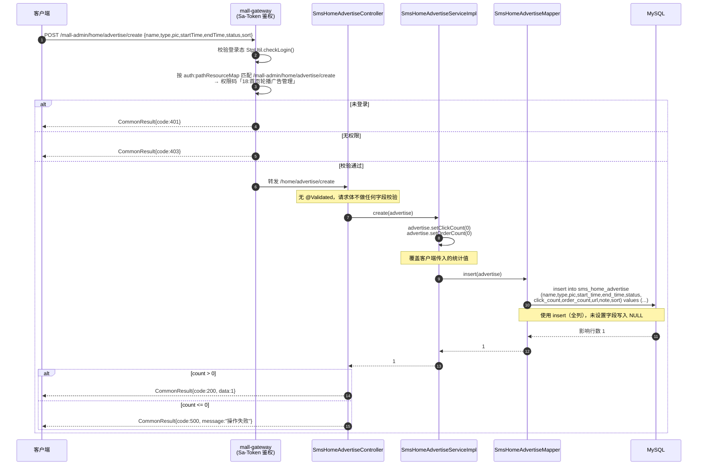
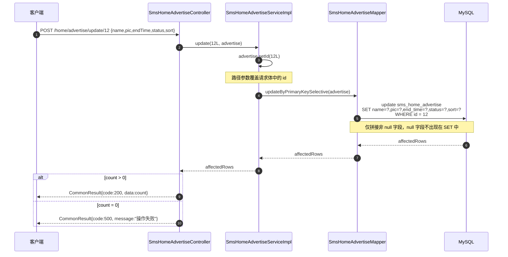
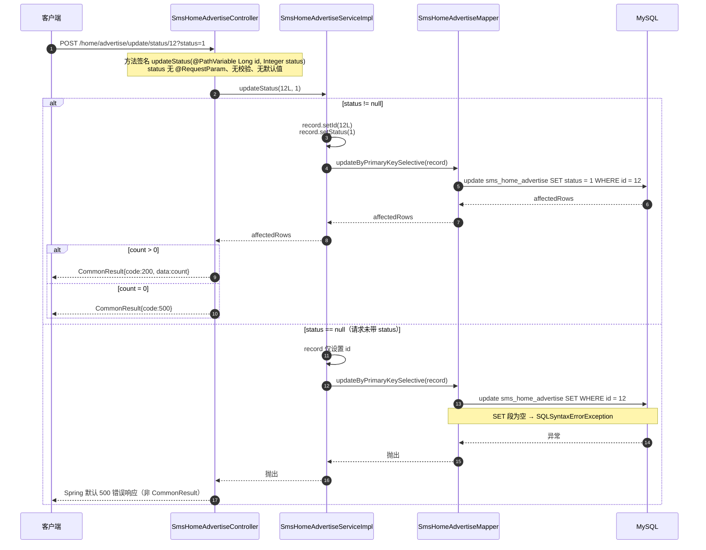
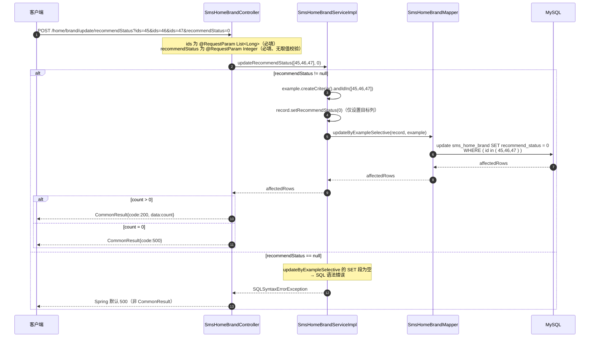
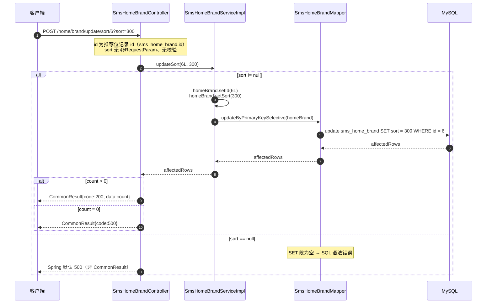
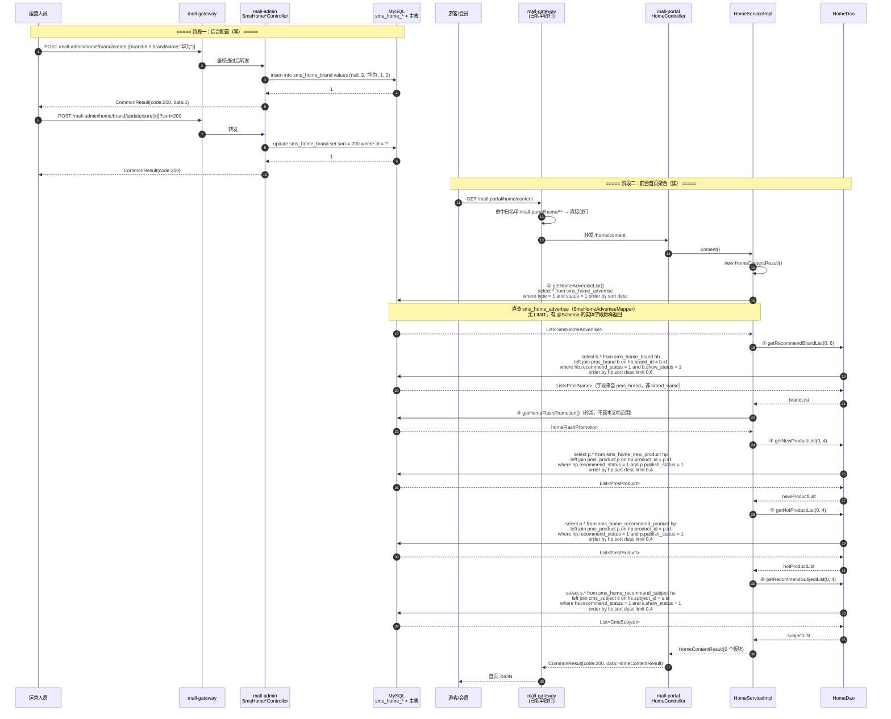

# 详细设计 · 营销 · 首页运营位

| 项目 | 内容 |
| --- | --- |
| 文档编号 | DD-SMS-HOME-001 |
| 所属业务域 | 营销域（`sms`） |
| 涉及服务 | `mall-admin`（:8080，配置侧）、`mall-portal`（:8085，消费侧） |
| 涉及数据表 | `sms_home_advertise`、`sms_home_brand`、`sms_home_new_product`、`sms_home_recommend_product`、`sms_home_recommend_subject` |
| 接口数量 | 26 个（全部为后台接口，`mall-admin` 提供） |
| 网关前缀 | `/mall-admin/home/**` |
| 控制器 | `SmsHomeAdvertiseController`(6)、`SmsHomeBrandController`(5)、`SmsHomeNewProductController`(5)、`SmsHomeRecommendProductController`(5)、`SmsHomeRecommendSubjectController`(5) |
| 文档状态 | 待评审 |

---

## 一、概述

### 1.1 范围

本文档描述「首页运营位」这一营销能力的详细设计。所谓「首页运营位」，指商城首页（PC 端与移动端）上由运营人员人工配置的推荐位，包括：

- **首页轮播广告**（`sms_home_advertise`）：PC 首页与 App 首页的轮播图，带上下线状态与点击量/下单数统计字段。
- **四类推荐位**：推荐品牌（`sms_home_brand`）、新鲜好物（`sms_home_new_product`）、人气推荐商品（`sms_home_recommend_product`）、推荐专题（`sms_home_recommend_subject`）。

覆盖内容：

- **数据库设计**：5 张表的 DDL、字段字典、状态字典、五表结构对比、关联与冗余设计、索引约束现状与改进建议
- **接口设计**：26 个 REST 接口的通用约定、**通用接口模式提炼**、逐接口请求/响应说明、数据模型、文档与实现不一致清单
- **包设计**：跨 `mall-admin` / `mall-portal` / `mall-mbg` / `mall-common` 的包结构与类职责
- **运行流程**：新增/更新轮播广告、上下线、四类推荐位的批量操作、**后台配置 → 前台首页聚合展示**的完整链路
- **日志设计**：日志框架与配置、`WebLogAspect` 切点覆盖、日志分类与输出目的地、本模块埋点建议
- **测试用例设计**：功能、边界、异常三类用例

不在本文档范围内：

- 秒杀活动（`sms_flash_promotion*`）的设计，见营销域秒杀详细设计。
- 商品、品牌、专题主数据本身的设计（`pms_product`、`pms_brand`、`cms_subject`）。
- 前台首页的页面渲染与前端路由。
- 推荐品牌前台接口 `/mall-portal/brand/recommendList` 的接口级细节，已在 `docs/详细设计/详细设计-品牌管理.md` 3.3 节详述，本文档仅引用（见 5.6）。

### 1.2 术语

| 术语 | 含义 |
| --- | --- |
| 首页运营位 | 首页上由运营人工挑选并排序的展示位，数据存于 `sms_home_*` 系列表 |
| 轮播位置（`type`） | 轮播广告投放终端：0 = PC 首页轮播，1 = App 首页轮播 |
| 上下线状态（`status`） | 轮播广告是否对外可见：0 = 下线，1 = 上线 |
| 推荐状态（`recommend_status`） | 推荐位记录是否参与前台展示：0 = 不推荐，1 = 推荐 |
| 运营位排序（`sort`） | 运营位内部排序权重，前台查询统一 `ORDER BY sort DESC`（**值越大越靠前**） |
| 冗余名称 | 推荐位表中保存的 `brand_name` / `product_name` / `subject_name`，是主表名称的快照 |
| 推荐位记录 id | `sms_home_*` 表自身的 `id`，**不是** `brand_id` / `product_id` / `subject_id`；所有批量操作均以该 id 为操作对象 |
| 运营位消费 | `mall-portal` 的 `HomeServiceImpl` 通过 `HomeDao` 查询推荐位并 join 主表，组装成 `HomeContentResult` |
| 六段式批量操作组 | 四类推荐位共有的 `create / updateSort / delete / updateRecommendStatus / list` 五个端点形态（见 3.3） |

### 1.3 接口清单总览

| # | 方法 | 路径（服务内） | 网关路径 | 说明 | 归属 |
| --- | --- | --- | --- | --- | --- |
| 1 | POST | `/home/advertise/create` | `/mall-admin/home/advertise/create` | 添加广告 | 后台 |
| 2 | POST | `/home/advertise/delete` | `/mall-admin/home/advertise/delete` | 批量删除广告 | 后台 |
| 3 | POST | `/home/advertise/update/status/{id}` | `/mall-admin/home/advertise/update/status/{id}` | 修改上下线状态 | 后台 |
| 4 | GET | `/home/advertise/{id}` | `/mall-admin/home/advertise/{id}` | 获取广告详情 | 后台 |
| 5 | POST | `/home/advertise/update/{id}` | `/mall-admin/home/advertise/update/{id}` | 修改广告 | 后台 |
| 6 | GET | `/home/advertise/list` | `/mall-admin/home/advertise/list` | 分页查询广告 | 后台 |
| 7 | POST | `/home/brand/create` | `/mall-admin/home/brand/create` | 添加首页推荐品牌（批量） | 后台 |
| 8 | POST | `/home/brand/update/sort/{id}` | `/mall-admin/home/brand/update/sort/{id}` | 修改品牌推荐排序 | 后台 |
| 9 | POST | `/home/brand/delete` | `/mall-admin/home/brand/delete` | 批量删除推荐品牌 | 后台 |
| 10 | POST | `/home/brand/update/recommendStatus` | `/mall-admin/home/brand/update/recommendStatus` | 批量修改推荐状态 | 后台 |
| 11 | GET | `/home/brand/list` | `/mall-admin/home/brand/list` | 分页查询推荐品牌 | 后台 |
| 12 | POST | `/home/newProduct/create` | `/mall-admin/home/newProduct/create` | 添加新鲜好物（批量） | 后台 |
| 13 | POST | `/home/newProduct/update/sort/{id}` | `/mall-admin/home/newProduct/update/sort/{id}` | 修改推荐排序 | 后台 |
| 14 | POST | `/home/newProduct/delete` | `/mall-admin/home/newProduct/delete` | 批量删除推荐 | 后台 |
| 15 | POST | `/home/newProduct/update/recommendStatus` | `/mall-admin/home/newProduct/update/recommendStatus` | 批量修改推荐状态 | 后台 |
| 16 | GET | `/home/newProduct/list` | `/mall-admin/home/newProduct/list` | 分页查询推荐 | 后台 |
| 17 | POST | `/home/recommendProduct/create` | `/mall-admin/home/recommendProduct/create` | 添加人气推荐（批量） | 后台 |
| 18 | POST | `/home/recommendProduct/update/sort/{id}` | `/mall-admin/home/recommendProduct/update/sort/{id}` | 修改推荐排序 | 后台 |
| 19 | POST | `/home/recommendProduct/delete` | `/mall-admin/home/recommendProduct/delete` | 批量删除推荐 | 后台 |
| 20 | POST | `/home/recommendProduct/update/recommendStatus` | `/mall-admin/home/recommendProduct/update/recommendStatus` | 批量修改推荐状态 | 后台 |
| 21 | GET | `/home/recommendProduct/list` | `/mall-admin/home/recommendProduct/list` | 分页查询推荐 | 后台 |
| 22 | POST | `/home/recommendSubject/create` | `/mall-admin/home/recommendSubject/create` | 添加推荐专题（批量） | 后台 |
| 23 | POST | `/home/recommendSubject/update/sort/{id}` | `/mall-admin/home/recommendSubject/update/sort/{id}` | 修改推荐排序 | 后台 |
| 24 | POST | `/home/recommendSubject/delete` | `/mall-admin/home/recommendSubject/delete` | 批量删除推荐 | 后台 |
| 25 | POST | `/home/recommendSubject/update/recommendStatus` | `/mall-admin/home/recommendSubject/update/recommendStatus` | 批量修改推荐状态 | 后台 |
| 26 | GET | `/home/recommendSubject/list` | `/mall-admin/home/recommendSubject/list` | 分页查询推荐 | 后台 |

> **命名冲突提示**：`mall-portal` 的 `HomeController` 类级路径同样是 `/home`（网关前缀 `/mall-portal/home/**`，其下为 `/home/content`、`/home/hotProductList`、`/home/newProductList`、`/home/recommendProductList`、`/home/productCateList/{parentId}`、`/home/subjectList`）。**不要**把 `/mall-portal/home/newProductList`（前台消费）与 `/mall-admin/home/newProduct/list`（后台配置）混为一谈：前者是裸数组的聚合查询，后者是分页的运营配置管理。

> **鉴权**：网关白名单（`mall-gateway/src/main/resources/application.yml` 的 `secure.ignore.urls`）**不包含** `/mall-admin/home/**`，仅放行 `/mall-admin/admin/login`、`/mall-admin/admin/register`、`/mall-admin/minio/upload`。因此本文档 26 个接口**全部需要登录态**，并按路径映射校验资源权限（见 3.1）。

---

## 二、数据库设计

### 2.1 表清单

| 表名 | 类型 | 中文名 | 本模块操作 | 前台消费方 |
| --- | --- | --- | --- | --- |
| `sms_home_advertise` | 主表 | 首页轮播广告表 | 增、删、改、查、改状态 | `HomeServiceImpl.getHomeAdvertiseList()`（直查本表） |
| `sms_home_brand` | 推荐位表 | 首页推荐品牌表 | 增、批量删、改排序、改推荐状态、查 | `HomeDao.getRecommendBrandList`（join `pms_brand`） |
| `sms_home_new_product` | 推荐位表 | 新鲜好物表 | 增、批量删、改排序、改推荐状态、查 | `HomeDao.getNewProductList`（join `pms_product`） |
| `sms_home_recommend_product` | 推荐位表 | 人气推荐商品表 | 增、批量删、改排序、改推荐状态、查 | `HomeDao.getHotProductList`（join `pms_product`） |
| `sms_home_recommend_subject` | 推荐位表 | 首页推荐专题表 | 增、批量删、改排序、改推荐状态、查 | `HomeDao.getRecommendSubjectList`（join `cms_subject`） |

> **重要**：5 张表全部由 `mall-admin` 写入，`mall-portal` 仅读取。本模块**没有**任何前台写接口。

### 2.2 建表语句（现状）

以下 DDL 逐字取自 `document/sql/mall.sql`（第 2023–2139 行），未做任何美化或字段增删。

```sql
DROP TABLE IF EXISTS `sms_home_advertise`;
CREATE TABLE `sms_home_advertise`  (
  `id` bigint(20) NOT NULL AUTO_INCREMENT,
  `name` varchar(100) CHARACTER SET utf8 COLLATE utf8_general_ci NULL DEFAULT NULL,
  `type` int(1) NULL DEFAULT NULL COMMENT '轮播位置：0->PC首页轮播；1->app首页轮播',
  `pic` varchar(500) CHARACTER SET utf8 COLLATE utf8_general_ci NULL DEFAULT NULL,
  `start_time` datetime NULL DEFAULT NULL,
  `end_time` datetime NULL DEFAULT NULL,
  `status` int(1) NULL DEFAULT NULL COMMENT '上下线状态：0->下线；1->上线',
  `click_count` int(11) NULL DEFAULT NULL COMMENT '点击数',
  `order_count` int(11) NULL DEFAULT NULL COMMENT '下单数',
  `url` varchar(500) CHARACTER SET utf8 COLLATE utf8_general_ci NULL DEFAULT NULL COMMENT '链接地址',
  `note` varchar(500) CHARACTER SET utf8 COLLATE utf8_general_ci NULL DEFAULT NULL COMMENT '备注',
  `sort` int(11) NULL DEFAULT 0 COMMENT '排序',
  PRIMARY KEY (`id`) USING BTREE
) ENGINE = InnoDB AUTO_INCREMENT = 17 CHARACTER SET = utf8 COLLATE = utf8_general_ci COMMENT = '首页轮播广告表' ROW_FORMAT = DYNAMIC;
```

```sql
DROP TABLE IF EXISTS `sms_home_brand`;
CREATE TABLE `sms_home_brand`  (
  `id` bigint(20) NOT NULL AUTO_INCREMENT,
  `brand_id` bigint(20) NULL DEFAULT NULL,
  `brand_name` varchar(64) CHARACTER SET utf8 COLLATE utf8_general_ci NULL DEFAULT NULL,
  `recommend_status` int(1) NULL DEFAULT NULL,
  `sort` int(11) NULL DEFAULT NULL,
  PRIMARY KEY (`id`) USING BTREE
) ENGINE = InnoDB AUTO_INCREMENT = 48 CHARACTER SET = utf8 COLLATE = utf8_general_ci COMMENT = '首页推荐品牌表' ROW_FORMAT = DYNAMIC;
```

```sql
DROP TABLE IF EXISTS `sms_home_new_product`;
CREATE TABLE `sms_home_new_product`  (
  `id` bigint(20) NOT NULL AUTO_INCREMENT,
  `product_id` bigint(20) NULL DEFAULT NULL,
  `product_name` varchar(500) CHARACTER SET utf8 COLLATE utf8_general_ci NULL DEFAULT NULL,
  `recommend_status` int(1) NULL DEFAULT NULL,
  `sort` int(1) NULL DEFAULT NULL,
  PRIMARY KEY (`id`) USING BTREE
) ENGINE = InnoDB AUTO_INCREMENT = 28 CHARACTER SET = utf8 COLLATE = utf8_general_ci COMMENT = '新鲜好物表' ROW_FORMAT = DYNAMIC;
```

```sql
DROP TABLE IF EXISTS `sms_home_recommend_product`;
CREATE TABLE `sms_home_recommend_product`  (
  `id` bigint(20) NOT NULL AUTO_INCREMENT,
  `product_id` bigint(20) NULL DEFAULT NULL,
  `product_name` varchar(500) CHARACTER SET utf8 COLLATE utf8_general_ci NULL DEFAULT NULL,
  `recommend_status` int(1) NULL DEFAULT NULL,
  `sort` int(1) NULL DEFAULT NULL,
  PRIMARY KEY (`id`) USING BTREE
) ENGINE = InnoDB AUTO_INCREMENT = 15 CHARACTER SET = utf8 COLLATE = utf8_general_ci COMMENT = '人气推荐商品表' ROW_FORMAT = DYNAMIC;
```

```sql
DROP TABLE IF EXISTS `sms_home_recommend_subject`;
CREATE TABLE `sms_home_recommend_subject`  (
  `id` bigint(20) NOT NULL AUTO_INCREMENT,
  `subject_id` bigint(20) NULL DEFAULT NULL,
  `subject_name` varchar(64) CHARACTER SET utf8 COLLATE utf8_general_ci NULL DEFAULT NULL,
  `recommend_status` int(1) NULL DEFAULT NULL,
  `sort` int(11) NULL DEFAULT NULL,
  PRIMARY KEY (`id`) USING BTREE
) ENGINE = InnoDB AUTO_INCREMENT = 20 CHARACTER SET = utf8 COLLATE = utf8_general_ci COMMENT = '首页推荐专题表' ROW_FORMAT = DYNAMIC;
```

**DDL 现状要点**：

- 5 张表结构高度同构，均为「自增主键 + 业务外键 + 冗余名称 + `recommend_status` + `sort`」。
- 所有表**只建了主键索引**，无任何普通索引、唯一索引、外键约束。
- 除 `sms_home_advertise.sort`（`DEFAULT 0`）外，**所有列均允许 NULL 且无默认值**。
- 5 张表都没有逻辑删除字段，删除即物理删除。
- 字符集为 `utf8`（非 `utf8mb4`），排序规则 `utf8_general_ci`，`ROW_FORMAT = DYNAMIC`。

### 2.3 字段说明

#### 2.3.1 `sms_home_advertise`（首页轮播广告表）

| 字段 | 类型 | 允许空 | 默认值 | 中文名 | 说明 |
| --- | --- | --- | --- | --- | --- |
| `id` | bigint(20) | 否 | AUTO_INCREMENT | 主键 | 广告唯一标识，也是所有增删改的操作对象 |
| `name` | varchar(100) | 是 | NULL | 广告名称 | 无列注释；列表按 `name` 模糊查询，业务上必填（应用层未校验） |
| `type` | int(1) | 是 | NULL | 轮播位置 | 0 PC 首页轮播 / 1 App 首页轮播（列注释） |
| `pic` | varchar(500) | 是 | NULL | 广告图片 | 无列注释；存 OSS 图片 URL，由 `/minio/upload` 或 OSS 直传产生 |
| `start_time` | datetime | 是 | NULL | 开始时间 | 无列注释；投放起始时刻 |
| `end_time` | datetime | 是 | NULL | 结束时间 | 无列注释；投放结束时刻，列表查询 `endTime` 参数即匹配本列 |
| `status` | int(1) | 是 | NULL | 上下线状态 | 0 下线 / 1 上线（列注释） |
| `click_count` | int(11) | 是 | NULL | 点击数 | 列注释「点击数」；新增时被强制置 0，仓库内**无任何累加代码** |
| `order_count` | int(11) | 是 | NULL | 下单数 | 列注释「下单数」；新增时被强制置 0，仓库内**无任何累加代码** |
| `url` | varchar(500) | 是 | NULL | 链接地址 | 列注释「链接地址」；样例数据为站内小程序路径，如 `/pages/brand/brandDetail?id=6` |
| `note` | varchar(500) | 是 | NULL | 备注 | 列注释「备注」 |
| `sort` | int(11) | 是 | 0 | 排序 | 列注释「排序」；**5 张表中唯一有非 NULL 默认值的列** |

> **注意**：`name`、`pic`、`start_time`、`end_time` 在 `mall.sql` 中**没有列注释**，上表「中文名」为依据列名与业务语义补充，非数据库元数据。

#### 2.3.2 `sms_home_brand`（首页推荐品牌表）

| 字段 | 类型 | 允许空 | 默认值 | 中文名 | 说明 |
| --- | --- | --- | --- | --- | --- |
| `id` | bigint(20) | 否 | AUTO_INCREMENT | 主键 | 推荐位记录 id（**非** `pms_brand.id`） |
| `brand_id` | bigint(20) | 是 | NULL | 品牌编号 | 逻辑外键 → `pms_brand.id`，无 DDL 约束 |
| `brand_name` | varchar(64) | 是 | NULL | 品牌名称（冗余） | `pms_brand.name` 的快照，长度与主表一致（均为 64），**改名不同步** |
| `recommend_status` | int(1) | 是 | NULL | 推荐状态 | **无列注释**，取值 0/1 系推断（见 2.4） |
| `sort` | int(11) | 是 | NULL | 排序 | 无列注释；前台 `ORDER BY hb.sort DESC` |

#### 2.3.3 `sms_home_new_product`（新鲜好物表）

| 字段 | 类型 | 允许空 | 默认值 | 中文名 | 说明 |
| --- | --- | --- | --- | --- | --- |
| `id` | bigint(20) | 否 | AUTO_INCREMENT | 主键 | 推荐位记录 id（**非** `pms_product.id`） |
| `product_id` | bigint(20) | 是 | NULL | 商品编号 | 逻辑外键 → `pms_product.id`，无 DDL 约束 |
| `product_name` | varchar(500) | 是 | NULL | 商品名称（冗余） | `pms_product.name` 的快照。**长度大于主表**（主表 200，本表 500），**改名不同步** |
| `recommend_status` | int(1) | 是 | NULL | 推荐状态 | **无列注释**，取值 0/1 系推断（见 2.4） |
| `sort` | int(1) | 是 | NULL | 排序 | **注意类型为 `int(1)`**，与 `sms_home_brand.sort`（`int(11)`）不一致 |

#### 2.3.4 `sms_home_recommend_product`（人气推荐商品表）

| 字段 | 类型 | 允许空 | 默认值 | 中文名 | 说明 |
| --- | --- | --- | --- | --- | --- |
| `id` | bigint(20) | 否 | AUTO_INCREMENT | 主键 | 推荐位记录 id（**非** `pms_product.id`） |
| `product_id` | bigint(20) | 是 | NULL | 商品编号 | 逻辑外键 → `pms_product.id`，无 DDL 约束 |
| `product_name` | varchar(500) | 是 | NULL | 商品名称（冗余） | `pms_product.name` 的快照，长度大于主表，**改名不同步** |
| `recommend_status` | int(1) | 是 | NULL | 推荐状态 | **无列注释**，取值 0/1 系推断（见 2.4） |
| `sort` | int(1) | 是 | NULL | 排序 | 类型为 `int(1)`，与 `sms_home_brand.sort` 不一致 |

> `sms_home_new_product` 与 `sms_home_recommend_product` 的 DDL **逐字段完全一致**（仅表名、表注释、`AUTO_INCREMENT` 不同），字段中文名同理。

#### 2.3.5 `sms_home_recommend_subject`（首页推荐专题表）

| 字段 | 类型 | 允许空 | 默认值 | 中文名 | 说明 |
| --- | --- | --- | --- | --- | --- |
| `id` | bigint(20) | 否 | AUTO_INCREMENT | 主键 | 推荐位记录 id（**非** `cms_subject.id`） |
| `subject_id` | bigint(20) | 是 | NULL | 专题编号 | 逻辑外键 → `cms_subject.id`，无 DDL 约束 |
| `subject_name` | varchar(64) | 是 | NULL | 专题名称（冗余） | 主表对应列为 `cms_subject.title`（varchar(100)），**列名与主表不一致且长度更小**，**改名不同步** |
| `recommend_status` | int(1) | 是 | NULL | 推荐状态 | **无列注释**，取值 0/1 系推断（见 2.4） |
| `sort` | int(11) | 是 | NULL | 排序 | 无列注释；前台 `ORDER BY hs.sort DESC` |

### 2.4 状态字典

| 表 | 字段 | 值 | 含义 | 来源 |
| --- | --- | --- | --- | --- |
| `sms_home_advertise` | `type` | 0 | PC 首页轮播 | `mall.sql` 列注释 |
| `sms_home_advertise` | `type` | 1 | App 首页轮播 | `mall.sql` 列注释 |
| `sms_home_advertise` | `status` | 0 | 下线 | `mall.sql` 列注释 |
| `sms_home_advertise` | `status` | 1 | 上线 | `mall.sql` 列注释 |
| `sms_home_brand` | `recommend_status` | 0 | 不推荐 | **推断**，见下方推断依据 |
| `sms_home_brand` | `recommend_status` | 1 | 推荐 | **推断**，见下方推断依据 |
| `sms_home_new_product` | `recommend_status` | 0 | 不推荐 | **推断** |
| `sms_home_new_product` | `recommend_status` | 1 | 推荐 | **推断** |
| `sms_home_recommend_product` | `recommend_status` | 0 | 不推荐 | **推断** |
| `sms_home_recommend_product` | `recommend_status` | 1 | 推荐 | **推断** |
| `sms_home_recommend_subject` | `recommend_status` | 0 | 不推荐 | **推断** |
| `sms_home_recommend_subject` | `recommend_status` | 1 | 推荐 | **推断** |

**`recommend_status` 取值的推断依据**（4 张表和 `sms_home_advertise.status` 不同，`recommend_status` 在所有表中**都没有列注释**）：

| # | 依据 | 出处 |
| --- | --- | --- |
| ① | 新建推荐位时**强制置 1**，未给运营留「建了但不推荐」的入口，说明 1 表示「推荐/生效」 | `SmsHomeBrandServiceImpl.create()`：`smsHomeBrand.setRecommendStatus(1)` |
| ② | 前台查询**只取 1**，说明 1 是「展示」值，其余值不展示 | `HomeDao.xml`：`WHERE hb.recommend_status = 1`（`getNewProductList`、`getHotProductList`、`getRecommendSubjectList` 同构） |
| ③ | 与同类字段语义对齐：`pms_product.recommand_status` 的列注释为「推荐状态；0->不推荐；1->推荐」 | `mall.sql` 第 1097 行 |
| ④ | 该字段在后台仅通过 `update/recommendStatus` 接口批量置值，前端语义为「设为推荐/取消推荐」 | `SmsHomeBrandController.updateRecommendStatus` |

> 依据 ③ 是**跨表类推**，不是本表元数据。若后续确认 `recommend_status` 存在 0/1 之外的含义（例如「待审核」），需同步修正前台过滤条件与本文档。

### 2.5 五表结构对比表

**共同字段**（5 张表共有，但类型/默认值有细微差别）：

| 字段 | 语义 | 各表差异 |
| --- | --- | --- |
| `id` bigint(20) NOT NULL AUTO_INCREMENT | 推荐位记录主键 | 4 张推荐位表完全一致 |
| `sort` | 运营位排序 | `advertise`：`int(11) DEFAULT 0`；`brand`：`int(11) DEFAULT NULL`；`new_product`：`int(1) DEFAULT NULL`；`recommend_product`：`int(1) DEFAULT NULL`；`recommend_subject`：`int(11) DEFAULT NULL` |
| 一个业务外键 | 指向主表 | 列名/类型：`brand_id` bigint(20)、`product_id` bigint(20) ×2、`subject_id` bigint(20)（`advertise` 无外键） |
| 一个冗余名称 | 主表名称快照 | `brand_name` varchar(64)、`product_name` varchar(500) ×2、`subject_name` varchar(64)（`advertise.name` 语义不同，是广告自身名称） |
| 一个状态字段 | 是否生效 | `advertise.status`（有列注释）；其余 4 张 `recommend_status`（**无列注释**） |

**逐表字段矩阵**（✓ 表示该表存在该列）：

| 列名 | `sms_home_advertise` | `sms_home_brand` | `sms_home_new_product` | `sms_home_recommend_product` | `sms_home_recommend_subject` |
| --- | --- | --- | --- | --- | --- |
| `id` | ✓ | ✓ | ✓ | ✓ | ✓ |
| `name` | ✓ | — | — | — | — |
| `type` | ✓ | — | — | — | — |
| `pic` | ✓ | — | — | — | — |
| `start_time` | ✓ | — | — | — | — |
| `end_time` | ✓ | — | — | — | — |
| `status` | ✓ | — | — | — | — |
| `click_count` | ✓ | — | — | — | — |
| `order_count` | ✓ | — | — | — | — |
| `url` | ✓ | — | — | — | — |
| `note` | ✓ | — | — | — | — |
| `sort` | ✓ | ✓ | ✓ | ✓ | ✓ |
| `brand_id` | — | ✓ | — | — | — |
| `brand_name` | — | ✓ | — | — | — |
| `product_id` | — | — | ✓ | ✓ | — |
| `product_name` | — | — | ✓ | ✓ | — |
| `subject_id` | — | — | — | — | ✓ |
| `subject_name` | — | — | — | — | ✓ |
| `recommend_status` | — | ✓ | ✓ | ✓ | ✓ |
| 列数 | 12 | 5 | 5 | 5 | 5 |

**结论**：轮播广告表与 4 张推荐位表只有 `id`、`sort` 两个同名同义的列，**不存在可抽象的共同父表**；4 张推荐位表则是同一结构的 4 份副本，差异仅在业务外键列名与冗余名称列名。

### 2.6 关联与冗余设计

```
                 ┌────────────────────────┐
                 │ sms_home_advertise     │   （无外键，独立运营位）
                 │  type / status / sort  │
                 └────────────────────────┘

  mall-admin 写                     mall-portal 读（join 主表）
  ────────────                     ──────────────────────────
  sms_home_brand.brand_id      ──► pms_brand.id          LEFT JOIN
  sms_home_brand.brand_name    ╳   pms_brand.name        冗余快照，不同步

  sms_home_new_product.product_id   ──► pms_product.id    LEFT JOIN
  sms_home_new_product.product_name ╳   pms_product.name  冗余快照，不同步

  sms_home_recommend_product.product_id   ──► pms_product.id    LEFT JOIN
  sms_home_recommend_product.product_name ╳   pms_product.name  冗余快照，不同步

  sms_home_recommend_subject.subject_id   ──► cms_subject.id         LEFT JOIN
  sms_home_recommend_subject.subject_name ╳   cms_subject.title      冗余快照，不同步
```

**关联说明**：

| 关联 | 方向 | 约束 | 说明 |
| --- | --- | --- | --- |
| `sms_home_brand.brand_id` → `pms_brand.id` | 逻辑外键 | **无 DDL 外键** | 前台 `LEFT JOIN`；`brand_id` 指向不存在记录时该行返回 NULL 字段（被 `b.show_status = 1` 过滤掉） |
| `sms_home_new_product.product_id` → `pms_product.id` | 逻辑外键 | **无 DDL 外键** | 前台 `LEFT JOIN` + `p.publish_status = 1` |
| `sms_home_recommend_product.product_id` → `pms_product.id` | 逻辑外键 | **无 DDL 外键** | 同上 |
| `sms_home_recommend_subject.subject_id` → `cms_subject.id` | 逻辑外键 | **无 DDL 外键** | 前台 `LEFT JOIN` + `s.show_status = 1` |

**冗余名称设计（关键设计点）**

4 张推荐位表都冗余了主表名称。冗余的**动因**是：运营位配置页面需要展示「已选品牌/商品/专题的名称」列表，若每次列表查询都 join 主表，在运营位数量多时会带来额外开销；且运营希望对已选记录的名称做**模糊检索**（`list` 接口的 `brandName` / `productName` / `subjectName` 参数），冗余名称可以直接在单表上 `LIKE`，避免 join 后再过滤。

**代价与现状**：

- `SmsHomeBrandServiceImpl` / `SmsHomeNewProductServiceImpl` / `SmsHomeRecommendProductServiceImpl` / `SmsHomeRecommendSubjectServiceImpl` **只有 CRUD，没有任何「同步主表名称」的代码**。
- `SmsHomeBrandServiceImpl.create()` 等新增方法**直接采用请求体里传入的名称**并落库：`homeBrandMapper.insert(smsHomeBrand)`。也就是说，冗余名称在**写入时由前端提供**，后端不校验它与 `pms_brand.name` / `pms_product.name` / `cms_subject.title` 是否一致。
- 因此，当主表改名（例如 `PmsBrandServiceImpl.updateBrand()` 更新 `pms_brand.name`）后，`sms_home_brand.brand_name` 仍是旧值。

> **交叉引用**：`docs/详细设计/详细设计-品牌管理.md` 的 2.5 节已指出「`sms_home_brand.brand_name` 也是冗余，但更新品牌时不会同步」并作为问题 ⑥ 记录。本文档不再重复论证，仅在 2.8 建议 ③ 给出统一整改方案。
>
> **补充说明**：`pms_product` 的改名链路与 `pms_brand` 不同 —— `pms_product.name` 由商品编辑接口直接写入，且**没有任何代码回头更新** `sms_home_new_product.product_name` / `sms_home_recommend_product.product_name`。同时注意 `cms_subject` 的主名称列叫 **`title`**，而冗余列叫 **`subject_name`**，列名也不对应。

**其他冗余/失效引用风险**：

| 场景 | 现象 | 前台表现 |
| --- | --- | --- |
| 主表记录被**物理删除** | `sms_home_*.xxx_id` 成为孤儿值 | `LEFT JOIN` 结果主表列为 NULL → 被 `show_status`/`publish_status = 1` 过滤 → 该运营位**静默消失**，后台仍显示 |
| 主表记录被**下架/隐藏** | `publish_status = 0` 或 `show_status = 0` | 同样被过滤掉，后台仍显示为「推荐」 |
| 主表**改名** | 冗余名称陈旧 | 后台运营位列表显示旧名称；前台 join 取的是主表**实时**名称，故前台不显示旧名 |

> 最后一行是重要结论：**冗余名称只影响后台列表展示与后台检索，不影响前台展示内容**。前台 SQL 均为 `SELECT 主表.*`，名称来自主表。因此冗余不同步的实际危害是「后台看到的和前台展示的不一致 + 后台按旧名搜不到已改名的记录」，而非前台显示错误。

### 2.7 索引与约束现状

| 项目 | `sms_home_advertise` | `sms_home_brand` | `sms_home_new_product` | `sms_home_recommend_product` | `sms_home_recommend_subject` |
| --- | --- | --- | --- | --- | --- |
| 主键 | `PRIMARY KEY (id)` USING BTREE | 同左 | 同左 | 同左 | 同左 |
| 唯一索引 | **无** | **无** | **无** | **无** | **无** |
| 普通索引 | **无** | **无** | **无** | **无** | **无** |
| 外键约束 | **无** | **无** | **无** | **无** | **无** |
| 非空约束 | 仅 `id` | 仅 `id` | 仅 `id` | 仅 `id` | 仅 `id` |
| 默认值 | 仅 `sort = 0` | **无** | **无** | **无** | **无** |
| 逻辑删除 | **无** | **无** | **无** | **无** | **无** |
| AUTO_INCREMENT | 17 | 48 | 28 | 15 | 20 |

**索引缺失的实际影响（结合前台 SQL）**：

| 缺失索引 | 受影响 SQL | 影响 |
| --- | --- | --- |
| `sms_home_brand(recommend_status, sort)` | `getRecommendBrandList`：`WHERE hb.recommend_status = 1 ORDER BY hb.sort DESC LIMIT ?,?` | 数据量小（脚本内置 9 行）时可忽略；运营位增长后需全表扫描 + filesort |
| `sms_home_new_product(recommend_status, sort)` | `getNewProductList`（同上） | 同上 |
| `sms_home_recommend_product(recommend_status, sort)` | `getHotProductList`（同上） | 同上 |
| `sms_home_recommend_subject(recommend_status, sort)` | `getRecommendSubjectList`（同上） | 同上 |
| `sms_home_advertise(type, status, sort)` | `HomeServiceImpl.getHomeAdvertiseList()`：`WHERE type = 1 AND status = 1 ORDER BY sort desc` | **该查询无 LIMIT，会取回全部符合条件的广告**；每次前台首页请求都执行 |
| 5 表的 `id` 之外的唯一约束缺失 | 无 | `brand_id` / `product_id` / `subject_id` **可重复**，同一品牌/商品可被配置多次，前台首页出现重复卡片 |
| 无外键约束 | 所有删除路径 | 删除主表记录不报错，运营位残留孤儿引用 |

**为什么当前没暴露问题**：`mall.sql` 内置数据量极小（广告 10 行、推荐品牌 9 行、新鲜好物 9 行、人气推荐 5 行、推荐专题 6 行），任何索引差异都体现不出来。风险在数据量增长后才显现。

### 2.8 设计问题与建议

> 本节严格区分「现状」（左三列）与「建议」（右一列）。

| # | 问题 | 影响 | 现状证据 | 建议 |
| --- | --- | --- | --- | --- |
| ① | 4 张推荐位表的 `recommend_status` **无列注释** | 取值语义无元数据依据，新成员需读代码才能确认 0/1 含义 | `mall.sql` 第 2063、2089、2115、2137 行均无 `COMMENT` | 补列注释：`COMMENT '推荐状态：0->不推荐；1->推荐'`；同步修正 `SmsHomeBrand` 等模型类缺失的 `@Schema` |
| ② | 4 张推荐位表**无业务外键索引** | 前台 `WHERE recommend_status = 1 ORDER BY sort DESC` 全表扫描 + filesort | 2.7 索引现状 | 增加 `idx_recommend_status_sort (recommend_status, sort)` |
| ③ | 运营位冗余名称**永不同步** | 后台列表显示旧名称；按新名称搜不到已改名记录；后台展示与前台展示不一致 | 2.6 冗余设计 | 三选一：**(a)** 后台 `list` 改为 join 主表取名（推荐，彻底消除同步问题）；**(b)** 主表改名时同步更新运营位冗余名（需在 `PmsBrandServiceImpl.updateBrand` 等处补写，并注意事务）；**(c)** 保留冗余但新增定时对账任务修正 |
| ④ | 冗余名称**由前端传入、后端不校验** | 前端可写入与主表不一致、甚至任意伪造的名称，造成后台数据不可信 | `SmsHomeBrandServiceImpl.create()` 直接 `insert(smsHomeBrand)` | 在 `create` 中按 `brand_id` / `product_id` / `subject_id` 回查主表名称后覆盖客户端传值 |
| ⑤ | 批量操作**无数量上限** | `ids` 参数可传上万条，`IN (...)` 触发超长 SQL、锁等待、连接占用 | `delete` / `updateRecommendStatus` 只有 `@RequestParam("ids") List<Long>` | 在 Controller 或 Service 层限制单次批量条数（建议 ≤ 100）并返回 `code: 404` 明确提示 |
| ⑥ | **无唯一约束**，同一主表记录可重复配置 | 前台首页出现重复卡片；运营难以察觉 | 无唯一索引 | 增加唯一索引 `uk_brand_id (brand_id)`、`uk_product_id (product_id)`（两张表各自）、`uk_subject_id (subject_id)`；或 Service 层查重 |
| ⑦ | `sms_home_new_product.sort` / `sms_home_recommend_product.sort` 为 **`int(1)`** | 数据类型名义宽度为 1 位，易被误认为取值范围 0–9（MySQL 中 `int(1)` 仅影响显示宽度，实际仍是 4 字节 int） | 2.2 DDL | 统一为 `int(11)`，与其余表对齐，避免歧义 |
| ⑧ | 首页广告**无按投放时间过滤的查询** | `start_time` / `end_time` 存了但前台不判时间窗，过期广告只要 `status = 1` 就展示 | `HomeServiceImpl.getHomeAdvertiseList()` 仅过滤 `type = 1 AND status = 1` | 前台查询补充 `AND start_time <= now() AND end_time >= now()`；或由后台定时任务自动下线过期广告 |
| ⑨ | 广告**无图片/名称/时间必填校验** | 可写入 `pic = NULL`、`name = NULL` 的空广告，前台渲染空白 | 请求体直接绑定 `SmsHomeAdvertise`，无 `@Validated`、无 `@NotEmpty` | 新增请求 DTO（参照 `PmsBrandParam`）并加校验注解 |
| ⑩ | `click_count` / `order_count` **无任何累加代码** | 字段恒为 0（新增时被强制置 0），若后台页面展示「点击量/下单数」则恒显示 0 | 全仓库检索 `setClickCount` / `clickCount` 仅命中新增时的置 0 与 MBG 生成代码 | 明确废弃这两个字段，或补齐埋点（前台点击上报 + 下单关联） |
| ⑪ | `update/{id}` 允许客户端**覆盖 `click_count` / `order_count`** | 统计值可被任意改写 | `SmsHomeAdvertiseController.update` 直接透传整个实体 | 更新接口使用白名单 DTO，剔除统计字段 |
| ⑫ | 删除为**物理删除且不校验引用** | 运营位删除不可恢复；主表删除后运营位成孤儿 | 无逻辑删除列、无外键 | 引入逻辑删除，或至少对外键引用做校验/清理 |
| ⑬ | 4 张推荐位表的 `create` 中，**`sms_home_brand` 有 `@Transactional`，其余 3 张也有**，但 `sms_home_advertise.create` **无事务**（单条 insert，风险低）；而 4 个批量 `create` 的循环 `insert` 即使有事务，返回值也**恒等于 `list.size()`**，不反映真实成功行数 | 返回 `data` 与实际入库行数可能不符，前端无法判断部分失败 | `SmsHomeBrandServiceImpl.create()` 返回 `homeBrandList.size()` | 改为累加实际 `insert()` 返回值；`sms_home_advertise.create` 按需补 `@Transactional` |
| ⑭ | 字符集为 **`utf8`（3 字节）** | 无法存储 emoji 等 4 字节字符（如商品名含 emoji 时插入失败或乱码） | DDL `CHARACTER SET = utf8` | 迁移到 `utf8mb4` / `utf8mb4_general_ci` |
| ⑮ | 广告 `sort` 之外**无默认值**，`status` 可为 NULL | 新增广告若不传 `status`，落库为 NULL；前台 `status = 1` 过滤会漏掉它，表现为「建了但前台看不到」且无任何提示 | DDL + 前台过滤条件 | `status` 设 `DEFAULT 0` 或新增时后端默认置 0，并在文档/界面提示需手动上线 |

> **优先级建议**：③、④、⑧、⑮ 直接影响「后台配置 → 前台可见」的正确性，应优先处理；⑤、⑥ 是稳定性与体验问题；①、②、⑦、⑭ 是技术债。

---

## 三、接口设计

### 3.1 通用约定

**统一响应结构**（`com.macro.mall.common.api.CommonResult`）：

```json
{
  "code": 200,
  "message": "操作成功",
  "data": {}
}
```

| 字段 | 类型 | 说明 |
| --- | --- | --- |
| `code` | long | 业务码，非 HTTP 状态码 |
| `message` | String | 提示信息，来自 `ResultCode` 或自定义文案 |
| `data` | T（泛型） | 业务数据，失败时为 `null` |

**业务码定义**（`com.macro.mall.common.api.ResultCode`）：

| code | 常量 | 含义 | 本模块出现场景 |
| --- | --- | --- | --- |
| 200 | `SUCCESS` | 操作成功 | 所有成功响应；**注意**查询不到记录时也可能返回 200 + `data: null` |
| 401 | `UNAUTHORIZED` | 暂未登录或 token 已经过期 | 网关 `SaReactorFilter` 捕获 `NotLoginException` 后返回 |
| 403 | `FORBIDDEN` | 没有相关权限 | 网关捕获 `NotPermissionException` 后返回 |
| 404 | `VALIDATE_FAILED` | 参数检验失败 | 本模块 Controller **未使用 `@Validated`**，故正常流程下不会出现；仅 `ApiException` 链路可能返回 |
| 500 | `FAILED` | 操作失败 | 所有写操作「影响行数 ≤ 0」时的统一返回值 |

> **注意**：业务码定义在 **HTTP 响应体内部**，HTTP 状态码通常仍为 200。`VALIDATE_FAILED` 使用 404 表示参数校验失败，与 HTTP 语义不一致，前端需按 `code` 而非 HTTP 状态码判断。

**统一分页结构**（`com.macro.mall.common.api.CommonPage`）：

| 名称 | 类型 | 说明 |
| --- | --- | --- |
| pageNum | integer | 当前页码 |
| pageSize | integer | 每页条数 |
| totalPage | integer | 总页数 |
| total | integer(int64) | 总记录数 |
| list | array | 数据列表 |

`CommonPage.restPage(List<T>)` 内部构造 `PageInfo<T>(list)` 读取 `PageHelper` 写入 `ThreadLocal` 的分页元数据，因此**传入的必须是 `selectByExample` 直接返回的 List**（不能是二次加工的新 List）。

**鉴权**：

| 项 | 内容 |
| --- | --- |
| Token 载体 | 请求头 `Authorization: Bearer <token>`（`sa-token.token-name = Authorization`、`token-prefix = Bearer`、`is-read-header = true`、`is-read-cookie = false`） |
| 网关过滤器 | `mall-gateway` 的 `SaReactorFilter`（`SaTokenConfig#getSaReactorFilter`），拦截 `/**`，排除 `secure.ignore.urls` |
| 本模块要求 | `/mall-admin/home/**` **不在白名单**，故 26 个接口**全部需要登录态**（`SaRouter.match("/mall-admin/**", r -> StpUtil.checkLogin())`） |
| 权限码校验 | 网关另读 Redis Hash `auth:pathResourceMap`（`AuthConstant.PATH_RESOURCE_MAP`），按 `AntPathMatcher` 匹配请求路径，匹配到则执行 `StpUtil.checkPermissionOr(...)` |

本模块对应的资源权限（`document/sql/mall.sql` 的 `ums_resource` 表内置数据，由 `UmsResourceServiceImpl.initPathResourceMap()` 拼成 `/mall-admin` + `url` 作为 key）：

| 资源 id | 资源名称（即权限码） | 匹配路径 | 覆盖接口 |
| --- | --- | --- | --- |
| 18 | `首页轮播广告管理` | `/home/advertise/**` | 接口 1–6 |
| 19 | `首页品牌管理` | `/home/brand/**` | 接口 7–11 |
| 20 | `首页新品管理` | `/home/newProduct/**` | 接口 12–16 |
| 21 | `首页人气推荐管理` | `/home/recommendProduct/**` | 接口 17–21 |
| 22 | `首页专题推荐管理` | `/home/recommendSubject/**` | 接口 22–26 |

> 若 Redis 中 `auth:pathResourceMap` 未初始化（例如未调用资源初始化接口），则 `needPermissionList` 为空，此时**仅校验登录态、不校验权限码**。这是「登录即可操作全部运营位」的现状。

**写操作的统一结果语义**（本模块所有非查询接口共有）：

```java
int count = xxxService.xxx(...);
if (count > 0)
    return CommonResult.success(count);
return CommonResult.failed();
```

含义：

- `count > 0` → `code: 200`，`data` 为**影响行数**（`int`）。
- `count <= 0` → `code: 500`、`message: "操作失败"`、`data: null`。
- **无法区分**「目标记录不存在」与「数据库错误」——两者都是 `count = 0`。
- 无幂等语义：重复执行同一「设为推荐」操作，第二次 `count` 可能仍 > 0（MySQL 对相同值的 UPDATE 也计入 affected rows 的 `ROW_COUNT()` 语义下，本模块未开启 `useAffectedRows` 相关差异化配置），前端不应以 `data` 判断是否「发生了变化」。

---

### 3.2 首页运营位通用接口模式

5 个控制器共 26 个端点，其中 4 个推荐位控制器的 **20 个端点完全同构**。为避免逐接口重复描述，先在此提炼统一模式，再在 3.4–3.8 给出每个接口的具体参数与响应。

**模式命名**：`首页运营位批量操作模式`。适用于 `sms_home_brand`、`sms_home_new_product`、`sms_home_recommend_product`、`sms_home_recommend_subject` 四张推荐位表。

#### 3.2.1 模式表

| 模式角色 | HTTP | 路径模板 | 请求参数 | 响应 `data` | 语义 |
| --- | --- | --- | --- | --- | --- |
| **B1 批量新增** | POST | `{base}/create` | Body：`List<实体>` JSON 数组 | `list.size()` | 逐条 `insert`，**强制** `recommend_status = 1`、`sort = 0` |
| **B2 单条改排序** | POST | `{base}/update/sort/{id}` | Path：`id`；Query：`sort` | 影响行数 | `updateByPrimaryKeySelective`，仅改 `sort` |
| **B3 批量删除** | POST | `{base}/delete` | Query：`ids`（重复参数） | 影响行数 | `deleteByExample(andIdIn(ids))`，**物理删除** |
| **B4 批量改推荐状态** | POST | `{base}/update/recommendStatus` | Query：`ids`、`recommendStatus` | 影响行数 | `updateByExampleSelective`，仅改 `recommend_status` |
| **B5 分页列表** | GET | `{base}/list` | Query：名称关键字、`recommendStatus`、`pageSize`(默认 5)、`pageNum`(默认 1) | `CommonPage<实体>` | `PageHelper` + `andXxxNameLike` + `andRecommendStatusEqualTo` + `ORDER BY sort desc` |

#### 3.2.2 实现骨架（四控制器共用）

```java
// 以 SmsHomeBrandController 为例，其余三个控制器除类型与 @Operation 文案外完全一致
@Operation(summary = "批量删除推荐品牌")
@RequestMapping(value = "/delete", method = RequestMethod.POST)
@ResponseBody
public CommonResult delete(@RequestParam("ids") List<Long> ids) {
    int count = homeBrandService.delete(ids);
    if (count > 0) {
        return CommonResult.success(count);
    }
    return CommonResult.failed();
}
```

Service 侧骨架（以品牌为例，四个 `ServiceImpl` 结构一致）：

```java
@Override
public int delete(List<Long> ids) {
    SmsHomeBrandExample example = new SmsHomeBrandExample();
    example.createCriteria().andIdIn(ids);
    return homeBrandMapper.deleteByExample(example);
}

@Override
public int updateRecommendStatus(List<Long> ids, Integer recommendStatus) {
    SmsHomeBrandExample example = new SmsHomeBrandExample();
    example.createCriteria().andIdIn(ids);
    SmsHomeBrand record = new SmsHomeBrand();
    record.setRecommendStatus(recommendStatus);
    return homeBrandMapper.updateByExampleSelective(record, example);
}
```

`updateByExampleSelective` 只更新非 null 字段，故 `record` 只设置目标列，**不会误清空其他列**。

#### 3.2.3 四个控制器的差异表

| 差异维度 | `SmsHomeBrandController` | `SmsHomeNewProductController` | `SmsHomeRecommendProductController` | `SmsHomeRecommendSubjectController` |
| --- | --- | --- | --- | --- |
| 类级路径 `{base}` | `/home/brand` | `/home/newProduct` | `/home/recommendProduct` | `/home/recommendSubject` |
| 实体类 | `SmsHomeBrand` | `SmsHomeNewProduct` | `SmsHomeRecommendProduct` | `SmsHomeRecommendSubject` |
| Service | `SmsHomeBrandService` | `SmsHomeNewProductService` | `SmsHomeRecommendProductService` | `SmsHomeRecommendSubjectService` |
| Mapper | `SmsHomeBrandMapper` | `SmsHomeNewProductMapper` | `SmsHomeRecommendProductMapper` | `SmsHomeRecommendSubjectMapper` |
| 表 | `sms_home_brand` | `sms_home_new_product` | `sms_home_recommend_product` | `sms_home_recommend_subject` |
| 业务外键列 | `brandId` | `productId` | `productId` | `subjectId` |
| 冗余名称列 | `brandName` | `productName` | `productName` | `subjectName` |
| 列表查询参数名 | `brandName` | `productName` | `productName` | `subjectName` |
| `@Operation(summary)`（新增） | 添加首页推荐品牌 | **添加首页推荐品牌**（文案错误，应为「添加新鲜好物」） | 添加首页推荐 | 添加首页推荐专题 |
| `@Operation(summary)`（列表） | 分页查询推荐品牌 | 分页查询推荐 | 分页查询推荐 | 分页查询推荐 |
| Service `create` 是否 `@Transactional` | **是**（接口方法上声明） | **是** | **是** | **是** |
| Service `create` 返回 | `homeBrandList.size()` | `homeNewProductList.size()` | `homeRecommendProductList.size()` | `recommendSubjectList.size()` |
| 新增时的强制赋值 | `setRecommendStatus(1)`、`setSort(0)` | 同左 | 同左 | 同左 |
| 前台消费 SQL | `HomeDao.getRecommendBrandList` | `HomeDao.getNewProductList` | `HomeDao.getHotProductList` | `HomeDao.getRecommendSubjectList` |

> 四份 `ServiceImpl` 的差异**仅**在类型名、Mapper 字段名、列表查询参数名（`andBrandNameLike` / `andProductNameLike` / `andSubjectNameLike`）三处。

#### 3.2.4 轮播广告控制器的模式偏移

`SmsHomeAdvertiseController` **不适用**上述批量模式，它与推荐位的差异如下：

| 维度 | 推荐位模式（B1–B5） | 轮播广告（`/home/advertise`） |
| --- | --- | --- |
| 新增 | `POST /create`，Body 为**数组**，批量 | `POST /create`，Body 为**单对象** |
| 删除 | `POST /delete?ids=` 批量 | `POST /delete?ids=` 批量（同名同形） |
| 改状态 | `POST /update/recommendStatus?ids=&recommendStatus=` 批量 | `POST /update/status/{id}?status=` **单条**，且 `status` 在 Path 而非 Query 集合 |
| 改排序 | `POST /update/sort/{id}?sort=` | **无独立端点**；排序只能通过 `POST /update/{id}` 整体更新 |
| 详情 | **无** | `GET /{id}` 有单独详情端点 |
| 更新 | **无**（推荐位只改排序与推荐状态） | `POST /update/{id}` 支持整体更新 |
| 列表筛选 | 名称 + `recommendStatus` | 名称 + `type` + `endTime`（按投放结束日期区间） |
| 事务 | `create` 有 `@Transactional` | `create` **无** `@Transactional` |
| Mapper 插入方法 | `insert`（全列写入） | `insert`（全列写入） |

> 上表最后一行需要说明：4 个推荐位 Service 与广告 Service **都调用了 `insert`（非 `insertSelective`）**，即所有列都会显式写入 SQL（未设置的列写为 NULL）。这一点在阅读 MBG 生成的 Mapper XML 时容易误判（`insertSelective` 也存在，但未被本模块调用），故特别标注。

---

### 3.3 轮播广告接口（mall-admin · `/home/advertise`）

<a id="opIdhomeAdvertiseCreate"></a>

## POST 添加广告

POST /home/advertise/create

新增一条首页轮播广告。**`clickCount` 与 `orderCount` 由服务端强制置 0，请求体中的同名字段被覆盖。**

> Body 请求参数

```json
{
  "name": "夏季大热促销",
  "type": 1,
  "pic": "http://macro-oss.oss-cn-shenzhen.aliyuncs.com/mall/images/20190525/ad1.jpg",
  "startTime": "2018-11-01 14:01:37",
  "endTime": "2018-11-15 14:01:37",
  "status": 1,
  "url": "www.baidu.com",
  "note": "夏季大热促销",
  "sort": 100
}
```

### 请求参数

| 名称 | 位置 | 类型 | 必选 | 说明 |
| --- | --- | --- | --- | --- |
| body | body | [SmsHomeAdvertise](#schemasmshomeadvertise) | 是 | 广告对象。后端未做任何字段校验，`name` / `pic` / `status` 均可为 null |

### 返回结果

| 状态码 | 状态码含义 | 说明 | 数据模型 |
| --- | --- | --- | --- |
| 200 | [OK](https://tools.ietf.org/html/rfc7231#section-6.3.1) | 操作成功 | Inline |

### 返回数据结构

状态码 **200**

| 名称 | 类型 | 必选 | 约束 | 中文名 | 说明 |
| --- | --- | --- | --- | --- | --- |
| code | integer(int64) | true | none | 业务码 | 200 成功；500 失败 |
| message | string | true | none | 提示信息 | `操作成功` / `操作失败` |
| data | integer(int32) | false | none | 影响行数 | 成功固定为 1（insert 单条） |

> **设计备注**：`advertiseService.create()` 未标注 `@Transactional`。单条 insert 场景风险低，但与同批次的 4 个推荐位 `create`（均有 `@Transactional`）风格不统一。详见 2.8 ⑬。

---

<a id="opIdhomeAdvertiseDelete"></a>

## POST 批量删除广告

POST /home/advertise/delete

按广告 id 批量物理删除。

### 请求参数

| 名称 | 位置 | 类型 | 必选 | 说明 |
| --- | --- | --- | --- | --- |
| ids | query | array[integer] | 是 | 广告 id 列表，以重复参数传递：`?ids=2&ids=3` |

### 返回结果

| 状态码 | 状态码含义 | 说明 | 数据模型 |
| --- | --- | --- | --- |
| 200 | [OK](https://tools.ietf.org/html/rfc7231#section-6.3.1) | 操作成功 | Inline |

### 返回数据结构

状态码 **200**

| 名称 | 类型 | 必选 | 约束 | 中文名 | 说明 |
| --- | --- | --- | --- | --- | --- |
| code | integer(int64) | true | none | 业务码 | 200 成功；500 失败 |
| message | string | true | none | 提示信息 | none |
| data | integer(int32) | false | none | 删除行数 | 影响行数 > 0 时为 200 |

> **设计备注**：删除为**物理删除**，且不校验广告是否正在投放。空 `ids` 列表会拼出 `id in ()` 的非法 SQL（详见 7.4）。

---

<a id="opIdhomeAdvertiseUpdateStatus"></a>

## POST 修改上下线状态

POST /home/advertise/update/status/{id}

单条修改广告的上下线状态。仅更新 `status` 列，其他列不受影响。

### 请求参数

| 名称 | 位置 | 类型 | 必选 | 说明 |
| --- | --- | --- | --- | --- |
| id | path | integer(int64) | 是 | 广告 id |
| status | query | integer | 否 | 上下线状态：0 下线；1 上线。**参数可缺省**，缺省时 `@PathVariable Long id, Integer status` 中的 `status` 绑定为 null |

> **注意**：Controller 方法签名为 `updateStatus(@PathVariable Long id, Integer status)`，`status` **没有 `@RequestParam` 注解**，按参数名绑定（依赖 `-parameters` 编译参数）。这与 openapi.yaml 声明为 `in: query, required: false` 一致。

### 返回结果

| 状态码 | 状态码含义 | 说明 | 数据模型 |
| --- | --- | --- | --- |
| 200 | [OK](https://tools.ietf.org/html/rfc7231#section-6.3.1) | 操作成功 | Inline |

### 返回数据结构

状态码 **200**

| 名称 | 类型 | 必选 | 约束 | 中文名 | 说明 |
| --- | --- | --- | --- | --- | --- |
| code | integer(int64) | true | none | 业务码 | 200 成功；500 失败 |
| message | string | true | none | 提示信息 | none |
| data | integer(int32) | false | none | 更新行数 | none |

> **设计备注**：`status` **无取值校验**，传入 2、-1 也会成功写库；且由于 `updateByPrimaryKeySelective` 对 null 跳过更新，传入缺省 `status` 时 SQL 的 `SET` 段为空，MySQL 报语法错误（详见 5.3、7.4）。

---

<a id="opIdhomeAdvertiseGetItem"></a>

## GET 获取广告详情

GET /home/advertise/{id}

### 请求参数

| 名称 | 位置 | 类型 | 必选 | 说明 |
| --- | --- | --- | --- | --- |
| id | path | integer(int64) | 是 | 广告 id |

> 返回示例

> 200 Response

```json
{
  "code": 200,
  "message": "操作成功",
  "data": {
    "id": 2,
    "name": "夏季大热促销",
    "type": 1,
    "pic": "http://macro-oss.oss-cn-shenzhen.aliyuncs.com/mall/images/20190525/ad1.jpg",
    "startTime": "2018-11-01 14:01:37",
    "endTime": "2018-11-15 14:01:37",
    "status": 0,
    "clickCount": 0,
    "orderCount": 0,
    "url": null,
    "note": "夏季大热促销",
    "sort": 0
  }
}
```

### 返回结果

| 状态码 | 状态码含义 | 说明 | 数据模型 |
| --- | --- | --- | --- |
| 200 | [OK](https://tools.ietf.org/html/rfc7231#section-6.3.1) | 操作成功 | [CommonResultSmsHomeAdvertise](#schemacommonresultsmshomeadvertise) |

### 返回数据结构

状态码 **200**

| 名称 | 类型 | 必选 | 约束 | 中文名 | 说明 |
| --- | --- | --- | --- | --- | --- |
| code | integer(int64) | true | none | 业务码 | none |
| message | string | true | none | 提示信息 | none |
| data | [SmsHomeAdvertise](#schemasmshomeadvertise) | false | none | 广告对象 | **id 不存在时 `data` 为 null，`code` 仍为 200** |

> **设计备注**：与 `PmsBrandController#getBrand` 同构，不存在记录时返回 200 + null，前端需自行判空。详见 5.7。

---

<a id="opIdhomeAdvertiseUpdate"></a>

## POST 修改广告

POST /home/advertise/update/{id}

整体更新广告。使用 `updateByPrimaryKeySelective`，**只更新请求体中非 null 的字段**。

> Body 请求参数

```json
{
  "name": "夏季大热促销-改",
  "type": 1,
  "pic": "http://macro-oss.oss-cn-shenzhen.aliyuncs.com/mall/images/20190525/ad1.jpg",
  "startTime": "2018-11-01 14:01:37",
  "endTime": "2018-11-20 14:01:37",
  "status": 1,
  "url": "www.baidu.com",
  "note": "更新后的备注",
  "sort": 50
}
```

### 请求参数

| 名称 | 位置 | 类型 | 必选 | 说明 |
| --- | --- | --- | --- | --- |
| id | path | integer(int64) | 是 | 广告 id（以路径参数为准，会覆盖请求体中的 `id`） |
| body | body | [SmsHomeAdvertise](#schemasmshomeadvertise) | 是 | 广告对象 |

### 返回结果

| 状态码 | 状态码含义 | 说明 | 数据模型 |
| --- | --- | --- | --- |
| 200 | [OK](https://tools.ietf.org/html/rfc7231#section-6.3.1) | 操作成功 | Inline |

### 返回数据结构

状态码 **200**

| 名称 | 类型 | 必选 | 约束 | 中文名 | 说明 |
| --- | --- | --- | --- | --- | --- |
| code | integer(int64) | true | none | 业务码 | 200 成功；500 失败 |
| message | string | true | none | 提示信息 | none |
| data | integer(int32) | false | none | 更新行数 | id 不存在时为 0，接口返回 500 |

> **设计备注**：本接口**未剔除统计字段**。请求体中的 `clickCount` / `orderCount` 会被写入数据库（见 2.8 ⑪），且**与新增接口的行为不一致**（新增时会强制归零）。同时由于 selective 更新，**无法通过本接口把某列置为 NULL**（例如清空 `note`）——传 null 即视为不修改。

---

<a id="opIdhomeAdvertiseList"></a>

## GET 分页查询广告

GET /home/advertise/list

按名称模糊、轮播位置、投放结束日期筛选，结果按 `sort desc` 排序。

### 请求参数

| 名称 | 位置 | 类型 | 必选 | 说明 |
| --- | --- | --- | --- | --- |
| name | query | string | 否 | 广告名称关键字，`LIKE '%name%'` |
| type | query | integer | 否 | 轮播位置：0 PC 首页轮播；1 App 首页轮播 |
| endTime | query | string | 否 | 投放结束日期，格式 `yyyy-MM-dd`。服务端拼接为 `[endTime 00:00:00, endTime 23:59:59]` 后做 `end_time BETWEEN` |
| pageSize | query | integer | 否 | 每页条数，**代码默认 5** |
| pageNum | query | integer | 否 | 页码，**代码默认 1** |

> **文档与实现不一致**：`docs/openapi.yaml` 将 `pageSize`、`pageNum` 标为 `required: true`，代码中为 `required = false` + `defaultValue`。以代码为准（见 3.10 ②）。

> 返回示例

> 200 Response

```json
{
  "code": 200,
  "message": "操作成功",
  "data": {
    "pageNum": 1,
    "pageSize": 5,
    "totalPage": 2,
    "total": 10,
    "list": [
      {
        "id": 9,
        "name": "电影推荐广告",
        "type": 1,
        "pic": "http://macro-oss.oss-cn-shenzhen.aliyuncs.com/mall/images/20181113/movie_ad.jpg",
        "startTime": "2018-11-01 00:00:00",
        "endTime": "2018-11-24 00:00:00",
        "status": 0,
        "clickCount": 0,
        "orderCount": 0,
        "url": "www.baidu.com",
        "note": "电影推荐广告",
        "sort": 100
      }
    ]
  }
}
```

### 返回结果

| 状态码 | 状态码含义 | 说明 | 数据模型 |
| --- | --- | --- | --- |
| 200 | [OK](https://tools.ietf.org/html/rfc7231#section-6.3.1) | 操作成功 | Inline |

### 返回数据结构

状态码 **200**

| 名称 | 类型 | 必选 | 约束 | 中文名 | 说明 |
| --- | --- | --- | --- | --- | --- |
| code | integer(int64) | true | none | 业务码 | none |
| message | string | true | none | 提示信息 | none |
| data | [CommonPage](#schemacommonpage) | false | none | 分页数据 | none |
| » pageNum | integer | false | none | 当前页码 | none |
| » pageSize | integer | false | none | 每页条数 | none |
| » totalPage | integer | false | none | 总页数 | none |
| » total | integer(int64) | false | none | 总记录数 | none |
| » list | [[SmsHomeAdvertise](#schemasmshomeadvertise)] | false | none | 广告列表 | none |

> **设计备注**：`endTime` 参数解析使用 `new SimpleDateFormat("yyyy-MM-dd HH:mm:ss")`，格式非法时 `ParseException` 被 `catch` 后仅调用 `e.printStackTrace()`，**既不返回错误也不记日志**，同时 `start`/`end` 为 null 导致时间条件被静默跳过 —— 即「日期格式写错 = 查询全部」。详见 5.7、6.4。

---

### 3.4 推荐品牌接口（mall-admin · `/home/brand`）

> 本组 5 个接口完全遵循 3.2 的「首页运营位通用接口模式」，以下仅列出个性化部分。

<a id="opIdhomeBrandCreate"></a>

## POST 添加首页推荐品牌

POST /home/brand/create

**批量**新增推荐品牌。请求体为数组，服务端逐条插入，并**强制** `recommendStatus = 1`、`sort = 0`。

> Body 请求参数

```json
[
  {
    "brandId": 3,
    "brandName": "华为"
  },
  {
    "brandId": 6,
    "brandName": "小米"
  }
]
```

### 请求参数

| 名称 | 位置 | 类型 | 必选 | 说明 |
| --- | --- | --- | --- | --- |
| body | body | [[SmsHomeBrand](#schemasmshomebrand)] | 是 | 推荐品牌数组。`id` 无需传递（自增）；`recommendStatus`、`sort` 传了也会被覆盖为 1 / 0 |

### 返回结果

| 状态码 | 状态码含义 | 说明 | 数据模型 |
| --- | --- | --- | --- |
| 200 | [OK](https://tools.ietf.org/html/rfc7231#section-6.3.1) | 操作成功 | Inline |

### 返回数据结构

状态码 **200**

| 名称 | 类型 | 必选 | 约束 | 中文名 | 说明 |
| --- | --- | --- | --- | --- | --- |
| code | integer(int64) | true | none | 业务码 | 200 成功（`size > 0`）；500 失败（空数组时 `size = 0`） |
| message | string | true | none | 提示信息 | none |
| data | integer(int32) | false | none | 入库条数 | **恒等于 `list.size()`，不反映实际 insert 成功行数**（见 2.8 ⑬） |

> **设计备注**：`brandName` 直接取请求体传值，后端**不回查 `pms_brand.name` 校验**（见 2.8 ④）。这是「冗余名称不同步」的写入侧根因。
>
> **文档与实现不一致**：`docs/openapi.yaml` 该接口的 `summary` 为「添加首页推荐品牌」，与代码一致；但 `SmsHomeNewProductController.create` 的 `summary` 也是「添加首页推荐品牌」（文案复制错误，见 3.10 ③）。

---

<a id="opIdhomeBrandUpdateSort"></a>

## POST 修改品牌推荐排序

POST /home/brand/update/sort/{id}

单条修改推荐位记录的 `sort`。**注意 `id` 是 `sms_home_brand.id`，不是 `brand_id`。**

### 请求参数

| 名称 | 位置 | 类型 | 必选 | 说明 |
| --- | --- | --- | --- | --- |
| id | path | integer(int64) | 是 | **推荐位记录 id**（`sms_home_brand.id`） |
| sort | query | integer | 否 | 新的排序值。无取值校验，可为负数 |

### 返回结果

| 状态码 | 状态码含义 | 说明 | 数据模型 |
| --- | --- | --- | --- |
| 200 | [OK](https://tools.ietf.org/html/rfc7231#section-6.3.1) | 操作成功 | Inline |

### 返回数据结构

状态码 **200**

| 名称 | 类型 | 必选 | 约束 | 中文名 | 说明 |
| --- | --- | --- | --- | --- | --- |
| code | integer(int64) | true | none | 业务码 | 200 成功；500 失败 |
| message | string | true | none | 提示信息 | none |
| data | integer(int32) | false | none | 更新行数 | none |

> **设计备注**：**没有批量排序接口**。界面上的「批量排序」在该实现中只能逐条调用本接口（N 次请求）。`sort` 缺省时 `updateByPrimaryKeySelective` 的 `SET` 段为空 → SQL 语法错误（见 7.4）。

---

<a id="opIdhomeBrandDelete"></a>

## POST 批量删除推荐品牌

POST /home/brand/delete

### 请求参数

| 名称 | 位置 | 类型 | 必选 | 说明 |
| --- | --- | --- | --- | --- |
| ids | query | array[integer] | 是 | **推荐位记录 id** 列表，重复参数传递 |

### 返回结果

| 状态码 | 状态码含义 | 说明 | 数据模型 |
| --- | --- | --- | --- |
| 200 | [OK](https://tools.ietf.org/html/rfc7231#section-6.3.1) | 操作成功 | Inline |

### 返回数据结构

状态码 **200**

| 名称 | 类型 | 必选 | 约束 | 中文名 | 说明 |
| --- | --- | --- | --- | --- | --- |
| code | integer(int64) | true | none | 业务码 | 200 成功；500 失败 |
| message | string | true | none | 提示信息 | none |
| data | integer(int32) | false | none | 删除行数 | `deleteByExample` 返回的影响行数 |

> **注意**：删除的只是**推荐位记录**，不会删除 `pms_brand` 中的品牌本身。这是本模式容易被误解的点。

---

<a id="opIdhomeBrandUpdateRecommendStatus"></a>

## POST 批量修改推荐状态

POST /home/brand/update/recommendStatus

### 请求参数

| 名称 | 位置 | 类型 | 必选 | 说明 |
| --- | --- | --- | --- | --- |
| ids | query | array[integer] | 是 | 推荐位记录 id 列表 |
| recommendStatus | query | integer | 是 | 推荐状态：0 不推荐；1 推荐。**无取值校验**，传 2 亦会成功写库 |

### 返回结果

| 状态码 | 状态码含义 | 说明 | 数据模型 |
| --- | --- | --- | --- |
| 200 | [OK](https://tools.ietf.org/html/rfc7231#section-6.3.1) | 操作成功 | Inline |

### 返回数据结构

状态码 **200**

| 名称 | 类型 | 必选 | 约束 | 中文名 | 说明 |
| --- | --- | --- | --- | --- | --- |
| code | integer(int64) | true | none | 业务码 | 200 成功；500 失败 |
| message | string | true | none | 提示信息 | none |
| data | integer(int32) | false | none | 更新行数 | none |

> **设计备注**：`recommendStatus` 为 null 时，`updateByExampleSelective` 跳过该列 → `SET` 为空 → SQL 语法错误。而 `@RequestParam` 未标注 `required = false`，缺参时 Spring 抛 `MissingServletRequestParameterException`（见 7.4）。
>
> **越界值影响**：写入 `recommendStatus = 2` 后，因前台只查询 `recommend_status = 1`，该运营位等于「被静默下线」，后台列表（不传 `recommendStatus` 时）仍能看到。

---

<a id="opIdhomeBrandList"></a>

## GET 分页查询推荐品牌

GET /home/brand/list

### 请求参数

| 名称 | 位置 | 类型 | 必选 | 说明 |
| --- | --- | --- | --- | --- |
| brandName | query | string | 否 | 冗余品牌名称关键字，`LIKE '%brandName%'`。**匹配的是 `sms_home_brand.brand_name`，非 `pms_brand.name`** |
| recommendStatus | query | integer | 否 | 推荐状态筛选：0 / 1 |
| pageSize | query | integer | 否 | 每页条数，代码默认 5 |
| pageNum | query | integer | 否 | 页码，代码默认 1 |

> 返回示例

> 200 Response

```json
{
  "code": 200,
  "message": "操作成功",
  "data": {
    "pageNum": 1,
    "pageSize": 5,
    "totalPage": 2,
    "total": 9,
    "list": [
      {
        "id": 6,
        "brandId": 6,
        "brandName": "小米",
        "recommendStatus": 1,
        "sort": 300
      }
    ]
  }
}
```

### 返回结果

| 状态码 | 状态码含义 | 说明 | 数据模型 |
| --- | --- | --- | --- |
| 200 | [OK](https://tools.ietf.org/html/rfc7231#section-6.3.1) | 操作成功 | Inline |

### 返回数据结构

状态码 **200**

| 名称 | 类型 | 必选 | 约束 | 中文名 | 说明 |
| --- | --- | --- | --- | --- | --- |
| code | integer(int64) | true | none | 业务码 | none |
| message | string | true | none | 提示信息 | none |
| data | [CommonPage](#schemacommonpage) | false | none | 分页数据 | none |
| » pageNum | integer | false | none | 当前页码 | none |
| » pageSize | integer | false | none | 每页条数 | none |
| » totalPage | integer | false | none | 总页数 | none |
| » total | integer(int64) | false | none | 总记录数 | none |
| » list | [[SmsHomeBrand](#schemasmshomebrand)] | false | none | 推荐品牌列表 | none |

> **设计备注**：`brandName` 与 `recommendStatus` **都不传**时返回全部推荐位记录（含 `recommendStatus = 0` 的），这是后台「全部/已推荐/未推荐」页签的数据来源。

---

### 3.5 新鲜好物接口（mall-admin · `/home/newProduct`）

<a id="opIdhomeNewProductCreate"></a>

## POST 添加新鲜好物

POST /home/newProduct/create

批量新增「新鲜好物」推荐位。强制 `recommendStatus = 1`、`sort = 0`。

> Body 请求参数

```json
[
  {
    "productId": 37,
    "productName": "Apple iPhone 14 (A2884) 128GB 支持移动联通电信5G 双卡双待手机"
  },
  {
    "productId": 38,
    "productName": "Apple iPad 10.9英寸平板电脑 2022年款"
  }
]
```

### 请求参数

| 名称 | 位置 | 类型 | 必选 | 说明 |
| --- | --- | --- | --- | --- |
| body | body | [[SmsHomeNewProduct](#schemasmshomenewproduct)] | 是 | 新鲜好物数组 |

### 返回结果

| 状态码 | 状态码含义 | 说明 | 数据模型 |
| --- | --- | --- | --- |
| 200 | [OK](https://tools.ietf.org/html/rfc7231#section-6.3.1) | 操作成功 | Inline |

### 返回数据结构

状态码 **200**

| 名称 | 类型 | 必选 | 约束 | 中文名 | 说明 |
| --- | --- | --- | --- | --- | --- |
| code | integer(int64) | true | none | 业务码 | 200 成功；500 失败 |
| message | string | true | none | 提示信息 | none |
| data | integer(int32) | false | none | 入库条数 | `list.size()` |

---

<a id="opIdhomeNewProductUpdateSort"></a>

## POST 修改推荐排序

POST /home/newProduct/update/sort/{id}

### 请求参数

| 名称 | 位置 | 类型 | 必选 | 说明 |
| --- | --- | --- | --- | --- |
| id | path | integer(int64) | 是 | 推荐位记录 id（`sms_home_new_product.id`） |
| sort | query | integer | 否 | 新排序值，无校验 |

### 返回结果

| 状态码 | 状态码含义 | 说明 | 数据模型 |
| --- | --- | --- | --- |
| 200 | [OK](https://tools.ietf.org/html/rfc7231#section-6.3.1) | 操作成功 | Inline |

### 返回数据结构

状态码 **200**

| 名称 | 类型 | 必选 | 约束 | 中文名 | 说明 |
| --- | --- | --- | --- | --- | --- |
| code | integer(int64) | true | none | 业务码 | 200 成功；500 失败 |
| message | string | true | none | 提示信息 | none |
| data | integer(int32) | false | none | 更新行数 | none |

---

<a id="opIdhomeNewProductDelete"></a>

## POST 批量删除推荐

POST /home/newProduct/delete

### 请求参数

| 名称 | 位置 | 类型 | 必选 | 说明 |
| --- | --- | --- | --- | --- |
| ids | query | array[integer] | 是 | 推荐位记录 id 列表 |

### 返回结果

| 状态码 | 状态码含义 | 说明 | 数据模型 |
| --- | --- | --- | --- |
| 200 | [OK](https://tools.ietf.org/html/rfc7231#section-6.3.1) | 操作成功 | Inline |

### 返回数据结构

状态码 **200**

| 名称 | 类型 | 必选 | 约束 | 中文名 | 说明 |
| --- | --- | --- | --- | --- | --- |
| code | integer(int64) | true | none | 业务码 | 200 成功；500 失败 |
| message | string | true | none | 提示信息 | none |
| data | integer(int32) | false | none | 删除行数 | none |

---

<a id="opIdhomeNewProductUpdateRecommendStatus"></a>

## POST 批量修改推荐状态

POST /home/newProduct/update/recommendStatus

### 请求参数

| 名称 | 位置 | 类型 | 必选 | 说明 |
| --- | --- | --- | --- | --- |
| ids | query | array[integer] | 是 | 推荐位记录 id 列表 |
| recommendStatus | query | integer | 是 | 0 不推荐；1 推荐（无取值校验） |

### 返回结果

| 状态码 | 状态码含义 | 说明 | 数据模型 |
| --- | --- | --- | --- |
| 200 | [OK](https://tools.ietf.org/html/rfc7231#section-6.3.1) | 操作成功 | Inline |

### 返回数据结构

状态码 **200**

| 名称 | 类型 | 必选 | 约束 | 中文名 | 说明 |
| --- | --- | --- | --- | --- | --- |
| code | integer(int64) | true | none | 业务码 | 200 成功；500 失败 |
| message | string | true | none | 提示信息 | none |
| data | integer(int32) | false | none | 更新行数 | none |

---

<a id="opIdhomeNewProductList"></a>

## GET 分页查询推荐

GET /home/newProduct/list

### 请求参数

| 名称 | 位置 | 类型 | 必选 | 说明 |
| --- | --- | --- | --- | --- |
| productName | query | string | 否 | 冗余商品名称关键字，`LIKE '%productName%'` |
| recommendStatus | query | integer | 否 | 推荐状态筛选 |
| pageSize | query | integer | 否 | 每页条数，代码默认 5 |
| pageNum | query | integer | 否 | 页码，代码默认 1 |

> 返回示例

> 200 Response

```json
{
  "code": 200,
  "message": "操作成功",
  "data": {
    "pageNum": 1,
    "pageSize": 5,
    "totalPage": 2,
    "total": 9,
    "list": [
      {
        "id": 19,
        "productId": 37,
        "productName": "Apple iPhone 14 (A2884) 128GB 支持移动联通电信5G 双卡双待手机",
        "recommendStatus": 1,
        "sort": 197
      }
    ]
  }
}
```

### 返回结果

| 状态码 | 状态码含义 | 说明 | 数据模型 |
| --- | --- | --- | --- |
| 200 | [OK](https://tools.ietf.org/html/rfc7231#section-6.3.1) | 操作成功 | Inline |

### 返回数据结构

状态码 **200**

| 名称 | 类型 | 必选 | 约束 | 中文名 | 说明 |
| --- | --- | --- | --- | --- | --- |
| code | integer(int64) | true | none | 业务码 | none |
| message | string | true | none | 提示信息 | none |
| data | [CommonPage](#schemacommonpage) | false | none | 分页数据 | none |
| » pageNum | integer | false | none | 当前页码 | none |
| » pageSize | integer | false | none | 每页条数 | none |
| » totalPage | integer | false | none | 总页数 | none |
| » total | integer(int64) | false | none | 总记录数 | none |
| » list | [[SmsHomeNewProduct](#schemasmshomenewproduct)] | false | none | 新鲜好物列表 | none |

---

### 3.6 人气推荐商品接口（mall-admin · `/home/recommendProduct`）

<a id="opIdhomeRecommendProductCreate"></a>

## POST 添加首页推荐

POST /home/recommendProduct/create

批量新增「人气推荐商品」推荐位。强制 `recommendStatus = 1`、`sort = 0`。

> Body 请求参数

```json
[
  {
    "productId": 38,
    "productName": "Apple iPad 10.9英寸平板电脑 2022年款"
  }
]
```

### 请求参数

| 名称 | 位置 | 类型 | 必选 | 说明 |
| --- | --- | --- | --- | --- |
| body | body | [[SmsHomeRecommendProduct](#schemasmshomerecommendproduct)] | 是 | 人气推荐数组 |

### 返回结果

| 状态码 | 状态码含义 | 说明 | 数据模型 |
| --- | --- | --- | --- |
| 200 | [OK](https://tools.ietf.org/html/rfc7231#section-6.3.1) | 操作成功 | Inline |

### 返回数据结构

状态码 **200**

| 名称 | 类型 | 必选 | 约束 | 中文名 | 说明 |
| --- | --- | --- | --- | --- | --- |
| code | integer(int64) | true | none | 业务码 | 200 成功；500 失败 |
| message | string | true | none | 提示信息 | none |
| data | integer(int32) | false | none | 入库条数 | `list.size()` |

---

<a id="opIdhomeRecommendProductUpdateSort"></a>

## POST 修改推荐排序

POST /home/recommendProduct/update/sort/{id}

### 请求参数

| 名称 | 位置 | 类型 | 必选 | 说明 |
| --- | --- | --- | --- | --- |
| id | path | integer(int64) | 是 | 推荐位记录 id（`sms_home_recommend_product.id`） |
| sort | query | integer | 否 | 新排序值，无校验 |

### 返回结果

| 状态码 | 状态码含义 | 说明 | 数据模型 |
| --- | --- | --- | --- |
| 200 | [OK](https://tools.ietf.org/html/rfc7231#section-6.3.1) | 操作成功 | Inline |

### 返回数据结构

状态码 **200**

| 名称 | 类型 | 必选 | 约束 | 中文名 | 说明 |
| --- | --- | --- | --- | --- | --- |
| code | integer(int64) | true | none | 业务码 | 200 成功；500 失败 |
| message | string | true | none | 提示信息 | none |
| data | integer(int32) | false | none | 更新行数 | none |

---

<a id="opIdhomeRecommendProductDelete"></a>

## POST 批量删除推荐

POST /home/recommendProduct/delete

### 请求参数

| 名称 | 位置 | 类型 | 必选 | 说明 |
| --- | --- | --- | --- | --- |
| ids | query | array[integer] | 是 | 推荐位记录 id 列表 |

### 返回结果

| 状态码 | 状态码含义 | 说明 | 数据模型 |
| --- | --- | --- | --- |
| 200 | [OK](https://tools.ietf.org/html/rfc7231#section-6.3.1) | 操作成功 | Inline |

### 返回数据结构

状态码 **200**

| 名称 | 类型 | 必选 | 约束 | 中文名 | 说明 |
| --- | --- | --- | --- | --- | --- |
| code | integer(int64) | true | none | 业务码 | 200 成功；500 失败 |
| message | string | true | none | 提示信息 | none |
| data | integer(int32) | false | none | 删除行数 | none |

---

<a id="opIdhomeRecommendProductUpdateRecommendStatus"></a>

## POST 批量修改推荐状态

POST /home/recommendProduct/update/recommendStatus

### 请求参数

| 名称 | 位置 | 类型 | 必选 | 说明 |
| --- | --- | --- | --- | --- |
| ids | query | array[integer] | 是 | 推荐位记录 id 列表 |
| recommendStatus | query | integer | 是 | 0 不推荐；1 推荐（无取值校验） |

### 返回结果

| 状态码 | 状态码含义 | 说明 | 数据模型 |
| --- | --- | --- | --- |
| 200 | [OK](https://tools.ietf.org/html/rfc7231#section-6.3.1) | 操作成功 | Inline |

### 返回数据结构

状态码 **200**

| 名称 | 类型 | 必选 | 约束 | 中文名 | 说明 |
| --- | --- | --- | --- | --- | --- |
| code | integer(int64) | true | none | 业务码 | 200 成功；500 失败 |
| message | string | true | none | 提示信息 | none |
| data | integer(int32) | false | none | 更新行数 | none |

---

<a id="opIdhomeRecommendProductList"></a>

## GET 分页查询推荐

GET /home/recommendProduct/list

### 请求参数

| 名称 | 位置 | 类型 | 必选 | 说明 |
| --- | --- | --- | --- | --- |
| productName | query | string | 否 | 冗余商品名称关键字，`LIKE '%productName%'` |
| recommendStatus | query | integer | 否 | 推荐状态筛选 |
| pageSize | query | integer | 否 | 每页条数，代码默认 5 |
| pageNum | query | integer | 否 | 页码，代码默认 1 |

> 返回示例

> 200 Response

```json
{
  "code": 200,
  "message": "操作成功",
  "data": {
    "pageNum": 1,
    "pageSize": 5,
    "totalPage": 1,
    "total": 5,
    "list": [
      {
        "id": 10,
        "productId": 38,
        "productName": "Apple iPad 10.9英寸平板电脑 2022年款（64GB WLAN版/A14芯片/1200万像素/iPadOS MPQ03CH/A ）",
        "recommendStatus": 1,
        "sort": 0
      }
    ]
  }
}
```

### 返回结果

| 状态码 | 状态码含义 | 说明 | 数据模型 |
| --- | --- | --- | --- |
| 200 | [OK](https://tools.ietf.org/html/rfc7231#section-6.3.1) | 操作成功 | Inline |

### 返回数据结构

状态码 **200**

| 名称 | 类型 | 必选 | 约束 | 中文名 | 说明 |
| --- | --- | --- | --- | --- | --- |
| code | integer(int64) | true | none | 业务码 | none |
| message | string | true | none | 提示信息 | none |
| data | [CommonPage](#schemacommonpage) | false | none | 分页数据 | none |
| » pageNum | integer | false | none | 当前页码 | none |
| » pageSize | integer | false | none | 每页条数 | none |
| » totalPage | integer | false | none | 总页数 | none |
| » total | integer(int64) | false | none | 总记录数 | none |
| » list | [[SmsHomeRecommendProduct](#schemasmshomerecommendproduct)] | false | none | 人气推荐列表 | none |

---

### 3.7 推荐专题接口（mall-admin · `/home/recommendSubject`）

<a id="opIdhomeRecommendSubjectCreate"></a>

## POST 添加首页推荐专题

POST /home/recommendSubject/create

批量新增推荐专题。强制 `recommendStatus = 1`、`sort = 0`。

> Body 请求参数

```json
[
  {
    "subjectId": 1,
    "subjectName": "polo衬衫的也时尚"
  },
  {
    "subjectId": 2,
    "subjectName": "大牌手机低价秒"
  }
]
```

### 请求参数

| 名称 | 位置 | 类型 | 必选 | 说明 |
| --- | --- | --- | --- | --- |
| body | body | [[SmsHomeRecommendSubject](#schemasmshomerecommendsubject)] | 是 | 推荐专题数组 |

### 返回结果

| 状态码 | 状态码含义 | 说明 | 数据模型 |
| --- | --- | --- | --- |
| 200 | [OK](https://tools.ietf.org/html/rfc7231#section-6.3.1) | 操作成功 | Inline |

### 返回数据结构

状态码 **200**

| 名称 | 类型 | 必选 | 约束 | 中文名 | 说明 |
| --- | --- | --- | --- | --- | --- |
| code | integer(int64) | true | none | 业务码 | 200 成功；500 失败 |
| message | string | true | none | 提示信息 | none |
| data | integer(int32) | false | none | 入库条数 | `list.size()` |

---

<a id="opIdhomeRecommendSubjectUpdateSort"></a>

## POST 修改推荐排序

POST /home/recommendSubject/update/sort/{id}

### 请求参数

| 名称 | 位置 | 类型 | 必选 | 说明 |
| --- | --- | --- | --- | --- |
| id | path | integer(int64) | 是 | 推荐位记录 id（`sms_home_recommend_subject.id`） |
| sort | query | integer | 否 | 新排序值，无校验 |

### 返回结果

| 状态码 | 状态码含义 | 说明 | 数据模型 |
| --- | --- | --- | --- |
| 200 | [OK](https://tools.ietf.org/html/rfc7231#section-6.3.1) | 操作成功 | Inline |

### 返回数据结构

状态码 **200**

| 名称 | 类型 | 必选 | 约束 | 中文名 | 说明 |
| --- | --- | --- | --- | --- | --- |
| code | integer(int64) | true | none | 业务码 | 200 成功；500 失败 |
| message | string | true | none | 提示信息 | none |
| data | integer(int32) | false | none | 更新行数 | none |

---

<a id="opIdhomeRecommendSubjectDelete"></a>

## POST 批量删除推荐

POST /home/recommendSubject/delete

### 请求参数

| 名称 | 位置 | 类型 | 必选 | 说明 |
| --- | --- | --- | --- | --- |
| ids | query | array[integer] | 是 | 推荐位记录 id 列表 |

### 返回结果

| 状态码 | 状态码含义 | 说明 | 数据模型 |
| --- | --- | --- | --- |
| 200 | [OK](https://tools.ietf.org/html/rfc7231#section-6.3.1) | 操作成功 | Inline |

### 返回数据结构

状态码 **200**

| 名称 | 类型 | 必选 | 约束 | 中文名 | 说明 |
| --- | --- | --- | --- | --- | --- |
| code | integer(int64) | true | none | 业务码 | 200 成功；500 失败 |
| message | string | true | none | 提示信息 | none |
| data | integer(int32) | false | none | 删除行数 | none |

---

<a id="opIdhomeRecommendSubjectUpdateRecommendStatus"></a>

## POST 批量修改推荐状态

POST /home/recommendSubject/update/recommendStatus

### 请求参数

| 名称 | 位置 | 类型 | 必选 | 说明 |
| --- | --- | --- | --- | --- |
| ids | query | array[integer] | 是 | 推荐位记录 id 列表 |
| recommendStatus | query | integer | 是 | 0 不推荐；1 推荐（无取值校验） |

### 返回结果

| 状态码 | 状态码含义 | 说明 | 数据模型 |
| --- | --- | --- | --- |
| 200 | [OK](https://tools.ietf.org/html/rfc7231#section-6.3.1) | 操作成功 | Inline |

### 返回数据结构

状态码 **200**

| 名称 | 类型 | 必选 | 约束 | 中文名 | 说明 |
| --- | --- | --- | --- | --- | --- |
| code | integer(int64) | true | none | 业务码 | 200 成功；500 失败 |
| message | string | true | none | 提示信息 | none |
| data | integer(int32) | false | none | 更新行数 | none |

---

<a id="opIdhomeRecommendSubjectList"></a>

## GET 分页查询推荐

GET /home/recommendSubject/list

### 请求参数

| 名称 | 位置 | 类型 | 必选 | 说明 |
| --- | --- | --- | --- | --- |
| subjectName | query | string | 否 | 冗余专题名称关键字，`LIKE '%subjectName%'` |
| recommendStatus | query | integer | 否 | 推荐状态筛选 |
| pageSize | query | integer | 否 | 每页条数，代码默认 5 |
| pageNum | query | integer | 否 | 页码，代码默认 1 |

> 返回示例

> 200 Response

```json
{
  "code": 200,
  "message": "操作成功",
  "data": {
    "pageNum": 1,
    "pageSize": 5,
    "totalPage": 2,
    "total": 6,
    "list": [
      {
        "id": 18,
        "subjectId": 5,
        "subjectName": "夏季精选",
        "recommendStatus": 1,
        "sort": 100
      }
    ]
  }
}
```

### 返回结果

| 状态码 | 状态码含义 | 说明 | 数据模型 |
| --- | --- | --- | --- |
| 200 | [OK](https://tools.ietf.org/html/rfc7231#section-6.3.1) | 操作成功 | Inline |

### 返回数据结构

状态码 **200**

| 名称 | 类型 | 必选 | 约束 | 中文名 | 说明 |
| --- | --- | --- | --- | --- | --- |
| code | integer(int64) | true | none | 业务码 | none |
| message | string | true | none | 提示信息 | none |
| data | [CommonPage](#schemacommonpage) | false | none | 分页数据 | none |
| » pageNum | integer | false | none | 当前页码 | none |
| » pageSize | integer | false | none | 每页条数 | none |
| » totalPage | integer | false | none | 总页数 | none |
| » total | integer(int64) | false | none | 总记录数 | none |
| » list | [[SmsHomeRecommendSubject](#schemasmshomerecommendsubject)] | false | none | 推荐专题列表 | none |

---

### 3.8 数据模型

<a id="schemasmshomeadvertise"></a>

<h2 id="tocS_SmsHomeAdvertise">SmsHomeAdvertise</h2>

```json
{
  "id": 0,
  "name": "string",
  "type": 0,
  "pic": "string",
  "startTime": "2018-11-01 14:01:37",
  "endTime": "2018-11-15 14:01:37",
  "status": 0,
  "clickCount": 0,
  "orderCount": 0,
  "url": "string",
  "note": "string",
  "sort": 0
}
```

首页轮播广告实体（`com.macro.mall.model.SmsHomeAdvertise`，由 MyBatis Generator 生成），对应表 `sms_home_advertise`。

### 属性

| 名称 | 类型 | 必选 | 约束 | 中文名 | 说明 |
| --- | --- | --- | --- | --- | --- |
| id | integer(int64) | false | none | 主键 | 自增，不可由客户端指定 |
| name | string | false | maxLength 100 | 广告名称 | 无 `@NotEmpty`，可为 null |
| type | integer(int32) | false | none | 轮播位置 | 0 PC / 1 App |
| pic | string | false | maxLength 500 | 广告图片 | 无 `@NotEmpty`，可为 null |
| startTime | string(date-time) | false | none | 开始时间 | 实体类型为 `java.util.Date`，序列化为时间字符串 |
| endTime | string(date-time) | false | none | 结束时间 | 同上 |
| status | integer(int32) | false | none | 上下线状态 | 0 下线 / 1 上线 |
| clickCount | integer(int32) | false | none | 点击数 | 新增时被强制置 0；无累加逻辑 |
| orderCount | integer(int32) | false | none | 下单数 | 新增时被强制置 0；无累加逻辑 |
| url | string | false | maxLength 500 | 链接地址 | 可为站内路径或外链 |
| note | string | false | maxLength 500 | 备注 | none |
| sort | integer(int32) | false | none | 排序 | 列表按此字段倒序 |

#### 枚举值

| 属性 | 值 |
| --- | --- |
| type | 0 |
| type | 1 |
| status | 0 |
| status | 1 |

---

<a id="schemasmshomebrand"></a>

<h2 id="tocS_SmsHomeBrand">SmsHomeBrand</h2>

```json
{
  "id": 0,
  "brandId": 0,
  "brandName": "string",
  "recommendStatus": 0,
  "sort": 0
}
```

首页推荐品牌实体（`com.macro.mall.model.SmsHomeBrand`），对应表 `sms_home_brand`。

### 属性

| 名称 | 类型 | 必选 | 约束 | 中文名 | 说明 |
| --- | --- | --- | --- | --- | --- |
| id | integer(int64) | false | none | 推荐位记录 id | 自增；所有批量操作的操作对象 |
| brandId | integer(int64) | false | none | 品牌编号 | 逻辑外键 → `pms_brand.id`，**无唯一约束，可重复** |
| brandName | string | false | maxLength 64 | 品牌名称（冗余） | `pms_brand.name` 快照，由前端传入，后端不校验、不同步 |
| recommendStatus | integer(int32) | false | none | 推荐状态 | 新建时强制 1 |
| sort | integer(int32) | false | none | 排序 | 新建时强制 0；前台按此倒序 |

#### 枚举值

| 属性 | 值 |
| --- | --- |
| recommendStatus | 0 |
| recommendStatus | 1 |

---

<a id="schemasmshomenewproduct"></a>

<h2 id="tocS_SmsHomeNewProduct">SmsHomeNewProduct</h2>

```json
{
  "id": 0,
  "productId": 0,
  "productName": "string",
  "recommendStatus": 0,
  "sort": 0
}
```

新鲜好物实体（`com.macro.mall.model.SmsHomeNewProduct`），对应表 `sms_home_new_product`。

### 属性

| 名称 | 类型 | 必选 | 约束 | 中文名 | 说明 |
| --- | --- | --- | --- | --- | --- |
| id | integer(int64) | false | none | 推荐位记录 id | 自增 |
| productId | integer(int64) | false | none | 商品编号 | 逻辑外键 → `pms_product.id`，无唯一约束 |
| productName | string | false | maxLength 500 | 商品名称（冗余） | `pms_product.name`（主表 maxLength 200）快照，不同步 |
| recommendStatus | integer(int32) | false | none | 推荐状态 | 新建时强制 1 |
| sort | integer(int32) | false | none | 排序 | DB 列类型为 `int(1)`（见 2.8 ⑦） |

#### 枚举值

| 属性 | 值 |
| --- | --- |
| recommendStatus | 0 |
| recommendStatus | 1 |

---

<a id="schemasmshomerecommendproduct"></a>

<h2 id="tocS_SmsHomeRecommendProduct">SmsHomeRecommendProduct</h2>

```json
{
  "id": 0,
  "productId": 0,
  "productName": "string",
  "recommendStatus": 0,
  "sort": 0
}
```

人气推荐商品实体（`com.macro.mall.model.SmsHomeRecommendProduct`），对应表 `sms_home_recommend_product`。字段与 `SmsHomeNewProduct` **完全一致**，仅表不同。

### 属性

| 名称 | 类型 | 必选 | 约束 | 中文名 | 说明 |
| --- | --- | --- | --- | --- | --- |
| id | integer(int64) | false | none | 推荐位记录 id | 自增 |
| productId | integer(int64) | false | none | 商品编号 | 逻辑外键 → `pms_product.id`，无唯一约束 |
| productName | string | false | maxLength 500 | 商品名称（冗余） | `pms_product.name` 快照，不同步 |
| recommendStatus | integer(int32) | false | none | 推荐状态 | 新建时强制 1 |
| sort | integer(int32) | false | none | 排序 | DB 列类型为 `int(1)` |

#### 枚举值

| 属性 | 值 |
| --- | --- |
| recommendStatus | 0 |
| recommendStatus | 1 |

---

<a id="schemasmshomerecommendsubject"></a>

<h2 id="tocS_SmsHomeRecommendSubject">SmsHomeRecommendSubject</h2>

```json
{
  "id": 0,
  "subjectId": 0,
  "subjectName": "string",
  "recommendStatus": 0,
  "sort": 0
}
```

推荐专题实体（`com.macro.mall.model.SmsHomeRecommendSubject`），对应表 `sms_home_recommend_subject`。

### 属性

| 名称 | 类型 | 必选 | 约束 | 中文名 | 说明 |
| --- | --- | --- | --- | --- | --- |
| id | integer(int64) | false | none | 推荐位记录 id | 自增 |
| subjectId | integer(int64) | false | none | 专题编号 | 逻辑外键 → `cms_subject.id`，无唯一约束 |
| subjectName | string | false | maxLength 64 | 专题名称（冗余） | 主表列为 `cms_subject.title`（maxLength 100），列名与长度均不对应 |
| recommendStatus | integer(int32) | false | none | 推荐状态 | 新建时强制 1 |
| sort | integer(int32) | false | none | 排序 | 前台按此倒序 |

#### 枚举值

| 属性 | 值 |
| --- | --- |
| recommendStatus | 0 |
| recommendStatus | 1 |

---

<a id="schemacommonresultsmshomeadvertise"></a>

<h2 id="tocS_CommonResultSmsHomeAdvertise">CommonResultSmsHomeAdvertise</h2>

```json
{
  "code": 200,
  "message": "操作成功",
  "data": {}
}
```

通用响应包装，`data` 为单个广告对象。

### 属性

| 名称 | 类型 | 必选 | 约束 | 中文名 | 说明 |
| --- | --- | --- | --- | --- | --- |
| code | integer(int64) | true | none | 业务码 | none |
| message | string | true | none | 提示信息 | none |
| data | [SmsHomeAdvertise](#schemasmshomeadvertise) | false | none | 广告对象 | 不存在时为 null |

---

<a id="schemacommonpage"></a>

<h2 id="tocS_CommonPage">CommonPage</h2>

```json
{
  "pageNum": 1,
  "pageSize": 5,
  "totalPage": 2,
  "total": 9,
  "list": []
}
```

统一分页封装（`com.macro.mall.common.api.CommonPage`）。

### 属性

| 名称 | 类型 | 必选 | 约束 | 中文名 | 说明 |
| --- | --- | --- | --- | --- | --- |
| pageNum | integer(int32) | false | none | 当前页码 | none |
| pageSize | integer(int32) | false | none | 每页条数 | none |
| totalPage | integer(int32) | false | none | 总页数 | none |
| total | integer(int64) | false | none | 总记录数 | none |
| list | [array] | false | none | 数据列表 | 元素类型由调用方泛型决定 |

---

<a id="schemahomecontentresult"></a>

<h2 id="tocS_HomeContentResult">HomeContentResult（前台聚合结果，节选）</h2>

```json
{
  "advertiseList": [],
  "brandList": [],
  "homeFlashPromotion": {},
  "newProductList": [],
  "hotProductList": [],
  "subjectList": []
}
```

前台首页聚合返回对象（`com.macro.mall.portal.domain.HomeContentResult`），由 `HomeServiceImpl.content()` 组装。**本模块配置的 5 张表全部通过该对象的字段对外体现。**

### 属性

| 名称 | 类型 | 必选 | 约束 | 中文名 | 说明 |
| --- | --- | --- | --- | --- | --- |
| advertiseList | [[SmsHomeAdvertise](#schemasmshomeadvertise)] | false | none | 轮播广告 | 来自 `sms_home_advertise`，`type = 1 AND status = 1`，`ORDER BY sort desc`，**无分页** |
| brandList | [PmsBrand] | false | none | 推荐品牌 | 来自 `HomeDao.getRecommendBrandList(0, 6)`，**固定取前 6 条** |
| homeFlashPromotion | object | false | none | 当前秒杀场次 | 不属于本文档范围 |
| newProductList | [PmsProduct] | false | none | 新鲜好物 | 来自 `HomeDao.getNewProductList(0, 4)`，**固定取前 4 条** |
| hotProductList | [PmsProduct] | false | none | 人气推荐 | 来自 `HomeDao.getHotProductList(0, 4)`，**固定取前 4 条** |
| subjectList | [CmsSubject] | false | none | 推荐专题 | 来自 `HomeDao.getRecommendSubjectList(0, 4)`，**固定取前 4 条** |

> `PmsBrand` / `PmsProduct` / `CmsSubject` 的完整字段定义见各自模块的详细设计文档（`PmsBrand` 见 `docs/详细设计/详细设计-品牌管理.md` 3.4）。这三个模型的字段**不取自推荐位表的冗余名称**，而是 join 主表后的实时值。

---

### 3.9 接口文档与实现不一致清单

对比 `docs/openapi.yaml`（由 springdoc 生成）与 `mall-admin` 实现代码：

| # | 接口 | 问题 | 以谁为准 | 建议 |
| --- | --- | --- | --- | --- |
| ① | `/home/advertise/**`、`/home/brand/**`、`/home/newProduct/**`、`/home/recommendProduct/**`、`/home/recommendSubject/**` 全部 | openapi 未声明 401/403 响应，但 26 个接口都在网关白名单外，未登录会返回 401、无权限会返回 403 | **代码** | 在 openapi 中补充通用 401/403 响应定义 |
| ② | 所有 `list` 接口 | openapi 将 `pageSize`、`pageNum` 标为 `required: true`；代码为 `@RequestParam(value = ..., defaultValue = "5"/"1")`，即 `required = false` 且有默认值 | **代码** | 修正 openapi 的 `required` 语义（springdoc 对带 `defaultValue` 的参数生成 `required: true` 属已知行为，可在注解上补 `required = false` 显式声明） |
| ③ | `POST /home/newProduct/create` | openapi 与代码的 `summary` 均为「添加首页推荐品牌」，但该接口操作的是 `sms_home_new_product`（新鲜好物） | **代码（含错误文案）** | 修正 `@Operation(summary = "添加新鲜好物")`，同步重新生成 openapi |
| ④ | `POST /home/advertise/update/status/{id}` | openapi 将 `status` 标为 `required: false`；代码中 `status` 无 `@RequestParam` 且无默认值，**缺省时会导致 SQL 语法错误**，而非「不改状态」 | **代码** | 为该参数补 `@RequestParam(value = "status", required = true)` 或 `defaultValue`，并在文档中说明为必填 |
| ⑤ | `POST /home/*/update/sort/{id}` | openapi 将 `sort` 标为 `required: false`；代码中缺省时 `SET` 段为空 → SQL 语法错误 | **代码** | 同上，改必填或补默认值 |
| ⑥ | 所有 `create` 接口 | openapi 的请求体 schema **无 `required` 字段**，与代码一致（后端确实不校验）；但 4 个推荐位接口的请求体元素未声明 `brandId` / `productId` / `subjectId` 为必填 | **代码** | 明确必填字段并补后端校验（2.8 ⑨、④） |
| ⑦ | `POST /home/advertise/create` | openapi 的请求体 schema **包含 `id` 字段**，但该接口为新增，`id` 由数据库自增；同时 `clickCount` / `orderCount` 也被列为可传（实际会被覆盖为 0） | **代码** | 新增接口使用独立请求 DTO，剔除 `id`、`clickCount`、`orderCount` |
| ⑧ | `POST /home/advertise/update/{id}` | openapi 请求体包含 `clickCount` / `orderCount`，代码确实会透传写入（未剔除） | **代码** | 与 ⑦ 一并整改 |
| ⑨ | 全部接口 | openapi 顶层**未声明 `securitySchemes` / `security`**，无法从文档看出需要 Bearer Token | **代码 + 网关配置** | 补充 `security: [bearerAuth]` 声明 |
| ⑩ | 全部接口 | openapi 的字段 `description` 全部为空字符串，未把 `SmsHomeAdvertise` 上的 `@Schema(title = ...)` 反映到响应 schema | **代码** | 为 `SmsHomeBrand` 等缺失 `@Schema` 的模型补注解（2.8 ①），并重新生成文档 |

> 其中 ③ 是**代码自身的文案错误**（不影响功能，只影响 Swagger UI 与 openapi 可读性）；② ④ ⑤ 是**文档描述与运行时行为不符**，可能导致联调踩坑，优先级最高。

---

## 四、包设计

### 4.1 模块依赖关系

```
首页运营位相关能力分散在 4 个 Maven 模块：

                        ┌──► mall-mbg     （SmsHome* 实体 / Example / Mapper）
mall-admin  ────────────┤
（配置写入侧，26 接口）   └──► mall-common  （CommonResult / CommonPage / WebLogAspect / GlobalExceptionHandler）
                                          ▲
mall-portal ──────────────────────────────┘
（前台消费侧，0 写接口）
        │
        └──► mall-mbg     （SmsHomeAdvertiseMapper / PmsBrandMapper / PmsProductMapper / CmsSubjectMapper）

mall-gateway ────────────► mall-common  （AuthConstant / CommonResult，仅用于鉴权与错误响应）
（鉴权与路由，无本模块业务代码）
```

| 模块 | 角色 | 首页运营位相关职责 |
| --- | --- | --- |
| `mall-admin` | 后台服务（:8080） | 5 张表的全部写操作 + 后台列表查询，26 个端点 |
| `mall-portal` | 前台服务（:8085） | 只读消费（`HomeController` + `HomeServiceImpl` + `HomeDao`），**无任何写接口** |
| `mall-mbg` | 数据层（MBG 生成） | `SmsHomeAdvertise`、`SmsHomeBrand`、`SmsHomeNewProduct`、`SmsHomeRecommendProduct`、`SmsHomeRecommendSubject` 及各自 `Example` / `Mapper` |
| `mall-common` | 公共层 | 统一响应 `CommonResult`、分页 `CommonPage`、业务码 `ResultCode`、异常处理 `GlobalExceptionHandler`、访问日志切面 `WebLogAspect` |
| `mall-gateway` | 网关（:8201） | 路由 `/mall-admin/**`、`/mall-portal/**`；Sa-Token 登录态与资源权限校验；白名单配置 |

> **注意**：首页运营位**没有独立的 `mall-admin` `dao` 层**。`mall-admin/src/main/resources/dao/` 下的 22 个 XML（`OmsOrderDao.xml`、`PmsProductDao.xml`、`SmsCouponDao.xml` 等）**不含任何 `sms_home_*` 相关 SQL**，5 张表的后台查询全部由 MBG 生成的 5 个 Mapper（`SmsHomeAdvertiseMapper`、`SmsHomeBrandMapper`、`SmsHomeNewProductMapper`、`SmsHomeRecommendProductMapper`、`SmsHomeRecommendSubjectMapper`，下文统称「`SmsHome*Mapper`」）以单表 + Example 条件的方式完成。
>
> **`mall-portal` 有自定义 Dao**：`HomeDao`（接口）+ `HomeDao.xml`（SQL），承载「运营位 join 主表」的四条查询。`mall-admin` 侧不存在对应的 join 查询，这是「配置侧与消费侧数据口径不同」的代码级原因。

### 4.2 包结构

```text
mall-admin/src/main/java/com/macro/mall/
├── controller/
│   ├── SmsHomeAdvertiseController.java          首页轮播广告后台接口（6 个端点）
│   ├── SmsHomeBrandController.java              首页推荐品牌后台接口（5 个端点）
│   ├── SmsHomeNewProductController.java         新鲜好物后台接口（5 个端点）
│   ├── SmsHomeRecommendProductController.java   人气推荐商品后台接口（5 个端点）
│   └── SmsHomeRecommendSubjectController.java   推荐专题后台接口（5 个端点）
├── service/
│   ├── SmsHomeAdvertiseService.java             广告服务接口（6 个方法）
│   ├── SmsHomeBrandService.java                 推荐品牌服务接口（5 个方法，create 有 @Transactional）
│   ├── SmsHomeNewProductService.java            新鲜好物服务接口（5 个方法，create 有 @Transactional）
│   ├── SmsHomeRecommendProductService.java      人气推荐服务接口（5 个方法，create 有 @Transactional）
│   ├── SmsHomeRecommendSubjectService.java      推荐专题服务接口（5 个方法，create 有 @Transactional）
│   └── impl/
│       ├── SmsHomeAdvertiseServiceImpl.java     广告服务实现（PageHelper + endTime 区间解析）
│       ├── SmsHomeBrandServiceImpl.java         推荐品牌服务实现
│       ├── SmsHomeNewProductServiceImpl.java    新鲜好物服务实现
│       ├── SmsHomeRecommendProductServiceImpl.java  人气推荐服务实现
│       └── SmsHomeRecommendSubjectServiceImpl.java  推荐专题服务实现
├── config/
│   └── MyBatisConfig.java                       @MapperScan({"com.macro.mall.mapper","com.macro.mall.dao"})
├── validator/
│   ├── FlagValidator.java                       状态标记校验注解（本模块未使用）
│   └── FlagValidatorClass.java                  状态标记校验器（本模块未使用）
└── MallAdminApplication.java                    启动类（@SpringBootApplication/@EnableDiscoveryClient）

mall-admin/src/main/resources/
└── application.yml                              server.port=8080、mybatis.mapper-locations、logstash.enableInnerLog=true

mall-portal/src/main/java/com/macro/mall/portal/
├── controller/
│   └── HomeController.java                      前台首页接口（/home/**，含 content 聚合）
├── service/
│   ├── HomeService.java                         首页服务接口
│   └── impl/
│       └── HomeServiceImpl.java                 聚合 content()、hotProductList()、newProductList()
├── dao/
│   └── HomeDao.java                             自定义 Dao：getRecommendBrandList / getNewProductList
│                                                / getHotProductList / getRecommendSubjectList
└── domain/
    └── HomeContentResult.java                   前台首页聚合返回对象

mall-portal/src/main/resources/dao/
└── HomeDao.xml                                  4 条「运营位 join 主表」SQL（含 LIMIT）

mall-portal/src/main/java/com/macro/mall/portal/
└── controller/PortalBrandController.java        /brand/recommendList（复用 getRecommendBrandList，
                                                 已在品牌管理详细设计中描述，本文档引用）

mall-mbg/src/main/java/com/macro/mall/
├── mapper/
│   ├── SmsHomeAdvertiseMapper.java              MBG 生成，10 个方法（含 countByExample）
│   ├── SmsHomeBrandMapper.java                  MBG 生成
│   ├── SmsHomeNewProductMapper.java             MBG 生成
│   ├── SmsHomeRecommendProductMapper.java       MBG 生成
│   ├── SmsHomeRecommendSubjectMapper.java       MBG 生成
│   ├── PmsBrandMapper.java                      前台 join 结果映射（BaseResultMap）
│   ├── PmsProductMapper.java                    前台 join 结果映射（BaseResultMap）
│   └── CmsSubjectMapper.java                    前台 join 结果映射（BaseResultMap）
└── model/
    ├── SmsHomeAdvertise.java                    type/status/click_count/order_count 等带 @Schema
    ├── SmsHomeAdvertiseExample.java             条件构造器（含 end_time between）
    ├── SmsHomeBrand.java                        无 @Schema 注解
    ├── SmsHomeBrandExample.java                 含 andBrandNameLike / andRecommendStatusEqualTo
    ├── SmsHomeNewProduct.java                   无 @Schema 注解
    ├── SmsHomeNewProductExample.java            含 andProductNameLike
    ├── SmsHomeRecommendProduct.java             无 @Schema 注解
    ├── SmsHomeRecommendProductExample.java      含 andProductNameLike
    ├── SmsHomeRecommendSubject.java             无 @Schema 注解
    └── SmsHomeRecommendSubjectExample.java      含 andSubjectNameLike

mall-mbg/src/main/resources/com/macro/mall/mapper/
├── SmsHomeAdvertiseMapper.xml                   insert（全列）/ updateByPrimaryKeySelective
├── SmsHomeBrandMapper.xml                       insert / deleteByExample / updateByExampleSelective
├── SmsHomeNewProductMapper.xml                  同上结构
├── SmsHomeRecommendProductMapper.xml            同上结构
└── SmsHomeRecommendSubjectMapper.xml            同上结构

mall-common/src/main/java/com/macro/mall/common/
├── api/
│   ├── CommonResult.java                        统一响应
│   ├── CommonPage.java                          统一分页
│   ├── ResultCode.java                          业务码枚举
│   └── IErrorCode.java                          错误码接口
├── exception/
│   ├── GlobalExceptionHandler.java              @ControllerAdvice，处理 3 类异常
│   └── ApiException.java                        业务异常
├── log/WebLogAspect.java                        访问日志切面（本模块唯一日志采集点）
└── domain/WebLog.java                           日志载体（含未使用的 username 字段）

mall-common/src/main/resources/
└── logback-spring.xml                           日志配置（CONSOLE/FILE_*/LOG_STASH_*）

mall-gateway/src/main/java/com/macro/mall/config/
└── SaTokenConfig.java                           SaReactorFilter：登录态 + 资源权限校验
mall-gateway/src/main/resources/
└── application.yml                              secure.ignore.urls 白名单（不含 /mall-admin/home/**）
```

### 4.3 类职责

| 类 | 层 | 职责 | 依赖 |
| --- | --- | --- | --- |
| `SmsHomeAdvertiseController` | 接入层 | 6 个广告端点；`@Validated` **未使用**；按 `count > 0` 决定成功/失败 | `SmsHomeAdvertiseService` |
| `SmsHomeBrandController` | 接入层 | 5 个推荐品牌端点 | `SmsHomeBrandService` |
| `SmsHomeNewProductController` | 接入层 | 5 个新鲜好物端点（`create` 的 `@Operation` 文案错误） | `SmsHomeNewProductService` |
| `SmsHomeRecommendProductController` | 接入层 | 5 个人气推荐端点 | `SmsHomeRecommendProductService` |
| `SmsHomeRecommendSubjectController` | 接入层 | 5 个推荐专题端点 | `SmsHomeRecommendSubjectService` |
| `SmsHomeAdvertiseService` / `Impl` | 业务层 | 广告 CRUD；新增时强制 `clickCount=0`、`orderCount=0`；列表拼装 `name like` / `type =` / `end_time between` 并 `order by sort desc` | `SmsHomeAdvertiseMapper`、`PageHelper` |
| `SmsHomeBrandService` / `Impl` | 业务层 | 推荐品牌 CRUD；新增逐条 `insert` + 强制 `recommendStatus=1`、`sort=0`；返回 `list.size()` | `SmsHomeBrandMapper`、`PageHelper` |
| `SmsHomeNewProductService` / `Impl` | 业务层 | 新鲜好物 CRUD，逻辑同品牌 | `SmsHomeNewProductMapper`、`PageHelper` |
| `SmsHomeRecommendProductService` / `Impl` | 业务层 | 人气推荐 CRUD，逻辑同品牌 | `SmsHomeRecommendProductMapper`、`PageHelper` |
| `SmsHomeRecommendSubjectService` / `Impl` | 业务层 | 推荐专题 CRUD，逻辑同品牌（内部字段名 `recommendProductMapper` 命名不一致） | `SmsHomeRecommendSubjectMapper`、`PageHelper` |
| `HomeController`（portal） | 接入层 | `/home/content` 首页聚合、`/home/hotProductList`、`/home/newProductList`、`/home/recommendProductList`、`/home/productCateList/{parentId}`、`/home/subjectList` | `HomeService` |
| `HomeServiceImpl`（portal） | 业务层 | `content()` 组装 6 个板块；`getHomeAdvertiseList()` 直查广告表；`hotProductList/newProductList` 手算 `offset` 调 `HomeDao` | `HomeDao`、`SmsHomeAdvertiseMapper`、`SmsFlashPromotionMapper`、`SmsFlashPromotionSessionMapper`、`PmsProductMapper`、`PmsProductCategoryMapper`、`CmsSubjectMapper` |
| `HomeDao`（portal） | 数据层接口 | 定义 5 个自定义查询方法，其中 4 个属本文档范围 | `HomeDao.xml` |
| `HomeContentResult`（portal） | 传输对象 | 6 个板块字段的聚合载体 | — |
| `SmsHomeBrandMapper` 等 5 个 Mapper | 数据层 | MBG 生成：`countByExample`、`deleteByExample`、`deleteByPrimaryKey`、`insert`、`insertSelective`、`selectByExample`、`selectByPrimaryKey`、`updateByExampleSelective`、`updateByExample`、`updateByPrimaryKeySelective`、`updateByPrimaryKey` | 对应 `Example` |
| `SmsHomeBrandExample` 等 5 个 Example | 条件构造器 | 生成 `WHERE` 子句与 `ORDER BY`；提供 `andXxxNameLike`、`andRecommendStatusEqualTo`、`andIdIn`、`andEndTimeBetween`、`andTypeEqualTo` 等 | — |
| `CommonResult` / `CommonPage` / `ResultCode` | 公共设施 | 统一响应与分页、业务码 | — |
| `GlobalExceptionHandler` | 公共设施 | 处理 `ApiException`、`MethodArgumentNotValidException`、`BindException`；**未兜底 `Exception`** | `CommonResult`、`ResultCode` |
| `WebLogAspect` | 公共设施 | 环绕通知记录全部 Controller 调用（JSON + Marker） | `WebLog`、`Markers`、`@Operation` |
| `SaTokenConfig`（gateway） | 网关 | 登录态校验、按 `auth:pathResourceMap` 做权限校验、401/403 响应封装 | `IgnoreUrlsConfig`、`RedisTemplate` |

### 4.4 分层调用规则

```text
Controller  ──► Service（接口）──► ServiceImpl ──► Mapper（MBG）──► MySQL
     │                                    │
     └── 只做参数绑定与结果包装              └── 承载业务规则与事务

mall-portal（只读）：
HomeController ──► HomeService ──► HomeServiceImpl ──┬──► HomeDao（自定义 XML，join 主表）──► MySQL
                                                     └──► SmsHomeAdvertiseMapper（直查广告表）
```

约定：

1. Controller **不直接注入 Mapper**，必须经 Service。本模块 5 个 Controller 均只注入对应 Service。
2. 跨模块共享实体一律来自 `mall-mbg`，本模块**没有自己的请求 DTO**——4 个推荐位接口直接以 `List<实体>` 作为请求体，广告接口直接以实体作为请求体。这是缺少字段校验与「统计字段可被覆盖」的结构性原因（2.8 ⑨、⑪）。
3. 统一响应只使用 `CommonResult` / `CommonPage`，不自定义返回结构。
4. 多表写入需由 Service 层声明事务。本模块**只有 4 个推荐位 `create` 标注了 `@Transactional`**（声明在 **Service 接口方法**上），其余批量操作（`delete`、`updateRecommendStatus`）为单条 SQL，无事务需求；`SmsHomeAdvertiseServiceImpl.create` 未标注。
5. `mall-portal` 侧**只读**，不写 `sms_home_*`；后台配置与前台消费之间**没有事件/消息同步机制**，纯靠共享数据库表耦合。
6. MyBatis Mapper 扫描由 `MyBatisConfig` 的 `@MapperScan({"com.macro.mall.mapper","com.macro.mall.dao"})` 完成；`mall-admin` 与 `mall-portal` 各有一份同样的扫描配置，XML 位置由 `mybatis.mapper-locations` 指定（`classpath:dao/*.xml` + `classpath*:com/**/mapper/*.xml`）。

---

## 五、运行流程

### 5.1 新增轮播广告



**要点**：

- 权限码形如 `18:首页轮播广告管理`（`UmsResourceServiceImpl.initPathResourceMap()` 拼接 `资源id + ":" + 资源名称`），网关用 `StpUtil.checkPermissionOr` 校验，**拥有该资源即可访问 `/home/advertise/**` 下全部 6 个接口**，接口级无更细粒度权限。
- `clickCount` / `orderCount` 在 Service 层被无条件覆盖为 0，客户端传什么都会被忽略。
- 使用 `insert`（全列）而非 `insertSelective`：`status` 未传时会显式写入 `NULL`，而前台只查 `status = 1`，因此**新建后广告默认对前台不可见**（见 2.8 ⑮）。

**分支说明**：

| 分支 | 条件 | 结果 |
| --- | --- | --- |
| 未登录 | 请求头无有效 `Authorization` | `code: 401`（`CommonResult.unauthorized(null)`） |
| 有登录无权限 | token 对应的用户角色不含资源 18 | `code: 403`（`CommonResult.forbidden(null)`） |
| 资源权限映射未初始化 | Redis `auth:pathResourceMap` 为空 | 仅校验登录态，**任何登录用户都可写** |
| 请求体为空数组/空对象 | `{}` | 仍会执行 insert，产生一条全 NULL 记录（除自增 id 与 click/order count = 0） |
| 数据库异常 | 连接失败等 | 无异常处理器兜底 → Spring 默认 500 错误页，非 `CommonResult` 结构 |

### 5.2 更新轮播广告（选择式更新）



**要点**：

- `updateByPrimaryKeySelective` 的 `<set>` 中每个字段都有 `<if test="xxx != null">` 包裹，**无法把某列置为 NULL**（例如清空 `note`）。
- `clickCount` / `orderCount` 若出现在请求体中，会被一并写入（**本接口未剔除统计字段**，见 2.8 ⑪）。
- `id` 不存在时 `affectedRows = 0` → 返回 `code: 500`，与「数据库错误」无法区分。
- `affectedRows` 的语义取决于 MySQL 客户端 `useAffectedRows` 设置：默认（`useAffectedRows=false`）返回的是 **matched rows**，即「值未变化」也会计入；因此重复提交同一更新通常仍返回 200。

**分支说明**：

| 分支 | 条件 | 结果 |
| --- | --- | --- |
| 请求体所有字段为 null | `{}` | `SET` 段为空 → SQL 语法错误 → Spring 默认 500，**非 `CommonResult`** |
| `id` 不存在 | 无匹配行 | `code: 500 操作失败` |
| 想清空 `note` | 传 `"note": null` | **不生效**，`note` 保持原值（需改为传空串 `""` 曲线实现） |

### 5.3 轮播广告上下线



**要点**：

- 该接口是**单条**操作，与 4 个推荐位的**批量** `update/recommendStatus` 形态不同（见 3.2.4）。
- `status` **无取值校验**，传 `2`、`-1` 会成功写库；由于前台过滤条件是 `status = 1`，写 `2` 等价于「静默下线」。
- 下线后再上线，`update` 接口与 `update/status` 接口都可实现，行为等价（都只改 `status`）。

**分支说明**：

| 分支 | 条件 | 结果 |
| --- | --- | --- |
| `status` 缺省 | URL 无 `?status=` | SQL 语法错误 → 非 `CommonResult` 的 500（3.9 ④） |
| `status = 0` | 正常下线 | `code: 200`；前台立即不再返回该广告 |
| `status` 越界（如 2） | 无校验 | `code: 200` 写库成功；前台因 `status = 1` 过滤而不展示 |
| `id` 不存在 | 无匹配行 | `code: 500 操作失败` |

### 5.4 推荐位批量设置推荐状态



**要点**：

- **不会误清空其他列**：`record` 只设置 `recommendStatus`，`updateByExampleSelective` 的 `<set>` 只包含该列。这是本模式正确性的关键，切勿改用 `updateByExample`（全列更新）。
- 4 个推荐位控制器的该接口逻辑完全一致，仅表名、实体名不同。
- `recommendStatus = 0` 后，前台立即不再返回该运营位；但**推荐位记录与冗余名称仍保留**，后台列表依然可见（可用于「先取消推荐、稍后恢复」）。

**分支说明**：

| 分支 | 条件 | 结果 |
| --- | --- | --- |
| `ids` 缺省 | URL 无 `ids` | `MissingServletRequestParameterException` → 无处理器 → Spring 默认 400/500 JSON，**非 `CommonResult`** |
| `ids` 为空串 | `?ids=&recommendStatus=0` | `andIdIn(空 List)` → `id in ()` → SQL 语法错误 |
| `ids` 含不存在的 id | 如 `ids=999999` | 只影响存在的记录；若全部不存在则 `count = 0` → `code: 500` |
| `recommendStatus` 越界 | 传 `2` | 无校验，写库成功；前台 `= 1` 过滤 → 静默不展示 |
| `ids` 超长（数千个） | 无上限 | 生成超长 `IN (...)`，可能触发 `max_allowed_packet` 或长时间锁等待 |

### 5.5 推荐位修改排序



**要点（含「批量排序」的现状说明）**：

- 名义上的「批量排序」在本实现中**不存在批量端点**。前端「批量修改排序」只能**逐条**调用本接口 N 次，因此：
  - 无原子性：中途失败会导致部分记录排序已改、部分未改；
  - N 次网络往返 + N 次 UPDATE，运营位数量大时体验与性能都差。
- `sort` 语义为**值越大越靠前**（前台 `ORDER BY xxx.sort DESC`）。脚本内置数据体现了这一约定：`sms_home_brand` 中小米 `sort = 300` 排在华为 `sort = 200` 之前。
- 所有推荐位**新建时 `sort` 被强制为 0**，因此新建的运营位默认排在最后，需要人工调整。

**分支说明**：

| 分支 | 条件 | 结果 |
| --- | --- | --- |
| `sort` 缺省 | URL 无 `?sort=` | SQL 语法错误 → 非 `CommonResult` 的 500 |
| `sort` 为负数 | `sort=-1` | 无校验，写库成功；前台排序时该记录最靠后 |
| `sort` 相同 | 多条记录 `sort` 相等 | 前台 `ORDER BY sort DESC` 无二级排序键，**结果顺序不确定**（依赖 MySQL 执行计划） |
| `id` 为 `brand_id` 误用 | 前端传了品牌 id | 若该值恰好命中某条推荐位记录，会**改错记录**（无任何提示） |

### 5.6 后台配置 → 前台首页消费（端到端链路）

这是本模块最关键、也最容易出错的一条链路。**后台 5 张表的每一次改动，都不会主动推送给前台；前台每次请求都重新查库。**



**要点**：

| # | 要点 | 说明 |
| --- | --- | --- |
| ① | **无缓存、无推送** | 每次 `GET /home/content` 都执行 6 次查询（其中 4 次走 `HomeDao`，1 次直查广告表，1 次秒杀）。运营改动**立即生效**，但请求压力直接落到数据库。 |
| ② | **过滤条件在消费侧，不在配置侧** | 后台列表能看到 `recommend_status = 0`、`status = 0` 的记录，前台看不到。运营若「已配置但前台看不到」，首先检查这两列。 |
| ③ | **名称来自主表，不是冗余列** | 4 条前台 SQL 都是 `SELECT 主表.*`，`brand_name` / `product_name` / `subject_name` **完全没被 SELECT**。因此冗余名称不同步**不影响前台展示内容**，只影响后台列表与检索（见 2.6）。 |
| ④ | **多一层状态过滤** | 前台除运营位的 `recommend_status = 1` 外，还要求主表 `pms_brand.show_status = 1`、`pms_product.publish_status = 1`、`cms_subject.show_status = 1`。主表被隐藏/下架时，运营位**静默消失**。 |
| ⑤ | **`LEFT JOIN` + 主表过滤 = 内连接效果** | 使用 `LEFT JOIN` 但对主表列加了非空过滤条件（`b.show_status = 1`），实际语义退化为 `INNER JOIN`：主表记录不存在时该行被过滤掉。代码上写 `LEFT JOIN` 容易误导阅读者以为「主表缺失也会返回一行」。 |
| ⑥ | **`LIMIT` 参数硬编码** | `content()` 中 4 个推荐位分别固定为 6/4/4/4 条；广告列表**不限制条数**。首页展示条数不能通过配置调整，需改代码。 |
| ⑦ | **排序只看运营位 sort** | `ORDER BY hb.sort DESC`（运营位自己的 sort），与 `pms_brand.sort`、`pms_product.sort` 无关。主表的 `sort` 对首页运营位排序**没有任何影响**。 |
| ⑧ | **`getNewProductList` 等 SQL 行尾带分号** | `HomeDao.xml` 中 `getNewProductList`、`getHotProductList`、`getRecommendSubjectList` 的 SQL 末尾有 `;`，`getRecommendBrandList` 没有。多语句拼接场景下带分号有风险，属编码一致性问题（当前无功能影响）。 |
| ⑨ | **前台另有分页入口** | 除 `content()` 外，`GET /mall-portal/home/hotProductList?pageNum=1&pageSize=6` 与 `/home/newProductList` 走 `HomeServiceImpl.hotProductList/newProductList`，用**手算 `offset = pageSize * (pageNum - 1)`** 调同一个 `HomeDao` 方法，不使用 `PageHelper`，因此**返回裸数组、无分页元数据**。 |
| ⑩ | **推荐专题前台还有一个入口** | `GET /mall-portal/home/subjectList` 走的是 `CmsSubjectMapper`（`show_status = 1` + 可选 `categoryId`），**不经过** `sms_home_recommend_subject`。即前台「根据分类获取专题」与首页「推荐专题位」是两套数据来源。 |

**分支说明**：

| 分支 | 条件 | 前台表现 |
| --- | --- | --- |
| 运营位 `recommend_status = 0` | 后台取消推荐 | 该卡片不出现 |
| 运营位 `recommend_status = 2`（越界写入） | 后台传了非法值 | 同上，静默不出现（3.5 的设计缺陷导致） |
| 主表 `publish_status = 0` / `show_status = 0` | 商品下架 / 品牌隐藏 / 专题隐藏 | 同上，静默不出现 |
| 主表记录被物理删除 | 运营位成为孤儿 | 同上，静默不出现（后台仍显示该运营位） |
| 广告 `status != 1` 或 `status IS NULL` | 未上线或建后未改状态 | 不出现（2.8 ⑮ 的默认值问题） |
| 广告 `end_time` 已过期 | 时间窗已过 | **仍然出现**（前台不判 `start_time`/`end_time`，见 2.8 ⑧） |
| 多条运营位 `sort` 相同 | 排序并列 | 顺序不确定，可能出现「刷新一次顺序就变」 |
| 运营位表为空 | 未配置 | 对应板块返回空数组，`code` 仍为 200 |

> **交叉引用**：`GET /mall-portal/brand/recommendList`（`PortalBrandController.recommendList` → `PortalBrandServiceImpl.recommendList` → `HomeDao.getRecommendBrandList`）与上述 `content()` 中的推荐品牌板块**复用同一条 SQL**。该接口的入参默认值、返回裸数组无分页元数据、手工计算 `offset` 等问题**已在 `docs/详细设计/详细设计-品牌管理.md` 3.3 节完整说明，本文档不再重复**；把该接口纳入本文档范围只是为了说明它与运营位配置表的数据同源关系。

### 5.7 异常流程

| 异常场景 | 触发点 | 处理者 | 返回 |
| --- | --- | --- | --- |
| 未登录访问任意运营位接口 | 网关 `SaReactorFilter` / `StpUtil.checkLogin()` | 网关 `handleException` | `CommonResult{code:401}`，HTTP 200 |
| 已登录但无对应资源权限 | 网关 `StpUtil.checkPermissionOr()` | 网关 `handleException` | `CommonResult{code:403}` |
| 缺少必填 query 参数（`ids`、`recommendStatus`） | Spring 参数绑定 | **无处理器** | `MissingServletRequestParameterException` → Spring 默认错误 JSON，**非 `CommonResult`** |
| 请求体 JSON 无法反序列化（如 `startTime` 传非日期字符串） | Jackson | **无处理器** | `HttpMessageNotReadableException` → Spring 默认 400，**非 `CommonResult`** |
| 请求体为 `null` 的 List（4 个推荐位 `create`） | `forEach` | **无处理器** | `NullPointerException` → Spring 默认 500 |
| 请求体为空数组 `[]`（`create`） | Service 返回 `size = 0` | Controller 判断 | `CommonResult{code:500, message:"操作失败"}` |
| 目标记录不存在（`update` / `delete` / `updateSort` / `updateStatus`） | 影响行数 = 0 | Controller 判断 | `CommonResult{code:500}`，**无法区分「不存在」与「DB 错误」** |
| 更新时目标列为 null（`status` / `sort` 缺省） | `updateByPrimaryKeySelective` SET 段为空 | **无处理器** | `SQLSyntaxErrorException` → Spring 默认 500 |
| 批量 `delete` 传空 `ids` 列表 | `andIdIn(空 List)` | **无处理器** | SQL 语法错误（`id in ()`）→ Spring 默认 500 |
| `pageNum <= 0` 或 `pageSize <= 0` | `PageHelper.startPage` | PageHelper | 分页行为不确定（可能返回全量或空），未见校验 |
| 广告 `endTime` 参数格式非法 | `SimpleDateFormat.parse` | **catch 后仅 `e.printStackTrace()`** | 时间条件被**静默丢弃**，返回全部数据，`code: 200` |
| 广告 `endTime` 参数格式合法但日期不存在 | 同上 | — | 同左，静默忽略时间条件 |
| 查询不存在的广告 id | `getItem` | 无 | `code: 200` + `data: null` |
| 数据库连接异常 | Mapper | **无处理器** | Spring 默认 500，堆栈可能泄露到响应体 |
| 写入越界状态值（`recommendStatus=2`、`status=2`） | Service 无校验 | 无 | `code: 200` 写库成功，**静默产生前台不可见的记录** |

> **设计缺口**：`GlobalExceptionHandler` 只处理 `ApiException`、`MethodArgumentNotValidException`、`BindException` 三类，**未兜底 `Exception`**，也未处理 `MissingServletRequestParameterException`、`HttpMessageNotReadableException`、`SQLException`。与本模块相关的直接后果是：**参数缺省、SQL 语法错误、JSON 解析失败这三类高频错误都会返回非 `CommonResult` 结构**，前端无法用统一的 `code` 判断。
>
> 建议：① 增加 `@ExceptionHandler(Exception.class)` 统一返回 `CommonResult.failed()` 并隐藏堆栈；② 为 `MissingServletRequestParameterException`、`HttpMessageNotReadableException` 单独处理，返回 `code: 404 参数检验失败`；③ 为 `status` / `sort` / `recommendStatus` 补 `required = true` 或默认值，从源头消除「SET 段为空」的 SQL 错误。

---

## 六、日志设计

### 6.1 日志框架与配置

| 项 | 内容 |
| --- | --- |
| 门面 | SLF4J |
| 实现 | Logback |
| 配置文件 | `mall-common/src/main/resources/logback-spring.xml`（各服务通过依赖继承，`mall-admin` 无自己的 logback 配置） |
| 应用名变量 | `spring.application.name`（`mall-admin/application.yml` 中为 `mall-admin`，缺省 `springBoot`） |
| 日志路径 | `${LOG_FILE:-${LOG_PATH:-${LOG_TEMP:-${java.io.tmpdir:-/tmp}}}/logs}` |
| 条件化配置 | 使用 `<if>` + `PropertyEqualityCondition`（`ENABLE_LOG_STASH == true`），依赖 `janino`（已在 `mall-common/pom.xml` 引入） |
| 内部状态告警 | `<statusListener class="ch.qos.logback.core.status.NopStatusListener" />`，**屏蔽 Logback 内部错误输出** |
| 框架日志级别压制 | `org.slf4j`、`springfox`、`io.swagger`、`org.springframework`、`org.hibernate.validator`、`com.alibaba.nacos.client.naming` 均固定 `INFO` |

`mall-admin/application.yml` 中的相关配置：

```yaml
logstash:
  host: localhost
  enableInnerLog: true
```

即本地默认 **开启** Logstash 输出（`ENABLE_LOG_STASH = true`），此时 `<if><then>` 分支生效；但注意根节点下方**仍有**一份 `<root level="DEBUG">` 引用 `CONSOLE`/`FILE_DEBUG`/`FILE_ERROR`（见 6.3 的问题 ④）。

### 6.2 访问日志切面

`com.macro.mall.common.log.WebLogAspect` 是**首页运营位 26 个接口的唯一日志采集点**——5 个 Controller 与 5 个 ServiceImpl 中**没有任何一行手写日志**（`SmsHomeAdvertiseServiceImpl` 中的 `e.printStackTrace()` 除外，它是异常输出而非业务日志）。

**切点定义**：

```java
@Pointcut("execution(public * com.macro.mall.controller.*.*(..))||execution(public * com.macro.mall.*.controller.*.*(..))")
public void webLog() {
}
```

覆盖范围：

| 包 | 覆盖 | 本模块相关类 |
| --- | --- | --- |
| `com.macro.mall.controller.*` | ✅ | `SmsHomeAdvertiseController`、`SmsHomeBrandController`、`SmsHomeNewProductController`、`SmsHomeRecommendProductController`、`SmsHomeRecommendSubjectController`（全部 26 个端点） |
| `com.macro.mall.portal.controller.*` | ✅ | `HomeController`（前台消费侧）、`PortalBrandController` |
| `com.macro.mall.search.controller.*` | ✅ | `EsProductController` 等 |
| `com.macro.mall.demo.controller.*` | ✅ | `DemoController` 等 |
| `com.macro.mall.auth.controller.*` | ✅ | `AuthController` 等 |

> 切面用 `@Around` 环绕，`@Before` / `@AfterReturning` 两个空方法保留但**不含任何逻辑**。

**记录字段**（`com.macro.mall.common.domain.WebLog`）：

| 字段 | 来源 | 本模块示例 |
| --- | --- | --- |
| `description` | 方法上的 `@Operation(summary)` | 「添加广告」「批量修改推荐状态」；新增新鲜好物的文案为误写的「添加首页推荐品牌」 |
| `uri` | `request.getRequestURI()` | `/home/brand/update/recommendStatus` |
| `url` | `request.getRequestURL()` | `http://127.0.0.1:8080/home/brand/update/recommendStatus` |
| `basePath` | 从 URL 剥离 path | `http://127.0.0.1:8080` |
| `method` | `request.getMethod()` | GET / POST |
| `parameter` | `getParameter()` 反射提取 | **仅取 `@RequestBody` 与 `@RequestParam` 标注的参数**（见下方注意事项） |
| `result` | 方法返回值 | **完整响应体**，包括 `CommonPage` 的完整 `list` |
| `spendTime` | `endTime - startTime` | 毫秒 |
| `startTime` | `System.currentTimeMillis()` | 时间戳 |
| `ip` | `request.getRemoteUser()` | **恒为 null**（见 6.5 ①） |
| `username` | **未赋值** | 恒为 null |

**`parameter` 字段的提取范围（对本模块影响很大）**：

```java
RequestBody requestBody = parameters[i].getAnnotation(RequestBody.class);   // 取整个对象/数组
RequestParam requestParam = parameters[i].getAnnotation(RequestParam.class); // 取 {注解value: 实参}
```

因此：

| 接口形态 | 是否被记录 | 说明 |
| --- | --- | --- |
| `@RequestBody SmsHomeAdvertise` | ✅ 完整对象 | 新增/修改广告：名称、图片、时间等全部落日志 |
| `@RequestBody List<SmsHomeBrand>` | ✅ 完整数组 | 4 个推荐位新增：可能一次几百条，日志体量随批量大小线性增长 |
| `@RequestParam("ids") List<Long>` | ✅ `{"ids":[...]}` | 批量删除/改状态 |
| `@PathVariable Long id` | ❌ **不记录** | 广告详情、上下线、改排序、更新广告的 `id` 全部丢失 |
| `Integer status` / `Integer sort`（**无注解**） | ❌ **不记录** | 上下线的目标状态、改排序的目标值**完全不在日志中** |
| `list` 接口的 `name`/`type`/`endTime`/`pageSize`/`pageNum` | ✅ 全部记录 | 各自带 `@RequestParam` |

> **实践后果**：排查「某个推荐位为什么没排序生效」时，访问日志里只有 `{"ids":...}` 或 `{"sort":...}` 这类被 `@RequestParam` 标注的参数；而**上下线与改排序接口的目标值恰恰没有 `@RequestParam` 注解，因此日志中看不到改成了什么**。这是本模块日志可用性最直接的短板（见 6.4）。

**输出方式**：

```java
Map<String,Object> logMap = new HashMap<>();
logMap.put("url", webLog.getUrl());
logMap.put("method", webLog.getMethod());
logMap.put("parameter", webLog.getParameter());
logMap.put("spendTime", webLog.getSpendTime());
logMap.put("description", webLog.getDescription());
LOGGER.info(Markers.appendEntries(logMap), JSONUtil.parse(webLog).toString());
```

即**同一条日志同时携带两种结构化信息**：Marker 中的 5 个键（供 Logstash 提取字段）与 message 中的完整 WebLog JSON。

### 6.3 日志分类与输出目的地

`ENABLE_LOG_STASH=true`（`logstash.enableInnerLog=true`，本地默认）时启用 4 个 Logstash TCP Appender：

| Appender | 目的地 | 过滤条件 | 绑定 Logger | 本模块产生的日志 |
| --- | --- | --- | --- | --- |
| `LOG_STASH_DEBUG` | `${LOG_STASH_HOST}:4560` | `ThresholdFilter` DEBUG 及以上 | `root` | 全部框架与业务 DEBUG 日志 |
| `LOG_STASH_ERROR` | `${LOG_STASH_HOST}:4561` | `LevelFilter` 仅 ERROR | `root` | SQL 语法错误等框架抛出的 ERROR |
| `LOG_STASH_BUSINESS` | `${LOG_STASH_HOST}:4562` | 无（logger 级别 DEBUG） | `com.macro.mall` | 本模块 Service/Mapper 的 debug 级日志（MyBatis 的 mapper 日志 `com.macro.mall.mapper.*` 落在该 logger 下，可看到完整 SQL 与参数） |
| `LOG_STASH_RECORD` | `${LOG_STASH_HOST}:4563` | 无 | `com.macro.mall.common.log.WebLogAspect` | 26 个接口的访问记录 |

`LOG_STASH_HOST` 取自 `logstash.host`，默认 `localhost`；`mall-admin` 未覆盖，故为 `localhost`。

Logstash JSON 结构（三个 Appender 一致，`LOG_STASH_RECORD` 字段更少）：

```json
{
  "project": "mall-swarm",
  "level": "INFO",
  "service": "mall-admin",
  "pid": "12345",
  "thread": "http-nio-8080-exec-1",
  "class": "com.macro.mall.common.log.WebLogAspect",
  "message": "{...}",
  "stack_trace": "..."
}
```

| Appender | 是否含 `pid` / `thread` / `stack_trace` |
| --- | --- |
| `LOG_STASH_DEBUG` | ✅ 全部含 |
| `LOG_STASH_ERROR` | ✅ 全部含 |
| `LOG_STASH_BUSINESS` | ✅ 全部含 |
| `LOG_STASH_RECORD` | ❌ **只有** `project`、`level`、`service`、`class`、`message`（无 `pid`、`thread`、`stack_trace`） |

`ENABLE_LOG_STASH=false` 时，仅输出到：

| Appender | 目的地 | 内容 |
| --- | --- | --- |
| `CONSOLE` | 标准输出（由 Spring Boot `console-appender.xml` 提供） | 全部（root level = DEBUG） |
| `FILE_DEBUG` | `${LOG_FILE_PATH}/debug/${APP_NAME}-%d{yyyy-MM-dd}-%i.log` | `ThresholdFilter` DEBUG 及以上 |
| `FILE_ERROR` | `${LOG_FILE_PATH}/error/${APP_NAME}-%d{yyyy-MM-dd}-%i.log` | `LevelFilter` 仅 ERROR |

滚动策略（`SizeAndTimeBasedRollingPolicy`）：单文件 `maxFileSize` 默认 `10MB`；保留 `maxHistory` 默认 30 天。

### 6.4 本模块日志埋点

**现状**：本模块**没有手写业务日志**，全部依赖 `WebLogAspect` 自动记录。以「批量修改推荐状态」为例，一次调用产生一条 `LOG_STASH_RECORD` 记录：

| 字段 | 示例值 |
| --- | --- |
| description | 批量修改推荐状态 |
| method | POST |
| uri | `/home/brand/update/recommendStatus` |
| parameter | `[{"ids":[45,46,47]},{"recommendStatus":0}]` |
| spendTime | 21（ms） |
| result | `{"code":200,"message":"操作成功","data":3}` |

以「**修改排序**」为例，一次调用产生的记录是：

| 字段 | 示例值 | 问题 |
| --- | --- | --- |
| description | 修改品牌排序 | 正常 |
| uri | `/home/brand/update/sort/6` | 含 id，可解析 |
| parameter | `null` | **`sort` 无 `@RequestParam` 注解 → 完全丢失**，无法知道改成了多少 |
| result | `{"code":200,"message":"操作成功","data":1}` | 只知成功，不知值 |

同理，「修改上下线状态」的 `status` 也在日志中缺失。

**埋点建议**（当前缺失，建议补充）：

| 场景 | 级别 | 建议内容 | 理由 |
| --- | --- | --- | --- |
| 广告上下线 | INFO | `广告状态变更 id={} status={} 影响行数={}` | 当前 `status` 不在 `parameter` 中，无法审计「谁在什么时候把哪张广告上线了」 |
| 广告新增/更新 | INFO | `广告保存 id={} type={} 投放区间=[{},{}] status={}` | 便于排查「配置了但前台不显示」 |
| 推荐位批量新增 | INFO | `推荐位新增 table={} 传入={} 实际入库={}` | 当前返回 `list.size()`，无法发现部分失败（2.8 ⑬） |
| 推荐位批量删除 | WARN | `推荐位删除 table={} ids={} 影响行数={}` | 物理删除无痕迹，至少留审计线索 |
| 推荐位批量改推荐状态 | INFO | `推荐状态变更 table={} ids={} recommendStatus={} 影响行数={}` | `recommendStatus` 在 parameter 中有值，但补充「影响行数」可识别空操作 |
| 推荐位改排序 | INFO | `推荐排序变更 table={} id={} sort={}` | 补 `@RequestParam` 或显式打日志 |
| 主表引用已失效 | WARN | `运营位引用的主表记录不可见 table={} refId={}` | 当主表下架/删除导致运营位静默失效时，当前**没有任何日志** |
| 冗余名称与主表不一致 | WARN | `运营位冗余名称与主表不一致 table={} id={} 冗余={} 实际={}` | 便于发现 2.6 的数据漂移 |
| `endTime` 解析失败 | WARN | `广告列表 endTime 解析失败 endTime={}` | **当前仅 `e.printStackTrace()`**，既非日志框架输出也难以检索 |
| 影响行数为 0 | WARN | `运营位操作未命中记录 uri={} ids={}` | 区分「不存在」与「DB 错误」 |

> 建议优先补前两条与 `endTime` 解析失败：它们分别对应「状态变更不可追溯」「配置后前台不显示无法定位」「查询条件被静默丢弃」三个高频排查场景。

### 6.5 日志设计问题

| # | 问题 | 影响 | 建议 |
| --- | --- | --- | --- |
| ① | `webLog.setIp(request.getRemoteUser())` | `getRemoteUser()` 返回的是**容器认证用户名**而非客户端 IP；本模块使用 Sa-Token 从 Header 读 token，容器层无认证，故 `ip` **恒为 null**。日志中 `ip` 字段无意义，无法定位来源 | 改为 `request.getRemoteAddr()`，并结合 `X-Forwarded-For`（经网关转发后真实 IP 在转发头中） |
| ② | 切面 `result` 记录**完整响应体** | `list` 接口返回整页数据、`create` 接口返回完整数组时，会把大 JSON 打进日志与 Logstash；`getItem` 返回完整广告对象影响较小 | 对列表/批量类接口截断（仅记录条数），或按 `code` 分级输出 |
| ③ | `parameter` **不包含 `@PathVariable` 与无注解参数** | 本模块 26 个端点中，广告详情、上下线、改排序、更新广告、4 个推荐位改排序的**关键入参全部缺失**；`status` / `sort` 的变更值无审计 | 在切面中补充 `@PathVariable` 与其余参数的采集；或为这些接口显式打业务日志 |
| ④ | `logback-spring.xml` 的 `<if>` 与尾部 `<root>` **双重配置** | `ENABLE_LOG_STASH=true` 时，第一个 `<root level="DEBUG">` 挂载 3 个 Logstash appender，随后**又出现一个 `<root level="DEBUG">`** 挂载 `CONSOLE`/`FILE_DEBUG`/`FILE_ERROR`。Logback 对同名元素的处理是**累加**，实际是「Logstash + 本地文件」同时输出，而非二选一；配置意图（互斥）与实际行为不符 | 用 `<if><then>…</then><else>…</else></if>` 明确互斥，或明确文档化为「同时输出」 |
| ⑤ | `application.yml` 与 Nacos 配置可能冲突 | `mall-admin/application.yml` 设 `logstash.enableInnerLog: true`，若 Nacos `mall-admin-dev.yaml` 设 `false`，Nacos 优先级更高 → **dev 环境 Logstash 实际不生效**。两份配置同名 key 分处两地，难以判断运行时真实取值 | 统一配置来源，避免同名 key 重复定义 |
| ⑥ | `NopStatusListener` 屏蔽 Logback 内部错误 | Logstash 不可达、appender 配置错误等**不会产生任何告警**，日志静默丢失 | 生产环境改用默认 status listener，或单独保留告警通道 |
| ⑦ | `LOG_STASH_RECORD` 缺 `pid` / `thread` | 无法在 Logstash 中按进程或线程维度关联同一次请求的多条日志 | 补齐 `pid`、`thread` 字段（与其他三个 appender 对齐） |
| ⑧ | 无请求链路追踪 ID | 网关转发后，无法把网关日志（401/403）与 `mall-admin` 的访问日志关联；跨服务（如 `mall-portal/home/content` 读 `sms_home_*`）也无法串联 | 引入 TraceId（网关生成 MDC，逐级透传，落日志字段） |
| ⑨ | 删除操作无审计日志 | 推荐位记录被物理删除后无痕迹，运营无法回溯「谁删了哪条」 | 删除操作至少落 WARN 级业务日志（见 6.4） |
| ⑩ | `e.printStackTrace()` 直接输出到标准错误 | `SmsHomeAdvertiseServiceImpl.list()` 中 `endTime` 解析失败走 `printStackTrace()`，绕过 Logback，**不进入任何文件与 Logstash**，且吞掉异常（查询条件被静默丢弃） | 改为 `LOGGER.warn(...)` 并考虑向调用方返回参数错误 |
| ⑪ | `WebLog.username` 字段从未赋值 | 日志中无「谁操作的」信息；运营位配置属高频人工操作，缺少责任人维度 | 从 Sa-Token 会话（`StpUtil.getSession()` / `AuthConstant.STP_ADMIN_INFO`）取用户名写入 |

---

## 七、测试用例设计

### 7.1 测试策略

| 层次 | 范围 | 工具 | 目标 |
| --- | --- | --- | --- |
| 单元测试 | 5 个 `SmsHomeXxxServiceImpl` | JUnit 5 + Mockito | `create` 的强制赋值与返回条数、`list` 的条件拼装（名称/状态/时间区间）、`delete` / `updateRecommendStatus` 的 Example 构造 |
| 控制器测试 | 5 个 `SmsHomeXxxController` | MockMvc | `count > 0` 分支、参数绑定（含**无注解参数** `status` / `sort` 的绑定行为）、响应结构 |
| 集成测试 | Service + Mapper + MySQL | `@SpringBootTest` | SQL 正确性（`LIKE`、`IN`、`BETWEEN`、`ORDER BY sort desc`）、`PageHelper` 分页元数据、`updateByExampleSelective` 不误清空其他列 |
| 消费链路测试 | `mall-admin` 写入 → `mall-portal` 读取 | `@SpringBootTest` + 真实 MySQL | 验证 5.6 的 10 条要点：运营位状态、主表状态、孤儿引用、时间窗、排序并列 |
| 接口测试 | 经网关的完整链路 | Postman / RestAssured | 鉴权（401/403）、资源权限码（18–22）、26 个端点的响应结构 |
| 数据库约束测试 | 5 张表的索引与唯一性 | 手工 SQL / Flyway 校验 | 验证 2.8 的索引与唯一约束整改效果 |

**测试数据基线**（`document/sql/mall.sql` 内置数据）：

| 表 | `AUTO_INCREMENT` | 内置记录数 | 备注 |
| --- | --- | --- | --- |
| `sms_home_advertise` | 17 | 10（id: 2, 3, 4, 9, 10, 11, 12–16） | id 从 2 开始，**无 id = 1**；`type` 全部为 1；`status` 前 6 条为 0、后 4 条为 1 |
| `sms_home_brand` | 48 | 9（id: 6, 32–35, 39, 45–47） | 全部 `recommend_status = 1`；`sort` 为 300/198/199/195/200/197/0/0/0 |
| `sms_home_new_product` | 28 | 9（id: 19–27） | 全部 `recommend_status = 1`；`sort` 为 197/0/198/200/199/0/0/0/0 |
| `sms_home_recommend_product` | 15 | 5（id: 10–14） | 全部 `recommend_status = 1`；**`sort` 全部为 0** |
| `sms_home_recommend_subject` | 20 | 6（id: 14–19） | 全部 `recommend_status = 1`；仅 id = 18 的 `sort = 100` |

> **测试数据注意**：`sms_home_recommend_product` 的 `sort` 全部为 0，是测试「排序并列导致前台顺序不确定」（5.5 分支表）的现成样本；`sms_home_advertise` 缺少 id = 1，可用于验证「不存在记录」的返回语义。

**用例编号规则**：

| 前缀 | 模块 | 用例段 |
| --- | --- | --- |
| `HA` | 首页广告 Home Advertise | HA-001…（功能）、HA-B01…（边界）、HA-E01…（异常） |
| `HB` | 首页推荐品牌 Home Brand | 同上 |
| `HN` | 新鲜好物 Home NewProduct | 同上 |
| `HP` | 人气推荐 Home recommendProduct | 同上 |
| `HS` | 推荐专题 Home recommendSubject | 同上 |
| `HX` | 通用模式 / 消费链路（跨四张推荐位表） | 同上 |

### 7.2 功能用例

| 编号 | 用例名称 | 前置条件 | 步骤 | 预期结果 | 优先级 |
| --- | --- | --- | --- | --- | --- |
| HA-001 | 添加轮播广告（完整参数） | — | `POST /home/advertise/create` 传全部字段 | `code=200`，`data=1`；库中新增记录，各字段与请求一致 | 高 |
| HA-002 | 新增时统计字段被强制归零 | — | 请求体传 `clickCount=99`、`orderCount=88` | 落库 `click_count=0`、`order_count=0`，请求值被忽略 | **高** |
| HA-003 | 新增时 `status` 未传 | — | 请求体不含 `status` | 落库 `status` 为 **NULL**；`GET /home/advertise/{id}` 返回 `status: null`（对应 2.8 ⑮） | **高** |
| HA-004 | 获取广告详情 | 存在 id = 9 | `GET /home/advertise/9` | `code=200`，`data.id=9`，`data.name="电影推荐广告"` | 高 |
| HA-005 | 按名称模糊查询 | 存在「电影推荐广告」 | `GET /home/advertise/list?name=推荐` | 返回结果 `name` 全部含「推荐」，`total ≥ 1` | 高 |
| HA-006 | 按 `type` 过滤（App 位） | 内置记录 `type` 全为 1 | `GET /home/advertise/list?type=1` | 返回全部记录 | 高 |
| HA-007 | 按 `type` 过滤（PC 位，无数据） | 无 `type=0` 记录 | `GET /home/advertise/list?type=0` | `code=200`，`total=0`，`list=[]` | 中 |
| HA-008 | 按 `endTime` 过滤 | 存在 `end_time` 为 2018-11-24 的记录 | `GET /home/advertise/list?endTime=2018-11-24` | 仅返回 `end_time` 落在 `[00:00:00, 23:59:59]` 内的记录 | **高** |
| HA-009 | 默认分页参数 | 库中 10 条广告 | `GET /home/advertise/list`（不带分页参数） | `pageNum=1`、`pageSize=5`、`totalPage=2`、`total=10` | 高 |
| HA-010 | 排序规则验证 | 存在 `sort` 为 100/99/98 的记录 | `GET /home/advertise/list` | 结果按 `sort` **倒序**（100 → 99 → 98） | 高 |
| HA-011 | 修改广告基本信息 | 存在 id = 2 | `POST /home/advertise/update/2` 改 `name` 与 `endTime` | `code=200`；`GET /home/advertise/2` 返回新值，未传字段保持原值 | 高 |
| HA-012 | 更新时路径 id 覆盖请求体 id | 存在 id = 2、3 | `POST /home/advertise/update/2`，请求体 `{"id":3,"name":"X"}` | **id = 2 被修改，id = 3 不变** | **高** |
| HA-013 | 更新时可覆盖统计字段 | 存在 id = 2 | `POST /home/advertise/update/2` 传 `clickCount=50` | 落库 `click_count=50`（当前**允许**写入，对应 2.8 ⑪） | **高** |
| HA-014 | 广告上线 | 存在 id = 2（`status=0`） | `POST /home/advertise/update/status/2?status=1` | `code=200`，`data=1`；`status=1` | **高** |
| HA-015 | 广告下线 | 存在 id = 12（`status=1`） | `POST /home/advertise/update/status/12?status=0` | `code=200`；`status=0` | **高** |
| HA-016 | 上下线不影响其他字段 | 存在 id = 2 | 记录更新前后全部字段，执行 `update/status` | 除 `status` 外所有字段（含 `name`、`pic`、`sort`、`click_count`）**完全不变** | **高** |
| HA-017 | 批量删除广告 | 存在 id = 15、16 | `POST /home/advertise/delete?ids=15&ids=16` | `code=200`，`data=2`；两条记录物理删除 | 高 |
| HA-018 | 轮播广告在 App 首页展示 | 存在 `type=1`、`status=1` 的广告 | `GET /mall-portal/home/content` | `data.advertiseList` 非空，**且不含 `status != 1` 的广告** | **高** |
| HA-019 | 下线后前台立即不可见 | 存在 id = 12，先置 `status=1` | ① `content()` 确认可见 ② `update/status/12?status=0` ③ 再 `content()` | 第 3 步 `advertiseList` 中不再含 id = 12（**验证无缓存、改动立即生效**） | **高** |
| HA-020 | PC 位广告不出现在 App 首页 | 新增 `type=0`、`status=1` 的广告 | `GET /mall-portal/home/content` | `advertiseList` **不含**该广告（前台只查 `type = 1`） | 中 |
| HB-001 | 添加首页推荐品牌（单条） | — | `POST /home/brand/create` 传 `[{"brandId":7,"brandName":"测试品牌"}]` | `code=200`，`data=1`；`recommend_status=1`、`sort=0` | 高 |
| HB-002 | 添加首页推荐品牌（多条） | — | 传 3 个元素的数组 | `code=200`，`data=3`；库中新增 3 条 | 高 |
| HB-003 | 新增时强制推荐状态与排序 | — | 请求体传 `recommendStatus=0`、`sort=999` | 落库 `recommend_status=1`、`sort=0`（请求值被覆盖） | **高** |
| HB-004 | 分页查询推荐品牌（默认） | 库中 9 条 | `GET /home/brand/list` | `pageSize=5`、`totalPage=2`、`total=9` | 高 |
| HB-005 | 按冗余名称模糊查询 | 存在「小米」 | `GET /home/brand/list?brandName=米` | 返回「小米」记录 | 高 |
| HB-006 | 按推荐状态过滤 | 存在 `recommend_status=0` 的记录 | `GET /home/brand/list?recommendStatus=1` | 结果 `recommendStatus` 全部为 1 | 高 |
| HB-007 | 不加状态过滤返回全部 | — | `GET /home/brand/list` | **同时包含** `recommendStatus=0` 与 `1` 的记录 | 中 |
| HB-008 | 排序验证 | `sort` 为 300/200/199… | `GET /home/brand/list` | 按 `sort` 倒序，id = 6（`sort=300`）在首位 | 高 |
| HB-009 | 修改推荐排序 | 存在 id = 45 | `POST /home/brand/update/sort/45?sort=500` | `code=200`；`sort=500`，其他字段不变 | 高 |
| HB-010 | 批量修改推荐状态为 0 | 存在 id = 45、46、47 | `POST /home/brand/update/recommendStatus?ids=45&ids=46&ids=47&recommendStatus=0` | `code=200`，`data=3`；三行 `recommend_status=0`，**`brand_name`、`brand_id`、`sort` 不变** | **高** |
| HB-011 | 批量修改推荐状态为 1 | 存在 id = 45 | 同上，`recommendStatus=1` | `code=200`；`recommend_status=1` | 高 |
| HB-012 | 批量删除推荐品牌 | 存在 id = 46、47 | `POST /home/brand/delete?ids=46&ids=47` | `code=200`，`data=2`；推荐位记录删除，**`pms_brand` 中品牌 5、4 不受影响** | **高** |
| HB-013 | 推荐品牌在前台展示 | 存在 `recommend_status=1` 且品牌 `show_status=1` | `GET /mall-portal/home/content` | `data.brandList` 中元素 `id` 等于 `sms_home_brand.brand_id` | **高** |
| HB-014 | 前台按运营位 `sort` 排序 | `sms_home_brand` 中 id = 6（`sort=300`）、id = 35（`sort=200`） | `GET /mall-portal/home/content` | `brandList` 中小米（`brand_id=6`）排在华为（`brand_id=3`）之前 | 高 |
| HB-015 | 取消推荐后前台不再展示 | 存在 id = 45（`brand_id=1`） | ① `content()` 确认含品牌 1 ② `update/recommendStatus?ids=45&recommendStatus=0` ③ 再 `content()` | 第 3 步 `brandList` 中不含品牌 1 | **高** |
| HB-016 | 新增时冗余名称不回查主表 | — | `POST /home/brand/create` 传 `[{"brandId":3,"brandName":"伪造名称"}]` | 落库 `brand_name="伪造名称"`（**当前不做校验**，对应 2.8 ④） | **高** |
| HB-017 | 推荐品牌位固定取前 6 条 | 存在 >6 条可选品牌 | `GET /mall-portal/home/content` | `brandList` 长度 **≤ 6**（`getRecommendBrandList(0, 6)` 硬编码） | 中 |
| HN-001 | 添加新鲜好物（批量） | — | `POST /home/newProduct/create` 传 2 个元素 | `code=200`，`data=2`；`recommend_status=1`、`sort=0` | 高 |
| HN-002 | 分页查询新鲜好物 | 库中 9 条 | `GET /home/newProduct/list` | `pageSize=5`、`total=9`、`totalPage=2` | 高 |
| HN-003 | 按商品名称模糊查询 | 存在「Apple iPhone 14…」 | `GET /home/newProduct/list?productName=iPhone` | 返回该记录 | 高 |
| HN-004 | 按推荐状态过滤 | — | `GET /home/newProduct/list?recommendStatus=1` | 结果 `recommendStatus` 全为 1 | 中 |
| HN-005 | 修改推荐排序 | 存在 id = 19 | `POST /home/newProduct/update/sort/19?sort=250` | `code=200`；`sort=250` | 高 |
| HN-006 | 批量修改推荐状态 | 存在 id = 20、24 | `POST /home/newProduct/update/recommendStatus?ids=20&ids=24&recommendStatus=0` | `code=200`，`data=2`；两行 `recommend_status=0` | 高 |
| HN-007 | 批量删除新鲜好物 | 存在 id = 25、26 | `POST /home/newProduct/delete?ids=25&ids=26` | `code=200`，`data=2`；`pms_product` 不受影响 | 高 |
| HN-008 | 新鲜好物在前台展示 | 存在 `recommend_status=1` 且商品 `publish_status=1` | `GET /mall-portal/home/content` | `data.newProductList` 长度 **≤ 4**（`getNewProductList(0, 4)` 硬编码） | **高** |
| HN-009 | 前台分页入口 `/home/newProductList` | 库中 ≥6 条可用 | `GET /mall-portal/home/newProductList?pageNum=2&pageSize=6` | `code=200`；`data` 为**裸数组**（无 `total`），长度 ≤6 | 中 |
| HP-001 | 添加人气推荐（批量） | — | `POST /home/recommendProduct/create` 传 2 个元素 | `code=200`，`data=2` | 高 |
| HP-002 | 分页查询人气推荐 | 库中 5 条 | `GET /home/recommendProduct/list` | `pageSize=5`、`total=5`、`totalPage=1` | 高 |
| HP-003 | 按商品名称模糊查询 | — | `GET /home/recommendProduct/list?productName=Apple` | 返回含 Apple 的记录 | 中 |
| HP-004 | 修改推荐排序 | 存在 id = 10 | `POST /home/recommendProduct/update/sort/10?sort=300` | `code=200`；`sort=300` | 高 |
| HP-005 | 批量修改推荐状态 | 存在 id = 11、12 | `POST /home/recommendProduct/update/recommendStatus?ids=11&ids=12&recommendStatus=0` | `code=200`，`data=2` | 高 |
| HP-006 | 批量删除人气推荐 | 存在 id = 13、14 | `POST /home/recommendProduct/delete?ids=13&ids=14` | `code=200`，`data=2` | 高 |
| HP-007 | 人气推荐在前台展示 | 存在 `recommend_status=1` 且商品已上架 | `GET /mall-portal/home/content` | `data.hotProductList` 长度 **≤ 4** | **高** |
| HP-008 | 前台分页入口 `/home/hotProductList` | 库中 ≥6 条可用 | `GET /mall-portal/home/hotProductList?pageNum=1&pageSize=6` | `code=200`；裸数组，长度 ≤6 | 中 |
| HS-001 | 添加推荐专题（批量） | — | `POST /home/recommendSubject/create` 传 2 个元素 | `code=200`，`data=2` | 高 |
| HS-002 | 分页查询推荐专题 | 库中 6 条 | `GET /home/recommendSubject/list` | `pageSize=5`、`total=6`、`totalPage=2` | 高 |
| HS-003 | 按专题名称模糊查询 | 存在「夏季精选」 | `GET /home/recommendSubject/list?subjectName=夏季` | 返回该记录 | 中 |
| HS-004 | 修改推荐排序 | 存在 id = 14 | `POST /home/recommendSubject/update/sort/14?sort=200` | `code=200`；`sort=200` | 高 |
| HS-005 | 批量修改推荐状态 | 存在 id = 15、16 | `POST /home/recommendSubject/update/recommendStatus?ids=15&ids=16&recommendStatus=0` | `code=200`，`data=2` | 高 |
| HS-006 | 批量删除推荐专题 | 存在 id = 19 | `POST /home/recommendSubject/delete?ids=19` | `code=200`，`data=1`；`cms_subject` 不受影响 | 高 |
| HS-007 | 推荐专题在前台展示 | 存在 `recommend_status=1` 且专题 `show_status=1` | `GET /mall-portal/home/content` | `data.subjectList` 长度 **≤ 4** | **高** |
| HS-008 | 前台专题两入口数据源不同 | — | ① `GET /mall-portal/home/subjectList` ② `GET /mall-portal/home/content` | ① 走 `cms_subject`（`show_status=1`），② 走 `sms_home_recommend_subject`，**两者结果可以不同** | 中 |
| HX-001 | 四张推荐位表的模式一致性 | 四表均有数据 | 对每个控制器执行 `create`/`list`/`update/sort`/`update/recommendStatus`/`delete` | 五个操作的响应结构与语义**完全一致**，仅表不同 | 高 |
| HX-002 | 批量改状态不误清空其他列 | 存在某推荐位记录 | 记录全部字段 → 执行 `update/recommendStatus` → 再查 | 仅 `recommend_status` 变化，其余列（含冗余名称、外键、`sort`）不变 | **高** |
| HX-003 | 后台配置 → 前台立即可见（端到端） | 全新环境 | ① 后台 `create` 一条推荐品牌（`brand_id=3`，品牌 `show_status=1`）② 立即 `GET /mall-portal/home/content` | 第 2 步 `brandList` 中**立即**出现品牌 3（验证无缓存链路） | **高** |
| HX-004 | 主表隐藏导致运营位静默失效 | 存在 id = 45（`brand_id=1`），品牌 `show_status=1` | ① `content()` 确认含品牌 1 ② 将品牌 1 的 `show_status` 置 0 ③ 再 `content()` | 第 3 步 `brandList` 中不含品牌 1，**而后台 `GET /home/brand/list` 仍返回 id = 45**（配置与展示口径不一致） | **高** |
| HX-005 | 前台广告列表不受 `LIMIT` 限制 | 存在 >6 条 `type=1`、`status=1` 的广告 | `GET /mall-portal/home/content` | `advertiseList` 返回**全部**符合条件记录（无 `LIMIT`，与推荐位的 6/4/4/4 不同） | 中 |

### 7.3 边界用例

| 编号 | 用例名称 | 输入 | 预期结果 | 优先级 |
| --- | --- | --- | --- | --- |
| HA-B01 | 分页页码为 0 | `GET /home/advertise/list?pageNum=0` | 当前无校验，`PageHelper` 行为需实测确认（可能返回全量或空），应明确约定 | 中 |
| HA-B02 | 分页大小超上限 | `GET /home/advertise/list?pageSize=10000` | 不返回全表（应有限流或明确允许） | 中 |
| HA-B03 | 分页超出末页 | `pageNum=99999` | `code=200`，`list=[]`，`total` 仍为真实总数 | 中 |
| HA-B04 | 名称关键字为空串 | `name=` | 等价于不传（`StringUtils.isEmpty` 判定），返回全部 | 中 |
| HA-B05 | 名称关键字含 SQL 特殊字符 | `name=%' or '1'='1` | 作为普通字符串 `LIKE`，**不发生注入**（MBG 使用 `#{}` 预编译） | **高** |
| HA-B06 | 名称达列长度上限 | `name` 为 100 字符 | 成功写入 | 中 |
| HA-B07 | 名称超长 | `name` 为 101 字符 | 数据库截断或报错（需明确约定，当前无校验） | 中 |
| HA-B08 | `pic` 超长 | `pic` 为 501 字符 | 同上（列上限 500） | 中 |
| HA-B09 | `url` / `note` 超长 | 各 501 字符 | 同上 | 低 |
| HA-B10 | `startTime` 晚于 `endTime` | `startTime = 2024-01-02`、`endTime = 2024-01-01` | 当前**无校验、可写入**；前台也不判时间窗，故该脏数据不影响展示（需明确是否应拒绝） | **高** |
| HA-B11 | 投放时间跨天边界 | `endTime` 参数 = 2024-01-01，记录 `end_time = 2024-01-01 23:59:59` | **被命中**（服务端拼到 `23:59:59`） | 中 |
| HA-B12 | 投放时间刚过边界 | 记录 `end_time = 2024-01-02 00:00:00`，查询 `endTime = 2024-01-01` | **不命中** | 中 |
| HA-B13 | `type` 越界值 | `type=9` 的广告 | 落库成功（无校验）；前台只查 `type=1`，故不展示 | 中 |
| HA-B14 | `status` 越界值 | `POST .../update/status/2?status=2` | 当前**写库成功**（无校验），`status=2`；前台不展示 | **高** |
| HA-B15 | `sort` 为负数 | `sort=-1` | 无校验，写库成功；前台排序时最靠后 | 低 |
| HA-B16 | `sort` 为极大值 | `sort=2147483647` | 成功（`int` 上限） | 低 |
| HA-B17 | `sort` 超出 int 范围 | `sort=2147483648` | 参数绑定失败 → 非 `CommonResult` 的 4xx/5xx | 低 |
| HB-B01 | 批量删除空 `ids` 列表 | `POST /home/brand/delete?ids=` | `andIdIn(空 List)` → `id in ()` SQL 语法错误；需明确约定（应拒绝或忽略） | **高** |
| HB-B02 | 批量改状态空 `ids` | `?ids=&recommendStatus=0` | 同 HB-B01 | 高 |
| HB-B03 | 批量操作含不存在的 id | `ids=45&ids=999999` | 只影响存在的记录，`data` 为实际影响行数 | 中 |
| HB-B04 | 批量操作全部为不存在的 id | `ids=999998&ids=999999` | `count=0` → `code=500 操作失败`（与「DB 错误」无法区分） | 中 |
| HB-B05 | 同一品牌重复配置 | 连续两次 `create` 相同 `brandId` | 当前**均成功**（无唯一约束），前台 `brandList` 出现重复卡片 | **高** |
| HB-B06 | `brandId` 指向不存在的品牌 | `create` 传 `brandId=999999` | 落库成功（无外键约束）；前台 join 后因 `b.show_status = 1` 为 NULL 而不展示 | **高** |
| HB-B07 | `brandName` 达列长度上限 | 64 字符 | 成功 | 中 |
| HB-B08 | `brandName` 超长 | 65 字符 | 截断或报错（`varchar(64)`） | 中 |
| HB-B09 | `brandId` 为 null | `create` 传 `[{"brandName":"X"}]` | 落库 `brand_id = NULL`；前台 join 不匹配，静默不展示 | 中 |
| HB-B10 | 批量新增 1000 条 | `create` 传 1000 元素的数组 | 当前**无数量上限**，会执行 1000 次 insert（有 `@Transactional`，事务较大）；需明确上限 | **高** |
| HB-B11 | 推荐状态越界值 | `recommendStatus=2` | 写库成功；前台 `= 1` 过滤 → 静默不展示（应拒绝） | **高** |
| HB-B12 | 推荐状态为负数 | `recommendStatus=-1` | 同上 | 中 |
| HB-B13 | 修改排序 `sort` 为 0 | `sort=0` | 成功（`sort` 为 0 即默认排序） | 中 |
| HN-B01 | 引用已下架商品 | 商品 `publish_status=0`，其 `product_id` 在 `sms_home_new_product` 中 | 落库/更新均成功；前台 `getNewProductList` 因 `p.publish_status = 1` 过滤而不返回该商品，**后台列表仍显示** | **高** |
| HN-B02 | 引用已删除商品 | `pms_product` 中记录被物理删除，运营位仍引用其 `product_id` | 同 HN-B01（`LEFT JOIN` 后主表列为 NULL，被过滤） | **高** |
| HN-B03 | 同一商品跨两张推荐表 | 同一 `product_id` 同时存在于 `sms_home_new_product` 与 `sms_home_recommend_product` | 前台两个板块**都会出现**该商品（符合预期，但需确认产品语义） | 中 |
| HN-B04 | 同一商品在同一表重复配置 | 连续两次 `create` 相同 `productId` | 均成功（无唯一约束），前台出现重复卡片 | **高** |
| HN-B05 | `productName` 等于主表上限 | 200 字符 | 成功（本表 `varchar(500)` 容量足够） | 低 |
| HN-B06 | `productName` 超过主表上限但未超本表上限 | 201–500 字符 | **成功**；说明冗余列比主表宽，可能出现与主表长度不一致的数据 | 低 |
| HN-B07 | `productName` 超长 | 501 字符 | 截断或报错 | 低 |
| HS-B01 | 引用已隐藏专题 | 专题 `show_status=0`，其 `subject_id` 在运营位表中 | 前台 `getRecommendSubjectList` 因 `s.show_status = 1` 过滤而不返回 | 高 |
| HS-B02 | 引用已删除专题 | `cms_subject` 记录被删除 | 同 HS-B01 | 高 |
| HS-B03 | `subjectName` 超长 | 65 字符 | 截断或报错（`varchar(64)`；主表 `title` 为 `varchar(100)`） | 中 |
| HS-B04 | 专题名称冗余与主表不一致 | `subject_name` 与 `cms_subject.title` 不同 | 后台列表显示冗余值；前台显示主表值 → **同一记录两处名称不同** | **高** |
| HX-B01 | 排序并列 | 多条记录 `sort` 相同（如 `sms_home_recommend_product` 全部为 0） | 前台 `ORDER BY sort DESC` **无二级排序键**，返回顺序不确定，多次请求可能变化 | **高** |
| HX-B02 | 运营位表为空 | 清空某张推荐位表 | 前台对应板块返回空数组，`code=200`，不报错 | 中 |
| HX-B03 | 主表为空但运营位有数据 | 清空 `pms_brand` 但保留 `sms_home_brand` | 前台 `brandList` 为空数组，不报错 | 中 |
| HX-B04 | 表内数据量达万级 | 某推荐位表 10000 行 | `WHERE recommend_status = 1 ORDER BY sort DESC LIMIT 0,4` 走全表扫描 + filesort（缺少 `idx_recommend_status_sort`），响应时间显著上升 | **高** |
| HX-B05 | 广告表数据量达万级 | `sms_home_advertise` 10000 行且多为 `type=1,status=1` | `getHomeAdvertiseList` **无 LIMIT**，全量返回并序列化，首页接口响应体巨大 | **高** |

### 7.4 异常与校验用例

| 编号 | 用例名称 | 输入 | 预期结果 | 优先级 |
| --- | --- | --- | --- | --- |
| HA-E01 | 缺少必填 query 参数 `ids` | `POST /home/advertise/delete`（无 `ids`） | `MissingServletRequestParameterException` → Spring 默认错误 JSON，**非 `CommonResult`**（需整改） | **高** |
| HA-E02 | `status` 参数缺省 | `POST /home/advertise/update/status/2`（无 `?status=`） | `updateByPrimaryKeySelective` 的 `SET` 段为空 → SQL 语法错误 → Spring 默认 500，**非 `CommonResult`** | **高** |
| HA-E03 | `status` 传非数字 | `?status=abc` | 参数绑定失败 → Spring 默认 400，**非 `CommonResult`** | 中 |
| HA-E04 | `ids` 传非数字 | `?ids=abc` | 同上 | 中 |
| HA-E05 | 更新不存在的广告 | `POST /home/advertise/update/999999` | `code=500 操作失败`（无法区分「不存在」与「DB 错误」） | 高 |
| HA-E06 | 查询不存在的广告 | `GET /home/advertise/999999` | `code=200`，`data=null`（前端需判空） | **高** |
| HA-E07 | 上下线不存在的广告 | `update/status/999999?status=1` | `code=500 操作失败` | 高 |
| HA-E08 | 删除不存在的广告 | `delete?ids=999999` | `code=500 操作失败` | 高 |
| HA-E09 | 请求体为 `null` | `POST /home/advertise/create`，Body 为 `null` | `advertiseService.create(null)` → 空指针 → Spring 默认 500，**非 `CommonResult`** | **高** |
| HA-E10 | 请求体为空对象 | `POST /home/advertise/create`，Body 为 `{}` | 成功插入一条除 `id` / `click_count` / `order_count` 外全 NULL 的记录（无校验，需整改） | **高** |
| HA-E11 | 请求体 JSON 格式错误 | Body 为 `{name:}` | `HttpMessageNotReadableException` → Spring 默认 400，**非 `CommonResult`** | 中 |
| HA-E12 | 日期字段格式非法 | `"startTime": "2024/01/01"` | 反序列化失败 → Spring 默认 400，**非 `CommonResult`** | 中 |
| HA-E13 | `endTime` 查询参数格式非法 | `GET /home/advertise/list?endTime=2024/01/01` | **静默忽略时间条件并返回全部数据**，`code=200`（`ParseException` 被 catch，仅 `printStackTrace`） | **高** |
| HA-E14 | 未携带 Token | 无 `Authorization` 头 | 网关返回 `code: 401` | 高 |
| HA-E15 | 携带无权限 Token | 用户角色不含资源 18 | 网关返回 `code: 403` | 高 |
| HA-E16 | 统计字段被越权改写 | `update/2` 传 `clickCount=99999` | **写库成功**（当前是缺陷，见 2.8 ⑪） | **高** |
| HA-E17 | 数据库连接异常 | 停掉 MySQL 后调用任一接口 | Spring 默认 500，**非 `CommonResult`**，堆栈可能泄露 | 中 |
| HB-E01 | `ids` 缺省 | `POST /home/brand/delete`（无 `ids`） | 非 `CommonResult`（同 HA-E01） | **高** |
| HB-E02 | `recommendStatus` 缺省 | `?ids=45`（无 `recommendStatus`） | 非 `CommonResult` | **高** |
| HB-E03 | `recommendStatus` 为 null 值 | `?recommendStatus=`（空串） | `updateByExampleSelective` 的 `SET` 为空 → SQL 语法错误 | **高** |
| HB-E04 | 新增请求体为空数组 | `POST /home/brand/create`，Body 为 `[]` | Service 返回 `size=0` → `code=500 操作失败` | 中 |
| HB-E05 | 新增请求体为 `null` | Body 为 `null` | `for` 循环空指针 → Spring 默认 500 | 中 |
| HB-E06 | 删除/改状态全部不存在的 id | `ids=999998&ids=999999` 且 `recommendStatus=0` | `code=500 操作失败` | 中 |
| HB-E07 | 推荐状态越界 | `recommendStatus=2` | **写库成功**（无校验），前台静默不展示（确认是否为缺陷） | **高** |
| HB-E08 | 冗余名称伪造 | `create` 传与 `pms_brand.name` 不一致的 `brandName` | **写库成功**（无校验），后台展示与前台展示不一致 | **高** |
| HB-E09 | 未携带 Token | 无 `Authorization` 头 | `code: 401` | 高 |
| HB-E10 | 无资源 19 权限 | 用户角色不含「首页品牌管理」 | `code: 403` | 高 |
| HN-E01 | `recommendStatus` 缺省 | `?ids=20` | 非 `CommonResult` | 高 |
| HN-E02 | 新增：请求体元素缺少 `productId` | `[{"productName":"X"}]` | 落库 `product_id = NULL`，`code=200`（无校验） | 中 |
| HN-E03 | 修改排序：`sort` 缺省 | `update/sort/19`（无 `?sort=`） | SQL 语法错误 → 非 `CommonResult` | **高** |
| HN-E04 | 引用已删除商品后前台静默失效 | 删除 `pms_product` 中被引用的记录 | 前台不展示；**后台列表仍展示**，且无任何日志提示（见 6.4 埋点建议） | **高** |
| HP-E01 | `ids` 为空串 | `delete?ids=` | `id in ()` → SQL 语法错误 | **高** |
| HP-E02 | 新增请求体元素全部字段为 null | `[{}]` | 落库一条 `product_id`、`product_name` 为 NULL 的记录，`code=200` | 中 |
| HP-E03 | 修改排序传非数字 | `?sort=abc` | 参数绑定失败 → 非 `CommonResult` | 低 |
| HS-E01 | `recommendStatus` 越界 | `recommendStatus=9` | 写库成功，前台静默不展示 | 高 |
| HS-E02 | 新增：`subjectId` 指向不存在的专题 | `[{"subjectId":999999,"subjectName":"X"}]` | 落库成功；前台 join 后不展示 | 中 |
| HX-E01 | 批量操作超大批量 | `ids` 含 5000 个 id | 生成超长 `IN (...)`；可能触发 `max_allowed_packet` 或长时间锁等待；当前**无数量上限** | **高** |
| HX-E02 | 资源权限映射未初始化 | 清空 Redis `auth:pathResourceMap` 后用普通用户 Token 调用 | **仅校验登录态、不校验权限**，`code=200` 写入成功（安全缺口） | **高** |
| HX-E03 | 网关不可用 | 直接访问 `mall-admin:8080`（绕过网关） | 无任何鉴权，接口可直接调用（部署层面需保证 `mall-admin` 不对外暴露） | **高** |

### 7.5 现有测试现状

| 项 | 现状 |
| --- | --- |
| 首页运营位单元测试 | **无** |
| 首页运营位控制器测试 | **无** |
| 首页运营位接口测试 | **无** |
| 前台消费链路测试 | **无** |
| 全项目测试类总数 | **7 个**：**5 个** `*ApplicationTests`（`MallDemoApplicationTests`、`MallGatewayApplicationTests`、`MallMonitorApplicationTests`、`MallPortalApplicationTests`、`MallSearchApplicationTests`）+ 2 个 DAO 测试（`PmsDaoTests`、`PortalProductDaoTests`）。`mall-admin` 没有 `*ApplicationTests` |
| `mall-admin` 应用测试类 | **缺失**。`mall-admin/src/test/` 下**没有** `MallAdminApplicationTests`，也没有 `java` 目录 |
| 测试目录约定 | **不一致**：`mall-admin/src/test/com/macro/mall/PmsDaoTests.java` 缺少 `java` 中间目录，不符合 Maven 标准布局（`src/test/java/...`），**该测试不会被 `mvn test` 执行** |
| 父 POM 配置 | `pom.xml` 第 34 行 `<skipTests>true</skipTests>`，默认跳过全部测试 |
| 编译参数 | 父 POM 为 `maven-compiler-plugin` 配置了 `<arg>-parameters</arg>`（注释说明为「解决 SpringBoot 3.2 Parameter Name Retention 问题」）。这解释了 `updateStatus(@PathVariable Long id, Integer status)` 中无注解参数为何能按名绑定 —— **若移除该参数，本模块多个接口会直接绑定失败**，应保留并纳入回归验证 |

> **建议**：
>
> ① 修正 `mall-admin` 测试目录为 `src/test/java/...`，并补 `MallAdminApplicationTests`；
> ② 移除 `skipTests` 默认值或改为 `${skipTests}` 由 CI 显式控制，避免「默认不跑测试」成为习惯；
> ③ 按 7.2–7.4 补齐测试，其中**优先覆盖**下列直接对应本文档识别出的数据一致性/契约风险项：
> - `HA-002`、`HA-003`、`HA-013`、`HA-B14`、`HA-E16`（广告统计字段与状态校验）；
> - `HB-016`、`HS-B04`、`HX-B01`、`HX-B04`（冗余名称、排序并列、缺索引）；
> - `HN-B01`、`HN-B02`、`HX-004`、`HN-E04`（引用失效商品导致前台静默消失）；
> - `HA-E02`、`HA-E13`、`HB-B01`、`HN-E03`（非 `CommonResult` 的异常返回与静默丢条件）；
> - `HX-E02`、`HX-E03`（鉴权缺口）。
> ④ 为 `status` / `sort` 补 `@RequestParam` 注解，使 `WebLogAspect` 能记录变更值（6.4），并让 MockMvc 测试能稳定断言参数绑定。

---

## 八、附录

### 8.1 涉及源码与配置文件

| 文件 | 说明 |
| --- | --- |
| `mall-admin/src/main/java/com/macro/mall/controller/SmsHomeAdvertiseController.java` | 首页轮播广告后台接口（6 个端点） |
| `mall-admin/src/main/java/com/macro/mall/controller/SmsHomeBrandController.java` | 首页推荐品牌后台接口（5 个端点） |
| `mall-admin/src/main/java/com/macro/mall/controller/SmsHomeNewProductController.java` | 新鲜好物后台接口（5 个端点） |
| `mall-admin/src/main/java/com/macro/mall/controller/SmsHomeRecommendProductController.java` | 人气推荐商品后台接口（5 个端点） |
| `mall-admin/src/main/java/com/macro/mall/controller/SmsHomeRecommendSubjectController.java` | 推荐专题后台接口（5 个端点） |
| `mall-admin/src/main/java/com/macro/mall/service/SmsHomeAdvertiseService.java` | 广告服务接口 |
| `mall-admin/src/main/java/com/macro/mall/service/SmsHomeBrandService.java` | 推荐品牌服务接口（`create` 声明 `@Transactional`） |
| `mall-admin/src/main/java/com/macro/mall/service/SmsHomeNewProductService.java` | 新鲜好物服务接口（`create` 声明 `@Transactional`） |
| `mall-admin/src/main/java/com/macro/mall/service/SmsHomeRecommendProductService.java` | 人气推荐服务接口（`create` 声明 `@Transactional`） |
| `mall-admin/src/main/java/com/macro/mall/service/SmsHomeRecommendSubjectService.java` | 推荐专题服务接口（`create` 声明 `@Transactional`） |
| `mall-admin/src/main/java/com/macro/mall/service/impl/SmsHomeAdvertiseServiceImpl.java` | 广告服务实现（统计字段归零、`endTime` 区间解析） |
| `mall-admin/src/main/java/com/macro/mall/service/impl/SmsHomeBrandServiceImpl.java` | 推荐品牌服务实现 |
| `mall-admin/src/main/java/com/macro/mall/service/impl/SmsHomeNewProductServiceImpl.java` | 新鲜好物服务实现 |
| `mall-admin/src/main/java/com/macro/mall/service/impl/SmsHomeRecommendProductServiceImpl.java` | 人气推荐服务实现 |
| `mall-admin/src/main/java/com/macro/mall/service/impl/SmsHomeRecommendSubjectServiceImpl.java` | 推荐专题服务实现 |
| `mall-admin/src/main/java/com/macro/mall/config/MyBatisConfig.java` | `@MapperScan` 配置 |
| `mall-admin/src/main/resources/application.yml` | 端口 8080、`logstash.enableInnerLog: true`、Sa-Token 配置 |
| `mall-portal/src/main/java/com/macro/mall/portal/controller/HomeController.java` | 前台首页接口（消费方） |
| `mall-portal/src/main/java/com/macro/mall/portal/service/HomeService.java` | 前台首页服务接口 |
| `mall-portal/src/main/java/com/macro/mall/portal/service/impl/HomeServiceImpl.java` | 前台首页服务实现（`content()` 聚合、广告直查、手算 offset） |
| `mall-portal/src/main/java/com/macro/mall/portal/dao/HomeDao.java` | 自定义 Dao 接口（4 个推荐位查询） |
| `mall-portal/src/main/resources/dao/HomeDao.xml` | 4 条「运营位 join 主表」SQL |
| `mall-portal/src/main/java/com/macro/mall/portal/domain/HomeContentResult.java` | 前台首页聚合返回对象 |
| `mall-portal/src/main/java/com/macro/mall/portal/controller/PortalBrandController.java` | `/brand/recommendList`（复用 `getRecommendBrandList`） |
| `mall-mbg/src/main/java/com/macro/mall/model/SmsHomeAdvertise.java` | 广告实体（含 `@Schema` 注解） |
| `mall-mbg/src/main/java/com/macro/mall/model/SmsHomeBrand.java` | 推荐品牌实体 |
| `mall-mbg/src/main/java/com/macro/mall/model/SmsHomeNewProduct.java` | 新鲜好物实体 |
| `mall-mbg/src/main/java/com/macro/mall/model/SmsHomeRecommendProduct.java` | 人气推荐实体 |
| `mall-mbg/src/main/java/com/macro/mall/model/SmsHomeRecommendSubject.java` | 推荐专题实体 |
| `mall-mbg/src/main/java/com/macro/mall/model/SmsHomeAdvertiseExample.java` | 广告条件构造器 |
| `mall-mbg/src/main/java/com/macro/mall/model/SmsHomeBrandExample.java` | 推荐品牌条件构造器 |
| `mall-mbg/src/main/java/com/macro/mall/model/SmsHomeNewProductExample.java` | 新鲜好物条件构造器 |
| `mall-mbg/src/main/java/com/macro/mall/model/SmsHomeRecommendProductExample.java` | 人气推荐条件构造器 |
| `mall-mbg/src/main/java/com/macro/mall/model/SmsHomeRecommendSubjectExample.java` | 推荐专题条件构造器 |
| `mall-mbg/src/main/java/com/macro/mall/mapper/SmsHomeAdvertiseMapper.java` | 广告 Mapper（MBG 生成） |
| `mall-mbg/src/main/java/com/macro/mall/mapper/SmsHomeBrandMapper.java` | 推荐品牌 Mapper |
| `mall-mbg/src/main/java/com/macro/mall/mapper/SmsHomeNewProductMapper.java` | 新鲜好物 Mapper |
| `mall-mbg/src/main/java/com/macro/mall/mapper/SmsHomeRecommendProductMapper.java` | 人气推荐 Mapper |
| `mall-mbg/src/main/java/com/macro/mall/mapper/SmsHomeRecommendSubjectMapper.java` | 推荐专题 Mapper |
| `mall-mbg/src/main/resources/com/macro/mall/mapper/SmsHomeAdvertiseMapper.xml` | 广告 SQL 映射 |
| `mall-mbg/src/main/resources/com/macro/mall/mapper/SmsHomeBrandMapper.xml` | 推荐品牌 SQL 映射 |
| `mall-mbg/src/main/resources/com/macro/mall/mapper/SmsHomeNewProductMapper.xml` | 新鲜好物 SQL 映射 |
| `mall-mbg/src/main/resources/com/macro/mall/mapper/SmsHomeRecommendProductMapper.xml` | 人气推荐 SQL 映射 |
| `mall-mbg/src/main/resources/com/macro/mall/mapper/SmsHomeRecommendSubjectMapper.xml` | 推荐专题 SQL 映射 |
| `mall-common/src/main/java/com/macro/mall/common/api/CommonResult.java` | 统一响应 |
| `mall-common/src/main/java/com/macro/mall/common/api/CommonPage.java` | 统一分页（`PageInfo` 封装） |
| `mall-common/src/main/java/com/macro/mall/common/api/ResultCode.java` | 业务码枚举 |
| `mall-common/src/main/java/com/macro/mall/common/api/IErrorCode.java` | 错误码接口 |
| `mall-common/src/main/java/com/macro/mall/common/exception/GlobalExceptionHandler.java` | 全局异常处理（仅 3 类） |
| `mall-common/src/main/java/com/macro/mall/common/log/WebLogAspect.java` | 访问日志切面（唯一日志采集点） |
| `mall-common/src/main/java/com/macro/mall/common/domain/WebLog.java` | 日志载体 |
| `mall-common/src/main/java/com/macro/mall/common/constant/AuthConstant.java` | `PATH_RESOURCE_MAP = "auth:pathResourceMap"` |
| `mall-common/src/main/resources/logback-spring.xml` | 日志配置（CONSOLE / FILE_DEBUG / FILE_ERROR / 4 个 LOG_STASH_*） |
| `mall-gateway/src/main/java/com/macro/mall/config/SaTokenConfig.java` | Sa-Token 过滤器：登录态 + 资源权限校验 |
| `mall-gateway/src/main/java/com/macro/mall/config/IgnoreUrlsConfig.java` | 白名单配置绑定（`secure.ignore.urls`） |
| `mall-gateway/src/main/resources/application.yml` | 路由与白名单（不含 `/mall-admin/home/**`） |
| `mall-admin/src/main/java/com/macro/mall/service/impl/UmsResourceServiceImpl.java` | `initPathResourceMap()`：构造 `auth:pathResourceMap` |
| `document/sql/mall.sql` | 5 张表的 DDL 与内置数据、`ums_resource` 资源权限数据 |
| `docs/openapi.yaml` | 接口文档（与实现存在 3.9 列出的 10 处不一致） |
| `pom.xml` | `<skipTests>true</skipTests>`、`-parameters` 编译参数 |

### 8.2 待确认事项

| # | 事项 | 需确认方 | 关联章节 |
| --- | --- | --- | --- |
| 1 | 4 张推荐位表的 `recommend_status` 是否只有 0/1 两种取值，是否需要补列注释与模型 `@Schema` | 架构 / DBA | 2.4、2.8 ① |
| 2 | 运营位冗余名称的整改方案：改 join 查询 / 主表改名时同步 / 定时对账 | 架构 / 开发 | 2.6、2.8 ③④ |
| 3 | 广告的 `start_time` / `end_time` 是否需要前台按时间窗过滤，或由定时任务自动上下线 | 产品 / 架构 | 2.8 ⑧、5.6 分支 |
| 4 | 新增广告未传 `status` 时，应默认下线还是默认上线（当前为 NULL，前台不可见） | 产品 | 2.8 ⑮、HA-003 |
| 5 | `click_count` / `order_count` 是否废弃；若不废弃，埋点方案是什么 | 产品 | 2.8 ⑩、6.4 |
| 6 | 是否需要「批量排序」接口以替代逐条调用 `update/sort/{id}` | 产品 / 前端 | 5.5 |
| 7 | 批量操作（`ids`、`create` 数组）的单次数量上限应设为多少 | 架构 | 2.8 ⑤、HX-E01、HB-B10 |
| 8 | 是否为 4 张推荐位表增加唯一约束（同一品牌/商品/专题只允许配置一次） | 产品 / DBA | 2.8 ⑥、HB-B05 |
| 9 | 前台首页各板块的展示条数（6/4/4/4）是否需要运营可配置 | 产品 | 5.6 要点 ⑥ |
| 10 | 是否需要在 `GlobalExceptionHandler` 中兜底 `Exception` 并统一返回 `CommonResult` | 架构 | 5.7 设计缺口 |
| 11 | `mall-admin` 是否需要独立于网关部署（当前直连 8080 无鉴权） | 运维 / 架构 | HX-E03 |
| 12 | 是否引入「运营位引用主表状态」的一致性校验或巡检任务（避免静默失效） | 架构 | 5.6 要点 ④、HX-004 |

---

> **文档说明**：本文档为「详细设计」系列文档之一，体例对齐 `docs/详细设计/详细设计-品牌管理.md`（章节结构、表格风格、Mermaid 风格、接口描述格式、问题清单粒度）。
> 所有字段名、类名、方法名、SQL、状态值均取自当前仓库代码与 `document/sql/mall.sql`；「现状」与「建议」已在 2.8、6.4、6.5、7.5 中明确区分。
> 接口文档（`docs/openapi.yaml`）与实现的 10 处不一致已在 3.9 单独列出并标明以谁为准。


