# 详细设计 · 订单管理（后台）

| 项目 | 内容 |
| --- | --- |
| 文档编号 | DD-OMS-ADMIN-001 |
| 所属业务域 | 交易域（`oms`） |
| 涉及服务 | `mall-admin`（:8080） |
| 涉及数据表 | `oms_order`（主表）、`oms_order_item`、`oms_order_operate_history`、`oms_order_return_apply`、`oms_order_return_reason`、`oms_order_setting`、`oms_company_address` |
| 接口数量 | 21 个（5 个控制器） |
| 网关前缀 | `/mall-admin/order/**`、`/mall-admin/returnApply/**`、`/mall-admin/returnReason/**`、`/mall-admin/orderSetting/**`、`/mall-admin/companyAddress/**` |
| 文档状态 | 待评审 |

---

## 一、概述

### 1.1 范围

本文档描述「后台订单管理」这一业务能力的详细设计，覆盖 `mall-admin` 中与订单相关的 5 个控制器、21 个 REST 接口。具体包含：

- **数据库设计**：7 张 `oms_*` 表的结构、字典、关联与冗余设计、索引与约束现状、改进建议
- **接口设计**：21 个 REST 接口的请求参数、响应结构与数据模型
- **包设计**：`mall-admin` / `mall-mbg` / `mall-common` 三个模块的包结构与类职责
- **运行流程**：订单条件查询、详情聚合、发货、关闭、修改收货人与费用、退货申请处理、字典维护、订单设置更新的调用链路与时序
- **日志设计**：日志框架、访问日志切面、本模块埋点建议与输出目的地
- **测试用例设计**：功能、边界、异常三类用例

**不在本文档范围内**：

- 前台（`mall-portal`）的下单、支付、超时取消、会员侧退货申请 —— 见《详细设计 · 订单管理-前台》
- 订单金额在下单环节的计算规则（促销、优惠券、积分）—— 见《详细设计 · 订单管理-前台》
- 权限模型（用户 / 角色 / 菜单 / 资源）本身的建模 —— 见《详细设计 · 权限管理》

> **边界提示**：`/order` 与 `/returnApply` 这两组路径在 `mall-admin` 与 `mall-portal` 中**同时存在**。本文档只描述 `mall-admin` 侧：
> `com.macro.mall.controller.OmsOrderController`（`@RequestMapping("/order")`）与 `com.macro.mall.controller.OmsOrderReturnApplyController`（`@RequestMapping("/returnApply")`）。
> 前台侧对应的是 `com.macro.mall.portal.controller.OmsPortalOrderController` 与 `OmsPortalOrderReturnApplyController`，路径前缀为 `/mall-portal/**`，不在本文档范围。
>
> **openapi.yaml 的路径遮蔽（务必先读）**：`docs/openapi.yaml` 是**全部服务的聚合导出**，路径中不含服务前缀，而 OpenAPI 以 **path 为唯一键**。`GET /order/list` 在 `OmsOrderController`（mall-admin）与 `OmsPortalOrderController`（mall-portal）中**完全同名**，导出时只保留一份。
> 经判据比对（openapi 中该路径含 `receiverKeyword`、`orderSn`、`orderType`、`sourceType`、`createTime` 参数，`pageSize` 默认 5），**保留的是 mall-admin 版本**，即本文档接口 1 的定义可以采信。
> 代价是 **`mall-portal` 的前台订单列表接口在 openapi 中缺失文档**。
> **运行期无冲突**：`mall-admin`(:8080) 与 `mall-portal`(:8085) 是独立进程，经网关后路径分别为 `/mall-admin/order/list` 与 `/mall-portal/order/list`，互不干扰，**问题仅存在于文档聚合层面**。
> 完整的 7 个被遮蔽路径（另 6 个在 `/brand/*` 上发生于 `PmsBrandController` 与 `DemoController` 之间）与判据见《00-详细设计总览》4.3 节。
>
> 另需注意：`/order`、`/returnApply` 的**路径前缀**在两个服务中同时存在但子路径不同（未产生遮蔽），因此**仅凭路径前缀无法判断应访问哪个服务**，必须结合网关前缀与控制器类名定位。

### 1.2 术语

| 术语 | 含义 |
| --- | --- |
| 订单（OmsOrder） | 交易的聚合根，表 `oms_order`，一对多持有订单明细与操作记录 |
| 订单明细（OmsOrderItem） | 订单中的商品行，表 `oms_order_item`。**冗余保存下单时刻的商品快照**（`product_name`、`product_pic`、`product_brand`、`product_sn`、`product_attr`、`product_price`），商品后续改价/改名/下架不影响历史订单 |
| 操作留痕（OmsOrderOperateHistory） | 表 `oms_order_operate_history`，记录 `operate_man`（用户 / 系统 / 后台管理员）、`order_status`（操作后订单状态）、`note` |
| 退货申请（OmsOrderReturnApply） | 表 `oms_order_return_apply`，会员发起、后台处理的售后单 |
| 退货原因字典（OmsOrderReturnReason） | 表 `oms_order_return_reason`，**仅作为后台下拉选项**；申请表的 `reason` 是自由文本，二者无外键关联 |
| 订单设置（OmsOrderSetting） | 表 `oms_order_setting`，集中配置下单超时、自动确认收货、自动完成、自动好评的时长 |
| 公司收发货地址（OmsCompanyAddress） | 表 `oms_company_address`，公司自有的发货地址与退货收货地址簿；`send_status`、`receive_status` 标记默认地址 |
| 逻辑删除 | `oms_order.delete_status`：0 未删除 / 1 已删除。后台「删除订单」实为把该字段置 1，行仍物理存在 |
| 商品快照 | 见「订单明细」。与「关联引用」相对：不存 `product_id` 就完事，而是把展示所需字段整份拷入明细行 |

### 1.3 接口清单总览

| # | 方法 | 路径（服务内） | 网关路径 | 说明 | 控制器 |
| --- | --- | --- | --- | --- | --- |
| 1 | GET | `/order/list` | `/mall-admin/order/list` | 查询订单（条件 + 分页） | `OmsOrderController` |
| 2 | POST | `/order/update/delivery` | `/mall-admin/order/update/delivery` | 批量发货 | `OmsOrderController` |
| 3 | POST | `/order/update/close` | `/mall-admin/order/update/close` | 批量关闭订单 | `OmsOrderController` |
| 4 | POST | `/order/delete` | `/mall-admin/order/delete` | 批量删除订单（逻辑删除） | `OmsOrderController` |
| 5 | GET | `/order/{id}` | `/mall-admin/order/{id}` | 获取订单详情：订单信息、商品信息、操作记录 | `OmsOrderController` |
| 6 | POST | `/order/update/receiverInfo` | `/mall-admin/order/update/receiverInfo` | 修改收货人信息 | `OmsOrderController` |
| 7 | POST | `/order/update/moneyInfo` | `/mall-admin/order/update/moneyInfo` | 修改订单费用信息 | `OmsOrderController` |
| 8 | POST | `/order/update/note` | `/mall-admin/order/update/note` | 备注订单 | `OmsOrderController` |
| 9 | GET | `/returnApply/list` | `/mall-admin/returnApply/list` | 分页查询退货申请 | `OmsOrderReturnApplyController` |
| 10 | POST | `/returnApply/delete` | `/mall-admin/returnApply/delete` | 批量删除申请 | `OmsOrderReturnApplyController` |
| 11 | GET | `/returnApply/{id}` | `/mall-admin/returnApply/{id}` | 获取退货申请详情 | `OmsOrderReturnApplyController` |
| 12 | POST | `/returnApply/update/status/{id}` | `/mall-admin/returnApply/update/status/{id}` | 修改申请状态（同意 / 完成 / 拒绝） | `OmsOrderReturnApplyController` |
| 13 | POST | `/returnReason/create` | `/mall-admin/returnReason/create` | 添加退货原因 | `OmsOrderReturnReasonController` |
| 14 | POST | `/returnReason/update/{id}` | `/mall-admin/returnReason/update/{id}` | 修改退货原因 | `OmsOrderReturnReasonController` |
| 15 | POST | `/returnReason/delete` | `/mall-admin/returnReason/delete` | 批量删除退货原因 | `OmsOrderReturnReasonController` |
| 16 | GET | `/returnReason/list` | `/mall-admin/returnReason/list` | 分页查询全部退货原因 | `OmsOrderReturnReasonController` |
| 17 | GET | `/returnReason/{id}` | `/mall-admin/returnReason/{id}` | 获取单个退货原因详情信息 | `OmsOrderReturnReasonController` |
| 18 | POST | `/returnReason/update/status` | `/mall-admin/returnReason/update/status` | 修改退货原因启用状态 | `OmsOrderReturnReasonController` |
| 19 | GET | `/orderSetting/{id}` | `/mall-admin/orderSetting/{id}` | 获取指定订单设置 | `OmsOrderSettingController` |
| 20 | POST | `/orderSetting/update/{id}` | `/mall-admin/orderSetting/update/{id}` | 修改指定订单设置 | `OmsOrderSettingController` |
| 21 | GET | `/companyAddress/list` | `/mall-admin/companyAddress/list` | 获取所有收货地址 | `OmsCompanyAddressController` |

**归属与鉴权**：

- 21 个接口全部由 `mall-admin` 提供，类级路径分别为 `/order`、`/returnApply`、`/returnReason`、`/orderSetting`、`/companyAddress`。
- 网关 `mall-gateway` 的路由 `mall-admin` 匹配 `Path=/mall-admin/**`（`mall-gateway/src/main/resources/application.yml`），转发到 `lb://mall-admin`。
- 白名单 `secure.ignore.urls` **不含** `/mall-admin/order/**` 等任何本模块路径，因此 **21 个接口全部需要登录**。
- 登录之外还要通过「路径 → 资源权限」校验：`SaTokenConfig.getSaReactorFilter()` 从 Redis 哈希 `AuthConstant.PATH_RESOURCE_MAP` 读取规则，规则来源是 `ums_resource` 表初始化数据（`mall.sql` 第 3044–3048 行）：

| `ums_resource.id` | 名称 | url（Ant 模式） | 覆盖的本模块接口 |
| --- | --- | --- | --- |
| 8 | 订单管理 | `/order/**` | 1–8 |
| 9 | 订单退货申请管理 | `/returnApply/**` | 9–12 |
| 10 | 退货原因管理 | `/returnReason/**` | 13–18 |
| 11 | 订单设置管理 | `/orderSetting/**` | 19–20 |
| 12 | 收货地址管理 | `/companyAddress/**` | 21 |

> 一个路径匹配到多个资源时，`StpUtil.checkPermissionOr(...)` 只要拥有其中任意一个即可访问。

---

## 二、数据库设计

### 2.1 表清单

| 表名 | 类型 | 说明 | 本模块操作 |
| --- | --- | --- | --- |
| `oms_order` | 主表 | 订单表，交易聚合根 | 查、改（状态/收货人/费用/备注）、逻辑删除 |
| `oms_order_item` | 从表 | 订单中所包含的商品（商品快照） | **只读**（详情聚合） |
| `oms_order_operate_history` | 从表 | 订单操作历史记录 | 查（详情聚合）、写（发货/关闭/改收货人/改费用/备注） |
| `oms_order_return_apply` | 主表 | 订单退货申请 | 查、改（状态/退款金额/处理信息）、物理删除 |
| `oms_order_return_reason` | 字典表 | 退货原因表 | 增、删、改、查 |
| `oms_order_setting` | 配置表 | 订单设置表（超时时长） | 查、改 |
| `oms_company_address` | 字典表 | 公司收发货地址表 | **只读** |
| `ums_resource` | 外围表 | 权限资源（不在本文档建模范围） | **只读**（网关鉴权规则来源） |

> **边界**：`oms_cart_item`（购物车）、`pms_product`（商品）等表本模块**不访问**。订单详情不 join 商品表，靠 `oms_order_item` 的快照字段自足。

### 2.2 建表语句（现状）

以下 DDL 原文照抄自 `document/sql/mall.sql`。

**`oms_order`**（`mall.sql` 第 443–490 行）：

```sql
DROP TABLE IF EXISTS `oms_order`;
CREATE TABLE `oms_order`  (
  `id` bigint(20) NOT NULL AUTO_INCREMENT COMMENT '订单id',
  `member_id` bigint(20) NOT NULL,
  `coupon_id` bigint(20) NULL DEFAULT NULL,
  `order_sn` varchar(64) CHARACTER SET utf8 COLLATE utf8_general_ci NULL DEFAULT NULL COMMENT '订单编号',
  `create_time` datetime NULL DEFAULT NULL COMMENT '提交时间',
  `member_username` varchar(64) CHARACTER SET utf8 COLLATE utf8_general_ci NULL DEFAULT NULL COMMENT '用户帐号',
  `total_amount` decimal(10, 2) NULL DEFAULT NULL COMMENT '订单总金额',
  `pay_amount` decimal(10, 2) NULL DEFAULT NULL COMMENT '应付金额（实际支付金额）',
  `freight_amount` decimal(10, 2) NULL DEFAULT NULL COMMENT '运费金额',
  `promotion_amount` decimal(10, 2) NULL DEFAULT NULL COMMENT '促销优化金额（促销价、满减、阶梯价）',
  `integration_amount` decimal(10, 2) NULL DEFAULT NULL COMMENT '积分抵扣金额',
  `coupon_amount` decimal(10, 2) NULL DEFAULT NULL COMMENT '优惠券抵扣金额',
  `discount_amount` decimal(10, 2) NULL DEFAULT NULL COMMENT '管理员后台调整订单使用的折扣金额',
  `pay_type` int(1) NULL DEFAULT NULL COMMENT '支付方式：0->未支付；1->支付宝；2->微信',
  `source_type` int(1) NULL DEFAULT NULL COMMENT '订单来源：0->PC订单；1->app订单',
  `status` int(1) NULL DEFAULT NULL COMMENT '订单状态：0->待付款；1->待发货；2->已发货；3->已完成；4->已关闭；5->无效订单',
  `order_type` int(1) NULL DEFAULT NULL COMMENT '订单类型：0->正常订单；1->秒杀订单',
  `delivery_company` varchar(64) CHARACTER SET utf8 COLLATE utf8_general_ci NULL DEFAULT NULL COMMENT '物流公司(配送方式)',
  `delivery_sn` varchar(64) CHARACTER SET utf8 COLLATE utf8_general_ci NULL DEFAULT NULL COMMENT '物流单号',
  `auto_confirm_day` int(11) NULL DEFAULT NULL COMMENT '自动确认时间（天）',
  `integration` int(11) NULL DEFAULT NULL COMMENT '可以获得的积分',
  `growth` int(11) NULL DEFAULT NULL COMMENT '可以活动的成长值',
  `promotion_info` varchar(100) CHARACTER SET utf8 COLLATE utf8_general_ci NULL DEFAULT NULL COMMENT '活动信息',
  `bill_type` int(1) NULL DEFAULT NULL COMMENT '发票类型：0->不开发票；1->电子发票；2->纸质发票',
  `bill_header` varchar(200) CHARACTER SET utf8 COLLATE utf8_general_ci NULL DEFAULT NULL COMMENT '发票抬头',
  `bill_content` varchar(200) CHARACTER SET utf8 COLLATE utf8_general_ci NULL DEFAULT NULL COMMENT '发票内容',
  `bill_receiver_phone` varchar(32) CHARACTER SET utf8 COLLATE utf8_general_ci NULL DEFAULT NULL COMMENT '收票人电话',
  `bill_receiver_email` varchar(64) CHARACTER SET utf8 COLLATE utf8_general_ci NULL DEFAULT NULL COMMENT '收票人邮箱',
  `receiver_name` varchar(100) CHARACTER SET utf8 COLLATE utf8_general_ci NOT NULL COMMENT '收货人姓名',
  `receiver_phone` varchar(32) CHARACTER SET utf8 COLLATE utf8_general_ci NOT NULL COMMENT '收货人电话',
  `receiver_post_code` varchar(32) CHARACTER SET utf8 COLLATE utf8_general_ci NULL DEFAULT NULL COMMENT '收货人邮编',
  `receiver_province` varchar(32) CHARACTER SET utf8 COLLATE utf8_general_ci NULL DEFAULT NULL COMMENT '省份/直辖市',
  `receiver_city` varchar(32) CHARACTER SET utf8 COLLATE utf8_general_ci NULL DEFAULT NULL COMMENT '城市',
  `receiver_region` varchar(32) CHARACTER SET utf8 COLLATE utf8_general_ci NULL DEFAULT NULL COMMENT '区',
  `receiver_detail_address` varchar(200) CHARACTER SET utf8 COLLATE utf8_general_ci NULL DEFAULT NULL COMMENT '详细地址',
  `note` varchar(500) CHARACTER SET utf8 COLLATE utf8_general_ci NULL DEFAULT NULL COMMENT '订单备注',
  `confirm_status` int(1) NULL DEFAULT NULL COMMENT '确认收货状态：0->未确认；1->已确认',
  `delete_status` int(1) NOT NULL DEFAULT 0 COMMENT '删除状态：0->未删除；1->已删除',
  `use_integration` int(11) NULL DEFAULT NULL COMMENT '下单时使用的积分',
  `payment_time` datetime NULL DEFAULT NULL COMMENT '支付时间',
  `delivery_time` datetime NULL DEFAULT NULL COMMENT '发货时间',
  `receive_time` datetime NULL DEFAULT NULL COMMENT '确认收货时间',
  `comment_time` datetime NULL DEFAULT NULL COMMENT '评价时间',
  `modify_time` datetime NULL DEFAULT NULL COMMENT '修改时间',
  PRIMARY KEY (`id`) USING BTREE
) ENGINE = InnoDB AUTO_INCREMENT = 77 CHARACTER SET = utf8 COLLATE = utf8_general_ci COMMENT = '订单表' ROW_FORMAT = DYNAMIC;
```

> 初始化数据：`INSERT INTO oms_order` 共 65 行（`id` 12–76），`AUTO_INCREMENT = 77`。

**`oms_order_item`**（`mall.sql` 第 564–588 行）：

```sql
DROP TABLE IF EXISTS `oms_order_item`;
CREATE TABLE `oms_order_item`  (
  `id` bigint(20) NOT NULL AUTO_INCREMENT,
  `order_id` bigint(20) NULL DEFAULT NULL COMMENT '订单id',
  `order_sn` varchar(64) CHARACTER SET utf8 COLLATE utf8_general_ci NULL DEFAULT NULL COMMENT '订单编号',
  `product_id` bigint(20) NULL DEFAULT NULL,
  `product_pic` varchar(500) CHARACTER SET utf8 COLLATE utf8_general_ci NULL DEFAULT NULL,
  `product_name` varchar(200) CHARACTER SET utf8 COLLATE utf8_general_ci NULL DEFAULT NULL,
  `product_brand` varchar(200) CHARACTER SET utf8 COLLATE utf8_general_ci NULL DEFAULT NULL,
  `product_sn` varchar(64) CHARACTER SET utf8 COLLATE utf8_general_ci NULL DEFAULT NULL,
  `product_price` decimal(10, 2) NULL DEFAULT NULL COMMENT '销售价格',
  `product_quantity` int(11) NULL DEFAULT NULL COMMENT '购买数量',
  `product_sku_id` bigint(20) NULL DEFAULT NULL COMMENT '商品sku编号',
  `product_sku_code` varchar(50) CHARACTER SET utf8 COLLATE utf8_general_ci NULL DEFAULT NULL COMMENT '商品sku条码',
  `product_category_id` bigint(20) NULL DEFAULT NULL COMMENT '商品分类id',
  `promotion_name` varchar(200) CHARACTER SET utf8 COLLATE utf8_general_ci NULL DEFAULT NULL COMMENT '商品促销名称',
  `promotion_amount` decimal(10, 2) NULL DEFAULT NULL COMMENT '商品促销分解金额',
  `coupon_amount` decimal(10, 2) NULL DEFAULT NULL COMMENT '优惠券优惠分解金额',
  `integration_amount` decimal(10, 2) NULL DEFAULT NULL COMMENT '积分优惠分解金额',
  `real_amount` decimal(10, 2) NULL DEFAULT NULL COMMENT '该商品经过优惠后的分解金额',
  `gift_integration` int(11) NULL DEFAULT 0,
  `gift_growth` int(11) NULL DEFAULT 0,
  `product_attr` varchar(500) CHARACTER SET utf8 COLLATE utf8_general_ci NULL DEFAULT NULL COMMENT '商品销售属性:[{"key":"颜色","value":"颜色"},{"key":"容量","value":"4G"}]',
  PRIMARY KEY (`id`) USING BTREE
) ENGINE = InnoDB AUTO_INCREMENT = 115 CHARACTER SET = utf8 COLLATE = utf8_general_ci COMMENT = '订单中所包含的商品' ROW_FORMAT = DYNAMIC;
```

**`oms_order_operate_history`**（`mall.sql` 第 691–700 行）：

```sql
DROP TABLE IF EXISTS `oms_order_operate_history`;
CREATE TABLE `oms_order_operate_history`  (
  `id` bigint(20) NOT NULL AUTO_INCREMENT,
  `order_id` bigint(20) NULL DEFAULT NULL COMMENT '订单id',
  `operate_man` varchar(100) CHARACTER SET utf8 COLLATE utf8_general_ci NULL DEFAULT NULL COMMENT '操作人：用户；系统；后台管理员',
  `create_time` datetime NULL DEFAULT NULL COMMENT '操作时间',
  `order_status` int(1) NULL DEFAULT NULL COMMENT '订单状态：0->待付款；1->待发货；2->已发货；3->已完成；4->已关闭；5->无效订单',
  `note` varchar(500) CHARACTER SET utf8 COLLATE utf8_general_ci NULL DEFAULT NULL COMMENT '备注',
  PRIMARY KEY (`id`) USING BTREE
) ENGINE = InnoDB AUTO_INCREMENT = 44 CHARACTER SET = utf8 COLLATE = utf8_general_ci COMMENT = '订单操作历史记录' ROW_FORMAT = DYNAMIC;
```

**`oms_order_return_apply`**（`mall.sql` 第 748–778 行）：

```sql
DROP TABLE IF EXISTS `oms_order_return_apply`;
CREATE TABLE `oms_order_return_apply`  (
  `id` bigint(20) NOT NULL AUTO_INCREMENT,
  `order_id` bigint(20) NULL DEFAULT NULL COMMENT '订单id',
  `company_address_id` bigint(20) NULL DEFAULT NULL COMMENT '收货地址表id',
  `product_id` bigint(20) NULL DEFAULT NULL COMMENT '退货商品id',
  `order_sn` varchar(64) CHARACTER SET utf8 COLLATE utf8_general_ci NULL DEFAULT NULL COMMENT '订单编号',
  `create_time` datetime NULL DEFAULT NULL COMMENT '申请时间',
  `member_username` varchar(64) CHARACTER SET utf8 COLLATE utf8_general_ci NULL DEFAULT NULL COMMENT '会员用户名',
  `return_amount` decimal(10, 2) NULL DEFAULT NULL COMMENT '退款金额',
  `return_name` varchar(100) CHARACTER SET utf8 COLLATE utf8_general_ci NULL DEFAULT NULL COMMENT '退货人姓名',
  `return_phone` varchar(100) CHARACTER SET utf8 COLLATE utf8_general_ci NULL DEFAULT NULL COMMENT '退货人电话',
  `status` int(1) NULL DEFAULT NULL COMMENT '申请状态：0->待处理；1->退货中；2->已完成；3->已拒绝',
  `handle_time` datetime NULL DEFAULT NULL COMMENT '处理时间',
  `product_pic` varchar(500) CHARACTER SET utf8 COLLATE utf8_general_ci NULL DEFAULT NULL COMMENT '商品图片',
  `product_name` varchar(200) CHARACTER SET utf8 COLLATE utf8_general_ci NULL DEFAULT NULL COMMENT '商品名称',
  `product_brand` varchar(200) CHARACTER SET utf8 COLLATE utf8_general_ci NULL DEFAULT NULL COMMENT '商品品牌',
  `product_attr` varchar(500) CHARACTER SET utf8 COLLATE utf8_general_ci NULL DEFAULT NULL COMMENT '商品销售属性：颜色：红色；尺码：xl;',
  `product_count` int(11) NULL DEFAULT NULL COMMENT '退货数量',
  `product_price` decimal(10, 2) NULL DEFAULT NULL COMMENT '商品单价',
  `product_real_price` decimal(10, 2) NULL DEFAULT NULL COMMENT '商品实际支付单价',
  `reason` varchar(200) CHARACTER SET utf8 COLLATE utf8_general_ci NULL DEFAULT NULL COMMENT '原因',
  `description` varchar(500) CHARACTER SET utf8 COLLATE utf8_general_ci NULL DEFAULT NULL COMMENT '描述',
  `proof_pics` varchar(1000) CHARACTER SET utf8 COLLATE utf8_general_ci NULL DEFAULT NULL COMMENT '凭证图片，以逗号隔开',
  `handle_note` varchar(500) CHARACTER SET utf8 COLLATE utf8_general_ci NULL DEFAULT NULL COMMENT '处理备注',
  `handle_man` varchar(100) CHARACTER SET utf8 COLLATE utf8_general_ci NULL DEFAULT NULL COMMENT '处理人员',
  `receive_man` varchar(100) CHARACTER SET utf8 COLLATE utf8_general_ci NULL DEFAULT NULL COMMENT '收货人',
  `receive_time` datetime NULL DEFAULT NULL COMMENT '收货时间',
  `receive_note` varchar(500) CHARACTER SET utf8 COLLATE utf8_general_ci NULL DEFAULT NULL COMMENT '收货备注',
  PRIMARY KEY (`id`) USING BTREE
) ENGINE = InnoDB AUTO_INCREMENT = 27 CHARACTER SET = utf8 COLLATE = utf8_general_ci COMMENT = '订单退货申请' ROW_FORMAT = DYNAMIC;
```

**`oms_order_return_reason`**（`mall.sql` 第 808–816 行）：

```sql
DROP TABLE IF EXISTS `oms_order_return_reason`;
CREATE TABLE `oms_order_return_reason`  (
  `id` bigint(20) NOT NULL AUTO_INCREMENT,
  `name` varchar(100) CHARACTER SET utf8 COLLATE utf8_general_ci NULL DEFAULT NULL COMMENT '退货类型',
  `sort` int(11) NULL DEFAULT NULL,
  `status` int(1) NULL DEFAULT NULL COMMENT '状态：0->不启用；1->启用',
  `create_time` datetime NULL DEFAULT NULL COMMENT '添加时间',
  PRIMARY KEY (`id`) USING BTREE
) ENGINE = InnoDB AUTO_INCREMENT = 16 CHARACTER SET = utf8 COLLATE = utf8_general_ci COMMENT = '退货原因表' ROW_FORMAT = DYNAMIC;
```

**`oms_order_setting`**（`mall.sql` 第 834–843 行）：

```sql
DROP TABLE IF EXISTS `oms_order_setting`;
CREATE TABLE `oms_order_setting`  (
  `id` bigint(20) NOT NULL AUTO_INCREMENT,
  `flash_order_overtime` int(11) NULL DEFAULT NULL COMMENT '秒杀订单超时关闭时间(分)',
  `normal_order_overtime` int(11) NULL DEFAULT NULL COMMENT '正常订单超时时间(分)',
  `confirm_overtime` int(11) NULL DEFAULT NULL COMMENT '发货后自动确认收货时间（天）',
  `finish_overtime` int(11) NULL DEFAULT NULL COMMENT '自动完成交易时间，不能申请售后（天）',
  `comment_overtime` int(11) NULL DEFAULT NULL COMMENT '订单完成后自动好评时间（天）',
  PRIMARY KEY (`id`) USING BTREE
) ENGINE = InnoDB AUTO_INCREMENT = 2 CHARACTER SET = utf8 COLLATE = utf8_general_ci COMMENT = '订单设置表' ROW_FORMAT = DYNAMIC;
```

**`oms_company_address`**（`mall.sql` 第 418–431 行）：

```sql
DROP TABLE IF EXISTS `oms_company_address`;
CREATE TABLE `oms_company_address`  (
  `id` bigint(20) NOT NULL AUTO_INCREMENT,
  `address_name` varchar(200) CHARACTER SET utf8 COLLATE utf8_general_ci NULL DEFAULT NULL COMMENT '地址名称',
  `send_status` int(1) NULL DEFAULT NULL COMMENT '默认发货地址：0->否；1->是',
  `receive_status` int(1) NULL DEFAULT NULL COMMENT '是否默认收货地址：0->否；1->是',
  `name` varchar(64) CHARACTER SET utf8 COLLATE utf8_general_ci NULL DEFAULT NULL COMMENT '收发货人姓名',
  `phone` varchar(64) CHARACTER SET utf8 COLLATE utf8_general_ci NULL DEFAULT NULL COMMENT '收货人电话',
  `province` varchar(64) CHARACTER SET utf8 COLLATE utf8_general_ci NULL DEFAULT NULL COMMENT '省/直辖市',
  `city` varchar(64) CHARACTER SET utf8 COLLATE utf8_general_ci NULL DEFAULT NULL COMMENT '市',
  `region` varchar(64) CHARACTER SET utf8 COLLATE utf8_general_ci NULL DEFAULT NULL COMMENT '区',
  `detail_address` varchar(200) CHARACTER SET utf8 COLLATE utf8_general_ci NULL DEFAULT NULL COMMENT '详细地址',
  PRIMARY KEY (`id`) USING BTREE
) ENGINE = InnoDB AUTO_INCREMENT = 4 CHARACTER SET = utf8 COLLATE = utf8_general_ci COMMENT = '公司收发货地址表' ROW_FORMAT = DYNAMIC;
```

### 2.3 字段说明

#### 2.3.1 `oms_order`（订单表）

| 字段 | 类型 | 允许空 | 默认值 | 中文名 | 说明 |
| --- | --- | --- | --- | --- | --- |
| `id` | bigint(20) | 否 | AUTO_INCREMENT | 订单 id | 主键 |
| `member_id` | bigint(20) | **否** | 无 | 会员 id | 无列注释；下单会员，逻辑关联 `ums_member.id` |
| `coupon_id` | bigint(20) | 是 | NULL | 优惠券 id | 无列注释；逻辑关联 `sms_coupon.id` |
| `order_sn` | varchar(64) | 是 | NULL | 订单编号 | 业务单号，查询条件之一。**无唯一约束** |
| `create_time` | datetime | 是 | NULL | 提交时间 | 查询条件按 `LIKE 'yyyy-MM%'` 前缀匹配 |
| `member_username` | varchar(64) | 是 | NULL | 用户帐号 | 冗余快照 |
| `total_amount` | decimal(10,2) | 是 | NULL | 订单总金额 | 商品总额 |
| `pay_amount` | decimal(10,2) | 是 | NULL | 应付金额（实际支付金额） | 本模块改运费/折扣后**不重算**（见 2.7 ③） |
| `freight_amount` | decimal(10,2) | 是 | NULL | 运费金额 | 接口 7 可改 |
| `promotion_amount` | decimal(10,2) | 是 | NULL | 促销优化金额 | 促销价 / 满减 / 阶梯价 |
| `integration_amount` | decimal(10,2) | 是 | NULL | 积分抵扣金额 | — |
| `coupon_amount` | decimal(10,2) | 是 | NULL | 优惠券抵扣金额 | — |
| `discount_amount` | decimal(10,2) | 是 | NULL | 管理员后台调整订单使用的折扣金额 | 接口 7 可改 |
| `pay_type` | int(1) | 是 | NULL | 支付方式 | 0 未支付 / 1 支付宝 / 2 微信 |
| `source_type` | int(1) | 是 | NULL | 订单来源 | 0 PC / 1 app |
| `status` | int(1) | 是 | NULL | 订单状态 | 0–5，见 2.4 |
| `order_type` | int(1) | 是 | NULL | 订单类型 | 0 正常 / 1 秒杀 |
| `delivery_company` | varchar(64) | 是 | NULL | 物流公司（配送方式） | 发货接口写入 |
| `delivery_sn` | varchar(64) | 是 | NULL | 物流单号 | 发货接口写入 |
| `auto_confirm_day` | int(11) | 是 | NULL | 自动确认时间（天） | 下单时从 `oms_order_setting.confirm_overtime` 抄录的快照 |
| `integration` | int(11) | 是 | NULL | 可以获得的积分 | — |
| `growth` | int(11) | 是 | NULL | 可以活动的成长值 | 列注释原文如此 |
| `promotion_info` | varchar(100) | 是 | NULL | 活动信息 | 多条促销以逗号拼接 |
| `bill_type` | int(1) | 是 | NULL | 发票类型 | 0 不开发票 / 1 电子发票 / 2 纸质发票 |
| `bill_header` | varchar(200) | 是 | NULL | 发票抬头 | — |
| `bill_content` | varchar(200) | 是 | NULL | 发票内容 | — |
| `bill_receiver_phone` | varchar(32) | 是 | NULL | 收票人电话 | — |
| `bill_receiver_email` | varchar(64) | 是 | NULL | 收票人邮箱 | — |
| `receiver_name` | varchar(100) | **否** | 无 | 收货人姓名 | 数据库层非空；接口 6 传 null 时不更新（selective） |
| `receiver_phone` | varchar(32) | **否** | 无 | 收货人电话 | 同上 |
| `receiver_post_code` | varchar(32) | 是 | NULL | 收货人邮编 | — |
| `receiver_province` | varchar(32) | 是 | NULL | 省份/直辖市 | — |
| `receiver_city` | varchar(32) | 是 | NULL | 城市 | — |
| `receiver_region` | varchar(32) | 是 | NULL | 区 | — |
| `receiver_detail_address` | varchar(200) | 是 | NULL | 详细地址 | — |
| `note` | varchar(500) | 是 | NULL | 订单备注 | 接口 8 可改 |
| `confirm_status` | int(1) | 是 | NULL | 确认收货状态 | 0 未确认 / 1 已确认 |
| `delete_status` | int(1) | **否** | 0 | 删除状态 | 0 未删除 / 1 已删除；接口 4 置 1 |
| `use_integration` | int(11) | 是 | NULL | 下单时使用的积分 | — |
| `payment_time` | datetime | 是 | NULL | 支付时间 | 前台支付回调写入 |
| `delivery_time` | datetime | 是 | NULL | 发货时间 | 发货接口写入 `now()` |
| `receive_time` | datetime | 是 | NULL | 确认收货时间 | 前台确认收货写入 |
| `comment_time` | datetime | 是 | NULL | 评价时间 | 前台评价写入 |
| `modify_time` | datetime | 是 | NULL | 修改时间 | 接口 6 / 7 / 8 写 `new Date()` |

#### 2.3.2 `oms_order_item`（订单中所包含的商品）

| 字段 | 类型 | 允许空 | 默认值 | 中文名 | 说明 |
| --- | --- | --- | --- | --- | --- |
| `id` | bigint(20) | 否 | AUTO_INCREMENT | 主键 | — |
| `order_id` | bigint(20) | 是 | NULL | 订单 id | 逻辑关联 `oms_order.id` |
| `order_sn` | varchar(64) | 是 | NULL | 订单编号 | 冗余 |
| `product_id` | bigint(20) | 是 | NULL | 商品 id | 无列注释；**仅作追溯用**，查询不 join 商品表 |
| `product_pic` | varchar(500) | 是 | NULL | 商品图片 | **快照** |
| `product_name` | varchar(200) | 是 | NULL | 商品名称 | **快照** |
| `product_brand` | varchar(200) | 是 | NULL | 商品品牌 | **快照** |
| `product_sn` | varchar(64) | 是 | NULL | 商品货号 | **快照** |
| `product_price` | decimal(10,2) | 是 | NULL | 销售价格 | **快照**，下单时单价 |
| `product_quantity` | int(11) | 是 | NULL | 购买数量 | — |
| `product_sku_id` | bigint(20) | 是 | NULL | 商品 sku 编号 | 追溯用 |
| `product_sku_code` | varchar(50) | 是 | NULL | 商品 sku 条码 | 快照 |
| `product_category_id` | bigint(20) | 是 | NULL | 商品分类 id | 快照 |
| `promotion_name` | varchar(200) | 是 | NULL | 商品促销名称 | — |
| `promotion_amount` | decimal(10,2) | 是 | NULL | 商品促销分解金额 | — |
| `coupon_amount` | decimal(10,2) | 是 | NULL | 优惠券优惠分解金额 | — |
| `integration_amount` | decimal(10,2) | 是 | NULL | 积分优惠分解金额 | — |
| `real_amount` | decimal(10,2) | 是 | NULL | 该商品经过优惠后的分解金额 | 本模块详情接口**未返回**（见 3.2 接口 5 备注） |
| `gift_integration` | int(11) | 是 | 0 | 赠送积分 | — |
| `gift_growth` | int(11) | 是 | 0 | 赠送成长值 | — |
| `product_attr` | varchar(500) | 是 | NULL | 商品销售属性 | **快照**，JSON 数组字符串，如 `[{"key":"颜色","value":"金色"}]` |

#### 2.3.3 `oms_order_operate_history`（订单操作历史记录）

| 字段 | 类型 | 允许空 | 默认值 | 中文名 | 说明 |
| --- | --- | --- | --- | --- | --- |
| `id` | bigint(20) | 否 | AUTO_INCREMENT | 主键 | — |
| `order_id` | bigint(20) | 是 | NULL | 订单 id | 逻辑关联 `oms_order.id` |
| `operate_man` | varchar(100) | 是 | NULL | 操作人 | 注释枚举：用户 / 系统 / 后台管理员。本模块**硬编码写死 `后台管理员`** |
| `create_time` | datetime | 是 | NULL | 操作时间 | 本模块写 `new Date()`（应用时间，非数据库时间） |
| `order_status` | int(1) | 是 | NULL | 订单状态 | 注释同 `oms_order.status`；**语义有歧义**：有时是「操作后状态」，有时是「操作前状态」（见 2.7 ⑤） |
| `note` | varchar(500) | 是 | NULL | 备注 | 本模块写入「完成发货」「订单关闭:xxx」「修改收货人信息」等固定文案 |

#### 2.3.4 `oms_order_return_apply`（订单退货申请）

| 字段 | 类型 | 允许空 | 默认值 | 中文名 | 说明 |
| --- | --- | --- | --- | --- | --- |
| `id` | bigint(20) | 否 | AUTO_INCREMENT | 服务单号 | 主键 |
| `order_id` | bigint(20) | 是 | NULL | 订单 id | 逻辑关联 `oms_order.id` |
| `company_address_id` | bigint(20) | 是 | NULL | 收货地址表 id | 逻辑关联 `oms_company_address.id`；在**同意退货**（status→1）时由后台指定 |
| `product_id` | bigint(20) | 是 | NULL | 退货商品 id | 追溯用 |
| `order_sn` | varchar(64) | 是 | NULL | 订单编号 | — |
| `create_time` | datetime | 是 | NULL | 申请时间 | 前台申请时写入 |
| `member_username` | varchar(64) | 是 | NULL | 会员用户名 | — |
| `return_amount` | decimal(10,2) | 是 | NULL | 退款金额 | **同意退货**时由后台填写，本模块仅落库、不发起支付渠道退款 |
| `return_name` | varchar(100) | 是 | NULL | 退货人姓名 | — |
| `return_phone` | varchar(100) | 是 | NULL | 退货人电话 | — |
| `status` | int(1) | 是 | NULL | 申请状态 | 0 待处理 / 1 退货中 / 2 已完成 / 3 已拒绝 |
| `handle_time` | datetime | 是 | NULL | 处理时间 | 同意或拒绝时写 `new Date()` |
| `product_pic` | varchar(500) | 是 | NULL | 商品图片 | **快照** |
| `product_name` | varchar(200) | 是 | NULL | 商品名称 | **快照** |
| `product_brand` | varchar(200) | 是 | NULL | 商品品牌 | **快照** |
| `product_attr` | varchar(500) | 是 | NULL | 商品销售属性 | **快照**，格式与 `oms_order_item.product_attr` 不同（这里是 `颜色：红色；尺码：xl;`） |
| `product_count` | int(11) | 是 | NULL | 退货数量 | — |
| `product_price` | decimal(10,2) | 是 | NULL | 商品单价 | 快照 |
| `product_real_price` | decimal(10,2) | 是 | NULL | 商品实际支付单价 | 快照，来自 `oms_order_item.real_amount` |
| `reason` | varchar(200) | 是 | NULL | 原因 | **自由文本**。**与 `oms_order_return_reason` 无外键、无 id 关联** |
| `description` | varchar(500) | 是 | NULL | 描述 | 会员补充说明 |
| `proof_pics` | varchar(1000) | 是 | NULL | 凭证图片 | 逗号分隔的 URL 列表 |
| `handle_note` | varchar(500) | 是 | NULL | 处理备注 | 同意或拒绝时写入 |
| `handle_man` | varchar(100) | 是 | NULL | 处理人员 | 同意或拒绝时写入，**取自请求体，非登录态** |
| `receive_man` | varchar(100) | 是 | NULL | 收货人 | 完成退货时写入 |
| `receive_time` | datetime | 是 | NULL | 收货时间 | 完成退货时写 `new Date()` |
| `receive_note` | varchar(500) | 是 | NULL | 收货备注 | 完成退货时写入 |

#### 2.3.5 `oms_order_return_reason`（退货原因表）

| 字段 | 类型 | 允许空 | 默认值 | 中文名 | 说明 |
| --- | --- | --- | --- | --- | --- |
| `id` | bigint(20) | 否 | AUTO_INCREMENT | 主键 | — |
| `name` | varchar(100) | 是 | NULL | 退货类型 | 下拉展示文本 |
| `sort` | int(11) | 是 | NULL | 排序 | 无列注释；列表按 `sort desc` 排（`OmsOrderReturnReasonServiceImpl.list`） |
| `status` | int(1) | 是 | NULL | 状态 | 0 不启用 / 1 启用 |
| `create_time` | datetime | 是 | NULL | 添加时间 | 新增时由 Service 写 `new Date()`；**修改时会被整体覆盖**（见 2.7 ⑥） |

#### 2.3.6 `oms_order_setting`（订单设置表）

| 字段 | 类型 | 允许空 | 默认值 | 中文名 | 说明 |
| --- | --- | --- | --- | --- | --- |
| `id` | bigint(20) | 否 | AUTO_INCREMENT | 主键 | 脚本中仅 1 行数据（`id = 1`） |
| `flash_order_overtime` | int(11) | 是 | NULL | 秒杀订单超时关闭时间（分） | 初始值 60 |
| `normal_order_overtime` | int(11) | 是 | NULL | 正常订单超时时间（分） | 初始值 120 |
| `confirm_overtime` | int(11) | 是 | NULL | 发货后自动确认收货时间（天） | 初始值 15 |
| `finish_overtime` | int(11) | 是 | NULL | 自动完成交易时间，不能申请售后（天） | 初始值 7 |
| `comment_overtime` | int(11) | 是 | NULL | 订单完成后自动好评时间（天） | 初始值 7 |

#### 2.3.7 `oms_company_address`（公司收发货地址表）

| 字段 | 类型 | 允许空 | 默认值 | 中文名 | 说明 |
| --- | --- | --- | --- | --- | --- |
| `id` | bigint(20) | 否 | AUTO_INCREMENT | 主键 | — |
| `address_name` | varchar(200) | 是 | NULL | 地址名称 | 如「深圳发货点」 |
| `send_status` | int(1) | 是 | NULL | 默认发货地址 | 0 否 / 1 是 |
| `receive_status` | int(1) | 是 | NULL | 是否默认收货地址 | 0 否 / 1 是 |
| `name` | varchar(64) | 是 | NULL | 收发货人姓名 | — |
| `phone` | varchar(64) | 是 | NULL | 收货人电话 | — |
| `province` | varchar(64) | 是 | NULL | 省/直辖市 | — |
| `city` | varchar(64) | 是 | NULL | 市 | — |
| `region` | varchar(64) | 是 | NULL | 区 | — |
| `detail_address` | varchar(200) | 是 | NULL | 详细地址 | — |

### 2.4 状态字典

以下取值**全部取自 `mall.sql` 的列 `COMMENT`**（另有两处来自 Java DTO 的 `@Schema(title)`）。

| 字段 | 值 | 含义 | 来源 |
| --- | --- | --- | --- |
| `oms_order.status` | 0 | 待付款 | `mall.sql` 列注释 |
| `oms_order.status` | 1 | 待发货 | 同上 |
| `oms_order.status` | 2 | 已发货 | 同上 |
| `oms_order.status` | 3 | 已完成 | 同上 |
| `oms_order.status` | 4 | 已关闭 | 同上 |
| `oms_order.status` | 5 | 无效订单 | 同上 |
| `oms_order.pay_type` | 0 | 未支付 | `mall.sql` 列注释 |
| `oms_order.pay_type` | 1 | 支付宝 | 同上 |
| `oms_order.pay_type` | 2 | 微信 | 同上 |
| `oms_order.source_type` | 0 | PC 订单 | `mall.sql` 列注释 |
| `oms_order.source_type` | 1 | app 订单 | 同上 |
| `oms_order.order_type` | 0 | 正常订单 | `mall.sql` 列注释 |
| `oms_order.order_type` | 1 | 秒杀订单 | 同上 |
| `oms_order.confirm_status` | 0 | 未确认 | `mall.sql` 列注释 |
| `oms_order.confirm_status` | 1 | 已确认 | 同上 |
| `oms_order.bill_type` | 0 | 不开发票 | `mall.sql` 列注释 |
| `oms_order.bill_type` | 1 | 电子发票 | 同上 |
| `oms_order.bill_type` | 2 | 纸质发票 | 同上 |
| `oms_order.delete_status` | 0 | 未删除 | `mall.sql` 列注释（NOT NULL DEFAULT 0） |
| `oms_order.delete_status` | 1 | 已删除 | 同上 |
| `oms_order_operate_history.order_status` | 0–5 | 同 `oms_order.status` | `mall.sql` 列注释 |
| `oms_order_return_apply.status` | 0 | 待处理 | `mall.sql` 列注释 |
| `oms_order_return_apply.status` | 1 | 退货中 | 同上 |
| `oms_order_return_apply.status` | 2 | 已完成 | 同上 |
| `oms_order_return_apply.status` | 3 | 已拒绝 | 同上 |
| `oms_order_return_reason.status` | 0 | 不启用 | `mall.sql` 列注释 |
| `oms_order_return_reason.status` | 1 | 启用 | 同上 |
| `oms_company_address.send_status` | 0 | 非默认发货地址 | `mall.sql` 列注释 |
| `oms_company_address.send_status` | 1 | 默认发货地址 | 同上 |
| `oms_company_address.receive_status` | 0 | 非默认收货地址 | `mall.sql` 列注释 |
| `oms_company_address.receive_status` | 1 | 默认收货地址 | 同上 |

**订单状态机（后台侧的合法迁移）**：

| 起始状态 | 目标状态 | 触发接口 | 代码中的守卫 |
| --- | --- | --- | --- |
| 1 待发货 | 2 已发货 | `POST /order/update/delivery` | **有**：SQL `AND status = 1` |
| 任意（`delete_status = 0`） | 4 已关闭 | `POST /order/update/close` | **无**：仅 `delete_status = 0 AND id IN (...)` |
| 任意（`delete_status = 0`） | 4 已关闭（同值重写） | `POST /order/update/close` | 无 |
| 任意（`delete_status = 0`） | 状态不变，`delete_status → 1` | `POST /order/delete` | 无 |
| 任意 | 状态不变（仅改字段） | `POST /order/update/receiverInfo`、`/moneyInfo`、`/note` | 无 |

> 状态 5（无效订单）在 `mall-admin` 代码中**没有任何写入路径**；状态 0→1 的支付迁移由 `mall-portal` 的支付回调完成。

### 2.5 关联与冗余设计

```
oms_order.id ──────────────► oms_order_item.order_id              （逻辑外键，无 DDL 约束）
oms_order.id ──────────────► oms_order_operate_history.order_id   （逻辑外键，无 DDL 约束）
oms_order.id ──────────────► oms_order_return_apply.order_id      （逻辑外键，无 DDL 约束）
oms_company_address.id ────► oms_order_return_apply.company_address_id （逻辑外键，无 DDL 约束）
oms_order.member_id ───────► ums_member.id                        （逻辑外键，跨域）
oms_order.coupon_id ───────► sms_coupon.id                        （逻辑外键，跨域）
oms_order_item.product_id ─► pms_product.id                       （逻辑外键，仅追溯，查询不 join）

oms_order_return_reason  ✗  无任何表与之关联（纯下拉字典）
```

**关键设计点一：`oms_order_item` 冗余保存商品快照。**

`oms_order_item` 里的 `product_name`、`product_pic`、`product_brand`、`product_sn`、`product_price`、`product_sku_code`、`product_category_id`、`product_attr` **不是** `pms_product` / `pms_sku_stock` 的引用，而是下单时刻整份拷贝的**值快照**：

- 订单详情查询（`OmsOrderDao.getDetail`）只 `LEFT JOIN oms_order_item`，**完全不 join 商品表**，因此商品改价 / 改名 / 下架 / 删除都不影响历史订单展示；
- 反向代价是：商品信息纠正（如错别字、图片失效）**不会**回溯到历史订单，这是刻意的业务取舍（见《需求分析》FR-OMS-02、NFR-REL-02）。

`oms_order_return_apply` 同样冗余了 `product_pic` / `product_name` / `product_brand` / `product_attr` / `product_count` / `product_price` / `product_real_price`，属于同一策略在售后单上的延用。

**关键设计点二：`reason` 是自由文本，与退货原因字典无关联。**

`oms_order_return_apply` 只有 `reason varchar(200)`，**没有 `reason_id` 字段**，也没有任何约束指向 `oms_order_return_reason`。因此：

- `oms_order_return_reason` 仅作为**前台申请页的下拉选项字典**使用（前台取 `status = 1` 的启用项渲染下拉框）；
- 会员选中某个原因后，**文本内容被整串写入** `oms_order_return_apply.reason`；
- 后果：后台**修改或删除**退货原因（接口 14 / 15）**不会**影响任何历史申请单，也无法按「原因」做规范化统计（只能对自由文本做 `LIKE`）。

> 这一取舍使字典表的维护完全无风险（可随意改名/删除），代价是丧失统计能力。若要支持「按原因维度统计退货量」，需新增 `reason_id` 并在申请时同时落 id 与文本快照。

**关键设计点三：`oms_order_item.order_id` 与 `oms_order.id` 是唯一没有冗余替代的关联。**

订单详情聚合必须走这条 join。该列**无索引**，是全库订单模块最热点的缺失索引（见 2.6、2.7 ①）。

### 2.6 索引与约束现状

`mall.sql` 中**全部 7 张表均只有主键**，全文没有 `KEY`、`UNIQUE KEY`、`CONSTRAINT`、`FOREIGN KEY` 语句（对 `^\s+(UNIQUE )?KEY |CONSTRAINT|FOREIGN KEY` 的全文检索结果为空）。

| 项目 | 现状 | 影响 |
| --- | --- | --- |
| 主键 | 7 张表均为 `PRIMARY KEY (id)` USING BTREE | 正常 |
| 唯一索引 | **无** | `oms_order.order_sn` 可重复；`oms_order_return_reason.name` 可重复 |
| 普通索引 | **无** | `oms_order_item.order_id`、`oms_order_operate_history.order_id`、`oms_order_return_apply.order_id`、`oms_order_return_apply.status`、`oms_order.create_time`、`oms_order.status`、`oms_order.delete_status` 均无索引 |
| 外键约束 | **无** | 可删除 `oms_order` 而明细/留痕成为孤儿；可删除 `oms_company_address` 而退货申请悬挂 |
| 非空约束 | 仅 `oms_order.id`、`member_id`、`receiver_name`、`receiver_phone`、`delete_status`；其余全部可 NULL | 业务必填性完全靠应用层（而本模块 DTO **无任何校验注解**） |
| 默认值 | 仅 `oms_order.delete_status DEFAULT 0`、`oms_order_item.gift_integration DEFAULT 0`、`gift_growth DEFAULT 0` | 其余字段靠应用层赋值 |
| CHECK 约束 | **无** | `status` 可被写入 6、-1 等非法值，数据库不拦截 |
| 逻辑删除 | 仅 `oms_order` 有 `delete_status` | `oms_order_return_apply` 的删除是**物理删除** |

### 2.7 设计问题与建议

| # | 问题 | 影响 | 建议 | 现状/建议 |
| --- | --- | --- | --- | --- |
| ① | `oms_order_item.order_id` 无索引 | 每次订单详情（`LEFT JOIN oms_order_item oi ON o.id = oi.order_id`）对明细表全表扫描；明细表随订单量线性增长（脚本初始即 113 行/20 余单） | 增加 `idx_order_id (order_id)`；同理补 `oms_order_operate_history(order_id)`、`oms_order_return_apply(order_id)` | 现状缺陷 |
| ② | 订单列表无可用索引且无 `ORDER BY` | `WHERE delete_status = 0 [AND status = ?] [AND create_time LIKE 'yyyy-MM%']` 无法走索引（`LIKE` 前缀仍会因函数式匹配退化），且 `SELECT *` 结果顺序不确定，分页跨页可能重复/漏行 | 补 `idx_delete_status_create_time (delete_status, create_time)`；列表加 `ORDER BY id DESC`；`create_time` 改为范围条件 `>= AND <` | 现状缺陷 |
| ③ | 改运费/折扣后不重算 `pay_amount` | 接口 7 只写 `freight_amount`、`discount_amount`；`pay_amount` 保持下单时值，订单金额三处（`total_amount` / `-折扣` / `pay_amount`）互相矛盾，财务对账与退款金额无据 | 在同一事务内按同一公式重算 `pay_amount`；或改为「生成调整流水」而非直接改主表 | 现状缺陷 |
| ④ | 关闭订单无状态守卫 | `close` 的 `WHERE` 仅 `delete_status = 0 AND id IN (...)`，已发货（2）、已完成（3）订单也能被关闭为 4，破坏交易流程且无逆向路径 | 增加 `AND status IN (0, 1)` 之类的合法前驱集合；非法前驱返回明确业务错误 | 现状缺陷 |
| ⑤ | 操作留痕的 `order_status` 语义混乱 | `delivery`/`close` 写的是**操作后状态**（2 / 4）；`updateReceiverInfo`/`updateMoneyInfo`/`updateNote` 写的是**请求体传入的 `status`**（调用方自填、可为 null），同一列混用两种语义，且调用方可伪造留痕状态 | 统一语义（建议统一为「操作后状态」）；`status` 不由客户端传入，改由服务端读取当前订单状态；并在表注释中明确 | 现状缺陷 |
| ⑥ | 退货原因/订单设置用 `updateByPrimaryKey` 全字段覆盖 | `OmsOrderReturnReasonServiceImpl.update` 与 `OmsOrderSettingServiceImpl.update` 走 `updateByPrimaryKey`（非 selective）：请求体**少传一个字段，该列就被写成 NULL**。例如只改 `name`，`create_time` 会被清空。**订单设置的后果更严重**：`oms_order_setting.normal_order_overtime` 被写成 NULL 后，前台 `OmsPortalOrderServiceImpl` 第 331 行的 `getNormalOrderOvertime() * 60 * 1000` 拆箱抛 NPE，**下单接口直接失败**；`confirm_overtime` 为 NULL 使自动确认收货失效（详见 5.8 下游消费方表、2.7 ⑰） | 改用 `updateByPrimaryKeySelective`，或在 DTO 层强制全字段提交 | 现状缺陷 |
| ⑦ | 退货申请的状态迁移无守卫 | `updateStatus` 只按目标值 `1 / 2 / 3` 分支，不校验当前状态：可把已完成（2）的申请改回「退货中」，或直接把待处理（0）改成已完成（2），跳过收货环节 | 引入状态机守卫：`0 → 1/3`、`1 → 2`；其它迁移返回业务错误 | 现状缺陷 |
| ⑧ | 退款金额与库存无闭环 | `return_amount` 仅落库，不调用支付渠道退款；完成退货（status→2）不回补 `pms_sku_stock` | 明确「退款线下执行」并在文档/界面提示；或将退款与库存回补纳入设计 | 现状缺陷（业务决策待定） |
| ⑨ | 删除退货申请仅允许 `status = 3` | `delete` 条件为 `andIdIn(ids).andStatusEqualTo(3)`，只有「已拒绝」能删；已完成（2）的申请永远删不掉，产生垃圾数据 | 明确规则：或放开为可删全部终结态（2、3），或改为逻辑删除 | 现状缺陷（规则待确认） |
| ⑩ | 批量发货为「部分成功」语义 | `delivery` 的 `count` 是实际更新行数，但**对传入的每一个 `orderId` 都无条件插入一条「完成发货」留痕**。若某单 `status != 1`，订单未变而留痕出现，留痕与事实不符 | 留痕改为只对真正更新成功的 id 生成（如按受影响 id 二次查询，或先校验全部合法再批量更新，不合法则整体失败） | 现状缺陷 |
| ⑪ | 订单详情 SQL 产生笛卡尔积 | `LEFT JOIN oms_order_item` + `LEFT JOIN oms_order_operate_history` 一次查出 `明细数 × 留痕数` 行，由 MyBatis 在内存中按 `id` 去重折叠 | 拆成 3 条查询（主表 + 明细 + 留痕）在 Service 组装；或对留痕加 `LIMIT` | 现状缺陷 |
| ⑫ | 详情接口未返回明细分摊金额 | `OmsOrderDao.getDetail` 只为 `oi` 的 9 列加了 `item_` 前缀，`real_amount`、`promotion_amount`、`coupon_amount`、`integration_amount`、`promotion_name`、`product_sku_id` 等**未出现在 SELECT 中**，映射为 null | 补齐 SELECT 列（或直接 `<include>` 明细表全列并加前缀） | 现状缺陷 |
| ⑬ | 金额精度 | 金额列统一 `decimal(10,2)`，Java 侧 `BigDecimal`（`OmsMoneyInfoParam.freightAmount`、`discountAmount`），**未出现 `double`/`float`**；但接口 7 不做范围校验，可传入负数运费/负折扣放大应付金额 | 在 DTO 加 `@DecimalMin("0")`；落库前校验非负 | 现状基本正确 + 待补校验 |
| ⑭ | 并发发货/并发关闭 | `delivery` 用 `UPDATE ... SET status = CASE id ... END WHERE ... AND status = 1`，UPDATE 自身具有行锁与条件重判，**并发重复发货是安全的**（第二次影响 0 行）。但 `close`/`delete`/`updateReceiverInfo` 等无版本号或条件重判，两个管理员并发关闭+改收货人时「后写覆盖先写」 | 关键写操作引入乐观锁（`modify_time` 比对）或统一走「条件 UPDATE + 影响行数判断」 | 发货现状可接受；其余待改进 |
| ⑮ | `oms_order_return_apply.status` 无索引 | 列表默认按状态过滤（`AND status = ?`），且列表查询必须扫描全表 | 补 `idx_status_handle_time (status, handle_time)` | 现状缺陷 |
| ⑯ | 无状态值 CHECK 约束 | `oms_order.status` 可被写入 6 / -1；`oms_order_return_reason.status` 虽有 Service 层校验，`oms_order.status` 的 `status` 入参（接口 8）也可为任意整数并直接落留痕表 | 数据库层加 CHECK，或统一在 Service 层做枚举白名单校验 | 现状缺陷 |
| ⑰ | 订单设置的消费方硬编码 `id = 1`，且无空行保护 | `mall-portal` 的 `OmsPortalOrderServiceImpl` 第 218 行用 `selectByExample(...).get(0)`、第 270 / 330 行用 `selectByPrimaryKey(1L)` 读取配置。若配置行被删、被改 id 或某字段被写成 NULL，前台下单与超时取消链路会分别抛 `IndexOutOfBoundsException` / `NullPointerException` | 配置读取加空值与默认值保护（如 `Optional.ofNullable(...).orElse(默认值)`）；禁止删除配置行；为 `id = 1` 增加初始化校验 | 现状缺陷（跨模块，前台侧修复） |

---
## 三、接口设计

### 3.1 通用约定

**统一响应结构**（`com.macro.mall.common.api.CommonResult`）：

```json
{
  "code": 200,
  "message": "操作成功",
  "data": {}
}
```

**业务码定义**（`com.macro.mall.common.api.ResultCode`）：

| code | 常量 | 含义 |
| --- | --- | --- |
| 200 | `SUCCESS` | 操作成功 |
| 401 | `UNAUTHORIZED` | 暂未登录或 token 已经过期 |
| 403 | `FORBIDDEN` | 没有相关权限 |
| 404 | `VALIDATE_FAILED` | 参数检验失败 |
| 500 | `FAILED` | 操作失败 |

> **注意**：业务码定义在 **HTTP 响应体内部**，HTTP 状态码通常仍为 200。`VALIDATE_FAILED` 使用 404 表示参数校验失败，与 HTTP 语义不一致，前端需按 `code` 而非 HTTP 状态码判断。

**统一分页结构**（`CommonPage`）：

| 名称 | 类型 | 说明 |
| --- | --- | --- |
| pageNum | integer | 当前页码 |
| pageSize | integer | 每页条数 |
| totalPage | integer | 总页数 |
| total | integer(int64) | 总记录数 |
| list | array | 数据列表，元素类型由各接口定义 |

**鉴权**：

- 请求头 `Authorization: Bearer <token>`（`sa-token.token-name: Authorization`、`token-prefix: Bearer`）。
- 网关 `SaTokenConfig` 对 `/mall-admin/**` 执行 `StpUtil.checkLogin()`，再按 Redis 中 `PATH_RESOURCE_MAP` 的「路径 → 资源」规则执行 `StpUtil.checkPermissionOr(...)`。
- 21 个接口**无一在白名单内**，全部需要登录 + 对应资源权限（见 1.3）。

**本模块的统一响应语义约定（现状）**：

| 接口类型 | 成功 | 失败 |
| --- | --- | --- |
| 写操作（发货/关闭/删除/改信息/改状态/增删改原因/改设置） | `code = 200`，`data` = 影响行数（`count > 0` 时） | `code = 500 操作失败`，`data = null`（`count <= 0`，**含「记录不存在」「状态不满足」等所有情况**） |
| 查询操作（列表/详情/字典） | `code = 200`，`data` = 数据 | 记录不存在时**仍返回 200**，`data` 为 `null` |

> **共性问题**：本模块全部 21 个接口的 DTO **没有任何 Jakarta Bean Validation 注解**（无 `@NotNull`/`@NotEmpty`/`@Min` 等），控制器上也**没有 `@Validated`**。因此 `GlobalExceptionHandler` 中针对 `MethodArgumentNotValidException` / `BindException` 的 404 分支在本模块**不会被触发**；参数问题最终表现为 `code: 500 操作失败`、NPE 导致的 500、或 Spring 参数绑定失败的默认错误 JSON。详见 3.8 与 5.11。

---

### 3.2 订单管理接口（`OmsOrderController`，8 个）

<a id="opIdgetOrderList"></a>

## GET 查询订单

GET /order/list

按条件分页查询订单。**固定过滤 `delete_status = 0`**，即已逻辑删除的订单不出现。

**筛选条件**（全部为 AND 关系，`OmsOrderDao.xml` → `getList`）：

| 条件 | 拼装方式 | 说明 |
| --- | --- | --- |
| `orderSn` | `order_sn = #{...}` | **精确匹配**，非模糊 |
| `status` | `` `status` = #{...} `` | 精确匹配 |
| `sourceType` | `source_type = #{...}` | 精确匹配 |
| `orderType` | `order_type = #{...}` | 精确匹配 |
| `createTime` | `create_time LIKE concat(#{...}, "%")` | **前缀匹配**，可传 `2018`、`2018-09`、`2018-09-15` |
| `receiverKeyword` | `receiver_name LIKE '%kw%' OR receiver_phone LIKE '%kw%'` | 两个字段的模糊 OR |

**SQL 无 `ORDER BY`**，分页顺序由 MySQL 决定，不保证稳定。

### 请求参数

| 名称 | 位置 | 类型 | 必选 | 说明 |
| --- | --- | --- | --- | --- |
| orderSn | query | string | 否 | 订单编号，精确匹配 |
| receiverKeyword | query | string | 否 | 收货人姓名或手机号，模糊匹配 |
| status | query | integer | 否 | 订单状态，不传则不过滤 |
| orderType | query | integer | 否 | 订单类型，不传则不过滤 |
| sourceType | query | integer | 否 | 订单来源，不传则不过滤 |
| createTime | query | string | 否 | 提交时间前缀，如 `2018-09` |
| pageSize | query | integer | 否 | 每页条数，代码默认 **5** |
| pageNum | query | integer | 否 | 页码，代码默认 **1** |

#### 枚举值

| 属性 | 值 | 含义 |
| --- | --- | --- |
| status | 0 | 待付款 |
| status | 1 | 待发货 |
| status | 2 | 已发货 |
| status | 3 | 已完成 |
| status | 4 | 已关闭 |
| status | 5 | 无效订单 |
| orderType | 0 | 正常订单 |
| orderType | 1 | 秒杀订单 |
| sourceType | 0 | PC 订单 |
| sourceType | 1 | app 订单 |

> 返回示例

> 200 Response

```json
{
  "code": 200,
  "message": "操作成功",
  "data": {
    "pageNum": 1,
    "pageSize": 5,
    "totalPage": 14,
    "total": 70,
    "list": [
      {
        "id": 13,
        "memberId": 1,
        "couponId": 2,
        "orderSn": "201809150102000002",
        "createTime": "2018-09-15 14:24:29",
        "memberUsername": "test",
        "totalAmount": 18732.00,
        "payAmount": 16377.75,
        "freightAmount": 0.00,
        "promotionAmount": 2344.25,
        "integrationAmount": 0.00,
        "couponAmount": 10.00,
        "discountAmount": 0.00,
        "payType": 1,
        "sourceType": 1,
        "status": 1,
        "orderType": 0,
        "deliveryCompany": "",
        "deliverySn": "",
        "autoConfirmDay": 15,
        "integration": 13284,
        "growth": 13284,
        "promotionInfo": "单品促销,打折优惠：满3件，打7.50折",
        "billType": null,
        "billHeader": null,
        "billContent": null,
        "billReceiverPhone": null,
        "billReceiverEmail": null,
        "receiverName": "大梨",
        "receiverPhone": "18033441849",
        "receiverPostCode": "518000",
        "receiverProvince": "广东省",
        "receiverCity": "深圳市",
        "receiverRegion": "福田区",
        "receiverDetailAddress": "东晓街道",
        "note": null,
        "confirmStatus": 0,
        "deleteStatus": 0,
        "useIntegration": 1000,
        "paymentTime": "2018-10-11 14:04:19",
        "deliveryTime": null,
        "receiveTime": null,
        "commentTime": null,
        "modifyTime": null
      }
    ]
  }
}
```

### 返回结果

| 状态码 | 状态码含义 | 说明 | 数据模型 |
| --- | --- | --- | --- |
| 200 | [OK](https://tools.ietf.org/html/rfc7231#section-6.3.1) | 操作成功 | [CommonResultOrderPage](#schemacommonresultorderpage) |

### 返回数据结构

状态码 **200**

| 名称 | 类型 | 必选 | 约束 | 中文名 | 说明 |
| --- | --- | --- | --- | --- | --- |
| code | integer(int64) | true | none | 业务码 | 200 表示成功 |
| message | string | true | none | 提示信息 | none |
| data | [CommonPage](#schemacommonpage) | false | none | 分页数据 | none |
| » pageNum | integer | false | none | 当前页码 | none |
| » pageSize | integer | false | none | 每页条数 | none |
| » totalPage | integer | false | none | 总页数 | none |
| » total | integer(int64) | false | none | 总记录数 | none |
| » list | [[OmsOrder](#schemaomsorder)] | false | none | 订单列表 | 元素为订单主表全字段 |

> **文档与实现不一致**：`docs/openapi.yaml` 把 `pageSize`、`pageNum` 标为 `required: true`，并把 `status`、`orderType`、`sourceType` 的默认值写成 `0`。代码中分页参数有 `defaultValue` 且非必填，`status` 等条件**没有默认值**（不传即不过滤）。若前端照文档传 `status=0`，将只返回「待付款」订单。**以代码为准**。

---

<a id="opIddelivery"></a>

## POST 批量发货

POST /order/update/delivery

批量把订单从 **1 待发货** 推进到 **2 已发货**，同时写入物流公司、物流单号与 `delivery_time = now()`，并为每一条入参生成一条操作留痕。

**SQL**（`OmsOrderDao.xml` → `delivery`）：

```sql
UPDATE oms_order
SET delivery_sn = CASE id <foreach> WHEN #{item.orderId} THEN #{item.deliverySn} </foreach> END,
    delivery_company = CASE id <foreach> WHEN #{item.orderId} THEN #{item.deliveryCompany} </foreach> END,
    delivery_time = CASE id <foreach> WHEN #{item.orderId} THEN now() </foreach> END,
    `status` = CASE id <foreach> WHEN #{item.orderId} THEN 2 </foreach> END
WHERE id IN (<foreach> #{item.orderId} </foreach>)
  AND `status` = 1
```

> `AND status = 1` 是**唯一的状态守卫**：非待发货订单不会被改动；但由于 `CASE id WHEN ... END` 对每个入参 id 都有分支，`count` 只反映真正满足 `status = 1` 的行数。

> Body 请求参数（单元素示例，实际为数组）

```json
[
  {
    "orderId": 13,
    "deliveryCompany": "顺丰快递",
    "deliverySn": "SF1234567890"
  }
]
```

### 请求参数

| 名称 | 位置 | 类型 | 必选 | 说明 |
| --- | --- | --- | --- | --- |
| body | body | [[OmsOrderDeliveryParam](#schemaomsorderdeliveryparam)] | 是 | 发货参数**数组**，支持一次提交多单 |

### 返回结果

| 状态码 | 状态码含义 | 说明 | 数据模型 |
| --- | --- | --- | --- |
| 200 | [OK](https://tools.ietf.org/html/rfc7231#section-6.3.1) | 操作成功 | Inline |

### 返回数据结构

状态码 **200**

| 名称 | 类型 | 必选 | 约束 | 中文名 | 说明 |
| --- | --- | --- | --- | --- | --- |
| code | integer(int64) | true | none | 业务码 | 200 成功；500 失败 |
| message | string | true | none | 提示信息 | none |
| data | integer(int32) | false | none | 影响行数 | 实际被改为已发货的订单数 |

> **设计备注（部分成功语义）**：`count` 是实际更新行数，而留痕的插入**与 `count` 无关** —— `OmsOrderServiceImpl.delivery` 对 `deliveryParamList` 的**每一个元素**都生成 `order_status = 2`、`note = "完成发货"` 的留痕。若入参含一个 `status != 1` 的订单（如已关闭或已完成），该单不会被更新，却仍会新增一条「完成发货」留痕。详见 2.7 ⑩、5.3。
>
> **设计备注（`status` 硬编码）**：留痕里的 `order_status` 与 SQL 中的目标状态都硬编码为 `2`，`operate_man` 硬编码为字符串 `"后台管理员"`，`note` 硬编码为 `"完成发货"`。

---

<a id="opIdclose"></a>

## POST 批量关闭订单

POST /order/update/close

批量把订单状态置为 **4 已关闭**，并把关闭原因写入操作留痕。

**实现**（`OmsOrderServiceImpl.close`）：

```java
OmsOrder record = new OmsOrder();
record.setStatus(4);
OmsOrderExample example = new OmsOrderExample();
example.createCriteria().andDeleteStatusEqualTo(0).andIdIn(ids);
int count = orderMapper.updateByExampleSelective(record, example);
// 对 ids 中每一个元素插入留痕：orderStatus=4、note="订单关闭:"+note
```

> **`WHERE` 只有 `delete_status = 0 AND id IN (...)`，没有任何状态前置条件** —— 待付款、待发货、已发货、已完成订单都能被关闭（见 2.7 ④）。

### 请求参数

| 名称 | 位置 | 类型 | 必选 | 说明 |
| --- | --- | --- | --- | --- |
| ids | query | array[integer] | 是 | 订单编号列表，重复参数传递，如 `ids=13&ids=14` |
| note | query | string | 是 | 关闭原因，写入留痕 `note`，形如 `订单关闭:买家退货` |

### 返回结果

| 状态码 | 状态码含义 | 说明 | 数据模型 |
| --- | --- | --- | --- |
| 200 | [OK](https://tools.ietf.org/html/rfc7231#section-6.3.1) | 操作成功 | Inline |

### 返回数据结构

状态码 **200**

| 名称 | 类型 | 必选 | 约束 | 中文名 | 说明 |
| --- | --- | --- | --- | --- | --- |
| code | integer(int64) | true | none | 业务码 | 200 成功；500 失败 |
| message | string | true | none | 提示信息 | none |
| data | integer(int32) | false | none | 影响行数 | 被改为已关闭的订单数 |

> **设计备注**：关闭是**不可逆**操作 —— 没有任何接口把 `status` 从 4 改回其他值。同时因缺少状态守卫，误关已发货/已完成订单会破坏后续「确认收货」「评价」链路。详见 2.7 ④。

---

<a id="opIddeleteOrder"></a>

## POST 批量删除订单

POST /order/delete

批量**逻辑删除**订单：把 `delete_status` 置为 1。行记录仍物理保留，`/order/list` 不再返回，但 `/order/{id}` 详情**仍能查到**（详情 SQL 没有 `delete_status` 条件）。

**实现**（`OmsOrderServiceImpl.delete`）：

```java
OmsOrder record = new OmsOrder();
record.setDeleteStatus(1);
OmsOrderExample example = new OmsOrderExample();
example.createCriteria().andDeleteStatusEqualTo(0).andIdIn(ids);
return orderMapper.updateByExampleSelective(record, example);
```

> 该方法**不写操作留痕**，也**不校验订单状态**（可删除待付款订单）。

### 请求参数

| 名称 | 位置 | 类型 | 必选 | 说明 |
| --- | --- | --- | --- | --- |
| ids | query | array[integer] | 是 | 订单编号列表 |

### 返回结果

| 状态码 | 状态码含义 | 说明 | 数据模型 |
| --- | --- | --- | --- |
| 200 | [OK](https://tools.ietf.org/html/rfc7231#section-6.3.1) | 操作成功 | Inline |

### 返回数据结构

状态码 **200**

| 名称 | 类型 | 必选 | 约束 | 中文名 | 说明 |
| --- | --- | --- | --- | --- | --- |
| code | integer(int64) | true | none | 业务码 | 200 成功；500 失败 |
| message | string | true | none | 提示信息 | none |
| data | integer(int32) | false | none | 影响行数 | 被置为已删除的订单数 |

> **设计备注**：删除与详情接口的过滤口径不一致 —— 列表过滤 `delete_status = 0`，详情不过滤。前端「已删除」的订单若仍持有 id，仍可通过 `/order/{id}` 读到完整数据（含收货人姓名、电话、地址）。

---

<a id="opIdgetOrderDetail"></a>

## GET 获取订单详情：订单信息、商品信息、操作记录

GET /order/{id}

一次聚合返回三部分数据，由 `OmsOrderDao.getDetail` 单条 SQL 完成：

```sql
SELECT o.*,
    oi.id item_id, oi.product_id item_product_id, oi.product_sn item_product_sn,
    oi.product_pic item_product_pic, oi.product_name item_product_name,
    oi.product_brand item_product_brand, oi.product_price item_product_price,
    oi.product_quantity item_product_quantity, oi.product_attr item_product_attr,
    oh.id history_id, oh.operate_man history_operate_man, oh.create_time history_create_time,
    oh.order_status history_order_status, oh.note history_note
FROM oms_order o
    LEFT JOIN oms_order_item oi ON o.id = oi.order_id
    LEFT JOIN oms_order_operate_history oh ON o.id = oh.order_id
WHERE o.id = #{id}
ORDER BY oi.id ASC, oh.create_time DESC
```

`OmsOrderDetail extends OmsOrder`，额外持有 `orderItemList`、`historyList` 两个集合（`<collection>` + `columnPrefix`）。

### 请求参数

| 名称 | 位置 | 类型 | 必选 | 说明 |
| --- | --- | --- | --- | --- |
| id | path | integer(int64) | 是 | 订单编号 |

> 返回示例

> 200 Response

```json
{
  "code": 200,
  "message": "操作成功",
  "data": {
    "id": 13,
    "memberId": 1,
    "couponId": 2,
    "orderSn": "201809150102000002",
    "createTime": "2018-09-15 14:24:29",
    "memberUsername": "test",
    "totalAmount": 18732.00,
    "payAmount": 16377.75,
    "freightAmount": 0.00,
    "promotionAmount": 2344.25,
    "integrationAmount": 0.00,
    "couponAmount": 10.00,
    "discountAmount": 0.00,
    "payType": 1,
    "sourceType": 1,
    "status": 1,
    "orderType": 0,
    "deliveryCompany": "",
    "deliverySn": "",
    "autoConfirmDay": 15,
    "receiverName": "大梨",
    "receiverPhone": "18033441849",
    "receiverPostCode": "518000",
    "receiverProvince": "广东省",
    "receiverCity": "深圳市",
    "receiverRegion": "福田区",
    "receiverDetailAddress": "东晓街道",
    "note": null,
    "confirmStatus": 0,
    "deleteStatus": 0,
    "useIntegration": 1000,
    "paymentTime": "2018-10-11 14:04:19",
    "deliveryTime": null,
    "receiveTime": null,
    "commentTime": null,
    "modifyTime": null,
    "orderItemList": [
      {
        "id": 26,
        "orderId": null,
        "orderSn": null,
        "productId": 26,
        "productPic": "http://macro-oss.oss-cn-shenzhen.aliyuncs.com/mall/images/20180607/5ac1bf58Ndefaac16.jpg",
        "productName": "华为 HUAWEI P20",
        "productBrand": "华为",
        "productSn": "6946605",
        "productPrice": 3788.00,
        "productQuantity": 1,
        "productSkuId": null,
        "productSkuCode": null,
        "productCategoryId": null,
        "promotionName": null,
        "promotionAmount": null,
        "couponAmount": null,
        "integrationAmount": null,
        "realAmount": null,
        "giftIntegration": null,
        "giftGrowth": null,
        "productAttr": "[{\"key\":\"颜色\",\"value\":\"金色\"},{\"key\":\"容量\",\"value\":\"16G\"}]"
      }
    ],
    "historyList": [
      {
        "id": 6,
        "orderId": null,
        "operateMan": "后台管理员",
        "createTime": "2018-10-12 14:01:29",
        "orderStatus": 2,
        "note": "完成发货"
      }
    ]
  }
}
```

### 返回结果

| 状态码 | 状态码含义 | 说明 | 数据模型 |
| --- | --- | --- | --- |
| 200 | [OK](https://tools.ietf.org/html/rfc7231#section-6.3.1) | 操作成功 | [CommonResultOmsOrderDetail](#schemacommonresultomsorderdetail) |

### 返回数据结构

状态码 **200**

| 名称 | 类型 | 必选 | 约束 | 中文名 | 说明 |
| --- | --- | --- | --- | --- | --- |
| code | integer(int64) | true | none | 业务码 | none |
| message | string | true | none | 提示信息 | none |
| data | [OmsOrderDetail](#schemaomsorderdetail) | false | none | 订单详情 | **订单不存在时 `data` 为 `null`，`code` 仍为 200** |
| » orderItemList | [[OmsOrderItem](#schemaomsorderitem)] | false | none | 订单商品列表 | 多数字段为 null，见下方备注 |
| » historyList | [[OmsOrderOperateHistory](#schemaomsorderoperatehistory)] | false | none | 订单操作记录列表 | `orderId` 恒为 null |

> **设计备注（明细分摊金额缺失）**：`getDetail` 只为 `oi` 的 9 个列加了 `item_` 前缀，`real_amount`、`promotion_amount`、`coupon_amount`、`integration_amount`、`promotion_name`、`product_sku_id`、`product_sku_code`、`product_category_id`、`gift_integration`、`gift_growth`、`order_id`、`order_sn` **未出现在 SELECT 中**，这些属性在响应里恒为 `null`。这导致后端无法向运营展示「该商品行实际支付了多少」（`realAmount`）。
>
> **设计备注（`historyList.orderId` 为 null）**：留痕的 SELECT 列表未包含 `oh.order_id`，`columnPrefix` 映射找不到 `history_order_id` 列，故 `orderId` 恒为 null。
>
> **设计备注（笛卡尔积）**：两个 `LEFT JOIN` 同时展开，结果行数 = 明细数 × 留痕数，由 MyBatis 依据 `order` 主键去重折叠。一个 5 明细、20 条留痕的订单会产生 100 行结果集。

---

<a id="opIdupdateReceiverInfo"></a>

## POST 修改收货人信息

POST /order/update/receiverInfo

修改订单的收货人姓名、电话、邮编、省市区与详细地址，同时把 `modify_time` 更新为当前时间，并插入一条操作留痕。

**实现**（`OmsOrderServiceImpl.updateReceiverInfo`）：

```java
OmsOrder order = new OmsOrder();
order.setId(receiverInfoParam.getOrderId());
order.setReceiverName(...); order.setReceiverPhone(...);
order.setReceiverPostCode(...); order.setReceiverDetailAddress(...);
order.setReceiverProvince(...); order.setReceiverCity(...);
order.setReceiverRegion(...);
order.setModifyTime(new Date());
int count = orderMapper.updateByPrimaryKeySelective(order);   // 只更新非 null 字段

OmsOrderOperateHistory history = new OmsOrderOperateHistory();
history.setOrderId(...); history.setCreateTime(new Date());
history.setOperateMan("后台管理员");
history.setOrderStatus(receiverInfoParam.getStatus());       // ← 由请求体决定
history.setNote("修改收货人信息");
orderOperateHistoryMapper.insert(history);
```

### 请求参数

> Body 请求参数

```json
{
  "orderId": 13,
  "receiverName": "大梨",
  "receiverPhone": "18033441849",
  "receiverPostCode": "518000",
  "receiverDetailAddress": "科兴科学园",
  "receiverProvince": "广东省",
  "receiverCity": "深圳市",
  "receiverRegion": "南山区",
  "status": 1
}
```

| 名称 | 位置 | 类型 | 必选 | 说明 |
| --- | --- | --- | --- | --- |
| body | body | [OmsReceiverInfoParam](#schemaomsreceiverinfoparam) | 是 | 收货人信息参数 |

### 返回结果

| 状态码 | 状态码含义 | 说明 | 数据模型 |
| --- | --- | --- | --- |
| 200 | [OK](https://tools.ietf.org/html/rfc7231#section-6.3.1) | 操作成功 | Inline |

### 返回数据结构

状态码 **200**

| 名称 | 类型 | 必选 | 约束 | 中文名 | 说明 |
| --- | --- | --- | --- | --- | --- |
| code | integer(int64) | true | none | 业务码 | 200 成功；500 失败 |
| message | string | true | none | 提示信息 | none |
| data | integer(int32) | false | none | 影响行数 | 订单不存在时为 0，接口返回 500 |

> **设计备注（`status` 由调用方传入）**：留痕的 `order_status` 直接取请求体 `status`，服务端**不读取订单真实状态**。调用方可以写入与事实不符的留痕；若不传 `status`，留痕该列为 NULL。
>
> **设计备注（无状态守卫）**：`updateByPrimaryKeySelective` 只按主键更新，任何状态的订单（包括已完成、已关闭）都能改收货信息，且不会同步到任何已生成的物流面单。

---

<a id="opIdupdateMoneyInfo"></a>

## POST 修改订单费用信息

POST /order/update/moneyInfo

修改订单的 `freight_amount`（运费）与 `discount_amount`（后台调价折扣），更新 `modify_time`，并插入一条操作留痕。

**实现**（`OmsOrderServiceImpl.updateMoneyInfo`）：

```java
OmsOrder order = new OmsOrder();
order.setId(moneyInfoParam.getOrderId());
order.setFreightAmount(moneyInfoParam.getFreightAmount());
order.setDiscountAmount(moneyInfoParam.getDiscountAmount());
order.setModifyTime(new Date());
int count = orderMapper.updateByPrimaryKeySelective(order);
// 留痕 orderStatus = moneyInfoParam.getStatus()，note = "修改费用信息"
```

> Body 请求参数

```json
{
  "orderId": 13,
  "freightAmount": 20.00,
  "discountAmount": 50.00,
  "status": 1
}
```

### 请求参数

| 名称 | 位置 | 类型 | 必选 | 说明 |
| --- | --- | --- | --- | --- |
| body | body | [OmsMoneyInfoParam](#schemaomsmoneyinfoparam) | 是 | 费用信息参数 |

### 返回结果

| 状态码 | 状态码含义 | 说明 | 数据模型 |
| --- | --- | --- | --- |
| 200 | [OK](https://tools.ietf.org/html/rfc7231#section-6.3.1) | 操作成功 | Inline |

### 返回数据结构

状态码 **200**

| 名称 | 类型 | 必选 | 约束 | 中文名 | 说明 |
| --- | --- | --- | --- | --- | --- |
| code | integer(int64) | true | none | 业务码 | 200 成功；500 失败 |
| message | string | true | none | 提示信息 | none |
| data | integer(int32) | false | none | 影响行数 | 订单不存在时为 0，接口返回 500 |

> **设计备注（`pay_amount` 不重算）**：接口只写 `freight_amount`、`discount_amount`，`pay_amount`（应付金额）**保持下单时的旧值**，`total_amount` 也不动。改完之后订单存在三套互相矛盾的金额数据。调用方若传入负数运费或负折扣，还可能放大应付金额。详见 2.7 ③⑬。
>
> **设计备注**：与接口 6 相同，留痕的 `order_status` 取自请求体 `status`。

---

<a id="opIdupdateNote"></a>

## POST 备注订单

POST /order/update/note

修改订单的 `note`（订单备注），更新 `modify_time`，并插入一条操作留痕。

**实现**（`OmsOrderServiceImpl.updateNote`）：

```java
OmsOrder order = new OmsOrder();
order.setId(id);
order.setNote(note);
order.setModifyTime(new Date());
int count = orderMapper.updateByPrimaryKeySelective(order);
// 留痕 orderStatus = status（请求参数），note = "修改备注信息：" + note
```

### 请求参数

| 名称 | 位置 | 类型 | 必选 | 说明 |
| --- | --- | --- | --- | --- |
| id | query | integer(int64) | 是 | 订单编号 |
| note | query | string | 是 | 订单备注，落 `oms_order.note`（varchar 500） |
| status | query | integer | 是 | **仅用于留痕**的 `order_status`，不改变订单状态 |

### 返回结果

| 状态码 | 状态码含义 | 说明 | 数据模型 |
| --- | --- | --- | --- |
| 200 | [OK](https://tools.ietf.org/html/rfc7231#section-6.3.1) | 操作成功 | Inline |

### 返回数据结构

状态码 **200**

| 名称 | 类型 | 必选 | 约束 | 中文名 | 说明 |
| --- | --- | --- | --- | --- | --- |
| code | integer(int64) | true | none | 业务码 | 200 成功；500 失败 |
| message | string | true | none | 提示信息 | none |
| data | integer(int32) | false | none | 影响行数 | 订单不存在时为 0，接口返回 500 |

> **设计备注**：`note` 未做长度校验，超过 500 字符时由 MySQL 根据 `sql_mode` 决定「报错」还是「静默截断」。`status` 亦然无枚举校验，可传任意整数（如 99）并原样落入 `oms_order_operate_history.order_status`。

---

### 3.3 退货申请接口（`OmsOrderReturnApplyController`，4 个）

<a id="opIdgetReturnApplyList"></a>

## GET 分页查询退货申请

GET /returnApply/list

按条件分页查询退货申请。**没有 `delete_status` 之类的前置过滤**，`WHERE 1 = 1` 起步。

**SQL**（`OmsOrderReturnApplyDao.xml` → `getList`）：

```sql
SELECT id, create_time, member_username, product_real_price,
       product_count, return_name, status, handle_time
FROM oms_order_return_apply
WHERE 1 = 1
  [AND id = #{queryParam.id}]
  [AND status = #{queryParam.status}]
  [AND status = #{queryParam.status}]        -- 重复条件，见下方备注
  [AND handle_man = #{queryParam.handleMan}]
  [AND create_time LIKE CONCAT(#{queryParam.createTime}, '%')]
  [AND handle_time LIKE CONCAT(#{queryParam.handleTime}, '%')]
  [AND (return_name LIKE ... OR return_phone LIKE ...)]
```

### 请求参数

| 名称 | 位置 | 类型 | 必选 | 说明 |
| --- | --- | --- | --- | --- |
| id | query | integer(int64) | 否 | 服务单号，精确匹配 |
| receiverKeyword | query | string | 否 | 退货人姓名或电话，模糊匹配 |
| status | query | integer | 否 | 申请状态，不传则不过滤 |
| createTime | query | string | 否 | 申请时间前缀，如 `2018-10` |
| handleMan | query | string | 否 | 处理人员，精确匹配 |
| handleTime | query | string | 否 | 处理时间前缀，如 `2018-10-18` |
| pageSize | query | integer | 否 | 每页条数，代码默认 **5** |
| pageNum | query | integer | 否 | 页码，代码默认 **1** |

#### 枚举值

| 属性 | 值 | 含义 |
| --- | --- | --- |
| status | 0 | 待处理 |
| status | 1 | 退货中 |
| status | 2 | 已完成 |
| status | 3 | 已拒绝 |

> 返回示例

> 200 Response

```json
{
  "code": 200,
  "message": "操作成功",
  "data": {
    "pageNum": 1,
    "pageSize": 5,
    "totalPage": 4,
    "total": 18,
    "list": [
      {
        "id": 15,
        "orderId": null,
        "companyAddressId": null,
        "productId": null,
        "orderSn": null,
        "createTime": "2018-10-17 14:34:57",
        "memberUsername": "test",
        "returnAmount": null,
        "returnName": "大梨",
        "returnPhone": null,
        "status": 0,
        "handleTime": null,
        "productPic": null,
        "productName": null,
        "productBrand": null,
        "productAttr": null,
        "productCount": 1,
        "productPrice": null,
        "productRealPrice": 3585.98,
        "reason": null,
        "description": null,
        "proofPics": null,
        "handleNote": null,
        "handleMan": null,
        "receiveMan": null,
        "receiveTime": null,
        "receiveNote": null
      }
    ]
  }
}
```

### 返回结果

| 状态码 | 状态码含义 | 说明 | 数据模型 |
| --- | --- | --- | --- |
| 200 | [OK](https://tools.ietf.org/html/rfc7231#section-6.3.1) | 操作成功 | [CommonResultReturnApplyPage](#schemacommonresultreturnapplypage) |

### 返回数据结构

状态码 **200**

| 名称 | 类型 | 必选 | 约束 | 中文名 | 说明 |
| --- | --- | --- | --- | --- | --- |
| code | integer(int64) | true | none | 业务码 | none |
| message | string | true | none | 提示信息 | none |
| data | [CommonPage](#schemacommonpage) | false | none | 分页数据 | none |
| » list | [[OmsOrderReturnApply](#schemaomsorderreturnapply)] | false | none | 申请列表 | **仅 8 个字段有值**，见备注 |

> **设计备注（列表字段裁剪）**：`getList` 的 SELECT 只取了 `id, create_time, member_username, product_real_price, product_count, return_name, status, handle_time` 共 8 列，其余属性（含 `returnPhone`、`reason`、`description`、`returnAmount`、`orderSn`）在列表中恒为 `null`。列表页若按 `receiverKeyword` 过滤的是 `return_phone`，但 `return_phone` 并不在返回列中。
>
> **设计备注（重复条件）**：XML 中 `AND status = #{queryParam.status}` 出现了**两次**（`<if test="queryParam.status!=null">` 被复制粘贴了两遍）。不影响结果正确性，但属实现冗余，会多传一个绑定参数。
>
> **文档与实现不一致**：`docs/openapi.yaml` 把 `id`、`status` 的默认值写成 `0`，`pageSize`/`pageNum` 标为 `required: true`。代码中 `id`/`status` 无默认值（不传即不过滤），分页参数有默认值且非必填。**以代码为准**。

---

<a id="opIddeleteReturnApply"></a>

## POST 批量删除申请

POST /returnApply/delete

批量**物理删除**退货申请（`DELETE FROM oms_order_return_apply WHERE id IN (...) AND status = 3`）。

**业务规则（现状）**：只有 `status = 3`（已拒绝）的申请可以被删除；待处理（0）、退货中（1）、已完成（2）的申请**一律删不掉**，接口返回 `code: 500 操作失败`。

### 请求参数

| 名称 | 位置 | 类型 | 必选 | 说明 |
| --- | --- | --- | --- | --- |
| ids | query | array[integer] | 是 | 服务单号列表 |

### 返回结果

| 状态码 | 状态码含义 | 说明 | 数据模型 |
| --- | --- | --- | --- |
| 200 | [OK](https://tools.ietf.org/html/rfc7231#section-6.3.1) | 操作成功 | Inline |

### 返回数据结构

状态码 **200**

| 名称 | 类型 | 必选 | 约束 | 中文名 | 说明 |
| --- | --- | --- | --- | --- | --- |
| code | integer(int64) | true | none | 业务码 | 200 成功；500 失败（**含「状态不为已拒绝」的情况**） |
| message | string | true | none | 提示信息 | none |
| data | integer(int32) | false | none | 删除行数 | 物理删除，不可恢复 |

> **设计备注**：删除是物理删除且不写任何审计日志；失败原因对调用方不可区分（「id 不存在」与「状态不允许」都返回 `500 操作失败`）。详见 2.7 ⑨。

---

<a id="opIdgetReturnApply"></a>

## GET 获取退货申请详情

GET /returnApply/{id}

返回完整申请信息，并在 `companyAddress` 上带出退货收货地址（`oms_company_address`）。

**SQL**（`OmsOrderReturnApplyDao.xml` → `getDetail`）：

```sql
SELECT ra.*, ca.id ca_id, ca.address_name ca_address_name, ca.`name` ca_name,
       ca.phone ca_phone, ca.province ca_province, ca.city ca_city,
       ca.region ca_region, ca.detail_address ca_detail_address
FROM oms_order_return_apply ra
    LEFT JOIN oms_company_address ca ON ra.company_address_id = ca.id
WHERE ra.id = #{id};
```

### 请求参数

| 名称 | 位置 | 类型 | 必选 | 说明 |
| --- | --- | --- | --- | --- |
| id | path | integer(int64) | 是 | 服务单号 |

> 返回示例

> 200 Response

```json
{
  "code": 200,
  "message": "操作成功",
  "data": {
    "id": 15,
    "orderId": 16,
    "companyAddressId": null,
    "productId": 26,
    "orderSn": "201809140101000001",
    "createTime": "2018-10-17 14:34:57",
    "memberUsername": "test",
    "returnAmount": null,
    "returnName": "大梨",
    "returnPhone": "18000000000",
    "status": 0,
    "handleTime": null,
    "productPic": "http://macro-oss.oss-cn-shenzhen.aliyuncs.com/mall/images/20180607/5ac1bf58Ndefaac16.jpg",
    "productName": "华为 HUAWEI P20",
    "productBrand": "华为",
    "productAttr": "颜色：金色;内存：16G",
    "productCount": 1,
    "productPrice": 3788.00,
    "productRealPrice": 3585.98,
    "reason": "质量问题",
    "description": "老是卡",
    "proofPics": "",
    "handleNote": null,
    "handleMan": null,
    "receiveMan": null,
    "receiveTime": null,
    "receiveNote": null,
    "companyAddress": null
  }
}
```

### 返回结果

| 状态码 | 状态码含义 | 说明 | 数据模型 |
| --- | --- | --- | --- |
| 200 | [OK](https://tools.ietf.org/html/rfc7231#section-6.3.1) | 操作成功 | [CommonResultOmsOrderReturnApplyResult](#schemacommonresultomsorderreturnapplyresult) |

### 返回数据结构

状态码 **200**

| 名称 | 类型 | 必选 | 约束 | 中文名 | 说明 |
| --- | --- | --- | --- | --- | --- |
| code | integer(int64) | true | none | 业务码 | none |
| message | string | true | none | 提示信息 | none |
| data | [OmsOrderReturnApplyResult](#schemaomsorderreturnapplyresult) | false | none | 申请详情 | 申请不存在时为 `null`，`code` 仍为 200 |
| » companyAddress | [OmsCompanyAddress](#schemaomscompanyaddress) | false | none | 公司收货地址 | `company_address_id` 为 NULL 或地址已删除时为 `null` |

> **设计备注**：`companyAddressId` 只有在**同意退货（status → 1）**之后才会有值，因此「待处理」状态的申请详情里 `companyAddress` 恒为 `null`。

---

<a id="opIdupdateReturnApplyStatus"></a>

## POST 修改申请状态

POST /returnApply/update/status/{id}

退货申请的处理入口，用一个接口承载三种动作，由**请求体中的目标状态**决定：

| `status` | 动作 | 写入字段 | 留痕式字段 |
| --- | --- | --- | --- |
| 1 | 同意退货 | `status=1`、`return_amount`、`company_address_id`、`handle_time=new Date()`、`handle_man`、`handle_note` | 处理人 / 处理时间 / 处理备注 |
| 2 | 确认收货完成退货 | `status=2`、`receive_time=new Date()`、`receive_man`、`receive_note` | 收货人 / 收货时间 / 收货备注 |
| 3 | 拒绝退货 | `status=3`、`handle_time=new Date()`、`handle_man`、`handle_note` | 处理人 / 处理时间 / 处理备注 |
| 其它 | — | 不更新，Service 直接 `return 0` | Controller 返回 `code: 500 操作失败` |

**实现**（`OmsOrderReturnApplyServiceImpl.updateStatus`，节选）：

```java
Integer status = statusParam.getStatus();          // ← status 为 null 时此处抛 NPE
OmsOrderReturnApply returnApply = new OmsOrderReturnApply();
if (status.equals(1)) { /* 同意退货 */ }
else if (status.equals(2)) { /* 完成退货 */ }
else if (status.equals(3)) { /* 拒绝退货 */ }
else { return 0; }
return returnApplyMapper.updateByPrimaryKeySelective(returnApply);
```

### 请求参数

| 名称 | 位置 | 类型 | 必选 | 说明 |
| --- | --- | --- | --- | --- |
| id | path | integer(int64) | 是 | 服务单号（**以 path 为准**，请求体中的 `id` 被忽略） |
| body | body | [OmsUpdateStatusParam](#schemaomsupdatestatusparam) | 是 | 处理参数 |

> Body 请求参数（同意退货）

```json
{
  "id": 15,
  "status": 1,
  "returnAmount": 3585.98,
  "companyAddressId": 1,
  "handleMan": "admin",
  "handleNote": "同意退货，请寄回深圳发货点"
}
```

> Body 请求参数（确认收货完成退货）

```json
{
  "status": 2,
  "receiveMan": "admin",
  "receiveNote": "已收到退货商品，完成退款"
}
```

> Body 请求参数（拒绝退货）

```json
{
  "status": 3,
  "handleMan": "admin",
  "handleNote": "理由不够充分"
}
```

### 返回结果

| 状态码 | 状态码含义 | 说明 | 数据模型 |
| --- | --- | --- | --- |
| 200 | [OK](https://tools.ietf.org/html/rfc7231#section-6.3.1) | 操作成功 | Inline |

### 返回数据结构

状态码 **200**

| 名称 | 类型 | 必选 | 约束 | 中文名 | 说明 |
| --- | --- | --- | --- | --- | --- |
| code | integer(int64) | true | none | 业务码 | 200 成功；500 失败 |
| message | string | true | none | 提示信息 | none |
| data | integer(int32) | false | none | 影响行数 | `status` 非 1/2/3 时为 `code: 500` |

> **设计备注（无状态守卫）**：不校验当前状态就能直接改。可以把「已完成」改回「退货中」，也可以把「待处理」直接改成「已完成」，跳过收货。详见 2.7 ⑦。
>
> **设计备注（无事务 / 无副作用）**：`OmsOrderReturnApplyService.updateStatus` **未标注 `@Transactional`**（单条 UPDATE，暂无一致性问题）；但方法体内**只更新申请表**，不触发退款、不回补库存、不写 `oms_order_operate_history` 留痕、也不改动 `oms_order.status`。
>
> **设计备注（NPE 风险）**：请求体不传 `status` 时 `statusParam.getStatus()` 为 null，`status.equals(1)` 抛 `NullPointerException`，被 `GlobalExceptionHandler` 之外的默认链路处理，返回 Spring 默认 500 错误 JSON（非 `CommonResult` 结构）。
>
> **文档与实现不一致**：`docs/openapi.yaml` 的 requestBody 同时声明了 `id` 与 path 的 `id`。代码以 **path 的 `id`** 为准（`@PathVariable Long id`），请求体的 `id` 从未被读取。

---

### 3.4 退货原因接口（`OmsOrderReturnReasonController`，6 个）

> 这 6 个接口维护的是**下拉字典**（`oms_order_return_reason`），与历史退货申请单**没有任何数据关联**（见 2.5 关键设计点二）：改名、停用、删除字典项都不会影响已提交的申请。

<a id="opIdcreateReturnReason"></a>

## POST 添加退货原因

POST /returnReason/create

新增一条退货原因。`create_time` 由 Service 强制覆盖为当前时间，**忽略请求体传入的值**。

**实现**（`OmsOrderReturnReasonServiceImpl.create`）：

```java
returnReason.setCreateTime(new Date());
return returnReasonMapper.insert(returnReason);   // insert（非 selective）：未传字段写 NULL
```

> Body 请求参数

```json
{
  "name": "发票问题",
  "sort": 0,
  "status": 1
}
```

### 请求参数

| 名称 | 位置 | 类型 | 必选 | 说明 |
| --- | --- | --- | --- | --- |
| body | body | [OmsOrderReturnReason](#schemaomsorderreturnreason) | 是 | **直接使用实体类作为请求体**，`id`、`createTime` 也在绑定范围内 |

### 返回结果

| 状态码 | 状态码含义 | 说明 | 数据模型 |
| --- | --- | --- | --- |
| 200 | [OK](https://tools.ietf.org/html/rfc7231#section-6.3.1) | 操作成功 | Inline |

### 返回数据结构

状态码 **200**

| 名称 | 类型 | 必选 | 约束 | 中文名 | 说明 |
| --- | --- | --- | --- | --- | --- |
| code | integer(int64) | true | none | 业务码 | 200 成功；500 失败 |
| message | string | true | none | 提示信息 | none |
| data | integer(int32) | false | none | 影响行数 | 成功时为 1 |

> **设计备注**：接口直接把 MBG 实体 `com.macro.mall.model.OmsOrderReturnReason` 作为请求体，**没有独立的 DTO**，因此 `id` 可被调用方指定（绕过自增）、`createTime` 可被传但被 Service 覆盖。`name`、`status` 均无校验，`status` 可写入 2、-1 等非法值（对比接口 18 是有校验的）。

---

<a id="opIdupdateReturnReason"></a>

## POST 修改退货原因

POST /returnReason/update/{id}

修改退货原因。**使用 `updateByPrimaryKey`（全字段覆盖，非 selective）**。

**实现**（`OmsOrderReturnReasonServiceImpl.update`）：

```java
returnReason.setId(id);
return returnReasonMapper.updateByPrimaryKey(returnReason);
```

生成的 SQL 会更新**除主键外的全部列**：

```sql
UPDATE oms_order_return_reason
SET name = ?, sort = ?, status = ?, create_time = ?
WHERE id = ?
```

### 请求参数

| 名称 | 位置 | 类型 | 必选 | 说明 |
| --- | --- | --- | --- | --- |
| id | path | integer(int64) | 是 | 退货原因编号（覆盖请求体 `id`） |
| body | body | [OmsOrderReturnReason](#schemaomsorderreturnreason) | 是 | 退货原因对象 |

> Body 请求参数

```json
{
  "name": "尺码偏大",
  "sort": 1,
  "status": 1,
  "createTime": "2018-10-17 10:01:03"
}
```

### 返回结果

| 状态码 | 状态码含义 | 说明 | 数据模型 |
| --- | --- | --- | --- |
| 200 | [OK](https://tools.ietf.org/html/rfc7231#section-6.3.1) | 操作成功 | Inline |

### 返回数据结构

状态码 **200**

| 名称 | 类型 | 必选 | 约束 | 中文名 | 说明 |
| --- | --- | --- | --- | --- | --- |
| code | integer(int64) | true | none | 业务码 | 200 成功；500 失败 |
| message | string | true | none | 提示信息 | none |
| data | integer(int32) | false | none | 影响行数 | 记录不存在时为 0，接口返回 500 |

> **设计备注（数据丢失风险）**：因为是全字段覆盖，**请求体少传 `createTime` 就会把 `create_time` 写成 NULL**，少传 `sort` 就把排序清空。前端必须回传全部字段。建议改用 `updateByPrimaryKeySelective`。详见 2.7 ⑥。

---

<a id="opIddeleteReturnReason"></a>

## POST 批量删除退货原因

POST /returnReason/delete

批量**物理删除**退货原因（`DELETE FROM oms_order_return_reason WHERE id IN (...)`）。

**实现**（`OmsOrderReturnReasonServiceImpl.delete`）：

```java
OmsOrderReturnReasonExample example = new OmsOrderReturnReasonExample();
example.createCriteria().andIdIn(ids);
return returnReasonMapper.deleteByExample(example);
```

> **无任何引用校验**，也不限制 `status`。因申请表只存自由文本 `reason`，删除字典项**不会**产生孤儿数据（这是本表设计的唯一好处）。

### 请求参数

| 名称 | 位置 | 类型 | 必选 | 说明 |
| --- | --- | --- | --- | --- |
| ids | query | array[integer] | 是 | 退货原因编号列表 |

### 返回结果

| 状态码 | 状态码含义 | 说明 | 数据模型 |
| --- | --- | --- | --- |
| 200 | [OK](https://tools.ietf.org/html/rfc7231#section-6.3.1) | 操作成功 | Inline |

### 返回数据结构

状态码 **200**

| 名称 | 类型 | 必选 | 约束 | 中文名 | 说明 |
| --- | --- | --- | --- | --- | --- |
| code | integer(int64) | true | none | 业务码 | 200 成功；500 失败 |
| message | string | true | none | 提示信息 | none |
| data | integer(int32) | false | none | 删除行数 | 物理删除，不可恢复 |

---

<a id="opIdgetReturnReasonList"></a>

## GET 分页查询全部退货原因

GET /returnReason/list

分页返回全部退货原因（不分启用状态），按 `sort desc` 排序。

**实现**（`OmsOrderReturnReasonServiceImpl.list`）：

```java
PageHelper.startPage(pageNum, pageSize);
OmsOrderReturnReasonExample example = new OmsOrderReturnReasonExample();
example.setOrderByClause("sort desc");
return returnReasonMapper.selectByExample(example);
```

### 请求参数

| 名称 | 位置 | 类型 | 必选 | 说明 |
| --- | --- | --- | --- | --- |
| pageSize | query | integer | 否 | 每页条数，代码默认 **5** |
| pageNum | query | integer | 否 | 页码，代码默认 **1** |

> 返回示例

> 200 Response

```json
{
  "code": 200,
  "message": "操作成功",
  "data": {
    "pageNum": 1,
    "pageSize": 5,
    "totalPage": 2,
    "total": 6,
    "list": [
      {
        "id": 1,
        "name": "质量问题",
        "sort": 1,
        "status": 1,
        "createTime": "2018-10-17 10:00:45"
      },
      {
        "id": 2,
        "name": "尺码太大",
        "sort": 1,
        "status": 1,
        "createTime": "2018-10-17 10:01:03"
      }
    ]
  }
}
```

### 返回结果

| 状态码 | 状态码含义 | 说明 | 数据模型 |
| --- | --- | --- | --- |
| 200 | [OK](https://tools.ietf.org/html/rfc7231#section-6.3.1) | 操作成功 | [CommonResultReturnReasonPage](#schemacommonresultreturnreasonpage) |

### 返回数据结构

状态码 **200**

| 名称 | 类型 | 必选 | 约束 | 中文名 | 说明 |
| --- | --- | --- | --- | --- | --- |
| code | integer(int64) | true | none | 业务码 | none |
| message | string | true | none | 提示信息 | none |
| data | [CommonPage](#schemacommonpage) | false | none | 分页数据 | none |
| » list | [[OmsOrderReturnReason](#schemaomsorderreturnreason)] | false | none | 退货原因列表 | 按 `sort desc` 排序 |

#### 枚举值

| 属性 | 值 | 含义 |
| --- | --- | --- |
| status | 0 | 不启用 |
| status | 1 | 启用 |

> **文档与实现不一致**：`docs/openapi.yaml` 把 `pageSize`、`pageNum` 标为 `required: true`，代码中二者有 `defaultValue` 且非必填。**以代码为准**。

---

<a id="opIdgetReturnReason"></a>

## GET 获取单个退货原因详情信息

GET /returnReason/{id}

按主键查询单条退货原因。

### 请求参数

| 名称 | 位置 | 类型 | 必选 | 说明 |
| --- | --- | --- | --- | --- |
| id | path | integer(int64) | 是 | 退货原因编号 |

> 返回示例

> 200 Response

```json
{
  "code": 200,
  "message": "操作成功",
  "data": {
    "id": 1,
    "name": "质量问题",
    "sort": 1,
    "status": 1,
    "createTime": "2018-10-17 10:00:45"
  }
}
```

### 返回结果

| 状态码 | 状态码含义 | 说明 | 数据模型 |
| --- | --- | --- | --- |
| 200 | [OK](https://tools.ietf.org/html/rfc7231#section-6.3.1) | 操作成功 | [CommonResultOmsOrderReturnReason](#schemacommonresultomsorderreturnreason) |

### 返回数据结构

状态码 **200**

| 名称 | 类型 | 必选 | 约束 | 中文名 | 说明 |
| --- | --- | --- | --- | --- | --- |
| code | integer(int64) | true | none | 业务码 | none |
| message | string | true | none | 提示信息 | none |
| data | [OmsOrderReturnReason](#schemaomsorderreturnreason) | false | none | 退货原因 | **不存在时 `data` 为 `null`，`code` 仍为 200** |

---

<a id="opIdupdateReturnReasonStatus"></a>

## POST 修改退货原因启用状态

POST /returnReason/update/status

批量修改退货原因的 `status`。**这是本模块唯一在 Service 层做了枚举白名单校验的接口**。

**实现**（`OmsOrderReturnReasonServiceImpl.updateStatus`）：

```java
if (!status.equals(0) && !status.equals(1)) {
    return 0;                                  // 非法状态直接返回 0 → 控制器返回 500
}
OmsOrderReturnReason record = new OmsOrderReturnReason();
record.setStatus(status);
OmsOrderReturnReasonExample example = new OmsOrderReturnReasonExample();
example.createCriteria().andIdIn(ids);
return returnReasonMapper.updateByExampleSelective(record, example);
```

### 请求参数

| 名称 | 位置 | 类型 | 必选 | 说明 |
| --- | --- | --- | --- | --- |
| status | query | integer | 是 | 启用状态：0 不启用；1 启用 |
| ids | query | array[integer] | 是 | 退货原因编号列表 |

### 返回结果

| 状态码 | 状态码含义 | 说明 | 数据模型 |
| --- | --- | --- | --- |
| 200 | [OK](https://tools.ietf.org/html/rfc7231#section-6.3.1) | 操作成功 | Inline |

### 返回数据结构

状态码 **200**

| 名称 | 类型 | 必选 | 约束 | 中文名 | 说明 |
| --- | --- | --- | --- | --- | --- |
| code | integer(int64) | true | none | 业务码 | 200 成功；**500：状态非法或 ids 全部不存在** |
| message | string | true | none | 提示信息 | none |
| data | integer(int32) | false | none | 更新行数 | none |

> **设计备注（错误码语义不足）**：`status` 传 2 时同样返回 `code: 500 操作失败`，与「数据库异常」不可区分，前端无法给出「状态值非法」这样的精确提示。建议 Service 抛 `ApiException` 并携带明确 message。
>
> **设计备注（`status` 为 null）**：`@RequestParam(value = "status")` 未设 `required = false`，缺参时 Spring 抛 `MissingServletRequestParameterException`，返回 Spring 默认错误 JSON（**非 `CommonResult` 结构**）。

---

### 3.5 订单设置接口（`OmsOrderSettingController`，2 个）

<a id="opIdgetOrderSetting"></a>

## GET 获取指定订单设置

GET /orderSetting/{id}

按主键查询订单超时设置。脚本中只有 `id = 1` 一行数据。

### 请求参数

| 名称 | 位置 | 类型 | 必选 | 说明 |
| --- | --- | --- | --- | --- |
| id | path | integer(int64) | 是 | 设置编号，脚本中为 1 |

> 返回示例

> 200 Response

```json
{
  "code": 200,
  "message": "操作成功",
  "data": {
    "id": 1,
    "flashOrderOvertime": 60,
    "normalOrderOvertime": 120,
    "confirmOvertime": 15,
    "finishOvertime": 7,
    "commentOvertime": 7
  }
}
```

### 返回结果

| 状态码 | 状态码含义 | 说明 | 数据模型 |
| --- | --- | --- | --- |
| 200 | [OK](https://tools.ietf.org/html/rfc7231#section-6.3.1) | 操作成功 | [CommonResultOmsOrderSetting](#schemacommonresultomsordersetting) |

### 返回数据结构

状态码 **200**

| 名称 | 类型 | 必选 | 约束 | 中文名 | 说明 |
| --- | --- | --- | --- | --- | --- |
| code | integer(int64) | true | none | 业务码 | none |
| message | string | true | none | 提示信息 | none |
| data | [OmsOrderSetting](#schemaomsordersetting) | false | none | 订单设置 | **不存在时 `data` 为 `null`，`code` 仍为 200** |

---

<a id="opIdupdateOrderSetting"></a>

## POST 修改指定订单设置

POST /orderSetting/update/{id}

修改订单超时设置。**使用 `updateByPrimaryKey`（全字段覆盖，非 selective）**。

**实现**（`OmsOrderSettingServiceImpl.update`）：

```java
orderSetting.setId(id);
return orderSettingMapper.updateByPrimaryKey(orderSetting);
```

生成的 SQL 会更新**除主键外的全部列**：

```sql
UPDATE oms_order_setting
SET flash_order_overtime = ?, normal_order_overtime = ?, confirm_overtime = ?,
    finish_overtime = ?, comment_overtime = ?
WHERE id = ?
```

### 请求参数

| 名称 | 位置 | 类型 | 必选 | 说明 |
| --- | --- | --- | --- | --- |
| id | path | integer(int64) | 是 | 设置编号（覆盖请求体 `id`） |
| body | body | [OmsOrderSetting](#schemaomsordersetting) | 是 | 订单设置对象，**5 个时长字段必须全部提交** |

> Body 请求参数

```json
{
  "flashOrderOvertime": 60,
  "normalOrderOvertime": 120,
  "confirmOvertime": 15,
  "finishOvertime": 7,
  "commentOvertime": 7
}
```

### 返回结果

| 状态码 | 状态码含义 | 说明 | 数据模型 |
| --- | --- | --- | --- |
| 200 | [OK](https://tools.ietf.org/html/rfc7231#section-6.3.1) | 操作成功 | Inline |

### 返回数据结构

状态码 **200**

| 名称 | 类型 | 必选 | 约束 | 中文名 | 说明 |
| --- | --- | --- | --- | --- | --- |
| code | integer(int64) | true | none | 业务码 | 200 成功；500 失败 |
| message | string | true | none | 提示信息 | none |
| data | integer(int32) | false | none | 影响行数 | 记录不存在时为 0，接口返回 500 |

> **设计备注**：
> ① **全字段覆盖**：少传任一字段即写 NULL（如只改 `confirmOvertime`，其余四项被清空）。详见 2.7 ⑥。
> ② **无取值范围校验**：可写 0 或负数，会让超时任务立刻触发或永不触发。
> ③ **改设置不影响存量订单**：`oms_order.auto_confirm_day` 是下单时的快照，修改 `confirm_overtime` 只影响此后创建的新订单。

---

### 3.6 公司收发货地址接口（`OmsCompanyAddressController`，1 个）

<a id="opIdgetCompanyAddressList"></a>

## GET 获取所有收货地址

GET /companyAddress/list

返回公司全部收发货地址，**不分页、不过滤、无排序**（`selectByExample(new OmsCompanyAddressExample())`，即 `SELECT ... FROM oms_company_address`）。

用途有二：① 后台维护退货收货地址；② 退货申请处理（接口 12）同意退货时选择的 `companyAddressId`。

### 请求参数

无

> 返回示例

> 200 Response

```json
{
  "code": 200,
  "message": "操作成功",
  "data": [
    {
      "id": 1,
      "addressName": "深圳发货点",
      "sendStatus": 1,
      "receiveStatus": 1,
      "name": "大梨",
      "phone": "18000000000",
      "province": "广东省",
      "city": "深圳市",
      "region": "南山区",
      "detailAddress": "科兴科学园"
    },
    {
      "id": 2,
      "addressName": "北京发货点",
      "sendStatus": 0,
      "receiveStatus": 0,
      "name": "大梨",
      "phone": "18000000000",
      "province": "北京市",
      "city": null,
      "region": "南山区",
      "detailAddress": "科兴科学园"
    }
  ]
}
```

### 返回结果

| 状态码 | 状态码含义 | 说明 | 数据模型 |
| --- | --- | --- | --- |
| 200 | [OK](https://tools.ietf.org/html/rfc7231#section-6.3.1) | 操作成功 | [CommonResultCompanyAddressList](#schemacommonresultcompanyaddresslist) |

### 返回数据结构

状态码 **200**

| 名称 | 类型 | 必选 | 约束 | 中文名 | 说明 |
| --- | --- | --- | --- | --- | --- |
| code | integer(int64) | true | none | 业务码 | none |
| message | string | true | none | 提示信息 | none |
| data | [[OmsCompanyAddress](#schemaomscompanyaddress)] | false | none | 地址列表 | **不含分页信息**，恒为裸数组 |

#### 枚举值

| 属性 | 值 | 含义 |
| --- | --- | --- |
| sendStatus | 0 | 非默认发货地址 |
| sendStatus | 1 | 默认发货地址 |
| receiveStatus | 0 | 非默认收货地址 |
| receiveStatus | 1 | 默认收货地址 |

> **设计备注**：本模块**只读**地址簿 —— 没有新增/修改/删除接口，地址只能由 DBA 或初始化脚本维护。同时后端不校验「默认地址唯一性」，脚本数据中 `id=1` 同时是默认发货与默认收货地址。
>
> **设计备注（脚本数据瑕疵）**：`mall.sql` 第 437 行 `id=2` 的北京市记录 `city` 为 `NULL`，而 `region` 写了「南山区」，与 `id=3`（江苏省南京市南山区）一样是明显的测试数据错误。

---

### 3.7 数据模型

<h2 id="tocS_OmsOrder">OmsOrder</h2>

<a id="schemaomsorder"></a>

```json
{
  "id": 0,
  "memberId": 0,
  "couponId": 0,
  "orderSn": "string",
  "createTime": "string",
  "memberUsername": "string",
  "totalAmount": 0,
  "payAmount": 0,
  "freightAmount": 0,
  "promotionAmount": 0,
  "integrationAmount": 0,
  "couponAmount": 0,
  "discountAmount": 0,
  "payType": 0,
  "sourceType": 0,
  "status": 0,
  "orderType": 0,
  "deliveryCompany": "string",
  "deliverySn": "string",
  "autoConfirmDay": 0,
  "integration": 0,
  "growth": 0,
  "promotionInfo": "string",
  "billType": 0,
  "billHeader": "string",
  "billContent": "string",
  "billReceiverPhone": "string",
  "billReceiverEmail": "string",
  "receiverName": "string",
  "receiverPhone": "string",
  "receiverPostCode": "string",
  "receiverProvince": "string",
  "receiverCity": "string",
  "receiverRegion": "string",
  "receiverDetailAddress": "string",
  "note": "string",
  "confirmStatus": 0,
  "deleteStatus": 0,
  "useIntegration": 0,
  "paymentTime": "string",
  "deliveryTime": "string",
  "receiveTime": "string",
  "commentTime": "string",
  "modifyTime": "string"
}
```

订单实体（`com.macro.mall.model.OmsOrder`，由 MBG 生成）。

### 属性

| 名称 | 类型 | 必选 | 约束 | 中文名 | 说明 |
| --- | --- | --- | --- | --- | --- |
| id | integer(int64) | false | none | 订单 id | 主键 |
| memberId | integer(int64) | false | 数据库 NOT NULL | 会员 id | 无列注释 |
| couponId | integer(int64) | false | none | 优惠券 id | 无列注释 |
| orderSn | string | false | maxLength 64 | 订单编号 | 无唯一约束 |
| createTime | string(date-time) | false | none | 提交时间 | — |
| memberUsername | string | false | maxLength 64 | 用户帐号 | — |
| totalAmount | number | false | none | 订单总金额 | decimal(10,2) |
| payAmount | number | false | none | 应付金额 | 本模块改费用后不重算 |
| freightAmount | number | false | none | 运费金额 | 接口 7 可改 |
| promotionAmount | number | false | none | 促销优化金额 | — |
| integrationAmount | number | false | none | 积分抵扣金额 | — |
| couponAmount | number | false | none | 优惠券抵扣金额 | — |
| discountAmount | number | false | none | 管理员后台调整订单使用的折扣金额 | 接口 7 可改 |
| payType | integer(int32) | false | none | 支付方式 | 0 未支付 / 1 支付宝 / 2 微信 |
| sourceType | integer(int32) | false | none | 订单来源 | 0 PC / 1 app |
| status | integer(int32) | false | none | 订单状态 | 0–5 |
| orderType | integer(int32) | false | none | 订单类型 | 0 正常 / 1 秒杀 |
| deliveryCompany | string | false | maxLength 64 | 物流公司（配送方式） | — |
| deliverySn | string | false | maxLength 64 | 物流单号 | — |
| autoConfirmDay | integer(int32) | false | none | 自动确认时间（天） | 下单时快照 |
| integration | integer(int32) | false | none | 可以获得的积分 | — |
| growth | integer(int32) | false | none | 可以活动的成长值 | — |
| promotionInfo | string | false | maxLength 100 | 活动信息 | — |
| billType | integer(int32) | false | none | 发票类型 | 0 不开发票 / 1 电子发票 / 2 纸质发票 |
| billHeader | string | false | maxLength 200 | 发票抬头 | — |
| billContent | string | false | maxLength 200 | 发票内容 | — |
| billReceiverPhone | string | false | maxLength 32 | 收票人电话 | — |
| billReceiverEmail | string | false | maxLength 64 | 收票人邮箱 | — |
| receiverName | string | false | 数据库 NOT NULL / maxLength 100 | 收货人姓名 | — |
| receiverPhone | string | false | 数据库 NOT NULL / maxLength 32 | 收货人电话 | — |
| receiverPostCode | string | false | maxLength 32 | 收货人邮编 | — |
| receiverProvince | string | false | maxLength 32 | 省份/直辖市 | — |
| receiverCity | string | false | maxLength 32 | 城市 | — |
| receiverRegion | string | false | maxLength 32 | 区 | — |
| receiverDetailAddress | string | false | maxLength 200 | 详细地址 | — |
| note | string | false | maxLength 500 | 订单备注 | 接口 8 可改 |
| confirmStatus | integer(int32) | false | none | 确认收货状态 | 0 未确认 / 1 已确认 |
| deleteStatus | integer(int32) | false | 数据库 NOT NULL DEFAULT 0 | 删除状态 | 0 未删除 / 1 已删除 |
| useIntegration | integer(int32) | false | none | 下单时使用的积分 | — |
| paymentTime | string(date-time) | false | none | 支付时间 | — |
| deliveryTime | string(date-time) | false | none | 发货时间 | — |
| receiveTime | string(date-time) | false | none | 确认收货时间 | — |
| commentTime | string(date-time) | false | none | 评价时间 | — |
| modifyTime | string(date-time) | false | none | 修改时间 | — |

#### 枚举值

| 属性 | 值 |
| --- | --- |
| payType | 0 |
| payType | 1 |
| payType | 2 |
| sourceType | 0 |
| sourceType | 1 |
| status | 0 |
| status | 1 |
| status | 2 |
| status | 3 |
| status | 4 |
| status | 5 |
| orderType | 0 |
| orderType | 1 |
| billType | 0 |
| billType | 1 |
| billType | 2 |
| confirmStatus | 0 |
| confirmStatus | 1 |
| deleteStatus | 0 |
| deleteStatus | 1 |

---

<h2 id="tocS_OmsOrderDetail">OmsOrderDetail</h2>

<a id="schemaomsorderdetail"></a>

```json
{
  "orderItemList": [],
  "historyList": []
}
```

`com.macro.mall.dto.OmsOrderDetail`，**继承 `OmsOrder`**，额外持有两个集合。因此响应体是「`OmsOrder` 全字段 + `orderItemList` + `historyList`」。

### 属性

| 名称 | 类型 | 必选 | 约束 | 中文名 | 说明 |
| --- | --- | --- | --- | --- | --- |
| （继承字段） | — | — | — | — | 见 [OmsOrder](#schemaomsorder) 全部属性 |
| orderItemList | [[OmsOrderItem](#schemaomsorderitem)] | false | none | 订单商品列表 | 排序：`oi.id ASC` |
| historyList | [[OmsOrderOperateHistory](#schemaomsorderoperatehistory)] | false | none | 订单操作记录列表 | 排序：`oh.create_time DESC` |

---

<h2 id="tocS_OmsOrderItem">OmsOrderItem</h2>

<a id="schemaomsorderitem"></a>

```json
{
  "id": 0,
  "orderId": 0,
  "orderSn": "string",
  "productId": 0,
  "productPic": "string",
  "productName": "string",
  "productBrand": "string",
  "productSn": "string",
  "productPrice": 0,
  "productQuantity": 0,
  "productSkuId": 0,
  "productSkuCode": "string",
  "productCategoryId": 0,
  "promotionName": "string",
  "promotionAmount": 0,
  "couponAmount": 0,
  "integrationAmount": 0,
  "realAmount": 0,
  "giftIntegration": 0,
  "giftGrowth": 0,
  "productAttr": "string"
}
```

订单明细（`com.macro.mall.model.OmsOrderItem`）。**在订单详情接口中只返回其中 9 个字段**，见接口 5 的备注。

### 属性

| 名称 | 类型 | 必选 | 约束 | 中文名 | 说明 |
| --- | --- | --- | --- | --- | --- |
| id | integer(int64) | false | none | 明细 id | 详情接口返回 |
| orderId | integer(int64) | false | none | 订单 id | **详情接口恒为 null** |
| orderSn | string | false | maxLength 64 | 订单编号 | **详情接口恒为 null** |
| productId | integer(int64) | false | none | 商品 id | 详情接口返回 |
| productPic | string | false | maxLength 500 | 商品图片 | 详情接口返回（快照） |
| productName | string | false | maxLength 200 | 商品名称 | 详情接口返回（快照） |
| productBrand | string | false | maxLength 200 | 商品品牌 | 详情接口返回（快照） |
| productSn | string | false | maxLength 64 | 商品货号 | 详情接口返回（快照） |
| productPrice | number | false | none | 销售价格 | 详情接口返回（快照） |
| productQuantity | integer(int32) | false | none | 购买数量 | 详情接口返回 |
| productSkuId | integer(int64) | false | none | 商品 sku 编号 | **详情接口恒为 null** |
| productSkuCode | string | false | maxLength 50 | 商品 sku 条码 | **详情接口恒为 null** |
| productCategoryId | integer(int64) | false | none | 商品分类 id | **详情接口恒为 null** |
| promotionName | string | false | maxLength 200 | 商品促销名称 | **详情接口恒为 null** |
| promotionAmount | number | false | none | 商品促销分解金额 | **详情接口恒为 null** |
| couponAmount | number | false | none | 优惠券优惠分解金额 | **详情接口恒为 null** |
| integrationAmount | number | false | none | 积分优惠分解金额 | **详情接口恒为 null** |
| realAmount | number | false | none | 该商品经过优惠后的分解金额 | **详情接口恒为 null** |
| giftIntegration | integer(int32) | false | none | 赠送积分 | **详情接口恒为 null** |
| giftGrowth | integer(int32) | false | none | 赠送成长值 | **详情接口恒为 null** |
| productAttr | string | false | maxLength 500 | 商品销售属性 | 详情接口返回（快照），JSON 数组字符串 |

---

<h2 id="tocS_OmsOrderOperateHistory">OmsOrderOperateHistory</h2>

<a id="schemaomsorderoperatehistory"></a>

```json
{
  "id": 0,
  "orderId": 0,
  "operateMan": "string",
  "createTime": "string",
  "orderStatus": 0,
  "note": "string"
}
```

订单操作历史记录（`com.macro.mall.model.OmsOrderOperateHistory`）。

### 属性

| 名称 | 类型 | 必选 | 约束 | 中文名 | 说明 |
| --- | --- | --- | --- | --- | --- |
| id | integer(int64) | false | none | 留痕 id | 详情接口返回 |
| orderId | integer(int64) | false | none | 订单 id | **详情接口恒为 null**（SELECT 未取 `oh.order_id`） |
| operateMan | string | false | maxLength 100 | 操作人 | 列注释枚举：用户 / 系统 / 后台管理员；本模块恒为 `后台管理员` |
| createTime | string(date-time) | false | none | 操作时间 | 详情接口返回 |
| orderStatus | integer(int32) | false | none | 订单状态 | 语义不统一，见 2.7 ⑤ |
| note | string | false | maxLength 500 | 备注 | 固定文案或拼接文案 |

#### 枚举值

| 属性 | 值 |
| --- | --- |
| orderStatus | 0 |
| orderStatus | 1 |
| orderStatus | 2 |
| orderStatus | 3 |
| orderStatus | 4 |
| orderStatus | 5 |

---

<h2 id="tocS_OmsOrderReturnApply">OmsOrderReturnApply</h2>

<a id="schemaomsorderreturnapply"></a>

```json
{
  "id": 0,
  "orderId": 0,
  "companyAddressId": 0,
  "productId": 0,
  "orderSn": "string",
  "createTime": "string",
  "memberUsername": "string",
  "returnAmount": 0,
  "returnName": "string",
  "returnPhone": "string",
  "status": 0,
  "handleTime": "string",
  "productPic": "string",
  "productName": "string",
  "productBrand": "string",
  "productAttr": "string",
  "productCount": 0,
  "productPrice": 0,
  "productRealPrice": 0,
  "reason": "string",
  "description": "string",
  "proofPics": "string",
  "handleNote": "string",
  "handleMan": "string",
  "receiveMan": "string",
  "receiveTime": "string",
  "receiveNote": "string"
}
```

退货申请（`com.macro.mall.model.OmsOrderReturnApply`）。列表接口只返回其中 8 个字段。

### 属性

| 名称 | 类型 | 必选 | 约束 | 中文名 | 说明 |
| --- | --- | --- | --- | --- | --- |
| id | integer(int64) | false | none | 服务单号 | 列表 / 详情均返回 |
| orderId | integer(int64) | false | none | 订单 id | 仅详情返回 |
| companyAddressId | integer(int64) | false | none | 收货地址表 id | 仅详情返回 |
| productId | integer(int64) | false | none | 退货商品 id | 仅详情返回 |
| orderSn | string | false | maxLength 64 | 订单编号 | 仅详情返回 |
| createTime | string(date-time) | false | none | 申请时间 | 列表 / 详情均返回 |
| memberUsername | string | false | maxLength 64 | 会员用户名 | 列表 / 详情均返回 |
| returnAmount | number | false | none | 退款金额 | 仅详情返回 |
| returnName | string | false | maxLength 100 | 退货人姓名 | 列表 / 详情均返回 |
| returnPhone | string | false | maxLength 100 | 退货人电话 | **仅详情返回**（列表 SQL 未取） |
| status | integer(int32) | false | none | 申请状态 | 0 待处理 / 1 退货中 / 2 已完成 / 3 已拒绝 |
| handleTime | string(date-time) | false | none | 处理时间 | 列表 / 详情均返回 |
| productPic | string | false | maxLength 500 | 商品图片 | 仅详情返回（快照） |
| productName | string | false | maxLength 200 | 商品名称 | 仅详情返回（快照） |
| productBrand | string | false | maxLength 200 | 商品品牌 | 仅详情返回（快照） |
| productAttr | string | false | maxLength 500 | 商品销售属性 | 仅详情返回（快照） |
| productCount | integer(int32) | false | none | 退货数量 | 列表 / 详情均返回 |
| productPrice | number | false | none | 商品单价 | 仅详情返回 |
| productRealPrice | number | false | none | 商品实际支付单价 | 列表 / 详情均返回 |
| reason | string | false | maxLength 200 | 原因 | **自由文本，与字典表无关联** |
| description | string | false | maxLength 500 | 描述 | 仅详情返回 |
| proofPics | string | false | maxLength 1000 | 凭证图片 | 逗号分隔 URL |
| handleNote | string | false | maxLength 500 | 处理备注 | 仅详情返回 |
| handleMan | string | false | maxLength 100 | 处理人员 | 仅详情返回 |
| receiveMan | string | false | maxLength 100 | 收货人 | 仅详情返回 |
| receiveTime | string(date-time) | false | none | 收货时间 | 仅详情返回 |
| receiveNote | string | false | maxLength 500 | 收货备注 | 仅详情返回 |

#### 枚举值

| 属性 | 值 |
| --- | --- |
| status | 0 |
| status | 1 |
| status | 2 |
| status | 3 |

---

<h2 id="tocS_OmsOrderReturnApplyResult">OmsOrderReturnApplyResult</h2>

<a id="schemaomsorderreturnapplyresult"></a>

```json
{
  "companyAddress": {}
}
```

`com.macro.mall.dto.OmsOrderReturnApplyResult`，**继承 `OmsOrderReturnApply`**，额外持有退货收货地址。

### 属性

| 名称 | 类型 | 必选 | 约束 | 中文名 | 说明 |
| --- | --- | --- | --- | --- | --- |
| （继承字段） | — | — | — | — | 见 [OmsOrderReturnApply](#schemaomsorderreturnapply) 全部属性 |
| companyAddress | [OmsCompanyAddress](#schemaomscompanyaddress) | false | none | 公司收货地址 | `company_address_id` 为 NULL 时为 `null` |

---

<h2 id="tocS_OmsCompanyAddress">OmsCompanyAddress</h2>

<a id="schemaomscompanyaddress"></a>

```json
{
  "id": 0,
  "addressName": "string",
  "sendStatus": 0,
  "receiveStatus": 0,
  "name": "string",
  "phone": "string",
  "province": "string",
  "city": "string",
  "region": "string",
  "detailAddress": "string"
}
```

公司收发货地址（`com.macro.mall.model.OmsCompanyAddress`）。

### 属性

| 名称 | 类型 | 必选 | 约束 | 中文名 | 说明 |
| --- | --- | --- | --- | --- | --- |
| id | integer(int64) | false | none | 地址 id | none |
| addressName | string | false | maxLength 200 | 地址名称 | none |
| sendStatus | integer(int32) | false | none | 默认发货地址 | 0 否 / 1 是 |
| receiveStatus | integer(int32) | false | none | 是否默认收货地址 | 0 否 / 1 是 |
| name | string | false | maxLength 64 | 收发货人姓名 | none |
| phone | string | false | maxLength 64 | 收货人电话 | none |
| province | string | false | maxLength 64 | 省/直辖市 | none |
| city | string | false | maxLength 64 | 市 | none |
| region | string | false | maxLength 64 | 区 | none |
| detailAddress | string | false | maxLength 200 | 详细地址 | none |

#### 枚举值

| 属性 | 值 |
| --- | --- |
| sendStatus | 0 |
| sendStatus | 1 |
| receiveStatus | 0 |
| receiveStatus | 1 |

---

<h2 id="tocS_OmsOrderReturnReason">OmsOrderReturnReason</h2>

<a id="schemaomsorderreturnreason"></a>

```json
{
  "id": 0,
  "name": "string",
  "sort": 0,
  "status": 0,
  "createTime": "string"
}
```

退货原因字典（`com.macro.mall.model.OmsOrderReturnReason`）。**同时作为接口 13/14 的请求体**。

### 属性

| 名称 | 类型 | 必选 | 约束 | 中文名 | 说明 |
| --- | --- | --- | --- | --- | --- |
| id | integer(int64) | false | none | 编号 | 新增时可不传（自增），修改时由 path 覆盖 |
| name | string | false | maxLength 100 | 退货类型 | 展示文本，**无必填校验** |
| sort | integer(int32) | false | none | 排序 | 列表按 `sort desc` |
| status | integer(int32) | false | none | 状态 | 0 不启用 / 1 启用；**新增无校验，批量改状态有校验** |
| createTime | string(date-time) | false | none | 添加时间 | 新增时被 Service 覆盖；**修改时必须回传，否则被清空** |

#### 枚举值

| 属性 | 值 |
| --- | --- |
| status | 0 |
| status | 1 |

---

<h2 id="tocS_OmsOrderSetting">OmsOrderSetting</h2>

<a id="schemaomsordersetting"></a>

```json
{
  "id": 0,
  "flashOrderOvertime": 0,
  "normalOrderOvertime": 0,
  "confirmOvertime": 0,
  "finishOvertime": 0,
  "commentOvertime": 0
}
```

订单设置（`com.macro.mall.model.OmsOrderSetting`）。**同时作为接口 20 的请求体**。

### 属性

| 名称 | 类型 | 必选 | 约束 | 中文名 | 说明 |
| --- | --- | --- | --- | --- | --- |
| id | integer(int64) | false | none | 编号 | 修改时由 path 覆盖 |
| flashOrderOvertime | integer(int32) | false | none | 秒杀订单超时关闭时间（分） | 修改时必须回传 |
| normalOrderOvertime | integer(int32) | false | none | 正常订单超时时间（分） | 修改时必须回传 |
| confirmOvertime | integer(int32) | false | none | 发货后自动确认收货时间（天） | 修改时必须回传 |
| finishOvertime | integer(int32) | false | none | 自动完成交易时间，不能申请售后（天） | 修改时必须回传 |
| commentOvertime | integer(int32) | false | none | 订单完成后自动好评时间（天） | 修改时必须回传 |

---

<h2 id="tocS_OmsOrderDeliveryParam">OmsOrderDeliveryParam</h2>

<a id="schemaomsorderdeliveryparam"></a>

```json
{
  "orderId": 0,
  "deliveryCompany": "string",
  "deliverySn": "string"
}
```

发货参数（`com.macro.mall.dto.OmsOrderDeliveryParam`）。

### 属性

| 名称 | 类型 | 必选 | 约束 | 中文名 | 说明 |
| --- | --- | --- | --- | --- | --- |
| orderId | integer(int64) | false | none | 订单 id | **无 `@NotNull`**，为 null 时 SQL 的 `CASE WHEN NULL` 分支永不命中 |
| deliveryCompany | string | false | none | 物流公司 | 无校验，可空 |
| deliverySn | string | false | none | 物流单号 | 无校验，可空 |

---

<h2 id="tocS_OmsReceiverInfoParam">OmsReceiverInfoParam</h2>

<a id="schemaomsreceiverinfoparam"></a>

```json
{
  "orderId": 0,
  "receiverName": "string",
  "receiverPhone": "string",
  "receiverPostCode": "string",
  "receiverDetailAddress": "string",
  "receiverProvince": "string",
  "receiverCity": "string",
  "receiverRegion": "string",
  "status": 0
}
```

修改收货人参数（`com.macro.mall.dto.OmsReceiverInfoParam`）。

### 属性

| 名称 | 类型 | 必选 | 约束 | 中文名 | 说明 |
| --- | --- | --- | --- | --- | --- |
| orderId | integer(int64) | false | none | 订单 ID | **无 `@NotNull`** |
| receiverName | string | false | none | 收货人姓名 | 无校验；数据库列 NOT NULL，但 selective 更新跳过 null |
| receiverPhone | string | false | none | 收货人电话 | 同上 |
| receiverPostCode | string | false | none | 收货人邮编 | none |
| receiverDetailAddress | string | false | none | 详细地址 | none |
| receiverProvince | string | false | none | 省份/直辖市 | none |
| receiverCity | string | false | none | 城市 | none |
| receiverRegion | string | false | none | 区 | none |
| status | integer(int32) | false | none | 订单状态 | **仅写入留痕表**，不改变订单状态 |

#### 枚举值

| 属性 | 值 |
| --- | --- |
| status | 0 |
| status | 1 |
| status | 2 |
| status | 3 |
| status | 4 |
| status | 5 |

---

<h2 id="tocS_OmsMoneyInfoParam">OmsMoneyInfoParam</h2>

<a id="schemaomsmoneyinfoparam"></a>

```json
{
  "orderId": 0,
  "freightAmount": 0,
  "discountAmount": 0,
  "status": 0
}
```

修改费用参数（`com.macro.mall.dto.OmsMoneyInfoParam`）。金额字段类型为 `java.math.BigDecimal`。

### 属性

| 名称 | 类型 | 必选 | 约束 | 中文名 | 说明 |
| --- | --- | --- | --- | --- | --- |
| orderId | integer(int64) | false | none | 订单 ID | 无 `@NotNull` |
| freightAmount | number | false | none | 运费金额 | **无下界校验**，可传负数 |
| discountAmount | number | false | none | 管理员后台调整订单使用的折扣金额 | **无下界校验**，可传负数 |
| status | integer(int32) | false | none | 订单状态 | 仅写入留痕表 |

---

<h2 id="tocS_OmsUpdateStatusParam">OmsUpdateStatusParam</h2>

<a id="schemaomsupdatestatusparam"></a>

```json
{
  "id": 0,
  "companyAddressId": 0,
  "returnAmount": 0,
  "handleNote": "string",
  "handleMan": "string",
  "receiveNote": "string",
  "receiveMan": "string",
  "status": 0
}
```

退货处理参数（`com.macro.mall.dto.OmsUpdateStatusParam`）。

### 属性

| 名称 | 类型 | 必选 | 约束 | 中文名 | 说明 |
| --- | --- | --- | --- | --- | --- |
| id | integer(int64) | false | none | 服务单号 | **被忽略**，以 path 参数为准 |
| companyAddressId | integer(int64) | false | none | 收货地址关联 id | `status = 1` 时写入；**无校验，可指向不存在的地址** |
| returnAmount | number | false | none | 确认退款金额 | `status = 1` 时写入；**无上界校验，可超过实付金额** |
| handleNote | string | false | none | 处理备注 | `status = 1 / 3` 时写入 |
| handleMan | string | false | none | 处理人 | `status = 1 / 3` 时写入；**取自请求体，非登录态** |
| receiveNote | string | false | none | 收货备注 | `status = 2` 时写入 |
| receiveMan | string | false | none | 收货人 | `status = 2` 时写入 |
| status | integer(int32) | false | none | 申请状态 | **必填**：1 退货中 / 2 已完成 / 3 已拒绝；传 null 触发 NPE |

#### 枚举值

| 属性 | 值 |
| --- | --- |
| status | 1 |
| status | 2 |
| status | 3 |

---

<h2 id="tocS_CommonPage">CommonPage</h2>

<a id="schemacommonpage"></a>

```json
{
  "pageNum": 1,
  "pageSize": 5,
  "totalPage": 14,
  "total": 70,
  "list": []
}
```

统一分页封装（`com.macro.mall.common.api.CommonPage`）。

### 属性

| 名称 | 类型 | 必选 | 约束 | 中文名 | 说明 |
| --- | --- | --- | --- | --- | --- |
| pageNum | integer(int32) | false | none | 当前页码 | none |
| pageSize | integer(int32) | false | none | 每页条数 | none |
| totalPage | integer(int32) | false | none | 总页数 | none |
| total | integer(int64) | false | none | 总记录数 | none |
| list | [array] | false | none | 数据列表 | 元素类型由调用方泛型决定 |

---

<h2 id="tocS_CommonResult">CommonResult 响应包装（8 个）</h2>

本模块的 `CommonResult<T>` 包装共有 8 种 `data` 形态，结构完全一致，仅 `data` 类型不同。为便于交叉引用，各自保留独立锚点：

| 模型 | 锚点 | `data` 类型 | 使用接口 |
| --- | --- | --- | --- |
| CommonResultOrderPage | <a id="schemacommonresultorderpage"></a>`#schemacommonresultorderpage` | [CommonPage](#schemacommonpage)，list 元素为 [OmsOrder](#schemaomsorder) | 1 GET /order/list |
| CommonResultReturnApplyPage | <a id="schemacommonresultreturnapplypage"></a>`#schemacommonresultreturnapplypage` | [CommonPage](#schemacommonpage)，list 元素为 [OmsOrderReturnApply](#schemaomsorderreturnapply) | 9 GET /returnApply/list |
| CommonResultReturnReasonPage | <a id="schemacommonresultreturnreasonpage"></a>`#schemacommonresultreturnreasonpage` | [CommonPage](#schemacommonpage)，list 元素为 [OmsOrderReturnReason](#schemaomsorderreturnreason) | 16 GET /returnReason/list |
| CommonResultOmsOrderDetail | <a id="schemacommonresultomsorderdetail"></a>`#schemacommonresultomsorderdetail` | [OmsOrderDetail](#schemaomsorderdetail) | 5 GET /order/{id} |
| CommonResultOmsOrderReturnApplyResult | <a id="schemacommonresultomsorderreturnapplyresult"></a>`#schemacommonresultomsorderreturnapplyresult` | [OmsOrderReturnApplyResult](#schemaomsorderreturnapplyresult) | 11 GET /returnApply/{id} |
| CommonResultOmsOrderReturnReason | <a id="schemacommonresultomsorderreturnreason"></a>`#schemacommonresultomsorderreturnreason` | [OmsOrderReturnReason](#schemaomsorderreturnreason) | 17 GET /returnReason/{id} |
| CommonResultOmsOrderSetting | <a id="schemacommonresultomsordersetting"></a>`#schemacommonresultomsordersetting` | [OmsOrderSetting](#schemaomsordersetting) | 19 GET /orderSetting/{id} |
| CommonResultCompanyAddressList | <a id="schemacommonresultcompanyaddresslist"></a>`#schemacommonresultcompanyaddresslist` | [[OmsCompanyAddress](#schemaomscompanyaddress)]（裸数组，无分页） | 21 GET /companyAddress/list |

### 属性（8 个模型共用）

```json
{
  "code": 200,
  "message": "操作成功",
  "data": {}
}
```

| 名称 | 类型 | 必选 | 约束 | 中文名 | 说明 |
| --- | --- | --- | --- | --- | --- |
| code | integer(int64) | true | none | 业务码 | 200 表示成功；500 表示失败；401/403 由网关返回 |
| message | string | true | none | 提示信息 | 成功时为「操作成功」，失败时为「操作失败」 |
| data | （见上表） | false | none | 数据 | 查询类接口在记录不存在时为 `null` 且 `code` 仍为 200 |

> **说明**：本模块的写接口（2、3、4、6、7、8、10、12、13、14、15、18、20）返回的 `data` 是 **`integer(int32)` 影响行数**，不单独定义模型，已在各接口的「返回数据结构」表中说明。
### 3.8 接口文档与实现不一致清单

对比对象：`docs/openapi.yaml`（第 4129–8925、13503–13610、14176–14240、15328–15821、16383–16684 行）与 `mall-admin` 源码。

| # | 接口 | 问题 | 以谁为准 | 建议 |
| --- | --- | --- | --- | --- |
| ① | `GET /order/list` | openapi 把 `pageSize`、`pageNum` 标为 `required: true`；代码 `@RequestParam(..., defaultValue = "5"/"1")`，非必填 | **代码** | openapi 改为 `required: false` |
| ② | `GET /order/list` | openapi 给 `status`、`orderType`、`sourceType` 写了 `default: 0`；代码无默认值，不传则**不过滤**。前端照文档传 0 会只查到「待付款/正常订单/PC 订单」 | **代码** | 删除 openapi 的 `default: 0` |
| ③ | `GET /returnApply/list` | 同上：`id`、`status` 的 `default: 0` 与代码不符（`<if test="queryParam.id!=null">`）。传 `id=0` 会返回空列表 | **代码** | 删除 openapi 的 `default: 0` |
| ④ | `GET /returnApply/list` | openapi 把 `pageSize`、`pageNum` 标为 `required: true`；代码有默认值且非必填 | **代码** | openapi 改为 `required: false` |
| ⑤ | `GET /returnReason/list` | 同上，`pageSize`、`pageNum` 标为 `required: true` | **代码** | openapi 改为 `required: false` |
| ⑥ | `POST /order/update/close`、`/order/delete`、`/order/update/note`、`/returnApply/delete`、`/returnReason/delete`、`/returnReason/update/status` | openapi 将 query 参数标为 `required: true`，与代码 `@RequestParam` 的默认必填行为**一致**；但缺参时 Spring 抛 `MissingServletRequestParameterException`，返回的是 **Spring 默认错误 JSON**，不是 `CommonResult` | **代码** | 补 `@ExceptionHandler` 兜底并统一为 `CommonResult` |
| ⑦ | `POST /returnApply/update/status/{id}` | openapi 的 requestBody 里也声明了 `id`；代码只读 `@PathVariable`，请求体 `id` 被忽略 | **代码** | 从 openapi 的 requestBody 中移除 `id`，或改为只保留 path |
| ⑧ | `POST /orderSetting/update/{id}` | 同上，openapi 的 requestBody 含 `id`；代码用 `orderSetting.setId(id)` 覆盖为 path 值 | **代码** | 同 ⑦ |
| ⑨ | 全部 21 个接口 | openapi 未声明 `data` 为 `null` 的语义（「记录不存在」仍返回 `code: 200`） | **代码** | 在 openapi 描述中补充说明，或改为返回明确错误码 |
| ⑩ | 全部 21 个接口 | openapi 未声明 401 / 403 响应；网关白名单不含本模块路径，未登录/无权限必然返回 401 / 403 | **代码** | 补充通用错误响应定义 |
| ⑪ | 全部写接口 | openapi 未声明 `code: 500` 的语义（`count <= 0` 时），而代码中这是最常见的失败返回 | **代码** | 补充 500 响应说明 |
| ⑫ | `POST /order/update/delivery` | openapi 的 requestBody 数组元素无 `required` 声明，`orderId` 也非必填；代码同样无校验，`orderId` 为 null 时静默失效 | **代码（同为缺陷）** | 两侧都应补 `orderId` 必填 |
| ⑬ | `GET /order/list` | **跨服务同名路径遮蔽**：`OmsOrderController.list` 与 `OmsPortalOrderController.list` 同为 `GET /order/list`，openapi 以 path 为唯一键只保留一份，实际保留的是 **mall-admin** 版本 | **代码（openapi 恰好保留了本文档这一份）** | 按服务分别导出文档，或在导出时保留服务前缀；本模块接口 1 可放心对照 openapi，但**前台订单列表接口的文档缺失**，需在前后台两份详细设计中各自显式声明归属 |
| ⑭ | `GET /returnApply/list`、`GET /returnApply/{id}` | `/returnApply` 前缀在 `mall-admin`（`OmsOrderReturnApplyController`）与 `mall-portal`（`OmsPortalOrderReturnApplyController`）中同时存在，**子路径不同故未遮蔽**，但单看路径前缀无法判断服务归属 | **代码** | 见 3.8 说明与《00-详细设计总览》4.3.2；文档正文一律使用「网关前缀 + 控制器名」双重定位 |

---
## 四、包设计

### 4.1 模块依赖关系

```
后台订单管理能力分散在 3 个 Maven 模块：

mall-admin ──┬──► mall-common   （CommonResult / CommonPage / ResultCode / GlobalExceptionHandler / WebLogAspect）
             ├──► mall-mbg      （OmsOrder / OmsOrderExample / OmsOrderMapper / OmsOrderItemMapper /
             │                   OmsOrderOperateHistoryMapper / OmsOrderReturnApplyMapper /
             │                   OmsOrderReturnReasonMapper / OmsOrderSettingMapper / OmsCompanyAddressMapper）
             └──► PageHelper    （com.github.pagehelper，分页插件）
```

| 模块 | 角色 | 订单相关职责 |
| --- | --- | --- |
| `mall-admin` | 后台服务（:8080） | 5 个控制器、5 个 Service、3 个自定义 DAO、8 个 DTO |
| `mall-mbg` | 数据层（MBG 生成） | 7 张 `oms_*` 表对应的实体、Example 条件构造器与 Mapper |
| `mall-common` | 公共层 | 统一响应、分页、业务码、全局异常处理、访问日志切面 |
| `mall-gateway` | 网关（:8201） | 路由 `/mall-admin/**` → `lb://mall-admin`；登录态与「路径 → 资源权限」校验；白名单 |
| ~~`mall-portal`~~ | 前台服务（:8085） | **不在本文档范围**，但与之共用 `/order`、`/returnApply` 路径前缀（见 1.1 边界提示） |

**`mall-admin` 在本模块内使用了两套数据访问方式**：

| 方式 | 位置 | 用途 |
| --- | --- | --- |
| MBG 生成的 Mapper | `mall-mbg/.../mapper/Oms*Mapper.java` + `mall-mbg/src/main/resources/com/macro/mall/mapper/Oms*Mapper.xml` | 单表条件增删改查（`selectByExample`、`updateByExampleSelective`、`updateByPrimaryKey`、`insert`、`deleteByExample`） |
| 手写自定义 DAO | `mall-admin/src/main/java/com/macro/mall/dao/Oms*Dao.java` + `mall-admin/src/main/resources/dao/Oms*.xml` | 多表关联与批量 SQL（订单条件查询、订单详情聚合、批量发货、留痕批量插入、退货申请列表/详情） |

本模块用到的 3 个自定义 DAO 与 XML 一一对应：

| DAO 接口 | XML | 方法 |
| --- | --- | --- |
| `OmsOrderDao` | `mall-admin/src/main/resources/dao/OmsOrderDao.xml` | `getList`、`delivery`、`getDetail` |
| `OmsOrderReturnApplyDao` | `mall-admin/src/main/resources/dao/OmsOrderReturnApplyDao.xml` | `getList`、`getDetail` |
| `OmsOrderOperateHistoryDao` | `mall-admin/src/main/resources/dao/OmsOrderOperateHistoryDao.xml` | `insertList` |

**Mapper 扫描与 XML 装载**（`mall-admin/src/main/resources/application.yml`）：

```yaml
mybatis:
  mapper-locations:
    - classpath:dao/*.xml               # 自定义 DAO 的 XML（22 个，含本模块 3 个）
    - classpath*:com/**/mapper/*.xml    # MBG 生成的 XML（来自 mall-mbg 依赖）
```

### 4.2 包结构

```text
mall-admin/src/main/java/com/macro/mall/
├── controller/
│   ├── OmsOrderController.java                     订单管理（8 个端点，@RequestMapping("/order")）
│   ├── OmsOrderReturnApplyController.java           退货申请管理（4 个端点，@RequestMapping("/returnApply")）
│   ├── OmsOrderReturnReasonController.java          退货原因管理（6 个端点，@RequestMapping("/returnReason")）
│   ├── OmsOrderSettingController.java               订单设置管理（2 个端点，@RequestMapping("/orderSetting")）
│   └── OmsCompanyAddressController.java             收货地址管理（1 个端点，@RequestMapping("/companyAddress")）
├── dao/
│   ├── OmsOrderDao.java                            订单条件查询 / 批量发货 / 详情聚合
│   ├── OmsOrderReturnApplyDao.java                 退货申请列表 / 详情
│   └── OmsOrderOperateHistoryDao.java              留痕批量插入
├── dto/
│   ├── OmsOrderQueryParam.java                     订单查询条件
│   ├── OmsOrderDetail.java                         订单详情（extends OmsOrder）
│   ├── OmsOrderDeliveryParam.java                  发货参数
│   ├── OmsMoneyInfoParam.java                      修改费用参数
│   ├── OmsReceiverInfoParam.java                   修改收货人参数
│   ├── OmsReturnApplyQueryParam.java               退货申请查询条件
│   ├── OmsUpdateStatusParam.java                   退货处理参数
│   └── OmsOrderReturnApplyResult.java              退货申请详情（extends OmsOrderReturnApply）
├── service/
│   ├── OmsOrderService.java                        订单服务接口（5 个写方法标注 @Transactional）
│   ├── OmsOrderReturnApplyService.java             退货申请服务接口（无 @Transactional）
│   ├── OmsOrderReturnReasonService.java            退货原因服务接口（无 @Transactional）
│   ├── OmsOrderSettingService.java                 订单设置服务接口（无 @Transactional）
│   ├── OmsCompanyAddressService.java               收货地址服务接口
│   └── impl/
│       ├── OmsOrderServiceImpl.java                订单服务实现（含留痕写入）
│       ├── OmsOrderReturnApplyServiceImpl.java     退货申请服务实现（状态分支处理）
│       ├── OmsOrderReturnReasonServiceImpl.java    退货原因服务实现
│       ├── OmsOrderSettingServiceImpl.java         订单设置服务实现
│       └── OmsCompanyAddressServiceImpl.java       收货地址服务实现
├── component/
│   └── PathResourceRulesHolder.java                启动时把「路径 → 资源权限」写入 Redis（本模块鉴权规则来源）
└── MallAdminApplication.java                       启动类

mall-admin/src/main/resources/
├── dao/
│   ├── OmsOrderDao.xml                             订单条件查询 + 批量发货 + 详情聚合 SQL
│   ├── OmsOrderReturnApplyDao.xml                  退货申请列表 + 详情 SQL
│   ├── OmsOrderOperateHistoryDao.xml               留痕批量插入 SQL
│   └── （另有 19 个非订单模块的 DAO XML，共 22 个）
└── application.yml                                 mybatis / redis / sa-token / logstash 等本地配置

mall-mbg/src/main/java/com/macro/mall/
├── mapper/
│   ├── OmsOrderMapper.java                         MBG 生成，订单单表操作
│   ├── OmsOrderItemMapper.java                     MBG 生成，订单明细单表操作
│   ├── OmsOrderOperateHistoryMapper.java           MBG 生成，留痕单表操作（本模块用 insert）
│   ├── OmsOrderReturnApplyMapper.java              MBG 生成，退货申请单表操作
│   ├── OmsOrderReturnReasonMapper.java             MBG 生成，退货原因单表操作
│   ├── OmsOrderSettingMapper.java                  MBG 生成，订单设置单表操作
│   └── OmsCompanyAddressMapper.java                MBG 生成，地址单表操作
└── model/
    ├── OmsOrder.java / OmsOrderExample.java
    ├── OmsOrderItem.java / OmsOrderItemExample.java
    ├── OmsOrderOperateHistory.java / OmsOrderOperateHistoryExample.java
    ├── OmsOrderReturnApply.java / OmsOrderReturnApplyExample.java
    ├── OmsOrderReturnReason.java / OmsOrderReturnReasonExample.java
    ├── OmsOrderSetting.java / OmsOrderSettingExample.java
    └── OmsCompanyAddress.java / OmsCompanyAddressExample.java

mall-mbg/src/main/resources/com/macro/mall/mapper/
├── OmsOrderMapper.xml                              BaseResultMap 含 43 列
├── OmsOrderItemMapper.xml                          BaseResultMap 含 20 列（被 orderDetailResultMap 以 columnPrefix 复用）
├── OmsOrderOperateHistoryMapper.xml                BaseResultMap 含 5 列（同上）
├── OmsOrderReturnApplyMapper.xml                   BaseResultMap 含 27 列（被 returnApplyDetailResultMap 复用）
├── OmsCompanyAddressMapper.xml                     BaseResultMap（被 returnApplyDetailResultMap 以 columnPrefix 复用）
└── …

mall-common/src/main/java/com/macro/mall/common/
├── api/
│   ├── CommonResult.java                           统一响应
│   ├── CommonPage.java                             统一分页（restPage 依赖 PageHelper 的 PageInfo）
│   ├── IErrorCode.java                             错误码接口
│   └── ResultCode.java                             业务码枚举（200/401/403/404/500）
├── exception/
│   ├── ApiException.java                           业务异常
│   ├── Asserts.java                                断言工具
│   └── GlobalExceptionHandler.java                 全局异常处理（3 个 @ExceptionHandler）
├── log/
│   └── WebLogAspect.java                           访问日志切面（切点为 com.macro.mall.controller.*）
└── domain/
    └── WebLog.java                                 访问日志实体

mall-common/src/main/resources/
└── logback-spring.xml                              统一日志配置（CONSOLE + FILE_DEBUG/FILE_ERROR + 4 个 Logstash appender）
```

### 4.3 类职责

| 类 | 层 | 职责 | 依赖 |
| --- | --- | --- | --- |
| `OmsOrderController` | 接入层 | 8 个端点；`@Validated` **缺失**；按 `count > 0` 决定成功 / `CommonResult.failed()`；分页结果用 `CommonPage.restPage(list)` 包装 | `OmsOrderService` |
| `OmsOrderReturnApplyController` | 接入层 | 4 个端点；同上 | `OmsOrderReturnApplyService` |
| `OmsOrderReturnReasonController` | 接入层 | 6 个端点；请求体直接用 MBG 实体；同上 | `OmsOrderReturnReasonService` |
| `OmsOrderSettingController` | 接入层 | 2 个端点；请求体直接用 MBG 实体；同上 | `OmsOrderSettingService` |
| `OmsCompanyAddressController` | 接入层 | 1 个端点，返回裸 `List` | `OmsCompanyAddressService` |
| `OmsOrderService` | 业务层接口 | 定义 8 个方法；在**接口方法**上声明 `@Transactional`（`delivery`、`close`、`updateReceiverInfo`、`updateMoneyInfo`、`updateNote` 共 5 个；`list`、`delete`、`detail` **无事务**） | — |
| `OmsOrderServiceImpl` | 业务层 | 分页查询（`PageHelper.startPage` + `orderDao.getList`）；批量发货（更新订单 + 批量插留痕）；关闭 / 删除（Example 条件更新 + 留痕）；详情聚合；改收货人 / 改费用 / 改备注（selective 更新 + 单条留痕） | `OmsOrderMapper`、`OmsOrderDao`、`OmsOrderOperateHistoryDao`、`OmsOrderOperateHistoryMapper` |
| `OmsOrderReturnApplyService` / `Impl` | 业务层 | 分页查询；删除（限 `status = 3`）；`updateStatus` 按目标状态 1/2/3 分支更新；详情 | `OmsOrderReturnApplyMapper`、`OmsOrderReturnApplyDao` |
| `OmsOrderReturnReasonService` / `Impl` | 业务层 | 新增（覆盖 `createTime`）；修改（`updateByPrimaryKey` **全字段覆盖**）；删除；分页（`sort desc`）；批量改状态（**唯一有枚举白名单校验**）；详情 | `OmsOrderReturnReasonMapper` |
| `OmsOrderSettingService` / `Impl` | 业务层 | 查询；修改（`updateByPrimaryKey` **全字段覆盖**） | `OmsOrderSettingMapper` |
| `OmsCompanyAddressService` / `Impl` | 业务层 | 查询全部（空 Example，无排序） | `OmsCompanyAddressMapper` |
| `OmsOrderDao` | 数据层 | 自定义 SQL：`getList(queryParam)`、`delivery(list)`、`getDetail(id)` | `OmsOrderDao.xml`、`OmsOrderMapper.BaseResultMap`、`OmsOrderItemMapper.BaseResultMap`、`OmsOrderOperateHistoryMapper.BaseResultMap` |
| `OmsOrderReturnApplyDao` | 数据层 | 自定义 SQL：`getList(queryParam)`、`getDetail(id)` | `OmsOrderReturnApplyDao.xml`、`OmsCompanyAddressMapper.BaseResultMap` |
| `OmsOrderOperateHistoryDao` | 数据层 | 自定义 SQL：`insertList(list)` 批量插入留痕（单条 `INSERT ... VALUES (...),(...)`） | `OmsOrderOperateHistoryDao.xml` |
| `OmsOrderQueryParam` 等 8 个 DTO | 传输对象 | 承载请求参数；**全部无 Bean Validation 注解**，仅带 `@Schema(title)` 文档注解 | `io.swagger.v3.oas.annotations.media.Schema` |
| `OmsOrderDetail` | 传输对象 | 继承 `OmsOrder`，追加 `orderItemList`、`historyList` | `OmsOrder`、`OmsOrderItem`、`OmsOrderOperateHistory` |
| `OmsOrderReturnApplyResult` | 传输对象 | 继承 `OmsOrderReturnApply`，追加 `companyAddress` | `OmsOrderReturnApply`、`OmsCompanyAddress` |
| `CommonPage` | 公共设施 | `restPage(List)` 用 `PageInfo` 从 `PageHelper` 的 ThreadLocal 取分页元数据 | `PageHelper` |
| `GlobalExceptionHandler` | 公共设施 | 处理 `ApiException`、`MethodArgumentNotValidException`、`BindException` 三类；**不兜底 `Exception`** | `CommonResult` |
| `WebLogAspect` | 公共设施 | `@Around` 拦截 `com.macro.mall.controller.*` 与 `com.macro.mall.*.controller.*`，记录描述 / URI / 参数 / 结果 / 耗时 | `WebLog`、`Markers` |
| `PathResourceRulesHolder` | 组件 | `@PostConstruct` 调用 `UmsResourceService.initPathResourceMap()`，把「路径 → 资源权限」写入 Redis 供网关鉴权 | `UmsResourceService` |

### 4.4 分层调用规则

```
Controller  ──► Service（接口）──► ServiceImpl ──┬──► Mapper（MBG 单表）────────► MySQL
     │                                          └──► Dao（自定义 XML，多表/批量）► MySQL
     │                    │
     └── 只做参数接收与结果包装              └── 承载业务规则与事务
```

本模块的约定与偏差：

1. **Controller 不直接注入 Mapper / Dao**，一律经 Service —— 本模块 5 个控制器全部符合。
2. **跨模块共享实体一律来自 `mall-mbg`**；后台独有的请求 DTO 放在 `mall-admin/dto` —— 符合。
   但**退货原因**与**订单设置**两个控制器直接以 MBG 实体（`OmsOrderReturnReason`、`OmsOrderSetting`）作为 `@RequestBody`，**没有独立 DTO**，属于对本约定的绕过：实体同时承担「持久化模型」与「接口契约」两种职责，导致调用方可指定 `id`、`createTime`，也让「修改时必须回填全部字段」这种实现细节泄漏到接口契约上。
3. **统一响应只使用 `CommonResult` / `CommonPage`** —— 符合（订单地址接口返回 `CommonResult<List<...>>`，未使用 `CommonPage`，因为该接口不分页）。
4. **多表/多次写入须在 Service 层声明事务** —— `OmsOrderService` 在**接口方法**上声明了 `@Transactional`（`delivery`、`close`、`updateReceiverInfo`、`updateMoneyInfo`、`updateNote`）。由于 Spring 默认使用 JDK 动态代理，接口上的注解**生效**。但：
   - `OmsOrderService.delete`（逻辑删除，单条 UPDATE）**未声明事务**，符合「单写」惯例；
   - `OmsOrderReturnApplyService` / `OmsOrderReturnReasonService` / `OmsOrderSettingService` **全部无 `@Transactional`**，目前均为单写操作，暂无一致性问题，但一旦补齐「退款 + 状态变更 + 库存回补」就会立刻出现缺口。
5. **`PageHelper.startPage()` 必须紧邻查询调用**：本模块 3 处使用（订单列表、退货申请列表、退货原因列表）均满足；且 `CommonPage.restPage(list)` 传入的都是 Mapper / Dao 直接返回的 list，未被二次加工 —— 符合。

> **偏差小结**：本模块最大的分层问题是 **DTO 缺失导致实体直接暴露为接口契约**（退货原因、订单设置），以及 **Controller 层缺少 `@Validated` + DTO 层缺少校验注解** 造成的「校验真空」（见 3.1 共性问题）。

---

## 五、运行流程

### 5.1 订单条件分页查询（接口 1）

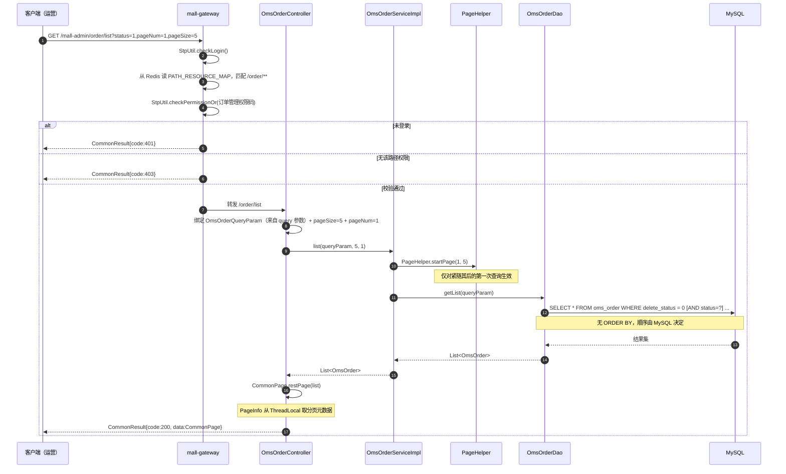

**要点**：

- `PageHelper.startPage()` 必须在查询方法**紧邻之前**调用，中间不能穿插其他查询。
- `CommonPage.restPage(List)` 依赖 `PageHelper` 写入 `ThreadLocal` 的 `Page` 对象，因此传入的必须是 `orderDao.getList()` 直接返回的 list。
- `OmsOrderQueryParam` 是**普通 Java 对象**（无 `@ModelAttribute`），Spring MVC 按「模型属性」规则从 query 参数绑定；`pageSize` / `pageNum` 则是独立的 `@RequestParam`。

**分支说明**：

| 分支 | 条件 | 结果 |
| --- | --- | --- |
| 关键字为空 | `orderSn` / `receiverKeyword` 为 null 或空串 | `<if>` 不生效，不拼该条件 |
| 前缀时间 | `createTime = "2018-09"` | `create_time LIKE '2018-09%'` |
| 无条件 | 全部条件为空 | `SELECT * FROM oms_order WHERE delete_status = 0` |
| 已删除订单 | `delete_status = 1` | **不会出现**在结果中 |

### 5.2 订单详情聚合（接口 5）

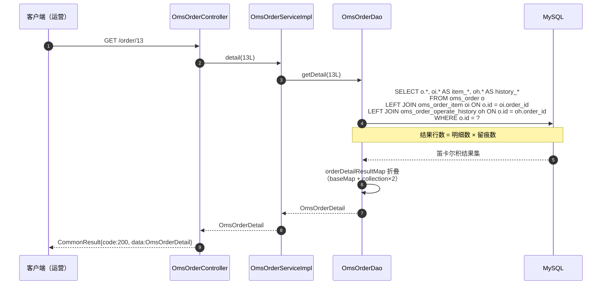

**要点**：

- 详情 SQL **不校验 `delete_status`** —— 已逻辑删除的订单仍能查到完整信息（含收货人姓名、电话、地址）。
- 结果集是「明细 × 留痕」的笛卡尔积，由 MyBatis 按 `OmsOrder` 主键去重折叠为两个 `<collection>`。一个 5 明细、20 条留痕的订单会产生 100 行中间结果。

**分支说明**：

| 情况 | 行为 |
| --- | --- |
| 订单不存在 | `getDetail` 返回 `null`，接口返回 `code: 200` + `data: null` |
| 订单无明细 | `orderItemList` 为空数组或 `null`（`LEFT JOIN` 下无匹配行） |
| 订单无留痕 | `historyList` 为空数组或 `null` |
| 明细字段缺失 | `realAmount`、`promotionAmount`、`productSkuId` 等恒为 `null`（SELECT 未取，见 2.7 ⑫） |
| 留痕字段缺失 | `orderId` 恒为 `null`（SELECT 未取 `oh.order_id`） |

### 5.3 批量发货（接口 2）—— 本模块最复杂的写流程

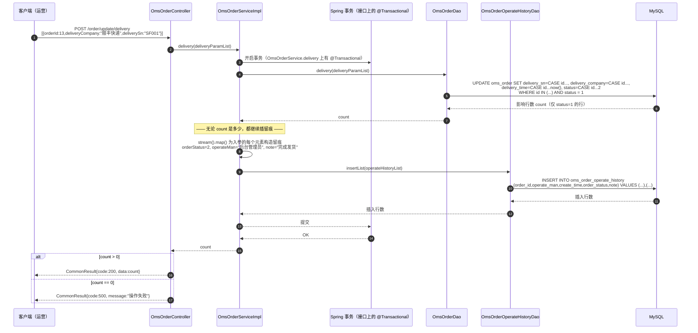

**要点**：

- 状态守卫在 SQL 里：`AND status = 1`，只有「待发货」订单会被改成「已发货」。这一写法使**并发重复发货是安全的**（第二次执行影响 0 行）。
- `delivery_time` 使用 **MySQL 的 `now()`**，是数据库时间；而留痕的 `create_time` 使用 **Java 的 `new Date()`**，是应用时间。两者可能有毫秒级甚至秒级差异（跨时区/时钟漂移时更大）。
- `operate_man` 硬编码为 `"后台管理员"`，**不记录真实登录管理员账号**。

**分支说明（关键缺陷）**：

| 分支 | 条件 | 订单表 | 留痕表 | 接口返回 |
| --- | --- | --- | --- | --- |
| 全部成功 | 所有 id 均 `status = 1` | 全部改为 2 | 每个 id 各 1 条 | `code: 200`，`data = n` |
| 部分成功 | 部分 id `status != 1` | 只有合法行被改 | **仍为每个 id 各 1 条**（含未改成功的） | `code: 200`，`data = 成功数` |
| 全部失败 | 全部 id `status != 1` | 无变化 | **仍插入 n 条「完成发货」留痕** | `code: 500 操作失败` |
| 空数组 | `body = []` | `WHERE id IN ()` 由 MyBatis 渲染为 `IN (NULL)` 之类，影响 0 行 | `insertList` 的 `<foreach>` 生成空的 `VALUES` → **SQL 语法错误** | 未处理异常，Spring 默认 500 |

> **留痕与事实不符**是本流程最严重的问题：接口返回 `code: 500` 时数据库里已多出若干条「完成发货」记录，运营在订单详情里会看到根本没发生的发货动作。详见 2.7 ⑩。
>
> **事务边界**：`@Transactional` 声明在 `OmsOrderService` 接口的 `delivery` 方法上，Spring 默认 JDK 动态代理下注解生效。因此「更新订单」与「插入留痕」在同一事务内，SQL 语法错误会整体回滚。

### 5.4 批量关闭订单（接口 3）与批量删除订单（接口 4）

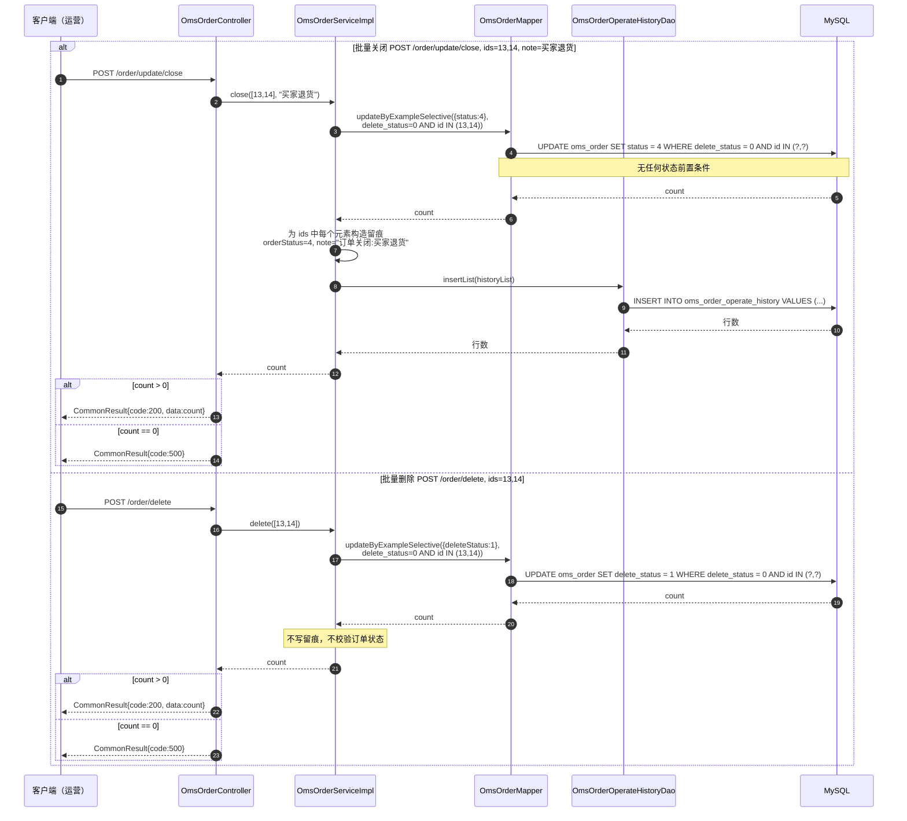

**要点**：

- 关闭使用 MBG 的 `updateByExampleSelective`，只更新非 null 字段（仅 `status`），不会误清空其他列。同理删除只更新 `delete_status`。
- **关闭无状态守卫**：`WHERE` 只有 `delete_status = 0 AND id IN (...)`。已发货（2）、已完成（3）的订单同样会被改成 4，且**没有逆向接口**。
- **删除无状态守卫、无留痕、与详情口径不一致**：待付款订单也能被删；删除后 `/order/list` 看不到，但 `/order/{id}` 仍能读到完整数据。
- 与发货相同的**留痕错配**：关闭时 `count` 与留痕数量无关，`ids` 中未命中的 id 也会得到一条「订单关闭:xxx」留痕。

**分支说明**：

| 接口 | 条件 | `count` 语义 | 留痕 |
| --- | --- | --- | --- |
| 关闭 | 任意 `delete_status = 0` 的 id | 被改为 4 的行数（含原本就是 4 的行也会被计入 `count`，因为 MySQL 的 affected rows 对「值未变化的 UPDATE」默认返回 0，取决于 JDBC `useAffectedRows` 配置 —— 需以实际驱动参数确认） | 为**入参每个 id** 插 1 条 |
| 关闭 | `delete_status = 1` 的 id | 不计入 | 仍会插留痕 |
| 删除 | `delete_status = 0` 的 id | 被置为 1 的行数 | **无** |
| 删除 | 已删除（`delete_status = 1`）的 id | 不计入（幂等） | 无 |

### 5.5 修改收货人信息 / 修改费用信息 / 备注订单（接口 6、7、8）

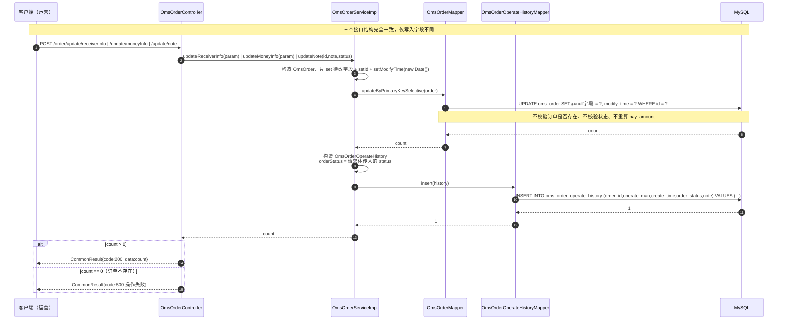

**要点与分支**：

| 接口 | 更新字段 | 留痕 `note` | 留痕 `order_status` |
| --- | --- | --- | --- |
| `updateReceiverInfo` | `receiver_name`、`receiver_phone`、`receiver_post_code`、`receiver_detail_address`、`receiver_province`、`receiver_city`、`receiver_region`、`modify_time` | `修改收货人信息` | 请求体 `status` |
| `updateMoneyInfo` | `freight_amount`、`discount_amount`、`modify_time` | `修改费用信息` | 请求体 `status` |
| `updateNote` | `note`、`modify_time` | `修改备注信息：<note>` | 请求参数 `status` |

**分支说明**：

- **订单不存在**：`updateByPrimaryKeySelective` 影响 0 行，但**留痕仍会插入**（`order_operate_history.order_id` 指向不存在的订单），接口返回 `code: 500`。这是第二个「留痕与事实不符」的场景。
- **字段传 null**：`updateByPrimaryKeySelective` 跳过 null，数据库保留原值；因此**无法通过该接口把字段清空**（例如想把 `note` 清空只能传空串 `""`）。
- **改费用不重算**：`pay_amount`、`total_amount` 不变；传入负数的 `freightAmount` / `discountAmount` 会放大应付金额（见 2.7 ③⑬）。
- **`status` 由调用方伪造**：留痕里的 `order_status` 完全取自信任输入，服务端不读数据库真实状态（见 2.7 ⑤）。

### 5.6 退货申请处理（接口 12）—— 同意 / 拒绝 / 完成

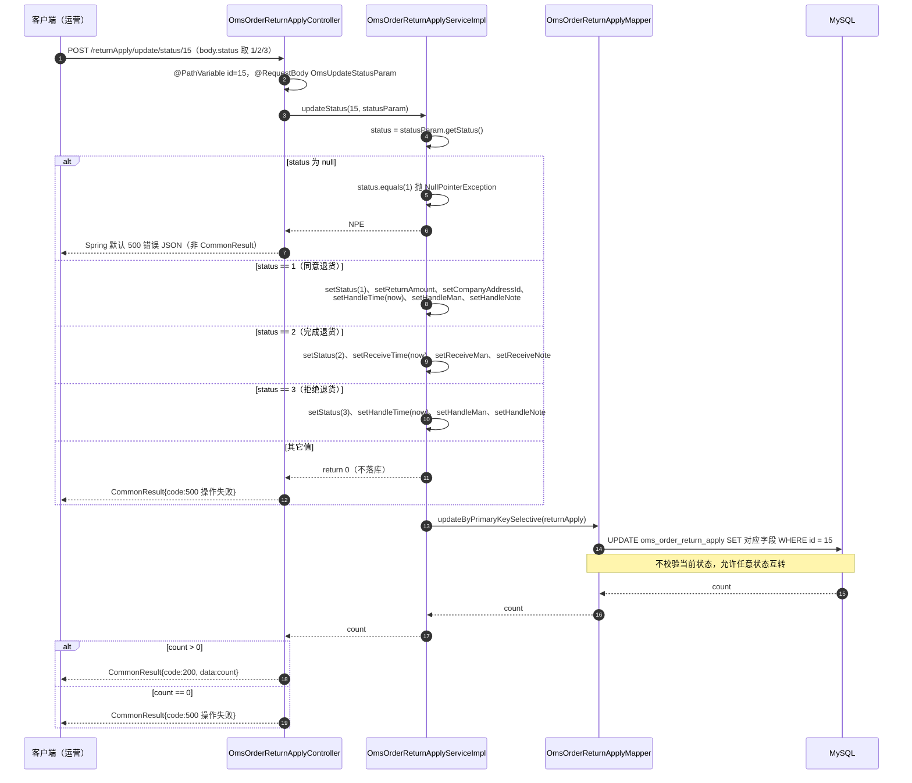

**要点**：

- **一个接口三种语义**：`status` 既是「目标状态」又是「动作选择器」。这是接口设计上的耦合点 —— 前端必须同时提交对应动作的字段（同意需 `returnAmount` + `companyAddressId`，完成需 `receiveMan`，拒绝需 `handleNote`），否则对应字段为 null 而**接口仍返回成功**。
- **无状态守卫**：不读当前状态，任意状态可跳到任意状态。
- **无副作用**：不发起支付渠道退款、不回补库存、不写 `oms_order_operate_history`、不改 `oms_order.status`。
- **无事务注解**：`OmsOrderReturnApplyService.updateStatus` 未标 `@Transactional`（当前仅一条 UPDATE）。

**退货申请状态流转（后台侧）**：

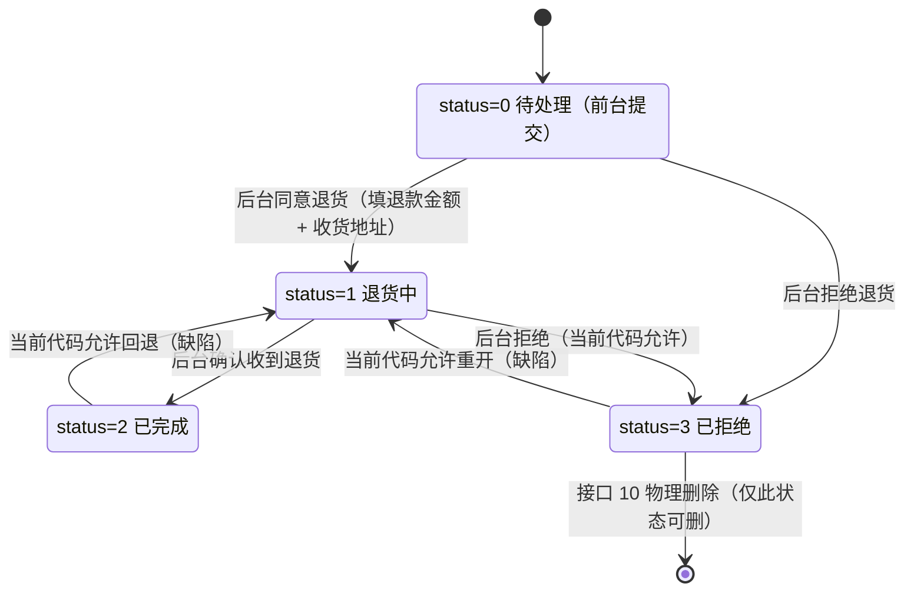

**分支说明**：

| 目标 `status` | 动作语义 | 必填字段 | 缺失后果 |
| --- | --- | --- | --- |
| 1 | 同意退货 | `returnAmount`、`companyAddressId`、`handleMan` | 字段为 null，仍返回成功，退款金额与退货地址丢失 |
| 2 | 完成退货 | `receiveMan` | 收货人为 null，仍返回成功 |
| 3 | 拒绝退货 | `handleNote`、`handleMan` | 备注为空，运营无法追溯拒绝理由 |
| 其他整数 | 无操作 | — | `code: 500 操作失败` |
| null / 未传 | — | — | `NullPointerException` → Spring 默认 500 |

### 5.7 退货原因维护（接口 13–18）

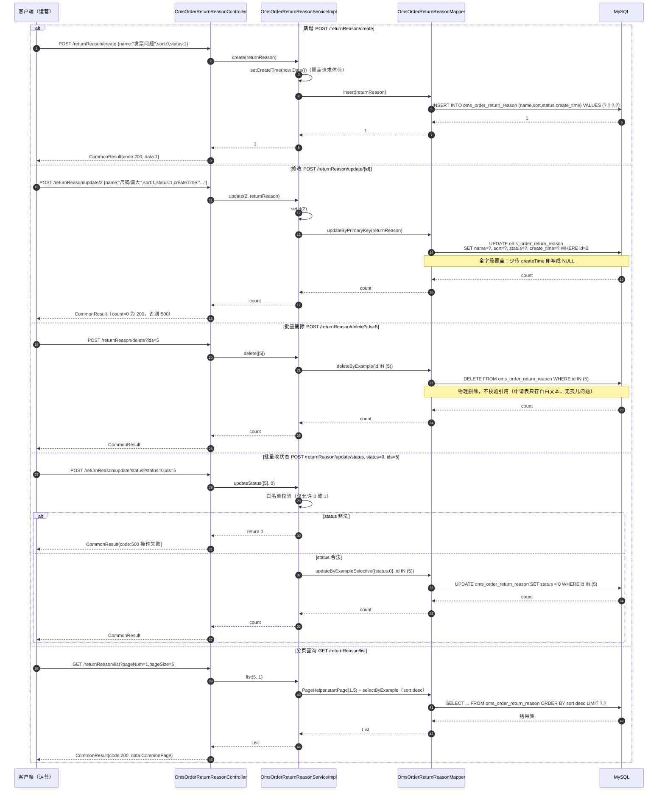

**要点**：

- **新增与修改的对称性缺陷**：`create` 用 `insert`（非 selective，未传字段写 NULL），`update` 用 `updateByPrimaryKey`（全字段覆盖）。二者都要求调用方提交全字段，但**只有 `update` 会丢数据**（把已有的 `create_time` 覆盖为 NULL）。
- **只有批量改状态有校验**（`status ∈ {0,1}`），`create` / `update` 的 `status` 可写任意整数。
- **删除无引用校验**，但因申请表只冗余自由文本 `reason`，删除字典项**不会**产生孤儿数据 —— 这是本表设计（2.5 关键设计点二）带来的实际好处。
- **`updateStatus` 用 `updateByExampleSelective`**，只更新 `status` 一列，不会误伤 `name` / `sort` / `create_time` —— 与 `update` 形成鲜明对比。

### 5.8 订单设置更新（接口 19、20）

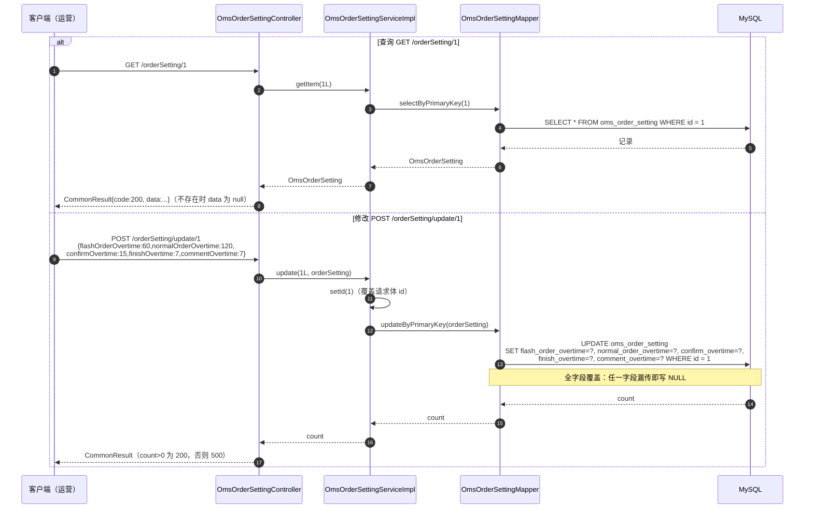

**要点**：

- 本表是**单行配置表**（脚本中只有 `id = 1`），但接口仍以 `id` 路径参数形式暴露，语义上更像「资源」而非「配置」。
- 修改是**全字段覆盖**，前端必须一次性提交 5 个时长。
- **改设置不影响存量订单**：`oms_order.auto_confirm_day` 是下单时写入的快照；`normal_order_overtime` 被 `mall-portal` 在执行时读取。
- **下游消费方（已核对 `mall-portal/src/main/java/com/macro/mall/portal/service/impl/OmsPortalOrderServiceImpl.java`）**：

| 消费位置 | 代码 | 读取字段 | 用途 |
| --- | --- | --- | --- |
| 第 218–220 行（下单） | `orderSettingMapper.selectByExample(new OmsOrderSettingExample())` → `order.setAutoConfirmDay(orderSettings.get(0).getConfirmOvertime())` | `confirm_overtime` | 写入订单的 `auto_confirm_day` 快照 |
| 第 270–272 行（定时任务兜底） | `orderSettingMapper.selectByPrimaryKey(1L)` → `portalOrderDao.getTimeOutOrders(orderSetting.getNormalOrderOvertime())` | `normal_order_overtime` | 扫描超时未支付订单 |
| 第 328–331 行（RabbitMQ 延迟消息） | `orderSettingMapper.selectByPrimaryKey(1L)` → `delayTimes = orderSetting.getNormalOrderOvertime() * 60 * 1000` | `normal_order_overtime` | 计算取消订单的延迟毫秒数 |

> **由此产生的两个真实风险**（本模块「全字段覆盖」的下游后果）：
> ① **`id` 必须为 1**：下游两处用 `selectByPrimaryKey(1L)` 硬编码，本接口若把配置行删掉或改成别的 id，前台超时取消会直接失效。
> ② **NULL 会向下游传染**：若接口 20 漏传 `normalOrderOvertime` 把它写成 NULL，第 331 行会抛 `NullPointerException`（拆箱），**下单接口直接 500**；若漏传 `confirmOvertime`，`auto_confirm_day` 被写成 NULL，自动确认收货失效。这正是 2.7 ⑥ 从「字段被清空」升级为「前台交易链路故障」的具体路径。
> ③ 第 218 行用 `get(0)` 取首行 —— 若表被清空，`IndexOutOfBoundsException`。

**分支说明**：

| 情况 | 结果 |
| --- | --- |
| 只传部分字段 | 未传字段被写为 NULL；`normal_order_overtime` 为 NULL 会**导致前台下单接口 NPE**，`confirm_overtime` 为 NULL 会导致自动确认收货失效（见上表） |
| 传 0 或负数 | 接口接受，落库成功（无校验）：`normal_order_overtime = 0` 使延迟为 0，订单一创建即被取消；负数同上 |
| `id` 不存在 | 影响 0 行，返回 `code: 500 操作失败` |
| 修改了非 1 的 id | 接口可成功（若该行存在），但前台仍读 `id = 1`，配置形同虚设 |

### 5.9 公司收发货地址查询（接口 21）

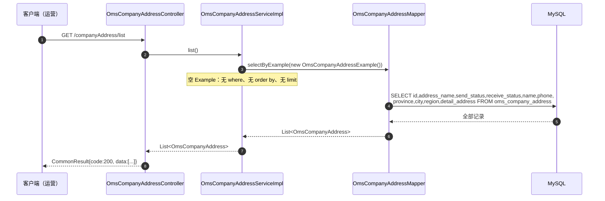

**要点**：

- 空 `Example` 等价于 `SELECT ... ` 全表查询：不分页、无排序、无过滤。脚本中只有 3 行数据，规模风险低，但**接口本身没有上限**。
- 地址簿在本模块**只读**：没有任何新增/修改/删除接口。`sendStatus` / `receiveStatus` 的默认地址标记无法通过本模块维护。
- 该接口同时服务于退货处理（接口 12）：同意退货时选择的 `companyAddressId` 就来自这里。

### 5.10 订单状态流转全景

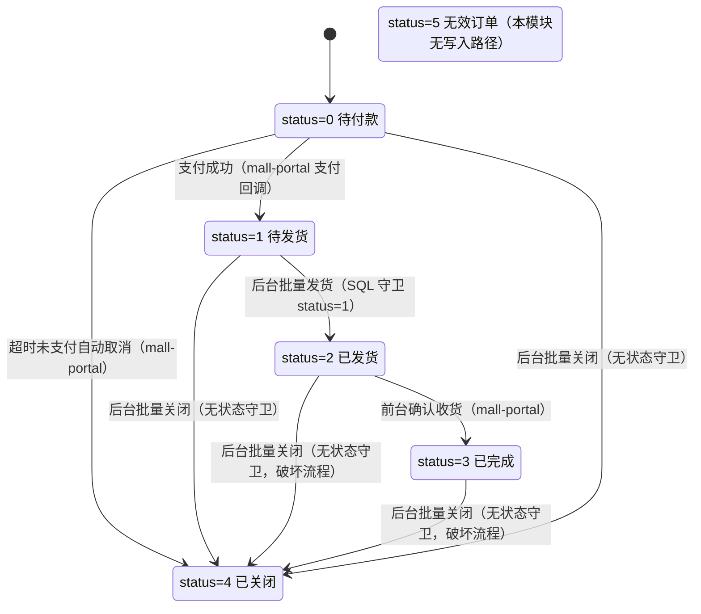

**要点**：

- 只有 **1 → 2** 这一条迁移有 SQL 级状态守卫（`AND status = 1`），其余后台迁移都无守卫。
- **4 已关闭是单向终点**：没有任何接口能把订单从已关闭改回其他状态。
- **5 无效订单在本模块无写入路径**，在前台 `mall-portal` 代码中也没有写入路径（可从「无任何 SQL 将其设为 5」确认），属历史遗留枚举值。
- 逻辑删除（`delete_status`）**不改变 `status`**，是正交维度。

### 5.11 异常流程

| 异常场景 | 触发点 | 处理者 | 返回 |
| --- | --- | --- | --- |
| 未登录访问任一接口 | 网关 `SaTokenConfig` → `StpUtil.checkLogin()` | 网关 | `CommonResult{code: 401}`，HTTP 200 |
| 已登录但无 `/order/**` 等资源权限 | 网关 → `StpUtil.checkPermissionOr(...)` | 网关 | `CommonResult{code: 403}`，HTTP 200 |
| 缺少必填 query 参数（`ids`、`note`、`status`、`id`） | Spring 参数绑定 | **无处理器** | Spring 默认错误 JSON，**非 `CommonResult` 结构** |
| 请求体 JSON 格式错误 | `HttpMessageNotReadableException` | **无处理器** | Spring 默认 400 错误 JSON |
| 请求体 `status` 为 null（接口 12） | `statusParam.getStatus().equals(1)` | **无处理器** | `NullPointerException` → Spring 默认 500 错误 JSON |
| `orderId` 为 null（接口 2、6、7） | `CASE WHEN NULL` / `WHERE id = NULL` | 无 | 影响 0 行 → `code: 500 操作失败`，但**留痕仍被插入** |
| 订单不存在（接口 5、11、17、19） | 查询返回 null | 无 | `code: 200` + `data: null` |
| 订单不存在（接口 3、4、6、7、8） | 影响行数 = 0 | Controller 判断 | `code: 500 操作失败` |
| 退货原因 `status` 非 0/1（接口 18） | Service 白名单校验 | Service | `code: 500 操作失败`（**与数据库异常不可区分**） |
| 退货申请 `status` 非 1/2/3（接口 12） | Service `else { return 0; }` | Service | `code: 500 操作失败` |
| 删除退货申请但 `status != 3`（接口 10） | `deleteByExample` 影响 0 行 | Controller 判断 | `code: 500 操作失败`（**无法区分「id 不存在」**） |
| 批量发货传空数组（接口 2） | `insertList` 的 `<foreach>` 生成空 `VALUES` | **无处理器** | MyBatis / MySQL 语法错误 → Spring 默认 500 |
| 字段超长（`note` > 500、`reason` > 200 等） | MySQL 写入 | 无 | 取决于 `sql_mode`：严格模式报错（Spring 默认 500），非严格模式静默截断 |
| 数据库异常 / 连接中断 | Mapper | **无处理器** | Spring 默认 500，堆栈可能泄露到响应 |
| 网关不可达 | 客户端 → 网关 | 无 | 连接错误 |

> **设计缺口**：`GlobalExceptionHandler` 只处理 `ApiException`、`MethodArgumentNotValidException`、`BindException` 三类，且本模块**没有任何校验注解**所以前两类之外的分支实际不会触发；**未兜底 `Exception`**。建议增加 `@ExceptionHandler(Exception.class)` 统一返回 `CommonResult` 并隐藏堆栈。
>
> **错误语义缺口**：本模块所有业务失败都塌缩为 `code: 500 操作失败`。「订单不存在」「状态不允许」「参数非法」三类问题无法区分，前端无法给出可操作的提示，也影响排障。建议为订单模块定义专属业务码（例如 1001 订单不存在、1002 状态不允许流转、1003 退款金额超限），通过 `ApiException` + `IErrorCode` 抛出。

---
## 六、日志设计

### 6.1 日志框架与配置

| 项 | 内容 |
| --- | --- |
| 门面 | SLF4J |
| 实现 | Logback |
| 配置文件 | `mall-common/src/main/resources/logback-spring.xml`（各服务通过 Maven 依赖继承，`mall-admin` 不单独提供） |
| 应用名变量 | `spring.application.name`（默认 `springBoot`，`mall-admin` 实际为 `mall-admin`） |
| 日志路径 | `${LOG_FILE:-${LOG_PATH:-${LOG_TEMP:-${java.io.tmpdir:-/tmp}}}/logs}` |
| 条件化配置 | `<if>` + `ch.qos.logback.core.boolex.PropertyEqualityCondition`，依赖 `janino`（已在 `mall-common/pom.xml` 引入） |
| 状态监听 | `<statusListener class="ch.qos.logback.core.status.NopStatusListener"/>`（**屏蔽了 Logback 内部错误告警**） |
| 框架日志降噪 | `org.slf4j` / `springfox` / `io.swagger` / `org.springframework` / `org.hibernate.validator` / `com.alibaba.nacos.client.naming` 均设为 `INFO` |

**本模块的服务端日志配置来源**：

| 来源 | 配置项 | 值 | 优先级 |
| --- | --- | --- | --- |
| `mall-admin/src/main/resources/application.yml`（第 118–120 行） | `logstash.host` | `localhost` | 低 |
| 同上 | `logstash.enableInnerLog` | `true` | 低 |
| `config/admin/mall-admin-dev.yaml`（Nacos，第 34–36 行） | `logstash.enableInnerLog` | `false` | **高** |
| `config/admin/mall-admin-prod.yaml`（Nacos，第 35 行） | `logstash.host` | `logstash` | **高** |

### 6.2 访问日志切面

`com.macro.mall.common.log.WebLogAspect` 是**本模块全部 21 个接口的唯一日志采集点** —— 5 个控制器、5 个 ServiceImpl、3 个 DAO 中**没有一行手写业务日志**。

**切点定义**：

```java
@Pointcut("execution(public * com.macro.mall.controller.*.*(..))" +
          "||execution(public * com.macro.mall.*.controller.*.*(..))")
```

覆盖范围：

| 包 | 覆盖 | 说明 |
| --- | --- | --- |
| `com.macro.mall.controller.*` | ✅ | `mall-admin` —— **本模块 5 个控制器全部命中** |
| `com.macro.mall.portal.controller.*` | ✅ | `mall-portal`（前台订单控制器） |
| `com.macro.mall.search.controller.*` | ✅ | `mall-search` |
| `com.macro.mall.demo.controller.*` | ✅ | `mall-demo` |
| `com.macro.mall.auth.controller.*` | ✅ | `mall-auth` |

**记录字段**（`com.macro.mall.common.domain.WebLog`）：

| 字段 | 来源 | 本模块取值示例 |
| --- | --- | --- |
| `description` | 方法上的 `@Operation(summary)` | `批量发货` |
| `uri` | `request.getRequestURI()` | `/order/update/delivery` |
| `url` | `request.getRequestURL()` | `http://localhost:8080/order/update/delivery` |
| `basePath` | 从 URL 剥离 path | `http://localhost:8080` |
| `method` | `request.getMethod()` | `POST` |
| `parameter` | `getParameter()` 反射提取 | 仅取带 `@RequestBody` 与 `@RequestParam` 的参数 |
| `result` | 方法返回值 | **完整响应体**，如 `CommonResult{code=200, message=操作成功, data=1}` |
| `spendTime` | 前后时间差 | 毫秒 |
| `startTime` | `System.currentTimeMillis()` | 时间戳 |
| `ip` | `request.getRemoteUser()` | **恒为 null**（详见 6.5 ①） |

**参数提取的实际效果（本模块）**：

| 接口 | `parameter` 实际内容 |
| --- | --- |
| `GET /order/list` | `[{"pageSize":5},{"pageNum":1}]` —— **`OmsOrderQueryParam` 没有 `@RequestParam` 注解，被整体丢弃** |
| `POST /order/update/delivery` | 完整的 `List<OmsOrderDeliveryParam>` JSON |
| `POST /order/update/close` | `[{"ids":[13,14]},{"note":"买家退货"}]` |
| `POST /order/update/note` | `[{"id":13},{"note":"..."},{"status":1}]` |
| `GET /order/{id}` | `null` —— `@PathVariable` **不在提取范围内** |
| `GET /returnReason/list` | `[{"pageSize":5},{"pageNum":1}]` |
| `GET /returnApply/{id}`、`GET /orderSetting/{id}`、`GET /returnReason/{id}` | `null`（同 `@PathVariable`） |

> **关键缺口**：切面对 `parameter` 的提取只覆盖 `@RequestBody` 与 `@RequestParam`（`WebLogAspect.getParameter`），因此
> ① 订单查询条件（`OmsOrderQueryParam`，无注解的模型属性）**完全不被记录**；
> ② 所有 `@PathVariable`（订单 id、申请 id、设置 id）**完全不被记录**。
> 结果是「查了哪个订单」「按什么条件查的」这两类最重要的信息在访问日志中缺失。

**输出方式**：同时以 JSON 字符串与结构化 Marker 输出：

```java
LOGGER.info(Markers.appendEntries(logMap), JSONUtil.parse(webLog).toString());
```

其中 `logMap` 仅含 `url`、`method`、`parameter`、`spendTime`、`description` 五个键，供 Logstash 做字段提取。

### 6.3 日志分类与输出目的地

`ENABLE_LOG_STASH=true`（即 `logstash.enableInnerLog=true`）时，启用 4 个 Logstash TCP Appender：

| Appender | 目的地 | 采集内容 | 绑定 Logger |
| --- | --- | --- | --- |
| `LOG_STASH_DEBUG` | `${LOG_STASH_HOST}:4560` | DEBUG 及以上 | `root` |
| `LOG_STASH_ERROR` | `${LOG_STASH_HOST}:4561` | 仅 ERROR | `root` |
| `LOG_STASH_BUSINESS` | `${LOG_STASH_HOST}:4562` | 业务日志 | `com.macro.mall` |
| `LOG_STASH_RECORD` | `${LOG_STASH_HOST}:4563` | 接口访问记录 | `com.macro.mall.common.log.WebLogAspect` |

Logstash JSON 结构（`LOG_STASH_DEBUG` / `LOG_STASH_ERROR` / `LOG_STASH_BUSINESS`；`LOG_STASH_RECORD` 少 `pid`、`thread`、`stack_trace` 三项）：

```json
{
  "project": "mall-swarm",
  "level": "INFO",
  "service": "mall-admin",
  "pid": "12345",
  "thread": "http-nio-8080-exec-1",
  "class": "com.macro.mall.common.log.WebLogAspect",
  "message": "{...}",
  "stack_trace": "..."
}
```

`ENABLE_LOG_STASH=false` 时，仅输出到：

| Appender | 目的地 | 内容 |
| --- | --- | --- |
| `CONSOLE` | 标准输出 | 全部（root level = DEBUG） |
| `FILE_DEBUG` | `${LOG_FILE_PATH}/debug/${APP_NAME}-%d{yyyy-MM-dd}-%i.log` | DEBUG 及以上（`ThresholdFilter`） |
| `FILE_ERROR` | `${LOG_FILE_PATH}/error/${APP_NAME}-%d{yyyy-MM-dd}-%i.log` | 仅 ERROR（`LevelFilter` ACCEPT/DENY） |

滚动策略（两个文件 appender 相同）：单文件 `maxFileSize` 默认 `10MB`；保留 `maxHistory` 默认 30 天。

> **注意**：`logback-spring.xml` 中 **`<if>` 块内的 `<root>` 与 `<if>` 块外的 `<root>` 是同一个 root logger 的两次配置**。当 `ENABLE_LOG_STASH=true` 时，Logstash 的 4 个 appender 与 `CONSOLE` / `FILE_DEBUG` / `FILE_ERROR` **同时生效**（后者定义在文件末尾，不会被前者覆盖）。因此「开 Logstash」不会关闭本地文件日志。

### 6.4 本模块日志埋点

本模块**没有手写业务日志**，全部依赖 `WebLogAspect` 自动记录。以「批量发货」为例，一次调用产生一条记录：

| 字段 | 示例值 |
| --- | --- |
| description | 批量发货 |
| method | POST |
| uri | `/order/update/delivery` |
| parameter | `[{"orderId":13,"deliveryCompany":"顺丰快递","deliverySn":"SF001"}]` |
| spendTime | 52（ms） |
| result | `CommonResult{code=200, message=操作成功, data=1}` |

**以「批量关闭订单」为例**：

| 字段 | 示例值 |
| --- | --- |
| description | 批量关闭订单 |
| method | POST |
| uri | `/order/update/close` |
| parameter | `[{"ids":[13,14]},{"note":"买家退货"}]` |
| spendTime | 31（ms） |
| result | `CommonResult{code=200, message=操作成功, data=2}` |

**埋点建议（当前缺失，建议补充）**：

订单是**核心交易资产**，而现行设计下订单的任何状态变化只有「访问日志」这一条痕迹 —— 它记录的是「谁调了哪个接口」，**不记录「订单 X 从状态 A 变成了状态 B」**。而 `oms_order_operate_history` 虽然写了库，但存在两个问题：`operate_man` 硬编码为 `"后台管理员"`（无法定位到具体账号），且部分场景会写入与事实不符的留痕（见 5.3、5.5）。

| 场景 | 级别 | 建议内容 |
| --- | --- | --- |
| 订单状态变更（发货 / 关闭 / 逻辑删除） | **INFO** | `订单状态变更 orderId={} {} -> {} 操作人={} 影响行数={}`，其中 `操作人` 取自 Sa-Token 登录态而非硬编码 |
| 发货留痕与订单更新不匹配 | **WARN** | `发货部分成功 请求数={} 实际更新={} 未命中id={}`（对应 2.7 ⑩） |
| 订单不存在但留痕已插入 | **WARN** | `写留痕但订单不存在 orderId={} note={}`（对应 5.5） |
| 关闭订单时前驱状态非法 | **WARN** | `关闭订单前驱状态非法 orderId={} 当前状态={}`（对应 2.7 ④） |
| 修改费用信息 | **INFO** | `订单费用调整 orderId={} 运费 {} -> {} 折扣 {} -> {} 应付金额未重算={}` |
| 退货申请状态变更 | **INFO** | `退货申请状态变更 id={} {} -> {} 退款金额={} 处理人={}` |
| 退款金额超过实付金额 | **WARN** | `退款金额超限 id={} 申请退款={} 实付={}`（对应 2.7 ⑬） |
| 管理操作影响行数为 0 | **WARN** | `订单操作未命中记录 接口={} 参数id={}` |
| 批量发货 / 空数组导致 SQL 失败 | **ERROR** | 记录入参并告警（对应 5.11） |

> 建议为订单写操作补充**结构化业务日志**（而非仅靠 `WebLogAspect`），原因是：
> ① 访问日志的 `parameter` 不含 `@PathVariable` 与无注解的模型属性，「操作了哪个订单」在日志里查不到；
> ② 访问日志只记录接口级结果，无法体现「订单表影响几行、留痕插了几条」这类中间过程，排查 2.7 ⑩ 那类「留痕与事实不符」的问题缺少依据；
> ③ `oms_order_operate_history.operate_man` 是硬编码常量，**审计维度完全缺失**，必须靠日志补齐「真实操作人」。

### 6.5 日志设计问题

| # | 问题 | 影响 | 建议 |
| --- | --- | --- | --- |
| ① | `webLog.setIp(request.getRemoteUser())` | `getRemoteUser()` 返回的是**认证用户名**而非客户端 IP；经网关转发后后端通常也拿不到认证主体，本模块该字段恒为 null | 改为 `request.getRemoteAddr()`，并结合 `X-Forwarded-For`（经网关转发）取真实客户端 IP |
| ② | 切面 `result` 记录完整响应体 | 订单详情接口会打出「订单全字段 + 明细 + 留痕」的大 JSON（见 5.2 的笛卡尔积折叠结果），订单列表接口按 `pageSize` 打出整页订单全字段 | 对列表类接口仅记录条数与 id 列表；详情接口截断 |
| ③ | `parameter` 不含 `@PathVariable` 与无注解模型属性 | 「查了哪个订单」「按什么条件查的」在访问日志中缺失（见 6.2） | 扩展 `getParameter` 支持 `@PathVariable` 与全部方法参数；或改为记录 `request.getParameterMap()` 与 URI 模板变量 |
| ④ | 无请求链路追踪 ID | 网关鉴权日志、`mall-admin` 访问日志、`mall-portal` 支付回调日志无法关联（同一笔订单在两侧都有操作） | 引入 TraceId（网关生成 MDC，经请求头逐级透传） |
| ⑤ | 订单无状态变更审计日志 | `oms_order_operate_history.operate_man` 硬编码为 `"后台管理员"`，无法定位真实操作人；且存在「留痕与事实不符」的场景 | 补 6.4 的埋点；`operate_man` 改取 Sa-Token 登录账号 |
| ⑥ | Nacos 与本地配置冲突 | `mall-admin/application.yml` 设 `enableInnerLog: true`，Nacos `mall-admin-dev.yaml` 设 `false`。Nacos 优先级更高，**dev 环境 Logstash 实际不生效** | 统一配置来源，避免同名 key 分处两地 |
| ⑦ | `NopStatusListener` 屏蔽了 Logback 内部错误 | 配置错误（如 Logstash 不可达、`<if>` 条件拼写错误）不会告警 | 生产环境改用默认 status listener 或单独保留告警通道 |
| ⑧ | `LOG_STASH_RECORD` 的 JSON 缺 `pid` / `thread` | 该 appender 的 pattern 只有 `project`、`level`、`service`、`class`、`message` 五项，缺少 `pid` 与 `thread`，多实例/多线程场景下无法区分 | 补齐 `pid`、`thread`，与其它三个 appender 保持结构一致 |
| ⑨ | 退款、库存、金额调整无审计日志 | 改费用、同意退款都不留业务日志，出现资金争议时无据可查 | 对资金相关写操作统一落 INFO 级业务日志并保留至少 1 年 |

---

## 七、测试用例设计

### 7.1 测试策略

| 层次 | 范围 | 工具 | 目标 |
| --- | --- | --- | --- |
| 单元测试 | `OmsOrderServiceImpl`、`OmsOrderReturnApplyServiceImpl`、`OmsOrderReturnReasonServiceImpl`、`OmsOrderSettingServiceImpl` | JUnit 5 + Mockito | 留痕构造逻辑、状态分支（1/2/3/其它/null）、影响行数分支、`createTime` 覆盖 |
| 控制器测试 | 5 个 Controller | MockMvc | 参数绑定（query vs body vs path）、响应结构、`count` 分支、缺失参数的兜底行为 |
| DAO / SQL 测试 | `OmsOrderDao`、`OmsOrderReturnApplyDao`、`OmsOrderOperateHistoryDao` | `@SpringBootTest` + H2 或真实 MySQL | `getList` 各条件组合、`delivery` 的 `CASE` 批量更新与 `status = 1` 守卫、`getDetail` 的 `columnPrefix` 映射与笛卡尔积折叠、`insertList` 批量插入、空列表行为 |
| 集成测试 | Service + Mapper + MySQL | `@SpringBootTest` + `@Transactional` 回滚 | 事务边界（发货的「更新 + 留痕」是否原子）、留痕与订单的一致性 |
| 接口测试 | 经网关的完整链路 | Postman / RestAssured | 鉴权（401 / 403）、路径权限映射、网关前缀归属、跨服务同名路径不冲突 |
| 并发测试 | 并发发货、并发关闭 | JMeter / 自研脚本 | `WHERE status = 1` 对重复发货的防重能力；关闭/改信息的后写覆盖问题 |

**测试数据基线**：

- `oms_order`：脚本 65 行数据（`id` 12–76），`AUTO_INCREMENT = 77`；其中 `delete_status = 0` 与 `= 1` 混合存在，覆盖各种 `status` 值。
- `oms_order_item`：`AUTO_INCREMENT = 115`，`order_id` 覆盖 12–19 等订单。
- `oms_order_operate_history`：`AUTO_INCREMENT = 44`。
- `oms_order_return_apply`：`AUTO_INCREMENT = 27`，覆盖 `status` 0 / 1 / 2 / 3。
- `oms_order_return_reason`：`AUTO_INCREMENT = 16`，实际 6 行（`id` 1–5、12），含 `status = 0` 一行。
- `oms_order_setting`：`AUTO_INCREMENT = 2`，仅 `id = 1`（60 / 120 / 15 / 7 / 7）。
- `oms_company_address`：`AUTO_INCREMENT = 4`，3 行（`id` 1–3）。

**测试数据构造要点**：验证 5.3 的「留痕错配」与 5.2 的笛卡尔积必须**自行构造**多明细 + 多留痕的订单，脚本数据不足以覆盖。

### 7.2 功能用例

| 编号 | 用例名称 | 前置条件 | 步骤 | 预期结果 | 优先级 |
| --- | --- | --- | --- | --- | --- |
| OMS-001 | 订单列表无条件分页 | 库中有 ≥6 条未删除订单 | `GET /order/list` | `code=200`，`data.pageSize=5`，`data.list` 长度 ≤5，`total` 等于未删除订单数 | 高 |
| OMS-002 | 订单列表按 `delete_status` 过滤 | 存在 `delete_status=1` 的订单 | `GET /order/list` | 结果**不含**已删除订单 | **高** |
| OMS-003 | 按订单编号精确查询 | 存在 `order_sn='201809150102000002'` | `GET /order/list?orderSn=201809150102000002` | 返回恰 1 条，`orderSn` 完全相等 | 高 |
| OMS-004 | 订单编号模糊查询不生效 | 同上 | `GET /order/list?orderSn=20180915` | **返回空**（条件是 `=` 而非 `LIKE`），确认与前端预期一致 | 高 |
| OMS-005 | 按收货人姓名模糊查询 | 存在 `receiver_name='大梨'` | `GET /order/list?receiverKeyword=大` | 返回所有 `receiver_name` 或 `receiver_phone` 含「大」的订单 | 高 |
| OMS-006 | 按收货人手机号模糊查询 | 同上 | `GET /order/list?receiverKeyword=18033` | 返回 `receiver_phone` 含该串的订单 | 高 |
| OMS-007 | 按订单状态过滤 | 存在 `status=1` 与 `status=4` 的订单 | `GET /order/list?status=1` | 结果全部为 `status=1` | 高 |
| OMS-008 | 按订单来源过滤 | 存在 `source_type=0/1` | `GET /order/list?sourceType=1` | 结果全部为 `sourceType=1`（app 订单） | 中 |
| OMS-009 | 按订单类型过滤 | 存在 `order_type=0` | `GET /order/list?orderType=0` | 结果全部为 `orderType=0` | 中 |
| OMS-010 | 按提交时间前缀过滤 | 存在 2018-09 与其他月份订单 | `GET /order/list?createTime=2018-09` | 结果 `createTime` 均以 `2018-09` 开头 | 高 |
| OMS-011 | 多条件组合过滤 | 存在同时满足的订单 | `GET /order/list?status=1&sourceType=1&createTime=2018` | 结果为条件交集 | 高 |
| OMS-012 | 订单详情聚合三部分数据 | 存在有明细且有留痕的订单 | `GET /order/13` | `data` 含订单全字段 + `orderItemList` + `historyList`，非空 | **高** |
| OMS-013 | 详情明细按 `id` 升序 | 订单有 ≥2 条明细 | `GET /order/{id}` | `orderItemList` 按明细 `id` 升序 | 中 |
| OMS-014 | 详情留痕按时间倒序 | 订单有 ≥2 条留痕 | `GET /order/{id}` | `historyList` 按 `createTime` 倒序 | 中 |
| OMS-015 | 详情商品快照不受商品变更影响 | 记录明细快照后修改 `pms_product`（或删除商品） | `GET /order/{id}` | `orderItemList` 的 `productName`、`productPic`、`productPrice` 仍是下单时的值 | **高** |
| OMS-016 | 批量发货（全部待发货） | 存在 2 个 `status=1` 订单 | `POST /order/update/delivery` 传 2 个元素 | `code=200`，`data=2`；两单 `status=2`、`delivery_company`/`delivery_sn`/`delivery_time` 已写；各新增 1 条留痕 | **高** |
| OMS-017 | 批量发货（含非待发货订单） | 存在 1 个 `status=1` 与 1 个 `status=3` 订单 | 同上传 2 个元素 | `code=200`，`data=1`；仅待发货单被改；**留痕表新增 2 条**（复现 2.7 ⑩，确认是否为缺陷） | **高** |
| OMS-018 | 批量发货（全部非待发货） | 存在 2 个非 `status=1` 订单 | 同上传 2 个元素 | `code=500`；订单无变化；**留痕表仍新增 2 条**（确认是否为缺陷） | **高** |
| OMS-019 | 批量关闭订单 | 存在 2 个 `delete_status=0` 订单 | `POST /order/update/close?ids=..&ids=..&note=买家退货` | `code=200`；两单 `status=4`；各新增 1 条留痕 `note` 为 `订单关闭:买家退货` | 高 |
| OMS-020 | 关闭订单的留痕文案 | 同上 | 检查 `oms_order_operate_history.note` | 值为 `订单关闭:` + 入参 note 拼接 | 中 |
| OMS-021 | 批量逻辑删除订单 | 存在 2 个未删除订单 | `POST /order/delete?ids=..&ids=..` | `code=200`，`data=2`；两单 `delete_status=1`；**不新增留痕** | 高 |
| OMS-022 | 删除后再查列表 | 承接 OMS-021 | `GET /order/list` | 被删订单不再出现 | 高 |
| OMS-023 | 修改收货人信息 | 存在订单 13 | `POST /order/update/receiverInfo` 改全部收货字段 | `code=200`；`receiver_*` 全部更新；`modify_time` 已刷新；新增 1 条留痕 `note=修改收货人信息` | 高 |
| OMS-024 | 修改收货人仅传部分字段 | 同上 | 只传 `orderId` + `receiverName` | 其余收货字段**保持原值**（selective 更新） | 高 |
| OMS-025 | 修改订单费用信息 | 存在订单 13 | `POST /order/update/moneyInfo` 传 `freightAmount=20`、`discountAmount=50` | `code=200`；两字段已更新；`modify_time` 刷新；新增 1 条留痕 `note=修改费用信息` | 高 |
| OMS-026 | 备注订单 | 存在订单 13 | `POST /order/update/note?id=13&note=加急&status=1` | `code=200`；`oms_order.note='加急'`；留痕 `note='修改备注信息：加急'`、`order_status=1` | 高 |
| OMS-027 | 退货申请列表分页 | 库中有 ≥6 条申请 | `GET /returnApply/list` | `code=200`，`pageSize=5`，`list` 长度 ≤5 | 高 |
| OMS-028 | 退货申请按状态过滤 | 存在 `status=0` 与 `status=2` | `GET /returnApply/list?status=0` | 结果全部为 `status=0` | 高 |
| OMS-029 | 退货申请按服务单号过滤 | 存在 `id=15` | `GET /returnApply/list?id=15` | 返回恰 1 条 | 高 |
| OMS-030 | 退货申请按退货人模糊过滤 | 存在 `return_name='大梨'` | `GET /returnApply/list?receiverKeyword=大` | 返回 `return_name` 或 `return_phone` 含「大」的申请 | 高 |
| OMS-031 | 退货申请按处理人过滤 | 存在 `handle_man='admin'` | `GET /returnApply/list?handleMan=admin` | 结果 `handleMan` 均为 `admin` | 中 |
| OMS-032 | 退货申请按申请 / 处理时间前缀过滤 | 存在 2018-10 申请 | `GET /returnApply/list?createTime=2018-10` | 结果 `createTime` 以 `2018-10` 开头 | 中 |
| OMS-033 | 退货申请详情带出公司地址 | 存在 `company_address_id=1` 的申请 | `GET /returnApply/3` | `data.companyAddress.id=1`，含地址全字段 | 高 |
| OMS-034 | 同意退货（status→1） | 存在 `status=0`、`company_address_id` 为 NULL 的申请 | `POST /returnApply/update/status/15`，body `status=1` + 退款金额 + 地址 + 处理人 | `code=200`；`status=1`、`return_amount`、`company_address_id`、`handle_time`、`handle_man`、`handle_note` 均已写 | **高** |
| OMS-035 | 确认收货完成退货（status→2） | 存在 `status=1` 的申请 | body `status=2` + `receiveMan` + `receiveNote` | `code=200`；`status=2`、`receive_time`、`receive_man`、`receive_note` 已写 | **高** |
| OMS-036 | 拒绝退货（status→3） | 存在 `status=0` 的申请 | body `status=3` + `handleMan` + `handleNote` | `code=200`；`status=3`、`handle_time`、`handle_man`、`handle_note` 已写 | **高** |
| OMS-037 | 删除已拒绝的申请 | 存在 `status=3` 的申请 | `POST /returnApply/delete?ids={id}` | `code=200`；行被**物理删除** | 高 |
| OMS-038 | 添加退货原因 | — | `POST /returnReason/create` 传 `name`/`sort`/`status` | `code=200`；新增记录，`create_time` 为服务器当前时间（忽略请求体传入值） | 高 |
| OMS-039 | 修改退货原因（全字段回传） | 存在 `id=2` | `POST /returnReason/update/2` 回传全部字段 | `code=200`；`name`/`sort`/`status`/`create_time` 均按提交值更新 | 高 |
| OMS-040 | 批量删除退货原因 | 存在 `id=12` | `POST /returnReason/delete?ids=12` | `code=200`；行被物理删除 | 中 |
| OMS-041 | 退货原因列表按 `sort desc` | 库中有不同 `sort` | `GET /returnReason/list` | 结果按 `sort` 倒序 | 中 |
| OMS-042 | 退货原因详情 | 存在 `id=1` | `GET /returnReason/1` | `code=200`，`data.id=1` | 中 |
| OMS-043 | 批量启用 / 停用退货原因 | 存在 `id=1,2` | `POST /returnReason/update/status?status=0&ids=1&ids=2` | `code=200`；两行 `status=0`，`name`/`sort`/`create_time` **不变** | 高 |
| OMS-044 | 查询订单设置 | 存在 `id=1` | `GET /orderSetting/1` | `code=200`；五项时长与脚本一致（60/120/15/7/7） | 高 |
| OMS-045 | 修改订单设置 | 同上 | `POST /orderSetting/update/1` 回传全部 5 项，改 `normalOrderOvertime=60` | `code=200`；`normal_order_overtime=60`，其余不变 | **高** |
| OMS-046 | 获取全部收货地址 | 库中有 3 条地址 | `GET /companyAddress/list` | `code=200`，`data` 为数组且长度 3，元素含全部 10 个字段 | 高 |
| OMS-047 | 后台接口需登录 | 不携带 Token | 调用任一接口 | `code=401` | 高 |
| OMS-048 | 后台接口需权限 | 携带权限码不含订单资源的 Token | 调用 `/order/list` | `code=403` | 高 |
| OMS-049 | 网关前缀归属正确 | 携带合法 Token | 分别调用 `/mall-admin/order/list` 与 `/mall-portal/order/list` | 二者都能成功且返回**不同服务**的数据（验证同名路径在运行期不冲突） | **高** |

### 7.3 边界用例

| 编号 | 用例名称 | 输入 | 预期结果 | 优先级 |
| --- | --- | --- | --- | --- |
| OMS-B01 | 分页页码为 0 | `GET /order/list?pageNum=0` | PageHelper 行为需明确（通常返回第 1 页），不应报错 | 中 |
| OMS-B02 | 分页页大小超上限 | `GET /order/list?pageSize=10000` | 不返回全表（当前无上限，需明确是否允许） | 中 |
| OMS-B03 | 分页页大小为 0 | `GET /order/list?pageSize=0` | 需明确（PageHelper 通常返回全部或空） | 中 |
| OMS-B04 | 时间前缀为空串 | `GET /order/list?createTime=` | 等价于不传，返回全部 | 中 |
| OMS-B05 | 时间前缀为非法格式 | `GET /order/list?createTime=abc` | `LIKE 'abc%'` 无匹配，返回空列表（不报错） | 中 |
| OMS-B06 | 收货人关键字为单字符 | `receiverKeyword=大` | 模糊匹配正常 | 中 |
| OMS-B07 | 关键字含 SQL 特殊字符 | `receiverKeyword=%' or '1'='1` | 作为普通字符串模糊匹配，**不发生注入**（`#{}` 预编译） | **高** |
| OMS-B08 | 关键字含通配符 | `receiverKeyword=%` | 因 `concat("%", ?, "%")`，`%` 会作为通配符匹配全部订单 —— 需确认是否符合预期 | 中 |
| OMS-B09 | 关键字前后空格 | `receiverKeyword= 大梨 ` | 不做 trim，按实际字符串匹配（预期查不到） | 低 |
| OMS-B10 | 批量发货单元素 | `body` 只有 1 个元素 | 正常发货，`data=1` | 高 |
| OMS-B11 | 批量发货大量元素 | `body` 含 500 个元素 | `CASE WHEN` 语句极长，确认是否触发 `max_allowed_packet` 限制 | 中 |
| OMS-B12 | 批量发货空数组 | `body=[]` | 确认行为：预期 `insertList` 生成空 `VALUES` 导致 SQL 语法错误 → Spring 默认 500 | **高** |
| OMS-B13 | 批量发货重复 orderId | `body` 含两个相同 `orderId` | `CASE` 分支重复，MySQL 取第一个匹配；`count` 为 1，留痕为 2 条 | 中 |
| OMS-B14 | 批量发货 `deliveryCompany` 为空串 | `deliveryCompany=""` | 成功，写入空串（区别于 NULL） | 低 |
| OMS-B15 | 批量发货物流单号超长 | `deliverySn` 为 65 字符 | 依赖 `sql_mode`：严格模式报错，否则截断 | 中 |
| OMS-B16 | 关闭订单空 ids | `POST /order/update/close?note=x`（无 ids） | Spring 抛 `MissingServletRequestParameterException`，返回非 `CommonResult` 结构 | 中 |
| OMS-B17 | 关闭订单 ids 含不存在 id | `ids=13&ids=999999` | 只影响存在的记录，`data` 为实际影响行数；留痕**仍为 2 条** | 中 |
| OMS-B18 | 关闭订单 note 为空串 | `note=` | 留痕 `note='订单关闭:'` | 低 |
| OMS-B19 | 关闭订单 note 超长 | `note` 为 501 字符 | 拼接后留痕 `note` 超 `varchar(500)`，依赖 `sql_mode` | 中 |
| OMS-B20 | 备注订单 note 超长 | `note` 为 501 字符 | 同上 | 中 |
| OMS-B21 | 备注订单 note 为空串 | `note=` | `oms_order.note` 被清空为空串 | 低 |
| OMS-B22 | 修改费用传 0 | `freightAmount=0, discountAmount=0` | 成功，两字段置 0 | 中 |
| OMS-B23 | 修改费用传 null | 只传 `orderId` + `status` | 两字段保持原值（selective 跳过） | 中 |
| OMS-B24 | 修改费用传 0.001 | `freightAmount=0.001` | 落 `decimal(10,2)` 被舍入为 `0.00` | 中 |
| OMS-B25 | 修改费用传超大值 | `freightAmount=99999999999` | 超 `decimal(10,2)` 上限，报错或依赖 `sql_mode` | 中 |
| OMS-B26 | 退货申请详情 id 为 0 | `GET /returnApply/list?id=0` | 返回空列表（`id=0` 不存在），**不是**「不过滤」 | **高** |
| OMS-B27 | 退货申请 `receiverKeyword` 命中 `return_phone` | 关键字只匹配电话 | 能匹配到（但返回体中 `returnPhone` 为 null） | 中 |
| OMS-B28 | 退货处理退款金额为 0 | `status=1, returnAmount=0` | 成功，`return_amount=0.00` | 中 |
| OMS-B29 | 退货处理 `companyAddressId` 不存在 | `status=1, companyAddressId=999999` | **写入成功**（无外键），详情接口 `companyAddress` 为 null | **高** |
| OMS-B30 | 退货原因 `name` 为 100 字符 | 边界长度 | 成功 | 中 |
| OMS-B31 | 退货原因 `sort` 为负数 | `sort=-1` | 成功（无 `@Min`），排序时排最后 | 低 |
| OMS-B32 | 订单设置时长传 0 | `normalOrderOvertime=0` | 成功落库，可能导致超时任务立即取消订单 —— 需确认是否为缺陷 | **高** |
| OMS-B33 | 订单设置时长传负数 | `confirmOvertime=-1` | 成功落库（无校验） | 中 |
| OMS-B34 | 订单设置传超大值 | `finishOvertime=2147483647` | 成功（`int(11)` 上限） | 低 |
| OMS-B35 | 订单详情含大量明细与留痕 | 构造 20 明细 × 50 留痕的订单 | 结果行数 1000，确认响应时间与折叠正确性 | 中 |
| OMS-B36 | 已逻辑删除订单的详情 | `delete_status=1` 的订单 | `/order/{id}` **仍返回完整数据**（确认是否符合预期） | **高** |

### 7.4 异常与校验用例

| 编号 | 用例名称 | 输入 | 预期结果 | 优先级 |
| --- | --- | --- | --- | --- |
| OMS-E01 | 未登录访问 | 无 `Authorization` 头 | `code=401`，HTTP 200 | 高 |
| OMS-E02 | 无权限访问 | 权限码不含订单资源 | `code=403` | 高 |
| OMS-E03 | 缺少 `ids` 参数 | `POST /order/delete` 不带 `ids` | Spring 抛 `MissingServletRequestParameterException`，返回**非 `CommonResult`** 结构 | 中 |
| OMS-E04 | 缺少 `note` 参数 | `POST /order/update/close?ids=13` | 同上 | 中 |
| OMS-E05 | 缺少 `status` 参数 | `POST /order/update/note?id=13&note=x` | 同上 | 中 |
| OMS-E06 | 缺少 `status` 参数（退货原因） | `POST /returnReason/update/status?ids=1` | 同上 | 中 |
| OMS-E07 | 请求体为空对象 | `POST /order/update/receiverInfo` body `{}` | `orderId` 为 null → 影响 0 行 → `code=500`，**但留痕插入**（`order_id` 为 null） | **高** |
| OMS-E08 | 请求体 `orderId` 为 null（发货） | `[{"deliveryCompany":"顺丰"}]` | SQL 的 `CASE WHEN NULL` 不命中任何行，`code=500`，**留痕 `order_id` 为 null** | **高** |
| OMS-E09 | 请求体 JSON 格式错误 | `{"orderId": }` | Spring 默认 400 错误 JSON，**非 `CommonResult`** | 中 |
| OMS-E10 | 请求体 `Content-Type` 错误 | 用 `text/plain` 提交 JSON | `HttpMediaTypeNotSupportedException`，Spring 默认 415 | 低 |
| OMS-E11 | 订单不存在（详情） | `GET /order/999999` | `code=200` + `data=null` | **高** |
| OMS-E12 | 订单不存在（关闭 / 删除 / 改信息） | `ids=999999` / `orderId=999999` | `code=500 操作失败`（无法区分「不存在」与「数据库错误」） | 高 |
| OMS-E13 | 退货申请不存在（详情） | `GET /returnApply/999999` | `code=200` + `data=null` | 高 |
| OMS-E14 | 删除非「已拒绝」的申请 | `POST /returnApply/delete?ids=15`（`status=0`） | `code=500 操作失败`，行未删除 | **高** |
| OMS-E15 | 退货处理 `status` 为 null | body `{}` 或 `{"returnAmount":100}` | `NullPointerException` → Spring 默认 500 错误 JSON（**非 `CommonResult`**） | **高** |
| OMS-E16 | 退货处理 `status` 为非法值 | `status=0` 或 `status=4` | Service 返回 0 → `code=500 操作失败`，申请不变 | 高 |
| OMS-E17 | 退货处理跨状态跳转 | 对 `status=0` 的申请直接提交 `status=2` | **当前会成功**（无守卫），申请直接变为「已完成」 —— 确认是否为缺陷 | **高** |
| OMS-E18 | 退货处理回退状态 | 对 `status=2` 的申请提交 `status=1` | **当前会成功**，已完成的申请退回「退货中」 —— 确认是否为缺陷 | **高** |
| OMS-E19 | 关闭已发货订单 | 对 `status=2` 的订单执行关闭 | **当前会成功**，订单变为 4，后续「确认收货」链路断裂 —— 确认是否为缺陷 | **高** |
| OMS-E20 | 关闭已完成订单 | 对 `status=3` 的订单执行关闭 | **当前会成功** —— 确认是否为缺陷 | **高** |
| OMS-E21 | 删除待付款订单 | 对 `status=0` 的订单执行逻辑删除 | **当前会成功** —— 确认是否符合业务规则 | 高 |
| OMS-E22 | 修改退货原因但不传 `createTime` | `{"name":"x","sort":1,"status":1}` | **`create_time` 被写成 NULL**（`updateByPrimaryKey` 全字段覆盖）—— 确认是否为缺陷 | **高** |
| OMS-E23 | 修改订单设置但只传部分字段 | `{"normalOrderOvertime":60}` | 其余 4 项**被写成 NULL** —— 确认是否为缺陷 | **高** |
| OMS-E24 | 退货原因新增时不传 `name` | `{"sort":1,"status":1}` | 成功，`name` 为 NULL（无 `@NotEmpty`），下拉框出现空选项 | 高 |
| OMS-E25 | 退货原因新增时 `status` 非法 | `status=9` | **当前会成功**（新增无校验），与接口 18 的校验不一致 | 中 |
| OMS-E26 | 退货原因批量改状态传非法值 | `status=9` | `code=500 操作失败`，不落库（Service 白名单生效） | 高 |
| OMS-E27 | 备注订单 `status` 传非法值 | `status=99` | **当前会成功**，`oms_order_operate_history.order_status=99`（无校验） | 高 |
| OMS-E28 | 修改费用传负运费 | `freightAmount=-100` | **当前会成功**，订单金额被放大 —— 确认是否为缺陷 | **高** |
| OMS-E29 | 修改费用传负折扣 | `discountAmount=-100` | 同上 | **高** |
| OMS-E30 | 同意退货退款金额超过实付 | `returnAmount=99999`（实付 3585.98） | **当前会成功**，无上界校验 —— 确认是否为缺陷 | **高** |
| OMS-E31 | 修改费用后核对 `pay_amount` | 改 `freightAmount` 后查订单 | **`pay_amount` 未变化**，三处金额互相矛盾（2.7 ③） | **高** |
| OMS-E32 | 批量发货中途抛异常 | 模拟留痕插入失败 | 验证订单更新是否回滚（`@Transactional` 声明在接口上，预期整体回滚） | **高** |
| OMS-E33 | 并发重复发货同一订单 | 两个线程同时发货同一 `status=1` 订单 | 只有一个成功，另一个影响 0 行（SQL `AND status = 1` 守卫）；但**留痕会有 2 条** | **高** |
| OMS-E34 | 并发关闭 + 修改收货人 | 两线程同时操作同一订单 | 「后写覆盖先写」，无乐观锁保护 —— 确认是否可接受 | 中 |
| OMS-E35 | 数据库不可用 | 停掉 MySQL | Spring 默认 500 错误 JSON，堆栈可能泄露到响应 | 中 |
| OMS-E36 | 网关不可达 | 停掉网关 | 客户端连接失败 | 低 |
| OMS-E37 | 超长 `note` | `note` 1000 字符 | 依赖 `sql_mode`：严格模式报错并返回 Spring 默认 500，非严格模式静默截断 | 中 |
| OMS-E38 | 超长 `reason`（前台写入） | — | 同上（前台侧问题，此处仅回归验证） | 低 |

### 7.5 现有测试现状

| 项 | 现状 |
| --- | --- |
| 订单模块单元测试 | **无** |
| 订单模块 DAO / SQL 测试 | **无**（`PmsDaoTests` 只测商品域） |
| 订单模块接口测试 | **无** |
| 全项目测试类总数 | **7 个** = **5 个** `*ApplicationTests` + **2 个** DAO 测试 |
| `*ApplicationTests` 明细 | `MallDemoApplicationTests`、`MallGatewayApplicationTests`、`MallMonitorApplicationTests`、`MallPortalApplicationTests`、`MallSearchApplicationTests` |
| DAO 测试明细 | `PmsDaoTests`（mall-admin）、`PortalProductDaoTests`（mall-portal） |
| **`MallAdminApplicationTests` 是否存在** | **不存在** —— `mall-admin` 没有任何 `*ApplicationTests`；该模块下唯一的测试类是 `src/test/com/macro/mall/PmsDaoTests.java` |
| 测试目录约定 | **不一致**：`mall-admin/src/test/com/macro/mall/PmsDaoTests.java` **缺少 `java` 中间目录**，不符合 Maven 标准布局（`src/test/java/...`），**该测试不会被 `mvn test` 编译与执行** |
| 父 POM 配置 | `pom.xml` 第 34 行 `<skipTests>true</skipTests>`，默认跳过测试 |

> **建议**：
> ① 修正 `mall-admin` 测试目录为 `src/test/java/...`，使现有 `PmsDaoTests` 真正被执行；
> ② 移除父 POM 的 `skipTests` 默认值，改由 CI 显式控制；
> ③ 为订单模块新建 DAO 测试（对照 7.1 的 DAO 层次），优先覆盖 `OmsOrderDao.delivery` 的 `CASE` 语句与 `status = 1` 守卫、`OmsOrderDao.getDetail` 的 `columnPrefix` 映射、`OmsOrderOperateHistoryDao.insertList` 的空列表行为；
> ④ 按 7.2–7.4 用例补齐测试。其中 **OMS-017 / OMS-018（留痕与事实不符）、OMS-E19 / OMS-E20（无状态守卫关闭）、OMS-E22 / OMS-E23（全字段覆盖丢数据）、OMS-E31（金额不重算）、OMS-E33（并发发货留痕重复）** 五项直接对应第二节与第五节识别出的核心设计缺陷，应作为**第一优先级**回归用例 —— 这些用例的当前预期结果很可能是「有缺陷」，其价值在于**把缺陷固化为可复现的测试**，而非证明实现正确。

---

## 八、附录

### 8.1 涉及源码文件

| 文件 | 说明 |
| --- | --- |
| `mall-admin/src/main/java/com/macro/mall/controller/OmsOrderController.java` | 订单管理接口（8 个端点） |
| `mall-admin/src/main/java/com/macro/mall/controller/OmsOrderReturnApplyController.java` | 退货申请管理接口（4 个端点） |
| `mall-admin/src/main/java/com/macro/mall/controller/OmsOrderReturnReasonController.java` | 退货原因管理接口（6 个端点） |
| `mall-admin/src/main/java/com/macro/mall/controller/OmsOrderSettingController.java` | 订单设置管理接口（2 个端点） |
| `mall-admin/src/main/java/com/macro/mall/controller/OmsCompanyAddressController.java` | 公司收发货地址接口（1 个端点） |
| `mall-admin/src/main/java/com/macro/mall/service/OmsOrderService.java` | 订单服务接口（5 个写方法标注 `@Transactional`） |
| `mall-admin/src/main/java/com/macro/mall/service/OmsOrderReturnApplyService.java` | 退货申请服务接口（无 `@Transactional`） |
| `mall-admin/src/main/java/com/macro/mall/service/OmsOrderReturnReasonService.java` | 退货原因服务接口 |
| `mall-admin/src/main/java/com/macro/mall/service/OmsOrderSettingService.java` | 订单设置服务接口 |
| `mall-admin/src/main/java/com/macro/mall/service/OmsCompanyAddressService.java` | 收货地址服务接口 |
| `mall-admin/src/main/java/com/macro/mall/service/impl/OmsOrderServiceImpl.java` | 订单服务实现（含留痕构造） |
| `mall-admin/src/main/java/com/macro/mall/service/impl/OmsOrderReturnApplyServiceImpl.java` | 退货申请服务实现（状态分支） |
| `mall-admin/src/main/java/com/macro/mall/service/impl/OmsOrderReturnReasonServiceImpl.java` | 退货原因服务实现 |
| `mall-admin/src/main/java/com/macro/mall/service/impl/OmsOrderSettingServiceImpl.java` | 订单设置服务实现 |
| `mall-admin/src/main/java/com/macro/mall/service/impl/OmsCompanyAddressServiceImpl.java` | 收货地址服务实现 |
| `mall-admin/src/main/java/com/macro/mall/dao/OmsOrderDao.java` | 订单自定义 DAO |
| `mall-admin/src/main/java/com/macro/mall/dao/OmsOrderReturnApplyDao.java` | 退货申请自定义 DAO |
| `mall-admin/src/main/java/com/macro/mall/dao/OmsOrderOperateHistoryDao.java` | 留痕自定义 DAO |
| `mall-admin/src/main/resources/dao/OmsOrderDao.xml` | 订单查询 / 发货 / 详情 SQL |
| `mall-admin/src/main/resources/dao/OmsOrderReturnApplyDao.xml` | 退货申请列表 / 详情 SQL |
| `mall-admin/src/main/resources/dao/OmsOrderOperateHistoryDao.xml` | 留痕批量插入 SQL |
| `mall-admin/src/main/java/com/macro/mall/dto/OmsOrderQueryParam.java` | 订单查询条件 |
| `mall-admin/src/main/java/com/macro/mall/dto/OmsOrderDetail.java` | 订单详情 DTO |
| `mall-admin/src/main/java/com/macro/mall/dto/OmsOrderDeliveryParam.java` | 发货参数 |
| `mall-admin/src/main/java/com/macro/mall/dto/OmsMoneyInfoParam.java` | 修改费用参数 |
| `mall-admin/src/main/java/com/macro/mall/dto/OmsReceiverInfoParam.java` | 修改收货人参数 |
| `mall-admin/src/main/java/com/macro/mall/dto/OmsReturnApplyQueryParam.java` | 退货申请查询条件 |
| `mall-admin/src/main/java/com/macro/mall/dto/OmsUpdateStatusParam.java` | 退货处理参数 |
| `mall-admin/src/main/java/com/macro/mall/dto/OmsOrderReturnApplyResult.java` | 退货申请详情 DTO |
| `mall-admin/src/main/java/com/macro/mall/component/PathResourceRulesHolder.java` | 路径 → 资源权限规则加载 |
| `mall-admin/src/main/resources/application.yml` | mapper-locations / logstash / sa-token 配置 |
| `mall-mbg/src/main/java/com/macro/mall/model/OmsOrder.java` | 订单实体 |
| `mall-mbg/src/main/java/com/macro/mall/model/OmsOrderExample.java` | 订单条件构造器 |
| `mall-mbg/src/main/java/com/macro/mall/model/OmsOrderItem.java` | 订单明细实体 |
| `mall-mbg/src/main/java/com/macro/mall/model/OmsOrderOperateHistory.java` | 留痕实体 |
| `mall-mbg/src/main/java/com/macro/mall/model/OmsOrderReturnApply.java` | 退货申请实体 |
| `mall-mbg/src/main/java/com/macro/mall/model/OmsOrderReturnReason.java` | 退货原因实体 |
| `mall-mbg/src/main/java/com/macro/mall/model/OmsOrderSetting.java` | 订单设置实体 |
| `mall-mbg/src/main/java/com/macro/mall/model/OmsCompanyAddress.java` | 公司地址实体 |
| `mall-mbg/src/main/resources/com/macro/mall/mapper/OmsOrderMapper.xml` | 订单 BaseResultMap 与单表 SQL |
| `mall-mbg/src/main/resources/com/macro/mall/mapper/OmsOrderItemMapper.xml` | 明细 BaseResultMap（被详情聚合复用） |
| `mall-mbg/src/main/resources/com/macro/mall/mapper/OmsOrderOperateHistoryMapper.xml` | 留痕 BaseResultMap 与 `insert` |
| `mall-mbg/src/main/resources/com/macro/mall/mapper/OmsOrderReturnApplyMapper.xml` | 退货申请 BaseResultMap 与单表 SQL |
| `mall-mbg/src/main/resources/com/macro/mall/mapper/OmsCompanyAddressMapper.xml` | 地址 BaseResultMap（被详情聚合复用） |
| `mall-common/src/main/java/com/macro/mall/common/api/CommonResult.java` | 统一响应 |
| `mall-common/src/main/java/com/macro/mall/common/api/CommonPage.java` | 统一分页 |
| `mall-common/src/main/java/com/macro/mall/common/api/ResultCode.java` | 业务码枚举 |
| `mall-common/src/main/java/com/macro/mall/common/exception/GlobalExceptionHandler.java` | 全局异常处理 |
| `mall-common/src/main/java/com/macro/mall/common/log/WebLogAspect.java` | 访问日志切面 |
| `mall-common/src/main/java/com/macro/mall/common/domain/WebLog.java` | 访问日志实体 |
| `mall-common/src/main/resources/logback-spring.xml` | 统一日志配置 |
| `mall-gateway/src/main/java/com/macro/mall/config/SaTokenConfig.java` | 网关登录与权限校验 |
| `mall-gateway/src/main/resources/application.yml` | 路由 `mall-admin` 与白名单 `secure.ignore.urls` |
| `document/sql/mall.sql` | 7 张 `oms_*` 表 DDL、初始化数据、`ums_resource` 权限资源 |
| `docs/openapi.yaml` | 接口聚合文档（存在跨服务同名路径遮蔽，见 1.1 与 3.8） |

### 8.2 待确认事项

| # | 事项 | 需确认方 |
| --- | --- | --- |
| 1 | 批量发货时，未真正发货的订单是否应写入「完成发货」留痕（2.7 ⑩、OMS-017、OMS-018） | 产品 / 架构 |
| 2 | 后台关闭订单是否应限制前驱状态（仅 0 待付款、1 待发货）（2.7 ④、5.10、OMS-E19） | 产品 |
| 3 | 「删除订单」是否允许删除待付款订单；详情接口是否应与列表口径一致地过滤 `delete_status`（2.7、OMS-B36） | 产品 |
| 4 | 修改运费 / 折扣后是否应重算 `pay_amount`，以及金额调整是否应改为「调整流水」而非直接改主表（2.7 ③、OMS-E31） | 产品 / 财务 |
| 5 | 退货处理是否应加状态机守卫（仅 `0 → 1/3`、`1 → 2`）（2.7 ⑦、OMS-E17、OMS-E18） | 产品 / 架构 |
| 6 | 退款是否需要对接支付渠道、完成退货是否需要回补库存（2.7 ⑧） | 产品 / 架构 |
| 7 | 删除退货申请的规则是否应放开到全部终结态（`status IN (2,3)`）（2.7 ⑨、OMS-E14） | 产品 |
| 8 | `oms_order_return_reason.update` 与 `oms_order_setting.update` 是否改为 selective 更新（2.7 ⑥、OMS-E22、OMS-E23） | 开发 |
| 9 | `oms_order_operate_history.order_status` 的语义应统一为「操作前」还是「操作后」；`status` 是否应由客户端传入（2.7 ⑤、OMS-E27） | 架构 / 开发 |
| 10 | 是否为订单模块引入专属业务错误码，替代「一切失败皆 500」（5.11） | 架构 |
| 11 | `oms_order.status = 5`（无效订单）是否已废弃，有写入路径吗（5.10） | 产品 |
| 12 | 公司收发货地址是否需要在后台提供维护接口（当前只读）（3.6） | 产品 |
| 13 | 订单 / 退货申请列表的稳定排序规则（当前无 `ORDER BY`）（2.7 ②） | 开发 |
| 14 | 是否为 `oms_order_item.order_id` 等外键列补索引（2.7 ①⑮） | DBA / 架构 |
| 15 | 跨服务同名路径的文档遮蔽如何整改（1.1、3.8 ⑬） | 架构 / 文档 |

---

> **文档说明**：本文档为「详细设计」系列中的《订单管理-后台》篇，体例与《详细设计 · 商品品牌管理》一致。
> 文中所有 DDL 原文照抄 `document/sql/mall.sql`；所有类名、方法名、SQL、状态值均取自仓库当前代码；
> 「现状」与「建议」已分别标注（2.7 各行的「现状/建议」列、3.8 的「以谁为准」列、各接口的「设计备注」段落均为**现状描述**，标注「建议」的内容为**改进方向**，尚未实施）。

