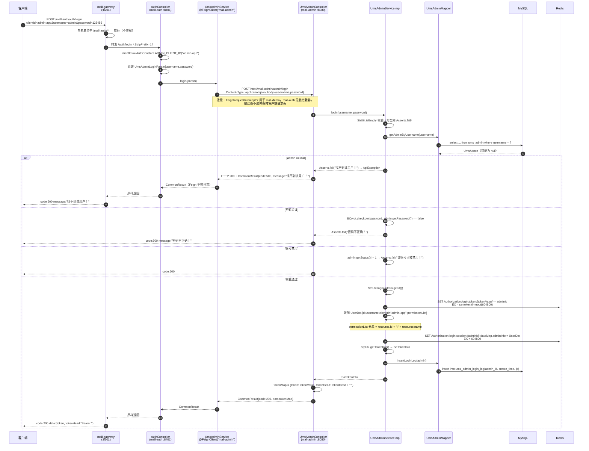
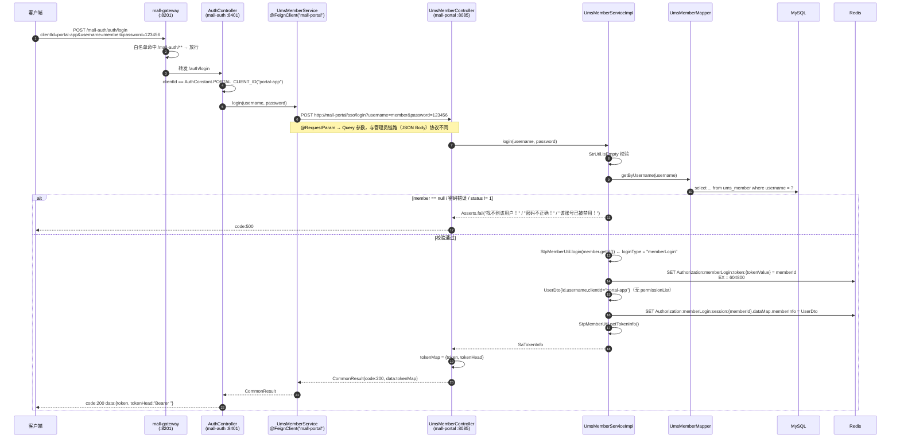
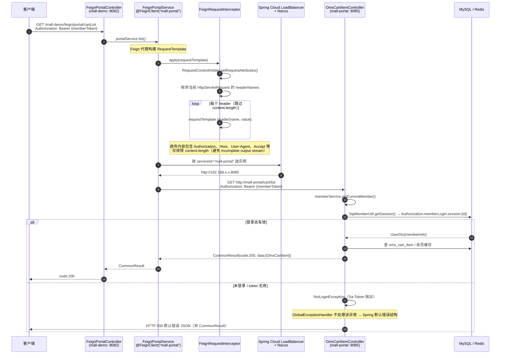
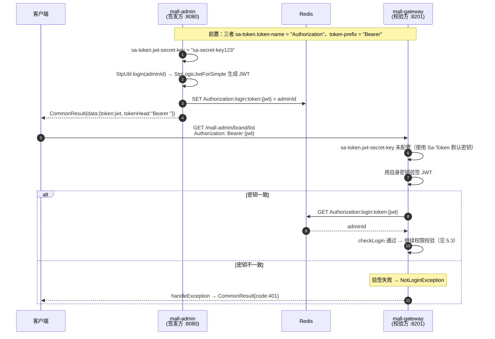

# 详细设计 · 认证与远程调用

| 项目 | 内容 |
| --- | --- |
| 文档编号 | DD-UMS-AUTH-001 |
| 所属业务域 | 用户域（`ums`） + 基础设施（网关鉴权 / 服务间通信） |
| 涉及服务 | `mall-auth`（:8401）、`mall-demo`（:8082）、`mall-gateway`（:8201，鉴权侧）、`mall-admin`（:8080，被调方）、`mall-portal`（:8085，被调方）、`mall-search`（:8081，被调方） |
| 涉及数据表 | 无自有表；间接读写 `ums_admin`、`ums_admin_login_log`、`ums_member`、`ums_resource`、`ums_role_resource_relation` |
| 接口数量 | 12 个 HTTP 端点（`mall-auth` 1 + `mall-demo` 11） + 7 条 Feign 客户端契约（F1–F7） |
| 网关前缀 | `/mall-auth/auth/login`、`/mall-demo/**`（`DemoController` 无类级前缀，路径为 `/mall-demo/brand/**`） |
| 核心存储 | Redis（Sa-Token 登录态、`auth:pathResourceMap`、`ums:*` 业务缓存） |
| 文档状态 | 待评审 |

---

## 一、概述

### 1.1 范围

本文档描述 mall-swarm 的「认证」与「远程调用」两块基础设施能力的详细设计，覆盖：

- **数据库设计**：本模块**不持有业务表**，转而描述认证相关的**数据存储设计**——Sa-Token 在 Redis 中的 key 结构、`auth:pathResourceMap` 权限映射、`ums:*` 业务缓存，以及被调方持有的 `ums_admin` / `ums_member` 表
- **接口设计**：12 个 REST 接口（`AuthController.login` + `DemoController` 6 个 + `FeignAdminController` 2 个 + `FeignPortalController` 2 个 + `FeignSearchController` 1 个）的请求参数、响应结构与数据模型
- **包设计**：`mall-auth` / `mall-demo` / `mall-gateway` 的包结构与类职责，以及三者与 `mall-admin` / `mall-portal` / `mall-search` 的 Feign 调用与鉴权关系
- **运行流程**：后台管理员登录链路、前台会员登录链路、带 token 访问受保护接口的网关鉴权链路、Feign 远程调用与请求头透传
- **日志设计**：日志框架、`WebLogAspect` 切点覆盖与记录字段、**登录接口密码明文入日志**问题、本模块审计埋点建议
- **测试用例设计**：功能、边界、异常三类用例，重点覆盖错误 `clientId`、账密错误、token 过期/篡改、跨端 token 误用、白名单越权、Feign 超时

不在本文档范围内：`mall-admin` / `mall-portal` 自身的用户管理业务设计（见后台用户管理详细设计）、`mall-search` 的商品搜索设计、Sa-Token 框架本身的实现原理。

### 1.2 术语

| 术语 | 含义 |
| --- | --- |
| 统一认证中心 | `mall-auth` 服务。仅做「客户端标识路由 + 委托校验 + 签发 token」，**自身不连数据库、不连 Redis** |
| `clientId` | 登录接口的客户端标识。`admin-app` 表示后台管理员，`portal-app` 表示前台会员（`AuthConstant.ADMIN_CLIENT_ID` / `PORTAL_CLIENT_ID`） |
| 多账号体系 | Sa-Token 的 `StpLogic` 多实例机制。管理员用 `StpUtil`（login type = `login`），会员用 `StpMemberUtil`（login type = `memberLogin`） |
| `StpMemberUtil` | 拷贝自 Sa-Token 官方 `StpUtil` 的工具类，仅改动 `TYPE` 常量为 `memberLogin`。仓库中存在 **2 份副本**：`mall-gateway` 与 `mall-portal` |
| 路径资源映射 | Redis hash `auth:pathResourceMap`，key 为 Ant 风格路径（如 `/mall-admin/brand/**`），value 为权限码（如 `1:商品品牌管理`） |
| 权限码 | 格式 `{ums_resource.id}:{ums_resource.name}`，由 `UmsAdminServiceImpl.login` 组装进 `UserDto.permissionList` |
| JWT 简单模式 | `sa-token-jwt` 的 `StpLogicJwtForSimple`，token 自身是带签名的 JWT，但登录态数据仍落 Redis |
| 网关前缀 | 对外访问路径的第一段（`/mall-admin`、`/mall-portal`…），由 `StripPrefix=1` 在转发时剥离 |

### 1.3 接口清单总览

| # | 方法 | 路径（服务内） | 网关路径 | 说明 | 归属 |
| --- | --- | --- | --- | --- | --- |
| 1 | POST | `/auth/login` | `/mall-auth/auth/login` | 统一登录，按 `clientId` 分发到后台/前台 | `mall-auth` / `AuthController` |
| 2 | GET | `/brand/listAll` | `/mall-demo/brand/listAll` | 获取全部品牌列表 | `mall-demo` / `DemoController` |
| 3 | POST | `/brand/create` | `/mall-demo/brand/create` | 添加品牌 | `mall-demo` / `DemoController` |
| 4 | POST | `/brand/update/{id}` | `/mall-demo/brand/update/{id}` | 更新品牌 | `mall-demo` / `DemoController` |
| 5 | GET | `/brand/delete/{id}` | `/mall-demo/brand/delete/{id}` | 删除品牌 | `mall-demo` / `DemoController` |
| 6 | GET | `/brand/list` | `/mall-demo/brand/list` | 分页获取品牌列表 | `mall-demo` / `DemoController` |
| 7 | GET | `/brand/{id}` | `/mall-demo/brand/{id}` | 根据编号查询品牌信息 | `mall-demo` / `DemoController` |
| 8 | POST | `/feign/admin/login` | `/mall-demo/feign/admin/login` | Feign 调 `mall-admin` 管理员登录 | `mall-demo` / `FeignAdminController` |
| 9 | GET | `/feign/admin/getBrandList` | `/mall-demo/feign/admin/getBrandList` | Feign 调 `mall-admin` 获取商品列表 | `mall-demo` / `FeignAdminController` |
| 10 | POST | `/feign/portal/login` | `/mall-demo/feign/portal/login` | Feign 调 `mall-portal` 会员登录 | `mall-demo` / `FeignPortalController` |
| 11 | GET | `/feign/portal/cartList` | `/mall-demo/feign/portal/cartList` | Feign 调 `mall-portal` 获取购物车列表 | `mall-demo` / `FeignPortalController` |
| 12 | GET | `/feign/search/justSearch` | `/mall-demo/feign/search/justSearch` | Feign 调 `mall-search` 简单商品搜索 | `mall-demo` / `FeignSearchController` |

> **归属说明**：接口 2–7 由 `DemoController` 提供，该类**没有类级 `@RequestMapping`**，方法级路径直接挂在根路径下（`/brand/**`），与 `mall-admin` 的 `PmsBrandController`（类级 `/brand`）**6 个路径完全同名**。运行期靠网关前缀区分（`/mall-admin/brand/**` 与 `/mall-demo/brand/**`，独立进程，无冲突）；**但在 `docs/openapi.yaml` 的聚合导出中，这 6 个路径因「path 为唯一键」只能保留一份，且保留的是 `mall-demo` 版本**——详见 3.7。
>
> **鉴权**：网关白名单包含 `/mall-auth/**`，故接口 1 **允许匿名访问**（登录接口本就不需要 token）；`/mall-demo/**` **不在白名单**，接口 2–12 经网关访问时两个 `SaRouter.match` 前缀（`/mall-admin/**`、`/mall-portal/**`）都不匹配——**不会被登录校验拦截**，随后仍会参与「路径 → 权限」匹配（通常不命中，故直接放行）。详见 3.1 与 5.3。
>
> **接口数核对**：代码侧 12 个端点；`docs/openapi.yaml` 中 12 个端点均存在（接口 2–7 以 `/brand/*` 裸路径导出，且为 demo 版本）。另外本模块还有 **7 条 Feign 客户端契约**（F1–F7），它们没有 HTTP 文档，见 3.6。

---

## 二、数据库设计

### 2.1 表清单（本模块）

| 表名 | 类型 | 说明 | 本模块操作 |
| --- | --- | --- | --- |
| — | — | **`mall-auth` 没有 dao / mapper / model 包，也没有数据源配置** | 不直接访问 |
| — | — | **`mall-demo` 有数据源与 `PmsBrandMapper`，但那是「示例」用途** | 见 2.3 |
| `ums_admin` | 被调方持有 | 后台用户表 | `mall-admin` 读（登录校验），`mall-auth` 间接触发 |
| `ums_admin_login_log` | 被调方持有 | 后台用户登录日志表 | `mall-admin` 写（登录成功记录） |
| `ums_member` | 被调方持有 | 会员表 | `mall-portal` 读（登录校验），`mall-auth` 间接触发 |
| `ums_resource` | 被调方持有 | 后台资源表（`url` 即权限路径） | `mall-admin` 读（登录时装配权限码） |
| `ums_role_resource_relation` | 被调方持有 | 角色-资源关系 | `mall-admin` 读（间接，经角色） |

> **关键结论**：`mall-auth/pom.xml` 中 `mall-common` 依赖**显式排除了 `spring-boot-starter-data-redis`**，且 `mall-auth` 未引入 `mall-mbg`、未引入 `mybatis`、未引入 `sa-token-*`。因此 `mall-auth` 既**不能访问 MySQL**，也**不能访问 Redis**，它只做 HTTP 编排。真正的认证状态**全部落在 `mall-admin` / `mall-portal` 侧**（由它们写入 Redis）。

### 2.2 Redis 存储设计（认证相关）

Sa-Token 接入 Redis 后（`mall-admin` / `mall-portal` / `mall-gateway` 均引入 `sa-token-redis-jackson`），登录态以固定范式落库。因为三个服务的 `sa-token.token-name` **都配置为 `Authorization`**（而非默认的 `satoken`），所以 Redis key 的第一段是 `Authorization`：

```
{token-name}:{login-type}:{数据类型}:{业务标识}
```

| # | Key 结构 | 类型 | value | TTL | 写入方 | 读取方 |
| --- | --- | --- | --- | --- | --- | --- |
| ① | `Authorization:login:token:{tokenValue}` | string | 管理员 id（`ums_admin.id`） | `sa-token.timeout` | `mall-admin`（`StpUtil.login`） | 全部服务（token → loginId 解析） |
| ② | `Authorization:login:session:{adminId}` | string(JSON 序列化 `SaSession`) | Account-Session，`dataMap` 中挂 `adminInfo`（`AuthConstant.STP_ADMIN_INFO`）→ `UserDto` | `sa-token.timeout` | `mall-admin`（`StpUtil.getSession().set(...)`） | `mall-gateway`（`StpInterfaceImpl.getPermissionList`） |
| ③ | `Authorization:memberLogin:token:{tokenValue}` | string | 会员 id（`ums_member.id`） | `sa-token.timeout` | `mall-portal`（`StpMemberUtil.login`） | 全部服务 |
| ④ | `Authorization:memberLogin:session:{memberId}` | string(JSON) | Account-Session，`dataMap` 中挂 `memberInfo`（`AuthConstant.STP_MEMBER_INFO`）→ `UserDto` | `sa-token.timeout` | `mall-portal` | `mall-portal`（`getCurrentMember`） |
| ⑤ | `auth:pathResourceMap` | hash | field = Ant 路径（含网关前缀），value = `{resourceId}:{resourceName}` | **无 TTL**（`hSetAll` 不带过期） | `mall-admin`（`UmsResourceServiceImpl.initPathResourceMap`，**需手工触发**，见 2.7 ①） | `mall-gateway`（`SaTokenConfig` 的 `setAuth`） |
| ⑥ | `mall-swarm:ums:admin:{adminId}` | string | `UmsAdmin` 对象 | 86400 秒 | `mall-admin`（`UmsAdminCacheServiceImpl`） | `mall-admin` |
| ⑦ | `mall-swarm:ums:member:{memberId}` | string | `UmsMember` 对象 | 86400 秒 | `mall-portal`（`UmsMemberCacheServiceImpl`） | `mall-portal` |
| ⑧ | `mall-swarm:ums:authCode:{telephone}` | string | 6 位数字验证码 | 90 秒 | `mall-portal`（`setAuthCode`） | `mall-portal`（`verifyAuthCode`） |

> **说明**：①②③④ 是 Sa-Token 框架的固定结构（方法 `splicingKeyTokenValue` / `splicingKeySession` 拼接），⑤–⑧ 是本项目自定义的业务 key。
>
> **数据库前缀来源**：⑥⑦⑧ 的 `mall-swarm` 段由各服务 `application.yml` 的 `redis.database: mall-swarm` 提供（`REDIS_DATABASE`），并非 Redis 的 `SELECT` 库号——它只是 key 前缀。实际库号是 `spring.data.redis.database: 0`。

**⑤ 的 field 生成规则**（`UmsResourceServiceImpl.initPathResourceMap`）：

```java
Map<String,String> pathResourceMap = new TreeMap<>();
List<UmsResource> resourceList = resourceMapper.selectByExample(new UmsResourceExample());
for (UmsResource resource : resourceList) {
    pathResourceMap.put("/"+applicationName+resource.getUrl(), resource.getId()+":"+resource.getName());
}
redisService.del(AuthConstant.PATH_RESOURCE_MAP);
redisService.hSetAll(AuthConstant.PATH_RESOURCE_MAP, pathResourceMap);
```

其中 `applicationName` 注入自配置，即 `mall-admin`。因此 `ums_resource.url` 为 `/brand/**` 时，Redis field 为 `/mall-admin/brand/**`，value 为 `1:商品品牌管理`（对应 `mall.sql` 中 `ums_resource` 的首条记录）。

**网关侧的匹配逻辑**（`SaTokenConfig`）：

```java
Map<Object, Object> pathResourceMap = redisTemplate.opsForHash().entries(AuthConstant.PATH_RESOURCE_MAP);
List<String> needPermissionList = new ArrayList<>();
String requestPath = SaHolder.getRequest().getRequestPath();   // 含 /mall-admin 前缀
PathMatcher pathMatcher = new AntPathMatcher();
for (Map.Entry<Object, Object> entry : pathResourceMap.entrySet()) {
    if (pathMatcher.match((String) entry.getKey(), requestPath)) {
        needPermissionList.add((String) entry.getValue());
    }
}
if(CollUtil.isNotEmpty(needPermissionList)){
    SaRouter.match(requestPath, r -> StpUtil.checkPermissionOr(Convert.toStrArray(needPermissionList)));
}
```

### 2.3 涉及的业务表（由被调方持有）

#### 2.3.1 `ums_admin`（后台用户表）

```sql
DROP TABLE IF EXISTS `ums_admin`;
CREATE TABLE `ums_admin`  (
  `id` bigint(20) NOT NULL AUTO_INCREMENT,
  `username` varchar(64) CHARACTER SET utf8 COLLATE utf8_general_ci NULL DEFAULT NULL,
  `password` varchar(64) CHARACTER SET utf8 COLLATE utf8_general_ci NULL DEFAULT NULL,
  `icon` varchar(500) CHARACTER SET utf8 COLLATE utf8_general_ci NULL DEFAULT NULL COMMENT '头像',
  `email` varchar(100) CHARACTER SET utf8 COLLATE utf8_general_ci NULL DEFAULT NULL COMMENT '邮箱',
  `nick_name` varchar(200) CHARACTER SET utf8 COLLATE utf8_general_ci NULL DEFAULT NULL COMMENT '昵称',
  `note` varchar(500) CHARACTER SET utf8 COLLATE utf8_general_ci NULL DEFAULT NULL COMMENT '备注信息',
  `create_time` datetime NULL DEFAULT NULL COMMENT '创建时间',
  `login_time` datetime NULL DEFAULT NULL COMMENT '最后登录时间',
  `status` int(1) NULL DEFAULT 1 COMMENT '帐号启用状态：0->禁用；1->启用',
  PRIMARY KEY (`id`) USING BTREE
) ENGINE = InnoDB AUTO_INCREMENT = 11 CHARACTER SET = utf8 COLLATE = utf8_general_ci COMMENT = '后台用户表' ROW_FORMAT = DYNAMIC;
```

| 字段 | 认证链路中的用途 |
| --- | --- |
| `id` | Sa-Token 的 `loginId`（`StpUtil.login(admin.getId())`），并进入 Redis key ② |
| `username` | `getAdminByUsername` 查询条件（`andUsernameEqualTo`） |
| `password` | `BCrypt.checkpw(password, admin.getPassword())` 校验；存储为 BCrypt 哈希（`$2a$10$...`） |
| `status` | 登录时校验 `admin.getStatus()!=1` 则拒绝（「该账号已被禁用！」） |
| `login_time` | 字段存在，但 `login` 方法中 `updateLoginTimeByUsername(username)` **已被注释掉**（`UmsAdminServiceImpl` 第 116 行），登录时间不再更新 |

> **索引现状**：仅主键 `PRIMARY KEY (id)`。`username` **无唯一索引**（`ums_member` 有 `idx_username`）。这意味着管理员用户名可重复，`getAdminByUsername` 取 `list.get(0)` 的结果不确定。

#### 2.3.2 `ums_member`（会员表，节选认证相关字段）

```sql
DROP TABLE IF EXISTS `ums_member`;
CREATE TABLE `ums_member`  (
  `id` bigint(20) NOT NULL AUTO_INCREMENT,
  `member_level_id` bigint(20) NULL DEFAULT NULL,
  `username` varchar(64) CHARACTER SET utf8 COLLATE utf8_general_ci NULL DEFAULT NULL COMMENT '用户名',
  `password` varchar(64) CHARACTER SET utf8 COLLATE utf8_general_ci NULL DEFAULT NULL COMMENT '密码',
  ...
  `phone` varchar(64) CHARACTER SET utf8 COLLATE utf8_general_ci NULL DEFAULT NULL COMMENT '手机号码',
  `status` int(1) NULL DEFAULT NULL COMMENT '帐号启用状态:0->禁用；1->启用',
  `create_time` datetime NULL DEFAULT NULL COMMENT '注册时间',
  ...
  PRIMARY KEY (`id`) USING BTREE,
  UNIQUE INDEX `idx_username`(`username`) USING BTREE,
  UNIQUE INDEX `idx_phone`(`phone`) USING BTREE
) ENGINE = InnoDB AUTO_INCREMENT = 12 CHARACTER SET = utf8 COLLATE = utf8_general_ci COMMENT = '会员表' ROW_FORMAT = DYNAMIC;
```

| 字段 | 认证链路中的用途 |
| --- | --- |
| `id` | Sa-Token 的 `loginId`（`StpMemberUtil.login(member.getId())`），进入 Redis key ③ |
| `username` | `getByUsername` 查询条件；**有唯一索引** |
| `password` | `BCrypt.checkpw` 校验；BCrypt 哈希 |
| `phone` | 验证码发送/校验的 key 维度（`ums:authCode:{phone}`）；**有唯一索引** |
| `status` | 登录时校验 `member.getStatus()!=1` 则拒绝 |

> `ums_member` 的候选键（`username` / `phone`）都有唯一索引，而 `ums_admin` 没有——**这是两端不一致的地方**。

#### 2.3.3 `ums_admin_login_log`（后台用户登录日志表）

```sql
DROP TABLE IF EXISTS `ums_admin_login_log`;
CREATE TABLE `ums_admin_login_log`  (
  `id` bigint(20) NOT NULL AUTO_INCREMENT,
  `admin_id` bigint(20) NULL DEFAULT NULL,
  `create_time` datetime NULL DEFAULT NULL,
  `ip` varchar(64) CHARACTER SET utf8 COLLATE utf8_general_ci NULL DEFAULT NULL,
  `address` varchar(100) CHARACTER SET utf8 COLLATE utf8_general_ci NULL DEFAULT NULL,
  `user_agent` varchar(100) CHARACTER SET utf8 COLLATE utf8_general_ci NULL DEFAULT NULL COMMENT '浏览器登录类型',
  PRIMARY KEY (`id`) USING BTREE
) ENGINE = InnoDB AUTO_INCREMENT = 413 CHARACTER SET = utf8 COLLATE = utf8_general_ci COMMENT = '后台用户登录日志表' ROW_FORMAT = DYNAMIC;
```

**这是本模块唯一的关系型「认证审计」落地表**。`UmsAdminServiceImpl.insertLoginLog` 写入 `admin_id`、`create_time`、`ip`（`request.getRemoteAddr()`）；`address` 与 `user_agent` 两列**从不写入**（恒为 NULL）。

> **重要缺口**：写入点位于 `StpUtil.login()` **之后**，因此**只记录登录成功**，登录失败（用户名不存在、密码错误、账号禁用）**不会留下任何记录**。会员登录则**完全没有审计表**。

### 2.4 token 有效期配置对比

| 服务 | 配置项 | 值 | 换算 | 作用 |
| --- | --- | --- | --- | --- |
| `mall-admin` | `sa-token.timeout` | `604800` | 7 天 | 管理员 token 有效期（**签发方**） |
| `mall-portal` | `sa-token.timeout` | `604800` | 7 天 | 会员 token 有效期（**签发方**） |
| `mall-gateway` | `sa-token.timeout` | `2592000` | 30 天 | 网关侧 token 校验有效期 |
| 三者 | `sa-token.active-timeout` | `-1` | — | 关闭活跃超时（token 不会因不活跃而冻结） |
| 三者 | `sa-token.is-concurrent` | `true` | — | 允许同一账号并发登录 |
| 三者 | `sa-token.is-share` | `false` | — | 每次登录新建 token，不复用 |
| 三者 | `sa-token.token-style` | `uuid` | — | token 风格（JWT 模式下该配置影响有限） |
| 三者 | `sa-token.token-prefix` | `Bearer` | — | 请求头中 token 前缀 |
| 三者 | `sa-token.is-read-header` | `true` | — | 从请求头读取 token |
| 三者 | `sa-token.is-read-cookie` | `false` | — | 不从 Cookie 读取 |
| 三者 | `sa-token.is-log` | `false` | — | 关闭 Sa-Token 操作日志 |
| `mall-admin` / `mall-portal` | `sa-token.jwt-secret-key` | `sa-secret-key123` | — | JWT 签名密钥 |
| `mall-gateway` | `sa-token.jwt-secret-key` | **未配置** | — | 见 2.7 ③ |

> **不一致点**：签发方 7 天、校验方 30 天。`sa-token.timeout` 在网关侧**不用于给 token 续期**，但会参与 `getTokenTimeout()` 等判断；同一 token 在 `mall-admin` 内部检查与在网关检查时，剩余有效期认知不同。更关键的是**令牌不会「滑动续期」**：`renewTimeout` 未被任何业务代码调用，用户 7 天后必须重新登录。

### 2.5 存储容量估算（量级参考）

| 数据 | 单条大小 | 量级 | 备注 |
| --- | --- | --- | --- |
| Sa-Token token 映射（①③） | ~100 B | 在线用户数 | TTL 自动回收 |
| Account-Session（②④） | 数百 B ~ 数 KB | 在线用户数 | `adminInfo` 含**完整权限码列表**，权限多的账号会到 KB 级 |
| `auth:pathResourceMap`（⑤） | ~80 B/field | `ums_resource` 记录数（当前 32 条） | **无 TTL**，全量覆盖写 |

> `mall-gateway` 每次请求都会执行 `redisTemplate.opsForHash().entries(AuthConstant.PATH_RESOURCE_MAP)`——**把整个 hash 拉到应用内存再遍历匹配**。当前 32 条约 2.5 KB，可接受；若资源表增长到数千条，将成为每个请求的固定开销（详见 2.7 ④）。

### 2.6 索引与约束现状

| 项目 | 现状 | 影响 |
| --- | --- | --- |
| `ums_admin.username` 唯一索引 | **无** | 用户名可重复；登录取 `list.get(0)`，结果不确定 |
| `ums_member.username` / `phone` 唯一索引 | 有（`idx_username`、`idx_phone`） | 正常 |
| `ums_admin_login_log` 索引 | **仅主键** | 按 `admin_id` 反查登录历史全表扫描 |
| `auth:pathResourceMap` 过期策略 | **无 TTL** | 资源表变更后旧映射长期残留，直到再次手工触发初始化 |
| 会话状态可撤销性 | Sa-Token 支持 `logout` / `kickout`，但无管理端入口 | 无法在不改密的情况下强制下线某管理员 |

### 2.7 设计问题与建议

| # | 问题 | 影响 | 建议 |
| --- | --- | --- | --- |
| ① | `auth:pathResourceMap` **不是启动时自动加载**，只能由 `POST /mall-admin/resource/initPathResourceMap`（`UmsResourceController`）手工触发 | 全新部署或 Redis 被清空后，映射为空 → 网关所有接口的**权限校验被静默跳过**（`needPermissionList` 为空则不调用 `checkPermissionOr`），退化为「只要登录就能访问任意后台接口」 | 用 `ApplicationRunner` / `@PostConstruct` 在 `mall-admin` 启动时自动初始化；并让网关在映射为空时**拒绝**而非放行 |
| ② | 映射为空时网关**静默放行**（`if(CollUtil.isNotEmpty(needPermissionList))` 才校验） | 权限体系存在「fail-open」缺陷：Redis 抖动或映射缺失即等于**无接口级鉴权** | 改为 fail-close：若请求路径属于受保护前缀（`/mall-admin/**`）却匹配不到任何资源，返回 403 并告警 |
| ③ | `mall-gateway` **未配置 `sa-token.jwt-secret-key`**，而 `mall-admin` / `mall-portal` 配置为 `sa-secret-key123` | JWT 模式下网关与签发方密钥必须一致。缺配置将使网关使用 Sa-Token 内置默认密钥，与签发方不一致时**所有 token 校验失败**；若一致则密钥完全公开、可离线伪造管理员 token | 三处统一为同一显式密钥，并改为从 Nacos 加密配置 / 环境变量注入，禁止硬编码入库 |
| ④ | `auth:pathResourceMap` 无 TTL，且网关每请求 `entries()` 全量拉取 + 遍历 Ant 匹配 | 资源表增长后每请求固定开销线性上升；无法水平优化 | 网关侧加本地缓存（如 Caffeine，短 TTL + 变更事件失效）；或改为按前缀二次索引 |
| ⑤ | `sa-token.timeout` 签发方 7 天 / 网关 30 天不一致 | 语义混乱，排障困难；网关侧计算的剩余有效期与实际不符 | 统一为单一来源（Nacos 共享配置），并明确「是否滑动续期」策略 |
| ⑥ | `ums_admin.username` 无唯一索引 | 用户名重复时登录行为不确定，也影响审计归属 | 增加唯一索引；应用层注册时查重 |
| ⑦ | `ums_admin_login_log` 只记录**成功**登录，无失败记录；`address` / `user_agent` 恒空 | 暴力破解、撞库无法追溯；审计信息不完整 | 失败路径也落库（含失败原因），补齐 `user_agent`；`mall-portal` 会员登录增加对应审计 |
| ⑧ | `mall-auth` 的 `application-dev.yml` 声明 `spring.config.import: nacos:mall-auth-dev.yaml?refreshEnabled=true`（无 `optional:` 前缀），但仓库 `config/` 目录**只有 `admin`、`demo`、`gateway`、`portal`、`search` 五个子目录，没有 `auth`** | 按仓库现状启动 `mall-auth` 会因拉不到该配置项而**启动失败** | 补 `config/auth/mall-auth-dev.yaml`（含 `logstash`、`springdoc` 等），或改为 `optional:nacos:...` |
| ⑨ | `mall-demo` 的 `FeignRequestInterceptor` **透传全部请求头**（除 `content-length`），且 `FeignConfig` 是**全局** `@Configuration` | ①下游会收到 `Host`、`Cookie` 等无意义头；②若上游携带 `Authorization`，会被无差别转发到 `mall-search` 等**不需要该 token 的服务**，扩大 token 泄露面 | 改为**白名单透传**（仅 `Authorization` + 自定义 trace 头），并用 `@Configuration(proxyBeanMethods=false)` + Feign 专属配置类限定作用范围 |
| ⑩ | 无任何 Feign 超时 / 熔断 / 降级配置（项目**未引入 Sentinel 与 Resilience4j**，见 4.1） | `mall-admin` / `mall-portal` 卡顿时，`mall-auth` 登录请求会线程堆积直至网关超时；`mall-demo` 示例同理 | 至少配置 `spring.cloud.openfeign.client.config.default.connectTimeout/readTimeout`；重要链路引入 Sentinel 或 Resilience4j |
| ⑪ | 无刷新 token（refresh token）机制 | 7 天到期后强制重新登录；无「续期」与「强制失效」的中间态 | 引入 refresh token，或使用 Sa-Token 的 `renewTimeout` 实现滑动过期 |
| ⑫ | `/mall-auth/**` 整体在白名单 | 认证中心的所有现有与**未来新增**接口都默认匿名开放 | 白名单收窄到具体路径（`/mall-auth/auth/login`），避免后续新增管理接口时被意外放行 |
| ⑬ | `mall-demo` 的 `DemoController` **无类级 `@RequestMapping`**，直接占用 `/brand/**`，与 `mall-admin` 的 `PmsBrandController` **6 个路径完全同名** | ①OpenAPI 以 path 为唯一键，聚合导出时 `mall-admin` 的 6 个品牌接口定义**被 `mall-demo` 版本遮蔽**（见 3.7），据此联调会得出错误的默认值与必填项；②`mall-demo` 作为示例模块占用了真实业务路径，语义误导 | 给 `DemoController` 加类级 `@RequestMapping("/demo")`（路径变为 `/demo/brand/**`）；或按服务分别导出文档。**运行期无冲突**（8080/8082 独立进程，网关前缀区分），仅为文档与语义问题 |

---

## 三、接口设计

### 3.1 通用约定

**统一响应结构**（`com.macro.mall.common.api.CommonResult`）：

```json
{
  "code": 200,
  "message": "操作成功",
  "data": {}
}
```

**业务码定义**（`com.macro.mall.common.api.ResultCode`）：

| code | 常量 | 含义 |
| --- | --- | --- |
| 200 | `SUCCESS` | 操作成功 |
| 401 | `UNAUTHORIZED` | 暂未登录或 token 已经过期 |
| 403 | `FORBIDDEN` | 没有相关权限 |
| 404 | `VALIDATE_FAILED` | 参数检验失败 |
| 500 | `FAILED` | 操作失败 |

> **注意**：业务码定义在 **HTTP 响应体内部**，HTTP 状态码通常仍为 200。`VALIDATE_FAILED` 使用 404 表示参数校验失败，与 HTTP 语义不一致，前端需按 `code` 而非 HTTP 状态码判断。
>
> **登录失败用的是哪个码**：`UmsAdminServiceImpl.login` 在用户名不存在/密码错误/账号禁用时调用 `Asserts.fail("...")`，抛出 `ApiException`，经 `GlobalExceptionHandler` 转为 `CommonResult.failed(message)`，即 **`code: 500`**，**不是 401**。而 `UmsAdminController.login` 中返回的 `validateFailed("用户名或密码错误")`（`code: 404`）**在 `mall-admin` 自身的登录接口中永远不会触发**（Service 层已抛异常）。`mall-auth` 调用的是这条链路，因此**登录失败对外表现为 `code: 500`**。

**统一分页结构**（`com.macro.mall.common.api.CommonPage`）：

| 名称 | 类型 | 说明 |
| --- | --- | --- |
| pageNum | integer | 当前页码 |
| pageSize | integer | 每页条数 |
| totalPage | integer | 总页数 |
| total | integer(int64) | 总记录数 |
| list | array | 数据列表 |

**网关前缀与鉴权**：

| 前缀 | 目标服务 | 登录校验（`SaTokenConfig`） | 权限校验 |
| --- | --- | --- | --- |
| `/mall-auth/**` | `mall-auth` | **白名单，跳过全部校验** | 跳过 |
| `/mall-admin/**` | `mall-admin` | `StpUtil.checkLogin()`（管理员） | 命中 `auth:pathResourceMap` 则 `checkPermissionOr` |
| `/mall-portal/**` | `mall-portal` | `StpMemberUtil.checkLogin()`（会员）——**仅非白名单路径** | 命中则校验（会员无权限码，实际不会命中） |
| `/mall-search/**` | `mall-search` | **白名单整段放行** | 跳过 |
| `/mall-demo/**` | `mall-demo` | **不在白名单，但两个 `SaRouter.match` 都不匹配** → 无登录校验 | 命中 `auth:pathResourceMap` 则校验（通常不命中） |

> **重要结论**：`SaRouter.match(...).stop()` 是**排他**语义——只走到第一个匹配的分支。`/mall-demo/**` 既不匹配 `/mall-portal/**` 也不匹配 `/mall-admin/**`，因此**不做登录校验**；随后仍会进入权限映射匹配（`/mall-demo/...` 不在 `auth:pathResourceMap` 中，无匹配 → 放行）。**净效果：`/mall-demo/**` 经网关访问时等同匿名开放**。详见 5.3 与 7.4 的 AUTH-E13。

**请求头约定**：

| 请求头 | 值 | 说明 |
| --- | --- | --- |
| `Authorization` | `Bearer <token>` | token 名称与 `sa-token.token-name` 一致；`token-prefix: Bearer` 由 Sa-Token 裁剪 |

---

### 3.2 认证接口（mall-auth）

<a id="opIdlogin"></a>

## POST 登录以后返回token

POST /auth/login

统一认证入口。按 `clientId` 分发：`admin-app` 走后台管理员链路，`portal-app` 走前台会员链路，其余值直接返回失败。

**请求为表单/Query 参数**（`@RequestParam`），**不是 JSON body**：`Content-Type: application/x-www-form-urlencoded`。

### 请求参数

| 名称 | 位置 | 类型 | 必选 | 说明 |
| --- | --- | --- | --- | --- |
| clientId | query | string | 是 | 客户端标识：`admin-app`（后台） / `portal-app`（前台） |
| username | query | string | 是 | 用户名 |
| password | query | string | 是 | 密码（明文传输） |

> 返回示例（后台管理员登录成功）

> 200 Response

```json
{
  "code": 200,
  "message": "操作成功",
  "data": {
    "token": "eyJ0eXAiOiJKV1QiLCJhbGciOiJIUzI1NiJ9.eyJsb2dpbklkIjoiMyJ9.xxxxx",
    "tokenHead": "Bearer "
  }
}
```

> 返回示例（错误 clientId）

```json
{
  "code": 500,
  "message": "clientId不正确",
  "data": null
}
```

> 返回示例（账密错误）

```json
{
  "code": 500,
  "message": "密码不正确！",
  "data": null
}
```

### 返回结果

| 状态码 | 状态码含义 | 说明 | 数据模型 |
| --- | --- | --- | --- |
| 200 | [OK](https://tools.ietf.org/html/rfc7231#section-6.3.1) | 操作成功（业务成败取决于 `code`） | Inline |

### 返回数据结构

状态码 **200**

| 名称 | 类型 | 必选 | 约束 | 中文名 | 说明 |
| --- | --- | --- | --- | --- | --- |
| code | integer(int64) | true | none | 业务码 | 200 成功；500 失败（含 `clientId不正确`、`找不到该用户！`、`密码不正确！`、`该账号已被禁用！`） |
| message | string | true | none | 提示信息 | none |
| data | object | false | none | token 信息 | 失败时为 null |
| » token | string | false | none | token 值 | JWT 字符串 |
| » tokenHead | string | false | none | token 前缀 | 固定为 `"Bearer "`（**注意末尾有一个空格**） |

#### 枚举值

| 属性 | 值 |
| --- | --- |
| clientId | admin-app |
| clientId | portal-app |

> **设计备注 ①（分发不对称）**：`admin-app` 分支把参数包装成 `UmsAdminLoginParam` 后以 **JSON Body**（`@RequestBody`）POST 给 `mall-admin` 的 `/admin/login`；`portal-app` 分支则以 **Query 参数**（`@RequestParam`）POST 给 `mall-portal` 的 `/sso/login`。两端协议不同，Feign 接口定义也不同（`UmsAdminService` vs `UmsMemberService`）。
>
> **设计备注 ②（响应语义混淆）**：`data` 为 `Map<String,String>`，Feign 客户端声明返回类型是 `CommonResult`（无泛型），反序列化后 `data` 为 `LinkedHashMap`，因此 `mall-auth` **无法感知下游返回的是 tokenMap 还是其他结构**，只能整体透传。
>
> **设计备注 ③（下游异常的处理）**：若 `mall-admin` 抛 `ApiException`，`GlobalExceptionHandler` 会返回 `code: 500` 的 `CommonResult`（**HTTP 状态码仍为 200**），Feign 不会抛异常，`mall-auth` 原样透传该 500。若下游**不可达或超时**，Feign 抛 `FeignException` / `RetryableException`，该异常**不被 `GlobalExceptionHandler` 捕获**（只处理 `ApiException`、`MethodArgumentNotValidException`、`BindException`），最终返回 Spring 默认错误结构（`{timestamp,status,error,path}`），**不是 `CommonResult`**。

---

### 3.3 示例接口（mall-demo · DemoController）

> ⚠️ **本节 6 个 `/brand/*` 路径的定义在 `docs/openapi.yaml` 中是 `mall-demo` 的示例接口，不是 `mall-admin` 的业务接口。**
>
> 详见 3.7「`/brand/*` 路径的归属与 openapi 遮蔽问题」。**编写或联调 `mall-admin` 品牌接口时，不要以 openapi 中这 6 个路径的默认值与必填项为准。**

> `DemoController` **无类级 `@RequestMapping`**，以下路径均为服务内根路径，经网关访问需加 `/mall-demo` 前缀。
> 本组接口直接经 `PmsBrandMapper` 操作 `pms_brand`，是「不依赖 Feign 的对照组」，与下方 Feign 示例接口形成对比。

<a id="opIdgetBrandList"></a>

## GET 获取全部品牌列表

GET /brand/listAll

获取所有品牌，不进行分页。

### 请求参数

无

> 返回示例

> 200 Response

```json
{
  "code": 200,
  "message": "操作成功",
  "data": [
    {
      "id": 1,
      "name": "华为",
      "firstLetter": "H",
      "sort": 100,
      "factoryStatus": 1,
      "showStatus": 1,
      "productCount": 0,
      "productCommentCount": 0,
      "logo": "http://macro-oss.oss-cn-shenzhen.aliyuncs.com/mall/images/20180607/timg.jpg",
      "bigPic": "",
      "brandStory": "华为技术有限公司成立于1987年。"
    }
  ]
}
```

### 返回结果

| 状态码 | 状态码含义 | 说明 | 数据模型 |
| --- | --- | --- | --- |
| 200 | [OK](https://tools.ietf.org/html/rfc7231#section-6.3.1) | 操作成功 | Inline |

### 返回数据结构

状态码 **200**

| 名称 | 类型 | 必选 | 约束 | 中文名 | 说明 |
| --- | --- | --- | --- | --- | --- |
| code | integer(int64) | true | none | 业务码 | none |
| message | string | true | none | 提示信息 | none |
| data | [[PmsBrand](#schemapmsbrand)] | false | none | 品牌列表 | 无分页信息 |

---

<a id="opIdcreateBrandDemo"></a>

## POST 添加品牌

POST /brand/create

> Body 请求参数

```json
{
  "name": "测试品牌",
  "firstLetter": "C",
  "sort": 0,
  "factoryStatus": 0,
  "showStatus": 1,
  "logo": "http://macro-oss.oss-cn-shenzhen.aliyuncs.com/mall/images/20180607/timg.jpg",
  "bigPic": "",
  "brandStory": "品牌故事"
}
```

### 请求参数

| 名称 | 位置 | 类型 | 必选 | 说明 |
| --- | --- | --- | --- | --- |
| body | body | [PmsBrandDto](#schemapmsbranddto) | 是 | 品牌参数 |

### 返回结果

| 状态码 | 状态码含义 | 说明 | 数据模型 |
| --- | --- | --- | --- |
| 200 | [OK](https://tools.ietf.org/html/rfc7231#section-6.3.1) | 操作成功 | Inline |

### 返回数据结构

状态码 **200**

| 名称 | 类型 | 必选 | 约束 | 中文名 | 说明 |
| --- | --- | --- | --- | --- | --- |
| code | integer(int64) | true | none | 业务码 | 200 成功；500 失败（`操作失败`） |
| message | string | true | none | 提示信息 | none |
| data | [PmsBrandDto](#schemapmsbranddto) | false | none | 回显入参 | **注意：返回的是入参 DTO，不是入库后的实体**（无 `id`） |

> **设计备注**：`CommonResult.success(pmsBrand)` 回显的是 `PmsBrandDto`（请求参数对象），而非 `insertSelective` 生成的带主键实体。与 `mall-admin` 的 `PmsBrandController.createBrand`（返回影响行数 `count`）**语义不同**——同为「添加品牌」，一个返回行数、一个返回入参，**接口契约不统一**。

---

<a id="opIdupdateBrandDemo"></a>

## POST 更新品牌

POST /brand/update/{id}

> Body 请求参数

```json
{
  "name": "测试品牌-改",
  "firstLetter": "C",
  "sort": 10,
  "factoryStatus": 1,
  "showStatus": 1,
  "logo": "http://macro-oss.oss-cn-shenzhen.aliyuncs.com/mall/images/20180607/timg.jpg",
  "bigPic": "",
  "brandStory": "更新后的品牌故事"
}
```

### 请求参数

| 名称 | 位置 | 类型 | 必选 | 说明 |
| --- | --- | --- | --- | --- |
| id | path | integer(int64) | 是 | 品牌编号 |
| body | body | [PmsBrandDto](#schemapmsbranddto) | 是 | 品牌参数 |

### 返回结果

| 状态码 | 状态码含义 | 说明 | 数据模型 |
| --- | --- | --- | --- |
| 200 | [OK](https://tools.ietf.org/html/rfc7231#section-6.3.1) | 操作成功 | Inline |

### 返回数据结构

状态码 **200**

| 名称 | 类型 | 必选 | 约束 | 中文名 | 说明 |
| --- | --- | --- | --- | --- | --- |
| code | integer(int64) | true | none | 业务码 | 200 成功；500 失败 |
| message | string | true | none | 提示信息 | none |
| data | [PmsBrandDto](#schemapmsbranddto) | false | none | 回显入参 | 同 `create` |

> **设计备注**：`DemoServiceImpl.updateBrand` 用 `updateByPrimaryKeySelective`，未传的字段不被覆盖；但 `mall-admin` 侧的 `PmsBrandController.update` 会同步商品冗余名称（见品牌管理详细设计）。**两处同名接口行为不同**。

---

<a id="opIddeleteBrandDemo"></a>

## GET 删除品牌

GET /brand/delete/{id}

根据编号删除品牌（物理删除）。

### 请求参数

| 名称 | 位置 | 类型 | 必选 | 说明 |
| --- | --- | --- | --- | --- |
| id | path | integer(int64) | 是 | 品牌编号 |

### 返回结果

| 状态码 | 状态码含义 | 说明 | 数据模型 |
| --- | --- | --- | --- |
| 200 | [OK](https://tools.ietf.org/html/rfc7231#section-6.3.1) | 操作成功 | Inline |

### 返回数据结构

状态码 **200**

| 名称 | 类型 | 必选 | 约束 | 中文名 | 说明 |
| --- | --- | --- | --- | --- | --- |
| code | integer(int64) | true | none | 业务码 | 200 成功；500 失败 |
| message | string | true | none | 提示信息 | none |
| data | string | false | none | 数据 | 恒为 null |

> **设计备注**：删除用 GET，违反 HTTP 幂等语义（与品牌管理详细设计中的同一问题）。

---

<a id="opIdlistBrandDemo"></a>

## GET 分页获取品牌列表

GET /brand/list

使用 `PageHelper` 分页查询全部品牌（**不接受关键字过滤**）。

### 请求参数

| 名称 | 位置 | 类型 | 必选 | 说明 |
| --- | --- | --- | --- | --- |
| pageNum | query | integer | 否 | 页码，默认 **1** |
| pageSize | query | integer | 否 | 每页条数，默认 **3** |

> 返回示例

> 200 Response

```json
{
  "code": 200,
  "message": "操作成功",
  "data": {
    "pageNum": 1,
    "pageSize": 3,
    "totalPage": 20,
    "total": 59,
    "list": [
      {
        "id": 1,
        "name": "华为",
        "firstLetter": "H",
        "sort": 100,
        "factoryStatus": 1,
        "showStatus": 1,
        "productCount": 0,
        "productCommentCount": 0,
        "logo": "http://macro-oss.oss-cn-shenzhen.aliyuncs.com/mall/images/20180607/timg.jpg",
        "bigPic": "",
        "brandStory": "华为技术有限公司成立于1987年。"
      }
    ]
  }
}
```

### 返回结果

| 状态码 | 状态码含义 | 说明 | 数据模型 |
| --- | --- | --- | --- |
| 200 | [OK](https://tools.ietf.org/html/rfc7231#section-6.3.1) | 操作成功 | Inline |

### 返回数据结构

状态码 **200**

| 名称 | 类型 | 必选 | 约束 | 中文名 | 说明 |
| --- | --- | --- | --- | --- | --- |
| code | integer(int64) | true | none | 业务码 | none |
| message | string | true | none | 提示信息 | none |
| data | [CommonPage](#schemacommonpage) | false | none | 分页数据 | 元素为 [PmsBrand](#schemapmsbrand) |
| » pageNum | integer | false | none | 当前页码 | none |
| » pageSize | integer | false | none | 每页条数 | none |
| » totalPage | integer | false | none | 总页数 | none |
| » total | integer(int64) | false | none | 总记录数 | none |
| » list | [[PmsBrand](#schemapmsbrand)] | false | none | 品牌列表 | none |

> **文档与实现不一致**：`docs/openapi.yaml` 中该路径的 `pageNum` / `pageSize` 被标为 `required: true`，而代码是 `@RequestParam(value = "pageNum", defaultValue = "1")` / `defaultValue = "3"`，**均非必填**。以代码为准。此外 openapi 中该路径**没有 `keyword` 参数**——这正是因为 openapi 保留的是本节的 demo 版本（demo 确实不支持关键字），详见 3.7。

---

<a id="opIdgetBrandDemo"></a>

## GET 根据编号查询品牌信息

GET /brand/{id}

### 请求参数

| 名称 | 位置 | 类型 | 必选 | 说明 |
| --- | --- | --- | --- | --- |
| id | path | integer(int64) | 是 | 品牌编号 |

> 返回示例

> 200 Response

```json
{
  "code": 200,
  "message": "操作成功",
  "data": {
    "id": 1,
    "name": "华为",
    "firstLetter": "H",
    "sort": 100,
    "factoryStatus": 1,
    "showStatus": 1,
    "productCount": 0,
    "productCommentCount": 0,
    "logo": "http://macro-oss.oss-cn-shenzhen.aliyuncs.com/mall/images/20180607/timg.jpg",
    "bigPic": "",
    "brandStory": "华为技术有限公司成立于1987年。"
  }
}
```

### 返回结果

| 状态码 | 状态码含义 | 说明 | 数据模型 |
| --- | --- | --- | --- |
| 200 | [OK](https://tools.ietf.org/html/rfc7231#section-6.3.1) | 操作成功 | Inline |

### 返回数据结构

状态码 **200**

| 名称 | 类型 | 必选 | 约束 | 中文名 | 说明 |
| --- | --- | --- | --- | --- | --- |
| code | integer(int64) | true | none | 业务码 | none |
| message | string | true | none | 提示信息 | none |
| data | [PmsBrand](#schemapmsbrand) | false | none | 品牌 | 不存在时 `data` 为 null，`code` 仍为 200 |

---

### 3.4 Feign 示例接口（mall-demo）

> 这 5 个接口**本身不含业务逻辑**，只把请求转交给 `FeignAdminService` / `FeignPortalService` / `FeignSearchService`，用于演示 OpenFeign 跨服务调用与请求头透传。被调方路径见 3.6「远程调用契约」。
>
> 这四个 Feign 接口的**提供方全部不在这四个控制器中**，而在 `mall-admin` / `mall-portal` / `mall-search`——这是 `mall-demo` 作为「调用方示例」的定位决定的。

<a id="opIdfeignAdminLogin"></a>

## POST 后台管理员登录

POST /feign/admin/login

经 Feign 调用 `mall-admin` 的 `POST /admin/login`。

> Body 请求参数

```json
{
  "username": "admin",
  "password": "123456"
}
```

### 请求参数

| 名称 | 位置 | 类型 | 必选 | 说明 |
| --- | --- | --- | --- | --- |
| body | body | [UmsAdminLoginParam](#schemaumsadminloginparam-demo) | 是 | 管理员登录参数 |

### 返回结果

| 状态码 | 状态码含义 | 说明 | 数据模型 |
| --- | --- | --- | --- |
| 200 | [OK](https://tools.ietf.org/html/rfc7231#section-6.3.1) | 操作成功 | Inline |

### 返回数据结构

状态码 **200**

| 名称 | 类型 | 必选 | 约束 | 中文名 | 说明 |
| --- | --- | --- | --- | --- | --- |
| code | integer(int64) | true | none | 业务码 | 透传 `mall-admin` 的结果 |
| message | string | true | none | 提示信息 | none |
| data | object | false | none | token 信息 | `{token, tokenHead}`，**由 `mall-admin` 的 `UmsAdminController.login` 生成** |

---

<a id="opIdfeignAdminGetBrandList"></a>

## GET 获取商品列表

GET /feign/admin/getBrandList

经 Feign 调用 `mall-admin` 的 `GET /brand/listAll`。**接口名中的「商品」是命名遗留**，实际返回品牌列表。

### 请求参数

无

### 返回结果

| 状态码 | 状态码含义 | 说明 | 数据模型 |
| --- | --- | --- | --- |
| 200 | [OK](https://tools.ietf.org/html/rfc7231#section-6.3.1) | 操作成功 | Inline |

### 返回数据结构

状态码 **200**

| 名称 | 类型 | 必选 | 约束 | 中文名 | 说明 |
| --- | --- | --- | --- | --- | --- |
| code | integer(int64) | true | none | 业务码 | none |
| message | string | true | none | 提示信息 | none |
| data | [[PmsBrand](#schemapmsbrand)] | false | none | 品牌列表 | 透传 `mall-admin` |

> **注意**：`/brand/listAll` 在 `ums_resource` 中**没有对应记录**（`ums_resource` 只有 `/brand/**`，见 mall.sql），因此该路径不会被权限映射命中。经网关 `POST /mall-demo/feign/admin/getBrandList` 转发到 `mall-admin` 时，**网关不再二次校验**（网关只校验一次，且校验发生在 `/mall-demo/**` 这一层，不匹配任何资源）。

---

<a id="opIdfeignPortalLogin"></a>

## POST 前台会员列表登录

POST /feign/portal/login

经 Feign 调用 `mall-portal` 的 `POST /sso/login`。

### 请求参数

| 名称 | 位置 | 类型 | 必选 | 说明 |
| --- | --- | --- | --- | --- |
| username | query | string | 是 | 会员用户名 |
| password | query | string | 是 | 密码（明文传输） |

### 返回结果

| 状态码 | 状态码含义 | 说明 | 数据模型 |
| --- | --- | --- | --- |
| 200 | [OK](https://tools.ietf.org/html/rfc7231#section-6.3.1) | 操作成功 | Inline |

### 返回数据结构

状态码 **200**

| 名称 | 类型 | 必选 | 约束 | 中文名 | 说明 |
| --- | --- | --- | --- | --- | --- |
| code | integer(int64) | true | none | 业务码 | 透传 `mall-portal` |
| message | string | true | none | 提示信息 | none |
| data | object | false | none | token 信息 | `{token, tokenHead}` |

> **设计备注**：接口名「前台会员列表登录」中的「列表」为命名错误（对应 `demo-service` 中的口误注释），实际语义就是会员登录。

---

<a id="opIdfeignPortalCartList"></a>

## GET 获取购物车列表

GET /feign/portal/cartList

经 Feign 调用 `mall-portal` 的 `GET /cart/list`。**该下游接口需要会员登录态**（`OmsCartItemController.list` 调用 `memberService.getCurrentMember()`，读取 Sa-Token session）。

### 请求参数

无

### 返回结果

| 状态码 | 状态码含义 | 说明 | 数据模型 |
| --- | --- | --- | --- |
| 200 | [OK](https://tools.ietf.org/html/rfc7231#section-6.3.1) | 操作成功 | Inline |

### 返回数据结构

状态码 **200**

| 名称 | 类型 | 必选 | 约束 | 中文名 | 说明 |
| --- | --- | --- | --- | --- | --- |
| code | integer(int64) | true | none | 业务码 | 未携带有效会员 token 时，`mall-portal` 抛 `NotLoginException` → `GlobalExceptionHandler` 不处理 → Spring 默认 500 |
| message | string | true | none | 提示信息 | none |
| data | [[OmsCartItem](#schemaomscartitem)] | false | none | 购物车列表 | none |

> **这是本模块最能体现「请求头透传」价值的接口**：调用方必须先登录拿到会员 token，再把 `Authorization` 头带进 `/mall-demo/feign/portal/cartList`，由 `FeignRequestInterceptor` 原样转发给 `mall-portal`，下游才能解析出登录态。

---

<a id="opIdfeignSearchJustSearch"></a>

## GET 简单商品搜索

GET /feign/search/justSearch

经 Feign 调用 `mall-search` 的 `GET /esProduct/search/simple`。

### 请求参数

| 名称 | 位置 | 类型 | 必选 | 说明 |
| --- | --- | --- | --- | --- |
| keyword | query | string | 否 | 搜索关键字 |
| pageNum | query | integer | 否 | 页码，默认 **0** |
| pageSize | query | integer | 否 | 每页条数，默认 **5** |

### 返回结果

| 状态码 | 状态码含义 | 说明 | 数据模型 |
| --- | --- | --- | --- |
| 200 | [OK](https://tools.ietf.org/html/rfc7231#section-6.3.1) | 操作成功 | Inline |

### 返回数据结构

状态码 **200**

| 名称 | 类型 | 必选 | 约束 | 中文名 | 说明 |
| --- | --- | --- | --- | --- | --- |
| code | integer(int64) | true | none | 业务码 | none |
| message | string | true | none | 提示信息 | none |
| data | [CommonPage](#schemacommonpage) | false | none | 分页数据 | 元素为 `EsProduct` |

> **设计备注**：`pageNum` 默认值为 **0**（`@RequestParam(required = false, defaultValue = "0")`）。下游 `mall-search` 的 `EsProductController.search/simple` 中 `pageNum` 语义从 0 开始（Spring Data `PageRequest.of(pageNum, pageSize)`）。**项目内其余分页接口的 `pageNum` 默认是 1**，此处不一致，调用方易传错。

---

### 3.5 数据模型

<h2 id="tocS_PmsBrand">PmsBrand</h2>

<a id="schemapmsbrand"></a>

```json
{
  "id": 0,
  "name": "string",
  "firstLetter": "string",
  "sort": 0,
  "factoryStatus": 0,
  "showStatus": 0,
  "productCount": 0,
  "productCommentCount": 0,
  "logo": "string",
  "bigPic": "string",
  "brandStory": "string"
}
```

商品品牌信息（`com.macro.mall.model.PmsBrand`，MBG 生成）。

### 属性

| 名称 | 类型 | 必选 | 约束 | 中文名 | 说明 |
| --- | --- | --- | --- | --- | --- |
| id | integer(int64) | false | none | 品牌编号 | 主键 |
| name | string | false | none | 品牌名称 | none |
| firstLetter | string | false | none | 首字母 | none |
| sort | integer(int32) | false | none | 排序 | none |
| factoryStatus | integer(int32) | false | none | 是否厂家制造商 | none |
| showStatus | integer(int32) | false | none | 显示状态 | none |
| productCount | integer(int32) | false | none | 产品数量 | 当前无维护 |
| productCommentCount | integer(int32) | false | none | 产品评论数量 | 当前无维护 |
| logo | string | false | none | 品牌 LOGO | none |
| bigPic | string | false | none | 专区大图 | none |
| brandStory | string | false | none | 品牌故事 | none |

---

<h2 id="tocS_PmsBrandDto">PmsBrandDto（mall-demo）</h2>

<a id="schemapmsbranddto"></a>

```json
{
  "name": "string",
  "firstLetter": "string",
  "sort": 0,
  "factoryStatus": 0,
  "showStatus": 0,
  "logo": "string",
  "bigPic": "string",
  "brandStory": "string"
}
```

`mall-demo` 的品牌请求参数（`com.macro.mall.demo.dto.PmsBrandDto`）。

### 属性

| 名称 | 类型 | 必选 | 约束 | 中文名 | 说明 |
| --- | --- | --- | --- | --- | --- |
| name | string | true | `@NotNull` | 品牌名称 | 消息「名称不能为空」 |
| firstLetter | string | true | `@NotNull` | 品牌首字母 | 消息「首字母不能为空」 |
| sort | integer(int32) | false | `@Min(0)` | 排序字段 | 消息「排序最小为0」 |
| factoryStatus | integer(int32) | false | `@FlagValidator{0,1}` | 是否为厂家制造商 | 消息「厂家状态不正确」 |
| showStatus | integer(int32) | false | `@FlagValidator{0,1}` | 是否进行显示 | 消息「显示状态不正确」 |
| logo | string | false | none | 品牌 logo | none |
| bigPic | string | false | none | 品牌大图 | none |
| brandStory | string | false | none | 品牌故事 | none |

> **与 `mall-admin` 的差异**：`mall-demo` 的 `PmsBrandDto` 把 `firstLetter` 标为 `@NotNull`（必填），`logo` **无校验**；而 `mall-admin` 的 `PmsBrandParam` 是 `firstLetter` 可空、`logo` 必填（`@NotEmpty`）。**两个 DTO 对同一业务实体的必填集合完全相反**。

---

<h2 id="tocS_UmsAdminLoginParam-demo">UmsAdminLoginParam（mall-demo）</h2>

<a id="schemaumsadminloginparam-demo"></a>

```json
{
  "username": "string",
  "password": "string"
}
```

`mall-demo` 的管理员登录参数（`com.macro.mall.demo.dto.UmsAdminLoginParam`），转发给 `mall-admin`。

### 属性

| 名称 | 类型 | 必选 | 约束 | 中文名 | 说明 |
| --- | --- | --- | --- | --- | --- |
| username | string | true | `@Schema(required=true)` | 用户名 | **注意：仅 OpenAPI 文档标注，无 Bean Validation 注解** |
| password | string | true | `@Schema(required=true)` | 密码 | 同上，无 `@NotEmpty` |

> **与 `mall-auth` 的 `UmsAdminLoginParam` 差异**：`mall-auth` 的同名类带 `@NotEmpty`（`jakarta.validation.constraints`），`mall-demo` 的同名类**只有 `@Schema`**，且用 `@Getter/@Setter` 而非 `@Data`。`FeignAdminController.login` 也**未加 `@Validated`**，因此传空用户名/密码会直接转发给 `mall-admin`，由下游 `Asserts.fail` 抛「用户名或密码不能为空！」。

---

<h2 id="tocS_CommonPage">CommonPage</h2>

<a id="schemacommonpage"></a>

```json
{
  "pageNum": 1,
  "pageSize": 3,
  "totalPage": 20,
  "total": 59,
  "list": []
}
```

统一分页封装（`com.macro.mall.common.api.CommonPage`）。

### 属性

| 名称 | 类型 | 必选 | 约束 | 中文名 | 说明 |
| --- | --- | --- | --- | --- | --- |
| pageNum | integer(int32) | false | none | 当前页码 | none |
| pageSize | integer(int32) | false | none | 每页条数 | none |
| totalPage | integer(int32) | false | none | 总页数 | none |
| total | integer(int64) | false | none | 总记录数 | none |
| list | [array] | false | none | 数据列表 | 元素类型由调用方泛型决定 |

---

<h2 id="tocS_OmsCartItem">OmsCartItem（购物车项，节选）</h2>

<a id="schemaomscartitem"></a>

```json
{
  "id": 0,
  "productId": 0,
  "productSkuId": 0,
  "memberId": 0,
  "quantity": 0,
  "price": 0,
  "productName": "string",
  "productPic": "string"
}
```

`mall-portal` 购物车列表返回的元素类型（完整定义见购物车详细设计）。

### 属性

| 名称 | 类型 | 必选 | 约束 | 中文名 | 说明 |
| --- | --- | --- | --- | --- | --- |
| id | integer(int64) | false | none | 购物车项编号 | none |
| productId | integer(int64) | false | none | 商品编号 | none |
| productSkuId | integer(int64) | false | none | 商品 SKU 编号 | none |
| memberId | integer(int64) | false | none | 会员编号 | none |
| quantity | integer(int32) | false | none | 购买数量 | none |
| price | number | false | none | 价格 | none |
| productName | string | false | none | 商品名称 | none |
| productPic | string | false | none | 商品主图 | none |

---

### 3.6 远程调用契约（Feign 客户端 ↔ 提供方）

本模块的「接口」不止 HTTP 端点，还包括 6 个 Feign 客户端接口。**它们没有 HTTP 文档，但对系统可用性同样关键**：

| # | Feign 客户端（声明处） | 目标服务 | 方法签名 | 提供方实现（已核实） |
| --- | --- | --- | --- | --- |
| F1 | `mall-auth` / `UmsAdminService` `@FeignClient("mall-admin")` | `mall-admin` | `@PostMapping("/admin/login") CommonResult login(@RequestBody UmsAdminLoginParam)` | `UmsAdminController.login`（类级 `/admin` + `/login`，`@RequestBody`）✅ 匹配 |
| F2 | `mall-auth` / `UmsMemberService` `@FeignClient("mall-portal")` | `mall-portal` | `@PostMapping("/sso/login") CommonResult login(@RequestParam("username") String, @RequestParam("password") String)` | `UmsMemberController.login`（类级 `/sso` + `/login`，`@RequestParam`）✅ 匹配 |
| F3 | `mall-demo` / `FeignAdminService` `@FeignClient("mall-admin")` | `mall-admin` | `@PostMapping("/admin/login") CommonResult login(@RequestBody UmsAdminLoginParam)` | 同上 ✅ 匹配 |
| F4 | `mall-demo` / `FeignAdminService` | `mall-admin` | `@GetMapping("/brand/listAll") CommonResult getList()` | `PmsBrandController.getList`（类级 `/brand` + `/listAll`，GET）✅ 匹配 |
| F5 | `mall-demo` / `FeignPortalService` `@FeignClient("mall-portal")` | `mall-portal` | `@PostMapping("/sso/login") CommonResult login(@RequestParam String, @RequestParam String)` | `UmsMemberController.login` ✅ 匹配 |
| F6 | `mall-demo` / `FeignPortalService` | `mall-portal` | `@GetMapping("/cart/list") CommonResult list()` | `OmsCartItemController.list`（类级 `/cart` + `/list`，GET）✅ 匹配 |
| F7 | `mall-demo` / `FeignSearchService` `@FeignClient("mall-search")` | `mall-search` | `@GetMapping("/esProduct/search/simple") CommonResult search(@RequestParam String keyword, @RequestParam Integer pageNum, @RequestParam Integer pageSize)` | `EsProductController.search`（类级 `/esProduct` + `/search/simple`，GET）✅ 匹配 |

> **核实结论**：7 条 Feign 声明与提供方接口**路径、HTTP 方法、参数绑定方式全部一致**，未发现路径拼写或参数绑定不匹配的问题。
>
> **唯一的隐性风险**：Feign 客户端调用走的是**服务实例直连**（`lb://mall-admin`），**绕过网关**，因此**不经过 `SaTokenConfig` 的鉴权**。这意味着 `mall-admin` / `mall-portal` **自身没有任何入站鉴权**——只要网络可达且知道服务地址，就能直接调用 `/admin/login`、甚至 `/brand/listAll` 等接口。

---

### 3.7 `/brand/*` 路径的归属与 openapi 遮蔽问题（**关键，务必阅读**）

**事实**：`mall-demo` 的 `DemoController` 暴露了与 `mall-admin` 的 `PmsBrandController` **完全同名的 6 个路径**：

| # | 路径 | 方法 | `mall-admin` / `PmsBrandController` | `mall-demo` / `DemoController` |
| --- | --- | --- | --- | --- |
| 1 | `/brand/listAll` | GET | ✅（`getList`） | ✅（`getBrandList`） |
| 2 | `/brand/create` | POST | ✅（`createBrand`） | ✅（`createBrand`） |
| 3 | `/brand/update/{id}` | POST | ✅（`updateBrand`） | ✅（`updateBrand`） |
| 4 | `/brand/delete/{id}` | GET | ✅（`deleteBrand`） | ✅（`deleteBrand`） |
| 5 | `/brand/list` | GET | ✅（`getList`） | ✅（`listBrand`） |
| 6 | `/brand/{id}` | GET | ✅（`getBrand`） | ✅（`brand`） |

`mall-admin` 的 `PmsBrandController` 另有 3 个**未被遮蔽**的端点（`DemoController` 没有）：`/brand/delete/batch`、`/brand/update/showStatus`、`/brand/update/factoryStatus`。故 `PmsBrandController` 共 9 个端点，其中 6 个与 `DemoController` 同名。

**为什么会「遮蔽」**：`docs/openapi.yaml` 是**所有服务的聚合导出**，路径中**不含服务前缀**。OpenAPI 规范以 **path 为唯一键**，因此这 6 个同名路径在导出时**只能保留一份定义**。经比对判据可确认——**保留下来的是 `mall-demo` 版本**：

| 路径 | 判据 | 保留版本 |
| --- | --- | --- |
| `/brand/list` | summary 为「分页获取品牌列表」（demo 的 `@Operation` 措辞；admin 为「根据品牌名称分页获取品牌列表」）、`pageSize` 默认 **3**（admin 为 5）、**无 `keyword` 参数**（admin 有） | **mall-demo** |
| `/brand/create`、`/brand/update/{id}` | 请求体 `required: [firstLetter, name]` 与 `PmsBrandDto`（demo：`name`、`firstLetter` 均 `@NotNull`）一致；admin 的 `PmsBrandParam` 要求的是 `name` + `logo` | **mall-demo** |

**结论**：

1. **`docs/openapi.yaml` 中这 6 个 `/brand/*` 路径的定义属于 `mall-demo` 的示例接口，不能作为 `mall-admin` 品牌接口的依据。** 若据此编写或联调 `mall-admin` 的品牌接口，会在**参数默认值**（`pageSize` 3 vs 5）、**必填校验**（`firstLetter`+`name` vs `name`+`logo`）、**参数集合**（有无 `keyword`）三处得出**错误结论**。
2. **运行期无冲突**：`mall-admin`（:8080）与 `mall-demo`（:8082）是**独立进程**，各自持有独立的 `RequestMappingHandlerMapping`；经网关后路径分别为 `/mall-admin/brand/**` 与 `/mall-demo/brand/**`（`StripPrefix=1` 剥离前缀后各自命中本服务的 `/brand/**`），互不干扰。**问题仅存在于文档聚合层面。**
3. 本模块（`mall-demo` 侧）的 6 个接口描述**以 `DemoController` 代码为准**（见 3.3）；`mall-admin` 侧的品牌接口描述见《详细设计 · 商品品牌管理》，两处**不可互相引用**。

**整改建议**（择一）：

| 方案 | 内容 | 评价 |
| --- | --- | --- |
| A | 将 `mall-demo` 的示例接口路径改为**独立前缀**（如 `DemoController` 加类级 `@RequestMapping("/demo")`，路径变为 `/demo/brand/**`） | **推荐**。`mall-demo` 是示例模块，不应占用与真实业务接口相同的路径 |
| B | 按服务分别导出接口文档，或在导出工具侧配置保留服务前缀（如 `/mall-demo/brand/**`） | 可从根上消除遮蔽，但需改造导出流水线 |
| C | 在 openapi 中补充 `tags` / `servers`，并在各篇文档中显式标注归属 | 折中方案，治标不治本，后续仍会复发 |

> 完整的 7 个受影响路径（本模块 6 个 + `/order/list`）与判据，见 [`00-详细设计总览.md`](./00-详细设计总览.md) 的 4.3 节。

---

### 3.8 接口文档与实现不一致清单

| # | 接口 | 问题 | 以谁为准 | 建议 |
| --- | --- | --- | --- | --- |
| ① | `POST /auth/login` | openapi 声明 `data` 为 `type: string`；实际为 `Map<String,String>`（`{token, tokenHead}`） | **代码** | 修正 openapi 的 `data` schema |
| ② | `POST /auth/login` | openapi 未声明失败的 `code: 500` 响应（`clientId不正确` / `密码不正确！` / `找不到该用户！` / `该账号已被禁用！`） | **代码** | 补充错误响应定义 |
| ③ | `POST /feign/admin/login` | openapi 声明 `data` 为 `type: object, properties: {}`；实际是 `{token, tokenHead}` | **代码** | 补全 `data` 的属性 |
| ④ | `POST /feign/admin/login` | openapi 未标注 `operationId`，各控制器端点亦无 tag | **代码** | 为控制器补 `@Tag`（已有）并为 openapi 生成配置 `operationId` |
| ⑤ | `GET /brand/listAll` 等 **6 个 `/brand/*`** | **openapi 保留的是 `mall-demo` 版本（遮蔽了 `mall-admin`）**，路径条目**无法区分**归属（openapi 无 tag、无 servers） | **代码**（`mall-demo` 侧按 `DemoController`；`mall-admin` 侧见品牌管理详细设计） | 见 3.7 整改建议（demo 改独立前缀 / 按服务导出） |
| ⑥ | `POST /brand/create`、`POST /brand/update/{id}` | openapi 声明 `required: [firstLetter, name]`；这是 **`mall-demo` 的 `PmsBrandDto`** 的约束，**不是** `mall-admin` 的 `PmsBrandParam`（后者要求 `name` + `logo`） | **代码**（`mall-demo` 侧） | 在 3.7 整改前，文档必须显式标注路径归属 |
| ⑦ | `GET /brand/list` | openapi 中该路径下保留的是 **demo 版本**：`pageNum`(默认 1) / `pageSize`(默认 3) 均标为 `required: true`（代码实为 `@RequestParam(defaultValue=...)`，**非必填**），且**完全没有 `keyword` 参数**——`mall-admin` 的 `keyword` 与 `pageSize=5` 在 openapi 中**不可见** | **代码** | 同 ⑤ |
| ⑧ | `GET /brand/listAll`、`POST /feign/admin/getBrandList` | openapi 未声明 401/403 响应 | **代码** | 补充通用错误响应定义 |
| ⑨ | 全部 12 个接口 | openapi 未声明 `security`（`docs/详细设计/00-详细设计总览.md` 已记录 `security` 未定义） | **代码**（网关白名单 + `SaTokenConfig`） | 补充 `securitySchemes`（`Authorization: Bearer`） |

---

## 四、包设计

### 4.1 模块依赖关系

```
                          ┌──────────────────────────────────────────┐
                          │            mall-auth (:8401)             │
                          │  controller / service(Feign) / domain    │
                          │  ✗ 无 dao、✗ 无 mapper、✗ 无 Redis         │
                          └───────────────┬──────────────────────────┘
                                          │ OpenFeign（lb://）
                     ┌────────────────────┴────────────────────┐
                     ▼                                         ▼
        POST /admin/login (JSON Body)              POST /sso/login (Query)
                     │                                         │
        ┌────────────▼─────────────┐            ┌──────────────▼───────────┐
        │      mall-admin (:8080)  │            │   mall-portal (:8085)    │
        │  AuthController 的下游    │            │  UmsMemberController     │
        │  └─ StpUtil.login()      │            │  └─ StpMemberUtil.login()│
        │     └─ 写 Redis ①②       │            │     └─ 写 Redis ③④       │
        └──────────────────────────┘            └──────────────────────────┘
                     ▲                                         ▲
                     │ Feign（lb://）                          │ Feign（lb://）
        ┌────────────┴─────────────────────────────────────────┴───────────┐
        │                        mall-demo (:8082)                          │
        │  FeignAdminService / FeignPortalService / FeignSearchService       │
        │  DemoController（直连 MySQL，不经 Feign）                          │
        └──────────────────────────────┬───────────────────────────────────┘
                                       │ Feign（lb://）
                                       ▼
                          ┌──────────────────────────┐
                          │    mall-search (:8081)   │
                          └──────────────────────────┘

  ── 横向（鉴权）────────────────────────────────────────────────────────────
  所有外部请求 ──► mall-gateway (:8201)
                     ├─ SaReactorFilter 白名单（IgnoreUrlsConfig = secure.ignore.urls）
                     ├─ StpMemberUtil.checkLogin()  ← /mall-portal/**
                     ├─ StpUtil.checkLogin()        ← /mall-admin/**
                     ├─ Redis hash auth:pathResourceMap → checkPermissionOr
                     └─ StpInterfaceImpl（权限数据源，读 StpUtil 的 Account-Session）
```

| 模块 | 角色 | 本模块职责 |
| --- | --- | --- |
| `mall-auth` | 统一认证中心 | `/auth/login` 按 `clientId` 分发；仅含 2 个 Feign 客户端，无数据访问 |
| `mall-demo` | Feign 使用示例 | 4 个控制器共 11 个端点；演示跨服务调用与请求头透传 |
| `mall-gateway` | 网关 | 路由转发 + 登录校验 + 接口级权限校验 + 统一 401/403 返回 |
| `mall-admin` | 后台服务（被调方） | 提供 `/admin/login`、`/brand/listAll`；写 Redis ①②⑤；签发管理员 token |
| `mall-portal` | 前台服务（被调方） | 提供 `/sso/login`、`/cart/list`；写 Redis ③④；签发会员 token |
| `mall-search` | 搜索服务（被调方） | 提供 `/esProduct/search/simple`；不参与认证 |
| `mall-common` | 公共层 | `CommonResult` / `CommonPage` / `ResultCode` / `AuthConstant` / `UserDto` / `BaseRedisConfig` / `RedisService` / `GlobalExceptionHandler` / `WebLogAspect` |
| `mall-mbg` | 数据层（生成） | `PmsBrand` / `PmsBrandMapper`（仅 `mall-demo`、`mall-admin` 使用，`mall-auth` 不依赖） |

> **注意**：`mall-auth/pom.xml` 对 `mall-common` 的依赖**排除了 `spring-boot-starter-data-redis`**；`mall-gateway/pom.xml` 对 `mall-common` 的依赖**同时排除了 `spring-boot-starter-web` 与 `spring-boot-starter-data-redis`**，再单独引入 `spring-boot-starter-data-redis`（因为网关是 WebFlux 栈，不能引入 Servlet 栈）。这两处排除是本模块「谁连 Redis、谁不连」的关键依据。

### 4.2 包结构

```text
mall-auth/src/main/java/com/macro/mall/auth/
├── controller/
│   └── AuthController.java                 统一认证入口（1 个端点，POST /auth/login）
├── domain/
│   └── UmsAdminLoginParam.java             管理员登录参数（@NotEmpty + @Data）
├── service/
│   ├── UmsAdminService.java                @FeignClient("mall-admin")  → POST /admin/login
│   └── UmsMemberService.java               @FeignClient("mall-portal") → POST /sso/login
├── config/
│   └── SpringDocConfig.java                OpenAPI 文档配置（Authorization bearer）
└── MallAuthApplication.java                @EnableFeignClients + @EnableDiscoveryClient

mall-auth/src/main/resources/
├── application.yml                         端口 8401、springdoc、actuator
├── application-dev.yml                     nacos:localhost:8848 + import mall-auth-dev.yaml
└── application-prod.yml                    nacos-registry:8848 + import mall-auth-prod.yaml

mall-demo/src/main/java/com/macro/mall/
├── demo/
│   ├── controller/
│   │   ├── DemoController.java             品牌示例（6 个端点，无类级 @RequestMapping）
│   │   ├── FeignAdminController.java       /feign/admin（2 个端点）
│   │   ├── FeignPortalController.java      /feign/portal（2 个端点）
│   │   └── FeignSearchController.java      /feign/search（1 个端点）
│   ├── service/
│   │   ├── DemoService.java / impl/DemoServiceImpl.java        直连 PmsBrandMapper
│   │   ├── FeignAdminService.java          @FeignClient("mall-admin")
│   │   ├── FeignPortalService.java         @FeignClient("mall-portal")
│   │   └── FeignSearchService.java         @FeignClient("mall-search")
│   ├── component/
│   │   └── FeignRequestInterceptor.java    请求头透传（排除 content-length）
│   ├── config/
│   │   ├── FeignConfig.java                全局 @Configuration：Logger.Level.FULL + RequestInterceptor
│   │   ├── MyBatisConfig.java
│   │   └── SpringDocConfig.java
│   ├── dto/
│   │   ├── PmsBrandDto.java                品牌参数（name/firstLetter @NotNull）
│   │   └── UmsAdminLoginParam.java         管理员登录参数（仅 @Schema）
│   └── validator/
│       ├── FlagValidator.java / FlagValidatorClass.java
└── MallDemoApplication.java                @EnableFeignClients + @EnableDiscoveryClient

mall-gateway/src/main/java/com/macro/mall/
├── component/
│   └── StpInterfaceImpl.java               权限数据源：读 StpUtil 的 Account-Session 的 adminInfo
├── config/
│   ├── SaTokenConfig.java                  SaReactorFilter：白名单 + 登录校验 + 权限映射校验 + 401/403
│   ├── IgnoreUrlsConfig.java               @ConfigurationProperties("secure.ignore") → urls
│   ├── GlobalCorsConfig.java               CorsWebFilter（allowCredentials=true + originPattern=*）
│   └── RedisConfig.java                    extends BaseRedisConfig
├── util/
│   └── StpMemberUtil.java                  会员 StpLogic（TYPE="memberLogin"，StpLogicJwtForSimple）
└── MallGatewayApplication.java             @EnableDiscoveryClient
```

### 4.3 类职责

| 类 | 模块 / 层 | 职责 | 依赖 |
| --- | --- | --- | --- |
| `AuthController` | `mall-auth` / 接入层 | 接收 `clientId`/`username`/`password`；按 `clientId` 分流；非法 `clientId` 返回 `CommonResult.failed("clientId不正确")` | `UmsAdminService`、`UmsMemberService`、`AuthConstant` |
| `UmsAdminService` | `mall-auth` / 远程层 | Feign 声明：`POST /admin/login`（JSON Body） | `@FeignClient("mall-admin")` |
| `UmsMemberService` | `mall-auth` / 远程层 | Feign 声明：`POST /sso/login`（Query 参数） | `@FeignClient("mall-portal")` |
| `UmsAdminLoginParam`（auth） | `mall-auth` / 传输对象 | `username` / `password`，带 `@NotEmpty` | — |
| `SpringDocConfig`（auth） | `mall-auth` / 配置 | OpenAPI 信息 + `Authorization` bearer scheme + `/swagger-ui/` 重定向 | — |
| `DemoController` | `mall-demo` / 接入层 | 品牌 CRUD 示例（6 端点），**无类级路径**，直接调 `DemoService` | `DemoService` |
| `DemoServiceImpl` | `mall-demo` / 业务层 | 直接使用 `PmsBrandMapper`（MBG），**不经 Feign** | `PmsBrandMapper` |
| `FeignAdminController` | `mall-demo` / 接入层 | 转发到 `mall-admin` 的登录与品牌列表 | `FeignAdminService` |
| `FeignPortalController` | `mall-demo` / 接入层 | 转发到 `mall-portal` 的登录与购物车 | `FeignPortalService` |
| `FeignSearchController` | `mall-demo` / 接入层 | 转发到 `mall-search` 的简单搜索 | `FeignSearchService` |
| `FeignRequestInterceptor` | `mall-demo` / 组件 | 把当前 HTTP 请求的**全部请求头**（除 `content-length`）复制到 Feign `RequestTemplate` | `RequestContextHolder` |
| `FeignConfig` | `mall-demo` / 配置 | 注册 `Logger.Level.FULL` 与 `FeignRequestInterceptor`（**全局生效**） | `FeignRequestInterceptor` |
| `SaTokenConfig` | `mall-gateway` / 配置 | 注册 `SaReactorFilter`：拦截 `/**`、排除白名单、`OPTIONS` 放行、按前缀登录校验、按 `auth:pathResourceMap` 做 `checkPermissionOr`；异常统一转 `CommonResult` | `IgnoreUrlsConfig`、`RedisTemplate`、`StpMemberUtil`、`AuthConstant` |
| `IgnoreUrlsConfig` | `mall-gateway` / 配置 | 绑定 `secure.ignore.urls` 为 `List<String>` | — |
| `StpInterfaceImpl` | `mall-gateway` / 组件 | `StpInterface` 实现。`getPermissionList`：登录类型为 `login` 时返回 `adminInfo.permissionList`，否则返回 `null`；`getRoleList` 恒返回 `null` | `StpUtil`、`AuthConstant` |
| `StpMemberUtil`（gateway / portal） | `mall-gateway` / `mall-portal` / 工具 | 会员侧 `StpLogic`（`new StpLogicJwtForSimple("memberLogin")`）。两份副本**除 `package` 与一行注释外逐字节一致**（已用 `Compare-Object` 核实） | `sa-token-jwt` |
| `GlobalCorsConfig` | `mall-gateway` / 配置 | `CorsWebFilter`，允许任意 origin pattern、任意方法、任意头，且 `allowCredentials=true` | — |
| `CommonResult` | `mall-common` / 公共 | 统一响应包装；`unauthorized` / `forbidden` / `validateFailed` / `failed` 静态工厂 | `ResultCode` |
| `ResultCode` | `mall-common` / 公共 | 业务码枚举（200/500/404/401/403） | — |
| `AuthConstant` | `mall-common` / 公共 | `ADMIN_CLIENT_ID="admin-app"`、`PORTAL_CLIENT_ID="portal-app"`、`PATH_RESOURCE_MAP="auth:pathResourceMap"`、`STP_ADMIN_INFO="adminInfo"`、`STP_MEMBER_INFO="memberInfo"`、`ADMIN_URL_PATTERN="/mall-admin/**"`、`JWT_TOKEN_HEADER="Authorization"` 等 | — |
| `UserDto` | `mall-common` / 公共 | 会话中存储的用户信息：`id`、`username`、`clientId`、`permissionList` | — |
| `GlobalExceptionHandler` | `mall-common` / 公共 | 处理 `ApiException`、`MethodArgumentNotValidException`、`BindException`；**不兜底其他异常** | `CommonResult` |
| `WebLogAspect` | `mall-common` / 公共 | 环绕通知记录访问日志（含 `@RequestParam` 参数——**登录密码明文**） | `WebLog`、`Markers` |

### 4.4 分层调用规则

```text
mall-auth:   Controller ──► Feign 客户端 ──► (HTTP) ──► mall-admin / mall-portal
                  │                                          │
                  └── 仅做 clientId 分流与结果透传              └── 真正承载认证逻辑与状态

mall-demo:   Controller ──┬──► Service ──► Mapper ──► MySQL        （DemoController）
                          └──► Feign 客户端 ──► (HTTP) ──► 下游服务  （Feign*Controller）

mall-gateway: 请求 ──► SaReactorFilter.setAuth ──► StpUtil / StpMemberUtil / Redis 权限映射
```

约定与偏差：

1. `mall-auth` **不得**引入数据访问依赖（当前已通过 pom 排除 Redis、未引入 `mall-mbg`，符合约定）。
2. `mall-auth` 的 Feign 返回类型统一为**裸 `CommonResult`**（无泛型），这是「结果透传」定位的体现，但也导致无法做下游响应类型校验（见 3.2 设计备注 ②）。
3. `mall-demo` 混用两种调用方式：`DemoController` 走本地 `Mapper`，`Feign*Controller` 走远程调用。**同一个 `/brand/**` 路径在 `mall-admin`（走 Service+MBG）与 `mall-demo`（走 Service+MBG，无校验补全）行为不同**。
4. `FeignConfig` 是**全局** `@Configuration`（非 `@FeignClient(configuration=...)`），因此 `Logger.Level.FULL` 与 `FeignRequestInterceptor` 对 `mall-demo` 内的**所有** Feign 客户端生效。建议改为每客户端独立配置类并加 `@Configuration(proxyBeanMethods = false)`，避免被组件扫描为全局配置。
5. 网关鉴权是**唯一的入站安全边界**，各业务服务**自身不做鉴权**。跨服务 Feign 调用（`lb://`）绕过网关，因此**内网可达即等于可调用**。

---

## 五、运行流程

### 5.1 后台管理员登录完整链路



**要点**：

- **`mall-auth` 全程无状态**：既不查库也不写 Redis，token 的签发与状态持久化**完全发生在 `mall-admin` 内部**。这使 `mall-auth` 可以无状态水平扩容。
- **登录失败的语义是 `code: 500`**，不是 `code: 401` / `404`。原因见 3.1 的说明（`Asserts.fail` → `ApiException` → `GlobalExceptionHandler.handle` → `CommonResult.failed(message)`）。
- **`tokenHead` 末尾带一个空格**：`tokenHead+" "`，前端拼接时若再加空格会得到 `Bearer  xxx`。
- **`mall-auth` 不带 `FeignRequestInterceptor`**：拦截器只在 `mall-demo` 中定义，`mall-auth` 的 Feign 调用**不会透传**客户端的 `Authorization` 头——这对登录接口是正确的（尚无 token），但也意味着若将来 `mall-auth` 需要调用受保护接口，必须自行补齐透传能力。

**分支说明**：

| 分支 | 触发条件 | 返回 | 审计 |
| --- | --- | --- | --- |
| 非法 `clientId` | `clientId` 既非 `admin-app` 也非 `portal-app` | `code:500, message:"clientId不正确"` | **无任何记录** |
| 用户不存在 | `ums_admin` 无该 `username` | `code:500, message:"找不到该用户！"` | **无记录** |
| 密码错误 | `BCrypt.checkpw` 为 false | `code:500, message:"密码不正确！"` | **无记录** |
| 账号禁用 | `status != 1` | `code:500, message:"该账号已被禁用！"` | **无记录** |
| `mall-admin` 不可达 | Feign 连接失败/超时 | **Spring 默认错误结构**（非 `CommonResult`） | 无记录 |
| 成功 | 以上全部通过 | `code:200, data:{token, tokenHead}` | `ums_admin_login_log` 一行 |

### 5.2 前台会员登录完整链路



**要点**：

- **两端 Redis key 空间完全隔离**：管理员写 `Authorization:login:*`，会员写 `Authorization:memberLogin:*`。这是多账号体系的核心，也是「跨端 token 误用」能被拦截的机制基础。
- **会员的 `UserDto` 不含 `permissionList`**（`UmsMemberServiceImpl.login` 只设置 `id`/`username`/`clientId`）。因此 `StpInterfaceImpl.getPermissionList` 对会员类型**返回 `null`**（注释明确写「前台用户无需返回」）——**会员没有接口级权限码，只有登录态**。
- **会员登录无审计**：`ums_member` 没有对应的登录日志表，`UmsMemberServiceImpl.login` 也不写任何日志表。

**分支说明**：

| 分支 | 触发条件 | 返回 |
| --- | --- | --- |
| 会员不存在 | `getByUsername` 返回 null | `code:500 "找不到该用户！"` |
| 密码错误 | `BCrypt.checkpw` false | `code:500 "密码不正确！"` |
| 会员禁用 | `status != 1` | `code:500 "该账号已被禁用！"` |
| 成功 | 全部通过 | `code:200 data:{token, tokenHead}` |

### 5.3 带 token 访问受保护接口的网关鉴权链路

```mermaid
sequenceDiagram
    autonumber
    participant C as 客户端
    participant F as SaReactorFilter<br/>(SaTokenConfig)
    participant RW as RedisConfig<br/>RedisTemplate
    participant R as Redis
    participant SI as StpInterfaceImpl
    participant UP as 上游服务<br/>(mall-admin / mall-portal)

    C->>F: GET /mall-admin/brand/list<br/>Authorization: Bearer {token}
    F->>F: ① 拦截 /**

    alt OPTIONS 预检
        F-->>C: SaRouter.match(SaHttpMethod.OPTIONS).stop() → 直接放行
    else 命中白名单
        F->>F: ② setExcludeList(ignoreUrlsConfig.getUrls())
        F-->>C: 放行（不校验登录，不校验权限）
    else 非白名单
        alt 路径匹配 /mall-portal/**
            F->>F: ③ StpMemberUtil.checkLogin()（loginType=memberLogin）
            Note over F: 两个 match 是排他语义，命中后 .stop()，不再走 /mall-admin/** 分支
        else 路径匹配 /mall-admin/**
            F->>F: ④ StpUtil.checkLogin()（loginType=login）
        else 其他（如 /mall-demo/**）
            F->>F: 均不匹配 → 不做登录校验
        end

        F->>RW: ⑤ entries(AuthConstant.PATH_RESOURCE_MAP)
        RW->>R: HGETALL auth:pathResourceMap
        R-->>RW: {"/mall-admin/brand/**" → "1:商品品牌管理", ...}
        RW-->>F: Map<Object,Object>
        F->>F: ⑥ AntPathMatcher 遍历匹配 requestPath
        alt needPermissionList 非空
            F->>F: ⑦ SaRouter.match(requestPath, r -> StpUtil.checkPermissionOr(...))
            F->>SI: getPermissionList(loginId, "login")
            SI->>R: GET Authorization:login:session:{loginId} → dataMap.adminInfo
            R-->>SI: UserDto{permissionList}
            SI-->>F: ["1:商品品牌管理", "5:商品管理", ...]
            F->>F: 比对 needPermissionList 与 permissionList（OR 语义）
            alt 有交集
                F->>UP: 转发请求（StripPrefix=1）
                UP-->>C: 业务响应
            else 无交集
                F-->>C: NotPermissionException → CommonResult.forbidden(null)<br/>code:403 "没有相关权限"
            end
        else needPermissionList 为空
            Note over F: ⚠ fail-open：不做权限校验，直接放行
            F->>UP: 转发请求
        end
    end

    Note over F,R: 任一步抛出 NotLoginException → handleException → code:401<br/>Content-Type: application/json; charset=utf-8
```

**要点**：

- **三个校验层级的执行顺序**：`OPTIONS 放行` → `白名单排除` → `登录校验` → `权限校验`。白名单是 `SaReactorFilter.setExcludeList` 层面的**排除**，在 `setAuth` 之前生效，因此白名单路径**既不做登录校验也不做权限校验**。
- **`SaRouter.match` 是排他语义**：`SaRouter.match("/mall-portal/**", ...).stop()` 命中后立即中断整条 `setAuth` 链。因此一个请求**只会走一个 `checkLogin` 分支**。
- **`/mall-demo/**` 不受登录保护**：既不匹配 `/mall-portal/**` 也不匹配 `/mall-admin/**`，两个 `checkLogin` 都不会执行。随后权限映射匹配中 `/mall-demo/**` 也通常不在 `auth:pathResourceMap`（该 map 的 field 全部以 `/mall-admin` 开头），于是**直接放行**。这是设计缺陷（见 2.7 ① ②与 7.4 AUTH-E13）。
- **权限校验是 `checkPermissionOr`（OR 语义）**：一个路径对应多个资源时，拥有任意一个即放行。代码注释已明确：「一个路径对应多个资源时，拥有任意一个资源都可以访问该路径」。
- **`StpInterfaceImpl.getPermissionList` 的隐含前提**：它调用 `StpUtil.getSession()`（无参版，取**当前登录账号**的 Account-Session）。这意味着该方法**只能在请求上下文中调用**，且调用前必须已经 `StpUtil.checkLogin()` 成功。当前调用链满足这个前提（`checkLogin` 在 `checkPermissionOr` 之前）。
- **异常统一为 `CommonResult`**：`handleException` 把 `NotLoginException` 映射为 `code:401`、`NotPermissionException` 映射为 `code:403`，其他异常为 `code:500`，并显式设置 `Content-Type: application/json; charset=utf-8`。

**分支说明**：

| 分支 | 条件 | 网关返回 |
| --- | --- | --- |
| 未携带 token 访问 `/mall-admin/**` | `StpUtil.checkLogin()` 抛 `NotLoginException` | `code:401`，`message:"暂未登录或token已经过期"` |
| 携带会员 token 访问 `/mall-admin/**` | 同上（`login` 类型下解析不到该 token） | `code:401` |
| 携带 token 但该路径无资源映射 | `needPermissionList` 为空 | **放行**（fail-open，见 2.7 ②） |
| 携带 token 但权限码不匹配 | `checkPermissionOr` 抛 `NotPermissionException` | `code:403`，`message:"没有相关权限"` |
| `auth:pathResourceMap` 不存在 | Redis 中无该 hash | `entries()` 返回空 Map → `needPermissionList` 为空 → **放行全部已登录用户** |
| Redis 不可达 | `entries()` 抛异常 | **走 `else` 分支 → `CommonResult.failed(e.getMessage())`，`code:500`** |
| 访问 `/mall-demo/**` | 不在白名单，但两个前缀都不匹配 | **不做任何登录/权限校验，直接放行** |

### 5.4 Feign 远程调用与请求头透传



**要点**：

- **透传的是「全部请求头」而非白名单**。`FeignRequestInterceptor` 遍历 `request.getHeaderNames()`，把**除 `content-length` 外的所有头**写入 `RequestTemplate`。实际会包含 `Authorization`、`Host`、`User-Agent`、`Accept`、`Accept-Encoding`、`Connection` 等。
- **只跳过 `content-length`**，原因写在注释里：「传递 content-length 头会导致 `java.io.IOException: Incomplete output stream` 问题」。这是**唯一**被排除的头。
- **`FeignConfig` 是全局配置**：`Logger.Level.FULL` 会把**完整请求/响应体**打到 `feign.Logger` 日志（包括 `Authorization` 头与登录密码）。**这是又一处敏感信息泄露面**（见 6.5 ③）。
- **`mall-auth` 没有这个拦截器**：只有 `mall-demo` 定义了 `FeignRequestInterceptor` 与 `FeignConfig`。这是两条 Feign 链路的重要差异。
- **Feign 调用绕过网关**：`lb://mall-portal` 直连服务实例，**不经过 `SaTokenConfig`**。因此 `mall-portal` / `mall-admin` **完全依赖自发校验**（`StpMemberUtil.getSession()` 抛异常），而非网关。
- **无超时与熔断**：项目未配置 `spring.cloud.openfeign.client.config.*`，也未引入 Sentinel / Resilience4j。Feign 使用默认超时；下游挂起时 `mall-demo` 的请求线程会同步阻塞。

**分支说明**：

| 分支 | 条件 | 结果 |
| --- | --- | --- |
| 无请求上下文 | `RequestContextHolder.getRequestAttributes()` 为 null（如异步线程） | 拦截器**静默不做任何透传**，下游收到无 `Authorization` 的请求 |
| `content-length` | 头名为 `content-length`（忽略大小写） | 跳过，不透传 |
| 下游返回 `ApiException` | 如 `Asserts.fail("该账号已被禁用！")` | HTTP 200 + `CommonResult{code:500}`，Feign 不抛异常，原样透传 |
| 下游返回 `NotLoginException` | 如 `/cart/list` 未登录 | HTTP 500，Spring 默认错误结构（非 `CommonResult`） |
| 下游不可达 | 服务下线 / 网络不通 | Feign 抛 `RetryableException` / `FeignException`，**无处理器** → HTTP 500 默认结构 |
| 下游超时 | 未配置超时，用 Feign 默认值 | 请求长时间阻塞，无熔断降级 |

### 5.5 令牌校验的密钥一致性（前置数据流）



**要点**：

- **JWT 简单模式下，登录态仍以 Redis 为准**：JWT 提供签名与自包含信息，但 `StpLogicJwtForSimple` 依然会读 Redis 中的 `Authorization:{loginType}:token:{tokenValue}`。因此 **Redis 是可用性的单点**（Redis 不可用 → 所有已登录用户 401 / 500）。
- **密钥必须三方一致，而仓库中网关缺失该配置**。这是本模块**最高优先级**的配置风险（见 2.7 ③）。核实依据：`mall-admin/application.yml:115` 与 `mall-portal/application.yml:110` 均为 `jwt-secret-key: sa-secret-key123`；`mall-gateway/application.yml` 的 `sa-token` 段（104–126 行）**没有** `jwt-secret-key`，且 `config/gateway/mall-gateway-dev.yaml` 中也没有。

### 5.6 异常流程

| 异常场景 | 触发点 | 处理者 | 返回 |
| --- | --- | --- | --- |
| 错误 `clientId` | `AuthController.login` 的 else 分支 | `AuthController` | `code:500`，`message:"clientId不正确"` |
| 用户不存在 | `UmsAdminServiceImpl.login` / `UmsMemberServiceImpl.login` | `GlobalExceptionHandler(handle ApiException)` | `code:500`，`message:"找不到该用户！"` |
| 密码错误 | 同上 | 同上 | `code:500`，`message:"密码不正确！"` |
| 账号禁用 | 同上 | 同上 | `code:500`，`message:"该账号已被禁用！"` |
| 缺少必填 `@RequestParam`（`clientId`/`username`/`password`） | Spring 参数绑定 | **无处理器** | Spring 默认错误 JSON（`MissingServletRequestParameterException`），**非 `CommonResult`** |
| `mall-admin` / `mall-portal` 不可达或超时 | Feign 调用 | **无处理器** | HTTP 500 + Spring 默认错误 JSON；**无熔断降级** |
| 下游服务本身抛未捕获异常 | `mall-admin` / `mall-portal` | **无处理器** | 下游返回默认 500，Feign 透传该结构 |
| 未登录访问非白名单接口 | 网关 `SaReactorFilter` 的 `checkLogin` | `SaTokenConfig.handleException` | `code:401`，HTTP 200，`Content-Type: application/json` |
| token 已过期 | 同上 | 同上 | `code:401` |
| token 被篡改 / JWT 验签失败 | 同上 | 同上 | `code:401` |
| 已登录但无对应资源权限 | `checkPermissionOr` | 同上 | `code:403`，`message:"没有相关权限"` |
| `auth:pathResourceMap` 为空 | 网关 `entries()` 返回空 Map | **无异常，静默放行** | 请求被正常转发（**安全缺口**） |
| Redis 不可达 | 网关 `entries()` | `handleException` 的 else 分支 | `code:500`，`message` 为异常信息（可能泄露内部细节） |
| 品牌不存在（`DemoController.brand`） | Service | 无 | `code:200` + `data:null` |
| 品牌不存在（`DemoController.updateBrand`/`deleteBrand`） | 影响行数为 0 | `DemoController` 判断 | `code:500`，`message:"操作失败"` |
| `PmsBrandDto` 校验失败（`name`/`firstLetter` 为空） | `@Validated` | `GlobalExceptionHandler` | `code:404`，`message` 为「字段名+消息」 |

> **设计缺口**：`GlobalExceptionHandler` 只处理 `ApiException`、`MethodArgumentNotValidException`、`BindException`，**未兜底 `Exception`**。上述「无处理器」的行都会返回 Spring Boot 默认错误结构，前端统一处理 `CommonResult` 的约定会失效。

---

## 六、日志设计

### 6.1 日志框架与配置

| 项 | 内容 |
| --- | --- |
| 门面 | SLF4J |
| 实现 | Logback |
| 配置文件 | `mall-common/src/main/resources/logback-spring.xml`（各服务通过依赖继承） |
| 应用名变量 | `spring.application.name`（默认 `springBoot`） |
| 日志路径 | `${LOG_FILE:-${LOG_PATH:-${LOG_TEMP:-${java.io.tmpdir:-/tmp}}}/logs}` |
| 条件化配置 | 使用 `<if>` + `PropertyEqualityCondition`（`ENABLE_LOG_STASH` 来自 `logstash.enableInnerLog`，默认 `false`） |
| 关闭内部状态输出 | `<statusListener class="ch.qos.logback.core.status.NopStatusListener" />` |

**本模块相关服务的 `logstash` 取值**：

| 服务 | `application.yml` | Nacos（`config/*/*-dev.yaml`） | 生效值 |
| --- | --- | --- | --- |
| `mall-admin` | `logstash.enableInnerLog: true` | `false` | **false**（Nacos 优先级更高） |
| `mall-gateway` | 无 | `false` | false |
| `mall-portal` | （同上模式） | `false` | false |
| `mall-demo` | 无 | `false` | false |
| `mall-auth` | **无**（`config/` 下缺 `auth` 目录） | **不存在** | 默认 `false` |

> **结论**：dev 环境下**所有服务的 Logstash appender 实际都不生效**，日志只落 `CONSOLE` / `FILE_DEBUG` / `FILE_ERROR`。若要在 dev 验证 Logstash 链路，需先修 `logstash.enableInnerLog` 的取值冲突。

### 6.2 访问日志切面

`com.macro.mall.common.log.WebLogAspect` 是**本模块所有接口的日志采集点**。

**切点定义**：

```java
@Pointcut("execution(public * com.macro.mall.controller.*.*(..))||execution(public * com.macro.mall.*.controller.*.*(..))")
```

覆盖范围（与本模块相关）：

| 包 | 覆盖 | 对应类 |
| --- | --- | --- |
| `com.macro.mall.controller.*` | ✅ | `mall-admin` 的 `UmsAdminController`、`PmsBrandController`、`UmsResourceController` 等 |
| `com.macro.mall.auth.controller.*` | ✅ | `mall-auth` 的 `AuthController` |
| `com.macro.mall.demo.controller.*` | ✅ | `mall-demo` 的 `DemoController`、`FeignAdminController`、`FeignPortalController`、`FeignSearchController` |
| `com.macro.mall.portal.controller.*` | ✅ | `mall-portal` 的 `UmsMemberController`、`OmsCartItemController` 等 |
| `com.macro.mall.search.controller.*` | ✅ | `mall-search` 的 `EsProductController` |
| `mall-gateway` | ❌ | **网关是 WebFlux 栈，无 `@Controller` 包，切点不覆盖**。网关侧只有 `SaTokenConfig` 的异常处理，**无访问日志** |

**记录字段**（`WebLog` 对象）：

| 字段 | 来源 | 说明 |
| --- | --- | --- |
| `description` | 方法上的 `@Operation(summary)` | 如「登录以后返回token」 |
| `uri` | `request.getRequestURI()` | 如 `/auth/login` |
| `url` | `request.getRequestURL()` | 完整 URL |
| `basePath` | 从 URL 剥离 path | 服务基础地址 |
| `method` | `request.getMethod()` | GET / POST |
| `parameter` | `getParameter(method, args)` 反射提取 | **仅取 `@RequestBody` 与 `@RequestParam` 标注的参数** |
| `result` | 方法返回值 | **完整响应体**（含 `data`） |
| `spendTime` | 前后时间差 | 毫秒 |
| `startTime` | `System.currentTimeMillis()` | 时间戳 |
| `ip` | `request.getRemoteUser()` | **取值错误**（返回认证用户名，非 IP；未认证时恒为 null） |
| `username` | — | **字段存在但从不赋值**，恒为 null |

**输出方式**：同时以 JSON 字符串与结构化 Marker 输出：

```java
LOGGER.info(Markers.appendEntries(logMap), JSONUtil.parse(webLog).toString());
```

`logMap` 仅含 `url`、`method`、`parameter`、`spendTime`、`description` 五个键，供 Logstash 做字段提取。

### 6.3 密码明文入日志（本模块最严重的日志问题）

**结论：`POST /auth/login` 的 `username` 与 `password` 会被明文写入日志。**

证据链：

1. `AuthController.login` 的参数带 `@RequestParam`：

```java
// mall-auth/.../controller/AuthController.java:37-39
public CommonResult login(@RequestParam String clientId,
                          @RequestParam String username,
                          @RequestParam String password) {
```

2. `WebLogAspect.getParameter` **专门提取所有 `@RequestParam` 参数并原样放入日志**：

```java
// mall-common/.../log/WebLogAspect.java:104-114
RequestParam requestParam = parameters[i].getAnnotation(RequestParam.class);
if (requestParam != null) {
    Map<String, Object> map = new HashMap<>();
    String key = parameters[i].getName();
    if (!StringUtils.isEmpty(requestParam.value())) {
        key = requestParam.value();
    }
    map.put(key, args[i]);      // ← args[i] 就是 password 明文
    argList.add(map);
}
```

3. 该结果被写入 `WebLog.parameter`，并进入 `logMap`（`logMap.put("parameter", webLog.getParameter())`），最终由 `LOGGER.info(...)` 输出到 `CONSOLE`、`FILE_DEBUG`（DEBUG 阈值以上全部落盘）、以及 `LOG_STASH_RECORD`（4563 端口）。

**受影响接口清单**（凡 `@RequestParam` 携带口令类参数者）：

| 服务 | 接口 | 被记录的敏感参数 |
| --- | --- | --- |
| `mall-auth` | `POST /auth/login` | `username`、`password` |
| `mall-portal` | `POST /sso/login` | `username`、`password` |
| `mall-portal` | `POST /sso/register` | `username`、`password`、`telephone`、`authCode` |
| `mall-portal` | `POST /sso/updatePassword` | `telephone`、`password`、`authCode` |
| `mall-demo` | `POST /feign/portal/login` | `username`、`password` |
| `mall-admin` | `POST /admin/login` | 走 `@RequestBody`（`UmsAdminLoginParam`），**同样被 `requestBody != null` 分支记为对象，密码同样明文** |

**影响**：

- 密码明文落盘到 `${LOG_FILE_PATH}/debug/*.log`（默认保留 30 天、单文件 10MB 滚动）；
- 若启用 Logstash，密码会进入 Elasticsearch，**可被全文检索**；
- `mall-auth` 的日志与 `mall-admin` 的日志中出现**同一份密码**，泄露面翻倍。

**建议**（按优先级）：

| # | 措施 |
| --- | --- |
| ① | 在 `getParameter` 中对参数名做敏感词过滤（`password`、`passwd`、`pwd`、`authCode`、`token`）→ 替换为 `******` |
| ② | 短期缓解：在 `AuthController.login` / 各登录接口的 `@RequestParam` 上改用 `@RequestBody` DTO（虽仍会被记录，但可集中做脱敏） |
| ③ | 更彻底：登录类接口上的 `@Operation` 之外，用自定义注解（如 `@NoLog`）让切点跳过参数采集 |
| ④ | `FeignConfig` 的 `Logger.Level.FULL` 改为 `BASIC`（生产），避免 Feign 日志重复打印请求体 |

### 6.4 日志分类与输出目的地

`ENABLE_LOG_STASH=true`（即 `logstash.enableInnerLog=true`）时额外启用 4 个 Logstash TCP Appender：

| Appender | 目的地 | 采集内容 | 绑定 Logger |
| --- | --- | --- | --- |
| `LOG_STASH_DEBUG` | `${logstash.host}:4560` | DEBUG 及以上 | `root` |
| `LOG_STASH_ERROR` | `${logstash.host}:4561` | 仅 ERROR | `root` |
| `LOG_STASH_BUSINESS` | `${logstash.host}:4562` | 业务日志 | `com.macro.mall` |
| `LOG_STASH_RECORD` | `${logstash.host}:4563` | 接口访问记录 | `com.macro.mall.common.log.WebLogAspect` |

Logstash JSON 结构（统一，`LOG_STASH_RECORD` 少 `pid`/`thread`/`stack_trace` 三项）：

```json
{
  "project": "mall-swarm",
  "level": "INFO",
  "service": "mall-auth",
  "pid": "12345",
  "thread": "http-nio-8401-exec-1",
  "class": "com.macro.mall.common.log.WebLogAspect",
  "message": "{...}",
  "stack_trace": "..."
}
```

`ENABLE_LOG_STASH=false`（**当前 dev 实际生效的配置**）时，仅输出到：

| Appender | 目的地 | 内容 |
| --- | --- | --- |
| `CONSOLE` | 标准输出 | 全部（root level = DEBUG） |
| `FILE_DEBUG` | `${LOG_FILE_PATH}/debug/${APP_NAME}-%d{yyyy-MM-dd}-%i.log` | DEBUG 及以上 |
| `FILE_ERROR` | `${LOG_FILE_PATH}/error/${APP_NAME}-%d{yyyy-MM-dd}-%i.log` | 仅 ERROR |

滚动策略：单文件 `maxFileSize` 默认 10MB；保留 `maxHistory` 默认 30 天。

**框架日志降噪**（`logback-spring.xml`）：`org.slf4j`、`springfox`、`io.swagger`、`org.springframework`、`org.hibernate.validator`、`com.alibaba.nacos.client.naming` 均设为 `INFO`。

### 6.5 本模块日志埋点建议

**现状**：本模块**没有一行手写业务日志**。`mall-auth` 的 `AuthController` 只有 `return`，`mall-demo` 的 `DemoController` 有 6 处 `LOGGER.debug`（`createBrand success/failed`、`updateBrand success/failed`、`deleteBrand success/failed`），`Feign*Controller` **完全没有日志**。

**认证是安全审计的重点，当前埋点严重不足**。建议补充：

| 场景 | 级别 | 建议内容 | 必要性 |
| --- | --- | --- | --- |
| 登录成功（管理员） | INFO | `管理员登录成功 adminId={} username={} clientId={} ip={}` | **高** |
| 登录成功（会员） | INFO | `会员登录成功 memberId={} username={} clientId={} ip={}` | **高** |
| 登录失败 | WARN | `登录失败 clientId={} username={} reason={}`（**不记录密码**） | **高** |
| 非法 `clientId` | WARN | `非法clientId clientId={} ip={}` | **高** |
| 网关鉴权拒绝 | WARN | `鉴权拒绝 path={} loginType={} reason={}` | **高** |
| 网关权限不足 | WARN | `权限不足 path={} need={} own={}` | **高** |
| `auth:pathResourceMap` 为空 | ERROR | `权限映射为空，接口鉴权已失效` | **高**（对应 2.7 ① ②） |
| Feign 调用失败/超时 | ERROR | `远程调用失败 target={} method={} cost={} msg={}` | **高** |
| 登录接口耗时 | INFO | `登录耗时 clientId={} cost={}ms` | 中 |
| token 即将过期 | DEBUG | `token剩余有效期 loginType={} remain={}s` | 低 |

> **为什么必须加**：`WebLogAspect` 记录的是**结果**（返回体 + 参数），无法区分「登录失败是因为用户不存在还是密码错误」，也无法记录被 `Asserts.fail` 抛出后由 `GlobalExceptionHandler` 处理的**失败原因**（异常不进入响应体的 `message` 之外的上下文）。排查撞库、暴力破解时缺少可聚合的字段。

### 6.6 日志设计问题

| # | 问题 | 影响 | 建议 |
| --- | --- | --- | --- |
| ① | **`@RequestParam`/`@RequestBody` 参数全量记录，登录密码明文落盘** | 严重安全缺陷；密码进入文件与 ES | 见 6.3 的四条措施 |
| ② | `webLog.setIp(request.getRemoteUser())` | 返回的是**认证用户名**而非客户端 IP，未认证时恒为 null；本模块的登录接口恰是未认证场景，**`ip` 字段恒为 null** | 改为 `request.getRemoteAddr()`，并结合 `X-Forwarded-For`（经网关转发后源 IP 会被改写） |
| ③ | `FeignConfig` 设 `Logger.Level.FULL` | Feign 的 `Logger` 会打印**完整请求头（含 `Authorization`）、请求体（含密码）与响应体**，造成二次泄露 | 生产环境改为 `BASIC` 或 `NONE`；仅调试期用 `FULL` |
| ④ | `WebLog.username` 字段存在但从不赋值 | 日志中该字段恒为 null，无法按用户聚合 | 从 Sa-Token session 或 `SaHolder` 取值填充 |
| ⑤ | 网关无访问日志 | 网关是唯一入口，却**不产生任何访问日志**（切点只覆盖 `*.controller.*`）；鉴权拒绝（401/403）只有响应、无日志 | 在 `handleException` 与 `SaReactorFilter` 中补日志；或为网关单独配置 WebFlux 访问日志 |
| ⑥ | 无请求链路追踪 ID | 登录链路跨 `网关 → mall-auth → mall-admin` 三个服务，日志无法关联；排障时只能按时间戳人工比对 | 网关生成 TraceId 写入 MDC 与请求头，经 Feign 逐级透传 |
| ⑦ | `NopStatusListener` 屏蔽 Logback 内部错误 | Logstash 不可达等配置问题不会告警 | 生产改用默认 status listener 或单独保留告警通道 |
| ⑧ | `logstash.enableInnerLog` 取值冲突（`mall-admin` 为 true、Nacos 为 false） | dev 环境 Logstash 实际不生效，容易误判为「日志丢了」 | 统一配置来源 |
| ⑨ | `result` 完整记录响应体 | 品牌列表等接口会打出大 JSON；`/auth/login` 的 `result` 含 **token 明文** | 对列表接口截断；对登录接口的 `data.token` 做脱敏 |
| ⑩ | `mall-auth` 无日志配置来源 | `config/` 缺 `auth` 目录，`logstash.*` 只能取默认值（`localhost` + `false`） | 补齐 `config/auth/mall-auth-dev.yaml` |

---

## 七、测试用例设计

### 7.1 测试策略

| 层次 | 范围 | 工具 | 目标 |
| --- | --- | --- | --- |
| 单元测试 | `AuthController` 的 `clientId` 分流 | JUnit 5 + Mockito（Mock 两个 Feign 接口） | 三个分支（admin / portal / 非法）的返回值 |
| 单元测试 | `FeignRequestInterceptor` | JUnit 5 + Mockito（Mock `RequestContextHolder`） | header 透传集合、`content-length` 被排除、无上下文时的空操作 |
| 控制器测试 | `DemoController` | MockMvc | 参数校验、影响行数分支、响应结构 |
| 集成测试 | `mall-auth` → `mall-admin` / `mall-portal` | `@SpringBootTest` + WireMock / Testcontainers | Feign 路径与参数绑定正确性（F1–F7） |
| 契约测试 | 7 条 Feign 声明 ↔ 提供方接口 | Spring Cloud Contract 或手工核对 | 路径/方法/参数绑定一致（当前已核对通过，需回归保障） |
| 网关测试 | `SaTokenConfig` 各分支 | 集成测试 + Redis 测试实例 | 白名单、登录校验、权限映射、fail-open 行为 |
| 安全测试 | token 篡改、跨端误用、白名单越权 | Postman / 自定义脚本 | 见 7.4 |

**测试数据基线**：

| 数据 | 值 |
| --- | --- |
| 管理员账号 | `ums_admin` 中 `username='admin'`（`id=3`），密码 BCrypt 哈希对应明文 `123456` |
| 会员账号 | `ums_member` 中 `username='member'`（`id=11`）/ `username='test'`（`id=1`） |
| 资源映射 | `ums_resource` 共 32 条，其中 `id=1` 为 `商品品牌管理` / `/brand/**` |
| 权限码示例 | `1:商品品牌管理`（对应 Redis field `/mall-admin/brand/**`） |

### 7.2 功能用例

| 编号 | 用例名称 | 前置条件 | 步骤 | 预期结果 | 优先级 |
| --- | --- | --- | --- | --- | --- |
| AUTH-001 | 后台管理员登录成功 | `mall-auth`/`mall-admin`/Nacos/Redis 均可用 | `POST /mall-auth/auth/login?clientId=admin-app&username=admin&password=123456` | `code=200`，`data.token` 非空，`data.tokenHead="Bearer "` | **高** |
| AUTH-002 | 前台会员登录成功 | 同上 + `mall-portal` 可用 | `clientId=portal-app&username=member&password=123456` | `code=200`，`data.token` 非空 | **高** |
| AUTH-003 | 管理员登录取到 token 后可访问后台接口 | AUTH-001 通过 | 带 `Authorization: Bearer {token}` 请求 `GET /mall-admin/brand/listAll` | `code=200` | **高** |
| AUTH-004 | 管理员登录写 Redis token 映射 | AUTH-001 通过 | `HGETALL`/`GET Authorization:login:token:{token}` | 值为 `ums_admin.id`；`TTL` ≈ 604800 | **高** |
| AUTH-005 | 管理员登录写权限 session | AUTH-001 通过 | `GET Authorization:login:session:{adminId}` | JSON 中 `dataMap.adminInfo.permissionList` 非空 | **高** |
| AUTH-006 | 会员登录写 Redis（独立 key 空间） | AUTH-002 通过 | `GET Authorization:memberLogin:token:{token}` | 值为 `ums_member.id`；`Authorization:login:token:{token}` **不存在** | **高** |
| AUTH-007 | 管理员登录写登录日志 | AUTH-001 通过 | 查 `ums_admin_login_log` | 新增一行，`admin_id` 正确，`ip` 非空，`address`/`user_agent` 为 NULL | 中 |
| AUTH-008 | 路径资源映射初始化 | `mall-admin` 可用 | `POST /mall-admin/resource/initPathResourceMap`（带管理员 token） | `code=200`；Redis hash `auth:pathResourceMap` 有 32 个 field，含 `/mall-admin/brand/**` → `1:商品品牌管理` | **高** |
| AUTH-009 | 权限码匹配放行 | AUTH-008 通过，且管理员拥有资源 1 | `GET /mall-admin/brand/list` | `code=200` | **高** |
| AUTH-010 | Feign 调 mall-admin 登录 | `mall-demo`/`mall-admin` 可用 | `POST /mall-demo/feign/admin/login` body `{"username":"admin","password":"123456"}` | `code=200`，`data.token` 非空（透传 `mall-admin` 结果） | 高 |
| AUTH-011 | Feign 调 mall-admin 品牌列表 | 同上 | `GET /mall-demo/feign/admin/getBrandList` | `code=200`，`data` 为品牌数组 | 高 |
| AUTH-012 | Feign 调 mall-portal 登录 | `mall-demo`/`mall-portal` 可用 | `POST /mall-demo/feign/portal/login?username=member&password=123456` | `code=200`，`data.token` 非空 | 高 |
| AUTH-013 | Feign 调 mall-portal 购物车（带 token） | AUTH-012 取到会员 token | 带 `Authorization: Bearer {token}` 请求 `GET /mall-demo/feign/portal/cartList` | `code=200`，`data` 为购物车数组（或空数组） | **高** |
| AUTH-014 | Feign 调 mall-search 搜索 | `mall-demo`/`mall-search` 可用 | `GET /mall-demo/feign/search/justSearch?keyword=手机&pageNum=0&pageSize=5` | `code=200`，`data` 为 `CommonPage` | 高 |
| AUTH-015 | 请求头透传 content-length 被排除 | Feign 日志级别 DEBUG | AUTH-011 期间观察 Feign 请求头 | **不含** `content-length`；**含** `Authorization`（若上游带了） | **高** |
| AUTH-016 | `DemoController` 品牌 CRUD | `pms_brand` 有数据 | 依次调用 6 个 `/mall-demo/brand/*` 接口 | 各返回 `code=200`（删除/更新不存在的 id 返回 500） | 中 |
| AUTH-017 | 网关白名单放行 | — | 不带 token 请求 `GET /mall-auth/auth/login`（或其他 `/mall-auth/**`） | 不被网关拦截（返回业务响应，而非 401） | 高 |
| AUTH-018 | 网关白名单放行搜索 | — | 不带 token 请求 `GET /mall-search/esProduct/search/simple` | `code=200`，不被网关拦截 | 中 |
| AUTH-019 | 网关白名单放行前台登录 | — | 不带 token 请求 `POST /mall-portal/sso/login` | 不被网关拦截 | 高 |
| AUTH-020 | `StpInterfaceImpl` 返回权限码 | 管理员已登录 | 触发一次带权限校验的请求，观察网关日志/断点 | `getPermissionList` 返回 `adminInfo.permissionList` | 中 |

### 7.3 边界用例

| 编号 | 用例名称 | 输入 | 预期结果 | 优先级 |
| --- | --- | --- | --- | --- |
| AUTH-B01 | `clientId` 大小写敏感 | `clientId=ADMIN-APP` | `code=500 "clientId不正确"`（`equals` 大小写敏感） | 中 |
| AUTH-B02 | `clientId` 前后空格 | `clientId=" admin-app"` | `code=500 "clientId不正确"`（未 trim） | 中 |
| AUTH-B03 | 用户名前后空格 | `username=" admin"` | 查不到用户 → `code=500 "找不到该用户！"`（未 trim） | 中 |
| AUTH-B04 | 密码超长 | `password` 为 1000 字符 | BCrypt 校验失败 → `code=500`；**日志中落盘 1000 字符** | 低 |
| AUTH-B05 | 用户名超长（>64） | `username` 为 100 字符 | MySQL 按 `varchar(64)` 比较，查不到 → `code=500` | 低 |
| AUTH-B06 | 同一账号并发登录 | 同账号连续登录 2 次 | `is-concurrent=true` + `is-share=false` → **两个 token 同时有效**，Redis 中两条 token 映射 | 中 |
| AUTH-B07 | `pageNum` 从 0 开始 | `GET /mall-demo/feign/search/justSearch?pageNum=0` | 返回第 1 页（下游 Spring Data 0-based） | 中 |
| AUTH-B08 | `DemoController` 分页默认值 | `GET /mall-demo/brand/list` 不传参 | `pageNum=1`、`pageSize=3` | 中 |
| AUTH-B09 | `DemoController` 分页越界 | `pageNum=9999&pageSize=3` | `code=200`，`list` 为空数组，`total` 正确 | 低 |
| AUTH-B10 | `PmsBrandDto.sort` 为 0 | `sort=0` | 校验通过（`@Min(0)` 允许 0） | 低 |
| AUTH-B11 | 品牌名称达最大长度 | `name` 为 64 字符 | 成功（`varchar(64)`） | 低 |
| AUTH-B12 | `pageSize` 极大 | `GET /mall-demo/brand/list?pageSize=100000` | 不返回全表（无上限保护，需明确约定） | 中 |
| AUTH-B13 | `auth:pathResourceMap` 大量 field | 造 5000 条 `ums_resource` 后初始化 | 请求延迟明显上升（网关每请求 `HGETALL` + 遍历） | 中 |
| AUTH-B14 | token 恰好到期的边界 | 将 token TTL 设为 1 秒，等待 1 秒后请求 | `code=401` | 中 |

### 7.4 异常与安全用例

| 编号 | 用例名称 | 输入 | 预期结果 | 优先级 |
| --- | --- | --- | --- | --- |
| AUTH-E01 | 错误 `clientId` | `clientId=web-app` | `code=500`，`message="clientId不正确"`；**日志中应无密码**（当前会记录） | **高** |
| AUTH-E02 | 管理员账号不存在 | `clientId=admin-app&username=nobody` | `code=500`，`message="找不到该用户！"` | **高** |
| AUTH-E03 | 管理员密码错误 | `clientId=admin-app&username=admin&password=wrong` | `code=500`，`message="密码不正确！"` | **高** |
| AUTH-E04 | 管理员账号被禁用 | 将 `ums_admin.status` 置 0 后登录 | `code=500`，`message="该账号已被禁用！"` | **高** |
| AUTH-E05 | 会员账号被禁用 | 将 `ums_member.status` 置 0 后登录 | `code=500`，`message="该账号已被禁用！"` | 高 |
| AUTH-E06 | 登录失败是否留痕 | 执行 AUTH-E02 / E03 | 查 `ums_admin_login_log`：**当前无任何记录**（确认缺陷） | **高** |
| AUTH-E07 | 缺少必填参数 | 不传 `password` | Spring `MissingServletRequestParameterException` → **非 `CommonResult` 结构**（确认缺陷） | 中 |
| AUTH-E08 | token 过期 | 将 `sa-token.timeout` 临时设为 5 秒，登录后等待 6 秒再访问后台接口 | 网关返回 `code=401` | **高** |
| AUTH-E09 | token 篡改（改签名） | 取合法 token，改动 JWT 签名段末位字符 | `code=401`（验签失败） | **高** |
| AUTH-E10 | token 篡改（改 payload 的 loginId） | 改 JWT payload 中的 loginId 并保留原签名 | `code=401`（验签失败）；**若网关密钥与签发方不一致则该用例表现异常** | **高** |
| AUTH-E11 | 跨端 token 误用：会员 token 访问后台接口 | 用 `clientId=portal-app` 拿到的 token 请求 `GET /mall-admin/brand/listAll` | `code=401`（`Authorization:login:token:{token}` 不存在） | **高** |
| AUTH-E12 | 跨端 token 误用反向：管理员 token 访问前台会员接口 | 用管理员 token 请求 `GET /mall-portal/cart/list` | `code=401`（`Authorization:memberLogin:token:{token}` 不存在） | **高** |
| AUTH-E13 | 白名单越权：`/mall-demo/**` 匿名可访问 | **不带任何 token** 请求 `GET /mall-demo/feign/admin/getBrandList` | **当前会成功返回 `code=200`**（网关不校验登录，`/mall-demo` 也不在权限映射中）——**确认是否为缺陷** | **高** |
| AUTH-E14 | 白名单越权：`/mall-admin/admin/login` 之外的 admin 路径 | 不带 token 请求 `GET /mall-admin/brand/listAll` | `code=401`（正确拦截） | 高 |
| AUTH-E15 | 白名单越权：`/mall-search/**` 整段放行 | 不带 token 请求 `mall-search` 的**任何**接口（含未来新增的写接口） | 均放行——**确认 `/mall-search/**` 是否应整体匿名** | 中 |
| AUTH-E16 | 权限不足 | 用 `productAdmin`（只有商品权限）访问 `GET /mall-admin/order/list` | `code=403`，`message:"没有相关权限"` | **高** |
| AUTH-E17 | 权限映射为空时鉴权是否失效 | 删除 Redis key `auth:pathResourceMap` 后，用**任意已登录**管理员访问 `GET /mall-admin/order/list` | **当前返回 `code=200`（鉴权被静默跳过）**——**确认缺陷（fail-open）** | **高** |
| AUTH-E18 | Redis 不可达 | 停掉 Redis 后请求受保护接口 | 网关 `entries()` 抛异常 → `code=500`；已登录用户 token 也无法解析 | **高** |
| AUTH-E19 | Feign 下游宕机 | 停掉 `mall-admin` 后调用 `POST /mall-auth/auth/login?clientId=admin-app` | HTTP 500 + Spring 默认错误结构（**非 `CommonResult`**）；确认无熔断降级 | **高** |
| AUTH-E20 | Feign 下游超时 | 用 `tc` / `iptables` 让 `mall-admin` 延迟 30 秒响应 | 请求长时间阻塞直至超时；**确认是否配置了连接/读取超时**（当前未配置） | **高** |
| AUTH-E21 | Feign 调用下游已登录接口但未透传 token | 不带 token 请求 `GET /mall-demo/feign/portal/cartList` | 下游 `mall-portal` 抛 `NotLoginException` → HTTP 500 默认结构 | 中 |
| AUTH-E22 | Feign 日志泄露 | 将 `feign.Logger` 设为 DEBUG，执行 AUTH-010 | 日志中出现**明文密码与 `Authorization` 头**（确认缺陷） | **高** |
| AUTH-E23 | 登录日志泄露 | 执行 AUTH-001 后检查 `logs/debug/*.log` | 日志中出现 `{"password":"123456"}` 明文（确认缺陷） | **高** |
| AUTH-E24 | `DemoController` 更新不存在的品牌 | `POST /mall-demo/brand/update/999999` | `code=500 "操作失败"` | 中 |
| AUTH-E25 | `DemoController` 校验失败 | `POST /mall-demo/brand/create` body `{"name":null}` | `code=404`，`message` 含 `name` | 高 |
| AUTH-E26 | `DemoController` `sort` 为负 | `{"name":"x","firstLetter":"X","sort":-1}` | `code=404`，`message` 含 `sort` | 中 |
| AUTH-E27 | `DemoController` `factoryStatus` 非法 | `factoryStatus=2` | `code=404`，`message="厂家状态不正确"` | 中 |
| AUTH-E28 | JWT 密钥一致性 | 在 `mall-gateway` 显式配置与 `mall-admin` 相同的 `jwt-secret-key` 后，用 AUTH-001 的 token 访问后台接口 | `code=200`；**不配置时的行为需实测确认** | **高** |

### 7.5 Feign 超时与熔断现状（核实结论）

| 项 | 现状 | 核实方式 |
| --- | --- | --- |
| Feign 连接/读取超时配置 | **无任何配置** | 全仓库 `*.yml` 中 grep `connectTimeout` / `readTimeout` 无匹配 |
| Sentinel | **未引入** | `pom.xml` 与各模块 pom 中无 `spring-cloud-starter-alibaba-sentinel`；`*.yml` 中 grep `sentinel` 无匹配 |
| Resilience4j | **未引入** | grep `resilience4j` 无匹配 |
| Hystrix | **未引入**（且已停止维护） | grep `hystrix` 无匹配 |
| `@FeignClient` 的 `fallback` | **未使用** | 7 个 Feign 声明的 `@FeignClient` 只写了 `value`，无 `fallback` / `fallbackFactory` |
| Feign 日志级别 | `Logger.Level.FULL`（全局，`mall-demo`） | `FeignConfig.feignLoggerLevel()` |
| 结论 | **无超时保护、无熔断、无降级**。`mall-auth` 是登录的唯一入口，`mall-admin`/`mall-portal` 故障时会直接把登录链路拖垮 | — |

> **建议**：① 至少为所有 Feign 客户端配置 `connectTimeout`（如 2s）与 `readTimeout`（如 5s）；② 登录链路引入 Sentinel 或 Resilience4j 的熔断器，`mall-admin` 故障时快速失败并给出可读提示（而非 Spring 默认 500）；③ 熔断触发时**不缓存**失败的登录结果。

### 7.6 现有测试现状

| 项 | 现状 |
| --- | --- |
| `mall-auth` 单元测试 | **无**（`mall-auth/src/test` 目录不存在） |
| `mall-auth` 接口测试 | **无** |
| `mall-demo` 单元测试 | **无**，仅有 `MallDemoApplicationTests`（空的 `contextLoads`） |
| `mall-gateway` 鉴权测试 | **无**，仅有 `MallGatewayApplicationTests`（空的 `contextLoads`） |
| 全项目测试覆盖 | 共 **7 个**测试类 = 5 个 `*ApplicationTests`（`MallDemoApplicationTests` / `MallGatewayApplicationTests` / `MallMonitorApplicationTests` / `MallPortalApplicationTests` / `MallSearchApplicationTests`）+ 2 个 DAO 测试（`PmsDaoTests`、`PortalProductDaoTests`）。**`mall-admin` 没有 `*ApplicationTests`** |
| 测试目录约定 | **不一致**：`mall-admin/src/test/com/macro/mall/PmsDaoTests.java` 缺少 `java` 中间目录，不符合 Maven 标准布局，**该测试不会被 `mvn test` 执行** |
| 父 POM 配置 | `<skipTests>true</skipTests>`，默认跳过测试 |
| Feign 契约测试 | **无**。7 条 Feign 声明与提供方接口的对应关系**只能靠人工核对**（当前已核对通过，见 3.6），无自动化回归保障 |

> **建议**：① 修正 `mall-admin` 测试目录为 `src/test/java/...`；② 移除 `skipTests` 默认值，改由 CI 显式控制；③ **优先补齐 AUTH-E08–E13、E17、E19 六项**——它们直接对应第 2、6 节识别出的「token 过期/篡改/跨端误用/白名单越权/鉴权 fail-open/无熔断」安全与可用性风险；④ 为 7 条 Feign 声明建立契约测试，防止提供方改路径后调用方静默失效（Feign 的路径错误**只在运行时暴露**）。

---

## 八、附录

### 8.1 涉及源码文件

| 文件 | 说明 |
| --- | --- |
| `mall-auth/src/main/java/com/macro/mall/auth/controller/AuthController.java` | 统一认证入口（1 个端点） |
| `mall-auth/src/main/java/com/macro/mall/auth/service/UmsAdminService.java` | `@FeignClient("mall-admin")` → `POST /admin/login` |
| `mall-auth/src/main/java/com/macro/mall/auth/service/UmsMemberService.java` | `@FeignClient("mall-portal")` → `POST /sso/login` |
| `mall-auth/src/main/java/com/macro/mall/auth/domain/UmsAdminLoginParam.java` | 管理员登录参数（`@NotEmpty`） |
| `mall-auth/src/main/java/com/macro/mall/auth/config/SpringDocConfig.java` | OpenAPI 配置 |
| `mall-auth/src/main/java/com/macro/mall/auth/MallAuthApplication.java` | 启动类 |
| `mall-auth/src/main/resources/application.yml` / `application-dev.yml` / `application-prod.yml` | 端口 8401、Nacos、`spring.config.import` |
| `mall-auth/pom.xml` | **排除 `spring-boot-starter-data-redis`** 的依据 |
| `mall-demo/src/main/java/com/macro/mall/demo/controller/DemoController.java` | 品牌示例（6 个端点，无类级路径） |
| `mall-demo/src/main/java/com/macro/mall/demo/controller/FeignAdminController.java` | `/feign/admin`（2 个端点） |
| `mall-demo/src/main/java/com/macro/mall/demo/controller/FeignPortalController.java` | `/feign/portal`（2 个端点） |
| `mall-demo/src/main/java/com/macro/mall/demo/controller/FeignSearchController.java` | `/feign/search`（1 个端点） |
| `mall-demo/src/main/java/com/macro/mall/demo/service/FeignAdminService.java` | `@FeignClient("mall-admin")` |
| `mall-demo/src/main/java/com/macro/mall/demo/service/FeignPortalService.java` | `@FeignClient("mall-portal")` |
| `mall-demo/src/main/java/com/macro/mall/demo/service/FeignSearchService.java` | `@FeignClient("mall-search")` |
| `mall-demo/src/main/java/com/macro/mall/demo/service/impl/DemoServiceImpl.java` | 直连 `PmsBrandMapper` |
| `mall-demo/src/main/java/com/macro/mall/demo/component/FeignRequestInterceptor.java` | 请求头透传（排除 `content-length`） |
| `mall-demo/src/main/java/com/macro/mall/demo/config/FeignConfig.java` | `Logger.Level.FULL` + 注册拦截器（全局） |
| `mall-demo/src/main/java/com/macro/mall/demo/dto/PmsBrandDto.java` | 品牌参数（`name`/`firstLetter` `@NotNull`） |
| `mall-demo/src/main/java/com/macro/mall/demo/dto/UmsAdminLoginParam.java` | 管理员登录参数（仅 `@Schema`） |
| `mall-demo/src/main/java/com/macro/mall/MallDemoApplication.java` | 启动类 |
| `mall-demo/src/main/resources/application.yml` / `application-dev.yml` / `application-prod.yml` | 端口 8082、Nacos、`spring.config.import` |
| `mall-gateway/src/main/java/com/macro/mall/config/SaTokenConfig.java` | `SaReactorFilter`：白名单 + 登录校验 + 权限映射校验 + 异常处理 |
| `mall-gateway/src/main/java/com/macro/mall/config/IgnoreUrlsConfig.java` | `@ConfigurationProperties("secure.ignore")` |
| `mall-gateway/src/main/java/com/macro/mall/config/GlobalCorsConfig.java` | 全局跨域 |
| `mall-gateway/src/main/java/com/macro/mall/config/RedisConfig.java` | 继承 `BaseRedisConfig` |
| `mall-gateway/src/main/java/com/macro/mall/component/StpInterfaceImpl.java` | 权限数据源 |
| `mall-gateway/src/main/java/com/macro/mall/util/StpMemberUtil.java` | 会员 `StpLogic`（副本 1） |
| `mall-gateway/src/main/resources/application.yml` | 路由表、白名单、knife4j 聚合、`sa-token` 配置 |
| `mall-gateway/pom.xml` | 排除 `starter-web` / `starter-data-redis` 后单独引入 Redis 的依据 |
| `mall-portal/src/main/java/com/macro/mall/portal/util/StpMemberUtil.java` | 会员 `StpLogic`（副本 2，与副本 1 功能一致） |
| `mall-portal/src/main/java/com/macro/mall/portal/controller/UmsMemberController.java` | Feign 提供方：`/sso/login` |
| `mall-portal/src/main/java/com/macro/mall/portal/service/impl/UmsMemberServiceImpl.java` | 会员登录与 `StpMemberUtil.login` |
| `mall-portal/src/main/java/com/macro/mall/portal/controller/OmsCartItemController.java` | Feign 提供方：`/cart/list` |
| `mall-portal/src/main/java/com/macro/mall/portal/service/impl/UmsMemberCacheServiceImpl.java` | `ums:member` / `ums:authCode` 缓存 |
| `mall-admin/src/main/java/com/macro/mall/controller/UmsAdminController.java` | Feign 提供方：`/admin/login` |
| `mall-admin/src/main/java/com/macro/mall/service/impl/UmsAdminServiceImpl.java` | 管理员登录、`StpUtil.login`、登录日志 |
| `mall-admin/src/main/java/com/macro/mall/service/impl/UmsResourceServiceImpl.java` | `initPathResourceMap()` 写 `auth:pathResourceMap` |
| `mall-admin/src/main/java/com/macro/mall/controller/UmsResourceController.java` | 触发映射初始化的端点 |
| `mall-admin/src/main/resources/application.yml` | `sa-token` 配置（含 `jwt-secret-key`）、`redis.key.admin` |
| `mall-search/src/main/java/com/macro/mall/search/controller/EsProductController.java` | Feign 提供方：`/esProduct/search/simple` |
| `mall-common/src/main/java/com/macro/mall/common/api/CommonResult.java` | 统一响应 |
| `mall-common/src/main/java/com/macro/mall/common/api/CommonPage.java` | 统一分页 |
| `mall-common/src/main/java/com/macro/mall/common/api/ResultCode.java` | 业务码 |
| `mall-common/src/main/java/com/macro/mall/common/constant/AuthConstant.java` | 认证常量（`clientId`、`pathResourceMap`、session key） |
| `mall-common/src/main/java/com/macro/mall/common/dto/UserDto.java` | 会话用户信息 |
| `mall-common/src/main/java/com/macro/mall/common/config/BaseRedisConfig.java` | RedisTemplate / RedisService |
| `mall-common/src/main/java/com/macro/mall/common/exception/GlobalExceptionHandler.java` | 全局异常处理 |
| `mall-common/src/main/java/com/macro/mall/common/exception/Asserts.java` | 断言抛 `ApiException` |
| `mall-common/src/main/java/com/macro/mall/common/domain/WebLog.java` | 访问日志模型 |
| `mall-common/src/main/java/com/macro/mall/common/log/WebLogAspect.java` | 访问日志切面（密码明文问题所在） |
| `mall-common/src/main/resources/logback-spring.xml` | 日志配置（4 个 Logstash appender） |
| `config/gateway/mall-gateway-dev.yaml` | 网关 dev 配置（**无 `jwt-secret-key`**） |
| `config/demo/mall-demo-dev.yaml` | demo dev 配置 |
| `document/sql/mall.sql` | `ums_admin`（2156 行）、`ums_admin_login_log`（2186 行）、`ums_member`（2712 行）、`ums_resource`（3025 行）、`ums_role_resource_relation`（3200 行） |

### 8.2 配置缺口核实

**核实结论：`mall-auth` 与 `mall-demo` 的 `application-dev.yml` 都声明了 Nacos 配置导入，但 `config/` 目录下只有五个服务子目录，缺 `auth`。**

| 服务 | `spring.config.import` 声明 | `config/` 目录中是否存在 | 后果 |
| --- | --- | --- | --- |
| `mall-auth` | `nacos:mall-auth-dev.yaml?refreshEnabled=true`（`application-dev.yml:11`）<br/>`nacos:mall-auth-prod.yaml?refreshEnabled=true`（`application-prod.yml:11`） | ❌ **不存在**（无 `config/auth/` 目录） | **无 `optional:` 前缀**，拉不到该 dataId 会导致 `mall-auth` **启动失败** |
| `mall-demo` | `nacos:mall-demo-dev.yaml?refreshEnabled=true`（`application-dev.yml:11`）<br/>`nacos:mall-demo-prod.yaml?refreshEnabled=true`（`application-prod.yml:11`） | ✅ 存在（`config/demo/mall-demo-dev.yaml`、`mall-demo-prod.yaml`） | 正常 |
| `mall-admin` | — | ✅ `config/admin/`（dev + prod） | 正常 |
| `mall-gateway` | — | ✅ `config/gateway/`（dev + prod） | 正常 |
| `mall-portal` | — | ✅ `config/portal/`（dev + prod） | 正常 |
| `mall-search` | — | ✅ `config/search/`（dev + prod） | 正常 |

`config/` 目录实际内容（已用 `Get-ChildItem -Recurse` 核实，共 10 个文件）：

```text
config/
├── admin/
│   ├── mall-admin-dev.yaml
│   └── mall-admin-prod.yaml
├── demo/
│   ├── mall-demo-dev.yaml
│   └── mall-demo-prod.yaml
├── gateway/
│   ├── mall-gateway-dev.yaml
│   └── mall-gateway-prod.yaml
├── portal/
│   ├── mall-portal-dev.yaml
│   └── mall-portal-prod.yaml
└── search/
    ├── mall-search-dev.yaml
    └── mall-search-prod.yaml
```

**补救方案**（二选一）：

| 方案 | 内容 | 优点 | 缺点 |
| --- | --- | --- | --- |
| A（推荐） | 新增 `config/auth/mall-auth-dev.yaml` 与 `mall-auth-prod.yaml`，内容至少包含 `logstash.host` / `logstash.enableInnerLog`、`springdoc`、`management`；并按仓库约定在 Nacos 中导入 | 与其余五个服务的运维方式一致 | 需同步更新 Nacos 导入脚本/文档 |
| B | 把 `application-dev.yml` / `application-prod.yml` 的 import 改为 `optional:nacos:mall-auth-dev.yaml?refreshEnabled=true` | 改动最小，缺配置也能启动 | **掩盖了配置缺失**，`logstash` 等参数会静默取默认值 |

> **附带发现**：`mall-auth` 的 `application.yml` 中**完全没有 `logstash` 段**，因此在方案 B 下 `logstash.host` 会取 `logback-spring.xml` 的默认值 `localhost`、`logstash.enableInnerLog` 取 `false`。

### 8.3 待确认事项

| # | 事项 | 需确认方 |
| --- | --- | --- |
| 1 | `mall-gateway` 是否应显式配置 `sa-token.jwt-secret-key`（2.7 ③、5.5） | 架构 / 运维 |
| 2 | `auth:pathResourceMap` 是否改为启动时自动初始化，并让网关在映射为空时 fail-close（2.7 ① ②、AUTH-E17） | 架构 |
| 3 | `/mall-demo/**` 是否应纳入登录保护（AUTH-E13） | 架构 / 产品 |
| 4 | `/mall-search/**` 整段白名单是否符合预期（AUTH-E15） | 产品 / 架构 |
| 5 | `sa-token.timeout` 是否统一为单一来源，是否引入滑动续期（2.4、2.7 ⑤） | 架构 |
| 6 | 是否为认证链路引入 Feign 超时与熔断降级（2.7 ⑩、7.5、AUTH-E19/E20） | 架构 |
| 7 | 登录接口密码明文入日志的整改方案（6.3、AUTH-E23） | 安全 / 开发 |
| 8 | 是否为会员登录补审计表，管理员登录是否补失败记录（2.3.3、2.7 ⑦） | 安全 / 产品 |
| 9 | `mall-demo` 的 `DemoController` 是否改用独立路径前缀（如 `/demo/brand/**`）以消除 openapi 遮蔽（3.7、2.7 ⑬） | 开发 / 架构 |
| 10 | `mall-demo` 的 `/brand/**` 与 `mall-admin` 的 `/brand/**` 语义不一致（3.3 设计备注、3.8 ⑥）是否对齐 | 开发 |
| 11 | `DemoController` 的 `createBrand` 返回入参 DTO 而非影响行数，是否与 `mall-admin` 统一（3.3） | 前端 / 后端 |
| 12 | `config/auth/` 目录补齐还是改 `optional:` 前缀（8.2） | 运维 |
| 13 | `FeignRequestInterceptor` 是否改为白名单透传，`Logger.Level.FULL` 是否降级（2.7 ⑨、6.6 ③） | 安全 / 开发 |

---

> **文档说明**：本文档为「详细设计」系列文档之一，体例与《详细设计 · 商品品牌管理》保持一致。
> 所有结论均来自对仓库源码、`document/sql/mall.sql`、`config/` 目录与 `docs/openapi.yaml` 的**实际核对**；凡标注「当前」「现状」者为代码事实，标注「建议」者为改进意见，二者严格区分。
