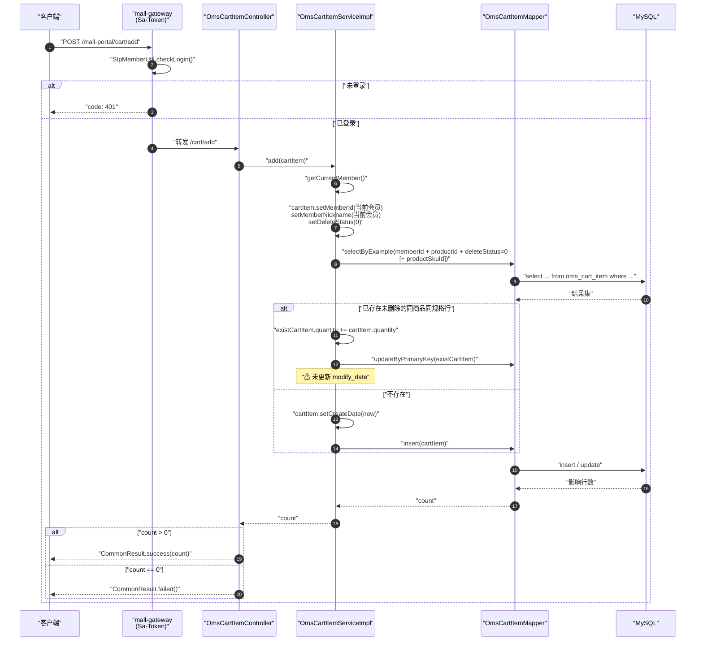
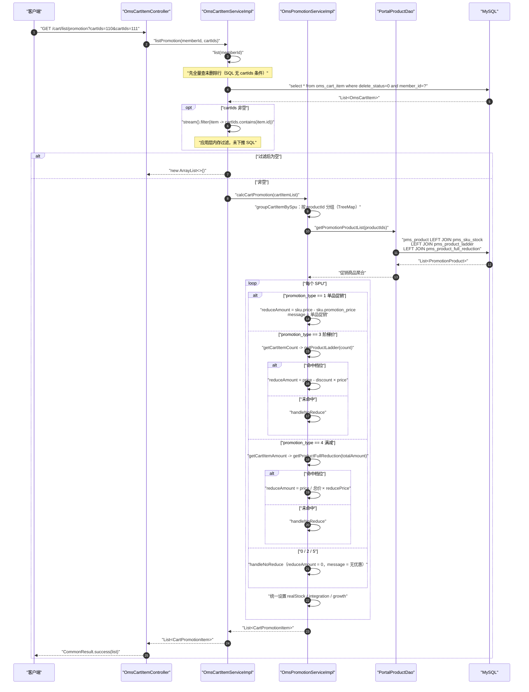
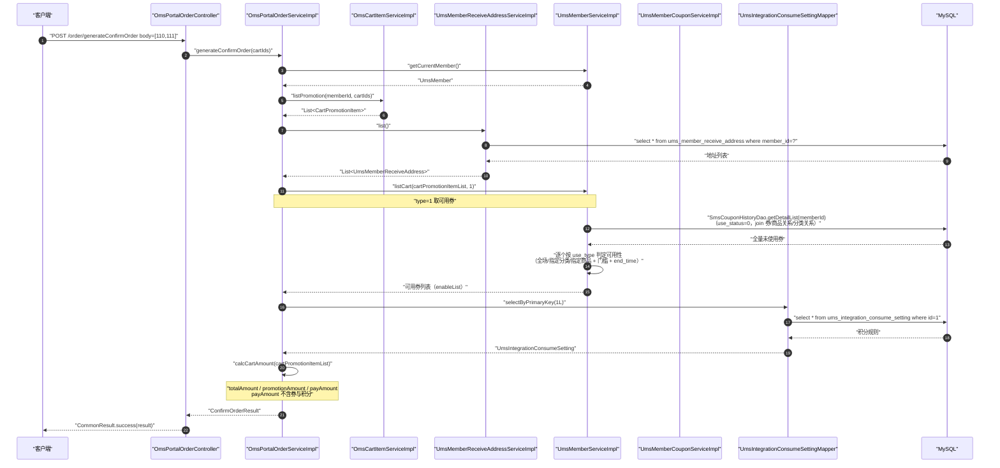
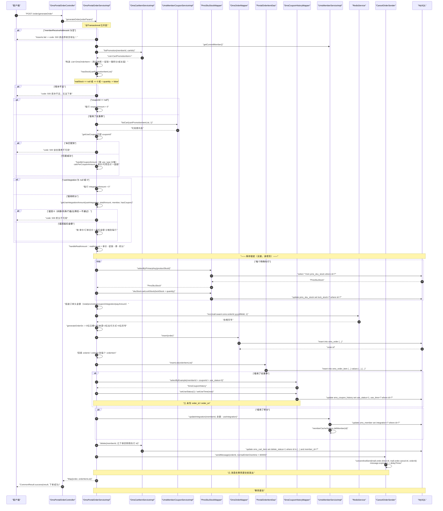
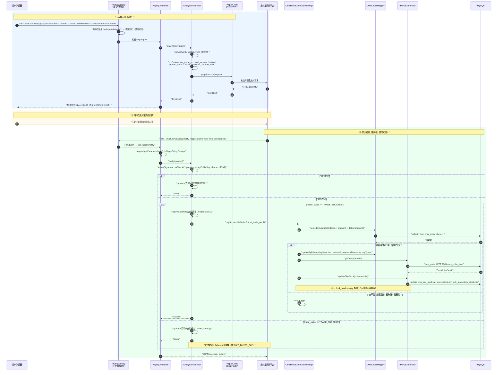
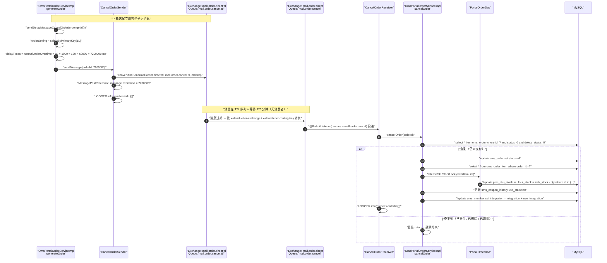
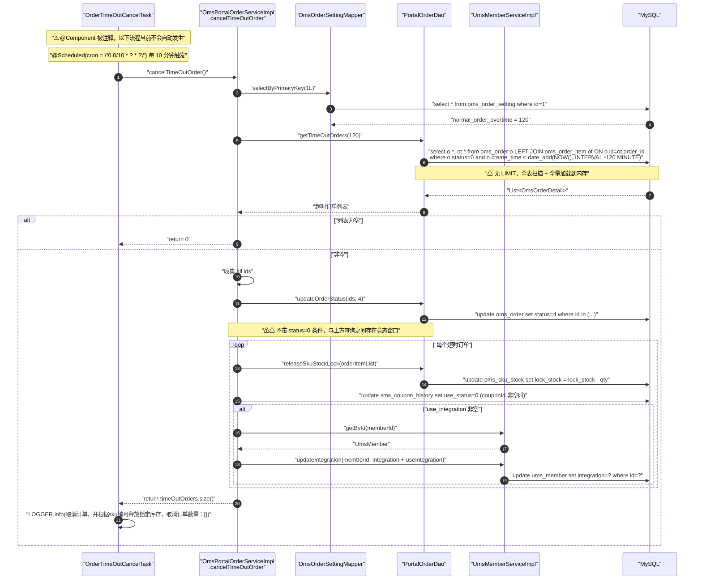
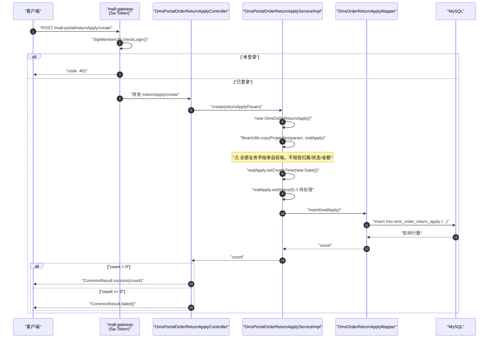

# 详细设计 · 购物车与下单（前台）

| 项目 | 内容 |
| --- | --- |
| 文档编号 | DD-OMS-CART-ORDER-PORTAL-001 |
| 所属业务域 | 订单域（`oms`），前台交易链路 |
| 涉及服务 | `mall-portal`（:8085），经 `mall-gateway`（:8201）暴露 |
| 涉及数据表 | `oms_cart_item`、`oms_order`、`oms_order_item`、`oms_order_return_apply`、`oms_order_setting`、`pms_product`、`pms_sku_stock`、`pms_product_ladder`、`pms_product_full_reduction`、`sms_coupon`、`sms_coupon_history`、`ums_member_receive_address`、`ums_integration_consume_setting` |
| 接口数量 | 23 个（购物车 8 + 订单 10 + 退货 1 + 支付宝 4） |
| 网关前缀 | `/mall-portal/cart/**`、`/mall-portal/order/**`、`/mall-portal/returnApply/**`、`/mall-portal/alipay/**` |
| 文档状态 | 待评审 |

---

## 一、概述

### 1.1 范围

本文档描述 **mall-portal 前台交易链路**（购物车 → 确认单 → 下单 → 支付 → 超时取消 → 退货申请）的详细设计，覆盖：

- **数据库设计**：交易相关 13 张表的结构、字典、关联与冗余、索引约束现状与改进建议
- **接口设计**：23 个 REST 接口的请求参数、响应结构与数据模型
- **包设计**：`mall-portal` 内部包结构、跨 `mall-common` / `mall-mbg` 的依赖关系与分层规则
- **运行流程**：加入购物车、购物车促销计算、生成确认单、提交订单、支付宝支付与回调、订单超时取消（MQ 延迟消息 + 定时任务兜底）、退货申请
- **日志设计**：日志框架、访问日志切面、本模块埋点与输出目的地
- **测试用例设计**：功能、边界、异常三类用例，重点覆盖库存、优惠、积分、幂等与并发

不在本文档范围内：

- 后台订单管理（`mall-admin` 的 `OmsOrderController`、`OmsOrderReturnApplyController`、`OmsOrderSettingController`）。注意 `/order` 与 `/returnApply` 两个路径前缀**在 `mall-admin` 与 `mall-portal` 中同时存在**，本文只覆盖前台侧（`OmsPortalOrderController`、`OmsPortalOrderReturnApplyController`），按 HTTP 方法与路径区分归属，见 3.1.5。
- 优惠券的发放/领取规则（`UmsMemberCouponController`、`UmsMemberCouponServiceImpl` 的 `add`）本身，本文只覆盖**下单时的优惠券可用性判定与核销**。
- 商品主数据与 SKU 的维护（见商品管理详细设计）。
- 秒杀/限时购活动配置（`sms_flash_promotion*`）。

### 1.2 术语

| 术语 | 含义 |
| --- | --- |
| SPU | 商品（`pms_product`），本文以 `productId` 标识 |
| SKU | 商品规格库存（`pms_sku_stock`），本文以 `productSkuId` 标识。**购物车的数量、库存、锁定库存都以 SKU 为粒度** |
| 真实库存（realStock） | `pms_sku_stock.stock - pms_sku_stock.lock_stock`，即「剩余可售库存」 |
| 锁定库存（lockStock） | 下单时先占用的库存，`lock_stock` 累加；支付成功后转为扣减真实库存；订单取消/超时则释放 |
| 促销计算 | `OmsPromotionService.calcCartPromotion`，按「以 SPU 为单位分组」的方式计算每个购物车行的 `reduceAmount`（单行优惠金额） |
| 确认单（ConfirmOrderResult） | 结算页数据聚合：购物车促销项 + 收货地址 + 可用优惠券 + 积分规则 + 金额试算 |
| 金额分解 | `oms_order_item` 上按「行」存放的 `promotion_amount` / `coupon_amount` / `integration_amount` / `real_amount`，订单头金额由这些行金额乘以数量汇总 |
| 双保险 | 未支付订单超时取消的两条独立通道：RabbitMQ 延迟消息（`CancelOrderSender`/`CancelOrderReceiver`）与 Spring 定时任务（`OrderTimeOutCancelTask` → `cancelTimeOutOrder`） |
| 权益返还 | 订单取消时对已核销资源的反向操作：释放锁定库存、优惠券状态回滚为 0、返还抵扣的积分 |

### 1.3 接口清单总览

| # | 方法 | 路径（服务内） | 网关路径 | 说明 | 控制器 |
| --- | --- | --- | --- | --- | --- |
| 1 | POST | `/cart/add` | `/mall-portal/cart/add` | 添加商品到购物车 | `OmsCartItemController` |
| 2 | GET | `/cart/list` | `/mall-portal/cart/list` | 获取当前会员的购物车列表（无促销信息） | `OmsCartItemController` |
| 3 | GET | `/cart/list/promotion` | `/mall-portal/cart/list/promotion` | 获取当前会员的购物车列表（含促销信息） | `OmsCartItemController` |
| 4 | GET | `/cart/update/quantity` | `/mall-portal/cart/update/quantity` | 修改购物车中某个商品的数量 | `OmsCartItemController` |
| 5 | GET | `/cart/getProduct/{productId}` | `/mall-portal/cart/getProduct/{productId}` | 获取购物车中某个商品的规格，用于重选规格 | `OmsCartItemController` |
| 6 | POST | `/cart/update/attr` | `/mall-portal/cart/update/attr` | 修改购物车中商品的规格 | `OmsCartItemController` |
| 7 | POST | `/cart/delete` | `/mall-portal/cart/delete` | 删除购物车中的某个商品（批量，逻辑删除） | `OmsCartItemController` |
| 8 | POST | `/cart/clear` | `/mall-portal/cart/clear` | 清空购物车（逻辑删除） | `OmsCartItemController` |
| 9 | POST | `/order/generateConfirmOrder` | `/mall-portal/order/generateConfirmOrder` | 根据购物车信息生成确认单信息 | `OmsPortalOrderController` |
| 10 | POST | `/order/generateOrder` | `/mall-portal/order/generateOrder` | 根据购物车信息生成订单 | `OmsPortalOrderController` |
| 11 | POST | `/order/paySuccess` | `/mall-portal/order/paySuccess` | 用户支付成功的回调 | `OmsPortalOrderController` |
| 12 | POST | `/order/cancelTimeOutOrder` | `/mall-portal/order/cancelTimeOutOrder` | 自动取消超时订单（批量） | `OmsPortalOrderController` |
| 13 | POST | `/order/cancelOrder` | `/mall-portal/order/cancelOrder` | 取消单个超时订单（发送延迟消息） | `OmsPortalOrderController` |
| 14 | GET | `/order/list` | `/mall-portal/order/list` | 按状态分页获取用户订单列表 | `OmsPortalOrderController` |
| 15 | GET | `/order/detail/{orderId}` | `/mall-portal/order/detail/{orderId}` | 根据 ID 获取订单详情 | `OmsPortalOrderController` |
| 16 | POST | `/order/cancelUserOrder` | `/mall-portal/order/cancelUserOrder` | 用户取消订单 | `OmsPortalOrderController` |
| 17 | POST | `/order/confirmReceiveOrder` | `/mall-portal/order/confirmReceiveOrder` | 用户确认收货 | `OmsPortalOrderController` |
| 18 | POST | `/order/deleteOrder` | `/mall-portal/order/deleteOrder` | 用户删除订单（逻辑删除） | `OmsPortalOrderController` |
| 19 | POST | `/returnApply/create` | `/mall-portal/returnApply/create` | 申请退货 | `OmsPortalOrderReturnApplyController` |
| 20 | GET | `/alipay/pay` | `/mall-portal/alipay/pay` | 支付宝电脑网站支付（返回支付表单 HTML） | `AlipayController` |
| 21 | GET | `/alipay/webPay` | `/mall-portal/alipay/webPay` | 支付宝手机网站支付（返回支付表单 HTML） | `AlipayController` |
| 22 | POST | `/alipay/notify` | `/mall-portal/alipay/notify` | 支付宝异步回调 | `AlipayController` |
| 23 | GET | `/alipay/query` | `/mall-portal/alipay/query` | 支付宝统一收单线下交易查询 | `AlipayController` |

> **接口计数说明**：本文按「仓库中已实现的端点」计数。其中 `/alipay/notify` 未出现在 `docs/openapi.yaml` 中（见 3.5 不一致清单 ①）；`/order/paySuccess` 同时被 `openapi.yaml` 收录，但它是**面向浏览器的支付回跳接口**，不是支付宝服务端回调（服务端回调是 `/alipay/notify`）。

### 1.4 鉴权与网关

网关 `mall-gateway` 的 `SaTokenConfig.getSaReactorFilter()` 对 `/**` 全量拦截，白名单取自 `IgnoreUrlsConfig`（`secure.ignore.urls`）：

```java
// mall-gateway/.../SaTokenConfig.java
SaRouter.match(SaHttpMethod.OPTIONS).stop();                       // 预检请求直接放行
SaRouter.match("/mall-portal/**", r -> StpMemberUtil.checkLogin()).stop();  // 前台会员认证
SaRouter.match("/mall-admin/**", r -> StpUtil.checkLogin());       // 后台用户认证
```

白名单中与本模块相关的条目（`mall-gateway/src/main/resources/application.yml`）：

| 白名单路径 | 影响的本文接口 |
| --- | --- |
| `/mall-portal/alipay/**` | 接口 20、21、22、23 **全部允许匿名访问** |
| `/mall-portal/product/**`、`/mall-portal/home/**`、`/mall-portal/brand/**`、`/mall-portal/sso/login`、`/mall-portal/sso/register`、`/mall-portal/sso/getAuthCode` | 不在本文范围（列出以示对比：**`/cart`、`/order`、`/returnApply` 均不在白名单中**） |

**结论**：本文 23 个接口中，**接口 20–23（`/alipay/**`）可匿名调用**，其余 19 个接口必须携带前台会员 Token（`Authorization: Bearer <token>`），由网关执行 `StpMemberUtil.checkLogin()`，未登录返回 `code: 401`。

两个必须显式指出的风险（详见 2.7 ⑮、⑯）：

1. `/order/paySuccess`、`/order/cancelTimeOutOrder`、`/order/cancelOrder` 这 3 个端点**只需要「会员已登录」，不校验订单归属**，任意登录会员可对任意 `orderId` 发起支付回调或取消。
2. `/alipay/notify` 在白名单内可匿名访问。其安全性完全依赖 `AlipayServiceImpl.notify()` 内的 `AlipaySignature.rsaCheckV1` 验签，**该验签是存在的**（不是缺口）；但 `AlipayServiceImpl.query()` 与 `/order/paySuccess` 无任何验签，见 2.7 ⑮。

---

## 二、数据库设计

### 2.1 表清单

| 表名 | 类型 | 说明 | 本模块操作 |
| --- | --- | --- | --- |
| `oms_cart_item` | 主表 | 购物车表 | 增、改、逻辑删、查 |
| `oms_order` | 主表 | 订单表 | 增、改状态、逻辑删、查 |
| `oms_order_item` | 从表 | 订单中所包含的商品（行级金额分解与商品快照） | 批量增、查 |
| `oms_order_return_apply` | 主表 | 订单退货申请 | 增（前台只申请，不处理） |
| `oms_order_setting` | 配置表 | 订单设置表（超时时间、自动确认天数） | 读（`selectByPrimaryKey(1)` / `selectByExample`） |
| `pms_product` | 关联表 | 商品信息（促销类型、赠积分/成长值） | 读 |
| `pms_sku_stock` | 关联表 | SKU 库存（价格、促销价、库存、锁定库存） | 读 + **写（锁定/扣减/释放）** |
| `pms_product_ladder` | 关联表 | 产品阶梯价格表（只针对同商品） | 读 |
| `pms_product_full_reduction` | 关联表 | 产品满减表（只针对同商品） | 读 |
| `sms_coupon` | 关联表 | 优惠券表（面额、门槛、使用类型、有效期） | 读 |
| `sms_coupon_history` | 关联表 | 优惠券使用、领取历史表 | 读 + **写（use_status 核销/回滚）** |
| `ums_member_receive_address` | 关联表 | 会员收货地址表 | 读 |
| `ums_integration_consume_setting` | 配置表 | 积分消费设置（`selectByPrimaryKey(1)`） | 读 |

> **注意**：`sms_coupon`、`pms_product_ladder`、`pms_product_full_reduction`、`ums_member_receive_address` 四张表**没有在 `mall-portal` 内定义任何 `dao/*.xml`**，其查询全部由 MBG 生成的 Mapper（单表 + `Example`）或 `PortalProductDao.getPromotionProductList`（多表 LEFT JOIN）完成。参见 4.1。

### 2.2 建表语句（现状）

以下 DDL 原文照抄 `document/sql/mall.sql`（仅去掉插入数据行）。

#### 2.2.1 `oms_cart_item`（mall.sql:287）

```sql
DROP TABLE IF EXISTS `oms_cart_item`;
CREATE TABLE `oms_cart_item`  (
  `id` bigint(20) NOT NULL AUTO_INCREMENT,
  `product_id` bigint(20) NULL DEFAULT NULL,
  `product_sku_id` bigint(20) NULL DEFAULT NULL,
  `member_id` bigint(20) NULL DEFAULT NULL,
  `quantity` int(11) NULL DEFAULT NULL COMMENT '购买数量',
  `price` decimal(10, 2) NULL DEFAULT NULL COMMENT '添加到购物车的价格',
  `product_pic` varchar(1000) CHARACTER SET utf8 COLLATE utf8_general_ci NULL DEFAULT NULL COMMENT '商品主图',
  `product_name` varchar(500) CHARACTER SET utf8 COLLATE utf8_general_ci NULL DEFAULT NULL COMMENT '商品名称',
  `product_sub_title` varchar(500) CHARACTER SET utf8 COLLATE utf8_general_ci NULL DEFAULT NULL COMMENT '商品副标题（卖点）',
  `product_sku_code` varchar(200) CHARACTER SET utf8 COLLATE utf8_general_ci NULL DEFAULT NULL COMMENT '商品sku条码',
  `member_nickname` varchar(500) CHARACTER SET utf8 COLLATE utf8_general_ci NULL DEFAULT NULL COMMENT '会员昵称',
  `create_date` datetime NULL DEFAULT NULL COMMENT '创建时间',
  `modify_date` datetime NULL DEFAULT NULL COMMENT '修改时间',
  `delete_status` int(1) NULL DEFAULT 0 COMMENT '是否删除',
  `product_category_id` bigint(20) NULL DEFAULT NULL COMMENT '商品分类',
  `product_brand` varchar(200) CHARACTER SET utf8 COLLATE utf8_general_ci NULL DEFAULT NULL,
  `product_sn` varchar(200) CHARACTER SET utf8 COLLATE utf8_general_ci NULL DEFAULT NULL,
  `product_attr` varchar(500) CHARACTER SET utf8 COLLATE utf8_general_ci NULL DEFAULT NULL COMMENT '商品销售属性:[{\"key\":\"颜色\",\"value\":\"颜色\"},{\"key\":\"容量\",\"value\":\"4G\"}]',
  PRIMARY KEY (`id`) USING BTREE
) ENGINE = InnoDB AUTO_INCREMENT = 115 CHARACTER SET = utf8 COLLATE = utf8_general_ci COMMENT = '购物车表' ROW_FORMAT = DYNAMIC;
```

#### 2.2.2 `oms_order`（mall.sql:443）

```sql
DROP TABLE IF EXISTS `oms_order`;
CREATE TABLE `oms_order`  (
  `id` bigint(20) NOT NULL AUTO_INCREMENT COMMENT '订单id',
  `member_id` bigint(20) NOT NULL,
  `coupon_id` bigint(20) NULL DEFAULT NULL,
  `order_sn` varchar(64) CHARACTER SET utf8 COLLATE utf8_general_ci NULL DEFAULT NULL COMMENT '订单编号',
  `create_time` datetime NULL DEFAULT NULL COMMENT '提交时间',
  `member_username` varchar(64) CHARACTER SET utf8 COLLATE utf8_general_ci NULL DEFAULT NULL COMMENT '用户帐号',
  `total_amount` decimal(10, 2) NULL DEFAULT NULL COMMENT '订单总金额',
  `pay_amount` decimal(10, 2) NULL DEFAULT NULL COMMENT '应付金额（实际支付金额）',
  `freight_amount` decimal(10, 2) NULL DEFAULT NULL COMMENT '运费金额',
  `promotion_amount` decimal(10, 2) NULL DEFAULT NULL COMMENT '促销优化金额（促销价、满减、阶梯价）',
  `integration_amount` decimal(10, 2) NULL DEFAULT NULL COMMENT '积分抵扣金额',
  `coupon_amount` decimal(10, 2) NULL DEFAULT NULL COMMENT '优惠券抵扣金额',
  `discount_amount` decimal(10, 2) NULL DEFAULT NULL COMMENT '管理员后台调整订单使用的折扣金额',
  `pay_type` int(1) NULL DEFAULT NULL COMMENT '支付方式：0->未支付；1->支付宝；2->微信',
  `source_type` int(1) NULL DEFAULT NULL COMMENT '订单来源：0->PC订单；1->app订单',
  `status` int(1) NULL DEFAULT NULL COMMENT '订单状态：0->待付款；1->待发货；2->已发货；3->已完成；4->已关闭；5->无效订单',
  `order_type` int(1) NULL DEFAULT NULL COMMENT '订单类型：0->正常订单；1->秒杀订单',
  `delivery_company` varchar(64) CHARACTER SET utf8 COLLATE utf8_general_ci NULL DEFAULT NULL COMMENT '物流公司(配送方式)',
  `delivery_sn` varchar(64) CHARACTER SET utf8 COLLATE utf8_general_ci NULL DEFAULT NULL COMMENT '物流单号',
  `auto_confirm_day` int(11) NULL DEFAULT NULL COMMENT '自动确认时间（天）',
  `integration` int(11) NULL DEFAULT NULL COMMENT '可以获得的积分',
  `growth` int(11) NULL DEFAULT NULL COMMENT '可以活动的成长值',
  `promotion_info` varchar(100) CHARACTER SET utf8 COLLATE utf8_general_ci NULL DEFAULT NULL COMMENT '活动信息',
  `bill_type` int(1) NULL DEFAULT NULL COMMENT '发票类型：0->不开发票；1->电子发票；2->纸质发票',
  `bill_header` varchar(200) CHARACTER SET utf8 COLLATE utf8_general_ci NULL DEFAULT NULL COMMENT '发票抬头',
  `bill_content` varchar(200) CHARACTER SET utf8 COLLATE utf8_general_ci NULL DEFAULT NULL COMMENT '发票内容',
  `bill_receiver_phone` varchar(32) CHARACTER SET utf8 COLLATE utf8_general_ci NULL DEFAULT NULL COMMENT '收票人电话',
  `bill_receiver_email` varchar(64) CHARACTER SET utf8 COLLATE utf8_general_ci NULL DEFAULT NULL COMMENT '收票人邮箱',
  `receiver_name` varchar(100) CHARACTER SET utf8 COLLATE utf8_general_ci NOT NULL COMMENT '收货人姓名',
  `receiver_phone` varchar(32) CHARACTER SET utf8 COLLATE utf8_general_ci NOT NULL COMMENT '收货人电话',
  `receiver_post_code` varchar(32) CHARACTER SET utf8 COLLATE utf8_general_ci NULL DEFAULT NULL COMMENT '收货人邮编',
  `receiver_province` varchar(32) CHARACTER SET utf8 COLLATE utf8_general_ci NULL DEFAULT NULL COMMENT '省份/直辖市',
  `receiver_city` varchar(32) CHARACTER SET utf8 COLLATE utf8_general_ci NULL DEFAULT NULL COMMENT '城市',
  `receiver_region` varchar(32) CHARACTER SET utf8 COLLATE utf8_general_ci NULL DEFAULT NULL COMMENT '区',
  `receiver_detail_address` varchar(200) CHARACTER SET utf8 COLLATE utf8_general_ci NULL DEFAULT NULL COMMENT '详细地址',
  `note` varchar(500) CHARACTER SET utf8 COLLATE utf8_general_ci NULL DEFAULT NULL COMMENT '订单备注',
  `confirm_status` int(1) NULL DEFAULT NULL COMMENT '确认收货状态：0->未确认；1->已确认',
  `delete_status` int(1) NOT NULL DEFAULT 0 COMMENT '删除状态：0->未删除；1->已删除',
  `use_integration` int(11) NULL DEFAULT NULL COMMENT '下单时使用的积分',
  `payment_time` datetime NULL DEFAULT NULL COMMENT '支付时间',
  `delivery_time` datetime NULL DEFAULT NULL COMMENT '发货时间',
  `receive_time` datetime NULL DEFAULT NULL COMMENT '确认收货时间',
  `comment_time` datetime NULL DEFAULT NULL COMMENT '评价时间',
  `modify_time` datetime NULL DEFAULT NULL COMMENT '修改时间',
  PRIMARY KEY (`id`) USING BTREE
) ENGINE = InnoDB AUTO_INCREMENT = 77 CHARACTER SET = utf8 COLLATE = utf8_general_ci COMMENT = '订单表' ROW_FORMAT = DYNAMIC;
```

#### 2.2.3 `oms_order_item`（mall.sql:564）

```sql
DROP TABLE IF EXISTS `oms_order_item`;
CREATE TABLE `oms_order_item`  (
  `id` bigint(20) NOT NULL AUTO_INCREMENT,
  `order_id` bigint(20) NULL DEFAULT NULL COMMENT '订单id',
  `order_sn` varchar(64) CHARACTER SET utf8 COLLATE utf8_general_ci NULL DEFAULT NULL COMMENT '订单编号',
  `product_id` bigint(20) NULL DEFAULT NULL,
  `product_pic` varchar(500) CHARACTER SET utf8 COLLATE utf8_general_ci NULL DEFAULT NULL,
  `product_name` varchar(200) CHARACTER SET utf8 COLLATE utf8_general_ci NULL DEFAULT NULL,
  `product_brand` varchar(200) CHARACTER SET utf8 COLLATE utf8_general_ci NULL DEFAULT NULL,
  `product_sn` varchar(64) CHARACTER SET utf8 COLLATE utf8_general_ci NULL DEFAULT NULL,
  `product_price` decimal(10, 2) NULL DEFAULT NULL COMMENT '销售价格',
  `product_quantity` int(11) NULL DEFAULT NULL COMMENT '购买数量',
  `product_sku_id` bigint(20) NULL DEFAULT NULL COMMENT '商品sku编号',
  `product_sku_code` varchar(50) CHARACTER SET utf8 COLLATE utf8_general_ci NULL DEFAULT NULL COMMENT '商品sku条码',
  `product_category_id` bigint(20) NULL DEFAULT NULL COMMENT '商品分类id',
  `promotion_name` varchar(200) CHARACTER SET utf8 COLLATE utf8_general_ci NULL DEFAULT NULL COMMENT '商品促销名称',
  `promotion_amount` decimal(10, 2) NULL DEFAULT NULL COMMENT '商品促销分解金额',
  `coupon_amount` decimal(10, 2) NULL DEFAULT NULL COMMENT '优惠券优惠分解金额',
  `integration_amount` decimal(10, 2) NULL DEFAULT NULL COMMENT '积分优惠分解金额',
  `real_amount` decimal(10, 2) NULL DEFAULT NULL COMMENT '该商品经过优惠后的分解金额',
  `gift_integration` int(11) NULL DEFAULT 0,
  `gift_growth` int(11) NULL DEFAULT 0,
  `product_attr` varchar(500) CHARACTER SET utf8 COLLATE utf8_general_ci NULL DEFAULT NULL COMMENT '商品销售属性:[{\"key\":\"颜色\",\"value\":\"颜色\"},{\"key\":\"容量\",\"value\":\"4G\"}]',
  PRIMARY KEY (`id`) USING BTREE
) ENGINE = InnoDB AUTO_INCREMENT = 115 CHARACTER SET = utf8 COLLATE = utf8_general_ci COMMENT = '订单中所包含的商品' ROW_FORMAT = DYNAMIC;
```

#### 2.2.4 `oms_order_return_apply`（mall.sql:748）

```sql
DROP TABLE IF EXISTS `oms_order_return_apply`;
CREATE TABLE `oms_order_return_apply`  (
  `id` bigint(20) NOT NULL AUTO_INCREMENT,
  `order_id` bigint(20) NULL DEFAULT NULL COMMENT '订单id',
  `company_address_id` bigint(20) NULL DEFAULT NULL COMMENT '收货地址表id',
  `product_id` bigint(20) NULL DEFAULT NULL COMMENT '退货商品id',
  `order_sn` varchar(64) CHARACTER SET utf8 COLLATE utf8_general_ci NULL DEFAULT NULL COMMENT '订单编号',
  `create_time` datetime NULL DEFAULT NULL COMMENT '申请时间',
  `member_username` varchar(64) CHARACTER SET utf8 COLLATE utf8_general_ci NULL DEFAULT NULL COMMENT '会员用户名',
  `return_amount` decimal(10, 2) NULL DEFAULT NULL COMMENT '退款金额',
  `return_name` varchar(100) CHARACTER SET utf8 COLLATE utf8_general_ci NULL DEFAULT NULL COMMENT '退货人姓名',
  `return_phone` varchar(100) CHARACTER SET utf8 COLLATE utf8_general_ci NULL DEFAULT NULL COMMENT '退货人电话',
  `status` int(1) NULL DEFAULT NULL COMMENT '申请状态：0->待处理；1->退货中；2->已完成；3->已拒绝',
  `handle_time` datetime NULL DEFAULT NULL COMMENT '处理时间',
  `product_pic` varchar(500) CHARACTER SET utf8 COLLATE utf8_general_ci NULL DEFAULT NULL COMMENT '商品图片',
  `product_name` varchar(200) CHARACTER SET utf8 COLLATE utf8_general_ci NULL DEFAULT NULL COMMENT '商品名称',
  `product_brand` varchar(200) CHARACTER SET utf8 COLLATE utf8_general_ci NULL DEFAULT NULL COMMENT '商品品牌',
  `product_attr` varchar(500) CHARACTER SET utf8 COLLATE utf8_general_ci NULL DEFAULT NULL COMMENT '商品销售属性：颜色：红色；尺码：xl;',
  `product_count` int(11) NULL DEFAULT NULL COMMENT '退货数量',
  `product_price` decimal(10, 2) NULL DEFAULT NULL COMMENT '商品单价',
  `product_real_price` decimal(10, 2) NULL DEFAULT NULL COMMENT '商品实际支付单价',
  `reason` varchar(200) CHARACTER SET utf8 COLLATE utf8_general_ci NULL DEFAULT NULL COMMENT '原因',
  `description` varchar(500) CHARACTER SET utf8 COLLATE utf8_general_ci NULL DEFAULT NULL COMMENT '描述',
  `proof_pics` varchar(1000) CHARACTER SET utf8 COLLATE utf8_general_ci NULL DEFAULT NULL COMMENT '凭证图片，以逗号隔开',
  `handle_note` varchar(500) CHARACTER SET utf8 COLLATE utf8_general_ci NULL DEFAULT NULL COMMENT '处理备注',
  `handle_man` varchar(100) CHARACTER SET utf8 COLLATE utf8_general_ci NULL DEFAULT NULL COMMENT '处理人员',
  `receive_man` varchar(100) CHARACTER SET utf8 COLLATE utf8_general_ci NULL DEFAULT NULL COMMENT '收货人',
  `receive_time` datetime NULL DEFAULT NULL COMMENT '收货时间',
  `receive_note` varchar(500) CHARACTER SET utf8 COLLATE utf8_general_ci NULL DEFAULT NULL COMMENT '收货备注',
  PRIMARY KEY (`id`) USING BTREE
) ENGINE = InnoDB AUTO_INCREMENT = 27 CHARACTER SET = utf8 COLLATE = utf8_general_ci COMMENT = '订单退货申请' ROW_FORMAT = DYNAMIC;
```

#### 2.2.5 `oms_order_setting`（mall.sql:834）

```sql
DROP TABLE IF EXISTS `oms_order_setting`;
CREATE TABLE `oms_order_setting`  (
  `id` bigint(20) NOT NULL AUTO_INCREMENT,
  `flash_order_overtime` int(11) NULL DEFAULT NULL COMMENT '秒杀订单超时关闭时间(分)',
  `normal_order_overtime` int(11) NULL DEFAULT NULL COMMENT '正常订单超时时间(分)',
  `confirm_overtime` int(11) NULL DEFAULT NULL COMMENT '发货后自动确认收货时间（天）',
  `finish_overtime` int(11) NULL DEFAULT NULL COMMENT '自动完成交易时间，不能申请售后（天）',
  `comment_overtime` int(11) NULL DEFAULT NULL COMMENT '订单完成后自动好评时间（天）',
  PRIMARY KEY (`id`) USING BTREE
) ENGINE = InnoDB AUTO_INCREMENT = 2 CHARACTER SET = utf8 COLLATE = utf8_general_ci COMMENT = '订单设置表' ROW_FORMAT = DYNAMIC;
```

现有数据（`mall.sql:848`）：`INSERT INTO oms_order_setting VALUES (1, 60, 120, 15, 7, 7);` —— 即**正常订单超时 120 分钟**、秒杀订单超时 60 分钟、发货后 15 天自动确认收货。

#### 2.2.6 `pms_product`（mall.sql:1084）

```sql
DROP TABLE IF EXISTS `pms_product`;
CREATE TABLE `pms_product`  (
  `id` bigint(20) NOT NULL AUTO_INCREMENT,
  `brand_id` bigint(20) NULL DEFAULT NULL,
  `product_category_id` bigint(20) NULL DEFAULT NULL,
  `feight_template_id` bigint(20) NULL DEFAULT NULL,
  `product_attribute_category_id` bigint(20) NULL DEFAULT NULL,
  `name` varchar(200) CHARACTER SET utf8 COLLATE utf8_general_ci NOT NULL,
  `pic` varchar(255) CHARACTER SET utf8 COLLATE utf8_general_ci NULL DEFAULT NULL,
  `product_sn` varchar(64) CHARACTER SET utf8 COLLATE utf8_general_ci NOT NULL COMMENT '货号',
  `delete_status` int(1) NULL DEFAULT NULL COMMENT '删除状态：0->未删除；1->已删除',
  `publish_status` int(1) NULL DEFAULT NULL COMMENT '上架状态：0->下架；1->上架',
  `new_status` int(1) NULL DEFAULT NULL COMMENT '新品状态:0->不是新品；1->新品',
  `recommand_status` int(1) NULL DEFAULT NULL COMMENT '推荐状态；0->不推荐；1->推荐',
  `verify_status` int(1) NULL DEFAULT NULL COMMENT '审核状态：0->未审核；1->审核通过',
  `sort` int(11) NULL DEFAULT NULL COMMENT '排序',
  `sale` int(11) NULL DEFAULT NULL COMMENT '销量',
  `price` decimal(10, 2) NULL DEFAULT NULL,
  `promotion_price` decimal(10, 2) NULL DEFAULT NULL COMMENT '促销价格',
  `gift_growth` int(11) NULL DEFAULT 0 COMMENT '赠送的成长值',
  `gift_point` int(11) NULL DEFAULT 0 COMMENT '赠送的积分',
  `use_point_limit` int(11) NULL DEFAULT NULL COMMENT '限制使用的积分数',
  `sub_title` varchar(255) CHARACTER SET utf8 COLLATE utf8_general_ci NULL DEFAULT NULL COMMENT '副标题',
  `description` text CHARACTER SET utf8 COLLATE utf8_general_ci NULL COMMENT '商品描述',
  `original_price` decimal(10, 2) NULL DEFAULT NULL COMMENT '市场价',
  `stock` int(11) NULL DEFAULT NULL COMMENT '库存',
  `low_stock` int(11) NULL DEFAULT NULL COMMENT '库存预警值',
  `unit` varchar(16) CHARACTER SET utf8 COLLATE utf8_general_ci NULL DEFAULT NULL COMMENT '单位',
  `weight` decimal(10, 2) NULL DEFAULT NULL COMMENT '商品重量，默认为克',
  `preview_status` int(1) NULL DEFAULT NULL COMMENT '是否为预告商品：0->不是；1->是',
  `service_ids` varchar(64) CHARACTER SET utf8 COLLATE utf8_general_ci NULL DEFAULT NULL COMMENT '以逗号分割的产品服务：1->无忧退货；2->快速退款；3->免费包邮',
  `keywords` varchar(255) CHARACTER SET utf8 COLLATE utf8_general_ci NULL DEFAULT NULL,
  `note` varchar(255) CHARACTER SET utf8 COLLATE utf8_general_ci NULL DEFAULT NULL,
  `album_pics` varchar(255) CHARACTER SET utf8 COLLATE utf8_general_ci NULL DEFAULT NULL COMMENT '画册图片，连产品图片限制为5张，以逗号分割',
  `detail_title` varchar(255) CHARACTER SET utf8 COLLATE utf8_general_ci NULL DEFAULT NULL,
  `detail_desc` text CHARACTER SET utf8 COLLATE utf8_general_ci NULL,
  `detail_html` text CHARACTER SET utf8 COLLATE utf8_general_ci NULL COMMENT '产品详情网页内容',
  `detail_mobile_html` text CHARACTER SET utf8 COLLATE utf8_general_ci NULL COMMENT '移动端网页详情',
  `promotion_start_time` datetime NULL DEFAULT NULL COMMENT '促销开始时间',
  `promotion_end_time` datetime NULL DEFAULT NULL COMMENT '促销结束时间',
  `promotion_per_limit` int(11) NULL DEFAULT NULL COMMENT '活动限购数量',
  `promotion_type` int(1) NULL DEFAULT NULL COMMENT '促销类型：0->没有促销使用原价;1->使用促销价；2->使用会员价；3->使用阶梯价格；4->使用满减价格；5->限时购',
  `brand_name` varchar(255) CHARACTER SET utf8 COLLATE utf8_general_ci NULL DEFAULT NULL COMMENT '品牌名称',
  `product_category_name` varchar(255) CHARACTER SET utf8 COLLATE utf8_general_ci NULL DEFAULT NULL COMMENT '商品分类名称',
  PRIMARY KEY (`id`) USING BTREE
) ENGINE = InnoDB AUTO_INCREMENT = 46 CHARACTER SET = utf8 COLLATE = utf8_general_ci COMMENT = '商品信息' ROW_FORMAT = DYNAMIC;
```

#### 2.2.7 `pms_sku_stock`（mall.sql:1659）

```sql
DROP TABLE IF EXISTS `pms_sku_stock`;
CREATE TABLE `pms_sku_stock`  (
  `id` bigint(20) NOT NULL AUTO_INCREMENT,
  `product_id` bigint(20) NULL DEFAULT NULL,
  `sku_code` varchar(64) CHARACTER SET utf8 COLLATE utf8_general_ci NOT NULL COMMENT 'sku编码',
  `price` decimal(10, 2) NULL DEFAULT NULL,
  `stock` int(11) NULL DEFAULT 0 COMMENT '库存',
  `low_stock` int(11) NULL DEFAULT NULL COMMENT '预警库存',
  `pic` varchar(255) CHARACTER SET utf8 COLLATE utf8_general_ci NULL DEFAULT NULL COMMENT '展示图片',
  `sale` int(11) NULL DEFAULT NULL COMMENT '销量',
  `promotion_price` decimal(10, 2) NULL DEFAULT NULL COMMENT '单品促销价格',
  `lock_stock` int(11) NULL DEFAULT 0 COMMENT '锁定库存',
  `sp_data` varchar(500) CHARACTER SET utf8 COLLATE utf8_general_ci NULL DEFAULT NULL COMMENT '商品销售属性，json格式',
  PRIMARY KEY (`id`) USING BTREE
) ENGINE = InnoDB AUTO_INCREMENT = 243 CHARACTER SET = utf8 COLLATE = utf8_general_ci COMMENT = 'sku的库存' ROW_FORMAT = DYNAMIC;
```

#### 2.2.8 `pms_product_ladder`（mall.sql:1563）/ `pms_product_full_reduction`（mall.sql:1511）

```sql
DROP TABLE IF EXISTS `pms_product_ladder`;
CREATE TABLE `pms_product_ladder`  (
  `id` bigint(20) NOT NULL AUTO_INCREMENT,
  `product_id` bigint(20) NULL DEFAULT NULL,
  `count` int(11) NULL DEFAULT NULL COMMENT '满足的商品数量',
  `discount` decimal(10, 2) NULL DEFAULT NULL COMMENT '折扣',
  `price` decimal(10, 2) NULL DEFAULT NULL COMMENT '折后价格',
  PRIMARY KEY (`id`) USING BTREE
) ENGINE = InnoDB AUTO_INCREMENT = 148 CHARACTER SET = utf8 COLLATE = utf8_general_ci COMMENT = '产品阶梯价格表(只针对同商品)' ROW_FORMAT = DYNAMIC;

DROP TABLE IF EXISTS `pms_product_full_reduction`;
CREATE TABLE `pms_product_full_reduction`  (
  `id` bigint(11) NOT NULL AUTO_INCREMENT,
  `product_id` bigint(20) NULL DEFAULT NULL,
  `full_price` decimal(10, 2) NULL DEFAULT NULL,
  `reduce_price` decimal(10, 2) NULL DEFAULT NULL,
  PRIMARY KEY (`id`) USING BTREE
) ENGINE = InnoDB AUTO_INCREMENT = 148 CHARACTER SET = utf8 COLLATE = utf8_general_ci COMMENT = '产品满减表(只针对同商品)' ROW_FORMAT = DYNAMIC;
```

#### 2.2.9 `sms_coupon`（mall.sql:1778）/ `sms_coupon_history`（mall.sql:1813）

```sql
DROP TABLE IF EXISTS `sms_coupon`;
CREATE TABLE `sms_coupon`  (
  `id` bigint(20) NOT NULL AUTO_INCREMENT,
  `type` int(1) NULL DEFAULT NULL COMMENT '优惠券类型；0->全场赠券；1->会员赠券；2->购物赠券；3->注册赠券',
  `name` varchar(100) CHARACTER SET utf8 COLLATE utf8_general_ci NULL DEFAULT NULL,
  `platform` int(1) NULL DEFAULT NULL COMMENT '使用平台：0->全部；1->移动；2->PC',
  `count` int(11) NULL DEFAULT NULL COMMENT '数量',
  `amount` decimal(10, 2) NULL DEFAULT NULL COMMENT '金额',
  `per_limit` int(11) NULL DEFAULT NULL COMMENT '每人限领张数',
  `min_point` decimal(10, 2) NULL DEFAULT NULL COMMENT '使用门槛；0表示无门槛',
  `start_time` datetime NULL DEFAULT NULL,
  `end_time` datetime NULL DEFAULT NULL,
  `use_type` int(1) NULL DEFAULT NULL COMMENT '使用类型：0->全场通用；1->指定分类；2->指定商品',
  `note` varchar(200) CHARACTER SET utf8 COLLATE utf8_general_ci NULL DEFAULT NULL COMMENT '备注',
  `publish_count` int(11) NULL DEFAULT NULL COMMENT '发行数量',
  `use_count` int(11) NULL DEFAULT NULL COMMENT '已使用数量',
  `receive_count` int(11) NULL DEFAULT NULL COMMENT '领取数量',
  `enable_time` datetime NULL DEFAULT NULL COMMENT '可以领取的日期',
  `code` varchar(64) CHARACTER SET utf8 COLLATE utf8_general_ci NULL DEFAULT NULL COMMENT '优惠码',
  `member_level` int(1) NULL DEFAULT NULL COMMENT '可领取的会员类型：0->无限时',
  PRIMARY KEY (`id`) USING BTREE
) ENGINE = InnoDB AUTO_INCREMENT = 32 CHARACTER SET = utf8 COLLATE = utf8_general_ci COMMENT = '优惠券表' ROW_FORMAT = DYNAMIC;

DROP TABLE IF EXISTS `sms_coupon_history`;
CREATE TABLE `sms_coupon_history`  (
  `id` bigint(20) NOT NULL AUTO_INCREMENT,
  `coupon_id` bigint(20) NULL DEFAULT NULL,
  `member_id` bigint(20) NULL DEFAULT NULL,
  `coupon_code` varchar(64) CHARACTER SET utf8 COLLATE utf8_general_ci NULL DEFAULT NULL,
  `member_nickname` varchar(64) CHARACTER SET utf8 COLLATE utf8_general_ci NULL DEFAULT NULL COMMENT '领取人昵称',
  `get_type` int(1) NULL DEFAULT NULL COMMENT '获取类型：0->后台赠送；1->主动获取',
  `create_time` datetime NULL DEFAULT NULL,
  `use_status` int(1) NULL DEFAULT NULL COMMENT '使用状态：0->未使用；1->已使用；2->已过期',
  `use_time` datetime NULL DEFAULT NULL COMMENT '使用时间',
  `order_id` bigint(20) NULL DEFAULT NULL COMMENT '订单编号',
  `order_sn` varchar(100) CHARACTER SET utf8 COLLATE utf8_general_ci NULL DEFAULT NULL COMMENT '订单号码',
  PRIMARY KEY (`id`) USING BTREE,
  INDEX `idx_member_id`(`member_id`) USING BTREE,
  INDEX `idx_coupon_id`(`coupon_id`) USING BTREE
) ENGINE = InnoDB AUTO_INCREMENT = 53 CHARACTER SET = utf8 COLLATE = utf8_general_ci COMMENT = '优惠券使用、领取历史表' ROW_FORMAT = DYNAMIC;
```

#### 2.2.10 `ums_member_receive_address`（mall.sql:2832）/ `ums_integration_consume_setting`（mall.sql:2693）

```sql
DROP TABLE IF EXISTS `ums_member_receive_address`;
CREATE TABLE `ums_member_receive_address`  (
  `id` bigint(20) NOT NULL AUTO_INCREMENT,
  `member_id` bigint(20) NULL DEFAULT NULL,
  `name` varchar(100) CHARACTER SET utf8 COLLATE utf8_general_ci NULL DEFAULT NULL COMMENT '收货人名称',
  `phone_number` varchar(64) CHARACTER SET utf8 COLLATE utf8_general_ci NULL DEFAULT NULL,
  `default_status` int(1) NULL DEFAULT NULL COMMENT '是否为默认',
  `post_code` varchar(100) CHARACTER SET utf8 COLLATE utf8_general_ci NULL DEFAULT NULL COMMENT '邮政编码',
  `province` varchar(100) CHARACTER SET utf8 COLLATE utf8_general_ci NULL DEFAULT NULL COMMENT '省份/直辖市',
  `city` varchar(100) CHARACTER SET utf8 COLLATE utf8_general_ci NULL DEFAULT NULL COMMENT '城市',
  `region` varchar(100) CHARACTER SET utf8 COLLATE utf8_general_ci NULL DEFAULT NULL COMMENT '区',
  `detail_address` varchar(128) CHARACTER SET utf8 COLLATE utf8_general_ci NULL DEFAULT NULL COMMENT '详细地址(街道)',
  PRIMARY KEY (`id`) USING BTREE
) ENGINE = InnoDB AUTO_INCREMENT = 7 CHARACTER SET = utf8 COLLATE = utf8_general_ci COMMENT = '会员收货地址表' ROW_FORMAT = DYNAMIC;

DROP TABLE IF EXISTS `ums_integration_consume_setting`;
CREATE TABLE `ums_integration_consume_setting`  (
  `id` bigint(20) NOT NULL AUTO_INCREMENT,
  `deduction_per_amount` int(11) NULL DEFAULT NULL COMMENT '每一元需要抵扣的积分数量',
  `max_percent_per_order` int(11) NULL DEFAULT NULL COMMENT '每笔订单最高抵用百分比',
  `use_unit` int(11) NULL DEFAULT NULL COMMENT '每次使用积分最小单位100',
  `coupon_status` int(1) NULL DEFAULT NULL COMMENT '是否可以和优惠券同用；0->不可以；1->可以',
  PRIMARY KEY (`id`) USING BTREE
) ENGINE = InnoDB AUTO_INCREMENT = 2 CHARACTER SET = utf8 COLLATE = utf8_general_ci COMMENT = '积分消费设置' ROW_FORMAT = DYNAMIC;
```

现有数据（`mall.sql:2706`）：`INSERT INTO ums_integration_consume_setting VALUES (1, 100, 50, 100, 1);` —— 即**每 100 积分抵 1 元、单笔最高抵 50%、最低使用单位 100 积分、可与优惠券同用**。

### 2.3 字段说明

#### 2.3.1 `oms_cart_item`（购物车表）

| 字段 | 类型 | 允许空 | 默认值 | 中文名 | 说明 |
| --- | --- | --- | --- | --- | --- |
| `id` | bigint(20) | 否 | AUTO_INCREMENT | 主键 | 购物车行唯一标识 |
| `product_id` | bigint(20) | 是 | NULL | 商品 ID | SPU 编号，促销按此字段分组 |
| `product_sku_id` | bigint(20) | 是 | NULL | 商品 SKU ID | `pms_sku_stock.id`；库存与价格计算依赖它 |
| `member_id` | bigint(20) | 是 | NULL | 会员 ID | 由 `OmsCartItemServiceImpl.add()` 从当前登录会员强制覆盖 |
| `quantity` | int(11) | 是 | NULL | 购买数量 | **无取值校验**，`update/quantity` 可写入 0 或负数 |
| `price` | decimal(10,2) | 是 | NULL | 添加到购物车的价格 | 前端传入的展示价；**下单时会被 SKU 原价覆盖**，不参与最终计价 |
| `product_pic` | varchar(1000) | 是 | NULL | 商品主图 | 快照 |
| `product_name` | varchar(500) | 是 | NULL | 商品名称 | 快照 |
| `product_sub_title` | varchar(500) | 是 | NULL | 商品副标题（卖点） | 快照 |
| `product_sku_code` | varchar(200) | 是 | NULL | 商品 sku 条码 | 快照，下单时写入 `oms_order_item.product_sku_code` |
| `member_nickname` | varchar(500) | 是 | NULL | 会员昵称 | `add()` 时从当前会员覆盖 |
| `create_date` | datetime | 是 | NULL | 创建时间 | 仅新增行时写入 |
| `modify_date` | datetime | 是 | NULL | 修改时间 | 累加数量、变规格时写入（见 5.1 的现状缺陷） |
| `delete_status` | int(1) | 是 | 0 | 是否删除 | 0 未删除 / 1 已删除，逻辑删除 |
| `product_category_id` | bigint(20) | 是 | NULL | 商品分类 | 快照，优惠券「指定分类」判定依赖它 |
| `product_brand` | varchar(200) | 是 | NULL | 商品品牌 | 快照 |
| `product_sn` | varchar(200) | 是 | NULL | 货号 | 快照 |
| `product_attr` | varchar(500) | 是 | NULL | 商品销售属性 | JSON 数组字符串，见 2.6.1 |

#### 2.3.2 `oms_order`（订单表）

| 字段 | 类型 | 允许空 | 默认值 | 中文名 | 说明 |
| --- | --- | --- | --- | --- | --- |
| `id` | bigint(20) | 否 | AUTO_INCREMENT | 订单 ID | 主键 |
| `member_id` | bigint(20) | 否 | — | 会员 ID | 订单归属；`detail`/`confirmReceiveOrder`/`deleteOrder` 用它做归属校验，但 `paySuccess`/`cancelOrder` **未校验** |
| `coupon_id` | bigint(20) | 是 | NULL | 优惠券 ID | 存的是 `sms_coupon.id`，**不是** `sms_coupon_history.id`，见 2.6.3 |
| `order_sn` | varchar(64) | 是 | NULL | 订单编号 | 由 `generateOrderSn` 生成：8 位日期 + 2 位来源 + 2 位支付方式 + ≥6 位 Redis 自增 |
| `create_time` | datetime | 是 | NULL | 提交时间 | 超时扫描的判定字段 |
| `member_username` | varchar(64) | 是 | NULL | 用户帐号 | 快照 |
| `total_amount` | decimal(10,2) | 是 | NULL | 订单总金额 | `Σ(product_price × product_quantity)` |
| `pay_amount` | decimal(10,2) | 是 | NULL | 应付金额 | `total + freight - promotion - coupon - integration` |
| `freight_amount` | decimal(10,2) | 是 | NULL | 运费金额 | **业务上恒为 0**（`order.setFreightAmount(new BigDecimal(0))`） |
| `promotion_amount` | decimal(10,2) | 是 | NULL | 促销优化金额 | `Σ(promotion_amount × product_quantity)` |
| `integration_amount` | decimal(10,2) | 是 | NULL | 积分抵扣金额 | `Σ(integration_amount × product_quantity)` |
| `coupon_amount` | decimal(10,2) | 是 | NULL | 优惠券抵扣金额 | `Σ(coupon_amount × product_quantity)` |
| `discount_amount` | decimal(10,2) | 是 | NULL | 后台调整折扣金额 | 前台下单时**恒置 0**，仅后台可改 |
| `pay_type` | int(1) | 是 | NULL | 支付方式 | 0 未支付 / 1 支付宝 / 2 微信，取值来自 `OrderParam.payType` |
| `source_type` | int(1) | 是 | NULL | 订单来源 | **前台下单恒置 1（app 订单）** |
| `status` | int(1) | 是 | NULL | 订单状态 | 见 2.4.1 |
| `order_type` | int(1) | 是 | NULL | 订单类型 | 前台下单恒置 0（正常订单） |
| `delivery_company` / `delivery_sn` | varchar(64) | 是 | NULL | 物流公司 / 物流单号 | 由后台发货写入，前台只读 |
| `auto_confirm_day` | int(11) | 是 | NULL | 自动确认时间（天） | 取 `oms_order_setting.confirm_overtime`（`.get(0)`，无排序） |
| `integration` | int(11) | 是 | NULL | 可以获得的积分 | **实际写入的是「赠送积分」** `calcGifIntegration(orderItemList)`，与「使用的积分」无关，见 2.7 ⑦ |
| `growth` | int(11) | 是 | NULL | 可以活动的成长值 | 实际写入 `calcGiftGrowth(orderItemList)` |
| `promotion_info` | varchar(100) | 是 | NULL | 活动信息 | 各行 `promotion_name` 用 `;` 拼接。**字段长度 100，商品多时可能截断** |
| `bill_*` | — | 是 | NULL | 发票信息 | 前台下单**全部未写入** |
| `receiver_*` | — | 是 | NULL | 收货人信息 | 从 `ums_member_receive_address` 快照（7 个字段） |
| `note` | varchar(500) | 是 | NULL | 订单备注 | **前台下单未写入**（`OrderParam` 无 `note` 字段） |
| `confirm_status` | int(1) | 是 | NULL | 确认收货状态 | 下单置 0，`confirmReceiveOrder` 置 1 |
| `delete_status` | int(1) | 否 | 0 | 删除状态 | 下单置 0，`deleteOrder` 置 1（仅限状态 3/4） |
| `use_integration` | int(11) | 是 | NULL | 下单时使用的积分 | 取消/超时时据此返还积分 |
| `payment_time` | datetime | 是 | NULL | 支付时间 | `paySuccess` 写入 |
| `delivery_time` / `receive_time` / `comment_time` / `modify_time` | datetime | 是 | NULL | 发货 / 收货 / 评价 / 修改时间 | 仅 `receive_time` 由前台 `confirmReceiveOrder` 写入 |

#### 2.3.3 `oms_order_item`（订单中所包含的商品）

| 字段 | 类型 | 允许空 | 默认值 | 中文名 | 说明 |
| --- | --- | --- | --- | --- | --- |
| `id` | bigint(20) | 否 | AUTO_INCREMENT | 主键 | 订单行 ID |
| `order_id` | bigint(20) | 是 | NULL | 订单 ID | 逻辑外键 `oms_order.id`，**无索引** |
| `order_sn` | varchar(64) | 是 | NULL | 订单编号 | 冗余订单号（`PortalOrderDao.getDetail` 用到） |
| `product_id` | bigint(20) | 是 | NULL | 商品 ID | 快照 |
| `product_pic` | varchar(500) | 是 | NULL | 商品图片 | 快照。**注意：`oms_cart_item.product_pic` 是 1000，本表是 500，长 URL 可能被截断** |
| `product_name` | varchar(200) | 是 | NULL | 商品名称 | 快照。**购物车同名列为 500，本表 200** |
| `product_brand` | varchar(200) | 是 | NULL | 商品品牌 | 快照 |
| `product_sn` | varchar(64) | 是 | NULL | 货号 | 快照。**购物车同列为 200** |
| `product_price` | decimal(10,2) | 是 | NULL | 销售价格 | 取 SKU 原价（`pms_sku_stock.price`），**不是** `pms_product.price` |
| `product_quantity` | int(11) | 是 | NULL | 购买数量 | 与订单头金额汇总相乘 |
| `product_sku_id` | bigint(20) | 是 | NULL | 商品 SKU 编号 | 库存锁定/扣减/释放的定位字段 |
| `product_sku_code` | varchar(50) | 是 | NULL | 商品 SKU 条码 | 快照。**购物车同列为 200** |
| `product_category_id` | bigint(20) | 是 | NULL | 商品分类 ID | 优惠券「指定分类」分摊依赖它 |
| `promotion_name` | varchar(200) | 是 | NULL | 商品促销名称 | 如「单品促销」「满减优惠：满1000.00元，减120.00元」「无优惠」 |
| `promotion_amount` | decimal(10,2) | 是 | NULL | 商品促销分解金额 | **行级单价优惠额**（未乘数量） |
| `coupon_amount` | decimal(10,2) | 是 | NULL | 优惠券优惠分解金额 | 行级单价优惠额 |
| `integration_amount` | decimal(10,2) | 是 | NULL | 积分优惠分解金额 | 行级单价优惠额 |
| `real_amount` | decimal(10,2) | 是 | NULL | 优惠后分解金额 | `product_price - promotion - coupon - integration`（单价口径） |
| `gift_integration` | int(11) | 是 | 0 | 赠送积分 | 取 `pms_product.gift_point`。**`PortalOrderItemDao.insertList` 未插入该列**，落库为默认值 0 |
| `gift_growth` | int(11) | 是 | 0 | 赠送成长值 | 取 `pms_product.gift_growth`，同样未插入 |
| `product_attr` | varchar(500) | 是 | NULL | 商品销售属性 | 快照 JSON，用于展示「颜色/容量」 |

#### 2.3.4 `oms_order_return_apply`（订单退货申请）

| 字段 | 类型 | 允许空 | 默认值 | 中文名 | 说明 |
| --- | --- | --- | --- | --- | --- |
| `id` | bigint(20) | 否 | AUTO_INCREMENT | 主键 | 申请单 ID |
| `order_id` | bigint(20) | 是 | NULL | 订单 ID | 由前端传入，**服务端不校验归属** |
| `company_address_id` | bigint(20) | 是 | NULL | 收货地址表 ID | **前台申请流程从不写入**（`OmsOrderReturnApplyParam` 无该字段），由后台处理时补 |
| `product_id` | bigint(20) | 是 | NULL | 退货商品 ID | 前端传入 |
| `order_sn` | varchar(64) | 是 | NULL | 订单编号 | 前端传入 |
| `create_time` | datetime | 是 | NULL | 申请时间 | 服务端 `new Date()` |
| `member_username` | varchar(64) | 是 | NULL | 会员用户名 | **前端传入**，服务端未从登录态覆盖，见 2.7 ⑰ |
| `return_amount` | decimal(10,2) | 是 | NULL | 退款金额 | **前台申请流程从不写入**，后台审批时填 |
| `return_name` / `return_phone` | varchar(100) | 是 | NULL | 退货人姓名 / 电话 | 前端传入 |
| `status` | int(1) | 是 | NULL | 申请状态 | 服务端固定置 0（待处理），见 2.4.3 |
| `handle_time` | datetime | 是 | NULL | 处理时间 | 后台写入 |
| `product_pic` | varchar(500) | 是 | NULL | 商品图片 | 快照 |
| `product_name` | varchar(200) | 是 | NULL | 商品名称 | 快照 |
| `product_brand` | varchar(200) | 是 | NULL | 商品品牌 | 快照 |
| `product_attr` | varchar(500) | 是 | NULL | 商品销售属性 | 快照。样例数据格式为 `颜色：金色;内存：16G`（与 `oms_order_item.product_attr` 的 JSON 格式**不同**） |
| `product_count` | int(11) | 是 | NULL | 退货数量 | 前端传入 |
| `product_price` | decimal(10,2) | 是 | NULL | 商品单价 | 前端传入 |
| `product_real_price` | decimal(10,2) | 是 | NULL | 商品实际支付单价 | 前端传入（应等于 `oms_order_item.real_amount`，服务端不校验） |
| `reason` | varchar(200) | 是 | NULL | 原因 | 前端传入 |
| `description` | varchar(500) | 是 | NULL | 描述 | 前端传入 |
| `proof_pics` | varchar(1000) | 是 | NULL | 凭证图片 | 逗号分隔的 URL 串 |
| `handle_note` / `handle_man` | — | 是 | NULL | 处理备注 / 处理人员 | 后台写入 |
| `receive_man` / `receive_time` / `receive_note` | — | 是 | NULL | 收货人 / 收货时间 / 收货备注 | 后台写入 |

#### 2.3.5 `pms_sku_stock`（SKU 库存）—— 本模块的库存唯一事实源

| 字段 | 类型 | 允许空 | 默认值 | 中文名 | 说明 |
| --- | --- | --- | --- | --- | --- |
| `id` | bigint(20) | 否 | AUTO_INCREMENT | 主键 | 即业务上的 `productSkuId` |
| `product_id` | bigint(20) | 是 | NULL | 商品 ID | 逻辑外键 `pms_product.id`，**无索引** |
| `sku_code` | varchar(64) | 否 | — | SKU 编码 | 非空 |
| `price` | decimal(10,2) | 是 | NULL | 原价 | **计价基准**；促销计算全部以它为原价 |
| `stock` | int(11) | 是 | 0 | 库存 | 支付成功时扣减 |
| `low_stock` | int(11) | 是 | NULL | 预警库存 | 前台不用 |
| `pic` | varchar(255) | 是 | NULL | 展示图片 | 前台不用 |
| `sale` | int(11) | 是 | NULL | 销量 | **前后台下单流程均不更新**，仅后台发货时更新（见 2.7 ⑩） |
| `promotion_price` | decimal(10,2) | 是 | NULL | 单品促销价格 | `promotion_type=1` 时使用 |
| `lock_stock` | int(11) | 是 | 0 | 锁定库存 | 下单累加，支付/取消时递减。**样例数据中已出现 `-24` 负值**（`mall.sql:1678`），说明重复释放确实发生过 |
| `sp_data` | varchar(500) | 是 | NULL | 商品销售属性 | JSON 格式，用于「重选规格」 |

#### 2.3.6 其余关联表（仅本文用到的列）

| 表 | 关键列 | 中文名 | 本文用途 |
| --- | --- | --- | --- |
| `pms_product` | `promotion_type` | 促销类型 | 决定促销算法分支（见 2.4.4） |
| `pms_product` | `gift_point` / `gift_growth` | 赠送积分 / 赠送成长值 | 写入 `CartPromotionItem.integration` / `.growth` |
| `pms_product` | `promotion_start_time` / `promotion_end_time` / `promotion_per_limit` | 促销起止时间 / 活动限购 | **本模块完全未使用**，见 2.7 ⑫ |
| `pms_product_ladder` | `count` / `discount` / `price` | 满件数 / 折扣 / 折后价 | `promotion_type=3` 阶梯价。`price` 列未被代码使用 |
| `pms_product_full_reduction` | `full_price` / `reduce_price` | 满额 / 减额 | `promotion_type=4` 满减 |
| `sms_coupon` | `amount` / `min_point` / `use_type` / `start_time` / `end_time` | 面额 / 门槛 / 使用类型 / 起止时间 | 优惠券可用性与分摊 |
| `sms_coupon_history` | `use_status` / `order_id` / `order_sn` | 使用状态 / 订单 ID / 订单号 | 核销与回滚。**`updateCouponStatus` 不写 `order_id`/`order_sn`**，见 2.7 ⑧ |
| `ums_member_receive_address` | `name` / `phone_number` / 省市区 / `detail_address` | 收货人信息 | 下单时快照进 `oms_order` |
| `ums_integration_consume_setting` | `use_unit` / `max_percent_per_order` / `coupon_status` | 积分最小单位 / 最高抵扣比例 / 能否与券同用 | 积分抵扣校验。**`deduction_per_amount` 列未被代码使用**，见 2.7 ⑨ |

### 2.4 状态字典

#### 2.4.1 `oms_order.status`（订单状态）

| 值 | 含义 | 来源 | 本模块触发点 |
| --- | --- | --- | --- |
| 0 | 待付款 | `mall.sql` 列注释 | 下单时固定写入 |
| 1 | 待发货 | 同上 | `paySuccess` / `paySuccessByOrderSn` 写入 |
| 2 | 已发货 | 同上 | 仅后台发货写入，前台只读 |
| 3 | 已完成 | 同上 | `confirmReceiveOrder` 写入 |
| 4 | 已关闭 | 同上 | `cancelOrder`、`cancelTimeOutOrder` 写入 |
| 5 | 无效订单 | 同上 | 前台不产生 |

> 前台 `list` 接口的 `status` 查询参数额外支持 **`-1` 表示全部**（代码内 `if(status==-1){status=null;}`），该值不属于数据库字典。

#### 2.4.2 `oms_order.pay_type`（支付方式）

| 值 | 含义 | 来源 | 本模块触发点 |
| --- | --- | --- | --- |
| 0 | 未支付 | `mall.sql` 列注释 | 下单时由 `OrderParam.payType` 决定 |
| 1 | 支付宝 | 同上 | `/alipay/notify` 验签通过后 `paySuccessByOrderSn(outTradeNo, 1)` |
| 2 | 微信 | 同上 | 前台无微信支付实现，仅可传入 |

> **重要**：`pay_type` 在下单时来自**客户端传入的 `OrderParam.payType`**，不做校验；`/order/paySuccess` 的 `payType` 参数同样来自客户端。因此「支付方式」字段并不可信，只是展示用途。见 2.7 ⑮。

#### 2.4.3 `oms_order_return_apply.status`（退货申请状态）

| 值 | 含义 | 来源 | 本模块触发点 |
| --- | --- | --- | --- |
| 0 | 待处理 | `mall.sql` 列注释 | `OmsPortalOrderReturnApplyServiceImpl.create` 固定置 0 |
| 1 | 退货中 | 同上 | 后台审批写入 |
| 2 | 已完成 | 同上 | 后台收货写入 |
| 3 | 已拒绝 | 同上 | 后台拒绝写入 |

#### 2.4.4 `pms_product.promotion_type`（促销类型）

| 值 | 含义（`mall.sql` 列注释） | `OmsPromotionServiceImpl` 是否实现 |
| --- | --- | --- |
| 0 | 没有促销使用原价 | ✅ 走 `else` 分支 → `handleNoReduce`（`reduceAmount=0`，`promotionMessage="无优惠"`） |
| 1 | 使用促销价 | ✅ `promotionType == 1` 分支，`reduceAmount = sku.price - sku.promotion_price` |
| 2 | 使用会员价 | ❌ **未实现**，落入 `else` → 「无优惠」 |
| 3 | 使用阶梯价格 | ✅ `promotionType == 3` 分支 + `getProductLadder` |
| 4 | 使用满减价格 | ✅ `promotionType == 4` 分支 + `getProductFullReduction` |
| 5 | 限时购 | ❌ **未实现**，落入 `else` → 「无优惠」 |

> 本表取自 `pms_product.promotion_type` 的列注释，**未使用 `mall.sql` 之外的字典表**（本仓库不存在该字典表）。

#### 2.4.5 其余字典

| 字段 | 值 | 含义 | 来源 |
| --- | --- | --- | --- |
| `sms_coupon_history.use_status` | 0 / 1 / 2 | 未使用 / 已使用 / 已过期 | `mall.sql` 列注释 |
| `sms_coupon.use_type` | 0 / 1 / 2 | 全场通用 / 指定分类 / 指定商品 | `mall.sql` 列注释 |
| `sms_coupon.type` | 0 / 1 / 2 / 3 | 全场赠券 / 会员赠券 / 购物赠券 / 注册赠券 | `mall.sql` 列注释（前台下单不区分） |
| `oms_cart_item.delete_status` | 0 / 1 | 未删除 / 已删除 | `mall.sql` 列注释为「是否删除」，取值含义由代码 `setDeleteStatus(0/1)` 确定 |
| `oms_order.delete_status` | 0 / 1 | 未删除 / 已删除 | `mall.sql` 列注释 |
| `oms_order.source_type` | 0 / 1 | PC 订单 / app 订单 | `mall.sql` 列注释；前台下单恒为 1 |
| `oms_order.order_type` | 0 / 1 | 正常订单 / 秒杀订单 | `mall.sql` 列注释；前台下单恒为 0 |
| `oms_order.confirm_status` | 0 / 1 | 未确认 / 已确认 | `mall.sql` 列注释 |
| `ums_integration_consume_setting.coupon_status` | 0 / 1 | 不可与优惠券同用 / 可以 | `mall.sql` 列注释 |
| `pms_sku_stock.lock_stock` | ≥ 0 期望 | 锁定库存 | 语义由代码确定（DDL 无注释含义，仅 `COMMENT '锁定库存'`） |
| `routing key` / 队列名 | 见 5.6 | `mall.order.cancel.ttl` → `mall.order.cancel` | `QueueEnum` |

### 2.5 关联与冗余设计

#### 2.5.1 关联关系

```text
ums_member.id ─────► oms_cart_item.member_id        （逻辑外键，无 DDL 约束）
ums_member.id ─────► oms_order.member_id            （逻辑外键，NOT NULL）
ums_member.id ─────► oms_order_return_apply         （经 order_id 间接）
pms_product.id ────► oms_cart_item.product_id       （逻辑外键）
pms_sku_stock.id ──► oms_cart_item.product_sku_id   （逻辑外键；库存与价格只认这一条）
pms_product.id ────► pms_sku_stock.product_id       （逻辑外键）
pms_product.id ────► pms_product_ladder.product_id  （逻辑外键，1:N）
pms_product.id ────► pms_product_full_reduction.product_id（逻辑外键，1:N）
sms_coupon.id ─────► sms_coupon_history.coupon_id   （逻辑外键）
oms_order.id ──────► oms_order_item.order_id        （逻辑外键，1:N）
oms_order.id ──────► oms_order_return_apply.order_id（逻辑外键）
oms_order.coupon_id ─► sms_coupon.id                （注意：指向券模板，不是领取记录）
```

**无任何 DDL 级外键约束**，全部由应用层保证（现状，非建议）。

#### 2.5.2 快照冗余：购物车 → 订单明细 → 退货申请

订单域刻意采用「**下单即快照**」策略：`oms_order_item` 把商品的可变属性整体复制一份，之后不再回查 `pms_product` / `pms_sku_stock`。

| 快照字段 | `oms_cart_item` | `oms_order_item` | `oms_order_return_apply` | 差异说明 |
| --- | --- | --- | --- | --- |
| 商品名 | `product_name` varchar(500) | `product_name` varchar(200) | `product_name` varchar(200) | **长度收窄**，超 200 字符会被 MySQL 严格模式拒绝或截断 |
| 商品图 | `product_pic` varchar(1000) | `product_pic` varchar(500) | `product_pic` varchar(500) | 同上 |
| 货号 | `product_sn` varchar(200) | `product_sn` varchar(64) | — | **长度收窄 3 倍**，风险最高 |
| SKU 条码 | `product_sku_code` varchar(200) | `product_sku_code` varchar(50) | — | **长度收窄 4 倍** |
| 品牌 | `product_brand` varchar(200) | `product_brand` varchar(200) | `product_brand` varchar(200) | 一致 |
| 销售属性 | `product_attr` JSON 串 | `product_attr` JSON 串 | `product_attr` 中文串 | **格式不一致**，退货表用 `颜色：金色;内存：16G` |
| 分类 | `product_category_id` | `product_category_id` | — | 退货表无分类，无法按分类追溯 |
| 价格 | `price`（前端传入） | `product_price`（SKU 原价） | `product_price` + `product_real_price` | 计价口径不同，见 5.4 |

**为什么要冗余**：订单一旦生成，其金额与内容必须**可复现、可举证**。若订单详情依赖 join `pms_product`，商品改名、改价、下架、删除都会污染历史订单，也会让「退款金额是否等于实付」无法核对。因此冗余是**正确且必要**的设计。

**代价**（现状缺陷，见 2.7 ⑤⑥）：

1. `pms_product` 的**列长度比购物车表短**，快照写入存在截断风险；`PortalOrderItemDao.insertList` 未做长度校验。
2. 退货申请的快照**完全依赖前端回传**（`OmsOrderReturnApplyParam` 由浏览器构造），服务端不校验 `productRealPrice` 是否等于 `oms_order_item.real_amount`，也不校验 `orderId` 是否属于当前会员 → 可对任意订单发起退货申请、可伪造退款单价。

#### 2.5.3 行级金额分解（订单金额的唯一口径）

`oms_order` 头部的 4 个优惠金额字段全部由 `oms_order_item` 的行级字段**乘以数量后汇总**得到：

```text
oms_order.total_amount      = Σ(item.product_price      × item.product_quantity)
oms_order.promotion_amount  = Σ(item.promotion_amount  × item.product_quantity)
oms_order.coupon_amount     = Σ(item.coupon_amount     × item.product_quantity)
oms_order.integration_amount= Σ(item.integration_amount× item.product_quantity)
oms_order.pay_amount        = total_amount + freight_amount
                              - promotion_amount - coupon_amount - integration_amount
```

对应的实现方法（`OmsPortalOrderServiceImpl`）：`calcTotalAmount`、`calcPromotionAmount`、`calcCouponAmount`、`calcIntegrationAmount`、`calcPayAmount`。

**分摊算法**（`handleCouponAmount` / `calcPerCouponAmount`）：

```text
每行优惠券金额 = (该行商品单价 / 可用商品总价) × 券面额
每行积分抵扣   = (该行商品单价 / 订单总价)   × 可抵扣金额
每行实付       = 单价 - 促销优惠 - 优惠券 - 积分
```

**精度问题**：分摊除法使用 `divide(totalAmount, 3, RoundingMode.HALF_EVEN)`（保留 3 位）后再乘，结果**不四舍五入到 2 位**就写入 `decimal(10,2)` 列，由 MySQL 隐式舍入。多行累加后可能与「订单头应付金额」相差 1 分。见 2.7 ③。

#### 2.5.4 `product_attr` 的 JSON 结构

两处使用同一结构（`oms_cart_item` 与 `oms_order_item`）：

```json
[
  { "key": "颜色", "value": "金色" },
  { "key": "容量", "value": "16G" }
]
```

- 存储在 `varchar(500)` 中，**未被任何代码解析**（前后台都只做原样搬运与展示）。
- `pms_sku_stock.sp_data` 是同一结构的另一份副本，用于「重选规格」弹窗。
- 三类 inconsistency：① 订单表与购物车表列长一致（500），但退货表用中文分号串；② 该字段无 JSON 校验，前端可写入任意字符串；③ 未规范化到 `oms_order_item_attr` 之类的子表，无法按属性维度统计销量。

### 2.6 索引与约束现状

对 `mall.sql` 全文检索 `INDEX` / `UNIQUE INDEX` 得到的结论：**除 `sms_coupon_history`（`idx_member_id`、`idx_coupon_id`）与 `ums_member`（`idx_username`、`idx_phone` 唯一索引）外，本模块涉及的**所有**表只有主键索引。**

| 表 | 主键 | 其他索引 | 唯一约束 | 外键 | 非空列 | 逻辑删除 |
| --- | --- | --- | --- | --- | --- | --- |
| `oms_cart_item` | ✅ `id` | ❌ 无 | ❌ 无 | ❌ 无 | 仅 `id` | `delete_status` |
| `oms_order` | ✅ `id` | ❌ 无 | ❌ 无（`order_sn` 可重复） | ❌ 无 | `id`、`member_id`、`receiver_name`、`receiver_phone`、`delete_status` | `delete_status` |
| `oms_order_item` | ✅ `id` | ❌ 无 | ❌ 无 | ❌ 无 | 仅 `id` | ❌ 无 |
| `oms_order_return_apply` | ✅ `id` | ❌ 无 | ❌ 无 | ❌ 无 | 仅 `id` | ❌ 无 |
| `oms_order_setting` | ✅ `id` | ❌ 无 | ❌ 无 | ❌ 无 | 仅 `id` | ❌ 无 |
| `pms_sku_stock` | ✅ `id` | ❌ 无 | ❌ 无 | ❌ 无 | `id`、`sku_code` | ❌ 无 |
| `pms_product` | ✅ `id` | ❌ 无 | ❌ 无 | ❌ 无 | `id`、`name`、`product_sn` | `delete_status` |
| `pms_product_ladder` | ✅ `id` | ❌ 无 | ❌ 无 | ❌ 无 | 仅 `id` | ❌ 无 |
| `pms_product_full_reduction` | ✅ `id` | ❌ 无 | ❌ 无 | ❌ 无 | 仅 `id` | ❌ 无 |
| `sms_coupon` | ✅ `id` | ❌ 无 | ❌ 无 | ❌ 无 | 仅 `id` | ❌ 无 |
| `sms_coupon_history` | ✅ `id` | ✅ `idx_member_id`、`idx_coupon_id` | ❌ 无 | ❌ 无 | 仅 `id` | ❌ 无 |
| `ums_member_receive_address` | ✅ `id` | ❌ 无 | ❌ 无 | ❌ 无 | 仅 `id` | ❌ 无 |
| `ums_integration_consume_setting` | ✅ `id` | ❌ 无 | ❌ 无 | ❌ 无 | 仅 `id` | ❌ 无 |

**逐条对照本模块实际 SQL 的索引缺口**（SQL 见 4.1、5.x）：

| 实际查询（来源） | 命中索引 | 现状影响 |
| --- | --- | --- |
| `oms_cart_item where member_id=? and delete_status=0`（`list`） | 无 | 全表扫描，购物车表随用户增长线性劣化 |
| `oms_cart_item where member_id=? and product_id=? and delete_status=0 [and product_sku_id=?]`（`getCartItem`） | 无 | 每次加购都全表扫描；**且表上无唯一约束，同一 SKU 可能并存多行购物车记录** |
| `sms_coupon_history where member_id=? and coupon_id=? and use_status=?`（`updateCouponStatus`） | 部分（`idx_member_id`） | 可用组合索引优化 |
| `oms_order where id=?` / `status=0 and create_time < ?`（超时扫描） | 仅主键 | **`getTimeOutOrders` 全表扫描 `oms_order`，每 10 分钟一次** |
| `oms_order where member_id=? and delete_status=0 [and status=?] order by create_time desc`（`list`） | 无 | 全表扫描 + 文件排序 |
| `oms_order_item where order_id in (...)`（`list`、`getDetail`） | 无 | 全表扫描，订单量增长后详情页明显变慢 |
| `pms_sku_stock where id in (...)`（lock/update/release） | 主键 | 正常 |

### 2.7 设计问题与建议

> 本文档严格区分「现状」与「建议」。下表中「影响」描述的是**当前代码在 `document/sql/mall.sql` 初始化数据下**可复现的行为。

| # | 问题（现状） | 影响 | 建议 |
| --- | --- | --- | --- |
| ① | **超卖风险**：`lockStock` 采用「先 `selectByPrimaryKey` 读 `lock_stock`，再 `updateByPrimaryKeySelective` 写回」的读改写模式，无行锁、无乐观锁、无 `stock >= ?` 条件更新 | 并发下单同一 SKU 时 `lock_stock` 丢失更新（后写覆盖先写），`hasStock` 校验也是查询后的内存判断，两项叠加可直接超卖 | 改为条件更新：`update pms_sku_stock set lock_stock = lock_stock + #{qty} where id = #{skuId} and (stock - lock_stock) >= #{qty}`，以影响行数判定成功；或在事务内 `select ... for update` |
| ② | **`cancelTimeOutOrder` 的批量关单未带状态条件**：先 `getTimeOutOrders`（`status=0`）查出一批，再 `updateOrderStatus(ids, 4)` 无条件更新为 4 | 「查询」与「更新」之间若订单已支付（`status` 已为 1），仍会被强制改成 `status=4`，同时释放锁定库存、回滚券、退积分 → **已付款订单被关单 + 库存与权益双花** | `updateOrderStatus` 增加 `and status = 0 and delete_status = 0`；并校验影响行数，仅对真正被关闭的订单做返还 |
| ③ | **金额精度**：分摊除法保留 3 位小数后直接入库 `decimal(10,2)`；`calcPayAmount` 汇总后可能产生 `0.01` 级偏差 | 订单头 `pay_amount` 与行级 `real_amount × quantity` 汇总不一致；对账困难；极端情况支付金额为负 | 平台统一 `HALF_UP` 且最终 `setScale(2)`；差额用最后一行兜底（尾差调整法）；对 `pay_amount >= 0` 加断言 |
| ④ | **重复提交无幂等**：`generateOrder` 无防重令牌、无唯一请求号；`order_sn` 无唯一索引 | 用户连点两次生成两笔订单、两次锁库存、两次核销同一张优惠券（可能只成功一次）→ 重复下单 | 引入幂等键（`memberId + cartIds + clientToken`）Redis SETNX；`oms_order.order_sn` 加唯一索引 |
| ⑤ | **商品快照列长收窄**：`oms_cart_item` → `oms_order_item` 的 `product_name`(500→200)、`product_sn`(200→64)、`product_sku_code`(200→50)、`product_pic`(1000→500) | MySQL 非严格模式下静默截断，严格模式下 `insertList` 整体失败导致下单失败 | 统一列宽，或在 `generateOrder` 前做长度校验与截断日志 |
| ⑥ | **退货申请服务端不校验**：`OmsPortalOrderReturnApplyServiceImpl.create` 直接 `BeanUtils.copyProperties` + `insert`，不校验订单归属、不校验状态、不校验 `productRealPrice` 与订单快照是否一致、`memberUsername` 取前端值 | 任意会员可对他人订单发起退货申请、可伪造退款单价与用户名 | 从登录态取 `memberUsername`；用 `orderId` 查订单校验 `member_id`；`productRealPrice` 从 `oms_order_item.real_amount` 回填而非信任前端 |
| ⑦ | **`oms_order.integration` 语义错位**：`generateOrder` 先按 `useIntegration` 设置，随后被 `order.setIntegration(calcGifIntegration(...))` 覆盖成「赠送积分」 | 列注释「可以获得的积分」与实际一致，但代码中间态的 `setIntegration(useIntegration)` 是无用写；排查时极易误判 | 删除中间赋值；如需记录「使用的积分」已有 `use_integration` 列 |
| ⑧ | **优惠券核销不写回订单号**：`updateCouponStatus` 只改 `use_status` 与 `use_time`，不写 `order_id` / `order_sn` | `sms_coupon_history` 无法反查订单；无法做「券-单」对账；同一张券跨订单不可追溯 | 核销时写入 `orderId`/`orderSn`；回滚时一并清空 |
| ⑨ | **积分规则列未使用**：`ums_integration_consume_setting.deduction_per_amount`（每元需抵扣积分数量）从未被读取，`getUseIntegrationAmount` 用 `use_unit` 当换算率 | 规则表配了 100（每 100 积分抵 1 元）恰好与 `use_unit` 同值，一旦运营把两者改成不同值，抵扣金额算错 | 明确以 `deduction_per_amount` 为换算率，或删除该列并统一到 `use_unit` |
| ⑩ | **`pms_sku_stock.sale` 下单/支付时不更新** | 销量与实际支付脱节，`sale` 只能靠后台发货补 | 支付成功时累加 `sale`；或改为按 `oms_order_item` 实时统计 |
| ⑪ | **释放锁定库存无下界保护**：`releaseSkuStockLock` 只做 `lock_stock - qty`，不判断 `lock_stock >= qty`；重复释放会产生负值 | 样例数据已存在 `lock_stock = -24`（`mall.sql:1678`）；负锁定库存会让 `realStock = stock - lock_stock` 虚高，进一步放大超卖 | 加 `where lock_stock >= #{qty}`；增加对账任务修正历史负值 |
| ⑫ | **限时购/会员价未实现**：`promotion_type` 字典声明 2（会员价）与 5（限时购），`calcCartPromotion` 未处理，直接落入「无优惠」；`promotion_start_time`/`promotion_end_time`/`promotion_per_limit` 三列完全未读 | 运营配置了促销时间与限购，用户结算时看不到优惠也无任何提示；过期促销仍可能因 `promotion_type` 未清理而按促销价计算 | 补齐 2/5 分支并在计算前校验时间窗口；或从 `pms_product` 移除未实现的枚举值 |
| ⑬ | **促销计算空指针风险**：`getOriginalPrice` 返回 `null` 时，`promotionType==1/3` 分支直接调用 `skuStock.getPrice()`；`getPromotionProductById` 返回 `null` 时调用 `promotionProduct.getPromotionType()` | 购物车行的 `productSkuId` 已失效（SKU 被删）或商品被删时，`/cart/list/promotion` 与 `/order/generateConfirmOrder` 抛 NPE → 结算页白屏 | 对 `null` 做兜底（按「无优惠」处理）并记 WARN；或在 `getCartItem` 阶段校验 SKU 存在 |
| ⑭ | **满减拆分精度告警**：`originalPrice.divide(totalAmount, RoundingMode.HALF_EVEN)` 未指定 scale | 理论上可抛 `ArithmeticException`（非终止十进制）；`reduceAmount`/`couponAmount` 未 `setScale`，入库依赖隐式舍入 | 显式指定 `divide(x, 6, RoundingMode.HALF_UP)` 并统一 `setScale(2, HALF_UP)` |
| ⑮ | **支付回调无金额与商户校验**：`/order/paySuccess` 仅需会员登录，参数 `orderId`/`payType` 全由客户端给出，**无验签、无金额比对、无订单归属校验**；`AlipayServiceImpl.query` 验签后直接 `paySuccessByOrderSn(outTradeNo, 1)`，也不比对金额 | 任意登录会员可把他人订单标记为已支付（`status=1`、`payment_time` 写入、锁库存转真实扣减）；`/order/paySuccess` 属线上可利用缺陷 | 下线或加白 `/order/paySuccess`（仅内部回跳）；`paySuccess` 内部比对 `aliPayParam.totalAmount` 与 `order.pay_amount`；校验 `umid == order.member_id` |
| ⑯ | **匿名可达的管理型端点**：`/order/cancelTimeOutOrder`（批量关单）与 `/order/cancelOrder`（触发延迟消息）只要登录会员即可调用，无角色区分 | 恶意会员可高频调用批量关单接口，制造全表扫描与批量状态变更；`cancelOrder` 可对任意 `orderId` 发延迟消息 | 移入后台服务或加内网/管理端校验；`cancelOrder` 校验订单归属 |
| ⑰ | **路由与队列名硬编码**：`CancelOrderReceiver` 用字面量 `"mall.order.cancel"`，而 `application.yml` 中又存在一份**从未被读取**的 `rabbitmq.queue.name.cancelOrder: cancelOrderQueue` | 常量漂移风险；配置文件里存在死配置误导运维 | 统一改用 `QueueEnum.QUEUE_ORDER_CANCEL.getName()`；删除无用配置项 |
| ⑱ | **缺少死信与消息转换器配置**：`orderQueue()` 直接 `new Queue(name)`，非 durable，无 `x-dead-letter-*`；全仓库无 `Jackson2JsonMessageConverter` / `RabbitTemplate` 配置 Bean，默认依赖 `SimpleMessageConverter` 的 Java 序列化 | 消费异常时消息无限重投（消费失败→requeue→再失败），阻塞队列；消息体为 Java 序列化，与 MQ 控制台可读性、跨语言消费都不友好 | 显式声明 `QueueBuilder.durable(...).withArgument("x-dead-letter-exchange", ...)` 与死信队列；增加 `MessageConverter` Bean；配置 `default-requeue-rejected: false` |
| ⑲ | **定时任务兜底未启用**：`OrderTimeOutCancelTask` 上 `//@Component` 被注释，`SpringTaskConfig` 的 `@EnableScheduling` 虽生效但无任何被调度 Bean | **「双保险」当前只有 MQ 一条腿**；MQ 消息丢失/Broker 重启未持久化 → 订单永久停留待付款、锁定库存永不释放 | 恢复 `@Component`（或明确以 MQ 为唯一通道并补齐消息可靠性：持久化 + 确认 + 补偿扫描） |
| ⑳ | **`getTimeOutOrders` 无分页/无上限**：一次拉全部超时订单并在内存中逐单返还 | 大促后积压订单会一次性加载，OOM 与长事务风险 | 分批（`limit`/游标）处理；`oms_order(status, create_time)` 建联合索引 |
| ㉑ | **购物车数量无校验**：`updateQuantity` 直接写入 `quantity`，`add` 累加也不设上限 | 可写入 0 或负数，后续 `calcTotalAmount` 得到负金额 | 服务层校验 `quantity >= 1` 且 `<= 库存`/限购数 |
| ㉒ | **`updateAttr` 非幂等且不校验归属**：先 `updateByPrimaryKeySelective` 逻辑删原行（不校验 `member_id`），再 `add()` 插入新行；方法无视 `add` 失败直接 `return 1` | 传入他人购物车行 ID 时删除失败（`where id` 无归属校验会成功，见代码：只用 `id` 条件 → **可删除他人购物车行**）；新增失败仍返回成功，前端误判 | `updateAttr` 的更新条件加入 `andMemberIdEqualTo(currentMember.getId())`；返回真实的 `add()` 结果；整体加事务 |
| ㉓ | **`paySuccess` 未校验订单存在性**：`portalOrderDao.getDetail(orderId)` 返回 `null` 后立即 `orderDetail.getOrderItemList()` | 不存在的 `orderId` 触发 NPE → 500；且此时订单状态已被改为 1（部分提交） | 前置 `selectByPrimaryKey` 判空；把状态更新与库存扣减放在同一事务内并先校验 |
| ㉔ | **关单流程无对账依据**：`cancelOrder`/`cancelTimeOutOrder` 无任何业务日志（仅 MQ 接收端有一行 `LOGGER.info`），返还积分仅做 `+=` 无流水表 | 用户投诉「取消后积分少了/多了」时无据可查；`ums_member.integration` 只能看当前值 | 增加积分流水表（`ums_integration_history`）；关单/返还落 INFO 业务日志 |

---

## 三、接口设计

### 3.1 通用约定

#### 3.1.1 统一响应结构

`com.macro.mall.common.api.CommonResult<T>`：

```json
{
  "code": 200,
  "message": "操作成功",
  "data": {}
}
```

| 名称 | 类型 | 说明 |
| --- | --- | --- |
| `code` | integer(int64) | 业务码，**在响应体内** |
| `message` | string | 提示信息 |
| `data` | 泛型 | 业务数据，失败时为 `null` |

**业务码定义**（`ResultCode`）：

| code | 常量 | 含义 | 本文触发场景 |
| --- | --- | --- | --- |
| 200 | `SUCCESS` | 操作成功 | 全部成功响应 |
| 401 | `UNAUTHORIZED` | 暂未登录或 token 已经过期 | 网关 `StpMemberUtil.checkLogin()` 失败 |
| 403 | `FORBIDDEN` | 没有相关权限 | 本文涉及的后台权限校验不适用于前台，实际不会返回 |
| 404 | `VALIDATE_FAILED` | 参数检验失败 | `@Validated` 失败；`UmsMemberController.login` 手动使用 |
| 500 | `FAILED` | 操作失败 | `Asserts.fail("库存不足，无法下单")` 等业务失败；`CommonResult.failed()` |

> **注意**：业务码位于 **HTTP 响应体内部**，HTTP 状态码通常仍为 200（网关 `SaTokenConfig.handleException` 也只设 `Content-Type` 与 CORS 头，不设状态码）。前端必须按 `code` 判断。
>
> **本模块的特殊点**：`/alipay/pay`、`/alipay/webPay`、`/alipay/notify` **不返回 `CommonResult`**，而是直接写 `text/html`（支付表单 HTML）或纯文本 `success`/`failure`，见 3.2.4。

#### 3.1.2 统一分页结构

`CommonPage<T>`，仅 `/order/list` 使用：

| 名称 | 类型 | 说明 |
| --- | --- | --- |
| `pageNum` | integer | 当前页码 |
| `pageSize` | integer | 每页条数 |
| `totalPage` | integer | 总页数 |
| `total` | integer(int64) | 总记录数 |
| `list` | array | 数据列表，元素为 `OmsOrderDetail` |

> **实现细节**：`OmsPortalOrderServiceImpl.list` 先对 `List<OmsOrder>` 调 `CommonPage.restPage(orderList)` 取出分页元数据，再手工 `new CommonPage<OmsOrderDetail>()` 逐字段拷贝，最后填入拼装好的 `orderDetailList`。因此 `list` 元素的类型是 `OmsOrderDetail`，而分页元数据来自 `OmsOrder` 那一页。**当 `orderList` 为空时直接返回空的 `resultPage`（`list` 为 `null` 而非空数组）**，前端需判空。

#### 3.1.3 鉴权与请求头

| 项 | 约定 |
| --- | --- |
| 认证方式 | Sa-Token，`token-name: Authorization`，`token-prefix: Bearer` |
| 登录体系 | 前台会员使用 `StpMemberUtil`（`TYPE = "memberLogin"`，`StpLogicJwtForSimple`） |
| 网关校验 | `SaRouter.match("/mall-portal/**", r -> StpMemberUtil.checkLogin())`，白名单见 1.4 |
| Token 有效期 | `mall-portal` 侧 `sa-token.timeout: 604800`（7 天），网关侧 `2592000`（30 天）——**两处配置不一致**，实际以服务端为准 |

**本模块鉴权矩阵**：

| 接口 | 网关白名单 | 需要会员登录 | 业务层额外校验 |
| --- | --- | --- | --- |
| `/cart/**`（8 个） | ❌ | ✅ | 全部通过 `memberService.getCurrentMember().getId()` 限定数据范围 |
| `/order/**`（10 个） | ❌ | ✅ | 仅 `confirmReceiveOrder`、`deleteOrder` 校验 `member_id`；`detail`、`paySuccess`、`cancelOrder`、`cancelUserOrder` **不校验** |
| `/returnApply/create` | ❌ | ✅ | **不校验订单归属** |
| `/alipay/**`（4 个） | ✅ | ❌ | `notify` 验签；`pay`/`webPay`/`query` 无校验 |

> 请求头示例：`Authorization: Bearer 8a3f...`

#### 3.1.4 时间与金额格式

| 类型 | 格式 | 说明 |
| --- | --- | --- |
| `datetime` 字段 | 由 `JacksonConfig` 统一序列化（`mall-portal` 的 `Yyyy-MM-dd HH:mm:ss` 配置） | 请求侧接受同格式字符串 |
| 金额 | JSON number，`decimal(10,2)` | **未启用字符串化**，前端需自行规避 JS 浮点误差 |

#### 3.1.5 与后台同名路径的归属划分

`mall-admin` 与 `mall-portal` 各自定义了类级路径为 `/order` 与 `/returnApply` 的控制器，**服务内路径相同、网关前缀不同**。按下表区分归属：

| HTTP 方法 | 路径 | 归属 | 控制器 | 说明 |
| --- | --- | --- | --- | --- |
| POST | `/order/generateConfirmOrder`、`/generateOrder`、`/paySuccess`、`/cancelTimeOutOrder`、`/cancelOrder`、`/cancelUserOrder`、`/confirmReceiveOrder`、`/deleteOrder` | **前台** | `OmsPortalOrderController` | 本文覆盖 |
| GET | `/order/list`、`/order/detail/{orderId}` | **前台** | `OmsPortalOrderController` | 本文覆盖 |
| GET | `/order/list`、`/order/{id}` | 后台 | `OmsOrderController` | 后台按 `orderSn`/`receiverKeyword`/`orderType` 等多条件分页；本文不覆盖 |
| POST | `/order/update/delivery`、`/order/update/close`、`/order/delete`、`/order/update/receiverInfo`、`/order/update/moneyInfo`、`/order/update/note` | 后台 | `OmsOrderController` | openapi.yaml:8349 起 |
| POST | `/returnApply/create` | **前台** | `OmsPortalOrderReturnApplyController` | 本文覆盖 |
| GET/POST | `/returnApply/list`、`/returnApply/delete`、`/returnApply/{id}`、`/returnApply/update/status/{id}` | 后台 | `OmsOrderReturnApplyController` | openapi.yaml:15329 起 |
| POST | `/orderSetting/update/{id}`、GET `/orderSetting/{id}` | 后台 | `OmsOrderSettingController` | openapi.yaml:13504 起 |

> **区分方法**：`GET /order/list` 在 `mall-admin` 与 `mall-portal` 两侧**完全同名**（同为 `GET /order/list`）。
>
> - **运行期无冲突**：两者是独立进程（`mall-admin` :8080、`mall-portal` :8085），各自的 Spring MVC 只注册自己模块内的映射；网关按前缀 `/mall-admin/**` 与 `/mall-portal/**` 路由到不同服务。同名只发生在**文档聚合层面**。
> - **文档层面存在遮蔽**：`docs/openapi.yaml` 以 path 为唯一键，同名路径只能保留一份。经判据确认（该条目含 `receiverKeyword`、`orderSn`、`orderType`、`sourceType`、`createTime` 参数，`pageSize` 默认 5），**保留的是 `mall-admin` 的 `OmsOrderController.list`**。
> - **因此 3.2.2 中「前台订单列表」接口的参数与响应一律以代码（`OmsPortalOrderController.list` + `OmsPortalOrderServiceImpl.list`）为准**，不采信 openapi 的 `/order/list` 条目。完整的影响路径清单见 [`00-详细设计总览.md`](./00-详细设计总览.md) 4.3 节。
>
> 另：`/order` 与 `/returnApply` 的其余子路径两侧不同名，可正常区分，见上表。

---

### 3.2 接口清单

#### 3.2.1 购物车接口（`OmsCartItemController`，类级路径 `/cart`，8 个端点）

<a id="opIdaddCartItem"></a>

## POST 添加商品到购物车

POST /cart/add

将商品加入当前登录会员的购物车。**同一会员、同一商品（同 SKU）已存在未删除记录时，累加数量；否则新增一行。**

- `memberId` / `memberNickname` 由服务端从登录态覆盖，**忽略请求体中的值**
- `deleteStatus` 由服务端固定置 0
- 已逻辑删除（`delete_status=1`）的同商品记录**不会被复用**，会新增一行

> Body 请求参数

```json
{
  "productId": 26,
  "productSkuId": 90,
  "quantity": 2,
  "price": 3788.00,
  "productPic": "http://macro-oss.oss-cn-shenzhen.aliyuncs.com/mall/images/20180607/5ac1bf58Ndefaac16.jpg",
  "productName": "华为 HUAWEI P20",
  "productSubTitle": "AI智慧全面屏 6GB +64GB 亮黑色",
  "productSkuCode": "201806070026001",
  "productCategoryId": 19,
  "productBrand": "华为",
  "productSn": "6946605",
  "productAttr": "[{\"key\":\"颜色\",\"value\":\"金色\"},{\"key\":\"容量\",\"value\":\"16G\"}]"
}
```

### 请求参数

| 名称 | 位置 | 类型 | 必选 | 说明 |
| --- | --- | --- | --- | --- |
| body | body | [OmsCartItem](#schemaomscartitem) | 是 | 购物车行对象。**字段无任何校验注解**，`productId`/`productSkuId`/`quantity` 缺失时不报错，会插入脏数据 |

### 返回结果

| 状态码 | 状态码含义 | 说明 | 数据模型 |
| --- | --- | --- | --- |
| 200 | [OK](https://tools.ietf.org/html/rfc7231#section-6.3.1) | 操作成功 | Inline |

### 返回数据结构

状态码 **200**

| 名称 | 类型 | 必选 | 约束 | 中文名 | 说明 |
| --- | --- | --- | --- | --- | --- |
| code | integer(int64) | true | none | 业务码 | 200 成功（`count > 0`）；500 失败 |
| message | string | true | none | 提示信息 | 成功为「操作成功」，失败为「操作失败」 |
| data | integer(int32) | false | none | 影响行数 | 新增为 1；累加数量为 1；失败为 null |

> **设计备注**：判断成功用的是 `count > 0`。`updateByPrimaryKey` 在「值未变化」时 MySQL 返回 0 行 —— 由于累加逻辑必然改值，此处不会误判；但若 `quantity` 传入 0 且已存在记录，SQL 实际未改变任何列，仍会返回 1（MySQL 的 `affected_rows` 对 `UPDATE` 命中行计数为 1）。属实现细节，不建议依赖。

---

<a id="opIdlistCart"></a>

## GET 获取某个会员的购物车列表

GET /cart/list

返回当前登录会员**未删除**的全部购物车行，**不含促销信息**（`price` 为购物车行自身存储的价格）。

### 请求参数

无

> 返回示例

> 200 Response

```json
{
  "code": 200,
  "message": "操作成功",
  "data": [
    {
      "id": 110,
      "productId": 26,
      "productSkuId": 90,
      "memberId": 1,
      "quantity": 2,
      "price": 3788.00,
      "productPic": "http://macro-oss.oss-cn-shenzhen.aliyuncs.com/mall/images/20180607/5ac1bf58Ndefaac16.jpg",
      "productName": "华为 HUAWEI P20",
      "productSubTitle": "AI智慧全面屏 6GB +64GB 亮黑色",
      "productSkuCode": "201806070026001",
      "memberNickname": "windir",
      "createDate": "2023-05-11 15:20:31",
      "deleteStatus": 0,
      "productCategoryId": 19,
      "productBrand": "华为",
      "productSn": "6946605",
      "productAttr": "[{\"key\":\"颜色\",\"value\":\"金色\"},{\"key\":\"容量\",\"value\":\"16G\"}]"
    }
  ]
}
```

### 返回结果

| 状态码 | 状态码含义 | 说明 | 数据模型 |
| --- | --- | --- | --- |
| 200 | [OK](https://tools.ietf.org/html/rfc7231#section-6.3.1) | 操作成功 | [CommonResultOmsCartItemList](#schemacommonresultomscartitemlist) |

### 返回数据结构

状态码 **200**

| 名称 | 类型 | 必选 | 约束 | 中文名 | 说明 |
| --- | --- | --- | --- | --- | --- |
| code | integer(int64) | true | none | 业务码 | 200 |
| message | string | true | none | 提示信息 | none |
| data | [[OmsCartItem](#schemaomscartitem)] | false | none | 购物车列表 | 无分页信息；无促销计算 |

---

<a id="opIdlistCartPromotion"></a>

## GET 获取某个会员的购物车列表,包括促销信息

GET /cart/list/promotion

返回含促销计算结果的购物车列表，是**结算页与「去结算」的核心接口**。

**处理链路**：`list(memberId)` 取全部未删除行 →（若传 `cartIds`）在内存中过滤 → `promotionService.calcCartPromotion(...)`。

**促销计算规则**（`OmsPromotionServiceImpl.calcCartPromotion`）：

1. 先按 `productId`（SPU）分组（`TreeMap`，天然按 `productId` 升序）；
2. `PortalProductDao.getPromotionProductList(productIds)` 一次查出各 SPU 的 `promotion_type`、`gift_point`、`gift_growth`、全部 SKU、阶梯价、满减档；
3. 按 `promotion_type` 分支：

| `promotion_type` | 分支 | `reduceAmount`（每行） | `promotionMessage` |
| --- | --- | --- | --- |
| 1 单品促销 | 逐 SKU | `sku.price - sku.promotion_price` | `单品促销` |
| 3 阶梯价 | 先按该 SPU 的总件数选档 `getProductLadder`，未达门槛则转 0 档 | `sku.price - ladder.discount × sku.price` | `打折优惠：满3件，打7.50折` |
| 4 满减 | 先按该 SPU 的总金额选档 `getProductFullReduction`（按 `full_price` 降序取首个满足者） | `sku.price / 该SPU总金额 × fullReduction.reducePrice` | `满减优惠：满1000.00元，减120.00元` |
| 其他（0/2/5） | `handleNoReduce` | `0` | `无优惠` |

4. 所有分支都会写入 `realStock = sku.stock - sku.lock_stock`、`integration = pms_product.gift_point`、`growth = pms_product.gift_growth`；
5. `price` 在促销分支被**覆盖为 SKU 原价**（`cartPromotionItem.setPrice(originalPrice)`），`handleNoReduce` 分支**不覆盖**，仍为购物车行存储值 —— **两类行的 `price` 语义不一致**，见下方设计备注。

### 请求参数

| 名称 | 位置 | 类型 | 必选 | 说明 |
| --- | --- | --- | --- | --- |
| cartIds | query | array[integer] | 否 | 购物车行 ID 列表（重复参数，如 `?cartIds=1&cartIds=2`）。**不传则返回全部未删除行**；传了但为空数组按不传处理（`CollUtil.isNotEmpty` 判断） |

#### 枚举值

| 属性 | 值 |
| --- | --- |
| promotionMessage | 单品促销 |
| promotionMessage | 打折优惠：满N件，打M折 |
| promotionMessage | 满减优惠：满X元，减Y元 |
| promotionMessage | 无优惠 |

> 返回示例

> 200 Response

```json
{
  "code": 200,
  "message": "操作成功",
  "data": [
    {
      "id": 110,
      "productId": 26,
      "productSkuId": 90,
      "memberId": 1,
      "quantity": 2,
      "price": 3788.00,
      "productPic": "http://macro-oss.oss-cn-shenzhen.aliyuncs.com/mall/images/20180607/5ac1bf58Ndefaac16.jpg",
      "productName": "华为 HUAWEI P20",
      "productSubTitle": "AI智慧全面屏 6GB +64GB 亮黑色",
      "productSkuCode": "201806070026001",
      "memberNickname": "windir",
      "createDate": "2023-05-11 15:20:31",
      "deleteStatus": 0,
      "productCategoryId": 19,
      "productBrand": "华为",
      "productSn": "6946605",
      "productAttr": "[{\"key\":\"颜色\",\"value\":\"金色\"},{\"key\":\"容量\",\"value\":\"16G\"}]",
      "promotionMessage": "单品促销",
      "reduceAmount": 200.00,
      "realStock": 100,
      "integration": 3788,
      "growth": 3788
    }
  ]
}
```

### 返回结果

| 状态码 | 状态码含义 | 说明 | 数据模型 |
| --- | --- | --- | --- |
| 200 | [OK](https://tools.ietf.org/html/rfc7231#section-6.3.1) | 操作成功 | [CommonResultCartPromotionItemList](#schemacommonresultcartpromotionitemlist) |

### 返回数据结构

状态码 **200**

| 名称 | 类型 | 必选 | 约束 | 中文名 | 说明 |
| --- | --- | --- | --- | --- | --- |
| code | integer(int64) | true | none | 业务码 | 200 |
| message | string | true | none | 提示信息 | none |
| data | [[CartPromotionItem](#schemacartpromotionitem)] | false | none | 购物车促销列表 | `cartItemList` 为空时返回空数组 `[]`（方法内 `new ArrayList<>()` 兜底） |

> **设计备注 ①（`price` 语义不一致）**：命中促销的分支把 `price` 覆盖成 SKU 原价；`无优惠` 分支保留购物车行里前端传入的 `price`。若前端当初写入的 `price` 与当前 SKU 原价不同（商品改价后），同一份返回中会混用两种价格口径。**建议统一为「始终以 SKU 原价为准」**。
>
> **设计备注 ②（NPE 风险）**：`getOriginalPrice` 找不到 `productSkuId` 时返回 `null`，`promotionType==1` 与 `==3` 分支**未判空**即调用 `skuStock.getPrice()`；`getPromotionProductById` 返回 `null` 时也未判空。SKU 被删或商品被删时该接口会抛 NPE（`handleNoReduce` 分支有判空，其余分支没有）。对应 2.7 ⑬。
>
> **设计备注 ③（内存过滤）**：`cartIds` 过滤在**全量查询之后**用 `stream().filter()` 完成，属于应用层过滤，未下推到 SQL。

---

<a id="opIdupdateQuantity"></a>

## GET 修改购物车中某个商品的数量

GET /cart/update/quantity

按购物车行 ID **覆盖式**修改数量（不是增量）。更新条件为 `id = ? AND member_id = ? AND delete_status = 0`，因此无法修改他人购物车行。

### 请求参数

| 名称 | 位置 | 类型 | 必选 | 说明 |
| --- | --- | --- | --- | --- |
| id | query | integer(int64) | 是 | 购物车行 ID |
| quantity | query | integer | 是 | 新数量。**无 `>= 1` 校验、无库存上限校验** |

### 返回结果

| 状态码 | 状态码含义 | 说明 | 数据模型 |
| --- | --- | --- | --- |
| 200 | [OK](https://tools.ietf.org/html/rfc7231#section-6.3.1) | 操作成功 | Inline |

### 返回数据结构

状态码 **200**

| 名称 | 类型 | 必选 | 约束 | 中文名 | 说明 |
| --- | --- | --- | --- | --- | --- |
| code | integer(int64) | true | none | 业务码 | 200 成功；500 失败 |
| message | string | true | none | 提示信息 | none |
| data | integer(int32) | false | none | 影响行数 | 命中且值变化为 1 |

> **设计备注**：`updateByExampleSelective` 只更新非 null 字段，构造的 `OmsCartItem` 只设置了 `quantity`，不会误清空其他列。但**数量为 0 或负数会被接受**（对应 2.7 ㉑），且未同步 `modify_date`。另：修改数量属于状态变更却使用 GET，违反 HTTP 幂等语义，建议改为 `PUT /cart/quantity`。

---

<a id="opIdgetCartProduct"></a>

## GET 获取购物车中某个商品的规格,用于重选规格

GET /cart/getProduct/{productId}

返回商品基本信息 + 该商品的**销售属性列表**（`pa.type = 0`）与**全部 SKU**，供前端「重选规格」弹窗渲染。

**SQL（`PortalProductDao.xml` → `getCartProduct`）**：

```sql
SELECT
    p.id id, p.`name` name, p.sub_title subTitle, p.price price, p.pic pic,
    p.product_attribute_category_id productAttributeCategoryId, p.stock stock,
    pa.id attr_id, pa.`name` attr_name,
    ps.id sku_id, ps.sku_code sku_code, ps.price sku_price, ps.stock sku_stock, ps.pic sku_pic
FROM
    pms_product p
    LEFT JOIN pms_product_attribute pa ON p.product_attribute_category_id = pa.product_attribute_category_id
    LEFT JOIN pms_sku_stock ps ON p.id = ps.product_id
WHERE
    p.id = #{id}
    AND pa.type = 0
ORDER BY pa.sort desc
```

> **关键点**：`pa.type = 0` 写在 `WHERE` 而非 `LEFT JOIN ... ON` 的 `ON` 条件里。**当商品没有 `type=0` 的销售属性时，整条记录会被过滤掉，返回 `null`**（即使商品与 SKU 都存在）。这是 LEFT JOIN 被隐式降级为 INNER JOIN 的典型写法问题，对应 2.7 中未单列但应关注的一点。

### 请求参数

| 名称 | 位置 | 类型 | 必选 | 说明 |
| --- | --- | --- | --- | --- |
| productId | path | integer(int64) | 是 | 商品 ID |

> 返回示例

> 200 Response

```json
{
  "code": 200,
  "message": "操作成功",
  "data": {
    "id": 26,
    "name": "华为 HUAWEI P20",
    "subTitle": "AI智慧全面屏 6GB +64GB 亮黑色",
    "price": 3788.00,
    "pic": "http://macro-oss.oss-cn-shenzhen.aliyuncs.com/mall/images/20180607/5ac1bf58Ndefaac16.jpg",
    "productAttributeCategoryId": 1,
    "stock": 100,
    "productAttributeList": [
      {
        "id": 1,
        "productAttributeCategoryId": 1,
        "name": "颜色",
        "type": 0,
        "sort": 100
      }
    ],
    "skuStockList": [
      {
        "id": 90,
        "productId": 26,
        "skuCode": "201806070026001",
        "price": 3788.00,
        "stock": 100,
        "lockStock": 0,
        "spData": "[{\"key\":\"颜色\",\"value\":\"金色\"},{\"key\":\"容量\",\"value\":\"16G\"}]"
      }
    ]
  }
}
```

### 返回结果

| 状态码 | 状态码含义 | 说明 | 数据模型 |
| --- | --- | --- | --- |
| 200 | [OK](https://tools.ietf.org/html/rfc7231#section-6.3.1) | 操作成功 | [CommonResultCartProduct](#schemacommonresultcartproduct) |

### 返回数据结构

状态码 **200**

| 名称 | 类型 | 必选 | 约束 | 中文名 | 说明 |
| --- | --- | --- | --- | --- | --- |
| code | integer(int64) | true | none | 业务码 | 200 |
| message | string | true | none | 提示信息 | none |
| data | [CartProduct](#schemacartproduct) | false | none | 商品与规格 | 商品不存在或无 `type=0` 销售属性时为 `null`，`code` 仍为 200 |

> **设计备注**：`getCartProduct` **未用 `delete_status` / `publish_status` 过滤**，已下架或已删除的商品仍能被查到并加入购物车。

---

<a id="opIdupdateAttr"></a>

## POST 修改购物车中商品的规格

POST /cart/update/attr

更换规格的实现方式是「**逻辑删除原行 + 新增一行**」，因此返回的 `id` 会变化。

**实现（`OmsCartItemServiceImpl.updateAttr`）**：

```java
//删除原购物车信息
OmsCartItem updateCart = new OmsCartItem();
updateCart.setId(cartItem.getId());
updateCart.setModifyDate(new Date());
updateCart.setDeleteStatus(1);
cartItemMapper.updateByPrimaryKeySelective(updateCart);   // 注意：只按 id 更新，未校验 memberId
cartItem.setId(null);
add(cartItem);
return 1;                                                  // 无条件返回 1，不反映 add 是否成功
```

> Body 请求参数

```json
{
  "id": 110,
  "productId": 26,
  "productSkuId": 91,
  "quantity": 2,
  "price": 3788.00,
  "productPic": "http://macro-oss.oss-cn-shenzhen.aliyuncs.com/mall/images/20180607/5ac1bf58Ndefaac16.jpg",
  "productName": "华为 HUAWEI P20",
  "productSubTitle": "AI智慧全面屏 6GB +64GB 亮黑色",
  "productSkuCode": "201806070026002",
  "productCategoryId": 19,
  "productBrand": "华为",
  "productSn": "6946605",
  "productAttr": "[{\"key\":\"颜色\":\"金色\"},{\"key\":\"容量\",\"value\":\"32G\"}]"
}
```

### 请求参数

| 名称 | 位置 | 类型 | 必选 | 说明 |
| --- | --- | --- | --- | --- |
| body | body | [OmsCartItem](#schemaomscartitem) | 是 | 新规格的购物车行。`id` 为**原**购物车行 ID，服务端用后即置 null |

### 返回结果

| 状态码 | 状态码含义 | 说明 | 数据模型 |
| --- | --- | --- | --- |
| 200 | [OK](https://tools.ietf.org/html/rfc7231#section-6.3.1) | 操作成功 | Inline |

### 返回数据结构

状态码 **200**

| 名称 | 类型 | 必选 | 约束 | 中文名 | 说明 |
| --- | --- | --- | --- | --- | --- |
| code | integer(int64) | true | none | 业务码 | **只要方法不抛异常恒为 200** |
| message | string | true | none | 提示信息 | 恒为「操作成功」 |
| data | integer(int32) | false | none | 数据 | **恒为 1**（硬编码），不反映真实结果 |

> **设计备注（重要）**：三个问题叠加 ——
> ① `updateByPrimaryKeySelective(updateCart)` 的 `WHERE` 只有 `id`，**未校验 `member_id`**，传入他人购物车行 ID 可将其逻辑删除（对应 2.7 ㉒）；
> ② 方法体内 `add(cartItem)` 的返回值被丢弃，**新增失败也返回 1**，前端无法感知；
> ③ 原行的 `create_date` 丢失，新行重新计时。
>
> 建议：加 `@Transactional`（接口上已有）、按 `id + memberId` 更新、返回 `add()` 的真实结果。

---

<a id="opIddeleteCartItem"></a>

## POST 删除购物车中的某个商品

POST /cart/delete

**逻辑删除**（`delete_status = 1`），支持一次传多个 ID。条件为 `id IN (...) AND member_id = ?`，无法删除他人购物车行。

### 请求参数

| 名称 | 位置 | 类型 | 必选 | 说明 |
| --- | --- | --- | --- | --- |
| ids | query | array[integer] | 是 | 购物车行 ID 列表（重复参数，如 `?ids=110&ids=111`），`@RequestParam("ids")`，**缺失时 Spring 抛 `MissingServletRequestParameterException`** |

### 返回结果

| 状态码 | 状态码含义 | 说明 | 数据模型 |
| --- | --- | --- | --- |
| 200 | [OK](https://tools.ietf.org/html/rfc7231#section-6.3.1) | 操作成功 | Inline |

### 返回数据结构

状态码 **200**

| 名称 | 类型 | 必选 | 约束 | 中文名 | 说明 |
| --- | --- | --- | --- | --- | --- |
| code | integer(int64) | true | none | 业务码 | 200 成功；500 失败 |
| message | string | true | none | 提示信息 | none |
| data | integer(int32) | false | none | 影响行数 | 实际被逻辑删除的行数 |

> **设计备注**：删除为状态变更却使用 POST + query 参数（而非 `DELETE`/请求体），且 `ids` 缺失时返回的**不是 `CommonResult` 结构**（`GlobalExceptionHandler` 未兜底该异常）。

---

<a id="opIdclearCart"></a>

## POST 清空购物车

POST /cart/clear

将当前会员**全部**购物车行（不区分 `delete_status`）置为已删除。

### 请求参数

无

### 返回结果

| 状态码 | 状态码含义 | 说明 | 数据模型 |
| --- | --- | --- | --- |
| 200 | [OK](https://tools.ietf.org/html/rfc7231#section-6.3.1) | 操作成功 | Inline |

### 返回数据结构

状态码 **200**

| 名称 | 类型 | 必选 | 约束 | 中文名 | 说明 |
| --- | --- | --- | --- | --- | --- |
| code | integer(int64) | true | none | 业务码 | 200 成功；500 失败 |
| message | string | true | none | 提示信息 | none |
| data | integer(int32) | false | none | 影响行数 | none |

> **设计备注**：`clear` 的 `Example` **只带 `member_id` 条件，不带 `delete_status = 0`**（对比 `delete` 与 `list`），因此会对历史已删除行重复置 1。功能上无副作用，但影响行数无意义，且全表更新该会员历史数据。购物车为空时返回 `code: 500 操作失败`（`count == 0`），与「空购物车清空也算成功」的直觉不符。

---

#### 3.2.2 订单接口（`OmsPortalOrderController`，类级路径 `/order`，10 个端点）

<a id="opIdgenerateConfirmOrder"></a>

## POST 根据购物车信息生成确认单信息

POST /order/generateConfirmOrder

结算页数据聚合接口。**该接口只做计算与聚合，不写任何数据。**

**处理步骤（`OmsPortalOrderServiceImpl.generateConfirmOrder`）**：

| 步骤 | 数据 | 来源 |
| --- | --- | --- |
| 1 | `cartPromotionItemList` | `cartItemService.listPromotion(currentMember.getId(), cartIds)` |
| 2 | `memberReceiveAddressList` | `ums_member_receive_address where member_id = 当前会员` |
| 3 | `couponHistoryDetailList` | `memberCouponService.listCart(cartPromotionItemList, 1)` —— type=1 取**可用**券 |
| 4 | `memberIntegration` | 当前会员的 `ums_member.integration` |
| 5 | `integrationConsumeSetting` | `ums_integration_consume_setting where id = 1`（**硬编码主键 1**） |
| 6 | `calcAmount` | `calcCartAmount(cartPromotionItemList)` |

**金额试算公式（`calcCartAmount`）**：

```text
totalAmount     = Σ(cartPromotionItem.price × quantity)
promotionAmount = Σ(cartPromotionItem.reduceAmount × quantity)
freightAmount   = 0                      // 固定为 0
payAmount       = totalAmount - promotionAmount
```

> **注意**：试算的 `payAmount` **不包含优惠券与积分抵扣**。前端选中优惠券/积分后需自行扣减，或调用本接口时后端不感知选择。这与 `generateOrder` 的最终计价口径（见 5.4）**不一致**，前端展示与实付可能不同，属现状。

**优惠券可用性判定（`UmsMemberCouponServiceImpl.listCart`）**：

| `use_type` | 判定条件 |
| --- | --- |
| 0 全场通用 | `now < end_time` 且 `Σ(price - reduceAmount) × quantity >= min_point` |
| 1 指定分类 | `now < end_time` 且 命中分类商品的 `Σ(price - reduceAmount) × quantity` 取整后 `> 0` 且 `>= min_point` |
| 2 指定商品 | `now < end_time` 且 命中商品的 `Σ(price - reduceAmount) × quantity` 取整后 `> 0` 且 `>= min_point` |

> 券的**起始时间条件通过 SQL 层保证**（`getDetailList` 只取 `use_status = 0`；起始/结束时间在 Java 层用 `end_time` 判断，`start_time` 未判断 —— 见 3.5 不一致清单 ⑧）。

### 请求参数

| 名称 | 位置 | 类型 | 必选 | 说明 |
| --- | --- | --- | --- | --- |
| body | body | [[integer]](#schema) | 是 | 购物车行 ID 数组，**裸数组**。传 `[]` 或不传时按「全部未删除行」计算（`CollUtil.isNotEmpty(cartIds)` 判断） |

> Body 请求参数

```json
[110, 111]
```

> 返回示例

> 200 Response

```json
{
  "code": 200,
  "message": "操作成功",
  "data": {
    "cartPromotionItemList": [
      {
        "id": 110,
        "productId": 26,
        "productSkuId": 90,
        "memberId": 1,
        "quantity": 2,
        "price": 3788.00,
        "productName": "华为 HUAWEI P20",
        "productPic": "http://macro-oss.oss-cn-shenzhen.aliyuncs.com/mall/images/20180607/5ac1bf58Ndefaac16.jpg",
        "productSkuCode": "201806070026001",
        "productCategoryId": 19,
        "productBrand": "华为",
        "productAttr": "[{\"key\":\"颜色\",\"value\":\"金色\"},{\"key\":\"容量\",\"value\":\"16G\"}]",
        "promotionMessage": "单品促销",
        "reduceAmount": 200.00,
        "realStock": 100,
        "integration": 3788,
        "growth": 3788
      }
    ],
    "memberReceiveAddressList": [
      {
        "id": 1,
        "memberId": 1,
        "name": "大梨",
        "phoneNumber": "18033441849",
        "defaultStatus": 1,
        "postCode": "518000",
        "province": "广东省",
        "city": "深圳市",
        "region": "福田区",
        "detailAddress": "东晓街道"
      }
    ],
    "couponHistoryDetailList": [
      {
        "id": 40,
        "couponId": 27,
        "memberId": 1,
        "couponCode": "7911945030190001",
        "memberNickname": "windir",
        "getType": 1,
        "createTime": "2022-11-09 15:31:59",
        "useStatus": 0,
        "coupon": {
          "id": 27,
          "type": 0,
          "name": "全品类通用券",
          "platform": 0,
          "amount": 10.00,
          "perLimit": 10,
          "minPoint": 100.00,
          "startTime": "2022-11-08 00:00:00",
          "endTime": "2023-11-30 00:00:00",
          "useType": 0
        },
        "productRelationList": [],
        "categoryRelationList": []
      }
    ],
    "integrationConsumeSetting": {
      "id": 1,
      "deductionPerAmount": 100,
      "maxPercentPerOrder": 50,
      "useUnit": 100,
      "couponStatus": 1
    },
    "memberIntegration": 13284,
    "calcAmount": {
      "totalAmount": 7576.00,
      "freightAmount": 0,
      "promotionAmount": 400.00,
      "payAmount": 7176.00
    }
  }
}
```

### 返回结果

| 状态码 | 状态码含义 | 说明 | 数据模型 |
| --- | --- | --- | --- |
| 200 | [OK](https://tools.ietf.org/html/rfc7231#section-6.3.1) | 操作成功 | [CommonResultConfirmOrderResult](#schemacommonresultconfirmorderresult) |

### 返回数据结构

状态码 **200**

| 名称 | 类型 | 必选 | 约束 | 中文名 | 说明 |
| --- | --- | --- | --- | --- | --- |
| code | integer(int64) | true | none | 业务码 | 200 |
| message | string | true | none | 提示信息 | none |
| data | [ConfirmOrderResult](#schemaconfirmorderresult) | false | none | 确认单 | 购物车为空时各列表为 `null`/空数组，`calcAmount` 各项为 0 |

---

<a id="opIdgenerateOrder"></a>

## POST 根据购物车信息生成订单

POST /order/generateOrder

**本模块最复杂、风险最集中的接口。** 一次调用内完成：生成订单头 + 批量生成订单明细 + 锁定 SKU 库存 + 核销优惠券 + 扣减积分 + 清空已下单购物车行 + 投递延迟取消消息。

**处理顺序（`OmsPortalOrderServiceImpl.generateOrder`，逐行对应源码）**：

| 序 | 动作 | 关键代码 |
| --- | --- | --- |
| 1 | 校验收货地址 | `if(orderParam.getMemberReceiveAddressId()==null) Asserts.fail("请选择收货地址！")` |
| 2 | 取购物车促销项 | `cartItemService.listPromotion(currentMember.getId(), orderParam.getCartIds())` |
| 3 | 构造 `OmsOrderItem` 列表（商品快照 + 行级促销/赠积分/赠成长值） | 循环 18 个 `set*` |
| 4 | **库存校验** | `hasStock(cartPromotionItemList)`，失败 `Asserts.fail("库存不足，无法下单")` |
| 5 | 优惠券处理 | `couponId == null` → 各行 `couponAmount = 0`；否则 `getUseCoupon(...)`，为 null 时 `Asserts.fail("该优惠券不可用")`，再 `handleCouponAmount` |
| 6 | 积分处理 | `useIntegration` 为 null 或 0 → 各行 `integrationAmount = 0`；否则 `getUseIntegrationAmount(...)`，为 0 时 `Asserts.fail("积分不可用")`，否则按「(行单价 / 订单总价) × 抵扣金额」分摊 |
| 7 | 计算行实付 | `handleRealAmount` → `realAmount = price - promotion - coupon - integration` |
| 8 | **锁定库存** | `lockStock(cartPromotionItemList)` |
| 9 | 组装订单头金额 | `totalAmount` / `promotionAmount` / `couponAmount` / `integrationAmount` / `payAmount` / `promotionInfo` |
| 10 | 写入订单头 | `orderMapper.insert(order)` |
| 11 | 回填 `orderId`/`orderSn` 并批量写入明细 | `orderItemDao.insertList(orderItemList)` |
| 12 | 核销优惠券 | `updateCouponStatus(couponId, memberId, 1)` |
| 13 | 扣减积分 | `memberService.updateIntegration(id, integration - useIntegration)` |
| 14 | 逻辑删除已下单购物车行 | `deleteCartItemList(...)` → `cartItemService.delete(memberId, ids)` |
| 15 | **发送延迟取消消息** | `sendDelayMessageCancelOrder(order.getId())` |
| 16 | 返回 | `{order: OmsOrder, orderItemList: List<OmsOrderItem>}` |

**固定写入值**（与客户端入参无关）：

| 字段 | 值 | 说明 |
| --- | --- | --- |
| `sourceType` | 1 | app 订单 |
| `status` | 0 | 待付款 |
| `orderType` | 0 | 正常订单 |
| `discountAmount` | 0 | 后台折扣 |
| `freightAmount` | 0 | 运费 |
| `confirmStatus` | 0 | 未确认收货 |
| `deleteStatus` | 0 | 未删除 |
| `autoConfirmDay` | `oms_order_setting` 第一条的 `confirm_overtime` | 初始化数据为 15（天） |

**订单号生成规则（`generateOrderSn`）**：

```text
日期(8) + 订单来源(2位补零) + 支付方式(2位补零) + 自增序号(≥6位，不足左补0)
例：20230511 + 01 + 02 + 000001  →  202305110102000001
```

自增序号取自 Redis：`key = ${redis.database}:${redis.key.orderId}${yyyyMMdd}`，即 `mall-swarm:oms:orderId20230511`，`INCR 1`。

**积分抵扣计算（`getUseIntegrationAmount`）** —— 四个门槛全部通过才返回抵扣金额，否则返回 0：

| 校验 | 条件 | 代码 |
| --- | --- | --- |
| ① 积分余额 | `useIntegration <= member.integration` | `useIntegration.compareTo(currentMember.getIntegration()) > 0` → 返回 0 |
| ② 与券共用 | `hasCoupon && couponStatus == 0` → 返回 0 | `integrationConsumeSetting.getCouponStatus().equals(0)` |
| ③ 最小单位 | `useIntegration >= useUnit` | `useIntegration.compareTo(useUnit) < 0` → 返回 0 |
| ④ 最高抵扣比例 | `useIntegration / useUnit <= totalAmount × maxPercentPerOrder / 100` | 超出 → 返回 0 |

> 换算率为 `useUnit`（=100，即 100 积分抵 1 元），**`deduction_per_amount` 列从未被读取**（对应 2.7 ⑨）。

> Body 请求参数

```json
{
  "memberReceiveAddressId": 1,
  "couponId": 27,
  "useIntegration": 1000,
  "payType": 1,
  "cartIds": [110, 111]
}
```

### 请求参数

| 名称 | 位置 | 类型 | 必选 | 说明 |
| --- | --- | --- | --- | --- |
| body | body | [OrderParam](#schemaorderparam) | 是 | 下单参数，见下表 |

`OrderParam` 字段（`com.macro.mall.portal.domain.OrderParam`）：

| 名称 | 类型 | 必选 | 约束 | 中文名 | 说明 |
| --- | --- | --- | --- | --- | --- |
| memberReceiveAddressId | integer(int64) | **是** | 服务端显式判空（无注解） | 收货地址 ID | 为空 → `code: 500 请选择收货地址！`。**必须是当前会员的地址**，否则 `getItem` 返回 null → NPE |
| couponId | integer(int64) | 否 | none | 优惠券 ID | 传的是 `sms_coupon.id`。不可用时 → `code: 500 该优惠券不可用` |
| useIntegration | integer(int32) | 否 | none | 使用的积分数 | 为 null 或 0 表示不使用；不可用时 → `code: 500 积分不可用` |
| payType | integer(int32) | 否 | none | 支付方式 | 直接写入 `oms_order.pay_type`，**无取值校验** |
| cartIds | [integer(int64)] | 否 | none | 被选中的购物车商品 ID | 为空则对全部未删除购物车行下单 |

> 返回示例

> 200 Response

```json
{
  "code": 200,
  "message": "下单成功",
  "data": {
    "order": {
      "id": 77,
      "memberId": 1,
      "couponId": 27,
      "orderSn": "202305110102000009",
      "createTime": "2023-05-11 16:02:11",
      "memberUsername": "windir",
      "totalAmount": 7576.00,
      "payAmount": 7156.00,
      "freightAmount": 0.00,
      "promotionAmount": 400.00,
      "integrationAmount": 10.00,
      "couponAmount": 10.00,
      "discountAmount": 0.00,
      "payType": 1,
      "sourceType": 1,
      "status": 0,
      "orderType": 0,
      "autoConfirmDay": 15,
      "integration": 7576,
      "growth": 7576,
      "promotionInfo": "单品促销;满减优惠：满1000.00元，减120.00元",
      "receiverName": "大梨",
      "receiverPhone": "18033441849",
      "receiverPostCode": "518000",
      "receiverProvince": "广东省",
      "receiverCity": "深圳市",
      "receiverRegion": "福田区",
      "receiverDetailAddress": "东晓街道",
      "confirmStatus": 0,
      "deleteStatus": 0,
      "useIntegration": 1000
    },
    "orderItemList": [
      {
        "orderId": 77,
        "orderSn": "202305110102000009",
        "productId": 26,
        "productName": "华为 HUAWEI P20",
        "productPic": "http://macro-oss.oss-cn-shenzhen.aliyuncs.com/mall/images/20180607/5ac1bf58Ndefaac16.jpg",
        "productBrand": "华为",
        "productSn": "6946605",
        "productPrice": 3788.00,
        "productQuantity": 2,
        "productSkuId": 90,
        "productSkuCode": "201806070026001",
        "productCategoryId": 19,
        "promotionName": "单品促销",
        "promotionAmount": 200.00,
        "couponAmount": 5.00,
        "integrationAmount": 5.00,
        "realAmount": 3578.00,
        "giftIntegration": 3788,
        "giftGrowth": 3788,
        "productAttr": "[{\"key\":\"颜色\",\"value\":\"金色\"},{\"key\":\"容量\",\"value\":\"16G\"}]"
      }
    ]
  }
}
```

### 返回结果

| 状态码 | 状态码含义 | 说明 | 数据模型 |
| --- | --- | --- | --- |
| 200 | [OK](https://tools.ietf.org/html/rfc7231#section-6.3.1) | 操作成功 | Inline |

### 返回数据结构

状态码 **200**

| 名称 | 类型 | 必选 | 约束 | 中文名 | 说明 |
| --- | --- | --- | --- | --- | --- |
| code | integer(int64) | true | none | 业务码 | **恒为 200**，业务失败通过 `ApiException` 走全局异常处理器返回 |
| message | string | true | none | 提示信息 | 成功为「下单成功」 |
| data | object | false | none | 下单结果 | `Map<String,Object>`，键为 `order` 与 `orderItemList` |
| » order | [OmsOrder](#schemaomsorder) | false | none | 订单头 | **未回填 `orderItemList`**；`gift_integration`/`gift_growth` 未落库但对象中存在 |
| » orderItemList | [[OmsOrderItem](#schemaomsorderitem)] | false | none | 订单明细 | 已回填 `orderId`/`orderSn` |

> **设计备注 ①（事务边界）**：`OmsPortalOrderService.generateOrder` 在**接口方法**上标注了 `@Transactional`（`org.springframework.transaction.annotation.Transactional`，默认 `REQUIRED`）。因此步骤 8–15 的写库在同一事务内，任一步抛异常整体回滚。
>
> **但步骤 15 的 MQ 发送在事务提交前执行**：若之后事务回滚，延迟消息已投递。`cancelOrder` 会因订单不存在/状态不为 0 而无害返回，属**可接受的最终一致**，但应在评审中明确。
>
> **设计备注 ②（外部调用不可回滚）**：`memberService.updateIntegration` 会同时删除会员缓存（`memberCacheService.delMember`），Redis 操作不参与数据库事务；事务回滚后缓存已被清空，届时会从库重新加载，结果一致，无实质问题。
>
> **设计备注 ③（并发超卖）**：步骤 4 的 `hasStock` 与步骤 8 的 `lockStock` 之间无任何锁，`lockStock` 本身是「读-改-写」。并发下必现丢更新。对应 2.7 ①。
>
> **设计备注 ④（重复提交）**：无幂等控制，连点两次会生成两笔订单并两次锁库存。对应 2.7 ④。

---

<a id="opIdpaySuccess"></a>

## POST 用户支付成功的回调

POST /order/paySuccess

将订单状态改为「待发货」并把锁定库存转为真实扣减。

**处理步骤（`paySuccess`）**：

1. `order.setStatus(1)`、`order.setPaymentTime(new Date())`、`order.setPayType(payType)`，`updateByPrimaryKeySelective`；
2. `portalOrderDao.getDetail(orderId)` 取订单及明细；
3. `portalOrderDao.updateSkuStock(orderDetail.getOrderItemList())` —— `pms_sku_stock` 上 `stock - qty`、`lock_stock - qty`；
4. 返回影响行数。

> **该接口是内部回调接口，不应由浏览器直接调用。** 支付宝服务端回调走 `/alipay/notify`（见 3.2.4）。当前实现无鉴权区分、无归属校验、无金额校验、无幂等控制，对应 2.7 ⑮。

### 请求参数

| 名称 | 位置 | 类型 | 必选 | 说明 |
| --- | --- | --- | --- | --- |
| orderId | query | integer(int64) | 是（openapi 声明） | 订单 ID。**代码为 `@RequestParam Long orderId` 无 `required=false`，因此实际必填**，缺失时抛 `MissingServletRequestParameterException` |
| payType | query | integer(int32) | 是（openapi 声明） | 支付方式，写入 `oms_order.pay_type`。同样实际必填 |

### 返回结果

| 状态码 | 状态码含义 | 说明 | 数据模型 |
| --- | --- | --- | --- |
| 200 | [OK](https://tools.ietf.org/html/rfc7231#section-6.3.1) | 操作成功 | Inline |

### 返回数据结构

状态码 **200**

| 名称 | 类型 | 必选 | 约束 | 中文名 | 说明 |
| --- | --- | --- | --- | --- | --- |
| code | integer(int64) | true | none | 业务码 | **恒为 200**，即使订单不存在也是先改状态再 NPE（见 2.7 ㉓） |
| message | string | true | none | 提示信息 | 「支付成功」 |
| data | integer(int32) | false | none | 受影响 SKU 行数 | none |

> **不幂等**：重复调用会重复执行 `lock_stock - qty`，产生负锁定库存（样例数据中的 `-24` 很可能即由此产生）。修复方式：`updateSkuStock` 加 `and lock_stock >= qty`，或先把订单状态从 0 到 1 的条件更新作为幂等门闩。

---

<a id="opIdcancelTimeOutOrder"></a>

## POST 自动取消超时订单

POST /order/cancelTimeOutOrder

批量扫描并关闭超时未支付订单，同时执行权益返还。**定时任务与人工触发的共用入口。**

**处理步骤（`cancelTimeOutOrder`）**：

| 序 | 动作 | 说明 |
| --- | --- | --- |
| 1 | 读 `oms_order_setting` 主键 1 | 取 `normal_order_overtime`（初始化数据 = 120 分钟） |
| 2 | `portalOrderDao.getTimeOutOrders(120)` | `status = 0 AND create_time < NOW() - INTERVAL 120 MINUTE` |
| 3 | 空则返回 0 | — |
| 4 | 收集 `ids`，`portalOrderDao.updateOrderStatus(ids, 4)` | **一条 SQL 批量置 4，不带状态条件** |
| 5 | 对每单：`releaseSkuStockLock(orderItemList)` | `lock_stock - qty` |
| 6 | 对每单：`updateCouponStatus(couponId, memberId, 0)` | 券状态回滚为未使用 |
| 7 | 对每单：`memberService.updateIntegration(memberId, integration + useIntegration)` | 返还积分 |
| 8 | 返回 `timeOutOrders.size()` | **注意：返回的是「查询到的条数」，不是「实际被关闭的条数」** |

### 请求参数

无

### 返回结果

| 状态码 | 状态码含义 | 说明 | 数据模型 |
| --- | --- | --- | --- |
| 200 | [OK](https://tools.ietf.org/html/rfc7231#section-6.3.1) | 操作成功 | Inline |

### 返回数据结构

状态码 **200**

| 名称 | 类型 | 必选 | 约束 | 中文名 | 说明 |
| --- | --- | --- | --- | --- | --- |
| code | integer(int64) | true | none | 业务码 | 200（`CommonResult.success(null)`，**不返回取消条数**） |
| message | string | true | none | 提示信息 | 「操作成功」 |
| data | string | false | none | 数据 | **恒为 null**（方法返回值被忽略） |

> **设计备注（严重）**：步骤 2 与步骤 4 之间存在竞态窗口。若订单在窗口内被支付（`status` 变为 1），步骤 4 仍会把它置为 4，并执行库存释放、券回滚、积分返还 —— **已付款订单被关闭且权益被双花**。对应 2.7 ②。
>
> 另外：该端点仅需会员登录即可调用，任意会员都能触发全量扫描，对应 2.7 ⑯。

---

<a id="opIdcancelOrderByDelay"></a>

## POST 取消单个超时订单

POST /order/cancelOrder

**该接口不解锁任何资源**，它只是给延迟队列投递一条「N 分钟后取消该订单」的消息；真正的取消由消费者 `CancelOrderReceiver` 调用 `cancelOrder(orderId)` 完成。

**处理步骤**：

1. `orderSettingMapper.selectByPrimaryKey(1L)` 取 `normalOrderOvertime`（120）；
2. `delayTimes = normalOrderOvertime × 60 × 1000` 毫秒（= 7 200 000）；
3. `cancelOrderSender.sendMessage(orderId, delayTimes)` —— 向 `mall.order.direct.ttl` 交换机、路由键 `mall.order.cancel.ttl` 发送消息，并设置消息级 `expiration`；
4. 返回 `CommonResult.success(null)`。

> 「订单号已存在」的注意点：`generateOrder` 已在下单末尾自动调用过一次本逻辑（直接调 `sendDelayMessageCancelOrder(order.getId())`）。**该端点不是下单流程的必经步骤**，主要供联想/重发场景使用。

### 请求参数

| 名称 | 位置 | 类型 | 必选 | 说明 |
| --- | --- | --- | --- | --- |
| orderId | query | integer(int64) | 否（openapi）/ **必须**（业务需要） | 订单 ID。代码为裸 `Long orderId`（**无 `@RequestParam` 注解，Spring 按参数名绑定**），缺失时为 `null`；`null` 会被投递进 MQ，消费端 `cancelOrder(null)` 查询空列表后静默返回，**不报错也不提示** |

### 返回结果

| 状态码 | 状态码含义 | 说明 | 数据模型 |
| --- | --- | --- | --- |
| 200 | [OK](https://tools.ietf.org/html/rfc7231#section-6.3.1) | 操作成功 | Inline |

### 返回数据结构

状态码 **200**

| 名称 | 类型 | 必选 | 约束 | 中文名 | 说明 |
| --- | --- | --- | --- | --- | --- |
| code | integer(int64) | true | none | 业务码 | **恒为 200，不校验订单归属与状态** |
| message | string | true | none | 提示信息 | 「操作成功」 |
| data | string | false | none | 数据 | 恒为 null |

> **设计备注**：`orderId` 为 `null` 时会向 MQ 发送一条体为 `null` 的消息。`SimpleMessageConverter` 对 `null` 的处理会抛异常或产生空体消息，消费端反序列化行为不确定 —— 建议服务层对 `orderId` 判空并拒绝。

---

<a id="opIdlistPortalOrder"></a>

## GET 按状态分页获取用户订单列表

GET /order/list

> **⚠ 文档遮蔽提醒**：`docs/openapi.yaml` 中的 `/order/list` 条目**保留的是 mall-admin 的 `OmsOrderController.list`**（含 `receiverKeyword`、`orderSn`、`orderType`、`sourceType`、`createTime`），**不是本接口**。因此**本节参数与响应一律以代码为准**，不引用 openapi 条目。详见 3.1.5 与 3.5 ①。

**处理步骤（`list`）**：

1. `status == -1` → 置为 `null`（表示不加状态条件）；
2. `PageHelper.startPage(pageNum, pageSize)`；
3. 查询 `oms_order where delete_status = 0 and member_id = ? [and status = ?] order by create_time desc`；
4. `CommonPage.restPage(orderList)` 取分页元数据；
5. 新建 `CommonPage<OmsOrderDetail>`，逐字段拷贝分页元数据；
6. `orderList` 为空 → **直接返回（此时 `list` 为 `null`）**；
7. 用 `andOrderIdIn(orderIds)` 一次性查全部明细，再在内存中按 `orderId` 分组；
8. `BeanUtil.copyProperties(omsOrder, orderDetail)` + `setOrderItemList(relatedItemList)`。

### 请求参数

| 名称 | 位置 | 类型 | 必选 | 说明 |
| --- | --- | --- | --- | --- |
| status | query | integer(int32) | **是** | 订单状态。`@RequestParam Integer status`（无 `required=false`、无默认值）→ **必须传**。取值：`-1` 全部、`0` 待付款、`1` 待发货、`2` 已发货、`3` 已完成、`4` 已关闭。传 `5` 或非法值不报错，只是查不到数据 |
| pageNum | query | integer(int32) | 否 | 页码，`defaultValue = "1"` |
| pageSize | query | integer(int32) | 否 | 每页条数，`defaultValue = "5"` |

**枚举值**

| 属性 | 值 |
| --- | --- |
| status | -1 |
| status | 0 |
| status | 1 |
| status | 2 |
| status | 3 |
| status | 4 |

> 返回示例

> 200 Response

```json
{
  "code": 200,
  "message": "操作成功",
  "data": {
    "pageNum": 1,
    "pageSize": 5,
    "totalPage": 3,
    "total": 12,
    "list": [
      {
        "id": 73,
        "memberId": 11,
        "orderSn": "202305110100000005",
        "createTime": "2023-05-11 15:34:39",
        "memberUsername": "member",
        "totalAmount": 5999.00,
        "payAmount": 5999.00,
        "freightAmount": 0.00,
        "promotionAmount": 0.00,
        "integrationAmount": 0.00,
        "couponAmount": 0.00,
        "discountAmount": 0.00,
        "payType": 0,
        "sourceType": 1,
        "status": 0,
        "orderType": 0,
        "autoConfirmDay": 15,
        "integration": 0,
        "growth": 0,
        "promotionInfo": "无优惠",
        "receiverName": "小李",
        "receiverPhone": "18961511111",
        "receiverProvince": "广东省",
        "receiverCity": "深圳市",
        "receiverRegion": "福田区",
        "receiverDetailAddress": "东晓街道",
        "confirmStatus": 0,
        "deleteStatus": 0,
        "orderItemList": [
          {
            "id": 112,
            "orderId": 73,
            "orderSn": "202305110100000005",
            "productId": 29,
            "productName": "Apple iPhone 8 Plus",
            "productPic": "http://macro-oss.oss-cn-shenzhen.aliyuncs.com/mall/images/20180615/5acc5248N6a5f81cd.jpg",
            "productBrand": "苹果",
            "productSn": "7437799",
            "productPrice": 5999.00,
            "productQuantity": 1,
            "productSkuId": 106,
            "productSkuCode": "201808270029001",
            "productCategoryId": 19,
            "promotionName": "无优惠",
            "promotionAmount": 0.00,
            "couponAmount": 0.00,
            "integrationAmount": 0.00,
            "realAmount": 5999.00,
            "giftIntegration": 0,
            "giftGrowth": 0,
            "productAttr": "[{\"key\":\"颜色\",\"value\":\"金色\"},{\"key\":\"容量\",\"value\":\"64G\"}]"
          }
        ]
      }
    ]
  }
}
```

### 返回结果

| 状态码 | 状态码含义 | 说明 | 数据模型 |
| --- | --- | --- | --- |
| 200 | [OK](https://tools.ietf.org/html/rfc7231#section-6.3.1) | 操作成功 | [CommonResultCommonPageOmsOrderDetail](#schemacommonresultcommonpageomsorderdetail) |

### 返回数据结构

状态码 **200**

| 名称 | 类型 | 必选 | 约束 | 中文名 | 说明 |
| --- | --- | --- | --- | --- | --- |
| code | integer(int64) | true | none | 业务码 | 200 |
| message | string | true | none | 提示信息 | none |
| data | [CommonPage](#schemacommonpage) | false | none | 分页数据 | `list` 元素为 `OmsOrderDetail` |
| » pageNum | integer(int32) | false | none | 当前页码 | none |
| » pageSize | integer(int32) | false | none | 每页条数 | none |
| » totalPage | integer(int32) | false | none | 总页数 | none |
| » total | integer(int64) | false | none | 总记录数 | none |
| » list | [[OmsOrderDetail](#schemaomsorderdetail)] | false | none | 订单列表 | **该会员无订单时为 `null`（不是空数组）** |

> **设计备注**：`status` 参数**必填且无默认值**，`openapi.yaml` 中同位置（admin 版）标为 `required: false, default: 0`，两者不同。前端必须显式传 `-1` 才能查全部。

---

<a id="opIddetailPortalOrder"></a>

## GET 根据 ID 获取订单详情

GET /order/detail/{orderId}

按订单 ID 返回订单头 + 全部明细。

**处理步骤（`detail`）**：`orderMapper.selectByPrimaryKey(orderId)` → 查 `oms_order_item where order_id = ?` → `BeanUtil.copyProperties` 到 `OmsOrderDetail` → `setOrderItemList`。

> **该实现存在两个可直接利用的问题**：
> ① **不校验订单归属**，任意登录会员可查看他人订单的完整收货人姓名、电话、详细地址（对应 2.7 ⑮同类问题）；
> ② **完全不用 `portalOrderDao.getDetail(orderId)`**，后者是另一个**从未被前端调用**的方法（只被 `paySuccess` 使用）。两套详情读取逻辑并存，`PortalOrderDao.xml` 中的 `orderDetailMap` 结果映射只在 `paySuccess`/`cancelTimeOutOrder` 路径生效。

### 请求参数

| 名称 | 位置 | 类型 | 必选 | 说明 |
| --- | --- | --- | --- | --- |
| orderId | path | integer(int64) | 是 | 订单 ID |

> 返回示例

> 200 Response

```json
{
  "code": 200,
  "message": "操作成功",
  "data": {
    "id": 73,
    "memberId": 11,
    "orderSn": "202305110100000005",
    "createTime": "2023-05-11 15:34:39",
    "memberUsername": "member",
    "totalAmount": 5999.00,
    "payAmount": 5999.00,
    "payType": 0,
    "sourceType": 1,
    "status": 0,
    "orderType": 0,
    "promotionInfo": "无优惠",
    "receiverName": "小李",
    "receiverPhone": "18961511111",
    "receiverDetailAddress": "东晓街道",
    "confirmStatus": 0,
    "deleteStatus": 0,
    "orderItemList": [
      {
        "id": 112,
        "orderId": 73,
        "productId": 29,
        "productName": "Apple iPhone 8 Plus",
        "productPrice": 5999.00,
        "productQuantity": 1,
        "productSkuId": 106,
        "realAmount": 5999.00,
        "productAttr": "[{\"key\":\"颜色\",\"value\":\"金色\"},{\"key\":\"容量\",\"value\":\"64G\"}]"
      }
    ]
  }
}
```

### 返回结果

| 状态码 | 状态码含义 | 说明 | 数据模型 |
| --- | --- | --- | --- |
| 200 | [OK](https://tools.ietf.org/html/rfc7231#section-6.3.1) | 操作成功 | [CommonResultOmsOrderDetail](#schemacommonresultomsorderdetail) |

### 返回数据结构

状态码 **200**

| 名称 | 类型 | 必选 | 约束 | 中文名 | 说明 |
| --- | --- | --- | --- | --- | --- |
| code | integer(int64) | true | none | 业务码 | **订单不存在时仍为 200** |
| message | string | true | none | 提示信息 | none |
| data | [OmsOrderDetail](#schemaomsorderdetail) | false | none | 订单详情 | 订单不存在时 `data` 的字段全为 null（`BeanUtil.copyProperties(null, detail)` 不报错），`orderItemList` 为空数组 |

---

<a id="opIdcancelUserOrder"></a>

## POST 用户取消订单

POST /order/cancelUserOrder

用户主动取消「待付款」订单，并返还权益。

**处理步骤（`cancelOrder`）**：

| 序 | 动作 |
| --- | --- |
| 1 | 查询 `oms_order where id = ? and status = 0 and delete_status = 0`；**空则直接 `return`，不报错** |
| 2 | `cancelOrder.setStatus(4)`，`updateByPrimaryKeySelective` |
| 3 | 查 `oms_order_item where order_id = ?` |
| 4 | 非空则 `portalOrderDao.releaseSkuStockLock(orderItemList)` |
| 5 | `updateCouponStatus(couponId, memberId, 0)` |
| 6 | `useIntegration != null` 时返还积分 |

> **同一个 `cancelOrder(Long orderId)` 方法被三处调用**：本端点（用户主动）、`CancelOrderReceiver`（MQ 延迟消息）、`OrderTimeOutCancelTask` 调用的 `cancelTimeOutOrder` 内部**不**调用它（那是独立实现）。因此 MQ 通道与用户主动取消共用同一段逻辑，具备 `status = 0` 门闩，是**安全的**。

### 请求参数

| 名称 | 位置 | 类型 | 必选 | 说明 |
| --- | --- | --- | --- | --- |
| orderId | query | integer(int64) | 否（openapi）/ **必须**（业务需要） | 订单 ID。裸 `Long orderId`，**无 `@RequestParam`**，缺失时为 null，最终静默返回成功 |

### 返回结果

| 状态码 | 状态码含义 | 说明 | 数据模型 |
| --- | --- | --- | --- |
| 200 | [OK](https://tools.ietf.org/html/rfc7231#section-6.3.1) | 操作成功 | Inline |

### 返回数据结构

状态码 **200**

| 名称 | 类型 | 必选 | 约束 | 中文名 | 说明 |
| --- | --- | --- | --- | --- | --- |
| code | integer(int64) | true | none | 业务码 | **恒为 200** —— 订单不存在、已支付、他人订单、已删除均返回成功且不做任何事 |
| message | string | true | none | 提示信息 | 「操作成功」 |
| data | string | false | none | 数据 | 恒为 null |

> **设计备注（越权 + 反馈缺失）**：
> ① **不校验订单归属**：`example` 条件只有 `id`/`status`/`deleteStatus`，无 `memberId`。任意登录会员可取消**他人**待付款订单（把对方订单置为已关闭、释放对方锁定的库存、回滚对方优惠券、返还对方积分）。对应 2.7 ⑯ 同类问题，风险等级更高。
> ② **无结果反馈**：订单不符合条件时返回「操作成功」，前端无法区分「已取消」与「本来就不能取消」。

---

<a id="opIdconfirmReceiveOrder"></a>

## POST 用户确认收货

POST /order/confirmReceiveOrder

把订单从「已发货」推进到「已完成」。

**处理步骤（`confirmReceiveOrder`）**：

1. `memberService.getCurrentMember()`；
2. `orderMapper.selectByPrimaryKey(orderId)`；
3. `!member.getId().equals(order.getMemberId())` → `Asserts.fail("不能确认他人订单！")`（**有归属校验**）；
4. `order.getStatus() != 2` → `Asserts.fail("该订单还未发货！")`（**有状态守卫**，且用 `!=` 比较 `Integer` 会自动拆箱，不会踩 `Integer` 缓存陷阱）；
5. `status = 3`、`confirmStatus = 1`、`receiveTime = new Date()`，`updateByPrimaryKey`（**全字段更新，非 selective**）。

### 请求参数

| 名称 | 位置 | 类型 | 必选 | 说明 |
| --- | --- | --- | --- | --- |
| orderId | query | integer(int64) | 否（openapi）/ **必须**（业务需要） | 订单 ID，裸 `Long orderId` |

### 返回结果

| 状态码 | 状态码含义 | 说明 | 数据模型 |
| --- | --- | --- | --- |
| 200 | [OK](https://tools.ietf.org/html/rfc7231#section-6.3.1) | 操作成功 | Inline |

### 返回数据结构

状态码 **200**

| 名称 | 类型 | 必选 | 约束 | 中文名 | 说明 |
| --- | --- | --- | --- | --- | --- |
| code | integer(int64) | true | none | 业务码 | 200 成功；500 业务失败（message 为「不能确认他人订单！」/「该订单还未发货！」） |
| message | string | true | none | 提示信息 | none |
| data | string | false | none | 数据 | 恒为 null |

> **设计备注**：`updateByPrimaryKey` 会把内存对象的所有字段写回。由于 `order` 是刚从库中查出的完整对象，除 3 个被修改的字段外其余值不变，**当前无副作用**。但若后续在步骤 2–5 之间引入了其他读取逻辑，全字段更新极易覆盖并发写入（如后台刚好发货改了 `delivery_time`）。建议统一使用 `updateByPrimaryKeySelective`。
>
> 另：本接口**未发放赠送积分/成长值**。`oms_order.integration`（赠送积分）与 `growth` 只是记录值，确认收货时**不会**调用 `memberService.updateIntegration` 累加。完整链路上「赠送积分」从未真正到账 —— 见 3.5 不一致清单 ⑨。

---

<a id="opIddeleteOrder"></a>

## POST 用户删除订单

POST /order/deleteOrder

对「已完成（3）」或「已关闭（4）」的订单做**逻辑删除**（`delete_status = 1`）。

**处理步骤（`deleteOrder`）**：

1. `memberService.getCurrentMember()`；
2. `orderMapper.selectByPrimaryKey(orderId)`；
3. `!member.getId().equals(order.getMemberId())` → `Asserts.fail("不能删除他人订单！")`（**有归属校验**）；
4. `status == 3 || status == 4` → `setDeleteStatus(1)` + `updateByPrimaryKey`；否则 `Asserts.fail("只能删除已完成或已关闭的订单！")`。

### 请求参数

| 名称 | 位置 | 类型 | 必选 | 说明 |
| --- | --- | --- | --- | --- |
| orderId | query | integer(int64) | 否（openapi）/ **必须**（业务需要） | 订单 ID，裸 `Long orderId` |

### 返回结果

| 状态码 | 状态码含义 | 说明 | 数据模型 |
| --- | --- | --- | --- |
| 200 | [OK](https://tools.ietf.org/html/rfc7231#section-6.3.1) | 操作成功 | Inline |

### 返回数据结构

状态码 **200**

| 名称 | 类型 | 必选 | 约束 | 中文名 | 说明 |
| --- | --- | --- | --- | --- | --- |
| code | integer(int64) | true | none | 业务码 | 200 成功；500 业务失败（「不能删除他人订单！」/「只能删除已完成或已关闭的订单！」） |
| message | string | true | none | 提示信息 | none |
| data | string | false | none | 数据 | 恒为 null |

> **设计备注**：`order.getStatus() == 3` 是 `Integer` 与 `int` 比较，会自动拆箱；`status` 为 `null` 时抛 NPE。数据库中 `status` 允许为 NULL，虽然下单必定写入 0，但历史/异常数据可能为 NULL。

---

#### 3.2.3 退货接口（`OmsPortalOrderReturnApplyController`，类级路径 `/returnApply`，1 个端点）

<a id="opIdcreateReturnApply"></a>

## POST 申请退货

POST /returnApply/create

创建一条退货申请单，状态固定为「待处理（0）」。

**实现（`OmsPortalOrderReturnApplyServiceImpl.create`）**：

```java
public int create(OmsOrderReturnApplyParam returnApply) {
    OmsOrderReturnApply realApply = new OmsOrderReturnApply();
    BeanUtils.copyProperties(returnApply, realApply);
    realApply.setCreateTime(new Date());
    realApply.setStatus(0);
    return returnApplyMapper.insert(realApply);
}
```

仅 3 个字段由服务端设定（`createTime`、`status`，以及 bean 拷贝不了的同名差异字段），**其余全部来自前端请求体**。

> Body 请求参数

```json
{
  "orderId": 73,
  "productId": 29,
  "orderSn": "202305110100000005",
  "memberUsername": "member",
  "returnName": "小李",
  "returnPhone": "18961511111",
  "productPic": "http://macro-oss.oss-cn-shenzhen.aliyuncs.com/mall/images/20180615/5acc5248N6a5f81cd.jpg",
  "productName": "Apple iPhone 8 Plus",
  "productBrand": "苹果",
  "productAttr": "颜色：金色;容量：64G",
  "productCount": 1,
  "productPrice": 5999.00,
  "productRealPrice": 5999.00,
  "reason": "质量问题",
  "description": "屏幕有划痕",
  "proofPics": "http://macro-oss.oss-cn-shenzhen.aliyuncs.com/mall/images/20180615/5acc5248N6a5f81cd.jpg"
}
```

### 请求参数

| 名称 | 位置 | 类型 | 必选 | 说明 |
| --- | --- | --- | --- | --- |
| body | body | [OmsOrderReturnApplyParam](#schemaomsorderreturnapplyparam) | 是 | 退货申请参数。**所有字段均无校验注解** |

`OmsOrderReturnApplyParam` 字段：

| 名称 | 类型 | 必选 | 约束 | 中文名 | 说明 |
| --- | --- | --- | --- | --- | --- |
| orderId | integer(int64) | 否 | none | 订单 ID | **服务端不校验归属**；传 null 会写入 NULL |
| productId | integer(int64) | 否 | none | 退货商品 ID | 服务端不校验该商品是否属于该订单 |
| orderSn | string | 否 | none | 订单编号 | 纯展示用 |
| memberUsername | string | 否 | none | 会员用户名 | **信任前端值**，服务端未从登录态覆盖 |
| returnName | string | 否 | none | 退货人姓名 | none |
| returnPhone | string | 否 | none | 退货人电话 | none |
| productPic | string | 否 | none | 商品图片 | none |
| productName | string | 否 | none | 商品名称 | none |
| productBrand | string | 否 | none | 商品品牌 | none |
| productAttr | string | 否 | none | 商品销售属性 | 与订单表的 JSON 格式不同，见 2.5.2 |
| productCount | integer(int32) | 否 | none | 退货数量 | **不校验是否超过订单购买数量** |
| productPrice | number | 否 | none | 商品单价 | none |
| productRealPrice | number | 否 | none | 商品实际支付单价 | **不校验是否等于 `oms_order_item.real_amount`**，可伪造退款金额 |
| reason | string | 否 | none | 原因 | none |
| description | string | 否 | none | 描述 | none |
| proofPics | string | 否 | none | 凭证图片 | 逗号分隔，服务端不解析、不校验数量与格式 |

### 返回结果

| 状态码 | 状态码含义 | 说明 | 数据模型 |
| --- | --- | --- | --- |
| 200 | [OK](https://tools.ietf.org/html/rfc7231#section-6.3.1) | 操作成功 | Inline |

### 返回数据结构

状态码 **200**

| 名称 | 类型 | 必选 | 约束 | 中文名 | 说明 |
| --- | --- | --- | --- | --- | --- |
| code | integer(int64) | true | none | 业务码 | 200 成功（`count > 0`）；500 失败 |
| message | string | true | none | 提示信息 | none |
| data | integer(int32) | false | none | 影响行数 | 成功为 1 |

> **设计备注（安全）**：本接口是本文**风险最高的越权点**之一 —— 服务端不校验 `orderId` 是否属于当前会员、不校验申请状态、不校验商品是否属于该订单、不校验金额，且 `memberUsername` 来自前端。恶意用户可以：对任意订单发起退货申请；把 `productRealPrice` 填成任意值影响后续退款金额；用伪造的用户名污染 `oms_order_return_apply.member_username`。对应 2.7 ⑥。
>
> 另外 `return_amount`（退款金额）与 `company_address_id` 在本流程中**从不写入**，只能由后台审批时补全。

---

#### 3.2.4 支付宝接口（`AlipayController`，类级路径 `/alipay`，4 个端点）

> **重要**：`/mall-portal/alipay/**` 在网关白名单内，**4 个端点全部可匿名访问**（见 1.4）。安全边界完全依赖 `AlipayServiceImpl` 内的签名校验。

<a id="opIdalipayPay"></a>

## GET 支付宝电脑网站支付

GET /alipay/pay

返回一段**自动提交的支付表单 HTML**（`AlipayTradePagePayRequest`），由浏览器渲染后跳转到支付宝收银台。这是「前后端不分离」的传统对接方式，不是接口化返回。

**实现（`AlipayServiceImpl.pay`）**：

1. 若 `alipay.notify-url` 非空 → `request.setNotifyUrl(...)`；若 `alipay.return-url` 非空 → `request.setReturnUrl(...)`；
2. `bizContent` 必传三项：`out_trade_no`（= 商户订单号，即 `oms_order.order_sn`）、`total_amount`、`subject`；
3. `product_code` 固定为 `FAST_INSTANT_TRADE_PAY`；
4. `alipayClient.pageExecute(request).getBody()` 取表单 HTML；
5. 抛 `AlipayApiException` 时只 `e.printStackTrace()`，返回的仍然是 `formHtml`（可能为 null）。

**HTTP 响应特征**：

| 项 | 值 |
| --- | --- |
| `Content-Type` | `text/html;charset=UTF-8`（取自 `alipayConfig.getCharset()`） |
| 响应体 | 支付宝表单 HTML 片段，**不是 `CommonResult`** |
| 返回类型 | `void`（由 Controller 直接 `response.getWriter().write(...)`） |

### 请求参数

| 名称 | 位置 | 类型 | 必选 | 说明 |
| --- | --- | --- | --- | --- |
| outTradeNo | query | string | 否（openapi） | 商户订单号。**服务端不校验该订单是否存在、是否属于当前用户、金额是否匹配** |
| subject | query | string | 否（openapi） | 订单标题 |
| totalAmount | query | string（openapi）/ BigDecimal（代码 `AliPayParam.totalAmount`） | 否（openapi） | 订单总金额。**服务端不与 `oms_order.pay_amount` 比对**，可篡改 |

> **openapi 与代码不一致**：openapi 将三个参数声明为 `query` + `required: false`，与代码的 `AliPayParam` 表单绑定一致（`AliPayParam` 无 `@RequestParam`，属对象属性绑定，即 query 参数）；但 openapi 中 `totalAmount` 类型为 `string`，代码为 `BigDecimal`。见 3.5 ⑤。

### 返回结果

| 状态码 | 状态码含义 | 说明 | 数据模型 |
| --- | --- | --- | --- |
| 200 | [OK](https://tools.ietf.org/html/rfc7231#section-6.3.1) | 操作成功 | None（返回 HTML 文本） |

### 返回数据结构

**无**（响应体为支付宝表单 HTML 片段，不适用 `CommonResult` 结构）。

> **设计备注（安全）**：`/alipay/pay` 与 `/alipay/webPay` **只负责拼装表单，不落任何数据，也不与订单表做任何比对**。也就是说：只要知道任意 `out_trade_no`，任何人都能发起一笔金额任意的支付请求；是否入账完全交由 `/alipay/notify` 的验签 + `paySuccessByOrderSn(outTradeNo, 1)` 决定，而后者**也不比对金额**。这是「支付金额篡改」风险的根源，对应 2.7 ⑮。

---

<a id="opIdalipayWebPay"></a>

## GET 支付宝手机网站支付

GET /alipay/webPay

与 `/alipay/pay` 完全同构，仅两处不同：

| 项 | `/alipay/pay` | `/alipay/webPay` |
| --- | --- | --- |
| 请求类 | `AlipayTradePagePayRequest` | `AlipayTradeWapPayRequest` |
| `product_code` | `FAST_INSTANT_TRADE_PAY` | `QUICK_WAP_WAY` |

### 请求参数

| 名称 | 位置 | 类型 | 必选 | 说明 |
| --- | --- | --- | --- | --- |
| outTradeNo | query | string | 否 | 同 `/alipay/pay` |
| subject | query | string | 否 | 同 `/alipay/pay` |
| totalAmount | query | string（openapi）/ BigDecimal（代码） | 否 | 同 `/alipay/pay` |

### 返回结果

| 状态码 | 状态码含义 | 说明 | 数据模型 |
| --- | --- | --- | --- |
| 200 | [OK](https://tools.ietf.org/html/rfc7231#section-6.3.1) | 操作成功 | None（返回 HTML 文本） |

### 返回数据结构

**无**。

---

<a id="opIdalipayNotify"></a>

## POST 支付宝异步回调

POST /alipay/notify

支付宝**服务端**发起的异步通知（用户支付成功后由支付宝主动调用）。**必须为 POST**，支付宝要求响应体为纯文本 `success`。

> **该接口未出现在 `docs/openapi.yaml` 中**（`AlipayController.notify` 上只有 `@Operation`，无 `@ResponseBody`，返回 `String` 被 Spring MVC 视为**视图名**，因此 springdoc 未导出该路径；实际响应由 `@Controller` + `String` 返回值解析为视图，但因响应被写为 `success` 而非常规渲染）。见 3.5 ①。

**实现（`AlipayServiceImpl.notify`）**：

| 序 | 动作 | 说明 |
| --- | --- | --- |
| 1 | `request.getParameterMap()` → `Map<String,String>` | 收集全部回调参数 |
| 2 | `AlipaySignature.rsaCheckV1(params, alipayPublicKey, charset, signType)` | **验签**，签名算法 `RSA2`；异常时 `log.error("支付回调签名校验异常！", e)` 并继续（`signVerified` 保持 false） |
| 3 | 验签失败 → `log.warn("支付回调签名校验失败！")`，返回 `failure` | — |
| 4 | 验签成功且 `trade_status == "TRADE_SUCCESS"` → `result = "success"`，`log.info("notify方法被调用了，tradeStatus:{}", tradeStatus)`，取 `out_trade_no`，调用 `portalOrderService.paySuccessByOrderSn(outTradeNo, 1)` | **支付方式硬编码为 1（支付宝）** |
| 5 | 验签成功但 `trade_status != "TRADE_SUCCESS"` → `log.warn("订单未支付成功，trade_status:{}", tradeStatus)`，返回 `failure` | 覆盖 `WAIT_BUYER_PAY`、`TRADE_CLOSED`、`TRADE_FINISHED` |

`paySuccessByOrderSn(orderSn, payType)` 的处理：按 `order_sn + status = 0 + delete_status = 0` 查订单，**查到才**调 `paySuccess(order.getId(), payType)`。

> **这里恰好是一个正确的幂等门闩**：支付宝会重复推送通知（间隔 4m/10m/10m/1h/2h/6h/15h…），第二次推送时订单 `status` 已为 1，查询为空，不会重复扣减库存。这与 `/order/paySuccess` 的无门闩形成鲜明对比。

### 请求参数

| 名称 | 位置 | 类型 | 必选 | 说明 |
| --- | --- | --- | --- | --- |
| （表单参数） | body（`application/x-www-form-urlencoded`） | map[string]string | 是 | 支付宝推送的全部参数。关键字段：`trade_status`、`out_trade_no`、`trade_no`、`total_amount`、`sign`、`sign_type`。**参数名与数量由支付宝定义，本接口原样透传** |

> **代码不读取 `total_amount`** —— 即使回调中的金额与订单应付金额不同，也会照样标记支付成功。对应 2.7 ⑮。

### 返回结果

| 状态码 | 状态码含义 | 说明 | 数据模型 |
| --- | --- | --- | --- |
| 200 | [OK](https://tools.ietf.org/html/rfc7231#section-6.3.1) | 成功处理 | None（纯文本 `success`） |
| 200 | [OK](https://tools.ietf.org/html/rfc7231#section-6.3.1) | 处理失败 | None（纯文本 `failure`） |

### 返回数据结构

**无**。响应体为纯文本，取值只有两种：

| 响应体 | 含义 | 触发条件 |
| --- | --- | --- |
| `success` | 已受理 | 验签通过且 `trade_status = TRADE_SUCCESS` |
| `failure` | 未受理，支付宝将按策略重试 | 验签失败，或 `trade_status` 不是 `TRADE_SUCCESS` |

> **设计备注**：返回 `failure` 后支付宝会重试推送。当前实现中，「验签通过但不是 `TRADE_SUCCESS`」也返回 `failure`，会让支付宝对**尚未支付完成**的交易反复重推，产生无效流量。建议对 `WAIT_BUYER_PAY` 返回 `success`（表示已收到，无需重试），仅在验签失败时返回 `failure`。

---

<a id="opIdalipayQuery"></a>

## GET 支付宝统一收单线下交易查询

GET /alipay/query

主动向支付宝查询交易状态，**并带有副作用**：若查到 `TRADE_SUCCESS` 则直接调用 `paySuccessByOrderSn(outTradeNo, 1)`。

**实现（`AlipayServiceImpl.query`）**：

1. `outTradeNo`、`tradeNo` 至少传一个（都为空时业务上无意义，代码不校验）；
2. `query_options` 固定为 `["trade_settle_info"]`；
3. `alipayClient.execute(request)`；异常时 `log.error("查询支付宝账单异常！", e)`；
4. `response.isSuccess()` → `log.info("查询支付宝账单成功！")`，若 `TRADE_SUCCESS` → `paySuccessByOrderSn(outTradeNo, 1)`；否则 `log.error("查询支付宝账单失败！")`；
5. 返回 `response.getTradeStatus()`。

**交易状态取值**（源码注释）：`WAIT_BUYER_PAY`（交易创建，等待买家付款）、`TRADE_CLOSED`（未付款交易超时关闭，或支付完成后全额退款）、`TRADE_SUCCESS`（交易支付成功）、`TRADE_FINISHED`（交易结束，不可退款）。

### 请求参数

| 名称 | 位置 | 类型 | 必选 | 说明 |
| --- | --- | --- | --- | --- |
| outTradeNo | query | string | 否 | 商户订单号（`oms_order.order_sn`）。与 `tradeNo` **至少传一个**（代码未做校验） |
| tradeNo | query | string | 否 | 支付宝交易号 |

### 返回结果

| 状态码 | 状态码含义 | 说明 | 数据模型 |
| --- | --- | --- | --- |
| 200 | [OK](https://tools.ietf.org/html/rfc7231#section-6.3.1) | 操作成功 | [CommonResultString](#schemacommonresultstring) |

> 返回示例

> 200 Response

```json
{
  "code": 200,
  "message": "操作成功",
  "data": "TRADE_SUCCESS"
}
```

### 返回数据结构

状态码 **200**

| 名称 | 类型 | 必选 | 约束 | 中文名 | 说明 |
| --- | --- | --- | --- | --- | --- |
| code | integer(int64) | true | none | 业务码 | **恒为 200**，即使查询失败 |
| message | string | true | none | 提示信息 | 「操作成功」 |
| data | string | false | none | 交易状态 | `WAIT_BUYER_PAY` / `TRADE_CLOSED` / `TRADE_SUCCESS` / `TRADE_FINISHED`；`alipayClient.execute` 抛异常时为 null（下一行 `response.isSuccess()` 会 NPE） |

#### 枚举值

| 属性 | 值 |
| --- | --- |
| data | WAIT_BUYER_PAY |
| data | TRADE_CLOSED |
| data | TRADE_SUCCESS |
| data | TRADE_FINISHED |

> **设计备注（NPE）**：`response` 在 `catch (AlipayApiException e)` 分支保持 `null`，紧接着第 120 行 `if(response.isSuccess())` **未判空** → 支付宝网关不可达/超时时返回 500 而非可读错误。建议加 `if(response == null) return null;` 或抛出业务异常。
>
> **设计备注（越权补单）**：该端点匿名可访问且带写副作用。只要知道订单号，任何人都能触发一次「查询 + 补标记已支付」。虽然是「纠正漏单」的正当需求，但缺少调用方限制与幂等日志，会被滥用为遍历工具。

---

### 3.3 数据模型

#### 3.3.1 `OmsCartItem`

<h2 id="tocS_OmsCartItem">OmsCartItem</h2>

<a id="schemaomscartitem"></a>

```json
{
  "id": 0,
  "productId": 0,
  "productSkuId": 0,
  "memberId": 0,
  "quantity": 0,
  "price": 0,
  "productPic": "string",
  "productName": "string",
  "productSubTitle": "string",
  "productSkuCode": "string",
  "memberNickname": "string",
  "createDate": "string",
  "modifyDate": "string",
  "deleteStatus": 0,
  "productCategoryId": 0,
  "productBrand": "string",
  "productSn": "string",
  "productAttr": "string"
}
```

购物车行（`com.macro.mall.model.OmsCartItem`，MBG 生成）。

### 属性

| 名称 | 类型 | 必选 | 约束 | 中文名 | 说明 |
| --- | --- | --- | --- | --- | --- |
| id | integer(int64) | false | none | 主键 | 购物车行 ID |
| productId | integer(int64) | false | none | 商品 ID | SPU |
| productSkuId | integer(int64) | false | none | 商品 SKU ID | 库存/价格定位 |
| memberId | integer(int64) | false | none | 会员 ID | 服务端强制覆盖 |
| quantity | integer(int32) | false | none | 购买数量 | 无校验 |
| price | number | false | none | 价格 | 前端传入；命中促销分支时被覆盖为 SKU 原价 |
| productPic | string | false | maxLength 1000 | 商品主图 | 快照 |
| productName | string | false | maxLength 500 | 商品名称 | 快照 |
| productSubTitle | string | false | maxLength 500 | 商品副标题 | 快照 |
| productSkuCode | string | false | maxLength 200 | SKU 条码 | 快照 |
| memberNickname | string | false | maxLength 500 | 会员昵称 | 服务端覆盖 |
| createDate | string(date-time) | false | none | 创建时间 | none |
| modifyDate | string(date-time) | false | none | 修改时间 | 累加数量时**未更新** |
| deleteStatus | integer(int32) | false | none | 是否删除 | 0 未删除 / 1 已删除 |
| productCategoryId | integer(int64) | false | none | 商品分类 | 券「指定分类」判定依赖 |
| productBrand | string | false | maxLength 200 | 商品品牌 | none |
| productSn | string | false | maxLength 200 | 货号 | none |
| productAttr | string | false | maxLength 500 | 商品销售属性 | JSON 数组串，见 2.5.4 |

---

#### 3.3.2 `CartPromotionItem`

<h2 id="tocS_CartPromotionItem">CartPromotionItem</h2>

<a id="schemacartpromotionitem"></a>

```json
{
  "id": 0,
  "productId": 0,
  "productSkuId": 0,
  "memberId": 0,
  "quantity": 0,
  "price": 0,
  "productName": "string",
  "productAttr": "string",
  "promotionMessage": "string",
  "reduceAmount": 0,
  "realStock": 0,
  "integration": 0,
  "growth": 0
}
```

含促销信息的购物车行。**继承 `OmsCartItem`**（`CartPromotionItem extends OmsCartItem`），因此上表全部字段都存在；此处只列扩展字段（完整定义见 3.3.1 与源码）。

### 属性

| 名称 | 类型 | 必选 | 约束 | 中文名 | 说明 |
| --- | --- | --- | --- | --- | --- |
| （继承字段） | — | — | — | — | 同 [OmsCartItem](#schemaomscartitem) |
| promotionMessage | string | false | none | 促销活动信息 | `单品促销` / `打折优惠：满N件，打M折` / `满减优惠：满X元，减Y元` / `无优惠` |
| reduceAmount | number | false | none | 促销活动减去的金额（针对每个商品） | **行级单价优惠额**，未乘数量 |
| realStock | integer(int32) | false | none | 商品的真实库存（剩余库存 - 锁定库存） | `sku.stock - sku.lock_stock`；`handleNoReduce` 分支在 SKU 找不到时**不赋值（为 null）** |
| integration | integer(int32) | false | none | 购买商品赠送积分 | 取 `pms_product.gift_point` |
| growth | integer(int32) | false | none | 购买商品赠送成长值 | 取 `pms_product.gift_growth` |

#### 枚举值

| 属性 | 值 |
| --- | --- |
| promotionMessage | 单品促销 |
| promotionMessage | 打折优惠：满N件，打M折 |
| promotionMessage | 满减优惠：满X元，减Y元 |
| promotionMessage | 无优惠 |

---

#### 3.3.3 `CartProduct`

<h2 id="tocS_CartProduct">CartProduct</h2>

<a id="schemacartproduct"></a>

```json
{
  "id": 0,
  "name": "string",
  "subTitle": "string",
  "price": 0,
  "pic": "string",
  "productAttributeCategoryId": 0,
  "stock": 0,
  "productAttributeList": [],
  "skuStockList": []
}
```

购物车中选择规格的商品信息。**继承 `PmsProduct`**（`CartProduct extends PmsProduct`），因此 `PmsProduct` 的 40+ 字段全部存在；本节只列 `getCartProduct` SQL 实际查出的字段与两个扩展集合。

### 属性

| 名称 | 类型 | 必选 | 约束 | 中文名 | 说明 |
| --- | --- | --- | --- | --- | --- |
| id | integer(int64) | false | none | 商品 ID | none |
| name | string | false | none | 商品名称 | none |
| subTitle | string | false | none | 副标题 | none |
| price | number | false | none | 价格 | `pms_product.price`（SPU 价，非 SKU 价） |
| pic | string | false | none | 商品主图 | none |
| productAttributeCategoryId | integer(int64) | false | none | 属性分类 ID | none |
| stock | integer(int32) | false | none | 库存 | `pms_product.stock`（SPU 汇总值，非 SKU） |
| productAttributeList | [[PmsProductAttribute](#schemapmsproductattribute)] | false | none | 销售属性列表 | 仅 `type = 0` 的属性 |
| skuStockList | [[PmsSkuStock](#schemapmsskustock)] | false | none | SKU 列表 | 该商品全部 SKU |

> **注意**：`getCartProduct` SQL 只 SELECT 了 9 个商品列，其余 `PmsProduct` 字段（`description`、`detailHtml`、`albumPics`、`brandName` 等）均为 `null`，不要依赖。

---

#### 3.3.4 `ConfirmOrderResult`

<h2 id="tocS_ConfirmOrderResult">ConfirmOrderResult</h2>

<a id="schemaconfirmorderresult"></a>

```json
{
  "cartPromotionItemList": [],
  "memberReceiveAddressList": [],
  "couponHistoryDetailList": [],
  "integrationConsumeSetting": {},
  "memberIntegration": 0,
  "calcAmount": {
    "totalAmount": 0,
    "freightAmount": 0,
    "promotionAmount": 0,
    "payAmount": 0
  }
}
```

确认单信息封装（`com.macro.mall.portal.domain.ConfirmOrderResult`）。

### 属性

| 名称 | 类型 | 必选 | 约束 | 中文名 | 说明 |
| --- | --- | --- | --- | --- | --- |
| cartPromotionItemList | [[CartPromotionItem](#schemacartpromotionitem)] | false | none | 包含优惠信息的购物车信息 | none |
| memberReceiveAddressList | [[UmsMemberReceiveAddress](#schemaumsmemberreceiveaddress)] | false | none | 用户收货地址列表 | none |
| couponHistoryDetailList | [[SmsCouponHistoryDetail](#schemasmscouponhistorydetail)] | false | none | 用户可用优惠券列表 | 仅**可用**券（`use_type` 校验 + 门槛 + 有效期） |
| integrationConsumeSetting | [UmsIntegrationConsumeSetting](#schemaumsintegrationconsumesetting) | false | none | 积分使用规则 | 硬编码 `id = 1` |
| memberIntegration | integer(int32) | false | none | 会员持有的积分 | none |
| calcAmount | [CalcAmount](#schemacalcamount) | false | none | 计算的金额 | none |

---

<h2 id="tocS_CalcAmount">ConfirmOrderResult.CalcAmount</h2>

<a id="schemacalcamount"></a>

```json
{
  "totalAmount": 0,
  "freightAmount": 0,
  "promotionAmount": 0,
  "payAmount": 0
}
```

`ConfirmOrderResult` 的静态内部类，确认单金额试算结果。

### 属性

| 名称 | 类型 | 必选 | 约束 | 中文名 | 说明 |
| --- | --- | --- | --- | --- | --- |
| totalAmount | number | false | none | 订单商品总金额 | `Σ(price × quantity)` |
| freightAmount | number | false | none | 运费 | **恒为 0** |
| promotionAmount | number | false | none | 活动优惠 | `Σ(reduceAmount × quantity)` |
| payAmount | number | false | none | 应付金额 | `totalAmount - promotionAmount`，**不含券与积分** |

---

#### 3.3.5 `OrderParam`

<h2 id="tocS_OrderParam">OrderParam</h2>

<a id="schemaorderparam"></a>

```json
{
  "memberReceiveAddressId": 0,
  "couponId": 0,
  "useIntegration": 0,
  "payType": 0,
  "cartIds": []
}
```

生成订单时传入的参数（`com.macro.mall.portal.domain.OrderParam`，Lombok `@Data` + `@EqualsAndHashCode(callSuper = false)`）。

### 属性

| 名称 | 类型 | 必选 | 约束 | 中文名 | 说明 |
| --- | --- | --- | --- | --- | --- |
| memberReceiveAddressId | integer(int64) | true | 服务端 `Asserts` 判空 | 收货地址 ID | 为空 → `code: 500 请选择收货地址！` |
| couponId | integer(int64) | false | none | 优惠券 ID | `sms_coupon.id` |
| useIntegration | integer(int32) | false | none | 使用的积分数 | null/0 表示不用 |
| payType | integer(int32) | false | none | 支付方式 | 直接落库，无校验 |
| cartIds | [integer(int64)] | false | none | 被选中的购物车商品 ID | 空表示全部 |

---

#### 3.3.6 `OmsOrder` 与 `OmsOrderDetail`

<h2 id="tocS_OmsOrderDetail">OmsOrderDetail</h2>

<a id="schemaomsorderdetail"></a>

```json
{
  "id": 0,
  "memberId": 0,
  "couponId": 0,
  "orderSn": "string",
  "createTime": "string",
  "memberUsername": "string",
  "totalAmount": 0,
  "payAmount": 0,
  "freightAmount": 0,
  "promotionAmount": 0,
  "integrationAmount": 0,
  "couponAmount": 0,
  "discountAmount": 0,
  "payType": 0,
  "sourceType": 0,
  "status": 0,
  "orderType": 0,
  "autoConfirmDay": 0,
  "integration": 0,
  "growth": 0,
  "promotionInfo": "string",
  "receiverName": "string",
  "receiverPhone": "string",
  "receiverPostCode": "string",
  "receiverProvince": "string",
  "receiverCity": "string",
  "receiverRegion": "string",
  "receiverDetailAddress": "string",
  "confirmStatus": 0,
  "deleteStatus": 0,
  "useIntegration": 0,
  "paymentTime": "string",
  "orderItemList": []
}
```

包含订单商品信息的订单详情。**继承 `OmsOrder`**（`OmsOrderDetail extends OmsOrder`）。

### 属性

| 名称 | 类型 | 必选 | 约束 | 中文名 | 说明 |
| --- | --- | --- | --- | --- | --- |
| id | integer(int64) | false | none | 订单 ID | none |
| memberId | integer(int64) | false | none | 会员 ID | none |
| couponId | integer(int64) | false | none | 优惠券 ID | `sms_coupon.id` |
| orderSn | string | false | maxLength 64 | 订单编号 | 见 `generateOrderSn` 规则 |
| createTime | string(date-time) | false | none | 提交时间 | 超时判定字段 |
| memberUsername | string | false | maxLength 64 | 用户帐号 | none |
| totalAmount | number | false | none | 订单总金额 | none |
| payAmount | number | false | none | 应付金额 | none |
| freightAmount | number | false | none | 运费金额 | 恒 0 |
| promotionAmount | number | false | none | 促销优化金额 | none |
| integrationAmount | number | false | none | 积分抵扣金额 | none |
| couponAmount | number | false | none | 优惠券抵扣金额 | none |
| discountAmount | number | false | none | 后台调整折扣金额 | 恒 0 |
| payType | integer(int32) | false | none | 支付方式 | 0 未支付 / 1 支付宝 / 2 微信 |
| sourceType | integer(int32) | false | none | 订单来源 | 0 PC / 1 app，前台下单恒 1 |
| status | integer(int32) | false | none | 订单状态 | 见 2.4.1 |
| orderType | integer(int32) | false | none | 订单类型 | 0 正常 / 1 秒杀 |
| autoConfirmDay | integer(int32) | false | none | 自动确认时间（天） | none |
| integration | integer(int32) | false | none | **可以获得的积分** | 实际写的是「赠送积分」，见 2.7 ⑦ |
| growth | integer(int32) | false | none | 可以活动的成长值 | none |
| promotionInfo | string | false | maxLength 100 | 活动信息 | 行 `promotion_name` 用 `;` 拼接 |
| receiverName | string | false | maxLength 100 | 收货人姓名 | none |
| receiverPhone | string | false | maxLength 32 | 收货人电话 | none |
| receiverPostCode | string | false | maxLength 32 | 收货人邮编 | none |
| receiverProvince | string | false | maxLength 32 | 省份/直辖市 | none |
| receiverCity | string | false | maxLength 32 | 城市 | none |
| receiverRegion | string | false | maxLength 32 | 区 | none |
| receiverDetailAddress | string | false | maxLength 200 | 详细地址 | none |
| confirmStatus | integer(int32) | false | none | 确认收货状态 | 0 未确认 / 1 已确认 |
| deleteStatus | integer(int32) | false | none | 删除状态 | 0 未删除 / 1 已删除 |
| useIntegration | integer(int32) | false | none | 下单时使用的积分 | none |
| paymentTime | string(date-time) | false | none | 支付时间 | none |
| orderItemList | [[OmsOrderItem](#schemaomsorderitem)] | false | none | 订单明细 | 由 Service 手工填充 |

> `OmsOrder` 的其余字段（`deliveryCompany`、`deliverySn`、`billType`、`billHeader`、`billContent`、`billReceiverPhone`、`billReceiverEmail`、`note`、`deliveryTime`、`receiveTime`、`commentTime`、`modifyTime`）在 `/order/list` 与 `/order/detail/{orderId}` 中也会被 `BeanUtil.copyProperties` 一并序列化，此处不逐一展开，完整定义见 `mall-mbg` 的 `OmsOrder`。

#### 枚举值

| 属性 | 值 |
| --- | --- |
| status | 0 |
| status | 1 |
| status | 2 |
| status | 3 |
| status | 4 |
| status | 5 |
| payType | 0 |
| payType | 1 |
| payType | 2 |
| sourceType | 0 |
| sourceType | 1 |
| confirmStatus | 0 |
| confirmStatus | 1 |
| deleteStatus | 0 |
| deleteStatus | 1 |
| orderType | 0 |
| orderType | 1 |

---

#### 3.3.7 `OmsOrderItem`

<h2 id="tocS_OmsOrderItem">OmsOrderItem</h2>

<a id="schemaomsorderitem"></a>

```json
{
  "id": 0,
  "orderId": 0,
  "orderSn": "string",
  "productId": 0,
  "productPic": "string",
  "productName": "string",
  "productBrand": "string",
  "productSn": "string",
  "productPrice": 0,
  "productQuantity": 0,
  "productSkuId": 0,
  "productSkuCode": "string",
  "productCategoryId": 0,
  "promotionName": "string",
  "promotionAmount": 0,
  "couponAmount": 0,
  "integrationAmount": 0,
  "realAmount": 0,
  "giftIntegration": 0,
  "giftGrowth": 0,
  "productAttr": "string"
}
```

订单中所包含的商品（`com.macro.mall.model.OmsOrderItem`）。

### 属性

| 名称 | 类型 | 必选 | 约束 | 中文名 | 说明 |
| --- | --- | --- | --- | --- | --- |
| id | integer(int64) | false | none | 主键 | none |
| orderId | integer(int64) | false | none | 订单 ID | none |
| orderSn | string | false | maxLength 64 | 订单编号 | none |
| productId | integer(int64) | false | none | 商品 ID | none |
| productPic | string | false | maxLength 500 | 商品图片 | 快照（购物车侧为 1000） |
| productName | string | false | maxLength 200 | 商品名称 | 快照（购物车侧为 500） |
| productBrand | string | false | maxLength 200 | 商品品牌 | none |
| productSn | string | false | maxLength 64 | 货号 | 快照（购物车侧为 200） |
| productPrice | number | false | none | 销售价格 | SKU 原价 |
| productQuantity | integer(int32) | false | none | 购买数量 | none |
| productSkuId | integer(int64) | false | none | 商品 SKU 编号 | none |
| productSkuCode | string | false | maxLength 50 | 商品 SKU 条码 | 快照（购物车侧为 200） |
| productCategoryId | integer(int64) | false | none | 商品分类 ID | none |
| promotionName | string | false | maxLength 200 | 商品促销名称 | none |
| promotionAmount | number | false | none | 商品促销分解金额 | **行级单价**额 |
| couponAmount | number | false | none | 优惠券优惠分解金额 | 行级单价额 |
| integrationAmount | number | false | none | 积分优惠分解金额 | 行级单价额 |
| realAmount | number | false | none | 该商品经过优惠后的分解金额 | 行级单价额 |
| giftIntegration | integer(int32) | false | none | 赠送积分 | **`insertList` 未写入该列**，落库为 0 |
| giftGrowth | integer(int32) | false | none | 赠送成长值 | 同上 |
| productAttr | string | false | maxLength 500 | 商品销售属性 | JSON 串 |

---

#### 3.3.8 `OmsOrderReturnApplyParam`

<h2 id="tocS_OmsOrderReturnApplyParam">OmsOrderReturnApplyParam</h2>

<a id="schemaomsorderreturnapplyparam"></a>

```json
{
  "orderId": 0,
  "productId": 0,
  "orderSn": "string",
  "memberUsername": "string",
  "returnName": "string",
  "returnPhone": "string",
  "productPic": "string",
  "productName": "string",
  "productBrand": "string",
  "productAttr": "string",
  "productCount": 0,
  "productPrice": 0,
  "productRealPrice": 0,
  "reason": "string",
  "description": "string",
  "proofPics": "string"
}
```

申请退货参数（`com.macro.mall.portal.domain.OmsOrderReturnApplyParam`，Lombok `@Getter/@Setter`）。

### 属性

| 名称 | 类型 | 必选 | 约束 | 中文名 | 说明 |
| --- | --- | --- | --- | --- | --- |
| orderId | integer(int64) | false | none | 订单 ID | 不校验归属 |
| productId | integer(int64) | false | none | 退货商品 ID | 不校验属于该订单 |
| orderSn | string | false | none | 订单编号 | none |
| memberUsername | string | false | none | 会员用户名 | 信任前端 |
| returnName | string | false | none | 退货人姓名 | none |
| returnPhone | string | false | none | 退货人电话 | none |
| productPic | string | false | none | 商品图片 | none |
| productName | string | false | none | 商品名称 | none |
| productBrand | string | false | none | 商品品牌 | none |
| productAttr | string | false | none | 商品销售属性 | 格式与订单表不同 |
| productCount | integer(int32) | false | none | 退货数量 | 不校验 |
| productPrice | number | false | none | 商品单价 | none |
| productRealPrice | number | false | none | 商品实际支付单价 | 不校验，可伪造 |
| reason | string | false | none | 原因 | none |
| description | string | false | none | 描述 | none |
| proofPics | string | false | none | 凭证图片 | 逗号分隔 |

---

#### 3.3.9 `AliPayParam`

<h2 id="tocS_AliPayParam">AliPayParam</h2>

<a id="schemaalipayparam"></a>

```json
{
  "outTradeNo": "string",
  "subject": "string",
  "totalAmount": 0
}
```

支付宝支付请求参数（`com.macro.mall.portal.domain.AliPayParam`）。

### 属性

| 名称 | 类型 | 必选 | 约束 | 中文名 | 说明 |
| --- | --- | --- | --- | --- | --- |
| outTradeNo | string | false | none | 商户订单号，商家自定义，保持唯一性 | 实际应传 `oms_order.order_sn`，服务端不校验 |
| subject | string | false | none | 商品的标题/交易标题/订单标题/订单关键字等 | 支付宝要求不可使用特殊符号 |
| totalAmount | number | false | none | 订单总金额，单位为元，精确到小数点后两位 | 服务端不与订单比价 |

---

#### 3.3.10 其余返回包装模型

<h2 id="tocS_CommonResultOmsCartItemList">CommonResultOmsCartItemList</h2>

<a id="schemacommonresultomscartitemlist"></a>

```json
{
  "code": 200,
  "message": "操作成功",
  "data": []
}
```

### 属性

| 名称 | 类型 | 必选 | 约束 | 中文名 | 说明 |
| --- | --- | --- | --- | --- | --- |
| code | integer(int64) | true | none | 业务码 | none |
| message | string | true | none | 提示信息 | none |
| data | [[OmsCartItem](#schemaomscartitem)] | false | none | 购物车列表 | 无分页信息 |

---

<h2 id="tocS_CommonResultCartPromotionItemList">CommonResultCartPromotionItemList</h2>

<a id="schemacommonresultcartpromotionitemlist"></a>

```json
{
  "code": 200,
  "message": "操作成功",
  "data": []
}
```

### 属性

| 名称 | 类型 | 必选 | 约束 | 中文名 | 说明 |
| --- | --- | --- | --- | --- | --- |
| code | integer(int64) | true | none | 业务码 | none |
| message | string | true | none | 提示信息 | none |
| data | [[CartPromotionItem](#schemacartpromotionitem)] | false | none | 购物车促销列表 | none |

---

<h2 id="tocS_CommonResultCartProduct">CommonResultCartProduct</h2>

<a id="schemacommonresultcartproduct"></a>

```json
{
  "code": 200,
  "message": "操作成功",
  "data": {}
}
```

### 属性

| 名称 | 类型 | 必选 | 约束 | 中文名 | 说明 |
| --- | --- | --- | --- | --- | --- |
| code | integer(int64) | true | none | 业务码 | none |
| message | string | true | none | 提示信息 | none |
| data | [CartProduct](#schemacartproduct) | false | none | 商品与规格 | 不存在时为 null |

---

<h2 id="tocS_CommonResultConfirmOrderResult">CommonResultConfirmOrderResult</h2>

<a id="schemacommonresultconfirmorderresult"></a>

```json
{
  "code": 200,
  "message": "操作成功",
  "data": {}
}
```

### 属性

| 名称 | 类型 | 必选 | 约束 | 中文名 | 说明 |
| --- | --- | --- | --- | --- | --- |
| code | integer(int64) | true | none | 业务码 | none |
| message | string | true | none | 提示信息 | none |
| data | [ConfirmOrderResult](#schemaconfirmorderresult) | false | none | 确认单 | none |

---

<h2 id="tocS_CommonResultOmsOrderDetail">CommonResultOmsOrderDetail</h2>

<a id="schemacommonresultomsorderdetail"></a>

```json
{
  "code": 200,
  "message": "操作成功",
  "data": {}
}
```

### 属性

| 名称 | 类型 | 必选 | 约束 | 中文名 | 说明 |
| --- | --- | --- | --- | --- | --- |
| code | integer(int64) | true | none | 业务码 | none |
| message | string | true | none | 提示信息 | none |
| data | [OmsOrderDetail](#schemaomsorderdetail) | false | none | 订单详情 | none |

---

<h2 id="tocS_CommonResultCommonPageOmsOrderDetail">CommonResultCommonPageOmsOrderDetail</h2>

<a id="schemacommonresultcommonpageomsorderdetail"></a>

```json
{
  "code": 200,
  "message": "操作成功",
  "data": {
    "pageNum": 1,
    "pageSize": 5,
    "totalPage": 3,
    "total": 12,
    "list": []
  }
}
```

### 属性

| 名称 | 类型 | 必选 | 约束 | 中文名 | 说明 |
| --- | --- | --- | --- | --- | --- |
| code | integer(int64) | true | none | 业务码 | none |
| message | string | true | none | 提示信息 | none |
| data | [CommonPage](#schemacommonpage) | false | none | 分页数据 | `list` 为 `OmsOrderDetail` |

---

<h2 id="tocS_CommonResultString">CommonResultString</h2>

<a id="schemacommonresultstring"></a>

```json
{
  "code": 200,
  "message": "操作成功",
  "data": "TRADE_SUCCESS"
}
```

### 属性

| 名称 | 类型 | 必选 | 约束 | 中文名 | 说明 |
| --- | --- | --- | --- | --- | --- |
| code | integer(int64) | true | none | 业务码 | none |
| message | string | true | none | 提示信息 | none |
| data | string | false | none | 交易状态 | 仅 `/alipay/query` 使用 |

---

<h2 id="tocS_CommonPage">CommonPage</h2>

<a id="schemacommonpage"></a>

```json
{
  "pageNum": 1,
  "pageSize": 5,
  "totalPage": 3,
  "total": 12,
  "list": []
}
```

统一分页封装（`com.macro.mall.common.api.CommonPage`）。

### 属性

| 名称 | 类型 | 必选 | 约束 | 中文名 | 说明 |
| --- | --- | --- | --- | --- | --- |
| pageNum | integer(int32) | false | none | 当前页码 | none |
| pageSize | integer(int32) | false | none | 每页条数 | none |
| totalPage | integer(int32) | false | none | 总页数 | none |
| total | integer(int64) | false | none | 总记录数 | none |
| list | [array] | false | none | 数据列表 | 元素类型由调用方泛型决定；`/order/list` 无数据时为 `null` |

---

### 3.4 数据一致性约束汇总（接口层）

| 约束 | 现状 | 说明 |
| --- | --- | --- |
| 请求体字段校验 | **全部缺失** | `OmsCartItem`、`OrderParam`、`OmsOrderReturnApplyParam`、`AliPayParam` 均无 Bean Validation 注解；`GlobalExceptionHandler` 的 `MethodArgumentNotValidException` 分支在本模块**永远不触发** |
| 必填 query 参数 | 部分 | `updateQuantity` 的 `id`/`quantity`、`delete` 的 `ids`、`list` 的 `status`、`paySuccess` 的 `orderId`/`payType` 为必填；`cancelOrder`、`cancelUserOrder`、`confirmReceiveOrder`、`deleteOrder` 的 `orderId` 为**裸参数**（可缺省，缺省时静默成功） |
| 会员归属校验 | 部分 | 购物车接口全部有（通过 `memberId` 条件）；订单侧仅 `confirmReceiveOrder`、`deleteOrder` 有；`detail`、`paySuccess`、`cancelOrder`、`cancelUserOrder`、`returnApply/create` **无** |
| 状态机守卫 | 部分 | `cancelOrder` 有 `status = 0`、`confirmReceiveOrder` 有 `status == 2`、`deleteOrder` 有 `status in (3,4)`；`paySuccess`、`cancelTimeOutOrder` **无** |

### 3.5 接口文档与实现不一致清单

> 比对对象：`docs/openapi.yaml`（导出的接口契约） vs 仓库中的实际代码。**未标注者一律以代码为准。**

| # | 接口 | 问题 | 以谁为准 | 建议 |
| --- | --- | --- | --- | --- |
| ① | `GET /order/list` | **跨服务同名路径遮蔽**。openapi 以 path 为唯一键，该条目保留的是 `mall-admin` 的 `OmsOrderController.list`（判据：含 `receiverKeyword`、`orderSn`、`orderType`、`sourceType`、`createTime`，`pageSize` 默认 5），**不是** `OmsPortalOrderController.list`。运行期无冲突（:8080 与 :8085 独立进程，网关前缀区分），问题仅在文档聚合层面 | **代码**（前台列表以 `OmsPortalOrderController.list` + `OmsPortalOrderServiceImpl.list` 为准） | 文档侧为前台接口单独命名或拆分导出；参见 [`00-详细设计总览.md`](./00-详细设计总览.md) 4.3 节 |
| ② | `POST /alipay/notify` | openapi **完全没有该路径**。原因是 `AlipayController.notify` 未标 `@ResponseBody`，返回 `String` 被识别为视图名 | **代码** | 补 `@ResponseBody`（同时保留返回纯文本 `success` 的契约），使 springdoc 能导出 |
| ③ | `GET /order/list`（前台） | openapi 的 `status` 为 `required: false, default: 0`；代码为 `@RequestParam Integer status`（**必填、无默认值**），缺参抛 `MissingServletRequestParameterException` | **代码** | 修正 openapi；或给代码加 `defaultValue = "-1"` 并明确语义 |
| ④ | `POST /order/cancelOrder`、`/order/cancelUserOrder`、`/order/confirmReceiveOrder`、`/order/deleteOrder` | openapi 将 `orderId` 标为 `in: query, required: false`；代码为**裸参数**（无 `@RequestParam`），缺省时为 `null` 且**静默返回成功** | **代码** | 补 `@RequestParam` + 服务层判空拒绝；同步修正 openapi 为必填 |
| ⑤ | `GET /alipay/pay`、`/alipay/webPay` | openapi 声明 `totalAmount` 类型为 `string`；代码为 `BigDecimal`（`AliPayParam.totalAmount`） | **代码** | 修正 openapi 类型；相应响应应为「HTML 文本」而非 `No Content` |
| ⑥ | `GET /order/cancelTimeOutOrder` | openapi 声明 `data` 为 `string`；代码返回 `CommonResult.success(null)`，`data` 恒为 `null`。**且代码不返回取消条数，而方法内部确实计算了 `timeOutOrders.size()`** | **代码** | 建议改为返回实际取消条数，便于运维观测 |
| ⑦ | 全部接口 | openapi 未声明 401 响应，但除 `/alipay/**` 外全部可能因未登录返回 `code: 401` | **代码** | 补充通用错误响应定义 |
| ⑧ | `POST /order/generateConfirmOrder` → `couponHistoryDetailList` | 券可用性判定**只校验 `end_time`，未校验 `start_time`**（`UmsMemberCouponServiceImpl.listCart` 内 `now.before(endTime)`）；但 `SmsCouponHistoryDao.getCouponList` 中同类判断是 `NOW() > c.start_time AND c.end_time > NOW()` | **代码**（现状） | 判定口径应统一；未到生效时间的券不应出现在可用列表 |
| ⑨ | 全链路 | `oms_order.integration`（赠送积分）与 `growth`（赠送成长值）在下单时写入，但**确认收货时不会累加到会员账户**，全仓库无任何代码使用 `oms_order.gift_*` 或 `oms_order.integration` 做发放 | **代码**（现状） | 与产品确认「赠送积分」是否应发放；若需要，应在 `confirmReceiveOrder` 中实现并补流水 |
| ⑩ | `pms_sku_stock.sale` | openapi 中 `PmsSkuStock.sale` 被前台接口返回，但**下单/支付流程从不更新该列** | **代码**（现状） | 明确 `sale` 的数据来源；或改由 `oms_order_item` 实时聚合 |

---

## 四、包设计

### 4.1 模块依赖关系

```text
mall-gateway (:8201)
   │  StripPrefix=1，前缀 /mall-portal/** → 转发到 mall-portal
   ▼
mall-portal (:8085)
   ├──► mall-common   （CommonResult / CommonPage / ResultCode / Asserts / ApiException
   │                   GlobalExceptionHandler / RedisService / WebLogAspect / AuthConstant / UserDto）
   ├──► mall-mbg      （OmsCartItem* / OmsOrder* / PmsSkuStock* / SmsCoupon* / UmsMember*
   │                   OmsOrderSetting* / PmsProduct* / PmsProductLadder* / PmsProductFullReduction*
   │                   及其 Mapper 与 Example）
   ├──► MySQL         （mall 库，Druid 连接池）
   ├──► Redis         （会话 / Sa-Token / oms:orderId 自增 / 会员缓存）
   ├──► RabbitMQ      （mall.order.direct(.ttl) 延迟取消订单）
   ├──► MongoDB       （会员收藏/关注/浏览历史，非本文范围）
   ├──► Nacos         （服务发现 + 配置：nacos:mall-portal-dev.yaml）
   └──► 支付宝开放平台 （alipay-sdk 4.40.630.ALL）
```

| 模块 | 角色 | 交易链路相关职责 |
| --- | --- | --- |
| `mall-portal` | 前台业务服务 | 购物车、促销计算、确认单、下单、支付回调、超时取消、退货申请、支付宝对接 |
| `mall-common` | 公共层 | 统一响应/分页/业务码、`Asserts` 与 `ApiException`、全局异常处理、Redis 封装、访问日志切面 |
| `mall-mbg` | 数据层（MBG 生成） | 全部实体、`Example` 条件构造器、单表 `Mapper`；**不含任何业务 SQL** |
| `mall-gateway` | 网关 | 路由 + Sa-Token 登录校验 + 白名单 |
| `mall-admin` | 后台服务 | 订单管理与退货审批（**同名路径的来源，见 3.1.5**） |

> **本模块的自定义 SQL 全部放在 `mall-portal` 自己的 `dao` 包与 `resources/dao/*.xml`**，不在 `mall-mbg` 中。`mall-portal` 的 `MyBatisConfig` 与 `application.yml` 的 `mybatis.mapper-locations` 同时加载两处：
>
> ```yaml
> mybatis:
>   mapper-locations:
>     - classpath:dao/*.xml                      # 本模块自定义 SQL
>     - classpath*:com/**/mapper/*.xml           # mall-mbg 的 MBG 生成 SQL
> ```

### 4.2 包结构

```text
mall-portal/src/main/java/com/macro/mall/portal/
├── MallPortalApplication.java                启动类（@EnableFeignClients/@EnableDiscoveryClient/@SpringBootApplication(scanBasePackages="com.macro.mall")）
├── component/                                与业务流程解耦的基础组件
│   ├── CancelOrderSender.java                延迟取消订单消息的发送者（AmqpTemplate + 消息级 expiration）
│   ├── CancelOrderReceiver.java              延迟队列消费者（@RabbitListener(queues="mall.order.cancel")）
│   └── OrderTimeOutCancelTask.java           ⚠ 定时兜底任务，@Component 当前被注释，未生效
├── config/
│   ├── AlipayClientConfig.java               构造 AlipayClient Bean（DefaultAlipayClient）
│   ├── AlipayConfig.java                     @ConfigurationProperties(prefix="alipay") 支付宝参数
│   ├── JacksonConfig.java                    JSON 序列化（日期格式）配置
│   ├── MyBatisConfig.java                    MyBatis 相关配置
│   ├── RabbitMqConfig.java                   2 个 DirectExchange + 2 个 Queue + 2 个 Binding（延迟队列靠 x-dead-letter-*）
│   ├── RedisConfig.java                      RedisTemplate 序列化配置
│   ├── SpringDocConfig.java                  OpenAPI 分组配置（packages-to-scan=controller）
│   └── SpringTaskConfig.java                 @EnableScheduling（当前无被调度 Bean）
├── controller/                               8 个控制器，本文覆盖 4 个
│   ├── AlipayController.java                 支付宝支付相关接口（4 个端点）  ← 本文
│   ├── OmsCartItemController.java            购物车管理（8 个端点）          ← 本文
│   ├── OmsPortalOrderController.java         订单管理（10 个端点）           ← 本文
│   ├── OmsPortalOrderReturnApplyController.java 申请退货管理（1 个端点）     ← 本文
│   ├── HomeController.java                   首页聚合（非本文）
│   ├── MemberAttentionController.java        品牌关注（非本文）
│   ├── MemberProductCollectionController.java 商品收藏（非本文）
│   ├── MemberReadHistoryController.java      浏览历史（非本文）
│   ├── PmsPortalProductController.java       前台商品（非本文）
│   ├── PortalBrandController.java            前台品牌（非本文）
│   ├── UmsMemberController.java              会员登录注册（非本文）
│   ├── UmsMemberCouponController.java        会员优惠券（非本文）
│   └── UmsMemberReceiveAddressController.java 收货地址（非本文）
├── dao/                                      自定义 SQL 接口（与 resources/dao/*.xml 一一对应）
│   ├── HomeDao.java                          首页聚合（非本文）
│   ├── PortalOrderDao.java                   订单详情/超时订单/库存锁定与释放/批量改状态
│   ├── PortalOrderItemDao.java               订单明细批量插入
│   ├── PortalProductDao.java                 购物车商品/促销商品/可用券（非本文主要覆盖）
│   └── SmsCouponHistoryDao.java              会员券详情与券列表
├── domain/                                   前台专用传输对象
│   ├── AliPayParam.java                      支付宝请求参数                      ← 本文
│   ├── CartProduct.java                      选规格商品（extends PmsProduct）    ← 本文
│   ├── CartPromotionItem.java                含促销信息的购物车行（extends OmsCartItem） ← 本文
│   ├── ConfirmOrderResult.java               确认单（含内部类 CalcAmount）        ← 本文
│   ├── OmsOrderDetail.java                   订单详情（extends OmsOrder）         ← 本文
│   ├── OmsOrderReturnApplyParam.java         退货申请参数                        ← 本文
│   ├── OrderParam.java                       下单参数                            ← 本文
│   ├── QueueEnum.java                        MQ 交换机/队列/路由键枚举            ← 本文
│   ├── PromotionProduct.java                 促销计算用商品聚合（SKU+阶梯价+满减）
│   ├── SmsCouponHistoryDetail.java           券详情（券+分类关系+商品关系）
│   ├── FlashPromotionProduct.java            限时购商品（非本文）
│   ├── HomeContentResult.java                首页内容（非本文）
│   ├── HomeFlashPromotion.java               首页限时购（非本文）
│   ├── MemberBrandAttention.java             品牌关注（非本文）
│   ├── MemberProductCollection.java          商品收藏（非本文）
│   ├── MemberReadHistory.java                浏览历史（非本文）
│   ├── PmsPortalProductDetail.java           前台商品详情（非本文）
│   └── PmsProductCategoryNode.java           商品分类树节点（非本文）
├── repository/                               Spring Data MongoDB
│   ├── MemberBrandAttentionRepository.java
│   ├── MemberProductCollectionRepository.java
│   └── MemberReadHistoryRepository.java
├── service/                                  接口层
│   ├── AlipayService.java                    ← 本文
│   ├── OmsCartItemService.java               ← 本文
│   ├── OmsPortalOrderService.java            ← 本文
│   ├── OmsPortalOrderReturnApplyService.java ← 本文
│   ├── OmsPromotionService.java              ← 本文
│   ├── UmsMemberService.java                 会员（getCurrentMember/updateIntegration 被本文调用）
│   ├── UmsMemberCouponService.java           券（listCart 被本文调用）
│   ├── UmsMemberReceiveAddressService.java   地址（list/getItem 被本文调用）
│   ├── UmsMemberCacheService.java
│   ├── HomeService.java / MemberAttentionService.java / MemberCollectionService.java
│   ├── MemberReadHistoryService.java / PmsPortalProductService.java / PortalBrandService.java
│   └── impl/
│       ├── AlipayServiceImpl.java            ← 本文
│       ├── OmsCartItemServiceImpl.java       ← 本文
│       ├── OmsPortalOrderServiceImpl.java    ← 本文（768 行，本模块核心）
│       ├── OmsPortalOrderReturnApplyServiceImpl.java ← 本文
│       ├── OmsPromotionServiceImpl.java      ← 本文
│       ├── UmsMemberCouponServiceImpl.java   券可用性判定（被本文调用）
│       ├── UmsMemberReceiveAddressServiceImpl.java 地址（被本文调用）
│       ├── UmsMemberServiceImpl.java         会员（getCurrentMember/updateIntegration）
│       └── （其余 8 个非本文 Service 实现）
└── util/
    ├── DateUtil.java                         日期工具
    └── StpMemberUtil.java                    Sa-Token 前台会员认证工具类（TYPE="memberLogin"）

mall-portal/src/main/resources/
├── application.yml                            端口 8085、数据源、Redis、RabbitMQ、MyBatis、springdoc、sa-token
├── application-dev.yml                        Nacos 导入 nacos:mall-portal-dev.yaml
├── application-prod.yml                       Nacos 导入 nacos:mall-portal-prod.yaml
└── dao/
    ├── HomeDao.xml                            首页聚合 SQL（非本文）
    ├── PortalOrderDao.xml                     orderDetailMap / getDetail / getTimeOutOrders /
    │                                          updateSkuStock / updateOrderStatus / releaseSkuStockLock
    ├── PortalOrderItemDao.xml                 insertList（批量插入，18 列）
    ├── PortalProductDao.xml                   cartProductMap / promotionProductMap /
    │                                          getCartProduct / getPromotionProductList / getAvailableCouponList
    └── SmsCouponHistoryDao.xml                couponHistoryDetailMap / getDetailList / getCouponList
```

### 4.3 类职责

| 类 | 层 | 职责 | 依赖 |
| --- | --- | --- | --- |
| `OmsCartItemController` | 接入层 | 8 个购物车端点；校验影响行数决定成功/失败；所有操作强制使用 `memberService.getCurrentMember().getId()` | `OmsCartItemService`、`UmsMemberService` |
| `OmsPortalOrderController` | 接入层 | 10 个订单端点；`@Operation` 描述；结果包装 | `OmsPortalOrderService` |
| `OmsPortalOrderReturnApplyController` | 接入层 | 1 个退货申请端点 | `OmsPortalOrderReturnApplyService` |
| `AlipayController` | 接入层 | 4 个支付宝端点；**直接操作 `HttpServletResponse` 写 HTML**；回调参数从 `request.getParameterMap()` 手工收集 | `AlipayService`、`AlipayConfig` |
| `OmsCartItemService` / `OmsCartItemServiceImpl` | 业务层 | 加购去重累加、列表、促销列表、改数量、改规格（逻辑删+新增）、逻辑删、清空 | `OmsCartItemMapper`、`PortalProductDao`、`OmsPromotionService`、`UmsMemberService` |
| `OmsPromotionService` / `OmsPromotionServiceImpl` | 业务层 | **促销计算核心**：按 SPU 分组后按 `promotion_type` 计算 `reduceAmount`、`realStock`、赠积分/成长值 | `PortalProductDao` |
| `OmsPortalOrderService` / `OmsPortalOrderServiceImpl` | 业务层 | **交易核心**：确认单聚合、下单（订单头+明细+锁库存+券+积分+清购物车+投递 MQ）、支付回调、超时取消、用户取消、确认收货、订单列表/详情/删除、订单号生成、金额计算 | 12 个 Mapper 与 Dao、`CancelOrderSender`、`RedisService`、`UmsMemberService`、`UmsMemberCouponService`、`UmsMemberReceiveAddressService`、`OmsCartItemService`、`OmsPromotionService` |
| `OmsPortalOrderReturnApplyService` / `Impl` | 业务层 | `BeanUtils.copyProperties` + 置 `createTime`/`status=0` + `insert` | `OmsOrderReturnApplyMapper` |
| `AlipayService` / `AlipayServiceImpl` | 业务层 | 电脑/手机网站支付表单生成、异步回调验签与支付状态回写、交易查询（带补单副作用） | `AlipayClient`、`AlipayConfig`、`OmsOrderMapper`、`OmsPortalOrderService` |
| `CancelOrderSender` | 组件层 | 向 `QUEUE_TTL_ORDER_CANCEL` 投递消息，`MessagePostProcessor` 设置 `expiration = delayTimes` | `AmqpTemplate`、`QueueEnum` |
| `CancelOrderReceiver` | 组件层 | `@RabbitListener(queues = "mall.order.cancel")` + `@RabbitHandler handle(Long orderId)` → `cancelOrder(orderId)`，成功后 `LOGGER.info("process orderId:{}")` | `OmsPortalOrderService` |
| `OrderTimeOutCancelTask` | 组件层 | `@Scheduled(cron = "0 0/10 * ? * ?")` 每 10 分钟调 `cancelTimeOutOrder()`。**`@Component` 被注释，当前不生效** | `OmsPortalOrderService` |
| `RabbitMqConfig` | 配置层 | 声明 `orderDirect`/`orderTtlDirect` 两个 durable DirectExchange，`orderQueue`（**非 durable，无死信参数**）/`orderTtlQueue`（durable + `x-dead-letter-exchange` + `x-dead-letter-routing-key`）两个 Queue 及绑定 | `QueueEnum` |
| `SpringTaskConfig` | 配置层 | `@Configuration` + `@EnableScheduling`；**仓库内无任何生效的 `@Scheduled` 方法**，属空转配置 | — |
| `AlipayConfig` | 配置层 | `@ConfigurationProperties(prefix = "alipay")`：`gatewayUrl`、`appId`、`appPrivateKey`、`alipayPublicKey`、`returnUrl`、`notifyUrl`、`format=JSON`、`charset=UTF-8`、`signType=RSA2`。**仓库内无任何 `alipay:` 配置片段**，全部需由 Nacos `mall-portal-dev.yaml` 提供（见附录 8.2） | — |
| `AlipayClientConfig` | 配置层 | 用 `AlipayConfig` 构造 `DefaultAlipayClient` Bean | `AlipayConfig` |
| `QueueEnum` | 领域枚举 | `QUEUE_ORDER_CANCEL("mall.order.direct", "mall.order.cancel", "mall.order.cancel")`、`QUEUE_TTL_ORDER_CANCEL("mall.order.direct.ttl", "mall.order.cancel.ttl", "mall.order.cancel.ttl")`；字段序为 **exchange → name → routeKey** | — |
| `PortalOrderDao` | 数据层 | 5 个自定义 SQL：`getDetail`、`updateSkuStock`、`getTimeOutOrders`、`updateOrderStatus`、`releaseSkuStockLock` | `PortalOrderDao.xml` |
| `PortalOrderItemDao` | 数据层 | `insertList(List<OmsOrderItem>)` 批量插入 | `PortalOrderItemDao.xml` |
| `SmsCouponHistoryDao` | 数据层 | `getDetailList(memberId)`（join 券+商品关系+分类关系）、`getCouponList(memberId, useStatus)` | `SmsCouponHistoryDao.xml` |
| `PortalProductDao` | 数据层 | `getCartProduct`、`getPromotionProductList`、`getAvailableCouponList` | `PortalProductDao.xml` |
| `OmsCartItemMapper` 等 MBG Mapper | 数据层 | 单表 CRUD 与 `Example` 条件查询 | `mall-mbg` |

### 4.4 分层调用规则

```text
Controller ──► Service（接口）──► ServiceImpl ──► Mapper（MBG）/ Dao（自定义 XML）──► MySQL
     │                                │
     │                                ├──► RedisService      （订单号自增、会员缓存）
     │                                ├──► AmqpTemplate      （延迟取消消息）
     │                                └──► AlipayClient       （第三方支付）
     └── 只做参数接收与结果包装
```

约定与现状：

1. Controller **不直接注入 Mapper**，全部经 Service —— ✅ 本模块遵守（`AlipayController` 注入 `AlipayConfig` 是为读 `charset`，属配置而非数据层）。
2. 跨模块共享实体一律来自 `mall-mbg`；前台专用聚合对象放在 `mall-portal/domain` —— ✅ 本模块遵守（`CartPromotionItem`/`CartProduct`/`OmsOrderDetail` 均以 `extends` 复用 MBG 实体）。
3. 统一响应只使用 `CommonResult`/`CommonPage` —— ⚠ **例外**：`AlipayController` 的 `pay`/`webPay`/`notify` 直接写 HTML 与纯文本，是支付宝协议要求，属合理例外，但需在文档中显式声明（已在 3.2.4 说明）。
4. 多表写入需由 Service 层声明事务 —— ⚠ **部分遵守**：`generateOrder`、`paySuccess`、`cancelOrder`、`cancelTimeOutOrder`、`paySuccessByOrderSn` 在**接口**上标注了 `@Transactional`；`confirmReceiveOrder`、`deleteOrder`、`OmsPortalOrderReturnApplyServiceImpl.create`（单表）未标注，属可接受的单表操作；**但 `OmsCartItemServiceImpl.updateAttr` 的「逻辑删 + 新增」虽已在接口标注 `@Transactional`，方法内仍丢弃了 `add()` 的返回值**（见 3.2.1）。
5. 自定义 SQL 必须放在本模块 `dao` + `resources/dao/*.xml` —— ✅ 遵守。
6. Service 之间可以互相调用（`OmsPortalOrderServiceImpl` 依赖 6 个其他 Service）—— ✅ 遵守，但**存在循环依赖风险**：`OmsPortalOrderServiceImpl` → `OmsCartItemService`，两者都注入 `UmsMemberService`，当前无循环。

---

## 五、运行流程

### 5.1 加入购物车



**要点**：

- `memberId` 与 `memberNickname` **由服务端从登录态强制覆盖**，请求体中的同名值被忽略 —— 这是本模块**正确的越权防护**示例。
- 去重键是 `(member_id, product_id, delete_status=0)`，**仅当 `productSkuId` 非 null 时**才追加 `product_sku_id` 条件。因此「不传 SKU 的商品」（如无规格商品）与「带 SKU 的商品」走不同的去重路径。
- 未删除判断只取 `delete_status = 0`，已逻辑删除的行不会被复用；用户删除后再加购会**新增一行**（而非复活旧行）。
- 表上无 `(member_id, product_id, product_sku_id)` 唯一索引，并发加购可能产生多行同规格记录。

**分支说明**：

| 分支 | 条件 | 结果 |
| --- | --- | --- |
| 累加 | 存在未删除的同会员同商品（同 SKU）行 | `quantity` 累加，`updateByPrimaryKey`，**`modify_date` 不更新** |
| 新增 | 不存在或已被逻辑删除 | `insert`，写入 `create_date` |
| 失败 | MySQL 影响行数为 0 | `code: 500 操作失败` |
| 缺参 | 未带 `productId` / `quantity` | **不报错**，插入脏数据（全字段无校验） |

### 5.2 购物车列表与促销计算



**要点**：

- **计算粒度**：阶梯价按「同 SPU 的总件数」选档（跨 SKU 累加），满减按「同 SPU 的总金额（原价口径）」选档；两者都是 **SPU 级门槛、SKU 级分摊**。
- **`realStock` 的口径**：`sku.stock - sku.lock_stock`，与 `hasStock` 校验一致。
- **`price` 语义**：所有促销分支都会把 `price` 覆盖为 SKU 原价；`handleNoReduce` 不覆盖。见 3.2.1 的设计备注 ①。
- **`reduceAmount` 是单价优惠额**，列表中展示的「优惠合计」需前端自行 `× quantity`（`OmsCartItemServiceImpl` 不做汇总，`calcCartAmount` 才乘）。

**分支说明**：

| 分支 | 条件 | 结果 |
| --- | --- | --- |
| 促销 | `promotion_type ∈ {1,3,4}` 且满足门槛 | `reduceAmount > 0`，`promotionMessage` 为对应文案 |
| 无优惠 | `promotion_type ∈ {0,2,5}`，或 3/4 未达门槛 | `reduceAmount = 0`，`promotionMessage = "无优惠"` |
| NPE | `productSkuId` 在返回的 SKU 列表中找不到（SKU 被删） | `promotionType==1/3` 分支抛 NPE。见 2.7 ⑬ |
| 空购物车 | `list` 返回空 | 返回空数组 |
| 过滤为空 | `cartIds` 无一匹配 | 返回空数组 |

### 5.3 生成确认单



**要点**：

- **本流程只读不写**，可安全重试。
- 优惠券可用性判定发生在**应用层**：`getDetailList` 只过滤 `use_status = 0`，`use_type` 与 `min_point` 在 Java 中逐条判断，**过期判断只用了 `end_time`，未判断 `start_time`**（对应 3.5 ⑧）。
- 积分规则**硬编码 `id = 1`**，无法多租户/多规则。
- 试算的 `payAmount` **不含券与积分抵扣**，与最终下单口径不同（对应 3.2.2 的说明）。

### 5.4 提交订单（含库存扣减 / 优惠券 / 积分）—— 本模块最复杂流程



**要点**：

- **事务**：`@Transactional` 标在 `OmsPortalOrderService` 接口的 `generateOrder` 上，步骤「锁库存 → 写订单头 → 写明细 → 核销券 → 扣积分 → 清购物车」在同一事务内，失败整体回滚。**MQ 发送不参与事务**。
- **顺序**：**先锁库存再写订单**。好处是库存是稀缺资源，越早占用越不容易在长事务后失败；坏处是失败回滚依赖事务，若数据库连接中断可能导致锁定泄漏（`lock_stock` 已加但事务未提交 → 实际会回滚，风险可控）。
- **金额口径**：`payAmount = totalAmount + 0 - promotionAmount - couponAmount - integrationAmount`。行级优惠额与订单头汇总的关系见 2.5.3。
- **优惠券是按 `couponId`（券模板 ID）而不是 `couponHistoryId`（领取记录 ID）核销的**。`updateCouponStatus` 用 `memberId + couponId + use_status = 期望状态` 查**第一条**记录并更新。若同一会员持有同一模板的多张券（`sms_coupon.per_limit > 1`，初始化数据中 `per_limit` 为 10/5/1），**永远核销 `id` 最小的那张**，用户无法选择用哪一张；且 `oms_order.coupon_id` 记录的是模板 ID，无法反查具体券。
- **积分扣减**：`currentMember.getIntegration()` 来自 `memberCacheService.getMember`（Redis 缓存）。若缓存与数据库不一致（如并发下单），扣减基数可能过期 → 积分被扣错。`updateIntegration` 本身是 `set integration = ?` 的**绝对值覆盖**，不是 `integration = integration - ?`。见 2.7 未单列项 → 已补充至 8.2 待确认事项。

**分支说明**：

| 分支 | 条件 | 结果 |
| --- | --- | --- |
| 缺地址 | `memberReceiveAddressId == null` | `code: 500 请选择收货地址！` |
| 库存不足 | 任一行 `realStock == null` 或 `<= 0` 或 `< quantity` | `code: 500 库存不足，无法下单`；**不锁定任何库存** |
| 券不可用 | `getUseCoupon` 未匹配 | `code: 500 该优惠券不可用` |
| 积分不可用 | `getUseIntegrationAmount` 返回 0 | `code: 500 积分不可用` |
| 地址不属于本人 | `getItem` 返回 null（`example` 含 `memberId`） | **NPE → HTTP 500 非 `CommonResult` 结构** |
| SKU 不存在 | 购物车行 `productSkuId` 无效 | `hasStock` 因 `realStock` 为 null 而失败 → 「库存不足」；若走到 `lockStock` 则 NPE |
| 全部成功 | — | `code: 200`，`message: 下单成功` |

### 5.5 支付宝支付与回调



**要点**：

- **验签是存在的**：`AlipaySignature.rsaCheckV1` 使用 `alipay.alipay-public-key` 与 `RSA2`。这是本模块**唯一一处外部调用的安全校验**。
- **幂等靠状态门闩**：`paySuccessByOrderSn` 的查询条件含 `status = 0`，重复通知不会重复扣库存。这是正确的设计。
- **不比对金额**：回调中的 `total_amount` 未被读取，理论上存在「小额支付、大额订单」的风险路径（实际受支付宝侧订单金额约束，因为下单支付时 `total_amount` 由 `/alipay/pay` 传入，而该参数可被篡改 → 见 5.5 分支说明）。
- **回跳与回调分离**：`returnUrl` 指向前端页面（`http://localhost:8060/#/pages/money/paySuccess`），`notifyUrl` 指向 `http://localhost:8085/alipay/notify`（需公网可达）。`/order/paySuccess` 是给前端调用的内部接口，与支付宝无直接关系。

**分支说明**：

| 分支 | 条件 | 结果 |
| --- | --- | --- |
| 支付表单生成失败 | `AlipayApiException` | `e.printStackTrace()`，返回的 `formHtml` 为 null，HTTP 200 + 空 HTML（**无错误提示**） |
| 验签失败 | `signVerified = false` | 返回 `failure`，支付宝重推 |
| `TRADE_SUCCESS` 且订单待付款 | 命中幂等门闩 | 订单置 1，库存扣减，返回 `success` |
| `TRADE_SUCCESS` 但订单非待付款 | 重复通知 / 已取消 | 不做任何事，返回 `success`（**注意：即使订单已被取消也返回 success，支付宝不再重推，形成「已付款但订单已关闭」的资金滞留**） |
| `WAIT_BUYER_PAY` | 用户尚未付款 | 返回 `failure`，被反复重推 |
| `TRADE_CLOSED` / `TRADE_FINISHED` | 交易关闭或结束 | 返回 `failure`，被反复重推 |
| 篡改金额 | `/alipay/pay?totalAmount=0.01` | 支付表单按 0.01 生成；回调 `TRADE_SUCCESS` 后**订单被标记为已支付**，实收与应付不符 → 2.7 ⑮ |

### 5.6 订单超时取消（MQ 延迟消息 + 定时任务兜底）—— 双保险机制

**先说结论（现状）**：设计意图是「双保险」，但 `OrderTimeOutCancelTask` 的 `@Component` **被注释**（`OrderTimeOutCancelTask.java:14` 为 `//@Component`），因此**当前只有 MQ 延迟消息一条通道在跑**。`SpringTaskConfig` 的 `@EnableScheduling` 虽已生效，但仓库内没有任何被调度的 Bean（`@Scheduled` 方法仅存在于这个未被注册为 Bean 的类中）。

#### 5.6.1 MQ 通道（当前唯一生效）



**要点（MQ 通道）**：

- **延迟实现方式**：TTL + 死信队列（DLX）。`orderTtlQueue` 通过 `QueueBuilder.durable(...).withArgument("x-dead-letter-exchange", "mall.order.direct").withArgument("x-dead-letter-routing-key", "mall.order.cancel")` 声明；`orderQueue` 是普通 `new Queue(...)`（**不 durable、无死信参数**）。
- **消息体是 `Long orderId`**，由 `AmqpTemplate.convertAndSend(exchange, routeKey, orderId, postProcessor)` 发送。仓库内**没有注册任何 `MessageConverter` Bean**，走 Spring AMQP 默认的 `SimpleMessageConverter`（Java 序列化）。
- **消费端 `@RabbitHandler public void handle(Long orderId)`** 的入参类型必须与消息体反序列化结果一致，否则 `MessageConversionException` 会导致消息被拒并**无限重投**（`orderQueue` 未配置死信队列，也没有 `default-requeue-rejected: false`）。
- **一单一消息**：延迟时长在**下单时**固化（120 分钟）。若运营修改 `oms_order_setting.normal_order_overtime`，仅在修改后创建的订单生效，已投递的消息不受影响。
- **取消逻辑自带 `status = 0` 门闩**（`cancelOrder`），因此**已支付订单不会被 MQ 通道误关**，用户主动取消与 MQ 取消共用这段安全逻辑。

#### 5.6.2 定时任务通道（当前未启用）



**要点（定时任务通道）**：

- **粒度粗**：每 10 分钟一次，超时判定用 `create_time < NOW() - INTERVAL 120 MINUTE`，因此实际关单时间在 120 ~ 130 分钟之间。
- **查询与更新不原子**：这是与 MQ 通道**最关键的行为差异** —— `updateOrderStatus(ids, 4)` 的 SQL 是 `update oms_order set status=#{status} where id in (...)`，**没有 `and status = 0`**。若订单在「查询」与「更新」之间被支付（`status → 1`），仍会被强制改成 4，并继续执行库存释放、券回滚、积分返还 → **已付款订单被关单，且权益双花**。对应 2.7 ②。
- **返回值语义**：`cancelTimeOutOrder()` 返回 `timeOutOrders.size()`（查询条数），而 `OmsPortalOrderController` 丢弃了返回值、`CommonResult.success(null)`，调用方拿不到任何数字。
- **失败无重试、无日志**：单条订单的返还失败（如 `memberService.getById` 返回 null 导致 NPE）会中断整个循环，而整个方法在 `@Transactional` 下 → **整批回滚**，下一轮 10 分钟后重试。

#### 5.6.3 双保险对比

| 维度 | MQ 延迟消息通道 | 定时任务通道 |
| --- | --- | --- |
| 触发时机 | 精确（下单时刻 + 120 分钟） | 粗粒度（每 10 分钟一轮，延迟 120~130 分钟） |
| 实现类 | `CancelOrderSender` + `CancelOrderReceiver` | `OrderTimeOutCancelTask` → `cancelTimeOutOrder()` |
| 延迟机制 | TTL 队列 + 死信交换机 | `create_time` 时间比较 |
| **当前是否生效** | ✅ **生效** | ❌ **未生效**（`@Component` 被注释） |
| 状态门闩 | ✅ 有（`cancelOrder` 内 `status = 0`） | ❌ 无（`updateOrderStatus` 无条件更新） |
| 单次处理量 | 1 单 | 全部超时订单（无分页） |
| 依赖 | RabbitMQ 可用 + 消息不丢 | 应用存活 |
| 消息丢失后能否兜底 | — | 若启用则可，**当前不可** |
| 日志 | 发送端 `send orderId:{}`、消费端 `process orderId:{}` | `取消订单，并根据sku编号释放锁定库存，取消订单数量：{}`（当前不会输出） |

> **设计缺口总结**：当前实际是「**单保险**」。如果 RabbitMQ 的 `mall.order.cancel.ttl` / `mall.order.cancel` 队列消息因未持久化、Broker 重启、消费者异常重投耗尽而丢失，订单将**永久停留在待付款状态**，`lock_stock` 永不释放，商品持续显示「无库存」。修复优先级建议列为 P0。

### 5.7 退货申请



**要点**：

- **服务端只写 2 个字段**：`create_time`（当前时间）与 `status`（固定 0）。
- **完全不校验**：不查订单是否存在、不校验订单是否属于当前会员、不校验订单状态是否可退（如状态 0/1 是否允许申请）、不校验 `productId` 是否在该订单中、不校验 `productCount` 是否超过购买数量、不校验 `productRealPrice` 是否等于 `oms_order_item.real_amount`。
- `member_username` 取自请求体而非登录态 → 可伪造。
- `return_amount`（退款金额）与 `company_address_id` 在本流程中**从不写入**。

**分支说明**：

| 分支 | 条件 | 结果 |
| --- | --- | --- |
| 成功 | `insert` 返回 1 | `code: 200`，`data: 1` |
| 失败 | `insert` 返回 0 | `code: 500 操作失败` |
| 越权 | `orderId` 为他人订单 | **成功**（无校验）→ 2.7 ⑥ |
| 伪造金额 | `productRealPrice` 传任意值 | **成功**（无校验） |
| 字段超长 | `productAttr` 等超列宽 | 严格模式下 `insert` 失败 → `code: 500` |

### 5.8 异常流程

| 异常场景 | 触发点 | 处理者 | 返回 |
| --- | --- | --- | --- |
| 未登录访问购物车/订单/退货接口 | 网关 `SaRouter.match("/mall-portal/**")` | 网关 `SaTokenConfig.handleException` | `code: 401`，HTTP 200 |
| Token 过期 | 同上 | 同上 | `code: 401` |
| 缺少必填 query 参数（`ids`、`id`、`quantity`、`status`、`orderId`@paySuccess、`payType`） | Spring 参数绑定 | **无处理器** | Spring 默认错误 JSON，**非 `CommonResult` 结构**，HTTP 400 |
| 收货地址不属于当前会员 | `memberReceiveAddressService.getItem` 返回 null → `address.getName()` | **无处理器** | `NullPointerException` → Spring 默认 500（`GlobalExceptionHandler` 未兜底 `Exception`） |
| 未选择收货地址 | `Asserts.fail("请选择收货地址！")` | `GlobalExceptionHandler` + `ApiException` | `code: 500 请选择收货地址！` |
| 库存不足 | `Asserts.fail("库存不足，无法下单")` | 同上 | `code: 500 库存不足，无法下单` |
| 优惠券不可用 | `Asserts.fail("该优惠券不可用")` | 同上 | `code: 500 该优惠券不可用` |
| 积分不可用 | `Asserts.fail("积分不可用")` | 同上 | `code: 500 积分不可用` |
| 确认他人订单 | `Asserts.fail("不能确认他人订单！")` | 同上 | `code: 500 不能确认他人订单！` |
| 订单未发货就确认收货 | `Asserts.fail("该订单还未发货！")` | 同上 | `code: 500 该订单还未发货！` |
| 删除他人订单 | `Asserts.fail("不能删除他人订单！")` | 同上 | `code: 500 不能删除他人订单！` |
| 删除未完成订单 | `Asserts.fail("只能删除已完成或已关闭的订单！")` | 同上 | `code: 500 只能删除已完成或已关闭的订单！` |
| 促销计算时 SKU 已被删除 | `getOriginalPrice` 返回 null → `skuStock.getPrice()` | **无处理器** | `NullPointerException` → Spring 默认 500 |
| 促销计算时商品已被删除 | `getPromotionProductById` 返回 null → `getPromotionType()` | **无处理器** | `NullPointerException` → Spring 默认 500 |
| 支付回调订单不存在 | `paySuccess` 内 `getDetail` 返回 null → `getOrderItemList()` | **无处理器** | NPE → Spring 默认 500。`paySuccess` 在接口上有 `@Transactional`，因此该次调用的状态更新会**随事务一起回滚**，不会留下半成品数据；但用户看到的是 500 而非可读错误 |
| 支付宝网关不可达 | `alipayClient.execute` 抛 `AlipayApiException` | `AlipayServiceImpl.query` 捕获后 `response.isSuccess()` | NPE → 500 |
| 支付宝回调验签失败 | `AlipaySignature.rsaCheckV1` 返回 false | `AlipayServiceImpl.notify` | 纯文本 `failure`，HTTP 200 |
| 支付宝表单生成异常 | `pageExecute` 抛 `AlipayApiException` | `AlipayServiceImpl.pay` 仅 `e.printStackTrace()` | HTTP 200 + 空 HTML 体 |
| 数据库异常 | Mapper | **无处理器** | Spring 默认 500，堆栈可能泄露到响应 |
| MQ 发送失败（Broker 不可达） | `amqpTemplate.convertAndSend` | **无处理器**，`AmqpException` 抛出 | 事务回滚 → 下单整体失败，返回 500。**这是「宁可下单失败也不要丢消息」的正确取舍** |
| MQ 消费异常 | `CancelOrderReceiver.handle` | Spring AMQP 默认 | 消息被拒并 requeue → **无限重投，阻塞队列**（`orderQueue` 无死信配置） |

> **设计缺口**：`GlobalExceptionHandler` 只处理 `ApiException`、`MethodArgumentNotValidException`、`BindException` 三类，**未兜底 `Exception`**。本模块大量使用裸参数与无校验的对象绑定，导致 NPE、`MissingServletRequestParameterException`、`HttpMessageNotReadableException` 都以 Spring 默认结构返回，与 `CommonResult` 契约不一致。建议增加 `@ExceptionHandler(Exception.class)`。

---

## 六、日志设计

### 6.1 日志框架与配置

| 项 | 内容 |
| --- | --- |
| 门面 | SLF4J |
| 实现 | Logback |
| 配置文件 | `mall-common/src/main/resources/logback-spring.xml`（各服务通过 Maven 依赖继承，`mall-portal` 内**无独立 logback 配置**） |
| 应用名变量 | `springProperty name="APP_NAME" source="spring.application.name" defaultValue="springBoot"`；`mall-portal` 取值为 `mall-portal` |
| 日志路径 | `${LOG_FILE:-${LOG_PATH:-${LOG_TEMP:-${java.io.tmpdir:-/tmp}}}/logs}` |
| 条件化配置 | `<if>` + `ch.qos.logback.core.boolex.PropertyEqualityCondition`，`key=ENABLE_LOG_STASH`、`value=true`，依赖 `janino` |
| 内部状态监听 | `<statusListener class="ch.qos.logback.core.status.NopStatusListener" />` —— **屏蔽 Logback 自身的配置错误告警** |
| root 级别 | `DEBUG` |
| 框架日志压制 | `org.slf4j`、`springfox`、`io.swagger`、`org.springframework`、`org.hibernate.validator`、`com.alibaba.nacos.client.naming` 均降为 `INFO` |

### 6.2 访问日志切面

`com.macro.mall.common.log.WebLogAspect` 是**本模块 23 个 REST 端点中除 `/alipay/notify` 外全部端点（22 个）的访问日志采集点** —— 切点匹配的是 `public` 方法，`AlipayController.notify` 也是 `public`，同样会被拦截（只是其入参无法被切面提取，见下表）。

**切点定义**：

```java
@Pointcut("execution(public * com.macro.mall.controller.*.*(..))" +
          "||execution(public * com.macro.mall.*.controller.*.*(..))")
```

覆盖范围与本模块的关系：

| 包 | 覆盖 | 本模块类 |
| --- | --- | --- |
| `com.macro.mall.portal.controller.*` | ✅ | `OmsCartItemController`、`OmsPortalOrderController`、`OmsPortalOrderReturnApplyController`、`AlipayController`（4 个类的 public 方法全部被拦截） |
| `com.macro.mall.controller.*` | ✅ | `mall-admin`（非本文） |
| `com.macro.mall.search.controller.*` / `.demo.controller.*` / `.auth.controller.*` | ✅ | 非本文 |

**记录字段**（`com.macro.mall.common.domain.WebLog`）：

| 字段 | 来源 | 本模块实际取值说明 |
| --- | --- | --- |
| `description` | 方法上的 `@Operation(summary)` | 本模块全部控制器的 `@Operation` 都写了 `summary`，因此有值（如「添加商品到购物车」「根据购物车信息生成订单」）。**未写 `summary` 的方法该字段为 null** |
| `uri` | `request.getRequestURI()` | 如 `/cart/list/promotion` |
| `url` | `request.getRequestURL()` | 完整 URL |
| `basePath` | `StrUtil.removeSuffix(urlStr, URLUtil.url(urlStr).getPath())` | 服务基础地址 |
| `ip` | `request.getRemoteUser()` | **恒为 null**（前台用 Sa-Token 而非 Servlet 容器认证），见 6.5 ① |
| `method` | `request.getMethod()` | GET / POST |
| `parameter` | `getParameter(method, args)` 反射提取 | **仅取 `@RequestBody` 与 `@RequestParam` 标注的参数**，见下方「采集缺口」 |
| `result` | 方法返回值 | **完整响应体** |
| `spendTime` | 前后时间差 | 毫秒 |
| `startTime` | `System.currentTimeMillis()` | 时间戳 |

**采集缺口（本模块特有，务必注意）**：

| 端点 | 参数绑定方式 | `WebLogAspect` 能否采集 |
| --- | --- | --- |
| `/cart/add`、`/cart/update/attr` | `@RequestBody OmsCartItem` | ✅ 完整采集（含全部商品快照字段，日志体较大） |
| `/cart/delete` | `@RequestParam("ids") List<Long>` | ✅ |
| `/cart/update/quantity` | `@RequestParam Long id` + `@RequestParam Integer quantity` | ✅ |
| `/cart/list/promotion` | `@RequestParam(required = false) List<Long> cartIds` | ✅ |
| `/order/generateConfirmOrder` | `@RequestBody List<Long>` | ✅ |
| `/order/generateOrder` | `@RequestBody OrderParam` | ✅ |
| `/order/paySuccess` | `@RequestParam Long orderId` + `@RequestParam Integer payType` | ✅ |
| `/order/list` | 3 个 `@RequestParam` | ✅ |
| `/order/detail/{orderId}` | `@PathVariable Long orderId` | ❌ **不采集**（`getParameter` 只认 `@RequestBody` 与 `@RequestParam`，忽略 `@PathVariable`） |
| `/order/cancelOrder`、`/order/cancelUserOrder`、`/order/confirmReceiveOrder`、`/order/deleteOrder` | **裸参数 `Long orderId`** | ❌ **不采集** —— 这 4 个是订单取消/确认/删除的**关键写操作**，日志中却看不到 `orderId` |
| `/order/cancelTimeOutOrder`、`/cart/clear`、`/cart/list` | 无参 | ✅（`parameter` 为 null） |
| `/alipay/pay`、`/alipay/webPay` | `AliPayParam`（未标注 `@RequestBody`/`@RequestParam`） | ❌ **不采集** —— **支付请求的 `outTradeNo` 与 `totalAmount` 完全不落日志** |
| `/alipay/notify` | `HttpServletRequest request` | ❌ **不采集** —— **回调的核心参数（`out_trade_no`、`trade_status`、`total_amount`）完全不落日志** |
| `/alipay/query` | 裸参数 `String outTradeNo, String tradeNo` | ❌ **不采集** |
| `/returnApply/create` | `@RequestBody OmsOrderReturnApplyParam` | ✅ |

> **结论：整个支付链路的入参在访问日志中完全缺失。** 这是本模块日志设计最严重的缺口，直接影响资金对账（见 6.4）。

**输出方式**：同时以 JSON 字符串与结构化 Marker 输出：

```java
LOGGER.info(Markers.appendEntries(logMap), JSONUtil.parse(webLog).toString());
```

其中 `logMap` 仅含 `url`、`method`、`parameter`、`spendTime`、`description` 五个键，供 Logstash 做字段提取；`WebLog` 的其余字段（含 `result`、`ip`、`startTime`）只存在于 JSON 字符串中。

### 6.3 日志分类与输出目的地

`ENABLE_LOG_STASH=true`（即 `logstash.enableInnerLog=true`）时，启用 4 个 Logstash TCP Appender：

| Appender | 目的地 | 采集内容 | 绑定 Logger | 本模块相关性 |
| --- | --- | --- | --- | --- |
| `LOG_STASH_DEBUG` | `${LOG_STASH_HOST}:4560` | DEBUG 及以上 | `root` | 覆盖全部（含 `com.macro.mall` 全部日志） |
| `LOG_STASH_ERROR` | `${LOG_STASH_HOST}:4561` | 仅 ERROR | `root` | 覆盖全部错误 |
| `LOG_STASH_BUSINESS` | `${LOG_STASH_HOST}:4562` | 业务日志 | `com.macro.mall` | **本模块业务日志的唯一出口**（当前几乎无内容，见 6.4） |
| `LOG_STASH_RECORD` | `${LOG_STASH_HOST}:4563` | 接口访问记录 | `com.macro.mall.common.log.WebLogAspect` | 23 个端点的访问记录 |

`LOG_STASH_HOST` 由 `logstash.host` 属性提供，默认 `localhost`。

Logstash JSON 结构（统一）：

```json
{
  "project": "mall-swarm",
  "level": "INFO",
  "service": "mall-portal",
  "pid": "12345",
  "thread": "http-nio-8085-exec-1",
  "class": "com.macro.mall.common.log.WebLogAspect",
  "message": "{...}",
  "stack_trace": "..."
}
```

`LOG_STASH_RECORD` 的结构略有差异（无 `pid`/`thread`/`stack_trace`）：`project`、`level`、`service`、`class`、`message`。

`ENABLE_LOG_STASH=false`（默认）时，仅输出到：

| Appender | 目的地 | 内容 |
| --- | --- | --- |
| `CONSOLE` | 标准输出 | 全部（root level = DEBUG） |
| `FILE_DEBUG` | `${LOG_FILE_PATH}/debug/${APP_NAME}-%d{yyyy-MM-dd}-%i.log` | DEBUG 及以上 |
| `FILE_ERROR` | `${LOG_FILE_PATH}/error/${APP_NAME}-%d{yyyy-MM-dd}-%i.log` | 仅 ERROR |

滚动策略：`SizeAndTimeBasedRollingPolicy`，单文件 `maxFileSize` 默认 10MB，保留 `maxHistory` 默认 30 天（均可用 `LOG_FILE_MAX_SIZE` / `LOG_FILE_MAX_HISTORY` 覆盖）。

### 6.4 本模块日志埋点

#### 6.4.1 现状：本模块已手写的日志（全部清单）

本模块**只有 5 处手写日志**，且全部集中在支付宝与 MQ 通道：

| 类 | 级别 | 内容 | 位置 |
| --- | --- | --- | --- |
| `AlipayServiceImpl` | `error` | `支付回调签名校验异常！`（带异常栈） | `notify` catch 分支 |
| `AlipayServiceImpl` | `warn` | `支付回调签名校验失败！` | `notify` 验签 false |
| `AlipayServiceImpl` | `info` | `notify方法被调用了，tradeStatus:{}` | `notify` 验签通过 + `TRADE_SUCCESS` |
| `AlipayServiceImpl` | `warn` | `订单未支付成功，trade_status:{}` | `notify` 验签通过但非 `TRADE_SUCCESS` |
| `AlipayServiceImpl` | `error` | `查询支付宝账单异常！`（带异常栈）/ `查询支付宝账单成功！`(info) / `查询支付宝账单失败！`(error) | `query` |
| `CancelOrderSender` | `info` | `send orderId:{}` | `sendMessage` |
| `CancelOrderReceiver` | `info` | `process orderId:{}` | `handle` |
| `OrderTimeOutCancelTask` | `info` | `取消订单，并根据sku编号释放锁定库存，取消订单数量：{}` | `cancelTimeOutOrder`（**当前不会输出**） |

`OmsCartItemServiceImpl`、`OmsPortalOrderServiceImpl`、`OmsPortalOrderReturnApplyServiceImpl`、`OmsPromotionServiceImpl`、`RabbitMqConfig`、`AlipayConfig` **没有任何日志语句**。

以「提交订单」为例，一次成功调用在访问日志中只有 1 条记录：

| 字段 | 示例值 |
| --- | --- |
| description | 根据购物车信息生成订单 |
| method | POST |
| uri | `/order/generateOrder` |
| parameter | `{"memberReceiveAddressId":1,"couponId":27,"useIntegration":1000,"payType":1,"cartIds":[110,111]}` |
| spendTime | 312（ms） |
| result | `CommonResult{code=200, message=下单成功, data={order={...}, orderItemList=[...]}}` |

**这条记录虽然包含完整结果，但无法回答「订单号是多少」「锁了多少库存」「券被核销成什么状态」「投递的 MQ 延迟消息参数是什么」等问题** —— 结果里只有 `order` 对象，明细需要从 JSON 里翻。

#### 6.4.2 埋点建议（当前缺失，建议补充）

> 下单、支付、取消、退款是**资金关键链路**，建议按下表补充业务日志，作为对账与客诉追溯依据。

| 场景 | 级别 | 建议内容 | 理由 |
| --- | --- | --- | --- |
| 下单成功 | INFO | `下单成功 orderSn={} memberId={} payAmount={} itemCount={} cartIds={}` | 订单号是后续所有追溯的入口 |
| 下单失败 | WARN | `下单失败 memberId={} reason={} cartIds={}` | 区分「库存不足/券不可用/积分不可用」，用于运营分析 |
| 库存锁定 | INFO | `锁定库存 orderSn={} skuId={} quantity={} lockStockAfter={}` | 超卖排查的唯一依据；`lockStockAfter` 需在更新后重查 |
| 库存扣减（支付成功） | INFO | `扣减库存 orderSn={} skuId={} quantity={} stockAfter={}` | 对账依据 |
| 库存释放（取消/超时） | INFO | `释放库存 orderSn={} skuId={} quantity={} lockStockAfter={}` | 负 `lock_stock` 排查依据（样例数据已出现 `-24`） |
| 优惠券核销 | INFO | `核销优惠券 memberId={} couponId={} couponHistoryId={} orderSn={}` | 当前 `sms_coupon_history` 未写 `order_id`/`order_sn`，日志是唯一线索 |
| 优惠券回滚 | INFO | `回滚优惠券 memberId={} couponId={} orderSn={}` | 同上 |
| 积分扣减 / 返还 | INFO | `积分变动 memberId={} before={} after={} delta={} orderSn={}` | 积分是绝对值覆盖更新，无流水表，必须有日志 |
| 订单超时关闭 | WARN | `超时关单 orderSn={} createTime={} overtimeMinutes={}` | 双保险哪条通道生效的判据 |
| 订单被用户取消 | INFO | `用户取消订单 orderSn={} memberId={}` | 与超时关单区分 |
| **批量关单的竞态命中** | **ERROR** | `超时关单时发现订单状态已变更，跳过 orderSn={} currentStatus={}` | 2.7 ② 的线上监控手段；修复后应改为条件更新 |
| 支付宝回调收到 | INFO | `收到支付宝回调 outTradeNo={} tradeStatus={} totalAmount={} tradeNo={}` | **当前完全缺失**；`/alipay/notify` 的参数不进访问日志 |
| 支付金额不符 | **ERROR** | `支付金额与订单应付金额不一致 outTradeNo={} callbackAmount={} orderPayAmount={}` | 2.7 ⑮ 的兜底监控 |
| 支付宝表单生成 | INFO | `生成支付宝支付表单 outTradeNo={} totalAmount={} type=PC\|WAP` | 支付发起侧留痕 |
| 退货申请 | INFO | `退货申请受理 orderSn={} productId={} memberId={} realPrice={}` | 当前完全无日志 |
| MQ 投递失败 | ERROR | `延迟取消消息投递失败 orderId={} delayTimes={}` | 消息丢失排查（当前抛 `AmqpException` 由事务兜住，但无日志） |
| 定时任务轮次 | INFO | `超时订单扫描完成 count={} costMs={}` | 兜底通道健康度；当前只有一条 `LOGGER.info` 且任务未启用 |

#### 6.4.3 日志采集缺口对本模块的具体影响

```text
支付链路日志链路（现状）：

  /alipay/pay       → WebLogAspect 采集不到入参（AliPayParam 无注解）
  /alipay/notify    → WebLogAspect 采集不到入参（HttpServletRequest 参数）
                    → 但 AlipayServiceImpl 有 1 条 info（只在 TRADE_SUCCESS 时）
                    → 且未记录金额、未记录 out_trade_no

  结果：一笔支付的「发起金额」与「回调金额」在日志中均不存在，
        仅能从数据库 oms_order.pay_amount 反推，无法证明「第三方实收多少」。
```

**建议**：`notify` 进入时**立即**打一条 INFO 记录全部回调参数（`sign` 除外），再做验签；`pay`/`webPay` 在调用 SDK 前记录 `outTradeNo`/`totalAmount`。这是资金对账的最小必要埋点。

### 6.5 日志设计问题

| # | 问题 | 影响 | 建议 |
| --- | --- | --- | --- |
| ① | `webLog.setIp(request.getRemoteUser())` | `getRemoteUser()` 返回 Servlet 容器认证用户名，本模块用 Sa-Token，**恒为 null**；日志中 `ip` 字段完全无意义 | 改为 `request.getRemoteAddr()`，并结合网关透传的 `X-Forwarded-For` |
| ② | 切面 `result` 记录完整响应体 | `/order/generateOrder` 的 `result` 包含完整订单 + 全部明细；`/order/list` 返回整页订单及其明细；`/cart/add`、`/cart/update/attr` 的 `parameter` 包含完整商品快照 | 对列表/下单类接口只记录「条数 + 关键标识」，或对 `productAttr`/`productPic` 等大字段脱敏截断 |
| ③ | **`@PathVariable` 与裸参数不采集** | `/order/detail/{orderId}`、`/order/cancelOrder`、`/order/cancelUserOrder`、`/order/confirmReceiveOrder`、`/order/deleteOrder` 的 `orderId` **不在日志中**；`/alipay/query` 的 `outTradeNo`/`tradeNo` 同样丢失 | 扩展 `getParameter`：对 `@PathVariable`、`@RequestBody`、`@RequestParam` 统一采集；对未标注注解的简单类型参数也采集 |
| ④ | **支付链路无入参日志** | `/alipay/**` 4 个端点中，`pay`/`webPay`/`query` 的入参完全不可见，`notify` 仅 1 条不含金额的 info。**资金对账无据可依** | 见 6.4.3 建议；同时在 `notify` 中记录 `total_amount` 并与订单 `pay_amount` 比对 |
| ⑤ | 无请求链路追踪 ID | 网关 → `mall-portal` → MQ 消费者是异步链路，无法把「下单日志」与「取消订单日志」关联到同一业务 | 引入 TraceId：网关生成并写入 MDC，经 HTTP Header 透传；MQ 消息头携带 `orderSn`，消费端放入 MDC |
| ⑥ | `OrderTimeOutCancelTask` 唯一一行日志不会输出 | 双保险中的定时通道**既没在跑，也没有日志可证明它没跑** | 恢复 `@Component` 后该日志才会生效；同时增加「扫描轮次」心跳日志便于监控 |
| ⑦ | 关单/返还过程无任何日志 | `cancelOrder`、`cancelTimeOutOrder` 的「释放库存 / 回滚券 / 返还积分」三件事全部静默，只有 MQ 接收端一句 `process orderId:{}` | 见 6.4.2 相应条目 |
| ⑧ | `NopStatusListener` 屏蔽 Logback 内部错误 | Logstash 不可达、`janino` 缺失、条件表达式语法错误等都不会告警，`ENABLE_LOG_STASH=true` 时可静默丢失全部日志 | 生产环境改用默认 status listener，或单独保留一条告警通道 |
| ⑨ | `application.yml` 与 Nacos 配置冲突 | `logstash.enableInnerLog` 在服务本地与 Nacos 中取值不一致，Nacos 优先级更高 → dev 环境 Logstash 实际可能不生效 | 统一配置来源（详见 [`00-详细设计总览.md`](./00-详细设计总览.md) 4.4 节） |
| ⑩ | `AlipayServiceImpl` 用 `e.printStackTrace()` 而非 `log.error` | `pay`/`webPay` 中的 `AlipayApiException` **只打到标准错误流**，不进 `FILE_ERROR` 也不进 Logstash，支付宝配置错误在生产环境几乎不可发现 | 统一改为 `log.error("生成支付宝支付表单失败", e)` |
| ⑪ | `CancelOrderSender`/`CancelOrderReceiver` 用 `LoggerFactory.getLogger` 手工创建 logger | 与项目其他类（`@Slf4j`）风格不一致；本身无功能问题 | 统一为 `@Slf4j` |
| ⑫ | 缺少关键指标日志 | 无「下单 QPS」「支付成功率」「超时关单量」等可聚合指标，`spendTime` 只埋在 JSON message 里 | 关键路径输出结构化字段（如 `metric=order_create`），便于 Logstash 聚合 |

---

## 七、测试用例设计

### 7.1 测试策略

| 层次 | 范围 | 工具 | 目标 |
| --- | --- | --- | --- |
| 单元测试 | `OmsPromotionServiceImpl`（纯计算，`PortalProductDao` 可 mock） | JUnit 5 + Mockito | 4 类促销算法、门槛选档、精度、`null` 兜底 |
| 单元测试 | `OmsPortalOrderServiceImpl` 的私有金额方法（经 `generateOrder` 间接覆盖） | JUnit 5 + Mockito | 行级分摊、`payAmount` 尾差、积分四门槛 |
| 控制器测试 | 4 个 Controller（23 个端点） | `@WebMvcTest` + MockMvc | 参数绑定、鉴权、响应结构、失败分支 |
| 集成测试 | Service + Mapper/Dao + MySQL + Redis | `@SpringBootTest` + `@Transactional` 回滚 | 下单全链路、锁库存、券核销、积分扣减的 SQL 正确性 |
| 集成测试 | MQ 延迟消息 | `@SpringBootTest` + RabbitMQ（或 Testcontainers） | 投递、延迟、死信转发、消费幂等 |
| 并发测试 | `lockStock` / `updateSkuStock` / `releaseSkuStockLock` | JMeter / 自编写并发 JUnit（`CountDownLatch`） | **超卖验证**、负锁定库存验证 |
| 接口测试 | 经网关的完整链路 | Postman / RestAssured | 白名单、Token、跨服务 |

**测试数据基线**（取自 `document/sql/mall.sql`）：

| 数据 | 值 |
| --- | --- |
| `oms_order.AUTO_INCREMENT` | 77（脚本内置 65 条订单，`id` 12–76） |
| `oms_cart_item.AUTO_INCREMENT` | 115（**脚本无购物车插入数据，购物车表为空**） |
| `oms_order_item.AUTO_INCREMENT` | 115 |
| `oms_order_return_apply.AUTO_INCREMENT` | 27（脚本内置 21 条） |
| `oms_order_setting` | `(1, 60, 120, 15, 7, 7)`：正常订单超时 **120 分钟** |
| `ums_integration_consume_setting` | `(1, 100, 50, 100, 1)`：100 积分抵 1 元、最高抵 50%、最小单位 100、可与券同用 |
| `ums_member` 测试账号 | `test`（会员 ID 1，积分 13284，见样例订单）/ `member`（会员 ID 11） |
| `pms_sku_stock` 负值样本 | `id=98` 的 `lock_stock = -24`（**可用于验证释放逻辑的下界缺陷**） |
| 促销样本 | 商品 26（单品促销）、27（阶梯价 满 3 件 7.5 折）、28（满减 满 1000 减 120） |

### 7.2 功能用例

#### 7.2.1 购物车（8 个端点）

| 编号 | 用例名称 | 前置条件 | 步骤 | 预期结果 | 优先级 |
| --- | --- | --- | --- | --- | --- |
| CT-001 | 加购（新商品） | 会员 1 购物车中无商品 26/SKU 90 | `POST /cart/add` 传 `productId=26, productSkuId=90, quantity=2` | `code=200`，`data=1`；`oms_cart_item` 新增 1 行，`member_id=1`、`delete_status=0`、`create_date` 非空 | 高 |
| CT-002 | 加购（同商品同 SKU 累加） | 已有商品 26/SKU 90 数量 2 | 再次 `POST /cart/add` 传 `quantity=3` | `code=200`；该行 `quantity=5`，**不新增行** | **高** |
| CT-003 | 加购（同商品不同 SKU） | 已有商品 26/SKU 90 | `POST /cart/add` 传 `productId=26, productSkuId=91` | 新增一行（去重键含 `product_sku_id`） | 高 |
| CT-004 | 加购（productSkuId 为空） | 无 | `POST /cart/add` 不传 `productSkuId` | 新增一行；再传一次同样不传 → 累加到同一行（去重条件不含 SKU） | 中 |
| CT-005 | 加购后删除再加购 | 已加购商品 26 并 `POST /cart/delete` | 再次 `POST /cart/add` | `delete_status=0` 的行数 +1（**不复用已逻辑删除行，也不累加**） | 中 |
| CT-006 | 加购忽略请求体 memberId | 会员 1 已登录 | `POST /cart/add` 请求体传 `memberId=11` | 落库 `member_id=1`（**服务端强制覆盖**） | **高** |
| CT-007 | 购物车列表（无促销） | 会员 1 有 2 行未删除 + 1 行已删除 | `GET /cart/list` | `code=200`，`data` 长度 2，不含已删除行，**不含 `promotionMessage`** | 高 |
| CT-008 | 购物车列表（含促销） | 购物车含促销商品 26、27、28 与无促销商品 | `GET /cart/list/promotion` | 各行有 `promotionMessage`/`reduceAmount`/`realStock`/`integration`/`growth`；商品 26 为「单品促销」，27 为「打折优惠：满3件，打7.50折」，28 为「满减优惠：满1000.00元，减120.00元」 | **高** |
| CT-009 | 促销列表按 cartIds 过滤 | 购物车有 3 行 | `GET /cart/list/promotion?cartIds={id1}&cartIds={id2}` | 只返回 2 行 | 高 |
| CT-010 | 促销列表 cartIds 不匹配 | 购物车有 3 行 | 传不存在的 `cartIds=999999` | `code=200`，`data=[]` | 中 |
| CT-011 | 修改数量 | 存在购物车行 id=X 数量 2 | `GET /cart/update/quantity?id=X&quantity=5` | `code=200`，`data=1`；该行 `quantity=5`，**其他字段不变** | 高 |
| CT-012 | 修改他人购物车数量 | 会员 11 有购物车行 id=Y | 会员 1 调 `GET /cart/update/quantity?id=Y&quantity=1` | `code=500`（`member_id` 条件不匹配，影响 0 行） | **高** |
| CT-013 | 获取选规格商品 | 商品 26 存在且有 `type=0` 属性 | `GET /cart/getProduct/26` | `code=200`；`data.id=26`、`productAttributeList` 非空、`skuStockList` 非空 | 高 |
| CT-014 | 修改购物车规格 | 存在购物车行 id=X（SKU 90） | `POST /cart/update/attr` 传 `id=X, productSkuId=91` | `code=200`，`data=1`；原行 `delete_status=1`，新增一行 SKU=91 | 高 |
| CT-015 | 删除购物车商品 | 存在 id=X、id=Y | `POST /cart/delete?ids=X&ids=Y` | `code=200`，`data=2`；两行 `delete_status=1` | 高 |
| CT-016 | 删除他人购物车行 | 会员 11 有行 id=Y | 会员 1 调 `POST /cart/delete?ids=Y` | `code=500`（影响 0 行） | **高** |
| CT-017 | 清空购物车 | 会员 1 有 3 行未删除 | `POST /cart/clear` | `code=200`，`data>=3`；该会员全部行 `delete_status=1` | 高 |

#### 7.2.2 确认单与下单（10 个端点）

| 编号 | 用例名称 | 前置条件 | 步骤 | 预期结果 | 优先级 |
| --- | --- | --- | --- | --- | --- |
| OD-001 | 生成确认单（基础） | 会员 1 有购物车、有收货地址、有可用券 | `POST /order/generateConfirmOrder` 传 `[cartId]` | `code=200`；`data` 含 6 个字段；`calcAmount.payAmount = totalAmount - promotionAmount` | 高 |
| OD-002 | 确认单不含券与积分抵扣 | 同上 | 观察 `calcAmount.payAmount` | 等于 `totalAmount - promotionAmount`，**未扣减券与积分** | 中 |
| OD-003 | 确认单券可用性（全场券达门槛） | 会员持有 `use_type=0`、`min_point=100` 的券，购物车实付 > 100 | 调用确认单 | 该券出现在 `couponHistoryDetailList` | 高 |
| OD-004 | 确认单券可用性（未达门槛） | 购物车实付 < `min_point` | 调用确认单 | 该券**不出现** | 高 |
| OD-005 | 确认单券可用性（指定分类） | 券 `use_type=1` 且关联购物车商品分类 | 调用确认单 | 出现 | 高 |
| OD-006 | 确认单券可用性（指定商品不匹配） | 券 `use_type=2` 但关联商品不在购物车 | 调用确认单 | **不出现** | 高 |
| OD-007 | 免登录访问确认单 | 无 Token | `POST /order/generateConfirmOrder` | `code=401` | 高 |
| OD-008 | 下单（基础，无券无积分） | 会员 1 购物车有商品 26×2、地址、库存充足 | `POST /order/generateOrder` 传 `memberReceiveAddressId`、`cartIds`，不传 `couponId`/`useIntegration` | `code=200`，`message=下单成功`；`oms_order` 新增行：`status=0`、`source_type=1`、`order_type=0`、`freight_amount=0`、`discount_amount=0`、`confirm_status=0`、`delete_status=0`；`oms_order_item` 新增行；`pms_sku_stock.lock_stock` 增加 2 | **高** |
| OD-009 | 订单号格式 | 同上 | 检查 `order.orderSn` | 长度 ≥18；前 8 位为 `yyyyMMdd`；第 9–10 位为 `01`（sourceType）；第 11–12 位为 `0X`（payType）；末 6 位为当日 Redis 自增值 | **高** |
| OD-010 | 下单扣减锁定库存（真实值） | 记录 `pms_sku_stock` 的 `stock`/`lock_stock` | 下单后查询 | `stock` 不变，`lock_stock = 原值 + 数量` | **高** |
| OD-011 | 下单清空已下单购物车行 | 购物车有 id=X、id=Y，只对 X 下单 | 下单后查购物车 | X 行 `delete_status=1`，Y 行不变 | 高 |
| OD-012 | 下单后投递延迟消息 | RabbitMQ 可用 | 下单后观察 MQ 控制台 | `mall.order.direct.ttl` → `mall.order.cancel.ttl` 有 1 条消息；日志出现 `send orderId:{}` | **高** |
| OD-013 | 收货地址必填 | 不传 `memberReceiveAddressId` | `POST /order/generateOrder` | `code=500`，`message=请选择收货地址！`；**不新增订单、不锁库存** | **高** |
| OD-014 | 下单使用全场优惠券 | 持有 `use_type=0` 券，购物车达门槛 | 传 `couponId` | `oms_order.coupon_amount = 券面额`；各行 `coupon_amount` 之和（× 数量）= 券面额；`sms_coupon_history.use_status=1`、`use_time` 非空 | **高** |
| OD-015 | 下单使用指定分类券 | 持有 `use_type=1` 券 | 传 `couponId` | 只有匹配分类的行有 `coupon_amount`，不匹配的行 `coupon_amount=0` | 高 |
| OD-016 | 下单使用指定商品券 | 持有 `use_type=2` 券 | 传 `couponId` | 只有匹配商品的行有 `coupon_amount` | 高 |
| OD-017 | 下单使用积分 | 会员积分 13284，订单总价 7576 | 传 `useIntegration=1000` | `oms_order.integration_amount=10.00`、`use_integration=1000`；`ums_member.integration` 减少 1000 | **高** |
| OD-018 | 积分与券共用被禁止 | 将 `coupon_status` 改为 0 | 同时传 `couponId` 与 `useIntegration` | `code=500`，`message=积分不可用` | 高 |
| OD-019 | 支付成功后状态与库存 | 已下单且锁库存 | `POST /order/paySuccess?orderId=X&payType=1` | `code=200`；`oms_order.status=1`、`payment_time` 非空、`pay_type=1`；`pms_sku_stock.stock` 减少数量、`lock_stock` 减少数量 | **高** |
| OD-020 | 订单列表按状态查询 | 会员 1 有 status=0 与 status=3 的订单 | `GET /order/list?status=0&pageNum=1&pageSize=5` | `code=200`；`list` 全部 `status=0`，按 `create_time desc`；`total` 为 0 状态订单数 | **高** |
| OD-021 | 订单列表 status=-1 查全部 | 同上 | `GET /order/list?status=-1` | 返回该会员全部订单（含 status=0 与 3） | **高** |
| OD-022 | 订单列表不返回他人订单 | 会员 11 有订单 | 会员 1 调 `GET /order/list?status=-1` | 结果中不含 `memberId=11` 的订单 | **高** |
| OD-023 | 订单列表排除已删除 | 会员 1 有一笔 `delete_status=1` 的订单 | `GET /order/list?status=-1` | 不含该订单 | 高 |
| OD-024 | 订单详情 | 存在订单 id=X | `GET /order/detail/X` | `code=200`；`data.id=X`，`orderItemList` 非空 | 高 |
| OD-025 | 用户取消订单 | 存在 status=0 且已锁库存、已核销券、已扣积分的订单 | `POST /order/cancelUserOrder?orderId=X` | `code=200`；`status=4`；`lock_stock` 回落；`sms_coupon_history.use_status=0`；`ums_member.integration` 加回 | **高** |
| OD-026 | 确认收货 | 存在 status=2 且属于当前会员的订单 | `POST /order/confirmReceiveOrder?orderId=X` | `code=200`；`status=3`、`confirm_status=1`、`receive_time` 非空 | 高 |
| OD-027 | 删除订单 | 存在 status=3 且属于当前会员的订单 | `POST /order/deleteOrder?orderId=X` | `code=200`；`delete_status=1`；订单列表不再出现 | 高 |
| OD-028 | 取消单个超时订单（发送延迟消息） | 存在订单 id=X | `POST /order/cancelOrder?orderId=X` | `code=200`；MQ 出现 1 条 TTL 消息；**订单状态仍为 0**（本接口不做取消） | 高 |
| OD-029 | 自动取消超时订单 | 构造 `create_time` 早于 120 分钟且 `status=0` 的订单 | `POST /order/cancelTimeOutOrder` | `code=200`；该订单 `status=4`；`lock_stock` 回落；券与积分返还 | 高 |
| OD-030 | 自动取消不处理未超时订单 | 有 `create_time` 为当前的 status=0 订单 | `POST /order/cancelTimeOutOrder` | 该订单仍为 status=0 | **高** |

#### 7.2.3 支付宝与退货（5 个端点）

| 编号 | 用例名称 | 前置条件 | 步骤 | 预期结果 | 优先级 |
| --- | --- | --- | --- | --- | --- |
| AL-001 | 电脑网站支付表单生成 | 支付宝沙箱配置就绪 | `GET /alipay/pay?outTradeNo={orderSn}&subject=test&totalAmount=1.00` | HTTP 200；`Content-Type: text/html;charset=UTF-8`；响应体为含 `<form>` 与支付宝网关地址的 HTML | 高 |
| AL-002 | 手机网站支付表单生成 | 同上 | `GET /alipay/webPay?...` | 同 AL-001，且 `product_code=QUICK_WAP_WAY` | 高 |
| AL-003 | 支付表单匿名可访问 | 无 Token | 直接请求 AL-001 | 不返回 401，正常返回 HTML | 高 |
| AL-004 | 交易查询（未支付） | 存在未支付的 `outTradeNo` | `GET /alipay/query?outTradeNo=...` | `code=200`，`data=WAIT_BUYER_PAY`；订单状态**不变** | 高 |
| AL-005 | 交易查询（已支付） | 沙箱中已完成支付 | `GET /alipay/query?outTradeNo=...` | `code=200`，`data=TRADE_SUCCESS`；若此前未回写则订单被补标记为已支付 | 高 |
| AL-006 | 回调验签成功 | 使用沙箱正确签名构造参数 | `POST /alipay/notify` | 响应体 `success`；订单 `status=1`；`pay_type=1`；`payment_time` 非空；库存从锁定转为扣减 | **高** |
| AL-007 | 回调重复推送幂等 | 已按 AL-006 完成一次 | **再次**发送同一回调 | 响应体 `success`；`pms_sku_stock` **不再变化**（`status=0` 门闩生效） | **高** |
| AL-008 | 回调 trade_status 非成功 | 构造 `trade_status=WAIT_BUYER_PAY` 且签名正确 | `POST /alipay/notify` | 响应体 `failure`；订单状态不变；日志出现「订单未支付成功，trade_status」 | 中 |
| RT-001 | 申请退货 | 会员 1 已登录，存在订单 id=X | `POST /returnApply/create` 传完整参数 | `code=200`，`data=1`；`oms_order_return_apply` 新增行，`status=0`、`create_time` 非空；`return_amount` 为 NULL | 高 |
| RT-002 | 退货申请免登录被拒 | 无 Token | `POST /returnApply/create` | `code=401` | 高 |

### 7.3 边界用例

| 编号 | 用例名称 | 输入 | 预期结果 | 优先级 |
| --- | --- | --- | --- | --- |
| CT-B01 | 加购数量为 0 | `quantity=0` | **当前会被接受**并写入 0（确认是否为缺陷，见 2.7 ㉑） | 中 |
| CT-B02 | 加购数量为负 | `quantity=-1` | **当前会被接受**；订单总金额可能为负 | **高** |
| CT-B03 | 修改数量为 0 | `update/quantity?quantity=0` | **当前会被接受**；后续下单时 `product_quantity=0`，金额为 0 | **高** |
| CT-B04 | 修改数量为负 | `quantity=-5` | **当前会被接受**；`calcTotalAmount` 得到负值 | **高** |
| CT-B05 | 修改数量超过库存 | 库存 100，`quantity=99999` | `updateQuantity` **不校验**（成功）；到 `generateOrder` 时才被 `hasStock` 拒绝 | **高** |
| CT-B06 | cartIds 为空数组 | `GET /cart/list/promotion?cartIds=` | 等价于不传，返回全部未删除行 | 中 |
| CT-B07 | 商品名称超长 | `productName` 600 字符 | 入库 `oms_cart_item` 成功（列宽 500，严格模式下可能报错）；下单写 `oms_order_item`（列宽 200）时**截断或失败** | **高** |
| CT-B08 | 商品图片 URL 超长 | `productPic` 800 字符 | 购物车列宽 1000 可容纳；`oms_order_item` 列宽 500 → **截断或失败** | **高** |
| CT-B09 | product_attr 超长 | 510 字符 | 列宽 500 → 截断或报错 | 中 |
| CT-B10 | 分页页码为 0 | `GET /order/list?status=-1&pageNum=0` | PageHelper 行为需确认（当前无校验） | 中 |
| CT-B11 | 分页页大小超上限 | `pageSize=100000` | 不报错，可能一次性返回全部订单（应限流） | **高** |
| CT-B12 | 订单列表无数据 | 会员无任何订单 | `list` 为 `null`（不是空数组），前端需判空 | 中 |
| CT-B13 | 订单 status 传非法值 | `status=99` | `code=200`，`list` 为空（不报错） | 中 |
| OD-B01 | 积分余额不足 | 会员积分 50，传 `useIntegration=100` | `code=500 积分不可用` | **高** |
| OD-B02 | 积分低于最小单位 | 会员积分充足，传 `useIntegration=99`（`use_unit=100`） | `code=500 积分不可用` | **高** |
| OD-B03 | 积分恰好等于最小单位 | 传 `useIntegration=100` | 成功，抵扣 1.00 元 | **高** |
| OD-B04 | 积分超过最高抵扣比例 | 订单总价 100，`max_percent_per_order=50`，传 `useIntegration=10000`（抵 100 元 > 50 元） | `code=500 积分不可用` | **高** |
| OD-B05 | 积分恰好等于最高比例 | 订单总价 7576，传 `useIntegration=378800`（抵 3788 = 50%） | 边界通过（`compareTo > 0` 判定，等值放行） | 中 |
| OD-B06 | useIntegration=0 | 传 `useIntegration=0` | 等价于不使用积分（`equals(0)` 分支） | 中 |
| OD-B07 | useIntegration=null | 不传 | 等价于不使用积分 | 中 |
| OD-B08 | 购物车为空时下单 | `cartIds` 全部无效 | `cartPromotionItemList` 为空 → `hasStock` 返回 true → **生成一个 0 元、0 明细的订单**（确认是否为缺陷） | **高** |
| OD-B09 | 优惠券面额大于订单金额 | 券面额 100，订单总价 50 | 分摊后 `coupon_amount` 可能超过 `total_amount`，`pay_amount` 为负 | **高** |
| OD-B10 | 金额尾差（多行分摊） | 3 行商品，券面额 100.00 且无法整除 | 各行 `coupon_amount` 之和（× 数量）与 100.00 可能相差 0.01 | **高** |
| OD-B11 | 数量为 1 的多行分摊 | 同上 | 与 OD-B10 对照，验证「行级单价额 × 数量」的汇总口径 | 高 |
| OD-B12 | `pay_amount` 极小值 | 促销 + 券 + 积分抵扣后剩余 0.01 | 成功，支付宝要求最小 0.01 元 | 中 |
| OD-B13 | 优惠券已使用 | 券 `use_status=1` | `code=500 该优惠券不可用` | **高** |
| OD-B14 | 优惠券已过期 | 券 `end_time < now` | `code=500 该优惠券不可用` | **高** |
| OD-B15 | 优惠券未生效 | 券 `start_time > now` 但 `end_time > now` | **当前会被判定为可用**（只校验 `end_time`）—— 见 3.5 ⑧ | **高** |
| OD-B16 | 同一券模板持有多张 | `per_limit=10` 且持有 2 张未使用 | 核销时永远改 `id` 最小的那张；`oms_order.coupon_id` 记录的是模板 ID | **高** |
| OD-B17 | 订单编号超过 Redis 自增 6 位 | 当日订单数 > 999999 | 订单号长度超过 18 位（源码 `if (incrementStr.length() <= 6)` 分支） | 低 |
| AL-B01 | 表单金额为 0.01 但订单应付 7156 | `totalAmount=0.01` | 表单按 0.01 生成（**服务端不校验**）→ 见 2.7 ⑮ | **高** |
| AL-B02 | 表单传不存在的订单号 | `outTradeNo=NOT_EXIST` | 表单成功生成；支付后回调 `paySuccessByOrderSn` 查不到订单 → 静默忽略，返回 `success` | **高** |
| AL-B03 | 交易查询两者都不传 | 不传 `outTradeNo` 与 `tradeNo` | 支付宝侧返回参数错误，`isSuccess()` 为 false → `log.error`；返回 `data` 为 null | 中 |

### 7.4 异常与校验用例

| 编号 | 用例名称 | 输入 | 预期结果 | 优先级 |
| --- | --- | --- | --- | --- |
| EX-001 | 库存不足下单 | SKU `realStock=1`，购物车数量 2 | `code=500 库存不足，无法下单`；**未锁定任何库存、未新增订单** | **高** |
| EX-002 | 库存为 0 下单 | `stock=0, lock_stock=0` | `code=500 库存不足，无法下单` | **高** |
| EX-003 | 锁库存后下单再下单 | 库存 2，第一次下 2 件成功 | 第二次下单（同 SKU 数量 1）→ `realStock = 2-2 = 0` → `code=500 库存不足` | **高** |
| EX-004 | **并发下单超卖** | 库存 1，10 个线程同时下单各 1 件 | **当前预期：多个请求都通过 `hasStock` 并使 `lock_stock` 出现丢失更新，最终 `lock_stock < 10`（超卖）**。修复后应只有 1 个成功 | **高** |
| EX-005 | **重复提交订单** | 同一会话在 1 秒内连续 2 次 `generateOrder`（相同 cartIds） | **当前预期：生成 2 笔订单、锁库存 2 次、券被核销 1 次（第二次查不到未使用券则跳过）；积分扣 2 次** → 见 2.7 ④ | **高** |
| EX-006 | 收货地址不属于当前会员 | 传会员 11 的 `memberReceiveAddressId` | **NPE → Spring 默认 500，非 `CommonResult` 结构** | **高** |
| EX-007 | SKU 已被删除 | 购物车行 `productSkuId` 指向不存在的 SKU | `/cart/list/promotion` **NPE → 500**；`generateOrder` 因 `realStock=null` 返回「库存不足」 | **高** |
| EX-008 | 商品已被删除 | 购物车行 `productId` 指向不存在的商品 | `/cart/list/promotion` NPE（`getPromotionProductById` 返回 null） | **高** |
| EX-009 | 缺少必填 query 参数 | `/cart/delete` 不传 `ids` | Spring 默认错误结构（HTTP 400），**非 `CommonResult`** | 中 |
| EX-010 | `order/list` 不传 status | `GET /order/list` | `MissingServletRequestParameterException`，**非 `CommonResult`** | **高** |
| EX-011 | 取消他人订单 | 会员 1 调 `POST /order/cancelUserOrder?orderId={会员11的订单}` | **当前会成功取消他人订单**（无归属校验）→ 见 2.7 ⑯ | **高** |
| EX-012 | 查看他人订单详情 | 会员 1 调 `GET /order/detail/{会员11的订单}` | **当前会返回他人订单完整收货信息**（无归属校验） | **高** |
| EX-013 | 确认他人订单 | 会员 1 调 `POST /order/confirmReceiveOrder?orderId={会员11的订单}` | `code=500 不能确认他人订单！` | 高 |
| EX-014 | 确认未发货订单 | 订单 `status=0` | `code=500 该订单还未发货！` | 高 |
| EX-015 | 删除未完成订单 | 订单 `status=0` | `code=500 只能删除已完成或已关闭的订单！` | 高 |
| EX-016 | 删除他人订单 | 会员 1 调他人订单 | `code=500 不能删除他人订单！` | 高 |
| EX-017 | 越权发起退货申请 | 会员 1 用他人 `orderId` 调 `/returnApply/create` | **当前会成功创建**（无归属校验）→ 见 2.7 ⑥ | **高** |
| EX-018 | 伪造退货退款单价 | `productRealPrice=0.01` | **当前会成功写入**（不校验与订单一致性） | **高** |
| EX-019 | 伪造退货用户名 | `memberUsername=admin` | **当前会成功写入** | 高 |
| EX-020 | 重复申请退货 | 同一订单同一商品申请 2 次 | **当前会创建 2 条申请**（无唯一约束、无状态校验） | 中 |
| EX-021 | **超时关单与支付并发** | 超时扫描已查出订单，此时该订单被支付，随后 `updateOrderStatus` 执行 | **当前预期：订单被强制改为 `status=4`，同时库存被释放、券被回滚、积分被返还** → 已付款订单被关单 + 权益双花。见 2.7 ② | **高** |
| EX-022 | **重复执行支付回调** | 连续 2 次 `POST /order/paySuccess?orderId=X&payType=1` | **第 2 次仍会执行 `updateSkuStock`，`lock_stock` 变负**（无幂等门闩） | **高** |
| EX-023 | 支付宝回调无验签（伪造） | 直接 POST 伪造参数（不签名） | 响应 `failure`；订单状态不变 | **高** |
| EX-024 | 支付宝回调签名错误 | 用错误私钥签名 | 响应 `failure`；日志 `warn 支付回调签名校验失败！` | 高 |
| EX-025 | 支付宝网关不可达 | 配置错误的 `alipay.gateway-url` | `/alipay/query` **NPE → Spring 默认 500**（`response.isSuccess()` 未判空） | 高 |
| EX-026 | 支付宝配置缺失 | 不配置 `alipay.*` | `DefaultAlipayClient` 构造失败或 `pageExecute` 抛异常 → 空 HTML / 500；**仓库内无 `alipay:` 配置片段，依赖 Nacos** | 高 |
| EX-027 | MQ 不可达时下单 | 停止 RabbitMQ 后下单 | `AmqpException` → 事务回滚 → **下单失败返回 500**，库存与券不落库 | **高** |
| EX-028 | MQ 消费异常重投 | 使 `cancelOrder` 抛异常 | 默认 requeue → 消息被无限重投；`orderQueue` 无死信配置 → **队列阻塞** | **高** |
| EX-029 | 定时任务未启用验证 | 修改 `oms_order_setting.normal_order_overtime` 为 1，下单后等待 1 小时不重启 | 若 MQ 正常则订单被 MQ 关单；**若 MQ 消息被丢弃，订单永不关闭**（因 `OrderTimeOutCancelTask` 未启用） | **高** |
| EX-030 | 购物车为空的 clear | 会员无购物车行 | `code=500 操作失败`（`count=0`）—— 与直觉不符，需确认 | 中 |
| EX-031 | 订单不存在时取消 | `orderId=999999` | `code=200 操作成功`（静默无操作） | 中 |
| EX-032 | 订单不存在时详情 | `orderId=999999` | `code=200`，`data` 字段全为 null | 中 |
| EX-033 | 金额为负的订单 | 构造券面额 > 订单金额 | `oms_order.pay_amount` 为负；`/alipay/pay` 传负数金额 → 支付宝侧拒绝 | **高** |

### 7.5 并发与竞态专项用例（本模块必须覆盖）

| 编号 | 用例名称 | 方法 | 预期（现状） | 预期（修复后） |
| --- | --- | --- | --- | --- |
| CC-001 | 同 SKU 并发锁定库存 | 100 并发请求各下单 1 件，库存 50 | `lock_stock` 远小于 100 甚至出现丢失更新；成功订单数可能 > 50（**超卖**） | 恰好 50 个成功，`lock_stock = 50` |
| CC-002 | 同 SKU 并发支付成功 | 对同一订单并发 10 次 `paySuccess` | `lock_stock` 被扣 10 次 → **负值** | 只有第 1 次生效 |
| CC-003 | 并发取消 + 并发支付 | 同一订单同时执行 `cancelUserOrder` 与 `paySuccess` | 结果不确定：可能出现 `status=4` 但库存已扣减 | 状态机加乐观锁，二者只有一者成功 |
| CC-004 | 超时扫描与支付并发 | 见 EX-021 | 已付款订单被关单（**数据损坏**） | `updateOrderStatus` 带 `status=0` 条件 → 跳过 |
| CC-005 | 并发清空 + 并发加购 | 同一会员并发 `clear` 与 `add` | 可能出现「刚加购的商品立刻被清空」 | 需明确语义（当前无锁） |
| CC-006 | 并发修改数量 | 同 id 并发 2 次 `update/quantity` | 后写覆盖先写（**丢失更新**），最终值为其中一个 | 视业务是否需要防丢失更新 |
| CC-007 | MQ 重复投递取消消息 | 向 `mall.order.cancel` 连续投递同一 `orderId` 2 次 | 第 2 次因 `status=0` 门闩而静默返回（**正确**） | 同左 |
| CC-008 | 券并发核销 | 同一张券被两笔订单并发使用 | 二者都查 `use_status=0` 并各自更新（**后写覆盖**），两张订单都记了券金额 → **券超发** | 核销用条件更新 `where use_status=0` 并校验影响行数 |

### 7.6 现有测试现状

| 项 | 现状 |
| --- | --- |
| 本模块单元测试 | **无**（`OmsPromotionServiceImpl`、`OmsPortalOrderServiceImpl` 的金额与促销方法均无测试） |
| 本模块控制器测试 | **无**（23 个端点无任何 MockMvc 测试） |
| 本模块集成测试 | **无**（`PortalProductDaoTests` 只测 `getPromotionProductList` 返回 4 条，**不涉及购物车、下单、支付、取消**） |
| 本模块并发测试 | **无** |
| 全项目测试类总数 | **7 个** = 5 个 `*ApplicationTests` + 2 个 DAO 测试 |
| `*ApplicationTests` 清单 | `MallDemoApplicationTests`、`MallGatewayApplicationTests`、`MallMonitorApplicationTests`、`MallPortalApplicationTests`、`MallSearchApplicationTests` —— **不存在 `MallAdminApplicationTests`** |
| DAO 测试清单 | `PmsDaoTests`（mall-admin）、`PortalProductDaoTests`（mall-portal） |
| 业务模块测试覆盖 | **基本为零**：无 Controller / Service 层测试 |
| 测试目录约定 | **不一致**：`mall-admin/src/test/com/macro/mall/PmsDaoTests.java` 缺少 `java` 中间目录，不符合 Maven 标准布局，**不会被 `mvn test` 执行** |
| 父 POM 配置 | `pom.xml` 第 34 行 `<skipTests>true</skipTests>`，**默认跳过全部测试** |
| `PortalProductDaoTests` 的一个隐患 | 该测试类 `@Autowired PortalProductDao` 并断言 `size == 4`，强依赖 `mall.sql` 中商品 26–29 的促销数据；同时 `import org.springframework.test.context.junit4.SpringRunner;` 是 **JUnit 4 的类**（项目用的是 JUnit 5），该 import 未被使用，属遗留脏代码 |

> **建议**（按优先级）：
>
> 1. **修正 `mall-admin` 测试目录**为 `src/test/java/...`，否则该测试永远是死代码；
> 2. **移除 `skipTests` 默认值**，改由 CI 显式控制（如 `mvn test -DskipTests=false`）；
> 3. **优先补齐本模块的 EX-004（并发超卖）、EX-005（重复下单）、EX-021（超时关单与支付并发）、CC-008（券并发核销）** —— 这 4 项直接对应第二节与第五节识别出的资金与数据一致性风险，是本模块的最高风险点；
> 4. 为 `OmsPromotionServiceImpl` 补单元测试（纯计算、易测、覆盖 4 类促销 + 边界门槛 + null 兜底），可作为本模块测试的起点；
> 5. 清理 `PortalProductDaoTests` 中未使用的 JUnit 4 import。

---

## 八、附录

### 8.1 涉及源码文件

| 文件 | 说明 |
| --- | --- |
| `mall-portal/src/main/java/com/macro/mall/portal/controller/OmsCartItemController.java` | 购物车接口（8 个端点） |
| `mall-portal/src/main/java/com/macro/mall/portal/controller/OmsPortalOrderController.java` | 订单接口（10 个端点） |
| `mall-portal/src/main/java/com/macro/mall/portal/controller/OmsPortalOrderReturnApplyController.java` | 退货申请接口（1 个端点） |
| `mall-portal/src/main/java/com/macro/mall/portal/controller/AlipayController.java` | 支付宝接口（4 个端点） |
| `mall-portal/src/main/java/com/macro/mall/portal/service/OmsCartItemService.java` | 购物车服务接口 |
| `mall-portal/src/main/java/com/macro/mall/portal/service/OmsPromotionService.java` | 促销服务接口 |
| `mall-portal/src/main/java/com/macro/mall/portal/service/OmsPortalOrderService.java` | 订单服务接口（`@Transactional` 声明处） |
| `mall-portal/src/main/java/com/macro/mall/portal/service/OmsPortalOrderReturnApplyService.java` | 退货服务接口 |
| `mall-portal/src/main/java/com/macro/mall/portal/service/AlipayService.java` | 支付宝服务接口 |
| `mall-portal/src/main/java/com/macro/mall/portal/service/impl/OmsCartItemServiceImpl.java` | 购物车服务实现（139 行） |
| `mall-portal/src/main/java/com/macro/mall/portal/service/impl/OmsPromotionServiceImpl.java` | 促销计算实现（274 行） |
| `mall-portal/src/main/java/com/macro/mall/portal/service/impl/OmsPortalOrderServiceImpl.java` | 订单服务实现（768 行，本模块核心） |
| `mall-portal/src/main/java/com/macro/mall/portal/service/impl/OmsPortalOrderReturnApplyServiceImpl.java` | 退货服务实现（29 行） |
| `mall-portal/src/main/java/com/macro/mall/portal/service/impl/AlipayServiceImpl.java` | 支付宝服务实现（162 行） |
| `mall-portal/src/main/java/com/macro/mall/portal/service/impl/UmsMemberCouponServiceImpl.java` | 券可用性判定（`listCart`，被本文调用） |
| `mall-portal/src/main/java/com/macro/mall/portal/service/impl/UmsMemberReceiveAddressServiceImpl.java` | 地址查询（`list`/`getItem`，被本文调用） |
| `mall-portal/src/main/java/com/macro/mall/portal/service/impl/UmsMemberServiceImpl.java` | `getCurrentMember` / `updateIntegration`（被本文调用） |
| `mall-portal/src/main/java/com/macro/mall/portal/component/CancelOrderSender.java` | 延迟取消消息发送者 |
| `mall-portal/src/main/java/com/macro/mall/portal/component/CancelOrderReceiver.java` | 延迟取消消息消费者 |
| `mall-portal/src/main/java/com/macro/mall/portal/component/OrderTimeOutCancelTask.java` | 定时兜底任务（`@Component` 被注释） |
| `mall-portal/src/main/java/com/macro/mall/portal/config/RabbitMqConfig.java` | MQ 交换机/队列/绑定配置 |
| `mall-portal/src/main/java/com/macro/mall/portal/config/SpringTaskConfig.java` | `@EnableScheduling` |
| `mall-portal/src/main/java/com/macro/mall/portal/config/AlipayConfig.java` | 支付宝配置属性 |
| `mall-portal/src/main/java/com/macro/mall/portal/config/AlipayClientConfig.java` | `AlipayClient` Bean |
| `mall-portal/src/main/java/com/macro/mall/portal/domain/QueueEnum.java` | MQ 枚举 |
| `mall-portal/src/main/java/com/macro/mall/portal/domain/CartProduct.java` | 选规格商品 |
| `mall-portal/src/main/java/com/macro/mall/portal/domain/CartPromotionItem.java` | 含促销信息的购物车行 |
| `mall-portal/src/main/java/com/macro/mall/portal/domain/ConfirmOrderResult.java` | 确认单（含 `CalcAmount`） |
| `mall-portal/src/main/java/com/macro/mall/portal/domain/OrderParam.java` | 下单参数 |
| `mall-portal/src/main/java/com/macro/mall/portal/domain/OmsOrderDetail.java` | 订单详情 |
| `mall-portal/src/main/java/com/macro/mall/portal/domain/OmsOrderReturnApplyParam.java` | 退货申请参数 |
| `mall-portal/src/main/java/com/macro/mall/portal/domain/AliPayParam.java` | 支付宝请求参数 |
| `mall-portal/src/main/java/com/macro/mall/portal/domain/PromotionProduct.java` | 促销计算聚合对象 |
| `mall-portal/src/main/java/com/macro/mall/portal/domain/SmsCouponHistoryDetail.java` | 券详情聚合对象 |
| `mall-portal/src/main/java/com/macro/mall/portal/dao/PortalOrderDao.java` | 订单自定义 Dao |
| `mall-portal/src/main/java/com/macro/mall/portal/dao/PortalOrderItemDao.java` | 订单明细自定义 Dao |
| `mall-portal/src/main/java/com/macro/mall/portal/dao/SmsCouponHistoryDao.java` | 券历史自定义 Dao |
| `mall-portal/src/main/java/com/macro/mall/portal/dao/PortalProductDao.java` | 购物车/促销商品查询 Dao |
| `mall-portal/src/main/java/com/macro/mall/portal/util/StpMemberUtil.java` | 前台会员认证工具类 |
| `mall-portal/src/main/java/com/macro/mall/portal/MallPortalApplication.java` | 启动类 |
| `mall-portal/src/main/resources/application.yml` | 端口、数据源、Redis、RabbitMQ、MyBatis、sa-token |
| `mall-portal/src/main/resources/dao/PortalOrderDao.xml` | `getDetail`/`getTimeOutOrders`/`updateSkuStock`/`updateOrderStatus`/`releaseSkuStockLock` |
| `mall-portal/src/main/resources/dao/PortalOrderItemDao.xml` | `insertList` 批量插入 |
| `mall-portal/src/main/resources/dao/SmsCouponHistoryDao.xml` | `getDetailList`/`getCouponList` |
| `mall-portal/src/main/resources/dao/PortalProductDao.xml` | `getCartProduct`/`getPromotionProductList`/`getAvailableCouponList` |
| `mall-portal/src/test/java/com/macro/mall/portal/MallPortalApplicationTests.java` | 现有唯一 `mall-portal` 测试类（空壳） |
| `mall-portal/src/test/java/com/macro/mall/portal/PortalProductDaoTests.java` | 现有 DAO 测试（仅测促销商品查询条数） |
| `mall-common/src/main/java/com/macro/mall/common/api/CommonResult.java` | 统一响应 |
| `mall-common/src/main/java/com/macro/mall/common/api/CommonPage.java` | 统一分页 |
| `mall-common/src/main/java/com/macro/mall/common/api/ResultCode.java` | 业务码 |
| `mall-common/src/main/java/com/macro/mall/common/exception/GlobalExceptionHandler.java` | 全局异常处理 |
| `mall-common/src/main/java/com/macro/mall/common/exception/Asserts.java` | 业务断言工具 |
| `mall-common/src/main/java/com/macro/mall/common/exception/ApiException.java` | 业务异常 |
| `mall-common/src/main/java/com/macro/mall/common/log/WebLogAspect.java` | 访问日志切面 |
| `mall-common/src/main/java/com/macro/mall/common/service/impl/RedisServiceImpl.java` | Redis 封装（`incr` 用于订单号） |
| `mall-common/src/main/resources/logback-spring.xml` | 日志配置 |
| `mall-gateway/src/main/java/com/macro/mall/config/SaTokenConfig.java` | 网关鉴权过滤器 |
| `mall-gateway/src/main/resources/application.yml` | 路由与白名单（`secure.ignore.urls`） |
| `document/sql/mall.sql` | 表结构 DDL 与初始化数据 |
| `docs/openapi.yaml` | 接口契约（存在同名路径遮蔽，见 3.5 ①） |

### 8.2 待确认事项

| # | 事项 | 依据 | 需确认方 |
| --- | --- | --- | --- |
| 1 | **是否恢复 `OrderTimeOutCancelTask` 的 `@Component`**（当前双保险实际为单保险） | 2.7 ⑲、5.6 | 架构（P0） |
| 2 | `cancelTimeOutOrder` 的批量关单是否应加 `status = 0` 条件 | 2.7 ②、EX-021 | 架构（P0） |
| 3 | 库存锁定是否改为条件更新（`where stock - lock_stock >= qty`）或 `select ... for update` | 2.7 ①、EX-004 | 架构（P0） |
| 4 | `/order/paySuccess` 是否应下线或加内网限制；`paySuccess` 是否应比对金额与订单归属 | 2.7 ⑮ | 架构 / 安全（P0） |
| 5 | `/order/cancelUserOrder`、`/order/detail/{orderId}` 是否应补订单归属校验 | 2.7 ⑯、EX-011、EX-012 | 架构 / 安全（P0） |
| 6 | `returnApply/create` 是否应改为服务端回填商品快照与用户信息、校验订单归属与状态 | 2.7 ⑥、EX-017 | 架构 / 安全（P0） |
| 7 | 「赠送积分/成长值」是否应真正发放（`oms_order.integration`/`growth` 目前只是记录） | 3.5 ⑨ | 产品 / 开发 |
| 8 | `pms_product.promotion_type` 的 2（会员价）与 5（限时购）是否要实现或从字典移除 | 2.4.4、2.7 ⑫ | 产品 |
| 9 | 积分换算率应以 `deduction_per_amount` 还是 `use_unit` 为准 | 2.7 ⑨ | 产品 / 开发 |
| 10 | 优惠券按 `couponId`（模板）核销导致「永远核销 id 最小的那张」，是否应改为按 `couponHistoryId` | 5.4 要点 | 产品 / 开发 |
| 11 | 购物车数量是否需要 `>= 1` 与库存上限校验 | 2.7 ㉑、CT-B01–B05 | 产品 |
| 12 | 空购物车下单是否应拒绝（当前会生成 0 元 0 明细订单） | OD-B08 | 产品 |
| 13 | 券面额大于订单金额时 `pay_amount` 为负，是否应拦截 | OD-B09、EX-033 | 产品 / 财务 |
| 14 | `alipay.*` 配置应落在仓库内哪个文件（当前仓库无 `alipay:` 片段，全部依赖 Nacos `mall-portal-dev.yaml`） | 4.3、EX-026 | 运维 / 开发 |
| 15 | `/alipay/query` 的补单副作用是否应保留；是否需限制调用方 | 3.2.4、CC-002 | 架构 |
| 16 | 是否引入幂等键（Redis SETNX / 客户端 token）防重复下单 | 2.7 ④、EX-005 | 架构 |
| 17 | `sms_coupon_history` 核销时是否应写回 `order_id`/`order_sn` | 2.7 ⑧ | 开发 |
| 18 | 是否为 `oms_order(status, create_time)`、`oms_order_item(order_id)`、`oms_cart_item(member_id, delete_status)` 等补索引 | 2.6 | 架构 / DBA |
| 19 | MQ 是否配置 `MessageConverter`（JSON）与死信队列、`default-requeue-rejected: false` | 2.7 ⑱、EX-028 | 架构 |
| 20 | 是否引入积分流水表（当前积分变动只有绝对值覆盖，无流水） | 2.7 ㉔ | 产品 / 财务 |
| 21 | 前端展示的「应付金额」是否应改为直接使用服务端 `calcAmount`（当前试算不含券与积分） | 3.2.2、5.3 | 前端 / 后端 |

---

> **文档说明**：本文档为「详细设计」系列文档之一，体例镜像 [`详细设计-品牌管理.md`](./详细设计-品牌管理.md)。
> 所有结论均来自 `mall-portal` 实际代码、`document/sql/mall.sql` 的实际 DDL、`mall-gateway` 的实际配置与 `docs/openapi.yaml` 的实际条目；文中严格区分「现状」与「建议」。
> 与接口文档不一致之处集中在 3.5 节；跨服务同名路径的影响范围见 [`00-详细设计总览.md`](./00-详细设计总览.md) 4.3 节。
