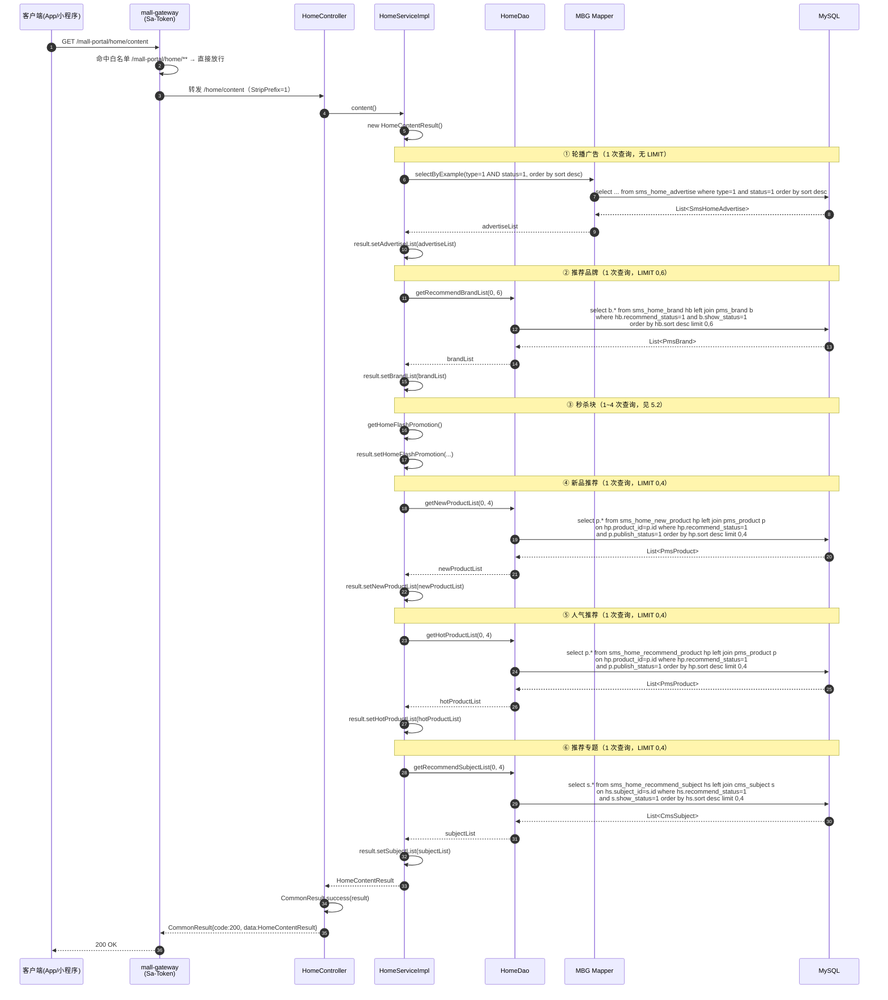
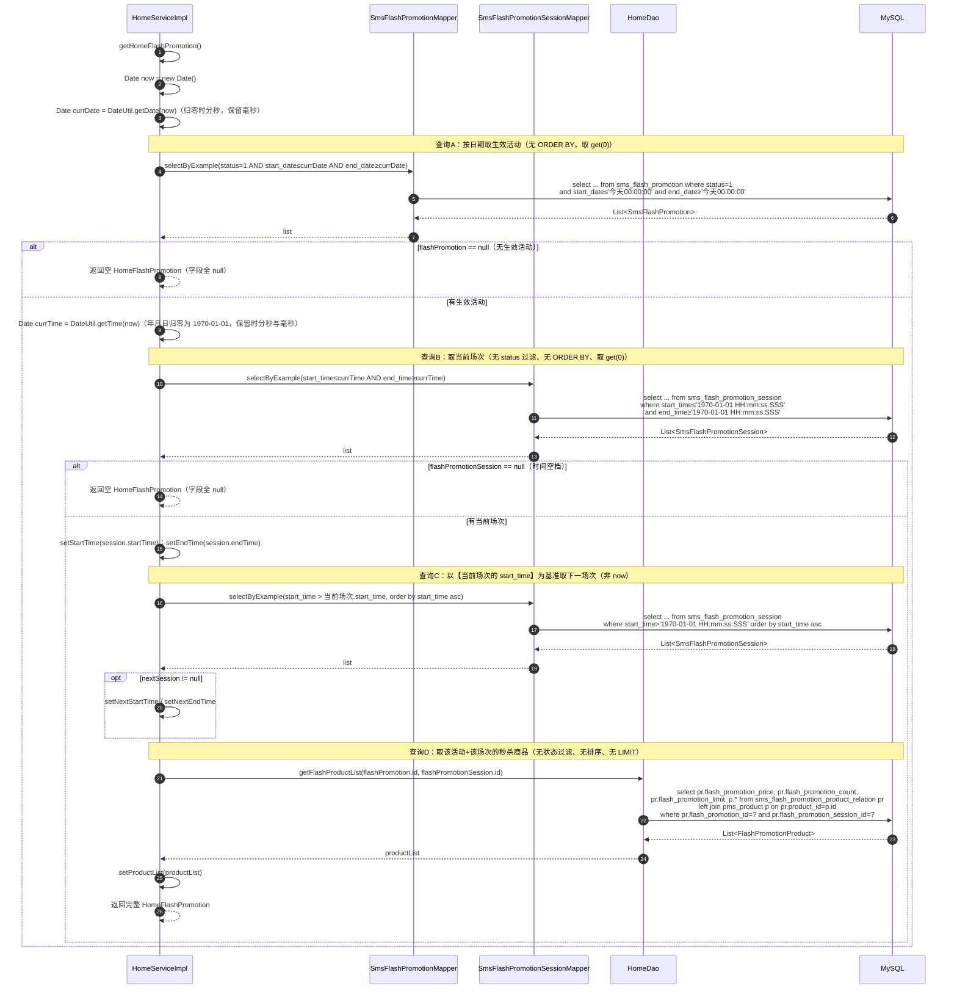
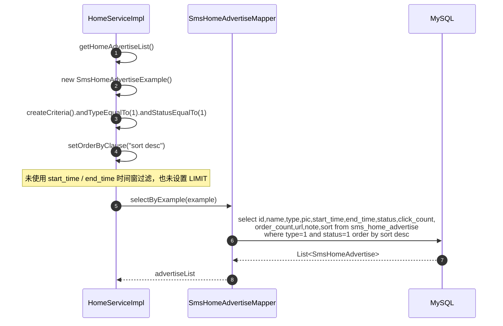
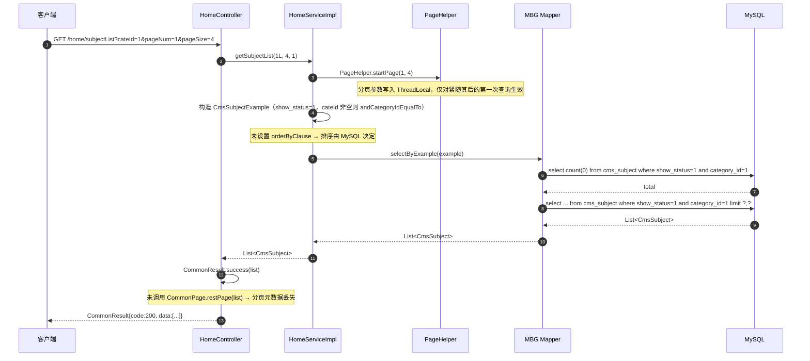
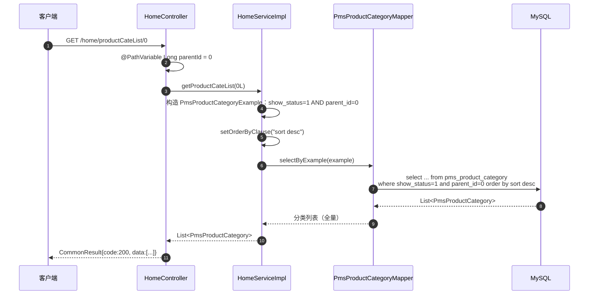

# 详细设计 · 首页聚合

| 项目 | 内容 |
| --- | --- |
| 文档编号 | DD-PORTAL-HOME-001 |
| 所属业务域 | 首页聚合（跨营销 `sms`、商品 `pms`、内容 `cms`） |
| 涉及服务 | `mall-portal`（:8085）；依赖 `mall-gateway`（:8201）、`mall-common`、`mall-mbg` |
| 涉及数据表 | 12 张（见 2.1）：`sms_home_*`（5）、`sms_flash_promotion*`（3）、`pms_product`、`pms_brand`、`cms_subject`、`pms_product_category` |
| 接口数量 | 6 个（全部为前台接口，允许匿名访问） |
| 控制器 | `com.macro.mall.portal.controller.HomeController` |
| 网关前缀 | `/mall-portal/home/**` |
| 文档状态 | 待评审 |
| 关联文档 | [`00-详细设计总览.md`](./00-详细设计总览.md)（全局约定）、[`详细设计-营销-首页运营位.md`](./详细设计-营销-首页运营位.md)（后台配置侧，26 个接口）、[`详细设计-品牌管理.md`](./详细设计-品牌管理.md)（3.3 推荐品牌 SQL） |

---

## 一、概述

### 1.1 范围

本文档描述 `mall-portal` 的「首页聚合」能力的详细设计。该能力的本质是：**把分散在营销域（`sms`）、商品域（`pms`）、内容域（`cms`）的多个运营位数据，在一次请求内聚合成一个响应返回给前台首页**。

覆盖内容：

- **数据库设计**：12 张相关表的真实 DDL、字段说明、状态字典、运营位与数据来源对照、关联与冗余、索引与约束现状、设计问题与建议
- **接口设计**：6 个 REST 接口的请求参数、响应结构、聚合对象数据模型、文档与实现不一致清单
- **包设计**：`mall-portal` 内首页相关包结构、类职责、分层调用规则
- **运行流程**：首页内容一次性聚合、秒杀时间段与秒杀商品、首页轮播、分页类接口的调用链路；**查询次数与性能影响分析**
- **日志设计**：日志框架与配置、访问日志切面、本模块埋点现状与建议
- **测试用例设计**：功能、边界、异常三类用例，以及现有测试现状

**不在本文档范围内**：

| 内容 | 归属文档 |
| --- | --- |
| 后台运营位配置接口（`/home/advertise/*`、`/home/brand/*`、`/home/newProduct/*`、`/home/recommendProduct/*`、`/home/recommendSubject/*`） | [`详细设计-营销-首页运营位.md`](./详细设计-营销-首页运营位.md) |
| 秒杀活动/场次的**后台**管理接口（`/flashPromotion/*`、`/flashPromotionSession/*`、`/flashPromotionProductRelation/*`） | [`详细设计-营销-优惠券与限时购.md`](./详细设计-营销-优惠券与限时购.md) |
| 前台品牌推荐分页接口 `/mall-portal/brand/recommendList` | [`详细设计-品牌管理.md`](./详细设计-品牌管理.md) 3.3 |
| 商品详情、搜索、购物车、下单 | 各自的详细设计 |
| 首页前端页面的渲染与交互 | 前端设计文档 |

### 1.2 术语

| 术语 | 含义 |
| --- | --- |
| 首页聚合 | 单次 `GET /home/content` 请求把 6 个数据块组装为一个 `HomeContentResult` 返回 |
| 运营位 | 首页上由运营在后台配置的数据区域（轮播、推荐品牌、新品、人气推荐、推荐专题、秒杀） |
| 轮播广告 | `sms_home_advertise`，本模块固定取 `type = 1`（App 首页轮播）且 `status = 1`（上线）的记录 |
| 推荐品牌 | `sms_home_brand`（推荐位配置）join `pms_brand`（品牌详情），**不是**直接查 `pms_brand` |
| 新鲜好物（新品） | `sms_home_new_product`（推荐位配置）join `pms_product` |
| 人气推荐 | `sms_home_recommend_product`（推荐位配置）join `pms_product` |
| 推荐专题 | `sms_home_recommend_subject`（推荐位配置）join `cms_subject` |
| 秒杀 / 限时购 | 三层结构：`sms_flash_promotion`（活动，日期区间）+ `sms_flash_promotion_session`（场次，每日时段）+ `sms_flash_promotion_product_relation`（场次商品、秒杀价、数量、限购） |
| 当前场次 | `start_time <= 当前时刻 <= end_time` 的启用场次（`start_time` / `end_time` 为 `time` 类型，即每日重复） |
| 聚合对象 | `HomeContentResult`（首页总响应）、`HomeFlashPromotion`（秒杀信息）、`FlashPromotionProduct`（秒杀商品 = 商品 + 3 个秒杀字段） |

### 1.3 接口清单总览

| # | 方法 | 路径（服务内） | 网关路径 | 说明 | 是否聚合 |
| --- | --- | --- | --- | --- | --- |
| 1 | GET | `/home/content` | `/mall-portal/home/content` | 首页内容页信息展示（**一次性聚合 6 个数据块**） | **是** |
| 2 | GET | `/home/recommendProductList` | `/mall-portal/home/recommendProductList` | 分页获取推荐商品（`delete_status=0` + `publish_status=1` 的全部商品） | 否 |
| 3 | GET | `/home/productCateList/{parentId}` | `/mall-portal/home/productCateList/{parentId}` | 获取首页商品分类 | 否 |
| 4 | GET | `/home/subjectList` | `/mall-portal/home/subjectList` | 根据分类分页获取专题 | 否 |
| 5 | GET | `/home/hotProductList` | `/mall-portal/home/hotProductList` | 分页获取人气推荐商品 | 否 |
| 6 | GET | `/home/newProductList` | `/mall-portal/home/newProductList` | 分页获取新品推荐商品 | 否 |

> **归属说明**：6 个接口全部由 `mall-portal` 的 `HomeController` 提供，类级路径 `@RequestMapping("/home")`。
>
> **注意**：`openapi.yaml` 中的 `/home/advertise/*`、`/home/brand/*`、`/home/newProduct/*`、`/home/recommendProduct/*`、`/home/recommendSubject/*` 属于 **`mall-admin`** 的 5 个 `SmsHome*Controller`，与本文档的 `/home/*` 同名不同服务，详见总览 4.3。
>
> **鉴权**：网关白名单包含 `/mall-portal/home/**`（`mall-gateway/src/main/resources/application.yml` 第 73 行），故 6 个接口**全部允许匿名访问**，游客无需登录态。经网关访问的完整路径需带 `/mall-portal` 前缀（路由 `StripPrefix=1` 剥离后到达服务）。

### 1.4 聚合边界：`/home/content` 与其他 5 个接口的关系

`/home/content` 不是「其他 5 个接口的简单组合」，两者的取数逻辑、条数限制与分页能力均不同：

| 数据块 | 在 `/home/content` 中 | 独立接口 | 条数差异 |
| --- | --- | --- | --- |
| 轮播广告 | ✅ 取**全部** `type=1 AND status=1` 记录（**无 LIMIT**） | 无 | — |
| 推荐品牌 | ✅ 固定 `getRecommendBrandList(0, 6)`（**6 条**） | 无（`/mall-portal/brand/recommendList` 同源，可传分页） | 见品牌文档 3.3 |
| 秒杀 | ✅ 当前场次 + 下一场次 + 该场次全部秒杀商品（**无 LIMIT**） | 无 | — |
| 新品 | ✅ 固定 `getNewProductList(0, 4)`（**4 条**，无分页参数） | ✅ `/home/newProductList`（默认 6 条/页，手工 offset） | **4 vs 6** |
| 人气推荐 | ✅ 固定 `getHotProductList(0, 4)`（**4 条**） | ✅ `/home/hotProductList`（默认 6 条/页） | **4 vs 6** |
| 推荐专题 | ✅ 固定 `getRecommendSubjectList(0, 4)`（**4 条**） | ✅ `/home/subjectList`（默认 4 条/页，可带 `cateId`） | 一致（数据源不同：见下） |
| 商品分类 | ❌ 不含 | ✅ `/home/productCateList/{parentId}` | — |
| 推荐商品 | ❌ 不含 | ✅ `/home/recommendProductList`（默认 4 条/页） | — |

> **重要差异**：`/home/content` 的「推荐专题」取自 **`sms_home_recommend_subject`**（运营位配置表），而 `/home/subjectList` 取自 **`cms_subject`** 单表（`show_status=1` + 可选 `category_id`）。**两者不是同一份数据**——前者是「被推荐到首页的专题」，后者是「全部显示中的专题（按分类）」。接口命名相近但语义不同，前端与联调时极易混淆。
>
> **设计观察**：「新品/人气推荐」在同一个运营位上存在**两套取数逻辑**（`content` 用 `HomeDao` 固定 4 条；独立接口用同一 `HomeDao` 方法 + 手工 offset 分页），参数语义与条数默认值都不一致，属设计冗余。详见 2.8 ⑨。

---

## 二、数据库设计

### 2.1 表清单

| # | 表名 | 类型 | 说明 | 本模块操作 |
| --- | --- | --- | --- | --- |
| 1 | `sms_home_advertise` | 运营位配置表 | 首页轮播广告表 | **读**（`SmsHomeAdvertiseMapper.selectByExample`） |
| 2 | `sms_home_brand` | 运营位配置表 | 首页推荐品牌表 | **读**（`HomeDao.getRecommendBrandList`） |
| 3 | `sms_home_new_product` | 运营位配置表 | 新鲜好物表 | **读**（`HomeDao.getNewProductList`） |
| 4 | `sms_home_recommend_product` | 运营位配置表 | 人气推荐商品表 | **读**（`HomeDao.getHotProductList`） |
| 5 | `sms_home_recommend_subject` | 运营位配置表 | 首页推荐专题表 | **读**（`HomeDao.getRecommendSubjectList`） |
| 6 | `sms_flash_promotion` | 活动主表 | 限时购（秒杀）活动，定义日期区间 | **读**（`SmsFlashPromotionMapper.selectByExample`） |
| 7 | `sms_flash_promotion_session` | 场次表 | 限时购场次，定义每日时段 | **读**（`SmsFlashPromotionSessionMapper.selectByExample`） |
| 8 | `sms_flash_promotion_product_relation` | 关系表 | 商品限时购与商品关系表 | **读**（`HomeDao.getFlashProductList`） |
| 9 | `pms_product` | 主表 | 商品信息 | **读**（join 取详情） |
| 10 | `pms_brand` | 主表 | 品牌表 | **读**（join 取详情） |
| 11 | `cms_subject` | 主表 | 专题表 | **读**（join 取详情） |
| 12 | `pms_product_category` | 主表 | 产品分类 | **读**（`/home/productCateList/{parentId}`） |

> 本模块**只读不写**，全部 12 张表的写入方均在后台（`mall-admin` 的 `SmsHome*Controller` / `SmsFlashPromotion*Controller` / `CmsSubjectController` / `PmsProductController`）。

### 2.2 建表语句（现状）

以下 DDL 均照抄自 `document/sql/mall.sql`。

**（1）`sms_home_advertise` —— 首页轮播广告表**

```sql
DROP TABLE IF EXISTS `sms_home_advertise`;
CREATE TABLE `sms_home_advertise`  (
  `id` bigint(20) NOT NULL AUTO_INCREMENT,
  `name` varchar(100) CHARACTER SET utf8 COLLATE utf8_general_ci NULL DEFAULT NULL,
  `type` int(1) NULL DEFAULT NULL COMMENT '轮播位置：0->PC首页轮播；1->app首页轮播',
  `pic` varchar(500) CHARACTER SET utf8 COLLATE utf8_general_ci NULL DEFAULT NULL,
  `start_time` datetime NULL DEFAULT NULL,
  `end_time` datetime NULL DEFAULT NULL,
  `status` int(1) NULL DEFAULT NULL COMMENT '上下线状态：0->下线；1->上线',
  `click_count` int(11) NULL DEFAULT NULL COMMENT '点击数',
  `order_count` int(11) NULL DEFAULT NULL COMMENT '下单数',
  `url` varchar(500) CHARACTER SET utf8 COLLATE utf8_general_ci NULL DEFAULT NULL COMMENT '链接地址',
  `note` varchar(500) CHARACTER SET utf8 COLLATE utf8_general_ci NULL DEFAULT NULL COMMENT '备注',
  `sort` int(11) NULL DEFAULT 0 COMMENT '排序',
  PRIMARY KEY (`id`) USING BTREE
) ENGINE = InnoDB AUTO_INCREMENT = 17 CHARACTER SET = utf8 COLLATE = utf8_general_ci COMMENT = '首页轮播广告表' ROW_FORMAT = DYNAMIC;
```

**（2）`sms_home_brand` —— 首页推荐品牌表**

```sql
DROP TABLE IF EXISTS `sms_home_brand`;
CREATE TABLE `sms_home_brand`  (
  `id` bigint(20) NOT NULL AUTO_INCREMENT,
  `brand_id` bigint(20) NULL DEFAULT NULL,
  `brand_name` varchar(64) CHARACTER SET utf8 COLLATE utf8_general_ci NULL DEFAULT NULL,
  `recommend_status` int(1) NULL DEFAULT NULL,
  `sort` int(11) NULL DEFAULT NULL,
  PRIMARY KEY (`id`) USING BTREE
) ENGINE = InnoDB AUTO_INCREMENT = 48 CHARACTER SET = utf8 COLLATE = utf8_general_ci COMMENT = '首页推荐品牌表' ROW_FORMAT = DYNAMIC;
```

**（3）`sms_home_new_product` —— 新鲜好物表**

```sql
DROP TABLE IF EXISTS `sms_home_new_product`;
CREATE TABLE `sms_home_new_product`  (
  `id` bigint(20) NOT NULL AUTO_INCREMENT,
  `product_id` bigint(20) NULL DEFAULT NULL,
  `product_name` varchar(500) CHARACTER SET utf8 COLLATE utf8_general_ci NULL DEFAULT NULL,
  `recommend_status` int(1) NULL DEFAULT NULL,
  `sort` int(1) NULL DEFAULT NULL,
  PRIMARY KEY (`id`) USING BTREE
) ENGINE = InnoDB AUTO_INCREMENT = 28 CHARACTER SET = utf8 COLLATE = utf8_general_ci COMMENT = '新鲜好物表' ROW_FORMAT = DYNAMIC;
```

**（4）`sms_home_recommend_product` —— 人气推荐商品表**

```sql
DROP TABLE IF EXISTS `sms_home_recommend_product`;
CREATE TABLE `sms_home_recommend_product`  (
  `id` bigint(20) NOT NULL AUTO_INCREMENT,
  `product_id` bigint(20) NULL DEFAULT NULL,
  `product_name` varchar(500) CHARACTER SET utf8 COLLATE utf8_general_ci NULL DEFAULT NULL,
  `recommend_status` int(1) NULL DEFAULT NULL,
  `sort` int(1) NULL DEFAULT NULL,
  PRIMARY KEY (`id`) USING BTREE
) ENGINE = InnoDB AUTO_INCREMENT = 15 CHARACTER SET = utf8 COLLATE = utf8_general_ci COMMENT = '人气推荐商品表' ROW_FORMAT = DYNAMIC;
```

**（5）`sms_home_recommend_subject` —— 首页推荐专题表**

```sql
DROP TABLE IF EXISTS `sms_home_recommend_subject`;
CREATE TABLE `sms_home_recommend_subject`  (
  `id` bigint(20) NOT NULL AUTO_INCREMENT,
  `subject_id` bigint(20) NULL DEFAULT NULL,
  `subject_name` varchar(64) CHARACTER SET utf8 COLLATE utf8_general_ci NULL DEFAULT NULL,
  `recommend_status` int(1) NULL DEFAULT NULL,
  `sort` int(11) NULL DEFAULT NULL,
  PRIMARY KEY (`id`) USING BTREE
) ENGINE = InnoDB AUTO_INCREMENT = 20 CHARACTER SET = utf8 COLLATE = utf8_general_ci COMMENT = '首页推荐专题表' ROW_FORMAT = DYNAMIC;
```

**（6）`sms_flash_promotion` —— 限时购表（活动）**

```sql
DROP TABLE IF EXISTS `sms_flash_promotion`;
CREATE TABLE `sms_flash_promotion`  (
  `id` bigint(20) NOT NULL AUTO_INCREMENT,
  `title` varchar(200) CHARACTER SET utf8 COLLATE utf8_general_ci NULL DEFAULT NULL COMMENT '秒杀时间段名称',
  `start_date` date NULL DEFAULT NULL COMMENT '开始日期',
  `end_date` date NULL DEFAULT NULL COMMENT '结束日期',
  `status` int(1) NULL DEFAULT NULL COMMENT '上下线状态',
  `create_time` datetime NULL DEFAULT NULL COMMENT '创建时间',
  PRIMARY KEY (`id`) USING BTREE
) ENGINE = InnoDB AUTO_INCREMENT = 15 CHARACTER SET = utf8 COLLATE = utf8_general_ci COMMENT = '限时购表' ROW_FORMAT = DYNAMIC;
```

**（7）`sms_flash_promotion_session` —— 限时购场次表**

```sql
DROP TABLE IF EXISTS `sms_flash_promotion_session`;
CREATE TABLE `sms_flash_promotion_session`  (
  `id` bigint(20) NOT NULL AUTO_INCREMENT COMMENT '编号',
  `name` varchar(200) CHARACTER SET utf8 COLLATE utf8_general_ci NULL DEFAULT NULL COMMENT '场次名称',
  `start_time` time NULL DEFAULT NULL COMMENT '每日开始时间',
  `end_time` time NULL DEFAULT NULL COMMENT '每日结束时间',
  `status` int(1) NULL DEFAULT NULL COMMENT '启用状态：0->不启用；1->启用',
  `create_time` datetime NULL DEFAULT NULL COMMENT '创建时间',
  PRIMARY KEY (`id`) USING BTREE
) ENGINE = InnoDB AUTO_INCREMENT = 8 CHARACTER SET = utf8 COLLATE = utf8_general_ci COMMENT = '限时购场次表' ROW_FORMAT = DYNAMIC;
```

**（8）`sms_flash_promotion_product_relation` —— 商品限时购与商品关系表**

```sql
DROP TABLE IF EXISTS `sms_flash_promotion_product_relation`;
CREATE TABLE `sms_flash_promotion_product_relation`  (
  `id` bigint(20) NOT NULL AUTO_INCREMENT COMMENT '编号',
  `flash_promotion_id` bigint(20) NULL DEFAULT NULL,
  `flash_promotion_session_id` bigint(20) NULL DEFAULT NULL COMMENT '编号',
  `product_id` bigint(20) NULL DEFAULT NULL,
  `flash_promotion_price` decimal(10, 2) NULL DEFAULT NULL COMMENT '限时购价格',
  `flash_promotion_count` int(11) NULL DEFAULT NULL COMMENT '限时购数量',
  `flash_promotion_limit` int(11) NULL DEFAULT NULL COMMENT '每人限购数量',
  `sort` int(11) NULL DEFAULT NULL COMMENT '排序',
  PRIMARY KEY (`id`) USING BTREE
) ENGINE = InnoDB AUTO_INCREMENT = 52 CHARACTER SET = utf8 COLLATE = utf8_general_ci COMMENT = '商品限时购与商品关系表' ROW_FORMAT = DYNAMIC;
```

**（9）`pms_product` —— 商品信息**

```sql
DROP TABLE IF EXISTS `pms_product`;
CREATE TABLE `pms_product`  (
  `id` bigint(20) NOT NULL AUTO_INCREMENT,
  `brand_id` bigint(20) NULL DEFAULT NULL,
  `product_category_id` bigint(20) NULL DEFAULT NULL,
  `feight_template_id` bigint(20) NULL DEFAULT NULL,
  `product_attribute_category_id` bigint(20) NULL DEFAULT NULL,
  `name` varchar(200) CHARACTER SET utf8 COLLATE utf8_general_ci NOT NULL,
  `pic` varchar(255) CHARACTER SET utf8 COLLATE utf8_general_ci NULL DEFAULT NULL,
  `product_sn` varchar(64) CHARACTER SET utf8 COLLATE utf8_general_ci NOT NULL COMMENT '货号',
  `delete_status` int(1) NULL DEFAULT NULL COMMENT '删除状态：0->未删除；1->已删除',
  `publish_status` int(1) NULL DEFAULT NULL COMMENT '上架状态：0->下架；1->上架',
  `new_status` int(1) NULL DEFAULT NULL COMMENT '新品状态:0->不是新品；1->新品',
  `recommand_status` int(1) NULL DEFAULT NULL COMMENT '推荐状态；0->不推荐；1->推荐',
  `verify_status` int(1) NULL DEFAULT NULL COMMENT '审核状态：0->未审核；1->审核通过',
  `sort` int(11) NULL DEFAULT NULL COMMENT '排序',
  `sale` int(11) NULL DEFAULT NULL COMMENT '销量',
  `price` decimal(10, 2) NULL DEFAULT NULL,
  `promotion_price` decimal(10, 2) NULL DEFAULT NULL COMMENT '促销价格',
  `gift_growth` int(11) NULL DEFAULT 0 COMMENT '赠送的成长值',
  `gift_point` int(11) NULL DEFAULT 0 COMMENT '赠送的积分',
  `use_point_limit` int(11) NULL DEFAULT NULL COMMENT '限制使用的积分数',
  `sub_title` varchar(255) CHARACTER SET utf8 COLLATE utf8_general_ci NULL DEFAULT NULL COMMENT '副标题',
  `description` text CHARACTER SET utf8 COLLATE utf8_general_ci NULL COMMENT '商品描述',
  `original_price` decimal(10, 2) NULL DEFAULT NULL COMMENT '市场价',
  `stock` int(11) NULL DEFAULT NULL COMMENT '库存',
  `low_stock` int(11) NULL DEFAULT NULL COMMENT '库存预警值',
  `unit` varchar(16) CHARACTER SET utf8 COLLATE utf8_general_ci NULL DEFAULT NULL COMMENT '单位',
  `weight` decimal(10, 2) NULL DEFAULT NULL COMMENT '商品重量，默认为克',
  `preview_status` int(1) NULL DEFAULT NULL COMMENT '是否为预告商品：0->不是；1->是',
  `service_ids` varchar(64) CHARACTER SET utf8 COLLATE utf8_general_ci NULL DEFAULT NULL COMMENT '以逗号分割的产品服务：1->无忧退货；2->快速退款；3->免费包邮',
  `keywords` varchar(255) CHARACTER SET utf8 COLLATE utf8_general_ci NULL DEFAULT NULL,
  `note` varchar(255) CHARACTER SET utf8 COLLATE utf8_general_ci NULL DEFAULT NULL,
  `album_pics` varchar(255) CHARACTER SET utf8 COLLATE utf8_general_ci NULL DEFAULT NULL COMMENT '画册图片，连产品图片限制为5张，以逗号分割',
  `detail_title` varchar(255) CHARACTER SET utf8 COLLATE utf8_general_ci NULL DEFAULT NULL,
  `detail_desc` text CHARACTER SET utf8 COLLATE utf8_general_ci NULL,
  `detail_html` text CHARACTER SET utf8 COLLATE utf8_general_ci NULL COMMENT '产品详情网页内容',
  `detail_mobile_html` text CHARACTER SET utf8 COLLATE utf8_general_ci NULL COMMENT '移动端网页详情',
  `promotion_start_time` datetime NULL DEFAULT NULL COMMENT '促销开始时间',
  `promotion_end_time` datetime NULL DEFAULT NULL COMMENT '促销结束时间',
  `promotion_per_limit` int(11) NULL DEFAULT NULL COMMENT '活动限购数量',
  `promotion_type` int(1) NULL DEFAULT NULL COMMENT '促销类型：0->没有促销使用原价;1->使用促销价；2->使用会员价；3->使用阶梯价格；4->使用满减价格；5->限时购',
  `brand_name` varchar(255) CHARACTER SET utf8 COLLATE utf8_general_ci NULL DEFAULT NULL COMMENT '品牌名称',
  `product_category_name` varchar(255) CHARACTER SET utf8 COLLATE utf8_general_ci NULL DEFAULT NULL COMMENT '商品分类名称',
  PRIMARY KEY (`id`) USING BTREE
) ENGINE = InnoDB AUTO_INCREMENT = 46 CHARACTER SET = utf8 COLLATE = utf8_general_ci COMMENT = '商品信息' ROW_FORMAT = DYNAMIC;
```

**（10）`pms_brand` —— 品牌表**

```sql
DROP TABLE IF EXISTS `pms_brand`;
CREATE TABLE `pms_brand`  (
  `id` bigint(20) NOT NULL AUTO_INCREMENT,
  `name` varchar(64) CHARACTER SET utf8 COLLATE utf8_general_ci NULL DEFAULT NULL,
  `first_letter` varchar(8) CHARACTER SET utf8 COLLATE utf8_general_ci NULL DEFAULT NULL COMMENT '首字母',
  `sort` int(11) NULL DEFAULT NULL,
  `factory_status` int(1) NULL DEFAULT NULL COMMENT '是否为品牌制造商：0->不是；1->是',
  `show_status` int(1) NULL DEFAULT NULL,
  `product_count` int(11) NULL DEFAULT NULL COMMENT '产品数量',
  `product_comment_count` int(11) NULL DEFAULT NULL COMMENT '产品评论数量',
  `logo` varchar(255) CHARACTER SET utf8 COLLATE utf8_general_ci NULL DEFAULT NULL COMMENT '品牌logo',
  `big_pic` varchar(255) CHARACTER SET utf8 COLLATE utf8_general_ci NULL DEFAULT NULL COMMENT '专区大图',
  `brand_story` text CHARACTER SET utf8 COLLATE utf8_general_ci NULL COMMENT '品牌故事',
  PRIMARY KEY (`id`) USING BTREE
) ENGINE = InnoDB AUTO_INCREMENT = 60 CHARACTER SET = utf8 COLLATE = utf8_general_ci COMMENT = '品牌表' ROW_FORMAT = DYNAMIC;
```

> 该表 DDL 与字段说明与 [`详细设计-品牌管理.md`](./详细设计-品牌管理.md) 2.2 / 2.3 完全一致，本文不复述字段表。

**（11）`cms_subject` —— 专题表**

```sql
DROP TABLE IF EXISTS `cms_subject`;
CREATE TABLE `cms_subject`  (
  `id` bigint(20) NOT NULL AUTO_INCREMENT,
  `category_id` bigint(20) NULL DEFAULT NULL,
  `title` varchar(100) CHARACTER SET utf8 COLLATE utf8_general_ci NULL DEFAULT NULL,
  `pic` varchar(500) CHARACTER SET utf8 COLLATE utf8_general_ci NULL DEFAULT NULL COMMENT '专题主图',
  `product_count` int(11) NULL DEFAULT NULL COMMENT '关联产品数量',
  `recommend_status` int(1) NULL DEFAULT NULL,
  `create_time` datetime NULL DEFAULT NULL,
  `collect_count` int(11) NULL DEFAULT NULL,
  `read_count` int(11) NULL DEFAULT NULL,
  `comment_count` int(11) NULL DEFAULT NULL,
  `album_pics` varchar(1000) CHARACTER SET utf8 COLLATE utf8_general_ci NULL DEFAULT NULL COMMENT '画册图片用逗号分割',
  `description` varchar(1000) CHARACTER SET utf8 COLLATE utf8_general_ci NULL DEFAULT NULL,
  `show_status` int(1) NULL DEFAULT NULL COMMENT '显示状态：0->不显示；1->显示',
  `content` text CHARACTER SET utf8 COLLATE utf8_general_ci NULL,
  `forward_count` int(11) NULL DEFAULT NULL COMMENT '转发数',
  `category_name` varchar(200) CHARACTER SET utf8 COLLATE utf8_general_ci NULL DEFAULT NULL COMMENT '专题分类名称',
  PRIMARY KEY (`id`) USING BTREE
) ENGINE = InnoDB AUTO_INCREMENT = 7 CHARACTER SET = utf8 COLLATE = utf8_general_ci COMMENT = '专题表' ROW_FORMAT = DYNAMIC;
```

**（12）`pms_product_category` —— 产品分类**

```sql
DROP TABLE IF EXISTS `pms_product_category`;
CREATE TABLE `pms_product_category`  (
  `id` bigint(20) NOT NULL AUTO_INCREMENT,
  `parent_id` bigint(20) NULL DEFAULT NULL COMMENT '上机分类的编号：0表示一级分类',
  `name` varchar(64) CHARACTER SET utf8 COLLATE utf8_general_ci NULL DEFAULT NULL,
  `level` int(1) NULL DEFAULT NULL COMMENT '分类级别：0->1级；1->2级',
  `product_count` int(11) NULL DEFAULT NULL,
  `product_unit` varchar(64) CHARACTER SET utf8 COLLATE utf8_general_ci NULL DEFAULT NULL,
  `nav_status` int(1) NULL DEFAULT NULL COMMENT '是否显示在导航栏：0->不显示；1->显示',
  `show_status` int(1) NULL DEFAULT NULL COMMENT '显示状态：0->不显示；1->显示',
  `sort` int(11) NULL DEFAULT NULL,
  `icon` varchar(255) CHARACTER SET utf8 COLLATE utf8_general_ci NULL DEFAULT NULL COMMENT '图标',
  `keywords` varchar(255) CHARACTER SET utf8 COLLATE utf8_general_ci NULL DEFAULT NULL,
  `description` text CHARACTER SET utf8 COLLATE utf8_general_ci NULL COMMENT '描述',
  PRIMARY KEY (`id`) USING BTREE
) ENGINE = InnoDB AUTO_INCREMENT = 56 CHARACTER SET = utf8 COLLATE = utf8_general_ci COMMENT = '产品分类' ROW_FORMAT = DYNAMIC;
```

### 2.3 字段说明

#### 2.3.1 `sms_home_advertise`

| 字段 | 类型 | 允许空 | 默认值 | 中文名 | 说明 |
| --- | --- | --- | --- | --- | --- |
| `id` | bigint(20) | 否 | AUTO_INCREMENT | 主键 | 广告唯一标识 |
| `name` | varchar(100) | 是 | NULL | 广告名称 | 无列注释；后台新增时必填 |
| `type` | int(1) | 是 | NULL | 轮播位置 | 0 PC 首页轮播 / 1 App 首页轮播，本模块固定取 **1** |
| `pic` | varchar(500) | 是 | NULL | 广告图片 | 前台直接渲染，空值会导致空白 banner |
| `start_time` | datetime | 是 | NULL | 投放开始时间 | **本模块未参与过滤**（见 2.8 ⑥） |
| `end_time` | datetime | 是 | NULL | 投放结束时间 | **本模块未参与过滤** |
| `status` | int(1) | 是 | NULL | 上下线状态 | 0 下线 / 1 上线，本模块固定取 **1** |
| `click_count` | int(11) | 是 | NULL | 点击数 | 无累加代码，恒为 0 |
| `order_count` | int(11) | 是 | NULL | 下单数 | 无累加代码，恒为 0 |
| `url` | varchar(500) | 是 | NULL | 链接地址 | 前台跳转目标（小程序路径或 URL） |
| `note` | varchar(500) | 是 | NULL | 备注 | 仅后台展示 |
| `sort` | int(11) | 是 | 0 | 排序 | 本模块按 `sort DESC` 排序 |

#### 2.3.2 四张推荐位配置表

四张表结构高度同构，字段语义按列对齐（列名不同）：

| 表 | 字段 | 类型 | 允许空 | 默认值 | 中文名 | 说明 |
| --- | --- | --- | --- | --- | --- | --- |
| `sms_home_brand` | `id` | bigint(20) | 否 | AUTO_INCREMENT | 主键 | 推荐位记录标识 |
| `sms_home_brand` | `brand_id` | bigint(20) | 是 | NULL | 品牌编号 | 逻辑外键 → `pms_brand.id`，无 DDL 约束 |
| `sms_home_brand` | `brand_name` | varchar(64) | 是 | NULL | 品牌名称 | 冗余快照，**本模块不使用** |
| `sms_home_brand` | `recommend_status` | int(1) | 是 | NULL | 推荐状态 | 0 不推荐 / 1 推荐（**无列注释**） |
| `sms_home_brand` | `sort` | int(11) | 是 | NULL | 排序 | 本模块按 `hb.sort DESC` 排序 |
| `sms_home_new_product` | `id` | bigint(20) | 否 | AUTO_INCREMENT | 主键 | 推荐位记录标识 |
| `sms_home_new_product` | `product_id` | bigint(20) | 是 | NULL | 商品编号 | 逻辑外键 → `pms_product.id`，无 DDL 约束 |
| `sms_home_new_product` | `product_name` | varchar(500) | 是 | NULL | 商品名称 | 冗余快照，**本模块不使用** |
| `sms_home_new_product` | `recommend_status` | int(1) | 是 | NULL | 推荐状态 | 0 不推荐 / 1 推荐（**无列注释**） |
| `sms_home_new_product` | `sort` | **int(1)** | 是 | NULL | 排序 | 类型与其余表不一致；本模块按 `hp.sort DESC` 排序 |
| `sms_home_recommend_product` | `id` | bigint(20) | 否 | AUTO_INCREMENT | 主键 | 推荐位记录标识 |
| `sms_home_recommend_product` | `product_id` | bigint(20) | 是 | NULL | 商品编号 | 逻辑外键 → `pms_product.id` |
| `sms_home_recommend_product` | `product_name` | varchar(500) | 是 | NULL | 商品名称 | 冗余快照，**本模块不使用** |
| `sms_home_recommend_product` | `recommend_status` | int(1) | 是 | NULL | 推荐状态 | 0 不推荐 / 1 推荐（**无列注释**） |
| `sms_home_recommend_product` | `sort` | **int(1)** | 是 | NULL | 排序 | 类型与其余表不一致 |
| `sms_home_recommend_subject` | `id` | bigint(20) | 否 | AUTO_INCREMENT | 主键 | 推荐位记录标识 |
| `sms_home_recommend_subject` | `subject_id` | bigint(20) | 是 | NULL | 专题编号 | 逻辑外键 → `cms_subject.id` |
| `sms_home_recommend_subject` | `subject_name` | varchar(64) | 是 | NULL | 专题名称 | 冗余快照（主表列名为 `title`，两者**列名不对应**），**本模块不使用** |
| `sms_home_recommend_subject` | `recommend_status` | int(1) | 是 | NULL | 推荐状态 | 0 不推荐 / 1 推荐（**无列注释**） |
| `sms_home_recommend_subject` | `sort` | int(11) | 是 | NULL | 排序 | 本模块按 `hs.sort DESC` 排序 |

> 字段层面的问题（`recommend_status` 缺注释、`sort` 类型不一致、冗余名由前端传入且不同步、无唯一约束等）已在 [`详细设计-营销-首页运营位.md`](./详细设计-营销-首页运营位.md) 2.3 / 2.5 / 2.7 / 2.8 详述，本文不重复，只关注**本模块读路径**上的影响。

#### 2.3.3 秒杀三表

**`sms_flash_promotion`（活动）**

| 字段 | 类型 | 允许空 | 默认值 | 中文名 | 说明 |
| --- | --- | --- | --- | --- | --- |
| `id` | bigint(20) | 否 | AUTO_INCREMENT | 主键 | 活动标识，与 `relation.flash_promotion_id` 关联 |
| `title` | varchar(200) | 是 | NULL | 秒杀时间段名称 | 列注释为「秒杀时间段名称」，语义实为活动名称 |
| `start_date` | date | 是 | NULL | 开始日期 | 本模块用 `start_date <= 今天00:00:00` 过滤 |
| `end_date` | date | 是 | NULL | 结束日期 | 本模块用 `end_date >= 今天00:00:00` 过滤 |
| `status` | int(1) | 是 | NULL | 上下线状态 | 列注释未给出 0/1 细分；由查询条件 `status = 1` 推断 1 = 上线 |
| `create_time` | datetime | 是 | NULL | 创建时间 | 本模块不使用 |

**`sms_flash_promotion_session`（场次）**

| 字段 | 类型 | 允许空 | 默认值 | 中文名 | 说明 |
| --- | --- | --- | --- | --- | --- |
| `id` | bigint(20) | 否 | AUTO_INCREMENT | 编号 | 场次标识，与 `relation.flash_promotion_session_id` 关联 |
| `name` | varchar(200) | 是 | NULL | 场次名称 | 如 `8:00`、`10:00` |
| `start_time` | time | 是 | NULL | 每日开始时间 | 与 `DateUtil.getTime(now)` 比较（1970-01-01 + 当前时分秒） |
| `end_time` | time | 是 | NULL | 每日结束时间 | 同上，闭区间（`>=`） |
| `status` | int(1) | 是 | NULL | 启用状态 | 0 不启用 / 1 启用；**本模块查询未过滤该字段**（见 2.8 ⑤） |
| `create_time` | datetime | 是 | NULL | 创建时间 | 本模块不使用 |

**`sms_flash_promotion_product_relation`（场次商品）**

| 字段 | 类型 | 允许空 | 默认值 | 中文名 | 说明 |
| --- | --- | --- | --- | --- | --- |
| `id` | bigint(20) | 否 | AUTO_INCREMENT | 编号 | 关系记录标识 |
| `flash_promotion_id` | bigint(20) | 是 | NULL | 限时购活动编号 | 逻辑外键 → `sms_flash_promotion.id` |
| `flash_promotion_session_id` | bigint(20) | 是 | NULL | 限时购场次编号 | 逻辑外键 → `sms_flash_promotion_session.id` |
| `product_id` | bigint(20) | 是 | NULL | 商品编号 | 逻辑外键 → `pms_product.id` |
| `flash_promotion_price` | decimal(10,2) | 是 | NULL | 限时购价格 | 映射为 `FlashPromotionProduct.flashPromotionPrice`；**种子数据 47 行中仅 5 行有值**（id 1–4 属活动 2、id 33 属活动 14），其余 42 行为 NULL |
| `flash_promotion_count` | int(11) | 是 | NULL | 限时购数量 | 映射为 `flashPromotionCount` |
| `flash_promotion_limit` | int(11) | 是 | NULL | 每人限购数量 | 映射为 `flashPromotionLimit` |
| `sort` | int(11) | 是 | NULL | 排序 | **`getFlashProductList` 未使用该字段排序**（见 2.8 ③） |

#### 2.3.4 `pms_product`（本模块引用，全字段）

| 字段 | 类型 | 允许空 | 默认值 | 中文名 | 说明 |
| --- | --- | --- | --- | --- | --- |
| `id` | bigint(20) | 否 | AUTO_INCREMENT | 商品编号 | 主键，被三处运营位 join |
| `brand_id` | bigint(20) | 是 | NULL | 品牌编号 | 本模块不用于过滤 |
| `product_category_id` | bigint(20) | 是 | NULL | 商品分类编号 | 本模块不用于过滤 |
| `feight_template_id` | bigint(20) | 是 | NULL | 运费模板编号 | 本模块不使用 |
| `product_attribute_category_id` | bigint(20) | 是 | NULL | 属性分类编号 | 本模块不使用 |
| `name` | varchar(200) | **否** | 无 | 商品名称 | 前台卡片标题 |
| `pic` | varchar(255) | 是 | NULL | 商品主图 | 前台卡片图片 |
| `product_sn` | varchar(64) | **否** | 无 | 货号 | 本模块不使用 |
| `delete_status` | int(1) | 是 | NULL | 删除状态 | 0 未删除 / 1 已删除；**新品/人气查询未过滤该字段**（见 2.8 ④） |
| `publish_status` | int(1) | 是 | NULL | 上架状态 | 0 下架 / 1 上架；新品/人气查询过滤为 **1**，秒杀查询**未过滤** |
| `new_status` | int(1) | 是 | NULL | 新品状态 | 0 不是新品 / 1 新品；本模块不使用（新品位取自 `sms_home_new_product`） |
| `recommand_status` | int(1) | 是 | NULL | 推荐状态 | 0 不推荐 / 1 推荐；本模块**未使用**（推荐商品接口有 `TODO` 注释） |
| `verify_status` | int(1) | 是 | NULL | 审核状态 | 0 未审核 / 1 审核通过；本模块不使用 |
| `sort` | int(11) | 是 | NULL | 排序 | 本模块不使用 |
| `sale` | int(11) | 是 | NULL | 销量 | 本模块不使用 |
| `price` | decimal(10,2) | 是 | NULL | 价格 | 前台展示价 |
| `promotion_price` | decimal(10,2) | 是 | NULL | 促销价格 | 前台展示价 |
| `gift_growth` | int(11) | 是 | 0 | 赠送的成长值 | 本模块不使用 |
| `gift_point` | int(11) | 是 | 0 | 赠送的积分 | 本模块不使用 |
| `use_point_limit` | int(11) | 是 | NULL | 限制使用的积分数 | 本模块不使用 |
| `sub_title` | varchar(255) | 是 | NULL | 副标题 | 前台可能展示 |
| `description` | text | 是 | NULL | 商品描述 | 大字段，见 2.6 说明 |
| `original_price` | decimal(10,2) | 是 | NULL | 市场价 | 前台划线价 |
| `stock` | int(11) | 是 | NULL | 库存 | 前台可能展示 |
| `low_stock` | int(11) | 是 | NULL | 库存预警值 | 本模块不使用 |
| `unit` | varchar(16) | 是 | NULL | 单位 | 本模块不使用 |
| `weight` | decimal(10,2) | 是 | NULL | 商品重量 | 本模块不使用 |
| `preview_status` | int(1) | 是 | NULL | 是否预告商品 | 0 不是 / 1 是；本模块不使用 |
| `service_ids` | varchar(64) | 是 | NULL | 服务标签 | 1 无忧退货 / 2 快速退款 / 3 免费包邮 |
| `keywords` | varchar(255) | 是 | NULL | 关键词 | 本模块不使用 |
| `note` | varchar(255) | 是 | NULL | 备注 | 本模块不使用 |
| `album_pics` | varchar(255) | 是 | NULL | 画册图片 | 逗号分隔，最多 5 张 |
| `detail_title` | varchar(255) | 是 | NULL | 详情标题 | 本模块不使用 |
| `detail_desc` | text | 是 | NULL | 详情描述 | 大字段，见 2.6 说明 |
| `detail_html` | text | 是 | NULL | 产品详情网页内容 | 大字段，见 2.6 说明 |
| `detail_mobile_html` | text | 是 | NULL | 移动端网页详情 | 大字段，见 2.6 说明 |
| `promotion_start_time` | datetime | 是 | NULL | 促销开始时间 | 本模块不使用 |
| `promotion_end_time` | datetime | 是 | NULL | 促销结束时间 | 本模块不使用 |
| `promotion_per_limit` | int(11) | 是 | NULL | 活动限购数量 | 本模块不使用 |
| `promotion_type` | int(1) | 是 | NULL | 促销类型 | 0 原价 / 1 促销价 / 2 会员价 / 3 阶梯价 / 4 满减 / 5 限时购 |
| `brand_name` | varchar(255) | 是 | NULL | 品牌名称 | 冗余字段，更新品牌时同步（见品牌文档 2.5） |
| `product_category_name` | varchar(255) | 是 | NULL | 商品分类名称 | 冗余字段 |

#### 2.3.5 `cms_subject`（本模块引用，全字段）

| 字段 | 类型 | 允许空 | 默认值 | 中文名 | 说明 |
| --- | --- | --- | --- | --- | --- |
| `id` | bigint(20) | 否 | AUTO_INCREMENT | 专题编号 | 主键，被 `sms_home_recommend_subject` join |
| `category_id` | bigint(20) | 是 | NULL | 专题分类编号 | `/home/subjectList` 的 `cateId` 参数匹配此列 |
| `title` | varchar(100) | 是 | NULL | 专题标题 | 前台展示名（冗余列名为 `subject_name`） |
| `pic` | varchar(500) | 是 | NULL | 专题主图 | 前台展示图 |
| `product_count` | int(11) | 是 | NULL | 关联产品数量 | 种子数据全为 NULL |
| `recommend_status` | int(1) | 是 | NULL | 推荐状态 | **本模块不使用**（用的是配置表的 `recommend_status`） |
| `create_time` | datetime | 是 | NULL | 创建时间 | 本模块不使用 |
| `collect_count` | int(11) | 是 | NULL | 收藏数 | 本模块不使用 |
| `read_count` | int(11) | 是 | NULL | 阅读数 | 本模块不使用 |
| `comment_count` | int(11) | 是 | NULL | 评论数 | 本模块不使用 |
| `album_pics` | varchar(1000) | 是 | NULL | 画册图片 | 逗号分割 |
| `description` | varchar(1000) | 是 | NULL | 描述 | 本模块不使用 |
| `show_status` | int(1) | 是 | NULL | 显示状态 | 0 不显示 / 1 显示；本模块过滤为 **1** |
| `content` | text | 是 | NULL | 专题正文 | 大字段，`SELECT s.*` 会读取（见 2.6） |
| `forward_count` | int(11) | 是 | NULL | 转发数 | 本模块不使用 |
| `category_name` | varchar(200) | 是 | NULL | 专题分类名称 | 冗余字段 |

#### 2.3.6 `pms_product_category`（`/home/productCateList/{parentId}` 使用）

| 字段 | 类型 | 允许空 | 默认值 | 中文名 | 说明 |
| --- | --- | --- | --- | --- | --- |
| `id` | bigint(20) | 否 | AUTO_INCREMENT | 分类编号 | 主键 |
| `parent_id` | bigint(20) | 是 | NULL | 上级分类编号 | 0 表示一级分类；接口 `parentId` 路径参数匹配此列 |
| `name` | varchar(64) | 是 | NULL | 分类名称 | 前台展示 |
| `level` | int(1) | 是 | NULL | 分类级别 | 0 一级 / 1 二级 |
| `product_count` | int(11) | 是 | NULL | 产品数量 | 冗余统计，无维护代码 |
| `product_unit` | varchar(64) | 是 | NULL | 产品单位 | 本模块不使用 |
| `nav_status` | int(1) | 是 | NULL | 是否显示在导航栏 | 0 不显示 / 1 显示；**本模块未过滤**（只过滤 `show_status`） |
| `show_status` | int(1) | 是 | NULL | 显示状态 | 0 不显示 / 1 显示；本模块过滤为 **1** |
| `sort` | int(11) | 是 | NULL | 排序 | 本模块按 `sort desc` 排序 |
| `icon` | varchar(255) | 是 | NULL | 图标 | 前台展示 |
| `keywords` | varchar(255) | 是 | NULL | 关键词 | 本模块不使用 |
| `description` | text | 是 | NULL | 描述 | 本模块不使用 |

### 2.4 状态字典

| 表 | 字段 | 值 | 含义 | 来源 | 本模块是否过滤 |
| --- | --- | --- | --- | --- | --- |
| `sms_home_advertise` | `type` | 0 | PC 首页轮播 | `mall.sql` 列注释 | ❌ 固定取 1，PC 位**无前台接口消费** |
| `sms_home_advertise` | `type` | 1 | app 首页轮播 | `mall.sql` 列注释 | ✅ `andTypeEqualTo(1)` |
| `sms_home_advertise` | `status` | 0 | 下线 | `mall.sql` 列注释 | — |
| `sms_home_advertise` | `status` | 1 | 上线 | `mall.sql` 列注释 | ✅ `andStatusEqualTo(1)` |
| `sms_home_brand` | `recommend_status` | 0 / 1 | 不推荐 / 推荐 | 列**无注释**，由字段名 + 前台 SQL 语义推断 | ✅ `hb.recommend_status = 1` |
| `sms_home_new_product` | `recommend_status` | 0 / 1 | 不推荐 / 推荐 | 同上 | ✅ `hp.recommend_status = 1` |
| `sms_home_recommend_product` | `recommend_status` | 0 / 1 | 不推荐 / 推荐 | 同上 | ✅ `hp.recommend_status = 1` |
| `sms_home_recommend_subject` | `recommend_status` | 0 / 1 | 不推荐 / 推荐 | 同上 | ✅ `hs.recommend_status = 1` |
| `sms_flash_promotion` | `status` | 0 / 1 | 下线 / 上线 | 列注释仅写「上下线状态」，0/1 细分由查询条件推断 | ✅ `andStatusEqualTo(1)` |
| `sms_flash_promotion_session` | `status` | 0 | 不启用 | `mall.sql` 列注释 | ❌ **查询未过滤** |
| `sms_flash_promotion_session` | `status` | 1 | 启用 | `mall.sql` 列注释 | ❌ **查询未过滤** |
| `pms_product` | `delete_status` | 0 | 未删除 | `mall.sql` 列注释 | ⚠️ 仅推荐商品接口过滤；新品/人气/秒杀**未过滤** |
| `pms_product` | `delete_status` | 1 | 已删除 | `mall.sql` 列注释 | ⚠️ 同上 |
| `pms_product` | `publish_status` | 0 | 下架 | `mall.sql` 列注释 | ⚠️ 新品/人气过滤为 1；**秒杀未过滤** |
| `pms_product` | `publish_status` | 1 | 上架 | `mall.sql` 列注释 | ✅ 新品/人气/推荐商品 |
| `pms_product` | `recommand_status` | 0 / 1 | 不推荐 / 推荐 | `mall.sql` 列注释 | ❌ 本模块未使用 |
| `pms_brand` | `show_status` | 0 / 1 | 不显示 / 显示 | 列**无注释**，由品牌文档 2.4 推断 | ✅ `b.show_status = 1` |
| `cms_subject` | `show_status` | 0 | 不显示 | `mall.sql` 列注释 | — |
| `cms_subject` | `show_status` | 1 | 显示 | `mall.sql` 列注释 | ✅ `s.show_status = 1` |
| `pms_product_category` | `show_status` | 0 / 1 | 不显示 / 显示 | `mall.sql` 列注释 | ✅ `andShowStatusEqualTo(1)` |
| `pms_product_category` | `nav_status` | 0 / 1 | 不显示在导航栏 / 显示在导航栏 | `mall.sql` 列注释 | ❌ **本模块未过滤**（导航属性与首页分类位语义可能不同，需确认） |

### 2.5 首页各运营位与数据来源对照表

| # | 运营位 | 配置表 | 主表 | 过滤条件（现状） | 排序字段 | 条数 | 实现位置 |
| --- | --- | --- | --- | --- | --- | --- | --- |
| 1 | 轮播广告 | `sms_home_advertise`（自身即数据源） | — | `type = 1 AND status = 1` | `sort DESC` | **无 LIMIT（全量）** | `HomeServiceImpl.getHomeAdvertiseList()` |
| 2 | 推荐品牌 | `sms_home_brand` | `pms_brand` | `hb.recommend_status = 1 AND b.show_status = 1` | `hb.sort DESC` | `LIMIT 0,6` | `HomeDao.getRecommendBrandList` |
| 3 | 新鲜好物 | `sms_home_new_product` | `pms_product` | `hp.recommend_status = 1 AND p.publish_status = 1` | `hp.sort DESC` | `LIMIT 0,4` | `HomeDao.getNewProductList` |
| 4 | 人气推荐 | `sms_home_recommend_product` | `pms_product` | `hp.recommend_status = 1 AND p.publish_status = 1` | `hp.sort DESC` | `LIMIT 0,4` | `HomeDao.getHotProductList` |
| 5 | 推荐专题 | `sms_home_recommend_subject` | `cms_subject` | `hs.recommend_status = 1 AND s.show_status = 1` | `hs.sort DESC` | `LIMIT 0,4` | `HomeDao.getRecommendSubjectList` |
| 6 | 秒杀（活动） | `sms_flash_promotion`（自身即数据源） | — | `status = 1 AND start_date <= 今天 AND end_date >= 今天` | **无 ORDER BY** | 取 `get(0)` | `HomeServiceImpl.getFlashPromotion` |
| 7 | 秒杀（当前场次） | `sms_flash_promotion_session`（自身即数据源） | — | `start_time <= 当前时刻 AND end_time >= 当前时刻` | **无 ORDER BY** | 取 `get(0)` | `HomeServiceImpl.getFlashPromotionSession` |
| 8 | 秒杀（下一场次） | `sms_flash_promotion_session` | — | `start_time > 当前场次开始时间` | `start_time ASC` | 取 `get(0)` | `HomeServiceImpl.getNextFlashPromotionSession` |
| 9 | 秒杀（商品） | `sms_flash_promotion_product_relation` | `pms_product` | `flash_promotion_id = ? AND flash_promotion_session_id = ?`（**无商品状态过滤**） | **无 ORDER BY** | **无 LIMIT（全量）** | `HomeDao.getFlashProductList` |
| 10 | 首页商品分类 | `pms_product_category`（自身即数据源） | — | `show_status = 1 AND parent_id = ?` | `sort DESC` | 无分页（全量） | `HomeServiceImpl.getProductCateList` |
| 11 | 推荐商品 | — | `pms_product` | `delete_status = 0 AND publish_status = 1`（**与推荐位表无关，代码中有 `TODO`**） | **无 ORDER BY** | `PageHelper`（默认 4/页） | `HomeServiceImpl.recommendProductList` |
| 12 | 专题列表 | — | `cms_subject` | `show_status = 1` + 可选 `category_id = ?` | **无 ORDER BY** | `PageHelper`（默认 4/页） | `HomeServiceImpl.getSubjectList` |

> **对照结论**：运营位 1–9 是「配置表驱动」，10–12 是「主表直查」。其中运营位 12（`/home/subjectList`）与运营位 11（`/home/recommendProductList`）**完全绕过了运营位配置**，与后台的运营位管理页面脱节——后台把某商品取消推荐，前台该接口仍会返回它。

### 2.6 关联与冗余设计

#### 2.6.1 关联关系

```text
sms_home_advertise               ── （无外键，独立运营位，自身即数据源）

sms_home_brand.brand_id          ──► pms_brand.id            （逻辑外键，无 DDL 约束）LEFT JOIN
sms_home_new_product.product_id  ──► pms_product.id          （逻辑外键）LEFT JOIN
sms_home_recommend_product.product_id ► pms_product.id       （逻辑外键）LEFT JOIN
sms_home_recommend_subject.subject_id ► cms_subject.id       （逻辑外键）LEFT JOIN

sms_flash_promotion_product_relation.flash_promotion_id         ──► sms_flash_promotion.id          （逻辑外键）
sms_flash_promotion_product_relation.flash_promotion_session_id ──► sms_flash_promotion_session.id  （逻辑外键）
sms_flash_promotion_product_relation.product_id                 ──► pms_product.id                  （逻辑外键）LEFT JOIN

pms_product_category.parent_id   ──► pms_product_category.id （自关联，0 为一级分类）

冗余快照（前台均不使用，取的是主表实时值）：
sms_home_brand.brand_name            ╳  pms_brand.name
sms_home_new_product.product_name    ╳  pms_product.name
sms_home_recommend_product.product_name ╳ pms_product.name
sms_home_recommend_subject.subject_name ╳ cms_subject.title
```

#### 2.6.2 `HomeDao.xml` 全部 SQL（现状）

`mall-portal/src/main/resources/dao/HomeDao.xml` 共 1 个 `resultMap` + 5 个 `select`（其中 `getRecommendBrandList` 已在品牌文档 3.3 详述，本文仅引用）。

**（1）`getRecommendBrandList`** —— **引用** [`详细设计-品牌管理.md`](./详细设计-品牌管理.md) 3.3，本文不重复。要点：`hb.recommend_status = 1 AND b.show_status = 1 ORDER BY hb.sort DESC LIMIT #{offset}, #{limit}`，排序取运营位 `sort` 而非 `pms_brand.sort`。

**（2）`getNewProductList` —— 新鲜好物**

```xml
<select id="getNewProductList" resultMap="com.macro.mall.mapper.PmsProductMapper.BaseResultMap">
    SELECT p.*
    FROM
        sms_home_new_product hp
        LEFT JOIN pms_product p ON hp.product_id = p.id
    WHERE
        hp.recommend_status = 1
        AND p.publish_status = 1
    ORDER BY
        hp.sort DESC
    LIMIT #{offset}, #{limit};
</select>
```

**分析**：

- 驱动表是**配置表** `sms_home_new_product`（数据量小），按主键 `p.id` 关联 `pms_product`，执行计划为「配置表全扫 + 主键等值回表 + filesort」，数据量小阶段无性能风险。
- `LEFT JOIN` 与 `WHERE p.publish_status = 1` 组合，**语义上退化为 INNER JOIN**：主表记录不存在或 `publish_status` 为 NULL 时该行被过滤，运营位「静默消失」（后台仍显示为已推荐）。
- **未过滤 `p.delete_status`**：商品被逻辑删除（`delete_status = 1`）但 `publish_status` 仍为 1 时，会被返回。种子数据中商品 `id=1` 即为 `delete_status=1, publish_status=1`。
- **未过滤 `p.verify_status`**：未审核通过的商品同样会被返回。
- `SELECT p.*` 会读取 `description`、`detail_desc`、`detail_html`、`detail_mobile_html` 四个大字段（见下文 2.6.3）。
- SQL 尾部**多写了一个分号**（三处 `getNewProductList` / `getHotProductList` / `getRecommendSubjectList` 均如此），单语句场景下 MySQL 可容忍，但属书写不规范。

**（3）`getHotProductList` —— 人气推荐**

```xml
<select id="getHotProductList" resultMap="com.macro.mall.mapper.PmsProductMapper.BaseResultMap">
    SELECT p.*
    FROM
        sms_home_recommend_product hp
        LEFT JOIN pms_product p ON hp.product_id = p.id
    WHERE
        hp.recommend_status = 1
        AND p.publish_status = 1
    ORDER BY
        hp.sort DESC
    LIMIT #{offset}, #{limit};
</select>
```

**分析**：与 `getNewProductList` 结构完全相同，仅配置表不同（`sms_home_recommend_product`），问题同上（未过滤 `delete_status` / `verify_status`）。

> **排序隐患**：`mall.sql` 中 `sms_home_recommend_product` 的 5 行数据 `sort` **全部为 0**，`ORDER BY hp.sort DESC` 存在并列，MySQL 的返回顺序**不确定**，会导致翻页时同一商品重复出现或漏出。当前「人气推荐」位的顺序实际不可控。

**（4）`getRecommendSubjectList` —— 推荐专题**

```xml
<select id="getRecommendSubjectList" resultMap="com.macro.mall.mapper.CmsSubjectMapper.BaseResultMap">
    SELECT s.*
    FROM
        sms_home_recommend_subject hs
        LEFT JOIN cms_subject s ON hs.subject_id = s.id
    WHERE
        hs.recommend_status = 1
        AND s.show_status = 1
    ORDER BY
        hs.sort DESC
    LIMIT #{offset}, #{limit};
</select>
```

**分析**：

- 过滤条件与排序语义同前，`LEFT JOIN` 同样退化为 INNER JOIN（孤儿配置行被过滤）。
- `SELECT s.*` 包含 `content`（专题正文 `text`）。种子数据中 6 条专题 `content` 均为 NULL，响应体不受影响；但一旦运营录入正文，**首页接口会返回专题 HTML 全文**（见 2.6.3）。
- 同样存在 `sort` 并列问题：种子数据除 `id=18`（`sort=100`）外其余 5 行 `sort` 均为 0。

**（5）`getFlashProductList` —— 秒杀商品**

```xml
<resultMap id="flashPromotionProduct" type="com.macro.mall.portal.domain.FlashPromotionProduct"
           extends="com.macro.mall.mapper.PmsProductMapper.BaseResultMap">
    <result column="flash_promotion_price" property="flashPromotionPrice"/>
    <result column="flash_promotion_count" property="flashPromotionCount"/>
    <result column="flash_promotion_limit" property="flashPromotionLimit"/>
</resultMap>

<select id="getFlashProductList" resultMap="flashPromotionProduct">
    SELECT
        pr.flash_promotion_price,
        pr.flash_promotion_count,
        pr.flash_promotion_limit,
        p.*
    FROM
        sms_flash_promotion_product_relation pr
        LEFT JOIN pms_product p ON pr.product_id = p.id
    WHERE
        pr.flash_promotion_id = #{flashPromotionId}
        AND pr.flash_promotion_session_id = #{sessionId}
</select>
```

**分析**（本模块**问题最集中**的一条 SQL）：

| # | 问题 | 后果 |
| --- | --- | --- |
| 1 | **无 `delete_status` / `publish_status` / `verify_status` 过滤** | 已下架、已删除、未审核的商品会出现在首页秒杀位 |
| 2 | **无 `ORDER BY`** | 忽略关系表的 `sort` 字段，秒杀商品顺序不确定，与后台配置的排序不一致 |
| 3 | **无 `LIMIT`** | 一个场次配置的商品全部返回；种子数据单场次最多 5 条，运营位增大后响应体线性膨胀 |
| 4 | `LEFT JOIN` 语义退化为 INNER JOIN（无 `WHERE p.*` 条件，故**实际未退化**） | 关系行指向的商品被物理删除时，返回的 `p.*` 全为 NULL，即**返回一个 id 为 null 的空商品对象**（唯一一处会返回空壳商品的地方） |
| 5 | `SELECT p.*` + 3 个关系列 | 同上，会读取 4 个大字段 |

> **注意**：`getFlashProductList` 是 5 条 SQL 中**唯一没有对被 JOIN 主表加任何 `WHERE` 条件**的查询，因此 `LEFT JOIN` 的「空壳行」问题在此真实存在，其余 4 条因 `WHERE` 主表状态条件而被掩盖。

#### 2.6.3 关于 `SELECT p.*` 与大字段

- `HomeDao.xml` 的 `getNewProductList` / `getHotProductList` / `getFlashProductList` 均使用 `SELECT p.*`，物理上会读取 `pms_product` 的全部 43 列，其中包含 4 个 `text` 大字段（`description`、`detail_desc`、`detail_html`、`detail_mobile_html`）。
- 对应 `resultMap` 为 `PmsProductMapper.BaseResultMap`，**未映射这 4 列**；`PmsProductMapper.ResultMapWithBLOBs` 才是包含大字段的映射（`PmsProductMapper.xml` 第 44–49 行）。
- 仓库内**未配置** `mybatis.configuration.map-underscore-to-camel-case`（全仓库检索无命中），MyBatis 默认 `mapUnderscoreToCamelCase = false`，因此 `detail_html` 等列**不会**被自动映射进 `PmsProduct.detailHtml`，响应体不会因此膨胀。
- **但这是隐式约定而非显式设计**：一旦在 Nacos 配置中开启下划线转驼峰，首页响应体将立刻多出数 KB～数十 KB 的 HTML。建议将 SQL 改为显式列清单（或复用 `Base_Column_List`），消除该隐患。

#### 2.6.4 冗余名称在本模块的实际作用

- 4 张推荐位表的冗余名称列（`brand_name` / `product_name` ×2 / `subject_name`）**在本模块完全未被使用**——前台 SQL 一律 `SELECT 主表.*`，名称取主表实时值。
- 结论：**冗余不同步不会造成前台显示旧名称**，其危害限于后台列表展示与后台模糊检索（详见首页运营位文档 2.6 / 2.8 ③）。
- 同时说明：这 4 个冗余列对首页聚合是**纯存储开销**，若采纳「后台列表改为 join 主表取名」的整改方案，可考虑移除。

### 2.7 索引与约束现状

#### 2.7.1 逐表现状

| 表 | 主键 | 唯一索引 | 普通索引 | 外键约束 | 非空约束 | 逻辑删除 | AUTO_INCREMENT |
| --- | --- | --- | --- | --- | --- | --- | --- |
| `sms_home_advertise` | `PRIMARY KEY (id)` | 无 | 无 | 无 | 仅 `id` | 无 | 17 |
| `sms_home_brand` | 同左 | 无 | 无 | 无 | 仅 `id` | 无 | 48 |
| `sms_home_new_product` | 同左 | 无 | 无 | 无 | 仅 `id` | 无 | 28 |
| `sms_home_recommend_product` | 同左 | 无 | 无 | 无 | 仅 `id` | 无 | 15 |
| `sms_home_recommend_subject` | 同左 | 无 | 无 | 无 | 仅 `id` | 无 | 20 |
| `sms_flash_promotion` | 同左 | 无 | 无 | 无 | 仅 `id` | 无 | 15 |
| `sms_flash_promotion_session` | 同左 | 无 | 无 | 无 | 仅 `id` | 无 | 8 |
| `sms_flash_promotion_product_relation` | 同左 | 无 | 无 | 无 | 仅 `id` | 无 | 52 |
| `pms_product` | 同左 | 无 | 无 | 无 | `id`、`name`、`product_sn` | 无（用 `delete_status` 标记） | 46 |
| `pms_brand` | 同左 | 无 | 无 | 无 | 仅 `id` | 无 | 60 |
| `cms_subject` | 同左 | 无 | 无 | 无 | 仅 `id` | 无 | 7 |
| `pms_product_category` | 同左 | 无 | 无 | 无 | 仅 `id` | 无 | 56 |

#### 2.7.2 本模块 SQL 的过滤/排序字段与索引匹配情况

| 查询 | 过滤字段 | 排序字段 | 可用索引 | 缺失的索引建议 |
| --- | --- | --- | --- | --- |
| `getRecommendBrandList` | `hb.recommend_status`、`b.show_status` | `hb.sort DESC` | `pms_brand` 仅主键 | `sms_home_brand(recommend_status, sort)` |
| `getNewProductList` | `hp.recommend_status`、`p.publish_status` | `hp.sort DESC` | `pms_product` 仅主键（join 走主键，可接受） | `sms_home_new_product(recommend_status, sort)` |
| `getHotProductList` | `hp.recommend_status`、`p.publish_status` | `hp.sort DESC` | 同上 | `sms_home_recommend_product(recommend_status, sort)` |
| `getRecommendSubjectList` | `hs.recommend_status`、`s.show_status` | `hs.sort DESC` | 同上 | `sms_home_recommend_subject(recommend_status, sort)` |
| 首页轮播 | `type`、`status` | `sort DESC` | 仅主键 | `sms_home_advertise(type, status, sort)` |
| 秒杀活动 | `status`、`start_date`、`end_date` | — | 仅主键 | `sms_flash_promotion(status, start_date, end_date)` |
| 当前场次 | `start_time`、`end_time` | — | 仅主键 | `sms_flash_promotion_session(status, start_time, end_time)` |
| 下一场次 | `start_time` | `start_time ASC` | 仅主键 | 同上 |
| 秒杀商品 | `flash_promotion_id`、`flash_promotion_session_id` | — | 仅主键 | `sms_flash_promotion_product_relation(flash_promotion_id, flash_promotion_session_id)` |
| 推荐商品 | `delete_status`、`publish_status` | — | 仅主键 | `pms_product(publish_status, delete_status)` |
| 首页分类 | `show_status`、`parent_id` | `sort DESC` | 仅主键 | `pms_product_category(parent_id, show_status, sort)` |
| 专题列表 | `show_status`（+ `category_id`） | — | 仅主键 | `cms_subject(show_status, category_id)` |

> **现状评估**：`pms_product` / `pms_brand` / `cms_subject` 三张主表在仓库中**除主键外无任何索引**（这是全项目共性问题，非本模块引入）。当前种子数据量极小（`pms_product` 38 行、`pms_product_category` 40 行、`sms_flash_promotion_product_relation` 47 行、其余表 ≤ 12 行），任何索引差异都体现不出来；风险在数据量增长后显现——尤其是**首页是最高频入口**，每次访问都要执行 6–9 条无索引过滤的查询。
>
> **最优先**：`sms_flash_promotion_product_relation(flash_promotion_id, flash_promotion_session_id)` 与 4 张推荐位表的 `(recommend_status, sort)`，它们直接决定首页每次请求的扫描成本。

### 2.8 设计问题与建议

> 严格区分「现状」（左三列）与「建议」（右一列）。**配置表本身**的数据模型问题（冗余不同步、缺注释、`sort` 类型、无唯一约束等）已在 [`详细设计-营销-首页运营位.md`](./详细设计-营销-首页运营位.md) 2.8 记录，本节只列**首页聚合读路径**特有的问题。

| # | 问题 | 影响 | 现状证据 | 建议 |
| --- | --- | --- | --- | --- |
| ① | **首页聚合完全无缓存** | 每次首页请求打 6–9 条 SQL；首页是流量最高的入口，数据库压力被等比放大 | `HomeServiceImpl` 无 `@Cacheable`、未注入 `RedisService`；`RedisConfig` 已 `@EnableCaching` 并注册 `redisCacheManager`（TTL 1 天），但首页未使用 | 为 `content()` 增加缓存（建议 `@Cacheable(value="home:content", ...)`，TTL 60–300 秒）；运营位变更时（`SmsHome*Controller` 写操作）主动失效；商品价格类数据按秒级 TTL 或拆分缓存粒度 |
| ② | **N 次查询串行聚合**（6–9 次），无并行、无批量 | 首页响应时间为各查询之和；任一查询慢直接拖慢整页 | `HomeServiceImpl.content()` 串行调用 6 个方法，其中秒杀块内部再串 3–4 次查询（见 5.1 / 5.6） | 无状态查询改为 `CompletableFuture` 并行（需注意 `PageHelper`/`ThreadLocal` 与事务上下文不跨线程）；或改为 1 条 UNION/多结果集 SQL；或缓存兜底 |
| ③ | `getFlashProductList` **无状态过滤、无排序、无 LIMIT** | 已下架/已删除/未审核商品出现在秒杀位；秒杀顺序与后台配置不一致；响应体随场次商品数线性增长 | `HomeDao.xml` 第 24–36 行，`WHERE` 仅两个关系列 | 补 `AND p.delete_status = 0 AND p.publish_status = 1`；补 `ORDER BY pr.sort DESC`；补 `LIMIT`；或改为两步查询（先关系、再按 id 批量查商品） |
| ④ | 新品/人气推荐**未过滤 `delete_status`** | 逻辑删除的商品仍可能出现在首页 | `getNewProductList` / `getHotProductList` 仅过滤 `publish_status = 1` | 统一补 `AND p.delete_status = 0`（可选 `AND p.verify_status = 1`） |
| ⑤ | 当前场次查询**未过滤 `status` 且无 `ORDER BY`** | 已停用场次可能被选中；时间边界（如正好 `10:00:00.000`）同时命中两场时返回哪个场次**不确定** | `getFlashPromotionSession` 只判 `start_time`/`end_time`，`get(0)` 取值 | 补 `andStatusEqualTo(1)`；补 `ORDER BY start_time ASC`；明确边界归属（建议左闭右开：`start_time <= now < end_time`） |
| ⑥ | 首页轮播**未按 `start_time` / `end_time` 过滤，且无 LIMIT** | 过期广告（`status=1` 但 `end_time` 已过）继续投放；广告数量无上限，首页响应与日志体积不可控 | `getHomeAdvertiseList()` 仅 `type = 1 AND status = 1`；种子数据 id 12–16 的 `end_time` 均为 `2023-11-08`，**已过期但仍会返回** | 补 `AND start_time <= now() AND end_time >= now()`；补 `LIMIT`；或后台增加定时下线任务 |
| ⑦ | 秒杀场次覆盖**存在时间空档** | 22:00–次日 08:00 无任何场次，`homeFlashPromotion` 返回**空对象**（字段全 null 或省略） | `mall.sql` 场次种子数据为 08:00–22:00 共 7 段 | 补齐 22:00–24:00 等场次，或在接口契约中明确「空档期返回空对象」并让前端按字段判空 |
| ⑧ | `recommendProductList` / `getSubjectList` **无 `ORDER BY` + 使用 `PageHelper`** | 分页结果顺序不稳定，翻页可能重复/漏出商品 | `HomeServiceImpl` 中两个 `Example` 均未 `setOrderByClause` | 显式指定稳定排序（如 `id DESC` / `sort DESC, id DESC`），保证分页可重复 |
| ⑨ | 同一运营位**两套取数逻辑、默认条数不一致** | 「新品/人气」在 `/home/content` 取 4 条、在独立接口默认取 6 条；前端行为不一致，联调易错 | 1.4 对照表；`HomeServiceImpl.content()` 固定 `(0,4)`，Controller 默认 `pageSize=6` | 统一默认条数（建议由配置项下发），或让 `content()` 复用同一分页方法 |
| ⑩ | `getProductCateList` **未过滤 `nav_status`、无分页** | 分类数量的语义（导航 or 首页）不明确；一级分类少时无影响，分类膨胀后全量返回 | `andShowStatusEqualTo(1) AND andParentIdEqualTo(parentId)` | 确认首页分类位是否应与导航一致（`nav_status = 1`）；补 `LIMIT` |
| ⑪ | **无降级/兜底**：任一子查询抛异常 → 整个首页失败 | 一个运营位的数据问题（如 SQL 报错、主从延迟）导致首页白屏；`GlobalExceptionHandler` 未兜底 `Exception`，响应结构还会退化为 Spring 默认错误 JSON | `content()` 无 `try/catch`；`GlobalExceptionHandler` 仅处理 3 类异常（总览 3.6） | 各数据块独立 `try/catch` 降级为空列表并记 ERROR；同时补齐 `@ExceptionHandler(Exception.class)` 统一响应结构 |
| ⑫ | 首页商品**返回商品全字段** | 响应体包含前台不使用的字段（`giftGrowth`、`usePointLimit`、`serviceIds`、`weight` 等），移动端流量浪费 | `SELECT p.*` 映射 `BaseResultMap`（36 个业务字段全部序列化） | 为首页定义精简 VO（id/name/pic/price/promotionPrice/subTitle/sale 等），减小响应体 |
| ⑬ | 参数语义/顺序**不一致** | `HomeService.recommendProductList(Integer pageSize, Integer pageNum)` 形参顺序为「先 pageSize 后 pageNum」，与本类其余方法（先 pageNum 后 pageSize）相反；虽当前调用正确，但极易误改 | `HomeController.recommendProductList` 与 `HomeService` 接口签名 | 统一为 `(pageNum, pageSize)` 顺序 |
| ⑭ | `PageHelper.startPage` 与**手工 offset 混用** | 同一模块两种分页风格：`recommendProductList`/`getSubjectList` 用 `PageHelper`，`hotProductList`/`newProductList` 手工算 `offset`；后者**不返回总数**，前端无法做「加载更多」的到底判断 | `HomeServiceImpl` 第 61、81、93、99 行 | 统一改用 `PageHelper` + `CommonPage`（同时修复「返回裸数组」问题） |
| ⑮ | `getFlashPromotion` / `getFlashPromotionSession` 取 `get(0)` 依赖**列表顺序** | 活动/场次重叠配置时结果不确定 | 两处均无 `ORDER BY` 且 `get(0)` | 补排序；或增加业务约束（活动时间不重叠、场次时段不重叠） |
| ⑯ | 秒杀关系表 `flash_promotion_price` **种子数据几乎全为 NULL** | 首页秒杀商品多数没有秒杀价，前台需回退到 `promotionPrice`/`price` | `mall.sql`：活动 14 的 31 行关系数据中**仅 id=33 一行**有 `flash_promotion_price`（5699.00），其余 30 行为 NULL | 补齐运营数据；或接口层在秒杀价为 null 时回退并明确契约 |

> **优先级建议**：①、②、③、⑥ 直接决定首页的**性能与正确性**，应优先处理；④、⑤、⑪ 是数据正确性与可用性问题；⑦、⑨、⑭ 是契约一致性问题；⑧、⑩、⑫、⑬、⑮、⑯ 是技术债与体验优化。

---

## 三、接口设计

### 3.1 通用约定

本节引用 [`00-详细设计总览.md`](./00-详细设计总览.md) 第三节，并补充本模块特有的约定。

**统一响应结构**（`com.macro.mall.common.api.CommonResult`）：

```json
{
  "code": 200,
  "message": "操作成功",
  "data": {}
}
```

| 字段 | 类型 | 说明 |
| --- | --- | --- |
| code | integer(int64) | 业务码 |
| message | string | 提示信息 |
| data | 泛型 | 业务数据 |

**业务码定义**（`com.macro.mall.common.api.ResultCode`）：

| code | 常量 | message |
| --- | --- | --- |
| 200 | `SUCCESS` | 操作成功 |
| 401 | `UNAUTHORIZED` | 暂未登录或 token 已经过期 |
| 403 | `FORBIDDEN` | 没有相关权限 |
| 404 | `VALIDATE_FAILED` | 参数检验失败 |
| 500 | `FAILED` | 操作失败 |

> **注意**：业务码位于 **HTTP 响应体内部**，HTTP 状态码通常仍为 200，前端须按 `code` 判断成败。

**统一分页结构**（`CommonPage`）：

| 字段 | 类型 | 说明 |
| --- | --- | --- |
| pageNum | integer | 当前页码 |
| pageSize | integer | 每页条数 |
| totalPage | integer | 总页数 |
| total | integer(int64) | 总记录数 |
| list | array | 数据列表 |

> **本模块不使用 `CommonPage`**：6 个接口全部返回 `CommonResult<List<T>>` 或 `CommonResult<HomeContentResult>`，`data` 为**裸数组**或聚合对象，**不含任何分页元数据**。这是本模块与项目其他分页接口（如 `/brand/productList`）最显著的不一致，详见 3.8 与 3.9。

**网关前缀与鉴权**：

| 项 | 内容 |
| --- | --- |
| 网关 | `mall-gateway`（:8201），路由 `/mall-portal/**` → `lb://mall-portal`，`StripPrefix=1` |
| 白名单 | `secure.ignore.urls` 含 `/mall-portal/home/**`（`mall-gateway/src/main/resources/application.yml` 第 73 行） |
| 鉴权结论 | 6 个接口**全部允许匿名访问**；网关不会执行 `StpMemberUtil.checkLogin()`，也不会做路径→权限码校验 |
| 携带 token 时 | 即使携带会员 token，本模块也不读取登录态（`HomeServiceImpl` 未注入 `StpMemberUtil`，无任何会员维度个性化逻辑） |

**序列化约定**：`mall-portal` 的 `JacksonConfig` 全局设置 `JsonInclude.Include.NON_NULL`，**值为 null 的字段不会出现在 JSON 中**。因此：

- `HomeContentResult` 中为 null 的字段直接消失（而非输出 `null`）；
- 空集合仍会输出为 `[]`；
- `homeFlashPromotion` 为「空对象」时输出为 `{}`；
- **前端必须按「字段是否存在」判空**，不能依赖 `null`。

**参数校验**：6 个接口**均无** `@Validated` / 校验注解，`@RequestParam` 的 `defaultValue` 是唯一的入参约束。

---

### 3.2 接口 1：首页内容页信息展示

<a id="opIdgetHomeContent"></a>

## GET 首页内容页信息展示

GET /home/content

**本模块核心接口**：一次请求聚合 6 个数据块（轮播广告、推荐品牌、秒杀、新品、人气推荐、推荐专题），返回 `HomeContentResult`。**允许匿名访问。**

各数据块的取数与条数详见 2.5 对照表；查询次数与性能影响详见 5.6。

### 请求参数

无

> 返回示例

> 200 Response（按 `mall.sql` 种子数据 + 当天**无生效秒杀活动**的现状）

```json
{
  "code": 200,
  "message": "操作成功",
  "data": {
    "advertiseList": [
      {
        "id": 12,
        "name": "小米推荐广告",
        "type": 1,
        "pic": "http://macro-oss.oss-cn-shenzhen.aliyuncs.com/mall/images/20221108/xiaomi_banner_01.png",
        "startTime": "2022-11-08 17:04:03",
        "endTime": "2023-11-08 17:04:05",
        "status": 1,
        "clickCount": 0,
        "orderCount": 0,
        "url": "/pages/brand/brandDetail?id=6",
        "sort": 0
      },
      {
        "id": 13,
        "name": "华为推荐广告",
        "type": 1,
        "pic": "http://macro-oss.oss-cn-shenzhen.aliyuncs.com/mall/images/20221108/huawei_banner_01.png",
        "startTime": "2022-11-08 17:10:27",
        "endTime": "2023-11-08 17:10:28",
        "status": 1,
        "clickCount": 0,
        "orderCount": 0,
        "url": "/pages/brand/brandDetail?id=3",
        "sort": 0
      }
    ],
    "brandList": [
      {"id": 6, "name": "小米", "firstLetter": "X", "sort": 100, "factoryStatus": 1, "showStatus": 1, "productCount": 0, "productCommentCount": 0, "logo": "http://.../xiaomi_logo.png"},
      {"id": 3, "name": "华为", "firstLetter": "H", "sort": 100, "factoryStatus": 1, "showStatus": 1, "productCount": 0, "productCommentCount": 0, "logo": "http://.../huawei_logo.png"}
    ],
    "homeFlashPromotion": {},
    "newProductList": [
      {"id": 40, "brandId": 6, "productCategoryId": 19, "name": "小米12 Pro 天玑版 ...", "pic": "http://.../xiaomi_12_pro_01.jpg", "productSn": "100027789721", "deleteStatus": 0, "publishStatus": 1, "newStatus": 0, "recommandStatus": 1, "verifyStatus": 0, "sort": 0, "sale": 0, "price": 2999.00, "giftGrowth": 0, "giftPoint": 0, "subTitle": "天玑9000+处理器、5160mAh大电量、2KAmoled超视感屏", "originalPrice": 2999.00, "stock": 500, "lowStock": 0, "unit": "", "weight": 0.00, "previewStatus": 0, "brandName": "小米", "productCategoryName": "手机通讯"}
    ],
    "hotProductList": [
      {"id": 38, "brandId": 51, "productCategoryId": 53, "name": "Apple iPad 10.9英寸平板电脑 2022年款", "pic": "http://.../ipad_001.jpg", "productSn": "100044025833", "deleteStatus": 0, "publishStatus": 1, "recommandStatus": 0, "sort": 0, "sale": 0, "price": 3599.00, "originalPrice": 3599.00, "stock": 1000, "brandName": "苹果", "productCategoryName": "平板电脑"}
    ],
    "subjectList": [
      {"id": 5, "categoryId": 1, "title": "夏季精选", "createTime": "2018-11-06 13:27:18", "categoryName": "服装专题"}
    ]
  }
}
```

> **说明**：
>
> 1. `advertiseList` 实际返回 5 条（id 12–16，均为 `type=1, status=1`），示例仅列 2 条；排序按 `sort DESC`，5 条 `sort` 均为 0，**顺序不确定**。
> 2. `brandList` 按 `hb.sort DESC` 取前 6 条（`小米 300 > 华为 200 > 苹果 199 > 海澜之家 198 > OPPO 197 > 三星 195`）。
> 3. 示例中的品牌字段为简写（`http://...`），真实值为完整 OSS 地址。
> 4. `homeFlashPromotion` 为 `{}`：`mall.sql` 中唯一活动 `id=14` 的 `end_date` 为 `2023-12-31`，**当前日期已超出活动区间**，`getFlashPromotion` 返回 null，故聚合对象中秒杀块为空。
> 5. `hotProductList` 的 5 行种子数据 `sort` 全为 0，返回顺序由 MySQL 决定，**不可预期**。
> 6. **本节的日期/时间字段在示例中统一写作 SQL 字面量形式以便阅读**（如 `2022-11-08 17:04:03`）。实际线上格式遵循 Jackson 默认约定（ISO-8601 字符串，`write-dates-as-timestamps` 关闭），仓库内未配置 `spring.jackson.date-format` 与 `spring.jackson.time-zone`，具体文本以联调为准，详见 8.2 待确认事项 17。

> 返回示例（补充：当存在生效活动与当前场次时，`homeFlashPromotion` 的结构）

```json
{
  "homeFlashPromotion": {
    "startTime": "1970-01-01 08:00:00",
    "endTime": "1970-01-01 10:00:00",
    "nextStartTime": "1970-01-01 10:00:00",
    "nextEndTime": "1970-01-01 12:00:00",
    "productList": [
      {
        "id": 26,
        "brandId": 3,
        "productCategoryId": 19,
        "name": "华为 HUAWEI P20 ",
        "pic": "http://.../5ac1bf58Ndefaac16.jpg",
        "productSn": "6946605",
        "deleteStatus": 0,
        "publishStatus": 1,
        "price": 3788.00,
        "promotionPrice": 3659.00,
        "stock": 1000,
        "brandName": "华为",
        "productCategoryName": "手机通讯"
      }
    ]
  }
}
```

> **注意（待确认字段格式）**：`startTime` / `endTime` / `nextStartTime` / `nextEndTime` 对应的数据库列是 **`time` 类型**（仅时分秒），MyBatis 映射为 `java.util.Date` 后，**年月日部分是 1970-01-01 的纪元残留**，并非业务日期。**前端只能使用其中的「时分秒」部分，不能按日期判断场次。**
>
> 还需注意：这四个字段的**实际序列化文本与 JVM / Jackson 时区设置有关**——`mall-portal/src/main/resources/application.yml` 与 `config/portal/mall-portal-dev.yaml` 中**均未配置** `spring.jackson.time-zone`，仓库内也未配置 `@JsonFormat`。因此上例中的 `1970-01-01 08:00:00` 仅为**示意**，实际返回值需以联调结果为准（该格式问题已列入 8.2 待确认事项 17）。
>
> 同时注意 `flashPromotionPrice` / `flashPromotionCount` / `flashPromotionLimit` 为 null 时，因 `NON_NULL` 策略会**从 JSON 中消失**，前端须按字段存在性兼容。

### 返回结果

| 状态码 | 状态码含义 | 说明 | 数据模型 |
| --- | --- | --- | --- |
| 200 | [OK](https://tools.ietf.org/html/rfc7231#section-6.3.1) | 操作成功 | [CommonResultHomeContentResult](#schemacommonresulthomecontentresult) |

### 返回数据结构

状态码 **200**

| 名称 | 类型 | 必选 | 约束 | 中文名 | 说明 |
| --- | --- | --- | --- | --- | --- |
| code | integer(int64) | true | none | 业务码 | 200 表示成功 |
| message | string | true | none | 提示信息 | none |
| data | [HomeContentResult](#schemahomecontentresult) | false | none | 首页内容 | 聚合对象，6 个数据块 |
| » advertiseList | [[SmsHomeAdvertise](#schemasmshomeadvertise)] | false | none | 轮播广告 | 全部上线 App 广告，**无 LIMIT** |
| »» id | integer(int64) | false | none | 广告编号 | none |
| »» name | string | false | maxLength 100 | 广告名称 | none |
| »» type | integer(int32) | false | none | 轮播位置 | 本接口恒为 1 |
| »» pic | string | false | maxLength 500 | 广告图片 | none |
| »» startTime | string(date-time) | false | none | 投放开始时间 | **接口不过滤该字段** |
| »» endTime | string(date-time) | false | none | 投放结束时间 | **接口不过滤该字段** |
| »» status | integer(int32) | false | none | 上下线状态 | 本接口恒为 1 |
| »» clickCount | integer(int32) | false | none | 点击数 | 恒为 0 |
| »» orderCount | integer(int32) | false | none | 下单数 | 恒为 0 |
| »» url | string | false | maxLength 500 | 链接地址 | none |
| »» note | string | false | maxLength 500 | 备注 | none |
| »» sort | integer(int32) | false | none | 排序 | 倒序排列（并列时顺序不确定） |
| » brandList | [[PmsBrand](#schemapmsbrand)] | false | none | 推荐品牌 | 固定最多 6 条，字段见 3.8.5 |
| » homeFlashPromotion | [HomeFlashPromotion](#schemahomeflashpromotion) | false | none | 当前秒杀场次 | 无活动时为 `{}` |
| »» startTime | string(date-time) | false | none | 当前场次开始时间 | `time` 类型，仅时分秒有效 |
| »» endTime | string(date-time) | false | none | 当前场次结束时间 | 同上 |
| »» nextStartTime | string(date-time) | false | none | 下一场次开始时间 | 无下一场次时字段消失 |
| »» nextEndTime | string(date-time) | false | none | 下一场次结束时间 | 同上 |
| »» productList | [[FlashPromotionProduct](#schemaflashpromotionproduct)] | false | none | 属于该秒杀活动的商品 | **无状态过滤、无排序、无 LIMIT** |
| »»» flashPromotionPrice | number | false | none | 限时购价格 | 可能为 null（字段消失） |
| »»» flashPromotionCount | integer(int32) | false | none | 限时购数量 | 可能为 null |
| »»» flashPromotionLimit | integer(int32) | false | none | 每人限购数量 | 可能为 null |
| »»» （其余 36 个字段） | — | false | none | 商品字段 | 继承自 [PmsProduct](#schemapmsproduct)，完整定义见 3.8.6 |
| » newProductList | [[PmsProduct](#schemapmsproduct)] | false | none | 新品推荐 | 固定最多 4 条 |
| » hotProductList | [[PmsProduct](#schemapmsproduct)] | false | none | 人气推荐 | 固定最多 4 条 |
| » subjectList | [[CmsSubject](#schemacmssubject)] | false | none | 推荐专题 | 固定最多 4 条，字段见 3.8.7 |

#### 枚举值

| 属性 | 值 |
| --- | --- |
| data.advertiseList[].type | 0 |
| data.advertiseList[].type | 1 |
| data.advertiseList[].status | 0 |
| data.advertiseList[].status | 1 |
| data.brandList[].factoryStatus | 0 |
| data.brandList[].factoryStatus | 1 |
| data.brandList[].showStatus | 0 |
| data.brandList[].showStatus | 1 |
| data.newProductList[].publishStatus | 0 |
| data.newProductList[].publishStatus | 1 |
| data.hotProductList[].publishStatus | 0 |
| data.hotProductList[].publishStatus | 1 |
| data.subjectList[].showStatus | 0 |
| data.subjectList[].showStatus | 1 |

> **设计备注**：本接口**无任何入参**，因此无法控制条数、无法按需裁剪字段。一旦某运营位数据异常膨胀（如轮播广告配 50 张、秒杀场次配 200 个商品），响应体会线性增长且**无上限保护**。建议增加 `?scene=` / `?simple=true` 之类的开关，或改为按模块拆分接口 + 前端并行请求。详见 2.8 ②⑥ 与 5.6。

---

### 3.3 接口 2：分页获取推荐商品

<a id="opIdgetRecommendProductList"></a>

## GET 分页获取推荐商品

GET /home/recommendProductList

**注意**：该接口的名称与实现**不一致**——代码中带 `TODO: 2019/1/29 暂时默认推荐所有商品`，实际查询是「未删除 + 已上架」的**全部商品**，**与运营位配置（`sms_home_recommend_product`）和商品推荐状态（`pms_product.recommand_status`）均无关**。

### 请求参数

| 名称 | 位置 | 类型 | 必选 | 说明 |
| --- | --- | --- | --- | --- |
| pageSize | query | integer | 否 | 每页条数，默认 **4** |
| pageNum | query | integer | 否 | 页码，默认 **1** |

> `PageHelper.startPage(pageNum, pageSize)` 生效，但**返回裸数组**，不含 `total`。

> 返回示例

> 200 Response

```json
{
  "code": 200,
  "message": "操作成功",
  "data": [
    {
      "id": 26,
      "brandId": 3,
      "productCategoryId": 19,
      "name": "华为 HUAWEI P20 ",
      "pic": "http://macro-oss.oss-cn-shenzhen.aliyuncs.com/mall/images/20180607/5ac1bf58Ndefaac16.jpg",
      "productSn": "6946605",
      "deleteStatus": 0,
      "publishStatus": 1,
      "newStatus": 1,
      "recommandStatus": 1,
      "verifyStatus": 0,
      "sort": 100,
      "sale": 100,
      "price": 3788.00,
      "promotionPrice": 3659.00,
      "giftGrowth": 3788,
      "giftPoint": 3788,
      "usePointLimit": 0,
      "subTitle": "AI智慧全面屏 6GB +64GB 亮黑色 全网通版",
      "originalPrice": 4288.00,
      "stock": 1000,
      "lowStock": 0,
      "unit": "件",
      "weight": 0.00,
      "previewStatus": 1,
      "serviceIds": "2,3,1",
      "brandName": "华为",
      "productCategoryName": "手机通讯"
    }
  ]
}
```

### 返回结果

| 状态码 | 状态码含义 | 说明 | 数据模型 |
| --- | --- | --- | --- |
| 200 | [OK](https://tools.ietf.org/html/rfc7231#section-6.3.1) | 操作成功 | [CommonResultPmsProductList](#schemacommonresultpmsproductlist) |

### 返回数据结构

状态码 **200**

| 名称 | 类型 | 必选 | 约束 | 中文名 | 说明 |
| --- | --- | --- | --- | --- | --- |
| code | integer(int64) | true | none | 业务码 | none |
| message | string | true | none | 提示信息 | none |
| data | [[PmsProduct](#schemapmsproduct)] | false | none | 推荐商品列表 | **不含分页信息**；元素完整字段见 3.8.6 |

#### 枚举值

| 属性 | 值 |
| --- | --- |
| data[].deleteStatus | 0 |
| data[].publishStatus | 0 |
| data[].publishStatus | 1 |
| data[].recommandStatus | 0 |
| data[].recommandStatus | 1 |

> **设计备注**：实现名为「推荐商品」，实为「全量上架商品」，且**未过滤 `pms_product.recommand_status`**、未按 `sort` 排序（`Example` 未设 `orderByClause`）。因为没有排序，`PageHelper` 翻页过程中若商品表有写入，**同一商品可能在多页重复出现**。详见 2.8 ⑧。

---

### 3.4 接口 3：获取首页商品分类

<a id="opIdgetHomeProductCateList"></a>

## GET 获取首页商品分类

GET /home/productCateList/{parentId}

按上级分类编号查询显示中的分类，按 `sort desc` 排序，**不分页**。

### 请求参数

| 名称 | 位置 | 类型 | 必选 | 说明 |
| --- | --- | --- | --- | --- |
| parentId | path | integer(int64) | 是 | 上级分类编号；传 `0` 取一级分类，传其他值取该分类下的二级分类 |

> 返回示例

> 200 Response

```json
{
  "code": 200,
  "message": "操作成功",
  "data": [
    {
      "id": 1,
      "parentId": 0,
      "name": "服装",
      "level": 0,
      "productCount": 100,
      "productUnit": "件",
      "navStatus": 1,
      "showStatus": 1,
      "sort": 1,
      "keywords": "服装",
      "description": "服装分类"
    },
    {
      "id": 52,
      "parentId": 0,
      "name": "电脑办公",
      "level": 0,
      "productCount": 0,
      "productUnit": "件",
      "navStatus": 1,
      "showStatus": 1,
      "sort": 1,
      "icon": "",
      "keywords": "电脑办公",
      "description": "电脑办公"
    }
  ]
}
```

### 返回结果

| 状态码 | 状态码含义 | 说明 | 数据模型 |
| --- | --- | --- | --- |
| 200 | [OK](https://tools.ietf.org/html/rfc7231#section-6.3.1) | 操作成功 | [CommonResultPmsProductCategoryList](#schemacommonresultpmsproductcategorylist) |

### 返回数据结构

状态码 **200**

| 名称 | 类型 | 必选 | 约束 | 中文名 | 说明 |
| --- | --- | --- | --- | --- | --- |
| code | integer(int64) | true | none | 业务码 | none |
| message | string | true | none | 提示信息 | none |
| data | [[PmsProductCategory](#schemapmsproductcategory)] | false | none | 分类列表 | 无分页信息，字段见 3.8.8 |

#### 枚举值

| 属性 | 值 |
| --- | --- |
| data[].level | 0 |
| data[].level | 1 |
| data[].navStatus | 0 |
| data[].navStatus | 1 |
| data[].showStatus | 0 |
| data[].showStatus | 1 |

> **设计备注**：`parentId` 为 `@PathVariable Long`，**未做取值校验**；传不存在的值返回空数组（`code: 200`），传非数字则抛 `MethodArgumentTypeMismatchException`，返回 Spring 默认错误 JSON（非 `CommonResult`）。`sort` 并列时（种子数据中一级分类 `sort` 多为 1）顺序不确定。

---

### 3.5 接口 4：根据分类获取专题

<a id="opIdgetHomeSubjectList"></a>

## GET 根据分类获取专题

GET /home/subjectList

**注意**：该接口查的是 `cms_subject` **单表**（`show_status = 1`，可选按 `category_id` 过滤），**不是**首页推荐专题位 `sms_home_recommend_subject`。两者语义不同，详见 1.4。

### 请求参数

| 名称 | 位置 | 类型 | 必选 | 说明 |
| --- | --- | --- | --- | --- |
| cateId | query | integer(int64) | 否 | 专题分类编号；不传则返回全部显示中的专题 |
| pageSize | query | integer | 否 | 每页条数，默认 **4** |
| pageNum | query | integer | 否 | 页码，默认 **1** |

> 返回示例

> 200 Response

```json
{
  "code": 200,
  "message": "操作成功",
  "data": [
    {
      "id": 1,
      "categoryId": 1,
      "title": "polo衬衫的也时尚",
      "createTime": "2018-11-11 13:26:55",
      "categoryName": "服装专题"
    },
    {
      "id": 4,
      "categoryId": 1,
      "title": "夏天应该穿什么",
      "createTime": "2018-11-01 13:27:09",
      "categoryName": "服装专题"
    }
  ]
}
```

### 返回结果

| 状态码 | 状态码含义 | 说明 | 数据模型 |
| --- | --- | --- | --- |
| 200 | [OK](https://tools.ietf.org/html/rfc7231#section-6.3.1) | 操作成功 | [CommonResultCmsSubjectList](#schemacommonresultcmssubjectlist) |

### 返回数据结构

状态码 **200**

| 名称 | 类型 | 必选 | 约束 | 中文名 | 说明 |
| --- | --- | --- | --- | --- | --- |
| code | integer(int64) | true | none | 业务码 | none |
| message | string | true | none | 提示信息 | none |
| data | [[CmsSubject](#schemacmssubject)] | false | none | 专题列表 | **不含分页信息**，字段见 3.8.7 |

#### 枚举值

| 属性 | 值 |
| --- | --- |
| data[].showStatus | 0 |
| data[].showStatus | 1 |
| data[].recommendStatus | 0 |
| data[].recommendStatus | 1 |

> **设计备注**：
>
> 1. 接口用 `PageHelper` 分页但返回裸数组，前端无法得知 `total`；
> 2. `Example` 未设置 `orderByClause`，分页顺序不确定；
> 3. 返回体包含 `content`（专题正文 `text`）字段，种子数据为 NULL 时因 `NON_NULL` 不出现，一旦录入正文将随列表返回全文，**列表接口返回详情大字段属设计缺陷**。

---

### 3.6 接口 5：分页获取人气推荐商品

<a id="opIdgetHomeHotProductList"></a>

## GET 分页获取人气推荐商品

GET /home/hotProductList

数据来源：`sms_home_recommend_product` join `pms_product`（`HomeDao.getHotProductList`）。**手工计算 `offset`，不返回 `total`。**

### 请求参数

| 名称 | 位置 | 类型 | 必选 | 说明 |
| --- | --- | --- | --- | --- |
| pageNum | query | integer | 否 | 页码，默认 **1** |
| pageSize | query | integer | 否 | 每页条数，默认 **6** |

> **参数顺序注意**：本接口的声明顺序为 `(pageNum, pageSize)`，而接口 2 `recommendProductList` 为 `(pageSize, pageNum)`，两者相反（详见 2.8 ⑬）。

> 返回示例

> 200 Response

```json
{
  "code": 200,
  "message": "操作成功",
  "data": [
    {
      "id": 38,
      "brandId": 51,
      "productCategoryId": 53,
      "name": "Apple iPad 10.9英寸平板电脑 2022年款",
      "pic": "http://macro-oss.oss-cn-shenzhen.aliyuncs.com/mall/images/20221028/ipad_001.jpg",
      "productSn": "100044025833",
      "deleteStatus": 0,
      "publishStatus": 1,
      "newStatus": 0,
      "recommandStatus": 0,
      "verifyStatus": 0,
      "sort": 0,
      "sale": 0,
      "price": 3599.00,
      "giftGrowth": 0,
      "giftPoint": 0,
      "subTitle": "【11.11大爱超大爱】iPad9代限量抢购",
      "originalPrice": 3599.00,
      "stock": 1000,
      "lowStock": 0,
      "unit": "",
      "weight": 0.00,
      "previewStatus": 0,
      "serviceIds": "1,2,3",
      "brandName": "苹果",
      "productCategoryName": "平板电脑"
    }
  ]
}
```

### 返回结果

| 状态码 | 状态码含义 | 说明 | 数据模型 |
| --- | --- | --- | --- |
| 200 | [OK](https://tools.ietf.org/html/rfc7231#section-6.3.1) | 操作成功 | [CommonResultPmsProductList](#schemacommonresultpmsproductlist) |

### 返回数据结构

状态码 **200**

| 名称 | 类型 | 必选 | 约束 | 中文名 | 说明 |
| --- | --- | --- | --- | --- | --- |
| code | integer(int64) | true | none | 业务码 | none |
| message | string | true | none | 提示信息 | none |
| data | [[PmsProduct](#schemapmsproduct)] | false | none | 人气推荐商品列表 | 不含分页信息；元素字段见 3.8.6 |

#### 枚举值

| 属性 | 值 |
| --- | --- |
| data[].publishStatus | 1 |
| data[].deleteStatus | 0 |

> **设计备注**：
>
> 1. `offset = pageSize * (pageNum - 1)`，`pageNum = 0` 时 `offset` 为负 → SQL 变为 `LIMIT -6, 6` → **MySQL 语法错误**，接口返回 500（非 `CommonResult`）；
> 2. 未返回 `total`，前端无法判断是否还有下一页；
> 3. `sms_home_recommend_product.sort` 种子数据全为 0，**分页排序不稳定**，可能重复或漏出。

---

### 3.7 接口 6：分页获取新品推荐商品

<a id="opIdgetHomeNewProductList"></a>

## GET 分页获取新品推荐商品

GET /home/newProductList

数据来源：`sms_home_new_product` join `pms_product`（`HomeDao.getNewProductList`）。与接口 5 实现完全对称，仅配置表不同。

### 请求参数

| 名称 | 位置 | 类型 | 必选 | 说明 |
| --- | --- | --- | --- | --- |
| pageNum | query | integer | 否 | 页码，默认 **1** |
| pageSize | query | integer | 否 | 每页条数，默认 **6** |

> 返回示例

> 200 Response

```json
{
  "code": 200,
  "message": "操作成功",
  "data": [
    {
      "id": 40,
      "brandId": 6,
      "productCategoryId": 19,
      "name": "小米12 Pro 天玑版 天玑9000+处理器 5000万疾速影像",
      "pic": "http://macro-oss.oss-cn-shenzhen.aliyuncs.com/mall/images/20221104/xiaomi_12_pro_01.jpg",
      "productSn": "100027789721",
      "deleteStatus": 0,
      "publishStatus": 1,
      "newStatus": 0,
      "recommandStatus": 1,
      "verifyStatus": 0,
      "sort": 0,
      "sale": 0,
      "price": 2999.00,
      "giftGrowth": 0,
      "giftPoint": 0,
      "subTitle": "天玑9000+处理器、5160mAh大电量、2KAmoled超视感屏",
      "originalPrice": 2999.00,
      "stock": 500,
      "lowStock": 0,
      "unit": "",
      "weight": 0.00,
      "previewStatus": 0,
      "brandName": "小米",
      "productCategoryName": "手机通讯"
    }
  ]
}
```

### 返回结果

| 状态码 | 状态码含义 | 说明 | 数据模型 |
| --- | --- | --- | --- |
| 200 | [OK](https://tools.ietf.org/html/rfc7231#section-6.3.1) | 操作成功 | [CommonResultPmsProductList](#schemacommonresultpmsproductlist) |

### 返回数据结构

状态码 **200**

| 名称 | 类型 | 必选 | 约束 | 中文名 | 说明 |
| --- | --- | --- | --- | --- | --- |
| code | integer(int64) | true | none | 业务码 | none |
| message | string | true | none | 提示信息 | none |
| data | [[PmsProduct](#schemapmsproduct)] | false | none | 新品推荐商品列表 | 不含分页信息；元素字段见 3.8.6 |

#### 枚举值

| 属性 | 值 |
| --- | --- |
| data[].publishStatus | 1 |
| data[].deleteStatus | 0 |

> **设计备注**：与接口 5 相同的三点问题（负 offset 报错、无 `total`、排序不稳定）。种子数据 `sms_home_new_product.sort` 分布为 `197/198/199/200/0...`，正常分页时顺序稳定，但并列的 0 值之间顺序不确定。

---

### 3.8 数据模型

#### 3.8.1 HomeContentResult（首页聚合结果）

<h2 id="tocS_HomeContentResult">HomeContentResult</h2>

<a id="schemahomecontentresult"></a>
<a id="schema_HomeContentResult"></a>
<a id="tocShomecontentresult"></a>

```json
{
  "advertiseList": [],
  "brandList": [],
  "homeFlashPromotion": {},
  "newProductList": [],
  "hotProductList": [],
  "subjectList": []
}
```

`com.macro.mall.portal.domain.HomeContentResult`，首页内容返回信息封装（`@Getter` / `@Setter`，Lombok 生成）。

### 属性

| 名称 | 类型 | 必选 | 约束 | 中文名 | 说明 |
| --- | --- | --- | --- | --- | --- |
| advertiseList | [[SmsHomeAdvertise](#schemasmshomeadvertise)] | false | none | 轮播广告 | 来源 `getHomeAdvertiseList()`，无 LIMIT |
| brandList | [[PmsBrand](#schemapmsbrand)] | false | none | 推荐品牌 | 来源 `HomeDao.getRecommendBrandList(0, 6)` |
| homeFlashPromotion | [HomeFlashPromotion](#schemahomeflashpromotion) | false | none | 当前秒杀场次 | 来源 `getHomeFlashPromotion()`，无活动时为「空对象」 |
| newProductList | [[PmsProduct](#schemapmsproduct)] | false | none | 新品推荐 | 来源 `HomeDao.getNewProductList(0, 4)` |
| hotProductList | [[PmsProduct](#schemapmsproduct)] | false | none | 人气推荐 | 来源 `HomeDao.getHotProductList(0, 4)` |
| subjectList | [[CmsSubject](#schemacmssubject)] | false | none | 推荐专题 | 来源 `HomeDao.getRecommendSubjectList(0, 4)` |

> **注意**：`content()` 对 6 个字段**全部显式赋值**（即使查询结果为空集合），因此 `advertiseList` 等字段的取值只有两种情况：**非空数组** 或 **空数组 `[]`**（不会为 null）。唯一例外是 `homeFlashPromotion`：无生效活动时返回的是**字段全为 null 的对象**而非 null，因 `NON_NULL` 策略序列化为 `{}`。

#### 3.8.2 HomeFlashPromotion（首页秒杀信息）

<h2 id="tocS_HomeFlashPromotion">HomeFlashPromotion</h2>

<a id="schemahomeflashpromotion"></a>
<a id="schema_HomeFlashPromotion"></a>
<a id="tocShomeflashpromotion"></a>

```json
{
  "startTime": "string",
  "endTime": "string",
  "nextStartTime": "string",
  "nextEndTime": "string",
  "productList": []
}
```

`com.macro.mall.portal.domain.HomeFlashPromotion`，首页当前秒杀场次信息。

### 属性

| 名称 | 类型 | 必选 | 约束 | 中文名 | 说明 |
| --- | --- | --- | --- | --- | --- |
| startTime | string(date-time) | false | none | 当前场次开始时间 | 来自 `sms_flash_promotion_session.start_time`（`time` 类型），**仅时分秒有效** |
| endTime | string(date-time) | false | none | 当前场次结束时间 | 同上 |
| nextStartTime | string(date-time) | false | none | 下一场次开始时间 | 由 `getNextFlashPromotionSession(当前场次.startTime)` 得到；无下一场次时字段消失 |
| nextEndTime | string(date-time) | false | none | 下一场次结束时间 | 同上 |
| productList | [[FlashPromotionProduct](#schemaflashpromotionproduct)] | false | none | 属于该秒杀活动的商品 | 来源 `HomeDao.getFlashProductList(活动id, 场次id)` |

> **状态组合说明**（4 种可能，前端必须全部处理）：

| 场景 | 响应形态 | 说明 |
| --- | --- | --- |
| 无生效活动 | `homeFlashPromotion: {}` | `getFlashPromotion` 返回 null |
| 有活动、无当前场次（时间空档 22:00–08:00） | `homeFlashPromotion: {}` | 有活动但 `getFlashPromotionSession` 返回 null |
| 有活动 + 当前场次，无下一场次 | 含 `startTime` / `endTime` / `productList` | `nextStartTime` / `nextEndTime` 字段消失 |
| 有活动 + 当前场次 + 下一场次 | 含全部 5 个字段 | 正常形态 |

#### 3.8.3 FlashPromotionProduct（秒杀商品）

<h2 id="tocS_FlashPromotionProduct">FlashPromotionProduct</h2>

<a id="schemaflashpromotionproduct"></a>
<a id="schema_FlashPromotionProduct"></a>
<a id="tocsflashpromotionproduct"></a>

```json
{
  "flashPromotionPrice": 0,
  "flashPromotionCount": 0,
  "flashPromotionLimit": 0
}
```

`com.macro.mall.portal.domain.FlashPromotionProduct`，**继承 `PmsProduct`**，追加 3 个秒杀专属字段。

### 属性

| 名称 | 类型 | 必选 | 约束 | 中文名 | 说明 |
| --- | --- | --- | --- | --- | --- |
| （继承字段） | — | false | none | 商品全部字段 | 见 [PmsProduct](#schemapmsproduct)，共 36 个业务字段 |
| flashPromotionPrice | number | false | none | 限时购价格 | 来自 `relation.flash_promotion_price`，可为 null |
| flashPromotionCount | integer(int32) | false | none | 限时购数量 | 来自 `relation.flash_promotion_count`，可为 null |
| flashPromotionLimit | integer(int32) | false | none | 每人限购数量 | 来自 `relation.flash_promotion_limit`，可为 null |

> **映射说明**：MyBatis `resultMap` id 为 `flashPromotionProduct`，通过 `extends="com.macro.mall.mapper.PmsProductMapper.BaseResultMap"` 复用商品字段映射（`HomeDao.xml` 第 4–9 行）。该 `resultMap` 只在本文件内使用。

#### 3.8.4 SmsHomeAdvertise（轮播广告）

<h2 id="tocS_SmsHomeAdvertise">SmsHomeAdvertise</h2>

<a id="schemasmshomeadvertise"></a>
<a id="schema_SmsHomeAdvertise"></a>
<a id="tocssmshomeadvertise"></a>

```json
{
  "id": 0,
  "name": "string",
  "type": 1,
  "pic": "string",
  "startTime": "string",
  "endTime": "string",
  "status": 1,
  "clickCount": 0,
  "orderCount": 0,
  "url": "string",
  "note": "string",
  "sort": 0
}
```

`com.macro.mall.model.SmsHomeAdvertise`（MBG 生成），首页轮播广告表实体。

### 属性

| 名称 | 类型 | 必选 | 约束 | 中文名 | 说明 |
| --- | --- | --- | --- | --- | --- |
| id | integer(int64) | false | none | 广告编号 | 主键 |
| name | string | false | maxLength 100 | 广告名称 | none |
| type | integer(int32) | false | none | 轮播位置 | 0 PC / 1 App，本模块恒为 1 |
| pic | string | false | maxLength 500 | 广告图片 | none |
| startTime | string(date-time) | false | none | 投放开始时间 | none |
| endTime | string(date-time) | false | none | 投放结束时间 | none |
| status | integer(int32) | false | none | 上下线状态 | 0 下线 / 1 上线，本模块恒为 1 |
| clickCount | integer(int32) | false | none | 点击数 | 无维护代码 |
| orderCount | integer(int32) | false | none | 下单数 | 无维护代码 |
| url | string | false | maxLength 500 | 链接地址 | none |
| note | string | false | maxLength 500 | 备注 | none |
| sort | integer(int32) | false | none | 排序 | 倒序排列 |

#### 枚举值

| 属性 | 值 |
| --- | --- |
| type | 0 |
| type | 1 |
| status | 0 |
| status | 1 |

#### 3.8.5 PmsBrand（推荐品牌）

<h2 id="tocS_PmsBrand">PmsBrand</h2>

<a id="schemapmsbrand"></a>
<a id="schema_PmsBrand"></a>
<a id="tocspmsbrand"></a>

```json
{
  "id": 0,
  "name": "string",
  "firstLetter": "string",
  "sort": 0,
  "factoryStatus": 0,
  "showStatus": 0,
  "productCount": 0,
  "productCommentCount": 0,
  "logo": "string",
  "bigPic": "string",
  "brandStory": "string"
}
```

`com.macro.mall.model.PmsBrand`（MBG 生成）。与 [`详细设计-品牌管理.md`](./详细设计-品牌管理.md) 3.4 定义一致。

### 属性

| 名称 | 类型 | 必选 | 约束 | 中文名 | 说明 |
| --- | --- | --- | --- | --- | --- |
| id | integer(int64) | false | none | 品牌编号 | 主键 |
| name | string | false | maxLength 64 | 品牌名称 | 前台展示名（取主表实时值） |
| firstLetter | string | false | maxLength 8 | 首字母 | none |
| sort | integer(int32) | false | none | 排序 | **本模块排序用的是运营位 `hb.sort`，不是该字段** |
| factoryStatus | integer(int32) | false | none | 是否厂家制造商 | 0 不是 / 1 是 |
| showStatus | integer(int32) | false | none | 显示状态 | 0 不显示 / 1 显示 |
| productCount | integer(int32) | false | none | 产品数量 | 恒为 NULL |
| productCommentCount | integer(int32) | false | none | 产品评论数量 | 恒为 NULL |
| logo | string | false | maxLength 255 | 品牌 LOGO | none |
| bigPic | string | false | maxLength 255 | 专区大图 | none |
| brandStory | string | false | none | 品牌故事 | `text` 类型；`SELECT b.*` 会读取，若运营录入长文将显著增大首页响应体 |

#### 枚举值

| 属性 | 值 |
| --- | --- |
| factoryStatus | 0 |
| factoryStatus | 1 |
| showStatus | 0 |
| showStatus | 1 |

#### 3.8.6 PmsProduct（商品）

<h2 id="tocS_PmsProduct">PmsProduct</h2>

<a id="schemapmsproduct"></a>
<a id="schema_PmsProduct"></a>
<a id="tocspmsproduct"></a>

```json
{
  "id": 0,
  "brandId": 0,
  "productCategoryId": 0,
  "feightTemplateId": 0,
  "productAttributeCategoryId": 0,
  "name": "string",
  "pic": "string",
  "productSn": "string",
  "deleteStatus": 0,
  "publishStatus": 1,
  "newStatus": 0,
  "recommandStatus": 0,
  "verifyStatus": 0,
  "sort": 0,
  "sale": 0,
  "price": 0,
  "promotionPrice": 0,
  "giftGrowth": 0,
  "giftPoint": 0,
  "usePointLimit": 0,
  "subTitle": "string",
  "originalPrice": 0,
  "stock": 0,
  "lowStock": 0,
  "unit": "string",
  "weight": 0,
  "previewStatus": 0,
  "serviceIds": "string",
  "keywords": "string",
  "note": "string",
  "albumPics": "string",
  "detailTitle": "string",
  "promotionStartTime": "string",
  "promotionEndTime": "string",
  "promotionPerLimit": 0,
  "promotionType": 0,
  "brandName": "string",
  "productCategoryName": "string",
  "description": "string",
  "detailDesc": "string",
  "detailHtml": "string",
  "detailMobileHtml": "string"
}
```

`com.macro.mall.model.PmsProduct`（MBG 生成），商品实体。**最后 4 个字段在本模块的 SQL 中虽被 `SELECT p.*` 读取，但未被 `resultMap` 映射，因此不会出现在响应中**（见 2.6.3）。

### 属性（本模块返回部分）

| 名称 | 类型 | 必选 | 约束 | 中文名 | 说明 |
| --- | --- | --- | --- | --- | --- |
| id | integer(int64) | false | none | 商品编号 | none |
| brandId | integer(int64) | false | none | 品牌编号 | none |
| productCategoryId | integer(int64) | false | none | 商品分类编号 | none |
| feightTemplateId | integer(int64) | false | none | 运费模板编号 | 前台不使用 |
| productAttributeCategoryId | integer(int64) | false | none | 属性分类编号 | 前台不使用 |
| name | string | false | maxLength 200 | 商品名称 | 非空列 |
| pic | string | false | maxLength 255 | 商品主图 | none |
| productSn | string | false | maxLength 64 | 货号 | 前台不使用 |
| deleteStatus | integer(int32) | false | none | 删除状态 | 0 未删除 / 1 已删除；新品/人气未过滤 |
| publishStatus | integer(int32) | false | none | 上架状态 | 0 下架 / 1 上架 |
| newStatus | integer(int32) | false | none | 新品状态 | 0 不是 / 1 是 |
| recommandStatus | integer(int32) | false | none | 推荐状态 | 0 不推荐 / 1 推荐 |
| verifyStatus | integer(int32) | false | none | 审核状态 | 0 未审核 / 1 通过 |
| sort | integer(int32) | false | none | 排序 | 首页不用 |
| sale | integer(int32) | false | none | 销量 | none |
| price | number | false | none | 价格 | decimal(10,2) |
| promotionPrice | number | false | none | 促销价格 | 可为 null（字段消失） |
| giftGrowth | integer(int32) | false | none | 赠送的成长值 | 前台不使用 |
| giftPoint | integer(int32) | false | none | 赠送的积分 | 前台不使用 |
| usePointLimit | integer(int32) | false | none | 限制使用的积分数 | 前台不使用 |
| subTitle | string | false | maxLength 255 | 副标题 | none |
| originalPrice | number | false | none | 市场价 | 可为 null |
| stock | integer(int32) | false | none | 库存 | none |
| lowStock | integer(int32) | false | none | 库存预警值 | 前台不使用 |
| unit | string | false | maxLength 16 | 单位 | none |
| weight | number | false | none | 商品重量 | 前台不使用 |
| previewStatus | integer(int32) | false | none | 是否为预告商品 | 0 不是 / 1 是 |
| serviceIds | string | false | maxLength 64 | 服务标签 | 1 无忧退货 / 2 快速退款 / 3 免费包邮 |
| keywords | string | false | maxLength 255 | 关键词 | 前台不使用 |
| note | string | false | maxLength 255 | 备注 | 前台不使用 |
| albumPics | string | false | maxLength 255 | 画册图片 | 逗号分割 |
| detailTitle | string | false | maxLength 255 | 详情标题 | 前台不使用 |
| promotionStartTime | string(date-time) | false | none | 促销开始时间 | 可为 null |
| promotionEndTime | string(date-time) | false | none | 促销结束时间 | 可为 null |
| promotionPerLimit | integer(int32) | false | none | 活动限购数量 | 前台不使用 |
| promotionType | integer(int32) | false | none | 促销类型 | 0 原价 / 1 促销价 / 2 会员价 / 3 阶梯价 / 4 满减 / 5 限时购 |
| brandName | string | false | maxLength 255 | 品牌名称 | 冗余列 |
| productCategoryName | string | false | maxLength 255 | 商品分类名称 | 冗余列 |

> 未映射（不在响应中）：`description`、`detailDesc`、`detailHtml`、`detailMobileHtml`。

#### 枚举值

| 属性 | 值 |
| --- | --- |
| deleteStatus | 0 |
| deleteStatus | 1 |
| publishStatus | 0 |
| publishStatus | 1 |
| promotionType | 0 |
| promotionType | 1 |
| promotionType | 2 |
| promotionType | 3 |
| promotionType | 4 |
| promotionType | 5 |

#### 3.8.7 CmsSubject（专题）

<h2 id="tocS_CmsSubject">CmsSubject</h2>

<a id="schemacmssubject"></a>
<a id="schema_CmsSubject"></a>
<a id="tocscmssubject"></a>

```json
{
  "id": 0,
  "categoryId": 0,
  "title": "string",
  "pic": "string",
  "productCount": 0,
  "recommendStatus": 0,
  "createTime": "string",
  "collectCount": 0,
  "readCount": 0,
  "commentCount": 0,
  "albumPics": "string",
  "description": "string",
  "showStatus": 1,
  "forwardCount": 0,
  "categoryName": "string",
  "content": "string"
}
```

`com.macro.mall.model.CmsSubject`（MBG 生成），专题实体。

### 属性

| 名称 | 类型 | 必选 | 约束 | 中文名 | 说明 |
| --- | --- | --- | --- | --- | --- |
| id | integer(int64) | false | none | 专题编号 | none |
| categoryId | integer(int64) | false | none | 专题分类编号 | `/home/subjectList` 的 `cateId` 匹配此列 |
| title | string | false | maxLength 100 | 专题标题 | 前台展示名 |
| pic | string | false | maxLength 500 | 专题主图 | none |
| productCount | integer(int32) | false | none | 关联产品数量 | 种子数据为 NULL |
| recommendStatus | integer(int32) | false | none | 推荐状态 | 本模块不使用 |
| createTime | string(date-time) | false | none | 创建时间 | none |
| collectCount | integer(int32) | false | none | 收藏数 | none |
| readCount | integer(int32) | false | none | 阅读数 | none |
| commentCount | integer(int32) | false | none | 评论数 | none |
| albumPics | string | false | maxLength 1000 | 画册图片 | 逗号分割 |
| description | string | false | maxLength 1000 | 描述 | none |
| showStatus | integer(int32) | false | none | 显示状态 | 0 不显示 / 1 显示 |
| forwardCount | integer(int32) | false | none | 转发数 | none |
| categoryName | string | false | maxLength 200 | 专题分类名称 | 冗余列 |
| content | string | false | none | 专题正文 | `text` 类型；**`/home/subjectList` 会返回该字段全文**，`/home/content` 亦然 |

#### 枚举值

| 属性 | 值 |
| --- | --- |
| showStatus | 0 |
| showStatus | 1 |
| recommendStatus | 0 |
| recommendStatus | 1 |

#### 3.8.8 PmsProductCategory（商品分类）

<h2 id="tocS_PmsProductCategory">PmsProductCategory</h2>

<a id="schemapmsproductcategory"></a>
<a id="schema_PmsProductCategory"></a>
<a id="tocspmsproductcategory"></a>

```json
{
  "id": 0,
  "parentId": 0,
  "name": "string",
  "level": 0,
  "productCount": 0,
  "productUnit": "string",
  "navStatus": 1,
  "showStatus": 1,
  "sort": 0,
  "icon": "string",
  "keywords": "string",
  "description": "string"
}
```

`com.macro.mall.model.PmsProductCategory`（MBG 生成）。

### 属性

| 名称 | 类型 | 必选 | 约束 | 中文名 | 说明 |
| --- | --- | --- | --- | --- | --- |
| id | integer(int64) | false | none | 分类编号 | none |
| parentId | integer(int64) | false | none | 上级分类编号 | 0 表示一级分类 |
| name | string | false | maxLength 64 | 分类名称 | none |
| level | integer(int32) | false | none | 分类级别 | 0 一级 / 1 二级 |
| productCount | integer(int32) | false | none | 产品数量 | 冗余统计，无维护代码 |
| productUnit | string | false | maxLength 64 | 产品单位 | none |
| navStatus | integer(int32) | false | none | 是否显示在导航栏 | 0 不显示 / 1 显示；本模块未过滤 |
| showStatus | integer(int32) | false | none | 显示状态 | 0 不显示 / 1 显示 |
| sort | integer(int32) | false | none | 排序 | 倒序排列 |
| icon | string | false | maxLength 255 | 图标 | none |
| keywords | string | false | maxLength 255 | 关键词 | none |
| description | string | false | none | 描述 | `text` 类型 |

#### 枚举值

| 属性 | 值 |
| --- | --- |
| level | 0 |
| level | 1 |
| navStatus | 0 |
| navStatus | 1 |
| showStatus | 0 |
| showStatus | 1 |

#### 3.8.9 PromotionProduct（本模块**未使用**）

<h2 id="tocS_PromotionProduct">PromotionProduct</h2>

<a id="schemapromotionproduct"></a>
<a id="schema_PromotionProduct"></a>
<a id="tocspromotionproduct"></a>

```json
{
  "skuStockList": [],
  "productLadderList": [],
  "productFullReductionList": []
}
```

`com.macro.mall.portal.domain.PromotionProduct`，**继承 `PmsProduct`**，追加 SKU 库存、打折、满减三类促销信息。

### 属性

| 名称 | 类型 | 必选 | 约束 | 中文名 | 说明 |
| --- | --- | --- | --- | --- | --- |
| （继承字段） | — | false | none | 商品全部字段 | 见 [PmsProduct](#schemapmsproduct) |
| skuStockList | [[PmsSkuStock](#schemapmsproduct)] | false | none | 商品库存信息 | none |
| productLadderList | [[PmsProductLadder](#schemapmsproduct)] | false | none | 商品打折信息 | none |
| productFullReductionList | [[PmsProductFullReduction](#schemapmsproduct)] | false | none | 商品满减信息 | none |

> **澄清（重要）**：`PromotionProduct` **不属于首页聚合的数据模型**。全仓库检索其使用方为 `PortalProductDao.getPromotionProductList(ids)` 与 `OmsPromotionServiceImpl`（购物车促销计算），`HomeController` / `HomeService` / `HomeServiceImpl` **均未引用该类**。仅当对购物车商品做促销计算时才返回。本文列出以澄清此前的误解。

#### 3.8.10 通用响应包装

<h2 id="tocS_CommonResultHomeContentResult">CommonResultHomeContentResult</h2>

<a id="schemacommonresulthomecontentresult"></a>

```json
{
  "code": 200,
  "message": "操作成功",
  "data": {}
}
```

通用响应包装，`data` 为首页聚合对象。

### 属性

| 名称 | 类型 | 必选 | 约束 | 中文名 | 说明 |
| --- | --- | --- | --- | --- | --- |
| code | integer(int64) | true | none | 业务码 | none |
| message | string | true | none | 提示信息 | none |
| data | [HomeContentResult](#schemahomecontentresult) | false | none | 首页内容 | none |

<h2 id="tocS_CommonResultPmsProductList">CommonResultPmsProductList</h2>

<a id="schemacommonresultpmsproductlist"></a>

```json
{
  "code": 200,
  "message": "操作成功",
  "data": []
}
```

通用响应包装，`data` 为商品数组（**无分页元数据**）。适用于 `/home/recommendProductList`、`/home/hotProductList`、`/home/newProductList`。

### 属性

| 名称 | 类型 | 必选 | 约束 | 中文名 | 说明 |
| --- | --- | --- | --- | --- | --- |
| code | integer(int64) | true | none | 业务码 | none |
| message | string | true | none | 提示信息 | none |
| data | [[PmsProduct](#schemapmsproduct)] | false | none | 商品列表 | 不含 `pageNum` / `total` 等字段 |

<h2 id="tocS_CommonResultPmsProductCategoryList">CommonResultPmsProductCategoryList</h2>

<a id="schemacommonresultpmsproductcategorylist"></a>

```json
{
  "code": 200,
  "message": "操作成功",
  "data": []
}
```

通用响应包装，`data` 为分类数组。适用于 `/home/productCateList/{parentId}`。

### 属性

| 名称 | 类型 | 必选 | 约束 | 中文名 | 说明 |
| --- | --- | --- | --- | --- | --- |
| code | integer(int64) | true | none | 业务码 | none |
| message | string | true | none | 提示信息 | none |
| data | [[PmsProductCategory](#schemapmsproductcategory)] | false | none | 分类列表 | 全量返回，无分页 |

<h2 id="tocS_CommonResultCmsSubjectList">CommonResultCmsSubjectList</h2>

<a id="schemacommonresultcmssubjectlist"></a>

```json
{
  "code": 200,
  "message": "操作成功",
  "data": []
}
```

通用响应包装，`data` 为专题数组。适用于 `/home/subjectList`。

### 属性

| 名称 | 类型 | 必选 | 约束 | 中文名 | 说明 |
| --- | --- | --- | --- | --- | --- |
| code | integer(int64) | true | none | 业务码 | none |
| message | string | true | none | 提示信息 | none |
| data | [[CmsSubject](#schemacmssubject)] | false | none | 专题列表 | 不含分页元数据 |

### 3.9 接口文档与实现不一致清单

对照 `docs/openapi.yaml` 与代码逐项核对（openapi 中 portal 的 `/home/*` 位于第 712、1370、1559、1632、1735、1924 行）。

| # | 接口 | 问题 | 以谁为准 | 建议 |
| --- | --- | --- | --- | --- |
| ① | 全部 6 个接口 | openapi 将 `pageSize` / `pageNum` 标注为 **`required: true`**，代码使用 `@RequestParam(defaultValue = ...)`，**实际可省略** | **代码** | 修正 openapi 为 `required: false` |
| ② | 全部 6 个接口 | openapi **未定义** 401 / 403 / 404 / 500 响应，但异常路径（缺参、类型不匹配、SQL 错误）确实会返回错误 | **代码** | 补充通用错误响应定义（总览 3.6） |
| ③ | `/home/content` | openapi 未说明 `data` 各数组的**固定条数**（6/4/4/4）与「轮播无 LIMIT」，也未说明 `homeFlashPromotion` 可能为 `{}` | **代码** | 在 openapi 描述中注明条数上限与空对象语义 |
| ④ | `/home/content` | openapi 未说明 `startTime` / `endTime`（场次）为每日重复的 `time` 语义，易被误读为某一天的绝对时间 | **代码** | 在字段描述中注明「仅时分秒有效」 |
| ⑤ | `/home/hotProductList`、`/home/newProductList` | openapi 未说明分页为**手工 offset**、不返回 `total`、`pageNum ≤ 0` 会报错 | **代码** | 补充说明或改为 `CommonPage` |
| ⑥ | `/home/recommendProductList` | 接口名与 openapi `summary`（「分页获取推荐商品」）暗示「按推荐筛选」，实现实为「全部未删除 + 已上架商品」，含 `TODO` 注释 | **代码** | 修正描述为「分页获取首页推荐商品（当前为全量上架商品）」 |
| ⑦ | `/home/productCateList/{parentId}` | openapi 参数类型为 `integer`（int32），代码为 `Long`（int64） | **代码** | 修正为 `integer(int64)` |
| ⑧ | `/home/subjectList` | openapi 描述为「根据分类获取专题」，未说明数据源是 `cms_subject` 单表，与首页推荐专题位（`sms_home_recommend_subject`）**语义不同** | **代码** | 补充数据来源说明 |
| ⑨ | 全部 6 个接口 | openapi **完全缺失 `tags`**（总览 4.2），无法按控制器分组 | **代码** | 生成时保留 `@Tag` 信息 |
| ⑩ | 全部 6 个接口 | openapi 未记录 `NON_NULL` 序列化策略（null 字段消失），而响应示例中部分字段标注了 `default: "##default"`（导出工具噪音） | **代码** | 在文档层说明序列化策略，去除 `##default` 噪音 |

> **总原则**：`openapi.yaml` 为本项目**导出产物**（`generator: "@tarslib/widdershins"` 风格的导出文件），与代码冲突时**一律以代码为准**（总览第七节）。

---

## 四、包设计

### 4.1 模块依赖关系

```text
mall-gateway(:8201) ──► mall-portal(:8085)   （路由 /mall-portal/**，白名单放行 /mall-portal/home/**）

mall-portal
├──► mall-common   （CommonResult / CommonPage / ResultCode / GlobalExceptionHandler / WebLogAspect / logback-spring.xml）
└──► mall-mbg      （SmsHomeAdvertise*、SmsFlashPromotion*、SmsFlashPromotionSession*、PmsProduct*、PmsBrand*、CmsSubject*、PmsProductCategory* 的 Model / Example / Mapper）
```

| 模块 | 角色 | 首页聚合相关职责 |
| --- | --- | --- |
| `mall-portal` | 前台服务 | `HomeController`（6 端点）、`HomeServiceImpl`（聚合逻辑+秒杀时间判定）、`HomeDao`（5 条自定义 SQL）、`DateUtil`（日期/时间截取） |
| `mall-mbg` | 数据层（MBG 生成） | `SmsHomeAdvertiseMapper`、`SmsFlashPromotionMapper`、`SmsFlashPromotionSessionMapper`、`PmsProductMapper`、`PmsProductCategoryMapper`、`CmsSubjectMapper` 及对应 Model / Example |
| `mall-common` | 公共层 | `CommonResult`、`PageHelper` 依赖、`GlobalExceptionHandler`、`WebLogAspect`（同时定义 `com.macro.mall.common.domain.WebLog`）、`BaseRedisConfig`（提供 `RedisCacheManager`，本模块未使用） |
| `mall-gateway` | 接入层 | 路由转发、白名单放行（`secure.ignore.urls`） |

> **注意**：`HomeDao` 自定义 SQL 使用 `resultMap` **跨模块引用** MBG 生成的映射：`com.macro.mall.mapper.PmsProductMapper.BaseResultMap`、`PmsBrandMapper.BaseResultMap`、`CmsSubjectMapper.BaseResultMap`，并通过 `extends` 复用。这意味着 `mall-mbg` 中 Mapper XML 的 `resultMap` id 变更会**直接打断** `mall-portal` 的首页查询（编译期无感知，运行期报错）。

### 4.2 包结构

```text
mall-portal/src/main/
├── java/com/macro/mall/portal/
│   ├── controller/
│   │   └── HomeController.java                  首页 6 个接口（@Controller + @ResponseBody）
│   ├── service/
│   │   ├── HomeService.java                     首页服务接口（6 个方法）
│   │   └── impl/
│   │       └── HomeServiceImpl.java             聚合实现 + 秒杀活动/场次判定（176 行）
│   ├── dao/
│   │   └── HomeDao.java                         自定义 Dao 接口（5 个查询方法）
│   ├── domain/
│   │   ├── HomeContentResult.java               首页聚合结果（6 个字段）
│   │   ├── HomeFlashPromotion.java              秒杀场次信息（5 个字段）
│   │   ├── FlashPromotionProduct.java           秒杀商品（继承 PmsProduct + 3 字段）
│   │   └── PromotionProduct.java                购物车促销对象（**本模块未使用**）
│   ├── config/
│   │   ├── MyBatisConfig.java                   @MapperScan({"com.macro.mall.mapper","com.macro.mall.portal.dao"})
│   │   ├── RedisConfig.java                     @EnableCaching + 继承 BaseRedisConfig（本模块未使用）
│   │   ├── JacksonConfig.java                   ObjectMapper 设置 NON_NULL
│   │   └── SpringDocConfig.java                 springdoc 分组（group=mall-portal）
│   ├── util/
│   │   └── DateUtil.java                        getDate(截取日期) / getTime(截取时分秒)
│   └── MallPortalApplication.java               启动类（scanBasePackages = "com.macro.mall"）
└── resources/
    ├── dao/
    │   └── HomeDao.xml                          5 条自定义 SQL + 1 个 resultMap（76 行）
    ├── application.yml                          端口 8085、mybatis.mapper-locations 含 classpath:dao/*.xml
    ├── application-dev.yml                      导入 nacos:mall-portal-dev.yaml
    └── application-prod.yml                     导入 nacos:mall-portal-prod.yaml
```

> `mybatis.mapper-locations` 为 `classpath:dao/*.xml` + `classpath*:com/**/mapper/*.xml`（`application.yml` 第 42–44 行），前者加载 `HomeDao.xml`，后者加载 `mall-mbg` 的 MBG XML。

### 4.3 类职责

| 类 | 层 | 职责 | 依赖 |
| --- | --- | --- | --- |
| `HomeController` | 接入层 | 接收 6 个接口的请求参数（仅 `@RequestParam` 默认值），调用 Service，用 `CommonResult.success()` 包装结果 | `HomeService` |
| `HomeService` | 业务层接口 | 定义 6 个方法：`content()`、`recommendProductList(pageSize, pageNum)`、`getProductCateList(parentId)`、`getSubjectList(cateId, pageSize, pageNum)`、`hotProductList(pageNum, pageSize)`、`newProductList(pageNum, pageSize)` | — |
| `HomeServiceImpl` | 业务层 | **首页聚合核心**：串行调用 6 个数据块；秒杀活动/当前场次/下一场次的时间判定；轮播广告条件查询；推荐商品与专题的 `PageHelper` 分页；推荐商品/新品的**手工 offset** 分页 | `SmsHomeAdvertiseMapper`、`HomeDao`、`SmsFlashPromotionMapper`、`SmsFlashPromotionSessionMapper`、`PmsProductMapper`、`PmsProductCategoryMapper`、`CmsSubjectMapper` |
| `HomeDao` | 数据层 | 5 条自定义 SQL：`getRecommendBrandList`、`getFlashProductList`、`getNewProductList`、`getHotProductList`、`getRecommendSubjectList` | `HomeDao.xml` |
| `HomeDao.xml` | 数据层（映射） | 定义 `flashPromotionProduct` resultMap（extends `PmsProductMapper.BaseResultMap`）与 5 个 `<select>` | MBG 的 3 个 `BaseResultMap` |
| `HomeContentResult` | 传输对象 | 首页聚合结果载体（Lombok `@Getter/@Setter`） | `SmsHomeAdvertise`、`PmsBrand`、`PmsProduct`、`CmsSubject`、`HomeFlashPromotion` |
| `HomeFlashPromotion` | 传输对象 | 秒杀场次信息（当前/下一场次的开始结束时间 + 商品列表） | `FlashPromotionProduct` |
| `FlashPromotionProduct` | 传输对象 | 秒杀商品 = `PmsProduct` + 秒杀价/数量/限购 | `PmsProduct` |
| `DateUtil` | 工具 | `getDate(Date)` 归零时分秒（用于 `date` 类型比较）；`getTime(Date)` 归零年月日为 1970-01-01（用于 `time` 类型比较）；**两者均保留毫秒** | — |
| `SmsHomeAdvertiseMapper` / `SmsFlashPromotionMapper` / `SmsFlashPromotionSessionMapper` / `PmsProductMapper` / `PmsProductCategoryMapper` / `CmsSubjectMapper` | 数据层 | MBG 生成的单表 + Example 查询 | 各自的 Example |

### 4.4 分层调用规则

```text
HomeController ──► HomeService（接口）──► HomeServiceImpl ──┬──► Mapper（MBG，单表 + Example）──► MySQL
                                                            └──► HomeDao（自定义 XML）──────────► MySQL
     │                                        │
     └── 只做参数接收与 CommonResult 包装        └── 承载聚合逻辑、时间判定与分页
```

约定与现状：

1. Controller **不直接注入 Mapper / Dao**，一律经 Service —— 本模块符合。
2. 跨模块共享实体来自 `mall-mbg`（`PmsProduct`、`SmsHomeAdvertise` 等）；首页特有的聚合对象放 `mall-portal/domain`。
3. 统一响应只使用 `CommonResult`；**未使用 `CommonPage`**（6 个接口全部返回裸数组或聚合对象）。
4. **`HomeServiceImpl` 无任何事务注解**：全部为只读查询，无 `@Transactional(readOnly = true)`。每次查询各自使用独立的自动提交连接，**9 次查询可能落在不同的数据库连接/快照上**，严格来说不满足「一致性读」——若在聚合过程中运营修改了配置，同一响应内可能出现新旧混合的数据。建议为 `content()` 增加 `@Transactional(readOnly = true)`（或改用单连接多结果集查询）。
5. `HomeServiceImpl` **未注入 `RedisService`**，也未使用 `@Cacheable`，与本模块同包的其他 Service（`UmsMemberCacheServiceImpl`、`OmsPortalOrderServiceImpl`）形成对比——见 2.8 ①。

---

## 五、运行流程

### 5.1 首页内容一次性聚合查询（核心流程）



**要点**：

- 6 个数据块**严格串行**执行，无并行、无批量化，总耗时 ≈ 各查询耗时之和（见 5.6）。
- `content()` **无入参**，各数据块的条数在代码中**硬编码**（品牌 6、其余 4），无法由调用方调整。
- `content()` **无事务注解**，9 次查询各自独立提交，不具备一致性快照（见 4.4 第 4 条）。
- 秒杀块是唯一有内部分支的数据块，其查询次数在 1～4 之间浮动。
- 全部查询完成后才组装响应；任一查询抛异常都会导致整页失败（见 5.7）。

**分支说明**：

| 分支 | 条件 | 结果 |
| --- | --- | --- |
| 无生效秒杀活动 | `sms_flash_promotion` 无 `status=1` 且日期区间覆盖今天的记录 | `homeFlashPromotion` 为**空对象**，仅执行 1 次查询 |
| 有活动、无当前场次 | 当前时刻不在任何场次的 `[start_time, end_time]` 区间内（如 22:00–08:00） | `homeFlashPromotion` 为空对象，执行 2 次查询 |
| 有活动 + 当前场次 | 命中场次 | 执行 4 次查询，返回时间窗与秒杀商品 |
| 运营位无配置 | 5 张配置表均无 `recommend_status=1` 的记录 | 对应字段为**空数组 `[]`**，`code` 仍为 200 |

### 5.2 秒杀时间段与秒杀商品查询



**要点**：

1. **日期与时间被拆成两次比较**：活动用 `DateUtil.getDate()` 归零时分秒后与 `date` 列比较；场次用 `DateUtil.getTime()` 把年月日归零为 1970-01-01 后与 `time` 列比较。这是 `pms`/`sms` 中「活动按日、场次按每日时段」的建模决定的。
2. **`DateUtil` 不归零毫秒**：`getTime()` 只设置了 `YEAR` / `MONTH` / `DAY_OF_MONTH`，`Calendar` 实例的毫秒值来自当前时间。因此比较值形如 `1970-01-01 10:00:00.437`。
3. **下一场次以「当前场次开始时间」为基准**，而不是 `now`：`getNextFlashPromotionSession(homeFlashPromotion.getStartTime())`。语义上等同于「当前场次之后的场次」，但当场次时段**有重叠**时结果会与直觉不同。
4. **跨日活动无处理**：`start_time` / `end_time` 均为 `time`，**不支持跨零点的场次**（如 22:00–02:00 无法表达，因为 `start_time <= end_time` 不成立）。种子数据也因此只覆盖 08:00–22:00。
5. **`status` 未过滤**：查询 B、C 都未加 `andStatusEqualTo(1)`，已停用的场次仍可能被选中。`mall.sql` 中 7 个场次 `status` 全为 1，故当前不暴露。

**分支说明**：

| 分支 | 触发条件 | 行为 | 查询次数 |
| --- | --- | --- | --- |
| 无生效活动 | 活动不存在、`status=0`、或今天不在 `[start_date, end_date]` | 返回空对象，**不继续查询场次** | 1 |
| 有活动无场次 | 当前时刻不在任何场次区间（含 22:00–08:00 空档） | 返回空对象，不查下一场次与商品 | 2 |
| 有活动有场次 | 命中 `[start_time, end_time]` | 查下一场次 + 秒杀商品 | 4 |
| 时间边界（整点毫秒=0） | 如恰好 `10:00:00.000` | 场次 1（08:00–10:00）与场次 2（10:00–12:00）**同时命中**，无 `ORDER BY`，返回哪个**不确定** | 4 |

### 5.3 首页轮播广告查询



**要点**：

- 使用 MBG 的 `Base_Column_List`（`SmsHomeAdvertiseMapper.xml` 第 76–78 行，12 列全部），**不涉及大字段**。
- **无 `LIMIT`**：返回全部上线 App 广告。种子数据中 `status=1` 的记录为 id 12–16 共 5 条（`sort` 均为 0，顺序不确定）。
- **不判时间窗**：id 12–16 的 `end_time` 均为 `2023-11-08`，**已过期但依然返回**（见 2.8 ⑥）。
- `type=1` 固定写死：PC 首页轮播（`type=0`）**没有任何前台接口消费**——虽然 `FR-SMS-07` 要求区分 PC/App 位置，前台实际只实现了 App 位。

### 5.4 推荐商品与专题的分页查询（`PageHelper` 路径）



**要点**：

- 走 `PageHelper` 的接口有 2 个：`/home/recommendProductList`、`/home/subjectList`。二者都**执行了 count 查询**（额外 1 次 SQL），但**返回值是裸数组**，`total` 被丢弃 —— 即「付出了 count 查询的成本，却没有利用其价值」，属**纯浪费**。
- **未设置 `orderByClause`**：`PageHelper` 的 `limit` 在没有 `ORDER BY` 时结果顺序不稳定，翻页可能重复或漏出。
- `PageHelper.startPage()` 依赖 `ThreadLocal`，必须紧邻查询；`getSubjectList` 中间只做了 `Example` 构造（不触发 SQL），因此安全。

### 5.5 首页商品分类查询



**要点**：不分页、不限制条数；`parentId` 是唯一入参且**无校验**；`nav_status` 未参与过滤（见 2.8 ⑩）。

### 5.6 聚合查询次数与性能分析（重点）

#### 5.6.1 单次 `/home/content` 的查询次数

| 场景 | 查询明细 | 次数 |
| --- | --- | --- |
| **无生效秒杀活动**（当前种子数据常态） | 轮播 1 + 品牌 1 + 活动 1 + 新品 1 + 人气 1 + 专题 1 | **6** |
| 有活动但无当前场次 | 上述 + 场次 1 | **7** |
| **有活动 + 当前场次**（正常运营态） | 上述 + 场次 1 + 下一场次 1 + 秒杀商品 1 | **9** |

> 对照：单次首页请求 = **6～9 次数据库往返**，且全部串行。若数据库往返 RTT 为 1ms，仅网络往返就 ≥6ms；若 9 条 SQL 平均各 5ms，首页接口的下限约为 45ms（不含网络与序列化）。

#### 5.6.2 逐条查询的成本特征

| # | 查询 | 涉及表 | 过滤条件 | 排序 | LIMIT | 索引 | 风险 |
| --- | --- | --- | --- | --- | --- | --- | --- |
| 1 | 轮播广告 | `sms_home_advertise` | `type=1 AND status=1` | `sort DESC` | **无** | 无 | 全表扫 + filesort；结果集无上限 |
| 2 | 推荐品牌 | `sms_home_brand` ⨝ `pms_brand` | `recommend_status=1 AND show_status=1` | `hb.sort DESC` | 6 | 无 | 配置表全表扫 + filesort |
| 3 | 秒杀活动 | `sms_flash_promotion` | `status=1 AND 日期区间` | **无** | 无 | 无 | 全表扫；结果顺序不确定 |
| 4 | 当前场次 | `sms_flash_promotion_session` | `start_time <= ? AND end_time >= ?` | **无** | 无 | 无 | 全表扫；`status` 未过滤 |
| 5 | 下一场次 | `sms_flash_promotion_session` | `start_time > ?` | `start_time ASC` | 无 | 无 | 与 #4 查同一张表两次，可合并 |
| 6 | 秒杀商品 | `sms_flash_promotion_product_relation` ⨝ `pms_product` | 两个关系列 | **无** | **无** | 无 | **最重**：无状态过滤、无排序、无条数上限，且读取 4 个大字段 |
| 7 | 新品 | `sms_home_new_product` ⨝ `pms_product` | `recommend_status=1 AND publish_status=1` | `hp.sort DESC` | 4 | 无 | 读取 4 个大字段 |
| 8 | 人气推荐 | `sms_home_recommend_product` ⨝ `pms_product` | 同上 | `hp.sort DESC` | 4 | 无 | 同上；`sort` 全为 0，顺序不确定 |
| 9 | 推荐专题 | `sms_home_recommend_subject` ⨝ `cms_subject` | `recommend_status=1 AND show_status=1` | `hs.sort DESC` | 4 | 无 | `SELECT s.*` 含 `content` 大字段 |

#### 5.6.3 性能影响结论

| # | 影响 | 量化/说明 | 建议 |
| --- | --- | --- | --- |
| ① | **N 次查询串行** | 6～9 次往返，耗时线性叠加；首页 QPS 每增加 1，数据库查询数增加 6～9 | 并行化（`CompletableFuture`）或合并为多结果集查询；缓存兜底 |
| ② | **无缓存** | Redis 与 `RedisCacheManager` 已就绪但未接入；运营位数据的变更频率是「天/小时」级，而访问频率是「秒」级，**缓存收益极高**（建议 TTL 60～300s + 写操作主动失效） | 见 2.8 ① |
| ③ | **条数无上限的两处查询** | 轮播广告（#1）与秒杀商品（#6）均无 `LIMIT`，响应体与查询结果随运营配置线性增长 | 补 `LIMIT`（如轮播 ≤10、秒杀 ≤20） |
| ④ | **主表无索引** | `pms_product` / `pms_brand` / `cms_subject` 除主键外无索引；配置表 `recommend_status`/`sort` 无联合索引 | 补 2.7.2 提出的索引 |
| ⑤ | **`SELECT p.*` 读取 4 个大字段** | 物理 IO 与 JDBC 传输包含 `detail_html` 等，虽未被映射进响应，但**成本已发生** | 改为显式列清单 |
| ⑥ | **响应体偏大** | 商品对象 36 个业务字段全部序列化，含前台不使用的 `giftGrowth`、`usePointLimit`、`weight` 等 | 定义首页精简 VO |
| ⑦ | **`PageHelper` 的 count 查询被浪费** | 2 个分页接口各多执行 1 次 `count(0)`，但 `total` 未返回 | 改用 `CommonPage` 或关闭 count |
| ⑧ | **日志体积放大** | `WebLogAspect` 记录完整响应体，一次首页访问会写入整段 `HomeContentResult` JSON | 见 6.2 / 6.5 |

> **结论**：首页聚合是「**读多写少、变更低频、访问高频**」的典型场景，当前设计却采用了「**每次请求实时执行 6～9 条无索引 SQL、无缓存、无并行、无降级**」的策略。在数据量为种子规模（`pms_product` 仅 38 行）时无感，一旦上量将成为整个系统的性能瓶颈。

### 5.7 异常流程

| 异常场景 | 触发点 | 处理者 | 返回 |
| --- | --- | --- | --- |
| 未登录 | 不适用（白名单放行） | — | 正常返回，**不会 401** |
| `pageNum` 为 0 或负数（`/home/hotProductList`、`/home/newProductList`） | `offset = pageSize * (pageNum - 1)` 为负 → `LIMIT -6, 6` | **无处理器** | MySQL 语法错误 → Spring 默认 500 错误 JSON，**非 `CommonResult`** |
| `pageSize` 为 0 | `LIMIT 0, 0` | — | `code: 200`，`data: []`（静默返回空） |
| `pageSize` 传超大值（如 100000） | `PageHelper` / 手工 offset | — | 未做上限校验，可能返回巨量数据（`recommendProductList`、`subjectList` 无 `LIMIT` 保护时更危险） |
| `pageNum` / `pageSize` 传非数字 | `@RequestParam Integer` 类型转换失败 | **无处理器** | `MethodArgumentTypeMismatchException` → Spring 默认 400/500 错误 JSON，**非 `CommonResult`** |
| `parentId` 传非数字 | `@PathVariable Long` 转换失败 | **无处理器** | 同上，**非 `CommonResult`** |
| `parentId` 传不存在的值 | `selectByExample` 命中 0 行 | — | `code: 200`，`data: []` |
| 秒杀活动/场次数据异常（如 `start_date` 为 NULL） | `andStartDateLessThanOrEqualTo` 比较 | — | 该行被过滤，`homeFlashPromotion` 为空对象 |
| 关系表指向的商品被物理删除 | `LEFT JOIN` 无条件过滤 | — | 返回 `id` 为 null 的**空壳商品对象** |
| 任一子查询抛 SQL 异常（表不存在、字段变更、连接池耗尽） | Mapper / Dao | **无兜底** | 整个 `/home/content` 失败；`DataAccessException` 不被 `GlobalExceptionHandler` 处理 → Spring 默认 500，**堆栈可能泄露** |
| 数据库连接超时 | Druid 连接池（`max-active=20`） | **无兜底** | 同上；无降级/熔断（未接入 Sentinel） |

> **设计缺口**：本模块是**多数据源聚合适配的典型「部分失败」场景**，但代码中**没有任何 `try/catch` 或降级逻辑**。建议：
>
> 1. 每个数据块独立 `try/catch`，失败时置为空集合并记 ERROR 日志，保证首页仍可渲染；
> 2. 对最耗时的秒杀块设置超时/开关（配置中心动态关闭）；
> 3. 补齐 `GlobalExceptionHandler` 的 `Exception` 兜底（总览 3.6），至少保证错误响应结构统一。

---

## 六、日志设计

### 6.1 日志框架与配置

| 项 | 内容 |
| --- | --- |
| 门面 | SLF4J |
| 实现 | Logback |
| 配置文件 | `mall-common/src/main/resources/logback-spring.xml`（各服务通过依赖继承，`mall-portal` 自身无 logback 配置） |
| 应用名变量 | `spring.application.name` = `mall-portal`（`APP_NAME`） |
| 日志路径 | `${LOG_FILE:-${LOG_PATH:-${LOG_TEMP:-${java.io.tmpdir:-/tmp}}}/logs}` |
| 条件化配置 | `<if>` + `ch.qos.logback.core.boolex.PropertyEqualityCondition`，依赖 `janino`（`mall-common/pom.xml` 已引入） |
| 本地配置 | `mall-portal/src/main/resources/application.yml` **未配置 `logstash.*`** → `ENABLE_LOG_STASH` 取默认值 **`false`** |
| Nacos 配置 | `config/portal/mall-portal-dev.yaml` 第 27–29 行：`logstash.host: localhost`、`logstash.enableInnerLog: false`；第 23–26 行：`logging.level.root: info`、`logging.level.com.macro.mall: debug` |
| 生效结论 | **dev 环境下 4 个 Logstash appender 全部不注册**，日志只输出到 `CONSOLE`、`FILE_DEBUG`、`FILE_ERROR` |

> **对照**：`mall-admin/src/main/resources/application.yml` 第 118–120 行显式写了 `logstash.enableInnerLog: true`，而 `config/admin/mall-admin-dev.yaml` 写的是 `false`（Nacos 优先级更高）。`mall-portal` 则是「本地不写、Nacos 写 `false`」，**结论一致（关闭）**，但成因不同：`mall-admin` 属配置冲突，`mall-portal` 属未配置。
>
> **影响**：本模块的首页访问日志**不会**进入 Logstash 的 `4563` 端口，因而没有接口访问记录进 Elasticsearch。排查线上首页问题时只能查 `FILE_DEBUG`。

### 6.2 访问日志切面

`com.macro.mall.common.log.WebLogAspect` 是**本模块唯一的日志采集点**（`HomeServiceImpl` 中无任何 `Logger`）。

**切点定义**（`WebLogAspect` 第 42 行）：

```java
@Pointcut("execution(public * com.macro.mall.controller.*.*(..))" +
          "||execution(public * com.macro.mall.*.controller.*.*(..))")
```

**覆盖判定**：`HomeController` 位于 `com.macro.mall.portal.controller`，命中**第二个切点** `com.macro.mall.*.controller.*`。因此 6 个接口**全部被记录**。

**记录字段**（`com.macro.mall.common.domain.WebLog`）：

| 字段 | 来源 | 本模块实际取值 |
| --- | --- | --- |
| `description` | 方法上的 `@Operation(summary)` | 如「首页内容页信息展示」「分页获取人气推荐商品」 |
| `uri` | `request.getRequestURI()` | `/home/content`、`/home/hotProductList` |
| `url` | `request.getRequestURL()` | `http://<host>:8085/home/content`（**注意：网关转发后是服务地址，非网关地址**） |
| `basePath` | 从 URL 剥离 path | `http://<host>:8085` |
| `method` | `request.getMethod()` | 全部为 `GET` |
| `parameter` | 反射提取 `@RequestBody` / `@RequestParam` 参数 | `/home/content` **为 null**（无参数 → `argList` 为空 → 返回 null）；`/home/hotProductList?pageNum=1&pageSize=6` 为 `[{"pageNum":1},{"pageSize":6}]` |
| `result` | 方法返回值 | **完整的 `CommonResult<HomeContentResult>`** |
| `spendTime` | 前后时间差（毫秒） | 6～9 次串行查询的总耗时 |
| `startTime` | `System.currentTimeMillis()` | 时间戳 |

**输出方式**：

```java
LOGGER.info(Markers.appendEntries(logMap), JSONUtil.parse(webLog).toString());
```

其中 `logMap` 仅含 `url`、`method`、`parameter`、`spendTime`、`description` 五个键。

**本模块特有的日志体积问题**：

| 接口 | `result` 内容 | 体积估算（种子数据） |
| --- | --- | --- |
| `/home/content` | 6 个数据块的完整聚合对象（含 5 条广告 + 6 个品牌 + 最多 4+4 个商品 + 4 个专题 + 秒杀商品） | **约 8～20 KB / 次请求** |
| `/home/hotProductList`、`/home/newProductList` | 每页 6 个商品对象（36 个业务字段） | 约 4～6 KB |
| `/home/recommendProductList` | 每页 4 个商品对象 | 约 3～4 KB |
| `/home/productCateList/{parentId}`、`/home/subjectList` | 分类 / 专题数组 | 1～3 KB |

> **风险**：
>
> 1. `/home/content` 是**流量最高**的接口，若每次访问写 8～20 KB 日志，`FILE_DEBUG` 按 10MB 滚动，**约 500～1200 次请求就滚动一个文件**；保留 30 天会产生大量小文件与磁盘占用。
> 2. 若 `logstash.enableInnerLog` 被改为 `true`，同样的日志会经 TCP 写入 Logstash → ES，索引膨胀更严重。
> 3. 秒杀商品**无 LIMIT** + 广告**无 LIMIT**，响应体与日志体积都**没有上限保护**。
>
> **建议**：对 `result` 做差异化处理——聚合类/列表类接口只记录 `code`、元素个数与关键 id 列表，不记录完整对象；或引入 `@LogIgnoreResult` 之类的注解开关。

### 6.3 日志分类与输出目的地

**当 `logstash.enableInnerLog = true` 时**（本模块当前**未启用**，此处列出以备启用时的行为），注册 4 个 Logstash TCP Appender：

| Appender | 目的地 | 采集内容 | 绑定 Logger |
| --- | --- | --- | --- |
| `LOG_STASH_DEBUG` | `${LOG_STASH_HOST}:4560` | DEBUG 及以上 | `root` |
| `LOG_STASH_ERROR` | `${LOG_STASH_HOST}:4561` | 仅 ERROR | `root` |
| `LOG_STASH_BUSINESS` | `${LOG_STASH_HOST}:4562` | `com.macro.mall` 业务日志 | `com.macro.mall` |
| `LOG_STASH_RECORD` | `${LOG_STASH_HOST}:4563` | 接口访问记录 | `com.macro.mall.common.log.WebLogAspect` |

Logstash JSON 结构（`4560`–`4562` 统一；`4563` 少 `pid`/`thread`/`stack_trace`）：

```json
{
  "project": "mall-swarm",
  "level": "INFO",
  "service": "mall-portal",
  "pid": "12345",
  "thread": "http-nio-8085-exec-3",
  "class": "com.macro.mall.common.log.WebLogAspect",
  "message": "{...}",
  "stack_trace": "..."
}
```

**当 `logstash.enableInnerLog = false` 时（本模块现状）**，仅注册 3 个本地 Appender：

| Appender | 目的地 | 内容 | 过滤 |
| --- | --- | --- | --- |
| `CONSOLE` | 标准输出（Docker 日志） | 全部 | 无 |
| `FILE_DEBUG` | `${LOG_FILE_PATH}/debug/mall-portal-%d{yyyy-MM-dd}-%i.log` | DEBUG 及以上 | `ThresholdFilter ≥ DEBUG` |
| `FILE_ERROR` | `${LOG_FILE_PATH}/error/mall-portal-%d{yyyy-MM-dd}-%i.log` | 仅 ERROR | `LevelFilter = ERROR` |

滚动策略：`maxFileSize` 默认 10MB（`LOG_FILE_MAX_SIZE` 可覆盖）；`maxHistory` 默认 30 天（`LOG_FILE_MAX_HISTORY` 可覆盖）。

> **级别说明**：`logback-spring.xml` 的 `<root level="DEBUG">` 会被 Spring Boot 的 `logging.level.root=info`（来自 Nacos）覆盖为 `INFO`；`logging.level.com.macro.mall=debug` 使 `com.macro.mall.*` 包仍以 DEBUG 输出。`WebLogAspect` 以 `INFO` 记录访问日志，因此两种配置下都会落盘。

### 6.4 本模块埋点现状与建议

**现状**：`HomeController` / `HomeService` / `HomeServiceImpl` / `HomeDao` **均无手写日志**（无 `Logger` 声明、无 `log.info/warn/error`）。首页的可观测性**完全依赖 `WebLogAspect` 的一条访问记录**。

由此产生的盲区：

- 看不到「9 次查询各自的耗时」，只看到总耗时；
- 看不到「哪个数据块为空」，只能从响应体反推；
- 看不到「秒杀块走了哪个分支」（无活动 / 无场次 / 正常），只能靠推理；
- 无慢请求告警，`spendTime` 只被动记录。

**埋点建议**（当前缺失，建议补充）：

| 场景 | 级别 | 建议内容 |
| --- | --- | --- |
| 首页聚合完成 | INFO | `首页聚合完成 spendTime={}ms advertise={} brand={} flash={} new={} hot={} subject={}`（记录各块条数，一次日志看清整体） |
| 某数据块为空 | WARN | `首页运营位为空 area={} （检查后台配置与上下架状态）` |
| 秒杀活动/场次判定结果 | INFO | `秒杀块 activityId={} sessionId={} nextSessionId={}`；无活动时 `首页无生效秒杀活动 today={}` |
| 秒杀场次处于空档期 | WARN | `当前时刻无秒杀场次（时间空档） currTime={}`（便于发现场次配置缺失） |
| 秒杀商品/广告超出预期条数 | WARN | `首页数据块条数超过预期 area={} size={} limit=unbounded` |
| 子查询异常降级 | ERROR | `首页数据块查询失败已降级 area={} err={}`（配合 5.7 的降级方案） |
| 聚合总耗时超阈值 | WARN | `首页聚合耗时过长 spendTime={}ms threshold={}ms` |

> 建议原因：`WebLogAspect` 记录的是**结果**与**总耗时**，无法体现「9 次查询分别花了多久」「秒杀块走了哪个分支」。首页性能优化的第一步就是把这个黑盒拆开。

### 6.5 日志设计问题

| # | 问题 | 影响 | 建议 |
| --- | --- | --- | --- |
| ① | **`result` 记录完整响应体** | 首页接口是日志体积最大的来源（8～20 KB/次，且无上限）；`FILE_DEBUG` 快速滚动，磁盘与（启用 Logstash 后的）ES 压力大 | 对 `/home/content` 等聚合/列表接口只记录 `code` + 各块条数 + 关键 id；或增加结果裁剪注解 |
| ② | `webLog.setIp(request.getRemoteUser())` | `getRemoteUser()` 返回**认证用户名**而非客户端 IP；本模块接口**全部匿名**，该值**恒为 null**，日志中 `ip` 字段完全无意义 | 改为 `request.getRemoteAddr()` + `X-Forwarded-For`（经网关转发时需网关注入） |
| ③ | **无 TraceId** | 首页请求经网关 → `mall-portal` → MySQL，日志无法串联；同一秒内的高并发首页请求无法区分 | 网关生成 TraceId 写入 MDC 并透传，`logback` pattern 与 Logstash 输出中加入该字段 |
| ④ | **`/home/content` 的 `parameter` 恒为 null** | `getParameter()` 在方法无 `@RequestParam`/`@RequestBody` 参数时返回 `null`，`logMap` 中仍会放入 `parameter` 键（值为 null），导致该字段在日志/Logstash 中缺失或为空，无法与「参数为空」区分 | `logMap` 中跳过 null 值；或对 `content()` 显式记录「无参数」标记 |
| ⑤ | **Logstash 在 dev 环境不生效** | 本地 `application.yml` 无 `logstash.*`，Nacos `mall-portal-dev.yaml` 为 `enableInnerLog: false` → 4 个 appender 不注册；接口访问记录进不了 ES | 若需 ELK 观测能力，显式开启并纳入配置管理；若不需要，删除相关配置避免误导 |
| ⑥ | 无首页性能指标 | 只有 `spendTime` 被动记录，无「首页 P99」「各数据块耗时」等可观测指标 | 见 6.4 埋点建议；必要时接入 Micrometer 自定义指标 |
| ⑦ | `url` 记录的是服务地址而非网关地址 | 经网关访问时 `request.getRequestURL()` 为 `http://<portal-host>:8085/home/content`，\*\*与用户实际访问的 `/mall-portal/home/content` 不一致\*\*，排查时无法直接复现请求 | 记录 `X-Forwarded-Prefix` / `X-Forwarded-Host`，或网关层单独记录原始 URL |
| ⑧ | `NopStatusListener` 屏蔽 Logback 内部错误 | Logstash 不可达、appender 配置错误等不会告警 | 生产环境改回默认 status listener 或单独保留告警通道 |

---

## 七、测试用例设计

### 7.1 测试策略

| 层次 | 范围 | 工具 | 目标 |
| --- | --- | --- | --- |
| 单元测试 | `HomeServiceImpl` | JUnit 5 + Mockito（Mock `HomeDao` / 各 Mapper） | 秒杀活动与场次的时间判定分支、空结果处理、手工 offset 计算、`DateUtil` 边界 |
| 单元测试 | `DateUtil` | JUnit 5 | `getDate` / `getTime` 的归零行为与**毫秒保留**特性 |
| 控制器测试 | `HomeController` | `MockMvc` | 默认参数、参数类型错误、响应结构、`NON_NULL` 序列化行为 |
| 集成测试 | Service + Dao + MySQL | `@SpringBootTest` | 5 条自定义 SQL 的过滤/排序/条数是否符合预期 |
| 接口测试 | 经网关的完整链路 | Postman / RestAssured | 白名单匿名访问、无需 token、响应体规模 |
| 数据构造测试 | 运营位与秒杀数据 | SQL 脚本 + 集成测试 | 空配置、下架商品、时间边界等场景 |

**测试数据基线**（`document/sql/mall.sql`）：

| 表 | 种子数据量 | 关键特征 |
| --- | --- | --- |
| `sms_home_advertise` | 11 行（`status=1` 的 5 行：id 12–16） | 上线广告 `end_time` 均为 `2023-11-08`，**已过期**；`sort` 全为 0 |
| `sms_home_brand` | 9 行（`recommend_status=1`） | `sort`：300/200/199/198/197/195/0/0/0 |
| `sms_home_new_product` | 9 行（`recommend_status=1`） | `sort`：197/198/199/200 + 5 个 0 |
| `sms_home_recommend_product` | 5 行（`recommend_status=1`） | **`sort` 全为 0** |
| `sms_home_recommend_subject` | 6 行（`recommend_status=1`） | 仅 `id=18` 的 `sort=100`，其余为 0 |
| `sms_flash_promotion` | **1 行**（id=14，`start_date=2022-11-09`，`end_date=2023-12-31`，`status=1`） | **当前日期已超出区间**，`/home/content` 的秒杀块为空 |
| `sms_flash_promotion_session` | 7 行（08:00–22:00，`status` 全为 1） | **存在 22:00–08:00 空档** |
| `sms_flash_promotion_product_relation` | 47 行：`flash_promotion_id=2` 的 16 行（活动 2 **不存在**，孤儿数据）+ `flash_promotion_id=14` 的 31 行 | 仅 5 行有 `flash_promotion_price`（id 1–4 属活动 2、id 33 属活动 14），其余 42 行为 NULL |
| `pms_product` | 38 行（`AUTO_INCREMENT=46`，id 不连续：1–14、18、22–24、26–45） | 含 `delete_status=1` 的行（如 id 1）；id 26–45 被秒杀关系表引用 |
| `pms_brand` | 12 行（id 1–6、21、49、50、51、58、59） | 推荐位引用 id 1/2/3/4/5/6/21/50/51；id 58、59 的 `show_status=0` |
| `cms_subject` | 6 行 | `content` 全为 NULL |
| `pms_product_category` | 40 行（`AUTO_INCREMENT=56`） | `parent_id=0` 的一级分类 6 个（id 1/2/3/4/5/52），`sort` 多为 1 |

> **测试前必须的准备**：验证秒杀相关用例时，需先插入一条 `start_date <= 今天 <= end_date` 且 `status=1` 的活动，并为某场次插入关系数据，否则秒杀块恒为空对象。种子数据中的 `flash_promotion_id=2` 关系行属**孤儿数据**（活动 2 不存在），可作为「孤儿引用」场景的现成素材。

### 7.2 功能用例

| 编号 | 用例名称 | 前置条件 | 步骤 | 预期结果 | 优先级 |
| --- | --- | --- | --- | --- | --- |
| HM-001 | 首页聚合返回 6 个数据块 | 种子数据 + 无生效秒杀活动 | `GET /home/content` | `code=200`；`data` 含 `advertiseList`、`brandList`、`homeFlashPromotion`、`newProductList`、`hotProductList`、`subjectList` 六个键 | **高** |
| HM-002 | 轮播广告仅返回 App 位上线广告 | 存在 `type=0` 与 `type=1`、`status=0/1` 的广告 | `GET /home/content` | `advertiseList` 元素 `type` 全为 1、`status` 全为 1；`type=0` 的记录不出现 | **高** |
| HM-003 | 轮播广告按 `sort` 倒序 | 广告 `sort` 分别为 100/99/98 | `GET /home/content` | `advertiseList` 按 `sort` 降序排列 | 中 |
| HM-004 | 推荐品牌取 6 条且按运营位 `sort` 倒序 | 推荐品牌 9 行 | `GET /home/content` | `brandList` 长度为 6，`id` 依次为 `6, 3, 51, 50, 21, 2`（`sort` 300/200/199/198/197/195） | **高** |
| HM-005 | 推荐品牌过滤 `show_status=0` | 将某推荐品牌的 `pms_brand.show_status` 置 0 | `GET /home/content` | 该品牌不出现在 `brandList` 中 | 高 |
| HM-006 | 新品推荐取 4 条 | 新鲜好物 9 行 | `GET /home/content` | `newProductList` 长度为 4，元素按 `sms_home_new_product.sort` 倒序为商品 40/41/39/37 | 高 |
| HM-007 | 人气推荐取 4 条 | 人气推荐 5 行 | `GET /home/content` | `hotProductList` 长度为 4 | 中 |
| HM-008 | 推荐专题取 4 条且过滤 `show_status` | 专题 6 行 | `GET /home/content` | `subjectList` 长度为 4；`cms_subject.show_status=0` 的专题不出现 | 高 |
| HM-009 | 秒杀块：无生效活动时为空对象 | 活动日期区间不含今天 | `GET /home/content` | `homeFlashPromotion` 为 `{}`（或不存在该键）；`code=200`，其余数据块正常 | **高** |
| HM-010 | 秒杀块：有活动+当前场次时返回商品 | 插入今天生效的活动 + 当前时段场次 + 关系数据 | `GET /home/content` | `homeFlashPromotion.startTime`/`endTime` 非空，`productList` 非空，商品含 `flashPromotionPrice` 等 3 字段 | **高** |
| HM-011 | 秒杀块：返回下一场次时间 | 当前场次为 08:00–10:00 | `GET /home/content` | `nextStartTime=10:00:00`、`nextEndTime=12:00:00` | 高 |
| HM-012 | 推荐商品默认分页 | 商品表有 ≥5 个 `delete_status=0 且 publish_status=1` 的商品 | `GET /home/recommendProductList` | `code=200`；`data` 长度 ≤4（默认 `pageSize=4`） | 高 |
| HM-013 | 推荐商品过滤条件正确 | 存在 `delete_status=1` 与 `publish_status=0` 的商品 | `GET /home/recommendProductList?pageSize=100` | 返回元素 `deleteStatus` 全为 0、`publishStatus` 全为 1 | **高** |
| HM-014 | 首页商品分类（一级） | `parent_id=0` 的分类 6 个 | `GET /home/productCateList/0` | `code=200`；全部元素 `parentId=0`、`showStatus=1`，按 `sort` 倒序 | 高 |
| HM-015 | 首页商品分类（二级） | `parent_id=2` 下有子分类 | `GET /home/productCateList/2` | 全部元素 `parentId=2` | 高 |
| HM-016 | 按分类获取专题 | `category_id=1` 的显示中专题 | `GET /home/subjectList?cateId=1` | 全部元素 `categoryId=1`、`showStatus=1` | 高 |
| HM-017 | 不传 `cateId` 获取全部专题 | 专题 6 行 | `GET /home/subjectList` | 返回全部 `show_status=1` 的专题（`pageSize` 默认 4，故 ≤4 条） | 中 |
| HM-018 | 人气推荐分页（第 2 页） | 人气推荐 5 行 | `GET /home/hotProductList?pageNum=2&pageSize=4` | `code=200`，返回剩余 1 条（`offset=4`） | 中 |
| HM-019 | 新品推荐分页（第 2 页） | 新鲜好物 9 行 | `GET /home/newProductList?pageNum=2&pageSize=6` | `code=200`，返回 3 条 | 中 |
| HM-020 | 首页 6 个接口匿名可访问 | 不携带 `Authorization` | 依次请求 6 个接口 | 全部 `code=200`，**不返回 401** | **高** |
| HM-021 | 首页聚合不含大字段 | — | `GET /home/content` | `newProductList`/`hotProductList`/秒杀商品的元素**不含** `detailHtml`、`detailDesc`、`description`、`detailMobileHtml` | 中 |
| HM-022 | 首页响应不含 null 字段 | — | 任意接口 | JSON 中**不出现值为 null 的键**（`NON_NULL` 策略） | 中 |

### 7.3 边界用例

| 编号 | 用例名称 | 输入 | 预期结果 | 优先级 |
| --- | --- | --- | --- | --- |
| HM-B01 | **无任何运营位配置** | 清空 5 张 `sms_home_*` 表的 `recommend_status=1` 记录 | `code=200`；`advertiseList`/`brandList`/`newProductList`/`hotProductList`/`subjectList` 均为 `[]`；`homeFlashPromotion` 为 `{}`；**不报错** | **高** |
| HM-B02 | 运营位引用**已下架商品** | `sms_home_new_product` 指向 `publish_status=0` 的商品 | 该商品**不出现**在 `newProductList`（`WHERE p.publish_status = 1` 生效） | **高** |
| HM-B03 | 运营位引用**已删除商品** | 将某推荐商品的 `delete_status` 置 1（保持 `publish_status=1`） | ⚠️ 该商品**仍会返回**（未过滤 `delete_status`）—— 确认是否为缺陷 | **高** |
| HM-B04 | 秒杀关系引用**已下架商品** | 场次关系指向 `publish_status=0` 的商品 | ⚠️ 该商品**仍会返回**（`getFlashProductList` 无状态过滤） | **高** |
| HM-B05 | 秒杀关系引用**已删除商品** | 关系指向 `delete_status=1` 的商品 | ⚠️ 仍返回（同上） | **高** |
| HM-B06 | 秒杀关系引用**不存在的商品** | 关系表 `product_id` 指向不存在的 id | 返回 `id` 为 null 的**空壳商品对象**（`LEFT JOIN` 无过滤）—— 确认前端能否处理 | **高** |
| HM-B07 | 秒杀活动**结束日当天** | `end_date = 今天` | `end_date >= 今天00:00:00` 成立 → 活动**命中** | 高 |
| HM-B08 | 秒杀活动**开始日当天** | `start_date = 今天` | `start_date <= 今天00:00:00` 成立 → 活动**命中** | 高 |
| HM-B09 | 秒杀活动**结束日的次日** | `end_date = 昨天` | 活动**不命中**，秒杀块为空对象 | 高 |
| HM-B10 | **场次开始时刻**（`start_time == 当前时刻`） | 当前 `10:00:00.000`，场次 1 为 08:00–10:00、场次 2 为 10:00–12:00 | 两场均满足闭区间条件，**返回哪场不确定**（无 `ORDER BY`）；需明确边界归属（建议左闭右开） | **高** |
| HM-B11 | **场次结束时刻**（`end_time == 当前时刻`） | 当前 `10:00:00.000`，场次 08:00–10:00 | `end_time >= 当前时刻` 成立 → 命中（闭区间） | 高 |
| HM-B12 | 场次结束时刻**之后 1 毫秒** | 当前 `10:00:00.001` | 场次 1 不命中（`10:00:00 < 10:00:00.001`），场次 2 命中 → 行为符合预期 | 中 |
| HM-B13 | **时间空档期**（22:00–08:00） | 当前 23:30 | 活动可能命中，但当前场次为空 → `homeFlashPromotion` 为 `{}` | **高** |
| HM-B14 | 停用场次（`status=0`）恰在时段内 | 场次 10:00–12:00 且 `status=0`，当前 11:00 | ⚠️ 该场次**仍会被选中**（未过滤 `status`） | **高** |
| HM-B15 | `pageNum=0` | `GET /home/hotProductList?pageNum=0` | ⚠️ `offset = -6` → `LIMIT -6,6` → MySQL 语法错误 → 500（**非 `CommonResult`**） | **高** |
| HM-B16 | `pageNum=-1` | `GET /home/newProductList?pageNum=-1` | ⚠️ 同上 | 高 |
| HM-B17 | `pageSize=0` | `GET /home/hotProductList?pageSize=0` | `code=200`，`data=[]`（`LIMIT 0,0`） | 中 |
| HM-B18 | `pageSize` 超大 | `GET /home/recommendProductList?pageSize=100000` | 未做上限校验；需确认是否返回全表 | 中 |
| HM-B19 | `pageNum` 超出总页数 | `GET /home/newProductList?pageNum=999` | `code=200`，`data=[]` | 中 |
| HM-B20 | `cateId` 不存在 | `GET /home/subjectList?cateId=99999` | `code=200`，`data=[]` | 中 |
| HM-B21 | `parentId` 不存在 | `GET /home/productCateList/99999` | `code=200`，`data=[]` | 中 |
| HM-B22 | 轮播广告数量超预期 | 配置 50 条上线 App 广告 | ⚠️ 全部返回（无 LIMIT）；观察响应体与日志体积 | 中 |
| HM-B23 | 秒杀商品数量超预期 | 单场次配置 200 个商品 | ⚠️ 全部返回（无 LIMIT、无排序） | 中 |
| HM-B24 | 运营位 `sort` 全部相同 | `sms_home_recommend_product.sort` 全为 0（种子数据现状） | 顺序不确定；翻页验证是否重复/漏出 | **高** |
| HM-B25 | 运营位配置重复 | 同一 `product_id` 在 `sms_home_recommend_product` 配置 2 次 | 首页出现**重复卡片**（无唯一约束）；确认是否符合预期 | 中 |

### 7.4 异常用例

| 编号 | 用例名称 | 输入 | 预期结果 | 优先级 |
| --- | --- | --- | --- | --- |
| HM-E01 | `pageNum` 非数字 | `GET /home/hotProductList?pageNum=abc` | ⚠️ `MethodArgumentTypeMismatchException` → Spring 默认错误 JSON，**非 `CommonResult`** | 高 |
| HM-E02 | `pageSize` 非数字 | `GET /home/newProductList?pageSize=x` | 同上 | 中 |
| HM-E03 | `parentId` 非数字 | `GET /home/productCateList/abc` | ⚠️ 同上（404 或 500，取决于 Spring 配置） | 高 |
| HM-E04 | `parentId` 为字符串路径 | `GET /home/productCateList/` | 无匹配路由 → 404；**非 `CommonResult`** | 中 |
| HM-E05 | `cateId` 非数字 | `GET /home/subjectList?cateId=abc` | ⚠️ 同 HM-E01 | 中 |
| HM-E06 | 数据库不可用 | 停止 MySQL 后请求 `/home/content` | ⚠️ `DataAccessException` → 无兜底 → Spring 默认 500，**堆栈可能泄露**；**无降级** | **高** |
| HM-E07 | 单个数据块查询异常 | 模拟 `getHotProductList` 抛 SQL 异常 | ⚠️ **整个首页接口失败**（无 try/catch 降级） | **高** |
| HM-E08 | 秒杀活动表数据异常（`start_date` 为 NULL） | `sms_flash_promotion.start_date = NULL` | 该行被过滤（NULL 比较为 NULL）→ 秒杀块为空对象，其余正常 | 中 |
| HM-E09 | 秒杀场次表数据异常（`start_time` 为 NULL） | `start_time = NULL` | 该场次不命中 | 低 |
| HM-E10 | 秒杀关系表孤儿数据 | 种子数据中 `flash_promotion_id=2` 的 16 行（活动 2 不存在） | 因查询按活动 id 过滤，孤儿行**不会被命中**；可作为「配置残留」场景验证 | 中 |
| HM-E11 | 运营位指向不存在的品牌 | `sms_home_brand.brand_id = 99999` | 该行被 `b.show_status = 1` 过滤（NULL 比较）→ **静默消失**，`code=200` | 中 |
| HM-E12 | 运营位指向不存在的专题 | `sms_home_recommend_subject.subject_id = 99999` | 同上 | 中 |
| HM-E13 | 未携带 token 访问 | 无 `Authorization` 头 | `code=200`，**正常返回**（白名单放行） | 高 |
| HM-E14 | 携带过期 token 访问 | 携带已过期会员 token | `code=200`，**正常返回**（白名单不校验登录态） | 中 |
| HM-E15 | 响应体包含循环引用风险 | — | `FlashPromotionProduct extends PmsProduct`，无嵌套引用；确认序列化不抛 `StackOverflowError` | 低 |
| HM-E16 | 极长文本字段 | 为某推荐专题录入 60KB 正文（`cms_subject.content`） | ⚠️ `/home/content` 与 `/home/subjectList` 响应体显著膨胀；验证是否可接受 | **高** |

### 7.5 现有测试现状

| 项 | 现状 |
| --- | --- |
| 首页聚合模块测试（Controller / Service / Dao） | **完全没有**。`HomeControllerTests`、`HomeServiceTests`、`HomeDaoTests` 均不存在 |
| 全项目测试类 | 实测 **7 个**：5 个 `*ApplicationTests`（`mall-demo`、`mall-gateway`、`mall-monitor`、`mall-portal`、`mall-search`）+ `mall-admin` 的 `PmsDaoTests` + `mall-portal` 的 `PortalProductDaoTests` |
| 与总览文档的一致性 | [`00-详细设计总览.md`](./00-详细设计总览.md) 4.5 节**已按仓库实际修正**为「7 个测试类 = 5 个 `*ApplicationTests` + 2 个 DAO 测试」，与本表一致。`MallAdminApplicationTests` **不存在**（`mall-admin/src/test/` 下仅有 `PmsDaoTests.java`） |
| 测试目录布局 | **`mall-admin/src/test/com/macro/mall/PmsDaoTests.java` 缺少 `java` 中间目录**，不符合 Maven 标准布局，**不会被 `mvn test` 执行** |
| 父 POM 配置 | `pom.xml` 第 34 行 `<skipTests>true</skipTests>`，默认跳过全部测试 |
| 现有的 `PortalProductDaoTests` | 测的是 `PortalProductDao.getPromotionProductList`（购物车促销），**与首页聚合无关**；且断言仅校验 size |
| 可复用的测试数据 | `mall.sql` 种子数据可直接支撑 HM-002/004/006/008/014/016 等功能用例；秒杀相关用例需**自行构造今天生效的活动与场次** |

> **建议**：
>
> 1. 修正 `mall-admin` 测试目录为 `src/test/java/...`；移除父 POM 的 `skipTests` 默认值，改由 CI 显式控制；
> 2. 新建 `mall-portal` 的 `HomeServiceTests`（Mock `HomeDao` / Mapper，覆盖 5.2 的 4 个分支与 `DateUtil` 边界，即 HM-009～011、HM-B10～B14）；
> 3. 新建 `HomeDaoTests`（`@SpringBootTest` 直连测试库，验证 5 条 SQL 的过滤/排序/条数，即 HM-004～008、HM-B02～B06、HM-E11～E12）；
> 4. 新建 `HomeControllerTests`（`MockMvc`，覆盖参数异常与响应结构，即 HM-E01～E05）；
> 5. **优先覆盖** HM-B01（空配置）、HM-B03（已删除商品）、HM-B10（场次边界）、HM-B15（负 offset）四项——它们分别对应 2.8 的 ④⑤⑧ 三个设计缺陷。

---

## 八、附录

### 8.1 涉及源码文件

| 文件 | 说明 |
| --- | --- |
| `mall-portal/src/main/java/com/macro/mall/portal/controller/HomeController.java` | 首页 6 个接口（81 行） |
| `mall-portal/src/main/java/com/macro/mall/portal/service/HomeService.java` | 首页服务接口（6 个方法） |
| `mall-portal/src/main/java/com/macro/mall/portal/service/impl/HomeServiceImpl.java` | 首页聚合实现（176 行） |
| `mall-portal/src/main/java/com/macro/mall/portal/dao/HomeDao.java` | 自定义 Dao 接口（5 个查询） |
| `mall-portal/src/main/resources/dao/HomeDao.xml` | 5 条自定义 SQL + 1 个 resultMap（76 行） |
| `mall-portal/src/main/java/com/macro/mall/portal/domain/HomeContentResult.java` | 首页聚合结果对象 |
| `mall-portal/src/main/java/com/macro/mall/portal/domain/HomeFlashPromotion.java` | 秒杀场次对象 |
| `mall-portal/src/main/java/com/macro/mall/portal/domain/FlashPromotionProduct.java` | 秒杀商品对象 |
| `mall-portal/src/main/java/com/macro/mall/portal/domain/PromotionProduct.java` | 购物车促销对象（**本模块未使用**） |
| `mall-portal/src/main/java/com/macro/mall/portal/util/DateUtil.java` | 日期/时间截取工具 |
| `mall-portal/src/main/java/com/macro/mall/portal/config/MyBatisConfig.java` | `@MapperScan` 配置 |
| `mall-portal/src/main/java/com/macro/mall/portal/config/JacksonConfig.java` | `NON_NULL` 序列化策略 |
| `mall-portal/src/main/java/com/macro/mall/portal/config/RedisConfig.java` | `@EnableCaching`（本模块未使用） |
| `mall-portal/src/main/resources/application.yml` | 端口、`mapper-locations`、Redis/RabbitMQ/MongoDB 配置 |
| `mall-portal/src/main/resources/application-dev.yml` | 导入 `nacos:mall-portal-dev.yaml` |
| `config/portal/mall-portal-dev.yaml` | Nacos dev 配置（`logstash.enableInnerLog: false`、`logging.level`） |
| `mall-gateway/src/main/resources/application.yml` | 路由与白名单（`/mall-portal/home/**`） |
| `mall-gateway/src/main/java/com/macro/mall/config/IgnoreUrlsConfig.java` | 白名单配置绑定 |
| `mall-common/src/main/java/com/macro/mall/common/api/CommonResult.java` | 统一响应 |
| `mall-common/src/main/java/com/macro/mall/common/api/ResultCode.java` | 业务码 |
| `mall-common/src/main/java/com/macro/mall/common/api/CommonPage.java` | 统一分页（本模块未使用） |
| `mall-common/src/main/java/com/macro/mall/common/exception/GlobalExceptionHandler.java` | 全局异常处理（未兜底 `Exception`） |
| `mall-common/src/main/java/com/macro/mall/common/log/WebLogAspect.java` | 访问日志切面 |
| `mall-common/src/main/resources/logback-spring.xml` | 日志配置 |
| `mall-mbg/src/main/resources/com/macro/mall/mapper/PmsProductMapper.xml` | `BaseResultMap`（被 `HomeDao.xml` 通过 `extends` 引用） |
| `mall-mbg/src/main/resources/com/macro/mall/mapper/PmsBrandMapper.xml` | `BaseResultMap`（被引用） |
| `mall-mbg/src/main/resources/com/macro/mall/mapper/CmsSubjectMapper.xml` | `BaseResultMap`（被引用） |
| `mall-mbg/src/main/resources/com/macro/mall/mapper/SmsHomeAdvertiseMapper.xml` | 广告查询由 MBG 生成 |
| `document/sql/mall.sql` | 全部 DDL 与种子数据来源 |

### 8.2 待确认事项

| # | 事项 | 需确认方 |
| --- | --- | --- |
| 1 | 首页聚合是否引入 Redis 缓存、TTL 取多少、由谁失效（2.8 ①） | 架构 / 开发 |
| 2 | 是否接受「串行 6～9 次查询」，还是必须并行化/合并（2.8 ②、5.6） | 架构 |
| 3 | 轮播广告是否应支持 PC 位（`type=0`）？当前无前台接口消费（5.3） | 产品 / 前端 |
| 4 | 首页广告是否需要按 `start_time`/`end_time` 自动过期（2.8 ⑥） | 产品 |
| 5 | 新品/人气/秒杀是否必须过滤 `delete_status`（2.8 ④、HM-B03/B05） | 产品 |
| 6 | 秒杀商品是否需要排序与条数上限（2.8 ③） | 产品 / 前端 |
| 7 | 场次边界（整点）应归属上一场还是下一场（2.8 ⑤、HM-B10） | 产品 |
| 8 | 22:00–08:00 空档期是保留（前端隐藏秒杀区）还是补齐场次（2.8 ⑦、HM-B13） | 产品 |
| 9 | `/home/recommendProductList` 的「推荐」语义：是否应改为按 `recommand_status` 或运营位过滤（3.3） | 产品 |
| 10 | `/home/subjectList` 与首页推荐专题位是否为同一需求（1.4） | 产品 / 前端 |
| 11 | 6 个接口是否统一改为返回 `CommonPage`（3.1、3.9） | 前端 / 后端 |
| 12 | 首页商品是否改用精简 VO 以减小响应体（2.8 ⑫） | 前端 / 架构 |
| 13 | 是否补齐 `GlobalExceptionHandler` 的 `Exception` 兜底与首页降级策略（2.8 ⑪、5.7） | 架构 / 开发 |
| 14 | dev 环境是否需要开启 Logstash（当前 `enableInnerLog: false`，首页访问日志不入 ES）（6.1、6.5 ⑤） | 运维 / 开发 |
| 15 | `cms_subject.content` 是否应从列表类接口中裁剪（HM-E16） | 前端 / 后端 |
| 16 | ~~总览文档 4.5 节将测试类记为「8 个（6 个 `*ApplicationTests` + 2 个 Dao 测试）」需修正~~ **已解决**：总览 §4.5 已修正为「7 个测试类 = 5 个 `*ApplicationTests` + 2 个 DAO 测试」，与仓库实际一致（详见 7.5） | — |
| 17 | 日期/时间字段（既有 `datetime` 列如 `sms_home_advertise.start_time`，也有 `time` 列如场次时间）应输出何种格式与日期基准？当前**未配置** `spring.jackson.date-format` / `time-zone`，也未使用 `@JsonFormat`，实际序列化文本待联调确认（3.2） | 前端 / 后端 |

---

> **文档说明**：本文档为「详细设计」系列文档之一，体例镜像 [`详细设计-品牌管理.md`](./详细设计-品牌管理.md)。
> 所有结论均来自仓库中的实际代码、`document/sql/mall.sql`、`config/` 下的配置与 `docs/openapi.yaml`；未做任何推测性描述。
> `openapi.yaml` 与代码冲突处一律以**代码**为准，冲突项已在 3.9 汇总。
