# mall-swarm 需求分析

> 本文档描述 mall-swarm 商城系统**要做什么**：系统的业务功能结构、参与其中的角色与用例、每个用例的业务流程。
>
> **本文档只写业务，不写实现。** 数据库表、字段、接口路径、类与方法、中间件、缓存、事务与性能指标一律不出现在本档——这些内容按用例编号记录在配套文档《[需求分析-实现对照](./需求分析-实现对照.md)》中。
>
> 编写方法：先按「谁能发起请求」归纳参与者与用例，再逐用例还原业务事件流与泳道图；「四、功能需求」的 `FR-*` 条目与「五、领域类图」的领域模型是同一分析过程的产物。

---

## 文档说明

| 项目 | 说明 |
| --- | --- |
| 分析对象 | mall-swarm 商城系统（B2C 自营商城） |
| 文档定位 | 业务需求基线；作为详细设计、开发排期与验收测试的上游依据 |
| 端 | 4 个：前台商城、后台管理系统、商品搜索、系统支撑 |
| 功能模块 / 功能点 | 25 个功能模块 / 108 个功能点（其中 150 项进一步细分为子功能，编号条目合计 258） |
| 用例数 | **71 个**（前台 25 / 后台 34 / 商品搜索 6 / 系统支撑 6） |
| 需求编号 | `FR-PMS/OMS/UMS/SMS/CMS-*` 共 43 项（第四章）；非功能需求 `NFR-*`（第六章） |
| 业务缺口 | 16 项已规划但尚未交付的业务能力（1.3 节 `H-01` ~ `H-16`） |
| 不含 | 数据库设计、接口定义、技术选型、部署架构、性能与容量指标——见《[需求分析-实现对照](./需求分析-实现对照.md)》与 [`详细设计/`](./详细设计/) |

### 文档结构

| 章节 | 内容 | 主要图形 | 图形语言 |
| --- | --- | --- | --- |
| 一、功能结构图 | 1.1 制图约定（含排序规则）；1.2 端到端主流程（消费者链路、运营链路）；1.3 按「端 → 功能模块 → 功能点」拆解业务能力并标注访问权限；1.4 16 项业务能力缺口 | 功能结构树、主流程串图 | Markdown Tree |
| 二、用例图 | 参与者定义（6 个）、参与者与用例包关系图、前台 / 后台 / 搜索 / 系统支撑分域用例图、71 个用例清单 | 用例图（11 张） | **PlantUML** `usecase` |
| 三、用例描述 | 逐用例的简要说明、基本流、备选流与异常、待确认的业务规则；关键用例附泳道图 | 泳道图（18 张） | **PlantUML** `activity` + 泳道 |
| 四、功能需求 | `FR-*` 编号的功能需求清单（43 项，按 5 个业务域组织：PMS 9 / OMS 10 / UMS 11 / SMS 7 / CMS 6） | — | — |
| 五、领域类图 | 业务概念模型（中文类名与业务属性）、概念之间的业务关系、业务状态与分类 | 领域类图（7 张） | Mermaid `classDiagram` |
| 六、非功能需求 | 安全 / 性能 / 可靠性 / 可运维性 / 兼容性 5 类约束 | — | — |
| 附 | 需求与模块对应关系 | — | — |

> **图形语言**：第二、三章的用例图与泳道图为 **PlantUML**，Markdown 预览器与 GitHub 不会原生渲染，需用 VS Code `PlantUML` 扩展、IDEA `PlantUML integration` 插件或本地 `plantuml.jar` 查看；第五章的领域类图为 Mermaid（Markdown 原生可渲染）。
>
> **配套文档**：[`需求分析-实现对照.md`](./需求分析-实现对照.md) —— 按相同用例编号记录实现层的入口、实现事件流、代码证据与已知偏差，是给开发与测试看的文档，**不应作为业务沟通材料**。

### 领域划分

领域划分用于第五章的领域模型与第四章的需求分组；业务侧的功能归属见第一章。

| 前缀 | 领域 | 中文 | 表数 | 对应端 |
| --- | --- | --- | --- | --- |
| `ums` | User Management System | 用户与权限 | 25 | 后台管理系统、前台商城 |
| `pms` | Product Management System | 商品 | 18 | 后台管理系统、前台商城、商品搜索 |
| `sms` | Sales Management System | 营销 | 13 | 后台管理系统、前台商城 |
| `cms` | Content Management System | 内容 | 12 | 后台管理系统、前台商城 |
| `oms` | Order Management System | 订单交易 | 8 | 后台管理系统、前台商城 |

---

## 业务背景与系统边界

系统是一套 B2C 自营商城，提供**两套相互独立的业务入口**：

1. **后台管理系统**：面向平台运营人员，负责商品上架、订单处理、营销活动、内容与权限管理。
2. **前台商城**：面向消费者，提供浏览、搜索、加购、下单、支付、售后与会员中心。

**系统边界**

| 事项 | 说明 |
| --- | --- |
| 不建物流 | 不含自有仓储与配送能力。发货时由运营填写物流公司与物流单号，会员据此跟进物流 |
| 不自建支付 | 支付能力对接第三方支付平台，目前仅接入支付宝；后续是否支持其他支付方式待定 |
| 无供应商体系 | 商品由平台自营，不涉及供应商入驻、供货与结算 |
| 无客服系统 | 不提供在线客服与工单；售后沟通通过退货申请的备注完成 |
| 不面向第三方开放 | 不提供开放平台与对外 API 授权 |

---

## 一、功能结构图

本节给出系统的**业务功能结构**，按「端 → 功能模块 → 功能点」逐层拆解。结构图只描述**系统对外提供的业务能力**，不含数据库、接口、类与中间件等实现内容——功能点与接口路径的对照见配套文档《[需求分析-实现对照](./需求分析-实现对照.md)》第一章。

> **阅读顺序**：1.1 制图约定（含**排序规则**）→ 1.2 端到端主流程（跨模块链路）→ 1.3 功能结构树（全量清单）→ 1.4 业务能力缺口。结构树的编号递增即业务先后，可直接作为流程清单与验收顺序使用。

### 1.1 制图约定

| 约定 | 说明 |
| --- | --- |
| 层级 | 第 1 层 = 端（前台商城 / 后台管理系统 / 商品搜索 / 系统支撑）；第 2 层 = 功能模块；第 3 层 = 功能点；必要时展开第 4 层子功能 |
| 编号 | 形如 `1.2.3`，全文稳定，供用例图、用例描述与功能需求交叉引用 |
| **排序轴** | **按「使用者完成一件事的时间先后」排列，即流程顺序。同一父节点下，功能点编号递增即等于业务先后。** |
| **端内顺序** | **前台按消费者旅程：浏览 → 认证 → 个人资产 → 加购 → 结算下单 → 支付 → 售后；后台按运营作业顺序：登录与权限 → 商品基础数据 → 商品 → 订单 → 售后 → 会员等级 → 营销 → 内容 → 文件。** |
| **端间顺序** | **按依赖方向：后台配置（2）→ 前台使用（1）→ 搜索索引（3）→ 平台支撑（4）；端本身的编号不表达先后。** |
| **模块内四段律** | **① 基础数据维护（新增→查询→详情→修改→启停→删除）→ ② 主流程操作 → ③ 状态流转 → ④ 系统自动处理。** |
| **跨模块因果** | **前置数据的功能点必须排在依赖它的功能点之前。例：`2.2` 分类与属性、`2.3` 品牌先于 `2.4` 商品；`1.5` 收货地址与优惠券先于 `1.7` 结算下单。** |
| 访问权限 | `〔游客〕` 未登录即可使用；`〔会员〕` 需登录前台会员账号；`〔管理员〕` 需登录后台账号且具备对应操作权限 |
| 颗粒度 | 一个功能点对应「用户想完成的一件事」，而非一个页面或一个按钮 |
| 不在本图内 | 页面布局、交互样式、字段校验规则、性能与容量指标（见第六节非功能需求） |

> **编号与顺序的关系**：编号递增即业务先后，因此**功能结构树可以直接当作流程清单与验收顺序使用**。跨模块的端到端链路见下节 1.2。
>
> **历史说明**：本章早期版本的模块顺序是「按控制器与接口书写顺序」排列的（例如购物车先「新增」后「改数量」、后台「商品管理」排在「分类与属性」之前），与本节的流程顺序不一致，已于本次修订按上述顺序轴重排；重排只改编号与顺序，**功能点名称与颗粒度未变**（仍为 25 模块 / 108 功能点 / 150 子功能），原有编号到新编号的对照见文末附录。

**功能规模**

| 端 | 功能模块 | 功能点 | 子功能 | 小计 | 主要使用者 |
| --- | --- | --- | --- | --- | --- |
| 1 前台商城 | 9 | 46 | 24 | 70 | 游客、会员 |
| 2 后台管理系统 | 10 | 41 | 126 | 167 | 运营人员、系统管理员 |
| 3 商品搜索 | 2 | 8 | — | 8 | 游客、会员 |
| 4 系统支撑 | 4 | 13 | — | 13 | 全体用户、运维人员 |
| **合计** | **25** | **108** | **150** | **258** | — |

---

### 1.2 端到端主流程

功能结构树回答「系统有哪些能力」，本节回答「这些能力按什么顺序被串起来用」。两条主链路的功能点编号均取自 1.3 节的功能结构树，可直接互跳。

#### 1.2.1 消费者购物链路（游客 → 会员）

```text
浏览          1.1 首页内容展示 → 1.2.1 商品搜索与筛选 / 1.2.2 商品分类浏览
              → 1.2.3 商品详情查看 → 1.3 品牌专区
   ↓
认证          1.4.1 获取短信验证码 → 1.4.2 会员注册 → 1.4.3 会员登录
   ↓
备好个人资产  1.5.1 收货地址管理 → 1.5.2 领取优惠券
              （1.5.3 品牌关注 / 1.5.4 商品收藏 / 1.5.5 浏览记录 为浏览行为的沉淀）
   ↓
加购          1.6.1 加入购物车 → 1.6.2 重选规格 → 1.6.3 修改规格 → 1.6.4 修改数量
              → 1.6.5 查看购物车（含优惠与可售库存）
   ↓
结算下单      1.7.1 结算确认（地址 / 券 / 积分 / 金额试算）→ 1.7.2 提交订单
   ↓
支付          1.8.1 电脑端支付 / 1.8.2 手机端支付 → 1.8.3 支付结果异步通知受理
              → 1.7.3 支付结果确认
   ↓
查单          1.7.4 我的订单列表 → 1.7.5 订单详情查看
   ↓
收尾          1.7.6 会员取消订单（未付款时）｜ 1.7.7 确认收货 → 1.7.8 删除订单
              ｜ 1.9.1 申请退货退款（收货后）
   ↓
异常兜底      1.7.9 超时未支付订单自动关闭 → 1.7.10 关闭单笔超时订单（系统自动，不依赖用户操作）
```

#### 1.2.2 运营作业链路（管理员）

```text
登录与权限    2.1.2 管理员登录 → 2.1.1.11 给管理员分配角色
              （首次配置：2.1.2 角色与授权 → 2.1.3 后台菜单 → 2.1.4 操作权限与分类）
   ↓
基础数据      2.2.1 属性分类维护 → 2.2.2 商品属性维护 → 2.2.3 商品分类维护
              → 2.3 品牌管理
   ↓
上架商品      2.4.1 发布商品 → 2.4.2 批量保存规格库存 → 2.4.1.6 审核商品
              → 2.4.1.7 批量上架 / 下架
   ↓
订单履约      2.5.1 订单查询 → 2.5.2 订单详情查看 → 2.5.3 订单发货
              （异常分支：2.5.4 修改收货人信息 / 2.5.5 修改订单费用 / 2.5.6 订单备注
                / 2.5.7 关闭订单 / 2.5.8 删除订单）
   ↓
售后处理      2.6.1 退货申请查询 → 2.6.1.3 处理退货申请
              （前置配置：2.6.2 退货原因维护 → 2.6.3 交易参数配置）
   ↓
营销配置      2.8.3 限时购场次维护 → 2.8.2 限时购活动维护 → 2.8.4 批量加入活动商品
              → 2.8.2.5 活动上线；2.8.1 优惠券管理 → 2.8.1.5 删除优惠券（投放至前台领取）
   ↓
内容与素材    2.10 文件与图片管理（上传商品图）→ 2.9 内容管理（专题 / 优选专区）
              → 2.8.5 首页轮播广告维护 → 2.8.6 首页推荐位维护
```

#### 1.2.3 链路与模块的对应关系

| 链路阶段 | 承载模块 | 说明 |
| --- | --- | --- |
| 浏览 | `1.1` / `1.2` / `1.3` | 游客无需登录 |
| 认证 | `1.4` | 会员后续所有操作的入口前提 |
| 个人资产 | `1.5` | 收货地址与优惠券是 `1.7.1` 结算确认单的数据来源 |
| 加购 | `1.6` | 依赖 `1.2.3` 商品详情中的规格与库存 |
| 结算下单 | `1.7` | 锁库存、锁券、扣积分在此发生 |
| 支付 | `1.8` + `1.7.3` | 支付能力在 `1.8`，支付结果落单在 `1.7.3` |
| 售后 | `1.9` | 依赖 `2.6.2` 维护的退货原因 |
| 搜索 | `3.1` → `3.2` | 先建索引（`3.1`）再检索（`3.2`）；索引数据来自 `2.4` |
| 支撑 | `4.1` ~ `4.4` | 统一登录、网关访问控制、监控与系统间调用 |

---

### 1.3 功能结构树（全量）

```text
mall-swarm 商城系统（4 端 / 25 个功能模块 / 108 个功能点 / 258 个编号条目）
│
├── 1 前台商城（面向消费者）
│   ├── 1.1 首页与内容展示
│   │   ├── 1.1.1 首页内容展示（轮播广告、推荐品牌、新品、人气推荐、推荐专题、限时购场次） 〔游客〕
│   │   ├── 1.1.2 推荐商品浏览 〔游客〕
│   │   ├── 1.1.3 首页商品分类浏览 〔游客〕
│   │   ├── 1.1.4 首页专题浏览 〔游客〕
│   │   ├── 1.1.5 人气推荐商品浏览 〔游客〕
│   │   └── 1.1.6 新品推荐浏览 〔游客〕
│
│   ├── 1.2 商品浏览与搜索
│   │   ├── 1.2.1 商品搜索与筛选（关键字、品牌、分类、排序） 〔游客〕
│   │   ├── 1.2.2 商品分类浏览（一级 / 二级分类树） 〔游客〕
│   │   └── 1.2.3 商品详情查看（图文详情、规格清单、可领优惠券） 〔游客〕
│
│   ├── 1.3 品牌专区
│   │   ├── 1.3.1 推荐品牌浏览 〔游客〕
│   │   ├── 1.3.2 品牌详情查看 〔游客〕
│   │   └── 1.3.3 品牌商品浏览 〔游客〕
│
│   ├── 1.4 会员认证与账号
│   │   ├── 1.4.1 获取短信验证码 〔游客〕
│   │   ├── 1.4.2 会员注册（手机号 + 短信验证码） 〔游客〕
│   │   ├── 1.4.3 会员登录 〔游客〕
│   │   ├── 1.4.4 查看会员资料 〔会员〕
│   │   ├── 1.4.5 修改登录密码 〔会员〕
│   │   └── 1.4.6 会员登出 〔会员〕
│
│   ├── 1.5 会员资产与中心
│   │   ├── 1.5.1 收货地址管理 〔会员〕
│   │   │   ├── 1.5.1.1 新增收货地址
│   │   │   ├── 1.5.1.2 修改收货地址
│   │   │   ├── 1.5.1.3 删除收货地址
│   │   │   ├── 1.5.1.4 收货地址列表
│   │   │   └── 1.5.1.5 收货地址详情
│
│   │   ├── 1.5.2 我的优惠券 〔会员〕
│   │   │   ├── 1.5.2.1 领取优惠券
│   │   │   ├── 1.5.2.2 我的优惠券列表
│   │   │   ├── 1.5.2.3 优惠券领取记录
│   │   │   ├── 1.5.2.4 购物车可用优惠券查询
│   │   │   └── 1.5.2.5 指定商品可用优惠券查询
│
│   │   ├── 1.5.3 品牌关注 〔会员〕
│   │   │   ├── 1.5.3.1 关注品牌
│   │   │   ├── 1.5.3.2 取消关注
│   │   │   ├── 1.5.3.3 关注列表
│   │   │   ├── 1.5.3.4 关注品牌详情
│   │   │   └── 1.5.3.5 清空关注列表
│
│   │   ├── 1.5.4 商品收藏 〔会员〕
│   │   │   ├── 1.5.4.1 收藏商品
│   │   │   ├── 1.5.4.2 取消收藏
│   │   │   ├── 1.5.4.3 收藏列表
│   │   │   ├── 1.5.4.4 收藏商品详情
│   │   │   └── 1.5.4.5 清空收藏列表
│
│   │   └── 1.5.5 浏览记录 〔会员〕
│   │       ├── 1.5.5.1 记录浏览足迹
│   │       ├── 1.5.5.2 浏览记录列表
│   │       ├── 1.5.5.3 删除浏览记录
│   │       └── 1.5.5.4 清空浏览记录
│
│   ├── 1.6 购物车
│   │   ├── 1.6.1 加入购物车 〔会员〕
│   │   ├── 1.6.2 重新选择商品规格 〔会员〕
│   │   ├── 1.6.3 修改商品规格 〔会员〕
│   │   ├── 1.6.4 修改购买数量 〔会员〕
│   │   ├── 1.6.5 查看购物车 〔会员〕
│   │   ├── 1.6.6 查看购物车（含优惠与可售库存展示） 〔会员〕
│   │   ├── 1.6.7 移除购物车商品 〔会员〕
│   │   └── 1.6.8 清空购物车 〔会员〕
│
│   ├── 1.7 下单与结算
│   │   ├── 1.7.1 结算确认（收货地址、可用优惠券、积分、金额试算） 〔会员〕
│   │   ├── 1.7.2 提交订单 〔会员〕
│   │   ├── 1.7.3 我的订单列表 〔会员〕
│   │   ├── 1.7.4 订单详情查看 〔会员〕
│   │   ├── 1.7.5 会员取消订单 〔会员〕
│   │   ├── 1.7.6 确认收货 〔会员〕
│   │   ├── 1.7.7 删除订单 〔会员〕
│   │   ├── 1.7.8 支付结果确认 〔会员〕
│   │   ├── 1.7.9 超时未支付订单自动关闭 〔系统〕
│   │   └── 1.7.10 关闭单笔超时订单 〔系统〕
│
│   ├── 1.8 在线支付
│   │   ├── 1.8.1 电脑端支付 〔会员〕
│   │   ├── 1.8.2 手机端支付 〔会员〕
│   │   ├── 1.8.3 支付结果异步通知受理 〔支付平台〕
│   │   └── 1.8.4 支付结果主动查询 〔会员〕
│
│   └── 1.9 售后服务
│       └── 1.9.1 申请退货退款 〔会员〕
│
├── 2 后台管理系统（面向运营人员）
│   ├── 2.1 权限管理
│   │   ├── 2.1.1 管理员账号维护 〔管理员〕
│   │   │   ├── 2.1.1.1 注册管理员
│   │   │   ├── 2.1.1.2 管理员登录
│   │   │   ├── 2.1.1.3 查看当前登录人信息
│   │   │   ├── 2.1.1.4 登出
│   │   │   ├── 2.1.1.5 管理员查询
│   │   │   ├── 2.1.1.6 管理员详情
│   │   │   ├── 2.1.1.7 修改管理员信息
│   │   │   ├── 2.1.1.8 重置管理员密码
│   │   │   ├── 2.1.1.9 删除管理员
│   │   │   ├── 2.1.1.10 启用 / 停用管理员
│   │   │   ├── 2.1.1.11 给管理员分配角色
│   │   │   └── 2.1.1.12 查看管理员已有角色
│
│   │   ├── 2.1.2 角色与授权 〔管理员〕
│   │   │   ├── 2.1.2.1 新增角色
│   │   │   ├── 2.1.2.2 修改角色
│   │   │   ├── 2.1.2.3 批量删除角色
│   │   │   ├── 2.1.2.4 角色列表
│   │   │   ├── 2.1.2.5 角色查询
│   │   │   ├── 2.1.2.6 启用 / 停用角色
│   │   │   ├── 2.1.2.7 查看角色已有菜单
│   │   │   ├── 2.1.2.8 查看角色已有操作权限
│   │   │   ├── 2.1.2.9 给角色分配菜单
│   │   │   └── 2.1.2.10 给角色分配操作权限
│
│   │   ├── 2.1.3 后台菜单维护 〔管理员〕
│   │   │   ├── 2.1.3.1 新增菜单
│   │   │   ├── 2.1.3.2 修改菜单
│   │   │   ├── 2.1.3.3 菜单详情
│   │   │   ├── 2.1.3.4 删除菜单
│   │   │   ├── 2.1.3.5 按上级菜单查询
│   │   │   ├── 2.1.3.6 菜单树查看
│   │   │   └── 2.1.3.7 显示 / 隐藏菜单
│
│   │   └── 2.1.4 操作权限与分类维护 〔管理员〕
│   │       ├── 2.1.4.1 新增操作权限
│   │       ├── 2.1.4.2 修改操作权限
│   │       ├── 2.1.4.3 操作权限详情
│   │       ├── 2.1.4.4 删除操作权限
│   │       ├── 2.1.4.5 操作权限查询
│   │       ├── 2.1.4.6 操作权限列表
│   │       ├── 2.1.4.7 使权限配置变更立即生效
│   │       ├── 2.1.4.8 权限分类列表
│   │       ├── 2.1.4.9 新增权限分类
│   │       ├── 2.1.4.10 修改权限分类
│   │       └── 2.1.4.11 删除权限分类
│
│   ├── 2.2 商品分类与属性
│   │   ├── 2.2.1 属性分类维护 〔管理员〕
│   │   │   ├── 2.2.1.1 新增属性分类
│   │   │   ├── 2.2.1.2 修改属性分类
│   │   │   ├── 2.2.1.3 删除属性分类
│   │   │   ├── 2.2.1.4 属性分类详情
│   │   │   ├── 2.2.1.5 属性分类列表
│   │   │   └── 2.2.1.6 属性分类及其属性清单
│
│   │   ├── 2.2.2 商品属性维护 〔管理员〕
│   │   │   ├── 2.2.2.1 按属性分类查询规格 / 参数
│   │   │   ├── 2.2.2.2 新增商品属性
│   │   │   ├── 2.2.2.3 修改商品属性
│   │   │   ├── 2.2.2.4 属性详情
│   │   │   ├── 2.2.2.5 批量删除商品属性
│   │   │   └── 2.2.2.6 按商品分类查询筛选属性
│
│   │   └── 2.2.3 商品分类维护 〔管理员〕
│   │       ├── 2.2.3.1 新增商品分类
│   │       ├── 2.2.3.2 修改商品分类
│   │       ├── 2.2.3.3 按上级分类查询
│   │       ├── 2.2.3.4 分类详情
│   │       ├── 2.2.3.5 删除商品分类
│   │       ├── 2.2.3.6 批量设置导航栏显示
│   │       ├── 2.2.3.7 批量设置显示状态
│   │       └── 2.2.3.8 分类树查看
│
│   ├── 2.3 品牌管理 〔管理员〕
│   │   ├── 2.3.1 新增品牌
│   │   ├── 2.3.2 品牌列表
│   │   ├── 2.3.3 品牌查询
│   │   ├── 2.3.4 品牌详情
│   │   ├── 2.3.5 修改品牌
│   │   ├── 2.3.6 删除品牌
│   │   ├── 2.3.7 批量删除品牌
│   │   ├── 2.3.8 批量设置显示状态
│   │   └── 2.3.9 批量设置生产厂家状态
│
│   ├── 2.4 商品管理
│   │   ├── 2.4.1 商品维护 〔管理员〕
│   │   │   ├── 2.4.1.1 发布商品（含规格、属性、会员价、阶梯价、满减）
│   │   │   ├── 2.4.1.2 商品查询
│   │   │   ├── 2.4.1.3 商品快速检索
│   │   │   ├── 2.4.1.4 商品编辑回显
│   │   │   ├── 2.4.1.5 编辑商品
│   │   │   ├── 2.4.1.6 审核商品
│   │   │   ├── 2.4.1.7 批量上架 / 下架
│   │   │   ├── 2.4.1.8 批量设为推荐
│   │   │   ├── 2.4.1.9 批量设为新品
│   │   │   └── 2.4.1.10 批量删除商品
│
│   │   └── 2.4.2 商品规格库存维护 〔管理员〕
│   │       ├── 2.4.2.1 按商品查询规格库存
│   │       └── 2.4.2.2 批量保存规格库存
│
│   ├── 2.5 订单管理 〔管理员〕
│   │   ├── 2.5.1 订单查询
│   │   ├── 2.5.2 订单详情查看（订单、商品、操作记录）
│   │   ├── 2.5.3 订单发货
│   │   ├── 2.5.4 修改收货人信息
│   │   ├── 2.5.5 修改订单费用
│   │   ├── 2.5.6 订单备注
│   │   ├── 2.5.7 关闭订单
│   │   └── 2.5.8 删除订单
│
│   ├── 2.6 售后与交易配置
│   │   ├── 2.6.1 退货申请处理 〔管理员〕
│   │   │   ├── 2.6.1.1 退货申请查询
│   │   │   ├── 2.6.1.2 退货申请详情
│   │   │   ├── 2.6.1.3 处理退货申请（同意 / 拒绝 / 完成）
│   │   │   └── 2.6.1.4 批量删除退货申请
│
│   │   ├── 2.6.2 交易参数配置 〔管理员〕
│   │   │   ├── 2.6.2.1 查看交易参数
│   │   │   └── 2.6.2.2 修改交易参数
│
│   │   ├── 2.6.3 收发货地址簿 〔管理员〕
│   │   │   └── 2.6.3.1 收发货地址列表
│
│   │   └── 2.6.4 退货原因维护 〔管理员〕
│   │       ├── 2.6.4.1 新增退货原因
│   │       ├── 2.6.4.2 退货原因查询
│   │       ├── 2.6.4.3 退货原因详情
│   │       ├── 2.6.4.4 修改退货原因
│   │       ├── 2.6.4.5 启用 / 停用退货原因
│   │       └── 2.6.4.6 批量删除退货原因
│
│   ├── 2.7 会员等级管理 〔管理员〕
│   │   └── 2.7.1 会员等级列表
│
│   ├── 2.8 营销管理
│   │   ├── 2.8.1 优惠券管理 〔管理员〕
│   │   │   ├── 2.8.1.1 新增优惠券
│   │   │   ├── 2.8.1.2 优惠券查询
│   │   │   ├── 2.8.1.3 优惠券详情
│   │   │   ├── 2.8.1.4 修改优惠券
│   │   │   ├── 2.8.1.5 删除优惠券
│   │   │   └── 2.8.1.6 领取记录查询
│
│   │   ├── 2.8.2 限时购商品维护 〔管理员〕
│   │   │   ├── 2.8.2.1 批量加入活动商品
│   │   │   ├── 2.8.2.2 活动商品查询
│   │   │   ├── 2.8.2.3 活动商品详情
│   │   │   ├── 2.8.2.4 修改活动商品
│   │   │   └── 2.8.2.5 移除活动商品
│
│   │   ├── 2.8.3 首页轮播广告维护 〔管理员〕
│   │   │   ├── 2.8.3.1 新增广告
│   │   │   ├── 2.8.3.2 广告查询
│   │   │   ├── 2.8.3.3 广告详情
│   │   │   ├── 2.8.3.4 修改广告
│   │   │   ├── 2.8.3.5 广告上线 / 下线
│   │   │   └── 2.8.3.6 批量删除广告
│
│   │   ├── 2.8.4 限时购场次维护 〔管理员〕
│   │   │   ├── 2.8.4.1 新增场次
│   │   │   ├── 2.8.4.2 场次列表
│   │   │   ├── 2.8.4.3 场次详情
│   │   │   ├── 2.8.4.4 修改场次
│   │   │   ├── 2.8.4.5 启用 / 停用场次
│   │   │   ├── 2.8.4.6 可选场次及已选商品数查询
│   │   │   └── 2.8.4.7 删除场次
│
│   │   ├── 2.8.5 限时购活动维护 〔管理员〕
│   │   │   ├── 2.8.5.1 新增活动
│   │   │   ├── 2.8.5.2 活动查询
│   │   │   ├── 2.8.5.3 活动详情
│   │   │   ├── 2.8.5.4 编辑活动
│   │   │   ├── 2.8.5.5 活动上线 / 下线
│   │   │   └── 2.8.5.6 删除活动
│
│   │   └── 2.8.6 首页推荐位维护 〔管理员〕
│   │       ├── 2.8.6.1 推荐品牌（新增 / 排序 / 删除 / 推荐状态 / 查询）
│   │       ├── 2.8.6.2 新品推荐（新增 / 排序 / 删除 / 推荐状态 / 查询）
│   │       ├── 2.8.6.3 人气推荐商品（新增 / 排序 / 删除 / 推荐状态 / 查询）
│   │       └── 2.8.6.4 推荐专题（新增 / 排序 / 删除 / 推荐状态 / 查询）
│
│   ├── 2.9 内容管理
│   │   ├── 2.9.1 商品专题 〔管理员〕
│   │   │   ├── 2.9.1.1 专题列表
│   │   │   └── 2.9.1.2 专题查询
│
│   │   └── 2.9.2 优选专区 〔管理员〕
│   │       └── 2.9.2.1 优选专区列表
│
│   └── 2.10 文件与图片管理
│       ├── 2.10.1 云存储直传 〔管理员〕
│       │   ├── 2.10.1.1 获取上传授权
│       │   └── 2.10.1.2 上传完成登记
│
│       └── 2.10.2 对象存储上传 〔管理员〕
│           ├── 2.10.2.1 上传文件
│           └── 2.10.2.2 删除文件
│
├── 3 商品搜索
│   ├── 3.1 搜索数据维护
│   │   ├── 3.1.1 全量建立商品搜索数据 〔管理员〕
│   │   ├── 3.1.2 更新单个商品搜索数据 〔管理员〕
│   │   ├── 3.1.3 删除单个商品搜索数据 〔管理员〕
│   │   └── 3.1.4 批量删除商品搜索数据 〔管理员〕
│
│   └── 3.2 商品检索
│       ├── 3.2.1 综合搜索（关键字 + 品牌 + 分类 + 属性 + 排序） 〔游客〕
│       ├── 3.2.2 简单搜索（单一关键字） 〔游客〕
│       ├── 3.2.3 筛选条件获取（品牌、分类、属性及取值） 〔游客〕
│       └── 3.2.4 相关商品推荐 〔游客〕
│
└── 4 系统支撑（不直接面向业务目标，但被上述各端依赖）
    ├── 4.1 统一身份认证
    │   └── 4.1.1 统一登录（后台与前台共用同一登录入口，按使用者类型分流） 〔游客〕
│
    ├── 4.2 访问控制
    │   ├── 4.2.1 统一访问入口（所有业务请求经同一入口进入） 〔全体〕
    │   ├── 4.2.2 登录状态识别（未登录用户被拦截并提示重新登录） 〔全体〕
    │   ├── 4.2.3 操作权限校验（无权限用户被拦截并提示无权限） 〔管理员〕
    │   ├── 4.2.4 免登录范围定义（首页、商品、品牌、搜索、支付回调等开放访问） 〔全体〕
    │   └── 4.2.5 跨域访问支持（供多端前端调用） 〔全体〕
│
    ├── 4.3 运行监控
    │   ├── 4.3.1 服务运行状态查看 〔运维人员〕
    │   ├── 4.3.2 运行指标查看（内存、线程、环境与配置） 〔运维人员〕
    │   └── 4.3.3 监控台访问保护 〔运维人员〕
│
    └── 4.4 系统集成
        ├── 4.4.1 系统间登录信息传递 〔内部〕
        ├── 4.4.2 系统间商品数据获取 〔内部〕
        ├── 4.4.3 系统间购物车数据获取 〔内部〕
        └── 4.4.4 系统间搜索能力调用 〔内部〕
```

---

### 1.4 业务能力覆盖说明

为便于排期与范围管理，本节从**业务能力**角度说明当前已交付与尚未交付的范围。已建模但无对应实现的能力，其技术明细（表结构与端点）见《[需求分析-实现对照](./需求分析-实现对照.md)》第四章。

```text
〔待补齐〕业务能力缺口
├── H-01 运费模板管理      商品运费无法按重量或按件配置，下单运费固定为 0
├── H-02 话题运营          无话题发布、参与、评论能力
├── H-03 帮助中心          无帮助文档与帮助分类的维护与展示能力
├── H-04 专题分类与评论    专题无法分类，会员无法评论专题
├── H-05 会员举报          无举报提交与处理能力
├── H-06 会员任务          无新手任务、日常任务及完成奖励能力
├── H-07 会员规则设置      积分与成长值的获取规则、连续签到奖励无法配置
├── H-08 商品评价          买家无法评价商品，运营无法回复评价
├── H-09 商品操作留痕      商品价格 / 积分的变更历史不可查
├── H-10 审核记录查询      商品审核结果有记录但运营无法查看
├── H-11 秒杀订阅提醒      会员无法订阅限时购开抢提醒
├── H-12 微信支付          支付方式仅支持支付宝，微信支付无实现
├── H-13 库存预警通知      已设置预警库存，但无到量提醒
├── H-14 前台专题展示      前台只能看到被推荐的专题，无法进入专题详情页
├── H-15 会员价与限时购计价 商品可设置会员价与限时购，但下单时未按会员价 / 秒杀价计算
└── H-16 支付与退款对账    支付与退款没有独立单据，无法按笔对账，也不支持一单多次支付或多次退款
```

| 编号 | 缺口所属模块 | 影响 | 是否阻断主流程 |
| --- | --- | --- | --- |
| H-01 | 1.7 下单与结算 | 运费无法收取 | 否（但影响收入） |
| H-02 ~ H-06 | 内容运营 / 会员运营 | 运营手段缺失 | 否 |
| H-07 | 1.5 会员中心 | 积分与成长值规则不可配 | 否 |
| H-08 | 商品口碑 | 无买家评价，转化率受影响 | 否 |
| H-09 / H-10 | 2.4 商品管理 | 商品变更与审核不可追溯 | 否 |
| H-11 | 限时购 | 会员无法获得开抢提醒 | 否 |
| H-12 | 1.8 在线支付 | 移动端仅支付宝可用 | 否 |
| H-13 | 库存管理 | 缺货风险 | 否 |
| H-14 | 1.1 首页与内容展示 | 专题流量无法转化 | 否 |
| **H-15** | **1.7 下单与结算** | **会员价与秒杀价不生效，涉及定价正确性** | **是（影响成交价）** |
| H-16 | 交易与售后 | 资金流不可对账 | 否（但影响财务） |

---

## 二、用例图

> **图形语言**：本章用例图与第三章的泳道图使用 **PlantUML** 绘制。Markdown 预览器与 GitHub 不会原生渲染 PlantUML，请用 VS Code `PlantUML` 扩展、IDEA `PlantUML integration` 插件或本地 `plantuml.jar` 查看。第五章的领域类图沿用 Mermaid（Markdown 原生可渲染）。

### 2.4 参与者定义

参与者按「谁使用系统完成一件事」划分，只描述业务身份与其可使用的功能范围，不涉及账号存储与登录实现。

| 参与者 | 类型 | 说明 | 可使用的功能范围 |
| --- | --- | --- | --- |
| **游客** | 人 | 未登录的访客 | 浏览首页、搜索与查看商品、浏览品牌与专题 |
| **会员** | 人 | 已注册并登录的前台用户 | 游客的全部功能，外加购物车、下单、支付、售后、会员中心 |
| **管理员** | 人 | 登录后台的运营或管理人员 | 由所分配的角色决定可见菜单与可用操作；不同管理员能做的事**可以不同** |
| **支付平台** | 外部系统 | 支付宝 | 向商城回传支付结果 |
| **系统自动处理** | 系统 | 由系统在后台自动执行 | 超时未支付订单的自动关闭、自动确认收货等 |
| **运维人员** | 人 | 平台运维 | 查看各服务运行状态与运行指标 |

> **不在本系统内的角色**：物流服务商、客服系统、供应商、第三方开放平台。物流以「物流公司 + 物流单号」形式线下对接；支付目前仅接入支付宝。

**参与者与用例包的关系**

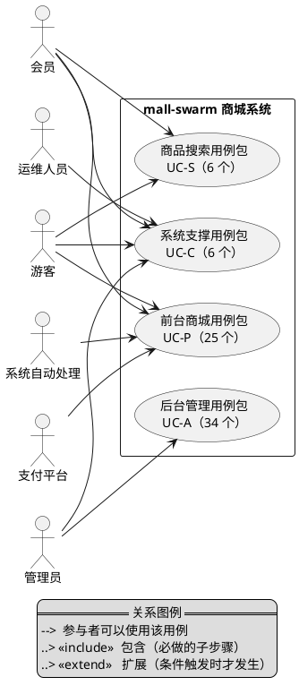

---

### 2.2 前台商城用例图

#### 2.2.3 游客用例（无需登录）

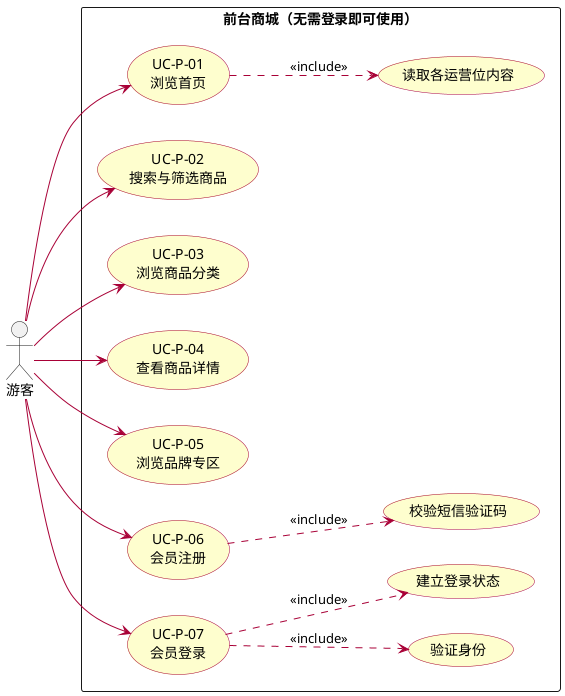

> **说明**：`UC-P-01` 浏览首页会一次性展示轮播广告、推荐品牌、新品、人气推荐、推荐专题与当前限时购场次，是前台唯一一次「一屏展示多组运营内容」的场景。
> **范围提示**：游客能看到的专题仅限于被运营推荐到首页的专题，**无法进入专题详情页**（见 1.3 节 H-14）。

#### 2.2.2 会员交易用例（需登录）

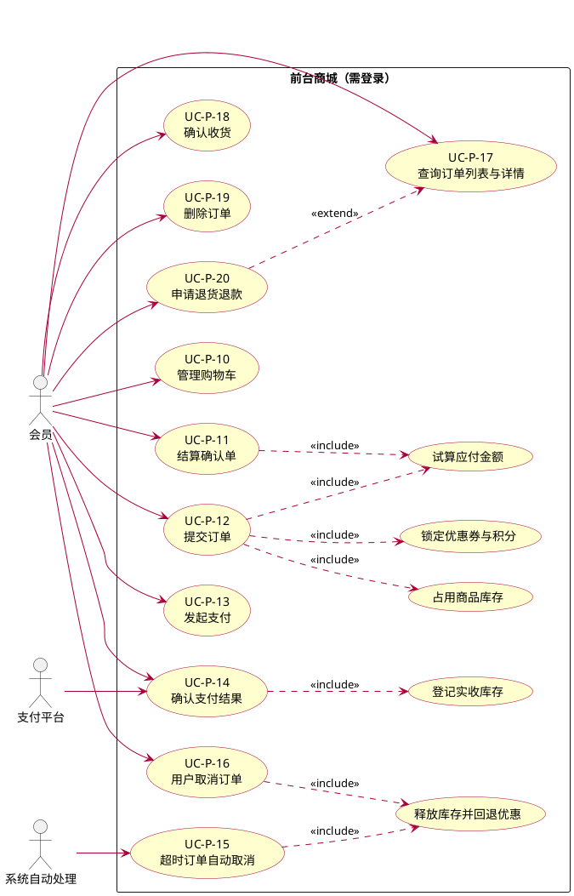

> **说明**：`UC-P-12` 提交订单是会员交易的中心用例——它包含「试算应付金额」「占用商品库存」「锁定优惠券与积分」三个必做子步骤；`UC-P-15`（系统触发）与 `UC-P-16`（会员触发）共用同一套「释放库存并回退优惠」的处理。

#### 2.2.1 会员账户与行为用例

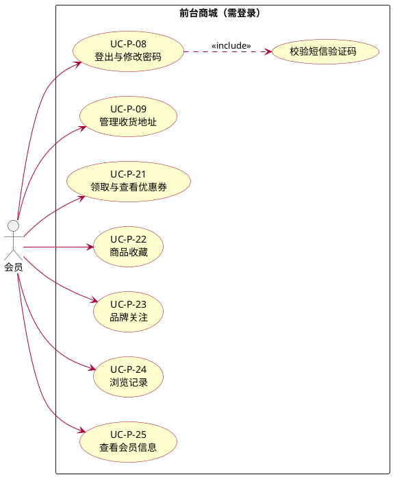

> **说明**：`UC-P-22 / 23 / 24` 是会员的行为沉淀，用于「我的收藏 / 我的关注 / 我的足迹」；`UC-P-09` 的收货地址是 `UC-P-11` 结算确认单的数据来源。

---

### 2.3 后台管理用例图

#### 2.3.2 权限域（UC-A-01 ~ 07）

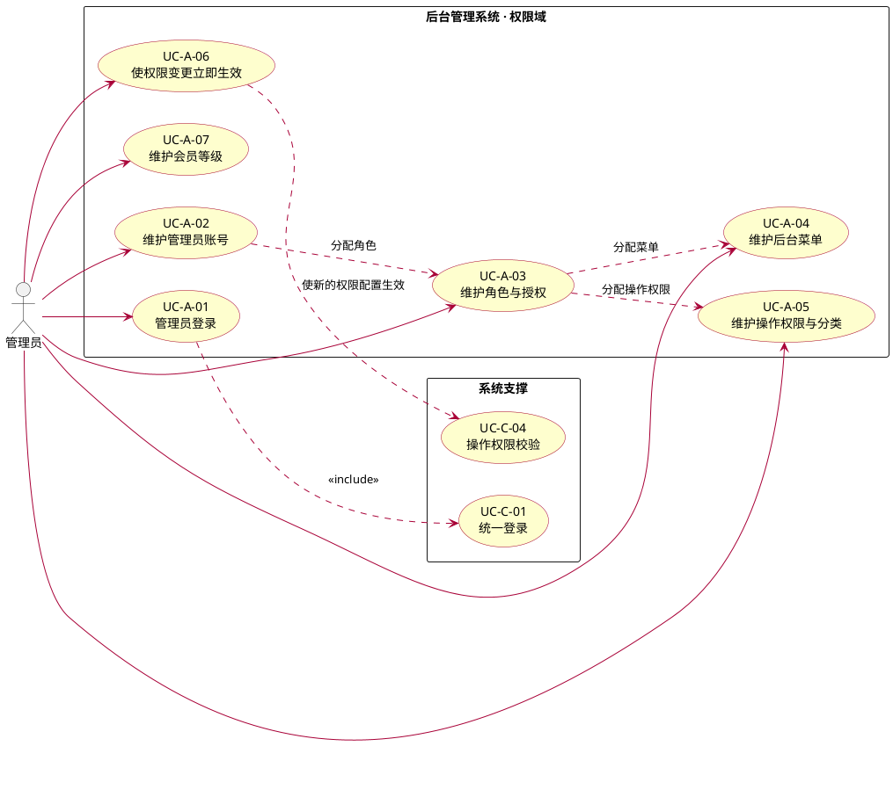

> **说明**：权限模型是「管理员 → 角色 → 菜单 / 操作权限」两条授权链。菜单决定后台左侧导航可见性，操作权限决定能执行哪些操作。
> **业务规则提示**：授权变更后需要**重新登录**才会对已登录的管理员生效；该行为是否符合预期需产品确认。

#### 2.3.1 商品域（UC-A-08 ~ 15、34）

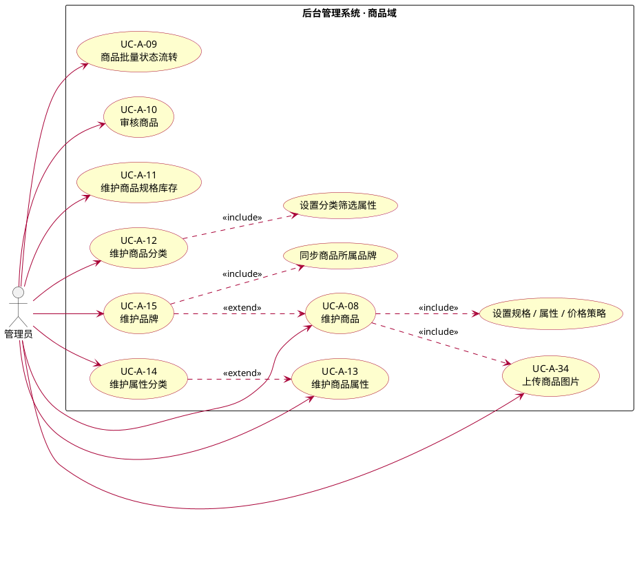

> **说明**：`UC-A-08` 发布商品时需同时设置规格库存、商品属性、会员价、阶梯价与满减策略，是后台最复杂的一次录入。
> **业务规则提示**：上下架操作**不校验商品是否已审核**，「先审核后上架」目前不是强制规则；商品改价 / 改名后**不会同步到搜索数据**（见《[需求分析-实现对照](./需求分析-实现对照.md)》UC-S-01）。

#### 2.3.5 交易与售后域（UC-A-16 ~ 24）

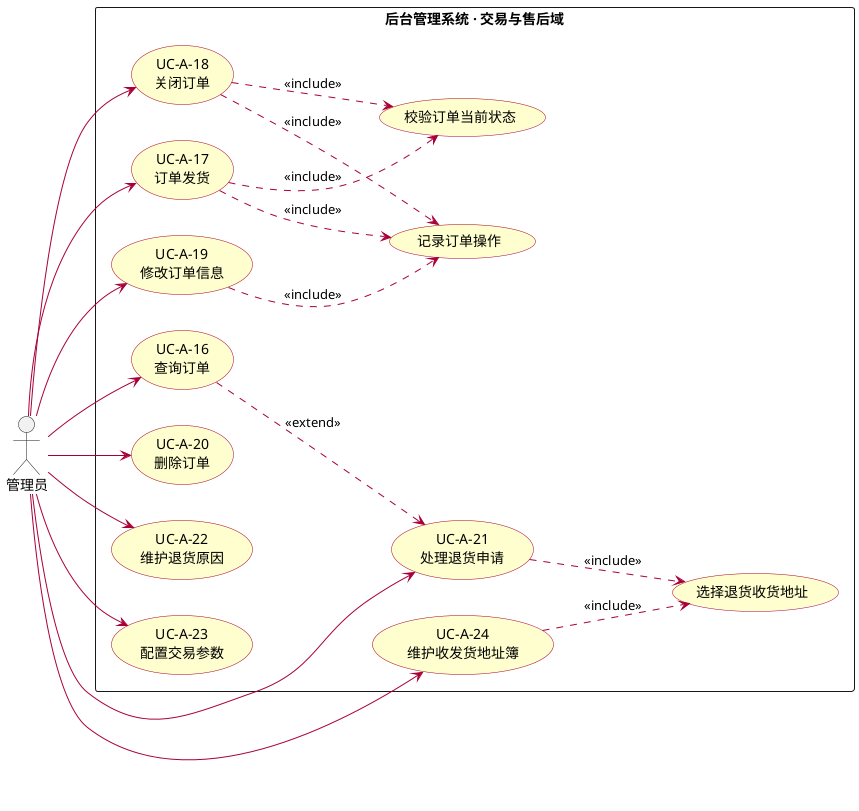

> **说明**：`UC-A-23` 配置的交易参数（未支付超时时间、自动确认收货天数等）是 `UC-P-15` 超时自动关闭与自动确认收货规则的来源；`UC-A-24` 的收发货地址簿是 `UC-A-21` 处理退货时选择退货收货地址的数据来源。
> **业务规则提示**：只有「发货」会校验订单当前是否为待发货；「关闭订单」对**任意状态**的订单都可执行，且关闭后不会回退库存与优惠；「处理退货申请」目前**不触发退款、不回补库存、不改变订单状态**。这三处与业务预期的差距需产品确认。

#### 2.3.6 营销域（UC-A-25 ~ 31）

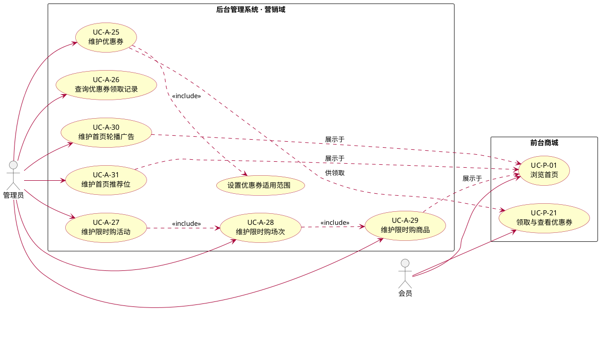

> **说明**：营销域是「后台配置 → 前台展示」的典型链路。运营在后台维护的内容，会员在首页或购物车中看到。
> **业务规则提示**：限时购的活动、场次、商品三层配置齐全且能在首页展示，但**秒杀价不参与下单计价**（见 1.3 节 H-15）；优惠券改为「全场通用」后，原先绑定的商品 / 分类范围不会自动清除，可能导致前台误判为限定券。

#### 2.3.3 内容与文件域（UC-A-32 ~ 34）

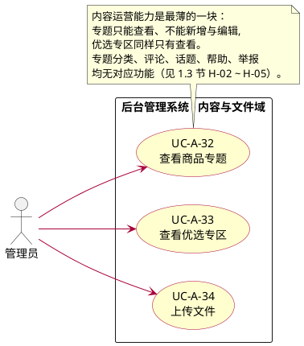

---

### 2.5 商品搜索用例图

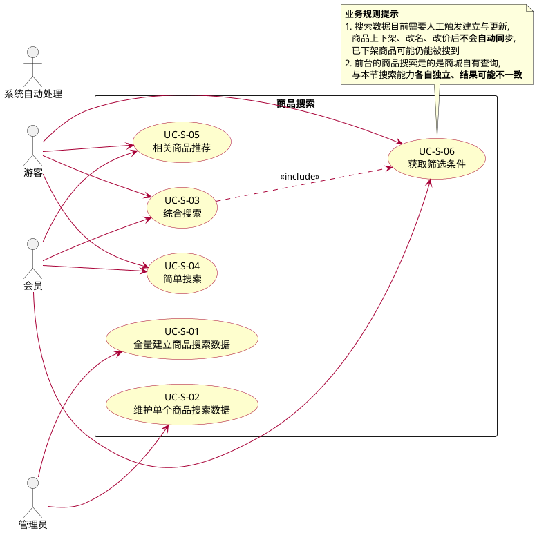

---

### 2.6 系统支撑用例图

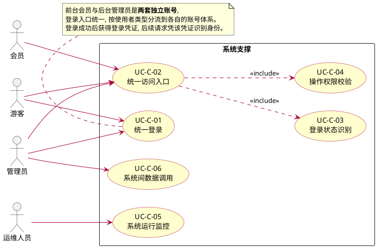

> **说明**：本用例包的 6 个用例不直接产生业务价值，但被其余三个用例包依赖，属于系统级能力。`UC-C-06` 为技术验证性质的演示能力，不承载真实业务。

---

### 2.7 用例清单

**前台商城（UC-P，25 个）**

| 编号 | 用例名称 | 主参与者 | 一句话简述 | 关联功能点 |
| --- | --- | --- | --- | --- |
| UC-P-01 | 浏览首页 | 游客 / 会员 | 一屏展示轮播、推荐品牌、新品、人气推荐、推荐专题与当前限时购 | 1.1 |
| UC-P-02 | 搜索与筛选商品 | 游客 / 会员 | 按关键字、品牌、分类查找商品，并可排序 | 1.2.1 |
| UC-P-03 | 浏览商品分类 | 游客 / 会员 | 查看一级与二级商品分类 | 1.2.2 |
| UC-P-04 | 查看商品详情 | 游客 / 会员 | 查看商品图文详情、规格清单与可领优惠券 | 1.2.3 |
| UC-P-05 | 浏览品牌专区 | 游客 / 会员 | 查看推荐品牌、品牌详情与品牌下商品 | 1.3 |
| UC-P-06 | 会员注册 | 游客 | 用手机号与短信验证码注册会员账号 | 1.4.2 / 1.4.1 |
| UC-P-07 | 会员登录 | 游客 | 用账号密码登录，获得会员登录状态 | 1.4.3 |
| UC-P-08 | 登出与修改密码 | 会员 | 退出登录；用手机号与验证码重置密码 | 1.4.6 / 1.4.5 |
| UC-P-09 | 管理收货地址 | 会员 | 维护收货地址并设置默认地址 | 1.5.1 |
| UC-P-10 | 管理购物车 | 会员 | 加购、改数量、改规格、移除、清空 | 1.6 |
| UC-P-11 | 结算确认单 | 会员 | 确认收货地址、可用优惠券与积分，查看应付金额 | 1.7.1 |
| UC-P-12 | 提交订单 | 会员 | 生成待付款订单，占用库存并锁定优惠券与积分 | 1.7.2 |
| UC-P-13 | 发起支付 | 会员 | 跳转支付平台完成付款 | 1.8.1 / 1.8.2 |
| UC-P-14 | 确认支付结果 | 支付平台 / 会员 | 接收支付结果并把订单置为待发货 | 1.8.3 / 1.8.4 / 1.7.8 |
| UC-P-15 | 超时订单自动取消 | 系统自动处理 | 超过支付时限仍未付款的订单自动关闭并回退优惠 | 1.7.9 / 1.7.10 |
| UC-P-16 | 用户取消订单 | 会员 | 会员主动取消待付款订单并回退优惠 | 1.7.5 |
| UC-P-17 | 查询订单列表与详情 | 会员 | 按状态查看自己的订单及订单内商品 | 1.7.3 / 1.7.4 |
| UC-P-18 | 确认收货 | 会员 | 收到货后确认，订单流转为已完成 | 1.7.6 |
| UC-P-19 | 删除订单 | 会员 | 从我的订单中移除已完成或已关闭的订单 | 1.7.7 |
| UC-P-20 | 申请退货退款 | 会员 | 提交退货原因、凭证图片与退款金额 | 1.9.1 |
| UC-P-21 | 领取与查看优惠券 | 会员 | 领取优惠券，并查看购物车 / 商品可用券 | 1.5.2 |
| UC-P-22 | 商品收藏 | 会员 | 收藏与取消收藏商品，查看收藏列表 | 1.5.4 |
| UC-P-23 | 品牌关注 | 会员 | 关注与取消关注品牌，查看关注列表 | 1.5.3 |
| UC-P-24 | 浏览记录 | 会员 | 记录浏览足迹，支持查询、删除与清空 | 1.5.5 |
| UC-P-25 | 查看会员信息 | 会员 | 查看自己的会员资料 | 1.4.4 |

**后台管理（UC-A，34 个）**

| 编号 | 用例名称 | 主参与者 | 一句话简述 | 关联功能点 |
| --- | --- | --- | --- | --- |
| UC-A-01 | 管理员登录 | 管理员 | 登录后台，获得与该账号角色相符的功能范围 | 2.1.1 / 4.1 |
| UC-A-02 | 维护管理员账号 | 管理员 | 管理后台账号，启停用、重置密码、分配角色 | 2.1.1 |
| UC-A-03 | 维护角色与授权 | 管理员 | 管理角色，并为其分配菜单与操作权限 | 2.1.2 |
| UC-A-04 | 维护后台菜单 | 管理员 | 维护后台导航菜单的层级与显示状态 | 2.1.3 |
| UC-A-05 | 维护操作权限与分类 | 管理员 | 维护可授予的操作权限及其分类 | 2.1.4 |
| UC-A-06 | 使权限变更立即生效 | 管理员 | 让最新的权限配置对访问控制生效 | 2.1.4.7 |
| UC-A-07 | 维护会员等级 | 管理员 | 查看会员等级及其成长值门槛与特权 | 2.7 |
| UC-A-08 | 维护商品 | 管理员 | 发布、编辑、查询商品，设置规格、属性与价格策略 | 2.4.1 |
| UC-A-09 | 商品批量状态流转 | 管理员 | 批量上下架、设推荐、设新品、删除商品 | 2.4.1.7–2.4.1.10 |
| UC-A-10 | 审核商品 | 管理员 | 审核商品并留审核结果 | 2.4.1.6 |
| UC-A-11 | 维护商品规格库存 | 管理员 | 查看并批量保存各规格的库存 | 2.4.2 |
| UC-A-12 | 维护商品分类 | 管理员 | 维护两级商品分类与筛选属性 | 2.2.3 |
| UC-A-13 | 维护商品属性 | 管理员 | 维护规格与参数两类属性及其筛选规则 | 2.2.2 |
| UC-A-14 | 维护属性分类 | 管理员 | 维护属性归属的分类 | 2.2.1 |
| UC-A-15 | 维护品牌 | 管理员 | 维护品牌，设置显示与生产厂家状态 | 2.3 |
| UC-A-16 | 查询订单 | 管理员 | 多条件查询订单，查看订单与操作记录 | 2.5.1 / 2.5.2 |
| UC-A-17 | 订单发货 | 管理员 | 填写物流公司与物流单号完成发货 | 2.5.3 |
| UC-A-18 | 关闭订单 | 管理员 | 关闭订单 | 2.5.7 |
| UC-A-19 | 修改订单信息 | 管理员 | 修改收货人、订单费用或备注 | 2.5.4–2.5.6 |
| UC-A-20 | 删除订单 | 管理员 | 从后台移除订单 | 2.5.8 |
| UC-A-21 | 处理退货申请 | 管理员 | 同意、拒绝或完成会员的退货申请 | 2.6.1 |
| UC-A-22 | 维护退货原因 | 管理员 | 维护会员申请退货时可选择的原因 | 2.6.4 |
| UC-A-23 | 配置交易参数 | 管理员 | 设置未支付超时、自动确认收货等交易规则 | 2.6.2 |
| UC-A-24 | 维护收发货地址簿 | 管理员 | 查看公司收发货地址 | 2.6.3 |
| UC-A-25 | 维护优惠券 | 管理员 | 创建优惠券并设置面额、门槛与适用范围 | 2.8.1 |
| UC-A-26 | 查询优惠券领取记录 | 管理员 | 查看会员的优惠券领取与使用情况 | 2.8.1.6 |
| UC-A-27 | 维护限时购活动 | 管理员 | 维护限时购活动的起止日期与上下线 | 2.8.5 |
| UC-A-28 | 维护限时购场次 | 管理员 | 维护每日场次时段与启停 | 2.8.4 |
| UC-A-29 | 维护限时购商品 | 管理员 | 把商品加入场次并设置秒杀价、数量与限购 | 2.8.2 |
| UC-A-30 | 维护首页轮播广告 | 管理员 | 维护首页轮播广告及其投放端与上下线 | 2.8.3 |
| UC-A-31 | 维护首页推荐位 | 管理员 | 维护推荐品牌、新品、人气推荐与推荐专题 | 2.8.6 |
| UC-A-32 | 查看商品专题 | 管理员 | 查看专题列表（**无新增与编辑**） | 2.9.1 |
| UC-A-33 | 查看优选专区 | 管理员 | 查看优选专区列表（**无新增与编辑**） | 2.9.2 |
| UC-A-34 | 上传文件 | 管理员 | 上传商品图片等文件 | 2.10 |

**商品搜索（UC-S，6 个）**

| 编号 | 用例名称 | 主参与者 | 一句话简述 | 关联功能点 |
| --- | --- | --- | --- | --- |
| UC-S-01 | 全量建立商品搜索数据 | 管理员 | 把当前在售商品一次性建立为可搜索数据 | 3.1.1 |
| UC-S-02 | 维护单个商品搜索数据 | 管理员 | 单独更新或删除某个商品的搜索数据 | 3.1.3–3.1.2 |
| UC-S-03 | 综合搜索 | 游客 / 会员 | 关键字 + 品牌 + 分类 + 属性筛选并排序 | 3.2.1 |
| UC-S-04 | 简单搜索 | 游客 / 会员 | 单一关键字搜索 | 3.2.2 |
| UC-S-05 | 相关商品推荐 | 游客 / 会员 | 在商品页展示相似商品 | 3.2.4 |
| UC-S-06 | 获取筛选条件 | 游客 / 会员 | 返回可筛选的品牌、分类与属性取值 | 3.2.3 |

**系统支撑（UC-C，6 个）**

| 编号 | 用例名称 | 主参与者 | 一句话简述 | 关联功能点 |
| --- | --- | --- | --- | --- |
| UC-C-01 | 统一登录 | 游客 / 管理员 | 后台与前台共用登录入口，按使用者类型分流 | 4.1 |
| UC-C-02 | 统一访问入口 | 全体 | 所有业务请求经同一入口进入 | 4.2.1 |
| UC-C-03 | 登录状态识别 | 全体 | 未登录用户被拦截并提示重新登录 | 4.2.2 |
| UC-C-04 | 操作权限校验 | 管理员 | 无权限的管理员被拦截并提示无权限 | 4.2.3 |
| UC-C-05 | 系统运行监控 | 运维人员 | 查看各服务运行状态与指标 | 4.3 |
| UC-C-06 | 系统间数据调用 | 内部 | 系统之间传递登录信息与获取业务数据 | 4.4 |

---

---

## 三、用例描述

本章逐条描述「二、用例图」中的 71 个用例，只描述**业务行为**：谁发起、系统做什么、什么条件下会有不同结果。实现层面的入口接口、实现事件流、代码级证据与已知偏差，统一记录在配套文档《[需求分析-实现对照](./需求分析-实现对照.md)》第三章，按**相同用例编号**一一对应。

### 3.1 描述约定

| 项 | 说明 |
| --- | --- |
| 用例编号 | 与第二节一致：`UC-P-*` 前台、`UC-A-*` 后台、`UC-S-*` 搜索、`UC-C-*` 系统支撑 |
| 简要说明 | 一段话说明该用例的业务目标与价值 |
| 基本流 | 一切正常时的步骤序列，按「参与者动作 / 系统响应」交替描述，不含技术实现 |
| 备选流与异常 | 业务规则不满足时的系统提示与结果；只写**用户能感知**的反馈 |
| 泳道图 | 关键用例给出。泳道 = 业务角色（会员 / 运营人员 / 商城系统 / 支付平台），泳道中的活动 = 该角色承担的业务步骤 |
| 待确认的业务规则 | 现有行为可能与业务预期不符之处，列为本阶段待产品确认的问题，不在此处下结论 |
| 不含 | 数据库表、字段、接口路径、类与方法、中间件、缓存、事务、性能指标 |

> **关于「系统自动处理」**：凡由系统在无人干预下完成的用例（如超时订单自动关闭），其泳道中的「商城系统」代表系统自身，不出现触发者。

---

### 3.2 前台商城用例（UC-P）

#### UC-P-01 浏览首页

| 项 | 内容 |
| --- | --- |
| 用例编号 | UC-P-01 |
| 用例名称 | 浏览首页 |
| 主参与者 | 游客、会员 |
| 关联功能点 | 1.1 |
| 关联需求 | FR-SMS-07、FR-CMS-05 |
| 前置条件 | 无（无需登录） |
| 后置条件 | 无（只读，不影响业务数据） |

**简要说明**：会员或游客进入商城首页，一屏内看到运营配置的全部内容：轮播广告、推荐品牌、新品推荐、人气推荐商品、推荐专题，以及当前正在进行的限时购场次与商品。首页是商城的流量入口，其内容完全由运营在后台配置。

**基本流**

1. 用户打开商城首页。
2. 系统展示轮播广告。
3. 系统展示推荐品牌。
4. 系统展示当前限时购场次及其商品，并给出下一场次的开始时间。
5. 系统展示新品推荐、人气推荐商品与推荐专题。
6. 用户点击任一内容，进入对应的商品详情、品牌专区或专题。

**备选流与异常**

| 触发条件 | 系统响应 |
| --- | --- |
| 某运营位未开启推荐 | 该运营位不展示，其余板块正常展示 |
| 关联的商品已下架或品牌已停用 | 该条内容不展示 |
| 广告已过投放期 | 见「待确认的业务规则」 |
| 当前没有进行中的限时购场次 | 不展示限时购板块 |
| 运营位数量较少 | 按已配置内容展示，不补位 |

**待确认的业务规则**

- 广告的投放时间（起止时间）是否应生效？限时购多个场次时段重叠时，展示哪一个场次？

#### UC-P-02 搜索与筛选商品

| 项 | 内容 |
| --- | --- |
| 用例编号 | UC-P-02 |
| 用例名称 | 搜索与筛选商品 |
| 主参与者 | 游客、会员 |
| 关联功能点 | 1.2.1 |
| 关联需求 | FR-PMS-01、FR-PMS-06 |
| 前置条件 | 无（无需登录） |
| 后置条件 | 无（只读） |

**简要说明**：用户输入关键字、选择品牌或分类来查找商品，并可按新品、销量、价格排序。

**基本流**

1. 用户输入关键字，并可选择品牌、分类与排序方式。
2. 系统按条件返回匹配的商品列表。
3. 用户翻页浏览，或调整条件重新查找。

**备选流与异常**

| 触发条件 | 系统响应 |
| --- | --- |
| 未输入任何条件 | 返回全部在售商品 |
| 无匹配商品 | 返回空列表并提示无结果 |
| 选择「按相关度」排序 | 见「待确认的业务规则」 |
| 商品已下架 | 见「待确认的业务规则」 |

**待确认的业务规则**

- 「按相关度」排序的业务含义未定义，当前不产生排序效果。
- 已下架或未通过审核的商品是否允许被搜到？现有行为是仍可被搜到。

#### UC-P-03 浏览商品分类

| 项 | 内容 |
| --- | --- |
| 用例编号 | UC-P-03 |
| 用例名称 | 浏览商品分类 |
| 主参与者 | 游客、会员 |
| 关联功能点 | 1.2.2 |
| 关联需求 | FR-PMS-01 |
| 前置条件 | 无 |
| 后置条件 | 无（只读） |

**简要说明**：用户通过分类导航逐级查找商品。分类为两级结构（一级分类、二级分类）。

**基本流**

1. 用户打开分类导航。
2. 系统展示一级分类及其下的二级分类。
3. 用户选择某个分类，进入该分类的商品列表。

**备选流与异常**

| 触发条件 | 系统响应 |
| --- | --- |
| 分类被运营设置为不显示 | 见「待确认的业务规则」 |
| 分类下无商品 | 展示空列表 |

**待确认的业务规则**

- 运营将分类设为「不显示」后，是否还应出现在前台分类导航中？现有行为是仍会出现。

#### UC-P-04 查看商品详情

| 项 | 内容 |
| --- | --- |
| 用例编号 | UC-P-04 |
| 用例名称 | 查看商品详情 |
| 主参与者 | 游客、会员 |
| 关联功能点 | 1.2.3 |
| 关联需求 | FR-PMS-02、FR-PMS-03、FR-PMS-07 |
| 前置条件 | 无（无需登录） |
| 后置条件 | 无（只读） |

**简要说明**：用户查看商品的图文详情、可选规格及其价格与库存、商品参数，以及该商品当前可领取的优惠券，作为是否购买的依据。

**基本流**

1. 用户从列表、搜索或首页进入某个商品。
2. 系统展示商品名称、主图、卖点与图文详情。
3. 系统展示可选规格及各规格的价格、可售数量。
4. 系统展示商品参数。
5. 系统展示该商品当前可领取的优惠券。
6. 用户选择规格后加入购物车或直接购买。

**备选流与异常**

| 触发条件 | 系统响应 |
| --- | --- |
| 商品无可选规格 | 直接按商品价格展示 |
| 商品当前无可领优惠券 | 不展示优惠券区块 |
| 商品已下架或已删除 | 见「待确认的业务规则」 |
| 某规格已售罄 | 该规格不可选择 |

**待确认的业务规则**

- 已下架或已删除的商品，前台详情页是否仍可访问？现有行为是仍可访问。
- 会员价是否应在详情页与结算时体现？见 1.3 节 H-15。

#### UC-P-05 浏览品牌专区

| 项 | 内容 |
| --- | --- |
| 用例编号 | UC-P-05 |
| 用例名称 | 浏览品牌专区 |
| 主参与者 | 游客、会员 |
| 关联功能点 | 1.3 |
| 关联需求 | FR-PMS-02 |
| 前置条件 | 无 |
| 后置条件 | 无（只读） |

**简要说明**：用户查看推荐品牌、品牌介绍以及该品牌下的商品。

**基本流**

1. 用户进入品牌专区。
2. 系统展示推荐品牌列表。
3. 用户选择某个品牌，查看品牌介绍。
4. 系统展示该品牌下的在售商品。

**备选流与异常**

| 触发条件 | 系统响应 |
| --- | --- |
| 品牌被运营设置为不显示 | 该品牌不出现在推荐列表中 |
| 品牌下无在售商品 | 展示空列表 |

#### UC-P-06 会员注册

| 项 | 内容 |
| --- | --- |
| 用例编号 | UC-P-06 |
| 用例名称 | 会员注册 |
| 主参与者 | 游客 |
| 关联功能点 | 1.4.2、1.4.1 |
| 关联需求 | FR-UMS-01、FR-UMS-02 |
| 前置条件 | 无 |
| 后置条件 | 产生一个会员账号，并自动归入默认会员等级 |

**简要说明**：用户用手机号获取短信验证码，配合用户名与密码完成注册，成为会员。注册后即可使用购物车、下单等会员功能。

**基本流**

1. 用户输入手机号，请求获取验证码。
2. 系统下发短信验证码（有效期内可重复使用）。
3. 用户填写用户名、密码与收到的验证码，提交注册。
4. 系统校验验证码正确、用户名与手机号未被占用。
5. 系统创建会员账号，并归入默认会员等级。
6. 系统提示注册成功，引导用户登录。

**备选流与异常**

| 触发条件 | 系统响应 |
| --- | --- |
| 验证码错误或已超时 | 提示验证码错误，不创建账号 |
| 用户名已被占用 | 提示该用户已存在，不创建账号 |
| 手机号已被注册 | 提示该用户已存在，不创建账号 |
| 密码强度不足 | 提示密码不符合要求 |

**泳道图**

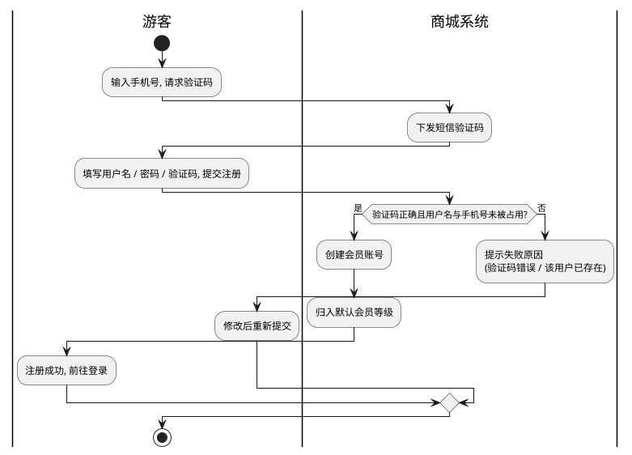

#### UC-P-07 会员登录

| 项 | 内容 |
| --- | --- |
| 用例编号 | UC-P-07 |
| 用例名称 | 会员登录 |
| 主参与者 | 游客 |
| 关联功能点 | 1.4.3、4.1 |
| 关联需求 | FR-UMS-01、NFR-SEC-01、NFR-SEC-04 |
| 前置条件 | 已注册会员账号 |
| 后置条件 | 会员获得登录状态，可访问会员功能 |

**简要说明**：会员用账号密码登录。登录入口与后台管理员共用，系统按使用者类型分流到会员账号体系并建立登录状态。

**基本流**

1. 用户输入账号与密码，提交登录。
2. 系统验证身份，并检查账号是否被停用。
3. 系统建立会员登录状态。
4. 系统跳转回用户此前浏览的页面或会员中心。

**备选流与异常**

| 触发条件 | 系统响应 |
| --- | --- |
| 账号不存在 | 提示找不到该用户 |
| 密码错误 | 提示密码不正确 |
| 账号被停用 | 提示该账号已被禁用 |
| 登录状态过期 | 见「待确认的业务规则」 |

**待确认的业务规则**

- 会员登录状态的有效期应为多久？「账号不存在」与「密码错误」是否应合并提示以降低账号被枚举的风险？

**泳道图**

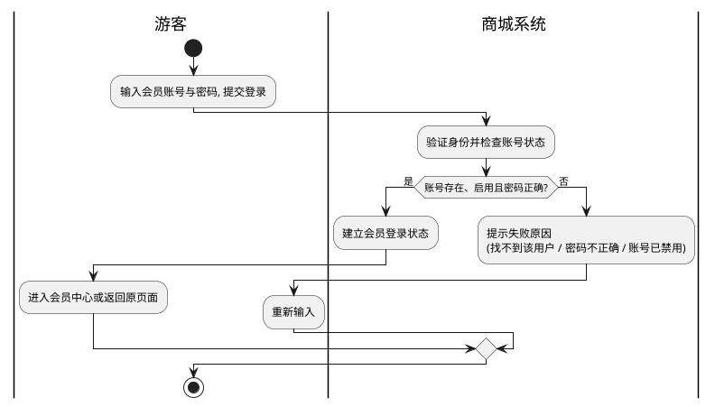

#### UC-P-08 登出与修改密码

| 项 | 内容 |
| --- | --- |
| 用例编号 | UC-P-08 |
| 用例名称 | 登出与修改密码 |
| 主参与者 | 会员 |
| 关联功能点 | 1.4.6、1.4.5 |
| 关联需求 | FR-UMS-01、NFR-SEC-04 |
| 前置条件 | 会员已登录 |
| 后置条件 | 登出后登录状态失效；修改密码后可用新密码登录 |

**简要说明**：会员退出登录，或通过「手机号 + 短信验证码」重置登录密码。

**基本流（登出）**

1. 会员点击退出登录。
2. 系统清除其登录状态，返回首页。

**基本流（修改密码）**

1. 会员输入手机号并获取验证码。
2. 会员填写验证码与新密码，提交。
3. 系统校验验证码正确、手机号对应账号存在。
4. 系统更新密码，提示修改成功。

**备选流与异常**

| 触发条件 | 系统响应 |
| --- | --- |
| 手机号对应账号不存在 | 提示该账号不存在 |
| 验证码错误或已超时 | 提示验证码错误 |
| 新密码强度不足 | 提示密码不符合要求 |

**待确认的业务规则**

- 修改密码仅凭「手机号 + 验证码」即可完成，是否需要额外校验当前登录人身份？

#### UC-P-09 管理收货地址

| 项 | 内容 |
| --- | --- |
| 用例编号 | UC-P-09 |
| 用例名称 | 管理收货地址 |
| 主参与者 | 会员 |
| 关联功能点 | 1.5.1 |
| 关联需求 | FR-UMS-08 |
| 前置条件 | 会员已登录 |
| 后置条件 | 收货地址簿更新，供结算时选择 |

**简要说明**：会员维护自己的收货地址（新增、修改、删除、查看），并可将其中一个设为默认地址。

**基本流**

1. 会员进入收货地址管理。
2. 系统展示其全部收货地址及默认标记。
3. 会员新增一个地址，填写收货人、电话与详细地址。
4. 会员可将某地址设为默认。
5. 系统保存并刷新地址列表。

**备选流与异常**

| 触发条件 | 系统响应 |
| --- | --- |
| 新增时勾选「设为默认」 | 见「待确认的业务规则」 |
| 删除默认地址 | 见「待确认的业务规则」 |
| 地址信息不完整 | 提示补全必填项 |

**待确认的业务规则**

- 新增地址时勾选「默认」是否应自动取消原默认地址？（目前修改时才会互斥，新增时会同时存在两个默认地址）
- 删除默认地址后，是否应自动指定新的默认地址？

**泳道图**

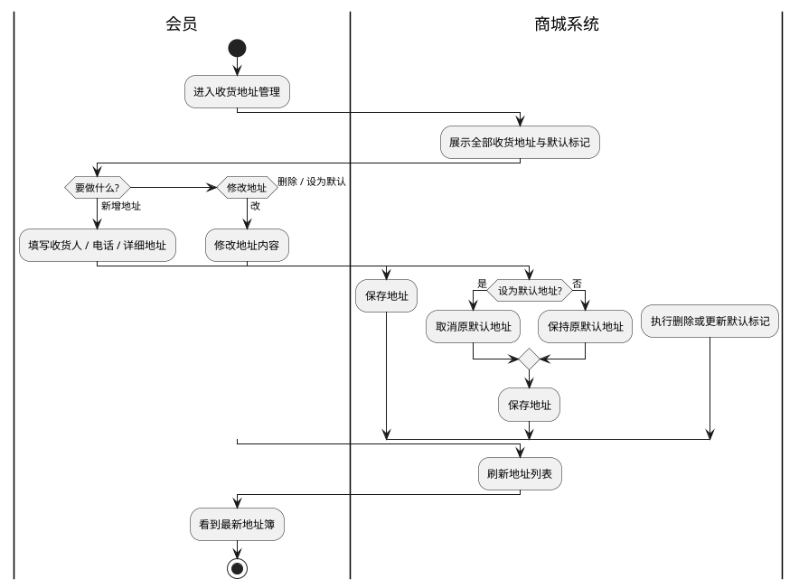

#### UC-P-10 管理购物车

| 项 | 内容 |
| --- | --- |
| 用例编号 | UC-P-10 |
| 用例名称 | 管理购物车 |
| 主参与者 | 会员 |
| 关联功能点 | 1.6 |
| 关联需求 | FR-OMS-01、FR-PMS-06 |
| 前置条件 | 会员已登录 |
| 后置条件 | 购物车内容更新 |

**简要说明**：会员把商品加入购物车，并在结算前调整数量、更换规格或移除商品。查看购物车时可一并看到每件商品可享受的优惠与可售数量。

**基本流**

1. 会员在商品详情页选择规格后加入购物车。
2. 系统按「商品 + 规格」判断购物车中是否已有该商品：已有则累加数量，没有则新增一行。
3. 会员查看购物车，系统展示每件商品的数量、单价、可售数量与可享优惠。
4. 会员修改某件商品的数量或规格，或移除某件商品。
5. 会员可一键清空购物车。

**备选流与异常**

| 触发条件 | 系统响应 |
| --- | --- |
| 商品无可选规格 | 按「商品」维度合并数量 |
| 数量填写为 0 或负数 | 见「待确认的业务规则」 |
| 商品可售数量不足 | 结算时会被拦截，购物车中予以提示 |
| 商品已下架或被删除 | 该行不可结算 |
| 购物车为空 | 提示购物车为空 |

**待确认的业务规则**

- 购买数量是否允许为 0 或负数？现有行为是允许写入。
- 会员价、限时购秒杀价是否应在购物车优惠中体现？见 1.3 节 H-15。

#### UC-P-11 结算确认单

| 项 | 内容 |
| --- | --- |
| 用例编号 | UC-P-11 |
| 用例名称 | 结算确认单 |
| 主参与者 | 会员 |
| 关联功能点 | 1.7.1 |
| 关联需求 | FR-OMS-03、FR-SMS-02、FR-UMS-04 |
| 前置条件 | 会员已登录；购物车中至少有一件可购买商品 |
| 后置条件 | 无（只读，不占用库存也不锁定优惠） |

**简要说明**：会员在提交订单前，先确认这一单的收货地址、可用优惠券、可用积分与应付金额。此步骤只做展示与试算，不产生任何业务后果，会员可反复调整。

**基本流**

1. 会员从购物车进入结算页。
2. 系统展示该会员的收货地址列表，并预选默认地址。
3. 系统按所选商品计算可享优惠，并展示商品总额与优惠金额。
4. 系统展示该会员当前可用的优惠券，以及积分余额与可用抵扣规则。
5. 系统给出应付金额试算结果。
6. 会员选择地址、优惠券与积分，进入提交订单。

**备选流与异常**

| 触发条件 | 系统响应 |
| --- | --- |
| 购物车为空 | 提示购物车为空，无法结算 |
| 无可用优惠券 | 优惠券区块展示为空 |
| 未达优惠券使用门槛 | 该券展示为不可用 |
| 会员无收货地址 | 提示先添加收货地址 |

**待确认的业务规则**

- 试算金额是否应包含优惠券与积分抵扣？现有行为是不包含，需前端自行扣减，容易与实际应付金额不一致。
- 优惠券是否应校验生效开始时间？现有行为只校验失效时间，未生效的券也会出现在可用列表中。

**泳道图**

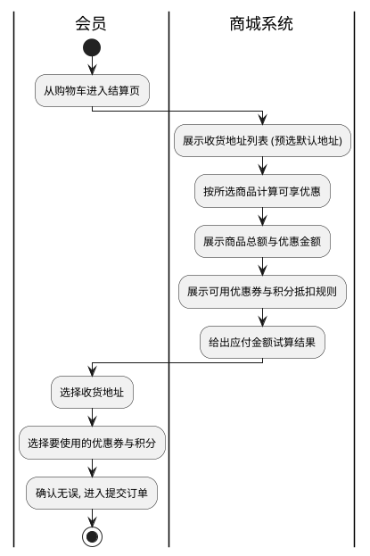

#### UC-P-12 提交订单

| 项 | 内容 |
| --- | --- |
| 用例编号 | UC-P-12 |
| 用例名称 | 提交订单 |
| 主参与者 | 会员 |
| 关联功能点 | 1.7.2 |
| 关联需求 | FR-OMS-02 ~ FR-OMS-08、FR-SMS-02、FR-UMS-04、FR-UMS-07、NFR-REL-01、NFR-REL-02 |
| 前置条件 | 会员已登录；购物车中有可购买商品；已选择收货地址 |
| 后置条件 | 生成一笔待付款订单；商品库存被占用；所用优惠券被锁定；所用积分被扣减；购物车中对应商品被移除；订单进入支付时限倒计时 |

**简要说明**：会员确认收货地址与优惠后提交订单。系统校验库存、计算应付金额、生成待付款订单，同时占用商品库存、锁定所用优惠券并扣减所用积分，并为该订单设定支付时限——超时未支付将自动关闭并回退上述占用。

**基本流**

1. 会员确认本单的商品、收货地址、优惠券与积分，提交订单。
2. 系统校验收货地址有效。
3. 系统校验所选商品的可售数量是否满足购买数量。
4. 系统校验所用优惠券与积分是否满足使用条件。
5. 系统计算订单金额：商品总额 − 促销优惠 − 优惠券抵扣 − 积分抵扣。
6. 系统生成待付款订单，记录下单时的商品信息与收货人信息。
7. 系统占用商品库存，锁定所用优惠券，扣减所用积分。
8. 系统从购物车中移除已下单商品，并设定支付时限。
9. 系统提示下单成功，引导会员前往支付。

**备选流与异常**

| 触发条件 | 系统响应 |
| --- | --- |
| 未选择收货地址 | 提示「请选择收货地址」，不生成订单 |
| 商品可售数量不足 | 提示「库存不足，无法下单」，不生成订单 |
| 所选优惠券不满足使用条件 | 提示「该优惠券不可用」，不生成订单 |
| 所选积分不满足使用条件 | 提示「积分不可用」，不生成订单 |
| 会员重复提交 | 见「待确认的业务规则」 |
| 多人同时抢购同一规格 | 见「待确认的业务规则」 |

**待确认的业务规则**

- 重复提交是否应拦截？（现有行为是连点会生成多笔订单）
- 同一规格被多人同时抢购时，如何保证不超卖？
- 关闭订单或退货后，赠送的积分与成长值应如何结算？

**泳道图**

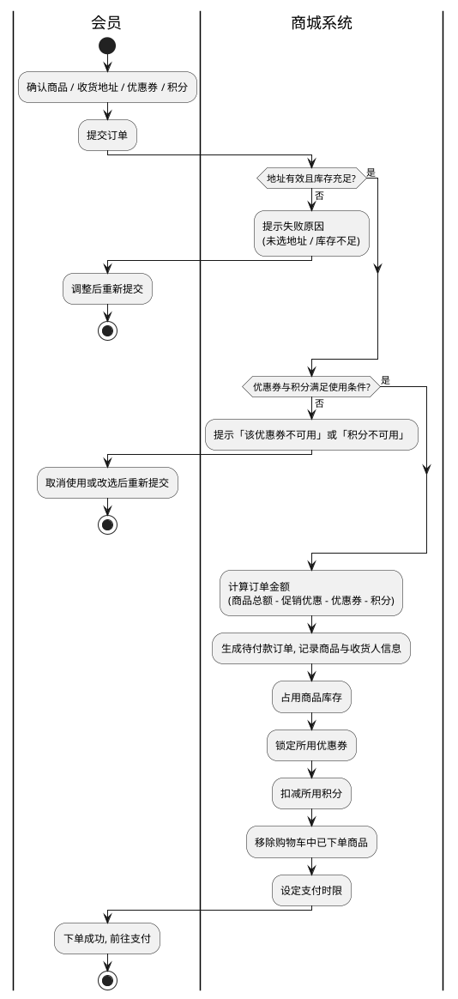

#### UC-P-13 发起支付

| 项 | 内容 |
| --- | --- |
| 用例编号 | UC-P-13 |
| 用例名称 | 发起支付 |
| 主参与者 | 会员 |
| 支撑参与者 | 支付平台 |
| 关联功能点 | 1.8.1、1.8.2 |
| 关联需求 | — （支付能力） |
| 前置条件 | 已有待付款订单 |
| 后置条件 | 跳转至支付平台收银台 |

**简要说明**：会员选择订单并发起支付，系统跳转至支付平台完成付款。支持电脑端与手机端两种支付方式。

**基本流**

1. 会员在订单或支付页选择支付方式并确认支付。
2. 系统生成支付请求并跳转至支付平台收银台。
3. 会员在支付平台完成付款。
4. 支付平台将结果回传系统（见 UC-P-14）。

**备选流与异常**

| 触发条件 | 系统响应 |
| --- | --- |
| 会员在收银台放弃付款 | 订单保持待付款，超时后自动关闭（见 UC-P-15） |
| 支付平台暂时不可用 | 提示支付失败，可稍后重试 |
| 订单已关闭 | 不允许发起支付 |

**待确认的业务规则**

- 支付金额是否应与订单应付金额强校验？现有行为是支付平台按传入金额收款，回传时不比对金额。

#### UC-P-14 确认支付结果

| 项 | 内容 |
| --- | --- |
| 用例编号 | UC-P-14 |
| 用例名称 | 确认支付结果 |
| 主参与者 | 支付平台、会员 |
| 关联功能点 | 1.8.3、1.8.4、1.7.8 |
| 关联需求 | FR-OMS-04、FR-OMS-05、NFR-SEC-03 |
| 前置条件 | 会员已发起支付且订单处于待付款状态 |
| 后置条件 | 订单由待付款转为待发货，并记录付款时间与支付方式；库存由占用转为实际扣减 |

**简要说明**：支付平台把付款结果回传系统，系统据此更新订单状态。会员也可主动查询支付结果。这是订单由「待付款」进入「待发货」的唯一正常入口。

**基本流（支付平台回传）**

1. 支付平台向系统发送付款结果。
2. 系统校验该通知确实来自支付平台。
3. 系统确认对应订单仍为待付款状态。
4. 系统将订单置为待发货，记录付款时间与支付方式。
5. 系统把此前占用的库存转为实际扣减。
6. 系统向支付平台应答已受理。

**基本流（会员主动查询）**

1. 会员在支付后查询支付结果。
2. 系统向支付平台查询该笔交易。
3. 若已支付成功，系统按上述步骤更新订单。

**备选流与异常**

| 触发条件 | 系统响应 |
| --- | --- |
| 通知来源不可信 | 拒绝该通知，不做任何订单变更 |
| 收到的付款结果对应订单已关闭 | 见「待确认的业务规则」 |
| 同一笔支付结果重复送达 | 只处理一次，重复通知不再变更订单 |
| 支付平台暂时不可用 | 提示查询失败，可稍后重试 |

**待确认的业务规则**

- 订单已关闭但收到付款，应如何处理（退款或重新开单）？现有行为是不做处理且不再重试，可能造成资金滞留。

**泳道图**

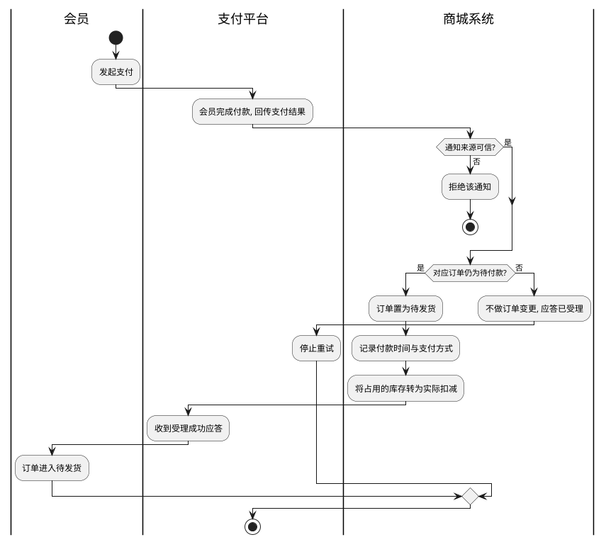

#### UC-P-15 超时订单自动取消

| 项 | 内容 |
| --- | --- |
| 用例编号 | UC-P-15 |
| 用例名称 | 超时订单自动取消 |
| 主参与者 | 系统自动处理 |
| 关联功能点 | 1.7.9、1.7.10 |
| 关联需求 | **NFR-REL-01**、FR-OMS-08、FR-UMS-03 |
| 前置条件 | 订单处于待付款状态，且已超过运营配置的支付时限 |
| 后置条件 | 订单转为已关闭；所占库存释放；所用优惠券退回；所用积分返还 |

**简要说明**：会员下单后会有一个支付时限（由运营在后台配置）。超过时限仍未付款的订单由系统自动关闭，并把下单时占用的库存、优惠券与积分全部回退，避免资源被长期占住。

**基本流**

1. 订单生成时，系统按运营配置的支付时限为该订单设定关闭时间。
2. 到达关闭时间后，系统确认该订单仍未付款。
3. 系统将订单置为已关闭。
4. 系统释放该订单占用的商品库存。
5. 系统把该订单使用的优惠券退回会员账户。
6. 系统把该订单使用的积分返还会员账户。

**备选流与异常**

| 触发条件 | 系统响应 |
| --- | --- |
| 订单在关闭前已完成付款 | 不关闭该订单 |
| 订单已被会员主动取消 | 不重复处理 |
| 系统未能按时触发关闭 | 见「待确认的业务规则」 |

**待确认的业务规则**

- 超时关闭目前依赖单一触发路径，缺少兜底机制；一旦该路径失效，订单将长期停留在待付款状态，所占库存也不会释放。是否要求提供独立兜底？

**泳道图**

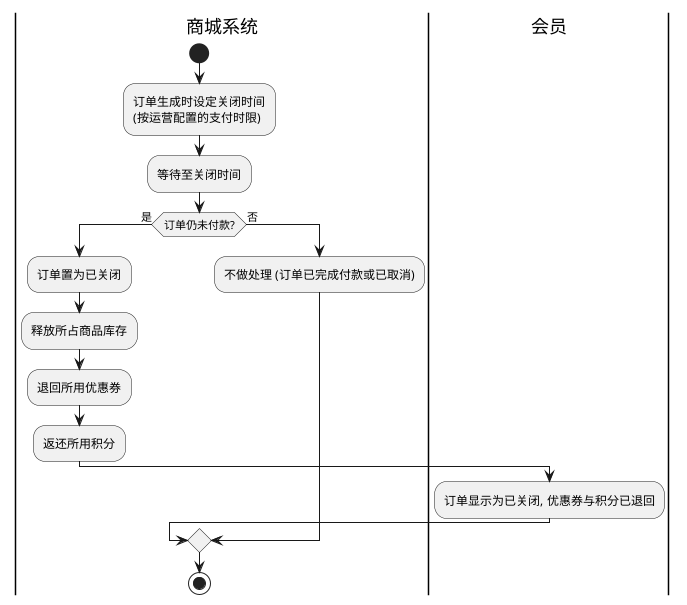

#### UC-P-16 用户取消订单

| 项 | 内容 |
| --- | --- |
| 用例编号 | UC-P-16 |
| 用例名称 | 用户取消订单 |
| 主参与者 | 会员 |
| 关联功能点 | 1.7.5 |
| 关联需求 | FR-OMS-04、FR-UMS-03 |
| 前置条件 | 会员已登录；订单处于待付款状态 |
| 后置条件 | 订单转为已关闭；所占库存释放；所用优惠券与积分回退 |

**简要说明**：会员在下单后改变主意，主动取消尚未付款的订单。取消后系统按与超时关闭相同的方式回退资源。

**基本流**

1. 会员在订单列表或详情中选择取消订单。
2. 系统确认该订单仍为待付款状态。
3. 系统将订单置为已关闭，并释放库存、退回优惠券与积分。
4. 系统提示取消成功。

**备选流与异常**

| 触发条件 | 系统响应 |
| --- | --- |
| 订单已付款 | 不允许取消，提示联系客服退款 |
| 订单已关闭 | 提示订单已关闭 |
| 订单不属于当前会员 | 见「待确认的业务规则」 |

**待确认的业务规则**

- 取消他人订单目前不会被拦截，是否要求校验订单归属？

#### UC-P-17 查询订单列表与详情

| 项 | 内容 |
| --- | --- |
| 用例编号 | UC-P-17 |
| 用例名称 | 查询订单列表与详情 |
| 主参与者 | 会员 |
| 关联功能点 | 1.7.3、1.7.4 |
| 关联需求 | FR-OMS-05、FR-OMS-06 |
| 前置条件 | 会员已登录 |
| 后置条件 | 无（只读） |

**简要说明**：会员在「我的订单」中按状态查看订单，并进入详情查看订单内的商品与金额构成。

**基本流**

1. 会员进入我的订单。
2. 系统按其选择的订单状态（全部 / 待付款 / 待发货 / 已发货 / 已完成 / 已关闭）分页展示订单。
3. 会员选择某笔订单，查看详情：订单号、下单时间、收货人信息、商品明细、金额构成与订单状态。
4. 会员在详情页执行后续操作（支付、取消、确认收货、申请退货、删除）。

**备选流与异常**

| 触发条件 | 系统响应 |
| --- | --- |
| 无订单 | 展示空列表 |
| 未指定订单状态 | 见「待确认的业务规则」 |

**待确认的业务规则**

- 订单状态为必选参数，未传时接口报错而非默认展示全部，需确认是否为预期的前端约束。

#### UC-P-18 确认收货

| 项 | 内容 |
| --- | --- |
| 用例编号 | UC-P-18 |
| 用例名称 | 确认收货 |
| 主参与者 | 会员 |
| 关联功能点 | 1.7.6 |
| 关联需求 | FR-OMS-04、FR-OMS-05 |
| 前置条件 | 订单属于当前会员，且已发货 |
| 后置条件 | 订单转为已完成，记录确认收货时间 |

**简要说明**：会员收到货后确认收货，订单流转为已完成。若会员长期不确认，系统可按运营配置自动确认。

**基本流**

1. 会员在订单详情中确认收货。
2. 系统校验订单归属与当前状态（已发货）。
3. 系统将订单置为已完成，记录确认收货时间。

**备选流与异常**

| 触发条件 | 系统响应 |
| --- | --- |
| 订单未发货 | 提示该订单还未发货 |
| 订单不属于当前会员 | 提示不能确认他人订单 |
| 订单已确认过 | 见「待确认的业务规则」 |

**待确认的业务规则**

- 确认收货后是否应发放赠送的积分与成长值？现有行为是不发放。

#### UC-P-19 删除订单

| 项 | 内容 |
| --- | --- |
| 用例编号 | UC-P-19 |
| 用例名称 | 删除订单 |
| 主参与者 | 会员 |
| 关联功能点 | 1.7.7 |
| 关联需求 | FR-OMS-04 |
| 前置条件 | 订单属于当前会员，且已完成为已完成或已关闭 |
| 后置条件 | 订单从「我的订单」中移除 |

**简要说明**：会员把已完成或已关闭的订单从自己的订单列表中移除。移除只影响会员自己的查看，不影响交易记录留存。

**基本流**

1. 会员在订单详情中选择删除订单。
2. 系统校验订单归属与状态。
3. 系统将该订单从会员的订单列表中移除。

**备选流与异常**

| 触发条件 | 系统响应 |
| --- | --- |
| 订单仍处于待付款 / 待发货 / 已发货 | 提示只能删除已完成或已关闭的订单 |
| 订单不属于当前会员 | 提示不能删除他人订单 |

#### UC-P-20 申请退货退款

| 项 | 内容 |
| --- | --- |
| 用例编号 | UC-P-20 |
| 用例名称 | 申请退货退款 |
| 主参与者 | 会员 |
| 关联功能点 | 1.9.1 |
| 关联需求 | FR-OMS-07 |
| 前置条件 | 会员已登录；存在可申请退货的订单 |
| 后置条件 | 生成一条待处理的退货申请，等待运营处理 |

**简要说明**：会员对已购买的商品提出退货退款申请，填写退货原因、问题描述、凭证图片与期望退款金额，等待运营审核处理。

**基本流**

1. 会员在订单中选择要退货的商品，进入退货申请。
2. 会员选择退货原因，填写问题描述并上传凭证图片。
3. 会员确认退款金额与退货联系方式，提交申请。
4. 系统生成一条待处理的退货申请。
5. 系统提示提交成功，会员可在订单中查看处理进度。

**备选流与异常**

| 触发条件 | 系统响应 |
| --- | --- |
| 未选择退货原因 | 提示选择退货原因 |
| 上传凭证超出数量或格式限制 | 提示重新上传 |
| 订单状态不支持退货 | 见「待确认的业务规则」 |

**待确认的业务规则**

- 哪些订单状态允许申请退货？现有行为不校验订单状态与归属。
- 退款金额是否应由系统按实际成交价核算，而非由会员填写？

**泳道图**

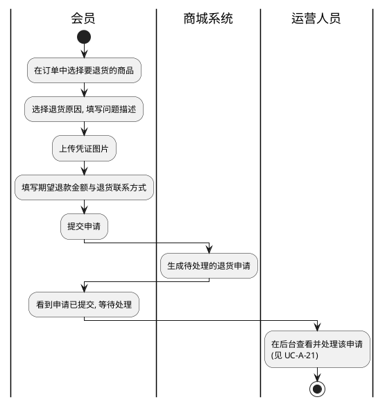

#### UC-P-21 领取与查看优惠券

| 项 | 内容 |
| --- | --- |
| 用例编号 | UC-P-21 |
| 用例名称 | 领取与查看优惠券 |
| 主参与者 | 会员 |
| 关联功能点 | 1.5.2 |
| 关联需求 | FR-SMS-03、FR-SMS-04 |
| 前置条件 | 会员已登录 |
| 后置条件 | 领取成功则会员账户下新增一张可用优惠券 |

**简要说明**：会员主动领取运营发放的优惠券，并查看自己已领的券，以及在结算时确认哪些券可用。

**基本流（领取）**

1. 会员在优惠券列表或商品页选择一张券，点击领取。
2. 系统校验该券在可领期内、仍有剩余数量、且未超过每人限领张数。
3. 系统为会员发放一张优惠券，并相应减少剩余数量。
4. 系统提示领取成功。

**基本流（查看可用券）**

1. 会员在结算页或商品页查看可用优惠券。
2. 系统按当前购物车商品或当前商品的金额，判定哪些券可用、哪些不可用。
3. 系统分别展示可用与不可用两类券。

**备选流与异常**

| 触发条件 | 系统响应 |
| --- | --- |
| 优惠券已领完 | 提示优惠券已经领完了 |
| 未到领取开始时间 | 提示优惠券还没到领取时间 |
| 已达每人限领上限 | 提示已经领取过该优惠券 |
| 未达使用门槛 | 该券展示为不可用 |
| 多人同时领取最后一张 | 见「待确认的业务规则」 |

**待确认的业务规则**

- 优惠券是否应校验失效时间？领取与使用时是否应同时校验生效开始时间？
- 每人限领为 0 时的业务含义是什么？现有行为是任何人都无法领取。

**泳道图**

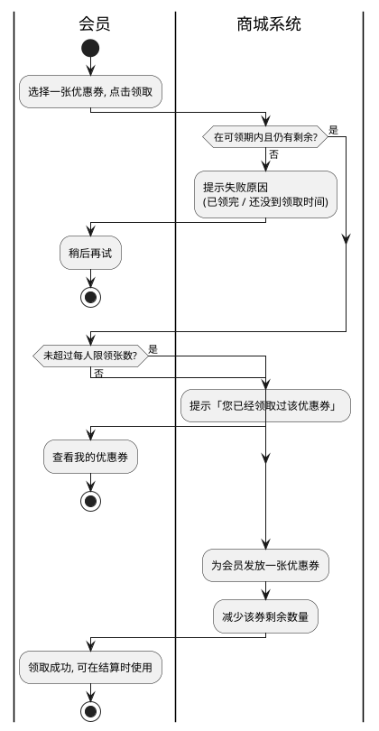

#### UC-P-22 商品收藏

| 项 | 内容 |
| --- | --- |
| 用例编号 | UC-P-22 |
| 用例名称 | 商品收藏 |
| 主参与者 | 会员 |
| 关联功能点 | 1.5.4 |
| 关联需求 | FR-UMS-08 |
| 前置条件 | 会员已登录 |
| 后置条件 | 收藏列表更新 |

**简要说明**：会员把感兴趣的商品加入收藏，便于日后查找与比较；可查看收藏列表、取消收藏或清空。

**基本流**

1. 会员在商品详情页点击收藏。
2. 系统记录该商品到会员的收藏列表（重复收藏不产生重复记录）。
3. 会员在「我的收藏」中查看已收藏的商品。
4. 会员可取消单个收藏或清空收藏列表。

**备选流与异常**

| 触发条件 | 系统响应 |
| --- | --- |
| 重复收藏同一商品 | 提示已收藏 |
| 收藏的商品已下架或被删除 | 见「待确认的业务规则」 |
| 收藏列表为空 | 展示空列表 |

**待确认的业务规则**

- 收藏时的商品名称与价格是「收藏时的快照」，商品改价后收藏列表是否应同步？

#### UC-P-23 品牌关注

| 项 | 内容 |
| --- | --- |
| 用例编号 | UC-P-23 |
| 用例名称 | 品牌关注 |
| 主参与者 | 会员 |
| 关联功能点 | 1.5.3 |
| 关联需求 | FR-UMS-08 |
| 前置条件 | 会员已登录 |
| 后置条件 | 关注列表更新 |

**简要说明**：会员关注品牌，便于获取该品牌的新品与活动信息；可查看关注列表、取消关注或清空。

**基本流**

1. 会员在品牌专区或商品页点击关注品牌。
2. 系统记录该品牌到会员的关注列表。
3. 会员在「我的关注」中查看已关注的品牌。
4. 会员可取消单个关注或清空关注列表。

**备选流与异常**

| 触发条件 | 系统响应 |
| --- | --- |
| 重复关注同一品牌 | 提示已关注 |
| 品牌已删除或已停用 | 见「待确认的业务规则」 |
| 关注列表为空 | 展示空列表 |

**待确认的业务规则**

- 关注的品牌被删除后，关注列表中的该项应如何处理？

#### UC-P-24 浏览记录

| 项 | 内容 |
| --- | --- |
| 用例编号 | UC-P-24 |
| 用例名称 | 浏览记录 |
| 主参与者 | 会员 |
| 关联功能点 | 1.5.5 |
| 关联需求 | FR-UMS-08 |
| 前置条件 | 会员已登录 |
| 后置条件 | 浏览足迹被记录；删除或清空后相应记录消失 |

**简要说明**：系统记录会员浏览过的商品，供会员回溯查找；会员可查看、删除单条或清空全部浏览记录。

**基本流**

1. 会员进入某个商品详情页。
2. 系统记录一条浏览足迹（商品、时间）。
3. 会员进入「我的足迹」按时间倒序查看浏览过的商品。
4. 会员可删除某几条记录或清空全部。

**备选流与异常**

| 触发条件 | 系统响应 |
| --- | --- |
| 同一商品重复浏览 | 见「待确认的业务规则」 |
| 浏览记录为空 | 展示空列表 |
| 未选择要删除的记录 | 提示先选择记录 |

**待确认的业务规则**

- 同一商品多次浏览，是合并为一条并更新时间，还是保留多条记录？

#### UC-P-25 查看会员信息

| 项 | 内容 |
| --- | --- |
| 用例编号 | UC-P-25 |
| 用例名称 | 查看会员信息 |
| 主参与者 | 会员 |
| 关联功能点 | 1.4.4 |
| 关联需求 | FR-UMS-02、FR-UMS-07、NFR-PERF-02 |
| 前置条件 | 会员已登录 |
| 后置条件 | 无（只读） |

**简要说明**：会员查看自己的账号资料，包括用户名、手机号、会员等级等，是会员中心首页的数据来源。

**基本流**

1. 会员进入会员中心。
2. 系统展示该会员的账号资料。
3. 会员可据此进入收货地址、优惠券、收藏、关注、足迹等子功能。

**备选流与异常**

| 触发条件 | 系统响应 |
| --- | --- |
| 登录状态已失效 | 提示重新登录 |

**待确认的业务规则**

- 会员中心是否应展示会员等级名称与对应特权？
- 是否应展示消费金额、订单数等会员统计信息？

---

---

### 3.3 后台管理用例（UC-A）

> 后台用例的共同特征：以「管理员」为主参与者，操作对象是商城的基础数据与运营内容；管理员能看到哪些菜单、能执行哪些操作，由其被分配的角色决定。本节只描述业务行为，实现口径见《[需求分析-实现对照](./需求分析-实现对照.md)》第三章。

#### UC-A-01 管理员登录

| 项 | 内容 |
| --- | --- |
| 用例编号 | UC-A-01 |
| 用例名称 | 管理员登录 |
| 主参与者 | 管理员 |
| 关联功能点 | 2.1.1、4.1 |
| 关联需求 | FR-UMS-01、FR-UMS-09、NFR-SEC-01、NFR-SEC-04 |
| 前置条件 | 已注册后台账号且账号处于启用状态 |
| 后置条件 | 管理员获得登录状态与本次登录可见的功能范围；记录一条登录记录 |

**简要说明**：管理员登录后台。登录入口与前台会员共用，系统按使用者类型分流到后台账号体系。登录成功后，系统依据该管理员所属角色，确定其在本次登录中可使用的菜单与操作权限。

**基本流**

1. 管理员输入账号与密码，提交登录。
2. 系统验证身份，并检查账号是否被停用。
3. 系统按该管理员的角色，汇总其可使用的菜单与操作权限。
4. 系统建立登录状态，记录本次登录时间。
5. 系统进入后台首页，左侧导航只展示该管理员有权使用的菜单。

**备选流与异常**

| 触发条件 | 系统响应 |
| --- | --- |
| 账号不存在 / 密码错误 / 账号被停用 | 分别提示对应原因 |
| 账号未分配任何角色 | 可登录但后台无可用菜单 |
| 登录状态过期 | 提示重新登录 |

**待确认的业务规则**

- 角色或权限调整后，是否需要**重新登录**才对已登录的管理员生效？现有行为是需要重新登录。
- 登录失败是否应记录审计记录？现有行为是仅记录成功的登录。

**泳道图**

```plantuml
@startuml
skinparam shadowing false
skinparam defaultFontName "Microsoft YaHei"

|管理员|
start
:输入后台账号与密码, 提交登录;
|商城系统|
:验证身份并检查账号状态;
if (账号存在、启用且密码正确?) then (是)
  :按所属角色汇总可用菜单与操作权限;
  :建立登录状态并记录登录记录;
  |管理员|
  :进入后台, 只见有权使用的菜单;
else (否)
  |商城系统|
  :提示失败原因
  (找不到该用户 / 密码不正确 / 账号已禁用);
  |管理员|
  :重新输入;
endif
stop
@enduml
```

---

#### UC-A-02 维护管理员账号

| 项 | 内容 |
| --- | --- |
| 用例编号 | UC-A-02 |
| 用例名称 | 维护管理员账号 |
| 关联功能点 | 2.1.1 |
| 关联需求 | FR-UMS-09、FR-UMS-10 |
| 前置条件 | 管理员已登录且具备账号管理权限 |
| 后置条件 | 管理员账号被新增、修改、停用或删除；删除后其角色关联同步清理 |

**简要说明**：系统管理员维护后台账号：注册新账号、修改资料、重置密码、启用 / 停用、删除，以及为账号分配角色。

**基本流**

1. 管理员进入账号管理，按用户名或姓名查询账号。
2. 管理员新增账号，填写用户名、姓名等资料并设置初始密码。
3. 管理员为账号分配一个或多个角色，或调整已有角色。
4. 管理员可修改账号资料、重置密码、启用 / 停用账号。
5. 管理员可删除不再使用的账号。

**备选流与异常**

| 触发条件 | 系统响应 |
| --- | --- |
| 用户名已存在 | 见「待确认的业务规则」 |
| 删除账号 | 该账号已有的角色关联与登录记录应如何处理？ |
| 修改自己的账号 | 是否允许停用或删除自己？ |
| 账号已被引用为操作人 | 见「待确认的业务规则」 |

**待确认的业务规则**

- 用户名是否要求全局唯一？现有行为不强制，可能出现同名账号。
- 账号状态是否只允许「启用 / 停用」两种取值？现有行为可写入其它取值。
- 重置他人密码是否需要额外校验操作人身份？

#### UC-A-03 维护角色与授权

| 项 | 内容 |
| --- | --- |
| 用例编号 | UC-A-03 |
| 用例名称 | 维护角色与授权 |
| 关联功能点 | 2.1.2 |
| 关联需求 | FR-UMS-09 |
| 前置条件 | 管理员已登录且具备角色管理权限 |
| 后置条件 | 角色及其菜单、操作权限的授权关系更新 |

**简要说明**：管理员定义角色，并为角色分配可见菜单与可用操作权限。角色是权限分配的最小单位，管理员账号通过角色获得权限。

**基本流**

1. 管理员进入角色管理，查询已有角色。
2. 管理员新增角色，填写角色名与描述。
3. 管理员为该角色勾选可见菜单。
4. 管理员为该角色勾选可用操作权限。
5. 管理员可修改角色信息、启用 / 停用角色或删除角色。
6. 管理员可查看某角色当前已分配的菜单与权限。

**备选流与异常**

| 触发条件 | 系统响应 |
| --- | --- |
| 角色仍被管理员账号使用 | 见「待确认的业务规则」 |
| 角色被停用 | 见「待确认的业务规则」 |
| 未勾选任何菜单 | 该角色登录后后台无可用菜单 |

**待确认的业务规则**

- 删除仍被账号使用的角色，应如何处置这些账号？
- 角色「停用」是否应使该角色下的权限立即失效？现有行为是不影响已有权限。
- 菜单只影响导航可见性，操作权限才决定能否执行——该区别是否需要在界面上向运营说明？

#### UC-A-04 维护后台菜单

| 项 | 内容 |
| --- | --- |
| 用例编号 | UC-A-04 |
| 用例名称 | 维护后台菜单 |
| 关联功能点 | 2.1.3 |
| 关联需求 | FR-UMS-11 |
| 前置条件 | 管理员已登录且具备菜单管理权限 |
| 后置条件 | 后台导航菜单更新 |

**简要说明**：管理员维护后台左侧导航菜单，支持多级父子结构，可控制菜单的显示与隐藏。

**基本流**

1. 管理员以树形结构查看后台全部菜单。
2. 管理员新增菜单，指定上级菜单、名称、图标与排序。
3. 管理员可修改、删除菜单，或调整其显示状态。
4. 系统按层级重新组织菜单树。

**备选流与异常**

| 触发条件 | 系统响应 |
| --- | --- |
| 上级菜单被删除 | 其下级菜单应如何处理？ |
| 调整上级菜单的层级 | 下级菜单的层级是否同步调整？ |
| 未指定上级菜单 | 视为一级菜单 |

**待确认的业务规则**

- 删除父级菜单时，其下级菜单应级联删除还是提升为一级？
- 菜单调整层级后，下级菜单的层级是否需要同步刷新？

#### UC-A-05 维护操作权限与分类

| 项 | 内容 |
| --- | --- |
| 用例编号 | UC-A-05 |
| 用例名称 | 维护操作权限与分类 |
| 关联功能点 | 2.1.4 |
| 关联需求 | FR-UMS-09、NFR-SEC-02 |
| 前置条件 | 管理员已登录且具备权限管理权限 |
| 后置条件 | 可授予的操作权限及其分类更新 |

**简要说明**：管理员维护「可授予的操作权限」清单（如「商品品牌管理」「订单管理」）及其分类。该清单是 UC-A-03 分配权限时的候选项来源。

**基本流**

1. 管理员查看权限分类与各分类下的操作权限。
2. 管理员新增操作权限，指定名称、所属分类与说明。
3. 管理员可修改、删除操作权限，或调整其分类。
4. 管理员维护权限分类（新增、修改、删除）。

**备选流与异常**

| 触发条件 | 系统响应 |
| --- | --- |
| 删除仍被角色使用的操作权限 | 见「待确认的业务规则」 |
| 同一操作权限被重复登记 | 见「待确认的业务规则」 |

**待确认的业务规则**

- 删除已授予角色的操作权限后，对应功能是变为「所有人可用」还是「所有人不可用」？该差异直接影响安全，需明确。

#### UC-A-06 使权限变更立即生效

| 项 | 内容 |
| --- | --- |
| 用例编号 | UC-A-06 |
| 用例名称 | 使权限变更立即生效 |
| 关联功能点 | 2.1.4.7 |
| 关联需求 | NFR-SEC-02、NFR-SEC-03 |
| 前置条件 | 管理员已登录且已修改角色或操作权限配置 |
| 后置条件 | 最新的权限配置对访问控制生效 |

**简要说明**：管理员在调整角色或操作权限后，触发一次「使权限配置生效」的操作，让系统重新加载最新的授权关系。

**基本流**

1. 管理员完成角色或操作权限的调整。
2. 管理员触发「使权限配置生效」。
3. 系统按最新的授权关系重建权限配置。
4. 系统提示生效成功。

**备选流与异常**

| 触发条件 | 系统响应 |
| --- | --- |
| 系统尚未完成启动 | 见「待确认的业务规则」 |
| 配置重建过程中有请求进入 | 见「待确认的业务规则」 |

**待确认的业务规则**

- 权限配置是否应在系统启动时自动加载，而不依赖人工触发？现有行为需要人工触发或由若干管理动作间接触发。
- 配置重建是否应保证「切换过程不影响正在进行的请求」，避免出现短暂的权限放行窗口？
- 权限配置是否应设置有效期，避免长期使用陈旧规则？

#### UC-A-07 维护会员等级

| 项 | 内容 |
| --- | --- |
| 用例编号 | UC-A-07 |
| 用例名称 | 维护会员等级 |
| 关联功能点 | 2.7 |
| 关联需求 | FR-UMS-02 |
| 前置条件 | 管理员已登录且具备会员等级查看权限 |
| 后置条件 | 无（只读） |

**简要说明**：管理员查看会员等级配置，包括各等级的成长值门槛与专属特权（免运费、签到、评价奖励、专享活动、会员价、生日特权等）。会员注册时会自动归入默认等级。

**基本流**

1. 管理员进入会员等级。
2. 系统按筛选条件展示会员等级列表及其成长值门槛与特权。

**备选流与异常**

| 触发条件 | 系统响应 |
| --- | --- |
| 不指定筛选条件 | 提示条件必填（见「待确认的业务规则」） |
| 无匹配等级 | 展示空列表 |

**待确认的业务规则**

- 会员等级目前**只能查看，不能新增与修改**，等级配置变更需人工调整数据。是否需要提供维护功能？
- 前台会员中心是否应展示等级名称与特权明细？

#### UC-A-08 维护商品

| 项 | 内容 |
| --- | --- |
| 用例编号 | UC-A-08 |
| 用例名称 | 维护商品 |
| 关联功能点 | 2.4.1 |
| 关联需求 | FR-PMS-02 ~ FR-PMS-09 |
| 前置条件 | 管理员已登录且具备商品管理权限；分类、品牌、属性已先行配置 |
| 后置条件 | 商品及其规格、属性、价格策略、图文详情被保存 |

**简要说明**：商品是商城的核心基础数据。运营在此完成一次完整的商品录入：基本信息、图文详情、规格与库存、商品属性、价格策略（会员价、阶梯价、满减）、所属品牌与分类，以及商品图片。

**基本流（发布商品）**

1. 管理员进入商品管理，点击发布商品。
2. 管理员填写商品基本信息：名称、货号、分类、品牌、卖点、图文详情。
3. 管理员上传商品图片与详情图。
4. 管理员添加规格（如颜色、容量），并逐规格设置价格与库存。
5. 管理员设置商品属性值（规格值与参数值）。
6. 管理员选择促销类型，并配置相应的会员价、阶梯价或满减规则。
7. 管理员设置商品状态：是否上架、是否设为新品、是否推荐。
8. 系统保存商品及其全部关联配置。

**基本流（编辑商品）**

1. 管理员在商品列表中选择商品进入编辑。
2. 系统回显该商品的全部配置。
3. 管理员修改后保存；系统按修改后的内容整体更新。

**基本流（查询商品）**

1. 管理员按名称、货号、品牌、分类或状态查询商品。
2. 系统分页展示符合条件的商品。

**备选流与异常**

| 触发条件 | 系统响应 |
| --- | --- |
| 必填项未填写（如商品名称、货号） | 保存失败并提示補全 |
| 未添加任何规格 | 该商品无可选规格，按单一价格售卖 |
| 规格价格或库存为空 | 保存失败并提示 |
| 编辑时未回传原有的价格策略列表 | 见「待确认的业务规则」 |
| 同时编辑同一商品 | 见「待确认的业务规则」 |

**待确认的业务规则**

- 编辑商品时若未回传原有的会员价 / 阶梯价 / 满减列表，是「清空该策略」还是「保持原值」？现有行为是清空，存在误删风险。
- 商品名称与货号是否必填？现有行为仅由数据层面约束。
- 促销时间窗口与限购数量是否需要生效？现有行为是配置了但不参与计算。

**泳道图**

```plantuml
@startuml
skinparam shadowing false
skinparam defaultFontName "Microsoft YaHei"

|运营人员|
start
:进入商品管理, 点击发布商品;
:填写基本信息 (名称 / 货号 / 分类 / 品牌 / 卖点);
:上传商品图片与详情图;
:添加规格并逐规格设置价格与库存;
:设置商品属性值 (规格值与参数值);
:选择促销类型并配置价格策略
(会员价 / 阶梯价 / 满减);
:设置商品状态 (上架 / 新品 / 推荐);
:提交保存;
|商城系统|
if (必填项完整且关联数据有效?) then (是)
  :保存商品及其全部关联配置;
  |运营人员|
  :商品出现在商品列表中;
else (否)
  |商城系统|
  :保存失败, 提示缺失或无效项;
  |运营人员|
  :补全后重新提交;
endif
stop
@enduml
```

---

#### UC-A-09 商品批量状态流转

| 项 | 内容 |
| --- | --- |
| 用例编号 | UC-A-09 |
| 用例名称 | 商品批量状态流转 |
| 关联功能点 | 2.4.1.7 ~ 2.4.1.10 |
| 关联需求 | FR-PMS-05 |
| 前置条件 | 管理员已登录且具备商品管理权限 |
| 后置条件 | 所选商品的目标状态被更新 |

**简要说明**：运营对多件商品一次性执行状态变更：批量上架 / 下架、设为推荐、设为新品、删除商品。

**基本流**

1. 管理员在商品列表中勾选多件商品。
2. 管理员选择要执行的操作（上架 / 下架 / 推荐 / 新品 / 删除）。
3. 系统批量更新所选商品的状态。
4. 系统提示更新成功的商品数量。

**备选流与异常**

| 触发条件 | 系统响应 |
| --- | --- |
| 未勾选任何商品 | 提示先选择商品 |
| 未通过审核的商品执行上架 | 见「待确认的业务规则」 |
| 删除商品 | 见「待确认的业务规则」 |
| 部分商品更新失败 | 见「待确认的业务规则」 |

**待确认的业务规则**

- 是否强制「先审核后上架」？现有行为允许未审核商品直接上架。
- 商品删除是「从列表移除」还是「彻底不可恢复」？其规格、属性、价格策略是否一并处理？
- 批量操作是否要求「全部成功或全部失败」？现有行为可能出现部分成功。

#### UC-A-10 审核商品

| 项 | 内容 |
| --- | --- |
| 用例编号 | UC-A-10 |
| 用例名称 | 审核商品 |
| 关联功能点 | 2.4.1.6 |
| 关联需求 | FR-PMS-05、FR-PMS-09 |
| 前置条件 | 管理员已登录且具备商品审核权限 |
| 后置条件 | 所选商品的审核状态被更新，并留下审核结果 |

**简要说明**：运营对提交的商品进行审核，给出通过或不通过的结论与审核意见。

**基本流**

1. 管理员勾选待审核商品。
2. 管理员选择审核结论并填写审核意见。
3. 系统更新商品的审核状态，并记录审核结果。

**备选流与异常**

| 触发条件 | 系统响应 |
| --- | --- |
| 审核意见过长 | 保存失败，提示超出长度限制 |
| 未选择审核结论 | 提示先选择结论 |

**待确认的业务规则**

- 审核人是否需要记录为真实操作人？现有行为记录的是固定占位人。
- 审核记录是否需要提供给运营查看？现有行为是有记录但无查看入口（见 1.3 节 H-10）。

#### UC-A-11 维护商品规格库存

| 项 | 内容 |
| --- | --- |
| 用例编号 | UC-A-11 |
| 用例名称 | 维护商品规格库存 |
| 关联功能点 | 2.4.2 |
| 关联需求 | FR-PMS-03、NFR-PERF-04 |
| 前置条件 | 管理员已登录且具备商品管理权限 |
| 后置条件 | 各规格的库存被更新 |

**简要说明**：运营按商品查看各规格的当前库存，并批量调整库存数量，用于补货或盘点。

**基本流**

1. 管理员选择商品，查看其各规格的库存列表。
2. 管理员修改各规格的库存数量。
3. 系统批量保存库存。

**备选流与异常**

| 触发条件 | 系统响应 |
| --- | --- |
| 库存填写为负数 | 见「待确认的业务规则」 |
| 保存时该商品有未付款订单占用库存 | 见「待确认的业务规则」 |
| 部分规格保存失败 | 见「待确认的业务规则」 |

**待确认的业务规则**

- 保存库存时，是否应保留已被未付款订单占用的库存？现有行为会把占用数量一并清零，可能导致超卖。
- 库存是否允许为负数？
- 批量保存是否要求「全部成功或全部失败」？

#### UC-A-12 维护商品分类

| 项 | 内容 |
| --- | --- |
| 用例编号 | UC-A-12 |
| 用例名称 | 维护商品分类 |
| 关联功能点 | 2.2.3 |
| 关联需求 | FR-PMS-01 |
| 前置条件 | 管理员已登录且具备分类管理权限 |
| 后置条件 | 分类结构、分类的显示状态与筛选属性更新 |

**简要说明**：运营维护两级商品分类，设置分类在导航栏与前台是否显示，并为分类指定可用于前台筛选的商品属性。

**基本流**

1. 管理员以树形结构查看一级与二级分类。
2. 管理员新增分类，指定上级分类、名称、排序与图标。
3. 管理员为分类勾选筛选属性。
4. 管理员可修改分类，或批量调整导航栏显示与显示状态。
5. 管理员可删除不再使用的分类。

**备选流与异常**

| 触发条件 | 系统响应 |
| --- | --- |
| 删除仍有下级分类的分类 | 见「待确认的业务规则」 |
| 删除仍有商品引用的分类 | 见「待确认的业务规则」 |
| 把分类的上级设为其自身或下级 | 见「待确认的业务规则」 |
| 未指定上级分类 | 视为一级分类 |

**待确认的业务规则**

- 删除分类时，其下级分类与在售商品的归属应如何处理？
- 分类层级调整后，下级分类的层级是否同步刷新？
- 分类是否允许两级以上？现有实现只支持两级，与「多级分类」的表述是否一致？

#### UC-A-13 维护商品属性

| 项 | 内容 |
| --- | --- |
| 用例编号 | UC-A-13 |
| 用例名称 | 维护商品属性 |
| 关联功能点 | 2.2.2 |
| 关联需求 | FR-PMS-04 |
| 前置条件 | 管理员已登录且具备属性管理权限；属性分类已先行创建 |
| 后置条件 | 商品属性及其筛选规则更新 |

**简要说明**：运营维护两类商品属性：**规格**（参与规格组合，如颜色、容量）与**参数**（静态描述，如屏幕尺寸）。属性可设置录入方式（手工录入或从列表选取）、选择方式（单选 / 多选）以及是否作为前台筛选条件。

**基本流**

1. 管理员选择属性分类，查看其下的规格与参数列表。
2. 管理员新增属性，指定名称、类型（规格 / 参数）、录入方式与可选值。
3. 管理员设置该属性是否用于前台筛选，以及检索方式（关键字检索 / 范围检索）。
4. 管理员可修改、删除属性。
5. 管理员按商品分类查看该分类已关联的筛选属性。

**备选流与异常**

| 触发条件 | 系统响应 |
| --- | --- |
| 从列表选取但未维护可选值 | 见「待确认的业务规则」 |
| 删除仍被商品使用的属性 | 见「待确认的业务规则」 |
| 删除属性分类下的属性 | 该分类的属性数量应同步减少 |

**待确认的业务规则**

- 属性名称、类型是否为必填？现有行为未做校验。
- 选择「从列表选取」但未维护候选值时，商品录入阶段如何处理？
- 删除正在被商品使用的属性，对已有商品有何影响？

#### UC-A-14 维护属性分类

| 项 | 内容 |
| --- | --- |
| 用例编号 | UC-A-14 |
| 用例名称 | 维护属性分类 |
| 关联功能点 | 2.2.1 |
| 关联需求 | FR-PMS-04 |
| 前置条件 | 管理员已登录且具备属性管理权限 |
| 后置条件 | 属性分类更新 |

**简要说明**：属性分类是商品属性的归集单位（如「手机」「服装」），一个属性分类下可挂多个规格与参数。

**基本流**

1. 管理员查看属性分类列表及其下的属性数量。
2. 管理员新增属性分类，填写分类名称。
3. 管理员可修改、删除属性分类。
4. 管理员可查看某分类下的全部属性。

**备选流与异常**

| 触发条件 | 系统响应 |
| --- | --- |
| 删除仍有属性的属性分类 | 见「待确认的业务规则」 |
| 未填写分类名称 | 见「待确认的业务规则」 |

**待确认的业务规则**

- 删除属性分类时，其下属性应级联删除还是保留？
- 属性分类名称是否必填？

#### UC-A-15 维护品牌

| 项 | 内容 |
| --- | --- |
| 用例编号 | UC-A-15 |
| 用例名称 | 维护品牌 |
| 关联功能点 | 2.3 |
| 关联需求 | FR-PMS-02 |
| 前置条件 | 管理员已登录且具备品牌管理权限 |
| 后置条件 | 品牌信息更新；已在售商品所属品牌信息同步 |

**简要说明**：运营维护商品品牌，设置品牌名称、首字母、Logo、品牌故事，以及是否在前台显示、是否为生产厂家。

**基本流**

1. 管理员进入品牌管理，按名称查询品牌或查看全部品牌。
2. 管理员新增品牌，填写名称、首字母、Logo 与品牌故事。
3. 管理员可修改品牌信息，或批量设置显示状态与生产厂家状态。
4. 管理员可单个或批量删除品牌。
5. 品牌改名后，系统同步更新归属该品牌的商品所显示的品牌名称。

**备选流与异常**

| 触发条件 | 系统响应 |
| --- | --- |
| 删除仍有商品引用的品牌 | 见「待确认的业务规则」 |
| 品牌被设置为不显示 | 前台不再展示该品牌，但商品仍可售卖 |
| 品牌改名 | 首页运营位中的品牌名称是否同步？见「待确认的业务规则」 |

**待确认的业务规则**

- 删除品牌时，归属该品牌的商品应如何处理？
- 品牌改名后，首页推荐品牌位中显示的名称是否应同步更新？现有行为是不同步。
- 品牌是否允许重名？

#### UC-A-16 查询订单

| 项 | 内容 |
| --- | --- |
| 用例编号 | UC-A-16 |
| 用例名称 | 查询订单 |
| 关联功能点 | 2.5.1、2.5.2 |
| 关联需求 | FR-OMS-05、FR-OMS-06 |
| 前置条件 | 管理员已登录且具备订单管理权限 |
| 后置条件 | 无（只读） |

**简要说明**：运营按收货人、订单号、订单状态、下单时间等条件查询订单；进入详情可查看订单信息、商品明细与操作记录。

**基本流**

1. 管理员进入订单管理，按条件查询订单。
2. 系统分页展示符合条件的订单。
3. 管理员选择订单查看详情，包括订单金额构成、收货人信息、商品明细与历次操作记录。

**备选流与异常**

| 触发条件 | 系统响应 |
| --- | --- |
| 不指定任何条件 | 展示全部未删除订单 |
| 无匹配订单 | 展示空列表 |
| 订单已删除 | 见「待确认的业务规则」 |

**待确认的业务规则**

- 已删除订单是否仍应允许查看详情？现有行为是列表不可见但详情仍可访问。

#### UC-A-17 订单发货

| 项 | 内容 |
| --- | --- |
| 用例编号 | UC-A-17 |
| 用例名称 | 订单发货 |
| 关联功能点 | 2.5.3 |
| 关联需求 | FR-OMS-04、FR-OMS-05、FR-OMS-06 |
| 前置条件 | 管理员已登录且具备订单管理权限；订单处于待发货状态 |
| 后置条件 | 订单转为已发货，记录物流公司与物流单号，并留下操作记录 |

**简要说明**：会员付款后，运营填写物流信息完成发货，订单流转为已发货。

**基本流**

1. 管理员在订单列表中勾选待发货订单。
2. 管理员填写物流公司与物流单号，提交发货。
3. 系统将订单置为已发货，记录发货时间与物流信息。
4. 系统为该次操作留下记录。
5. 会员在前台看到订单已发货与物流信息。

**备选流与异常**

| 触发条件 | 系统响应 |
| --- | --- |
| 订单不是待发货状态 | 该订单发货失败 |
| 未勾选任何订单 | 提示先选择订单 |
| 部分订单状态不符 | 见「待确认的业务规则」 |

**待确认的业务规则**

- 批量发货时部分订单状态不符，应整体失败还是部分成功？
- 操作记录中是否应记录真实的操作人？现有行为记录的是固定占位人。
- 状态不符的订单是否也应留下「已发货」记录？现有行为会留下与事实不符的记录。

**泳道图**

```plantuml
@startuml
skinparam shadowing false
skinparam defaultFontName "Microsoft YaHei"

|会员|
start
:完成付款, 订单进入待发货;
|运营人员|
:在订单列表中勾选待发货订单;
:填写物流公司与物流单号, 提交发货;
|商城系统|
if (订单处于待发货状态?) then (是)
  |商城系统|
  :订单置为已发货;
  :记录发货时间与物流信息;
  :留下该次操作记录;
  |会员|
  :看到订单已发货与物流信息;
else (否)
  |商城系统|
  :该订单发货失败;
  |运营人员|
  :核对订单状态后重新处理;
endif
stop
@enduml
```

#### UC-A-18 关闭订单

| 项 | 内容 |
| --- | --- |
| 用例编号 | UC-A-18 |
| 用例名称 | 关闭订单 |
| 关联功能点 | 2.5.7 |
| 关联需求 | FR-OMS-04 |
| 前置条件 | 管理员已登录且具备订单管理权限 |
| 后置条件 | 订单转为已关闭，并留下操作记录 |

**简要说明**：运营关闭订单，用于处理异常交易（如缺货、客户要求取消、恶意订单）。

**基本流**

1. 管理员勾选要关闭的订单。
2. 管理员填写关闭原因，提交。
3. 系统将订单置为已关闭，并留下操作记录。

**备选流与异常**

| 触发条件 | 系统响应 |
| --- | --- |
| 订单已发货或已完成 | 见「待确认的业务规则」 |
| 未勾选任何订单 | 提示先选择订单 |
| 订单已付款 | 见「待确认的业务规则」 |

**待确认的业务规则**

- 哪些状态的订单允许关闭？现有行为对任意状态都允许关闭。
- 关闭已付款订单时，是否需要触发退款、释放库存、退回优惠券与积分？
- 关闭后是否允许重新开启？现有行为是单向终态。

#### UC-A-19 修改订单信息

| 项 | 内容 |
| --- | --- |
| 用例编号 | UC-A-19 |
| 用例名称 | 修改订单信息 |
| 关联功能点 | 2.5.4 ~ 2.5.6 |
| 关联需求 | FR-OMS-03、FR-OMS-05 |
| 前置条件 | 管理员已登录且具备订单管理权限 |
| 后置条件 | 订单的收货人信息 / 费用信息 / 备注被更新，并留下操作记录 |

**简要说明**：运营在必要时修改订单：更换收货人信息（如客户提供新地址）、调整订单费用（如改运费、给折扣）、添加内部备注。

**基本流**

1. 管理员打开订单详情，选择修改收货人 / 修改费用 / 添加备注。
2. 管理员修改相应内容并提交。
3. 系统更新订单，并留下一条操作记录。

**备选流与异常**

| 触发条件 | 系统响应 |
| --- | --- |
| 修改费用为负数 | 见「待确认的业务规则」 |
| 修改已付款订单的费用 | 见「待确认的业务规则」 |
| 想清空某项内容 | 见「待确认的业务规则」 |

**待确认的业务规则**

- 修改订单费用后，应付金额是否应自动重算？现有行为是不重算。
- 运费与折扣是否允许为负数？
- 操作记录中的「操作后状态」是否应取订单真实状态，而非由操作人填写？

#### UC-A-20 删除订单

| 项 | 内容 |
| --- | --- |
| 用例编号 | UC-A-20 |
| 用例名称 | 删除订单 |
| 关联功能点 | 2.5.8 |
| 关联需求 | FR-OMS-04 |
| 前置条件 | 管理员已登录且具备订单管理权限 |
| 后置条件 | 订单从后台订单列表中移除 |

**简要说明**：运营把订单从后台列表中移除，用于清理测试单或无效单。

**基本流**

1. 管理员勾选要移除的订单。
2. 系统将所选订单从列表中移除。

**备选流与异常**

| 触发条件 | 系统响应 |
| --- | --- |
| 未勾选任何订单 | 提示先选择订单 |
| 删除待付款 / 待发货订单 | 见「待确认的业务规则」 |
| 删除后查看详情 | 见「待确认的业务规则」 |

**待确认的业务规则**

- 是否限制只能移除已完成 / 已关闭订单？现有行为对任意状态均可移除。
- 移除后是否应允许查看详情？现有行为是详情仍可访问，与前台口径不一致。

#### UC-A-21 处理退货申请

| 项 | 内容 |
| --- | --- |
| 用例编号 | UC-A-21 |
| 用例名称 | 处理退货申请 |
| 关联功能点 | 2.6.1 |
| 关联需求 | FR-OMS-07 |
| 前置条件 | 管理员已登录且具备退货管理权限；会员已提交退货申请 |
| 后置条件 | 退货申请转为退货中 / 已完成 / 已拒绝，记录处理人与处理时间 |

**简要说明**：运营处理会员提交的退货申请：同意退货并给出退货收货地址与退款金额，或拒绝并说明原因；收到退货后再确认完成。

**基本流（同意退货）**

1. 管理员查询待处理的退货申请。
2. 管理员查看申请详情（商品、原因、凭证图片、会员填写的退款金额）。
3. 管理员选择同意，确认退款金额与退货收货地址，填写处理备注。
4. 系统将申请置为退货中，会员可按地址寄回商品。

**基本流（完成退货）**

1. 管理员收到退回的商品并核对无误。
2. 管理员确认完成退货，填写收货备注与收货人。
3. 系统将申请置为已完成。

**基本流（拒绝退货）**

1. 管理员选择拒绝，填写拒绝原因。
2. 系统将申请置为已拒绝，会员可见拒绝原因。

**备选流与异常**

| 触发条件 | 系统响应 |
| --- | --- |
| 申请已处理过 | 见「待确认的业务规则」 |
| 未填写处理备注 | 见「待确认的业务规则」 |
| 退款金额与订单实际成交价不符 | 见「待确认的业务规则」 |

**待确认的业务规则**

- 退货完成后是否需要退款、回补库存、更新订单状态？现有行为均不触发。
- 是否允许对已完成的申请重新处理（回退到退货中）？现有行为允许。
- 退款金额应以会员填写为准，还是由系统按订单实际成交价核算？
- 处理备注、处理人是否为必填？

**泳道图**

```plantuml
@startuml
skinparam shadowing false
skinparam defaultFontName "Microsoft YaHei"

|会员|
start
:提交退货申请 (见 UC-P-20);
|运营人员|
:查询待处理的退货申请;
:查看申请详情 (商品 / 原因 / 凭证 / 期望退款额);
if (是否同意退货?) then (同意)
  |运营人员|
  :确认退款金额与退货收货地址;
  :填写处理备注;
  |商城系统|
  :申请置为退货中, 会员可按地址寄回;
  |会员|
  :寄回商品;
  |运营人员|
  :收到商品并核对无误;
  :确认完成退货;
  |商城系统|
  :申请置为已完成;
  |会员|
  :看到退货已完成;
else (拒绝)
  |运营人员|
  :填写拒绝原因;
  |商城系统|
  :申请置为已拒绝;
  |会员|
  :看到拒绝原因;
endif
stop
@enduml
```

---

#### UC-A-22 维护退货原因

| 项 | 内容 |
| --- | --- |
| 用例编号 | UC-A-22 |
| 用例名称 | 维护退货原因 |
| 关联功能点 | 2.6.4 |
| 关联需求 | FR-OMS-07 |
| 前置条件 | 管理员已登录且具备退货原因管理权限 |
| 后置条件 | 会员申请退货时可选的原因清单更新 |

**简要说明**：运营维护会员申请退货时可选择的原因项（如「质量问题」「不喜欢」「发错货」），并控制各项是否启用。

**基本流**

1. 管理员查看退货原因列表。
2. 管理员新增原因，填写名称与排序。
3. 管理员可修改、删除原因，或批量启用 / 停用。
4. 前台退货申请页只展示已启用的原因。

**备选流与异常**

| 触发条件 | 系统响应 |
| --- | --- |
| 删除已被历史申请引用的原因 | 见「待确认的业务规则」 |
| 停用某原因 | 新的申请不可选，历史申请不受影响 |
| 名称重复 | 见「待确认的业务规则」 |

**待确认的业务规则**

- 退货原因名称是否要求唯一？
- 删除原因后，历史退货申请中的原因文字是否保留？

#### UC-A-23 配置交易参数

| 项 | 内容 |
| --- | --- |
| 用例编号 | UC-A-23 |
| 用例名称 | 配置交易参数 |
| 关联功能点 | 2.6.2 |
| 关联需求 | FR-OMS-08 |
| 前置条件 | 管理员已登录且具备交易参数配置权限 |
| 后置条件 | 交易参数更新，作用于此后新产生的订单 |

**简要说明**：运营配置与交易流程相关的时间规则：限时购订单的支付时限、普通订单的支付时限、下单后自动确认收货天数、发货后自动完成交易天数、交易完成后自动好评天数。

**基本流**

1. 管理员进入交易参数配置。
2. 系统展示当前参数值。
3. 管理员修改所需参数并保存。
4. 系统更新参数，此后新产生的订单按新参数执行。

**备选流与异常**

| 触发条件 | 系统响应 |
| --- | --- |
| 支付时限填写为 0 或负数 | 见「待确认的业务规则」 |
| 某项参数留空 | 见「待确认的业务规则」 |
| 修改参数 | 存量订单是否受影响？见「待确认的业务规则」 |

**待确认的业务规则**

- 支付时限是否允许为 0 或负数？现有行为允许，会导致订单一经创建即被关闭。
- 参数留空（清空）是否被允许？现有行为会写入空值，可能导致下单流程异常。
- 参数修改是否影响存量订单？现有行为是存量订单沿用下单时的天数。
- 是否只允许维护唯一一套交易参数？现有行为只读取固定的一组。

#### UC-A-24 维护收发货地址簿

| 项 | 内容 |
| --- | --- |
| 用例编号 | UC-A-24 |
| 用例名称 | 维护收发货地址簿 |
| 关联功能点 | 2.6.3 |
| 关联需求 | FR-OMS-09 |
| 前置条件 | 管理员已登录且具备地址簿查看权限 |
| 后置条件 | 无（只读） |

**简要说明**：运营查看公司的收发货地址，其中标记为默认发货地址 / 默认收货地址的记录用于发货与退货收货。该地址簿也是 UC-A-21 处理退货时选择退货收货地址的来源。

**基本流**

1. 管理员进入收发货地址簿。
2. 系统展示全部地址及其默认标记。

**备选流与异常**

| 触发条件 | 系统响应 |
| --- | --- |
| 地址较多 | 见「待确认的业务规则」 |
| 需要新增或修改地址 | 见「待确认的业务规则」 |

**待确认的业务规则**

- 地址簿是否应支持新增、修改与默认地址设置？现有行为只提供查看。
- 地址列表是否需要分页？

---

#### UC-A-25 维护优惠券

| 项 | 内容 |
| --- | --- |
| 用例编号 | UC-A-25 |
| 用例名称 | 维护优惠券 |
| 关联功能点 | 2.8.1 |
| 关联需求 | FR-SMS-01 ~ FR-SMS-03 |
| 前置条件 | 管理员已登录且具备营销管理权限 |
| 后置条件 | 优惠券创建或更新，会员可领取 |

**简要说明**：运营创建优惠券并设定其领取规则与使用规则。使用时系统按购物车金额与适用范围自动判定哪些券可用。

**基本流（创建优惠券）**

1. 管理员进入优惠券管理，点击新增。
2. 管理员填写券名称、类型（全场赠券 / 会员赠券 / 购物赠券 / 注册赠券）与适用平台（全部 / 移动端 / PC）。
3. 管理员设置面额、使用门槛、发行数量、每人限领张数与可领取的日期范围。
4. 管理员设置使用范围：全场通用、指定分类或指定商品；选择后一并勾选具体分类或商品。
5. 管理员设置有效期。
6. 系统保存优惠券，会员可在前台领取。

**基本流（修改 / 删除优惠券）**

1. 管理员查询并选择优惠券。
2. 管理员修改规则后保存；系统按修改后的规则更新券与适用范围。
3. 管理员可删除不再需要的券。

**备选流与异常**

| 触发条件 | 系统响应 |
| --- | --- |
| 未设置发行数量 | 见「待确认的业务规则」 |
| 使用范围改为「全场通用」 | 见「待确认的业务规则」 |
| 删除已有人领取的券 | 见「待确认的业务规则」 |
| 有效期起止设置颠倒 | 见「待确认的业务规则」 |
| 类型 / 平台 / 适用范围填任意值 | 见「待确认的业务规则」 |

**待确认的业务规则**

- 修改优惠券时若未回传运行中的领取数 / 使用数，是否会把这些统计清零？
- 适用范围从「指定商品 / 分类」改为「全场通用」时，原范围是否应自动清除？现有行为是保留，可能造成前台误判。
- 删除已有人领取的券，会员卡包中的券应如何处理？
- 有效期、类型、平台、适用范围是否都应有取值校验？
- 发行数量为 0 时是否等价于「不可领取」？

**泳道图**

```plantuml
@startuml
skinparam shadowing false
skinparam defaultFontName "Microsoft YaHei"

|运营人员|
start
:进入优惠券管理, 点击新增;
:填写名称 / 类型 / 适用平台;
:设置面额 / 使用门槛 / 发行数量 / 每人限领;
:设置可领取日期范围与有效期;
if (使用范围?) then (指定商品)
  |运营人员|
  :勾选参与的商品;
elseif (指定分类) then (指定分类)
  |运营人员|
  :勾选参与的分类;
else (全场通用)
  |运营人员|
  :无需勾选范围;
endif
|商城系统|
:保存优惠券及其适用范围;
|会员|
:可在前台领取 (见 UC-P-21);
stop
@enduml
```

---

#### UC-A-26 查询优惠券领取记录

| 项 | 内容 |
| --- | --- |
| 用例编号 | UC-A-26 |
| 用例名称 | 查询优惠券领取记录 |
| 关联功能点 | 2.8.1.6 |
| 关联需求 | FR-SMS-04 |
| 前置条件 | 管理员已登录且具备营销管理权限 |
| 后置条件 | 无（只读） |

**简要说明**：运营查看优惠券的发放情况：哪些会员领取了哪张券、是否已使用、用于哪一笔订单。

**基本流**

1. 管理员进入领取记录。
2. 管理员按优惠券、使用状态或订单号筛选。
3. 系统分页展示符合条件的领取记录。

**备选流与异常**

| 触发条件 | 系统响应 |
| --- | --- |
| 不指定任何条件 | 展示全部领取记录 |
| 按「已过期」筛选 | 见「待确认的业务规则」 |
| 无匹配记录 | 展示空列表 |

**待确认的业务规则**

- 优惠券「已过期」状态是否由系统自动标记？现有行为无自动标记，按该状态筛选始终为空。

#### UC-A-27 维护限时购活动

| 项 | 内容 |
| --- | --- |
| 用例编号 | UC-A-27 |
| 用例名称 | 维护限时购活动 |
| 关联功能点 | 2.8.5 |
| 关联需求 | FR-SMS-05 |
| 前置条件 | 管理员已登录且具备营销管理权限 |
| 后置条件 | 限时购活动创建或更新 |

**简要说明**：运营创建限时购活动，定义活动的起止日期与上下线状态。活动是限时购的第一层，其下通过「场次」组织每日时段，再由「场次商品」定义具体参与的商品与秒杀价。

**基本流**

1. 管理员进入限时购活动管理，点击新增。
2. 管理员填写活动标题与起止日期。
3. 管理员设置活动上线状态并保存。
4. 系统创建活动，管理员可继续为其配置场次与商品。

**备选流与异常**

| 触发条件 | 系统响应 |
| --- | --- |
| 开始日期晚于结束日期 | 见「待确认的业务规则」 |
| 活动标题为空 | 见「待确认的业务规则」 |
| 活动上线但未配置商品 | 前台展示该场次但无商品 |

**待确认的业务规则**

- 是否需要校验「开始日期 ≤ 结束日期」？现有行为不校验，会导致活动永远不生效。
- 活动标题是否必填？
- 是否需要限制同一时间段内可上线的活动数量？

#### UC-A-28 维护限时购场次

| 项 | 内容 |
| --- | --- |
| 用例编号 | UC-A-28 |
| 用例名称 | 维护限时购场次 |
| 关联功能点 | 2.8.4 |
| 关联需求 | FR-SMS-05 |
| 前置条件 | 管理员已登录且具备营销管理权限 |
| 后置条件 | 每日场次时段更新 |

**简要说明**：运营维护限时购的每日场次（如 10:00–12:00、14:00–16:00），并为每个场次安排参与商品。

**基本流**

1. 管理员查看场次列表。
2. 管理员新增场次，填写场次名称、开始时间与结束时间。
3. 管理员可修改场次、启用 / 停用场次或删除场次。
4. 管理员查看「可选场次」列表，了解每个场次在各活动下已安排的商品数量。

**备选流与异常**

| 触发条件 | 系统响应 |
| --- | --- |
| 场次时段与已有场次重叠 | 见「待确认的业务规则」 |
| 开始时间晚于结束时间 | 见「待确认的业务规则」 |
| 删除仍有商品的场次 | 见「待确认的业务规则」 |

**待确认的业务规则**

- 场次时段是否允许重叠？重叠时前台应展示哪一个？
- 是否需要校验「开始时间 < 结束时间」？
- 场次是全局共用的，还是应归属某个活动？现有行为是全局共用。
- 删除仍有商品的场次时，其商品安排应如何处理？

#### UC-A-29 维护限时购商品

| 项 | 内容 |
| --- | --- |
| 用例编号 | UC-A-29 |
| 用例名称 | 维护限时购商品 |
| 关联功能点 | 2.8.2 |
| 关联需求 | FR-SMS-05 |
| 前置条件 | 管理员已登录且具备营销管理权限；活动与场次已创建 |
| 后置条件 | 场次商品安排更新 |

**简要说明**：运营把商品加入某个活动的某个场次，并为每件商品设置秒杀价、活动数量、每人限购与展示排序。

**基本流**

1. 管理员选择活动与场次，查看该场次已有的商品。
2. 管理员批量选择商品加入该场次。
3. 管理员为每件商品设置秒杀价、活动数量、每人限购与排序。
4. 管理员可修改或移除已加入的商品。

**备选流与异常**

| 触发条件 | 系统响应 |
| --- | --- |
| 未设置秒杀价或活动数量 | 见「待确认的业务规则」 |
| 同一商品在同一场次重复加入 | 见「待确认的业务规则」 |
| 未选择任何商品就提交 | 提示操作失败 |
| 商品未设置限购 | 见「待确认的业务规则」 |

**待确认的业务规则**

- 秒杀价、活动数量、每人限购是否都必填？
- 同一商品能否在同一活动的同一场次中重复出现？
- 秒杀价是否应参与下单计价？见 1.3 节 H-15。
- 秒杀活动的库存与商品日常库存是否为同一份？

#### UC-A-30 维护首页轮播广告

| 项 | 内容 |
| --- | --- |
| 用例编号 | UC-A-30 |
| 用例名称 | 维护首页轮播广告 |
| 关联功能点 | 2.8.3 |
| 关联需求 | FR-SMS-07、NFR-COMPAT-02 |
| 前置条件 | 管理员已登录且具备首页运营权限 |
| 后置条件 | 首页轮播广告更新，会员可在首页看到 |

**简要说明**：运营维护首页轮播广告，可区分投放端（PC 首页 / App 首页），设置广告图、跳转链接、投放时间、排序与上下线状态。

**基本流**

1. 管理员进入轮播广告管理，查看广告列表。
2. 管理员新增广告，填写名称、投放端、广告图、跳转链接、投放起止时间与排序。
3. 管理员设置上线状态并保存。
4. 管理员可修改广告、批量删除、调整上下线状态或排序。
5. 会员在首页看到已上线的广告。

**备选流与异常**

| 触发条件 | 系统响应 |
| --- | --- |
| 新增时未设置上线状态 | 见「待确认的业务规则」 |
| 广告已过投放期 | 见「待确认的业务规则」 |
| 点击量 / 下单数 | 见「待确认的业务规则」 |

**待确认的业务规则**

- 新增广告未设置状态时，是否应在首页展示？现有行为是不展示，容易造成「新增后前台看不到」的困惑。
- 投放起止时间是否应生效？现有行为是不生效，过期广告仍会展示。
- 广告的点击量与下单数是否应统计？现有行为该两项恒为 0 且可被手工改写。
- 广告排序是否应提供独立的排序操作？

#### UC-A-31 维护首页推荐位

| 项 | 内容 |
| --- | --- |
| 用例编号 | UC-A-31 |
| 用例名称 | 维护首页推荐位 |
| 关联功能点 | 2.8.6 |
| 关联需求 | FR-SMS-07 |
| 前置条件 | 管理员已登录且具备首页运营权限 |
| 后置条件 | 首页推荐位更新，会员可在首页看到 |

**简要说明**：运营维护首页的四类推荐位：推荐品牌、新品推荐、人气推荐商品、推荐专题。每类推荐位都支持新增、调整排序、设置推荐状态、删除与查询。

**基本流**

1. 管理员选择要维护的推荐位类型。
2. 管理员批量新增推荐内容（选择品牌 / 商品 / 专题），系统默认为「推荐」状态。
3. 管理员调整各项的排序，排序值越大越靠前。
4. 管理员可批量设置推荐 / 取消推荐，或删除推荐项。
5. 会员在首页看到处于推荐状态的运营位内容。

**备选流与异常**

| 触发条件 | 系统响应 |
| --- | --- |
| 新增后未调整排序 | 各项排序值相同，前台展示顺序不确定 |
| 推荐内容的主数据已删除 | 该条不展示 |
| 重复推荐同一品牌 / 商品 / 专题 | 见「待确认的业务规则」 |
| 未选择任何推荐内容就提交 | 提示操作失败 |

**待确认的业务规则**

- 是否允许同一品牌 / 商品 / 专题重复出现在同一推荐位？
- 排序值相同时，前台展示顺序如何确定？
- 是否需要提供「批量调整排序」的操作？现有行为只能逐条调整。
- 推荐位中记录的名称是否需要与主数据保持一致？现有行为不会自动同步。

**泳道图**

```plantuml
@startuml
skinparam shadowing false
skinparam defaultFontName "Microsoft YaHei"

|运营人员|
start
:选择要维护的推荐位类型
(推荐品牌 / 新品 / 人气推荐 / 推荐专题);
:批量选择推荐内容并提交;
|商城系统|
:保存推荐项, 默认置为推荐状态;
|运营人员|
:逐条调整排序 (值越大越靠前);
:批量设置推荐或取消推荐;
|商城系统|
:更新推荐位内容;
|会员|
:打开首页;
|商城系统|
:展示处于推荐状态且主数据有效的运营位内容;
|会员|
:看到运营配置的推荐内容;
stop
@enduml
```

---

#### UC-A-32 查看商品专题

| 项 | 内容 |
| --- | --- |
| 用例编号 | UC-A-32 |
| 用例名称 | 查看商品专题 |
| 关联功能点 | 2.9.1 |
| 关联需求 | FR-CMS-01、FR-CMS-05 |
| 前置条件 | 管理员已登录且具备内容管理权限 |
| 后置条件 | 无（只读） |

**简要说明**：运营查看商城的商品专题列表与专题详情。专题用于把一组商品按主题组织（如「春季新品」「数码精选」），是重要的内容运营载体。

**基本流**

1. 管理员进入专题管理。
2. 系统展示专题列表，支持按专题名称查询。
3. 管理员查看某专题的内容与其关联的商品。

**备选流与异常**

| 触发条件 | 系统响应 |
| --- | --- |
| 需要新增或编辑专题 | 见「待确认的业务规则」 |
| 需要调整专题的商品 | 见「待确认的业务规则」 |

**待确认的业务规则**

- 专题是否需要新增、编辑、启停与关联商品维护？现有行为只提供查看（见 1.3 节 H-04、H-14）。
- 专题的阅读数、评论数、收藏数等统计是否需要？

#### UC-A-33 查看优选专区

| 项 | 内容 |
| --- | --- |
| 用例编号 | UC-A-33 |
| 用例名称 | 查看优选专区 |
| 关联功能点 | 2.9.2 |
| 关联需求 | FR-CMS-05 |
| 前置条件 | 管理员已登录且具备内容管理权限 |
| 后置条件 | 无（只读） |

**简要说明**：运营查看商城的优选专区列表。优选专区是首页等位置的一种运营推荐位，用于成组展示商品。

**基本流**

1. 管理员进入优选专区。
2. 系统展示全部优选专区。

**备选流与异常**

| 触发条件 | 系统响应 |
| --- | --- |
| 需要新增或编辑优选专区 | 见「待确认的业务规则」 |
| 需要调整专区内的商品 | 见「待确认的业务规则」 |

**待确认的业务规则**

- 优选专区是否需要新增、编辑与商品关联维护？现有行为只提供查看。

#### UC-A-34 上传文件

| 项 | 内容 |
| --- | --- |
| 用例编号 | UC-A-34 |
| 用例名称 | 上传文件 |
| 关联功能点 | 2.10 |
| 关联需求 | — （技术支撑能力） |
| 前置条件 | 管理员已登录 |
| 后置条件 | 文件已上传，可在商品、广告等处引用 |

**简要说明**：运营在维护商品图片、品牌 Logo、专题图、广告图时上传图片文件。系统支持两种存储方式供选择。

**基本流**

1. 运营在需要图片的位置点击上传。
2. 系统返回上传所需的上传凭证。
3. 运营选择本地文件并上传。
4. 系统返回可访问的文件地址，运营保存业务数据时引用该地址。
5. 运营可删除不再使用的文件。

**备选流与异常**

| 触发条件 | 系统响应 |
| --- | --- |
| 文件超出大小限制 | 提示文件过大 |
| 文件格式不支持 | 提示格式不支持 |
| 上传中断 | 提示上传失败，可重新上传 |

**待确认的业务规则**

- 上传文件的格式、大小上限与保存时长是否有统一规定？
- 运营是否应能删除已上传的文件？

---

---

### 3.4 商品搜索用例（UC-S）

> 搜索能力的业务价值是让用户在海量商品中快速找到目标商品。本节只描述业务行为；搜索数据的建立与同步方式见《[需求分析-实现对照](./需求分析-实现对照.md)》第三章。

#### UC-S-01 全量建立商品搜索数据

| 项 | 内容 |
| --- | --- |
| 用例编号 | UC-S-01 |
| 用例名称 | 全量建立商品搜索数据 |
| 主参与者 | 管理员 |
| 关联功能点 | 3.1.1 |
| 关联需求 | NFR-PERF-01 |
| 前置条件 | 商城中已有商品数据 |
| 后置条件 | 当前在售商品可被搜索与筛选 |

**简要说明**：把商城中当前在售的商品一次性建立为可被搜索的数据，使用户能够通过搜索、筛选与推荐找到商品。这是搜索能力可用的前提。

**基本流**

1. 管理员触发全量建立。
2. 系统读取当前在售（已上架且未删除）的全部商品。
3. 系统为这些商品建立可搜索数据。
4. 系统返回本次建立的数据量。

**备选流与异常**

| 触发条件 | 系统响应 |
| --- | --- |
| 当前无可售商品 | 不建立任何数据，提示数量为 0 |
| 建立过程中断 | 见「待确认的业务规则」 |
| 商品已下架或已删除 | 见「待确认的业务规则」 |

**待确认的业务规则**

- 商品上下架、改名、改价后，搜索数据是否应自动更新？现有行为需要人工触发，且下架与删除的商品无法通过本用例清理，已下架商品可能仍能被搜到。
- 是否需要建立进度反馈与失败重试？

**泳道图**

```plantuml
@startuml
skinparam shadowing false
skinparam defaultFontName "Microsoft YaHei"

|管理员|
start
:触发全量建立商品搜索数据;
|商城系统|
:读取当前在售且未删除的全部商品;
:为这些商品建立可搜索数据;
|管理员|
:得到本次建立的数据量;
note right
  本用例只「新增与更新」搜索数据,
  **不会清理**已下架或已删除商品的残留数据,
  需要另行逐条清理 (见 UC-S-02)
end note
stop
@enduml
```

---

#### UC-S-02 维护单个商品搜索数据

| 项 | 内容 |
| --- | --- |
| 用例编号 | UC-S-02 |
| 用例名称 | 维护单个商品搜索数据 |
| 关联功能点 | 3.1.3 ~ 3.1.2 |
| 关联需求 | NFR-PERF-01 |
| 前置条件 | 已建立过商品搜索数据 |
| 后置条件 | 指定商品的搜索数据被更新或移除 |

**简要说明**：当个别商品的搜索数据需要修正时（如刚上架、刚改价、刚下架），运营可针对单个或少量商品单独更新或移除其搜索数据，无需全量重建。

**基本流（更新单个商品）**

1. 管理员指定要更新的商品。
2. 系统读取该商品的最新信息。
3. 若该商品仍在售，系统更新其搜索数据并提示成功。

**基本流（移除单个 / 批量移除）**

1. 管理员指定要移除的商品。
2. 系统移除对应商品的搜索数据，此后该商品不再出现在搜索结果中。

**备选流与异常**

| 触发条件 | 系统响应 |
| --- | --- |
| 更新的商品已下架或已删除 | 提示操作失败（见「待确认的业务规则」） |
| 移除不存在的商品 | 提示成功（无实际影响） |
| 移除后该商品又上架 | 需重新建立其搜索数据 |

**待确认的业务规则**

- 商品下架后，应通过「更新」还是「移除」来同步搜索数据？现有行为是「更新」会失败、只能「移除」，且需逐条人工操作。

#### UC-S-03 综合搜索

| 项 | 内容 |
| --- | --- |
| 用例编号 | UC-S-03 |
| 用例名称 | 综合搜索 |
| 主参与者 | 游客、会员 |
| 关联功能点 | 3.2.1 |
| 关联需求 | NFR-PERF-01 |
| 前置条件 | 已建立商品搜索数据 |
| 后置条件 | 无（只读） |

**简要说明**：用户在搜索框中输入关键字，并可叠加品牌、分类与属性筛选，按相关度、新品、销量或价格排序，分页查看结果。

**基本流**

1. 用户输入关键字。
2. 用户可选地选择品牌、分类或属性筛选条件。
3. 用户选择排序方式（相关度 / 新品 / 销量 / 价格升 / 价格降）。
4. 系统返回匹配的商品，名称匹配的商品优先展示。
5. 用户翻页浏览或调整条件重新搜索。

**备选流与异常**

| 触发条件 | 系统响应 |
| --- | --- |
| 未输入任何条件 | 展示全部商品 |
| 无匹配商品 | 返回空列表 |
| 结果过多导致翻页很深 | 见「待确认的业务规则」 |
| 搜索服务暂时不可用 | 见「待确认的业务规则」 |

**待确认的业务规则**

- 是否需要限制可翻页的最大深度？
- 搜索服务不可用时，是否应降级到基础的商品查询？

**泳道图**

```plantuml
@startuml
skinparam shadowing false
skinparam defaultFontName "Microsoft YaHei"

|游客或会员|
start
:输入关键字;
if (是否使用筛选?) then (是)
  |游客或会员|
  :选择品牌 / 分类 / 属性;
else (否)
endif
|游客或会员|
:选择排序方式
(相关度 / 新品 / 销量 / 价格);
|商城系统|
:返回匹配商品, 名称匹配者优先;
|游客或会员|
:翻页浏览或调整条件重新搜索;
stop
@enduml
```

---

#### UC-S-04 简单搜索

| 项 | 内容 |
| --- | --- |
| 用例编号 | UC-S-04 |
| 用例名称 | 简单搜索 |
| 主参与者 | 游客、会员 |
| 关联功能点 | 3.2.2 |
| 关联需求 | NFR-PERF-01 |
| 前置条件 | 已建立商品搜索数据 |
| 后置条件 | 无（只读） |

**简要说明**：只输入一个关键字进行搜索，不做筛选与排序，系统按匹配程度返回结果。适用于首页搜索框等轻量场景。

**基本流**

1. 用户输入关键字并提交。
2. 系统按匹配程度返回商品列表。
3. 用户翻页浏览。

**备选流与异常**

| 触发条件 | 系统响应 |
| --- | --- |
| 未输入关键字 | 展示全部商品 |
| 无匹配商品 | 返回空列表 |

#### UC-S-05 相关商品推荐

| 项 | 内容 |
| --- | --- |
| 用例编号 | UC-S-05 |
| 用例名称 | 相关商品推荐 |
| 主参与者 | 游客、会员 |
| 关联功能点 | 3.2.4 |
| 关联需求 | NFR-PERF-01 |
| 前置条件 | 已建立商品搜索数据 |
| 后置条件 | 无（只读） |

**简要说明**：在商品详情页展示与该商品相似的其他商品，用于提升连带购买与浏览深度。相似度按商品名称、品牌与分类综合判断。

**基本流**

1. 用户打开某个商品详情页。
2. 系统以该商品为基准，找出名称、品牌或分类相近的其他商品。
3. 系统在详情页展示这些相关商品。
4. 用户点击进入感兴趣的商品。

**备选流与异常**

| 触发条件 | 系统响应 |
| --- | --- |
| 基准商品已下架或已删除 | 不展示相关商品 |
| 无可推荐商品 | 不展示该区块 |
| 商品的分类较宽泛 | 见「待确认的业务规则」 |

**待确认的业务规则**

- 仅分类相同的商品是否算「相关」？现有行为会把仅同分类的商品也纳入推荐。

#### UC-S-06 获取筛选条件

| 项 | 内容 |
| --- | --- |
| 用例编号 | UC-S-06 |
| 用例名称 | 获取筛选条件 |
| 主参与者 | 游客、会员 |
| 关联功能点 | 3.2.3 |
| 关联需求 | NFR-PERF-01 |
| 前置条件 | 已建立商品搜索数据 |
| 后置条件 | 无（只读） |

**简要说明**：搜索页的筛选面板需要知道「当前有货的商品都涉及哪些品牌、分类与属性取值」，本用例据此返回可选的筛选条件。

**基本流**

1. 用户进入搜索页，输入关键字（可选）。
2. 系统统计当前结果范围内可选的品牌、分类与属性取值。
3. 系统展示筛选面板。
4. 用户勾选筛选条件，触发 UC-S-03 综合搜索。

**备选流与异常**

| 触发条件 | 系统响应 |
| --- | --- |
| 未输入关键字 | 按全站范围给出筛选条件 |
| 某类筛选条件过多 | 见「待确认的业务规则」 |
| 某属性仅一个取值 | 见「待确认的业务规则」 |

**待确认的业务规则**

- 筛选条件是否应限制展示数量？现有行为是超出部分静默截断。
- 只有一个取值的属性是否应隐藏？
- 规格类属性是否也应作为筛选条件？现有行为只把参数类属性用于筛选，与商品属性中「可作为筛选条件」的设置是否一致？

---

### 3.5 系统支撑用例（UC-C）

> 本用例包的 6 个用例不直接产生业务价值，但被其余三个用例包依赖，属于系统级能力。

#### UC-C-01 统一登录

| 项 | 内容 |
| --- | --- |
| 用例编号 | UC-C-01 |
| 用例名称 | 统一登录 |
| 主参与者 | 游客、管理员 |
| 关联功能点 | 4.1 |
| 关联需求 | FR-UMS-01、NFR-SEC-01、NFR-SEC-04 |
| 前置条件 | 已注册相应账号 |
| 后置条件 | 使用者获得登录状态，按其身份进入对应端 |

**简要说明**：前台会员与后台管理员是**两套独立的账号体系**。系统提供统一的登录入口，按使用者类型分流到对应的账号体系验证身份，验证通过后建立登录状态。会员登录状态与管理员登录状态互不通用。

**基本流**

1. 使用者提交账号与密码，并声明使用者类型（前台会员 / 后台管理员）。
2. 系统按类型分流到对应的账号体系。
3. 对应账号体系验证身份并检查账号状态。
4. 系统建立该身份的登录状态，并返回登录凭证。
5. 使用者凭该凭证访问对应端的功能。

**备选流与异常**

| 触发条件 | 系统响应 |
| --- | --- |
| 使用者类型不合法 | 提示类型不正确 |
| 账号不存在 / 密码错误 / 账号被停用 | 提示对应原因 |
| 登录服务暂时不可用 | 提示稍后重试 |

**待确认的业务规则**

- 登录凭证的有效期应为多久？前台与后台是否需要不同的有效期？
- 是否允许同一账号在多端同时登录？
- 会员凭据与管理员的凭据是否必须完全隔离？现有行为是隔离的。

#### UC-C-02 统一访问入口

| 项 | 内容 |
| --- | --- |
| 用例编号 | UC-C-02 |
| 用例名称 | 统一访问入口 |
| 主参与者 | 全体 |
| 关联功能点 | 4.2.1 |
| 关联需求 | NFR-SEC-03、NFR-COMPAT-01 |
| 前置条件 | 无 |
| 后置条件 | 请求被转交到对应的业务端处理 |

**简要说明**：所有业务请求都经同一入口进入系统，由入口判断请求属于哪个端，再转交对应端处理。这样做的好处是访问控制、跨域与接口文档可以集中管理。

**基本流**

1. 客户端发起业务请求。
2. 系统识别该请求所属的端（前台商城 / 后台管理 / 商品搜索 / 统一登录）。
3. 系统在转交前先执行访问控制判断（见 UC-C-03、UC-C-04）。
4. 判断通过后，请求被转交对应端处理，处理结果原样返回。

**备选流与异常**

| 触发条件 | 系统响应 |
| --- | --- |
| 请求的端不存在 | 返回未找到 |
| 目标端暂时不可用 | 返回服务不可用 |
| 请求来源域名不在允许范围内 | 见「待确认的业务规则」 |

**待确认的业务规则**

- 允许跨域访问的来源域名清单是否需要按环境区分？

#### UC-C-03 登录状态识别

| 项 | 内容 |
| --- | --- |
| 用例编号 | UC-C-03 |
| 用例名称 | 登录状态识别 |
| 主参与者 | 全体 |
| 关联功能点 | 4.2.2 |
| 关联需求 | NFR-SEC-01、NFR-SEC-03 |
| 前置条件 | 无 |
| 后置条件 | 请求被放行或拦截 |

**简要说明**：系统在转交请求前判断使用者是否已登录。前台功能要求会员登录状态，后台功能要求管理员登录状态；无需登录即可使用的功能（首页、商品、品牌、搜索、支付回调等）由「免登录范围」统一声明。

**基本流**

1. 系统识别请求所属的端与目标功能。
2. 若该功能属于免登录范围，直接放行。
3. 否则检查请求是否携带有效的登录凭证。
4. 凭证有效则放行；无效或缺失则拦截并提示重新登录。

**备选流与异常**

| 触发条件 | 系统响应 |
| --- | --- |
| 未携带登录凭证 | 提示未登录或登录已过期 |
| 用会员凭证访问后台功能 | 提示未登录（两套体系不通用） |
| 凭证已过期 | 提示重新登录 |
| 登录状态服务暂时不可用 | 见「待确认的业务规则」 |

**待确认的业务规则**

- 「免登录范围」清单应由谁维护、在何处集中声明？新增功能时如何避免误开放？
- 登录状态判断依赖的服务不可用时，应「拒绝访问」还是「放行」？该选择直接影响安全，需明确。

#### UC-C-04 操作权限校验

| 项 | 内容 |
| --- | --- |
| 用例编号 | UC-C-04 |
| 用例名称 | 操作权限校验 |
| 主参与者 | 管理员 |
| 关联功能点 | 4.2.3 |
| 关联需求 | NFR-SEC-02 |
| 前置条件 | 管理员已登录；其角色已分配对应的操作权限 |
| 后置条件 | 请求被放行或被拒绝 |

**简要说明**：后台功能并非「登录即可用」。系统在放行后台请求前，判断该管理员是否具备执行该操作所需的权限；不具备则拒绝并提示无权限。

**基本流**

1. 系统识别该后台请求对应的操作。
2. 系统取出该管理员当前拥有的操作权限。
3. 若拥有该操作所需的任一权限，放行。
4. 否则拒绝，提示没有相关权限。

**备选流与异常**

| 触发条件 | 系统响应 |
| --- | --- |
| 管理员无对应权限 | 提示没有相关权限 |
| 该操作未登记所需权限 | 见「待确认的业务规则」 |
| 管理员的权限刚被调整 | 见「待确认的业务规则」 |

**待确认的业务规则**

- 未登记权限的后台功能应「拒绝所有人」还是「仅要求登录」？现有行为是仅要求登录，存在权限失控风险。
- 权限调整是否应即时生效？现有行为需要重新登录。
- 「一个功能可由多个权限任一满足」的判定方式是否符合业务预期？

**泳道图**

```plantuml
@startuml
skinparam shadowing false
skinparam defaultFontName "Microsoft YaHei"

|管理员|
start
:发起后台业务请求;
|商城系统|
if (是否属于免登录范围?) then (否)
  if (是否已登录?) then (是)
  else (否)
    |商城系统|
    :拦截并提示未登录或登录已过期;
    stop
  endif
  if (是否拥有该操作所需权限?) then (是)
  else (否)
    |商城系统|
    :拦截并提示没有相关权限;
    stop
  endif
else (是)
endif
|商城系统|
:转交对应端处理并返回结果;
|管理员|
:得到操作结果;
stop
@enduml
```

---

#### UC-C-05 系统运行监控

| 项 | 内容 |
| --- | --- |
| 用例编号 | UC-C-05 |
| 用例名称 | 系统运行监控 |
| 主参与者 | 运维人员 |
| 关联功能点 | 4.3 |
| 关联需求 | NFR-OPS-02 |
| 前置条件 | 运维人员具备监控台访问权限 |
| 后置条件 | 无（只读） |

**简要说明**：运维人员通过统一监控台查看各业务端的运行状态与运行指标，用于日常巡检与故障定位。

**基本流**

1. 运维人员登录监控台。
2. 系统展示各业务端的在线状态与健康情况。
3. 运维人员查看某项端的内存、线程等运行指标。
4. 运维人员可按需查看运行环境与配置信息。

**备选流与异常**

| 触发条件 | 系统响应 |
| --- | --- |
| 某业务端离线 | 监控台标记为不可用 |
| 监控台无法连接某业务端 | 展示连接失败 |
| 非授权人员访问监控台 | 拒绝访问 |

**待确认的业务规则**

- 监控台是否只应对内网开放？现有行为监控入口对外可达，且运行环境与配置信息可被查看，存在敏感信息外泄风险。
- 监控台账号的权限是否需要区分查看与操作？

#### UC-C-06 系统间数据调用

| 项 | 内容 |
| --- | --- |
| 用例编号 | UC-C-06 |
| 用例名称 | 系统间数据调用 |
| 关联功能点 | 4.4 |
| 关联需求 | — （技术验证能力） |
| 前置条件 | 被调用的业务端可用 |
| 后置条件 | 调用方获得所需数据 |

**简要说明**：系统内部各端之间需要互相获取数据（如统一登录需要委托各端验证身份、演示模块需要调用商品与购物车数据）。调用时会把当前使用者的登录凭证一并传递，使被调用端能够识别使用者身份。

**基本流**

1. 调用方发起跨端数据请求。
2. 系统确认被调用端可用，并选择可用实例。
3. 系统传递当前使用者的登录凭证与必要信息。
4. 被调用端按该凭证识别使用者并返回数据。
5. 调用方将结果返回给前端。

**备选流与异常**

| 触发条件 | 系统响应 |
| --- | --- |
| 登录凭证缺失 | 被调用端拒绝，返回未登录 |
| 被调用端暂时不可用 | 见「待确认的业务规则」 |
| 被调用端响应缓慢 | 见「待确认的业务规则」 |

**待确认的业务规则**

- 跨端调用是否需要设置超时与失败降级？现有行为无超时与降级，被调用端故障会直接拖垮调用方。
- 使用者登录凭证在系统内部传递的范围是否需要收敛？
- 内部端之间的调用是否也需要做访问控制？现有行为不校验。

---

---

## 四、功能需求

### 商品域

- **FR-PMS-01** 商品支持多级分类（`pms_product_category.parent_id` 自关联，`level` 区分 1/2 级），分类可控制是否显示在导航栏。
- **FR-PMS-02** 商品归属品牌与运费模板；运费模板按重量或按件数计费。
- **FR-PMS-03** 商品支持 SKU 多规格（`pms_sku_stock`），每个 SKU 独立编码、价格、库存、预警库存与锁定库存，销售属性以 JSON 存于 `sp_data`。
- **FR-PMS-04** 商品属性分为**规格**与**参数**两类（`pms_product_attribute.type`），支持手工录入或列表选取、单选/多选、是否作为筛选条件与检索类型。
- **FR-PMS-05** 商品具备完整生命周期状态：上架/下架、新品、推荐、审核通过、预告商品、逻辑删除。
- **FR-PMS-06** 商品支持 5 种促销定价策略（`promotion_type`）：原价、促销价、会员价、阶梯价、满减价、限时购。
- **FR-PMS-07** 会员价按会员等级设置（`pms_member_price` ← `ums_member_level`）。
- **FR-PMS-08** 商品支持评价与追评回复；评价区分会员回复与管理员回复（`pms_comment_replay.type`）。
- **FR-PMS-09** 商品修改留操作日志（价格/积分变更前后值），审核留审核记录。

### 交易域

- **FR-OMS-01** 会员可将商品加入购物车，购物车记录商品快照（名称、主图、卖点、SKU 编码、销售属性 JSON）。
- **FR-OMS-02** 下单时生成订单主表 + 订单明细，明细**冗余保存商品快照**，避免商品后续变更影响历史订单。
- **FR-OMS-03** 订单金额拆分为：商品总额、应付金额、运费、促销优惠、积分抵扣、优惠券抵扣、折扣。
- **FR-OMS-04** 订单状态机：待付款 → 待发货 → 已发货 → 已完成，另有已关闭与无效订单。
- **FR-OMS-05** 订单全流程时间戳记录：提交、支付、发货、确认收货、评价、修改。
- **FR-OMS-06** 订单操作留痕（`oms_order_operate_history`），记录操作人（用户/系统/后台管理员）与目标状态。
- **FR-OMS-07** 支持退货退款申请，含凭证图片、处理备注、处理人、收货人，状态为待处理/退货中/已完成/已拒绝。
- **FR-OMS-08** 订单超时策略集中配置（`oms_order_setting`）：秒杀订单超时、正常订单超时、自动确认收货、自动完成交易、自动好评。
- **FR-OMS-09** 支持收发货地址簿（`oms_company_address`），区分默认发货地址与默认收货地址。
- **FR-OMS-10** 支持发票信息（不开发票/电子发票/纸质发票）与抬头、内容、收票人联系方式。

### 用户与权限域

- **FR-UMS-01** 前台会员与后台管理员是**两套完全独立的账号体系**（`ums_member` / `ums_admin`），登录态通过 Sa-Token 多账号体系隔离（`memberLogin` / `login`）。
- **FR-UMS-02** 会员具备等级（`ums_member_level`），等级可配置成长值门槛与 7 项特权（免邮、签到、评论奖励、专享活动、会员价、生日等）。
- **FR-UMS-03** 会员积分与成长值的每次变动均留流水（`ums_integration_change_history` / `ums_growth_change_history`），记录增减类型、数量、来源与操作人。
- **FR-UMS-04** 积分消费规则可配置：每元抵扣积分、每单最高抵扣比例、最小使用单位、是否与优惠券同用。
- **FR-UMS-05** 会员积分与成长值获取规则可配置（`ums_member_rule_setting`），含连续签到奖励与每单最高获取点数。
- **FR-UMS-06** 会员任务体系（`ums_member_task`）区分新手任务与日常任务，完成后赠送积分与成长值。
- **FR-UMS-07** 会员统计信息（`ums_member_statistics_info`）汇总消费金额、订单数、优惠券数、评价数、退货数、登录次数、关注/粉丝数、各类收藏数。
- **FR-UMS-08** 会员可维护多个收货地址并设默认地址；可打标签、记录偏好商品分类、记录登录日志。
- **FR-UMS-09** 后台 RBAC 权限模型：管理员 → 角色 → 菜单 / 资源 / 权限；资源按分类归集。
- **FR-UMS-10** 支持在角色权限之外，对单个管理员**加减权限**（`ums_admin_permission_relation.type`）。
- **FR-UMS-11** 菜单支持无限级父子结构；权限区分目录、菜单、按钮（接口绑定权限）三级。

### 营销域

- **FR-SMS-01** 优惠券支持 4 种类型（全场赠券、会员赠券、购物赠券、注册赠券），可限定使用平台（全部/移动/PC）。
- **FR-SMS-02** 优惠券可限定使用范围：全场通用、指定分类、指定商品。
- **FR-SMS-03** 优惠券可配置发行数量、每人限领、起用金额、有效期、领取日期、可领取的会员等级、优惠码。
- **FR-SMS-04** 优惠券领取与使用留历史（`sms_coupon_history`），记录获取类型（后台赠送/主动获取）与使用状态（未使用/已使用/已过期），并关联使用订单。
- **FR-SMS-05** 限时购（秒杀）由「活动 + 场次 + 商品」三层组成：活动定义日期区间，场次定义每日时段，关系表定义每个场次下的商品、秒杀价、数量、每人限购与排序。
- **FR-SMS-06** 秒杀支持会员订阅提醒，记录手机号与订阅/发送时间（`sms_flash_promotion_log`）。
- **FR-SMS-07** 首页运营位可配置：轮播广告（区分 PC/App 位置，统计点击与下单数）、推荐品牌、新品、人气推荐商品、推荐专题。

### 内容域

- **FR-CMS-01** 专题（`cms_subject`）归属专题分类，可关联多个商品，统计阅读/评论/收藏/转发数，支持推荐状态与显示状态。
- **FR-CMS-02** 专题支持会员评论（记录昵称与头像）。
- **FR-CMS-03** 话题（`cms_topic`）归属话题分类，具备起止时间、参与人数、关注人数、奖品与参与方式。
- **FR-CMS-04** 帮助中心按帮助分类组织帮助文档，统计阅读数。
- **FR-CMS-05** 优选专区（`cms_prefrence_area`）可关联多个商品作为运营专题位。
- **FR-CMS-06** 会员举报支持三种对象（商品评价、话题内容、用户评论），记录举报状态与处理结果（无效/有效/恶意）。

---

## 五、领域类图

本章给出系统的**业务概念模型**：把业务上需要用到的概念、概念上业务关心的信息、以及概念之间的业务关系画出来。本章不出现数据库表、字段名、类名与主键等实现内容——概念与数据表的对照见配套文档《[需求分析-实现对照](./需求分析-实现对照.md)》第六章。

### 5.1 建模约定

| 约定 | 说明 |
| --- | --- |
| 类 = 业务概念 | 一个类对应业务上的一个概念（如「订单」「商品规格」）。**不是**数据库表，也不等同于界面上的一个页面 |
| 属性 = 业务信息 | 只列出业务关心的信息。主键、创建 / 修改时间等系统字段，以及实现层面的技术字段一律不列 |
| 关系 = 业务关系 | 关系由业务语义推导，并在连线上标注中文关系名 |
| 多重性 | `1` 一；`0..1` 零或一；`0..*` 零或多；`1..*` 一或多 |
| 组合 `*--` | 「部分」不能脱离「整体」存在，如订单项不能脱离订单 |
| 关联 `-->` | 一个概念引用另一个概念，如订单项引用商品规格 |
| 标注〔待补齐〕 | 该业务概念已被识别，但对应功能尚未交付（见 1.3 节 `H-*`） |
| 跨域概念 | 两个领域共用的概念（如「会员」「商品」）会在多个图中出现，只表示业务引用，不代表归属 |

> **两点业务建模说明**
>
> 1. **支付与退款没有独立单据**。系统把支付结果（支付方式、支付时间）直接记录在订单上，退款信息只记录在退货申请上，因此**无法按笔对账**，也无法支持一单多次支付或多次退款。见 1.3 节 H-16。
> 2. **购物车没有独立凭证**。购物车由「会员 + 购物车项」构成，不单独存在一个购物车单据。

---

### 5.2 领域总览

五个领域以**商品**与**订单**为两条主轴：会员域提供交易主体，营销域与内容域为商品和订单带来流量与优惠，后台权限域决定谁能维护这些内容。

```mermaid
classDiagram
    direction LR

    class 会员
    class 管理员
    class 商品
    class 订单
    class 优惠券
    class 限时购活动
    class 商品专题

    会员 "1" --> "0..*" 订单 : 提交
    会员 "1" --> "0..*" 优惠券 : 领取
    管理员 "1" --> "0..*" 商品 : 维护
    管理员 "1" --> "0..*" 订单 : 处理
    商品 "1" --> "0..*" 订单 : 被购买
    优惠券 "1" --> "0..*" 订单 : 抵扣
    限时购活动 "1" --> "0..*" 商品 : 组织秒杀
    商品专题 "1" --> "0..*" 商品 : 推荐
```

---

### 5.3 会员域

交易的**主体**。会员拥有收货地址与购物车，积累积分与成长值，并按成长值归入会员等级。

```mermaid
classDiagram
    class 会员 {
        +会员ID
        +用户名
        +手机号
        +昵称
        +头像
        +性别
        +生日
        +所在城市
        +账号状态
        +注册时间
    }
    class 会员等级 {
        +等级ID
        +等级名称
        +成长值门槛
        +是否默认等级
        +免运费门槛
        +等级特权
    }
    class 收货地址 {
        +地址ID
        +收货人
        +联系电话
        +所在地区
        +详细地址
        +邮政编码
        +是否默认
    }
    class 会员统计 {
        +消费金额
        +订单数
        +优惠券数
        +评价数
        +退货数
        +登录次数
        +关注数
        +收藏数
        +最近下单时间
    }
    class 积分变动记录 {
        +记录ID
        +变动类型
        +变动数量
        +来源
        +操作人
        +备注
        +操作时间
    }
    class 成长值变动记录 {
        +记录ID
        +变动类型
        +变动数量
        +来源
        +操作人
        +备注
        +操作时间
    }
    class 会员标签 {
        +标签ID
        +标签名称
        +完成订单数
        +完成金额
    }
    class 会员任务 {
        +任务ID
        +任务名称
        +任务类型
        +奖励积分
        +奖励成长值
    }
    class 会员规则设置 {
        +规则ID
        +规则类型
        +连续签到天数
        +连续签到奖励
        +每元获取积分
        +每单获取上限
    }
    class 积分消费设置 {
        +每元抵扣积分
        +每单最高抵扣比例
        +最小使用单位
        +是否与优惠券同用
    }
    class 登录记录 {
        +记录ID
        +登录IP
        +所在城市
        +登录方式
        +登录时间
    }

    会员 "1" *-- "0..*" 收货地址 : 拥有
    会员 "1" *-- "0..*" 登录记录 : 产生
    会员 "1" *-- "0..1" 会员统计 : 汇总
    会员 "0..*" --> "1" 会员等级 : 属于
    会员 "1" --> "0..*" 积分变动记录 : 产生
    会员 "1" --> "0..*" 成长值变动记录 : 产生
    会员 "0..*" --> "0..*" 会员标签 : 被标记
    会员规则设置 "1" --> "0..*" 积分变动记录 : 决定获取规则
    积分消费设置 "1" --> "0..*" 积分变动记录 : 决定消费规则
    会员任务 "1" --> "0..*" 积分变动记录 : 完成后发放
```

> **待补齐**：`会员任务`（H-06）、`会员规则设置`（H-07）、`会员标签`、`会员统计`、`积分变动记录`、`成长值变动记录` 均已识别，但对应功能尚未交付。

---

### 5.4 后台权限域

决定「谁能维护什么」。权限通过角色授予：管理员担任角色，角色决定可见的后台菜单与可执行的操作权限。

```mermaid
classDiagram
    class 管理员 {
        +管理员ID
        +登录账号
        +姓名
        +头像
        +邮箱
        +账号状态
        +最近登录时间
    }
    class 角色 {
        +角色ID
        +角色名称
        +角色说明
        +账号数量
        +状态
        +排序
    }
    class 后台菜单 {
        +菜单ID
        +菜单名称
        +上级菜单
        +层级
        +排序
        +菜单图标
        +是否隐藏
    }
    class 操作权限 {
        +权限ID
        +权限名称
        +所属分类
        +权限说明
    }
    class 权限分类 {
        +分类ID
        +分类名称
        +排序
    }
    class 管理员登录记录 {
        +记录ID
        +登录IP
        +登录地点
        +客户端信息
        +登录时间
    }

    管理员 "1" *-- "0..*" 管理员登录记录 : 产生
    管理员 "0..*" --> "0..*" 角色 : 担任
    角色 "0..*" --> "0..*" 后台菜单 : 可使用
    角色 "0..*" --> "0..*" 操作权限 : 被授予
    后台菜单 "1" *-- "0..*" 后台菜单 : 包含下级菜单
    权限分类 "1" *-- "0..*" 操作权限 : 归类
```

> **业务规则说明**：**菜单**决定后台左侧导航是否可见，**操作权限**决定能否执行具体操作，二者是两条独立的授权链。权限调整后需要管理员重新登录才生效。
>
> **待补齐**：`操作权限`与`权限分类`已识别，但「单个管理员在角色之外的加减权限」尚未提供维护入口。

---

### 5.5 商品域

商城的基础数据。商品归属分类与品牌，由若干**商品规格**组成，通过**价格策略**（会员价、阶梯价、满减）与**运费模板**决定成交价与运费。

```mermaid
classDiagram
    class 商品品牌 {
        +品牌ID
        +品牌名称
        +品牌首字母
        +排序
        +是否显示
        +是否生产厂家
        +品牌Logo
        +品牌故事
    }
    class 商品分类 {
        +分类ID
        +分类名称
        +上级分类
        +层级
        +排序
        +是否显示
        +是否在导航栏显示
        +分类图标
    }
    class 商品 {
        +商品ID
        +商品名称
        +商品货号
        +商品主图
        +售价
        +市场价
        +总库存
        +销量
        +上架状态
        +审核状态
        +是否新品
        +是否推荐
    }
    class 商品规格 {
        +规格ID
        +规格编码
        +销售价格
        +促销价格
        +库存
        +锁定库存
        +预警库存
        +规格属性
        +规格图片
    }
    class 商品属性分类 {
        +属性分类ID
        +属性分类名称
        +规格数量
        +参数数量
    }
    class 商品属性 {
        +属性ID
        +属性名称
        +所属属性分类
        +属性类型
        +选择方式
        +录入方式
        +是否用于筛选
        +检索方式
        +排序
    }
    class 商品属性值 {
        +属性值ID
        +属性值
    }
    class 会员价格 {
        +会员价格ID
        +适用会员等级
        +会员价格
    }
    class 阶梯价格 {
        +阶梯价格ID
        +购买数量
        +折扣
        +价格
    }
    class 满减规则 {
        +满减规则ID
        +满额
        +减免金额
    }
    class 运费模板 {
        +模板ID
        +模板名称
        +计费方式
        +首重
        +首重费用
        +续重
        +续重费用
        +配送区域
    }
    class 商品评价 {
        +评价ID
        +评价人昵称
        +评分
        +评价内容
        +评价图片
        +是否显示
        +评价时间
    }
    class 商品评价回复 {
        +回复ID
        +回复人昵称
        +回复内容
        +回复类型
        +回复时间
    }
    class 商品审核记录 {
        +审核记录ID
        +审核人
        +审核结论
        +审核说明
        +审核时间
    }
    class 商品操作记录 {
        +操作记录ID
        +变更前价格
        +变更后价格
        +变更前赠送积分
        +变更后赠送积分
        +操作人
        +操作时间
    }
    class 相册 {
        +相册ID
        +相册名称
        +封面图
        +图片数量
        +排序
    }
    class 相册图片 {
        +相册图片ID
        +图片地址
    }
    class 会员等级

    商品分类 "1" --> "0..*" 商品 : 归类
    商品分类 "1" *-- "0..*" 商品分类 : 包含下级分类
    商品品牌 "1" --> "0..*" 商品 : 归属
    商品 "1" *-- "1..*" 商品规格 : 包含规格
    商品 "1" --> "0..*" 商品属性值 : 具有属性值
    商品属性分类 "1" *-- "0..*" 商品属性 : 归类
    商品属性 "1" --> "0..*" 商品属性值 : 取值为
    商品 "1" *-- "0..*" 会员价格 : 设置会员价
    商品 "1" *-- "0..*" 阶梯价格 : 设置阶梯价
    商品 "1" *-- "0..*" 满减规则 : 设置满减
    商品 "0..*" --> "0..1" 运费模板 : 使用
    会员价格 "0..*" --> "1" 会员等级 : 对应
    商品 "1" --> "0..*" 商品评价 : 被评价
    商品评价 "1" *-- "0..*" 商品评价回复 : 被回复
    商品 "1" --> "0..*" 商品审核记录 : 产生
    商品 "1" --> "0..*" 商品操作记录 : 产生
    商品 "0..*" --> "0..*" 相册 : 使用素材
    相册 "1" *-- "0..*" 相册图片 : 包含
```

> **待补齐**：`运费模板`（H-01）、`商品评价`与`商品评价回复`（H-08）、`商品操作记录`（H-09）已识别，但对应功能尚未交付；`商品审核记录`有记录但无查看入口（H-10）。
>
> **业务规则说明**：商品可配置 6 种促销方式——原价、促销价、会员价、阶梯价、满减价、限时购。其中**会员价与限时购当前不参与成交价计算**（见 1.3 节 H-15）。

---

### 5.6 交易域

交易的主线：会员把商品规格放入购物车，提交订单后生成订单项，付款、发货、收货、评价，必要时发起退货。

```mermaid
classDiagram
    class 购物车项 {
        +购物车项ID
        +购买数量
        +商品名称
        +商品图片
        +商品卖点
        +规格属性
        +加入时单价
    }
    class 订单 {
        +订单ID
        +订单编号
        +下单时间
        +订单状态
        +商品总额
        +运费
        +促销优惠
        +优惠券抵扣
        +积分抵扣
        +应付金额
        +支付方式
        +物流信息
        +收货人信息
        +订单备注
    }
    class 订单项 {
        +订单项ID
        +商品名称
        +商品图片
        +规格属性
        +成交单价
        +购买数量
        +促销优惠
        +优惠券抵扣
        +积分抵扣
        +实付金额
    }
    class 订单操作记录 {
        +记录ID
        +操作人
        +操作后状态
        +操作说明
        +操作时间
    }
    class 退货申请 {
        +退货申请ID
        +退货原因
        +问题说明
        +凭证图片
        +申请退款金额
        +退货联系方式
        +申请状态
        +处理人
        +处理说明
        +确认收货时间
    }
    class 退货原因 {
        +原因ID
        +原因名称
        +排序
        +是否启用
    }
    class 交易参数设置 {
        +限时购订单支付时限
        +普通订单支付时限
        +自动确认收货天数
        +自动完成交易天数
        +自动好评天数
    }
    class 收发货地址簿 {
        +地址ID
        +地址名称
        +是否默认发货地址
        +是否默认收货地址
        +联系人
        +联系电话
        +所在地区
        +详细地址
    }
    class 会员
    class 商品规格
    class 会员优惠券
    class 管理员

    会员 "1" *-- "0..*" 购物车项 : 拥有购物车
    购物车项 "0..*" --> "1" 商品规格 : 选择
    会员 "1" --> "0..*" 订单 : 提交
    订单 "1" *-- "1..*" 订单项 : 包含
    订单项 "0..*" --> "1" 商品规格 : 来源于
    订单 "1" --> "0..*" 订单操作记录 : 产生
    订单 "1" --> "0..*" 退货申请 : 关联
    退货原因 "1" --> "0..*" 退货申请 : 作为原因
    订单 "0..1" --> "0..1" 会员优惠券 : 使用
    订单 "0..1" --> "0..1" 收发货地址簿 : 退货收货地址
    交易参数设置 "1" --> "0..*" 订单 : 决定支付时限
    管理员 "0..1" --> "0..*" 退货申请 : 处理
```

> **业务规则说明**
>
> - 订单项保存的是**下单时的商品快照**（名称、图片、规格、成交价），商品后续改价或下架都不影响历史订单。
> - 订单金额由「商品总额 − 促销优惠 − 优惠券抵扣 − 积分抵扣 + 运费」构成；**运费当前恒为 0**（见 H-01）。
> - 订单状态流转为：待付款 → 待发货 → 已发货 → 已完成，另有已关闭与无效订单。
>
> **待补齐**：`运费模板`未落地导致运费无法收取；`退货申请`可提交与处理，但**处理时不触发退款、不回补库存、不改变订单状态**（见《[需求分析-实现对照](./需求分析-实现对照.md)》UC-A-21）。

---

### 5.7 营销域

为商品与订单带来流量与优惠的运营手段：优惠券、限时购、以及首页的五类运营位。

```mermaid
classDiagram
    class 优惠券 {
        +优惠券ID
        +优惠券名称
        +优惠券类型
        +适用平台
        +发放总量
        +面额
        +使用门槛
        +每人限领
        +领取起止时间
        +有效期
        +使用范围
    }
    class 会员优惠券 {
        +会员优惠券ID
        +券码
        +获取方式
        +领取时间
        +使用状态
        +使用时间
        +关联订单
    }
    class 优惠券适用商品 {
        +适用商品ID
        +商品名称
        +商品货号
    }
    class 优惠券适用分类 {
        +适用分类ID
        +分类名称
        +上级分类名称
    }
    class 限时购活动 {
        +活动ID
        +活动标题
        +开始日期
        +结束日期
        +是否上线
    }
    class 限时购场次 {
        +场次ID
        +场次名称
        +开始时间
        +结束时间
        +是否启用
    }
    class 限时购商品 {
        +限时购商品ID
        +秒杀价
        +活动数量
        +每人限购
        +排序
    }
    class 限时购订阅提醒 {
        +提醒ID
        +会员手机号
        +商品名称
        +订阅时间
        +提醒发送时间
    }
    class 首页轮播广告 {
        +广告ID
        +广告名称
        +投放端
        +广告图
        +跳转目标
        +投放起止时间
        +是否上线
        +排序
    }
    class 首页推荐品牌 {
        +推荐ID
        +品牌名称
        +是否推荐
        +排序
    }
    class 首页新品推荐 {
        +推荐ID
        +商品名称
        +是否推荐
        +排序
    }
    class 首页人气推荐 {
        +推荐ID
        +商品名称
        +是否推荐
        +排序
    }
    class 首页推荐专题 {
        +推荐ID
        +专题名称
        +是否推荐
        +排序
    }
    class 会员
    class 商品
    class 商品品牌
    class 商品专题

    优惠券 "1" --> "0..*" 会员优惠券 : 发放为
    会员 "1" --> "0..*" 会员优惠券 : 领取
    优惠券 "0..1" *-- "0..*" 优惠券适用商品 : 限定商品
    优惠券 "0..1" *-- "0..*" 优惠券适用分类 : 限定分类
    会员优惠券 "0..1" --> "0..1" 商品 : 仅限指定商品可用
    限时购活动 "1" *-- "0..*" 限时购商品 : 组织
    限时购场次 "1" *-- "0..*" 限时购商品 : 按时段安排
    限时购商品 "0..*" --> "1" 商品 : 参与秒杀
    限时购商品 "1" --> "0..*" 限时购订阅提醒 : 触发提醒
    首页推荐品牌 "0..*" --> "1" 商品品牌 : 推荐
    首页新品推荐 "0..*" --> "1" 商品 : 推荐
    首页人气推荐 "0..*" --> "1" 商品 : 推荐
    首页推荐专题 "0..*" --> "1" 商品专题 : 推荐
    首页轮播广告 "0..*" --> "0..1" 商品 : 跳转目标
```

> **业务规则说明**
>
> - 优惠券的**使用范围**（全场通用 / 指定分类 / 指定商品）决定其是否绑定具体的商品或分类。
> - 限时购是三层结构：**活动**（日期区间）→ **场次**（每日时段）→ **商品**（秒杀价、数量、限购）。场次是全局共用的，不归属单个活动，因此配置商品时必须同时指定活动与场次。
>
> **待补齐**：`限时购订阅提醒`（H-11）已识别但无对应功能。

---

### 5.8 内容域

内容运营载体。专题与优选专区用于成组推荐商品，话题与帮助提供社区与服务内容，会员举报用于内容治理。

```mermaid
classDiagram
    class 商品专题 {
        +专题ID
        +专题标题
        +所属分类
        +专题图片
        +是否推荐
        +是否显示
        +关联商品数
        +阅读数
        +收藏数
        +评论数
        +转发数
    }
    class 专题分类 {
        +分类ID
        +分类名称
        +分类图标
        +专题数量
        +是否显示
        +排序
    }
    class 专题评论 {
        +评论ID
        +评论人昵称
        +评论内容
        +是否显示
        +评论时间
    }
    class 话题 {
        +话题ID
        +话题名称
        +所属分类
        +开始时间
        +结束时间
        +参与人数
        +关注人数
        +奖品名称
        +参与方式
    }
    class 话题分类 {
        +分类ID
        +分类名称
        +分类图标
        +话题数量
        +是否显示
        +排序
    }
    class 话题评论 {
        +评论ID
        +评论人昵称
        +评论内容
        +是否显示
        +评论时间
    }
    class 帮助 {
        +帮助ID
        +帮助标题
        +所属分类
        +帮助图标
        +是否显示
        +阅读数
    }
    class 帮助分类 {
        +分类ID
        +分类名称
        +分类图标
        +帮助数量
        +是否显示
        +排序
    }
    class 优选专区 {
        +专区ID
        +专区名称
        +副标题
        +专区图片
        +排序
        +是否显示
    }
    class 会员举报 {
        +举报ID
        +举报类型
        +举报人
        +举报对象
        +举报状态
        +处理结果
        +处理备注
    }
    class 会员
    class 商品

    专题分类 "1" *-- "0..*" 商品专题 : 归类
    商品专题 "1" --> "0..*" 专题评论 : 被评论
    商品专题 "0..*" --> "0..*" 商品 : 关联商品
    话题分类 "1" *-- "0..*" 话题 : 归类
    话题 "1" --> "0..*" 话题评论 : 被评论
    帮助分类 "1" *-- "0..*" 帮助 : 归类
    优选专区 "0..*" --> "0..*" 商品 : 推荐商品
    会员 "1" --> "0..*" 会员举报 : 提交
    会员 "1" --> "0..*" 专题评论 : 发表
    会员 "1" --> "0..*" 话题评论 : 发表
```

> **待补齐**：内容域是**识别最全、交付最少**的一块——`话题`、`话题分类`、`话题评论`（H-02）、`帮助`、`帮助分类`（H-03）、`专题分类`、`专题评论`（H-04）、`会员举报`（H-05）均已识别，但**均无对应功能**；`商品专题`与`优选专区`只有查看，没有新增与编辑。

---

### 5.9 业务状态与分类

本节列出业务上需要明确的状态与分类。**数值编码与字段名**见配套文档《[需求分析-实现对照](./需求分析-实现对照.md)》6.1 节。

#### 5.9.1 业务状态

| 业务对象 | 可取状态 | 说明 |
| --- | --- | --- |
| 订单 | 待付款、待发货、已发货、已完成、已关闭、无效订单 | 正常流转为 待付款 → 待发货 → 已发货 → 已完成；待付款可被会员主动取消或超时自动关闭 |
| 退货申请 | 待处理、退货中、已完成、已拒绝 | 会员提交后为待处理，运营同意后进入退货中，收到货后置为已完成 |
| 商品上架 | 上架、下架 | 由运营批量或单独切换 |
| 商品审核 | 未审核、审核通过 | 审核与上架目前**不联动**，未审核商品可直接上架 |
| 商品新品 | 新品、非新品 | 用于前台「新品推荐」标识 |
| 商品推荐 | 推荐、不推荐 | 用于前台「人气推荐」标识 |
| 商品删除 | 未删除、已删除 | 逻辑删除，删除后前台不可见 |
| 会员账号 | 启用、禁用 | 禁用后不可登录 |
| 管理员账号 | 启用、禁用 | 禁用后不可登录 |
| 角色 | 启用、禁用 | 停用不影响已登录管理员的既有权限 |
| 会员持有的优惠券 | 未使用、已使用、已过期 | 「已过期」目前由系统按失效时间实时判定，不做状态标记 |
| 退货原因 | 启用、停用 | 停用后会员申请退货时不可选 |
| 限时购活动 | 上线、下线 | 仅上线且处于日期区间内的活动在前台生效 |
| 限时购场次 | 启用、停用 | 仅启用的场次参与前台展示 |
| 首页推荐位 | 推荐、不推荐 | 仅「推荐」的内容在前台展示 |
| 首页轮播广告 | 上线、下线 | 仅「上线」的广告在前台展示，投放时间当前不生效 |
| 商品分类 | 显示、不显示；导航栏显示、不显示 | 两级分类均可单独控制 |
| 后台菜单 | 显示、隐藏 | 只影响后台导航可见性 |
| 会员举报 | 未处理、已处理；处理结果为无效、有效、恶意 | 对应功能尚未交付 |

#### 5.9.2 业务分类

| 业务对象 | 分类取值 |
| --- | --- |
| 优惠券类型 | 全场赠券、会员赠券、购物赠券、注册赠券 |
| 优惠券适用平台 | 全部、移动端、PC |
| 优惠券使用范围 | 全场通用、指定分类、指定商品 |
| 优惠券获取方式 | 后台赠送、会员主动获取 |
| 商品促销方式 | 原价、促销价、会员价、阶梯价、满减价、限时购 |
| 商品属性类型 | 规格（参与规格组合）、参数（静态描述） |
| 商品属性选择方式 | 唯一、单选、多选 |
| 商品属性录入方式 | 手工录入、从列表选取 |
| 商品属性检索方式 | 不检索、关键字检索、范围检索 |
| 运费模板计费方式 | 按重量、按件数 |
| 订单支付方式 | 未支付、支付宝、微信 |
| 订单来源 | PC 订单、App 订单 |
| 订单类型 | 正常订单、秒杀订单 |
| 发票类型 | 不开发票、电子发票、纸质发票 |
| 会员性别 | 未知、男、女 |
| 会员登录方式 | PC、Android、iOS、小程序 |
| 积分与成长值变动类型 | 增加、减少 |
| 积分与成长值来源 | 购物、管理员修改 |
| 后台操作权限类型 | 目录、菜单、按钮 |
| 会员举报类型 | 商品评价、话题内容、用户评论 |
| 首页广告投放端 | PC 首页、App 首页 |
| 商品搜索排序方式 | 相关度、新品、销量、价格升序、价格降序 |

> **说明**：以上分类中，**微信支付**仅有分类项而无实现（H-12）；**会员价与限时购**仅有分类项而未参与计价（H-15）；**相关度排序**仅有分类项而无排序效果（见 UC-P-02 待确认的业务规则）。

---

---

## 六、非功能需求

### 安全

- **NFR-SEC-01** 前台会员与后台管理员登录态必须完全隔离，禁止跨端访问（Sa-Token 多账号体系，`memberLogin` / `login`）。
- **NFR-SEC-02** 后台接口须做**接口级**权限校验，不可仅校验登录态。权限规则以「路径 → 权限」形式缓存于 Redis，由网关统一拦截。
- **NFR-SEC-03** 匿名可访问的接口须显式白名单声明（网关 `secure.ignore.urls`），默认拒绝。
- **NFR-SEC-04** 密码不得明文存储；Token 通过 `Authorization: Bearer` 头传递。有效期由各服务 `sa-token.timeout` 配置决定：`mall-admin`、`mall-portal` 为 604800 秒（7 天），`mall-gateway` 为 2592000 秒（30 天）。

### 性能

- **NFR-PERF-01** 商品搜索走 Elasticsearch，不直接查 MySQL。
- **NFR-PERF-02** 高频读取数据（会员信息、管理员信息、权限规则）缓存至 Redis。
- **NFR-PERF-03** 首页、商品列表等运营位数据冗余名称字段，避免列表查询多表 join。
- **NFR-PERF-04** 秒杀等超卖敏感场景依赖 SKU 表的 `lock_stock`（锁定库存）字段实现库存隔离。

### 可靠性

- **NFR-REL-01** 订单超时取消须有**双保险**：RabbitMQ 延迟消息 + 定时任务兜底扫描。
- **NFR-REL-02** 订单明细与购物车必须保存商品快照，保证商品变更后历史数据仍可正确展示。
- **NFR-REL-03** 积分、成长值等资产类变更必须留流水，可追溯、可审计。

### 可运维性

- **NFR-OPS-01** 配置集中管理：各服务通过 Nacos 拉取 `mall-<服务>-<环境>.yaml`，支持动态刷新。
- **NFR-OPS-02** 各服务须暴露 Actuator 端点，纳入 Spring Boot Admin 监控。
- **NFR-OPS-03** 日志统一输出至 Logstash，支持集中检索。
- **NFR-OPS-04** 支持 Docker Compose 与 Kubernetes 两种部署方式。

> **配置缺口提醒**：`config/` 目录只提供了 `admin`、`demo`、`gateway`、`portal`、`search` 五个服务的配置，**缺少 `mall-auth-dev.yaml`**。
> 而 `mall-auth/src/main/resources/application-dev.yml` 中声明了 `spring.config.import: nacos:mall-auth-dev.yaml?refreshEnabled=true`，且未加 `optional:` 前缀。
> 因此按仓库现有配置直接启动 `mall-auth` 会因拉不到该配置而失败，需先在 Nacos 中手动创建该配置项。

### 兼容性

- **NFR-COMPAT-01** 前端多端复用同一套 API（PC 后台、移动端 App/H5/小程序），接口须保持契约稳定。
- **NFR-COMPAT-02** 商品与广告等运营内容须区分 PC 与移动端展示（`sms_home_advertise.type`、`sms_coupon.platform`、`pms_product.detail_mobile_html`）。

---

## 附：需求与模块对应关系

| 需求域 | 主要承载服务 | 相关模块 |
| --- | --- | --- |
| 商品域 | `mall-admin`（管理）、`mall-portal`（展示）、`mall-search`（检索） | `pms_*` |
| 交易域 | `mall-admin`（发货/售后）、`mall-portal`（下单/支付） | `oms_*` |
| 用户与权限域 | `mall-admin`（管理与鉴权数据源）、`mall-portal`（会员） | `ums_*` |
| 营销域 | `mall-admin`（配置）、`mall-portal`（领取与使用） | `sms_*` |
| 内容域 | `mall-admin`（配置）、`mall-portal`（展示） | `cms_*` |
| 认证 | `mall-auth` + `mall-gateway` | `AuthConstant`、Sa-Token 配置 |
| 监控 | `mall-monitor` | Actuator |

---

### 附 1：用例 ↔ 功能点 ↔ 需求 ↔ 接口 追踪矩阵

矩阵保证「自底向上」的可追溯性：任一用例都能定位到功能结构树节点、`FR-*` 需求条目与真实端点；反之任一 `FR-*` 条目都能定位到承载它的用例。

#### 前台商城（UC-P）

| 用例 | 功能结构节点 | `FR-*` 需求 | 主要接口（服务内路径） |
| --- | --- | --- | --- |
| UC-P-01 | 1.1 | FR-SMS-07、FR-CMS-05 | `GET /home/content`、`/home/recommendProductList`、`/home/productCateList/{parentId}`、`/home/subjectList`、`/home/hotProductList`、`/home/newProductList` |
| UC-P-02 | 1.2.1 | FR-PMS-01、FR-PMS-06 | `GET /product/search` |
| UC-P-03 | 1.2.2 | FR-PMS-01 | `GET /product/categoryTreeList` |
| UC-P-04 | 1.2.3 | FR-PMS-02、FR-PMS-03、FR-PMS-07 | `GET /product/detail/{id}` |
| UC-P-05 | 1.3 | FR-PMS-02 | `GET /brand/recommendList`、`/brand/detail/{brandId}`、`/brand/productList` |
| UC-P-06 | 1.4.2、1.4.1 | FR-UMS-01、FR-UMS-02 | `POST /sso/register`、`GET /sso/getAuthCode` |
| UC-P-07 | 1.4.3、4.1 | FR-UMS-01、NFR-SEC-01、NFR-SEC-04 | `POST /sso/login`、`POST /auth/login` |
| UC-P-08 | 1.4.6、1.4.5 | FR-UMS-01、NFR-SEC-04 | `POST /sso/logout`、`POST /sso/updatePassword` |
| UC-P-09 | 1.5.1 | FR-UMS-08 | `/member/address/**`（5） |
| UC-P-10 | 1.6 | FR-OMS-01、FR-PMS-06 | `/cart/**`（8） |
| UC-P-11 | 1.7.1 | FR-OMS-03、FR-SMS-02、FR-UMS-04 | `POST /order/generateConfirmOrder` |
| UC-P-12 | 1.7.2 | FR-OMS-02 ~ FR-OMS-08、FR-SMS-02、FR-UMS-04、FR-UMS-07、NFR-REL-01/02 | `POST /order/generateOrder` |
| UC-P-13 | 1.8.1、1.8.2 | — （支付能力） | `GET /alipay/pay`、`GET /alipay/webPay` |
| UC-P-14 | 1.8.3、1.8.4、1.7.8 | FR-OMS-04、FR-OMS-05、NFR-SEC-03 | `POST /alipay/notify`、`GET /alipay/query`、`POST /order/paySuccess` |
| UC-P-15 | 1.7.9、1.7.10 | **NFR-REL-01**、FR-OMS-08、FR-UMS-03 | `POST /order/cancelTimeOutOrder`、`POST /order/cancelOrder` |
| UC-P-16 | 1.7.5 | FR-OMS-04、FR-UMS-03 | `POST /order/cancelUserOrder` |
| UC-P-17 | 1.7.3、1.7.4 | FR-OMS-05、FR-OMS-06 | `GET /order/list`、`GET /order/detail/{orderId}` |
| UC-P-18 | 1.7.6 | FR-OMS-04、FR-OMS-05 | `POST /order/confirmReceiveOrder` |
| UC-P-19 | 1.7.7 | FR-OMS-04 | `POST /order/deleteOrder` |
| UC-P-20 | 1.9.1 | FR-OMS-07 | `POST /returnApply/create` |
| UC-P-21 | 1.5.2 | FR-SMS-03、FR-SMS-04 | `/member/coupon/**`（5） |
| UC-P-22 | 1.5.4 | FR-UMS-08 | `/member/productCollection/**`（5） |
| UC-P-23 | 1.5.3 | FR-UMS-08 | `/member/attention/**`（5） |
| UC-P-24 | 1.5.5 | FR-UMS-08 | `/member/readHistory/**`（4） |
| UC-P-25 | 1.4.4 | FR-UMS-02、FR-UMS-07、NFR-PERF-02 | `GET /sso/info` |

#### 后台管理（UC-A）

| 用例 | 功能结构节点 | `FR-*` 需求 | 主要接口（服务内路径） |
| --- | --- | --- | --- |
| UC-A-01 | 2.1.1、4.1 | FR-UMS-01、FR-UMS-09、NFR-SEC-01/04 | `POST /admin/login`、`POST /auth/login` |
| UC-A-02 | 2.1.1 | FR-UMS-09、FR-UMS-10 | `/admin/**`（12） |
| UC-A-03 | 2.1.2 | FR-UMS-09 | `/role/**`（10） |
| UC-A-04 | 2.1.3 | FR-UMS-11 | `/menu/**`（7） |
| UC-A-05 | 2.1.4 | FR-UMS-09、NFR-SEC-02 | `/resource/**`（7）、`/resourceCategory/**`（4） |
| UC-A-06 | 2.1.4.7 | NFR-SEC-02、NFR-SEC-03 | `GET /resource/initPathResourceMap` |
| UC-A-07 | 2.7 | FR-UMS-02 | `GET /memberLevel/list` |
| UC-A-08 | 2.4.1 | FR-PMS-02 ~ FR-PMS-09 | `/product/create`、`/update/{id}`、`/updateInfo/{id}`、`/list`、`/simpleList` |
| UC-A-09 | 2.4.1.7 ~ 2.4.1.10 | FR-PMS-05 | `POST /product/update/{publishStatus|recommendStatus|newStatus|deleteStatus}` |
| UC-A-10 | 2.4.1.6 | FR-PMS-05、FR-PMS-09 | `POST /product/update/verifyStatus` |
| UC-A-11 | 2.4.2 | FR-PMS-03、NFR-PERF-04 | `GET /sku/{pid}`、`POST /sku/update/{pid}` |
| UC-A-12 | 2.2.3 | FR-PMS-01 | `/productCategory/**`（8） |
| UC-A-13 | 2.2.2 | FR-PMS-04 | `/productAttribute/**`（6） |
| UC-A-14 | 2.2.1 | FR-PMS-04 | `/productAttribute/category/**`（6） |
| UC-A-15 | 2.3 | FR-PMS-02 | `/brand/**`（9） |
| UC-A-16 | 2.5.1、2.5.2 | FR-OMS-05、FR-OMS-06 | `GET /order/list`、`GET /order/{id}` |
| UC-A-17 | 2.5.3 | FR-OMS-04/05/06 | `POST /order/update/delivery` |
| UC-A-18 | 2.5.7 | FR-OMS-04 | `POST /order/update/close` |
| UC-A-19 | 2.5.4 ~ 2.5.6 | FR-OMS-03、FR-OMS-05 | `POST /order/update/{receiverInfo|moneyInfo|note}` |
| UC-A-20 | 2.5.8 | FR-OMS-04 | `POST /order/delete` |
| UC-A-21 | 2.6.1 | FR-OMS-07 | `/returnApply/**`（4） |
| UC-A-22 | 2.6.4 | FR-OMS-07 | `/returnReason/**`（6） |
| UC-A-23 | 2.6.2 | FR-OMS-08 | `GET /orderSetting/{id}`、`POST /orderSetting/update/{id}` |
| UC-A-24 | 2.6.3 | FR-OMS-09 | `GET /companyAddress/list` |
| UC-A-25 | 2.8.1 | FR-SMS-01 ~ FR-SMS-03 | `/coupon/**`（5） |
| UC-A-26 | 2.8.1.6 | FR-SMS-04 | `GET /couponHistory/list` |
| UC-A-27 | 2.8.5 | FR-SMS-05 | `/flash/**`（6） |
| UC-A-28 | 2.8.4 | FR-SMS-05 | `/flashSession/**`（7） |
| UC-A-29 | 2.8.2 | FR-SMS-05 | `/flashProductRelation/**`（5） |
| UC-A-30 | 2.8.3 | FR-SMS-07、NFR-COMPAT-02 | `/home/advertise/**`（6） |
| UC-A-31 | 2.8.6 | FR-SMS-07 | `/home/{brand|newProduct|recommendProduct|recommendSubject}/**`（20） |
| UC-A-32 | 2.9.1 | FR-CMS-01、FR-CMS-05 | `GET /subject/listAll`、`GET /subject/list` |
| UC-A-33 | 2.9.2 | FR-CMS-05 | `GET /prefrenceArea/listAll` |
| UC-A-34 | 2.10 | — （技术支撑） | `GET /aliyun/oss/policy`、`POST /aliyun/osscallback`、`POST /minio/upload`、`POST /minio/delete` |

#### 商品搜索与平台支撑（UC-S / UC-C）

| 用例 | 功能结构节点 | `FR-*` 需求 | 主要接口（服务内路径） |
| --- | --- | --- | --- |
| UC-S-01 | 3.1.1 | NFR-PERF-01 | `POST /esProduct/importAll` |
| UC-S-02 | 3.1.3 ~ 3.1.2 | NFR-PERF-01 | `POST /esProduct/create/{id}`、`GET /esProduct/delete/{id}`、`POST /esProduct/delete/batch` |
| UC-S-03 | 3.2.1 | NFR-PERF-01 | `GET /esProduct/search` |
| UC-S-04 | 3.2.2 | NFR-PERF-01 | `GET /esProduct/search/simple` |
| UC-S-05 | 3.2.4 | NFR-PERF-01 | `GET /esProduct/recommend/{id}` |
| UC-S-06 | 3.2.3 | NFR-PERF-01 | `GET /esProduct/search/relate` |
| UC-C-01 | 4.1 | FR-UMS-01、NFR-SEC-01/04 | `POST /auth/login` |
| UC-C-02 | 4.2.1 | NFR-SEC-03、NFR-COMPAT-01 | 5 条 `lb://` 路由 |
| UC-C-03 | 4.2.2 | NFR-SEC-01、NFR-SEC-03 | 任意 `/**` |
| UC-C-04 | 4.2.3 | NFR-SEC-02 | 任意 `/mall-admin/**` |
| UC-C-05 | 4.3 | NFR-OPS-02 | `mall-monitor`、`/actuator/**` |
| UC-C-06 | 4.4 | — （技术验证） | `/feign/**`、`GET /justSearch` |

#### `FR-*` 与用例的反向索引

| 需求域 | `FR-*` 条目 | 承载用例 | 实现状态摘要 |
| --- | --- | --- | --- |
| 商品域 | FR-PMS-01 ~ 09 | UC-A-08 ~ UC-A-15、UC-P-02 ~ UC-P-04、UC-S-03 ~ UC-S-06 | 01~05、07~09 已实现；**06 的 5 种促销策略只有 3 种参与计价**（缺会员价、限时购） |
| 交易域 | FR-OMS-01 ~ 10 | UC-P-10 ~ UC-P-20、UC-A-16 ~ UC-A-24 | 全部有接口；但 `FR-OMS-06` 的留痕与事实不符、`FR-OMS-07` 的退货处理无退款与库存回补 |
| 用户与权限域 | FR-UMS-01 ~ 11 | UC-P-06 ~ UC-P-09、UC-P-25、UC-A-01 ~ UC-A-07 | **FR-UMS-03 / 07 / 10 / 11 未落地**（无流水、无统计、`ums_permission` 与加减权限表无接口） |
| 营销域 | FR-SMS-01 ~ 07 | UC-A-25 ~ UC-A-31、UC-P-21、UC-P-01 | 01~05、07 已实现；**06 秒杀订阅提醒全仓库无读写代码** |
| 内容域 | FR-CMS-01 ~ 06 | UC-A-32、UC-A-33 | **仅 01、05 部分落地（只有查询）**；02~04、06 无任何接口 |
| 非功能 | NFR-SEC / PERF / REL / OPS / COMPAT | 见上表 | **NFR-REL-01「双保险」实为单保险**；`NFR-PERF-01` 被 UC-S-05 与 UC-P-02 违反；`NFR-SEC-02` 存在 fail-open |


---

## 相关文档

| 文档 | 用途 |
| --- | --- |
| [`需求分析-实现对照.md`](./需求分析-实现对照.md) | **配套文档**：按用例编号记录实现层入口、实现事件流、代码证据与已知偏差；含功能点 ↔ 接口对照、用例追踪矩阵、15 项功能覆盖缺口、核对方法与结论 |
| [`详细设计/00-详细设计总览.md`](./详细设计/00-详细设计总览.md) | 详细设计系列入口：全局公共约定、接口数量核对结论、跨文档共性问题、19 项高危问题清单 |
| [`详细设计/`](./详细设计/) 13 篇 | 按模块给出数据库设计、接口设计、包设计、运行流程、日志设计、测试用例设计 |
| [`module-overview.md`](./module-overview.md) | 模块说明（目录树 + 各模块职责 + 模块间关系） |
| [`openapi.yaml`](./openapi.yaml) | 导出的接口契约（237 个 path，**注意导出遮蔽问题**，详见总览 4.3 节） |
| [`接口设计模板.md`](./接口设计模板.md) | 接口文档体例样例（Widdershins 风格） |
| `../document/sql/mall.sql` | 数据库脚本（76 张表 / 669 个字段） |
| `../document/reference/function.md` | 项目自带功能清单 |
| `../document/mind/` | 各业务模块思维导图 |


## 附 2：功能结构编号「旧 → 新」对照表

本次将第一章功能结构树从「按控制器与接口书写顺序」改为「按用户旅程与业务时序」。**只改顺序与编号，功能点名称、颗粒度与数量均未变化**（仍为 25 个功能模块 / 108 个功能点 / 150 个子功能）。

模块级对照：

| 旧编号 | 旧模块 | 新编号 | 新模块 |
| --- | --- | --- | --- |
| 1.1 | 首页与内容展示 | 1.1 | 首页与内容展示 |
| 1.2 | 商品浏览与搜索 | 1.2 | 商品浏览与搜索 |
| 1.3 | 品牌专区 | 1.3 | 品牌专区 |
| 1.4 | 会员注册与登录 | 1.4 | 会员认证与账号 |
| 1.5 | 购物车 | 1.6 | 购物车 |
| 1.6 | 下单与结算 | 1.7 | 下单与结算 |
| 1.7 | 在线支付 | 1.8 | 在线支付 |
| 1.8 | 售后服务 | 1.9 | 售后服务 |
| 1.9 | 会员中心 | 1.5 | 会员资产与中心 |
| 2.1 | 商品管理 | 2.4 | 商品管理 |
| 2.2 | 商品分类与属性 | 2.2 | 商品分类与属性 |
| 2.3 | 品牌管理 | 2.3 | 品牌管理 |
| 2.4 | 订单管理 | 2.5 | 订单管理 |
| 2.5 | 售后与交易配置 | 2.6 | 售后与交易配置 |
| 2.6 | 会员等级管理 | 2.7 | 会员等级管理 |
| 2.7 | 权限管理 | 2.1 | 权限管理 |
| 2.8 | 营销管理 | 2.8 | 营销管理 |
| 2.9 | 内容管理 | 2.9 | 内容管理 |
| 2.10 | 文件与图片管理 | 2.10 | 文件与图片管理 |
| 3.1 / 3.2 | 搜索数据维护 / 商品检索 | 3.1 / 3.2 | 模块编号不变，仅模块内次序调整 |
| 4.1 ~ 4.4 | 统一身份认证 / 访问控制 / 运行监控 / 系统集成 | 4.1 ~ 4.4 | 编号不变 |

模块内变化要点（便于逐条核对）：

| 模块 | 旧次序 | 新次序 |
| --- | --- | --- |
| 1.4 会员认证与账号 | 注册 → 登录 → 获取验证码 → 查看资料 → 登出 → 改密码 | **获取验证码 → 注册 → 登录** → 查看资料 → **改密码 → 登出** |
| 1.5 会员资产与中心（原 1.9 会员中心） | 地址新增/删除/修改 → 券领取/记录/列表 → 关注 → 收藏 → 足迹记录/删除/清空/列表 | 地址**新增/修改/删除** → 券**领取/列表/记录** → 关注 → 收藏 → 足迹**记录/列表/删除/清空** |
| 1.6 购物车（原 1.5） | 加购 → 查看 → 查看(促销) → 改数量 → 重选规格 → 改规格 → 移除 → 清空 | 加购 → **重选规格 → 改规格 → 改数量** → 查看 → 查看(促销) → 移除 → 清空 |
| 1.7 下单与结算（原 1.6） | 结算 → 下单 → **支付确认 → 超时关单×2** → 订单列表 → 明细 → 取消 → 收货 → 删除 | 结算 → 下单 → 订单列表 → 明细 → 取消 → 收货 → 删除 → **支付确认 → 超时关单×2** |
| 2.1 权限管理（原 2.7） | 管理员 → 角色 → 菜单 → 权限 | 次序不变 |
| 2.2 商品分类与属性 | 分类 → 属性 → 属性分类 | **属性分类 → 属性 → 分类** |
| 2.3 品牌管理 | 列表 → 新增 → 修改 → 删除 → 查询 → 详情 → 批删 → 显隐 → 厂家 | **新增 → 列表 → 查询 → 详情 → 修改 → 删除** → 批删 → 显隐 → 厂家 |
| 2.4 商品管理（原 2.1） | 发布 → 回显 → 编辑 → 查询 → 快检 → 审核 → 批量状态 | 发布 → **查询 → 快检 → 回显 → 编辑** → 审核 → 批量状态 |
| 2.5 订单管理（原 2.4） | 查询 → 发货 → 关单 → 删除 → 明细 → 改收货人 → 改费用 → 备注 | 查询 → **明细** → 发货 → 改收货人 → 改费用 → 备注 → **关单 → 删除** |
| 2.6 售后与交易配置（原 2.5） | 退货处理 → 退货原因 → 交易参数 → 地址簿 | 次序不变（组内改为"查询→详情→处理→批删"） |
| 2.8 营销管理 | 券 → 活动 → 场次 → 活动商品 → 广告 → 推荐位 | 次序不变（各组内改为"新增→查询→详情→修改→启停→删除"） |
| 3.1 搜索数据维护 | 全量建 → 删单个 → 批删 → 更新单个 | 全量建 → **更新单个 → 删单个 → 批删** |
| 3.2 商品检索 | 简单 → 综合 → 推荐 → 筛选条件 | **综合 → 简单 → 筛选条件 → 推荐** |

> **下游同步**：`需求分析-实现对照.md`、`详细设计/` 各篇、`module-overview.md` 中引用的功能结构编号需按本表同步；**接口路径、类名、表名均不受影响**。

---

## 维护说明

1. **本文档只写业务**。任何涉及表、字段、接口、类、中间件、缓存、事务、性能指标的内容，一律写入《[需求分析-实现对照](./需求分析-实现对照.md)》，两档按用例编号对齐。
2. **编号冻结**：第一章的功能结构编号（如 `1.7.2`）、第二章的用例编号（如 `UC-P-12`）、第四章的 `FR-*` 编号均被下游文档逐条引用，**不得重排或复用**；新增内容一律追加新编号。**例外**：本次为把第一章改为流程顺序，已对功能结构编号做过一次整体重排（见「附 2」）；重排后编号再次冻结。
3. **三章联动**：功能点（第一章）、用例（第二章）、用例描述（第三章）三者的编号一一对应（`1.7.2` ↔ `UC-P-12` ↔ `3.2 → UC-P-12`）。任一端增删须同步三处，并同步《需求分析-实现对照》的追踪矩阵。
4. **待确认的业务规则**：第三章各用例末尾的「待确认的业务规则」是本阶段的开放问题，需产品确认后回写为明确规则；确认完成即从该列表移除。
5. **业务缺口**：1.4 节的 `H-01` ~ `H-16` 记录已规划但尚未交付的业务能力。交付后应删除对应条目并更新功能规模统计。
6. **图形语言**：用例图与泳道图为 PlantUML（需专用工具渲染）；领域类图为 Mermaid（Markdown 原生可渲染）。修改图形时请勿混用两类语言。
7. **顺序即流程**：第一章的编号递增即业务先后（见 1.1 排序规则）。新增功能点一律追加在所在模块末尾，**不得插入中间**，否则会破坏流程顺序。

---