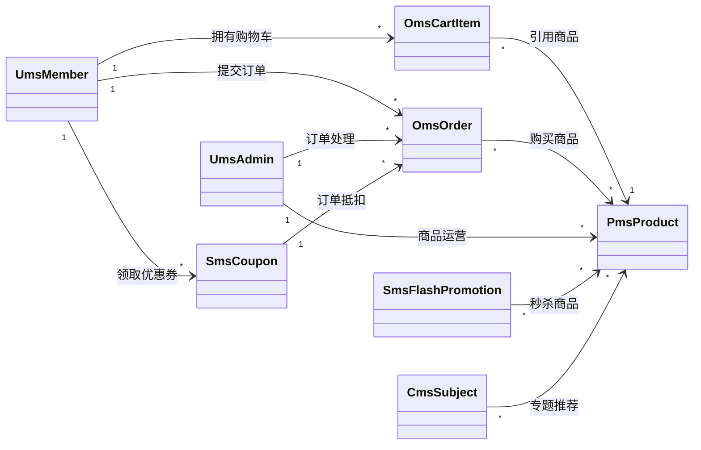
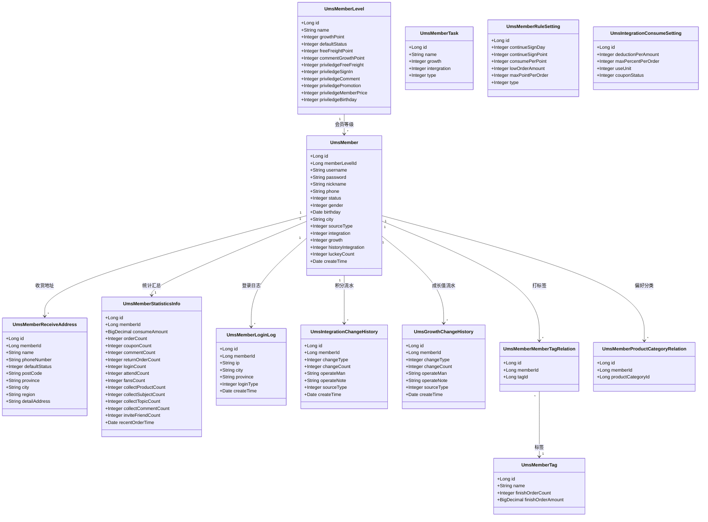
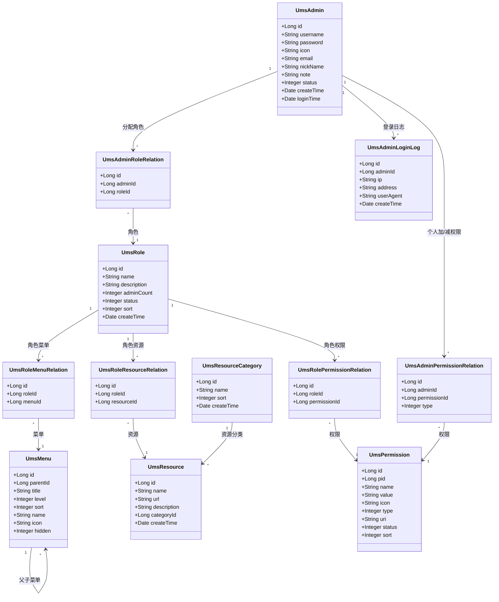
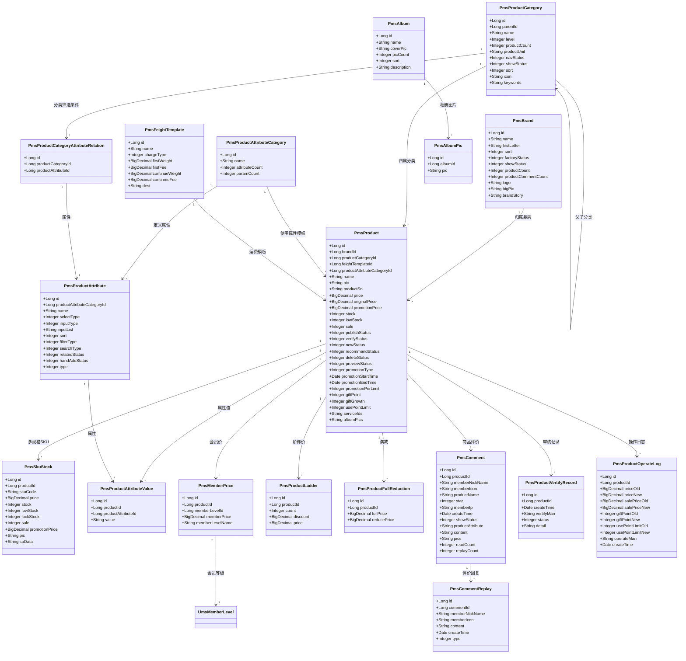
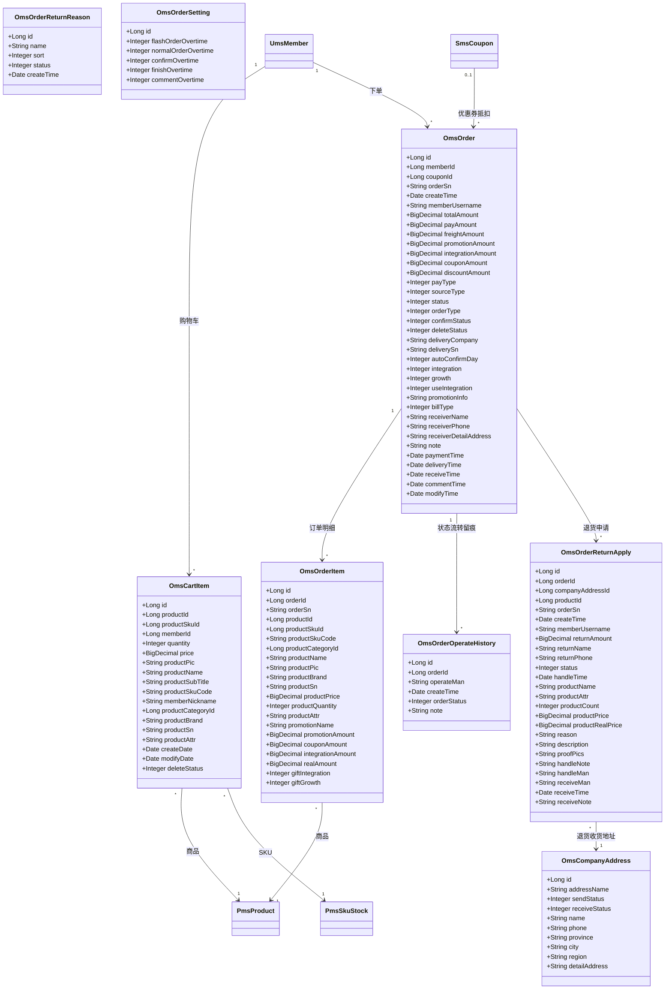
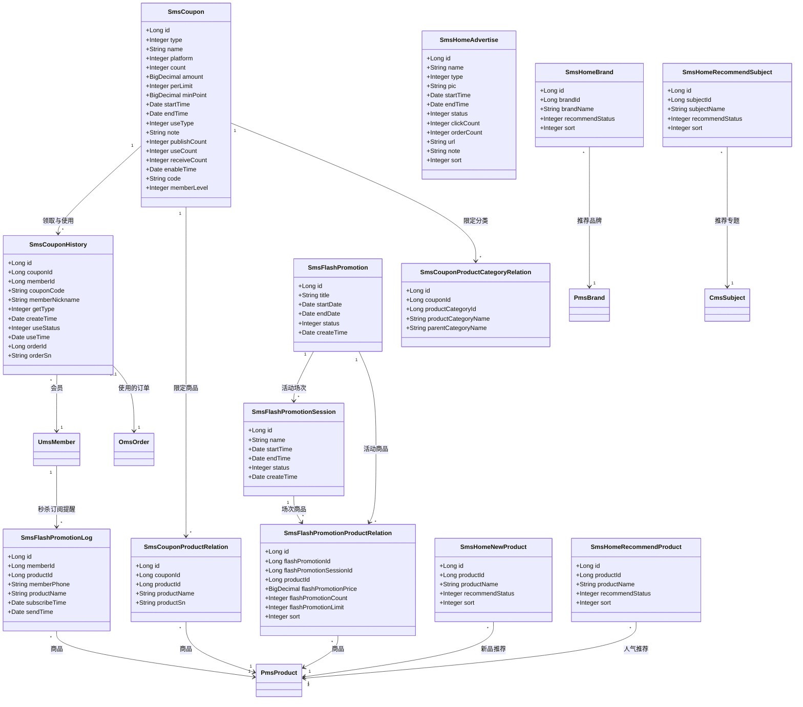
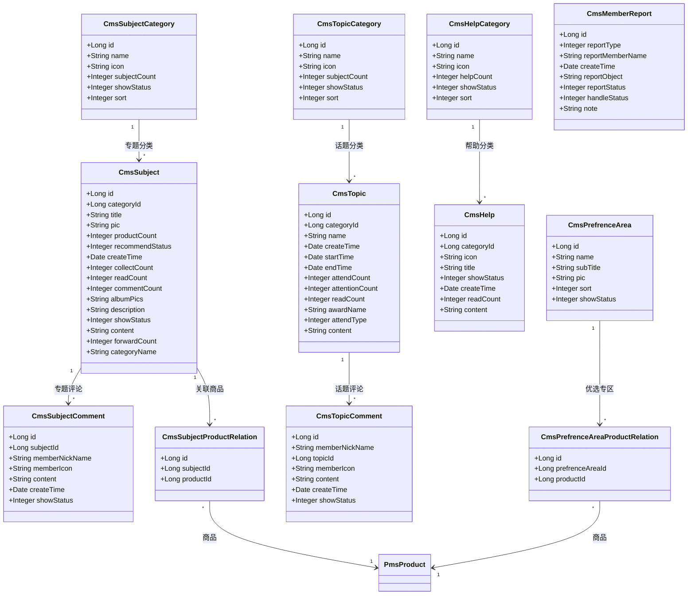

# mall-swarm 需求分析

> 本文档基于当前工作区代码与数据库脚本（`document/sql/mall.sql`，共 **76 张表 / 669 个字段 / 377 条字段业务注释**）整理。
>
> 分析方法：以数据表结构反推业务领域模型，再与各微服务的接口职责互相印证。

---

## 文档说明

| 项目 | 说明 |
| --- | --- |
| 分析对象 | `mall-swarm` 微服务商城系统 |
| 数据来源 | `document/sql/mall.sql`（权威表结构）、各模块 `controller` / `service`、Nacos 配置 |
| 表总数 | 76 张（按前缀分为 5 个业务域） |
| 外键约束 | **0 个**。表间关系全部由应用层通过 `*_id` 字段维护，数据库不做强约束 |
| 命名约定 | 表前缀即领域划分；主键统一为 `id`（bigint 自增）；关联字段统一为 `<实体>_id` |

### 领域划分

| 前缀 | 领域 | 中文 | 表数 | 对应服务 |
| --- | --- | --- | --- | --- |
| `ums` | User Management System | 用户与权限 | 25 | `mall-admin`（后台）、`mall-portal`（会员） |
| `pms` | Product Management System | 商品 | 18 | `mall-admin`、`mall-portal`、`mall-search` |
| `sms` | Sales Management System | 营销 | 13 | `mall-admin`、`mall-portal` |
| `cms` | Content Management System | 内容 | 12 | `mall-admin`、`mall-portal` |
| `oms` | Order Management System | 订单交易 | 8 | `mall-admin`、`mall-portal` |

---

## 业务背景与系统边界

系统是一套 B2C 自营商城，提供**两套相互独立的业务入口**：

1. **后台管理系统**（`mall-admin`）：面向平台运营人员，负责商品上架、订单处理、营销活动、会员与权限管理。
2. **前台商城**（`mall-portal`）：面向消费者，提供浏览、搜索、加购、下单、支付、售后、会员中心。

**系统边界**：不含自建物流与自建支付。物流以"物流公司 + 物流单号"字段形式对接第三方；支付通过支付宝 SDK 对接，微信支付仅有枚举位（`pay_type=2`）而无实现。

---

## 角色与用例

### 游客（未登录）

| 用例 | 对应接口前缀 |
| --- | --- |
| 浏览首页（轮播、推荐品牌、新品、人气推荐、推荐专题） | `/mall-portal/home/**` |
| 搜索与浏览商品、查看商品详情 | `/mall-portal/product/**` |
| 查看品牌列表与详情 | `/mall-portal/brand/**` |
| 查看专题、帮助、话题等营销内容 | `/mall-portal/**` |
| 注册、登录 | `/mall-portal/sso/register`、`/mall-portal/sso/login` |

> 网关白名单中 `/mall-portal/home|product|brand|alipay` 与 `sso/login|register|getAuthCode` 均为匿名放行，游客无需登录即可浏览商品。

### 前台会员（已登录）

| 用例 | 说明 |
| --- | --- |
| 购物车管理 | 加购、改数量、删除、按促销重新计算价格 |
| 下单结算 | 确认单、生成订单、扣减库存、锁定优惠券与积分 |
| 订单支付 | 调起支付宝、支付回调、超时未支付自动取消 |
| 订单查询与售后 | 订单列表/详情、确认收货、申请退货退款 |
| 会员中心 | 收货地址、优惠券、收藏、关注品牌、浏览记录、积分与成长值 |
| 秒杀 | 订阅提醒、限时购下单 |

### 后台管理员（已登录 + 权限校验）

| 用例 | 说明 |
| --- | --- |
| 商品管理 | 商品增删改、上下架、审核、SKU 库存、属性与分类、品牌、运费模板 |
| 订单管理 | 订单列表/详情、发货、关闭、修改金额与收货人、退货申请处理 |
| 营销管理 | 优惠券、限时购（场次/商品）、首页轮播与各类推荐位 |
| 会员管理 | 会员列表、会员等级、积分与成长值调整 |
| 权限管理 | 管理员、角色、菜单、资源、资源分类 |
| 内容管理 | 专题、优选专区、帮助 |
| 文件上传 | 阿里云 OSS（前端直传 + 回调）、MinIO |

> 管理员的接口鉴权是**接口级**的：`mall-admin` 启动时把「接口路径 → 所需资源权限」写入 Redis 的 `auth:pathResourceMap`，网关每次请求据此做 `checkPermissionOr` 校验。

---

## 功能需求

### 商品域

- **FR-PMS-01** 商品支持多级分类（`pms_product_category.parent_id` 自关联，`level` 区分 1/2 级），分类可控制是否显示在导航栏。
- **FR-PMS-02** 商品归属品牌与运费模板；运费模板按重量或按件数计费。
- **FR-PMS-03** 商品支持 SKU 多规格（`pms_sku_stock`），每个 SKU 独立编码、价格、库存、预警库存与锁定库存，销售属性以 JSON 存于 `sp_data`。
- **FR-PMS-04** 商品属性分为**规格**与**参数**两类（`pms_product_attribute.type`），支持手工录入或列表选取、单选/多选、是否作为筛选条件与检索类型。
- **FR-PMS-05** 商品具备完整生命周期状态：上架/下架、新品、推荐、审核通过、预告商品、逻辑删除。
- **FR-PMS-06** 商品支持 5 种促销定价策略（`promotion_type`）：原价、促销价、会员价、阶梯价、满减价、限时购。
- **FR-PMS-07** 会员价按会员等级设置（`pms_member_price` ← `ums_member_level`）。
- **FR-PMS-08** 商品支持评价与追评回复；评价区分会员回复与管理员回复（`pms_comment_replay.type`）。
- **FR-PMS-09** 商品修改留操作日志（价格/积分变更前后值），审核留审核记录。

### 交易域

- **FR-OMS-01** 会员可将商品加入购物车，购物车记录商品快照（名称、主图、卖点、SKU 编码、销售属性 JSON）。
- **FR-OMS-02** 下单时生成订单主表 + 订单明细，明细**冗余保存商品快照**，避免商品后续变更影响历史订单。
- **FR-OMS-03** 订单金额拆分为：商品总额、应付金额、运费、促销优惠、积分抵扣、优惠券抵扣、折扣。
- **FR-OMS-04** 订单状态机：待付款 → 待发货 → 已发货 → 已完成，另有已关闭与无效订单。
- **FR-OMS-05** 订单全流程时间戳记录：提交、支付、发货、确认收货、评价、修改。
- **FR-OMS-06** 订单操作留痕（`oms_order_operate_history`），记录操作人（用户/系统/后台管理员）与目标状态。
- **FR-OMS-07** 支持退货退款申请，含凭证图片、处理备注、处理人、收货人，状态为待处理/退货中/已完成/已拒绝。
- **FR-OMS-08** 订单超时策略集中配置（`oms_order_setting`）：秒杀订单超时、正常订单超时、自动确认收货、自动完成交易、自动好评。
- **FR-OMS-09** 支持收发货地址簿（`oms_company_address`），区分默认发货地址与默认收货地址。
- **FR-OMS-10** 支持发票信息（不开发票/电子发票/纸质发票）与抬头、内容、收票人联系方式。

### 用户与权限域

- **FR-UMS-01** 前台会员与后台管理员是**两套完全独立的账号体系**（`ums_member` / `ums_admin`），登录态通过 Sa-Token 多账号体系隔离（`memberLogin` / `login`）。
- **FR-UMS-02** 会员具备等级（`ums_member_level`），等级可配置成长值门槛与 7 项特权（免邮、签到、评论奖励、专享活动、会员价、生日等）。
- **FR-UMS-03** 会员积分与成长值的每次变动均留流水（`ums_integration_change_history` / `ums_growth_change_history`），记录增减类型、数量、来源与操作人。
- **FR-UMS-04** 积分消费规则可配置：每元抵扣积分、每单最高抵扣比例、最小使用单位、是否与优惠券同用。
- **FR-UMS-05** 会员积分与成长值获取规则可配置（`ums_member_rule_setting`），含连续签到奖励与每单最高获取点数。
- **FR-UMS-06** 会员任务体系（`ums_member_task`）区分新手任务与日常任务，完成后赠送积分与成长值。
- **FR-UMS-07** 会员统计信息（`ums_member_statistics_info`）汇总消费金额、订单数、优惠券数、评价数、退货数、登录次数、关注/粉丝数、各类收藏数。
- **FR-UMS-08** 会员可维护多个收货地址并设默认地址；可打标签、记录偏好商品分类、记录登录日志。
- **FR-UMS-09** 后台 RBAC 权限模型：管理员 → 角色 → 菜单 / 资源 / 权限；资源按分类归集。
- **FR-UMS-10** 支持在角色权限之外，对单个管理员**加减权限**（`ums_admin_permission_relation.type`）。
- **FR-UMS-11** 菜单支持无限级父子结构；权限区分目录、菜单、按钮（接口绑定权限）三级。

### 营销域

- **FR-SMS-01** 优惠券支持 4 种类型（全场赠券、会员赠券、购物赠券、注册赠券），可限定使用平台（全部/移动/PC）。
- **FR-SMS-02** 优惠券可限定使用范围：全场通用、指定分类、指定商品。
- **FR-SMS-03** 优惠券可配置发行数量、每人限领、起用金额、有效期、领取日期、可领取的会员等级、优惠码。
- **FR-SMS-04** 优惠券领取与使用留历史（`sms_coupon_history`），记录获取类型（后台赠送/主动获取）与使用状态（未使用/已使用/已过期），并关联使用订单。
- **FR-SMS-05** 限时购（秒杀）由「活动 + 场次 + 商品」三层组成：活动定义日期区间，场次定义每日时段，关系表定义每个场次下的商品、秒杀价、数量、每人限购与排序。
- **FR-SMS-06** 秒杀支持会员订阅提醒，记录手机号与订阅/发送时间（`sms_flash_promotion_log`）。
- **FR-SMS-07** 首页运营位可配置：轮播广告（区分 PC/App 位置，统计点击与下单数）、推荐品牌、新品、人气推荐商品、推荐专题。

### 内容域

- **FR-CMS-01** 专题（`cms_subject`）归属专题分类，可关联多个商品，统计阅读/评论/收藏/转发数，支持推荐状态与显示状态。
- **FR-CMS-02** 专题支持会员评论（记录昵称与头像）。
- **FR-CMS-03** 话题（`cms_topic`）归属话题分类，具备起止时间、参与人数、关注人数、奖品与参与方式。
- **FR-CMS-04** 帮助中心按帮助分类组织帮助文档，统计阅读数。
- **FR-CMS-05** 优选专区（`cms_prefrence_area`）可关联多个商品作为运营专题位。
- **FR-CMS-06** 会员举报支持三种对象（商品评价、话题内容、用户评论），记录举报状态与处理结果（无效/有效/恶意）。

---

## 领域类图

本节以 `document/sql/mall.sql` 的表结构为依据，映射为领域类（类名与 `mall-mbg` 中 MyBatis Generator 生成的 model 类名一致，命名规则为「表名去下划线转 PascalCase」）。

### 建模约定

| 约定 | 说明 |
| --- | --- |
| 类 = 表 | 一个领域类对应一张物理表，不做表合并或拆分 |
| 属性 = 字段 | 图中仅列出**业务关键字段**，审计字段（`create_time` / `modify_time`）与非关键字段从略 |
| 关联 = `*_id` | 数据库无外键，图中关联关系依据 `*_id` 字段与业务语义推导，非 DDL 强约束 |
| 多重性 | `1` 表示一，`*` 表示多，`0..1` 表示可空外键 |
| 关系表 | 中间表如实建模为独立类（如 `SmsCouponProductRelation`），保留其自身主键 |
| 跨域引用 | 图间存在共享类（如 `PmsProduct`、`UmsMember`），表示跨域逻辑引用，服务内的物理边界不变 |

> **关于冗余字段**：`oms_order_item`、`oms_cart_item`、`oms_order`、`sms_home_*`、`cms_subject` 等表大量冗余了名称/图片类字段（`product_name`、`product_pic`、`brand_name`、`category_name`）。
> 这**不是设计缺陷，而是刻意的业务需求**：订单与购物车必须保存下单时的商品快照（商品改价/下架/删除后历史订单仍要正确显示）；推荐位冗余名称则是为了免去列表查询的多表 join。二者在建模上体现为「值对象内联」而非「关联引用」。

---

### 领域总览

五个领域以 **商品（PmsProduct）** 与 **订单（OmsOrder）** 为两条主轴，用户域提供交易主体，营销域与内容域为商品和订单提供流量与优惠。

---

### 用户域（ums）· 会员子域

交易主体，承载等级、积分、成长值与会员行为。

> `UmsMemberTask`、`UmsMemberRuleSetting`、`UmsIntegrationConsumeSetting` 为**全局规则配置类**，不与单个会员关联，故在图中独立存在。

---

### 用户域（ums）· 后台权限子域

标准 RBAC：管理员 → 角色 → 菜单 / 资源 / 权限，并支持对单个管理员加减权限。

> `UmsResource.url` 是网关鉴权的关键：`mall-admin` 启动时据此构建「路径 → 权限」映射写入 Redis（`auth:pathResourceMap`）。

---

### 商品域（pms）

最复杂的领域，围绕 `PmsProduct` 聚合了分类、品牌、SKU、属性、定价与评价。

---

### 交易域（oms）

以 `OmsOrder` 为聚合根，订单明细是**不可变快照**。

> `OmsOrderReturnReason` 与退货申请**无外键关联**：申请表的 `reason` 是自由文本字段，退货原因表仅作为后台下拉选项字典使用。这一点从表结构可明确看出（`oms_order_return_apply` 无 `reason_id` 字段）。

---

### 营销域（sms）

三条业务线：优惠券、限时购、首页运营位。

---

### 内容域（cms）

> `CmsMemberReport` 是被举报对象的**多态记录**（`report_type` 决定 `report_object` 指向商品评价/话题/用户评论），因采用弱类型字符串存储，无法表达为类关联，故独立存在。

---

### 关键枚举

以下枚举值全部取自 `mall.sql` 的字段 `COMMENT`，为需求实现的权威定义。

**订单状态（`oms_order.status` / `oms_order_operate_history.order_status`）**

| 值 | 含义 |
| --- | --- |
| 0 | 待付款 |
| 1 | 待发货 |
| 2 | 已发货 |
| 3 | 已完成 |
| 4 | 已关闭 |
| 5 | 无效订单 |

**订单其他枚举**

| 字段 | 取值 |
| --- | --- |
| `pay_type` 支付方式 | 0 未支付、1 支付宝、2 微信 |
| `source_type` 订单来源 | 0 PC 订单、1 App 订单 |
| `order_type` 订单类型 | 0 正常订单、1 秒杀订单 |
| `confirm_status` 确认收货 | 0 未确认、1 已确认 |
| `bill_type` 发票类型 | 0 不开发票、1 电子发票、2 纸质发票 |
| `delete_status` 删除状态 | 0 未删除、1 已删除 |

**退货申请状态（`oms_order_return_apply.status`）**

| 值 | 含义 |
| --- | --- |
| 0 | 待处理 |
| 1 | 退货中 |
| 2 | 已完成 |
| 3 | 已拒绝 |

**商品状态（`pms_product`）**

| 字段 | 取值 |
| --- | --- |
| `publish_status` 上架状态 | 0 下架、1 上架 |
| `verify_status` 审核状态 | 0 未审核、1 审核通过 |
| `new_status` 新品状态 | 0 不是新品、1 新品 |
| `recommand_status` 推荐状态 | 0 不推荐、1 推荐 |
| `preview_status` 预告商品 | 0 不是、1 是 |
| `delete_status` 删除状态 | 0 未删除、1 已删除 |
| `promotion_type` 促销类型 | 0 原价、1 促销价、2 会员价、3 阶梯价、4 满减价、5 限时购 |

**商品属性（`pms_product_attribute`）**

| 字段 | 取值 |
| --- | --- |
| `type` 属性类型 | 0 规格、1 参数 |
| `select_type` 选择类型 | 0 唯一、1 单选、2 多选 |
| `input_type` 录入方式 | 0 手工录入、1 从列表选取 |
| `search_type` 检索类型 | 0 不检索、1 关键字检索、2 范围检索 |
| `related_status` 属性关联 | 0 不关联、1 关联 |
| `hand_add_status` 手动新增 | 0 不支持、1 支持 |

**优惠券（`sms_coupon` / `sms_coupon_history`）**

| 字段 | 取值 |
| --- | --- |
| `type` 优惠券类型 | 0 全场赠券、1 会员赠券、2 购物赠券、3 注册赠券 |
| `platform` 使用平台 | 0 全部、1 移动、2 PC |
| `use_type` 使用类型 | 0 全场通用、1 指定分类、2 指定商品 |
| `use_status` 使用状态 | 0 未使用、1 已使用、2 已过期 |
| `get_type` 获取类型 | 0 后台赠送、1 主动获取 |

**会员（`ums_member` / `ums_member_login_log`）**

| 字段 | 取值 |
| --- | --- |
| `status` 账号状态 | 0 禁用、1 启用 |
| `gender` 性别 | 0 未知、1 男、2 女 |
| `login_type` 登录类型 | 0 PC、1 Android、2 iOS、3 小程序 |

**权限（`ums_permission.type`）**

| 值 | 含义 |
| --- | --- |
| 0 | 目录 |
| 1 | 菜单 |
| 2 | 按钮（接口绑定权限） |

**积分与成长值流水（`ums_integration_change_history` / `ums_growth_change_history`）**

| 字段 | 取值 |
| --- | --- |
| `change_type` 改变类型 | 0 增加、1 减少 |
| `source_type` 来源 | 0 购物、1 管理员修改 |

**举报（`cms_member_report`）**

| 字段 | 取值 |
| --- | --- |
| `report_type` 举报类型 | 0 商品评价、1 话题内容、2 用户评论 |
| `report_status` 举报状态 | 0 未处理、1 已处理 |
| `handle_status` 处理结果 | 0 无效、1 有效、2 恶意 |

---

### 领域类与数据表对照

**用户域 ums（25 张）**

| 数据表 | 领域类 | 说明 |
| --- | --- | --- |
| `ums_admin` | `UmsAdmin` | 后台用户 |
| `ums_admin_login_log` | `UmsAdminLoginLog` | 后台用户登录日志 |
| `ums_admin_permission_relation` | `UmsAdminPermissionRelation` | 用户与权限关系（角色外的加减权限） |
| `ums_admin_role_relation` | `UmsAdminRoleRelation` | 用户与角色关系 |
| `ums_role` | `UmsRole` | 后台角色 |
| `ums_role_menu_relation` | `UmsRoleMenuRelation` | 角色与菜单关系 |
| `ums_role_permission_relation` | `UmsRolePermissionRelation` | 角色与权限关系 |
| `ums_role_resource_relation` | `UmsRoleResourceRelation` | 角色与资源关系 |
| `ums_menu` | `UmsMenu` | 后台菜单 |
| `ums_permission` | `UmsPermission` | 后台权限 |
| `ums_resource` | `UmsResource` | 后台资源（网关鉴权依据） |
| `ums_resource_category` | `UmsResourceCategory` | 资源分类 |
| `ums_member` | `UmsMember` | 会员 |
| `ums_member_level` | `UmsMemberLevel` | 会员等级 |
| `ums_member_login_log` | `UmsMemberLoginLog` | 会员登录记录 |
| `ums_member_receive_address` | `UmsMemberReceiveAddress` | 会员收货地址 |
| `ums_member_statistics_info` | `UmsMemberStatisticsInfo` | 会员统计信息 |
| `ums_member_tag` | `UmsMemberTag` | 会员标签 |
| `ums_member_member_tag_relation` | `UmsMemberMemberTagRelation` | 会员与标签关系 |
| `ums_member_product_category_relation` | `UmsMemberProductCategoryRelation` | 会员偏好商品分类 |
| `ums_member_task` | `UmsMemberTask` | 会员任务 |
| `ums_member_rule_setting` | `UmsMemberRuleSetting` | 会员积分成长规则 |
| `ums_integration_change_history` | `UmsIntegrationChangeHistory` | 积分变化历史 |
| `ums_integration_consume_setting` | `UmsIntegrationConsumeSetting` | 积分消费设置 |
| `ums_growth_change_history` | `UmsGrowthChangeHistory` | 成长值变化历史 |

**商品域 pms（18 张）**

| 数据表 | 领域类 | 说明 |
| --- | --- | --- |
| `pms_product` | `PmsProduct` | 商品（聚合根） |
| `pms_brand` | `PmsBrand` | 品牌 |
| `pms_product_category` | `PmsProductCategory` | 商品分类（自关联多级） |
| `pms_sku_stock` | `PmsSkuStock` | SKU 库存 |
| `pms_product_attribute` | `PmsProductAttribute` | 商品属性/参数 |
| `pms_product_attribute_category` | `PmsProductAttributeCategory` | 属性分类（属性模板） |
| `pms_product_attribute_value` | `PmsProductAttributeValue` | 商品属性值 |
| `pms_product_category_attribute_relation` | `PmsProductCategoryAttributeRelation` | 分类与属性关系（筛选条件） |
| `pms_member_price` | `PmsMemberPrice` | 商品会员价 |
| `pms_product_ladder` | `PmsProductLadder` | 商品阶梯价 |
| `pms_product_full_reduction` | `PmsProductFullReduction` | 商品满减 |
| `pms_feight_template` | `PmsFeightTemplate` | 运费模板 |
| `pms_comment` | `PmsComment` | 商品评价 |
| `pms_comment_replay` | `PmsCommentReplay` | 评价回复 |
| `pms_product_vertify_record` | `PmsProductVertifyRecord` | 商品审核记录 |
| `pms_product_operate_log` | `PmsProductOperateLog` | 商品操作日志 |
| `pms_album` | `PmsAlbum` | 相册 |
| `pms_album_pic` | `PmsAlbumPic` | 相册图片 |

> **表注释勘误**：`mall.sql` 中 `pms_product_operate_log` 与 `pms_product_vertify_record` 的表注释**同为「商品审核记录」**，属于脚本自身的注释重复。
> 从字段语义可明确区分：`operate_log` 记录价格/赠送积分/积分限制的新旧值（`price_old`/`price_new`、`gift_point_old`/`gift_point_new`…），是**变更操作日志**；`vertify_record` 记录 `vertify_man`、`status`、`detail`，是**审核记录**。上表按实际语义描述。

**交易域 oms（8 张）**

| 数据表 | 领域类 | 说明 |
| --- | --- | --- |
| `oms_order` | `OmsOrder` | 订单（聚合根） |
| `oms_order_item` | `OmsOrderItem` | 订单明细（商品快照） |
| `oms_cart_item` | `OmsCartItem` | 购物车 |
| `oms_order_operate_history` | `OmsOrderOperateHistory` | 订单操作历史 |
| `oms_order_return_apply` | `OmsOrderReturnApply` | 退货申请 |
| `oms_order_return_reason` | `OmsOrderReturnReason` | 退货原因字典 |
| `oms_order_setting` | `OmsOrderSetting` | 订单超时设置 |
| `oms_company_address` | `OmsCompanyAddress` | 公司收发货地址 |

**营销域 sms（13 张）**

| 数据表 | 领域类 | 说明 |
| --- | --- | --- |
| `sms_coupon` | `SmsCoupon` | 优惠券 |
| `sms_coupon_history` | `SmsCouponHistory` | 优惠券领取使用历史 |
| `sms_coupon_product_relation` | `SmsCouponProductRelation` | 优惠券与商品关系 |
| `sms_coupon_product_category_relation` | `SmsCouponProductCategoryRelation` | 优惠券与分类关系 |
| `sms_flash_promotion` | `SmsFlashPromotion` | 限时购活动 |
| `sms_flash_promotion_session` | `SmsFlashPromotionSession` | 限时购场次 |
| `sms_flash_promotion_product_relation` | `SmsFlashPromotionProductRelation` | 场次商品关系 |
| `sms_flash_promotion_log` | `SmsFlashPromotionLog` | 限时购通知记录 |
| `sms_home_advertise` | `SmsHomeAdvertise` | 首页轮播广告 |
| `sms_home_brand` | `SmsHomeBrand` | 首页推荐品牌 |
| `sms_home_new_product` | `SmsHomeNewProduct` | 首页新品 |
| `sms_home_recommend_product` | `SmsHomeRecommendProduct` | 首页人气推荐 |
| `sms_home_recommend_subject` | `SmsHomeRecommendSubject` | 首页推荐专题 |

**内容域 cms（12 张）**

| 数据表 | 领域类 | 说明 |
| --- | --- | --- |
| `cms_subject` | `CmsSubject` | 专题 |
| `cms_subject_category` | `CmsSubjectCategory` | 专题分类 |
| `cms_subject_comment` | `CmsSubjectComment` | 专题评论 |
| `cms_subject_product_relation` | `CmsSubjectProductRelation` | 专题与商品关系 |
| `cms_topic` | `CmsTopic` | 话题 |
| `cms_topic_category` | `CmsTopicCategory` | 话题分类 |
| `cms_topic_comment` | `CmsTopicComment` | 话题评论 |
| `cms_help` | `CmsHelp` | 帮助 |
| `cms_help_category` | `CmsHelpCategory` | 帮助分类 |
| `cms_prefrence_area` | `CmsPrefrenceArea` | 优选专区 |
| `cms_prefrence_area_product_relation` | `CmsPrefrenceAreaProductRelation` | 优选专区与商品关系 |
| `cms_member_report` | `CmsMemberReport` | 会员举报 |

---

## 非功能需求

### 安全

- **NFR-SEC-01** 前台会员与后台管理员登录态必须完全隔离，禁止跨端访问（Sa-Token 多账号体系，`memberLogin` / `login`）。
- **NFR-SEC-02** 后台接口须做**接口级**权限校验，不可仅校验登录态。权限规则以「路径 → 权限」形式缓存于 Redis，由网关统一拦截。
- **NFR-SEC-03** 匿名可访问的接口须显式白名单声明（网关 `secure.ignore.urls`），默认拒绝。
- **NFR-SEC-04** 密码不得明文存储；Token 通过 `Authorization: Bearer` 头传递。有效期由各服务 `sa-token.timeout` 配置决定：`mall-admin`、`mall-portal` 为 604800 秒（7 天），`mall-gateway` 为 2592000 秒（30 天）。

### 性能

- **NFR-PERF-01** 商品搜索走 Elasticsearch，不直接查 MySQL。
- **NFR-PERF-02** 高频读取数据（会员信息、管理员信息、权限规则）缓存至 Redis。
- **NFR-PERF-03** 首页、商品列表等运营位数据冗余名称字段，避免列表查询多表 join。
- **NFR-PERF-04** 秒杀等超卖敏感场景依赖 SKU 表的 `lock_stock`（锁定库存）字段实现库存隔离。

### 可靠性

- **NFR-REL-01** 订单超时取消须有**双保险**：RabbitMQ 延迟消息 + 定时任务兜底扫描。
- **NFR-REL-02** 订单明细与购物车必须保存商品快照，保证商品变更后历史数据仍可正确展示。
- **NFR-REL-03** 积分、成长值等资产类变更必须留流水，可追溯、可审计。

### 可运维性

- **NFR-OPS-01** 配置集中管理：各服务通过 Nacos 拉取 `mall-<服务>-<环境>.yaml`，支持动态刷新。
- **NFR-OPS-02** 各服务须暴露 Actuator 端点，纳入 Spring Boot Admin 监控。
- **NFR-OPS-03** 日志统一输出至 Logstash，支持集中检索。
- **NFR-OPS-04** 支持 Docker Compose 与 Kubernetes 两种部署方式。

> **配置缺口提醒**：`config/` 目录只提供了 `admin`、`demo`、`gateway`、`portal`、`search` 五个服务的配置，**缺少 `mall-auth-dev.yaml`**。
> 而 `mall-auth/src/main/resources/application-dev.yml` 中声明了 `spring.config.import: nacos:mall-auth-dev.yaml?refreshEnabled=true`，且未加 `optional:` 前缀。
> 因此按仓库现有配置直接启动 `mall-auth` 会因拉不到该配置而失败，需先在 Nacos 中手动创建该配置项。

### 兼容性

- **NFR-COMPAT-01** 前端多端复用同一套 API（PC 后台、移动端 App/H5/小程序），接口须保持契约稳定。
- **NFR-COMPAT-02** 商品与广告等运营内容须区分 PC 与移动端展示（`sms_home_advertise.type`、`sms_coupon.platform`、`pms_product.detail_mobile_html`）。

---

## 附：需求与模块对应关系

| 需求域 | 主要承载服务 | 相关模块 |
| --- | --- | --- |
| 商品域 | `mall-admin`（管理）、`mall-portal`（展示）、`mall-search`（检索） | `pms_*` |
| 交易域 | `mall-admin`（发货/售后）、`mall-portal`（下单/支付） | `oms_*` |
| 用户与权限域 | `mall-admin`（管理与鉴权数据源）、`mall-portal`（会员） | `ums_*` |
| 营销域 | `mall-admin`（配置）、`mall-portal`（领取与使用） | `sms_*` |
| 内容域 | `mall-admin`（配置）、`mall-portal`（展示） | `cms_*` |
| 认证 | `mall-auth` + `mall-gateway` | `AuthConstant`、Sa-Token 配置 |
| 监控 | `mall-monitor` | Actuator |

---

## 相关文档

- 模块说明：[`module-overview.md`](./module-overview.md)
- 数据库脚本：`../document/sql/mall.sql`
- 功能清单：`../document/reference/function.md`
- 业务架构图：`../document/resource/re_mall_business_arch.jpg`
